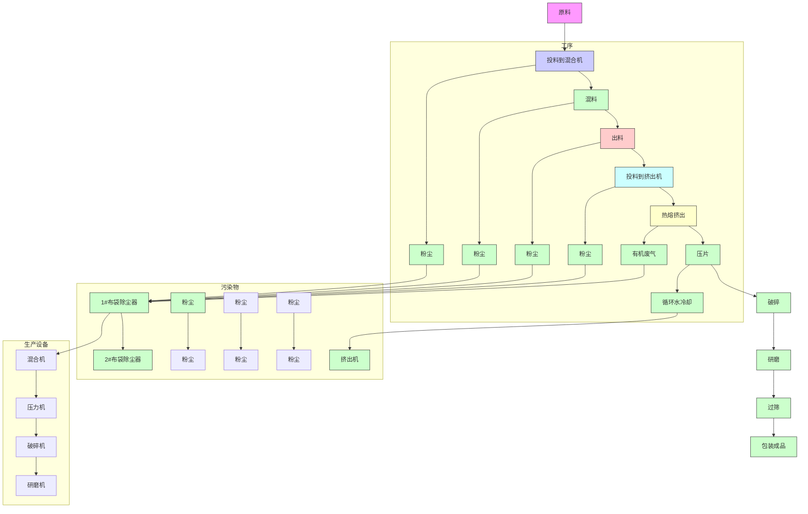

# 建设项目环境影响报告表

项目名称: 佛山市顺德区尚彩塑料五金有限公司年产 1000 吨热固性粉末涂料项目

建设单位(盖章):佛山市顺德区尚彩塑料五金有限公司

编制日期：2015年11月11日

国家环境保护部制

# 《建设项目环境影响报告表》编制说明

《建设项目环境影响报告表》由具有从事环境影响评价工作资质的单位编制。

1. 项目名称---指项目立项批复时的名称，应不超过 30 个字（两个英文字段作一个汉字）。  
2. 建设地点----指项目所在地详细地址、公路、铁路应填写起止地点。  
3.行业类别----按国标填写。  
4. 总投资----指项目投资总额。  
5.主要环境保护目标----指项目区周围一定范围内集中居民住宅、学校、医院、保护文物、风景名胜区、水源地和生态敏感点等，应尽可能给出保护目标、性质、规模和距厂界距离等。  
6. 结论与建议----给出本项目清洁生产、达标排放和总量控制的分析结论，确定污染防治措施的有效性，说明本项目对环境造成的影响，给出建设项目环境可行性的明确结论。同时提出减少环境影响的其它建议。  
7. 预审意见----由行业主管部门填写答复意见，无主管部门项目，可不填。  
8.审批意见----由负责审批该项目的环境保护行政主管部门批复。

# 建设项目环境影响评价资质证书

机构名称：佛山市顺德环境科学研究所有限公司

住所：广东省佛山市顺德区大良街道新城区兴业路2号

法定代表人：洪伟

证书等级：乙级

证书编号：国环评证乙字第2811号

有效期：至2016年1月16日

评价范围：环境影响报告书类别 — 轻工纺织化纤；化工石化医药；交通运输

环境影响报告表类别 — 一般项目环境影响报告表\*\*\*

（加盖评价单位印章生效）

text_image

环境科学研究
上海交通大学
电子科学研究所
有限公司
4906060936834

项目名称：佛山市顺德区尚彩塑料五金有限公司年产1000吨热固性粉末涂料项目

文件类型： 环境影响报告表

适用的评价范围：一般环境影响报告表

法定代表人：洪伟 (签章)

主持编制机构：广东顺德环境科学研究院有限公司（签章）

text_image

(签章)
环境科学研究院
有限公司（签章）
一
二
三
四
五
六
七
八
九
十
1
2
3
4
5
6
7
8
9
10
11
12
13
14
15
16
17
18
19
20
21
22
23
24
25
26
27
28
29
30
31
32
33
34
35
36
37
38
39
40
41
42
43
44
45
46
47
48
49
50
51
52
53
54
55
56
57
58
59
60
61
62
63
64
65
66
67
68
69
70
71
72
73
74
75
76
77
78
79
80
81
82
83
84
85
86
87
88
89
90
91
92
93
94
95
96
97
98
99
100

# 佛山市顺德区尚彩塑料五金有限公司年产1000吨热固性粉末涂料项目

环境影响报告表 编制人员名单表

<table><tr><td rowspan="2" colspan="2">编制主持人</td><td>姓名</td><td>职(执)业资格证书编号</td><td>登记(注册证)编号</td><td>专业类别</td><td>本人签名</td></tr><tr><td>赵崇敬</td><td>0004580</td><td>B28110040400</td><td>化工石化医药</td><td></td></tr><tr><td rowspan="4">主要编制人员情况</td><td>序号</td><td>姓名</td><td>职(执)业资格证书编号</td><td>登记(注册证)编号</td><td>编制内容</td><td>本人签名</td></tr><tr><td>1</td><td>赵崇敬</td><td>0004580</td><td>B28110040400</td><td>项目概况、自然社会环境简况、环境质量状况、评价标准、工程分析、主要污染物产生及排放情况、环境影响分析、环境保护措施、结论与建议、相关附件</td><td></td></tr><tr><td>2</td><td>梁志谦</td><td>0004579</td><td>B28110061000</td><td>审核</td><td>###</td></tr><tr><td>3</td><td>罗昌盛</td><td>0006721</td><td>B28110080900</td><td>审定</td><td></td></tr></table>

# 目录

一、建设项目基本情况....1  
二、建设项目所在地自然环境社会环境简况……4  
三、环境质量状况....7  
四、评价适用标准....10  
五、建设项目工程分析....12  
六、项目主要污染物产生及预计排放情况....17  
七、环境影响分析....18  
八、建设项目拟采取的防治措施及预期治理效果....25  
九、结论与建议....26

附件1 建设项目环境保护审批登记表....30  
附件2 营业执照 32   
附件3 经营场所使用证明....33  
附件4 宗地图....34  
附件5 租赁合同....35   
附件6 建设项目挥发性有机污染物排放总量分配表....39  
附件7 佛山市顺德区德福生金属粉末有限公司总VOCs监测报告....41  
附图1 项目地理位置图....44  
附图2 项目周围环境、噪声现状监测布点图、卫生防护距离包络线图....45  
附图3 平面布置图....46

广东顺德环境科学研究院有限公司

广东顺德环境科学研究院有限公司

广东顺德环境科学研究院有限公司

# 一、建设项目基本情况

<table><tr><td>项目名称</td><td colspan="9">佛山市顺德区尚彩塑料五金有限公司年产1000吨热固性粉末涂料项目</td></tr><tr><td>建设单位</td><td colspan="9">佛山市顺德区尚彩塑料五金有限公司</td></tr><tr><td>法人代表</td><td colspan="4">黄**</td><td colspan="2">联系人</td><td colspan="3">郭先生</td></tr><tr><td>通讯地址</td><td colspan="9">顺德区勒流新启工业区发展八路1号</td></tr><tr><td>联系电话</td><td colspan="2">1370282****</td><td colspan="2">传真</td><td colspan="3">29280833</td><td>邮政编码</td><td>528300</td></tr><tr><td>建设地点</td><td colspan="9">顺德区勒流新启工业区发展八路1号</td></tr><tr><td colspan="2">立项审批部门</td><td colspan="3"></td><td colspan="2">批准文号</td><td colspan="3"></td></tr><tr><td>建设性质</td><td colspan="3">☑新建 ☐改扩建☐变更</td><td colspan="2">行业类别及代码</td><td colspan="4">C26 化学原料和化学制品制造业</td></tr><tr><td colspan="2">占地面积(平方米)</td><td colspan="3">2161</td><td colspan="3">经营面积(平方米)</td><td colspan="2">2135</td></tr><tr><td>总投资(万元)</td><td colspan="2">50</td><td colspan="2">环保投资(万元)</td><td colspan="2">10</td><td colspan="2">环保投资占总投资比例</td><td>20%</td></tr><tr><td colspan="2">评价经费(万元)</td><td colspan="3">2.0</td><td colspan="3">投产日期</td><td colspan="2">2015年</td></tr><tr><td colspan="10">工程内容及规模:1、项目由来佛山市顺德区尚彩塑料五金有限公司(以下简称“本项目”)位于顺德区勒流新启工业区发展八路1号(其地理位置见附图1),中心地理位置坐标为北纬22.802978°,东经113.209898°,主要从事粉末涂料的生产、销售。根据《中华人民共和国环境保护法》、《中华人民共和国环境影响评价法》、国务院令第253号《建设项目环境保护管理条例》等有关法律法规的规定,本项目须执行环境影响审批制度,根据环境保护部2015年第33号令《建设项目环境影响评价分类管理名录》,本项目属于“L石化、化工”中的“85、涂料制造(单纯混合或分装)”,需编制建设项目环境影响报告表。现申请办理相关的环保审批手续。2、工程内容及规模项目从业人数15人,年工作日264天,每天工作8小时。项目不设饭堂、宿舍。项目工程组成见下表1.1。</td></tr></table>

表 1.1 项目工程组成

<table><tr><td>项目</td><td>内容</td></tr><tr><td>主体工程</td><td>生产车间1个(面积 $1200m^{2}$ )</td></tr><tr><td>辅助工程</td><td>办公室2个</td></tr><tr><td>仓储工程</td><td>原料仓库2个,成品储存区1个</td></tr><tr><td rowspan="2">公用工程</td><td>配电系统一套</td></tr><tr><td>给排水系统一套,冷却水循环系统两套</td></tr><tr><td>环保工程</td><td>1、生活污水经独立的生活污水处理设施处理后排至附近内河涌。2、设有2套布袋除尘器,其中混料粉尘通过1#布袋除尘器处理,挤出机投料和研磨粉尘通过2#布袋除尘器处理。</td></tr></table>

项目主要设备、原辅材料、能耗情况见下表。

表 1.2 项目主要设备一览表

<table><tr><td>类别</td><td>名称</td><td>单位</td><td>数量</td><td>备注</td></tr><tr><td>产品</td><td>热固性粉末涂料</td><td>吨/年</td><td>1000</td><td></td></tr><tr><td rowspan="9">主要生产设备</td><td>混合机</td><td>台</td><td>6</td><td></td></tr><tr><td>挤出机</td><td>台</td><td>6</td><td></td></tr><tr><td>压片机</td><td>台</td><td>6</td><td></td></tr><tr><td>破碎机</td><td>台</td><td>6</td><td></td></tr><tr><td>研磨机</td><td>台</td><td>6</td><td></td></tr><tr><td>试验用挤出机</td><td>台</td><td>2</td><td></td></tr><tr><td>试验用研磨机</td><td>台</td><td>1</td><td></td></tr><tr><td>试验用喷枪</td><td>台</td><td>1</td><td></td></tr><tr><td>试验用烘箱</td><td>台</td><td>2</td><td></td></tr><tr><td rowspan="5">主要原辅材料用量</td><td>环氧树脂</td><td>吨/年</td><td>350</td><td>小片状,袋装</td></tr><tr><td>聚酯树脂</td><td>吨/年</td><td>350</td><td>小片状,袋装</td></tr><tr><td>钛白粉</td><td>吨/年</td><td>100</td><td>粉状,袋装</td></tr><tr><td>碳酸钙</td><td>吨/年</td><td>150</td><td>粉状,袋装</td></tr><tr><td>有机颜料</td><td>吨/年</td><td>50</td><td>粉状,袋装</td></tr><tr><td rowspan="3">能耗和水耗</td><td>电</td><td>千瓦时/年</td><td>10万</td><td></td></tr><tr><td>生活用水</td><td>立方米/年</td><td>158</td><td></td></tr><tr><td>冷却水</td><td>立方米/年</td><td>4224</td><td></td></tr></table>

# 与本项目有关的原有污染源情况及主要环境问题：

本项目位于顺德区勒流新启工业区发展八路1号。项目东面为工业厂房，南面为杏良路，西面为鱼塘，北面为工业厂房（项目四置图见附图2）。

本项目所在地周围污染源为附近工业企业产生的生产废气、废水、工业噪声，工业区道路的交通噪声和来往车辆的废气等。

# 二、建设项目所在地自然环境社会环境简况

自然环境简况（地形、地貌、地质、气候、气象、水文、植被、生物多样性等）：

本项目所在地属珠江三角洲冲积平原，地势平坦，由西江、北江泥沙长期淤积而成，平均海拔约1.4m（黄海高程系）。项目位于北回归线以南，属于南亚热带海洋性季风气候区。近20年月平均最高气温为30.89℃，最低气温为10.8℃，月平均最高气温多在7月，最低气温多在1月份。最近的三年出现的月平均最高气温为30.89℃，出现在2014年的7月份；最低气温12.3℃，出现2012年的1月份。近20年间最大月平均风速为3.1米/秒，最小月平均风速为1.2米/秒，20年的月平均风速度为1.2～3.1米/秒，分别为7月和6月。2014年平均主导风向为北风（N），次主导风为南（S）和东南风（SE），所占比例分别为：9.21%、9.18%和8.32%。近20年平均主导风向为南东南风（SSE），次主导风为北西北（NNW）和东南风（SE），所占比例分别为：11%、10%和9%。对顺德区气象站近20年气候资料进行统计分析，其极端气候条件见表7-2-3，统计得出该地区年最大风速在7～14.3米/秒之间，年最高气温在36～38.7℃之间，年最低气温2.7～8.4℃之间，年平均相对温度在70～79%之间，年总降雨量1215.1～2403.3毫米，24小时最大降雨量71.9～257.8毫米。

顺德区有北江和西江两大水系，水系总流向为自西北向东南方向。境内河流纵横交错，主要河流自北向南有东平水道、陈村水道、顺德水道、顺德支流、、容桂水道、东海水道等16条，总长212公里，水面积73.4平方公里。境内水系全程均受潮汐影响，属混合潮中的非正规半日周潮型。

顺德水道常水位 0.3\~1.40 米之间，枯水位在 -0.8\~0.2 米之间，最高水位为 6.19 米（94 年 6 月 19 日）；西江顺德支流常水位 0.8\~1.50 米之间，枯水位在 -0.6\~0.3 米之间，最高水位为 6.80 米（94 年 6 月 19 日）。目前两河流顺德段水质良好，受洪水及潮汐影响较明显，平水期和枯水期涨潮时会产生逆流。

本区植被较简单，以平原农林生态系统中农林绿化植物群落为主。

本区无珍稀野生动、植物。

# 社会环境简况（社会经济结构、教育、文化、文物保护等）：

佛山市顺德区位于珠江三角洲中部，靠近广州、中山、深圳、江门等大中城市，毗邻港澳，距离香港150公里、澳门78公里，面积806.6平方公里。全区现有10个镇（街道），109个行政村，88个居委会，常住人口110.96万人，其中非农业人口64.83万人，从业人员人数73.78万人，流动人口60万人，旅居港澳台的乡亲及国外华侨40多万人。2014年，全区全年实现地区生产总值2765亿元，增长8.6%；工业总产值6440.4亿元，增长9.1%；全社会固定资产投资550.4亿元，增长15.1%；社会消费品零售总额826.3亿元，增长13.2%；外贸出口总值206.4亿美元，增长10.5%；地方公共财政预算收入173.9亿元，增长12.9%。

2014 年，勒流实现规模以上工业总产值 564.38 亿元，同比增长 11.04%；全社会固定资产累计完成投资额 35.01 亿元，同比增长 15.58%，税收（含国税调库数）完成 21.35 亿元，同比增长 8.45%。

本项目所在区域环境功能属性见下表 2.1:

表 2.1 建设项目评价区域环境功能属性

<table><tr><td>编号</td><td>项目</td><td>类别及属性</td></tr><tr><td>1</td><td>水环境功能区</td><td>冲鹤大涌执行《地表水环境质量标准》(GB3838-2002)中V类标准;地下水执行《地下水质量标准》(GB/T 14848—93)中V类标准</td></tr><tr><td>2</td><td>环境空气质量功能区</td><td>属大气二类区域;执行《环境空气质量标准》(GB3095-2012)</td></tr><tr><td>3</td><td>声环境功能区</td><td>属2类功能区;执行《声环境质量标准》(GB3096-2008)中的2类标准</td></tr><tr><td>4</td><td>是否基本农田保护区</td><td>否</td></tr><tr><td>5</td><td>是否风景名胜区</td><td>否</td></tr><tr><td>6</td><td>是否自然保护区</td><td>否</td></tr><tr><td>7</td><td>是否森林公园</td><td>否</td></tr><tr><td>8</td><td>是否生 功能保护区</td><td>否</td></tr><tr><td>9</td><td>是否水土流失重点防护区</td><td>否</td></tr><tr><td>10</td><td>是否人口密集区</td><td>否</td></tr><tr><td>11</td><td>是否生态敏感与脆弱区</td><td>否</td></tr><tr><td>12</td><td>是否重点文物保护单位</td><td>否</td></tr><tr><td>13</td><td>是否三河、三湖、两控区</td><td>两控区</td></tr><tr><td>14</td><td>是否水库库区</td><td>否</td></tr><tr><td>15</td><td>是否水源保护区</td><td>否</td></tr><tr><td>16</td><td>是否污水处理厂纳污范围</td><td>否</td></tr></table>

# 三、环境质量状况

建设项目所在地区域环境质量现状及主要环境问题（环境空气、地表水、地下水、声环境、生态环境等）

# 1、大气环境质量现状

为评价本项目所在区域的环境空气质量现状，采用顺德区环境保护监测站 2014 年对勒流街道常规监测的数据。监测项目为二氧化硫 $\left(\mathrm{SO}_{2}\right)$ 、二氧化氮 $\left(\mathrm{NO}_{2}\right)$ 、 $PM_{10}$ 。该地区空气质量执行《环境空气质量标准》（GB3095-2012）中的二级标准。自动监测站监测结果及评价如下表。

表 3.1 2014 年勒流大气环境质量检测结果

<table><tr><td rowspan="2">污染物</td><td colspan="3">24小时平均值</td><td colspan="3">年平均值</td></tr><tr><td>百分位数值 $\mu g/m^3$ </td><td>标准值 $\mu g/m^3$ </td><td>达标率%</td><td>浓度 $\mu g/m^3$ </td><td>标准值 $\mu g/m^3$ </td><td>超标倍数</td></tr><tr><td> $SO_2$ </td><td>56</td><td>150</td><td>100%</td><td>24</td><td>60</td><td>0</td></tr><tr><td> $NO_2$ </td><td>125</td><td>80</td><td>85.1%</td><td>51</td><td>40</td><td>0.28</td></tr><tr><td> $PM_{10}$ </td><td>181</td><td>150</td><td>92.4%</td><td>73</td><td>70</td><td>0.04</td></tr><tr><td> $PM_{2.5}$ </td><td>114</td><td>75</td><td>83.1%</td><td>48</td><td>35</td><td>0.37</td></tr></table>

从监测数据统计结果来分析, 勒流街道大气污染物除 $SO_{2}$ 的 24 小时平均值和年均值达到《环境空气质量标准》(GB3095-2012) 的二级标准外, 其它污染物 $NO_{2}$ 、 $PM_{10}$ 、 $PM_{2.5}$ 的 24 小时平均值和年平均值都有不同程度的超标。

# 2、地表水环境质量现状

本项目外排废水主要为员工的生活污水。生活污水经项目内独立的生活污水处理设施处理达标后排入冲鹤大涌。内河涌水质标准执行《地表水环境质量标准》（GB3838—2002）之Ⅳ类标准。采用顺德区环境保护监测站2014年对勒流街道内河涌的常规监测数据进行评价，各项目的监测结果如下。

备注：“L”为小于检出限。  
表 3.2 2014 年勒流街道内河监测结果  
单位：mg/L（粪大肠菌群:个/L，pH无量纲）

<table><tr><td>断面名称</td><td colspan="2">扶闾闸头</td><td colspan="2">光明路尾段</td><td colspan="2">江村桥段</td><td rowspan="3">最低检出限</td><td rowspan="3">GB3838-2002IV类标准</td></tr><tr><td></td><td>监测数据</td><td>超标率</td><td>监测数据</td><td>超标率</td><td>监测数据</td><td>超标率</td></tr><tr><td>监测日期</td><td colspan="2">2014-8-12</td><td colspan="2">2014-8-12</td><td colspan="2">2014-8-12</td></tr><tr><td>水温</td><td>30.1</td><td>--</td><td>30.1</td><td>--</td><td>30.1</td><td>--</td><td>-</td><td>--</td></tr><tr><td>pH</td><td>7.18</td><td>0%</td><td>7.17</td><td>0%</td><td>7.18</td><td>0%</td><td>0.01</td><td>6-9</td></tr><tr><td>DO</td><td>5.50</td><td>0%</td><td>5.41</td><td>0%</td><td>5.34</td><td>0%</td><td>0.2</td><td>&gt;3</td></tr><tr><td>高锰酸盐指数</td><td>2.5</td><td>0%</td><td>4.0</td><td>0%</td><td>3.4</td><td>0%</td><td>0.5</td><td>&lt;10</td></tr><tr><td> $BOD_{5}$ </td><td>2.9</td><td>0%</td><td>2.5</td><td>0%</td><td>7.1</td><td>18%</td><td>2</td><td>&lt;6</td></tr><tr><td>氨氮</td><td>0.429</td><td>0%</td><td>0.467</td><td>0%</td><td>0.930</td><td>0%</td><td>0.025</td><td>&lt;1.5</td></tr><tr><td>挥发酚</td><td>0.0005</td><td>0%</td><td>0.0015</td><td>0%</td><td>0.0006</td><td>0%</td><td>0.002</td><td>&lt;0.005</td></tr><tr><td>砷</td><td>0.0032</td><td>0%</td><td>0.0033</td><td>0%</td><td>0.0037</td><td>0%</td><td>0.0002</td><td>&lt;0.05</td></tr><tr><td>铜</td><td>0.0021</td><td>0%</td><td>0.0016</td><td>0%</td><td>0.0020</td><td>0%</td><td>0.0010</td><td>&lt;1</td></tr><tr><td>石油类</td><td>0.11</td><td>0%</td><td>0.09</td><td>0%</td><td>0.08</td><td>0%</td><td>0.01</td><td>&lt;0.5</td></tr><tr><td>氟化物</td><td>0.13</td><td>0%</td><td>0.12</td><td>0%</td><td>0.12</td><td>0%</td><td>0.05</td><td>&lt;1.5</td></tr><tr><td>粪大肠菌群</td><td>240000</td><td>1100%</td><td>240000</td><td>1100%</td><td>240000</td><td>1100%</td><td>200</td><td>&lt;20000</td></tr><tr><td>CODcr</td><td>8.72</td><td>0%</td><td>8.85</td><td>0%</td><td>20.7</td><td>0%</td><td>5</td><td>&lt;30</td></tr><tr><td>LAS</td><td>0.09</td><td>0%</td><td>0.08</td><td>0%</td><td>0.08</td><td>0%</td><td>0.05</td><td>&lt;0.3</td></tr><tr><td>硫化物</td><td>0.010</td><td>0%</td><td>0.019</td><td>0%</td><td>0.025</td><td>0%</td><td>0.005</td><td>&lt;0.5</td></tr><tr><td>总磷</td><td>0.094</td><td>0%</td><td>0.200</td><td>0%</td><td>0.278</td><td>0%</td><td>0.010</td><td>&lt;0.3</td></tr><tr><td>氰化物</td><td>0.004L</td><td>0%</td><td>0.004L</td><td>0%</td><td>0.004L</td><td>0%</td><td>0.004</td><td>0.2</td></tr><tr><td>汞</td><td>0.00002L</td><td>0%</td><td>0.00002L</td><td>0%</td><td>0.00002L</td><td>0%</td><td>0.00002</td><td>0</td></tr><tr><td>六价铬</td><td>0.004L</td><td>0%</td><td>0.004L</td><td>0%</td><td>0.004L</td><td>0%</td><td>0.004</td><td>0.05</td></tr><tr><td>铅</td><td>0.01L</td><td>0%</td><td>0.01L</td><td>0%</td><td>0.01L</td><td>0%</td><td>0.01</td><td>0.05</td></tr><tr><td>镉</td><td>0.001L</td><td>0%</td><td>0.001L</td><td>0%</td><td>0.001L</td><td>0%</td><td>0.001</td><td>0.01</td></tr><tr><td>锌</td><td>0.02L</td><td>0%</td><td>0.02L</td><td>0%</td><td>0.02L</td><td>0%</td><td>0.02</td><td>2</td></tr><tr><td>硒</td><td>0.003L</td><td>0%</td><td>0.003L</td><td>0%</td><td>0.003L</td><td>0%</td><td>0.003</td><td>0.02</td></tr></table>

从监测数据统计结果来分析，勒流街道2014年部分内河涌存在粪大肠菌群和 $\mathrm{BOD}_5$ 两个指标有不同程度超出GB3838-2002之IV类水质标准现象，其它指标均达到了GB3838-2002之IV类水质标准。随着勒流污水处理厂纳污范围的不断扩大，勒流分散式农村污水处理的实施，勒流街道内河涌的水质将会继续改善。

# 3、声环境质量现状

为了了解项目所在地声环境质量现状，在项目所在地布设4个监测点（见附图2），对附近区域的声环境进行现场实测。参照国家标准GB3096-2008的要求进行噪声自动监测，监测结果如下所示[单位：dB（A）]。

表3.3 项目厂界声环境监测数据  
(单位: dB (A)) 

<table><tr><td>测点编号</td><td>时段</td><td> $L_{eq}$ </td><td>标准</td><td>备注</td></tr><tr><td rowspan="2">1#</td><td>昼</td><td>63.2</td><td>2类,60</td><td>超标</td></tr><tr><td>夜</td><td>47.6</td><td>2类,50</td><td>达标</td></tr><tr><td rowspan="2">2#</td><td>昼</td><td>62.5</td><td>2类,60</td><td>超标</td></tr><tr><td>夜</td><td>48.6</td><td>2类,50</td><td>达标</td></tr><tr><td rowspan="2">3#</td><td>昼</td><td>61.2</td><td>2类,60</td><td>超标</td></tr><tr><td>夜</td><td>46.1</td><td>2类,50</td><td>达标</td></tr><tr><td rowspan="2">4#</td><td>昼</td><td>64.5</td><td>2类,60</td><td>超标</td></tr><tr><td>夜</td><td>47.1</td><td>2类,50</td><td>达标</td></tr></table>

从上表可以看出，本项目周围昼间噪声超标，夜间噪声均能达标，主要是受到运输车辆的交通噪声影响所致，项目所在地声环境质量现状部分满足区域声功能要求。

项目周围主要环境保护目标见下表:

表 3-5 主要环境保护目标

<table><tr><td>序号</td><td>名称</td><td>距离厂边界最近距离</td><td>受影响规模</td><td>方位</td><td>保护类别</td></tr><tr><td>1</td><td>冲鹤大涌</td><td>220米</td><td>----</td><td>西面</td><td>水环境IV类</td></tr><tr><td>2</td><td>大气环境</td><td>---</td><td>---</td><td>---</td><td>二级</td></tr><tr><td>3</td><td>噪声</td><td>---</td><td>---</td><td>---</td><td>2类</td></tr><tr><td>4</td><td>富安中学</td><td>145米</td><td>1700人</td><td>东面</td><td>大气二级,声2类</td></tr></table>

# 四、评价适用标准

<table><tr><td rowspan="10">环境质量标准</td><td colspan="9">1、环境空气质量:执行《环境空气质量标准》(GB3095-2012年)中的二级标准。表4.1 环境空气质量标准 单位: $\mu g/m^3$ (TVOC为 $mg/m^3$ )</td></tr><tr><td colspan="2">污染物</td><td> $SO_2$ </td><td> $NO_2$ </td><td> $PM_{10}$ </td><td>TSP</td><td> $PM_{2.5}$ </td><td colspan="2">TVOC</td></tr><tr><td colspan="2">年平均</td><td>60</td><td>40</td><td>70</td><td>200</td><td>35</td><td colspan="2">--</td></tr><tr><td colspan="2">24小时平均</td><td>150</td><td>80</td><td>150</td><td>300</td><td>75</td><td colspan="2">--</td></tr><tr><td colspan="2">1小时平均</td><td>500</td><td>200</td><td>--</td><td>--</td><td>--</td><td colspan="2">--</td></tr><tr><td colspan="2">8小时均值</td><td>--</td><td>--</td><td>--</td><td>--</td><td>--</td><td colspan="2">0.6</td></tr><tr><td colspan="9">2、地表水环境质量标准:内河涌执行《地表水环境质量标准》(GB3838-2002)之IV类标准。表4.2 地表水IV水体质量标准 单位:pH无量纲,其余mg/L</td></tr><tr><td>指标</td><td>pH</td><td> $COD_{cr}$ </td><td> $BOD_5$ </td><td>DO</td><td> $NH_3-N$ </td><td>磷酸盐</td><td>石油类</td><td>LAS</td></tr><tr><td>IV类标准值</td><td>6-9</td><td>≤30</td><td>≤6</td><td>≥3</td><td>≤1.5</td><td>≤0.3</td><td>≤0.5</td><td>≤0.3</td></tr><tr><td colspan="9">3、地下水环境质量标准:地下水水质执行《地下水质量标准》(GB14848-93)中的V类标准。4、声环境质量标准:执行《声环境质量标准》(GB3096-2008)中2类标准:昼间≤60dB(A)、夜间≤50dB(A)。</td></tr><tr><td>污染物排放标准</td><td colspan="9">1、水污染物排放标准:生活污水排放执行《城镇污水处理厂污染物排放标准》(GB18918-2002)中的二级标准,即CODcr最高允许排放浓度为100mg/L, $BOD_5$ 最高允许排放浓度为30mg/L, $NH_3-N$ 最高允许排放浓度为25mg/L。2、大气污染物排放标准:(1)根据《顺德区环境运输和城市管理局转发关于印发2014年佛山市陶瓷行业、玻璃制造行业、铝型材行业和总VOCs排放企业整治方案的通知》(顺管函[2014]510号),本项目产生的有机废气参照执行广东省地方标准《家具制造行业挥发性有机化合物排放标准》(DB44/814-2010)第II时段排气筒排放限值及无组织排放标准。(2)颗粒物执行《大气污染物排放限值标准》(DB44/27-2001)中二级标准(第二时段)。具体标准见表4.3。</td></tr><tr><td rowspan="5"></td><td colspan="9">表4.3 废气污染物排放标准</td></tr><tr><td>污染物</td><td>最高允许排放浓度(mg/m3)</td><td>最高允许排放速率(kg/h)</td><td>无组织排放监控点浓度限值(mg/m3)</td><td colspan="5">标准</td></tr><tr><td>颗粒物</td><td>120</td><td>2.9</td><td>1.0</td><td colspan="5">DB44/27-2001</td></tr><tr><td>总VOCs</td><td>30</td><td>2.9</td><td>2.0</td><td colspan="5">DB44/814-2010</td></tr><tr><td colspan="9">3、噪声排放标准:执行《工业企业厂界环境噪声排放标准》(GB12348-2008)中的2类标准:昼间等效声级≤60dB(A)、夜间等效声级≤50dB(A)。4、固体废物污染控制:《一般工业固体废物储存、处置场污染控制标准》(GB18599-2001)、《国家危险废物名录》、《危险废物贮存污染控制标准》(GB18597-2001)及其2013年修改单。</td></tr><tr><td>总量控制指标</td><td colspan="9">(1)项目生活污水排放量为 $142m^{3}/a$ ,CODCr排放量为 $14.2kg/a$ , $NH_{3}-N$ 排放量为 $3.6kg/a$ 。项目的生活污水排入内河涌,远期排至勒流污水处理厂,建议不分配总量。(2)本项目的总VOCs排放总量为 $63kg/a$ ,其中有组织排放量为 $56.7kg/a$ ,无组织排放量为 $6.3kg/a$ 。建议总VOCs总量为 $56.7kg/a$ 。本项目已获得镇街分配的总VOCs排放总量。</td></tr></table>

# 五、建设项目工程分析

# 1. 工艺流程简述（图示）:

flowchart

图 5.1 生产工艺流程图

首先，根据不同产品的特点，按照配方把相应的原辅料进行配料，然后加入混料机中搅拌均匀，混料机运行时密闭混料。接着人工把混合均匀的物料投加到挤出机进料口中，在挤出机中进行加热（用电加热），加热温度约90\~120℃。热熔后的物料挤出后进行压片，压片机内通入冷却循环水间接冷却物料，物料压片初步降温后再经输送带送入后续风冷工段，风冷后形成带状的物料。压片机末端配套一个带有齿轮的滚筒，带状涂料经过滚筒后破碎成片状。随后，人工把片状涂料投入粉碎机中进行研磨，研磨到相应的粉末颗粒大小后进行过筛，即可包装外销。

另外，项目生产出来的产品需要进行试验，故设有小型实验室，内设喷枪、喷粉柜和烘箱，模拟喷粉工艺，在喷粉柜内对工件喷粉，然后放进电烘箱固化。

# 2. 产业政策及法律法规符合性分析

根据国家《产业结构调整指导目录（2011年本）》和2013年5月1日起施行的《国家发展改革委关于修改<产业结构调整指导目录（2011年本）>有关条款的决定》、《珠江三角洲地区产业结构调整优化和产业导向目录》（2011年本）、佛山市发展和改革局文件《关于印发佛山市产业结构调整指导目录（限制和淘汰类）的通知》（佛发改工交[2010]101号）和《关于印发佛山市产业结构调整指导目录（鼓励类）的通知》（佛发改工交[2010]49号）的规定，项目不属于上述目录所列的鼓励类、限制类和禁止（淘汰）类项目，根据《促进产业结构调整暂行规定》（国发[2005]40号）第十三条，项目属于允许类，且符合国家有关法律、法规和政策规定。因此，项目符合相关的产业政策要求。

项目排放少量 VOCs，VOCs 排放总量指标分配申请已获批准，符合《顺德区环境保护委员会关于印发顺德区工业挥发性有机物（VOCs）项目审批总量前置实施细则（试行）的通知》(顺环委〔2014〕5号)文件要求（VOCs 排放总量指标分配申请表见附件 7)。

项目所在地为工业区，土地功能符合规划要求。

# 3. 污染源强分析

# (1) 水污染源强

◇生活污水

项目有 15 名员工，员工均不在厂区内食宿，员工生活用水量按 $0.04 \, m^{3}/人$ . 天核算，年工作 264 日，员工生活用水为 $158 \, m^{3}/a$ ; 生活污水产生系数按 90% 计，则生活污水产生量约为 $142 \, m^{3}/a$ 。

表 5.1 项目生活污水主要水污染物排放量

<table><tr><td>污染源</td><td>情形</td><td>污染物</td><td> $COD_{Cr}$ </td><td> $BOD_5$ </td><td> $NH_3-N$ </td></tr><tr><td rowspan="5">生活污水216m3/a</td><td rowspan="2">处理前</td><td>进水浓度(mg/L)</td><td>250</td><td>100</td><td>25</td></tr><tr><td>年产生量(kg/a)</td><td>35.5</td><td>14.2</td><td>3.6</td></tr><tr><td rowspan="3">处理后</td><td>出水浓度(mg/L)</td><td>100</td><td>30</td><td>25</td></tr><tr><td>年排放量(kg/a)</td><td>14.2</td><td>4.3</td><td>3.6</td></tr><tr><td>年削减量(kg/a)</td><td>21.3</td><td>9.9</td><td>0</td></tr></table>

◇挤出机和研磨机冷却水

挤出机在挤出冷却过程需要使用循环冷却水，研磨机配套的水冷空调（无需加制冷剂）需要使用循环冷却水，冷却水循环使用，不外排，需适当加入新鲜水以补充因高温而蒸发的部分冷却水。6条生产线的挤出机冷却水的循环水量为 $30\mathrm{m}^3/\mathrm{h}$ ，则循环量约 $63360\mathrm{m}^3/\mathrm{a}$ 。水冷空调循环水量约 $20\mathrm{m}^3/\mathrm{h}$ ，则循环量约 $42240\mathrm{m}^3/\mathrm{a}$ 。年补充水量按 $4\%$ 算，即挤出机、研磨机补充水量分别为 $2534.4\mathrm{m}^3/\mathrm{a}$ 、 $1689.6\mathrm{m}^3/\mathrm{a}$ ，共补充水量 $4224\mathrm{m}^3/\mathrm{a}$ 。

# (2) 大气污染源强

◇混料过程产生的粉尘

项目设有混合机六台，人工将粉状原料投入混合机中进行搅拌混料，原料混合均匀后出料。在投料和出料过程中，均有粉尘产生；混合机运行过程基本密闭，但粉尘仍可能从缝隙中逸散出来。类比同类项目，投料、混合、出料的粉尘产生系数均为0.0044kg/kg 粉状原料。项目在每台混合机上方设置集气罩，投料、混合、出料产生的粉尘均经集气罩收集后通过1#布袋除尘器处理后经P1排气筒排放。投料、混合、出料可视为连续的过程，则整个混料过程粉尘产生系数为0.0132kg/kg 粉状原料，则粉尘产生量为3960kg/a。每天混料时间约为2h。

◇挤出机投料粉尘

各种原料经混合均匀后，人工将其送入挤出机的投料口。此过程会产生粉尘。类比同类项目，投料粉尘产生系数均为0.0044kg/kg粉状原料，则粉尘产生量为1320kg/a。每天投料时间约为1h。粉尘经整室收集后通过2#布袋除尘器处理后经P2排气筒排放。

◇研磨过程产生的粉尘

原料经挤出压片破碎后，成为小块状涂料。人工将小块状涂料投入研磨机进行研磨。研磨机体内对涂料进行粉碎、旋风分离以及过筛，研磨机体密闭，其产生的粉尘经设备自身配套的脉冲布袋除尘器处理后再引到室外的 2#脉冲布袋除尘器处理后通过 P2 排气筒排放。每天研磨时间约为 6h。类比同类项目，研磨粉尘（经设备本身配套的布袋除尘器处理后）产生系数为 0.0000956kg/kg 原料。

小块状涂料经研磨后过筛出料，出料过程有粉尘逸散，粉尘通过研磨间的集气口收集后抽至室外的 2#脉冲布袋除尘器与研磨粉尘一起处理，经 P3 排气筒排放。每天出料时间约为 2h。类比同类项目，出料粉尘产生系数为 0.0044/kg 原料。

研磨、出料可视为连续的过程，则整个研磨过程粉尘产生系数为 0.0045/kg/原料，

则粉尘产生量为 4500kg/a。

综上，项目粉尘的产生和排放情况见表 5.2。

表 5.2 项目粉尘产生和排放情况

<table><tr><td colspan="2">统计项目</td><td>单位</td><td>P1 排气筒</td><td>P2 排气筒</td></tr><tr><td colspan="2">风量</td><td> $m^3/h$ </td><td>20000</td><td>30000</td></tr><tr><td colspan="2">产生总量</td><td>kg/a</td><td>3960</td><td>5820</td></tr><tr><td colspan="2">排放总量</td><td>kg/a</td><td>431.6</td><td>634.4</td></tr><tr><td rowspan="7">通过除尘器处理后通过排气筒排放</td><td>产生浓度</td><td> $mg/m^3$ </td><td>337.5</td><td>213.9</td></tr><tr><td rowspan="2">进入除尘器量</td><td>kg/h</td><td>6.8</td><td>6.4</td></tr><tr><td>kg/a</td><td>3564</td><td>5238</td></tr><tr><td>工程削减量</td><td>kg/a</td><td>3528.4</td><td>5185.62</td></tr><tr><td>排放浓度</td><td> $mg/m^3$ </td><td>3.4</td><td>2.1</td></tr><tr><td rowspan="2">排放量</td><td>kg/h</td><td>0.07</td><td>0.06</td></tr><tr><td>kg/a</td><td>35.6</td><td>52.38</td></tr><tr><td rowspan="2">无组织排放</td><td rowspan="2">未进入除尘器量</td><td>kg/h</td><td>0.75</td><td>0.7</td></tr><tr><td>kg/a</td><td>396</td><td>582</td></tr></table>

◇热熔挤出工序产生的有机废气

混合后的原料经热熔后挤出。在热熔过程会产生少量的有机废气。

类比同类项目 “佛山市顺德区德福生金属粉末有限公司” 在 2015 年 9 月对一条挤出线的监测数据（(顺)研测字 (2015) 第 W090101 号），监测时粉末涂料挤出量为 300kg/h，热熔挤出工序总 VOCs 有组织产生速率为 0.017kg/h，则推算总 VOCs 的排放系数为 0.063kg/t 粉末涂料产品。监测报告见附件。

项目产量为 1000 吨/年，每台挤出机每小时挤出量为 150kg。项目设有 6 台挤出机。废气整室收集后通过 P2 排气筒排放（与挤出机投料粉尘一起收集排放），排气筒风量为 $30000 \, m^{3}/h$ 。收集效率按 90% 核算。总 VOCs 产生和排放情况如下表 5.3。

表 5.3 挤出工序总 VOCs 产生和排放情况

<table><tr><td rowspan="2">VOCs产生总量kg/a</td><td colspan="3">经排气筒排放</td><td rowspan="2">无组织排放kg/a</td></tr><tr><td>产生和排放速率kg/h</td><td>产生和排放量kg/a</td><td>产生和排放浓度mg/m3</td></tr><tr><td>63</td><td>0.057</td><td>56.7</td><td>1.9</td><td>6.3</td></tr></table>

◇实验室产生的粉尘

项目的实验室设有小型挤出机、小型研磨机，可模拟实际生产工艺进行实验。其产污情况与生产过程的产污情况基本一致，但实验室由于其生产规模较小，也不是连续使用，只在需要做实验时才使用，产生的粉尘也较少，故没有配套除尘设施。实验室实验量约占生产量的 0.1%。为简化计算，按生产过程粉尘产生量的 0.1% 计算实验过程的粉尘产生量。则粉尘产生量为 9.8kg/a，无组织排放。

◇实验室产生的有机废气

项目的实验室设有小型挤出机模拟实际生产工艺进行实验，其产污情况与生产过程的产污情况基本一致。由于实验室生产规模较小，也不是连续使用，只在需要做实验时才使用，产生的有机废气也较少。实验室实验量约占生产量的0.1%。为简化计算，按生产过程总VOCs产生量的0.1%计算实验过程的总VOCs产生量。则小型挤出机的总VOCs产生量为0.057kg/a。

项目另设有喷枪与烘箱对产品进行喷涂试验，产生少量有机废气。喷涂试验使用的涂料约 0.02t/a，总 VOCs 产生量按涂料用量的 0.1%，则总 VOCs 产生量为 0.02kg/a。

综上，实验室产生的总 VOCs 量为 0.077kg/a，无组织排放。

# (3) 噪声污染

◇生产设备噪声。包括混合机、挤出机、研磨机等。噪声源强为75\~80dB(A)。

# (4) 固体废物污染

◇员工生活垃圾

员工 15 人，年工作 264 天，按 0.3kg/人.天核算，则生活垃圾产生量约 1.2t/a。

◇废弃包装物

废弃包装物主要为粉料包装袋，原料的包装规格为 $25\mathrm{kg}/$ 袋，每个袋按 $0.1\mathrm{kg}$ 计算，废弃包装袋产生量为 $4\mathrm{t/a}$ 。

◇布袋除尘器收集到的粉尘

混合、挤出、研磨等工序产生的粉尘经布袋除尘器收集，全部可以回用到生产中。不会产生固体废物。

# (5) 危险废物

项目危险废物主要为设备维护产生的含机油废抹布及废桶罐。

表 5.4 危险废物产生情况

<table><tr><td>类别</td><td>产生量 t/a</td><td>废物类别、代码</td><td>危险特性*</td></tr><tr><td>废机油</td><td>0.02</td><td>HW08 废矿物油,900-249-08</td><td>T,I</td></tr><tr><td>废含油抹布</td><td>0.02</td><td>HW49 其他废物,900-041-49</td><td>T,I</td></tr><tr><td>合计</td><td>0.04</td><td>——</td><td>——</td></tr><tr><td colspan="4">*危险特性 T 为毒性,I 为易燃性</td></tr></table>

# 六、项目主要污染物产生及预计排放情况

<table><tr><td rowspan="2">内容类型</td><td rowspan="2">排放源编号</td><td rowspan="2">污染物名称</td><td colspan="2">产生浓度和产生量</td><td colspan="2">排放浓度及排放量</td></tr><tr><td>浓度</td><td>产生量</td><td>浓度</td><td>排放量</td></tr><tr><td rowspan="4">水污染物</td><td colspan="2">单位</td><td>mg/L</td><td>kg/a</td><td>mg/L</td><td>kg/a</td></tr><tr><td rowspan="3">生活污水 $216m^{3}/a$ </td><td> $COD_{cr}$ </td><td>250</td><td>35.5</td><td>100</td><td>14.2</td></tr><tr><td> $BOD_{5}$ </td><td>100</td><td>14.2</td><td>30</td><td>4.3</td></tr><tr><td> $NH_{3}-N$ </td><td>25</td><td>3.6</td><td>25</td><td>3.6</td></tr><tr><td rowspan="9">大气污染物</td><td></td><td></td><td> $mg/m^{3}$ </td><td>t/a</td><td> $mg/m^{3}$ </td><td>t/a</td></tr><tr><td rowspan="2">混料过程P1排气筒</td><td>颗粒物(有组织)</td><td>337.5</td><td>3.564</td><td>3.4</td><td>0.0356</td></tr><tr><td>颗粒物(无组织)</td><td>---</td><td>0.396</td><td>---</td><td>0.396</td></tr><tr><td rowspan="2">挤出机投料、研磨过程P2排气筒</td><td>颗粒物(有组织)</td><td>213.9</td><td>5.23</td><td>2.1</td><td>0.0524</td></tr><tr><td>颗粒物(无组织)</td><td>---</td><td>0.582</td><td>---</td><td>0.582</td></tr><tr><td rowspan="2">热熔挤出P2排气筒</td><td>总VOCs(有组织)</td><td>1.9</td><td>0.0567</td><td>1.9</td><td>0.0567</td></tr><tr><td>总VOCs(无组织)</td><td>---</td><td>0.0063</td><td>---</td><td>0.0063</td></tr><tr><td rowspan="2">实验室</td><td>颗粒物(无组织)</td><td>---</td><td>0.0098</td><td>---</td><td>0.0098</td></tr><tr><td>总VOCs(无组织)</td><td>---</td><td>0.000077</td><td>---</td><td>0.000077</td></tr><tr><td>噪声</td><td colspan="2">生产噪声</td><td colspan="4">75~80dB(A)</td></tr><tr><td rowspan="2">固体废物</td><td colspan="2">生活垃圾</td><td colspan="2">1.2t/a</td><td colspan="2">0</td></tr><tr><td colspan="2">废弃包装物</td><td colspan="2">4t/a</td><td colspan="2">0</td></tr><tr><td rowspan="2">危险废物</td><td colspan="2">废机油</td><td colspan="2">0.02t/a</td><td colspan="2">0</td></tr><tr><td colspan="2">含油威士布</td><td colspan="2">0.02t/a</td><td colspan="2">0</td></tr><tr><td colspan="7">主要生态影响项目附近无特殊生态保护目标,项目对生态环境影响不明显。</td></tr></table>

# 七、环境影响分析

<table><tr><td>施工期环境影响简要分析:项目已建设完工,于现有车间增加设备,设备已安装完成,故施工期对周围环境的影响较小。</td></tr><tr><td>营运期环境影响分析:1、水环境影响分析(1)生活污水项目不设饭堂、宿舍。项目的从业人员在工作过程中产生生活污水,主要为洗手废水、冲便废水。其主要污染物为 $COD_{Cr}$ 、 $BOD_{5}$ 、 $NH_{3}-N$ 等。本项目所处位置目前污水管网未接通,生活污水经独立的生活污水处理设施处理达标后排入冲鹤大涌,对周围水环境影响不大。远期项目的生活污水可排至勒流污水处理厂处理。(2)冷却循环水挤出机在挤出冷却过程需要使用循环冷却水,研磨机配套的水冷空调(无需加制冷剂)需要使用循环冷却水,冷却水循环使用,定期添加自来水以补充因蒸发造成的水分损耗,没有外排的废水,对环境基本没有影响。2、大气环境影响分析项目的大气环境影响主要来自混料过程的粉尘、挤出机投料粉尘、研磨过程的粉尘、热熔挤出产生的有机废气、实验室产生的粉尘和有机废气。(1)混料过程、挤出机投料、研磨过程的粉尘从工程分析可知,混料过程、挤出机投料、研磨过程均会产生粉尘。项目拟设置两套布袋除尘器分别处理以上三个工序产生的粉尘,其中1#布袋除尘器处理混料粉尘,2#除尘器处理挤出机投料和研磨粉尘。布袋除尘器工作原理:含尘气体从下部孔板进入圆筒形滤袋内,在通过布袋的孔隙时,粉尘被捕集于滤料上,透过滤料的尾气由排出口排出。沉积在滤料的粉尘,可在机械振动的作用下从滤料表面脱落,落入灰斗中。布袋除尘对此类粉尘有较高的去除效果,去除率可达99%。项目应做好粉尘的收集,确保粉尘的收集效率,加强集尘设备的运行管理和维护,并定期清理粉尘及更换布袋,提高并保证粉尘的收集效率,保证粉尘净化的效率,则粉尘能达到《大气污染物排放限值标准》(DB44/27-2001)中二级标准(第二时段),对环境及敏感点影响不明显。(2)热熔挤出产生的有机废气项目的挤出机在热熔原料的过程中,因树脂、助剂等原料中会残留有少量挥发成分,</td></tr></table>

这些挥发成分在加热过程中会逸散到大气中。类比同类项目，热熔过程产生的总 VOCs 量较少。总 VOCs 经整室收集后通过 P2 排气筒与粉尘一起排放。总 VOCs 有组织排放速率为 0.057kg/h，有组织排放浓度为 1.9mg/m³，均低于广东省地方标准《家具制造行业挥发性有机化合物排放标准》（DB44/814-2010）第 II 时段排气筒排放限值（最高允许排放浓度≤30 mg/m³，最高允许排放速率≤2.9kg/h），且排放量较少，对周围环境及敏感点影响不明显。

# (3) 实验室产生的粉尘和有机废气

项目的实验室设有小型挤出机、小型研磨机，可模拟实际生产工艺进行实验。其产污情况与生产过程的产污情况基本一致，但实验室由于其生产规模较小，也不是连续使用，只在需要做实验时才使用，产生的粉尘和有机废气也较少。经核算，实验室粉尘产生量为9.8kg/a，总VOCs产生量为0.057kg/a，产生量少，可无组织达标排放，对环境影响不明显。

项目另设有喷枪与烘箱对产品进行喷涂试验，产生少量有机废气。喷涂试验使用的涂料约 0.02t/a，核算总 VOCs 产生量为 0.02kg/a，产生量少，可无组织达标排放，对环境及敏感点影响不明显。

# 3、声环境影响分析

项目的噪声源为生产设备运行时产生的机械噪声，噪声源强为 70\~80dB(A)。各设备运行噪声经墙体隔声、距离衰减后，不会改变项目所在地的声环境质量，对周围环境及敏感点影响不大。

# 4、固体废物影响分析

项目的固体废弃物主要为原材料包装袋、员工生活垃圾、除尘器收集到的粉尘。原料包装袋可外卖给回收商；员工生活垃圾定点收集，定期交到环卫部门处理；除尘器收集到的粉尘全部厂内回用。以上各种固体废物经妥善处理后对周围环境影响不大。

# 5、危险废物影响分析

项目的设备维护产生的含油威士布、设备维修机油是危险废物。

建议在厂区内设置危险废物存放点；各种危险废物必须使用符合标准的容器盛装；盛装危险废物的容器上必须粘贴标签，标签内容应包括废物类别、行业来源、废物代码、危险废物和危险特性以及符合防风、防雨、防晒、防渗透的要求。各类危险废物必须交有相应类别危险废物处理资质单位的处理。

危险废物的转移必须符合《危险废物转移联单管理办法》中的规定：危险废物产生单位在转移危险废物前，须向当地环境保护行政主管部门申请领取联单。每转移一车、船（次）同类危险废物，应当填写一份联单。每车、船（次）有多类危险废物的，应当按每一类危险废物填写一份联单。危险废物产生单位应当如实填写联单中产生单位栏目，并加盖公章，经交付危险废物运输单位核实验收签字后，将联单第一联副联自留存档，将联单第二联交移出地环境保护行政主管部门，联单第一联正联及其余各联交付运输单位随危险废物转移运行。

危险废物按要求妥善处理后，对环境影响不明显。

# 6、地下水环境影响分析

（1）生活污水处理设施运营期间可能会出现管道破裂，从而导致污水泄漏、下渗，污染地下水。因此，为防止上述现象的发生，污水处理设施应按建筑规范要求做好防渗、硬底化工程，同时必须定期检查污水处理设施、排水管等的情况，若发现墙体或管道出现裂痕等问题，应立即进行抢修。  
（2）若产生的废含油抹布、废机油等危险废物未按标准暂时妥善贮存，如在露天堆放或贮存容器未达到相关标准要求，一经雨水淋洗，危险废物下渗将可能导致地下水污染。为防止上述现象的发生，在交给有资质单位处理前，贮存危险废物的容器或设施必须按《危险废物贮存污染控制标准》（GB18507-2001）的有关要求进行，不得在露天堆放，且按《危险废物转移联单管理办法》做好记录、管理。

在做好上述各项预防措施后，项目对地下水环境的影响是可以接受的。

# 7、防护距离分析

项目生产过程中，部分有机废气和粉尘以无组织排放的形式排放，因此本项目需针对粉尘和有机废气的无组织排放分析大气防护距离和卫生防护距离。

# A、大气防护距离

采用环境保护部推荐的大气环境防护距离计算软件计算大气环境防护距离，主要无组织排放污染物源强及大气环境防护距离计算结果如下表。

表7.1 大气防护距离计算结果

<table><tr><td>位置</td><td>污染物</td><td>源强(Max)(kg/h)</td><td>质量标准(mg/m3)</td><td>车间面积(m2)</td><td>面源有效高度(m)</td><td>大气防护距离(m)</td></tr><tr><td rowspan="2">生产厂房</td><td>颗粒物</td><td>0.84</td><td>0.9</td><td rowspan="2">30*40</td><td rowspan="2">6</td><td>0</td></tr><tr><td>总VOCs</td><td>0.006</td><td>0.6</td><td>0</td></tr></table>

备注：1、总 VOCs 的质量标准参考《室内空气质量标准》（GB/T 18883-2002）；颗粒物的质量标准执行《环境空气质量标准》(GB3095－2012)的二级标准中的 TSP 日均值的三倍。

# B、卫生防护距离

①根据《制定地方大气污染物排放标准的技术方法》(GB/T 3840-1991)的有关规定,无组织排放的有毒有害物质应通过设置卫生防护距离来解决。工业企业卫生防护距离可按下式计算: $\frac{Q_{C}}{C_{M}} = \frac{1}{A} (BL^{C} + 0.25r^{2})^{0.50} \cdot L^{D}$

式中： $Q_{C}$ — 污染物的无组织排放量，kg/h；

$C_{M}$ — 污染物的标准浓度限值， $mg/m^{3}$ ;

L—卫生防护距离，m;

r—生产单元的等效半径，m;

A、B、C、D—计算系数，从表 7.2 中查取

②计算参数确定方法

根据卫生防护距离计算要求，本项目无组织排放总 VOCs、颗粒物为有害气体，为 II 类大气污染源。

表 7.2 卫生防护距离计算系数

<table><tr><td rowspan="4">计算系数</td><td rowspan="4">近五年平均风速m/s</td><td colspan="9">卫生防护距离L(m)</td></tr><tr><td colspan="3"> $L \leq 1000$ </td><td colspan="3"> $1000 < L \leq 2000$ </td><td colspan="3"> $L >2000$ </td></tr><tr><td colspan="9">工业企业大气污染源构成类别 $^{1)}$ </td></tr><tr><td>I</td><td>II</td><td>III</td><td>I</td><td>II</td><td>III</td><td>I</td><td>II</td><td>III</td></tr><tr><td rowspan="3">A</td><td>&lt;2</td><td>400</td><td>400</td><td>400</td><td>400</td><td>400</td><td>400</td><td>80</td><td>80</td><td>80</td></tr><tr><td>2~4</td><td>700</td><td>470</td><td>350</td><td>700</td><td>470</td><td>350</td><td>380</td><td>250</td><td>190</td></tr><tr><td>&gt;4</td><td>530</td><td>350</td><td>260</td><td>530</td><td>350</td><td>260</td><td>290</td><td>190</td><td>140</td></tr><tr><td rowspan="2">B</td><td>&lt;2</td><td colspan="3">0.01</td><td colspan="3">0.015</td><td colspan="3">0.015</td></tr><tr><td>&gt;2</td><td colspan="3">0.021</td><td colspan="3">0.036</td><td colspan="3">0.036</td></tr><tr><td rowspan="2">C</td><td>&lt;2</td><td colspan="3">1.85</td><td colspan="3">1.79</td><td colspan="3">1.79</td></tr><tr><td>&gt;2</td><td colspan="3">1.85</td><td colspan="3">1.77</td><td colspan="3">1.77</td></tr><tr><td rowspan="2">D</td><td>&lt;2</td><td colspan="3">0.78</td><td colspan="3">0.78</td><td colspan="3">0.57</td></tr><tr><td>&gt;2</td><td colspan="3">0.84</td><td colspan="3">0.84</td><td colspan="3">0.76</td></tr></table>

注:1)工业企业大气污染源构成分为三类:

I 类:与无组织排放源共存的排放同种有害气体的排气筒的排放量,大于标准规定的允许排放量的三分之一者。  
II类:与无组织排放源共存的排放同种有害气体的排气筒的排放量,小于标准规定的允许排放量的三分之一,或虽无排放同种大气污染物之排气筒共存,但无组织排放的有害物质的容许浓度指标是按急性反

应指标确定者。

Ⅲ类:无排放同种有害物质的排气筒与无组织排放源共存,且无组织排放的有害物质的容许浓度是按慢性反应指标确定者。

③计算结果

表 7.3 卫生防护距离计算结果

<table><tr><td>排放车间</td><td></td><td>源强(Max)kg/h</td><td>质量标准(mg/m3)</td><td>生产单元占地面积(m2)</td><td>近5年平均风速(m/s)</td><td>计算系数</td><td>无组织排放源所在的生产单元卫生防护距离(m)</td><td>卫生防护距离取值(m)</td></tr><tr><td rowspan="2">生产厂房</td><td>颗粒物</td><td>0.84</td><td>0.9</td><td rowspan="2">30*40</td><td>2.1</td><td rowspan="2">A=470B=0.021C=1.85D=0.84</td><td>70.598</td><td>100</td></tr><tr><td>总VOCs</td><td>0.006</td><td>0.6</td><td>2.1</td><td>0.418</td><td>50</td></tr></table>

备注：1、总 VOCs 的质量标准参考《室内空气质量标准》（GB/T 18883-2002）；颗粒物的质量标准执行《环境空气质量标准》(GB3095-2012)的二级标准中的 TSP 日均值的三倍。

④卫生防护距离的确定

根据计算结果和《制定地方大气污染物排放标准的技术方法》(GB/T3084-1991)的有关规定，卫生防护距离在100m以内时，级差为50m；无组织排放多种有害气体的工业企业，按Qc/Cm的最大值计算其所需的卫生防护距离。即确定本项目卫生防护距离为生产厂房外100m。

C、防护距离结论

根据卫生防护距离计算结果和项目所在地规划和用地性质，厂房各边界外 100m 范围内，为工业企业或道路。项目大气环境防护距离 0 米。项目周围在卫生防护距离范围内没有环境敏感目标，符合防护距离要求。防护距离包络线见附图。

# 8、环境风险影响分析

(1) 风险识别

①物质风险识别

本项目生产运营过程中，使用的主要原辅材料为聚酯树脂、环氧树脂、钛白粉、碳酸钙等，主要产品为粉末涂料。项目生产过程中所用原辅材料及产品均不涉及易燃易爆等危险物质，毒害特性为低毒，原材料和产品均未列入国家危险化学品名录。另外，项目所产生粉尘未列入《爆炸危险环境电力装置设计规范》（GB 50058-2014）中附录 E，不具备燃

烧、爆炸特性。

②生产设施和工艺风险识别

本项目在生产设施存在环境风险的主要有：

a. 布袋除尘器：布袋除尘器可能发生的环境风险事故为布袋除尘器发生故障失效，从而导致事故性排放，对周围大气及环境敏感目标产生较大的影响。  
b. 生产车间：本项目为粉末涂料生产，在投料、搅拌、研磨等过程中将产生一定的粉尘，当粉末浓度达到爆炸极限及环境条件适合时，可能会发生爆炸事故。

# (2) 风险分析

①生产车间爆炸风险事故源项分析

a. 生产中，由于人为操作失误，导致搅拌机、粉碎机等粉尘事故排放，导致空气中粉尘浓度急速上升。  
b. 设备故障，导致粉尘事故排放，空气中粉尘浓度急速上升。

在上述情况中，若空气中粉尘浓度达到爆炸极限，不慎遇高热、火星或明火等，可能引发爆炸事故。爆炸、燃烧时产生消防废水，可以在车间设置曼坡、围堰，事故时可采取封闭厂区与市政雨水井或关闭雨水管阀，完全可控制在厂内，不会对周围水体造成明显污染。

②粉尘事故排放风险事故源项分析

导致事故发生的源项有：突然停电、未开启废气处理设施便开始工作，或设备损坏而不能正常工作，从而导致布袋除尘装置失效，大量粉尘未经处理便直接排放。

# (3) 环境风险评价及防范措施

①要控制粉尘漂浮。最常见的就是提高空气中的湿度，粉尘吸水后成了较大的颗粒下沉，就可以达到降低空气中粉尘浓度的目的。  
②对通风设备和除尘设备要经常清理。因为这些设备上容易沾染粉尘颗粒，造成轴心偏转。  
③一定要杜绝火源。除防止明火外，还要防止电器火花、工具撞击火花，各种情况下出现的摩擦起火，甚至静电起火等。

④加强车间通风。

⑤建立完备的风险事故应急预案。

# (4) 环境风险评价结论

项目原辅材料和产品均未列入国家危险化学品名录。主要发生的风险分析为布袋除尘装置失效，导致爆炸、火灾，从而产生大气污染物影响环境。通过采取相应的风险控制措施后，项目各种环境风险是可以控制的，其风险水平是可以接受的。

# 八、建设项目拟采取的防治措施及预期治理效果

<table><tr><td>内容类型</td><td>排放源(编号)</td><td>污染物名称</td><td>防治措施</td><td>预期治理效果</td></tr><tr><td>水污染物</td><td>生活污水</td><td> $COD_{Cr}$ 、 $NH_{3}N$ 、 $BOD_{5}$ </td><td>生活污水经独立污水设施处理后排入冲鹤大涌</td><td>达标</td></tr><tr><td rowspan="4">大气污染物</td><td>混料</td><td>颗粒物</td><td>收集后通过一套布袋除尘器处理后经15米高P1排气筒排放</td><td>达标</td></tr><tr><td>挤出机投料、研磨</td><td>颗粒物</td><td>收集后通过一套布袋除尘器处理后经15米高P2排气筒排放</td><td>达标</td></tr><tr><td>热熔挤出</td><td>总VOCs</td><td>收集后通过15米高P2排气筒排放</td><td>达标</td></tr><tr><td>实验室</td><td>颗粒物、总VOCs</td><td>加强通风</td><td>达标</td></tr><tr><td>噪声</td><td>生产设备</td><td>噪声</td><td>墙体隔声,距离衰减</td><td>达标</td></tr><tr><td rowspan="2">一般固体废物</td><td colspan="2">生活垃圾</td><td>交由环卫部门集中处理</td><td>良好</td></tr><tr><td colspan="2">原材料包装袋</td><td>外卖给回收商</td><td>良好</td></tr><tr><td>危险废物</td><td colspan="2">机修废机油、含油威士布</td><td>交给有危险废物处理资质的单位处理</td><td>良好</td></tr><tr><td colspan="5">生态保护措施及预期效果本项目无需特别的生态保护措施。广东顺德环境科学研究院有限公司</td></tr></table>

# 九、结论与建议

# （一）建议：

1、生活污水经独立污水设施处理后排入内河涌。  
2、混料过程粉尘收集后通过1#布袋除尘器处理后通过15米高P1排气筒排放；挤出机投料、研磨过程产生的粉尘收集后通过2#布袋除尘器处理后15米高P2排气筒排放；热熔挤出产生的有机废气经收集后通过15米高P2排气筒排放。  
3、文明作业，加强管理，降低噪声源强。  
4、生活垃圾交由环卫部门集中处理；原材料包装袋外卖给回收商。  
5、危险废物交有相应类别危险废物处理资质单位处理，其转移必须符合《危险废物转移联单管理办法》中的规定。  
6、加强环境管理，树立良好的企业环保形象

# （二）结论：

佛山市顺德区尚彩塑料五金有限公司位于顺德区勒流新启工业区发展八路1号，主要从事粉末涂料的生产、销售。项目建成后，计划年生产热固性粉末涂料1000吨/年。

本项目符合国家产业政策的要求，同时符合广东省，以及佛山市产业政策的要求；项目所在地符合土地功能，项目建设符合有关规划的要求。

严格落实各项环保措施，加强营运期管理，那么这个项目的建设及投入营运，将不会对周围环境及敏感点造成明显影响，所以此项目的建设从环境保护角度分析是可行的。

预审意见:

经办人:

公章

年 月

下一级环境保护行政主管部门审查意见：

经办人：

公章

年 月 日审批意见：

广东顺德环境科学研究院有限公司

广东顺德环境科学研究院有限公司

广东顺德环境科学研究院有限公司

经办人：

公章

年 月 日

# 注释

# 一、本报告表应附以下附件、附图：

附件 1 建设项目环境保护审批登记表

附件 2 营业执照

附件 3 经营场所使用证明

附件 4 宗地图

附件 5 租赁合同

附件 6 建设项目挥发性有机污染物排放总量分配表

附件 7 佛山市顺德区德福生金属粉末有限公司总 VOCs 监测报告

附图 1 项目地理位置图

附图 2 项目周围环境示意、噪声现状监测布点图、卫生防护距离包络线图

附图 3 平面布置图

# 二. 如果本报告表不能说明项目产生的污染及对环境造成的影响,应当进行专项评价。根据建设项目的特点和当地环境特征，应当选下列 1～2 项进行专项评价。

1. 大气环境影响专项评价

2. 水环境影响专项评价（包括地表水和地下水

3. 生态影响专项评价

4. 声影响专项评价

5. 土壤影响专项评价

6. 固体废物影响专项评价

以上专项评价未包括的可以另列专项，专项评价按照《环境影响评价技术导则》中的有关要求进行。

附件 1 建设项目环境保护审批登记表

<table><tr><td colspan="17">填表单位(盖章):广东顺德环境科学研究院有限公司 填表人(签字):赵崇敬 项目经办人(签字):</td></tr><tr><td rowspan="4">建设项目</td><td colspan="2">项目名称</td><td colspan="5">佛山市顺德区尚彩塑料五金有限公司年产1000吨热固性粉末涂料项目</td><td colspan="2">建设地点</td><td colspan="7">顺德区勒流新启工业区发展八路1号</td></tr><tr><td colspan="2">建设内容及规模</td><td colspan="5">年产1000吨热固性粉末涂料</td><td colspan="2">建设性质</td><td colspan="7">■新建 □改扩建 □变更</td></tr><tr><td colspan="2">行业类别</td><td colspan="5">C26 化学原料和化学制品制造业</td><td colspan="2">环境保护管理类别</td><td colspan="7">□编制报告书 ☑编制报告表 □填报登记表</td></tr><tr><td colspan="2">总投资(万元)</td><td colspan="5">50</td><td colspan="2">环保投资(万元)</td><td colspan="3">10</td><td colspan="2">所占比例(%)</td><td colspan="2">20</td></tr><tr><td rowspan="3">建设单位</td><td colspan="2">单位名称</td><td colspan="3">佛山市顺德区尚彩塑料五金有限公司</td><td>联系电话</td><td>137</td><td rowspan="3">评价单位</td><td>单位名称</td><td colspan="3">广东顺德环境科学研究院有限公司</td><td colspan="2">联系电话</td><td colspan="2">29282612</td></tr><tr><td colspan="2">通讯地址</td><td colspan="3">顺德区勒流新启工业区发展八路1号</td><td>邮政编码</td><td>528300</td><td>通讯地址</td><td colspan="3">佛山市顺德区大良街道新城区兴业路2号</td><td colspan="2">邮政编码</td><td colspan="2">528300</td></tr><tr><td colspan="2">法人代表</td><td colspan="3">黄少龙</td><td>联系人</td><td>郭先生</td><td>证书编号</td><td colspan="3">国环评证乙字第2811号</td><td colspan="2">评价经费</td><td colspan="2">2.0</td></tr><tr><td rowspan="2">现状</td><td rowspan="2">建设项目所</td><td>环境质量等级</td><td colspan="14">环境空气:二级 地表水:IV类 地下水:V类 环境噪声:2类 海水:无 土壤:无 其它:</td></tr><tr><td>环境敏感特征</td><td colspan="14">☐自然保护区 ☐风景名胜区 饮用水水源保护区 ☐基本农田保护区 ☐水土流失重点防治区 ☐沙化地封禁保护区 ☐森林公园 ☐地质公园 ☐重要湿地 ☐基本草原 ☐文物保护单位 ☐珍稀动植物栖息地 ☐世界自然文化遗产 ☐重点流域 ☐重点湖泊 ■两控区</td></tr><tr><td rowspan="14">污染物排放达标与总量控制(工业建设项目详填)</td><td rowspan="12" colspan="2">污染物</td><td colspan="3">现有工程(已建+在建)</td><td colspan="5">本工程(拟建)</td><td colspan="6">总体工程(已建+在建+拟建)</td></tr><tr><td>实际排放浓度(1)</td><td>允许排放浓度(2)</td><td>实际排放总量(3)</td><td>核定排放总量(4)</td><td>预测排放浓度(5)</td><td>允许排放浓度(6)</td><td>产生量(7)</td><td>自身削减量(8)</td><td>预测排放总量(9)</td><td>核定排放总量(10)</td><td>“以新带老”削减量(11)</td><td>区域平衡替代本工程削减量(12)</td><td>预测排放总量(13)</td><td>排放增减量(14)</td></tr><tr><td>废水</td><td></td><td></td><td></td><td></td><td></td><td>0.0216</td><td>0</td><td>0.0216</td><td>0.0216</td><td>0</td><td>0</td><td>0.0216</td><td>0.0216</td></tr><tr><td>化学需氧量</td><td></td><td></td><td></td><td>100</td><td>100</td><td>0.0355</td><td>0.0213</td><td>0.0142</td><td>0.0142</td><td>0</td><td>0</td><td>0.0142</td><td>0.0142</td></tr><tr><td>氨氮</td><td></td><td></td><td></td><td>25</td><td>25</td><td>0.0036</td><td>0</td><td>0.0036</td><td>0.0036</td><td>0</td><td>0</td><td>0.0036</td><td>0.0036</td></tr><tr><td>石油类</td><td></td><td></td><td></td><td></td><td></td><td></td><td></td><td></td><td></td><td></td><td></td><td></td><td></td></tr><tr><td>废气</td><td></td><td></td><td></td><td></td><td></td><td></td><td></td><td></td><td></td><td></td><td></td><td></td><td></td></tr><tr><td>二氧化硫</td><td></td><td></td><td></td><td></td><td></td><td></td><td></td><td></td><td></td><td></td><td></td><td></td><td></td></tr><tr><td>烟尘</td><td></td><td></td><td></td><td></td><td></td><td></td><td></td><td></td><td></td><td></td><td></td><td></td><td></td></tr><tr><td>工业粉尘(有组织)</td><td></td><td></td><td></td><td>3.4</td><td>120</td><td>8.892</td><td>8.804</td><td>0.088</td><td>0.088</td><td></td><td></td><td>0.088</td><td>0.088</td></tr><tr><td>氮氧化物</td><td></td><td></td><td></td><td></td><td></td><td></td><td></td><td></td><td></td><td></td><td></td><td></td><td></td></tr><tr><td>工业固体废物</td><td></td><td></td><td></td><td></td><td></td><td>0.0004</td><td>0.0004</td><td>0</td><td>0</td><td></td><td></td><td>0</td><td>0</td></tr><tr><td rowspan="2">物</td><td>总VOCs有组织</td><td></td><td></td><td></td><td></td><td>1.9</td><td>30</td><td>0.0567</td><td>0</td><td>0.0567</td><td>0.0567</td><td></td><td></td><td>0.0567</td><td>0.0567</td></tr><tr><td>总VOCs无组织</td><td></td><td></td><td></td><td></td><td></td><td></td><td>0.0063</td><td>0</td><td>0.0063</td><td>0.0063</td><td></td><td></td><td>0.0063</td><td>0.0063</td></tr></table>

注：1、排放增减量：（+）表示增加，（-）表示减少。2、（12）：指该项目所在区域通过“区域平衡”专为本工程替代削减的量。3、（9）=（7）-（8），（15）=（9）-（11）-（12），（13）=（3）-（11）+（9）。4、计量单位：废水排放量——万吨/年；废气排放量——万标立方米/年；工业固体废物排放量——万吨/年；水污染物排放浓度——毫克/升；大气污染物排放浓度——毫克/立方米；水污染物排放量——吨/年；大气污染物排放量——吨/年

<table><tr><td rowspan="14">主要生态破坏控制指标</td><td colspan="2">影响及主要措施生态保护目标</td><td>名称</td><td>级别或种类数量</td><td>影响程序(严重、一般、小)</td><td>影响方式(占用、切隔阴断或二者均有)</td><td>避让、减免影响的数量或采取保护措施的各类数量</td><td>工程避让投资(万元)</td><td>另建及功能区划调整投资(万元)</td><td>迁地增殖保护投资(万元)</td><td colspan="2">工程防护治理投资(万元)</td><td colspan="3">其它</td><td></td></tr><tr><td colspan="2">自然保护</td><td></td><td></td><td></td><td></td><td></td><td></td><td></td><td></td><td colspan="2"></td><td colspan="3"></td><td></td></tr><tr><td colspan="2">水源保护</td><td></td><td></td><td></td><td></td><td></td><td></td><td></td><td></td><td colspan="2"></td><td colspan="3"></td><td></td></tr><tr><td colspan="2">重要湿地</td><td></td><td></td><td></td><td></td><td></td><td></td><td></td><td></td><td colspan="2"></td><td colspan="3"></td><td></td></tr><tr><td colspan="2">风景名胜区</td><td></td><td></td><td></td><td></td><td></td><td></td><td></td><td></td><td colspan="2"></td><td colspan="3"></td><td></td></tr><tr><td colspan="2">世界自然、人文遗产地</td><td></td><td></td><td></td><td></td><td></td><td></td><td></td><td></td><td colspan="2"></td><td colspan="3"></td><td></td></tr><tr><td colspan="2">珍稀特有动物</td><td></td><td></td><td></td><td></td><td></td><td></td><td></td><td></td><td colspan="2"></td><td colspan="3"></td><td></td></tr><tr><td colspan="2">珍稀特有植物</td><td></td><td></td><td></td><td></td><td></td><td></td><td></td><td></td><td colspan="2"></td><td colspan="3"></td><td></td></tr><tr><td rowspan="2">类别及形式占用土地( $h\ m^2$ )</td><td colspan="2">基本农田</td><td colspan="2">林地</td><td colspan="3">草地</td><td>其它</td><td rowspan="3">移民及拆迁人口数量</td><td colspan="2">工程占地拆迁人口</td><td>环境影响迁移人口</td><td>易地安置</td><td>后靠安置</td><td>其它</td></tr><tr><td>临时占用</td><td>永久占用</td><td>临时占用</td><td>永久占用</td><td>临时占用</td><td colspan="2">永久占用</td><td>永久占用</td><td colspan="2"></td><td></td><td></td><td></td><td></td></tr><tr><td>面积</td><td></td><td></td><td></td><td></td><td></td><td colspan="2"></td><td></td><td colspan="2"></td><td></td><td></td><td></td><td></td></tr><tr><td>环评后减缓和恢复面积</td><td></td><td></td><td></td><td></td><td></td><td colspan="2"></td><td rowspan="2">治理水土流失面积</td><td>工程治理( $K\ m^2$ )</td><td>生物治理( $K\ m^2$ )</td><td>减少水土流失(吨)</td><td colspan="3">水土流失治理率(%)</td><td></td></tr><tr><td rowspan="2">噪声治理</td><td>工程避让(万元)</td><td>隔声屏障(万元)</td><td>隔声窗(万元)</td><td>绿化降噪(万元)</td><td>低噪设备及工艺(万元)</td><td colspan="2">其它</td><td rowspan="2"></td><td></td><td></td><td></td><td></td><td></td><td></td></tr><tr><td></td><td></td><td></td><td></td><td></td><td colspan="2"></td><td></td><td></td><td></td><td></td><td></td><td></td><td></td></tr></table>

text_image

Ancient inscribed stone stele with carved Chinese characters, likely a stele or inscription

# 营业执照

注册号 440681000314251

名称 佛山市顺德区尚彩塑料五金有限公司

类型 有限责任公司(自然人投资或控股)

住所 佛山市顺德区勒流新安村新启工业区发展八路1号之一

法定代表人 黄少龙

注册资本 人民币伍拾万元

成立日期 2011年08月18日

营业期限长期

经营范围
制造、加工：塑料制品、塑料粉末（不含废旧塑料加工利用），五金电器，装饰材料（不含危险化学品）。（依法须经批准的项目，经相关部门批准后方可开展经营活动。）

登记机关

2015

text_image

唐山市新德区市场监督局
7月27日

http://www.sdsszl.com

中华人民共和国国家工商行政管理总局监制

# 经营场所使用证明

兹有位于佛山市顺德区勒流街道新安村新启工业区发展八路1号的建筑物，土地使用面积2161平方米，建筑面积2135平方米，其产权属于吴锦娴所有。经核实，该场所的土地及其相关建筑物合法，用地场所为生产经营用途，与该地块的土地使用用途一致，同意该场所作制造、加工塑制品，塑料粉末（不含废旧塑料加工利用），五金电器，装饰材料（不含危险化学品）生产经营用途。

特此证明

text_image

安徽省街道新安村民委员会
（公
2015年 6月）
科技人才委员会
口

(证明单位联系人:

联系电话：

备注：

1、证明单位可以是镇政府（街道办事处）或其有关部门、经济功能区管委会（如工业园区、科技园区管委会）、村委会（社区居委会）等机构。出具证明单位要对所出其证明的真实性和合法性负责。若相关单位出具不实证明，一经发现，依法追究有关单位和相关负责人的责任，涉嫌犯罪的，移送司法机关处理。

2、根据《顺德区人民政府办公室关于进一步完善土地执法共同责任的通知》（顺府办发【2012】160号）规定，该场所使用证明作为向环境运输和城市管理部门办理相关行政许可或其它事项审批手续的依据。

宗地平面图

<table><tr><td>地号:115075-003</td><td>园幅号:115-75</td><td>所属人:新后企业办(新宏塑料五金厂)</td></tr><tr><td>产号:</td><td>原宗号:</td><td>用地面积:2161.13平方米(控制线范围内面积305.83平方米)</td></tr><tr><td>落:勒流镇新安新局工业区发展八路1号</td><td>皖字号:</td><td>建基面积:1708.38平方米(控制线范围内面积32.93平方米)</td></tr><tr><td>地利用类别:21</td><td>发证情况:</td><td>建筑总面积:2135.72平方米(控制线范围内面积32.93平方米)</td></tr><tr><td>高度:14.70米</td><td>第二级高度:11.80米</td><td>外地面高度:0.00米</td></tr></table>

異倍地產

SUNHOUSE ESTATE

工业地产专家

租赁合同 编号：SC20150616-2

甲方（出租方）：吴锦娴

电话：13724666690

联系地址：广东省佛山市顺德区勒流镇江义村新庙上街一巷6号

身份证号码：440681198402023627

乙方（承租方）：黄少龙

电话：13509959871

联系地址：海南省东方市公爱农场八队

身份证号码：460032197408173879

现佛山市吴信房地产中介服务有限公司促成甲、乙双方租赁关系，乙方在该公司带领下已对甲方物业作现场实地视察，乙方对甲方物业之现状及权属情况清楚了解，经甲、乙双方充分协商，自愿达成如下租赁合同条件：

# 第一条 物业基本情况

甲方将座落在勒流镇新安村新启工业发展8路1号内厂房（房产证号：\_\_\_\_）出租给乙方使用，该厂房为工业用途。该厂房总建筑面积为约2500平方米。乙方租用该建筑物，乙方需付租金给甲方。

# 第二条租赁期、租金：

具体每月费用按下表所列(不含税,其中租金的租赁税由乙方按当地税务部门规定的税率缴交。)

<table><tr><td rowspan="2">租赁期限</td><td colspan="2">每月租金合计(人民币)</td></tr><tr><td>小写</td><td>大写</td></tr><tr><td>2015年7月1日至2018年6月30日</td><td>¥39800.00</td><td>叁万玖仟捌佰元整</td></tr><tr><td>2018年7月1日至2020年6月30日</td><td>¥45000.00</td><td>肆万伍仟元整</td></tr></table>

租期为五年，其中自2015年6月17日至2015年6月30日为免租装修期。

# 第三条 保证金

乙方在签定本合同的当天向甲方支付人民币壹拾壹万玖仟肆佰元整（小

第一页 共4页

写：¥119400.00元）作为保证金，该保证金在租赁期满，乙方不再续租，经甲方验收建筑物后，且乙方付清水电费、税费、工人工资、租金之日起叁天内由甲方不计利息返还给乙方。

# 第四条 建筑物移交，租金支付时间

1. 在签定本合同的当天乙方预付第一个月的租金，以后每月5日前支付当月租金。  
2. 甲方在2015年7月1日前将该建筑物交付乙方使用。

在交付之前（含当天），与该建筑物相关之费用由甲方承担，在交付之后由乙方承担。

# 第五条 甲方责任及权利

1. 租赁期内，甲方提供经政府有关部门验收合格的该建筑物的基本消防设施给乙方使用，基本消防设施的费用由甲方负责。  
2. 租赁期内，甲方提供原有水/电设施和水电负荷给乙方使用；如乙方增加水/电负荷的，甲方协助乙方到有关部门协商解决，其报装费、安装费等由乙方负责。  
3. 租赁期内，如果遇到不可抗力的自然灾害造成损毁的，甲方为厂房上盖建筑物购买保险赔偿由保险公司负责。  
4. 甲方须提供相关证明文件，协助乙方办理工商、国/地税牌照。  
5. 租赁期满，如乙方不再续租，则所有入墙入地的固定装修、临时建筑物和水、电设施均属甲方所有。  
6. 鉴于佛山市吴信房地产中介服务有限公司已完成本合同的中介服务，成功介绍乙方租赁甲方物业，并签定本合同。甲方自收到乙方按金后，需向佛山市吴信房地产中介服务有限公司支付相当于一个月租金作为佣金人民币：叁万玖仟捌佰元整（小写：¥39800.00元）

# 第六条 乙方责任及权利

1. 租赁期内，乙方逾期支付租金，每一天按租金的 1% 收取滞纳金；逾期支付租金达 15 天的，则视作乙方违约处理，甲方有权解除本合同，没收保证金。  
2. 租赁期内，该建筑物每月的水、电、垃圾、治安及因使用而产生的一切费用由乙方每月结清，拖欠达30天的视作乙方违约处理。

3. 租赁期内，乙方应严格遵守中华人民共和国的法律。不得在该建筑物内从事违法的事情、不得摆放违禁品，如有违反，视作乙方违约处理；并且因此产生的一切法律责任、经济纠纷都与甲方无关，甲方有权解除本合同，没收保证金。  
4. 租赁期内，如乙方增建或改建该建筑物时，必须征得甲方书面同意，如乙方擅自增建或改建该建筑物则视作乙方违约处理，甲方有权解除本合同，没收保证金。  
5. 租赁期内，在不损害甲方利益的前提下，征得甲方书面同意，乙方可将该建筑物转租给第三方；若乙方未经协商擅自将该建筑物转租第三方，则视作乙方违约处理，甲方有权解除本合同，没收保证金。  
6. 租赁期内，乙方须按政府相关部门规定，依法经营，按章纳税，做好安全生产措施，其环保、消防要符合本地区的规定，并须负责缴交国家法规规定经营者经营过程中应缴的费用；否则，一切经济损失及法律责任均由乙方承担，与甲方无关。  
7. 租赁期内，乙方须每月10号前结清工人工资，不得拖欠，如逾期等同违反本合同，甲方可收回厂房并没收按金。  
8. 租赁期内，如因乙方人为造成该建筑物损坏或失窃的，由乙方负责恢复好（维修和保养），费用由乙方负责。  
9. 租赁期内，若甲方物业产权权属发生改变，甲方须得保证本合同仍然生效。  
10. 租赁期满前 90 天，乙方需书面通知甲方是否续约。在同等的条件下，乙方拥有优先续租权。

# 第七条 甲方违约责任.

1. 租赁期内，甲方中途解除本合同，必须提前叁个月通知乙方，甲方要将租赁保证金双倍返还乙方。

# 第八条 乙方违约责任

1. 租赁期内，乙方中途解除本合同，必须提前叁个月通知甲方，通知期间租金照常缴交，甲方不予退还租赁保证金。

2. 租赁期内，乙方未按本合同规定履行责任造成违约，甲方有权解除本合同，收回厂房，没收保证金，并依法追收乙方拖欠款项及滞纳金。

吴倍地產

SUN HOUSE ESTATE

工业地产专家

# 第九条 免责解除合同

租赁期内，如遇国家征用土地或者拆迁等政府行为，甲、乙双方应服从，合同解除，不作任何一方违约。乙方无条件按时迁出，甲方退回乙方所交的保证金；国家赔偿项中的搬迁费归乙方所有，土地及建筑费归甲方。

# 第十条 合同生效

本合同壹式贰份，甲、乙双方各执壹份，贰份合同具有同等法律效力。本合同经甲、乙双方签名盖章之日起生效。本合同如有未尽事宜，由甲、乙双方另行协商签订。甲、乙双方协商签订的协议与本合同具同等法律效力。

# 第十一条 送达：

依照本合同要求，任何一方发出的通知或其他以中文书写的文件、材料，可以专人送达，也可以用挂号信件、快递邮件、图文传真等形式送达。专人递交的，以专人交到之日视为送达；以挂号信件、快递邮件形式发出的，以发出后七日视为送达。

# 第十二条 争议解决方式

在本合同执行过程中发生的争议，甲、乙双方经过协商不能解决，依法向本出租建筑物所在地人民法院提出起诉。

# 第十三条 备注

甲方收款账号：

开户行：顺德农商行勒流支行

户名：吴锦娴

账号：6223228800031184

甲方：

(签章)

甲方法定代表人：

乙方：

(签章)

乙方法定代表人：

签订时间:2015年6月16日

建设项目挥发性有机污染物排放总量分配表  
62 

<table><tr><td colspan="17">一、建设项目基本情况</td></tr><tr><td colspan="17">■新建 ☐改扩建 ☐转产 ☐搬迁 ☐其他变更</td></tr><tr><td colspan="8">单位名称(公章):佛山市顺德区尚彩塑料五金有限公司</td><td colspan="2">行业名称</td><td colspan="3">化学原料及化学制品制造业</td><td colspan="2">审批权限</td><td colspan="2">☐镇(街道) ☑区</td></tr><tr><td colspan="17">单位地址: 勒流镇(街道办)新启居(村)委会发展八路1号</td></tr><tr><td colspan="2">联系人</td><td colspan="2">郭先生</td><td colspan="2">联系电话</td><td colspan="2">13702826029</td><td colspan="2">传真</td><td colspan="3">0757-29280828</td><td colspan="3">年生产总值</td><td></td></tr><tr><td colspan="2">项目属性</td><td colspan="6">■一般行业 ☐特别控制行业</td><td colspan="2">年生产天数</td><td colspan="3">264</td><td colspan="3">每天生产小时数</td><td>8</td></tr><tr><td colspan="6">主要产品</td><td colspan="7">年产量</td><td colspan="4">单位</td></tr><tr><td colspan="6">热固性粉末涂料</td><td colspan="7">1000</td><td colspan="4">吨</td></tr><tr><td colspan="17">二、VOCs来源情况</td></tr><tr><td>序号</td><td colspan="4">有机原辅材料名称</td><td colspan="4">主要成分</td><td colspan="4">使用量(t/年)</td><td colspan="4">使用工序</td></tr><tr><td>1</td><td colspan="4">环氧树脂</td><td colspan="4"></td><td colspan="4">350</td><td colspan="4">热融挤出</td></tr><tr><td>2</td><td colspan="4">聚酯树脂</td><td colspan="4"></td><td colspan="4">350</td><td colspan="4">热融挤出</td></tr><tr><td>3</td><td colspan="4">钛白粉</td><td colspan="4"></td><td colspan="4">100</td><td colspan="4">热融挤出</td></tr><tr><td>4</td><td colspan="4">碳酸钙</td><td colspan="4"></td><td colspan="4">150</td><td colspan="4">热融挤出</td></tr><tr><td>5</td><td colspan="4">有机颜料</td><td colspan="4"></td><td colspan="4">50</td><td colspan="4">热融挤出</td></tr><tr><td>序号</td><td colspan="6">VOCs产污设备</td><td colspan="2">数量</td><td colspan="2">序号</td><td colspan="5">VOCs产污设备</td><td>数量</td></tr><tr><td>1</td><td colspan="6">挤出机</td><td colspan="2">6</td><td colspan="2"></td><td colspan="5"></td><td></td></tr><tr><td colspan="17">三、VOCs排放量</td></tr><tr><td colspan="3">排放系数选择</td><td colspan="14">■环评数据 ☐省排放系数 ☐市排放系数</td></tr><tr><td colspan="3">排放系数</td><td colspan="4">0.063kg/t原料</td><td colspan="3"></td><td colspan="4"></td><td colspan="3"></td></tr><tr><td colspan="3">对应工序</td><td colspan="4">热融挤出</td><td colspan="3"></td><td colspan="4"></td><td colspan="3"></td></tr><tr><td colspan="3">VOCs治理设施</td><td colspan="4">无</td><td colspan="2">处理效率(%)</td><td colspan="3">0</td><td colspan="3">收集方式</td><td colspan="2">集气罩收集</td></tr><tr><td colspan="17">四、项目数据</td></tr><tr><td colspan="2" rowspan="3">本项目填</td><td colspan="4">产生量</td><td colspan="11">原辅材料使用量1000(t)x排放系数0.063kg/t=63(kg)</td></tr><tr><td colspan="4">处理量</td><td colspan="11">产生量(kg)63x收集效率(%)90x处理效率(%)0=0(吨)</td></tr><tr><td colspan="4">排放量</td><td colspan="11">产生量(kg)63x收集效率(%)90-处理量(吨)0=56.7(kg)</td></tr><tr><td rowspan="8">以新带老项目填</td><td>规模变更</td><td colspan="15">—</td></tr><tr><td>原排放量</td><td colspan="15">—</td></tr><tr><td>改扩建部分排放量</td><td colspan="15">—</td></tr><tr><td rowspan="4">以新带老数据</td><td colspan="15">—</td></tr><tr><td colspan="15">—</td></tr><tr><td colspan="15">—</td></tr><tr><td colspan="15">—</td></tr><tr><td>需分配量</td><td colspan="15">—</td></tr><tr><td rowspan="4">增加VOCs工序项目填</td><td>增加VOCs工序</td><td colspan="15">—</td></tr><tr><td>产生量</td><td colspan="15">—</td></tr><tr><td>处理量</td><td colspan="15">—</td></tr><tr><td>排放量</td><td colspan="15">—</td></tr><tr><td colspan="2">申请分配量</td><td>0.0567(吨)</td><td>项目总排放量</td><td>0.0567(吨)</td><td>镇街增减量</td><td colspan="11">0.0567(吨)</td></tr><tr><td colspan="17">五、环保部门意见</td></tr><tr><td colspan="4">镇街环保部门意见:☑同意分配 ☐不同意分配☐不需分配核定分配量:0.057(吨)经办人:[IMAGE] </td><td colspan="13">区环保部门意见:☑同意分配 ☐不同意分配核定分配量经办人(公章)2015年10月27日</td></tr></table>

备注：

1、以新带老项目：指增加同种 VOCs 设备或工序，并有 VOCs 削减；  
2、本项目：项目是对新建指新建数据；对于“以新带老”项目，指改扩建后，除新增工序的项目的数据；  
3、以新带老削减增加可用量：家具、印刷特殊控制行业需要计算削减量后除以5为新增可用量，其他一般行业削减量等于增加可用量（特别控制地区削减量后除以2为新增可用量）；  
4、本项目申请量：新建项目指申请的VOCs分配量，对于扩建项目指以新带老后增加的VOCs分配量；  
5、增加 VOCs 工序：指增加非同种 VOCs 设备或工序，如原项目只有喷漆，现增加注塑工序，则注塑属于新增工序。  
6、申请项目必须在本分配表发出之日起六个月内向环保审评部门提交环评文件办理报批手续，过期所分配的总量无效

text_image

MA
2013192043U
有效期至2013年1月27日
广东顺德

# 广东顺德环境科学研究院有限公司

# 检测报告

# (顺)研测字（2015）第 W090101号

检测项目名称：废气检测

被测单位名称：佛山市顺德区德福生金属粉末有限公司

被测单位地址：顺德科技工业园（五沙）顺园北路1号（A区北1-4号地块）

委托单位名称：佛山市顺德区德福生金属粉末有限公司

监测类别：委托检测

报告编制日期：2015年09月01日

广东顺德环境科学研究院有限公司

检测专用章

# 一、委托单位概况

<table><tr><td>单位名称</td><td>佛山市顺德区德福生金属粉末有限公司</td></tr><tr><td>联系人</td><td>常振奇</td></tr><tr><td>联系电话</td><td>13432688873</td></tr><tr><td>单位地址</td><td>顺德科技工业园(五沙)顺园北路1号(A区北1-4号地块)</td></tr></table>

# 二、检测目的

了解佛山市顺德区德福生金属粉末有限公司生产过程中废气排放情况，为环境管理提供依据

# 三、检测内容（见表1）。

表1 检测项目、检测位置、检测时间和次数一览表

<table><tr><td>类别</td><td>项目</td><td>检测位置</td><td>采样日期和频次</td><td>采样设备</td><td>采样人员</td><td>检测日期</td></tr><tr><td>有组织排放废气</td><td>总挥发性有机物</td><td>FQ-02145废气排放口</td><td>2015-08-25/频次:1次/天(经布袋除尘后)</td><td>大气采样器TH-110F</td><td>曾汇兴,陈迪炫。</td><td>2015-08-25</td></tr></table>

# 四、检测方法、使用仪器及检出限（见表2）。

表2 检测方法、使用仪器及检出限一览表

<table><tr><td>类别</td><td>项目</td><td>检测方法</td><td>使用仪器</td><td>检出限</td></tr><tr><td>有组织排放废气</td><td>总挥发性有机物</td><td>GB/T 18883-2002 附录C</td><td>气相色谱仪SP-3420A</td><td>0.0005mg/m3</td></tr></table>

(顺)研测字(2015)第W090101号

# 五、检测结果（见表3）。

表3 FQ-02145废气排放口检测结果  
废气类型:工艺废气 治理方式:布袋除尘

<table><tr><td>检测项目</td><td colspan="2">检测结果(处理后)</td><td>排放限值</td><td>结果评价</td></tr><tr><td rowspan="2">总挥发性有机物</td><td>排放浓度 $(mg/m^3)$ </td><td>8.17</td><td>30</td><td>达标</td></tr><tr><td>排放速率(kg/h)</td><td>0.017</td><td>2.9</td><td>达标</td></tr><tr><td rowspan="2">参数测定</td><td>排气筒高度(m)</td><td colspan="3">15</td></tr><tr><td>烟气流量(标干.m3/h)</td><td>2075.4</td><td>—</td><td>—</td></tr><tr><td>参照标准</td><td colspan="4">《印刷行业挥发性有机物排放标准》DB44/815-2010第二时段/平版印刷</td></tr></table>

(以下空白)

报告编制：谢征程，审核：冼锦冬

批准：刘鸣

职务：刘晓文

日期：2015.9.2

text_image

风翔工业区
众涌工业区
项目所在地
佛山高新技术产业开发区
杏坛镇
香坛医院
杏坛汽车站
杏联中学
兴南
杏坛
齐合
齐杏坊
蓝田
东林
赋风
华光庙
杏坛镇梁球瑶中学
东宁
仁和
上洲闸
康宝电器
康宝电器
大沙
新涌口
新涌口
新涌口
西社
桑麻
中心
总社
丰沙
老沙河
北街
龙潭
南
龙眼
龙东
龙眼中学
石桥头
龙眼小学
龙眼中学
龙眼小学
龙眼小学
龙眼小学
龙眼小学
龙眼小学
龙眼小学
龙眼小学
龙眼小学
龙眼小学
龙眼小学
龙眼小学
龙眼小学
龙眼小学
龙眼小学
龙眼小学
龙眼小学
龙眼小学
龙眼小学
龙眼小学
龙眼小学
龙眼小学
龙眼小学
龙眼小学
龙眼小学
龙眼小学
龙眼中学
龙眼中学
龙眼中学
龙眼中学
龙眼中学
龙眼中学
龙眼中学
龙眼中学
龙眼中学
龙眼中学
龙眼中学
龙眼中学
龙眼中学
龙眼中学
龙眼中学
龙眼中学
龙眼中学
龙眼中学
龙眼中学
龙眼中学
龙眼中学
龙眼中学
龙眼中学
龙眼中学
龙眼中学
龙眼小学
龙眼小学
龙眼小学
龙眼小学
龙眼小学
龙眼小学
龙眼小学
龙眼小学
龙眼小学
龙眼小学
龙眼小学
龙眼小学
龙眼小学
龙眼小学
龙眼小学
龙眼小学
龙眼小学
龙眼小学
龙眼小学
龙眼小学
龙眼小学
龙眼小学
龙眼小学
龙眼中学
龙眼小学
龙眼小学
龙眼小学
龙眼小学
龙眼小学
龙眼小学
龙眼小学
龙眼小学
龙眼小学
龙眼小学
龙眼小学
龙眼小学
龙眼小学
龙眼小学
龙眼小学
龙眼小学
龙眼小学
龙眼小学
龙眼小学
龙眼小学
龙眼小学
龙眼小学
龙眼学部(顺德科技工业园C区)
方正路(顺德科技工业园C区)
交警大队(顺德电视台)
福瑞岗(顺德市)<nl>

附图 1 项目地理位置图

text_image

2015/8/25
2002
2015
富安中学
145m
4#
3#
2#
100m
137米
Image © 2015 EYES / Astrium
图例
项目所在地
生产车间
噪声监测点
防护距离包络线

附图 2 项目周围环境、噪声现状监测布点图、卫生防护距离包络线图

text_image

研磨间
研磨间
研磨间
研磨间
研磨间
研磨间
挤出间
挤出间
挤出间
挤出间
挤出间
挤出间
挤出间
挤出间
挤出间
挤出间
挤出间
挤出间
挤出间
挤出间
挤出间
挤出间
挤出间
挤出间
挤出间
挤出间
挤出间
挤出间
挤出间
挤出间
挤出间
挤入室
门卫室
1层为实验室
2、3层为办公室
1层为实验室
2、3层为办公室
原料仓
原料仓
危废间
混料间
混料间
混料间
混料间
混料间
混料间
混料间
混料间
混料间
混料间
混料间
混料间
混料间
混料间
混料间
混料间
混料间
混料间
混料间
混料间
混料间
混料间
混料间
混料间
混料间
混 料间
混 料间
混 料间
混 料间
混 料间
混 料间
混 料间
混 料间
混 料间
混 料间
混 料间
混 料间
混 料间
混 料间
混 料间
混 料间
混 料间
混 料间
混 料间
混 料间
混 斤间
混 斤间
混 斤间
混 斤间
混 斤间
混 斤间
混 斤间
混 斤间
混 斤间
混 斤间
混 斤间
混 斤间
混 斤间
混 斤间
混 斤间
混 斤间
混 斤间
混 斤间
混 斤间
混 斤间
混 斡间
混 斡间
混 斡间
混 斡间
混 斡间
混 斡间
混 斡间
混 斡间
混 斡间
混 斡间
混 斡间
混 斡间
混 斡间
混 斡间
混 斡间
混 斡间

  
附图 3 平面布置图