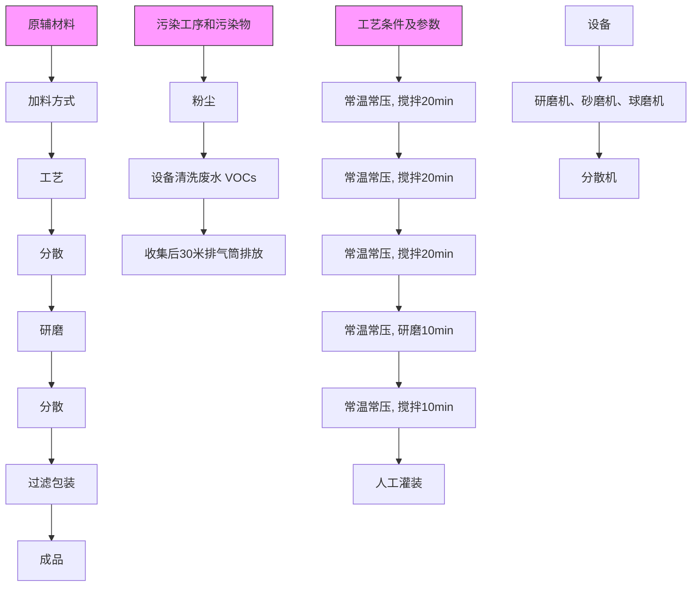

# 建设项目环境影响报告表

项目名称：广东富多新材料股份有限公司分车间年产 600 吨水性涂料新建项目

建设单位（盖章）：广东富多新材料股份有限公司

编制日期：2018 年5 月30 日

国家环境保护总局制

## 《建设项目环境影响报告表》编制说明

《建设项目环境影响报告表》由具有从事环境影响评价工作资质的单位编制。

1.项目名称--指项目立项批复时的名称，应不超过 30 个字（两个英文字段作一个汉字）。  
2.建设地点--指项目所在地详细地址、公路、铁路应填写起止地点。  
3.行业类别--按国标填写。  
4.总投资--指项目投资总额。  
5.主要环境保护目标--指项目区周围一定范围内集中居民住宅、学校、医院、保护文物、风景名胜区、水源地和生态敏感点等，应尽可能给出保护目标、性质、规模和距厂界距离等。  
6.结论与建议--给出本项目清洁生产、达标排放和总量控制的分析结论，确定污染防治措施的有效性，说明本项目对环境造成的影响，给出建设项目环境可行性的明确结论。同时提出减少环境影响的其它建议。  
7.预审意见--由行业主管部门填写答复意见，无主管部门项目，可不填。  
8.审批意见--由负责审批该项目的环境保护行政主管部门批复。

## 建设项目环境影响评价资质证书

机构名称：广东顺德环境科学研究院有限公司

住所：广东省佛山市顺德区大良街道新城区兴业路2号

法定代表人：洪伟

资质等级：乙级

证书编号：国环评证乙字第2811号

有效期：2016年11月20日至2020年11月19日

评价范围：环境影响报告书乙级类别一轻工纺织化纤：化工石化医药：冶金机电；交通运输

项目名称：广东富多新材料股份有限公司分车间年产600吨水性涂料新建项目

文件类型： 环境影响报告表

适用的评价范围： 一般环境影响报告表

法定代表人： 洪伟

主持编制机构： 广东 院有限公司（签章）

text_image

东顺德环境科学研究院
广西壮族自治区
143050236834

# 广东富多新材料股份有限公司分车间年产600吨水性涂料新建项目

环境影响报告表编制人员名单表

<table><tr><td rowspan="2" colspan="2">编制主持人</td><td>姓名</td><td>职(执)业资格证书编号</td><td>登记(注册证)编号</td><td>专业类别</td><td>本人签名</td></tr><tr><td>赵崇敬</td><td>HP0004580</td><td>B281102002</td><td>化工石化医药类</td><td></td></tr><tr><td rowspan="3">主要编制人员情况</td><td>序号</td><td>姓名</td><td>职(执)业资格证书编号</td><td>登记(注册证)编号</td><td>编制内容</td><td>本人签名</td></tr><tr><td>1</td><td>赵崇敬</td><td>HP0004580</td><td>B281102002</td><td>项目概况、自然环境简况、环境质量状况、评价标准、工程分析、主要污染物产生及排放情况、环境影响分析、环境保护措施、结论与建议、相关附件</td><td></td></tr><tr><td>2</td><td>彭坚勇</td><td>HP0002046</td><td>B281102201</td><td>审核</td><td></td></tr></table>

参与编制人员 郭嘉希

## 目录

一、建设项目基本情况.  
二、建设项目所在地自然环境简况 4  
三、环境质量状况.  
四、评价适用标准.  
五、建设项目工程分析. 12  
六、项目主要污染物产生及预计排放情况. . 21  
七、环境影响分析. . 22  
八、建设项目拟采取的防治措施及预期治理效果. . 30  
九、结论与建议.. . 31

附件1 建设项目环评基础信息表. . 37  
附件 2 营业执照 . 38  
附件3 法人代表身份证复印件 . 39  
附件4 项目用地资料. . 40  
附件5 环评技术咨询合同. . 43  
附图1 项目地理位置图. .. 44  
附图2 项目周边环境、噪声监测布点示意图 . 45  
附图3 项目四至情况图. .. 46  
附图4 项目平面布置示意图. . 47  
附图5 项目所在区域水环境功能区划图 . 48  
附图6 项目所在地大气环境功能区划图 . 49  
附图7 项目所在地声环境功能区划图. . 50  
附图8 项目所在地地下水环境功能区划图 51

## 一、建设项目基本情况

<table><tr><td>项目名称</td><td colspan="7">广东富多新材料股份有限公司分车间年产600吨水性涂料新建项目</td></tr><tr><td>建设单位</td><td colspan="7">广东富多新材料股份有限公司</td></tr><tr><td>法人代表</td><td colspan="2"></td><td></td><td>联系人</td><td colspan="2"></td><td></td></tr><tr><td>通讯地址</td><td colspan="7">佛山市顺德区均安镇均益路194号世友工业城5座501号之一</td></tr><tr><td>联系电话</td><td colspan="3">10925278100</td><td colspan="2">邮政编码</td><td colspan="2">528329</td></tr><tr><td>建设地点</td><td colspan="7">佛山市顺德区均安镇均益路194号世友工业城6座401号</td></tr><tr><td>立项审批部门</td><td colspan="3"></td><td colspan="2">批准文号</td><td colspan="2"></td></tr><tr><td>建设性质</td><td colspan="3">☑新建 □改、扩建□技术改造</td><td colspan="2">行业类别及代码</td><td colspan="2">C2641 涂料制造</td></tr><tr><td>占地面积(平方米)</td><td colspan="3">1134</td><td colspan="2">经营面积(平方米)</td><td colspan="2">980</td></tr><tr><td>总投资(万元)</td><td>1000</td><td colspan="3">环保投资(万元)</td><td>10</td><td>占总投资比例</td><td>1%</td></tr><tr><td>评价经费(万元)</td><td></td><td colspan="2"></td><td colspan="2">预期投产日期</td><td colspan="2">2018年10月</td></tr><tr><td colspan="8">工程内容及规模1、项目由来广东富多新材料股份有限公司分车间位于佛山市顺德区均安镇均益路194号世友工业城6座401号,中心地理位置坐标为北纬22.692590°,东经113.149889°,详见附图1。项目主要从事水性涂料的生产,预计年产水性涂料600吨。根据《中华人民共和国环境保护法》、《中华人民共和国环境影响评价法》、国务院令第682号《国务院关于修改〈建设项目环境保护管理条例〉的决定》等有关法律法规的规定,本项目须执行环境影响审批制度。本项目生产的水性涂料是由各种化工原料的物理混合而成,物料间不会发生化学反应。根据环境保护部令第44号《建设项目环境影响评价分类管理名录》(自2017年9月1日起施行)以及《关于修改〈建设项目环境影响评价分类管理名录〉部分内容的决定》(生态环境部令第1号,2018.4.28实施),本项目属于“十五、化学原料和化学制品制造业,36、涂料、染料、颜料、油墨及其类似产品制造,单纯混合或分装的”,需编制建设项目环境影响报告表。2、项目概况项目租用已建厂房,占地面积为1134m2,经营面积为980m2。项目从业人数为17</td></tr></table>

人，年工作日250天，每天工作 8小时。项目内部不设置员工宿舍与饭堂。

项目具体工程组成见表 1-1，主要产品、设备、原辅材料、能耗情况见表 1-2。

表 1-1 项目工程组成情况

<table><tr><td>项目</td><td>内容</td><td>规模</td><td>用途</td></tr><tr><td>主体工程</td><td>生产车间</td><td>约 500m2</td><td>主要用于产品的生产、包装</td></tr><tr><td>仓储工程</td><td>仓库</td><td>约 230m2</td><td>用于原料的储存</td></tr><tr><td>辅助工程</td><td>办公室</td><td>约 250m2</td><td>供日常办公所用</td></tr><tr><td rowspan="2">公用工程</td><td>配电系统</td><td>一套</td><td>供应生产、办公用电</td></tr><tr><td>给排水系统</td><td>各一套</td><td>供水来源为市政自来水;生活污水经独立的生活污水处理设施处理后排入槎滘涌</td></tr><tr><td rowspan="2">环保工程</td><td>独立生活污水处理设施</td><td>一套</td><td>生活污水预处理</td></tr><tr><td>废气处理设施</td><td>---</td><td>1 投料收集后经脉冲布袋除尘器处理通过 30 米高排气筒 G1 排放2 有机废气收集后经“UV 光解+活性炭吸附”处理后通过 30 米高排气筒 G1 排放</td></tr></table>

表 1-2 项目主要产品产量、生产设备、原辅材料、能耗情况

<table><tr><td>类别</td><td>名称</td><td>单位</td><td>数量</td><td>备注</td></tr><tr><td>产品产量</td><td>水性涂料</td><td>t/a</td><td>600</td><td>主要用于家电等工业领域,建筑等民用市场</td></tr><tr><td rowspan="9">主要生产设备</td><td>不锈钢拉缸</td><td>个</td><td>30</td><td>分散;与搅拌机、分散机一起使用</td></tr><tr><td>低速搅拌机</td><td>台</td><td>2</td><td>分散</td></tr><tr><td>高速分散机</td><td>台</td><td>6</td><td>分散</td></tr><tr><td>高速研磨机</td><td>台</td><td>4</td><td>研磨</td></tr><tr><td>卧式砂磨机</td><td>台</td><td>2</td><td>研磨</td></tr><tr><td>不锈钢搅拌釜</td><td>套</td><td>1</td><td>分散</td></tr><tr><td>卧式球磨机</td><td>台</td><td>2</td><td>研磨</td></tr><tr><td>涂料滚动机</td><td>台</td><td>2</td><td>搅匀涂料</td></tr><tr><td>检验仪器</td><td>套</td><td>1</td><td>主要用于产品质量的检测</td></tr><tr><td rowspan="6">主要原辅材料用量</td><td>水性硅酸盐树脂</td><td>t/a</td><td>193</td><td>液态,200kg/桶</td></tr><tr><td>去离子水</td><td>t/a</td><td>182</td><td>液态,外购</td></tr><tr><td>高岭土</td><td>t/a</td><td>49</td><td>粉末状,25kg/纸袋</td></tr><tr><td>碳酸钙</td><td>t/a</td><td>25</td><td>粉末状,25kg/纸袋</td></tr><tr><td>二氧化硅</td><td>t/a</td><td>49</td><td>粉末状,25kg/纸袋</td></tr><tr><td>钛白粉</td><td>t/a</td><td>49</td><td>粉末状,25kg/纸袋</td></tr><tr><td rowspan="2"></td><td>颜料</td><td>t/a</td><td>48</td><td>粉末状,25kg/纸袋;包括白色、黑色、黄色</td></tr><tr><td>助剂</td><td>t/a</td><td>2.5</td><td>液态,25 kg /桶</td></tr><tr><td rowspan="3">能耗与水耗</td><td>电</td><td>万千瓦时/年</td><td>3</td><td></td></tr><tr><td>生活用水</td><td>m3/a</td><td>170</td><td></td></tr><tr><td>生产用水</td><td>m3/a</td><td>15.5</td><td>清洗用水</td></tr></table>

表 1-3 产品原料配比一览表

<table><tr><td>序号</td><td>原辅材料名称</td><td>配比(%)</td><td>性状</td><td>最大储量(t)</td></tr><tr><td>1</td><td>水性硅酸盐树脂</td><td>32</td><td>液</td><td>6</td></tr><tr><td>2</td><td>去离子水</td><td>30</td><td>液</td><td>5</td></tr><tr><td>3</td><td>高岭土</td><td>8</td><td>粉</td><td>3</td></tr><tr><td>4</td><td>碳酸钙</td><td>4</td><td>粉</td><td>1.2</td></tr><tr><td>5</td><td>二氧化硅</td><td>8</td><td>粉</td><td>3</td></tr><tr><td>6</td><td>钛白粉</td><td>8</td><td>粉</td><td>3</td></tr><tr><td>7</td><td>颜料</td><td>9.6</td><td>粉</td><td>0.6</td></tr><tr><td>8</td><td>助剂</td><td>0.4</td><td>液</td><td>0.1</td></tr><tr><td colspan="2">合计</td><td>100</td><td>---</td><td>---</td></tr></table>

## 与本项目有关的原有污染源情况及主要环境问题：

项目位于佛山市顺德区均安镇均益路 194 号世友工业城 6 座 401 号，项目东面为横九路，南面为世友工业城 5座厂房，西面为世友工业城 6座厂房，北面为智安中路。项目四至情况详见附图2。

项目周围污染源主要来自附近内企业排放的工业废气、废水、噪声和固体废物，以及工业区道路来往车辆产生的汽车尾气、交通噪声等。

## 二、建设项目所在地自然环境简况

## 自然环境简况（地形、地貌、地质、气候、气象、水文、植被、生物多样性等）：

本项目所在地属珠江三角洲冲积平原，地势平坦，由西江﹑北江泥沙长期淤积而成，平均海拔约1.4m（黄海高程系）。项目位于北回归线以南，属于南亚热带海洋性季风气候区。近20年（1997-2016年）月平均最高气温为30.89℃，最低气温为10.8℃，月平均最高气温多在7月，最低气温多在1月份。最近的三年出现的月平均最高气温为30.89℃，出现在2014年的7月份；最低气温12.3℃，出现2012年的1月份。近20年间最大月平均风速为3.1米/秒，最小月平均风速为1.2米/秒，20年的月平均风速度为1.2～3.1米/秒，分别为7月和6月。2014年平均主导风向为北风（N），次主导风为南（S）和东南风（SE），所占比例分别为：9.21%、9.18%和8.32%。近20年平均主导风向为南东南风（SSE），次主导风为北西北（NNW）和东南风（SE），所占比例分别为：11%、10%和9%。对顺德区气象站近20年气候资料进行统计分析，统计得出该地区年最大风速在7～14.3米/秒之间，年最高气温在36～38.7℃之间，年最低气温2.7～8.4℃之间，年平均相对温度在70～79%之间，年总降雨量1215.1～2403.3毫米，24小时最大降雨量71.9～257.8毫米。

顺德区有北江和西江两大水系，水系总流向为自西北向东南方向。境内河流纵横交错，主要河流自北向南有东平水道、陈村水道、顺德水道、顺德支流、容桂水道、东海水道等 16 条，总长 212 公里，水面积 73.4 平方公里。境内水系全程均受潮汐影响，属混合潮中的非正规半日周潮型。

北江顺德水道常水位 0.3\~1.40 米之间，枯水位在－0.8\~0.2 米之间，最高水位为6.19米（94年6月19日）；西江顺德支流常水位 0.8\~1.50 米之间，枯水位在－0.6\~0.3米之间，最高水位为 6.80 米（94 年 6 月 19 日）。目前两河流顺德段水质良好，受洪水及潮汐影响较明显，平水期和枯水期涨潮时会产生逆流。

本区植被较简单，以平原农林生态系统中农林绿化植物群落为主。

本区无珍稀野生动、植物。

## 三、环境质量状况

建设项目所在地区域环境质量现状及主要环境问题（环境空气、地面水、地下水、声环境、生态环境等）

## 1、评价区域环境功能属性

本项目所在区域环境功能属性见下表 3-1。

表 3-1 建设项目评价区域环境功能属性

<table><tr><td>编号</td><td>功能区名称</td><td>功能区确定依据</td><td>功能区类别及属性</td></tr><tr><td>1</td><td>水环境功能区</td><td>《顺德区生态环境保护规划(2011~2020年)》(顺府办函〔2013〕41号)</td><td>槎滘涌为IV类水体功能,主要功能为景观、农用功能</td></tr><tr><td>2</td><td>地下水环境功能区划</td><td>《关于同意广东省地下水功能区划的复函》(粤办函[2009]459号)及广东省水利厅地下水功能区划(文本)</td><td>珠江三角洲佛山顺德不宜开采区(H074406003001),地下水执行V类功能</td></tr><tr><td>3</td><td>环境空气质量功能区</td><td>《关于调整顺德区环境空气质量功能区划的复函》(佛府办函〔2014〕494号)</td><td>大气环境二类功能区</td></tr><tr><td>4</td><td>声环境功能区</td><td>《关于印发佛山市声环境功能区划分方案的通知》(佛府函〔2015〕72号)</td><td>畅兴工业园和天连工业片区3类声功能区,(编号3317)</td></tr><tr><td>5</td><td>基本农田保护区</td><td>《顺德区土地利用总体规划(2010-2020)》(粤府函[2011]37号)</td><td>否</td></tr><tr><td rowspan="2">6</td><td rowspan="2">风景名胜区、自然保护区、森林公园、重点生态功能区</td><td>《广东省主体功能区划》(粤府〔2012〕120号)</td><td rowspan="2">否</td></tr><tr><td>佛山市城市生态控制线划定规划(佛府办函[2017]301号)</td></tr><tr><td>7</td><td>重点文物保护单位</td><td>《顺德区文物保护单位名录》</td><td>否</td></tr><tr><td>8</td><td>三河、三湖、两控区</td><td>--</td><td>两控区</td></tr><tr><td>9</td><td>是否水源保护区</td><td>--</td><td>否</td></tr><tr><td>10</td><td>是否污水处理厂纳污范围</td><td>--</td><td>否</td></tr></table>

## 2、环境空气质量现状

为评价本项目所在区域的环境空气质量现状，采用顺德区环境保护监测站 2016 年在均安镇常规监测的数据。监测项目为二氧化硫(SO2)、二氧化氮(NO2)、PM10和 $\mathrm { P M } _ { 2 . 5 }$ 。该地区空气质量执行《环境空气质量标准》（GB3095-2012）中的二级标准。自动监测站监测结果及评价如下(浓度单位： $\mathrm { m g / m } ^ { 3 } )$ ：

表 3-2 2016年顺德区均安镇大气环境质量评价表

<table><tr><td rowspan="2">污染物</td><td colspan="5">24小时平均值</td><td colspan="3">年平均值</td></tr><tr><td>有效数据天数(天)</td><td>达标天数(天)</td><td>最大浓度 $\mu g/m^3$ </td><td>标准值 $\mu g/m^3$ </td><td>达标率%</td><td>浓度 $\mu g/m^3$ </td><td>标准值 $\mu g/m^3$ </td><td>超标倍数</td></tr><tr><td> $SO_2$ </td><td>366</td><td>366</td><td>46</td><td>150</td><td>100</td><td>18</td><td>60</td><td>0</td></tr><tr><td> $NO_2$ </td><td>366</td><td>353</td><td>117</td><td>80</td><td>96.4</td><td>36</td><td>40</td><td>0</td></tr><tr><td> $PM_{10}$ </td><td>356</td><td>353</td><td>211</td><td>150</td><td>99.2</td><td>53</td><td>70</td><td>0</td></tr><tr><td> $PM_{2.5}$ </td><td>364</td><td>350</td><td>135</td><td>75</td><td>96.2</td><td>32</td><td>35</td><td>0</td></tr></table>

从监测数据统计结果来分析，均安镇大气污染物 $\mathbf { S } \mathbf { O } _ { 2 }$ 的24小时平均值、 ${ \mathrm { S O } } _ { 2 } ,$ 、NO2、PM10、PM2.5 年平均值达到《环境空气质量标准》（GB3095-2012）的二级标准， $\mathbf { N O } _ { 2 }$ 、$\mathrm { P M } _ { 1 0 }$ 、 $\mathrm { P M } _ { 2 . 5 }$ 的24小时平均值有不同程度的超标。

## 3、地表水环境质量现状

项目生活污水经独立的生活污水处理设施处理后排入槎滘涌，槎滘涌水质标准执行《地表水环境质量标准》（GB3838－2002）之Ⅳ类标准。

为评价均安镇内河涌水质，引用顺德区环境保护监测站 2016 年对均安镇内河涌的监测数据进行评价，监测结果及评价见下表。

表 3-3 2016年顺德区均安镇内河涌水环境质量评价表  
单位：mg/L（粪大肠菌群:个/L，pH 无量纲）

<table><tr><td>河涌名称</td><td colspan="2">华安河</td><td colspan="4">凫洲河</td><td rowspan="5">最低检出限</td><td rowspan="5">GB3838IV类标准值</td></tr><tr><td>断面名称</td><td colspan="2">源田旅店</td><td colspan="2">磁电集团侧</td><td colspan="2">新华敬老院侧</td></tr><tr><td>监测日期</td><td colspan="2">2016-8-30</td><td colspan="2">2016-8-30</td><td colspan="2">2016-8-30</td></tr><tr><td>测点位置</td><td colspan="2">中(涨潮)</td><td colspan="2">中(涨潮)</td><td colspan="2">中(涨潮)</td></tr><tr><td>涨退潮</td><td>监测值</td><td>达标情况</td><td>监测值</td><td>达标情况</td><td>监测值</td><td>达标情况</td></tr><tr><td>水温</td><td>29.3</td><td>--</td><td>29.2</td><td>--</td><td>29.3</td><td>--</td><td>0.1</td><td>--</td></tr><tr><td>pH</td><td>7.46</td><td>达标</td><td>7.48</td><td>达标</td><td>7.38</td><td>达标</td><td>0.01</td><td>6~9</td></tr><tr><td>DO</td><td>4.52</td><td>达标</td><td>4.55</td><td>达标</td><td>4.35</td><td>达标</td><td>0.01</td><td>3</td></tr><tr><td>高锰酸盐指数</td><td>3.4</td><td>达标</td><td>1.8</td><td>达标</td><td>2.7</td><td>达标</td><td>0.5</td><td>10</td></tr><tr><td> $BOD_{5}$ </td><td>2.9</td><td>达标</td><td>1.1</td><td>达标</td><td>2.2</td><td>达标</td><td>0.5</td><td>6</td></tr><tr><td>氨氮</td><td>1.180</td><td>达标</td><td>1.060</td><td>达标</td><td>1.560</td><td>不达标</td><td>0.025</td><td>1.5</td></tr><tr><td>挥发酚</td><td>0.0012</td><td>达标</td><td>0.0011</td><td>达标</td><td>0.0009</td><td>达标</td><td>0.0003</td><td>0.01</td></tr><tr><td>氰化物</td><td>0.004L</td><td>达标</td><td>0.004L</td><td>达标</td><td>0.004L</td><td>达标</td><td>0.004</td><td>0.2</td></tr><tr><td>As</td><td>0.00310</td><td>达标</td><td>0.00274</td><td>达标</td><td>0.00284</td><td>达标</td><td>0.00012</td><td>0.1</td></tr><tr><td>Hg</td><td>0.00001L</td><td>达标</td><td>0.00001L</td><td>达标</td><td>0.00001L</td><td>达标</td><td>0.00001</td><td>0.001</td></tr><tr><td>六价铬</td><td>0.004</td><td>达标</td><td>0.004</td><td>达标</td><td>0.004</td><td>达标</td><td>0.004</td><td>0.05</td></tr><tr><td>Pb</td><td>0.00009</td><td>达标</td><td>0.00009</td><td>达标</td><td>0.00009</td><td>达标</td><td>0.00009</td><td>0.05</td></tr><tr><td>Cd</td><td>0.00005</td><td>达标</td><td>0.00005</td><td>达标</td><td>0.00005</td><td>达标</td><td>0.00005</td><td>0.005</td></tr><tr><td>Cu</td><td>0.00405</td><td>达标</td><td>0.01420</td><td>达标</td><td>0.01080</td><td>达标</td><td>0.00008</td><td>1</td></tr><tr><td>石油类</td><td>0.02</td><td>达标</td><td>0.03</td><td>达标</td><td>0.02</td><td>达标</td><td>0.01</td><td>0.5</td></tr><tr><td>Zn</td><td>0.00067</td><td>达标</td><td>0.00067</td><td>达标</td><td>0.0179</td><td>达标</td><td>0.00067</td><td>2</td></tr><tr><td>氟化物</td><td>0.17</td><td>达标</td><td>0.15</td><td>达标</td><td>0.15</td><td>达标</td><td>0.05</td><td>1.5</td></tr><tr><td>粪大肠菌群</td><td>9200</td><td>达标</td><td>5400</td><td>达标</td><td>5400</td><td>达标</td><td>200</td><td>20000</td></tr><tr><td>CODcr</td><td>10.0</td><td>达标</td><td>10.8</td><td>达标</td><td>11.6</td><td>达标</td><td>10.0</td><td>30</td></tr><tr><td>LAS</td><td>0.08</td><td>达标</td><td>0.06</td><td>达标</td><td>0.05</td><td>达标</td><td>0.05</td><td>0.3</td></tr><tr><td>硫化物</td><td>0.016</td><td>达标</td><td>0.017</td><td>达标</td><td>0.015</td><td>达标</td><td>0.005</td><td>0.5</td></tr><tr><td>硒</td><td>0.00041</td><td>达标</td><td>0.00041</td><td>达标</td><td>0.00041</td><td>达标</td><td>0.00041</td><td>0.02</td></tr><tr><td>总磷</td><td>0.216</td><td>达标</td><td>0.114</td><td>达标</td><td>0.170</td><td>达标</td><td>0.010</td><td>0.3</td></tr></table>

备注：“L”为小于检出限。

从监测数据统计结果来分析，均安镇 2016 年监测内河涌除凫洲河新华敬老院侧断面氨氮指标超标外，其它指标均达到了 GB3838-2002 之Ⅳ类水质标准。随着均安污水处理厂纳污范围的不断扩大，均安分散式农村污水处理的实施，均安镇内河涌的水质将会得到改善。

## 4、地下水环境质量现状

根据表3-1，项目所在区域属珠江三角洲佛山顺德不宜开发区，该区域地貌类型为一般平原区，地下水类型为孔隙水，面积为 $4 1 1 . 5 2 \mathrm { k m } ^ { 2 }$ ，矿化度 1-＞10g/L。地下水水质现状为《地下水质量标准》（GB/T14848-2017）中的 V 类，地下水功能保护目标为 V 类，开采水位维持现状，目前 Fe、NH4+、矿化度超标。

## 5、声环境质量现状

为了解项目所在地声环境质量现状，本次环评委托广东顺德环境科学研究院有限公司分析测试中心于 2018年2 月13日在项目所在地边界布设 4个监测点，对附近区域的声环境进行现场实测，测点位置见附图 2。本项目噪声监测方法严格按照《声环境质量标准》（GB3096-2008）的要求进行，监测仪器采用积分声级计。监测结果如下表：

表 3-4 噪声监测结果 单位：dB(A)

<table><tr><td>测点编号</td><td>时段</td><td>LeqdB(A)</td><td>标准</td><td>备注</td></tr><tr><td rowspan="2">N1 测点</td><td>昼</td><td>57.3</td><td>3 类,65</td><td>达标</td></tr><tr><td>夜</td><td>46.2</td><td>3 类,55</td><td>达标</td></tr><tr><td rowspan="2">N2 测点</td><td>昼</td><td>58.6</td><td>3 类,65</td><td>达标</td></tr><tr><td>夜</td><td>47.9</td><td>3 类,55</td><td>达标</td></tr><tr><td rowspan="2">N3 测点</td><td>昼</td><td>55.7</td><td>3 类,65</td><td>达标</td></tr><tr><td>夜</td><td>43.1</td><td>3 类,55</td><td>达标</td></tr><tr><td rowspan="2">N4 测点</td><td>昼</td><td>52.8</td><td>3 类,65</td><td>达标</td></tr><tr><td>夜</td><td>42.2</td><td>3 类,55</td><td>达标</td></tr></table>

从上表可以看出，本项目边界噪声均能符合《声环境质量标准》（GB3096-2008）3类标准要求，项目所在地噪声达到区域声环境功能要求。

## 主要环境保护目标（列出名单及保护级别）

表 3-5 主要环境保护目标

<table><tr><td>名称</td><td colspan="2">最近厂界距离</td><td>方位</td><td>受影响规模</td><td>保护类别</td></tr><tr><td>大气环境</td><td colspan="2">---</td><td>---</td><td>---</td><td>大气二级</td></tr><tr><td>声环境</td><td colspan="2">---</td><td>---</td><td>---</td><td>声3类</td></tr><tr><td>槎滘涌</td><td colspan="2">45m</td><td>东北面</td><td>---</td><td>水环境IV类</td></tr><tr><td>仓门社区居民</td><td colspan="2">63m</td><td>东北面</td><td>80人(200米范围内)</td><td>大气二级,声2类</td></tr><tr><td rowspan="3">均安水厂水源保护区陆域边界</td><td>一级保护区</td><td>3250m</td><td>北面</td><td rowspan="3">---</td><td>水环境II类</td></tr><tr><td>二级保护区</td><td>2860m</td><td>东北面</td><td>水环境II类</td></tr><tr><td>准保护区</td><td>4660m</td><td>东北面</td><td>水环境III类</td></tr></table>

## 四、评价适用标准

## 环境质量标准

## 1、环境空气质量标准

（1） $\mathrm { S O _ { 2 } \cdot \Delta N O _ { 2 } \cdot \Delta P M _ { 1 0 } \cdot \Delta P M _ { 2 . 5 } }$ 、TSP 执行《环境空气质量标准》（GB3095-2012）中的二级标准，具体如表 4-1所示。

（2）VOCs 质量标准参照执行《室内空气质量标准》（GB/T18883-2002）表 1 值： $\mathrm { T V O C } { \le } 0 . 6 \mathrm { m g } / \mathrm { m } ^ { 3 }$ （8 小时均值）。

表4-1 环境空气质量标准

<table><tr><td>污染物</td><td> $SO_{2}$ </td><td> $NO_{2}$ </td><td> $PM_{10}$ </td><td> $PM_{2.5}$ </td><td>TSP</td></tr><tr><td>单位</td><td colspan="5"> $\mu g/m^{3}$ </td></tr><tr><td>年平均</td><td>60</td><td>40</td><td>70</td><td>35</td><td>200</td></tr><tr><td>24小时平均</td><td>150</td><td>80</td><td>150</td><td>75</td><td>300</td></tr><tr><td>1小时平均</td><td>500</td><td>200</td><td>--</td><td>--</td><td>--</td></tr></table>

## 2、地表水环境质量标准

槎滘涌水质执行《地表水环境质量标准》（GB3838-2002）中的Ⅳ类标准。

表 4-2 地表水环境质量标准  
单位：pH 无量纲，其余 mg/L

<table><tr><td>指标</td><td>pH</td><td>化学需氧量</td><td>BOD5</td><td>溶解氧</td><td>NH3-N</td><td>总磷(以P计)</td></tr><tr><td>IV类标准</td><td>6-9</td><td>≤30</td><td>≤6</td><td>≥3</td><td>≤1.5</td><td>≤0.3</td></tr></table>

## 3、地下水环境质量标准

地下水水质执行《地下水质量标准》（GB/T14848-2017）中的Ⅴ类标准。

表4-3 地下水质量标准  
单位：pH无量纲，其余mg/L

<table><tr><td>指标</td><td>pH值</td><td>总硬度(以 $CaCO_3$ 计)</td><td>溶解性总固体</td><td>硝酸盐(以N计)</td><td>亚硝酸盐(以N计)</td><td>氨氮(以N计)</td></tr><tr><td>V类标准</td><td>&lt;5.5, &gt;9</td><td>&gt;650</td><td>&gt;200</td><td>&gt;30.0</td><td>&gt;4.8</td><td>&gt;0.5</td></tr></table>

## 4、声环境质量标准

执行《声环境质量标准》（GB3096-2008）中 3 类标准： 昼间≤65dB(A)、夜间≤55dB(A)。

## 污染物排放标准

## 1、水污染物排放标准

项目生活污水经独立的生活污水处理设施处理后排入槎滘涌，排放执行《城镇污水处理厂污染物排放标准》（GB 18918-2002）二级标准，具体排放限值见表 4-4。

表 4-4 项目水污染物排放浓度限值  
单位：pH 无量纲，其余 mg/L

<table><tr><td>污染物</td><td>pH</td><td>化学需氧量</td><td>氨氮(以N计)</td><td>生化需氧量</td><td>总磷(以P计)</td></tr><tr><td>生活污水</td><td>6~9</td><td>100</td><td>25</td><td>30</td><td>3</td></tr></table>

## 2、大气污染物排放标准

（1）投料粉尘（颗粒物）执行广东省地方标准《大气污染物排放限值》（DB44/27-2001）第二时段二级标准。  
（2）分散过程产生的有机废气（VOCs）收集后经“UV 光解+活性炭吸附”处理后通过 30米高排气筒G1排放。根据《顺德区环境运输和城市管理局转发关于印发 2014年佛山市陶瓷行、玻璃制造行业、铝型材行业和 VOCs排放企业整治方案的通知 》（顺管函[2014]510 号），“在国家、省未出台行业标准前，金属制品、铝型材、设备制造行业参照执行《表面涂装(汽车制造业)挥发性有机化合物排放标准(DB44/816-2010)》；其他行业参照执行《家具制造行业挥发性有机化合物排放标准（DB44/814-2010）》”。因此本项目有机废气参照广东省地方标准《家具制造行业挥发性有机化合物排放标准》（DB44/814-2010）第二时段标准。

表 4-5 项目大气污染物排放标准

<table><tr><td rowspan="2">工序</td><td rowspan="2">排气筒</td><td rowspan="2">污染因子</td><td colspan="2">有组织</td><td rowspan="2">无组织排放监控浓度限值 mg/m3</td><td rowspan="2">执行标准</td></tr><tr><td>最高允许排放浓度mg/m3</td><td>最高允许排放速率(kg/h)</td></tr><tr><td>投料</td><td>——</td><td>颗粒物</td><td>120</td><td>9.5</td><td>1.0</td><td>DB44/27-2001</td></tr><tr><td>分散</td><td>G1(30m)</td><td>VOCs</td><td>30</td><td>1.45*</td><td>2.0</td><td>DB44/814-2010</td></tr></table>

\*注：由于周围200m范围内有40m高的建筑物，放速率限值需要折半执行。

## 3、噪声排放标准

营 运 过 程 噪 声 排 放 执 行 《 工 业 企 业 厂 界 环 境 噪 声 排 放 标 准 》（GB12348-2008）中的 3 类标准：昼间≤65dB(A)、夜间≤55dB(A)。

<table><tr><td></td><td>4、固体废物控制标准《一般工业固体废物储存、处置场污染控制标准》(GB18599-2001)及其2013年修改单;《国家危险废物名录》(2016年版)、《危险废物贮存污染控制标准》(GB18597-2001)及其2013年修改单。</td></tr><tr><td>总量控制指标</td><td>(1)项目生活污水排放量是0.015万吨/年, $COD_{Cr}$ 排放量为0.015t/a, $NH_{3}-N$ 排放量为0.004t/a。项目生活污水经独立的生活污水处理设施处理后排入槎滘涌。根据《佛山市排污权有偿使用和交易管理试行办法》(佛府办2016第63号),生活污水 $COD_{Cr}$ 、 $NH_{3}-N$ 不分配总量。(2)项目VOCs有组织排放量为0.0054t/a,无组织排放量为0.006t/a;建议VOCs分配总量为0.0054t/a。</td></tr></table>

## 五、建设项目工程分析

（一） 工艺流程简述（图示）  

flowchart

图 5-1 生产工艺流程图

## 生产工艺说明：

1）将去离子水、助剂、高岭土、颜料、碳酸钙、二氧化硅、钛白粉、水性硅酸盐树脂乳液等原料，根据不同产品要求按配比称量后人工置于分散机或搅拌机中（分散机和搅拌机功能相似，均为搅拌，但分散机转速更快，物料搅拌得更均匀）；  
2）将分散机或者搅拌机开动，通过对物料进行高速的强烈的剪切、撞击、粉碎、分散，达到迅速混合、溶解、分散、细化等目的后（分散搅拌时间 60分钟，机器转速1000 转/小时）；  
3）分散完毕后，将以上物料送至研磨机中进行研磨（研磨时间 10分钟）；  
4）研磨完毕再送入分散机中；  
5）调节分散机分散速度，直至搅拌分散均匀（分散时间 10分钟，机器转速 1000转/小时）；  
6）分散完毕后，将分散机底部出料阀打开，产品经包装储存。

分散、搅拌和研磨过程均为有顶盖封盖，不敞口，过滤包装使用滤网过滤，滤网使用后和拉缸、搅拌机一同经过水洗后可反复利用，不单独增加清洗废水，不可回用的清洗废水交有处理能力的单位处理。

## 主要原辅材料理化性质如下：

## 1、水性硅酸盐树脂

<table><tr><td rowspan="6">理化性质</td><td>外观与性状:</td><td>白色乳状液体</td></tr><tr><td>主要用途:</td><td>特别适用于各种高性能水性涂料体系。广泛适用工业涂料、民用建筑涂料和特种行业防护涂料等。用作分散剂。</td></tr><tr><td>相对密度(水=1):</td><td>1.0</td></tr><tr><td>相对密度(空气=1):</td><td>无资料</td></tr><tr><td>饱和蒸汽压(kPa):</td><td>无资料</td></tr><tr><td>溶解性:</td><td>与水混溶</td></tr><tr><td rowspan="4">燃烧</td><td>避免接触的条件:</td><td>避免日晒雨淋烘烤及防冻</td></tr><tr><td>燃烧性:</td><td>无资料</td></tr><tr><td>闪点(°C):</td><td>无资料</td></tr><tr><td>自燃温度(°C):</td><td>无资料</td></tr><tr><td rowspan="4">危险性</td><td>危险特性:</td><td>不存在火灾爆炸危险性</td></tr><tr><td>稳定性:</td><td>存储有效期内稳定</td></tr><tr><td>禁忌物:</td><td>避免强酸、强碱或对树脂体系有破坏作用的物质引入</td></tr><tr><td>灭火方法:</td><td>——</td></tr></table>

## 2、高岭土

<table><tr><td>外观</td><td>白色粘土</td><td>熔点</td><td>1785°C</td></tr><tr><td>含量</td><td>90%</td><td>密度</td><td>2.54-2.60 g/cm3</td></tr><tr><td>分子量</td><td>258</td><td></td><td></td></tr></table>

高岭土是一种非金属矿产，是一种以高岭石族粘土矿物为主的粘土和粘土岩。因呈白色而又细腻，又称白云土。其质纯的高岭土呈洁白细腻、松软土状，具有良好的可塑性和耐火性等理化性质。其矿物成分主要由高岭石、埃洛石、水云母、伊利石、蒙脱石以及石英、长石等矿物组成。高岭土用途十分广泛，主要用于造纸、陶瓷和耐火材料，其次用于涂料、橡胶填料、搪瓷釉料和白水泥原料，少量用于塑料、油漆、颜料、砂轮、铅笔、日用化妆品、肥皂、农药、医药、纺织、石油、化工、建材、国防等工业部门。

## 3、碳酸钙

碳酸钙的化学式为 $\mathrm { C a C O } _ { 3 }$ ，遇稀醋酸、稀盐酸、稀硝酸发生泡沸，并溶解。在 101.325千帕下加热到 $9 0 0 \mathrm { { ^ \circ C } }$ 时分解为氧化钙和二氧化碳。碳酸钙在涂料工业中可作为体质颜料，白色颜料，起到骨架作用。碳酸钙在涂料中可以作为大量使用的体质颜料，价格不但便宜，而且能在涂料中均匀分散。而且，由于碳酸钙的亲水性，也成为十分环保的涂料。碳酸钙的填入可以增强底漆对基层表面的沉积性和渗透性。

碳酸钙可以使涂料增稠、加厚，起一种填充和补平作用。所以在厚漆中通常添加重钙和轻钙，添加重钙可达 25%-80%。

## 4、二氧化硅

纯的二氧化硅无色，常温下为固体，化学式为 $\mathrm { S i O } _ { 2 }$ ，不溶于水。不溶于酸，但溶于氢氟酸及热浓磷酸，能和熔融碱类起作用。密度（室温）： $2 . 2 \ \mathrm { g } / \mathrm { c m } ^ { 3 }$ ，熔点： $1 6 5 0 ( \pm 5 0 ) ^ { \circ } \mathrm { C }$ ，沸点：2230℃，自然界中存在有结晶二氧化硅和无定形二氧化硅两种。二氧化硅用途很广泛，主要用于制玻璃、水玻璃、陶器、搪瓷、耐火材料、气凝胶毡、硅铁、型砂、单质硅、水泥等

## 5、钛白粉

<table><tr><td>外观</td><td>白色粉体</td><td>熔点</td><td>1855°C</td></tr><tr><td>含量</td><td>90%</td><td>沸点</td><td>2900°C</td></tr><tr><td>比重</td><td>4.23</td><td>溶解度</td><td>不溶于水</td></tr></table>

钛白粉的主要应用涂料、塑料、油墨、造纸领域。

为白色或类白色、微细、无砂性的粉末，手摸有油腻感。无臭，无味。本品在水、稀矿酸或稀氢氧化碱溶液中均不溶解。可作药用。

## 6、助剂

本项目生产用主要助剂为聚二甲基硅氧烷或其类似衍生物，聚二甲基硅氧烷的化学状态二甲基硅油，无色或浅黄色液体，无味，透明度高，具有耐热性、耐寒性、黏度随温度变化小、防水性、表面张力小、具有导热性，导热系数为 0.134-0.159W/M\*K，透光性为透光率 100%，二甲基硅油无毒无味，具有生理惰性、良好的化学稳定性。电绝缘性和耐候性、疏水性好，并具有很高的抗剪切能力，可在-50℃～200℃下长期使用。具有优良的物理特性，可直接用于防潮绝缘，阻尼，减震，消泡，润滑，抛光等方面，广泛用作绝缘润滑、防震、防油尘、介电液和热载体。以及用作消泡、脱模剂、油漆及日化品添加剂。

## （二）产业政策及相关规划相符性分析

## （1）产业政策符合性分析

根据《产业结构调整指导目录（2011 年本》和 2013 年 5 月 1 日起施行的《国家发展改革委关于修改<产业结构调整指导目录（2011 年本）>有关条款的决定》、《珠江三角洲地区产业结构调整优化和产业导向目录（2011 本）》，环保类涂料被列为鼓励类。

同时根据《佛山市工业产业结构调整实施方案》有关“大力发展战略性新兴产业和高新技术产业”的产业政策，水性涂料项目为环保的新型建筑材料产业，属于佛山市重点发展产业。

## （2）VOCs 符合性分析

项目挥发性有机物（VOCs）排放符合性根据相关政策文件规定分析如下：

表 5-1 项目与挥发性有机物（VOCs）排放规定相符性分析

<table><tr><td>序号</td><td>文件</td><td>规定</td><td>项目实际</td><td>符合判定</td></tr><tr><td>1</td><td>《珠江三角洲地区严格控制工业企业挥发性有机物(VOCs)排放的意见》(粤环[2012]18号)</td><td>自然保护区、水源保护区、风景名胜区、森林公园、重要湿地、生态敏感区和其他重要生态功能区实行强制性保护,禁止新建VOCs污染企业。”</td><td>选址不在规定区域</td><td>符合</td></tr><tr><td>2</td><td>《广东省环境保护厅关于重点行业挥发性有机物综合整治的实施方案(2014-2017年)》(粤环[2014]130号)</td><td>新建涂料企业生产的室内装修装饰用涂料以及溶剂型木器家具涂料产品必须符合国家环境标志产品要求。禁止生产有害物质含量、挥发性有机物含量超过200克/升的室内装修装饰用涂料和超过700克/升的溶剂型木器家具涂料。淘汰产量300吨/年以下的传统油墨生产装置,取缔含苯类溶剂型油墨生产,淘汰所有无挥发性有机物收集、回收/净化设施的涂料、胶黏剂和油墨等生产装置。鼓励提高水性涂料和水性油墨生产规模。</td><td>项目产品全部为水性涂料,属于鼓励类</td><td>符合</td></tr><tr><td>3</td><td>顺德区环境保护委员会关于印发顺德区工业挥发性有机物项目(VOCs)审批总量前置实施细则(2016年修订)的通知(顺环委[2016]3号)</td><td>对新、改、扩建涉及新增VOCs排放的建设项目实行VOCs排放总量前置审批,凡新增VOCs排放量必须取得VOCs排放总量指标,且执行“减二增一”政策,即新、改、扩建涉及新增VOCs排放的建设项目,必须在区域内已有排放源排放量削减2倍于拟建项目的VOCs排放量。有组织排放量小于0.1吨(不含0.1吨,下同)的建设项目,不需要申请VOCs排放总量指标,直接由环评文件审批部门在环保管理信息系统录入项目排放量,作为VOCs排放总量分配依据;有组织排放量大于0.1吨(含0.1吨,下同)的建设项目,须申请VOCs排放总量指标。</td><td>本项目VOCs有组织排放量为0.0054吨/年,小于0.1吨,不需要申请VOCs排放总量指标,直接由环评文件审批部门在环保管理信息系统录入项目排放量。</td><td>符合</td></tr><tr><td>4</td><td>关于印发《2017年珠江三角洲地区臭氧污染防治专项行动实施方案》的通知(粤环函[2017]1373号)</td><td>化学原料和化学制品制造业:反应、蒸馏、抽真空、固液分离、分散、研磨、干燥、投料、卸料、取样、物料中转、反应器清洗等生产全过程应进行有机废气集中收集和净化处理,净化效率应大于90%。</td><td>项目分散产生的有机废气收集后经“UV光解+活性炭吸附”处理后通过30米高排气筒G1排放,处理效率90%</td><td>符合</td></tr></table>

## （3）与《中华人民共和国大气污染防治法》符合性分析

根据《中华人民共和国大气污染防治法》（2015 年 8 月 29 日第二次修订）第四章“大气污染防治措施”第二节“工业污染防治”相关条款符合性分析如表 5-2。

表 5-2 项目与《中华人民共和国大气污染防治法》相符性分析

<table><tr><td>序号</td><td>法律条款</td><td>规定</td><td>项目实际</td></tr><tr><td>1</td><td>第四十三条</td><td>化工企业生产过程中排放粉尘,应当采用清洁生产工艺,配套建设除尘装置。</td><td>按照要求安装除尘装置</td></tr><tr><td>2</td><td>第四十四条</td><td>生产、销售含挥发性有机物的原材料和产品的,其挥发性有机物的含量应当符合质量标准或者要求。</td><td>生产符合环保要求的产品</td></tr></table>

## （4）选址合理性

根据建设单位提供的用地资料（附件4），该项目所使用的土地及其相关的建筑物属于工业用途，选址合理。

综上所述，本项目符合国家产业政策的要求，同时符合广东省，以及佛山市产业政策的要求。

## （三）污染源强分析

## 1、水污染源

## ◇生活污水

项目不设饭堂和员工宿舍，运营期间产生的生活污水主要来自于员工的洗手、冲厕废水，这部分废水的主要污染因子为 $\mathrm { C O D } _ { \mathrm { C r } } , \ \mathrm { B O D } _ { 5 } .$ 、总磷、氨氮等。根据《广东省用水定额》，生活用水按 $0 . 0 4 \mathrm { m } ^ { 3 } / \mathrm { d }$ ·人计。项目员工17 人，年工作250天，则生活用水量为170m3/a，排污系数取 0.9，则生活污水产生量为 153m3/a。

项目生活污水经独立的生活污水处理设施处理后排入槎滘涌。参考环境保护部环境工程技术评估中心编制《环境影响评价（社会区域类）》教材（表 5-18），结合项目实际，项目生活污水污染物产生及排放情况见下表。

表 5-3 项目生活污水污染物产生及排放情况

<table><tr><td>项目</td><td>污染物</td><td>产生浓度(mg/L)</td><td>产生量(t/a)</td><td>排放浓度(mg/L)</td><td>排放量(t/a)</td></tr><tr><td rowspan="2">生活污水 $153m^{3}/a$ </td><td> $COD_{Cr}$ </td><td>250</td><td>0.0383</td><td>100</td><td>0.0153</td></tr><tr><td> $BOD_5$  $NH_{3}-N$ </td><td>10030</td><td>0.01530.0046</td><td>3025</td><td>0.00460.0038</td></tr><tr><td></td><td>TP</td><td>3.5</td><td>0.00054</td><td>3</td><td>0.00046</td></tr></table>

## ◇生产废水

## ①设备清洗废水

项目年生产水性涂料是 600t，生产同一种涂料时无需清洗，直接连续生产即可。在生产间歇期和更换水性涂料颜料时，要对分散机、搅拌机、搅拌缸等进行清洗，会产生清洗废水。白色和黑色产品清洗水可全部回用作下一批次涂料生产的工艺用水，其他颜色产品的清洗废水经收集后交给有该类废水处理能力的单位处理。根据建设单位提供的资料，不锈钢拉缸容积是 0.5t，容积负荷率按 80%计，故每个批次涂料生产量约 0.4 t，每批次生产时间约2h。项目水性涂料生产总量是 600 t，核算总批次是1500次。根据同类型项目的类比分析，清洗次数按总生产批次的 20%计，则清洗次数是 300次，清洗水用量约为不锈钢拉缸最大容量的10%，则清洗设备用水量约 $1 5 \mathrm { m } ^ { 3 } / \mathrm { a }$ ，不可回用部分约占20%，故清洗废水总排放量是 $3 \mathrm { m } ^ { 3 } / \mathrm { a }$ 。

该类废水主要污染物为颜料、助剂等无机物，水性硅酸盐树脂等有机物。根据同类型企业调查所得类比资料，废水中 $\mathrm { C O D } _ { \mathrm { C r } }$ 、BOD5、SS 和 $\mathrm { N H } _ { 3 ^ { - } } \mathrm { N }$ 的质量浓度分别为800\~1500mg/L、300\~500 mg/L、800\~1200 mg/L、6\~8 mg/L。

## ②车间地面清洁废水

在生产间歇期，要对生产区地面进行清洗。地面清洁采用吸尘器和拖地清洁相结合的方式，按照实际生产情况，一般每三个月吸尘后再拖地清洁一次，项目生产区面积不大，拖地清洁用水量较少，约 $2 \mathrm { m } ^ { 3 } ,$ /次，即全年地面清洁水用量约为 $8 \mathrm { m } ^ { 3 } / \mathrm { a }$ ，排水系数按0.7计算，全年地面清洗水废水量约为 $5 . 6 \mathrm { m } ^ { 3 } / \mathrm { a }$ 。

项目的生产废水经收集后定期交有处理能力的单位处理。

表 5-4 项目生产废水主要污染物产生及排放情况

<table><tr><td colspan="3">污染物</td><td> $COD_{Cr}$ </td><td> $BOD_5$ </td><td>SS</td><td> $NH_3-N$ </td><td>色度(倍)</td></tr><tr><td rowspan="2">设备清洗废水</td><td rowspan="2">废水量 $3m^3/a$ </td><td>产生浓度(mg/L)</td><td>1500</td><td>500</td><td>1200</td><td>8</td><td>20</td></tr><tr><td>产生量(t/a)</td><td>0.0045</td><td>0.0015</td><td>0.0036</td><td>0</td><td>——</td></tr><tr><td rowspan="2">地面清洁废水</td><td rowspan="2">废水量 $5.6m^3/a$ </td><td>产生浓度(mg/L)</td><td>1000</td><td>400</td><td>800</td><td>7</td><td>——</td></tr><tr><td>产生量(t/a)</td><td>0.0056</td><td>0.0022</td><td>0.0045</td><td>0</td><td>——</td></tr><tr><td rowspan="2">合计</td><td rowspan="2">废水量8.6m3/a</td><td>平均产生浓度(mg/L)</td><td>1174</td><td>435</td><td>940</td><td>7.3</td><td>20</td></tr><tr><td>产生量(t/a)</td><td>0.010</td><td>0.0037</td><td>0.0081</td><td>0</td><td>——</td></tr></table>

## 2、大气污染源

## ◇粉尘

本项目生产水性涂料时投加粉料（高岭土、碳酸钙、二氧化硅、颜料）过程会产生粉尘，主要污染物为颗粒物，产生的粉尘中不含重金属等有毒有害物质，根据《第一次全国污染源普查工业污染源产排污系数手册—第三分册》中“3641 涂料制造业—水性涂料”工业粉尘产污系数为 0.031kg/t 产品。则本项目水性涂料生产过程参照此系数核算粉尘产生量。

本项目年生产水性涂料是 600t，核算粉尘的产生量是 18.6kg/a。项目最大单位小时水性涂料的生产量是1.5t，粉料加料时间约 30分钟，则粉尘逸散量最大约0.093kg/h。

项目拟在所有投料口安装集尘装置，在集气罩周围安装下拉式帘幕，粉尘收集后通过脉冲布袋除尘处理后通过 30 米高排气筒 G1 排放，收集效率按 90%计，除尘效率按99%计。则项目生产过程中粉尘的产生和排放情况如下表。

表 5-5 生产过程粉尘产生和排放情况

<table><tr><td colspan="2">产生量</td><td>收集量</td><td>削减量</td><td colspan="3">有组织排放</td><td colspan="3">无组织排放</td></tr><tr><td>kg/h</td><td>kg/a</td><td>kg/a</td><td>kg/a</td><td>kg/h</td><td>kg/a</td><td>mg/m3</td><td>kg/h</td><td>kg/a</td><td>mg/m3</td></tr><tr><td>0.093</td><td>18.6</td><td>16.74</td><td>16.57</td><td>0.0008</td><td>0.1674</td><td>0.0837</td><td>0.0093</td><td>1.86</td><td>0.0015</td></tr><tr><td colspan="10">注:1.采用环境保护部推荐的大气环境防护距离计算软件预测颗粒物无组织厂界浓度;2.投料位于生产车间,生产车间面积约为500m2(长约33m*宽约15m),厂房高度约4.5m。</td></tr></table>

## ◇有机废气

水性涂料生产过程中 VOCs 主要来源于分散过程。根据杏坛镇 2016 年 9 月审批的《佛山市顺德区国硕化工有限公司年产 2000 吨水性木器漆建设项目》的环评文件，审批编号是“杏20160195”，批复是顺环（杏）审[2016]73 号，水性涂料分散过程中 VOCs挥发量按水性涂料产量的 0.01%计算。水性涂料的总产量为 600t/a，最大单位小时水性涂料的生产量是 1.5t，，生产过程除需要 60min 搅拌时间外，还有投料时间 30min，共计约90min。分散过程产生的废气经分散机和搅拌机上方的集气罩收集后，采用“UV 光解+活性炭吸附”处理，尾气后通过楼顶30米高排气筒（G1）排放，处理风量为10000m3/h，收集效率为90%，处理效率 90%，产生和排放情况如下表 5-6a和5-6b。

表 5-6a 项目生产过程 VOCs 产生情况

<table><tr><td>产品</td><td>产量(t/a)</td><td>VOCs 挥发系数</td><td>VOCs 产生量(kg/a)</td><td>最大产生速率(kg/h)</td><td>备注</td></tr><tr><td>水性涂料</td><td>600</td><td>0.01%</td><td>60</td><td>0.15</td><td>最大产量按 1.5t 计,生产时间 90min</td></tr></table>

表 5-6b 项目生产过程 VOCs排放情况

<table><tr><td>收集量</td><td>削减量</td><td colspan="3">有组织排放</td><td colspan="3">无组织排放</td></tr><tr><td>t/a</td><td>t/a</td><td>kg/h</td><td>t/a</td><td> $mg/m^3$ </td><td>kg/h</td><td>t/a</td><td> $mg/m^3$ </td></tr><tr><td>0.054</td><td>0.0486</td><td>0.0135</td><td>0.0054</td><td>1.35</td><td>0.015</td><td>0.006</td><td>0.0023</td></tr><tr><td colspan="8">注:1.采用环境保护部推荐的大气环境防护距离计算软件预测颗粒物无组织厂界浓度;2.分散位于生产车间,生产车间面积约为 $500m^2$ (长约33m*宽约15m),厂房高度约4.5m。</td></tr></table>

## 3、噪声污染源

项目噪声源为生产设备运行时产生的机械噪声，源强为 65～80dB(A)。

## 4、固体废物污染源

## ◇包装废纸袋

项目高岭土、碳酸钙、二氧化硅、钛白粉等采用 25kg/袋规格的包装，包装废纸袋按1.0 kg/t 原材料计算，产生废包装材料约 0.17t/a，在车间内统一收集，定期卖给废品回收商。

## ◇布袋除尘器收集到的粉尘

项目生产过程中，对投料粉尘收集后通过布袋除尘器处理，根据上述大气污染源分析，项目除尘系统收集的粉尘约为 0.017t/a，粉尘收集后可直接回用至黑色产品生产。

## ◇员工生活垃圾

项目有员工17人，不在项目内食宿，根据《社会区域类环境影响评价》（中国环境出版社）中固体废物污染源推荐数据，办公垃圾产生量按 0.5kg/（人•d）计算，年工作日250天，则项目的生活垃圾产生量约 2.13t/a。

## ◇滤网和过滤残渣

水性涂料包装时需要过滤，过滤渣产生量约为产量的0.1%，全年水性涂料产品600t，则产生过滤渣约 0.6 t/a。滤网水洗后可循环使用，约半年更换一次，总产生量约为0.0005t/a。根据《国家危险废物名录》（2016 年）HW12 染料涂料废物相关规定，水性涂料残渣不属于危险废物，可按照一般固体废物处理，故滤网和过滤残渣集中收集后定期交给回收商处理。

## 5、危险废物

## ◇含油废抹布

项目设备维护会产生废含油抹布，大概一年产生量 0.01t。

## ◇废机油和废机油罐

设备维修产生的废机油，每半年更换一次，每次更换量为 0.01t，年更换量为 0.02t。废机油罐产生量约为0.001t/a。

## ◇废包装桶

项目水性硅酸盐树脂、助剂均采取桶装，废包装桶产生量约 1.8t/a。此类废桶回收意义不大，集中收集交给资质单位进行处理。

各种危险废物种类、产生量、废物类别、代码见下表。

表 5-7 各种危险废物种类、产生量、废物类别、代码、危险特性

<table><tr><td>序号</td><td>危险废物名称</td><td>危险废物类别</td><td>危险废物代码</td><td>产生量(t/a)</td><td>产生工序及装置</td><td>形态</td><td>主要成分</td><td>有害成分</td><td>产废周期</td><td>危险特性</td><td>污染防治措施</td></tr><tr><td>1</td><td>含油废抹布</td><td>HW49</td><td>900-041-49</td><td>0.01</td><td>设备维护</td><td>固态</td><td>机油、布</td><td>机油</td><td>一年</td><td>T, I</td><td rowspan="4">交有危废处置资质的公司回收处理</td></tr><tr><td>2</td><td>废机油</td><td>HW08</td><td>900-249-08</td><td>0.02</td><td>设备维护</td><td>液态</td><td>机油</td><td>机油</td><td>一年</td><td>T, I</td></tr><tr><td>3</td><td>废机油罐</td><td>HW49</td><td>900-041-49</td><td>0.001</td><td>设备维护</td><td>固态</td><td>机油</td><td>机油</td><td>一年</td><td>T, I</td></tr><tr><td>4</td><td>废包装桶</td><td>HW49</td><td>900-041-49</td><td>1.8</td><td>涂料生产</td><td>固态</td><td>VOC</td><td>VOC</td><td>一年</td><td>T</td></tr></table>

危险废物合计产生量：1.831 t/a  
危险特性：毒性(Toxicity, T)、易燃性(Ignitability, I)。

## 六、项目主要污染物产生及预计排放情况

<table><tr><td rowspan="2">内容类型</td><td rowspan="2">排放源(编号)</td><td rowspan="2">污染物名称</td><td colspan="2">产生浓度和产生量</td><td colspan="2">排放浓度及排放量</td></tr><tr><td>浓度</td><td>产生量</td><td>浓度</td><td>排放量</td></tr><tr><td rowspan="10">水污染物</td><td colspan="2">单位</td><td>mg/L</td><td>t/a</td><td>mg/L</td><td>t/a</td></tr><tr><td rowspan="4">生活污水 $153m^{3}/a$ </td><td> $COD_{Cr}$ </td><td>250</td><td>0.0383</td><td>100</td><td>0.0153</td></tr><tr><td> $BOD_{5}$ </td><td>100</td><td>0.0153</td><td>30</td><td>0.0046</td></tr><tr><td> $NH_{3}-N$ </td><td>30</td><td>0.0046</td><td>25</td><td>0.0038</td></tr><tr><td>TP</td><td>3.5</td><td>0.00054</td><td>3</td><td>0.00046</td></tr><tr><td rowspan="5">生产废水 $8.6m^{3}/a$ </td><td> $COD_{Cr}$ </td><td>1174</td><td>0.010</td><td>——</td><td>0</td></tr><tr><td> $BOD_{5}$ </td><td>435</td><td>0.0037</td><td>——</td><td>0</td></tr><tr><td>SS</td><td>940</td><td>0.0081</td><td>——</td><td>0</td></tr><tr><td> $NH_{3}-N$ </td><td>7.3</td><td>0</td><td>——</td><td>0</td></tr><tr><td>色度(倍)</td><td>20</td><td>——</td><td>——</td><td>——</td></tr><tr><td rowspan="5">大气污染物</td><td colspan="2">单位</td><td> $mg/m^{3}$ </td><td>kg/a</td><td> $mg/m^{3}$ </td><td>kg/a</td></tr><tr><td rowspan="2">投料</td><td>颗粒物(有组织)</td><td>0.837</td><td>16.74</td><td>0.0837</td><td>0.1674</td></tr><tr><td>颗粒物(无组织)</td><td>——</td><td>1.86</td><td>厂界浓度0.0015</td><td>1.86</td></tr><tr><td rowspan="2">分散</td><td>VOCs(有组织)</td><td>13.5</td><td>54</td><td>1.35</td><td>5.4</td></tr><tr><td>VOCs(无组织)</td><td>——</td><td>6</td><td>厂界浓度0.0023</td><td>6</td></tr><tr><td>噪声</td><td>生产设备</td><td>噪声</td><td colspan="2">65~80dB(A)</td><td colspan="2">昼间≤60 dB(A)夜间≤50 dB(A)</td></tr><tr><td rowspan="4">固体废物</td><td colspan="2">生活垃圾</td><td colspan="2">2.13 t/a</td><td colspan="2">0</td></tr><tr><td colspan="2">包装废纸袋</td><td colspan="2">0.17 t/a</td><td colspan="2">0</td></tr><tr><td colspan="2">滤网和过滤残渣</td><td colspan="2">0.6005 t/a</td><td colspan="2">0</td></tr><tr><td colspan="2">布袋收集的粉尘</td><td colspan="2">0.017 t/a</td><td colspan="2">0</td></tr><tr><td>危险废物</td><td colspan="2">废机油、废机油罐、含油废抹布、废包装桶</td><td colspan="2">1.831 t/a</td><td colspan="2">0</td></tr><tr><td colspan="7">主要生态影响项目所在地没有需要特殊保护的植被和重要生态环境保护目标,项目对周围生态环境的影响不明显。</td></tr></table>

## 七、环境影响分析

## （一）施工期环境影响简要分析

本项目租用已建成厂房，因此施工期间基本不存在土建工程。本项目的施工期间产生的影响主要是由于设备运输、安装时产生的噪声、交通尾气、扬尘等。由于本项目施工期比较营运期而言是短期行为，如果项目建设方加强施工管理，那么项目施工时不会对周围环境造成较大的影响。

## （二）营运期环境影响分析

## 1、水环境影响分析

◇生活污水

项目不设员工宿舍和饭堂，生活污水来自员工洗手、厕所冲洗水等，其主要污染物为 CODCr、BOD5、氨氮、总磷等。项目生活污水经独立的生活污水处理设施处理达到《城镇污水处理厂污染物排放标准》（GB 18918-2002）二级标准后排入槎滘涌，对周围水环境及敏感目标影响不大。

◇生产废水

项目的生产废水主要包括设备清洗废水、地面清洁废水，其主要污染物为 CODCr、$\mathrm { B O D } _ { 5 }$ 和SS 等。白色和黑色产品清洗水可全部回用，产生量约 $1 2 \mathrm { m } ^ { 3 } / \mathrm { a }$ 。其他颜色产品的清洗废水及地面清洁废水需外送处理，产生量约为 $8 . 6 \mathrm { m } ^ { 3 } / \mathrm { a }$ 。项目拟将生产废水用桶罐收集后交由有处理能力的单位处理，对周围水环境及敏感目标影响不大。

## 2、大气环境影响分析

本项目营运期主要产生的废气为粉尘、有机废气等，项目废气排放达标分析情况见表 7-1。

表 7-1项目废气排放达标分析

<table><tr><td rowspan="3">工序</td><td rowspan="3">污染物</td><td colspan="5">有组织</td><td colspan="2">无组织</td></tr><tr><td colspan="3">预测排放</td><td colspan="2">排放标准</td><td>预测排放</td><td>排放标准</td></tr><tr><td>排放浓度 $mg/m^3$ </td><td>排放高度m</td><td>排放速率kg/h</td><td>最高允许排放浓度 $mg/m^3$ </td><td>最高允许排放速率kg/h</td><td>厂界浓度 $mg/m^3$ </td><td>无组织排放浓度限值 $mg/m^3$ </td></tr><tr><td>投料</td><td>颗粒物</td><td>0.0837</td><td>30</td><td>0.0008</td><td>120</td><td>9.5</td><td>0.0015</td><td>1.0</td></tr><tr><td>分散</td><td>VOCs</td><td>1.35</td><td>30</td><td>0.0135</td><td>30</td><td>1.45</td><td>0.0023</td><td>2.0</td></tr></table>

◇粉尘

本项目使用的原料高岭土、碳酸钙、二氧化硅、颜料等为粉末状，在人工投料过程中会产生粉尘，主要污染物为颗粒物。项目拟在粉料投料口设置集气罩，粉尘收集后通过脉冲布袋除尘器处理通过 30米高排气筒G1排放。该粉尘废气处理工艺较成熟，收集效率达到90%以上，去除率达到 99%以上。项目在设计参数合理、设备选型恰当的前提下，可以做到对粉尘的有效控制。根据污染源强分析及表 7-1，项目颗粒物有组织排放浓度和排放速率、无组织排放厂界浓度可达到广东省地方标准《大气污染物排放限值》（DB44/27-2001）第二时段二级标准。建议项目落实粉尘治理措施，加强集尘设备的运行管理和维护，定期清理粉尘及更换布袋，保证除尘器的净化效率。在落实上述措施后，粉尘对周围环境和敏感目标影响不大。

## ◇有机废气

分散工序会挥发少量的有机废气，其污染因子为 VOCs。分散过程产生的废气经分散机和搅拌机上方的集气罩收集后，采用“UV 光解+活性炭吸附”处理，尾气后通过30 米高的排气筒 G1 排放，根据污染源强分析及表 7-1，项目 VOCs 排放浓度和排放速率可达到广东省地方标准《家具制造行业挥发性有机化合物排放标准》（DB44/814-2010）第Ⅱ时段排放限值，对周围环境和敏感目标影响不大。

## ◇防护距离

采用环境保护部推荐的大气环境防护距离计算软件计算大气环境防护距离，主要无组织排放污染物源强及大气环境防护距离计算结果如下表7-2。

表 7-2 大气环境防护距离参数及结果一览表

<table><tr><td>位置</td><td>污染物</td><td>源强(kg/h)</td><td>质量标准(mg/m3)</td><td>车间面积(m2)</td><td>面源有效高度(m)</td><td>温度(°C)</td><td>风速(m/s)</td><td>环境位置参数</td><td>厂界浓度(mg/m3)</td></tr><tr><td rowspan="2">生产车间</td><td>颗粒物</td><td>0.0093</td><td>0.9</td><td rowspan="2">500</td><td rowspan="2">4.5</td><td rowspan="2">23.4</td><td rowspan="2">2.2</td><td rowspan="2">城市</td><td>无超质量标准点</td></tr><tr><td>VOCs</td><td>0.015</td><td>0.6</td><td>无超质量标准点</td></tr><tr><td colspan="10">注:1、VOCs参考《室内空气质量标准》(GB/T18883-2002)表1中8小时均值≤0.6mg/m3。2、颗粒物参考《环境空气质量标准》(GB3095-2012)的表2中TSP日均值≤0.30mg/m3的三倍。</td></tr></table>

通过推荐模式计算项目无组织排放的颗粒物、VOCs 在厂界不会出现超质量标准点，不需要设置大气环境防护距离。

## 3、噪声环境影响分析

项目在生产过程中，噪声主要来自生产设备运行时的噪声，建议项目使用低噪声设备，做好设备隔音处理，对生产设备定期维护保养，以及做好噪声防护工作，设备运行噪声经墙体隔声、距离衰减后，边界可达到《工业企业厂界环境噪声排放标准》（GB12348-2008）中的 3 类标准，项目与最近的敏感目标之间有道路、河涌相隔，因此项目噪声对周围环境及敏感目标影响可接受。

## 4、固体废物影响分析

本项目的固体废弃物为原料包装废纸袋、布袋除尘器收集到的粉尘、生活垃圾、滤网和过滤残渣。

包装废纸袋、滤网和过滤残渣在车间内分类收集，定期卖给废品回收商；布袋除尘器收集到的粉尘回用于黑色产品生产；生活垃圾收集后送交环卫部门集中处理。项目产生的固体废物经过上述措施妥善处理后，对区域环境及敏感目标影响不大。

## 5、危险废物影响分析

危险废物从产生、收集、贮运、转运、处置等各个环节都可能因管理不善而进入环境，因此在各个环节中，抛落、渗漏、丢弃等不完善问题都可能存在，为了使各种危险废物能更好的达到合法合理处置的目的，本评价拟按照《危险废物贮存污染控制标准》等国家相关法律，提出相应的治理措施，以进一步规范项目在收集、贮运、处置方式等操作过程。

## ①收集、贮存

根据上述分析，项目的危险废物主要为废机油和废机油罐、含油废抹布、废包装桶。因此，建设单位应根据废物特性设置符合《危险废物贮存污染控制标准》（GB18597-2001）要求的危险废物暂存场所，且在暂存场所上空设有防雨淋设施，地面采取防渗措施，危险废物收集后分别临时贮存于废物储罐内；根据生产需要合理设置贮存量，尽量减少厂内的物料贮存量；严禁将危险废物混入生活垃圾；堆放危险废物的地方要有明显的标志，堆放点要防雨、防渗、防漏，应按要求进行包装贮存。项目危险废物贮存场所基本情况见表7-1。

表 7-3 项目危险废物贮存场所（设施）基本情况

<table><tr><td>序号</td><td>贮存场所</td><td>危险废物名称</td><td>类别</td><td>代码</td><td>位置</td><td>占地面积</td><td>贮存方式</td><td>贮存能力</td><td>贮存周期</td></tr><tr><td>1</td><td rowspan="4">危险废物暂存点</td><td>废机油</td><td>HW08</td><td>900-249-08</td><td rowspan="4">危废暂存区,项目西面</td><td rowspan="4"> $5m^{2}$ </td><td>200L/铁桶</td><td>0.2t</td><td>3个月</td></tr><tr><td>2</td><td>含油废抹布</td><td>/</td><td>900-041-49</td><td>/</td><td>0.1t</td><td>3个月</td></tr><tr><td>3</td><td>废机油罐</td><td>HW49</td><td>900-041-49</td><td>/</td><td>0.1t</td><td>3个月</td></tr><tr><td>4</td><td>废包装桶</td><td>HW49</td><td>900-041-49</td><td>/</td><td>0.5t</td><td>3个月</td></tr></table>

## ②运输

对危险废物的运输要求安全可靠，要严格按照危险废物运输的管理规定进行危险废物的运输，减少运输过程中的二次污染和可能造成的环境风险，运输车辆需有特殊标志。

## ③处置

建设单位拟将危险废物交由有危废处置资质单位处理。

类比分析可知，本项目危险废物防治措施在技术经济上是可行的。

根据《广东省危险废物产生单位危险废物规范化管理工作实施方案》，企业须根据管理台账和近年生产计划，制订危险废物管理计划，并报当地环保部门备案。台帐应如实记载产生危险废物的种类、数量、利用、贮存、处置、流向等信息，以此作为向当地环保部门申报危险废物管理计划的编制依据。产生的危险废物实行分类收集后置于贮存设施内，贮存时限一般不得超过一年，并设专人管理。盛装危险废物的容器和包装物以及产生、收集、贮存、运输、处置危险废物的场所，必须依法设置相应标识、警示标志和标签，标签上应注明贮存的废物类别、危害性以及开始贮存时间等内容。企业必须严格执行危险废物转移计划报批和依法运行危险废物转移联单，并通过信息系统登记转移计划和电子转移联单。企业还需健全产生单位内部管理制度，包括落实危险废物产生信息公开制度，建立员工培训和固体废物管理员制度，完善危险废物相关档案管理制度；建立和完善突发危险废物环境应急预案，并报当地环保部门备案。

危险废物按要求妥善处理后，对环境影响不明显。

## 6、环境风险影响分析

## （1）物质风险和重大危险源识别

根据《建设项目环境风险评价技术导则》（HJ/T 169－2004）附录A、《危险化学品重大危险源辨识》（GB18218-2009）和《危险化学品目录（2015版）》，项目原辅材料均未列入国家危险化学品名录，使用的原材料和产品均无明显毒性，项目不构成重大危险源。虽助剂为可燃物，闪点较高（闪点300℃），但项目存放量较少，风险不大。

## （2）车间生产过程风险识别

本项目在除使用、储存化学品过程中可能会发生泄露环境风险事故外，部分生产设施、车间也存在泄露、失效等环境风险，识别如下表 7-4所示。

表 7-4 生产过程风险源识别

<table><tr><td>危险目标</td><td>事故类型</td><td>事故引发可能原因</td><td>危害</td></tr><tr><td>化学品暂存处</td><td>火灾泄漏</td><td>1.原料包装不密,原料挥发空间在爆炸极限遇到明火或者高热引起爆炸;2.包装物故障造成化学品泄漏。</td><td>污染周围水体、燃烧产生的烟气逸散到大气对环境造成影响;当泄漏未发生火灾或爆炸时,挥发到大气环境时影响不大。</td></tr><tr><td>清洗废水暂存处</td><td>泄漏</td><td>储罐破损、泄漏</td><td>可能污染地下水</td></tr><tr><td>危险废物暂存处</td><td>泄漏</td><td>装卸或存储过程中某些危险废物可能会发生泄漏</td><td>可能污染地下水</td></tr><tr><td>生产车间</td><td>泄漏</td><td>生产过程中设备破损或产品盛液缸某些危险废物可能会发生泄漏</td><td>可能污染地下水</td></tr><tr><td>事故排放</td><td>事故排放</td><td>设备操作不当、损坏或失效</td><td>污染周围水体、大气并造成敏感点污染物超标</td></tr></table>

## （3）风险分析

生产车间或化学品暂存处出现大量泄漏时，可能进入水体或大气，对环境造成危害。

根据公司对生产车间或化学品存放间的安全管理，在加强管理和采取措施情况下是风险是可控的。

根据工程分析，粉尘事故排放对周围环境有一定影响，但只要厂区加强监管监控，制订应急预案，其风险是可以避免和控制的。

清洗废水暂存处出现大量泄漏时，可能进入水体，污染水体环境，企业按规范设置专门收集容器和专门的储存场所，储存场所采取硬底化处理、设置围堰，则其风险是可以控制的。

公司发生火灾时产生消防废水，可以在车间设置围堰，事故时可采取封闭厂区与市政雨水井或关闭雨水管阀，完全可控制在厂内，不会对周围水体造成明显污染。特殊情况时，可联系水利部门关闭内河与外河联系水闸，不会对外河造成影响。

根据《化工建设项目环境保护设计规范》（GB50483-2009），项目应该设置事故应急池，用于收集泄漏过程产生的液态原料、消防废水等。事故应急池的设置参照《水体污染防控紧急措施设计导则》中相关公式计算，具体如下： $\mathbf { V _ { \lambda } } _ { \lambda = \lambda } ( \mathbf { V } _ { 1 } { + } \mathbf { V } _ { 2 } { - } \mathbf { V } _ { 3 } ) \mathbf { \Omega } \operatorname* { m a x } { + } \mathbf { V } _ { 4 } { + } \mathbf { V } _ { 5 } \mathbf { \Omega }$ 。

项目水性硅酸盐树脂、助剂、清洗废水均采用均采取桶装，罐组最大存放量是 2.0 t$( \mathrm { V } _ { 1 } { = } 2 . 0 \mathrm { m } ^ { 3 } )$ ）。

根据《建筑设计防火规范》（GB50016-2014）表 3.1.3储存物品的火灾危险性分类判定，项目液态原料为闪点不小于 $6 0 ^ { \circ } \mathrm { C }$ 的液体，所在仓库火灾危险类别属于丙类，仓库建筑高度约6.0m，小于24m。依据中华人民共和国住房和城乡建设部第 312号公告公布的《消防给水及消防栓系统技术规范》《GB50974-2014》表3.5.2室内消防栓设计流量，高度小于24m、层数体积小于 $5 0 0 0 \mathrm { m } ^ { 3 }$ 时丙类仓库消防栓最小设计流量是15L/s，火灾延续时间按 GB50974-2014 表 3.6.2 确定，丙类仓库火灾延续时间是 3.0h，则消防用水量约

162m3，全部按照消防废水处理，故消防废水量是 $1 6 2 \mathrm { m } ^ { 3 } c$ 。

项目原料堆放区、清洗废水暂存区设置围堰，围堰高度0.2m，存放面积 $2 3 0 \mathrm { m } ^ { 2 } ;$ ，则容积为 $4 6 \mathrm { m } ^ { 3 } ;$ ；生产车间设置漫坡，高度为0.3m，车间面积为 $5 0 0 \mathrm { m } ^ { 2 } ;$ ，则容积为 $1 5 0 \mathrm { m } ^ { 3 } ;$ ；因此整个车间应急容积为 $\mathrm { V } _ { 3 } { = } 1 9 6 \mathrm { m } ^ { 3 }$ 。

整个生产过程，项目无生产废水排放，因此 $\mathrm { V } _ { 4 } { = } 0 _ { \circ }$ 。

项目位于世友工业城 6座4楼，无露天区域，降雨时雨水不会通过管道排入事故池，因此 V5=0。

根据应急事故水池计算公式计算，本项目事故应急池应设计的总容积是 $\vee \lrcorner \lrcorner =$ $( \lor _ { 1 } + \lor _ { 2 } - \lor _ { 3 } ) \ \operatorname* { m a x } + \lor _ { 4 } + \lor _ { 5 } = \ ( 2 + 1 6 2 - 1 9 2 ) \ + 0 + 0 = - 2 8 \ \mathrm { m } ^ { 3 } ,$ ，因此项目无需另外设置事故应急池，车间应急容积可满足事故废水收集要求。

## （4）环境风险防范措施

①化学品、清洗废水的储存容器应留 5%以上的空隙，不可灌满。另外，应密封存放，以免倾倒泄露。  
②化学品贮存设备、贮存方式要符合国家标准，设置专用的储存间。储存间应为硬化地面，并设置围堰。  
③生产车间设置漫坡。  
④公司应按照安全监督管理部门和消防部门要求，严格执行风险控制措施。  
⑤为防止突发事件后的环境风险，企业应建立突发环境事件应急预案，完善环境事故应急措施，配备应急器材，在发生泄漏、火灾和爆炸等事故时控制泄漏物和消防废水进入下水道。  
⑥公司应严格按照《危险废物贮存污染控制标准》（（GB18597-2001）及 2013 年修改单）对危险废物暂存场进行设计和建设，同时按相关法律法规将危险废物交有相关资质单位处理，做好供应商的管理。同时严格按《危险废物转移联单管理办法》做好转移记录。

如项目能做好以上风险防范措施，则项目环境风险影响可以减少到最低并达到可以接受的程度。

## 7、项目环境保护工程投资

结合本环境保护和污染防治工作拟采用一些必要的工程措施，建设单位对本环境保护投资进行了估算，具体结果见下表。

表 7-5 环境保护工程措施投资

<table><tr><td>序号</td><td>工程类别</td><td>环保措施名称</td><td>投资(万元)</td><td>占项目总投资比例(%)</td></tr><tr><td>1</td><td>污水处理工程</td><td>独立生活污水处理设施</td><td>2</td><td>0.2</td></tr><tr><td>2</td><td>废气控制工程</td><td>脉冲布袋除尘器、风机、排气筒、UV光解+活性炭处理设施</td><td>5</td><td>0.5</td></tr><tr><td>3</td><td>固废</td><td>固废委外处理</td><td>2</td><td>0.2</td></tr><tr><td>4</td><td>环境风险</td><td>围堰、漫坡</td><td>1</td><td>0.1</td></tr><tr><td colspan="3">小计</td><td>10</td><td>占工程总投资的1%</td></tr></table>

## 8、项目“三同时”验收

项目污染治理措施“三同时”验收一览表见下表 7-6。

表 7-6 项目污染治理措施“三同时”验收一览表

<table><tr><td>污染类型</td><td>治理项目</td><td>治理设施/措施</td><td>预期治理效果</td><td>去向</td><td>排放标准/环保验收要求</td><td>实施时间</td></tr><tr><td rowspan="2">废水</td><td>生活污水</td><td>独立生活污水处理设施</td><td>达标排放</td><td>槎滘涌</td><td>《城镇污水处理厂污染物排放标准》(GB 18918-2002)二级标准: $COD_{Cr} \leq 100mg/m^{3}$ , $NH_{3}-N \leq 25mg/m^{3}$ , $BOD_{5} \leq 30mg/m^{3}$ , $TP \leq 3mg/m^{3}$ </td><td rowspan="9">三同时</td></tr><tr><td>生产废水</td><td>经收集后交有处理能力的单位处理</td><td>无害化处理</td><td>无害化处理</td><td>---</td></tr><tr><td rowspan="2">废气</td><td>投料粉尘</td><td>收集后通过脉冲布袋除尘处理后通过30米高排气筒G1排放</td><td>高空排放</td><td rowspan="2">大气环境</td><td>《大气污染物排放限值》(DB44/27-2001)第二时段二级标准</td></tr><tr><td>分散产生的VOCs</td><td>收集后经“UV光解+活性炭吸附”处理后通过30米高排气筒G1排放</td><td>高空排放</td><td>《家具制造行业挥发性有机化合物排放标准》(DB44/814-2010)第二时段标准:总VOCs排放浓度≤30 $mg/m^{3}$ ,排放速率≤1.45kg/h,无组织监控限值≤2.0 $mg/m^{3}$ </td></tr><tr><td>噪声</td><td>机械设备运行噪声</td><td>距离衰减、墙体隔声</td><td>不改变现状声环境质量</td><td>周围环境</td><td>《工业企业厂界环境噪声排放标准》(GB12348-2008)3类标准:昼间≤65dB(A),夜间≤55dB(A)</td></tr><tr><td rowspan="4">固废</td><td>生活垃圾</td><td>收集交环卫部门处理</td><td rowspan="3">资源化,无害化处理</td><td rowspan="3">无害化处理处置</td><td>---</td></tr><tr><td>包装废纸袋、滤网和过滤残渣</td><td>外卖给回收商</td><td>---</td></tr><tr><td>布袋除尘器收集到的粉尘</td><td>回用于黑色产品生产</td><td>---</td></tr><tr><td>危险废物</td><td>分类收集暂存,定期交有资质的危险废物处理单位</td><td>无害化处理</td><td>无害化处理处置</td><td>---</td></tr></table>

## 八、建设项目拟采取的防治措施及预期治理效果

<table><tr><td>内容类型</td><td>污染源</td><td>污染物名称</td><td>防治措施</td><td>预期治理效果</td></tr><tr><td rowspan="2">水污染物</td><td>生活污水</td><td> $COD_{Cr}$ 、 $BOD_5$ 、氨氮、TP</td><td>经独立的生活污水处理设施处理后排入槎滘涌</td><td>达到《城镇污水处理厂污染物排放标准》(GB 18918-2002)二级标准</td></tr><tr><td>生产废水</td><td> $COD_{Cr}$ 、 $BOD_5$ 、SS、氨氮、色度</td><td>经收集后交有处理能力的单位处理</td><td>不外排</td></tr><tr><td rowspan="2">大气污染物</td><td>投料</td><td>粉尘(颗粒物)</td><td>收集后经脉冲布袋除尘器处理后通过30米高排气筒G1排放</td><td>达到广东省地方标准《大气污染物排放限值》(DB44/27-2001)第二时段二级标准</td></tr><tr><td>分散</td><td>VOCs</td><td>收集后经“UV光解+活性炭吸附”处理后通过30米高排气筒G1排放</td><td>达到广东省地方标准《家具制造行业挥发性有机化合物排放标准》(DB44/814-2010)第二时段标准</td></tr><tr><td>噪声</td><td>生产设备</td><td>噪声</td><td>墙体隔音、距离衰减</td><td>达到《工业企业厂界环境噪声排放标准》(GB12348-2008)之3类标准</td></tr><tr><td rowspan="4">固体废物</td><td>员工生活</td><td>生活垃圾</td><td colspan="2">由环卫部门收集处理</td></tr><tr><td rowspan="2">生产过程</td><td>包装废纸袋、滤网和过滤残渣</td><td colspan="2">收集后外卖给回收商</td></tr><tr><td>布袋除尘器收集到的粉尘</td><td colspan="2">回用于黑色产品生产</td></tr><tr><td>危险废物</td><td>废机油、含油废抹布</td><td colspan="2">交由有相应类别危险废物处理资质的单位处理</td></tr><tr><td colspan="5">生态保护措施及预期效果本项目无需特别的生态保护措施。</td></tr></table>

## 九、结论与建议

## 一、项目概况

广东富多新材料股份有限公司分车间位于佛山市顺德区均安镇均益路 194 号世友工业城6座401号。项目租用已建工业厂房，占地面积为 $1 1 3 4 \mathrm { m } ^ { 2 } ;$ ，经营面积为 $9 8 0 \mathrm m ^ { 2 }$ 。项目总投资1000万元人民币，其中环保投资 10万元，占总投资的 1%，主要从事水性涂料的生产，预计年产水性涂料 600 吨。从业人数 17 人，年工作日 250 天，每天工作8小时，厂区内不设饭堂和员工宿舍。

## 二、环境质量现状结论

## 1、水环境质量现状评价结论

根据顺德区环境保护监测站 2016 年对均安镇内河涌的监测数据统计结果来分析，均安镇 2016 年监测内河涌除凫洲河新华敬老院侧断面氨氮指标超标外，其它指标均达到了GB3838-2002 之Ⅳ类水质标准。

## 2、大气环境质量现状评价结论

根据项目所在地周围大气环境常规监测数据结果，均安镇大气污染物 $\mathbf { S } \mathbf { O } _ { 2 }$ 的 24小时平均值、 $. \mathrm { S O } _ { 2 } . \mathrm { N O } _ { 2 } . \mathrm { P M } _ { 1 0 } . \mathrm { P M } _ { 2 . 5 }$ 年平均值达到《环境空气质量标准》（GB3095-2012）的二级标准， $\mathsf { N O 2 } , \mathsf { P M } _ { 1 0 } , \mathsf { P M } _ { 2 . 5 }$ 的 24 小时平均值有不同程度的超标。

## 3、声环境质量现状评价结论

根据区域环境噪声现状监测结果，本项目周围边界昼、夜间噪声值均符合《声环境质量标准》（GB3096-2008）3类标准要求，项目所在地能够达到区域声环境功能要求。

## 三、环境影响分析结论

## 1、水环境影响评价结论

本项目生活污水经独立的生活污水处理设施处理后排入槎滘涌，清洗废水收集后交由有处理能力的单位处理，对周围水环境及敏感目标影响不大。

## 2、大气环境影响评价结论

项目拟在粉料投料口设置集气罩，粉尘收集后通过脉冲布袋除尘器处理通过 30米高排气筒 G1 排放。分散过程产生的有机废气经集气罩收集后经“UV 光解+活性炭吸附”处理后通过30 米高排气筒G1 排放，对周围环境和敏感目标基本无影响。

## 3、声环境影响评价结论

项目噪声主要来生产设备运行时产生的噪声，噪声通过距离的衰减和厂房的声屏障效应，对厂界噪声贡献值较小，在厂界处能够达到《工业企业厂界环境噪声排放标准》（GB12348-2008）中的 3类标准，项目与最近的敏感点之间有道路、河涌相隔，因此不会对周围环境及敏感目标产生明显的影响。

## 4、固体废物影响评价结论

项目产生的包装废纸袋、过滤残渣在车间内分类收集，定期外卖给回收商；布袋收集的粉尘回用于黑色产品生产；生活垃圾集中堆放，并由环卫部门及时清运；危险废物拟交由有危废处置资质单位处理。

经过以上措施妥善处理后，项目产生的固体废物对周围环境及敏感点影响不大。

## 四、环境保护对策建议

1、项目生活污水经独立的生活污水处理设施处理后排入槎滘涌。  
2、投料产生的粉尘收集后通过脉冲布袋除尘器处理通过30米高排气筒G1排放；分散产生的有机废气收集后经“UV 光解+活性炭吸附”处理后通过30米高排气筒G1排放。  
3、做好厂房隔音，生产设备做好隔声处理，加强对设备的维护保养。货物运转和装卸过程应轻放，降低噪声源强，减少其对外界声环境及敏感目标的不利影响。  
4、对厂内产生的固体废物经过分类后分别处理，生活垃圾分类收集后定期清运，交环卫部门处理；包装废纸袋、滤网和过滤残渣定期外卖给回收商；布袋收集的粉尘回用于黑色产品生产；危险废物交给有危险废物处理资质的单位处理，其转移必须符合《广东省危险废物产生单位危险废物规范化管理工作实施方案》中的规定。  
5、加强环境管理，树立良好的企业环保形象。

## 五、总量控制

（1）项目生活污水排放量是0.015万吨/年， $\mathrm { C O D } _ { \mathrm { C } 1 }$ r排放量为0.015t/a， $\mathrm { N H } _ { 3 ^ { - } } \mathrm { N }$ 排放量为0.004t/a。项目生活污水经独立的生活污水处理设施处理后排入槎滘涌。根据《佛山市排污权有偿使用和交易管理试行办法》（佛府办2016第63号），生活污水 $\mathbf { C O D } _ { \mathrm { { C r } } }$ 、$\mathrm { N H } _ { 3 - \mathrm { N } }$ 不分配总量。

（2）项目 VOCs 有组织排放量为 0.0054t/a，无组织排放量为 0.006t/a；建议 VOCs

分配总量为 0.0054t/a。

## 六、综合结论

总体而言，项目符合产业政策，土地功能符合规划要求，所在区域环境容量许可。

如项目在建设和运行期间能够按照本报告的要求落实各项污染控制措施，所产生的污染物能达标排放，则该项目建成及投入运行后对周围环境影响不大，从环境保护角度分析该项目是可行的。

<table><tr><td colspan="2">预审意见:</td></tr><tr><td></td><td rowspan="2">公章经办人:</td></tr><tr><td>年 月 日</td></tr><tr><td colspan="2">下一级环境保护行政主管部门审查意见:</td></tr><tr><td></td><td>公章经办人:年 月 日</td></tr></table>

审批意见：

公 章

经办人：

年 月 日

## 注释

## 一、本报告表应附以下附件、附图：

附件1 建设项目环评基础信息表

附件2 营业执照

附件3 法人代表身份证复印件

附件4 项目用地资料

附件5 环评技术咨询合同

附图1 项目地理位置图

附图2 项目周边环境、噪声监测布点示意图

附图3 项目四至情况图

附图4 项目平面布置示意图

附图5 项目所在区域水环境功能区划图

附图6 项目所在地大气环境功能区划图

附图7 项目所在地声环境功能区划图

附图8 项目所在地地下水环境功能区划图

## 二、 如果本报告表不能说明项目产生的污染及对环境造成的影响，应进行专项评价。根据建设项目的特点和当地环境特征，应选下列 1-2项进行专项评价。

1、大气环境影响专项评价

2、水环境影响专项评价（包括地表水和地下水）

3、生态影响专项评价

4、声影响专项评价

5、土壤影响专项评价

6、固体废弃物影响专项评价

以上专项评价未包括的可另列专项，专项评价按照《环境影响评价技术导则》中的要求进行。

## 附件 1 建设项目环评基础信息表

附件1建设项目环评基础信息表

<table><tr><td colspan="3">建设单位(盖章):</td><td colspan="4">广东省多新材料股份有限公司</td><td>填表人(签字):</td><td colspan="3"></td><td>5</td><td colspan="2">建设单位联系人(签字):</td></tr><tr><td rowspan="12">建设项目</td><td colspan="2">项目名称</td><td colspan="4">广东富多新材料股份有限公司分车间年产600吨水性涂料扩建项目</td><td rowspan="3" colspan="3">建设内容、规模</td><td rowspan="3" colspan="4">建设内容:水性涂料规模:600计量单位:吨/年</td></tr><tr><td colspan="2">项目代码1</td><td colspan="4">无</td></tr><tr><td colspan="2">建设地点</td><td colspan="4">佛山市顺德区均安镇均益路194号世友工业城6座401号</td></tr><tr><td colspan="2">项目建设周期(月)</td><td colspan="4">2.0</td><td colspan="3">计划开工时间</td><td colspan="4">2018年8月</td></tr><tr><td colspan="2">环境影响评价行业类别</td><td colspan="4">36涂料、涂料、颜料、油墨及其关键产品制造</td><td colspan="3">预计投产时间</td><td colspan="4">2018年10月</td></tr><tr><td colspan="2">建设性质</td><td colspan="4">新设(行业)</td><td colspan="3">国民经济行业类型2</td><td colspan="4">264涂料、油墨、颜料及类似产品制造</td></tr><tr><td colspan="2">现有工程排污许可证编号(改、扩建项目)</td><td colspan="4">无</td><td colspan="3">项目申请类别</td><td colspan="4">新申项目</td></tr><tr><td colspan="2">规划环评开展情况</td><td colspan="4">不需开展</td><td colspan="3">规划环评文件名</td><td colspan="4">无</td></tr><tr><td colspan="2">规划环评审查机关</td><td colspan="4">无</td><td colspan="3">规划环评审查意见文号</td><td colspan="4">无</td></tr><tr><td colspan="2">建设地点中心坐标3(非线性工程)</td><td>经度</td><td>113.149889</td><td>纬度</td><td>22.692590</td><td colspan="3">环境影响评价文件类别</td><td colspan="4">环境影响报告表</td></tr><tr><td colspan="2">建设地点坐标(轨性工程)</td><td>起点经度</td><td></td><td>起点纬度</td><td></td><td>终点经度</td><td colspan="2"></td><td>终点纬度</td><td></td><td>工程长度(千米)</td><td></td></tr><tr><td colspan="2">总投资(万元)</td><td colspan="4">1000.00</td><td colspan="3">环保投资(万元)</td><td colspan="2">10.00</td><td>环保投资比例</td><td>1.00%</td></tr><tr><td rowspan="3">建设单位</td><td colspan="2">单位名称</td><td colspan="2">广东富多新材料股份有限公司</td><td>法人代表</td><td rowspan="4"></td><td rowspan="3">评价单位</td><td colspan="2">单位名称</td><td colspan="2">广东顺德环境科学研究院有限公司</td><td>证书编号</td><td>国环评证乙字第2811号</td></tr><tr><td colspan="2">统一社会信用代码(组织机构代码)</td><td colspan="2">9144060678820088X</td><td>技术负责人</td><td colspan="2">环评文件项目负责人</td><td colspan="2">联系电话</td><td>联系电话</td><td></td></tr><tr><td colspan="2">通讯地址</td><td colspan="2">佛山市顺德区均安镇均益路194号世友工业城5座501号之一</td><td>联系电话</td><td colspan="2">通讯地址</td><td colspan="4">佛山市顺德区大良街道新城区兴业路2号</td></tr><tr><td rowspan="12">污染物排放量</td><td rowspan="2" colspan="2">污染物</td><td colspan="2">现有工程(已建+在建)</td><td>本工程(拟建成调整变更)</td><td colspan="4">总体工程(已建+在建+拟建成调整变更)</td><td rowspan="2" colspan="3">排放方式</td></tr><tr><td>1实际排放量(吨/年)</td><td>2许可排放量(吨/年)</td><td>3预测排放量(吨/年)</td><td>4“以新带老”削减量(吨/年)</td><td>5区域平衡替代本工程削减量3(吨/年)</td><td colspan="2">6预测排放总量(吨/年)3</td><td>7排放增减量(吨/年)3</td></tr><tr><td rowspan="5">废水</td><td>废水量(万吨/年)</td><td></td><td></td><td></td><td></td><td></td><td colspan="2">0.000</td><td>0.000</td><td>8不排放</td><td></td><td></td></tr><tr><td>COD</td><td></td><td></td><td></td><td></td><td></td><td colspan="2">0.000</td><td>0.000</td><td>○间接排放:</td><td>□市政管网</td><td></td></tr><tr><td>氨氮</td><td></td><td></td><td></td><td></td><td></td><td colspan="2">0.000</td><td>0.000</td><td></td><td>□集中式工业污水处理厂</td><td></td></tr><tr><td>总磷</td><td></td><td></td><td></td><td></td><td></td><td colspan="2">0.000</td><td>0.000</td><td>○直接排放:</td><td>受纳水体</td><td></td></tr><tr><td>总氮</td><td></td><td></td><td></td><td></td><td></td><td colspan="2">0.000</td><td>0.000</td><td></td><td></td><td></td></tr><tr><td rowspan="5">废气</td><td>废气量(万标立方米/年)</td><td>0.000</td><td></td><td>2000.000</td><td></td><td></td><td colspan="2">2000.000</td><td>2000.000</td><td colspan="3">/</td></tr><tr><td>二氧化硫</td><td></td><td></td><td></td><td></td><td></td><td colspan="2">0.000</td><td>0.000</td><td colspan="3">/</td></tr><tr><td>氮氧化物</td><td></td><td></td><td></td><td></td><td></td><td colspan="2">0.000</td><td>0.000</td><td colspan="3">/</td></tr><tr><td>颗粒物</td><td></td><td></td><td>0.000</td><td></td><td></td><td colspan="2">0.000</td><td>0.000</td><td colspan="3">/</td></tr><tr><td>挥发性有机物</td><td>0.000</td><td></td><td>0.005</td><td></td><td></td><td colspan="2">0.005</td><td>0.005</td><td colspan="3">/</td></tr><tr><td rowspan="5" colspan="2">项目涉及保护区与风景名胜区的情况</td><td colspan="2">生态保护目标 影响及主要措施</td><td colspan="2">名称</td><td>级别</td><td>主要保护对象(目标)</td><td colspan="2">工程影响情况</td><td>是否占用</td><td>占用面积(公顷)</td><td colspan="2">生态防护措施</td></tr><tr><td colspan="2">自然保护区</td><td colspan="2"></td><td></td><td></td><td colspan="2"></td><td></td><td></td><td colspan="2">□避让 □减缓 □补偿 □重建(多选)</td></tr><tr><td colspan="2">饮用水水源保护区(地表)</td><td colspan="2"></td><td></td><td>/</td><td colspan="2"></td><td></td><td></td><td colspan="2">□避让 □减缓 □补偿 □重建(多选)</td></tr><tr><td colspan="2">饮用水水源保护区(地下)</td><td colspan="2"></td><td></td><td>/</td><td colspan="2"></td><td></td><td></td><td colspan="2">□避让 □减缓 □补偿 □重建(多选)</td></tr><tr><td colspan="2">风景名胜区</td><td colspan="2"></td><td></td><td>/</td><td colspan="2"></td><td></td><td></td><td colspan="2">□避让 □减缓 □补偿 □重建(多选)</td></tr></table>

natural_image

Official emblem of Tiananmen Gate with national stars and decorative border (no text or symbols visible)

# 营业执照

统一社会信用代码9110606720088

类

住

法定代表人

注册资本人民币壹仟万元

营业期限长期

开展经营活动。

text_image

QR code image containing encoded data, no visible human-readable text

text_image

唐山市顺德区市场监督管理局
15年9月28日

## 附件 3 法人代表身份证复印件

text_image

姓名
性别
出生
住址
公民身
仅用于广东富

附件 4 项目用地资料

<table><tr><td colspan="5">房地产权</td></tr><tr><td colspan="5">身份证号</td></tr><tr><td colspan="2">房屋性质</td><td></td><td>规划用途</td><td>房屋：工业
土地：工业用地</td></tr><tr><td colspan="2">房屋所有权取得方式</td><td>购买</td><td>共有情况</td><td>全部</td></tr><tr><td colspan="2">房屋编号</td><td></td><td>登记时间</td><td>2013年07月29日</td></tr><tr><td rowspan="3">房屋情况</td><td colspan="2">房屋坐落</td><td colspan="2">佛山市顺德区均安镇沙头社区居民委员会均益路194号世友工业城6座401号</td></tr><tr><td colspan="2">房屋结构</td><td>框架</td><td>层数 6</td></tr><tr><td colspan="2">建筑面积(m²)</td><td>11</td><td></td></tr><tr><td rowspan="3">土地情况</td><td colspan="2">地号</td><td>05</td><td></td></tr><tr><td colspan="2">共用面积(m²)</td><td>33</td><td></td></tr><tr><td colspan="2">土地使用权取得方式</td><td>出</td><td></td></tr></table>

统字号：090202082  

text_image

附记
预售证号：F2011003

## 房地产平面图

text_image

房地产单元平面图
房屋座落	顺德区均安镇均益路194号世友工业城	宗地号	053050-102
单元名称	6座401号	单元流水号	F20110030043
权属人		公建分摊面积	153.86m²
用地分摊面积	181.56m²	基底面积	m²	套内建筑面积	980.17m²
单元GUID: {BC064E3E-5042-485E-8044-764ACF570AAE}
比例:1:400
北
西
东
西
南
北
西
南
西
南
西
南
西
南
西
南
西
南
西
南
西
南
西
南
西
南
西
南
西
南
西
南
西
南
西
南
西
南
西
南
西
南
西
南
西
南
西
南
西
南
西
南
西
南
西
南
西
北
东
西
南
西
南
西
南
西
南
西
南
西
南
西
南
西
南
西
南
西
南
西
南
西
南
西
南
西
南
西
南
西
南
西
南
西
南
西
南
西
南
西
南
西
南
西
南
西
南
西
东
东
东
东
东
东
东
东
东
东
东
东
东
东
东
东
东
东
东
东
东
东
东
东
东
东
东
东
东
东
东
东
东
东
东
东
东
东
东
东
东
东
东
东
东
东
东
东
东
东
東山市海润测绘工程有限公司编号:西测资字44105012省新德区测绘产品质量管理所监测

伟业市三中区测绘产品质量管理所

商品房测量图审核(入库)章

2012年 11月 5 日,

测量员:刘涛 绘图员:曹广 检查员:张雄志 注:图中室内建筑面积已含权属开始内柱面积。
图中权属开始未过墙具件,阳台围护为自墙,屋体为楼顶。附注:车位为天墙,商铺,住宅等其他功能为公厕

注:面积计算按GB/T17986.1-2000房产测量规范执行。                    绘图日期:2012-10-22

text_image

053050-102
F2010030043
153.86m

text_image

山市順德
他項权
上海市人民政府

text_image

(1)已设定他项权，权利人：佛山顺德农村商业银行股份有限公司
公司均安支行
经办人：周欣怡
日期：2014.9.39

## 房地产租赁契约

甲方（出租方）：齐继慧

乙方（承租方）：广东宣名新材料股份有阳公司

甲乙双方经充

第一条甲

屋（房屋建筑面

租的房地产做了

第二条甲

赁期限自2018年

15日内交付给甲

第三条房

1.上述房地产符

2.负责对房屋及其附着物的定期检查并承担正常的房屋维修费用。因甲方延误房屋维修而使乙方或第 三人遭受损失，甲方负责赔偿。

3.如需出卖或抵押上述房地产，甲方将提前1个月通知乙方。

第四条房地产租赁期内，乙方保证并承担下列责任：

1.如需对房屋进行装修或增扩设备时，应征得甲方书面同意。费用由乙方自理。

2..如需转租第三人使用或与第三人互换房屋使用时，必须取得甲方同章，

3.乙方承租上述房屋用于设立广东富多新材料股份有限公司使用，因使用不当或其他人为原因而使房屋或设备损坏的，乙方负责赔偿或给予修复。

4.乙方将对甲方正常的房屋检查和维修给予协助。

5.乙方将在租赁期届满时把房地产交还给甲方，如需继续承租上述房地产，应提前1个且与用方协商，双方另签订契约。

第五条违约责任：任何一方未能履行本契约规定的条款或违反国家和地方房地产和赁的有关规定，另一方有权提前解除本契约，一方主张解除的，应当通知对方。合同自通知到达对方时解除。解除合同所造成的损失由责任一方承担，乙方逾期交付房租，每逾期一日，山甲方按月租金额的0.01%向乙方加收违约金。

第六条如因不可抗力的原因而使承租房屋及其设备损坏的，双方互不承扣责任。

第七条本契约在履行中若发生争议，甲乙双方应采取协商办法解决。协商不成时任何一方均可向有管辖权的人民法院起诉。

第八条上述房地产在租赁期内所需要缴纳的税费，由乙方承担。

第九条本契约未尽事项，甲乙双方可另行议定，其补充议定书经双方签章后与本契约且有同等效力。

第十条本契约一式贰份，甲乙双方各执壹份。

甲方（签章）：

text_image

多新材料
乙方(签章)
2018 年 1 月

## 项目环境影响报告表编制委托及合同

项目名称：广东富多新材料股份有限公司分车间新建项目

委托单位：广东富多新材料股份有限公司（下称甲方）

编制单位：广东顺德环境科学研究院有限公司（下称乙方）

按照《中华人民共和国环境影响评价法》、国务院《建设项目环境保护管理条例》、环保部第44号令《建设项目环境影响评价分类管理名录（2017）》等有关规定，广东富多新材料股份有限公司分车间新建项目须向环境保护行政主管部门报批环境影响报告表。为此，甲方特委托乙方编制《广东富多新材料股份有限公司分车间新建项目环境影响报告表》。乙方在甲方提供的相关资料基础上，按照国家环保部制订的建设项目环境影响报告表格式和内容进行编写，编制的报告表同时满足有关环境影响评价技术导则和相关技术规范要求，达到环保行政主管部门审批技术要求。甲方在环评文件审批前擅自生产的，造成的后果由甲方自行负责。

根据项目性质、规模及周围环境状况，经双方协商一致，《广东富多新材料股份有限公司

致，若甲方需要提供增值税专用发票，烦请甲方在回传协议的同时提供以下信息：1.付款单位名称；2.国税纳税人识别号；3.单位地址、电话；4.开户行及账号）。

本委托协议（合同）一式三份，甲方执一份，乙方执一份，交审批部门备案一份。经双方代表签字并盖章后生效新格双方履行完规定条款，合同即可终止。科学研究

text_image

甲方代表签名: 年 月 12 日
(公章)

text_image

乙方代表签名: 甲方盖章(公章)
2018年2月12日

乙方开户名：广东顺德环境科学研究院有限公司

乙方开户账号：0168-8800000-863

乙方开户行：顺德农商行大良支行

text_image

星槎市场
龟山
颐年山庄
海心沙
新村
文田中学
盛真楼
心连心商场
爱得乐工业大厦
百安北路
顺峰小学
沙浦镇
中国移动
上村镇
上村小学
顺风山
李小龙乐园
南浦村
六峰中学
上村
慈浦市场
慈浦楼
华丰
淋海
凌沙
凌沿村
东月
南沙路
随意商铺
天壹豪庭
富均山
南沙小学
均安镇南浦
工业区
横九路
南面村
韵祥自选商场
棋盘山
河氏大宗祠
桥头
矶头村
沙头物业壹号
沙头物业伍号
横九路
同安街
麻蓝山
沙头物业叁号
沙头物业伍号
横九路
加油站便利店
联和兴百货
中交二公局
荷塘高速管理中心
大庙山
闲步
沙溪公园
为民村
程门
沙溪
广中江高速
新联
满天星百货
益嘉乐百货
圣堡莱员工村
全嘉福购物
东逸鸿逸混死
盈茂百货畅兴店
昌富林百货
乐家生活超市
深圳
西堤一路
大童子
五老山公园
礼山
加佳百货
东进鸿逸混死
中国联通
麒麟桥
项目所在地

附图 1 项目地理位置图

text_image

仓门社区
居民
世友工业城6座
世友工业城5座
横九路
延安中路
图例
项目所在地
项目生产车间
噪声监测点
105米
lange ©2018 CNES / Airbus

附图 2 项目周边环境、噪声监测布点示意图

natural_image

Exterior view of a modern multi-story building under construction with scaffolding, adjacent to a highway and roadside barriers (no signage or text visible)

项目东面： 横九路

natural_image

Exterior view of a multi-story residential building with balconies and air conditioning units (no visible text or signage)

项目南面： 世友工业城5 座厂房

natural_image

Exterior view of a multi-story residential building with orange brick facade and white walls, showing courtyard entrance and parked air conditioner unit (no visible text or signage)

项目西面： 世友工业城 6座厂房

natural_image

Aerial view of a concrete bridge over a river with residential buildings and greenery in the background (no visible text or symbols)

项目北面： 智安中路  
附图 3 项目四至情况图

text_image

危废暂存点
世友工业城6
座厂房
仓库
研磨区
（砂磨机、球磨机等）
生产车间
分散区
（分散机、搅拌机、不锈钢搅拌釜等）
办公室
横九路
智安中路
排气筒G1
世友工业城5座厂房
5m

附图 4 项目平面布置示意图

顺德生态环境保护规划（2011\~2020年）  
水环境功能区划图  

text_image

1050601
1050602
吉利涌
1039301
海河
文
1050603
潭
洲
陈村
陈村
105903
细海
涌道
105701
水道
1037801
1037802
1037803
龙顺
德水
1037804
鸡洲大涌
桂畔
大良
德
河
新杏支
洋溪
东海
西
987022
987023
987024
江海洲
1054201水
1054201
1054202
986901
岛
洲
1054201
1054202
1054203
1054204
1054205
1054206
1054207
1054208
1054209
1054210
1054211
1054212
1054213
1054214
1054215
1054216
1054217
1054218
1054219
1054220
1054221
1054222
项目所在地
II类水质目标 III类水质目标 IV类水质目标 1054202 控制单元编号

顺德区发展规划和统计局  
环境保护部华南环境科学研究所  
2012年12月

附图 5 项目所在区域水环境功能区划图

佛山市环境空气质量功能区划分图  

text_image

大塘
芦苇
乐平
三水
西南
黔山
南海
里水
丹灶
罗村
张槎
祖庙
桂城
禅城
石湾镇
南庄
陈村
西槎
乐从
北滘
龙江
勒波
顺德
香坛
容桂
周安
项目所在地
12
11
10
0 5 10
kilometres
13
14
15
16
17
明姚
杨和
更合
荷城

图

1类区

2类区

例

1、2类区缓冲带

佛山市环境保护局

2007.12

附图 6 项目所在地大气环境功能区划图

佛山市声环境功能区划分（2012-2020）顺德区  

text_image

3308 美北工业区
3309 海阳工业区
3310 北京工业园区
3311 伦敦西部工业片区
3312 大厦西部工业片区
3313 郑州东部工业片区
3314 赣阳工业区
3315 南京北港工业片区
3316 教皖南海安岛工业区
3317 湖南东部工业片区
3318 资运西部工业片区
3319 光平东部工业片区
3320 合成东部东南沿海片区
3321 大厦东部工业片区
3322 四边东部工业片区
3323 青海东部工业片区
3324 建成区
图例
1类
2类
3类
4a类 航道
4a类 道路
4b类
建成区
0 2 4 千米

text_image

43112 建安路
项目所在地
3317 畅兴工业园和天连工业片区
43114

附图 7 项目所在地声环境功能区划图

佛山市浅层地下水功能区划图  

text_image

H054406003V01
北江佛山三水
应急水源区
H054406002T01
北江佛山三水
地下水水源涵养区
H074406003V01
珠江三角洲佛山南海
应急水源区
H074406002T01
珠江三角洲佛山南海
分散式开发利用区
H074406001Q01
珠江三角洲佛山南海
地下水水源涵养区
H074406002T01
珠江三角洲佛山南海
地下水水源涵养区
H074406002T02
珠江三角洲佛山三水
地下水水源涵养区
H074406003V01
珠江三角洲佛山三水
储备区
H074406002S01
珠江三角洲佛山南海大沥至顺德勒流
地质灾害易发区
H074406003U01
珠江三角洲佛山顺德
不宜开采区
H074406002T03
珠江三角洲佛山高明
地下水水源涵养区
H074406002T03
项目所在地
图例
分散式开发利用区	不宜开采区	水功能区界
地下水水源涵养区	应急水源区	县界
地质灾害易发区	储备区	水体
0	10	20 公里
113°E

附图 8 项目所在地地下水环境功能区划图