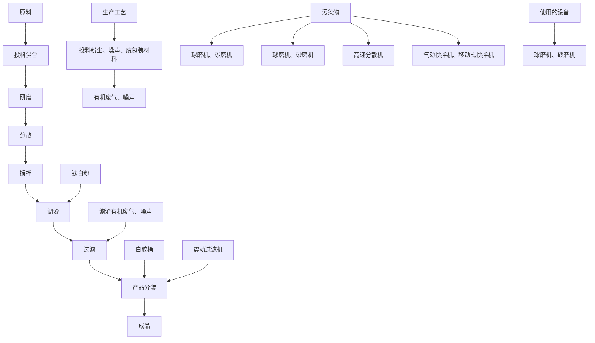
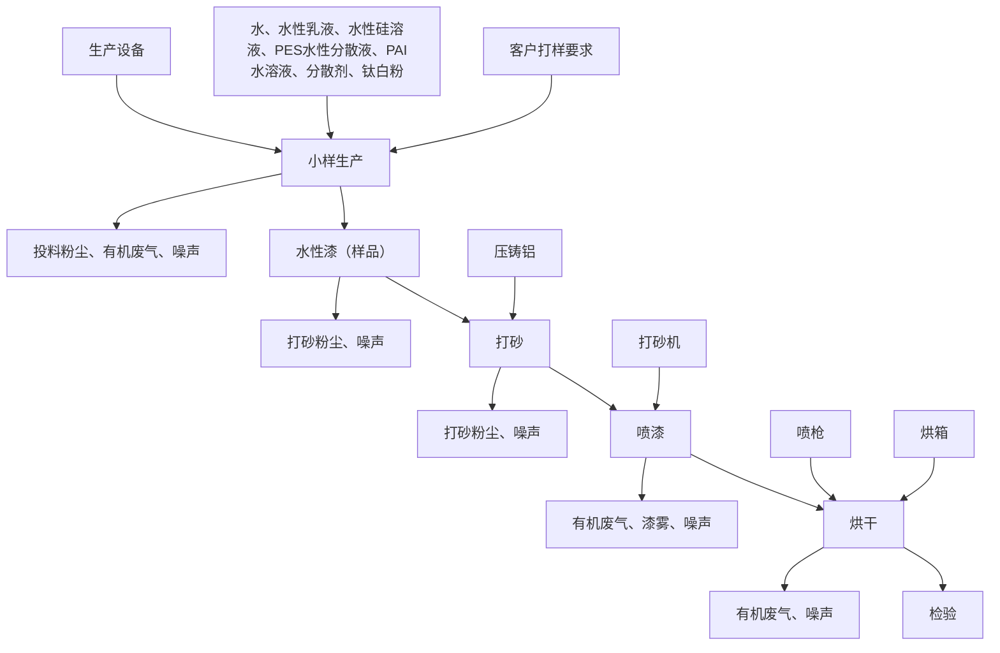
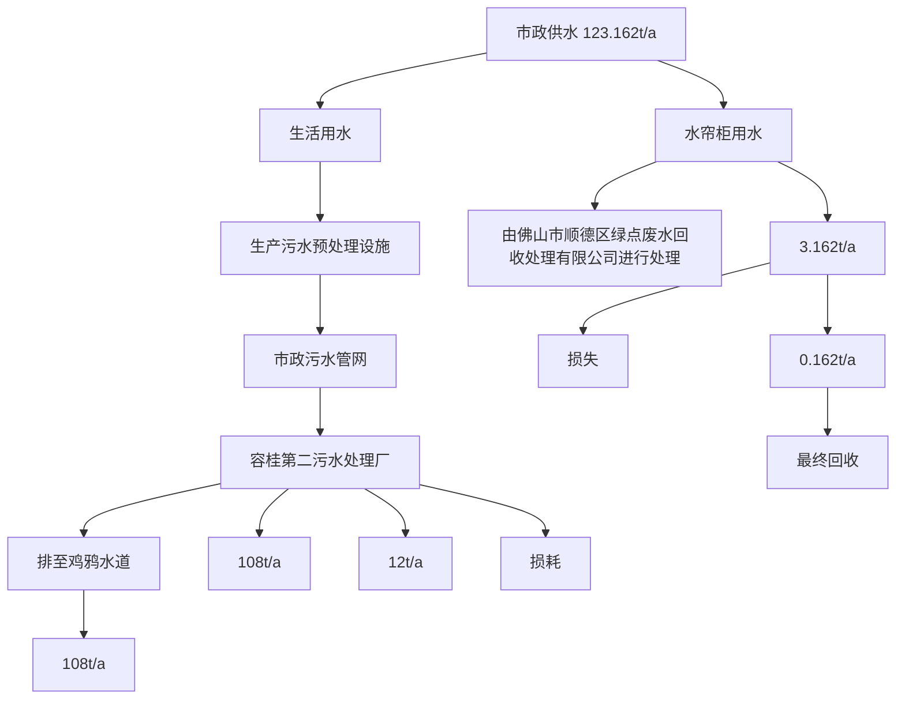
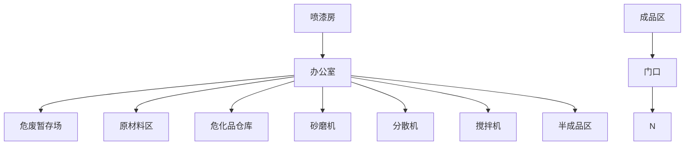

# 建设项目环境影响报告表

项目名称：佛山市顺德区安木森新材料有限公司年产水性涂料 1800吨新建项目

建设单位(盖章)：佛山市顺德区安木森新材料有限公司

编制日期：2019 年 9 月

国家生态环境部制

## 《建设项目环境影响报告表》编制说明

《建设项目环境影响报告表》由具有从事环境影响评价工作资质的单位编制。

1.项目名称----指项目立项批复时的名称，应不超过 30 个字（两个英文字段作一个汉字）。  
2.建设地点----指项目所在地详细地址、公路、铁路应填写起止地点。  
3.行业类别----按国标填写。  
4.总投资----指项目投资总额。  
5.主要环境保护目标----指项目区周围一定范围内集中居民住宅、学校、医院、保护文物、风景名胜区、水源地和生态敏感点等，应尽可能给出保护目标、性质、规模和距厂界距离等。  
6.结论与建议----给出本项目清洁生产、达标排放和总量控制的分析结论，确定污染防治措施的有效性，说明本项目对环境造成的影响，给出建设项目环境可行性的明确结论。同时提出减少环境影响的其它建议。  
7.预审意见----由行业主管部门填写答复意见，无主管部门项目，可不填。  
8.审批意见----由负责审批该项目的环境保护行政主管部门批复。

## 编制单位和编制人员情况表

<table><tr><td colspan="2">建设项目名称</td><td colspan="3">佛山市顺德区安木森新材料有限公司年产水性涂料1800吨新建项目</td></tr><tr><td colspan="2">环境影响评价文件类型</td><td colspan="3">环境影响报告表</td></tr><tr><td colspan="3">一、建设单位情况</td><td colspan="2"></td></tr><tr><td colspan="2">建设单位(签章)</td><td rowspan="4" colspan="3"></td></tr><tr><td colspan="2">法定代表人或主要负责人(签字)</td></tr><tr><td colspan="2">主管人员及联系电话</td></tr><tr><td colspan="2">二、编制单位情况</td></tr><tr><td colspan="2">主持编制单位名称(C25D)</td><td colspan="3">广州国寰环保科技发展有限公司</td></tr><tr><td colspan="2">社会信用代码</td><td colspan="3">91440101691529084H</td></tr><tr><td colspan="2">法定代表人(签字)</td><td rowspan="2" colspan="3"></td></tr><tr><td colspan="2">三、编制人员情况</td></tr><tr><td colspan="2">编制主持人及联系电话</td><td colspan="3">孙伟 13580437834</td></tr><tr><td colspan="5">1.编制主持人</td></tr><tr><td>姓名</td><td colspan="3">职业资格证书编号</td><td>签字</td></tr><tr><td>孙伟</td><td colspan="3">0012989</td><td></td></tr><tr><td colspan="5">2.主要编制人员</td></tr><tr><td>姓名</td><td colspan="2">职业资格证书编号</td><td>主要编写内容</td><td>签字</td></tr><tr><td>孙伟</td><td colspan="2">0012989</td><td>建设项目基本情况、建设项目所在地自然环境社会环境简况、环境质量状况、评价适用标准、建设项目工程分析、项目主要污染物产生及预计排放情况、环境影响分析、项目拟采取的预防措施及预期治理效果、结论与建议</td><td></td></tr><tr><td colspan="5">四、参与编制单位和人员情况</td></tr></table>

natural_image

Portrait of a young man in a dark jacket (no text or symbols visible)

持证人签名：

Signature of the Bearer

百伟

管理号：

FileNo.

姓名：

Full name孙伟

性别：

出生年月：

DateofBirth1983年09月

专业类别：

Professional Type

批准日期：

Approval

签发单位

Issued by

text_image

Date
2013年05月26
人力资源和社会部
2013年
22

text_image

环保科技
签发日期：
Issued on
源和社

本证书由中华人民共和国人力资会保障部、环境保护部批准颈发，它表明持证人通过国家统一组织的考试，取得环境影响评价工程师的职业责格

This is to certify that thebearer of the Certificate has passed national examination organized by the Chinese government departments and has obtained qualifications forEnvironmentalImpact Assessment

text_image

中华人民共和国人力资源和社会保障部
approved & authorized
by

Ministry ouman Resources and Social Security The People's Republie of China

text_image

中华人民共和国环境保护
approved & authorized
by
Ministry of Environmental Protection
The People's Republic of China

编号：0012989

No.

## 目录

一、建设项目基本情况...  
二、建设项目所在地自然环境简况..  
三、环境质量状况..  
四、评价适用标准..  
五、建设项目工程分析.... .20  
六、项目主要污染物产生及预计排放情况... .30  
七、环境影响分析.. 31  
八、建设项目拟采取的防治措施及预期治理效果... .50  
九、结论与建议.... 51

附件1 营业执照与法人身份证

附件2 租赁合同

附件3 罚款资料

附图1 本项目地理位置图

附图2 本项目卫星地图及噪声监测（N#为噪声监测布点）

附图3 本项目大气评价范围及敏感点图

附图4 本项目平面布置图

附图5 本项目四至图及周围环境示意图

附图6 顺德区产业发展保护区区划图

附图7 本项目所在的控制性规划

附图8 本项目所在区域的地表水环境功能区划图

附图9 本项目所在区域的地下水环境功能区划图

附图10 本项目所在区域的大气环境功能区划图

附图11 本项目所在区域的声环境功能区划图

附图12 本项目所在区域的生态环境功能区划图

附表1 建设项目大气环境影响评价自查表

附表2 环境风险评价自查表

附表3 地表水环境影响评价自查表

附表4 土壤环境影响评价自查表

附表5 建设项目环评审批基础信息表

## 一、建设项目基本情况

<table><tr><td>项目名称</td><td colspan="5">佛山市顺德区安木森新材料有限公司年产水性涂料1800吨新建项目</td></tr><tr><td>建设单位</td><td colspan="5">佛山市顺德区安木森新材料有限公司</td></tr><tr><td>法人代表</td><td colspan="2"></td><td>联系人</td><td colspan="2"></td></tr><tr><td>通讯地址</td><td colspan="5">佛山市顺德区容桂华口居委会昌宝东路16号天富来国际工业城8座304号之一</td></tr><tr><td>联系电话</td><td></td><td>传真</td><td>/</td><td>邮政编码</td><td>528305</td></tr><tr><td>建设地点</td><td colspan="5">佛山市顺德区容桂华口居委会昌宝东路16号天富来国际工业城8座304号之一(经纬度坐标:113.314608°E,22.763493°N)</td></tr><tr><td>审批部门</td><td colspan="2">——</td><td>批准文号</td><td colspan="2">——</td></tr><tr><td>建设性质</td><td colspan="2">新建√改建□扩建□</td><td>行业类别及代码</td><td colspan="2">C2641涂料制造</td></tr><tr><td>占地面积(平方米)</td><td colspan="2">772.88</td><td>建筑面积(平方米)</td><td colspan="2">772.88</td></tr><tr><td>总投资(万元)</td><td>100</td><td>其中:环保投资(万元)</td><td>15</td><td>环保投资占总投资比例</td><td>15%</td></tr><tr><td>评价经费(万元)</td><td>1</td><td>投产日期</td><td colspan="3">2019年9月</td></tr><tr><td colspan="6">工程内容及规模:一、本项目概况及评价任务由来佛山市顺德区安木森新材料有限公司年产水性涂料1800吨新建项目(以下称“本项目”)位于佛山市顺德区容桂华口居委会昌宝东路16号天富来国际工业城8座304号之一,中心地理坐标为:东经113.314608°,北纬22.763493°。本项目主要从事水性涂料的生产,计划年产水性涂料1800吨/年。本项目占地面积772.88平方米,建筑面积772.88平方米。建设项目地理位置图见附图1,四至图见附图1,平面布置图见附图4。根据《中华人民共和国环境影响评价法》(2018年12月29日修订)、《国务院关于修改〈建设项目环境保护管理条例〉的决定》(国务院令第682号)等法律法规的规定,建设对环境有影响的项目必须进行环境影响评价。参照《建设项目环境影响评价分类管理名录》(环境保护部令第44号)及《关于修改&lt;建设项目环境影响评价分类管理名录&gt;部分内容的决定》(生态环境部令第1号),本项目属于“十五、化学原料和化学制品制造业”中的“36涂料制造”中的“单纯混合或分装”,按要求需编制建设项目环境影响报告表。二、本项目基本情况</td></tr></table>

## 1、本项目名称、地点、性质、建设单位

（1）项目名称：佛山市顺德区安木森新材料有限公司年产水性涂料1800吨新建项目  
（2）建设地点：佛山市顺德区容桂华口居委会昌宝东路16号天富来国际工业城8座 304号之一  
（3）建设性质：新建  
（4）建设单位：佛山市顺德区安木森新材料有限公司  
（5）总投资：100万元  
（6）占地面积：772.88平方米；建筑面积：772.88平方米

## 2、本项目工程组成

项目工程组成见下表：

表 1-1 本项目工程组成

<table><tr><td>项目</td><td>内容</td><td>规模</td><td>用途</td></tr><tr><td rowspan="6">主体工程</td><td>生产车间</td><td>约228.69m2</td><td>投料、分散、研磨、搅拌、调漆和过滤工序</td></tr><tr><td>原材料区</td><td>200m2</td><td>存放原材料</td></tr><tr><td>半成品区</td><td>约100m2</td><td>存放半成品</td></tr><tr><td>成品区</td><td>约100m2</td><td>存放成品</td></tr><tr><td>喷漆房</td><td>14.19m2</td><td>用于喷漆作业</td></tr><tr><td>办公室</td><td>约130m2</td><td>用于日常办公</td></tr><tr><td rowspan="2">公用工程</td><td>给排水系统</td><td>一套</td><td>供水来源为市政自来水,生活污水经生活污水预处理措施处理后排入容桂第二污水处理厂,尾水排入鸡鸦水道</td></tr><tr><td>供电系统</td><td>一套</td><td>市政供电,年用电量约5万千瓦时</td></tr><tr><td rowspan="4">环保工程</td><td>生活污水预处理措施</td><td>一套</td><td>生活污水经生活污水预处理措施预处理后纳入容桂第二污水处理厂,其尾水纳入鸡鸦水道</td></tr><tr><td>“水帘柜+UV光解+活性炭吸附”装置</td><td>一套</td><td>用来出来分散、研磨、喷漆和烘干产生的有机废气和漆雾</td></tr><tr><td>危废暂存场</td><td>20m2</td><td>危废暂存</td></tr><tr><td>事故应急池</td><td>30m3</td><td>应急事故池</td></tr></table>

## 3、项目主要产品、原辅材料及器材

## （1）主要产品方案

本项目主要从事水性涂料的生产，本项目主要产品名称及建设规模如下表：

表1-2 项目主要产品名称及建设规模

<table><tr><td>产品名称</td><td>单位</td><td>数量</td><td>最大储存量</td><td>包装方式和规格</td></tr><tr><td>水性涂料</td><td>吨/年</td><td>1800</td><td>30</td><td>20kg/桶</td></tr></table>

备注：本项目用于喷漆试验的水性漆量占0.033%，约为0.6t/a。

## （2）主要原辅材料及理化性质

本项目主要从事水性涂料的生产。一个涂料的配方主要由主体树脂、溶剂（水）、颜填料和助剂四个组分组成。建设单位根据同行业的生产经验估算出原辅材料的使用量，详见表1-3。

表1-3 本项目化学原料及能源消耗一览表

<table><tr><td>序号</td><td>名称</td><td>年耗量</td><td>最大储存量</td><td>性状</td><td>规格</td><td>备注</td></tr><tr><td colspan="7">主要化学原料</td></tr><tr><td>1</td><td>水性乳液</td><td>720t</td><td>2.4t</td><td>液态</td><td>1200kg/桶</td><td>外购,乳液</td></tr><tr><td>2</td><td>钛白粉</td><td>18t</td><td>0.5t</td><td>固态</td><td>25kg/袋</td><td>外购,颜料</td></tr><tr><td>3</td><td>水性硅溶胶</td><td>6t</td><td>0.2t</td><td>液态</td><td>200kg/桶</td><td>外购,溶液</td></tr><tr><td>4</td><td>PES 水性分散液</td><td>360t</td><td>10t</td><td>液态</td><td>200kg/桶</td><td>外购,树脂</td></tr><tr><td>5</td><td>PAI 水溶液</td><td>108t</td><td>3t</td><td>液态</td><td>200kg/桶</td><td>外购,溶液</td></tr><tr><td>6</td><td>分散剂</td><td>18t</td><td>0.5t</td><td>液态</td><td>200kg/桶</td><td>外购,助剂</td></tr><tr><td>7</td><td>纯净水</td><td>570t</td><td>15t</td><td>液态</td><td>/</td><td>外购</td></tr><tr><td colspan="7">器材</td></tr><tr><td>1</td><td>白胶桶</td><td>60000 个</td><td>1500 个</td><td>固态</td><td>20L</td><td>外购</td></tr><tr><td>2</td><td>样品罐</td><td>300 个</td><td>20 个</td><td>固态</td><td>/</td><td>外购</td></tr><tr><td>3</td><td>压铸铝</td><td>450kg</td><td>40kg</td><td>固态</td><td>/</td><td>外购</td></tr><tr><td>4</td><td>滤网</td><td>200 个</td><td>20 个</td><td>固态</td><td>/</td><td>外购</td></tr><tr><td colspan="7">能源</td></tr><tr><td>1</td><td>电</td><td>4kW·h</td><td>/</td><td>——</td><td>——</td><td>市政供电</td></tr><tr><td>2</td><td>清洗用水</td><td>75 吨</td><td>/</td><td>——</td><td>——</td><td>外购纯净水</td></tr><tr><td>3</td><td>水帘柜用水</td><td>3.162 吨</td><td>/</td><td>——</td><td>——</td><td>自来水厂</td></tr><tr><td>4</td><td>生活用水</td><td>120 吨</td><td>/</td><td>——</td><td>——</td><td>自来水厂</td></tr></table>

## ③主要化学原料的理化性质见下表

表1-4 本项目主要化学原料理化性质

<table><tr><td>序号</td><td>名称</td><td>物理化性质</td><td>毒性</td><td>健康危害</td><td>易燃易爆性</td><td>是否属于危险化学品</td></tr><tr><td>1</td><td>钛白粉</td><td>主要成分为二氧化钛( $TiO_2$ )的白色颜料,二氧化钛的化学性质极为稳定,是一种偏酸性的两性氧化物。常温下几乎不与其他元素和化合物反应,对氧、氨、氮、硫化氢、二氧化碳、二氧化硫都不起作用,不溶于水、脂肪,也不溶于稀酸及无机酸、碱,只溶于氢氟酸。但在光作用下,钛白粉可发生连续的氧化还原反应,具有光化学活性。</td><td>——</td><td>——</td><td>不燃</td><td>否</td></tr><tr><td>2</td><td>分散剂</td><td>浅棕色透明液体,由2-氨基-2-甲基-1-丙醇(&gt;89%)、2-甲基-2-甲氨基-1-丙醇(&lt;7%)与水(5%)混和而成,无色液体,有胺味,熔点-2°C,沸点100~165°C,闪点81°C(闭杯)。</td><td>LD $_{50}$ :2900mg/kg(大鼠经口);2150mg/kg(小鼠经口)</td><td>对眼睛、呼吸道和皮肤有刺激作用</td><td>易燃</td><td>是</td></tr><tr><td>3</td><td>水性乳液</td><td>将四氟乙烯聚合后的分散液浓缩至聚四氟乙烯固体含量为60%左右(重量)并以非离子型表面活性剂稳定的水分散液;特性及用途:有突出的耐热、耐寒及耐磨性,还有优异的电绝缘性,且不受温度与频率的影响,此外,尚有不粘着、不吸水、不燃烧等特点。指标:外观:白色均匀乳液;树脂含量:60%±2%,粒径:0.05-0.2um,运动粘度(25°C):6-15m/s,酸碱性p≥8,密度(20°C):1.50-1.55g/cm</td><td>无资料</td><td>无资料</td><td>无资料</td><td>否</td></tr><tr><td>4</td><td>水性硅溶胶</td><td>胶体溶液,无臭、无毒。分子式可表示为mSiO·nHO。由于胶体粒子微细(10-20nm),有相当大的比表面积,粒子本身无色透明,不影响被覆盖物的本色。粘度较低,水能渗透的地方都能渗透,因此和其他物质混合时分散性和渗透性都非常好。当硅溶胶水分蒸发时,胶体粒子牢固地附着在物体表面,粒子间形成硅氧结合,是很好的粘合剂。</td><td>无资料</td><td>无资料</td><td>无资料</td><td>否</td></tr><tr><td>5</td><td>PES水性分散液</td><td>又称为聚醚砜树脂,是一种综合性能优异的热塑性高分子材料。它具有优良的耐热性能、物理机械性能、绝缘性能等,特别是具有可以在高温下连续使用和在温度急剧变化的环境中仍能保持性能稳定等突出优点,在许多领域已经得到广泛应用。聚醚砜树脂铅等金属的附着力好,涂层表面硬度高等优良特性,生产用于化工防腐、炊具不粘等涂料。特性参数:吸水性(23°C/24h)0.43%,相对密度:1.37-1.51,拉伸强度(23°C):84.3-124.5,拉伸强度(180°C):41.2-59.8,弯曲强度MPa:129.4-171.5,伸长率:40-80%,冲击强度(缺口):78.4~85.3J/m,洛氏硬度:R120-134</td><td>无资料</td><td>无资料</td><td>无资料</td><td>否</td></tr><tr><td>6</td><td>PAI水溶液</td><td>空气中允许工作温度非常高(在250°C持续工作);在250°C温度范围内最好的尺寸稳定性;优秀的耐磨和摩擦性能;突出的抗紫外线性能;优越的抗高能辐射性能(γ射线和X射线);固有的低可燃性。</td><td>无资料</td><td>无资料</td><td>无资料</td><td>否</td></tr></table>

## 5、主要检测设备清单

本项目主要生产设备详见下表：

表1-5 本项目主要生产验设备明细表

<table><tr><td>序号</td><td>设备名称</td><td>数量</td><td>备注</td></tr><tr><td>1</td><td>高速分散机</td><td>2台</td><td>用于分散工序</td></tr><tr><td>2</td><td>气动搅拌机</td><td>4台</td><td>用于搅拌工序</td></tr><tr><td>3</td><td>砂磨机</td><td>1台</td><td>用于研磨工序</td></tr><tr><td>4</td><td>移动搅拌机</td><td>1台</td><td>用于搅拌工序</td></tr><tr><td>5</td><td>球磨机</td><td>3台</td><td>用于研磨工序</td></tr><tr><td>6</td><td>震动过滤机</td><td>1台</td><td>用于过滤工序</td></tr><tr><td>7</td><td>分散缸1T</td><td>1台</td><td rowspan="5">用于盛装化学物料</td></tr><tr><td>8</td><td>分散缸500L</td><td>3台</td></tr><tr><td>9</td><td>分散缸200L</td><td>1台</td></tr><tr><td>10</td><td>分散缸100L</td><td>1台</td></tr><tr><td>11</td><td>分散缸50L</td><td>1台</td></tr><tr><td>12</td><td>喷枪</td><td>1把</td><td>用于喷漆工序</td></tr><tr><td>13</td><td>水帘柜</td><td>1台</td><td>用于处理废气</td></tr><tr><td>14</td><td>烘箱</td><td>3台</td><td>用于烘干工序</td></tr><tr><td>15</td><td>空压机</td><td>1台</td><td>提供动力</td></tr><tr><td>16</td><td>打砂机</td><td>1台</td><td>用于打砂工序</td></tr></table>

## 6、劳动定员及工作制度

本项目职工10人，均不在项目内食宿。每天工作时间为上午 8：00—12：00；下午1：30—5：30，共8小时，夜间不办公，年工作300天。

## 7、公用工程

（1）供电：采用市政供电，不设备用发电机，用电量5万千瓦时/年。  
（2）供给水：本项目用水全部由市政自来水厂供给，职工办公生活用水 120t/a、水帘柜用水 3.162t/a，共 123.162t/a。  
（3）排水去向：①生活污水经生活污水预处理措施预处理后，通过市政管网，排入容桂第二污水处理厂，尾水排入鸡鸦水道。②清洗废水重新用于水性涂料生产，不外排。③水帘柜废水定期交由佛山市顺德区绿点废水回收处理有限公司收集处理，不外排。

## 三、与相关环保法规政策相符性分析

1、本项目与广东省、顺德区发布的有机污染物治理政策的相符性分析见下表。

表1-6 项目与有机污染物治理政策的相符性

<table><tr><td>序号</td><td>政策要求</td><td>工程内容</td><td>符合性</td></tr><tr><td colspan="4">1.《关于印发&lt;“十三五”挥发性有机物污染防治工作方案&gt;的通知》(环大气[2017]121号)</td></tr><tr><td>1.1</td><td>新建涉VOCs排放的工业企业要入园区</td><td>项目位于天富来工业区</td><td>符合</td></tr><tr><td>1.2</td><td>加强有机废气收集与处理,有机废气收集率不低于80%,建设吸附燃烧等高校治理设施,实现达标排放。</td><td>分散废气经集气罩收集,喷漆烘干废气经整室收集,有机废气收集率为90%</td><td>符合</td></tr><tr><td colspan="4">2.《挥发性有机物无组织排放控制标准》(GB 37822—2019)</td></tr><tr><td>2.1</td><td>鼓励符合环境标志产品技术要求的水基型、无有机溶剂型、低有机溶剂型的涂料、油墨和胶粘剂等的生产和销售</td><td>本项目生产水性涂料,属于文件中提及的低有机溶剂型的涂料</td><td>符合</td></tr><tr><td>2.2</td><td>对于含低浓度VOCs的废气,有回收价值时可采用吸附技术、吸收技术对有机溶剂回收后达标排放;不宜回收时,可采用吸附浓缩燃烧技术、生物技术、吸收技术、等离子体技术或紫外光高级氧化技术等净化后达标排放</td><td>项目产生的VOCs浓度较低,回收价值不大,采用“UV光解+活性炭吸附”装置处理后达标排放</td><td>符合</td></tr><tr><td colspan="4">3.《重点行业挥发性有机物综合治理方案》(环大气[2019]53号)</td></tr><tr><td>3.1</td><td>大力推进源头替代。鼓励加快低VOCs含量涂料、油墨、胶粘剂等研发和生产。</td><td>本项目生产水性涂料,属于文件中提及的鼓励加快低VOCs含量涂料、油墨、胶粘剂等研发和生产</td><td>符合</td></tr><tr><td colspan="4">4.《珠江三角洲地区严格控制工业企业挥发性有机物(VOCs)排放的意见》(粤环[2012]18号)</td></tr><tr><td>4.1</td><td>自然保护区、水源保护区、风景名胜区、森林公园、重要湿地、生态敏感区和其他重要生态功能区实行强制性保护,禁止新建VOCs污染企业。</td><td>选址不在规定区域</td><td>符合</td></tr><tr><td>4.2</td><td>重点推进水性涂料生产和使用,对实施清洁生产达到国际先进水平企业予以优惠政策,引导和鼓励VOCs排放企业削减VOCs排放量</td><td>本项目生产水性涂料,属文件重点推进内容</td><td>符合</td></tr><tr><td colspan="4">5.《广东省挥发性有机物(VOCs)整治与减排工作方案(2018-2020年)》(粤环发[2018]6号)</td></tr><tr><td>5.1</td><td>涂料行业重点推广水性涂料、粉末涂料、高固体份涂料、辐射固化涂料等绿色产品。</td><td>项目产品全部为水性涂料,属于重点推广产品</td><td>符合</td></tr><tr><td>5.2</td><td>优化生产工艺过程。加强工业企业VOCs无组织排放管理,推动企业实施生产过程密封化、连续化、自动化技术改造,强化生产工艺环节的有机废气手机,减少挥发性有机物排放。</td><td>分散废气经集气罩收集,喷漆烘干废气经整室收集,产生的有机废气经收集后通过一个35m高的排气筒G1排放</td><td>符合</td></tr><tr><td colspan="4">6.《广东省人民政府关于印发&lt;广东省打赢蓝天保卫战实施方案(2018-2020年)&gt;的通知》(粤府[2018]128号)</td></tr><tr><td>6.1</td><td>珠三角地区禁止新建生产和使用高VOCs含量溶剂型涂料、油墨、胶粘剂、清洗剂等项目(共性工厂除外</td><td>项目生产的是水性涂料,生产过程中不使用高VOCs含量溶剂型涂料、油墨、胶粘剂、清洗剂等</td><td>符合</td></tr><tr><td colspan="4">7.《顺德区环境保护委员会关于印发顺德区工业挥发性有机物项目(VOCs)审批总量前置实施细则(2016年修订)的通知》(顺环委[2016]3号)</td></tr><tr><td>7.1</td><td>有组织排放量小于0.1吨(不含0.1吨,下同)的建设项目,不需要申请VOCs排放总量指标,直接由环评文件审批部门在环保管理信息系统录入项目排放量,作为VOCs排放总量分配依据;有组织排放量大于0.1吨(含0.1吨,下同)的建设项目,须申请VOCs排放总量指标</td><td>本项目总VOCs排放量为0.027t/a&lt;0.1t/a,不需要申请VOCs排放总量指标。</td><td>符合</td></tr><tr><td colspan="4">综上,项目符合国家产业政策的要求,同时符合广东省及佛山市产业政策和相关规范的要求。2、选址合理性分析企业位于佛山市顺德区容桂华口居委会昌宝东路16号天富来国际工业城8座304号之一</td></tr></table>

（113.314608°E，22.763493°N），项目为已建厂房，项目行业类别为 C2641 涂料制造。根据顺德区控制性详细规划（附图 6）可知，项目所在地位于《容桂华口扁滘片区（RG-05-04、RG-05-05、RG-05-07）控制性详细规划》，该土地利用规划为 M1 一类工业用地，选址用地场所为工业用途，与该地块的土地使用用途一致，项目所在建筑为工业厂房，故项目用地符合规划要求。

## 3、与环境功能区划符合性分析

生活污水经生活污水预处理措施预处理后，通过市政管网，排入容桂第二污水处理厂，尾水排入鸡鸦水道。鸡鸦水道执行《地表水环境质量标准》（GB3838-2002）之Ⅲ类标准。

项目区域空气环境功能区划为二类区，环境空气质量比较好；声环境功能区规划为3类区。该项目废（污）水、废气、噪声和固体废物通过采取评价中提出的治理措施进行有效治理后，不会改变区域环境功能。则该项目的运营与环境功能区划相符合。

## 4、“三线一单”符合性分析

## ①生态保护红线

本项目位于佛山市顺德区容桂华口居委会昌宝东路 16 号天富来国际工业城 8座304号之一，周边无自然保护区；根据《广东省人民政府关于调整佛山市部分饮用水水源保护区的批复（粤府函[2018]426 号）》可知，本项目不在水源保护区范围内，根据《广东省主体功能区划》（粤府[2012]120 号）可知，本项目所在区域不处于生态红线内，故本项目符合生态保护红线要求。

## ②环境质量底线

本项目附近地表水环境、声环境质量以及大气环境均能满足相应的标准要求；本项目废气产生量较小，且废气经过有效的收集处理后排放，对周边环境影响很小。生活污水经生活污水预处理措施预处理后，通过市政管网，排入容桂第二污水处理厂，尾水排入鸡鸦水道。对周围环境影响很小，符合环境质量底线要求。

## ③资源利用上线

本项目营运过程中消耗一定量的电能、水资源，项目资源消耗量相对区域资料利用总量较少，符合资源利用上限的要求。

## ④环保准入负面清单

本项目主要从事水性涂料生产。根据国家《产业结构调整指导目录（2011年本）》（2013年修订）规定，本项目属于上述目录所列的鼓励类项目。因此，项目符合相关的产业政策要求。

根据《广东省人民政府关于印发广东省主体功能区规划的通知》（粤府〔2012〕120号）和《国务院关于同意新增部分县（市、区、旗）纳入国家重点生态功能区的批复》（国函〔2016161号）可知，项目位于优化开发区域，因此，项目符合相关的产业政策要求。

## 与本项目有关的原有污染情况及主要环境问题：

## 1、与项目有关的原有污染源：

项目建设性质为新建，项目在现地址为已建成厂房，为空置厂房，故无原有污染。

## 2、主要环境问题

项目位于佛山市顺德区容桂华口居委会昌宝东路16 号天富来国际工业城8座304号之一，由现场勘查可得，项目西面为空厂房、东面为仓库、北面为天富来八期6座、南面为空厂房（项目四至图见附图 4）。周围主要为规模较小，污染较轻的生产加工类中小型企业，无重污染的大型企业。所在地的污染源主要来自附近企业生产产生的废气、废水、固废、生产噪声以及附近居民生活废水、社会生活噪声、生活垃圾等。

表1-5 本项目现状四至情况

<table><tr><td>序号</td><td>方位</td><td>地点名称</td><td>性质</td></tr><tr><td>1</td><td>项目西面</td><td>空厂房</td><td>空厂房</td></tr><tr><td>2</td><td>项目东面</td><td>仓库</td><td>仓库</td></tr><tr><td>3</td><td>项目北面</td><td>天富来八期6座</td><td>工业厂房</td></tr><tr><td>4</td><td>项目南面</td><td>空厂房</td><td>空厂房</td></tr></table>

## 二、建设项目所在地自然环境简况

自然环境简况（地形、地貌、地质、气候、气象、水文、植被、生物多样性等）：

## 1、地理位置

佛山市位于珠江三角洲腹部，地处西、北江下游，属于珠江三角洲冲积平原，地理坐标北纬 22º38′～23º34′，东经 112º22′～113º23′，毗邻港澳，东倚广州，西连肇庆，南邻江门、中山，北通清远，依托西江干线、东平水道、莲沙容水道等多条1000t 级及以上航道，佛山市水运上可达南宁、贵港、梧州，下可直通港澳、东南亚及我国沿海。佛山市港口已成为珠江三角洲地区的重要交通枢纽，也是佛山市经济发展特别是外向型经济发展的重要依托，佛山港被交通部确定为全国28 个内河主要港口之一。

佛山市顺德区位于广东省南部，珠三角洲腹地中部平原的水网地带。地理坐标为东经113°1′～113°23′，北纬 22°40′～23°2′。东西长 38.7km，南北长 38km，总面积约 806km2。北和西北靠南海区，东接广州番禺区，西南与新会、鹤山相邻，东南与中山市交界。

## 2、地质、地貌

顺德区为平原水网地带，平原面积占总面积的 59%，水面（含河涌、鱼塘）约占 36%，还有少量的山丘高地，约占5%。地形平坦，地势自西北向东南略为倾斜，大部分地区海拔0.2～2m。海拔 10m 以上的小山面积约 40km2，而海拔大于 100m 的山岗仅有 5 个，以顺峰山主峰大岭为最高，海拔172.5m；其次为锦屏山主峰金盘岭，海拔 172m；其余多在100m 以下。本项目所在的顺德区伦教街道绝大部分为珠江三角洲冲积平原，地势相差不大，高差约1.0\~2.0m。

## 3、气候、气象

本项目所在地属珠江三角洲冲积平原，地势平坦，由西江﹑北江泥沙长期淤积而成，平均海拔约 1.4m（黄海高程系）。顺德区位于北回归线以南，属于南亚热带海洋性季风气候区。本采用的是顺德气象站（59480）资料，气象站位于广东省佛山市，地理坐标为东经 113.2442度，北纬 22.8486 度，海拔高度 21.4 米。近 20 年的资料气象数据统计分析如表 2-1。

表2-1 顺德气象站常规气象项目统计

<table><tr><td colspan="2">统计项目</td><td>统计值</td><td>极值出现时间</td><td>极值</td></tr><tr><td colspan="2">多年平均气温(°C)</td><td>23.5</td><td></td><td></td></tr><tr><td colspan="2">累年极端最高气温(°C)</td><td>37.6</td><td>2017-08-22</td><td>39.2</td></tr><tr><td colspan="2">累年极端最低气温(°C)</td><td>5.2</td><td>2016-01-24</td><td>2.8</td></tr><tr><td colspan="2">多年平均气压(hPa)</td><td>1010.6</td><td></td><td></td></tr><tr><td colspan="2">多年平均水汽压(hPa)</td><td>22.1</td><td></td><td></td></tr><tr><td colspan="2">多年平均相对湿度(%)</td><td>72.7</td><td></td><td></td></tr><tr><td colspan="2">多年平均降雨量(mm)</td><td>1761.4</td><td>2008-06-25</td><td>257.8</td></tr><tr><td>灾害天气统计</td><td>多年平均沙暴日数(d)多年平均雷暴日数(d)</td><td>0.070.4</td><td></td><td></td></tr><tr><td rowspan="2"></td><td>多年平均冰雹日数(d)</td><td>0.3</td><td></td><td></td></tr><tr><td>多年平均大风日数(d)</td><td>2.1</td><td></td><td></td></tr><tr><td colspan="2">多年实测极大风速(m/s)、相应风向</td><td>7.8</td><td>2014-06-03</td><td>25.5W</td></tr><tr><td colspan="2">多年平均风速(m/s)</td><td>2.3</td><td></td><td></td></tr><tr><td colspan="2">多年主导风向、风向频率(%)</td><td>S10.1</td><td></td><td></td></tr></table>

顺德气象站主要风向为 S和 NNW、SE、E，占 38.1％，其中以 S为主风向，占到全年 10.1％左右。近20年资料分析的风向玫瑰图如下图。

radar chart

20年风向频率统计图 (1998-2017) (静风频率: 5.4 %)
| Direction | 风向频率 |
| :--- | :--- |
| N | 8 |
| NE | 6 |
| ENE | 5 |
| E | 7 |
| ESE | 6 |
| SE | 9 |
| SSE | 10 |
| S | 11 |
| SSW | 3 |
| SW | 2 |
| WSW | 1 |
| WNW | 8 |
| NW | 7 |
| NNW | 9 |

顺德气象站近20年年降水总量无明显变化趋势，2016年年总降水量最大（2413.50毫米），2004年年总降水量最小（1215.10毫米），周期为10年。顺德气象站05月降水量最大（291.62毫米），12月降水量最小（39.10毫米），近20年极端最大日降水出现在2008-06-25（257.8毫米）。

## 4、河流水文

顺德区有北江和西江两大水系，水系总流向为自西北向东南方向。境内河流纵横交错，主要河流自北向南有东平水道、陈村水道、顺德水道、顺德支流、容桂水道、东海水道等16 条，总长 212 公里，水面积 73.4 平方公里。境内水系全程均受潮汐影响，属混合潮中的非正规半日周潮型。顺德水道常水位 0.3\~1.40 米之间，枯水位在－0.8\~0.2 米之间，最高水位为6.19 米（94年6月19日）；西江顺德支流常水位 0.8\~1.50 米之间，枯水位在－0.6\~0.3 米之间，最高水位为6.80米（94年6月19日）。目前两河流顺德段水质良好，受洪水及潮汐影响较明显，平水期和枯水期涨潮时会产生逆流。

## 5、土壤植被

本区植被较简单，以平原农林生态系统中农林绿化植物群落为主。本地区内无珍稀野生动、植物。

## 三、环境质量状况

建设项目所在地区域环境质量现状及主要环境问题（环境空气、地面水、地下水、声环境、生态环境等）：

## 1、本项目所在区域环境功能区划

本项目所在区域环境功能区划见表 3-1：

表3-1 建设项目环境功能区划一览表

<table><tr><td>编号</td><td>项目</td><td>功能区确定依据</td><td>类别</td></tr><tr><td>1</td><td>水环境功能区</td><td>《顺德区生态环境保护规划(2011~2020年)》(顺府办函(2013)41号)</td><td>鸡鸦水道执行《地表水环境质量标准》(GB3838-2002)中的III类标准</td></tr><tr><td>2</td><td>环境空气质量功能区</td><td>《关于调整顺德区环境空气质量功能区划的复函》(佛府办函[2014]494号)</td><td>属二类区域,执行《环境空气质量标准》(GB3095-2012)及2018年修改单中的二级标准</td></tr><tr><td>3</td><td>声环境功能区</td><td>《关于印发佛山市声环境功能区划分方案的通知》(佛府函)[2015]72号)</td><td>项目所在地属3类区域,属于3303容桂东部工业区,执行《声环境质量标准》(GB3096-2008)中的3类标准</td></tr><tr><td>4</td><td>是否基本农田保护区</td><td>《顺德区土地利用总体规划(2010-2020)》(粤府函[2011]37号</td><td>否</td></tr><tr><td>5</td><td>是否风景名胜区</td><td rowspan="4">《广东省主体功能区划》(粤府[2012]120号)</td><td>否</td></tr><tr><td>6</td><td>是否自然保护区</td><td>否</td></tr><tr><td>7</td><td>是否森林公园</td><td>否</td></tr><tr><td>8</td><td>是否生态功能保护区</td><td>否</td></tr><tr><td>9</td><td>是否水土流失重点防护区</td><td>——</td><td>否</td></tr><tr><td>10</td><td>是否生态敏感与脆弱区</td><td>——</td><td>否</td></tr><tr><td>11</td><td>是否重点文物保护单位</td><td>《顺德区文物保护单位名录》</td><td>否</td></tr><tr><td>12</td><td>是否水源保护区</td><td>——</td><td>否</td></tr><tr><td>13</td><td>是否属于污水处理厂集污范围</td><td>——</td><td>是,属于容桂第二污水处理厂纳污范围</td></tr><tr><td colspan="4">备注:项目属于C2641涂料制造,根据《环境影响评价技术导则土壤环境》(HJ 964-2018)附录A,属于制造业中石油、化工类的“涂料、染料、颜料、油墨及其类似产品制造”,但项目工艺属于单纯混合和分装,列入IV类;且厂房地面采取防腐防渗措施可有效防范污染物下渗污染的发生,在一般情况下不会造成土壤污染。综上,项目可不开展土壤环境影响评价工作。</td></tr></table>

## 2、水环境质量现状

## （1）地表水环境质量现状

项目所处位置属于容桂第二污水处理厂纳污范围。项目生活污水经生活污水预处理设施处理后通过市政管网排入容桂第二污水处理厂，尾水排入鸡鸦水道，后汇入洪奇沥水道。鸡鸦水道执行《地表水环境质量标准》（GB3838-2002）中的Ⅲ类标准；洪奇沥水道水质执行《地表水环境质量标准》（GB3838—2002）中的Ⅲ类标准。

为评价鸡鸦水道和洪奇沥水道的水质，本报告引用引用广东诚浩环境监测有限公司于2018年10月17日—2018年10月19日就《广东达宜明粉末冶金有限公司第三条成型烧结生产线及新租赁厂房扩建项目环境影响报告书》项目对鸡鸦水道和洪奇沥水道（W1、W2、W3监测断面见附图1）监测结果数据。

表 3-2 地表水监测结果 单位：mg/L，pH 值除外

<table><tr><td rowspan="3">点位编号</td><td rowspan="3">监测点位置</td><td rowspan="3">检测项目</td><td colspan="6">检测结果</td><td rowspan="3">标准限值</td></tr><tr><td colspan="2">2018-10-17</td><td colspan="2">2018-10-18</td><td colspan="2">2018-10-19</td></tr><tr><td>涨潮</td><td>退潮</td><td>涨潮</td><td>退潮</td><td>涨潮</td><td>退潮</td></tr><tr><td rowspan="10">W1</td><td rowspan="10">鸡鸦水道与大岑沥水道交汇处上游500m处</td><td>水温</td><td>24.5</td><td>25.4</td><td>23.7</td><td>23.8</td><td>23.9</td><td>24.1</td><td>--</td></tr><tr><td>PH值</td><td>6.69</td><td>6.64</td><td>6.73</td><td>6.67</td><td>6.71</td><td>6.63</td><td>6-9</td></tr><tr><td>溶解氧</td><td>6.4</td><td>6.2</td><td>6.8</td><td>6.4</td><td>6.5</td><td>6.1</td><td>5</td></tr><tr><td>悬浮物</td><td>26</td><td>28</td><td>21</td><td>22</td><td>20</td><td>22</td><td>--</td></tr><tr><td>化学需氧量</td><td>8</td><td>7</td><td>8</td><td>7</td><td>10</td><td>11</td><td>20</td></tr><tr><td>五日生化需氧量</td><td>0.6</td><td>0.7</td><td>0.6</td><td>0.8</td><td>0.6</td><td>0.7</td><td>4</td></tr><tr><td>氨氮</td><td>0.320</td><td>0.332</td><td>0.332</td><td>0.320</td><td>0.338</td><td>0.319</td><td>1.0</td></tr><tr><td>磷酸盐</td><td>0.10</td><td>0.11</td><td>0.09</td><td>0.09</td><td>0.11</td><td>0.10</td><td>--</td></tr><tr><td>LAS</td><td>ND</td><td>ND</td><td>ND</td><td>ND</td><td>ND</td><td>ND</td><td>0.2</td></tr><tr><td>石油类</td><td>0.01</td><td>0.01</td><td>ND</td><td>ND</td><td>0.01</td><td>0.01</td><td>0.05</td></tr><tr><td rowspan="10">W2</td><td rowspan="10">鸡鸦水道与洪奇沥水道交汇处上游500m处</td><td>水温</td><td>24.9</td><td>25.5</td><td>23.7</td><td>23.8</td><td>23.8</td><td>24.2</td><td>--</td></tr><tr><td>PH值</td><td>6.74</td><td>6.70</td><td>6.72</td><td>6.71</td><td>6.82</td><td>6.78</td><td>6-9</td></tr><tr><td>溶解氧</td><td>6.3</td><td>6.1</td><td>6.2</td><td>6.0</td><td>6.4</td><td>6.0</td><td>5</td></tr><tr><td>悬浮物</td><td>25</td><td>27</td><td>28</td><td>28</td><td>27</td><td>27</td><td>--</td></tr><tr><td>化学需氧量</td><td>9</td><td>10</td><td>11</td><td>12</td><td>9</td><td>8</td><td>20</td></tr><tr><td>五日生化需氧量</td><td>0.7</td><td>0.8</td><td>0.6</td><td>0.8</td><td>1.0</td><td>0.8</td><td>4</td></tr><tr><td>氨氮</td><td>0.135</td><td>0.143</td><td>0.152</td><td>0.138</td><td>0.157</td><td>0.149</td><td>1.0</td></tr><tr><td>磷酸盐</td><td>0.05</td><td>0.05</td><td>0.04</td><td>0.04</td><td>0.06</td><td>0.05</td><td>--</td></tr><tr><td>LAS</td><td>ND</td><td>ND</td><td>ND</td><td>ND</td><td>ND</td><td>ND</td><td>0.2</td></tr><tr><td>石油类</td><td>ND</td><td>ND</td><td>ND</td><td>ND</td><td>ND</td><td>ND</td><td>0.05</td></tr><tr><td rowspan="10">W3</td><td rowspan="10">鸡鸦水道与洪奇沥水道交汇处下游2500m处</td><td>水温</td><td>24.9</td><td>25.2</td><td>23.8</td><td>23.9</td><td>23.9</td><td>24.1</td><td>--</td></tr><tr><td>PH值</td><td>6.61</td><td>6.64</td><td>6.64</td><td>6.67</td><td>6.58</td><td>6.64</td><td>6-9</td></tr><tr><td>溶解氧</td><td>6.7</td><td>6.3</td><td>6.6</td><td>6.5</td><td>6.4</td><td>6.2</td><td>5</td></tr><tr><td>悬浮物</td><td>26</td><td>21</td><td>21</td><td>23</td><td>23</td><td>23</td><td>--</td></tr><tr><td>化学需氧量</td><td>9</td><td>8</td><td>11</td><td>13</td><td>8</td><td>12</td><td>20</td></tr><tr><td>五日生化需氧量</td><td>0.9</td><td>1.0</td><td>1.1</td><td>1.2</td><td>1.1</td><td>1.3</td><td>4</td></tr><tr><td>氨氮</td><td>0.239</td><td>0.253</td><td>0.250</td><td>0.242</td><td>0.253</td><td>0.267</td><td>1.0</td></tr><tr><td>磷酸盐</td><td>0.04</td><td>0.04</td><td>0.05</td><td>0.06</td><td>0.04</td><td>0.03</td><td>--</td></tr><tr><td>LAS</td><td>ND</td><td>ND</td><td>ND</td><td>ND</td><td>ND</td><td>ND</td><td>0.2</td></tr><tr><td>石油类</td><td>ND</td><td>ND</td><td>ND</td><td>ND</td><td>ND</td><td>ND</td><td>0.05</td></tr></table>

由地表水监测结果表及水质标准指数分析可以看出，鸡鸦水道和洪奇沥水道的水环境现状

较好，鸡鸦水道和洪奇沥水道各水质监测项目均符合《地表水环境质量标准》（GB3838-2002）Ⅲ类标准的要求，未出现超标情况，水质良好。

## （2）地下水环境质量现状

根据《关于同意广东省地下水功能区划的复函》（粤办函[2009]459 号）及广东省水利厅地下水功能区划（文本）可知，项目所在区域属珠江三角洲佛山顺德不宜开采区，地下水类型为孔隙水，面积为441.52km2，矿化度1->10g/L，现状水质类型为Ⅴ类，地下水功能保护目标为：Ⅴ类，开采水位维持现状，目前 Fe、NH4+、矿化度超标。

## 3、大气环境质量现状

本项目位于佛山市顺德区容桂华口居委会昌宝东路 16 号天富来国际工业城 8座304号之一，根据《佛山市人民政府办公室关于调整顺德区环境空气质量功能区域的复函》（佛府办函【2014】494号，2014年8 月）和《顺德区生态环境保护规划（2011-2020 年）》，顺德区全境为大气环境二类区，本项目所在地属环境空气质量功能区的二类，区域的环境空气质量执行国家《环境空气质量标准》（GB3095-2012）及2018年修改单中的二级标准。

## （1）基本污染物环境质量现状

为评价本项目所在区域的环境空气质量现状，引用《顺德区环境运输和城市管理局（环境保护）关于发布 2018 年度佛山市顺德区环境质量状况公报的通知》（顺管环保函[2018]12 号）附件《2018 年度顺德区环境质量状况公报》的数据。该地区空气质量执行《环境空气质量标准》（GB3095-2012）及2018 年修改单中的二级标准，基本污染物环境质量现状评价如下：

表3-3 2018年顺德区（国控测点）环境空气质量现状评价表

<table><tr><td>污染物</td><td>年评价指标</td><td>现状浓度</td><td>标准值</td><td>占标率/%</td><td>达标情况</td></tr><tr><td> $SO_{2}$ (ug/m3)</td><td>年平均质量浓度</td><td>9</td><td>60</td><td>15</td><td>达标</td></tr><tr><td> $NO_{2}$ (ug/m3)</td><td>年平均质量浓度</td><td>40</td><td>40</td><td>100</td><td>达标</td></tr><tr><td> $PM_{10}$ (ug/m3)</td><td>年平均质量浓度</td><td>57</td><td>70</td><td>81.43</td><td>达标</td></tr><tr><td> $PM_{2.5}$ (ug/m3)</td><td>年平均质量浓度</td><td>33</td><td>35</td><td>94.29</td><td>达标</td></tr><tr><td>CO(mg/m3)</td><td>95百分位数日平均质量浓度</td><td>1.3</td><td>4</td><td>32.5</td><td>达标</td></tr><tr><td> $O_{3}$ (ug/m3)</td><td>90百分位数最大8小时平均质量浓度</td><td>185</td><td>160</td><td>115.625</td><td>不达标</td></tr></table>

## （2）空气质量达标区判定

《环境影响评价技术导则-大气环境》（HJ2.2-2018）第 6.4.1.2 条规定，国家或地方生态环境主管部门公开发布的城市环境空气质量达标情况，判断项目所在区域是否属于达标区，因此本报告采用《佛山市生态环境局顺德分局关于发布2018 年度佛山市顺德区环境质量状况公报》，2018年全区 SO2（二氧化硫）、NO2（二氧化氮）、PM10（可吸入颗粒物）、PM2.5（细颗粒物）平均浓度分别为 9、40、57、33 微克/立方米，O3（臭氧）浓度日最大 8 小时平均值第90位百分数为185微克/立方米，CO（一氧化碳）浓度日均值第95位百分数为 1.3毫克/立方米，其中 $\mathrm { O } _ { 3 }$ 未达到《环境空气质量标准》(GB3095-2012)及2018 年修改单的二级标准，其他指标都达标。全区 AQI（空气质量指数）优良天数为 290 天（2017 年为 288 天），优良率79.5%（2017 年 78.9%）。根据《环境影响评价技术导则-大气环境》（HJ2.2-2018）的规定，判定本项目所在的顺德区为环境空气质量不达标区。

根据《佛山市人民政府办公室关于印发佛山市大气环境质量达标规划的通知》（佛府办函[2018]537 号），佛山市大气环境质量达标规划目标如下：以习近平总书记对广东工作重要指示批示及党的十九大关于“实行最严格的生态环境保护制度”精神为指导，以控制颗粒物、二氧化氮、臭氧等污染物为重点，以工业源、移动源、面源污染防治为着力点，实施多手段多污染物协同减排，推动区域大气污染防治工作上新台阶，力争空气质量排名有所提升，到 2020 年空气质量达到国家空气环境质量二级标准。

阶段目标年分别为2018年和2020年。2018年为近期规划年，要求多污染物协同减排成效显著。2020年为中远期规划年，要求空气质量实现全面达标，空气质量优良率达到90%以上。

## （3）其他污染物环境质量现状

本项目主要排放的污染物为 VOCs，为了解评价区域周围地区的其他污染物现状情况，本报告引用《广东华润涂料有限公司高性能环保涂料扩产项目环境影响报告书》中由广东增源检测技术有限公司于2018年5月14日至2018年5月20日为期7天在华口社区的监测数据，监测点位于项目所在地东侧约1140m，位于评价范围内。引用监测项目为 TVOC。监测结果及评价如下。

表3-4 其他污染物补充监测点位基本信息

<table><tr><td>监测点名称</td><td>监测因子</td><td>监测时段</td><td>相对厂址方位</td><td>相对厂界距离/m</td></tr><tr><td>A1 华口社区</td><td>TVOC</td><td>2018.5.14~2018.5.20</td><td>东</td><td>1136</td></tr></table>

表3-5 项目所在区域的TVOC环境质量现状调查结果

<table><tr><td rowspan="2">监测点位</td><td colspan="2">坐标</td><td rowspan="2">污染物</td><td rowspan="2">平均时间</td><td rowspan="2">评价标准/ $(mg/m^3)$ </td><td rowspan="2">监测浓度范围/ $(mg/m^3)$ </td><td rowspan="2">最大浓度占标率/%</td><td rowspan="2">超标率/%</td><td rowspan="2">达标情况</td></tr><tr><td>X</td><td>Y</td></tr><tr><td>A1</td><td>1166</td><td>-31</td><td>TVOC</td><td>日均浓度</td><td>0.6</td><td>0.0749~0.0912</td><td>15.2</td><td>0</td><td>达标</td></tr></table>

其他污染物 TVOC 监测点监测结果均达到《环境影响评价技术导则-大气环境》（HJ2.2-2018）附录D其他污染物空气质量浓度参考限值。

## 4、环境质量现状

根据《佛山市人民政府关于印发佛山市声环境功能区划分方案的通知》（佛府函[2015]72号），项目所在地属于 3类区，执行《声环境质量标准》（GB3096-2008）3 类标准，即昼间≤65dB(A)，夜间≤55dB(A)。

本项目所在地布设了北边界 1#、东边界 2#（西边、南边与其他厂房相邻，不设布点）2个环境噪声监测点，项目评价组于 2019 年 8 月 8 日、9 日15：00、24：00分昼、夜间对项目厂界噪声（项目声环境监测布点图见附图2）进行监测，监测结果如下：

表 3-6 本项目厂界声环境监测数据 单位：dB（A）

<table><tr><td rowspan="2">边界及编号</td><td colspan="2">昼间</td><td rowspan="2">达标情况≤65dB(A)</td><td colspan="2">夜间</td><td rowspan="2">达标情况≤55dB(A)</td><td rowspan="2">评价标准</td></tr><tr><td>8日</td><td>9日</td><td>8日</td><td>9日</td></tr><tr><td>北边界1#</td><td>59.7</td><td>58.2</td><td>达标</td><td>51.4</td><td>50.8</td><td>达标</td><td rowspan="2">执行《声环境质量标准》(GB3096-2008)3类</td></tr><tr><td>东边界2#</td><td>59.5</td><td>58.3</td><td>达标</td><td>50.7</td><td>51.3</td><td>达标</td></tr><tr><td colspan="8">注:本项目西、南边厂界与其他厂房相邻,不具备监测条件,因此上述边界不设噪声监测点</td></tr></table>

根据监测结果可知，各噪声监测点昼间、夜间噪声值均达标，能够满足《声环境质量标准》（GB3096-2008）中3类标准的要求，故项目所在地噪声达到区域声环境功能要求。

## 主要环境保护目标：

## 1、本项目外环境关系

本项目位于佛山市顺德区容桂华口居委会昌宝东路16号天富来国际工业城8座304号之一，中心地理坐标为：东经113.314608°，北纬22.763493°。项目西面为空厂房、东面为仓库、北面为天富来八期6座、南面为空厂房。

## 2、项目主要环境保护目标

表3-7 项目周围主要环境敏感点  
注：以项目中心为原点（X=0，Y=0），正北方向为 Y 正向，正东方向为 X 正向

<table><tr><td rowspan="2">名称</td><td colspan="2">坐标</td><td rowspan="2">保护对象</td><td rowspan="2">环境功能区</td><td rowspan="2">保护内容</td><td rowspan="2">相对厂址方位</td><td rowspan="2">相对厂界距离/m</td><td rowspan="2">保护级别</td></tr><tr><td>X</td><td>Y</td></tr><tr><td>灏景湾</td><td>-1381</td><td>1150</td><td>居民</td><td rowspan="8">大气环境二类区</td><td>约1000人</td><td>西北面</td><td>约1766m</td><td rowspan="8">《环境空气质量标准》(GB3095-2012)及2018年修改单的二级标准</td></tr><tr><td>小黄圃社区</td><td>-40</td><td>1405</td><td>居民</td><td>约3000人</td><td>西北面</td><td>约1403m</td></tr><tr><td>高黎社区</td><td>2047</td><td>2088</td><td>居民</td><td>约200人</td><td>东北面</td><td>约2905m</td></tr><tr><td>华口社区</td><td>1166</td><td>-31</td><td>居民</td><td>约3000人</td><td>东面</td><td>约1136m</td></tr><tr><td>大岑村</td><td>1177</td><td>-1077</td><td>居民</td><td>约1500人</td><td>东南面</td><td>约1543m</td></tr><tr><td>扁滘社区</td><td>-467</td><td>-800</td><td>居民</td><td>约2000人</td><td>西南面</td><td>约907m</td></tr><tr><td>容边社区</td><td>-1223</td><td>-2086</td><td>居民</td><td>约1500人</td><td>西南面</td><td>约2400m</td></tr><tr><td>容里社区</td><td>-1450</td><td>410</td><td>居民</td><td>约4000人</td><td>西面</td><td>约1491m</td></tr><tr><td>眉蕉河</td><td>/</td><td>/</td><td>河涌水质</td><td>IV类水</td><td>/</td><td>东北面</td><td>约595m</td><td rowspan="2">《地表水环境质量标准》(GB3838-2002)中的IV类标准</td></tr><tr><td>眉蕉河支流</td><td>/</td><td>/</td><td>河涌水质</td><td>IV类水</td><td>/</td><td>东南面</td><td>约369m</td></tr><tr><td>德胜河</td><td>/</td><td>/</td><td>河涌水质</td><td>III类水</td><td>/</td><td>西北面</td><td>约3016m</td><td rowspan="2">《地表水环境质量标准》(GB3838-2002)中的III类标准</td></tr><tr><td>鸡鸦水道</td><td>/</td><td>/</td><td>河涌水质</td><td>III类水</td><td>/</td><td>东南面</td><td>约2225m</td></tr></table>

## 四、评价适用标准

## 1、地表水环境质量

鸡鸦水道水质执行《地表水环境质量标准》（GB3838-2002）的Ⅲ类标准。

表 4-1 《地表水环境质量标准》GB3838-2002 中的Ⅲ类标准（单位：mg/L）

<table><tr><td>指标</td><td>pH值</td><td> $COD_{Cr}$ </td><td> $BOD_5$ </td><td>DO</td><td>氨氮</td><td>总磷</td><td>石油类</td></tr><tr><td>III类标准</td><td>6-9(无量纲)</td><td>≤20</td><td>≤4</td><td>≥5</td><td>≤1.0</td><td>≤0.2</td><td>≤0.05</td></tr></table>

## 2、环境空气质量

基本污染物执行《环境空气质量标准》（GB3095-2012）及 2018年修改单二级标准，TVOC 参照执行《环境影响评价技术导则大气环境》（HJ2.2-2018）中附录 D 其他污染物空气质量浓度参考限值标准。

表4-2 环境空气质量标准表

<table><tr><td>污染物</td><td>项目</td><td>标准值</td><td>单位</td><td>选用标准</td></tr><tr><td rowspan="3"> $PM_{10}$ </td><td>年平均</td><td>70</td><td rowspan="20"> $\mu g/m^{3}$ </td><td rowspan="19">《环境空气质量标准》(GB3095-2012)及2018年修改单中的二级标准</td></tr><tr><td>24小时平均</td><td>150</td></tr><tr><td>1小时平均</td><td>—</td></tr><tr><td rowspan="3"> $PM_{2.5}$ </td><td>年平均</td><td>35</td></tr><tr><td>24小时平均</td><td>75</td></tr><tr><td>1小时平均</td><td>—</td></tr><tr><td rowspan="3"> $SO_{2}$ </td><td>年平均</td><td>60</td></tr><tr><td>24小时平均</td><td>150</td></tr><tr><td>1小时平均</td><td>500</td></tr><tr><td rowspan="3"> $NO_{2}$ </td><td>年平均</td><td>40</td></tr><tr><td>24小时平均</td><td>80</td></tr><tr><td>1小时平均</td><td>200</td></tr><tr><td rowspan="2">CO</td><td>24小时平均</td><td>400</td></tr><tr><td>1小时平均</td><td>1000</td></tr><tr><td rowspan="2"> $O_{3}$ </td><td>日最大8小时平均</td><td>160</td></tr><tr><td>1小时平均</td><td>200</td></tr><tr><td rowspan="3">NOx</td><td>年平均</td><td>50</td></tr><tr><td>日平均</td><td>100</td></tr><tr><td>1小时平均</td><td>250</td></tr><tr><td>TVOC</td><td>8小时平均</td><td>600</td><td>《环境影响评价技术导则大气环境》(HJ2.2-2018)附录D</td></tr></table>

## 3、声环境

项目所在地属于 3类区，执行《声环境质量标准》（GB3096-2008）3类标准，即昼间≤65dB(A)，夜间≤55dB(A)。

<table><tr><td rowspan="4"></td><td colspan="7">表4-3 环境噪声标准表</td></tr><tr><td>环境要素</td><td colspan="2">选用标准</td><td>项目</td><td colspan="2">标准值</td><td>单位</td></tr><tr><td rowspan="2">声环境</td><td colspan="2" rowspan="2">《声环境质量标准》(GB3096-2008)中的3类标准</td><td>昼间</td><td colspan="2">65</td><td rowspan="2">dB(A)</td></tr><tr><td>夜间</td><td colspan="2">55</td></tr><tr><td colspan="8"></td></tr><tr><td rowspan="9">污染物排放标准</td><td colspan="7">1、水污染物排放标准:生活污水达到广东省地方标准《水污染物排放限值》(DB44/26-2001)第二时段三级标准后排入容桂第二污水处理厂处理,该污水处理厂已完成提标改造,其尾水排放执行《城镇污水处理厂污染物排放标准》(GB18918-2002)中的一级A标准及《水污染物排放限值》(DB44/26-2001)第二时段一级标准的较严值,即SS≤10mg/L、CODcr≤40mg/L、BOD5≤10mg/L、氨氮≤5mg/L。表4-4 污水排放标准(单位:mg/L,pH除外)</td></tr><tr><td colspan="2">标准</td><td>pH</td><td>CODcr</td><td>BOD5</td><td>氨氮</td><td>悬浮物</td></tr><tr><td colspan="2">《水污染物排放限值》(DB44/26-2001)第二时段三级标准</td><td>6~9</td><td>≤500</td><td>≤300</td><td>——</td><td>≤400</td></tr><tr><td colspan="2">《城镇污水处理厂污染物排放标准》(GB18918-2002)已建污水厂一级A标准及《水污染物排放限值》(DB44/26-2001)第二时段一级标准的较严值</td><td>6~9</td><td>≤40</td><td>≤10</td><td>≤5</td><td>≤10</td></tr><tr><td colspan="7">2、大气污染物排放标准:(1)打砂粉尘:执行广东省《大气污染物排放限值》(DB44/27-2001)第二时段无组织排放监控浓度限值。(2)投料粉尘、漆雾:执行《大气污染物排放限值》(DB44/27-2001)二级标准(第二时段)。(3)有机废气:执行《涂料、油墨及胶粘剂工业大气污染物排放标准》(GB37824-2019)表2大气污染物特别排放限值以及表B.1厂区内VOCs无组织排放限值。表4-5 本项目废气排放标准</td></tr><tr><td>执行标准</td><td>污染物</td><td>排气筒高度m</td><td>最高允许排放浓度mg/m3</td><td colspan="2">有组织最高允许排放速率kg/h</td><td>无组织排放浓度限值mg/m3</td></tr><tr><td>《大气污染物排放限值》(DB44/27-2001)二级标准(第二时段)</td><td>TSP</td><td rowspan="2">35</td><td>120</td><td colspan="2">1.45</td><td>1.0</td></tr><tr><td>《涂料、油墨及胶粘剂工业大气污染物排放标准》(GB37824-2019)</td><td>TVOC</td><td>80</td><td colspan="2">/</td><td>6</td></tr><tr><td colspan="7">注:项目位于珠江三角洲地区,珠江三角洲地区属于重点地区,重点地区的企业执行表2规定的大气污染物特别排放限值及其他污染控制要求;无组织监控浓度取监控点处1h平均浓度值。本项目排气筒未能达到高出周围200m半径范围的建设5m以上的要求,应按最高允许排放速率限值的50%执行。3、环境噪声排放标准:本项目的周边界噪声排放执行《工业企业厂界环境噪声排放标准》(GB12348-2008)中的3类标准,昼间等效声级≤65dB(A),夜间等效声级≤55dB(A)。4、固体废物:固体废物管理遵照《中华人民共和国固体废物污染环境防治法》、《广东省固体废物污染环境防治条例》执行,一般固体废物执行《一般工业固体废物贮存、处置场污染控制标准》(GB18599-2001),危险废物执行《国家危险废物名录》(2016版)以及《危险废物贮存污染控制标准》(GB18597-2001),同时执行《关于发布&lt;一般工业固体废物贮存、处置场污染控制标准&gt;(GB18599-2001)等3项国家污染物控制标准修改单的公告》(2013年第36号)。</td></tr><tr><td>总量控制指标</td><td colspan="7">本项目的生活污水经生活污水预处理措施处理后排入容桂第二污水处理厂,尾水排入鸡鸦水道,生活污水排放量为108t/a, $COD_{Cr}$ 排放量为0.0043t/a; $NH_{3}-N$ 排放量为0.0005t/a。根据《佛山市排污权有偿使用和交易管理试行办法》(佛府办2016第63号),生活污水 $COD_{Cr}$ 、 $NH_{3}-N$ 不单独分配总量。根据《顺德区环境保护委员会关于印发顺德区工业挥发性有机物项目(VOCs)审批总量前置实施细则(2016年修订)的通知》,有组织排放量小于0.1吨(不含0.1吨)的建设项目,不需要申请VOCs排放总量指标,直接由环评文件审批部门在环保管理信息系统录入项目排放量,作为VOCs排放总量分配依据。本项目VOCs有组织排放量约为0.027t/a,不需要申请排放总量指标。</td></tr></table>

## 五、建设项目工程分析

## 施工期

本项目位于佛山市顺德区容桂华口居委会昌宝东路 16 号天富来国际工业城 8座304号之一，项目为已建办公楼，生产设备购买后进行简单安装后可直接进行办公和生产，故不涉及施工期建设。

## 营运期

## 一、工艺流程简述（图示）：

## 1、本项目生产工艺流程及产污环节

flowchart

附图 5-1 水性涂料生产工艺流程及产污环节示意图

## 工艺流程说明：

（1）投料：将纯净水、水性乳液、水性硅溶胶、PES水性分散液、PAI水溶液、分散剂按比例倒入分散缸中。

（2）研磨：将物料（湿润的研磨料）用研磨机或球磨机进行研磨，使物料达到要求的细度。  
（3）分散：使用高速分散机对物料进行搅拌分散，使物料混匀。  
（4）搅拌：使用气动搅拌机或者移动式搅拌机对物料进行搅拌，使物料充分混匀。  
（4）调漆：经搅拌后的充分混匀的物料加入颜料（钛白粉）进行调漆，使全部化学原料充分混匀。  
（5）过滤：调漆完成的水性涂料需要通过震动过滤机上的滤网进行常压过滤。产生的滤渣当作危险废物处理。  
（6）产品分装：将产品分装进白胶桶得到成品。

flowchart

附图 5-2 项目试样生产工艺流程及产污环节示意图

## 工艺流程说明：

（1）小样生产：先进行小样生产，生产出来的水性涂料用于喷漆试验。  
（2）打砂：在做喷漆试验前，使用打砂机对压铸铝进行打砂处理，增加水性涂料的附着力。  
（3）喷漆：本项目使用气压喷枪喷漆，项目将调配好的水性涂料喷涂在压铸铝上，之后一并连同产品交给客户。  
（4）烘干：项目使用烘箱将喷涂在压铸铝上的涂料烘干，烘干温度为50℃-150℃。  
（5）检验：对烘干后的压铸铝进行检验后开始批量生产水性涂料。

## 二、主要产污工序

（1）废水：办公生活污水、清洗废水和水帘柜废水；  
（2）废气：投料粉尘、分散废气、喷漆漆雾和喷漆烘干废气；  
（3）噪声：生产设备综合噪声等；

（4）固体废物：办公生活垃圾、一般固废（废包装材料）、危险废物（废原料罐、废含油抹布、废机油、废活性炭、滤渣和漆渣）。

## 污染源源强分析：

## 1、水污染源

## （1）生活污水

本项目职工 10 人，年工作 300 天，均不在项目内食宿。根据《广东省用水定额》（DB44T1461-2014）的相关规定，不食宿职工生活用水量按 0.04t/人·d计，则职工生活用水量为 0.4t/d（120t/a）。排放系数为 0.9，本项目产生的生活污水量为 0.36t/d（108t/a）。本项目生活污水主要为职工的洗手、冲厕废水，主要水污染物为 CODcr、BOD5、SS和氨氮等，经生活污水预处理措施预处理后达到广东省地方标准《水污染排放限值》（DB44/26-2001）三级标准（第二时段）后通过市政管网汇至容桂第二污水处理厂，污水处理厂尾水排入鸡鸦水道。项目所排办公生活污水是较典型的城市生活污水，具有典型的城市污水特征，根据《给水排水设计手册》中提供的“典型的生活污水水质”，本项目生活污水产排放情况详见表5-1。

表5-1 生活污水产排情况一览表

<table><tr><td colspan="2">项目</td><td> $COD_{cr}$ </td><td> $BOD_5$ </td><td>SS</td><td> $NH_3-N$ </td></tr><tr><td rowspan="4">项目生活污水(108t/a)</td><td>产生浓度(mg/L)</td><td>400</td><td>200</td><td>220</td><td>25</td></tr><tr><td>产生量(kg/a)</td><td>43.2</td><td>21.6</td><td>23.76</td><td>2.7</td></tr><tr><td>污水处理厂排放浓度(mg/L)</td><td>40</td><td>10</td><td>10</td><td>5</td></tr><tr><td>污水处理厂排放量(kg/a)</td><td>4.32</td><td>1.08</td><td>1.08</td><td>0.54</td></tr></table>

## （2）生产废水

## ◇清洗废水

项目年产水性漆1800吨，生产过程中连续生产同一种涂料时无需清洗设备，按批次直接搅拌即可。但在生产间歇期和更换原材料比例时，要使用外购的纯净水对高速分散机、气动搅拌机、砂磨机、分散缸等进行清洗，会产生清洗废水。根据厂家提供的资料，项目预计每周会更换原材料比例，则项目需要每周清洗一次生产设备，项目工作时间按6天/周，年工作300天。项目共设有7个分散缸（1个容积为0.05m3，1个容积为0.1m3，1个容积为0.2m3，3个容积为0.5m3，1个容积为1m3），单次清洗用水量约为分散缸总容积（1.5t）的10%，约为0.15t/次。项目清洗废水产生系数按0.9计，故项目清洗废水产生量为6.75t/a。清洗废水暂存于分散缸中，重新用于水性涂料生产，不外排。

## ◇水帘柜废水

项目有一个水帘柜，水帘柜水池的尺寸为 1.8×0.9×0.1，容积为0.162m3，另外，根据工艺设计方案，项目水帘柜储水量日常保持最多不会超过其储水槽尺寸的 50%，因此水帘柜水池的储水量为0.081t。水帘柜每小时循环水量为 1t，项目喷漆时间为每天1次，每次1小时，年工作300h/a，水帘柜年工作300h/a，总年循环水使用量为300t/a。项目水帘柜运行过程中因自然蒸发等因素损失，项目按损失量补充新鲜用水，每天的损失量按水帘柜循环水量的 1%计算，则项目损失量为 3t/a。另外，水帘柜废水每六个月更换一次，每次更换量为0.081t/a，则废水产生量为0.162t/a，交由佛山市顺德区绿点废水回收处理有限公司进行处理。

flowchart

图5-3 本项目用水平衡图（t/a）

## 2、废气

本项目投料过程中产生打砂粉尘、投料粉尘，分散、研磨、搅拌、调漆和过滤过程中产生有机废气（VOCs），喷漆过程中产生有机废气（VOCs）和漆雾。

## （1）打砂粉尘

在做喷漆试验前，使用打砂机对压铸铝进行打砂处理，增加水性涂料的附着力。打砂过程会产生打砂粉尘，主要污染因子为颗粒物。本项目只需在其表面部分区域进行打砂处理，打砂处理量约占原料（压铸铝）的5%，本项目压铸铝年使用量为 450kg，则需打砂的部分约为0.0225吨。根据《工业卫生与职业病》（鞍山钢铁集团公司主办，2000年第26卷），打砂工序粉尘产生量约 1.2\~2.4kg/t（处理量），本报告取 2.4kg/t（处理量）。则打砂粉尘产生量约0.054kg/a。

项目打砂工序每天工作 0.5 小时，年工作 300 天，打砂粉尘的产生速率为0.00036kg/h，以无组织的形式排放。

## （2）投料粉尘

水性涂料在生产过程中使用的等原料为固体粉末状，投料过程中会产生少量粉尘，主要污染因子为颗粒物。根据项目所使用的原辅材料性质，粉尘成分简单，基本不含重金属等有毒有害物质。参考《第一次全国污染源普查工业污染源产排污系数手册——第三分册》中“3641 涂料制造业—水性涂料”可知，项目工业粉尘产污系数为 0.031kg/t 产品；本项目年产各种水性涂料合计 1800t/a，则粉尘产生量约为 55.8kg/a。根据业主提供的资料，本项目年工作300天，其中投料时间每天约2h，故投料粉尘产生速率为0.093kg/h。建议在投料口上方设置集气罩对粉尘进行收集，投料粉尘经集气罩收集后连同分散废气、漆雾和喷漆废气一并通过一个35m高的排气筒G1 排放。建议在投料口上方设置集气罩对粉尘进行收集，投料粉尘经集气罩收集后连同分散废气、漆雾和喷漆废气一并通过一个35m高的排气筒G1 排放。

投料产生的粉尘（颗粒物）情况如下表5-5。

## （3）有机废气

## ①分散废气

水性涂料生产时仅是不同物料间物理混合，不加热，无化学反应。

项目助剂等原辅材料会在分散、研磨、搅拌、调漆和过滤过程中挥发少量的有机废气，污染因子主要为 VOCs。根据同类型项目《佛山市顺德区庚宝水性涂料有限公司年产水性涂料 800吨新建项目》（顺管环审〔2018〕第0046号）。佛山市顺德区庚宝水性涂料有限公司主要从事乳胶漆、真石漆、防水涂料等水性涂料的生产，年产水性涂料 800 吨，其中乳胶漆 300吨、真石漆300 吨、防水涂料200吨。在分散、研磨、搅拌、调漆和过滤过程中VOCs 挥发系数取0.1kg/t 产品。项目年产各种水性涂料合计 1800t/a，则项目分散、研磨、搅拌、调漆和过滤过程中 VOCs 的总挥发量为 180kg/a。项目每天工作进行 8小时，年工作 300 天，则分散废气产生速率为 0.075kg/h。分散废气经集气罩收集后通过“UV光解+活性炭吸附”处理后，连同投料粉尘、漆雾和喷漆废气一并通过一个35m高的排气筒G1 排放。

## ②喷漆烘干废气

因烘干时间较短。烘干工序在喷漆房中进行，故将烘干产生的污染物量并入喷漆废气中计算，不作另外计算。

项目设一个喷漆房，采用气压喷枪人工对压铸铝进行喷漆测试，喷漆、烘干均在喷漆房进行，喷漆区和烘干区无分隔。喷漆过程产生漆雾、有机废气经“水帘柜+UV 光解+活性炭吸附”处理系统处理后，连同投料粉尘和分散废气一并通过一个35m高的排气筒G1 排放。

## ◇漆雾

喷涂通过喷枪，借助于压缩空气压力，将涂料分散成均匀而微细的雾滴，施涂于不锈钢板表面。参考《广东省家具制造行业挥发性有机废气治理技术指南》，喷涂过程中会有漆雾产生。本项目喷涂采用低压环保型喷枪，可减少漆量损耗。根据业主提供的资料，本项目用于喷漆试验的水性漆量占 0.05%，约为0.6t/a；其中试验的水性漆的固含量为30%\~50%，故项目水性漆固含量取均值 40%。项目每天喷漆测试 1 次，每次1 小时，年工作300 天，则项目喷漆年工作300h/a。喷漆产生的漆雾（颗粒物）情况如下表：

表5-3 漆雾产生量核算

<table><tr><td>使用原料</td><td>用量t/a</td><td>附着率%</td><td>固含量%</td><td>漆雾产生量t/a</td></tr><tr><td>水性漆</td><td>0.6</td><td>60</td><td>40</td><td>0.096</td></tr></table>

## ◇喷漆和烘干有机废气

项目喷漆过程以及烘干过程会产生有机废气。参考《顺德区环境保护委员会关于印发顺德区工业挥发性有机物（VOCs）项目审批总量前置实施细则（2016年修订）的通知》中的附件3《工业挥发性有机污染物行业排放量系数》，水溶性涂料VOCs挥发系数为0.2。项目喷漆测试水性涂料0.6t/a，则产生有机废气0.12t/a。

根据喷漆作业时间每天 1 次，每次 1h，折合约 300h/a。项目采用封闭式漆房，有机废气收集后经“水帘柜+UV 光解+活性炭吸附”处理后通过一根35m 高的排气筒G1排放。

## 项目废气收集要求

①项目在高速分散机、气动搅拌机、砂磨机、移动搅拌机、球磨机、震动过滤机上方设置集气罩。

②喷漆工序在独立的喷漆房进行，通过水帘柜进行整室废气收集。

◇按照《三废处理工程技术手册-废气卷》（化学工业出版社），在较稳定状态下，产生较低扩散速度有害气体的集气罩风速可取 0.5m/s\~1.5m/s，本项目集气罩风速取 0.5m/s。按下式计算得出项目集气罩风量：

$$
\mathrm{Q} = \mathrm{k} \times \mathrm{P} \times \mathrm{h} \times \mathrm{Vx} \times 3 6 0 0 (\mathrm{m} ^ {3} / \mathrm{h})
$$

式中：Q——设计风量（m3/h）；

k— 考虑沿高度速度分布不均匀的安全系数，取1.4

P— 罩口周长，取 2.6m，长 0.7m，宽 0.6m

h— 罩口至污染源距离，取0.21m（罩口长边L 为0.7m，h≤0.3L）

Vx——污染源控制速度 m/s，取 v=0.5m/s

由此计算得出项目一个集气罩风量为1375.92m3 /h。项目有高速分散机2台、气动搅拌机2 台、砂磨机 3 台、移动搅拌机 1 台、球磨机 1 台、震动过滤机 1 台，则所需总风量约为13759.2m3/h。

◇喷漆房换气次数一般为 60次/小时，按照车间空间体积和 60次/小时换气次数计算新风量，车间所需新风量所需新风量为 2597m3 /h（60 次/h×14.19m2×3.05m）。

表5-4 项目废气收集所需风量一览

<table><tr><td>位置</td><td>尺寸</td><td>换气次数</td><td>理论所需风量</td><td>项目设计风机风量</td></tr><tr><td>集气罩</td><td>0.8m×0.8m×10</td><td>/</td><td>13759.2m3/h</td><td rowspan="2">16500m3/h</td></tr><tr><td>喷漆房</td><td>14.19m2×3.05m</td><td>60次/h</td><td>2597m3/h</td></tr></table>

项目设计风机风量大于项目集气罩和喷漆房换气的理论所需风量，因此项目风机风量设置合理。集气效率能达到90%以上，本次环评集气效率取值90%。

综上所述，项目分散废气和喷漆有机废气统一收集（要求收集风量为 16500m3/h，收集效率可达 90%）后经一套“水帘柜+UV 光解+活性炭吸附”设施处理后高空排放（排气筒高度为35m）。

废气处理设施中对漆雾有去除作用的主要为水帘柜，整体去除效率按90%算。参考《广东省家具制造行业挥发性有机废气治理技术指南》，UV 光解对有机废气的处理效率约为50%\~95%，（本报告取 70%），参考《广东省木质家具制造行业挥发性有机化合物排放系数使用指南》，活性炭吸附装置对有机废气的处理效率约为70%；当存在两种或两种以上治理设施联合治理时，治理效率可按以下公式进行计算：

$$
\eta = 1 - \left(1 - \eta_ {1}\right) \times \left(1 - \eta_ {2}\right) \times \left(1 - \eta_ {3}\right) \times \left(1 - \eta_ {4}\right) \tag {5-1}
$$

$$
= 1 - \times (1 - 70\%) \times (1 - 70\%) = 90 \%
$$

式中 — 某种治理设施的治理效率。

由上述计算可知，项目有机废气总的处理效率可达 90%，则有机废气以及漆雾产生排放情况如下表。

项目分散废气（经集气罩收集）、喷漆烘干废气和喷漆漆雾（经喷漆房整室收集）收集后一起经过“水帘柜+UV光解+活性炭吸附”装置处理后，通过一根35米高的排气筒 G1排放，设计风量为16500m3 /h，喷漆房整室收集，收集效率为 90%，分散废气经集气罩收集，收集效率为90%，水帘柜的除尘效率参考李爱贞的《环境影响评价使用技术指南》第一版，湿法喷淋、冲击、沉降除尘方式的平均除尘效率为 76.1%（本评价取 76%）；UV 光解+活性炭吸附装置对VOCs 的处理效率为90%。另外废气收集配备一台16500m3 /h 风机，年工作 300天，每天工作8个小时，则年废气量为3960万标立方米/年。

表5-5 颗粒物和有机废气的产生及排放情况

<table><tr><td rowspan="2">污染物</td><td rowspan="2">工序</td><td rowspan="2">产生量t/a</td><td rowspan="2">产生速率kg/h</td><td colspan="6">有组织</td><td colspan="2">无组织</td></tr><tr><td>产生量t/a</td><td>产生速率kg/h</td><td>产生浓度mg/m3</td><td>排放量t/a</td><td>排放速率kg/h</td><td>排放浓度mg/m3</td><td>排放量t/a</td><td>排放速率kg/h</td></tr><tr><td rowspan="2">颗粒物</td><td>投料</td><td>0.0558</td><td>0.093</td><td>0.0502</td><td>0.084</td><td>5.09</td><td>0.012</td><td>0.02</td><td>1.21</td><td>0.0056</td><td>0.009</td></tr><tr><td>喷漆</td><td>0.096</td><td>0.32</td><td>0.0864</td><td>0.288</td><td>17.45</td><td>0.0086</td><td>0.029</td><td>1.745</td><td>0.0096</td><td>0.032</td></tr><tr><td colspan="2">合计</td><td>0.1518</td><td>0.413</td><td>0.1366</td><td>0.372</td><td>22.54</td><td>0.0206</td><td>0.049</td><td>2.955</td><td>0.0152</td><td>0.041</td></tr><tr><td rowspan="2">VOCs</td><td>分散、研磨、搅拌、调漆和过滤</td><td>0.18</td><td>0.075</td><td>0.162</td><td>0.0675</td><td>4.09</td><td>0.0162</td><td>0.0068</td><td>0.409</td><td>0.018</td><td>0.0075</td></tr><tr><td>喷漆烘干</td><td>0.12</td><td>0.4</td><td>0.108</td><td>0.36</td><td>21.82</td><td>0.0108</td><td>0.036</td><td>2.182</td><td>0.012</td><td>0.04</td></tr><tr><td colspan="2">合计</td><td>0.3</td><td>0.475</td><td>0.27</td><td>0.4275</td><td>25.91</td><td>0.027</td><td>0.0428</td><td>2.591</td><td>0.03</td><td>0.0475</td></tr><tr><td colspan="12">备注:收集效率90%,水帘柜对漆雾的处理效率为76%,“UV光解+活性炭”对VOCs的处理效率为90%,风量16500m3/h;喷漆作业时间每天1次,每次1h,折合约300h/a。</td></tr></table>

## 3、噪声

项目噪声源主要为检测仪器运行时产生的噪声，本项目设备噪声源强为 40-90dB(A)。

表5-6 主要噪声源强表

<table><tr><td>序号</td><td>名称</td><td>数量</td><td>强源(1m处)单位:dB(A)</td></tr><tr><td>1</td><td>高速分散机</td><td>2台</td><td rowspan="3">60-70</td></tr><tr><td>2</td><td>气动搅拌机</td><td>4台</td></tr><tr><td>3</td><td>砂磨机</td><td>1台</td></tr><tr><td>4</td><td>移动式搅拌机</td><td>1台</td><td rowspan="4">40-50</td></tr><tr><td>5</td><td>球磨机</td><td>3台</td></tr><tr><td>6</td><td>震动过滤机</td><td>1台</td></tr><tr><td>7</td><td>烘箱</td><td>3台</td></tr><tr><td>8</td><td>水帘柜</td><td>1台</td><td>70-80</td></tr><tr><td>9</td><td>打砂机</td><td>1台</td><td>70-80</td></tr><tr><td>10</td><td>喷枪</td><td>1把</td><td>40-60</td></tr><tr><td>11</td><td>空压机</td><td>1台</td><td>80-90</td></tr></table>

## 4、固体废物

本项目固体废物主要为职工生活垃圾、一般工业固体废物和危险废物。

## （1）职工生活垃圾

本项目有职工 10 人，均不在厂区内食宿。参考《社会区域类环境影响评价》（中国环境科学出版社），办公垃圾为 0.5\~1.0kg/人·d，项目员工不在厂区内食宿，生活垃圾产生系数按0.5kg/人·d估算，本项目年工作 300天，生活垃圾产生量1.5t/a。

## （2）一般固体废物

项目生产过程中产生的废包装材料属于一般工业固废，主要成分为废纸张、塑料等，产生量约0.3t/a，拟出售给资源回收单位。

## （3）危险废物

项目年产生沾染危险化学品的废包装罐约 72.9t/a，根据《固体废物鉴别标 准通则》(GB34330-2017)，“任何不需要修复和加工即可用于其原始用途的物质，或者在产生点经过修复和加工后满足国家、地方制定或行业通行的产品质量标准并且用于其原始用途的物质”，不作为固体废物管理。项目产生的沾染危险化学品的完整废包装罐交由原生产商回收利用因此不属于固体废物。

①废活性炭：本项目使用“UV 光解+活性炭吸附”对废气进行吸附处理，对照《国家危险废物名录》，废活性炭属于危险废物，编号为HW49 其他废物，代码为 900-41-49。根据工程分析可知，项目 VOCs 有组织收集量为 0.216t/a，废气处理后 VOCs 的有组织排放总量为0.0216t/a，其中 UV 光解的去除效率按 70%计，活性炭吸附去除效率按70%计，则UV 光解对VOCs 的去除量为 0.1512t/a，则需要活性炭吸附的 VOCs 的量约为 0.0648t/a。通常处理该类废气采用的活性炭为颗粒活性炭，其对有机废气的吸附值一般为0.1\~0.3g/g，本项目取平均0.2g/g，计算得项目所需活性炭量约为 0.2268t/a。活性炭经过一定时间的吸附后会达到饱和，应及时更换以保证吸附效率。建议每个季度更换 0.1t（活性炭箱容纳量），一年更换 4次，则废活性炭预计产生量约 0.445t/a。  
②废机油：项目生产设备需要定期维修，维修时会产生少量的废机油。对照《国家危险废物名录》（环发【2016】39 号），废机油属于危险废物，编号为 HW08 废矿物油与含矿物油废物，代码为 900-249-08，本项目废机油产生量约为 0.001t/a。  
③废含机油抹布：根据自2016年8月1日起施行《国家危险废物名录》相关规定，废抹布和手套混入生活垃圾后全过程豁免，不按照危险废物进行管理。结合顺德区环境保护管理部门求，企业应做好分类收集与处理处置，不得随意混入生活垃圾，独立分类收集应按照危险废物进行管理，集中收集后定期交给有该类处理能力的单位进行处理。对照《国家危险废物名录》，废抹布和手套属于危险废物，编号为HW49其他废物，代码为900-041-49，预计产生量约0.005

t/a。

④漆渣：项目水帘柜对漆雾收集会产生的漆渣。对照《国家危险废物名录》（环发【2016】39 号），漆渣属于危险废物，编号为 HW12 涂料废物，代码为 900-252-12。需处理的漆雾约为0.096t/a，漆渣的产生量约为0.066t/a（收集效率按90%计，水帘柜处理效率约76%）。  
⑤滤渣：项目过滤工序产生少量滤渣，滤渣属于危险废物，编号为 HW49 其他废物，代码为 900-41-49，根据业主提供资料，项目产生的滤渣约为0.001t/a。

表5-7 危险废物产生情况

<table><tr><td>序号</td><td>危险废物名称</td><td>危险废物类别</td><td>危险废物代码</td><td>产生量(吨/年)</td><td>产生工序及装置</td><td>形态</td><td>主要成分</td><td>有害成分</td><td>产废周期</td><td>危险特性</td><td>污染防治措施</td></tr><tr><td>1</td><td>废含油抹布</td><td rowspan="3">HW49 其他废物</td><td rowspan="3">900-04 1-49</td><td>0.005</td><td>维修设备</td><td rowspan="3">固态</td><td>机油</td><td>机油</td><td>4个月</td><td rowspan="5">T/In</td><td rowspan="5">分类分区收集,交由有资质危废单位处理</td></tr><tr><td>2</td><td>废活性炭</td><td>0.445</td><td>废气处理设备</td><td>活性炭</td><td>有机废气</td><td>3个月</td></tr><tr><td>3</td><td>滤渣</td><td>0.001</td><td>过滤</td><td>各类化学物质</td><td>各类化学物质</td><td>6个月</td></tr><tr><td>4</td><td>废机油</td><td>HW08 废矿物油与含矿物油废物</td><td>900-24 9-08</td><td>0.001</td><td>维修设备</td><td>液态</td><td>机油</td><td>机油</td><td>4个月</td></tr><tr><td>5</td><td>漆渣</td><td>HW12 染料、涂料废物</td><td>264-01 1-12</td><td>0.066</td><td>废气处理设备</td><td>固态</td><td colspan="2">漆渣</td><td>3个月</td></tr></table>

注：危险特性中 T：毒性、I：易燃性、In：感染性。

## 六、项目主要污染物产生及预计排放情况

<table><tr><td>内容类型</td><td>排放源</td><td>污染物名称</td><td>处理前产生浓度</td><td>处理前产生量</td><td>排放浓度</td><td>排放量</td></tr><tr><td rowspan="6">水污染物</td><td rowspan="4">生活污水(108t/a)</td><td> $COD_{Cr}$ </td><td>≤400mg/L</td><td>43.2kg/a</td><td>≤40mg/L</td><td>4.32kg/a</td></tr><tr><td> $BOD_5$ </td><td>≤200mg/L</td><td>21.6kg/a</td><td>≤10mg/L</td><td>1.08kg/a</td></tr><tr><td>SS</td><td>≤220mg/L</td><td>23.76kg/a</td><td>≤10mg/L</td><td>1.08kg/a</td></tr><tr><td>氨氮</td><td>≤25mg/L</td><td>2.7kg/a</td><td>≤5mg/L</td><td>0.54kg/a</td></tr><tr><td colspan="2">清洗废水(101.25t/a)</td><td colspan="4">清洗废水暂存于专用储水罐,用于水性涂料生产,不外排</td></tr><tr><td colspan="2">水帘柜废水(0.162t/a)</td><td colspan="4">交由佛山市顺德区绿点废水回收处理有限公司进行处理</td></tr><tr><td rowspan="7">大气污染物</td><td colspan="2">打砂粉尘</td><td>——</td><td>0.054kg/a</td><td>厂界浓度:0.0185mg/m3</td><td>0.054kg/a</td></tr><tr><td rowspan="2">投料</td><td>粉尘(有组织)</td><td>5.09mg/m3</td><td>0.0502t/a</td><td>1.21mg/m3</td><td>0.012t/a</td></tr><tr><td>粉尘(无组织)</td><td>——</td><td>0.0056t/a</td><td>厂界浓度:0.0185mg/m3</td><td>0.0056t/a</td></tr><tr><td rowspan="2">喷漆</td><td>漆雾(有组织)</td><td>17.45mg/m3</td><td>0.0864t/a</td><td>1.745mg/m3</td><td>0.0086t/a</td></tr><tr><td>漆雾(无组织)</td><td>——</td><td>0.0096t/a</td><td>厂界浓度:0.0185mg/m3</td><td>0.0096t/a</td></tr><tr><td rowspan="2">喷漆、分散、研磨、搅拌、调漆和过滤</td><td>总VOCs(有组织)</td><td>25.91mg/m3</td><td>0.27t/a</td><td>2.591mg/m3</td><td>0.027t/a</td></tr><tr><td>总VOCs(无组织)</td><td>——</td><td>0.03t/a</td><td>厂界浓度:0.0212mg/m3</td><td>0.03t/a</td></tr><tr><td>噪声</td><td>生产设备噪声</td><td>噪声</td><td colspan="2">40~90dB(A)</td><td colspan="2">昼间≤65dB(A),夜间≤55dB(A)</td></tr><tr><td rowspan="3">固废</td><td>职工办公生活</td><td>生活垃圾</td><td colspan="2">1.5t/a</td><td colspan="2">0</td></tr><tr><td>一般工业废物</td><td>废包装材料</td><td colspan="2">0.3t/a</td><td colspan="2">0</td></tr><tr><td>危险废物</td><td>废含油抹布、废机油、废活性炭、漆渣、滤渣</td><td colspan="2">0.518t/a</td><td colspan="2">0</td></tr><tr><td>其它</td><td colspan="6">——</td></tr><tr><td colspan="7">主要生态影响:项目在生产过程产生的污染物经过相应的污染防治措施治理后,对周围的生态环境不构成明显影响。</td></tr></table>

## 七、环境影响分析

## 施工期环境影响分析：

本项目租用已建成办公楼，施工期主要为设备安装，无土石方施工，基本无污染物产生，故基本不涉及施工期环境影响。

## 营运期环境影响分析：

## 1、营运期地表水影响分析

## （1）水环境影响分析

## 生活污水

本项目职工 10 人，员工在班期间会产生生活污水，生活污水排放量 108t/a。主要污染因子为 CODCr、BOD5、SS、NH3-N。生活污水经生活污水预处理措施预处理后达到广东省地方标准《水污染排放限值》（DB44/26-2001）三级标准（第二时段）后通过市政管网汇至容桂第二污水处理厂，尾水排入鸡鸦水道，属于间接排放。

## 生产废水

## ①清洗废水

本项目的生产废水产生量为 6.75t/a，清洗废水暂存于分散缸中，重新用于水性涂料生产，不外排。

## ②水帘柜废水

项目水帘柜使用过程中需定时更换用水，每六个月更换一次，更换频率为2次/a，水帘柜耗水量为3t/a，项目更换废水量约0.162t/a。

水帘柜废水定期交由佛山市顺德区绿点废水回收处理有限公司收集处理，不外排。佛山市顺德区绿点废水回收处理有限公司位于佛山市顺德区龙江镇龙江居委会隔高工业区北华路以南龙江生活污水处理厂以东。项目统一收集处理顺德区内印刷、家具制造及食品加工等工业企业的高浓度有机废水（不含重金属污染物废水及酸碱废水）。项目规划总设计处理规模为3000吨/天。该单位一期设施已通过竣工环保验收，一期设计处理能力为1500吨/天。本项目水帘柜废水为处理喷漆漆雾产生的废水，因此交由佛山市顺德区绿点废水回收处理有限公司处理是可行的。

佛山市顺德区绿点废水回收处理有限公司利用专用槽车收集各企业工业有机废水（不含重金属污染物废水及酸碱废水）。有机废水经管道从槽车排入废水治理设施格栅池，并经过混凝沉淀-气浮-水解酸化-生化接触氧化-沉淀过滤处理，处理后的尾水经专管排入龙江大涌。根据佛山市顺德区绿点废水回收处理有限公司建设项目竣工环境保护验收报告，其废水排放口污染物检测浓度符合《水污染物排放限值》（DB44/26-2001）中第二时段一级标准限值要求。

本项目产生的废水经上述处理后，对周围地表水环境造成的影响不大。

## （2）地表水影响预测与评价

根据《环境影响评价技术导则 地表水环境》（HJ2.3-2018）的规定，建设项目地表水环境影响评价等级按照影响类型、排放方式、排放量或影响情况、受纳水体环境质量现状、水环境保护目标等综合确定。本项目属于水污染影响型建设项目，应根据排放方式和废水排放量划分评价等级，见下表：

表7-1 水污染影响型建设项目评价等级判定

<table><tr><td rowspan="2">评价等级</td><td colspan="2">判定依据</td></tr><tr><td>排放方式</td><td>废水排放量Q/(m3/d)</td></tr><tr><td>一级</td><td>直接排放</td><td>Q≥20000或W≤600000</td></tr><tr><td>二级</td><td>直接排放</td><td>其他</td></tr><tr><td>三级A</td><td>直接排放</td><td>Q&lt;200且W&lt;6000</td></tr><tr><td>三级B</td><td>间接排放</td><td>——</td></tr></table>

项目生活污水均排入容桂第二污水处理厂，属于间接排放。综上所述，项目评价等级为三级B。

水污染影响型三级 B 评价可不进行地表水环境影响预测。水污染影响型三级 B 评价，主要评价内容包括：①水污染物控制和水环境影响减缓措施有效性评价；②依托污水设施的环境可行性评价。

## （3）水污染物控制和水环境影响减缓措施有效性评价

本项目主要的外排废水是生活污水，经项目现有的生活污水预处理措施预处理后，通过项目现有的排水设施排入市政管网，进入容桂第二污水处理厂深度处理。本项目新增生活污水量不大，仅为0.36t/d，不会对项目现有化粪池造成负荷冲击，项目现有的排水设施完善，现状运行良好，可确保项目污水有效收集排放至市政管网内。项目污水经现有的污水处理设施预处理后，水质可达到广东省《水污染物排放限值标准》（DB44/26-2001）第二时段三级标准限值的要求。

因此，本项目水污染物控制和水环境影响减缓措施是有效性。

## （4）依托污水设施的环境可行性评价

容桂第二污水处理厂现已建成规模 3万t/d，近期建设规模为 5万t/d，远期（2020年）为8万t/d。目前该污水处理厂已建成并投入运行，污水处理工艺为CASS 工艺，目前实际污水处理量2.5万m3 /d。进水水质执行广东省地方标准《水污染物排放限值》（DB44/26-2001）第二时段三级标准，出水水质执行广东省地方标准《水污染排放限值》（DB4426-2001）第二时段一级排放标准和《城镇污水处理厂污染物排放指标》（GB18918-2002）一级 A 标准指标的严者。本项目生活废水接入容桂第二污水处理厂处理，满足污水厂的纳管要求，不会对污水厂造成冲击负荷，也不会影响其正常运行，满足依托的环境可行性要求。

厂区生活污水经现有的污水处理设施预处理后，水质分别可达到广东省《水污染物排放限值标准》（DB44/26-2001）第二时段三级标准限值和《水污染物排放限值》（DB44/26-2001）第二时段二级标准的要求，满足污水厂的纳污要求，不会对污水处理厂造成冲击负荷，也不会影响其正常运行。

## （5）地表水环境影响评价结论

本项目所在的水环境功能区属于达标区，水污染控制和水环境影响减缓措施有效，依托容桂第二污水处理厂集中处理具备可行性，不会到造成鸡鸦水道水质下降，因此地表水环境影响可以接受。

## （6）污染物排放量与生态流量

本项目不涉及生态流量，本项目污染物排放量如下表所示。

表 7-2 废水类别、污染物及污染治理设施信息表

<table><tr><td rowspan="2">序号</td><td rowspan="2">废水类别</td><td rowspan="2">污染物种类</td><td rowspan="2">排放去向</td><td rowspan="2">排放规律</td><td colspan="3">污染防治设施</td><td rowspan="2">排放口编号</td><td rowspan="2">排放口设置是否符合要求</td><td rowspan="2">排放口类型</td></tr><tr><td>污染设施施编号</td><td>污染治理设施名称</td><td>污染治理设施工艺</td></tr><tr><td>1</td><td>生活污水</td><td> $COD_{Cr}$ 、 $BOD_5$ 、氨氮等</td><td>进入城市污水处理厂</td><td>间断排放,排放期间流量不稳定且无规律,但不属于冲击型排放</td><td>/</td><td>生活污水预处理设施</td><td>分格沉淀、厌氧消化</td><td>WS-01</td><td>√是□否</td><td>√企业总排□雨水排放□清净下水排放□温排水排放□车间或车间处理设施排放口</td></tr></table>

表 7-3 废水间接排放口基本情况表

<table><tr><td rowspan="2">序号</td><td rowspan="2">排放口编号</td><td colspan="2">排放口地理坐标</td><td rowspan="2">废水排放量(万t/a)</td><td rowspan="2">排放去向</td><td rowspan="2">排放规律</td><td rowspan="2">间歇排放时段</td><td colspan="3">受纳污水处理厂信息</td></tr><tr><td>经度</td><td>纬度</td><td>名称</td><td>污染物种类</td><td>国家或地方污染物排放标准浓度限值(mg/L)</td></tr><tr><td rowspan="4">1</td><td rowspan="4">WS-01</td><td rowspan="4">113.314608°</td><td rowspan="4">22.763493°</td><td rowspan="4">0.0108</td><td rowspan="4">进入城市污水处理厂</td><td rowspan="4">间断排放,排放期间流量不稳定且无规律,但不属于</td><td rowspan="4">/</td><td rowspan="4">容桂第二污水处理厂</td><td>pH</td><td>6.0~9.0(无量纲)</td></tr><tr><td> $COD_{Cr}$ </td><td>40</td></tr><tr><td> $BOD_5$ </td><td>10</td></tr><tr><td>SS $NH_{3}-N$ </td><td>105</td></tr><tr><td></td><td></td><td></td><td></td><td></td><td></td><td>冲击型排放</td><td></td><td></td><td></td><td></td></tr></table>

表 7-4 废水污染物排放执行标准表

<table><tr><td rowspan="2">序号</td><td rowspan="2">排放口编号</td><td rowspan="2">污染物种类</td><td colspan="2">国家或地方污染物排放标准及其他按规定商定的排放协议</td></tr><tr><td>名称</td><td>准浓度限值(mg/L)</td></tr><tr><td rowspan="5">1</td><td rowspan="5">WS-01</td><td>pH</td><td rowspan="5">广东省《水污染物排放限值标准》(DB44/26-2001)第二时段三级标准</td><td>6.0~9.0(无量纲)</td></tr><tr><td> $COD_{Cr}$ </td><td>500</td></tr><tr><td> $BOD_5$ </td><td>300</td></tr><tr><td>SS</td><td>400</td></tr><tr><td> $NH_3-N$ </td><td>——</td></tr></table>

表7-5 废水污染物排放信息表（新建项目）

<table><tr><td>序号</td><td>排放口编号</td><td>污染物种类</td><td>排放浓度(mg/L)</td><td>日排放量(kg/d)</td><td>年排放量(kg/a)</td></tr><tr><td rowspan="4">1</td><td rowspan="4">WS-01</td><td>SS</td><td>10</td><td>0.0144</td><td>4.32</td></tr><tr><td>BOD5</td><td>10</td><td>0.0036</td><td>1.08</td></tr><tr><td>CODcr</td><td>40</td><td>0.0036</td><td>1.08</td></tr><tr><td>氨氮</td><td>5</td><td>0.0018</td><td>0.54</td></tr></table>

## 2、地下水环境影响分析

根据《环境影响评价技术导则 地下水环境》（HJ610-2016)，本项目属于L石化、化工中85、涂料、染料、颜料、油墨及其类似产品制造—单纯混合或分装的，地下水环境影响评价项目类别为 III 类项目，不处于涉及地下水的环境敏感区，敏感程度为不敏感，评价等级为三级评价。

## （1）项目营运期对地下水可能产生影响的污染源及处理措施

生产过程中各环节液体物料的“跑、冒、滴、漏”渗入地下污染地下水；液体物料储存区（原辅材料存放区）的渗漏，尤其危险废物渗液（如被雨淋等情况）渗漏进入地下污染地下水。

项目租用已建成标准化工业厂房，厂区地面全部采用混凝土硬化；在原辅材料存放区、成品堆放区、工作车间、危废暂存间已采取防渗措施；运营期项目产生的生活垃圾交由环卫部门清理运走处理，一般工业固体废物外售给回收商回收利用，危险废物分类收集，妥善存放于危险废物暂存间内，定期委托资质单位处理。危废暂存间已做好了防渗、防风及防雨等措施。因此，本项目固废不会产生淋滤液进入含水层，不会对地下水造成污染。因此，本项目造成地下水污染的风险较小。

## （2）地下水环境保护目标

项目所在区域基本不开采地下水进行生产生活使用，除保护地下水维持其原有功能外，无地下水环境保护目标。

## （3）地下水环境保护措施

针对项目可能发生的地下水污染，本项目地下水污染防治措施依照《石油化工工程防渗技术规范》（GB/T50934-2013）的要求，根据“源头控制、分区防治、应急响应”相结合的原则，从污染物的产生、扩散、应急响应全方位进行控制。

①源头控制措施

主要包括在工艺、管道、设备、污水储存及构筑物采取相应措施，防止和降低污染物跑、冒、滴、漏，将污染物泄漏的环境风险事故降到最低程度。

②末端控制措施

主要包括池内污染区地面的防渗措施和泄漏、渗漏污染物收集措施，即在污染区池底进行防渗处理，并把渗漏的污染物收集起来，集中处理。

③应急响应措施

包括一旦发现地下水污染事故，立即启动应急预案、采取应急措施控制地下水污染，并使污染得到治理。

（4）地下水环境影响分析结论

综上所述，本项目根据“源头控制、分区防治、急响应”相结合的原则，从污染物的产生扩散、应急响应全方位进行控制情况下，本项目对地下水环境的影响较小。

## 4、大气环境影响分析

## （1）打砂粉尘

在做喷漆试验前，使用打砂机对压铸铝进行打砂处理，增加水性涂料的附着力。打砂过程会产生打砂粉尘，主要污染因子为颗粒物。项目打砂粉尘产生量为0.054kg/a，产生速率为0.00036kg/h，以无组织的形式排放。根据工程分析可知，颗粒物无组织排放厂界浓度为0.0185mg/m3，符合广东省《大气污染物排放限值》（DB44/27-2001）第二时段二级标准和无组织排放标准，对周围环境影响不大。

## （2）投料粉尘

项目投料过程中产生投料粉尘，污染因子为颗粒物。项目投料粉尘产生量为0.0558t/a。建议在投料口上方设置集气罩对粉尘进行收集，投料粉尘经集气罩收集后连同分散废气、漆雾和喷漆废气一并通过一个35m高的排气筒 G1 排放。根据工程分析可知，颗粒物经过收集后有组织排放速率为 0.02kg/h，排放浓度为 1.21mg/m3，无组织排放厂界浓度为 0.0185mg/m3，符合广东省《大气污染物排放限值》（DB44/27-2001）第二时段二级标准和无组织排放标准，对周围环境影响不大。

## （3）有机废气

项目分散、研磨、搅拌、调漆和过滤过程会产生有机废气，污染因子为VOCs。项目分散废气的产生量为0.18t/a，分散、研磨、搅拌、调漆和过滤工序每天进行8小时，年工作300天，产生速率为0.075kg/h。

项目喷漆过程中产生有机废气和漆雾。项目喷漆烘干废气产生量为0.12t/a，项目喷漆漆雾产生总量为0.096t/a。根据喷漆、烘干作业时间每天1次，每次1h，折合约300h/a，则喷漆烘干废气产生速率为0.4kg/h，喷漆漆雾产生速率为0.32kg/h。

项目分散废气经集气罩收集后引至“UV光解+活性炭吸附”处理后，喷漆和烘干废气、漆雾经整室收集后引至“水帘柜+UV光解+活性炭吸附”处理后，连同投料粉尘一并通过一根35m高的排气筒G1排放。

经上述处理后，有机废气有组织排放浓度为2.591mg/m3，无组织厂界浓度为0.0212mg/m3，可达到《涂料、油墨及胶粘剂工业大气污染物排放标准》（GB37824-2019）表2大气污染物特别排放限值80mg/m3以及表B.1厂区内VOCs无组织排放限值6mg/m3。喷漆漆雾有组织排放速率为0.029kg/h，有组织排放浓度为 $1 . 7 4 5 \mathrm { m g } / \mathrm { m } ^ { 3 }$ ，项目颗粒物无组织厂界浓度为0.0185mg/m3，可达到广东省地方标准《大气污染物排放限值》（DB44/27-2001）第二时段二级标准及无组织排放监控浓度限值中颗粒物有组织最高允许排放浓度120mg/m3，有组织排放速率1.45kg/h，无组织排放监控浓度限值1.0mg/m3。

经上述措施处理后，项目产生的废气对周围大气环境影响不大。

## （4）大气环境影响等级判定

本项目营运期间产生的大气污染物主要为：颗粒物和有机废气。按《环境影响评价技术导则——大气环境》（HJ2.2-2018），分别计算每一种污染物的最大地面浓度占标率 Pi（第 i 个污染物），及第 i 个污染物的地面浓度达标准限值 10%时所对应的最远距离 $\mathrm { D } _ { 1 0 } \%$ 。其中 P 定义为：

$$
P _ {i} = \frac {C _ {i}}{C _ {0 i}} \times 100 \%
$$

式中：Pi---第i 个污染物的最大地面空气质量浓度占标率，%；

Ci ---采用估算模式计算出的第i 个污染物的最大1h地面空气质量浓度， $\mu \mathrm { g } / \mathrm { m } ^ { 3 } ;$ ；

C0i --第i 个污染物的环境空气质量标准， ${ \mu } \mathrm { g } / \mathrm { m } ^ { 3 } \mathrm { . }$ 。

评价工作等级按表 7-6 的分级判据进行划分，如污染物i 大于1，取Pi 值最大者(Pmax)和其对应的D10%。

同一项目有多个(两个以上，含两个)污染源排放同一种污染物时，则按各污染源分别确定其评价等级，并取评价级别最高者作为项目的评价等级。

表7-6 大气评价工作等级划分

<table><tr><td>评价工作等级</td><td>评价工作分级判据</td></tr><tr><td>一级</td><td> $P_{max} \geq 10\%$ </td></tr><tr><td>二级</td><td> $1\% \leq P_{ma} < 10\%$ </td></tr><tr><td>三级</td><td> $P_{max} < 1\%$ </td></tr></table>

表7-7 项目主要污染源参数表

<table><tr><td colspan="11">点源</td></tr><tr><td rowspan="2">名称</td><td colspan="2">排气筒底部中心坐标/m</td><td rowspan="2">排气筒底部海拔高度/m</td><td rowspan="2">排气筒高度/m</td><td rowspan="2">排气筒出口内径/m</td><td rowspan="2">烟气速率/m/s</td><td rowspan="2">烟气温度/°C</td><td rowspan="2">年排放小时数/h</td><td colspan="2">污染源排放速率(kg/h)</td></tr><tr><td>X</td><td>Y</td><td>TSP</td><td>VOCs</td></tr><tr><td>排气筒</td><td>12</td><td>2</td><td>0</td><td>35</td><td>0.5</td><td>15.57</td><td>25</td><td>2400</td><td>0.049</td><td>0.0428</td></tr><tr><td colspan="11">面源(多边形)</td></tr><tr><td rowspan="2">名称</td><td colspan="2">面源各顶点坐标(m)</td><td>面源海拔高度(m)</td><td colspan="2">面源有效排放高度(m)</td><td colspan="2">年排放小时数(h)</td><td colspan="3">污染源排放速率(kg/h)</td></tr><tr><td>X</td><td>Y</td><td rowspan="7">0</td><td rowspan="7" colspan="2">11.5</td><td rowspan="7" colspan="2">2400</td><td rowspan="3">TSP</td><td rowspan="3" colspan="2">VOCs</td></tr><tr><td rowspan="6">车间</td><td>-16</td><td>14</td></tr><tr><td>-22</td><td>-2</td></tr><tr><td>-15</td><td>-5</td><td rowspan="4">0.0414</td><td rowspan="4" colspan="2">0.0475</td></tr><tr><td>-14</td><td>-2</td></tr><tr><td>18</td><td>-14</td></tr><tr><td>22</td><td>0</td></tr><tr><td colspan="11">注:项目位于建筑物的第3层楼房,窗口高度按11.5m算,面积为772.88平方米。</td></tr></table>

表7-8 非正常排放参数表

<table><tr><td>非正常排放源</td><td>非正常排放原因</td><td>污染物</td><td>非正常排放浓度/(μg/m3)</td><td>非正常排放速率/(kg/h)</td><td>单次持续时间/h</td><td>年发生频次/次</td></tr><tr><td>喷漆、分散、研磨、搅拌、调漆和过滤</td><td>治理设施故障</td><td>VOCs</td><td>25910</td><td>0.4275</td><td>0.5</td><td>1</td></tr></table>

表7-9 评价因子和评价标准表

<table><tr><td>评价因子</td><td>平均时段</td><td>标准值(mg/m3)</td><td>标准来源</td></tr><tr><td>TSP</td><td>1小时均值</td><td>0.9</td><td>《环境空气质量标准》(GB3095-2012及其2018年修改单)二级标准值</td></tr><tr><td>总VOCs</td><td>1小时均值</td><td>1.2</td><td>《环境影响评价技术导则大气环境》(HJ2.2-2018)附录D</td></tr></table>

备注：根据《环境影响评价技术导则——大气环境》（HJ2.2-2018），对仅有8h平均质量浓度限值、日平均质量浓度限值或年平均质量浓度限值或的，可分别按2倍、3倍、6倍折算为1h平均质量浓度限值，上表已折

算。

表7-10 估算模型参数表

<table><tr><td colspan="2">参数</td><td>取值</td><td>依据/来源</td></tr><tr><td rowspan="2">城市/农村选项</td><td>城市/农村</td><td>城市</td><td>周边区域为城市建成区</td></tr><tr><td>人口数(城市选项时)</td><td>261万</td><td>顺德区政府政务网公布数据</td></tr><tr><td colspan="2">最高环境温度/°C</td><td>39.2</td><td rowspan="2">顺德气象站近20年气候资料统计</td></tr><tr><td colspan="2">最低环境温度/°C</td><td>2.8</td></tr><tr><td colspan="2">土地利用类型</td><td>城市</td><td>卫星图</td></tr><tr><td colspan="2">区域湿度条件</td><td>潮湿气候</td><td>中国干湿地区划分图</td></tr><tr><td rowspan="2">是否考虑地形</td><td>考虑地形</td><td>□是 √否</td><td>报告表项目不考虑地形</td></tr><tr><td>地形数据分辨率/m</td><td>——</td><td>/</td></tr><tr><td rowspan="3">是否考虑岸线熏烟</td><td>考虑岸线熏烟</td><td>□是 √否</td><td>/</td></tr><tr><td>岸线距离/km</td><td>——</td><td>/</td></tr><tr><td>岸线方向/°</td><td>——</td><td>/</td></tr></table>

根据《环境影响评价技术导则—大气环境》（HJ2.2-2018），采用推荐模式 AERSCREEN进行估算，污染源排放预测见下表：

表7-11 项目主要污染源估算模型计算结果表

<table><tr><td rowspan="2">下风向距离/m</td><td colspan="2">TSP(无组织)</td><td colspan="2">VOCs(无组织)</td><td colspan="2">TSP(有组织)</td><td colspan="2">VOCs(有组织)</td></tr><tr><td>预测质量浓度(mg/m3)</td><td>占标率/%</td><td>预测质量浓度(mg/m3)</td><td>占标率/%</td><td>预测质量浓度(mg/m3)</td><td>占标率/%</td><td>预测质量浓度(mg/m3)</td><td>占标率/%</td></tr><tr><td>29</td><td>0.0298</td><td>3.31</td><td>0.0341</td><td>2.85</td><td>——</td><td>——</td><td>——</td><td>——</td></tr><tr><td>22</td><td>——</td><td>——</td><td>——</td><td>——</td><td>0.00258</td><td>0.29</td><td>0.0025</td><td>0.19</td></tr><tr><td>下风向最大质量浓度及占标率(%)</td><td>0.0298</td><td>3.31</td><td>0.0341</td><td>2.85</td><td>0.00258</td><td>0.29</td><td>0.0025</td><td>0.19</td></tr><tr><td>D10%最远距离/m</td><td colspan="2">≤0</td><td colspan="2">≤0</td><td colspan="2">≤0</td><td colspan="2">≤0</td></tr><tr><td>评价等级</td><td colspan="2">二级</td><td colspan="2">二级</td><td colspan="2">三级</td><td colspan="2">三级</td></tr></table>

由上表可知，项目主要大气污染源的最大浓度占标率为3.31%。按《环境影响评价技术导则大气环境》（HJ2.2-2018）中的有关规定，确定项目大气环境影响评价工作等级为二级。评价范围边长取5km。二级评价项目不进行进一步预测与评价，只对污染物排放量进行核算。

项目大气污染源排放情况如下：

表7-12 大气污染物有组织排放量核算表

<table><tr><td>序号</td><td>排放口编号</td><td>污染物</td><td>核算排放浓度/ $(mg/m^3)$ </td><td>核算排放速率/ $(kg/h)$ </td><td>核算年排放量/ $(t/a)$ </td></tr><tr><td colspan="6">一般排放口</td></tr><tr><td>1</td><td rowspan="2">G1</td><td>颗粒物</td><td>4.165</td><td>0.069</td><td>0.0206</td></tr><tr><td>2</td><td>VOCs</td><td>2.591</td><td>0.0428</td><td>0.027</td></tr></table>

<table><tr><td rowspan="2">一般排放口合计</td><td>颗粒物</td><td>0.0206</td></tr><tr><td>VOCs</td><td>0.027</td></tr><tr><td colspan="3">有组织排放总计</td></tr><tr><td rowspan="2">有组织排放总计</td><td>颗粒物</td><td>0.0206</td></tr><tr><td>VOCs</td><td>0.027</td></tr></table>

表7-13 大气污染物无组织排放量核算表

<table><tr><td rowspan="2">序号</td><td rowspan="2">排放口编号</td><td rowspan="2">产污环节</td><td rowspan="2">污染物</td><td colspan="2">国家或地方污染物排放标准</td><td rowspan="2">年排放量/(t/a)</td></tr><tr><td>标准名称</td><td>浓度限值/ $(mg/m^3)$ </td></tr><tr><td>1</td><td rowspan="2">项目厂房</td><td>打砂、投料、喷漆</td><td>颗粒物</td><td>广东省地方标准《大气污染物排放限值》(DB44/27-2001)第二时段无组织排放监控浓度限值</td><td>1.0</td><td>0.01525</td></tr><tr><td>2</td><td>喷漆、分散、研磨、搅拌、调漆和过滤</td><td>VOCs</td><td>《涂料、油墨及胶粘剂工业大气污染物排放标准》(GB37824-2019)表B.1厂区内VOCs无组织排放限值</td><td>6</td><td>0.03</td></tr><tr><td colspan="7">无组织排放总计</td></tr><tr><td rowspan="2" colspan="3">无组织排放总计</td><td colspan="3">颗粒物</td><td>0.01525</td></tr><tr><td colspan="3">VOCs</td><td>0.03</td></tr></table>

表7-14 大气污染物年排放量核算表

<table><tr><td>序号</td><td>污染物</td><td>年排放量(t/a)</td></tr><tr><td>1</td><td>颗粒物</td><td>0.03585</td></tr><tr><td>2</td><td>VOCs</td><td>0.057</td></tr></table>

表7-15 污染源非正常排放量核算表

<table><tr><td>序号</td><td>污染源</td><td>非正常排放原因</td><td>污染物</td><td>非正常排放浓度/(μg/m3)</td><td>非正常排放速率/(kg/h)</td><td>单次持续时间/h</td><td>年发生频次/次</td><td>应对措施</td></tr><tr><td>1</td><td>分散、喷漆</td><td>治理设施故障</td><td>VOCs</td><td>25910</td><td>0.0428</td><td>0.5</td><td>1</td><td>定期检查设备,发现问题立即停止生产</td></tr></table>

## 大气环境影响评价结论

项目所在区域为环境空气质量不达标区，其中 $\mathrm { O } _ { 3 }$ 为不达标因子，本项目排放因子为颗粒物和VOCs，经估算，项目主要污染物颗粒物和VOCs 最大落地浓度占标率均小于10%，大气环境评价等级为二级，不进行进一步预测与评价。

项目 VOCs 有组织排放量为 0.027t/a，无组织排放量为 0.03t/a；颗粒物有组织排放量为0.0206t/a，无组织排放量为 0.01525t/a。

本项目污染源正常排放情况下，颗粒物短期浓度贡献值的最大浓度占标率为3.31%≤10%。

综上分析，本项目产生的废气对大气环境的影响可接受。

## 4、声环境影响分析

本项目噪声源主要为设备运行时产生的噪声；噪声源强约 40-90dB（A），噪声可以引起人的听力损失、引起心脏血管伤害、使人体内分泌紊乱、影响人的睡眠质量、致使人的情绪激动。工人作业时佩戴耳塞，进一步减少噪声对员工及外环境的影响。

本项目拟采取控制噪声源和隔断噪声传播途径相结合的方法，以控制噪声对厂界外声环境的影响。本项目位于工业区厂内，为了进一步避免本项目产生的噪声对周围环境造成不利影响，项目建设单位对本项目的噪声源采取以下措施：

（1）做好本项目的设备选型，从声源上降低噪声。在设备安装时采取减振措施；

（2）加强设备运行管理。做好维护保养和巡回检查，及时发现故障和维修，防治故障性噪声；噪声大的设备独立放置。

（3）及时淘汰落后设备，加强管理，避免午间及夜间办公；

经上述措施处理后，本项目营运噪声在边界可达到《工业企业厂界环境噪声排放标准》（GB12348-2008）中的 3 类标准，即昼间≤65dB(A)，夜间≤55dB(A)。本项目营运噪声对周围声环境质量影响较小。

## 5、固废环境影响分析

项目固体废物主要分为生活垃圾、一般工业固体废物和危险废物。

生活垃圾：生活垃圾交由环卫部门清运处理。

一般固体废物：废包装材料收集后交由回收商进行回收处理。

危险废物：主要为废含油抹布、废机油、废活性炭、漆渣和滤渣。项目危险废物产生总量为 0.518t/a。

项目年产生沾染危险化学品的废包装罐约72.9t/a，交由原生产商回收利用，因此不属于固体废物。

根据《建设项目危险废物环境影响评价指南》，危险废物从产生、收集、贮运、转运、处置等各个环节都可能因管理不善而进入环境，因此在各个环节中，抛落、渗漏、丢弃等不完善问题都可能存在，为了使各种危险废物能更好的达到合法合理处置的目的，本评价拟按照《危险废物贮存污染控制标准》等国家相关法律，提出相应的治理措施，以进一步规范项目在收集、贮运、处置方式等操作过程。

①分类收集、贮存

根据上述分析，本项目的危险废物主要为废原料罐、废含油抹布、废机油、废活性炭、漆渣和滤渣，建设单位应根据废物特性设置符合《危险废物贮存污染控制标准》(GB18597-2001)要求的危险废物暂存场所，且在暂存场所上空设有防雨淋设施，地面采取防滲措施，危险废物收集后分别临时贮存于废物储罐内：根据生产需要合理设置贮存量，尽量减少厂内的物料贮存量：严禁将危险废物混入生活垃圾：堆放危险废物的地方要有明显的标志，堆放点要防雨、防渗、防漏，应按要求进行包装贮存。项目危险废物贮存场所基本情况见表 7-16。

表7-16 建设项目危险废物贮存场所（设施）基本情况样表

<table><tr><td>序号</td><td>贮存场所(设施)名称</td><td>危险废物名称</td><td>危险废物类别</td><td>危险废物代码</td><td>位置</td><td>占地面积</td><td>贮存方式</td><td>贮存能力</td><td>贮存周期</td></tr><tr><td>1</td><td rowspan="5">危险废物存放点</td><td>废含油抹布</td><td rowspan="3">HW49 其他废物</td><td rowspan="3">900-041-49</td><td rowspan="5">危险废物暂存间</td><td rowspan="5"> $20m^{2}$ </td><td rowspan="5">堆放/桶装</td><td>0.01t</td><td>6个月</td></tr><tr><td>2</td><td>废活性炭</td><td>0.3t</td><td>3个月</td></tr><tr><td>3</td><td>滤渣</td><td>0.01t</td><td>6个月</td></tr><tr><td>4</td><td>废机油</td><td>HW08 废矿物油与含矿物油废物</td><td>900-249-08</td><td>0.01t</td><td>6个月</td></tr><tr><td>5</td><td>漆渣</td><td>HW12 染料、涂料废物</td><td>264-011-12</td><td>0.1t</td><td>6个月</td></tr></table>

综上，项目的危险废物贮存场所选址可行，场所贮存能力满足要求。项目危险废物通过各项污染防治措施，贮存符合相关要求，不会对周围环境空气、地表水、地下水、土壤以及环境敏感保护目标造成影响。

## ②运输

对危险废物的运输要求安全可靠，要严格按照危险废物运输的管理规定进行危险废物的运输，减少运输过程中的二次污染和可能造成的环境风险，运输车辆需有特殊标志。

## ③处置

建设单位拟将危险废物交由有相应危险废物处理资质的单位处理，项目的危险废物防治措施在技术经济上是可行的。

另外，根据《广东省危险废物产生单位危险废物规范化管理工作实施方案》，企业须根据管理台账和近年生产计划，制订危险废物管理计划，并报当地环保部门备案。台帐应如实记载产生危险废物的种类、数量、利用、贮存、处置、流向等信息，以此作为向当地环保部门申报危险废物管理计划的编制依据。产生的危险废物实行分类收集后置于贮存设施内，贮存时限一般不得超过一年，并设专人管理。盛装危险废物的容器和包装物以及产生、收集、贮存、运输、处置危险废物的场所，必须依法设置相应标识、警示标志和标签，标签上应注明贮存的废物类别、危害性以及开始贮存时间等内容。企业必须严格执行危险废物转移计划报批和依法运行危险废物转移联单，并通过信息系统登记转移计划和电子转移联单。企业还需健全产生单位内部管理制度，包括落实危险废物产生信息公开制度，建立员工培训和固体废物管理员制度，完善危险废物相关档案管理制度；建立和完善突发危险废物环境应急预案，并报当地环保部门

备案。

经过上述处理后，本项目产生的固体废物不会对周围环境造成影响。

## 6、土壤环境影响分析

项目厂房为租赁已建厂房，厂房和周边环境地面已做好水泥面硬化防渗措施，生产设备购买后进行简单安装后可直接生产，不会对周边土壤环境造成盐化、酸化、碱化等生态影响。项目主要土壤影响途径为运营期的大气污染物产排涉及大气沉降，属土壤污染影响型。根据《环境影响评价技术导则 土壤环境》（HJ 964-2018）附录A，新建项目属于制造业中石油、化工类的“涂料、染料、颜料、油墨及其类似产品制造”，但项目工艺属于单纯混合和分装，列入Ⅳ类；项目占地面积772.88m2（≤5hm2），属小型项目；位于佛山市顺德区容桂华口居委会昌宝东路 16 号天富来国际工业城 8 座 304 号之一，周边为工业厂房，不涉及土壤环境敏感目标，根据导则表3污染影响型敏感程度分级表，属于不敏感。综上，根据《环境影响评价技术导则土壤环境（试行）》（HJ964-2018）表4，污染影响型评价工作等级为二级。

项目生产车间位于租用厂房的地面已经全部混凝土硬化（硬化层厚度大于 0.5m），设备清洗废水以及水帘柜废水暂存处设施区域采取防腐防渗处理。周边 0.05km 范围及预测大气污染物最大落地浓度点出现距离（18m）范围内为工业厂房、道路，均为硬化地面。因此，根据《环境影响评价技术导则 土壤环境（试行）》（HJ964-2018）附录B，项目无土壤污染途径，可不开展土壤环境影响评价工作。建设单位应做好废气处理设施运营管理，定期维护保养，废水的收集存放，做好地面硬化层的保养。在落实相关污染防控措施的前提下，对周围土壤环境影响不明显。

## 7、环境风险影响分析

## （1）风险调查

①物质危险性识别

本项目从事涂料制造，使用水性乳液、钛白粉、水性硅溶胶、PES水性分散液、PAI水溶液、分散剂、纯净水等原辅材料。对照《建设项目环境风险评价技术导则》（HJ169-2018）附录B，分散剂属于危险物质。

②生产过程风险及最大可信事故

本项目设有1个危化品仓库，用于分散剂的储存。生产过程风险主要是仓库、生产岗位中的化工材料泄漏、废水暂存设施泄漏。

## （2）风险潜势及评价等级判断

根据《建设项目环境风险评价技术导则》（HJ169-2018）附录 C，计算所涉及的每种危险物质在厂界内的最大存在总量与其在附录 B 中对应临界量的比值 Q。在不同厂区的同一种物质，按其在厂界内的最大存在总量计算，对于长输管线项目，按照两个截断阀室内之间管段危险物质最大存在总量计算。

当只涉及一种危险物质时，计算该物质的总量与其临界量比值，即为 Q；

当存在多种危险物质时，则按以下式子计算物质总量与其临界量比值（Q）：

式中：Q1，Q2，Q3，…，QN——每种危险物质的最大存在总量，T；

Q1，Q2，…，QN——每种危险物质的临界量，T。

Q＜1时，该项目环境风险潜势为Ⅰ。

Q≧1 时，将 Q 值划分为：（1）1≤Q≤10；（2）10≤Q≤100；（3）Q≥100。

本项目使用的分散剂属于附录 B.2 中健康危险急性毒性物质（类别 2，类别3），推荐临界量为50T。根据公式计算得，本项目危险物质数量与临界量比值 Q=0.01＜1（见7-17）。根据《建设项目环境风险评价技术导则》（HJ169-2018），当Q＜1时，项目环境风险潜势为Ⅰ，评价工作等级为简单分析。

表7-17 危险物质数量与临界量比值Q核算表

<table><tr><td>序号</td><td>危险物质名称</td><td>CAS号</td><td>最大存在总量qn/t</td><td>临界量Qn/t</td><td>该种危险物质Q值</td></tr><tr><td>1</td><td>分散剂</td><td>36290-04-7</td><td>0.5</td><td>50</td><td>0.01</td></tr><tr><td colspan="5">项目Q值Σ</td><td>0.01</td></tr></table>

## （2）风险敏感目标

本项目风险敏感目标见表3-7。

## （3）环境风险分析

本项目风险源及泄漏途径、后果分析见表7-18。

表7-18 生产过程风险源识别

<table><tr><td>危险目标</td><td>事故类型</td><td>事故引发可能原因</td><td>危害</td></tr><tr><td>化学品暂存处</td><td>泄漏</td><td>原辅材料及产品包装物破损造成化学品泄漏</td><td>可能污染土壤、水体</td></tr><tr><td rowspan="2">生产车间</td><td>泄漏</td><td>生产过程中设备破损以及危废暂存间、废水收集池可能会发生废水、废液泄漏</td><td>可能污染土壤、水体</td></tr><tr><td>火灾引起次生事故</td><td>厂房发生火灾产生的燃烧烟气、消防废水等次生污染物排入环境</td><td>可能污染周围土壤、水体、大气环境</td></tr><tr><td>事故排放</td><td>事故排放</td><td>设备操作不当、损坏或失效</td><td>可能污染周围土壤、水体、大气环境</td></tr></table>

## （3）风险分析

①化工原料及产品仓储泄漏影响分析

本项目使用化工原辅料有水性乳液、钛白粉、水性硅溶胶、PES 水性分散液、PAI水溶液、分散剂，其中涉及危险化学品有分散剂，危险化学品设置有专用仓库。

对于固体粉末类原料或产品，包装袋破损发生散落时可清扫收集；液体原料及产品在生产及储存区可能发生泄漏，若不及时截留、收集，可能通过雨水管道、地表下渗等方式造成水体、土壤的污染。液体原料及产品均储存在密闭包装桶内，生产车间地面全部硬化并采取防腐防渗处理。原料暂存库/区四周设置围堰（高 8\~10CM）。

分散剂为易燃物质。若发生火灾事故，可能引起燃爆、燃烧产生的有害气体将产生二次污染，对人员生命和财产造成危害。分散剂属于附录B.2 中健康危险急性毒性物质（类别2，类别3），在运输、储存及使用过程中若发生泄漏进入附件水体，影响水体的水质和人们的正常生产、生活，并对水生生物的生长繁殖造成影响。本项目的危险化学品总体使用量均不大，独立包装规格为 200KG（分散剂）为液体。一旦发生泄漏，通过及时切断泄漏源、按规范收集泄漏物等应急措施，可有效控制泄漏、扩散，对周围环境不会有明显影响。

③生产过程泄漏影响分析

液体产品生产设备（分散缸等，最大容积 1M3）、危废暂存间、废水收集池/桶（最大容积 1M3）因设备/设施破损可能造成废液、废水泄漏，通过管道、地面下渗等进入水体、土壤而产生污染事故。

厂内备有2个容积500L 的耐腐蚀密封桶，可将废水、废液截留在生产车间内，发生泄漏事故后及时采取吸附、收集等措施，避免进入雨水、污水管道，其风险是可控的。

③火灾爆炸事故引起次生污染分析

火灾爆炸事故处理过程中引发的次生污染主要为可燃物燃烧时产生的烟气、扑灭火灾产生的消防废水。

项目周边没有高大建筑物遮挡，通风条件良好，在有效控制火灾扩散的情况下，因此火灾燃烧次生的燃烧废气对周边环境影响较小。生产车间内设置有排水沟，当出现火情时，消防灭火所产生的消防废水最终通过排水设施进入事故应急池，可有效防止消防水直接溢流入雨水或污水管网，从而避免对水环境产生不利影响。为确保事故状态时能够避免消物料外排，必须确保厂区与市政管道相连的闸阀紧急关闭，同时开启事故应急池阀门。

事故应急废水池设置情况分析如下：

当发生火灾、爆炸等环境风险事故时，消防产生的废水如不及时收集，外排后将对地表水

环境构成严重污染的潜存威胁。为此，建设单位应完善厂区应急水池以及配套管网设施。

根据《化工建设项目环境保护设计规范》（GB50483-2009）、《水体污染防控紧急措施设计导则》中对事故应急池大小的规定：

$$
\mathbf {V} _ {\text {总}} = (\mathbf {V} _ {1} + \mathbf {V} _ {2} - \mathbf {V} _ {3}) _ {\mathrm{MAX}} + \mathbf {V} _ {4} + \mathbf {V} _ {5}
$$

$( \mathrm { V } _ { 1 } \mathrm { + } \mathrm { V } _ { 2 } \mathrm { - } \mathrm { V } _ { 3 } ) _ { \mathrm { M A X } } -$ — 指对收集系统范围内不同罐组或装置分别计算 $\mathrm { V } _ { 1 } \mathrm { + } \mathrm { V } _ { 2 } \mathrm { - } \mathrm { V } _ { 3 }$ ，取其中最大值。

$\mathrm { V } _ { 1 } .$ ——最大一个容量的设备（装置）或贮罐的物料贮存量（M3）。

本项目不设储罐，分散剂采用桶装（200KG/桶），存放在危化品仓内。危化品仓设有高度为 0.1M 围堰，面积约 2M2，围堰内容积大小为 $0 . 1 \mathrm { M } \times 2 \mathrm { M } ^ { 2 } = 0 . 2 \mathrm { M } ^ { 3 } ,$ 。假设破损的分散剂桶内物料全部流出，对应体积为 $0 . 1 6 \mathrm { M } ^ { 3 }$ （分散剂密度 $1 . 2 5 { \times } 1 0 ^ { 3 } \mathrm { K G } / \mathrm { M } ^ { 3 } ) ~ { \times } 0 . 2 \mathrm { M } ^ { 3 }$ ，因此危化品仓的围堰设置可满足液体危化品事故泄漏时的缓存需要。

项目生产过程中，分散装缸内的液体物料可能会发生泄漏。根据建设单位提供资料，上述设备的最大的容积 1000L，按最大负荷系数 0.9 计，其最大泄漏量为 0.9M3。因此，泄漏物料量 $\mathrm { V } _ { 1 } { = } 0 . 9 \mathrm { M } ^ { 3 }$ 。

$\mathrm { V } _ { 2 ^ { - } }$ — 在装置区或贮罐区一旦发生火灾爆炸及泄漏时的最大消防用水量（M3）。

根据《建筑设计防火规范》（GB50016-2014）和《消防给水及消防栓系统技术规范》（GB50974-2014），项目车间的火灾危险性类别为丙类，耐火等级不应低于二级，高度为 14M（≤24M），可确定室内消防用水量为 10L/s，火灾延续时间为1h，则消防用水量为 36M3，考虑消防过程高温下的蒸发作用，消防废水产生系数取 0.8，则经核算，消防废水产生量约为28.8M3，即 $\mathrm { V } _ { 2 } { = } 2 8 . 8 \mathrm { M } ^ { 3 }$ 。

$\mathrm { V } _ { 3 ^ { - } }$ ——发生事故时可以转输到其他储存或处理设施的物料量， $\mathrm { M } ^ { 3 } ; ~ \mathrm { V } _ { 3 } { = } 0 \mathrm { M } ^ { 3 } .$ 。

$\mathrm { V } _ { 4 ^ { - } }$ ——发生事故时仍必须进入该收集系统的生产废水量 $( \mathbf { M } ^ { 3 } )$ ；项目生产废水为水帘柜废水（清洗废水回用于水性涂料的生产），日最大产生量为0.00054M3/D，因此 $\mathrm { V } _ { 4 } { = } 0 . 0 0 0 5 4 \mathrm { M } ^ { 3 }$ 。

$\mathrm { V } _ { 5 ^ { - } }$ ——发生事故时可能进入该废水收集系统的当地的最大降雨量（M3），应根据《室外排水设计规范》（GB50014[9]）有关规定确定。

项目无露天的生产装置，无露天堆放生产物料及产品，汇水面积为 0，故 $\mathrm { V } _ { 5 } { = } 0 \mathrm { M } ^ { 3 }$ 。

综上，V 总=(V1+V2－V3)MAX+V4+V5=（0.9+28.8-0）+0.00054+0≈29.7M3。

因此，建议事故应急池的容积设置为 $3 0 \mathrm { M } ^ { 3 }$ （初步设计尺寸为： $6 \mathrm { M } ^ { * } 5 \mathrm { M } ^ { * } 1 \mathrm { M } )$ 。事故池的位置考虑厂区平面布局及用地等因素，拟设立事故废水池，位于项目所在楼房的一层。参照《化工建设项目环境保护设计规范》（GB50483-2009）的规定，发生事故时需采取以下措施：

A.本项目事故应急池采用钢筋混凝土结构，其池底和池壁均均采取防渗处理。正常生产情况下应急池内保持干燥、无积水、做好封盖围蔽工作，避免雨水流入。  
B.车间设置导流渠、排水管等，联通事故应急池，事故废水通过重力自流进入事故水池，同时在厂区污水、雨水总排口设置截断阀。当发生事故时，立即关闭厂区污水、雨水阀门，及时切断排水。

通过采取上述措施，可以有效控制事故废水，不会对周围水体造成明显污染。特殊情况时，可联系水利部门关闭内河与外河联系水闸，不会对外河造成影响。

## （4）风险控制措施及应急要求

项目在危化品仓库、危险废物暂存间、废水收集池设置围堰；原辅料存放区，配置泄漏物吸附收集材料；生产车间内地面全部硬化并采取防腐防渗处理；设置容积不少于30M3的事故应急池。具体见表7-19。

建议企业根据生态环境部《企业事业单位突发环境事件应急预案备案管理办法（试行）》，编制突发环境事件应急预案并报环保主管部门备案，健全应急组织，落实应急器材，定期开展应急演练。

表7-19 项目环境风险简单分析内容表

<table><tr><td>建设项目名称</td><td colspan="4">佛山市顺德区安木森新材料有限公司年产水性涂料1800吨新建项目</td></tr><tr><td>建设地点</td><td colspan="4">佛山市顺德区容桂华口居委会昌宝东路16号天富来国际工业城8座304号之一</td></tr><tr><td>地理坐标</td><td>经度</td><td>E113.314608°</td><td>纬度</td><td>N22.763493°</td></tr><tr><td>主要危险物质分布</td><td colspan="4">分散剂位于危化品仓库内</td></tr><tr><td>环境影响途径及危害后果</td><td colspan="4">1、化工原辅材料及产品发生泄漏,通过车间排水系统排放到室外环境中,可能会进入土壤、流入地表水以及渗入地下水体,对所在区域环境造成污染。2、液体产品生产设备、危废暂存间、废水收集池/桶(因设备/设施破损造成废液、废水泄漏,通过车间排水系统排放到室外环境中,可能会进入土壤、流入地表水以及渗入地下水体,对所在区域环境造成污染。3、生产车间发生火灾事故,燃烧产生的废气次生污染以及消防过程产生的消防废水也可能对区域空气、地表水、土壤、地下水等环境因素造成污染。</td></tr><tr><td>风险防范措施要求</td><td colspan="4">1、设置安全管理机构或配备专职安全管理人员,建立健全各岗位安全生产责任制、安全操作规程及其他各项规章制度,定期对从业人员进行专业技术培训、安全教育培训。2、危险废物按照规范设置专门收集容器和储存场所,储存场所采取硬底化处理,存放场设置围堰。收集的危险废物均委托有资质单位专门收运和处置。3、厂内废水收集及处理设施须安排专人管理、定期巡视及保养;一旦发现废水一旦外漏,将相应的阀门关闭并采取应急封堵措施,截流并转移废水至备用罐,防止废水通过雨水管等排出厂外。废水收集池设置围堰、地面采取防腐防渗措施。4、加强原辅料的仓储管理,按有关防火规范设置储存场所,配置泄漏物吸附收集材料。5、厂房须按规范配置相关消防工程并通过主管部门验收。一旦发生火灾,产生的废气对环境和周围人体健康有较大的影响,应采取必要的防范和急救措施:发现起火时应首先判明起火的部位和燃烧的物质,并迅速报警。在消防队未到达前,灭火人员应根据不同的起火物质,采用正确有效的灭火方法,如断开电源,撤离周围的易燃易爆物质,根据现场情况选择正确的灭火用具等。起火现场必须由专人负责,统一指挥,防止混乱,避免发生倒塌、坠落伤人事故和人员中毒事件。6、设置容积不少于 $30m^{3}$ 的事故应急池,在发生火灾事故时有效收集消防废水。收集的消防废水须委托具有相应处理资质的单位进行安全转移处理,确保不外排。7、按照《企业事业单位突发环境事件应急预案备案管理办法(试行)》(环发【2015】4号)和《企业突发环境事件风险评估指南》,根据存在的风险源项,编制突发环境事件应急预案及风险评估,并报当地环境保护主管部门备案</td></tr><tr><td>填表说明(列出项目相关信息及评价说明)</td><td colspan="4">本项目的主要危险物质为分散剂,存放于危化品仓库内,计算总Q值=0.1&lt;1,环境风险潜势为I级。项目存在主要环境风险为危废暂存间、原料仓库化学品泄漏、生产废水事故排放造成突发环境污染事故以及厂房发生火灾事故引起次生环境污染;在落实相应风险防范和控制措施的情况下,总体环境风险是可防控的</td></tr><tr><td colspan="5">(5)小结本项目的主要危险物质为分散剂,存放于危化品仓库内,但使用及最大暂存量均不大,计算的Q值&lt;1,判定环境风险潜势为I级;项目存在主要环境风险为危废暂存间、原料仓库化学品泄漏、生产废水事故排放造成突发环境污染事故以及厂房发生火灾事故引起次生环境污染;在落实相应风险防范和控制措施的情况下,总体环境风险是可防控的。8、环境管理及监测计划(1)环境管理为了做好全过程的环境保护工作,减轻本项目外排污染物对环境的影响程度,建设单位应高度重视环境保护工作。建议设立内部环境保护管理机构,专人负责环境保护工作,实行定岗定员,岗位责任制,负责各生产环节的环境保护管理,保证环保设施的正常运行。本项目建成后环境管理人员设1人。此外,为提高环保工作的质量,公司要加强环境管理人员、环境监测人员以及兼职环保员的业务培训,并有一定的经费保证培训的实施。环保专员需培训合格后方可上岗。环境保护管理机构的具体职责包括:1建立健全环境保护工作规章制度,明确环保责任制及奖惩方法;2确定本公司的环境保护管理目标,对各车间、部门及操作岗位进行监督与考核;3建立环保档案,包括环评报告、环保工程建设、验收报告、污染源监测报告、环保设施及运行记录以及其他环境统计资料;4收集与管理有关污染和排放标准、环保规划、环保技术资料;5在项目建设期间搞好环保设施的“三同时”及施工现场的环保工作;综上,目前企业采取的环境管理符合《建设项目环境保护设计规定》中的有关环境管理要求。</td></tr></table>

## （2）环境监测

## ①监测计划

根据《排污单位自行监测技术指南总则》（HJ819-2017），本项目运营期环境自行监测计划如下表：

表7-20 污染源环保监测一览表

<table><tr><td colspan="2">污染源</td><td>监测位置</td><td>主要监测项目</td><td>监测频率</td></tr><tr><td rowspan="2">废气</td><td>无组织废气</td><td>厂界主导风向上风向一个监测点、下风向三个监测点</td><td>TSP、VOCs</td><td>每年一次</td></tr><tr><td>有组织废气</td><td>排气筒G1出口</td><td>TSP、VOCs</td><td>每年一次</td></tr><tr><td>噪声</td><td>生产设备</td><td>厂界(东边界、北边界)</td><td>等效连续A声级</td><td>每季度一次</td></tr></table>

## ②监测方法

大气监测按《空气和废气监测分析方法》执行；噪声监测按《工业企业厂界环境噪声排放标准》（GB12348-2008）执行。

## ③监测实施和成果的管理

项目竣工后，申请竣工环保验收时，按《建设项目竣工环境保护验收技术指南污染影响类》（生态环境部令第9号）要求进行监测；项目竣工环保验收合格后，企业应根据监测计划，定期对污染源进行监测，监测结果按排污许可相关管理要求进行公示公开。企业应将监测数据和报告存档，作为编制排污许可执行报告基础材料。监测数据应长期保存，并定期接受当地环保主管部门的考核。

## 9、“三同时”验收及项目环保投资一览表

本项目环保投资主要用于废气治理、固废废物处置、噪声防治、废水处理等方面。

表7-21 本项目环保投资一览表

<table><tr><td></td><td>验收内容</td><td>环保投资(万元)</td></tr><tr><td>废水治理措施</td><td>生活污水预处理措施、生产废水的外运处理</td><td>5</td></tr><tr><td rowspan="2">废气处理措施</td><td>加强车间通风</td><td rowspan="2">7</td></tr><tr><td>集气罩、喷漆房、“水帘柜+UV光解+活性炭吸附”,35m高空排放</td></tr><tr><td>噪声污染防治</td><td>噪声设备建筑隔声、消声、减振等</td><td>1</td></tr><tr><td>固废处理</td><td>生活垃圾收集、清理;危险废物委外处理</td><td>2</td></tr><tr><td>合计</td><td>--</td><td>15</td></tr></table>

表7-22 建设项目“三同时”环境保护验收一览表

<table><tr><td rowspan="2">序号</td><td colspan="4">污染物</td><td rowspan="2">环保设施</td><td rowspan="2">验收执行标准</td><td colspan="2" rowspan="2">监测点位</td></tr><tr><td>要素</td><td>生产工艺</td><td>污染物因子(主要监测项目)</td><td colspan="2">核准排放量</td></tr><tr><td rowspan="3">1</td><td rowspan="3">废水</td><td rowspan="3">生活污水</td><td> $COD_{Cr}$ </td><td>4.32kg/a</td><td rowspan="3">经生活污水预处理措施预处理后通过污水管网排入容桂第二污水处理</td><td rowspan="3">达到《水污染物排放限值》(DB44/26-2001)第</td><td colspan="2" rowspan="3">/</td></tr><tr><td> $BOD_5$ </td><td colspan="2">1.08kg/a</td></tr><tr><td>SS</td><td colspan="2">1.08kg/a氨氮0.54kg/a</td></tr><tr><td></td><td rowspan="2"></td><td colspan="2"></td><td></td><td></td><td>厂</td><td>二时段三级标准</td><td></td></tr><tr><td>2</td><td>生产废水</td><td>水帘柜废水</td><td>CODcr、SS、色度、石油类等</td><td>0.162t/a</td><td>定期交由佛山市顺德区绿点废水回收处理有限公司收集处理</td><td>/</td><td>/</td></tr><tr><td>3</td><td rowspan="5">废气</td><td colspan="2">打砂</td><td>TSP</td><td>0.054kg/a</td><td>增加车间内的抽风系统的换风次数</td><td>广东省《大气污染物排放限值》(DB44/27-2001)无组织排放标准</td><td>厂界</td></tr><tr><td>4</td><td colspan="2">投料</td><td>TSP</td><td>0.012t/a</td><td>经集气罩收集后引至一个35m高的排气筒G1排放</td><td rowspan="2">广东省《大气污染物排放限值》(DB44/27-2001)第二时段二级标准和无组织排放标准</td><td>排气筒G1、厂界</td></tr><tr><td>5</td><td colspan="2">喷漆</td><td>TSP</td><td>0.0086t/a</td><td>经整室收集后引至“水帘柜+UV光解+活性炭吸附”处理后通过一个35m高的排气筒G1排放</td><td rowspan="3">厂界、排气筒G1</td></tr><tr><td>6</td><td colspan="2">分散、研磨、搅拌、调漆和过滤</td><td rowspan="2">VOCs</td><td rowspan="2">0.027t/a</td><td>经集气罩收集后引至“UV光解+活性炭吸附”处理后,通过一个35m高的排气筒G1排放</td><td rowspan="2">《涂料、油墨及胶粘剂工业大气污染物排放标准》(GB37824-2019)表2大气污染物特别排放限值</td></tr><tr><td>7</td><td colspan="2">喷漆</td><td>经整室收集后引至“UV光解+活性炭吸附”处理后,通过一个35m高的排气筒G1排放</td></tr><tr><td>8</td><td>噪声</td><td colspan="2">检测设备</td><td>Leq(A)</td><td>项目边界昼间≤65dB(A),夜间≤55dB(A)</td><td>车间墙体隔声、距离衰减</td><td>达到《工业企业厂界环境噪声排放标准》(GB12348-2008)中的3类标准:</td><td>厂界</td></tr><tr><td>9</td><td rowspan="4">固体废物</td><td colspan="2" rowspan="2">一般固体废物</td><td>生活垃圾</td><td>1.5t/a</td><td>交环卫部门处理</td><td>是否到位</td><td>/</td></tr><tr><td>10</td><td>废包装材料</td><td>0.3t/a</td><td>外卖给回收商</td><td>是否到位</td><td>/</td></tr><tr><td>11</td><td colspan="2">危险废物</td><td>废含油抹布、废机油、废活性炭、漆渣和滤渣</td><td>0.518t/a</td><td>交有危险废物资质单位处理</td><td>是否到位</td><td>/</td></tr><tr><td>12</td><td colspan="2">废包装罐</td><td>废包装罐</td><td>72.9t/a</td><td>与原料供应商签订回收协议,将供应商回收利用</td><td>是否到位</td><td>/</td></tr></table>

## 八、建设项目拟采取的防治措施及预期治理效果

<table><tr><td>内容类型</td><td>排放源</td><td>污染物名称</td><td>防治措施</td><td>预期治理效果</td></tr><tr><td rowspan="3">水污染物</td><td>生活污水</td><td> $COD_{Cr}$  $SS$  $NH_3-N$  $BOD_5$ </td><td>经生活污水预处理设施达标后,通过污水管网,排入容桂第二污水厂,尾水排入鸡鸦水道</td><td>达到广东省《水污染排放限值》(DB44/26-2001)第二时段三级标准</td></tr><tr><td colspan="2">清洗废水</td><td colspan="2">清洗废水暂存于分散缸中,用于水性涂料生产,不外排</td></tr><tr><td colspan="2">水帘柜废水</td><td colspan="2">交由佛山市顺德区绿点废水回收处理有限公司进行处理</td></tr><tr><td rowspan="5">大气污染物</td><td>打砂工序</td><td>颗粒物</td><td>增加车间内的抽风系统的换风次数</td><td>广东省《大气污染物排放限值》(DB44/27-2001)无组织排放标准</td></tr><tr><td>投料工序</td><td>颗粒物</td><td>经集气罩收集后引至一个35m高的排气筒G1排放</td><td rowspan="2">广东省《大气污染物排放限值》(DB44/27-2001)第二时段二级标准和无组织排放标准</td></tr><tr><td>喷漆工序</td><td>颗粒物</td><td>经整室收集后引至“水帘柜+UV光解+活性炭吸附”处理后通过一个35m高的排气筒G1排放</td></tr><tr><td>分散、研磨、搅拌、调漆和过滤工序</td><td>总VOCs</td><td>经气罩收集后引至“UV光解+活性炭吸附”处理后,通过一个35m高的排气筒G1排放</td><td rowspan="2">《涂料、油墨及胶粘剂工业大气污染物排放标准》(GB37824-2019)表2大气污染物特别排放限值</td></tr><tr><td>喷漆工序</td><td>总VOCs</td><td>经整室收集后引至“UV光解+活性炭吸附”处理后,通过一个35m高的排气筒G1排放</td></tr><tr><td>噪声</td><td>生产设备噪声</td><td>噪声</td><td>采用低噪声设备,对噪声大的设备采取隔音、减振措施,加强设备日常维护与保养、合理布置车间等</td><td>边界达到《工业企业厂界环境噪声排放标准》(GB12348-2008)中的3类标准</td></tr><tr><td rowspan="4">固体废物</td><td>职工办公生活</td><td>生活垃圾</td><td>由环卫部门负责定期清运</td><td>减量化、资源化、无害化</td></tr><tr><td>一般工业废物</td><td>废包装材料</td><td>外卖给回收商</td><td>满足《一般工业固体废物贮存、处置场污染控制标准》(GB18599-2001)及其2013年修改单</td></tr><tr><td>危险废物</td><td>废原料罐、废含油抹布、废机油、废活性炭、漆渣和滤渣</td><td>交由有危废处理资质单位处理</td><td>满足《危险废物贮存污染控制标准》(GB18597-2001)及其2013年修改单</td></tr><tr><td>废包装罐</td><td>废包装罐</td><td>与原料供应商签订回收协议,将供应商回收利用</td><td>满足《固体废物鉴别标准通则》(GB34330-2017)</td></tr><tr><td colspan="5">生态保护措施及预期效果本项目所在地没有需要特殊保护的树木或生态环境,本项目营运期产生的废水、废气、噪声经处理后达标排放,固体废物采用适当方式处置,则建设项目对当地生态环境影响不明显。</td></tr></table>

## 九、结论与建议

## 一、本项目基本情况

本项目位于佛山市顺德区容桂华口居委会昌宝东路 16 号天富来国际工业城 8座 304号之一，中心地理坐标为：东 113.314608°，北纬 22.763493°。本项目总投资 100 万元，主要开展水性涂料生产。本项目占地面积 772.88 平方米，经营面积 772.88平方米。主要工作人员10人，均不在项目内食宿；每天工作制度为8小时，年办公300天。

## 二、项目周围环境质量现状评价结论

## 1、地表水环境质量现状

由地表水监测结果表及水质标准指数分析可以看出，鸡鸦水道的水环境现状较好，鸡鸦水道各水质监测项目均符合《地表水环境质量标准》（GB3838-2002）Ⅲ类标准的要求，未出现超标情况，水质良好。

## 2、地下水环境质量现状

根据《关于同意广东省地下水功能区划的复函》（粤办函[2009]459 号）及广东省水利厅地下水功能区划（文本）可知，项目所在区域属珠江三角洲佛山顺德不宜开采区，地下水类型为孔隙水，面积为 $4 4 1 . 5 2 \mathrm { k m } ^ { 2 }$ ，矿化度1->10g/L，现状水质类型为Ⅴ类，地下水功能保护目标为：Ⅴ类，开采水位维持现状，目前Fe、 $\mathrm { N H } _ { 4 } ^ { + }$ 、矿化度超标。

## 3、大气环境质量现状

2018 年全区 $\mathrm { S O } _ { 2 }$ （二氧化硫）、 $\Nu { 0 } _ { 2 }$ （二氧化氮）、 $\mathrm { P M } _ { 1 0 }$ （可吸入颗粒物）、 $\mathrm { P M } _ { 2 . 5 }$ （细颗粒物）平均浓度分别为 9、40、57、33 微克/立方米， $\mathrm { O } _ { 3 }$ （臭氧）浓度日最大 8 小时平均值第90位百分数为 185微克/立方米，CO（一氧化碳）浓度日均值第 95位百分数为1.3 毫克/立方米，其中 $\mathrm { O } _ { 3 }$ 超出《环境空气质量标准》(GB3095-2012)二级标准，其他指标都达标。全区 AQI（空气质量指数）优良天数为 290 天（2017 年为 288 天），优良率 79.5%（2017年78.9%）。根据《环境影响评价技术导则-大气环境》（HJ2.2-2018）的规定，判定本项目所在的顺德区为不达标区。其他污染物 TVOC 监测点监测结果均达到《环境影响评价技术导则-大气环境》（HJ2.2-2018）附录D其他污染物空气质量浓度参考限值。

## 4、声环境质量现状

从本项目厂界噪声监测显示，噪声监测点昼间、夜间噪声值均达标，能够满足《声环境质量标准》（GB3096-2008）中3类标准的要求，本项目所在地噪声达到区域声环境功能要求。本项目所在地噪声达到区域声环境功能要求。

## 三、施工期环境影响评价结论

本项目租用已建办公楼，施工期主要为设备安装，基本不涉及施工期环境影响。

## 四、营运期环境影响评价结论

## 1、水环境影响评价结论

生活污水经生活污水预处理措施预处理后，通过市政管网，排入容桂第二污水处理厂，尾水排入鸡鸦水道，对周围环境影响不大。

项目水帘柜废水定期交由佛山市顺德区绿点废水回收处理有限公司收集处理，不外排；项目清洗废水重新用于水性涂料生产，不外排。

本项目产生的废水经上述处理后，对周围地表水环境造成的影响不大。

## 2、大气环境影响评价结论

本项目大气污染主要为打砂粉尘、投料粉尘、分散废气、喷漆烘干废气和漆雾。

本项目打砂过程会产生少量投料粉尘，通过增加车间内的抽风系统的换风次数，保持室内的空气流通，厂界浓度小于广东省地方标准《大气污染物排放限值》（DB44/27-2001）第二时段无组织排放监控浓度限值≤1.0mg/m3。

本项目投料过程会产生少量投料粉尘，投料粉尘经集气罩收集后连同分散废气、漆雾和喷漆废气一并通过一个35m 高的排气筒G1 排放，厂界浓度小于广东省地方标准《大气污染物排放限值》（DB44/27-2001）第二时段无组织排放监控浓度限值≤1.0mg/m3。

项目分散废气经集气罩收集后引至“UV光解+活性炭吸附”处理后，喷漆和烘干废气、漆雾经整室收集后引至“水帘柜+UV 光解+活性炭吸附”处理后，连同投料粉尘一并通过一根 35m 高的排气筒 G1 排放。有机废气排放满足《涂料、油墨及胶粘剂工业大气污染物排放标准》（GB37824-2019）表 2 大气污染物特别排放限值以及表 B.1 厂区内 VOCs 无组织排放限值，漆雾排放满足广东省地方标准《大气污染物排放限值》（DB44/27-2001）第二时段二级标准及无组织排放监控浓度限值。

项目所在区域为环境空气质量不达标区，其中 $\mathrm { O } _ { 3 }$ 为不达标因子，本项目排放因子为 TSP和VOCs，经估算，项目主要污染物 TSP和VOCs 最大落地浓度占标率均小于 10%，大气环境评价等级为二级，二级评价项目不进行进一步预测与评价。

项目VOCs 有组织排放量为0.027t/a，无组织排放量为 0.03t/a；颗粒物有组织排放量为0.0206t/a，无组织排放量为 0.0152t/a。

本项目污染源正常排放情况下，颗粒物短期浓度贡献值的最大浓度占标率为

3.31%≤10%。

综上分析，本项目产生的废气对大气环境的影响可接受。

## 3、声环境影响评价结论

本项目运营过程中产生的噪声主要为生产设备产生的噪声，本项目采取设备隔音、减振，加强设备日常维护与保养、合理布置车间等措施处理后，本项目四周厂界外噪声可达《社会生活环境噪声排放标准》（GB12348-2008）中的3类标准，对周围声环境影响较小。

## 4、固体废物影响评价结论

生活垃圾交由环卫部门及时清运处理；废包装材料作一般固废处理，统一收集后，交环卫部门定期清理；危险废物交有相应类别危险废物处理资质单位处理，其转移必须符合《危险废物转移联单管理办法》中的规定。

经上述措施处理后，本项目产生的固体废物对周围环境不产生直接影响。

## 五、产业政策相符性分析结论

本项目主要从事水性涂料生产。根据国家《产业结构调整指导目录（2011年本）》（2013年修订）规定，本项目属于上述目录所列的鼓励类项目。因此，项目符合相关的产业政策要求。

根据《广东省人民政府关于印发广东省主体功能区规划的通知》（粤府〔2012〕120 号）和《国务院关于同意新增部分县（市、区、旗）纳入国家重点生态功能区的批复》（国函〔2016161号）可知，项目位于优化开发区域，因此，项目符合相关的产业政策要求。

## 六、建议

（1）加强环境管理和宣传教育，提高员工环保意识。  
（2）加强车间通风，收集设备管理，定期打扫作业区间，保持车间清洁卫生，工人作业时佩戴防尘口罩。  
（3）生活垃圾交由环卫部门及时清运处理；一般工业固体废物分类收集，交由废品回收单位回收利用；危险废物交由有资质危险单位清运处理。  
（4）危险废物存放点等应做防渗漏措施，如地面硬化、围堰等。  
（5）注意企业的环境管理，减少污染物排放，制定有效可行的环保规章制度，树立良好的环保形象。  
（6）工人人作业时佩戴耳塞，进一步减少噪声对员工的影响；空压机独立放置，做好噪声防护措施。

## 七、总结论

综上所述，本项目建设合法且符合佛山市和国家的相关产业政策。本项目产生的污染物（源），可以通过污染防治措施进行削减，达到排放标准的要求，对环境可能产生不良的影响较小。只要加强环境管理，严格执行“三同时”制度，落实好相关的环境保护和治理措施，确保污染物达标排放，则本项目在正常运营状况下不会对周边环境产生大的污染影响。从环保角度分析，本项目的建设是合理可行的。

<table><tr><td colspan="2">预审意见:</td></tr><tr><td>经办人:</td><td>公章年 月 日</td></tr><tr><td colspan="2">下一级环境保护行政主管部门审查意见:</td></tr><tr><td>经办人:</td><td>公章年 月 日</td></tr></table>

审批意见：

公 章

经办人：

年 月 日

## 注 释

## 一、本报告表应附以下附件、附图：

附件1 营业执照与法人身份证

附件2 租赁合同

附件3 罚款资料

附图1 本项目地理位置图

附图2 本项目卫星地图及噪声监测（N#为噪声监测布点）

附图3 本项目大气评价范围及敏感点图

附图4 本项目平面布置图

附图5 本项目四至图及周围环境示意图

附图6 顺德区产业发展保护区区划图

附图7 本项目所在的控制性规划

附图8 本项目所在区域的地表水环境功能区划图

附图9 本项目所在区域的地下水环境功能区划图

附图10 本项目所在区域的大气环境功能区划图

附图11 本项目所在区域的声环境功能区划图

附图12 本项目所在区域的生态环境功能区划图

附表1 建设项目大气环境影响评价自查表

附表2 环境风险评价自查表

附表3 地表水环境影响评价自查表

附表4 土壤环境影响评价自查表

附表5 建设项目环评审批基础信息表

## 二. 如果本报告表不能说明项目产生的污染及对环境造成的影响,应当进行专项评价。根据建设项目的特点和当地环境特征，应当选下列1～2项进行专项评价。

1. 大气环境影响专项评价

2. 水环境影响专项评价（地表水）

3. 生态影响专项评价

4. 声影响专项评价

5. 土壤影响专项评价

6. 固体废弃物影响专项评价

以上专项评价未包括的可以另列专项，专项评价按照《环境影响评价技术导则》中的有关要求进行。

natural_image

Symmetrical emblem with central star and architectural elements, no visible text or symbols

##

统一社会信用代码91440606MA53J2J175

##

##

佛山市顺德区安木森新材料有限公司

注册资本人民币伍佰零壹万元

##

##

有限责任公司（自然人投资或控股）

成立日期2019年07月24日

## 法定代表人

## 营业期限

杰

## 经营范围

活动。）=

##

##

佛山市顺德区容桂华口居委会昌宝东路16号天富来国际工业城8座304号之一（住所申报）

## 登记机关

natural_image

Blank white rectangle with gray border (no text or symbols)

# 中华人民共和国

# 居民身份证

签发机关南雄市公安局

有效期限2007.10.22-2027.10.22

附件 2 租赁合同  

text_image

厂房租赁合同
出租方（甲）
身份证号码：
手机号码：
承租方（乙）
身份证号码
手机号码：

甲、乙双方在法律的基础上，经过友好协商达成以下协议：

## 一、租赁厂房情况

甲方将位于佛山市顺德区容桂华口居委会昌宝东路16号天富来国际工业城8座304号之一（以下简称租赁物）租赁给乙方使用，面积为772.88平方米。

本租赁物的用途为工业，如乙方需转变使用用途，须经甲方书面同意后方可执行，否则，甲方有权解除合同，并要求乙方赔偿损失，因转变功能所需办理的全部费用由乙方自行负责。

## 二、租赁期限

租赁期限为6年，即从2019年8月1日起至2025年7月31日止租赁期满后，乙方如想续约须提前30天提出，经甲方同意后，甲乙双方将对有关租赁事项重新签订租赁合同，在同等承租条件下，乙方有优先权。租赁期间，在同等条件情况下，乙方有优先租用8座304号之一的权利。

## 三、交付情况

在本出租合同生效之日起，甲方将租赁物按现状交付乙方使用，且乙方同意按租赁物及设施的现状承租。交付时双方对基础设施的状况以交接单的形式签字确认，并可附照片。

## 四、租赁费用

1、2019年9月1日至2022年8月31日厂房租金按每月每平方米人民币19元（壹拾玖元），租金14685元／月，从2022年9月1日至2025年7月31日厂房租金按每月每平方米人民币21元（贰拾壹元），租金16230元／月。此费用不含租赁税、物业管理费、公共水电分摊费、消防维护费及因乙方使用中所产生的一切费用。甲方按现有供电条件向乙方供电用电容量为70千瓦，厂房内部水电安装由乙方负责，若乙方需供电增容，则其手续由甲方负责申办，因办理供电增容所缴纳的全部费用由乙方承担。

2、乙方于本合同签订之后3天内，向甲方支付2个月的租赁保证金人民币30000元（叁万元正），另行支付水电保证金5000元。待租赁期满后，在乙方已向出租方交清了全部应付的租金物业管理费及因本租赁厂房行为所产生的一切费用，并按本合同规定承担，向甲方交还承租的租赁物等，本合同所约定的责任后5日内，甲方将无条件无息退还租赁保证金给乙方。

3、乙方同意租金每月结算一次，乙方于每月的15日前支付的租金。乙方逾期支付租金的，应向甲方支付滞纳金，滞纳金额按所欠租金的每日0.1%支付。

4、双方约定从移交厂房之日起给予1个月为装修期（预计2019年8月1日至2019年8月31日，不包含免管理费、消防维护费、水电费），乙方另与物业管理公司签订“物业服务协议”，所支付物业管理费用由乙方承担。

5、严禁乙方在租赁物内从事非组织、贩毒、卖淫、或嫖娼等违法场活动，也不得以所租厂房作为财产抵押及其它违法场所使用，如有违反，乙方自行承担一切法律责任，甲方有权解除合同，收回租赁物，并要求乙方赔偿损失。

6、在未征得甲方同意下，乙方不可将租赁物转租、分租，否则甲方有权解除合同，并要求乙方赔偿损失或追究乙方的违约责任。

7、乙方在租赁期间享有租赁物所属设施的专用权，并负责租赁物内专用设施（消防栓）的维护、保养、年审并保证在本合同终止时专用设施可以正常运行，甲方对此有检查、监督权，乙方在租赁期间需爱护租赁物，因乙方使用不当造成租赁物损坏的应负责维修，费用由乙方承担。

8、乙方在租赁期间须严格遵守《中华人民共和国消防条例》以及其他防火规定，积极配合出租方做好消防工作，否则，由此产生的一切责任及损失由承租方承担。

9、乙方在租赁期满或合同提前终止时，搬迁完毕，将租赁物清扫干净，并将租赁物交还给甲方。如乙方归还租赁物时不清理杂物必须支付清理杂物所产生的费用。

10、乙方在使用租赁物时必须遵守中华人民共和国的法律、地方法规以有关租赁物的物业管理的有关规定，包括：关于环保、安全生产、防火、海关及税务等法规与制度：关于“劳动法”及务工人员的管理条例，并依时支付工资。如有违反，应承担全部责任。

11、倘由于乙方违反上述规定而影响租赁物周围其他用户的正常动作，所造成损失由乙方赔偿。

## 五、装修条款

1、在租赁期内如乙方必须对租赁物进行装修、改建，要事先向甲方提交装修改建设计方案，并经甲方书面同意，同时须向政府有关部门申报同意，如装修、改建方案可能对公用部分、租赁物主结构及其它相邻用户影响的，甲方可对该部分方案提出异议，乙方应予以修改，改建装修费用由乙方自行承担。

2、装修、改建增加的附属物产权（不可移动设备或设施）属甲方所有，乙方无权要求出租方予以补贴，租赁期满后，若要强拆，必须恢复原状。

## 六、合同解除

1、在租赁期内，若遇乙方欠交租金或其他费用超过30天，甲方有权提前解除本合同，在甲方通知乙方（仅书面方式）之日起，本合同自动终止。甲方有权留置乙方租赁物内的财产，并在通知发出之日起5日后，甲方将申请拍卖留置的财产用于抵偿乙方应支付的租金费用。

2、乙方确需提前解约，须提前2个月书面通知甲方，且向甲方交回租赁物，交清承租期的租金及其它因本合同所产生的费用，乙方无权要求退还租赁保证金，乙方并应另按当时2个月租金总额向甲方支付违约金。

3、甲方确需提前解约，须提前4个月书面通知乙方，期满乙方向甲方交回租赁物，交清承租期的租金及其他因本合同所产生的费用，甲方5日内无息退回保证金给乙方，并应另按当时4个月租金总额向乙方支付违约金

## 七、免责条款

因发生严重自然灾害等不可抗因素致使任何一方不能履行本合同时，遇上述不可抗力的一方，应立即书面通知对方，并应在30日内，提供不可抗因素的详情及合同不能履行，或不能部分履行，或需延期履行理由的证明文件，遭遇不可抗力的一方由此而免责。

## 八、合同终止

本合同提前终止或有效期届满，甲、乙双方未达成续租协议的，乙方应于终止之日迁离租赁物，并将其返还甲方。乙方逾期不迁离或不返还租赁物的，应向甲方加倍支付租金，但甲方有权支持收回租赁物，强行将租赁场地内的物品搬离租赁物，且不负保管责任。

## 九、广告安装

若乙方需在租赁物建筑的本体或周围设广告牌，须经甲方及物业管理公司的书面同意并按政府有关规定执行。

## 十、有关税费及债权债务

按国家当地政府有关规定，甲乙方缴纳的税收，租赁税、水利费、电费、水费、（管理费：垃圾费、管理水、保安治安费）等各项费用，乙方需按时按数缴纳。

合同期内，乙方属自主经营独立核算，自负盈亏的企业，甲、乙双方只限于租赁关系，乙方经营期间所发生的一切债权债务，劳动关系纠纷等，均由乙方负责承担。

十一、本合同在履行中发生争议，应由双方协商解决，协商不成的，可依法向人民法院起诉。

十二、本合同未尽事宜，经双方协商一致后，可另行签订补充协议。本合同一式二份，甲、乙双方各执一份，本合同经双方签字盖章后生效。

十三、甲乙双方约定收款账号：

text_image

户名
账号
开户

备注：

甲方提供水户、电户给乙方使用，乙方退租时要把水、电户变更至甲方名下。

text_image

出租（签名

签约日期：2019.7承租方（签名）：承租方代表人（签签约日期：

合同编号：

归档号：

合同共：2页

# 环保合同

甲方：佛山市顺德区安木森新材料有限公司

乙方：广州国寰环保科技发展有限公司

根据《中华人民共和国环境保护法》和《中华人民共和国合同法》中的有关规定，甲方委托乙方承担《佛山市顺德区安本森新材料有限公司年产水性涂料1800吨新建项目》建设项目环境影响评价工作。为保证工作保质保量完成，双方经充分协商，订立此合同，共同执行。

## 一、服务范围：

负责项目环境影响报告表的编制，工作结果提交环境影响报告表；协助项目环保报批及过程技术沟通，最终提交环保局批复文件。

## 二、履行期限

本合同自2019年8月1日开始至2021年8月1日在甲方履行直到甲方取得环评审批文件止。

## 三、承诺

双方共同努力，甲方保证所提供资料的真实性和完整性，乙方保证所提交的环评报告满足环境保护相关法律法规、技术规范以及当地环保主管部门的环保审批要求。

## 四、保密职责

合同双方在未经对方同意的情况下，不得以任何方式泄露双方情报和数据给任何第三方，但公司发放的资料及国家法律另有要求除外。

## 五、环评服务费用

本项目工作经费为：人民币一万元整（￥10000元），不含税费。

## 六、付款方式：

1、合同签订时，甲方向乙方支付工作经费的70%，即人民币柒任元整（￥7000元）。  
2、乙方向甲方提交环境影响报告表及环评批复时，甲方向乙方支付工作经费的30%，即人民币叁仟元整（￥3000元）。

## 七、甲、乙双方责任：

## （一）甲方责任：

1.甲方应为乙方提供相关技术资料并对所提供资料的可靠性负责；  
2.甲方应积极配合乙方开展相关工作及提供公司有的资源。

## （二）乙方责任：

1、积极与甲方配合，在合同期内协助甲方取得环境影响报告表及环评批复。八、本合同一式四份甲、乙各执二份，具同等法律效力。 保科技发展九、本合同如有未尽事宜，由双方协商解决，所达成之条款作本合同的附件与本合同具同等法律效力。

中：山限公司乙方：广州国寰环保科技发展有限公司（盖章）

代表人（签

代表人（签字）

签定日期：二0一九年8月日

附件4 受委托人身份证  

natural_image

Blank white rectangle with a thin border, no text or symbols present.

text_image

中华人民共和国
居民身份证
签发机关 佛山市顺德区公安局
有效期限 2014.01.16-2024.01.16

text_image

佛山市
文华公园
文翰湖公园
S39
G105
长隆旅游度假区
S5
化龙立交
G0425
西部干道
麻涌立交
罗格立交
X515
X507
X518
S82
吴家围立交
S55
佛陈路立交
S111
东新高速
市蓬路
沙湾立交
G325
标准工业园
观龙岛
沙尾
海鸥岛
头字
粤晖园
沙尾
妮尾围
X237
凤山公园
南沙大桥
庆盛站
沙田穗丰年
湿地公园
黄阁立交
细沥立交
S76
新涌
G0425
猪头山
威远立交
南沙区
坦尾立交
灵山互通
黄山鲁森林公园
G105
大嵩山公园
我的标记
大岑工业区
中南工业区
南头站
黄圃公园
大朗基
S73
5公里少富立交
G105
西沙公园
G105
大岭公园
青松公园
G105
香角公园
G105
沙角公园
G105
高赞大桥
容桂马岗森林公园
杏坛镇马齐工业区
蓬筒水乡
顺峰山公园
顺德东立交
G125
顺德西互通
G105
北京科技大学
X783
大汕岛
五沙工业园
丰沙
十八罗汉山森林公园
蕉门大桥
南顺
南沙港快速交汇立交
G0425
天际河公园
G0425
大同村
长国村
G105
大岩公园
我的标记

附图 1 本项目地理位置图

text_image

天盘来国际工业城八期6座
空厂房
1#
空厂房
1#
本项目
仓库
20米
项目周边情况
本项目
N#
项目噪声监测点

附图 2 本项目卫星地图及噪声监测（N#为噪声监测布点）

text_image

小黄围社区（最近距离1403米）
濒景湾（最近距离1766米）
高黎社区（最近距离2905米）
容里社区（最近距离1491米）
本项目
华口社区（最近距离1136米）
大岑村（最近距离1548米）
扁滘社区（最近距离307米）
容边社区（最近距离2400米）
大气评价范围
1公里

附图3 项目大气评价范围及敏感点图

flowchart

附图4 本项目平面布置图

附图 5 本项目四至图及周围环境示意图  

natural_image

Exterior view of a corrugated shipping container with stacked sacks inside (no visible text or symbols)

东面：仓库

natural_image

Interior view of an industrial facility with a large door, black pipes, and a green door (no visible text or symbols)

南面：空厂房

natural_image

Interior view of an industrial facility hallway with a 301 door, overhead pipe, and safety signage (no readable text on main structure)

西面:空厂房

natural_image

Exterior view of a multi-story building with orange and brown facade, featuring windows and circular cutouts (no signage or text visible)

北面：天富来八期 6座

## 一、规划背景

## （1）落实控规全覆盖的要求

为实施《佛山市顺德区总体规划修编（2009-2020）》及其它上位规划，加强城市建设的规划管理，根据佛府函[2014]61号文件要求，即2016年需保证佛山市“1+2+5”组团控规全覆盖，容桂街道根据自身的实际情况，提出编制容桂华口扁滘片（RG-05-04、RG-05-05RG-05-07控制性详细规划。

## （2）促进与南沙、中山的融合发展

容桂是顺德对接中山、广州南沙的门户，是珠江东岸与西岸汇聚的节点。华口扁滘片位于容桂东部，南邻中山，东望南沙，是顺德东部片区的重要战略节点，对进一步推进顺德东部与中山北部以及南沙自贸区的产业对接，实现协同联动发展起着至关重要的作用。

## （3）产业升级的需要

容桂是顺德30多年改革开放发展的缩影，也是顺德工业的起源地。华口扁滘片是顺德高新产业区的重要组成部分，在新一轮城市产业升级中需要努力实现环境、产业和城市的有机结合，以“三旧”改造为手段去挖掘承载城市、产业发展的空间，构建地方资源优势。

## 二、规划范围

规划区东至细沙河、南至桂洲大道、西至碧桂路、北至眉蕉河，规划编制区面积为484.94公顷。包含了华口、扁滘社区，属于顺德高新B区（二区）。

text_image

Map image showing a highlighted area with Chinese text labels, including '新城区' and '新乡市'

规划区范围示意图

text_image

高程工业区
高程工业区
中山东
制造工区
100%
20%
30%

规划区与周边关系图

## 三、规划目标与发展定位

## （1）规划目标

①优化功能布局：以三旧区改造为抓手，优化片区的功能，推动园区升级发展。  
②改善交通网络：打造西联东接、南北互通的交通结构网络，保障对外交通顺畅：内部交通自成系统，通过内圈层道路的打造，增强村庄内部道路的有机连接。  
③提升配套设施：提升现有华口居住片区配套设施的服务质量，抓住旧厂改造的机遇，打造产居服务社区，全面提升园区的生产性、生活性配套设施。

## （2）发展定位

综合规划区的现状情况与发展条件，本规划区定位为：容桂东部产居两宜的新型产业区。

## 四、用地布局

规划区城乡建设用地主要包含以下类别：居住用地、公共管理与公共服务设施用地、商业服务业设施用地、工业用地、道路与交通设施用地、公用设施用地、绿地与广场用地与村庄建设用地。其中以工业用地、道路与交通设施用地和村庄建设用地为主。

## （1）居住用地（R）

规划居住用地主要沿桂洲大道东北侧、华新路南侧、骏业路两侧布置；用地面积为33.12公顷，占规划区建设用地面积的7.35%。

## (2）公共管理与公共服务设施用地（A）

规划结合居住及产业需求，设置公共管理与公共服务设施用地。总用地面积为3.48公顷，占规划区建设用地面积的0.77%。

## （3）商业服务业设施用地（B）

规划商业服务设施用地主要结合轨道站场与生活区布置，总用地面积为22.03公顷，占规划区建设用地面积的4.89%。

## （4）工业用地（M）

工业用地布置以原有工业地块为基础，结合华发、华新路完善工业用地布局，总用地面积为179.60公顷，占建设用地39.87%。

## （5）道路与交通设施用地（S）

道路与交通设施用地包括城市道路用地、公共交通站场用地、社会停车场用地。总用地面积为97.66公顷，占规划区建设用地面积的21.68%。

## （6）公用设施用地（U）

公用设施用地包括供电、排水、环卫、消防四类用地。总用地面积为1.19公顷，占规划区建设用地面积的0.27%。

## （7）绿地与广场用地（G）

绿地与广场用地地包含公园绿地与防护绿地。总用地面积为50.76公顷，占规划区建设用地面积的11.27%。

## （8）村镇居住用地（H14）

规划中的村镇居住用地为华口村居用地为主，主要集中在骏业路以东、华新路两侧。总用地面积为62.61公顷，占规划区建设用地面积的13.90%。

五、土地利用规划  

text_image

容里工业区
佳105国道
顺德科技创新中心
高黎工业区
天九围工业区
桂江东部中心
宝供物流
中山大岑
桂洲水道
规划用地汇总表
名称	用地代号	用地面积（km）	占城市建设用地比例（%）
规划总用地	—	484.94	—
一、城乡居民点建设用地	81	450.45	100
1、二类居住用地	82	33.12	7.35
2、公共管理与公共服务设施用地	A	3.48	0.77
其中	行政办公用地	A1	0.56
	文化活动用地	A22	0.54
	中小学用地	A33	2.20
	医疗卫生用地	A5	0.16
	宗教用地	A9	0.02
3、商业服务业设施用地	B	22.03	4.89
4、工业用地	M	179.60	39.87
其中	一类工业用地	M1	179.60
5、道路与交通设施用地	S	97.66	21.68
其中	公共交通场站用地	S41	0.44
	社会停车场用地	S42	0.17
6、公用设施用地	E	1.19	0.27
其中	供电用地	E12	0.28
	排水用地	E21	0.14
	环卫用地	E22	0.39
	消防用地	E31	0.38
7、绿地与广场用地	G	50.76	11.27
其中	公园绿地	G1	31.91
	防护绿地	G2	18.85
8、村镇居住用地	H14	62.61	13.90
二、区域交通设施用地	H2	15.39	——
1、公路用地	H22	15.39	——
三、非建设用地	E	19.10	——
1、水域	E1	19.10

natural_image

Compass rose diagram showing cardinal directions (N, 0–500m) with no textual labels or data annotations

text_image

图例
H14 村镇居住用地 012 供电用地
R2 二类居住用地 098 排水用地
R22 幼托用地 082 环卫用地
A1 行政办公用地 037 消防用地
A22 文化活动用地 G1 公园
A33 中小学用地 52 防护绿地
A5 医疗卫生用地 附属绿地
A7 宗教设施用地 E1 水域
B 商业服务业设施用地 架空高压线
M1 一类工业用地 高压线走廊
S41 公共交通场站用地 广城轨
S42 社会停车场用地 细分地块
规划道路用地 界线 规划区界线

text_image

M1/M2 主导用地性质/兼容用地性质
(R2、B) 可转换的用地性质(仅限用地弹性控制区)
土地挂起用地
注:(1)土地挂起用地的具体范围应以国土部门的为准;
与土方域冲突的用地需相互实施功能调整完善后方能按本规划进行建设、改造。
用地弹性控制区
注:用地性质性控制区内的地段可在满足相应法规、政策的条件下落地地性性质转换为商业,居住或者在该套用地。但转换用地性质的地段必须是以本规划图列为四边界的完整地块。

text_image

幼 幼儿园
小 小学
+ 社区医院
文 文化活动站
+ 老年人活动中心
+ 居民健身设施
+ 社区居委会
+ 派出所
警 社区警务室
+ 消防站
+ 肉菜市场
+ 综合市场
→ 人行天桥
→ 公交首末站
+ 轨道站场
P 社会停车场库
垃圾转运站
垃圾收集站
↑ 公共厕所
→ 变电站
↓ 污水提升泵站
↓ 邮政支局
■ 加油加气站

六、规划控制 法定图则  

text_image

规划单元分区示意图
图例
1. 用地名称：土地使用权
2. 其他用途：非工业用地
3. 其他用途：非工业用地
4. 其他用途：非工业用地
5. 其他用途：非工业用地
6. 其他用途：非工业用地
7. 其他用途：非工业用地
8. 其他用途：非工业用地
9. 其他用途：非工业用地
10. 其他用途：非工业用地
11. 其他用途：非工业用地
12. 其他用途：非工业用地
13. 其他用途：非工业用地
14. 其他用途：非工业用地
15. 其他用途：非工业用地
16. 其他用途：非工业用地
17. 其他用途：非工业用地
18. 其他用途：非工业用地
19. 其他用途：非工业用地
20. 其他用途：非工业用地
21. 其他用途：非工业用地
22. 其他用途：非工业用地
23. 其他用途：非工业用地
24. 其他用途：非工业用地
25. 其他用途：非工业用地
26. 其他用途：非工业用地
27. 其他用途：非工业用地
28. 其他用途：非工业用地
29. 其他用途：非工业用地
30. 其他用途：非工业用地
31. 其他用途：非工业用地
32. 其他用途：非工业用地
33. 其他用途：非工业用地
34. 其他用途：非工业用地
35. 其他用途：非工业用地
36. 其他用途：非工业用地
37. 其他用途：非工业用地
38. 其他用途：非工业用地
39. 其他用途：非工业用地
40. 其他用途：非工业用地
41. 其他用途：非工业用地
42. 其他用途：非工业用地
43. 其他用途：非工业用地
44. 其他用途：非工业用地
45. 其他用途：非工业用地
46. 其他用途：非工业用地
47. 其他用途：非工业用地
48. 其他用途：非工业用地
49. 其他用途：非工业用地
50. 其他用途：非工业用地
51. 其他用途：非工业用地
52. 其他用途：非工业用地
53. 其他用途：非工业用地
54. 其他用途：非工业用地
55. 其他用途：非工业用地
56. 其他用途：非工业用地
57. 其他用途：非工业用地
58. 其他用途：非工业用地
59. 其他用途：非工业用地
60. 其他用途：非工业用地
61. 其他用途：非工业用地
62. 其他用途：非工业用地
63. 其他用途：非工业用地
64. 其他用途：非工业用地
65. 其他用途：非工业用地
66. 其他用途：非工业用地
67. 其他用途：非工业用地
68. 其他用途：非工业用地
69. 其他用途：非工业用地
70. 其他用途：非工业用地
71. 其他用途：非工业用地
72. 其他用途：非工业用地
73. 其他用途：非工业用地
74. 其他用途：非工业用地
75. 其他用途：非工业用地
76. 其他用途：非工业用地
77. 其他用途：非工业用地
78. 其他用途：非工业用地
79. 其他用途：非工业用地
80. 其他用途：非工业用地
81. 其他用途：非工业用地
82. 其他用途：非工业用地
83. 其他用途：非工业用地
84. 其他用途：非工业用地
85. 其他用途：非工业用地
86. 其他用途：非工业用地
87. 其他用途：非工业用地
88. 其他用途：非工业用地
89. 其他用途：非工业用地
90. 其他用途：非工业用地
91. 其他用途：非工业用地
92. 其他用途：非工业用地
93. 其他用途：非工业用地
94. 其他用途：非工业用地
95. 其他用途：非工业用地
96. 其他用途：非工业用地
97. 其他用途：非工业用地
98. 其他用途：非工业用地
99. 其他用途：非工业用地

<table><tr><td rowspan="2">管理单元代码</td><td rowspan="2">规划单位编码</td><td rowspan="2">规划单元土地性质</td><td rowspan="2">规划单元兼容属性</td><td rowspan="2">人口规模(人)</td><td rowspan="2">绿地面积(公顷)</td><td rowspan="2">共计容建建筑面积(m2/m2)</td><td colspan="2">绿地类别</td><td colspan="3">建设用地、绿地、道路、绿地范围内及地</td><td colspan="4">公共服务设施</td><td colspan="4">市政公用设施</td><td>备注</td><td rowspan="2"></td></tr><tr><td>绿地率(%)</td><td>公共绿地面积(m2)</td><td>绿地编码</td><td>土地性质</td><td>绿地面积(m2)</td><td>合计容建建筑面积(m2)</td><td>项目</td><td>个数</td><td>绿地面积(m2)</td><td>总计容建建筑面积(m2)</td><td>项目</td><td>个数</td><td>绿地面积(m2)</td><td>总计容建面积(m2)</td></tr><tr><td rowspan="14">B-02-03-01</td><td rowspan="14">M-1A</td><td rowspan="14">M1</td><td rowspan="14">B区1/2/2E1</td><td rowspan="14">/</td><td rowspan="14">14.20</td><td rowspan="14">52.79</td><td rowspan="14">19~28</td><td rowspan="25">共学</td><td rowspan="14">11001</td><td>B16-01-01</td><td>21</td><td>6422</td><td>/</td><td rowspan="14" colspan="3"></td><td>公共厕所</td><td>1</td><td>68</td><td>60</td><td rowspan="14"></td></tr><tr><td>B16-01-02</td><td>21</td><td>365</td><td>/</td><td>垃圾收集池</td><td>1</td><td>120</td><td>100</td></tr><tr><td>B16-01-03</td><td>21</td><td>1838</td><td>/</td><td>社会停车场</td><td>1</td><td>2000-1000</td><td>汽车车车在65个</td></tr><tr><td>B16-01-04</td><td>22</td><td>21781</td><td>/</td><td>1#楼电站</td><td>2</td><td>/</td><td>/</td></tr><tr><td>B16-01-07</td><td>22</td><td>478</td><td>/</td><td>1#楼车库</td><td>2</td><td>/</td><td>/</td></tr><tr><td>B16-01-08</td><td>22</td><td>1955</td><td>/</td><td>电信基站</td><td>2</td><td>/</td><td>/</td></tr><tr><td>B16-01-07</td><td>22</td><td>5347</td><td>/</td><td colspan="4"></td></tr><tr><td>B16-02-01</td><td>22</td><td>30420</td><td>/</td><td colspan="4"></td></tr><tr><td>B16-02-02</td><td>22</td><td>2718</td><td>/</td><td colspan="4"></td></tr><tr><td>B16-02-03</td><td>22</td><td>11278</td><td>/</td><td colspan="4"></td></tr><tr><td>B16-02-01</td><td>22</td><td>3305</td><td>/</td><td>1#楼电站</td><td>4</td><td>/</td><td>/</td></tr><tr><td>B16-02-02</td><td>22</td><td>11582</td><td>/</td><td>1#楼车库</td><td>2</td><td>/</td><td>/</td></tr><tr><td>B16-02-07</td><td>22</td><td>25880</td><td>/</td><td>电信基站</td><td>1</td><td>/</td><td>/</td></tr><tr><td>B16-02-03</td><td>22</td><td>2582</td><td>/</td><td colspan="4"></td></tr><tr><td rowspan="11">B-02-05-01</td><td rowspan="11">M-1B</td><td rowspan="11">M1</td><td rowspan="11">B区1/2/2E1</td><td rowspan="11">/</td><td rowspan="11">11.43</td><td rowspan="11">76.30</td><td rowspan="11">19~28</td><td>B16-01-01</td><td>21</td><td>41294</td><td>/</td><td>居民综合设施</td><td>1</td><td>2008</td><td>/</td><td>公共厕所</td><td>1</td><td>68</td><td>60</td><td></td></tr><tr><td>B16-01-02</td><td>21.52</td><td>41120</td><td>2078</td><td rowspan="5" colspan="4"></td><td>垃圾收集池</td><td>1</td><td>120</td><td>100</td><td rowspan="5"></td></tr><tr><td>B16-02-01</td><td>21</td><td>1208</td><td>/</td><td>社会停车场</td><td>2</td><td>2008</td><td>汽车车车在100</td></tr><tr><td>B16-07-03</td><td>21</td><td colspan="2">/</td><td>1#楼电站</td><td>4</td><td>/</td><td>/</td></tr><tr><td colspan="4">/</td><td>1#楼车库</td><td>2</td><td>/</td><td>/</td></tr><tr><td colspan="4">/</td><td>电信基站</td><td>1</td><td>/</td><td>/</td></tr><tr><td>B16-02-02</td><td>21</td><td>5068</td><td>/</td><td rowspan="5" colspan="4"></td><td>垃圾转运站</td><td>1</td><td>2008</td><td>/</td><td rowspan="5"></td></tr><tr><td>B16-02-03</td><td>21</td><td>5138</td><td>/</td><td>公共厕所</td><td>2</td><td>/</td><td>120</td></tr><tr><td>B16-02-04</td><td>21</td><td>1838</td><td>/</td><td>1#楼电站</td><td>8</td><td>/</td><td>/</td></tr><tr><td>B16-02-05</td><td>21.5/12</td><td>2515</td><td>2512</td><td>1#楼车库</td><td>1</td><td>/</td><td>/</td></tr><tr><td>B16-02-01</td><td>21</td><td>3414</td><td>/</td><td>电信基站</td><td>3</td><td>/</td><td>/</td></tr><tr><td rowspan="7">B-02-05-01</td><td rowspan="7">M-1C</td><td rowspan="7">M1</td><td rowspan="7">B区1/2/2E1/2/2</td><td rowspan="7">/</td><td rowspan="7">16.06</td><td rowspan="7">51.91</td><td rowspan="7">19~28</td><td rowspan="7">2002(公园绿地)</td><td>B16-02-02</td><td>21</td><td>2725</td><td>/</td><td rowspan="7" colspan="4"></td><td colspan="4"></td><td rowspan="7"></td></tr><tr><td>B16-02-03</td><td>21</td><td>2388</td><td>/</td><td>公共厕所</td><td>2</td><td>/</td><td>/</td></tr><tr><td>B16-04-02</td><td>21</td><td>1712</td><td>/</td><td>1#楼电站</td><td>1</td><td>/</td><td>/</td></tr><tr><td>B16-05</td><td>21</td><td>6963</td><td>/</td><td colspan="4"></td></tr><tr><td>B16-04-01</td><td>21</td><td>3795</td><td>/</td><td colspan="4"></td></tr><tr><td>B16-07-02</td><td>21</td><td>2118</td><td>/</td><td colspan="4"></td></tr><tr><td>B16-08-02</td><td>21</td><td>2833</td><td>/</td><td colspan="4"></td></tr></table>

：1城检，，，为制转，不

<table><tr><td rowspan="2">管理单位编码</td><td rowspan="2">规划单位编码</td><td rowspan="2">规划单位主审属性</td><td rowspan="2">规划单位兼容属性</td><td rowspan="2">人口密度(人/m2)</td><td rowspan="2">用地面积(公顷)</td><td rowspan="2">合计容积建筑面积(m2/m2)</td><td colspan="2">绿地面积</td><td colspan="3">城市用地、绿地、道路、基础设施及用地</td><td colspan="3">公共服务设施</td><td colspan="4">市政公用设施</td><td>备注</td><td></td></tr><tr><td>绿地率(%)</td><td>公共绿地面积(m2)</td><td>绿地编码</td><td>土地性质</td><td>绿地面积(m2)</td><td>计容建筑面积(m2)</td><td>项目</td><td>个数</td><td>绿地面积(m2)</td><td>已计容建筑面积(m2)</td><td>项目</td><td>个数</td><td>用地面积(m2)</td><td>已计容建筑面积(m2)</td></tr><tr><td rowspan="12">9-30-07-05</td><td rowspan="12">04-3</td><td rowspan="12">B2/3/A1/22/S41/32/30/53</td><td rowspan="12">4475</td><td rowspan="12">33.79</td><td rowspan="12">38.17</td><td rowspan="12">23</td><td rowspan="12">6960(公园绿地)</td><td>B3-01-41</td><td>B1</td><td>26438</td><td>/</td><td>幼儿园</td><td>1</td><td>5760</td><td>6253</td><td>综合停车场</td><td>1</td><td>1800</td><td>/</td><td rowspan="11"></td></tr><tr><td>B3-01-82</td><td>C1</td><td>4502</td><td>/</td><td>新设管理中心</td><td>2</td><td>3060</td><td>/</td><td rowspan="11">综合停车场</td><td>1</td><td>120</td><td>180</td></tr><tr><td>B3-01-83</td><td>C1</td><td>186</td><td>/</td><td>园景农场</td><td>1</td><td>18153</td><td>/</td><td>3</td><td>60(每处)</td><td>60(每处)</td></tr><tr><td>B3-01-84</td><td>C1/32</td><td>838.41</td><td>2152</td><td rowspan="9" colspan="4">/</td><td>2</td><td>6000</td><td>小汽车车位20#</td></tr><tr><td>B3-01-85</td><td>S41</td><td>2068</td><td>180</td><td>1</td><td>500(普通)</td><td>小汽车车位15个</td></tr><tr><td>B3-02-41</td><td>122</td><td>1393</td><td>1393</td><td>1</td><td>2000</td><td>/</td></tr><tr><td>B3-02-82</td><td>C1</td><td>8371</td><td>/</td><td>1</td><td>1100</td><td>1100</td></tr><tr><td>B3-02-83</td><td>S1</td><td>1304</td><td>/</td><td>1</td><td>100(每处)</td><td>2</td></tr><tr><td>B3-02-84</td><td>C1/32</td><td>21407</td><td>2184</td><td>1</td><td>/</td><td>/</td></tr><tr><td>B3-02-87</td><td>121</td><td>1134</td><td>1134</td><td>1</td><td>/</td><td>/</td></tr><tr><td>B3-02-88</td><td>B1</td><td>1404</td><td>/</td><td>2</td><td>/</td><td>/</td></tr><tr><td>B3-02-89</td><td>C1</td><td>1704</td><td>/</td><td colspan="4">/</td></tr><tr><td rowspan="16">9-30-07-05</td><td rowspan="16">05-5</td><td rowspan="16">B2/B2/B3/B5/A2/B(B4/B5/A2/B5)</td><td rowspan="16">14339</td><td rowspan="16">68.15</td><td rowspan="16">152.63</td><td rowspan="16">23</td><td>59841</td><td>B3-01-41</td><td>B1</td><td>11131</td><td>/</td><td>幼儿园</td><td>1</td><td>5191</td><td>8217</td><td>邮政交局</td><td>1</td><td>/</td><td>388</td><td rowspan="10"></td></tr><tr><td rowspan="8">其中</td><td>B3-02-41</td><td>C1</td><td>4528</td><td>/</td><td>社区医院</td><td>1</td><td>1270</td><td>2118</td><td rowspan="2">社会停车场</td><td>1</td><td>1741</td><td>小汽车车位60个</td></tr><tr><td>B3-02-41</td><td>C1</td><td>25280</td><td>/</td><td>综合农场</td><td>1</td><td>/</td><td>2003</td><td>4</td><td>4361(普通)</td><td>小汽车车位18个</td></tr><tr><td>B3-04-82</td><td>C1</td><td>1573</td><td>/</td><td>文化活动站</td><td>2</td><td>/</td><td>4000</td><td>综合收费站</td><td>2</td><td>2200(普通)</td><td>190(每处)</td></tr><tr><td>B3-07-82</td><td>C2</td><td>1808</td><td>/</td><td>室内服务中心</td><td>1</td><td>/</td><td>500</td><td>公共厕所</td><td>3</td><td>60(每处)</td><td>60(每处)</td></tr><tr><td>B3-04-83</td><td>C2</td><td>1174</td><td>/</td><td>居民服务中心</td><td>2</td><td>3080</td><td>/</td><td>160(每处)</td><td>9</td><td>/</td><td>/</td></tr><tr><td>B3-04-84</td><td>S42</td><td>27415</td><td>/</td><td rowspan="2">管委会</td><td rowspan="2">1</td><td rowspan="2">/</td><td rowspan="2">800</td><td>160(每处)</td><td>3</td><td>/</td><td>/</td></tr><tr><td>B3-04-85</td><td>C1</td><td>2374</td><td>188</td><td>未办地址</td><td>9</td><td>/</td><td>/</td></tr><tr><td>B3-04-86</td><td>C1</td><td>2343</td><td>127</td><td rowspan="8">警告所</td><td rowspan="8">1</td><td rowspan="8">/</td><td rowspan="8">78</td><td rowspan="8">邮政站</td><td>1</td><td>/</td><td>/</td></tr><tr><td rowspan="7">其中</td><td>B3-04-87</td><td>C1</td><td>2628</td><td>/</td><td>1</td><td>/</td><td>/</td></tr><tr><td>B3-04-88</td><td>B1</td><td>1214</td><td>/</td><td rowspan="6" colspan="4">/</td></tr><tr><td>B3-04-89</td><td>C1</td><td>1703</td><td>/</td></tr><tr><td>B3-11-83</td><td>C1</td><td>2437</td><td>/</td></tr><tr><td>B3-12-83</td><td>C1</td><td>877</td><td>/</td></tr><tr><td>B3-12-82</td><td>C1</td><td>9084</td><td>/</td></tr><tr><td>B3-13-83</td><td>B1</td><td>2143</td><td>/</td></tr><tr><td rowspan="16">9-30-07-05</td><td rowspan="16">05-4</td><td rowspan="16">B2/B2/B3/B5/A2/B(B4/B5/A2/B5)</td><td rowspan="16">13517</td><td rowspan="16">62.34</td><td rowspan="16">66.78</td><td rowspan="16">23</td><td>69381</td><td>B3-01-41</td><td>B1</td><td>1964</td><td>/</td><td>小学</td><td>1</td><td>28259</td><td>10858</td><td>综合收费站</td><td>2</td><td>520(每处)</td><td>190(每处)</td><td rowspan="16"></td></tr><tr><td rowspan="15">其中</td><td>B3-02-82</td><td>C2</td><td>1561</td><td>/</td><td>幼儿园</td><td>1</td><td>5589</td><td>6754</td><td>公共厕所</td><td>2</td><td>60(每处)</td><td>60(每处)</td></tr><tr><td>B3-02-83</td><td>C2</td><td>1662</td><td>/</td><td>文化活动站</td><td>2</td><td>/</td><td>2000</td><td>社会停车场</td><td>1</td><td>3081(普通)</td><td>小汽车车位20个</td></tr><tr><td>B3-02-84</td><td>C1</td><td>9092</td><td>/</td><td rowspan="2">居民服务中心</td><td rowspan="2">1</td><td rowspan="2">1360</td><td rowspan="2">/</td><td>企业自来水站</td><td>1</td><td>2504</td><td>254</td></tr><tr><td>B3-02-85</td><td>C2</td><td>2644</td><td>/</td><td>160(每处)</td><td>12</td><td>/</td><td>/</td></tr><tr><td>B3-02-86</td><td>C1</td><td>23389</td><td>/</td><td rowspan="11">尚县市场</td><td rowspan="11">1</td><td rowspan="11">1127</td><td rowspan="11">/</td><td>160(每处)</td><td>2</td><td>/</td><td>/</td></tr><tr><td>B3-02-87</td><td>C2</td><td>2087</td><td>/</td><td rowspan="4">未办地址</td><td rowspan="4">2</td><td rowspan="4">/</td><td rowspan="4">/</td></tr><tr><td>B3-02-88</td><td>C2</td><td>1034</td><td>/</td></tr><tr><td>B3-04-82</td><td>C2</td><td>5061</td><td>/</td></tr><tr><td>B3-04-83</td><td>C1</td><td>268</td><td>/</td></tr><tr><td>B3-07-80</td><td>C1</td><td>284</td><td>/</td><td rowspan="6">未办地址</td><td rowspan="6">2</td><td rowspan="6">/</td><td rowspan="6">/</td></tr><tr><td>B3-07-87</td><td>C1</td><td>615</td><td>/</td></tr><tr><td>B3-04-89</td><td>C1</td><td>2472</td><td>/</td></tr><tr><td>B3-04-87</td><td>S41</td><td>2368</td><td>479</td></tr><tr><td>B3-12-81</td><td>C1</td><td>2974</td><td>/</td></tr><tr><td>B3-12-82</td><td>B1</td><td>29294</td><td>/</td></tr><tr><td rowspan="25">9-30-07-05</td><td rowspan="25">07-5</td><td rowspan="25">B2</td><td rowspan="25">B2/B2/B3/B5/A2/B(B4/B5/A2/B5)</td><td rowspan="25">18020</td><td rowspan="25">52.67</td><td rowspan="25">66.55</td><td rowspan="25">23</td><td>58619</td><td>B3-01-41</td><td>C1</td><td>1973</td><td>/</td><td>幼儿园</td><td>1</td><td>1027</td><td>2081</td><td>社会停车场</td><td>1</td><td>3080(普通)</td><td rowspan="7">小汽车车位8个</td></tr><tr><td>B3-02-82</td><td>C2</td><td>25758</td><td>/</td><td rowspan="24">幼儿园</td><td rowspan="24">1</td><td rowspan="24">5589</td><td rowspan="24">6754</td><td>综合建筑面积</td><td>1</td><td>5000</td><td rowspan="2">3000</td></tr><tr><td>B3-02-83</td><td>B3/4</td><td>87200</td><td>/</td><td>1</td><td>526(每处)</td><td>100(每处)</td></tr><tr><td>B3-02-84</td><td>B1</td><td>1561</td><td>/</td><td>企业自来水站</td><td>1</td><td>300</td><td></td></tr><tr><td>B3-02-85</td><td>C2</td><td>1808</td><td>/</td><td>160(每处)</td><td>8</td><td>/</td><td>/</td></tr><tr><td>B3-02-86</td><td>C1</td><td>281</td><td>/</td><td>160(每处)</td><td>3</td><td>/</td><td>/</td></tr><tr><td>B3-02-87</td><td>C1</td><td>383</td><td>/</td><td>未办地址</td><td>5</td><td>/</td><td>/</td></tr><tr><td>B3-02-88</td><td>C1</td><td>479</td><td>/</td><td rowspan="9" colspan="5"></td></tr><tr><td>B3-02-89</td><td>B1</td><td>928</td><td>/</td></tr><tr><td>B3-02-90</td><td>C1</td><td>355</td><td>/</td></tr><tr><td>B3-02-91</td><td>C1</td><td>1101</td><td>/</td></tr><tr><td>B3-02-92</td><td>C1</td><td>2724</td><td>/</td></tr><tr><td>B3-02-93</td><td>B1</td><td>3092</td><td>/</td></tr><tr><td>B3-02-94</td><td>C1</td><td>5.861</td><td>/</td></tr><tr><td>B3-02-95</td><td>C2</td><td>22227</td><td>/</td></tr><tr><td>B3-02-96</td><td>131</td><td>2688</td><td>2688</td></tr><tr><td>B3-02-97</td><td>B2/B5</td><td>76208</td><td>/</td><td rowspan="9" colspan="5"></td></tr><tr><td>B3-02-98</td><td>C1</td><td>929</td><td>/</td></tr><tr><td>B3-02-99</td><td>C2</td><td>1157</td><td>/</td></tr><tr><td>B3-02-9A</td><td>B1</td><td>783</td><td>/</td></tr><tr><td>B3-04-82</td><td>C1</td><td>1401</td><td>/</td></tr><tr><td>B3-04-83</td><td>B1</td><td>656</td><td>/</td></tr><tr><td>B3-07-83</td><td>C1</td><td>1912</td><td>/</td></tr><tr><td>B3-07-85</td><td>B1</td><td>1361</td><td>/</td></tr><tr><td>B3-07-86</td><td>C1</td><td>1804</td><td>/</td></tr><tr><td colspan="21"></td></tr><tr><td colspan="21"></td></tr><tr><td colspan="21"></td></tr><tr><td colspan="21"></td></tr><tr><td colspan="21"></td></tr><tr><td colspan="5"></td><td></td><td></td><td></td><td></td><td></td><td></td><td></td><td></td><td></td><td></td><td></td><td></td><td></td><td></td><td></td><td></td></tr><tr><td colspan="5"></td><td></td><td></td><td></td><td></td><td></td><td></td><td></td><td></td><td></td><td></td><td></td><td></td><td></td><td></td><td></td><td></td></tr><tr><td colspan="5"></td><td></td><td></td><td></td><td></td><td></td><td></td><td></td><td></td><td></td><td></td><td></td><td></td><td></td><td></td><td></td><td></td></tr><tr><td colspan="5"></td><td></td><td></td><td></td><td></td><td></td><td></td><td></td><td></td><td></td><td></td><td></td><td></td><td></td><td></td><td></td><td></td></tr><tr><td colspan="5"></td><td></td><td></td><td></td><td></td><td></td><td></td><td></td><td></td><td></td><td></td><td></td><td></td><td></td><td></td><td></td><td></td></tr></table>

：1、城线，两，，星为强线，尚塑

附图6 项目所在的控制性详细规划

顺德生态环境保护规划（2011\~2020年）  
水环境功能区划图  

text_image

1050001
1050002
古利浦
1050003
潭洲
海河
陆村
陆村
1054202
1054203
1054204
1054205
1054206
1054207
1054208
1054209
1054210
1054211
1054212
1054213
1054214
1054215
1054216
1054217
1054218
1054219
1054220
1054221
项目位置
II类水质目标 III类水质目标 IV类水质目标 1054202 控制单元编号
顺德区发展规划与统计局 环境保护部华南环境科学研究所 2012年10月

附图 7 本项目所在区域的地表水环境功能区划图

text_image

H054406003W01
北江佛山三水
应急水源区
H054406002T01
北江佛山三水
地下水水源涵养区
H074406001Q01
珠江三角洲佛山南海
分散式开发利用区
H074406002T01
珠江三角洲佛山南海
地下水水源涵养区
H074406003W01
珠江三角洲佛山南海
应急水源区
H074406002T02
珠江三角洲佛山三水
地下水水源涵养区
H074406003V01
珠江三角洲佛山三水
储备区
佛山市
石海区
南海区
H074406002S01
珠江三角洲佛山南海大沥至顺德勒流
地质灾害易发区
H074406003U01
珠江三角洲佛山顺德
项目位置
H074406002T03
珠江三角洲佛山高明
地下水水源涵养区
H074406003U02
珠江三角洲佛山高明
不宜开采区
高明区
H074406003U02
地下水资源涵养区
图例
分散式开发利用区 不宜开采区 水功能区界
地下水水源涵养区 应急水源区 县界
地质灾害易发区 储备区 水体
0 10 20 公里

附图 8 本项目所在区域的地下水环境功能区划图

佛山市环境空气质量功能区划分图  

text_image

大墩
芦良
乐半
三水
西南
西山
丹灶
白泥
黄山
南海
里水
大沥
罗村
张槎
桂城
禅城
石湾镇
南庄
乐从
陈村
北滘
九江
龙江
勒流
顺德
杏坛
10
19
寄桂
项目位置
16
更合
17
13
14
15
18

图

1类区

2类区

例  

1、2类区缓冲带

佛山市环境保护局

2007.12

附图9 本项目所在区域的大气环境功能区划图

佛山市声环境功能区划分（2012-2020）顺德区  

text_image

2008 南京工业
310 广西工业区
309 重庆工业区
308 北京工业区
307 青岛市工业区
306 北京工业区
305 长春西部工业区
304 长春西部工业区
303 长春西部工业区
302 大良东部工业区
301 大良东部工业区
300 大良东部工业区
316 勒师镇南高安集区工业区
315 勒师镇北郊工业区
314 郴阳工业区
项目位置
3309 山东东部工业片区
320 吉东南部轨道交通
4a类 航道
4a类 道路
4b类
建成区
项目位置
3304 长西西部工业片区
320 吉东南部轨道交通
316 勒师镇南高安集区工业区
315 勒师镇北郊工业区
314 郴阳工业区
N
0 2 4 千米

附图10 本项目所在区域的声环境功能区划图

顺德生态环境保护规划（2011\~2020年）  
生态功能分区  

text_image

深圳港湾-水库建设中心建设项目
大宁新城港湾水库项目
黄冈-金川新城污水处理厂
石脑-河口-铜峰景观生态保护区
大运-深圳-张家港城建-生态保护区
新港-合坛改造-大运河-城镇生态项目
铜溪-永靖镇-工安镇生态项目
项目位置
0 1.25 2.5 5 7.5 10 Kilometers

生态功能亚区  
车部丘陵河网景观。城镇发展功  
中南部农、水乡保区  
德北都城镇花齐生态建设区  
生态功能亚亚区  
陵河网-绿地观生态功区  
东平新城城镇生态功区  
从-龙江农田与城镇生功区  
流-香坛农田水乡风情城镇生功能区  
均安生态游水源保护生态功能区  
大良-容桂-伦教城镇生态功能区  
村-北君城镇生态功能区  
陈村花卉-水源保护生态功能区  
德车南工业生功能区  
顺德区发展规划与统计局  
环境保护部华南环境科学研究所  
2012年10月

附图11 本项目所在区域的生态环境功能区划图

附表1 建设项目大气环境影响评价自查表

<table><tr><td colspan="2">工作内容</td><td colspan="10">自查项目</td></tr><tr><td rowspan="2">评价等级与范围</td><td>评价等级</td><td colspan="3">一级☐</td><td colspan="4">二级☑</td><td colspan="3">三级☐</td></tr><tr><td>评价范围</td><td colspan="3">边长=50km☐</td><td colspan="4">边长5~50km☐</td><td colspan="3">边长=5 km☐</td></tr><tr><td rowspan="2">评价因子</td><td>SO2+NOx排放量</td><td colspan="3">≥2000t/a☐</td><td colspan="4">500~2000t/a☐</td><td colspan="3">&lt;500 t/a☑</td></tr><tr><td>评价因子</td><td colspan="5">基本污染物(TSP)其他污染物(VOCs)</td><td colspan="5">包括二次PM2.5☐不包括二次PM2.5☐</td></tr><tr><td>评价标准</td><td>评价标准</td><td colspan="2">国家标准☑</td><td colspan="3">地方标准☐</td><td colspan="3">附录D☑</td><td colspan="2">其他标准☐</td></tr><tr><td rowspan="4">现状评价</td><td>环境功能区</td><td colspan="3">一类区☐</td><td colspan="4">二类区☑</td><td colspan="3">一类区和二类区☐</td></tr><tr><td>评价基准年</td><td colspan="10">(2018)年</td></tr><tr><td>环境空气质量现状调查数据来源</td><td colspan="3">长期例行监测数据☐</td><td colspan="4">主管部门发布的数据☑</td><td colspan="3">现状补充监测☐</td></tr><tr><td>现状评价</td><td colspan="5">达标区☐</td><td colspan="5">不达标区☑</td></tr><tr><td>污染源调查</td><td>调查内容</td><td colspan="2">本项目正常排放源 ☐本项目非正常排放源 ☐现有污染源 ☐</td><td colspan="3">拟替代的污染源☐</td><td colspan="3">其他在建、拟建项目污染源☐</td><td colspan="2">区域污染源☐</td></tr><tr><td rowspan="9">大气环境影响预测与评价</td><td>预测模型</td><td>AERMOD☐</td><td>ADMS☐</td><td colspan="2">AUSTAL2000☐</td><td>EDMS/AEDT☐</td><td colspan="2">CALPUFF☐</td><td>网格模型☐</td><td colspan="2">其他☐</td></tr><tr><td>预测范围</td><td colspan="2">边长≥50km☐</td><td colspan="5">边长5~50km☐</td><td colspan="3">边长=5 km☑</td></tr><tr><td>预测因子</td><td colspan="5">预测因子( )</td><td colspan="5">包括二次PM2.5☐不包括二次PM2.5☐</td></tr><tr><td>正常排放短期浓度贡献值</td><td colspan="5">最大占标率≤100%☐</td><td colspan="5">最大占标率&gt;100%☐</td></tr><tr><td rowspan="2">正常排放年均浓度贡献值</td><td>一类区</td><td colspan="4">最大占标率≤10%☐</td><td colspan="5">最大标率&gt;10%☐</td></tr><tr><td>二类区</td><td colspan="4">最大占标率≤30%☐</td><td colspan="5">最大标率&gt;30%☐</td></tr><tr><td>非正常排放1h浓度贡献值</td><td colspan="2">非正常持续时长()h</td><td colspan="4">占标率≤100%☐</td><td colspan="4">占标率&gt;100%☐</td></tr><tr><td>保证率日平均浓度和年平均浓度叠加值</td><td colspan="4">达标☐</td><td colspan="6">不达标☐</td></tr><tr><td>区域环境质量的整体变化情况</td><td colspan="4">k≤-20%☐</td><td colspan="6">k&gt;-20%☐</td></tr><tr><td rowspan="2">环境监测计划</td><td>污染源监测</td><td colspan="3">监测因子:(颗粒物、VOCs)</td><td colspan="4">有组织废气监测 ☑无组织废气监测 ☑</td><td colspan="3">无监测☐</td></tr><tr><td>环境质量监测</td><td colspan="3">监测因子:( )</td><td colspan="4">监测点位数( )</td><td colspan="3">无监测☑</td></tr><tr><td rowspan="3">评价结论</td><td>环境影响</td><td colspan="10">可以接受 ☑ 不可以接受☐</td></tr><tr><td>大气环境防护距离</td><td colspan="10">距()厂界最远()m</td></tr><tr><td>污染源年排放量</td><td>SO2()t/a</td><td colspan="3">NOx()t/a</td><td colspan="3">颗粒物(0.0206t/a)</td><td colspan="3">VOCs(0.027t/a)</td></tr><tr><td colspan="12">注:“☐”为勾选项,填“√”;“( )”为内容填写项</td></tr></table>

附表2 环境风险评价自查表

<table><tr><td colspan="2">工作内容</td><td colspan="10">完成情况</td></tr><tr><td rowspan="8">风险调查</td><td rowspan="2">危险物质</td><td>名称</td><td>分散剂</td><td></td><td colspan="2"></td><td colspan="2"></td><td></td><td></td><td></td></tr><tr><td>存在总量/t</td><td>3.5</td><td></td><td colspan="2"></td><td colspan="2"></td><td></td><td></td><td></td></tr><tr><td rowspan="6">环境敏感性</td><td rowspan="2">大气</td><td colspan="5">500m范围内人口数_人</td><td colspan="4">5km范围内人口数_人</td></tr><tr><td colspan="8">每公里管段周边200m范围内人口数(最大)</td><td>人</td></tr><tr><td rowspan="2">地表水</td><td colspan="2">地表水功能敏感性</td><td colspan="3">F1☐</td><td colspan="2">F2☐</td><td colspan="2">F3☐</td></tr><tr><td colspan="2">环境敏感目标分级</td><td colspan="3">S1☐</td><td colspan="2">S2☐</td><td colspan="2">S3☐</td></tr><tr><td rowspan="2">地下水</td><td colspan="2">地下水功能敏感性</td><td colspan="3">G1☐</td><td colspan="2">G2☐</td><td colspan="2">G3☐</td></tr><tr><td colspan="2">包气带防污性能</td><td colspan="3">D1☐</td><td colspan="2">D2☐</td><td colspan="2">D3☐</td></tr><tr><td rowspan="3" colspan="2">物质及工艺系统危险性</td><td>Q值</td><td colspan="2">Q&lt;1☑</td><td colspan="3">1≤Q&lt;10☐</td><td colspan="2">10≤Q&lt;100☐</td><td colspan="2">Q&gt;100☐</td></tr><tr><td>M值</td><td colspan="2">M1☐</td><td colspan="3">M2☐</td><td colspan="2">M3☐</td><td colspan="2">M4☐</td></tr><tr><td>P值</td><td colspan="2">P1☐</td><td colspan="3">P2☐</td><td colspan="2">P3☐</td><td colspan="2">P4☐</td></tr><tr><td rowspan="3" colspan="2">环境敏感程度</td><td>大气</td><td colspan="2">E1☐</td><td colspan="4">E2☐</td><td colspan="3">E3☐</td></tr><tr><td>地表水</td><td colspan="2">E1☐</td><td colspan="4">E2☐</td><td colspan="3">E3☐</td></tr><tr><td>地下水</td><td colspan="2">E1☐</td><td colspan="4">E2☐</td><td colspan="3">E3☐</td></tr><tr><td colspan="2">环境风险潜势</td><td colspan="2">IV+☐</td><td colspan="2">IV☐</td><td colspan="2">III☐</td><td colspan="3">II☐</td><td>I☑</td></tr><tr><td colspan="2">评价等级</td><td colspan="4">一级☐</td><td colspan="2">二级☐</td><td colspan="3">三级☐</td><td>简单分析☑</td></tr><tr><td rowspan="3">风险识别</td><td>物质危险性</td><td colspan="4">有毒有害☑</td><td colspan="6">易燃易爆☑</td></tr><tr><td>环境风险类型</td><td colspan="3">泄露☑</td><td colspan="7">火灾、爆炸引发伴生/次生污染物排放☑</td></tr><tr><td>影响途径</td><td colspan="3">大气☑</td><td colspan="3">地表水☑</td><td colspan="4">地下水</td></tr><tr><td colspan="2">事故情形分析</td><td>源强设定方法</td><td colspan="2">计算法☐</td><td colspan="3">经验估算法☐</td><td colspan="4">其他估算法☐</td></tr><tr><td rowspan="6">风险预测与评价</td><td rowspan="3">大气</td><td>预测模型</td><td colspan="2">SLAB☐</td><td colspan="3">AFTOX☐</td><td colspan="4">其他☐</td></tr><tr><td rowspan="2">预测结果</td><td colspan="9">大气毒性终点浓度-1 最大影响范围_m</td></tr><tr><td colspan="9">大气毒性终点浓度-2 最大影响范围_m</td></tr><tr><td>地表水</td><td colspan="10">最近环境敏感目标_,到达时间_h</td></tr><tr><td rowspan="2">地下水</td><td colspan="10">下游厂区边界达到时间_d</td></tr><tr><td colspan="10">最近环境敏感目标_,到达时间_d</td></tr><tr><td colspan="2">重点风险防范措施</td><td colspan="10">分散剂位于仓库内</td></tr><tr><td colspan="2">评价结论与建议</td><td colspan="10">1)危废暂存间地面需采用防渗材料处理,铺设防渗漏的材料。2)定期检查分散剂原料桶是否完整,避免包装桶破裂引起易燃液体泄漏。3)严格执行安全和消防规范。车间内合理布置各生产装置,预留足够的安全距离,以利于消防和疏散。4)加强车间通风,避免造成有害物质的聚集。5)严格按防火、防爆设计规范的要求进行设计,配置相应的灭火装置和设施,设置火灾报警系统,以便自动预警和及时组织灭火扑救。</td></tr><tr><td colspan="12">注:“☐”为勾选项,“_”为填写项。</td></tr></table>

附表 3 地表水环境影响评价自查表

<table><tr><td colspan="2">工作内容</td><td colspan="4">自查项目</td></tr><tr><td rowspan="5">影响识别</td><td>影响类型</td><td colspan="4">水污染影响类型√;水文要素影响型□</td></tr><tr><td>水环境保护目标</td><td colspan="4">饮用水水源保护区●;饮用水取水口□;涉水的自然保护区□;重要湿地□;重点保护与珍稀水生生物的栖息地□;重要水生生物的自然产卵场及索饵场、越冬场和洄游通道、天然渔场等渔业水体□;涉水的风景名胜区●;其他□</td></tr><tr><td rowspan="2">影响途径</td><td colspan="2">水污染影响型</td><td colspan="2">水文要素影响型</td></tr><tr><td colspan="2">直接排放□;间接排放√;其他□</td><td colspan="2">水温□;径流□;水域面积□</td></tr><tr><td>影响因子</td><td colspan="2">持久性污染物□;有毒有害污染物□;非持久性污染物√;pH值□;热污染物□;</td><td colspan="2">水温□;水位(水深)□;流速□;流量□;其他□</td></tr><tr><td colspan="2" rowspan="2">评价等级</td><td colspan="2">水污染影响型</td><td colspan="2">水文要素影响型</td></tr><tr><td colspan="2">一级□;二级□;三级A□;三级B√</td><td colspan="2">一级□;二级□;三级□</td></tr><tr><td rowspan="9">现状调查</td><td rowspan="2">区域污染源</td><td colspan="2">调查项目</td><td colspan="2">数据来源</td></tr><tr><td>已建□;在建□;拟建□;其他□</td><td>拟替代的污染源□</td><td colspan="2">排污许可证□;环评□;环保验收□;既有实测□;现场监测□;入河排放口数据□;其他□</td></tr><tr><td rowspan="2">受影响水体环境质量</td><td colspan="2">调查时期</td><td colspan="2">数据来源</td></tr><tr><td colspan="2">丰水期□;平水期√;枯水期□;冰封期□;春季□;夏季□;秋季√;冬季□</td><td colspan="2">生态环境保护主管部门●;补充监测□;其他□</td></tr><tr><td>区域水资源开发利用状况</td><td colspan="4">未开发□;开发量40%以下□;开发量40%以上□</td></tr><tr><td rowspan="2">水文情势调查</td><td colspan="2">调查时期</td><td colspan="2">数据来源</td></tr><tr><td colspan="2">丰水期□;平水期□;枯水期□;冰封期□;春季□;夏季□;秋季□;冬季□</td><td colspan="2">水行政主管部门□;补充监测□;其他□</td></tr><tr><td rowspan="2">补充监测</td><td colspan="2">监测时期</td><td>监测因子</td><td>监测断面或点位</td></tr><tr><td colspan="2">丰水期□;平水期√;枯水期□;冰封期□;春季□;夏季□;秋季√;冬季□</td><td>(水温、PH值、溶解氧、悬浮物、化学需氧量、五日生化需氧量、氨氮、磷酸盐、LAS、石油类)</td><td>监测断面或点位个数(3)个</td></tr><tr><td rowspan="4">现状评价</td><td>评价范围</td><td colspan="4">河流:长度(2.5)km;湖库、河口及近岸海域:面积()km2</td></tr><tr><td>评价因子</td><td colspan="4">(水温、pH值、CODcr、BOD5、SS、氨氮、总磷、LAS、DO、石油类)</td></tr><tr><td>评价标准</td><td colspan="4">河流、湖库、河口:I类□;II类□;III类√;IV类□;V类□近岸海域:第一类□;第二类□;第三类□;第四类□规划年评价标准()</td></tr><tr><td>评价时期</td><td colspan="4">丰水期□;平水期√;枯水期□;冰封期□;春季□;夏季□;秋季√;冬季□</td></tr><tr><td></td><td>评价结论</td><td colspan="2">水环境功能区或水功能区、近岸海域环境功能区水质达标状况√:达标●;不达标□水环境控制单元或断面水质达标状况√:达标●;不达标□水环境保护目标质量状况√:达标●;不达标□对照断面、控制断面等代表性断面的水质状况:达标√;不达标□底泥污染评价□水资源与开发利用程度及其水文情势评价□水环境质量回顾评价□流域(区域)水资源(包括水能资源)与开发利用总体状况、生态流量管理要求与现状满足程度、建设项目占用水域空间的水流状况与河湖演变状况□</td><td colspan="2">达标区○不达标区●</td></tr><tr><td rowspan="5">影响预测</td><td>预测范围</td><td colspan="4">河流:长度()km;湖库、河口及近岸海域:面积()km2</td></tr><tr><td>预测因子</td><td colspan="4">()</td></tr><tr><td>预测时期</td><td colspan="4">丰水期□;平水期□;枯水期□;冰封期□;春季□;夏季□;秋季□;冬季□设计水文条件□</td></tr><tr><td>预测情景</td><td colspan="4">建设期□;生产运行期□;服务期满后□正常工况□;非正常工况□污染控制和减缓措施方案□区(流)域环境质量改善目标要求情景□</td></tr><tr><td>预测方法</td><td colspan="4">数值解□;解析解□;其他□导则推荐模式□;其他□</td></tr><tr><td rowspan="4">影响评价</td><td>水污染控制和水环境影响减缓措施有效性评价</td><td colspan="4">区(流)域水环境质量改善目标□;替代削减源□</td></tr><tr><td>水环境影响评价</td><td colspan="4">排放口混合区外满足水环境管理要求□水环境功能区域或水功能区、近岸海域环境功能区水质达标□满足水环境保护目标水域水环境质量要求□水环境控制单元或断面水质达标□满足重点水污染物排放总量控制指标要求,重点行业建设项目,主要污染物排放满足等量或减量替代要求○满足区(流)域环境质量改善目标要求□水文要素影响型建设项目同时应包括水文情势变化评价、主要水文特征值影响评价、生态流量符合性评价□对于新设或调整入河(湖库、近岸海域)排放口的建设项目,应包括排放口设置的环境合理性评价□满足生态保护红线、水环境质量底线、资源利用上线和环境准入清单管理要求○</td></tr><tr><td rowspan="2">污染源排放量核算</td><td>污染物名称</td><td>排放量/(kg/a)</td><td colspan="2">排放浓度/(mg/L)</td></tr><tr><td>(CODcr、BOD5、SS、氨氮)</td><td>(4.32、1.08、1.08、0.54)</td><td colspan="2">(40、10、10、5)</td></tr></table>

<table><tr><td colspan="2">工作内容</td><td colspan="5">自查项目</td></tr><tr><td rowspan="3"></td><td rowspan="2">替代源排放情况</td><td>污染源名称</td><td>排污许可证编号</td><td>污染物名称</td><td>排放量/(t/a)</td><td>排放浓度/(mg/L)</td></tr><tr><td>()</td><td>()</td><td>()</td><td>()</td><td>()</td></tr><tr><td>生态流量确定</td><td colspan="5">生态流量:一般水期()m3/s;鱼类繁殖期()m3/s;其他()m3/s生态水位:一般水期()m;鱼类繁殖期()m;其他()m</td></tr><tr><td rowspan="6">防治措施</td><td>环保措施</td><td colspan="5">污水处理设施√;水文减缓措施□;生态流量保障设施□;区域削减□;依托其他工程措施√;其他□</td></tr><tr><td rowspan="4">监测计划</td><td></td><td colspan="2">环境质量</td><td colspan="2">污染源</td></tr><tr><td>监测方式</td><td colspan="2">手动□;自动□;无监测□</td><td colspan="2">手动√;自动□;无监测□</td></tr><tr><td>监测点位</td><td colspan="2">()</td><td colspan="2">(1)</td></tr><tr><td>监测因子</td><td colspan="2">()</td><td colspan="2">(CODcr、BOD5、SS、氨氮)</td></tr><tr><td>污染物排放清单</td><td colspan="5">√</td></tr><tr><td colspan="2">评价结论</td><td colspan="5">可以接受√;不可以接受□</td></tr><tr><td colspan="7">注:“□”为勾选项,可√;“()”为内容填写项;“备注”为其他补充内容。</td></tr></table>

附表4 土壤环境影响评价自查表

<table><tr><td colspan="2">工作内容</td><td colspan="5">完成情况</td><td>备注</td></tr><tr><td rowspan="9">影响识别</td><td>影响类型</td><td colspan="5">污染影响型☑;生态影响型☐;两种兼有☐</td><td></td></tr><tr><td>土地利用类型</td><td colspan="5">建设用地☑;农用地☐;未利用地☐</td><td>土地利用类型图</td></tr><tr><td>占地规模</td><td colspan="5">(0.077288)hm2</td><td></td></tr><tr><td>敏感目标信息</td><td colspan="5">敏感目标()、方位()、距离()</td><td></td></tr><tr><td>影响途径</td><td colspan="5">大气沉降☐;地面漫流☐;垂直入渗☐;地下水位☐;其他()</td><td></td></tr><tr><td>全部污染物</td><td colspan="5"></td><td></td></tr><tr><td>特征因子</td><td colspan="5"></td><td></td></tr><tr><td>所属土壤环境影响评价项目类别</td><td colspan="5">I类☐;II类☐;III类☑;IV类☐</td><td></td></tr><tr><td>敏感程度</td><td colspan="5">敏感☐;较敏感☐;不敏感☑</td><td></td></tr><tr><td colspan="2">评价工作等级</td><td colspan="5">一级☐;二级☐;三级☐</td><td></td></tr><tr><td rowspan="6">现状调查内容</td><td>资料收集</td><td colspan="5">a)☐;b)☐;c)☐;d)☐</td><td></td></tr><tr><td>理化特性</td><td colspan="5"></td><td>同附录C</td></tr><tr><td rowspan="3">现状监测点位</td><td></td><td>占地范围内</td><td colspan="2">占地范围外</td><td>深度</td><td rowspan="3">点位布置图</td></tr><tr><td>表层样点数</td><td></td><td colspan="2"></td><td></td></tr><tr><td>柱状样点数</td><td></td><td colspan="2"></td><td></td></tr><tr><td>现状监测因子</td><td colspan="5"></td><td></td></tr><tr><td rowspan="3">现状评价</td><td>评价因子</td><td colspan="5"></td><td></td></tr><tr><td>评价标准</td><td colspan="5">GB15618☐;GB36600☐;表D.1☐;表D.2☐;其他()</td><td></td></tr><tr><td>现状评价结论</td><td colspan="5"></td><td></td></tr><tr><td rowspan="4">影响预测</td><td>预测因子</td><td colspan="5"></td><td></td></tr><tr><td>预测方法</td><td colspan="5">附录E☐;附录F☐;其他()</td><td></td></tr><tr><td>预测分析内容</td><td colspan="5">影响范围()影响程度()</td><td></td></tr><tr><td>预测结论</td><td colspan="5">达标结论:a)☐;b)☐;c)☐不达标结论:a)☐;b)☐</td><td></td></tr><tr><td rowspan="4">防治措施</td><td>防治措施</td><td colspan="5">土壤环境质量现状保障☐;源头控制☐;过程防控☐;其他()</td><td></td></tr><tr><td rowspan="2">跟踪监测</td><td colspan="2">监测点数</td><td>监测指标</td><td colspan="2">监测频数</td><td rowspan="3"></td></tr><tr><td colspan="2"></td><td></td><td colspan="2"></td></tr><tr><td>信息公开指标</td><td colspan="5"></td></tr><tr><td colspan="2">评价结论</td><td colspan="5"></td><td></td></tr><tr><td colspan="8">注1:“☐”为勾选项,可√;“( )”为内容填写项;“备注”为其他补充内容。注2:需要分别开展土壤环境影响评级工作的,分别填写自查表。</td></tr></table>

## 声明

根据《中华人民共和国环境影响评价法》《中华人民共和国行政许可法》《建设项目环境影响评价政府信息公开指南（试行》（环办[2013]103号）《环境影响评价公众参与办法》（生态环境部令第4号），特对环境影响评价文件（公开版）作出如下声明：

我单位提供的佛山市顺德区安木森新材料有限公司年产水性涂料1800吨新建项目（公开版）不含国家秘密、商业秘密和个人隐私，同意按照相关规定予以公开。

text_image

建设单位（盖章）
法定代表人（签名）
2019年9月4日
佛山市顺德区安永
评价单位（盖章）
法定代表人（签名）
广州国泰环保科技发展有限公司

本声明书原件交环保审批部门，声明单位可保留复印件

建设项目环评审批基础信息表

<table><tr><td colspan="3">填表单位(盖章):</td><td colspan="5">佛山市顺德区安木森新材料有限公司</td><td>填表人(签字):</td><td colspan="2"></td><td></td><td colspan="2">项目经办人(签字):</td></tr><tr><td rowspan="12">建设项目</td><td colspan="2">项目名称</td><td colspan="5">佛山市顺德区安木森新材料有限公司年产水性涂料1800吨新建项目</td><td rowspan="3" colspan="2">建设内容、规模</td><td rowspan="3" colspan="4">(建设内容:水性涂料 规模:1800 计量单位:吨/年)</td></tr><tr><td colspan="2">项目代码1</td><td colspan="5">XWHA</td></tr><tr><td colspan="2">建设地点</td><td colspan="5">天富来国际工业城8座304号之一</td></tr><tr><td colspan="2">项目建设周期(月)</td><td colspan="5">XWHA</td><td colspan="2">计划开工时间</td><td colspan="4">2019年10月</td></tr><tr><td colspan="2">环境影响评价行业类别</td><td colspan="5">XWHA</td><td colspan="2">预计投产时间</td><td colspan="4">2019年10月</td></tr><tr><td colspan="2">建设性质</td><td colspan="5">XWHA</td><td colspan="2">国民经济行业类型2</td><td colspan="4">C2641涂料制造</td></tr><tr><td colspan="2">现有工程排污许可证编号(改、扩建项目)</td><td colspan="5">XWHA</td><td colspan="2">项目申请类别</td><td colspan="4">新申项目</td></tr><tr><td colspan="2">规划环评开展情况</td><td colspan="5">XWHA</td><td colspan="2">规划环评文件名</td><td colspan="4">无</td></tr><tr><td colspan="2">规划环评审查机关</td><td colspan="5">无</td><td colspan="2">规划环评审查意见文号</td><td colspan="4">无</td></tr><tr><td colspan="2">建设地点中心坐标2(非线性工程)</td><td>经度</td><td>113.314608</td><td>纬度</td><td colspan="2">22.763493</td><td colspan="2">环境影响评价文件类别</td><td colspan="4">环境影响报告表</td></tr><tr><td colspan="2">建设地点坐标(线性工程)</td><td>起点经度</td><td></td><td>起点纬度</td><td colspan="2"></td><td>终点经度</td><td></td><td>终点纬度</td><td></td><td>工程长度(千米)</td><td></td></tr><tr><td colspan="2">总投资(万元)</td><td colspan="5">100.00</td><td colspan="2">环保投资(万元)</td><td colspan="2">15.00</td><td>所占比例(%)</td><td>15.00%</td></tr><tr><td rowspan="3">建设单位</td><td colspan="2">单位名称</td><td colspan="2">佛山市顺德区安木森新材料有限公司</td><td>法人代表</td><td rowspan="3" colspan="2"></td><td rowspan="3">评价单位</td><td>单位名称</td><td colspan="2">广州国寰环保科技发展有限公司</td><td>证书编号</td><td>国环评证乙字第2875号</td></tr><tr><td colspan="2">统一社会信用代码(组织机构代码)</td><td colspan="2">91440606MA53J2J175</td><td>技术负责人</td><td>环评文件项目负责人</td><td colspan="2">孙伟</td><td>联系电话</td><td>13580437834</td></tr><tr><td colspan="2">通讯地址</td><td colspan="2">佛山市顺德区容桂华口居委会昌宝东路16号天富来国际工业城8座304号之一</td><td>联系电话</td><td>通讯地址</td><td colspan="4">广州市海珠区工业大道中270号710室</td></tr><tr><td rowspan="12">污染物排放量</td><td rowspan="2" colspan="2">污染物</td><td colspan="2">现有工程(已建+在建)</td><td>本工程(拟建成调整变更)</td><td colspan="5">总体工程(已建+在建+拟建成调整变更)</td><td rowspan="2" colspan="3">排放方式</td></tr><tr><td>1实际排放量(吨/年)</td><td>2许可排放量(吨/年)</td><td>3预测排放量(吨/年)</td><td>4“以新带老”削减量(吨/年)</td><td>5区域平衡替代本工程削减量4(吨/年)</td><td>6预测排放总量(吨/年)</td><td colspan="2">7排放增减量(吨/年)</td></tr><tr><td rowspan="5">废水</td><td>废水量(万吨/年)</td><td></td><td></td><td></td><td></td><td></td><td></td><td>0.000</td><td>0.000</td><td rowspan="5" colspan="3">◎不排放○间接排放: □市政管网□集中式工业污水处理厂○直接排放: 受纳水体</td></tr><tr><td>COD</td><td></td><td></td><td></td><td></td><td></td><td></td><td>0.000</td><td>0.000</td></tr><tr><td>氨氮</td><td></td><td></td><td></td><td></td><td></td><td></td><td>0.000</td><td>0.000</td></tr><tr><td>总磷</td><td></td><td></td><td></td><td></td><td></td><td></td><td>0.000</td><td>0.000</td></tr><tr><td>总氮</td><td></td><td></td><td></td><td></td><td></td><td></td><td>0.000</td><td>0.000</td></tr><tr><td rowspan="5">废气</td><td>废气量(万标立方米/年)</td><td></td><td></td><td>3960.000</td><td></td><td></td><td></td><td>3960.000</td><td>3960.000</td><td colspan="3">/</td></tr><tr><td>二氧化硫</td><td></td><td></td><td></td><td></td><td></td><td></td><td>0.000</td><td>0.000</td><td colspan="3">/</td></tr><tr><td>氮氧化物</td><td></td><td></td><td></td><td></td><td></td><td></td><td>0.000</td><td>0.000</td><td colspan="3">/</td></tr><tr><td>颗粒物</td><td></td><td></td><td></td><td></td><td></td><td></td><td>0.000</td><td>0.000</td><td colspan="3">/</td></tr><tr><td>挥发性有机物</td><td></td><td></td><td>0.022</td><td></td><td></td><td></td><td>0.022</td><td>0.022</td><td colspan="3">/</td></tr><tr><td rowspan="5" colspan="2">项目涉及保护区与风景名胜区的情况</td><td colspan="2">生态保护目标 影响及主要措施</td><td colspan="2">名称</td><td>级别</td><td>主要保护对象(目标)</td><td colspan="2">工程影响情况</td><td>是否占用</td><td>占用面积(公顷)</td><td colspan="2">生态防护措施</td></tr><tr><td colspan="2">自然保护区</td><td colspan="2">无</td><td></td><td></td><td colspan="2"></td><td>否</td><td></td><td colspan="2">□避让□减缓□补偿□重建(多选)</td></tr><tr><td colspan="2">饮用水水源保护区(地表)</td><td colspan="2">无</td><td></td><td>/</td><td colspan="2"></td><td>否</td><td></td><td colspan="2">□避让□减缓□补偿□重建(多选)</td></tr><tr><td colspan="2">饮用水水源保护区(地下)</td><td colspan="2">无</td><td></td><td>/</td><td colspan="2"></td><td>否</td><td></td><td colspan="2">□避让□减缓□补偿□重建(多选)</td></tr><tr><td colspan="2">风景名胜区</td><td colspan="2">无</td><td></td><td>/</td><td colspan="2"></td><td>否</td><td></td><td colspan="2">□避让□减缓□补偿□重建(多选)</td></tr></table>

注：1、同级经济部门审批核发的唯一项目代码  
2、分类依据：国民经济行业分类（GB/T4754-2011）  
3、对多点项目仅提供主体工程的中心坐标  
4、指该项目所在区域通过区域平衡”专为本工程替代削减的量  
5、⑦=③-④-5，⑥=②-④+③