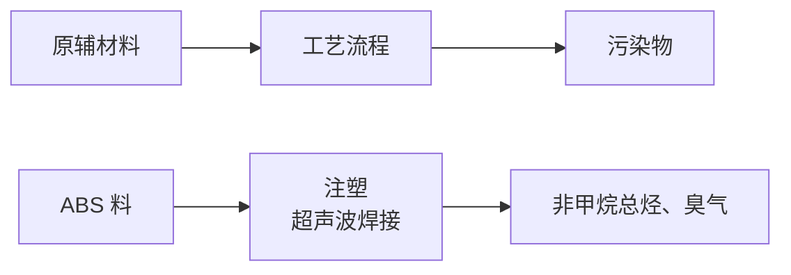
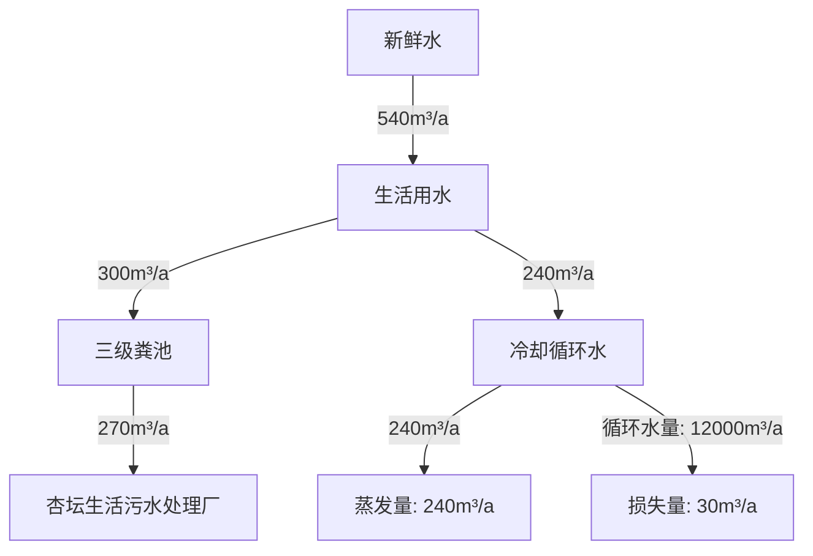
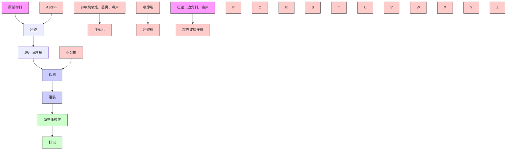

# 建设项目环境影响报告表

污染影响类）

项目名称：广东器有限公司项目

称：广东丰尔泽电器有限公司新建项

编制日期：2021年0月

中华人民共和国生态环境部制

## 一、建设项目基本情况

<table><tr><td>建设项目名称</td><td colspan="3">广东丰尔泽电器有限公司新建项目</td></tr><tr><td>项目代码</td><td colspan="3">无</td></tr><tr><td>建设单位联系人</td><td>****</td><td>联系方式</td><td>****</td></tr><tr><td>建设地点</td><td colspan="3">广东省(自治区)佛山市顺德县(区)杏坛乡(街道)齐杏社区杏坛科技区七路10号之五</td></tr><tr><td>地理坐标</td><td colspan="3">(东经113度10分57.462秒,北纬22度46分54.847秒)</td></tr><tr><td>国民经济行业类别</td><td>C2929塑料零件及其他塑料制品制造</td><td>建设项目行业类别</td><td>“二十六、橡胶和塑料制品业29”“53塑料制品业292”“其他(年用非溶剂型低VOCs含量涂料10吨以下的除外)”</td></tr><tr><td>建设性质</td><td>☑新建(迁建)□改建□扩建□技术改造</td><td>建设项目申报情形</td><td>☑首次申报项目□不予批准后再次申报项目□超五年重新审核项目□重大变动重新报批项目</td></tr><tr><td>项目审批(核准/备案)部门(选填)</td><td>/</td><td>项目审批(核准/备案)文号(选填)</td><td>/</td></tr><tr><td>总投资(万元)</td><td>500</td><td>环保投资(万元)</td><td>8</td></tr><tr><td>环保投资占比(%)</td><td>1.6</td><td>施工工期</td><td>3个月</td></tr><tr><td>是否开工建设</td><td>☑否□是: _</td><td>用地(用海)面积(m2)</td><td>1570</td></tr><tr><td>专项评价设置情况</td><td colspan="3">无</td></tr><tr><td>规划情况</td><td colspan="3">无</td></tr><tr><td>规划环境影响评价情况</td><td colspan="3">无</td></tr><tr><td>规划及规划环境影响评价符合性分析</td><td colspan="3">无</td></tr><tr><td>其他符合性分析</td><td colspan="3">(1)建设项目与所在地“三线一单”符合性分析1生态保护红线根据《佛山市顺德区生态保护红线规划(2014-2025年)》的图3生态保护红线单元可知,本项目不在生态保护红线范围内,故本项目的建设符合生态保护红线的要求。2环境质量底线本项目地表水环境以及声环境质量能满足相应的标准要求,属于达标区;根据《佛山市人民政府办公室关于印发&lt;佛山市大气环境质量达标规划&gt;的通知》(佛府办函[2018]537号)的要求,项目所在区域环境空气能达到相应标准的要求。综上,本项目所在区域环境质量规划上可全面实行达标。3资源利用上线本项目营运过程中消耗一定量的电能、水资源,项目资源消耗量相对区域资料利用总量较少,符合资源利用上线的要求。4环境准入负面清单本项目所属行业为橡胶和塑料制品业,不属于《市场准入负面清单(2020年版)》(发改体改〔2019〕1685号)所列的禁止准入及所需许可准入事项,根据国家《产业结构调整指导目录(2019年本)》,项目不属于上述目录所列的鼓励类、限制类和禁止(淘汰)类项目,根据《促进产业结构调整暂行规定》(国发〔2005〕40号)第十三条,项目属于允许类。因此,项目符合相关的产业政策要求。5与佛山市“三线一单”相符性分析项目与《佛山市人民政府关于印发佛山市“三线一单”生态环境分区管控方案的通知》(佛府[2021]11号)的相符性分析如下:对照《佛山市人民政府关于印发佛山市“三线一单”生态环境分区管控方案的通知》(佛府[2021]11号)的附件1佛山市环境管控单元图,本项目所在地属于重点管控单元(详见附图11)。对照附件4佛山市环境管控单元准入清单的“广东省佛山市顺德区重点管控单元7准入清单”,项目行业类别及代码为C2929塑料零件及其他塑料制品制造,不属于产业限制类项目;本项目使用的</td></tr></table>

原辅材料均属于低挥发性有机物，符合相关政策要求，不属于“两高”项目，符合区域布局管控要求。本项目建设在陆域上，不属于占用水域和破坏生态的岸线利用行为，符合能源资源利用要求。

⑥与广东省“三线一单”相符性分析

根据《广东省“三线一单”生态环境分区管控方案》（粤府〔2020〕71号），环境管控单元分为优先保护、重点管控和一般管控单元三类。本项目所在地属于一般管控单元，详细要求见表1-1。

表1-1 环境管控单元详细要求

<table><tr><td>要求</td><td>项目情况</td><td>相符性</td></tr><tr><td>生态优先保护区。生态保护红线内,自然保护地核心保护区原则上禁止人为活动,其他区域严格禁止开发性、生产性建设活动,在符合现行法律法规前提下,除国家重大战略项目外,仅允许对生态功能不造成破坏的有限人为活动。一般生态空间内,可开展生态保护红线内允许的活动;在不影响主导生态功能的前提下,还可开展国家和省规定不纳入环评管理的项目建设,以及生态旅游、畜禽养殖、基础设施建设、村庄建设等人为活动。</td><td>项目位于广东省佛山市顺德区杏坛镇齐杏社区杏坛科技区七路10号之五。根据《佛山市顺德区生态保护红线规划》(2014-2025年)项目位置不在生态保护红线内,因此不属于生态优先保护区。</td><td>符合</td></tr><tr><td>水环境优先保护区。饮用水水源保护区全面加强水源涵养,强化源头控制,禁止新建排污口,严格防范水源污染风险,切实保障饮用水安全,一级保护区内禁止新建、改建、扩建与供水设施和保护水源无关的建设项目;二级保护区内禁止新建、改建、扩建排放污染物的建设项目。饮用水水源准保护区内禁止新建、扩建对水体污染严重的建设项目。</td><td>项目位于广东省佛山市顺德区杏坛镇齐杏社区杏坛科技区七路10号之五。根据《佛山市顺德区供水专项规划修编(2015-2020)》、《广东省人民政府关于调整佛山市部分饮用水水源保护区的批复》(粤府函〔2018〕426号)等,项目位置不在饮用水水源保护区内,因此不属于水环境优先保护区。</td><td>符合</td></tr><tr><td>大气环境优先保护区。环境空气质量一类功能区实施严格保护,禁止新建、扩建大气污染物排放工业项目(国家和省规定不纳入环评管理的项目除外)。</td><td>项目属于环境空气质量二类功能区,不属于大气环境优先保护区。</td><td>符合</td></tr><tr><td>省级以上工业园区重点管控单元。依法开展园区规划环评,严格落实规划环评管理要求,开展环境质量跟踪监测,发布环境管理状况公告,制定并实施园区突发环境事件应急预案,定期开展环境安全隐患排查,提升风险防控及应急处置能力。周边1公里范围内涉及生态保护红线、自然保护地、饮用水水源地等生态环境敏感区域</td><td>项目位于广东省佛山市顺德区杏坛镇齐杏社区杏坛科技区七路10号之五。项目所处位置不属于省级以上工业重点控制单元。</td><td>符合</td></tr></table>

<table><tr><td rowspan="3"></td><td>的园区,应优化产业布局,控制开发强度,优先引进无污染或轻污染的产业和项目,防止侵占生态空间。纳污水体水质超标的园区,应实施污水深度处理,新建、改建、扩建项目应实行重点污染物排放等量或减量替代。造纸、电镀、印染、鞣革等专业园区或基地应不断提升工艺水平,提高水回用率,逐步削减污染物排放总量;石化园区加快绿色智能升级改造,强化环保投入和管理,构建高效、清洁、低碳、循环的绿色制造体系。</td><td></td><td></td></tr><tr><td>水环境质量超标类重点管控单元。加强山水林田湖草系统治理,开展江河、湖泊、水库、湿地保护与修复,提升流域生态环境承载力。严格控制耗水量大、污染物排放强度高的行业发展,新建、改建、扩建项目实施重点水污染物减量替代。以城镇生活污染为主的单元,加快推进城镇生活污水有效收集处理,重点完善污水处理设施配套管网建设,加快实施雨污分流改造,推动提升污水处理设施进水水量和浓度,充分发挥污水处理设施治污效能。</td><td>项目位于广东省佛山市顺德区杏坛镇齐杏社区杏坛科技区七路10号之五。项目所处位置不属于水环境质量超标类重点管控单元。</td><td>符合</td></tr><tr><td>大气环境受体敏感类重点管控单元。严格限制新建钢铁、燃煤燃油火电、石化、储油库等项目,产生和排放有毒有害大气污染物项目,以及使用溶剂型油墨、涂料、清洗剂、胶黏剂等高挥发性有机物原辅材料的项目;鼓励现有该类项目逐步搬迁退出。</td><td>项目位于广东省佛山市顺德区杏坛镇齐杏社区杏坛科技区七路10号之五。项目所处位置不属于大气环境受体敏感类重点管控单元。</td><td>符合</td></tr><tr><td colspan="4">综上,本项目符合《广东省人民政府关于印发广东省“三线一单”生态环境分区管控方案的通知》(粤府〔2020〕71号)的要求(2)项目与《佛山市人民政府办公室关于印发佛山市大气环境质量达标规划的通知》的符合性分析根据《佛山市人民政府办公室关于印发佛山市大气环境质量达标规划的通知》的要求,严格控制日用玻璃制造、印染、家具制造、配套电镀、废塑料回收加工再生(列入国家“城市矿产”示范基地项目除外)、专业金属表面处理(铝及铝合金的阳极氧化、铝的表面铬酸盐转化、锌的铬酸盐钝化和金属酸洗、磷化、喷漆、喷涂)等项目建设。本项目为C2929塑料零件及其他塑料制品制造,所用原料均为新料,不属于文件所列严格控制的项目。故本项目的建设符合《佛山市人民政府办公室关于印发佛山市大气环境质量达标规划的通知》的要求。</td></tr></table>

## （3）本项目有机物治理政策的相符性分析见表1-2。

表1-2 项目与有机污染物治理政策的相符性

<table><tr><td>序号</td><td>政策要求</td><td>工程内容</td><td>符合性</td></tr><tr><td colspan="4">1.印发《关于珠江三角洲地区严格控制工业企业挥发性有机物(VOCs)排放的意见》的通知(粤环[2012]18号)</td></tr><tr><td>1.1</td><td>自然保护区、水源保护区、风景名胜区、森林公园、重要湿地、生态敏感区和其他重要生态功能区实行强制性保护,禁止新建VOCs污染企业</td><td>项目所在地不在“自然保护区、水源保护区、风景名胜区、森林公园、重要湿地、生态敏感区和其他重要生态功能区等禁止新建VOCs污染企业的规定区域内。</td><td>符合</td></tr><tr><td colspan="4">2.《广东省人民政府办公厅关于印发广东省2021年大气、水、土壤污染防治工作方案的通知》(粤办函〔2021〕58号)</td></tr><tr><td>2.1</td><td>涉VOCs重点行业新建、改建和扩建项目不推荐使用光氧化、光催化、低温等离子等低效治理设施。</td><td>本项目无使用上述淘汰装置。</td><td>符合</td></tr><tr><td colspan="4">3.《挥发性有机物(VOCs)污染物防治技术政策》(环保部公告2013第31号)</td></tr><tr><td>3.1</td><td>含VOCs产品的使用过程中,应采取废气收集措施,提高废气收集效率,减少废气的无组织排放与逸散,并对收集后的废气进行回收或处理后达标排放</td><td>本项目注塑工位上方设置集气罩收集有机废气,随后利用二级活性炭处理装置处理后引至15m排气筒(G1)高空排放。集气罩收集效率可达90%、废气净化效率可达75%。</td><td>符合</td></tr><tr><td colspan="4">4.《挥发性有机物无组织排放控制标准》(GB 37822-2019)</td></tr><tr><td rowspan="3">4.1</td><td>VOCs物料应储存于密闭的容器、包装袋、储罐、储库、料仓中。</td><td rowspan="3">本项目使用的ABS料属于VOCs物料,常温为固体,采用塑料袋装存放在厂房内的仓库;厂房为已建成工业厂房,拥有完整的维护结构,地面已经全部混凝土硬化处理。</td><td rowspan="3">符合</td></tr><tr><td>盛装VOCs物料的容器或包装袋应存放于室内,或存放与设置雨棚、遮阳和防渗设施的专用场地。盛装VOCs物料的容器或包装袋在非取用状态时应加盖、封口,保持密闭。</td></tr><tr><td>VOCs物料储存、料仓应满足3.6条对密闭空间的要求。</td></tr><tr><td colspan="4">5.《广东省打赢蓝天保卫战实施方案(2018-2020年)》(粤府〔2018〕128号)</td></tr><tr><td>5.1</td><td>珠三角地区禁止新建生产和使用高VOCs含量溶剂型涂料、油墨、胶粘剂、清洗剂等项目(共性工厂除外)</td><td>本项目不使用禁止使用的高VOCs含量原辅材料</td><td>符合</td></tr></table>

综合以上分析，项目总体符合文件要求。

## 二、建设项目工程分析

<table><tr><td>建设内容</td><td>广东丰尔泽电器有限公司新建项目(以下简称“本项目”)位于广东省佛山市顺德区杏坛镇齐杏社区杏坛科技区七路10号之五(项目地理位置见附图1)。本项目所在厂房共三层,本项目在第二层,项目占地面积约 $1570m^{2}$ ,建筑面积约 $1570m^{2}$ ,厂房层高为5m。项目总投资约500万元,其中环保投资8万元。本项目主要从事塑料风轮的生产,项目投产后拟年产塑料风轮200万个。现申请办理相关环保手续。根据《中华人民共和国环境影响评价法》(2018年12月29日修正版)和《建设项目环境保护管理条例》(中华人民共和国国务院令第682号,2017年10月01日起施行)的有关规定,一切可能对环境造成影响的新建、扩建或改建项目必须实行环境影响评价审批制度,以便能有效的控制新的污染和生态破坏,保护环境、利国利民。本项目属于新建项目,根据以上条例,必须执行环境影响评价审批制度。根据生态环境部部令第16号《建设项目环境影响评价分类管理名录(2021年版)》,本项目属于“二十六、橡胶和塑料制品业29”中“53塑料制品业292”类别中的“其他(年用非溶剂型低VOCs含量涂料10吨以下的除外)”类别,故该项目应编制环境影响报告表。</td></tr></table>

## 1、建设内容及规模

表2-1 项目建设组成一览表

<table><tr><td>类别</td><td colspan="2">工程名称</td><td>备注</td></tr><tr><td>主体工程</td><td colspan="2">生产车间</td><td>占地面积 $1570m^{2}$ ,建筑面积 $1570m^{2}$ ,层高5m。</td></tr><tr><td rowspan="2">仓储工程</td><td colspan="2">成品仓库</td><td>位于生产车间的东北侧,用于储存成品。面积为 $320m^{2}$ 。</td></tr><tr><td colspan="2">原辅材料堆放区</td><td>位于生产车间的西南侧,用于储存原辅材料。面积为 $80m^{2}$ 。</td></tr><tr><td rowspan="2">公共工程</td><td colspan="2">供水</td><td>由市政供水管网供给,包括生活用水和冷却水。</td></tr><tr><td colspan="2">供电</td><td>由市政供电管网供给,项目不设备用发电机。</td></tr><tr><td rowspan="4">环保工程</td><td>污水治理工程</td><td>生活污水</td><td>生活污水经三级化粪池预处理后排入杏坛生活污水处理厂处理,尾水排入顺德支流。</td></tr><tr><td colspan="2">废气治理工程</td><td>本项目有机废气利用集气罩收集后通过二级活性炭吸附装置处理后引至15m排气筒(G1)高空排放。</td></tr><tr><td colspan="2">噪声治理工程</td><td>合理调整设备布置,主要生产设备安装隔震垫,采用隔声、距离衰减等治理措施。</td></tr><tr><td colspan="2">固废处理工程</td><td>一般固体废物统一收集后交由回收公司回收处理;生活垃圾定期委托环卫部门统一收集处理;危险废物统一交由有资质单位收集处理。</td></tr></table>

## 2、主要产品及产能

表2-2 项目生产规模一览表

<table><tr><td>序号</td><td>产品名称</td><td>年生产量</td></tr><tr><td>1</td><td>塑料风轮</td><td>200万个</td></tr></table>

## 3、主要生产设备

根据建设单位提供的资料，本项目主要生产设备见表2-3。

表2-3 项目主要生产设备一览表

<table><tr><td rowspan="2">序号</td><td rowspan="2">设备名称</td><td rowspan="2">单位</td><td rowspan="2">数量</td><td rowspan="2">使用工序</td><td colspan="3">设施参数</td></tr><tr><td>名称</td><td>设计值</td><td>计量单位</td></tr><tr><td>1</td><td>注塑机</td><td>台</td><td>18</td><td>注塑</td><td>加工量</td><td>0.02</td><td>吨/小时</td></tr><tr><td>2</td><td>超声波焊接机</td><td>台</td><td>8</td><td>焊接</td><td>功率</td><td>10</td><td>千瓦</td></tr><tr><td>3</td><td>动平衡机</td><td>台</td><td>3</td><td>平衡矫正</td><td>功率</td><td>15</td><td>千瓦</td></tr><tr><td>4</td><td>压缩空气气泵</td><td>台</td><td>1</td><td>辅助设备</td><td>功率</td><td>10</td><td>千瓦</td></tr><tr><td>5</td><td>机边破碎机</td><td>台</td><td>1</td><td>破碎</td><td>功率</td><td>15</td><td>千瓦</td></tr><tr><td>6</td><td>冷却塔</td><td>台</td><td>1</td><td>冷却</td><td>功率</td><td>12</td><td>千瓦</td></tr></table>

## 4、主要原辅材料用量

根据建设单位提供的资料，本项目主要原辅材料及用量见表2-4。项目主要原辅材料主要成份及其理化性质详见表2-4。

表2-4 项目主要原材料年用量一览表

<table><tr><td>序号</td><td>名称</td><td>年用量</td><td>最大储存量</td><td>备注</td></tr><tr><td>1</td><td>ABS料</td><td>300t</td><td>20t</td><td>粒状;外购新料,不使用旧料</td></tr><tr><td>2</td><td>五金配件</td><td>200万个</td><td>10万个</td><td>塑料风轮配件</td></tr><tr><td>3</td><td>机油</td><td>0.1t</td><td>0.1t</td><td>用于设备保养以及维修</td></tr><tr><td colspan="5">主要化学品理化性质:</td></tr></table>

ABS：丙烯腈(A)、丁二烯(B)、苯乙烯(S)三种单体的三元共聚物，ABS 塑料兼有三种组元的共同性能。无毒、无味，外观呈象牙色半透明，或透明颗粒或粉状。具有耐化学腐蚀、耐热，并有一定的表面硬度；高弹性和韧性；热塑性塑料的加工成型特性并改善电性能。其熔融温度在 217\~237℃，热分解温度在 250℃以上。

ABS 料在注塑、超声波焊接工序加热但未达到分解温度，会产生少量注塑热挥发性气体非甲烷总烃和恶臭气体，见图2-1。

flowchart

图2-1 原辅材料产污示意图

## 5、给排水情况

## （1）给水

生活用水：根据建设单位提供的资料，项目用水主要为员工生活用水，员工人数为30人，年工作 300天，厂内不设置员工宿舍和饭堂，根据《用水定额第 3 部分：生活》（DB44\_T1461.3-2021）可知，本项目职工生活用水量按 10m3/人·a 计，则项目生活用水量约为 300m3/a。

冷却塔用水：项目注塑机运行过程中需用自来水对设备进行间接冷却，冷却用水循环使用，并适当地加入新鲜水补充因蒸发而损失的水分。项目使用 1台 5m3 /h冷却水塔，参考《工业循环冷却水处理设计规范》（GB/T50050-2017），循环冷却水系统蒸发水量约占循环水量的2.0%。项目生产设备使用时间为8h/d，年工作日300 天，总循环水量为 12000m3 /a，蒸发水量为 240m3 /a，新鲜水补充量约 240m3/a。

## （2）排水

生活污水：生活污水产污系数按0.9计算，则生活污水排放量约为 270m3/a。项目生活污水经三级化粪池预处理后达到广东省地方标准《水污染物排放限值》（DB44/26-2001）第二时段三级标准后排入杏坛生活污水处理厂处理，尾水排入顺德支流。

flowchart

图2-2 项目水平衡图

## 6、工作制度和劳动定员

## （1）工作制度

本项目年工作300天，采取单班8小时工作制。

## （2）劳动定员

本项目员工人数为30 人，均不在项目内食宿。

## 7、四至及平面布置情况

## （1）项目四至情况

本项目选址位于广东省佛山市顺德区杏坛镇齐杏社区杏坛科技区七路 10号之五，项目东北面为其他工业厂房；东南面为其他工业厂房；西南面为其他工业厂房；西北为其他工业厂房。

## （2）平面布局

厂区入口设于东北和西南处，原辅材料堆放区位于车间西南处，成品仓库位于东面，办公室位于西南处，生产设备集中分布在车间的中部。项目平面布置详见附图2。

工艺流程简述（图示）：  

flowchart

图2-3 项目产品生产工艺流程及产污环节示意图

## 工艺流程说明：

注塑：将ABS 粒置于注塑机内加热至 $2 2 0 \mathrm { { } ^ { \circ } C }$ 左右成熔融状态，然后在设备内熔融状态的塑料完全进入模具的封闭模腔，充满模腔后暂停工作，此时模具采用夹套冷却水间接冷却，使模具温度降至 $7 0 – 1 2 0 ^ { \circ } \mathrm { C }$ ，塑料定型成某种形状，打开注塑机模具，取出产品。由于注塑时的工作温度低于塑料分解温度（ABS的分解温度为 $2 5 0 \mathrm { { } ^ { \circ } C }$ 以上），因此塑料粒子在加热熔融过程中无分解废气产生，但会产生少量注塑热挥发性气体非甲烷总烃和恶臭气体。冷却水经冷却塔后循环使用，不外排，只需定期补充蒸发损耗。

超声波焊接：工人使用超声波焊接机对注塑形成的工件进行焊接，即将风扇叶半成品送入超声波焊接机中进行焊接组装（焊接温度为 $1 7 0 ^ { \circ } \mathrm { C } )$ ），超声波塑胶焊接原理是∶由发生器产生 20KHZ（或 15KHZ）的高压，高频信号，通过换能系统，把信号转换为高频机械振动，加于塑料制品工件上，通过工作表面及内在分子间的磨擦而使传导到接口的温度升高，当温度达到此工件本身的熔点时，使工件焊接口迅速熔化，继而填充于接口间的空隙，当振动停止，工件同时在一定的压力下冷却定型，便达成完美的焊接。在超声波焊接过程中将产生少量的非甲烷总烃有机废气。该工序会产生非甲烷总烃、恶臭、噪声。

检测：人工检测，合格即为成品。

破碎：人工检测不合格的次品通过破碎机破碎，回用到注塑工序。该工序会产生粉尘、边角料、噪声。

组装：将检查合格后的工件与外购回来的五金配件进行人工组装。

动平衡校正：利用动平衡机对组装后的工件进行动平衡校正，校正后即为成品，可打包外售。

## 项目主要污染源：

表2-5 项目产污环节汇总表

<table><tr><td colspan="2">类别</td><td>编号</td><td>污染源</td><td>污染物类型</td><td>主要污染物</td></tr><tr><td rowspan="3">废气</td><td>注塑废气</td><td>G1</td><td>注塑机</td><td>挥发废气</td><td>非甲烷总烃、恶臭气体</td></tr><tr><td>焊接废气</td><td>G2</td><td>超声波焊接机</td><td>挥发废气</td><td>非甲烷总烃、恶臭气体</td></tr><tr><td>破碎废气</td><td>G3</td><td>破碎机</td><td>破碎废气</td><td>粉尘</td></tr><tr><td>废水</td><td>生活污水</td><td>W1</td><td>日常生活</td><td>生活污水</td><td> $COD_{Cr}$ 、 $BOD_5$ 、SS、氨氮、LAS</td></tr><tr><td rowspan="6">固体废物</td><td>生活垃圾</td><td>S1</td><td>日常生活</td><td>生活垃圾</td><td>——</td></tr><tr><td>一般固体废物</td><td>S2</td><td>原辅材料堆放区</td><td>废包装袋</td><td>——</td></tr><tr><td rowspan="4">危险废物</td><td>S3</td><td rowspan="3">生产车间</td><td>废机油</td><td rowspan="3">烃类油、添加剂</td></tr><tr><td>S4</td><td>含油废抹布</td></tr><tr><td>S5</td><td>废油桶</td></tr><tr><td>S6</td><td>有机废气处理系统</td><td>废活性炭</td><td>化学物质</td></tr><tr><td colspan="2">噪声</td><td>N1</td><td>生产车间</td><td>噪声</td><td>设备噪声</td></tr></table>

本项目为新建项目，不存在与项目有关的原有污染环境问题。

## 三、区域环境质量现状、环境保护目标及评价标准

<table><tr><td>区域环境质量现状</td><td>1、大气环境(1)空气质量达标区判定根据《关于调整顺德区环境空气质量功能区划的复函》(佛府办函〔2014〕494号,2014年8月),项目所在地为大气环境二类功能区,执行《环境空气质量标准》(GB3095-2012)及其修改单二级标准。为评价本项目所在区域的环境空气质量现状,引用《2020年佛山市顺德区环境质量状况公报》中的数据和结论如下。2020年全区空气质量综合指数为3.30,比2019年下降22.9%,空气质量同比有所改善,在全市五区中排名第二。2020年全区二氧化硫( $SO_2$ )、二氧化氮( $NO_2$ )、可吸入颗粒物( $PM_{10}$ )、细颗粒物( $PM_{2.5}$ )平均浓度分别为7、30、43、21微克/立方米,臭氧日最大8小时滑动平均( $O_3$ -8h)浓度的第90百分位数为155微克/立方米,一氧化碳(CO)日浓度的第95百分位数为1.0毫克/立方米,六项污染物指标浓度均达到《环境空气质量标准》(GB3095-2012)及其2018年修改单中二级标准。与去年相比,2020年度顺德区六项环境空气污染指标浓度均有不同程度下降, $PM_{2.5}$ 、 $PM_{10}$ 、 $NO_2$ 、 $SO_2$ 平均浓度分别下降30.0%、23.2%、23.1%、12.5%,CO日平均浓度的第95百分位数下降23.1%, $O_3$ -8h浓度的第90百分位数下降18.4%。2020年度全区环境空气质量优良天数占有效天数的90.4%,同比去年提高13.1个百分点。因此,项目所在地(顺德区)为环境空气质量达标区,具体数据见表3-1。</td></tr></table>

表 3-1 2020 年顺德区（国控测点）环境空气污染物浓度水平年度比较

<table><tr><td>所在区域</td><td>污染物</td><td>年评价指标</td><td>现状浓度 $\left( {\mu \mathrm{g}/{\mathrm{m}}^{3}}\right)$ </td><td>标准值 $\left( {\mu \mathrm{g}/{\mathrm{m}}^{3}}\right)$ </td><td>占标率/%</td><td>达标情况</td></tr><tr><td rowspan="6">顺德区</td><td> ${\mathrm{{SO}}}_{2}$ </td><td>年平均质量浓度</td><td>7</td><td>60</td><td>11.7</td><td>达标</td></tr><tr><td> ${\mathrm{{NO}}}_{2}$ </td><td>年平均质量浓度</td><td>30</td><td>40</td><td>75.0</td><td>达标</td></tr><tr><td> ${\mathrm{{PM}}}_{10}$ </td><td>年平均质量浓度</td><td>43</td><td>70</td><td>61.4</td><td>达标</td></tr><tr><td> ${\mathrm{{PM}}}_{2.5}$ </td><td>年平均质量浓度</td><td>21</td><td>35</td><td>60.0</td><td>达标</td></tr><tr><td>CO</td><td>24小时平均值的95百分位数</td><td>1000</td><td>4000</td><td>25.0</td><td>达标</td></tr><tr><td> ${\mathrm{O}}_{3}$ </td><td>最大8小时平均值的90百分位数</td><td>155</td><td>160</td><td>96.9</td><td>达标</td></tr></table>

2020 年顺德区受气象条件影响，降雨频繁，污染物扩散条件相对较好，我区六项污染物浓度水平较上一年同期均有不同程度下降， $\mathrm { S O } _ { 2 } \boldsymbol { \cdot } \mathrm { N O } _ { 2 } \boldsymbol { \cdot } \mathrm { P M } _ { 1 0 } \boldsymbol { \cdot } \mathrm { P M } _ { 2 . 5 }$ 季浓度水平分别下降 12.5%、23.1%、23.2%、30.0%， $\mathrm { O } _ { 3 }$ 和CO季百分位数浓度水平分别下降18.4%、23.1%。其中， $\mathrm { P M } _ { 2 . 5 }$ 降幅相对较大，常规污染物浓度水平与上一年同期对比情况如图3-1 所示。

bar-line hybrid chart

| 碳素类型       | 2019年 (微克/立方米) | 2020年 (微克/立方米) | 毫克/立方米 (一氧化碳) |
| -------------- | ------------------- | ------------------- | --------------------- |
| 二氧化硫      | 5                   | 4                   | 0.1                   |
| 二氧化氮      | 40                  | 35                  | 0.6                   |
| 可吸入颗粒物   | 60                  | 45                  | 0.7                   |
| 细颗粒物       | 35                  | 30                  | 0.4                   |
| 臭氧            | 195                 | 155                 | 3.2                   |
| 一氧化碳        | 80                  | 10                  | 1.3                   |

图3-12020年第三季度顺德区(国控点)常规污染物浓度水平与 2019年同期对比（2）补充监测

本项目产生的其他污染物为 TSP、非甲烷总烃，为评价本项目所在区域的其他污染物现状，TSP、非甲烷总烃数据引用佛山市顺德区昇泽电子有限公司委托广东顺德环境科学研究院有限公司分析测试中心于2019年2月13日-2月20日对光华村（G1 监测点）的相关现状监测数据，检测报告编号为（顺）研测字（2019）第W030403号，详见附件4。监测点G1距离本项目边界最近距离约274m，在本项目5km 范围内，监测点位说明如下表 3-2。

表3-2 项目其他污染物监测结果表

<table><tr><td rowspan="2">监测点名称</td><td colspan="2">监测点坐标/m</td><td rowspan="2">监测因子</td><td rowspan="2">监测时段</td><td rowspan="2">评价标准( $\mu g/m^3$ )</td><td rowspan="2">监测浓度范围( $\mu g/m^3$ )</td><td rowspan="2">最大浓度占标率%</td><td rowspan="2">超标率%</td><td rowspan="2">达标情况</td></tr><tr><td>X</td><td>Y</td></tr><tr><td rowspan="2">G1</td><td rowspan="2">-232</td><td rowspan="2">-212</td><td>TSP</td><td>24小时</td><td>0.3</td><td>103~135</td><td>45</td><td>0</td><td>达标</td></tr><tr><td>非甲烷总烃</td><td>1小时</td><td>2.0</td><td>0.07(L)</td><td>/</td><td>0</td><td>达标</td></tr></table>

## 2、地表水环境

本项目外排废水主要为员工生活污水。生活污水经三级化粪池处理后通过市政管网排放至杏坛污水处理厂处理，尾水排至顺德支流。根据《关于印发<广东省地表水环境功能区划>的通知》（粤环（2011）14号），纳污水体顺德支流属于Ⅲ类水体，其水质执行《地表水环境质量标准》（GB3838-2002）中的Ⅲ类标准。

为了评价顺德支流水质，引用《佛山市顺德区越达电镀有限公司升级改造项目环境影响报告书》中广州华清环境监测有限公司 2020年5月20日\~2020 年5月 22 日对顺德支流进行水质的现状监测结果进行评价，监测结果及评价见下表：

表 3-3 2020 年顺德区顺德支流常规监测数据统计表  
单位：mg/L（水温：℃，粪大肠杆菌：个/L，pH 无量纲）

<table><tr><td rowspan="2">监测项目</td><td colspan="3">W1 顺德支流与北马河交汇处上游500m</td><td colspan="3">W2 顺德支流与北马河交汇处</td><td colspan="3">W2 顺德支流与北马河交汇处下游1500m</td><td rowspan="2">标准限值</td></tr><tr><td>2020.5.20</td><td>2020.5.21</td><td>2020.5.22</td><td>2020.5.20</td><td>2020.5.21</td><td>2020.5.22</td><td>2020.5.20</td><td>2020.5.21</td><td>2020.5.22</td></tr><tr><td>水温</td><td>29.4</td><td>28.5</td><td>27.5</td><td>29.4</td><td>28.7</td><td>27.3</td><td>29.5</td><td>28.6</td><td>27.4</td><td>/</td></tr><tr><td>pH值</td><td>7.35</td><td>7.45</td><td>7.39</td><td>7.19</td><td>7.24</td><td>7.22</td><td>7.31</td><td>7.40</td><td>7.34</td><td>6-9</td></tr><tr><td>溶解氧</td><td>5.98</td><td>5.93</td><td>6.05</td><td>5.36</td><td>5.47</td><td>5.42</td><td>5.24</td><td>5.31</td><td>5.27</td><td>≥5</td></tr><tr><td>色度</td><td>25</td><td>25</td><td>20</td><td>35</td><td>30</td><td>30</td><td>25</td><td>20</td><td>20</td><td>/</td></tr><tr><td>悬浮物</td><td>10</td><td>9</td><td>13</td><td>10</td><td>12</td><td>14</td><td>12</td><td>9</td><td>8</td><td>≤150</td></tr></table>

<table><tr><td rowspan="17"></td><td>化学需氧量</td><td>14</td><td>14</td><td>13</td><td>18</td><td>18</td><td>18</td><td>19</td><td>19</td><td>19</td><td>≤20</td></tr><tr><td>氨氮</td><td>0.227</td><td>0.253</td><td>0.219</td><td>0.677</td><td>0.665</td><td>0.693</td><td>0.278</td><td>0.298</td><td>0.268</td><td>≤1.0</td></tr><tr><td>总磷</td><td>0.05</td><td>0.05</td><td>0.05</td><td>0.06</td><td>0.07</td><td>0.06</td><td>0.05</td><td>0.06</td><td>0.05</td><td>≤0.2</td></tr><tr><td>总氮</td><td>0.90</td><td>0.88</td><td>0.79</td><td>0.80</td><td>0.92</td><td>0.84</td><td>0.68</td><td>0.87</td><td>0.88</td><td>≤1.0</td></tr><tr><td>氟化物</td><td>0.25L</td><td>0.237</td><td>0.256</td><td>0.283</td><td>0.285</td><td>0.291</td><td>0.255</td><td>0.254</td><td>0.244</td><td>≤1.0</td></tr><tr><td>氰化物</td><td>0.004L</td><td>0.004L</td><td>0.004L</td><td>0.004L</td><td>0.004L</td><td>0.004L</td><td>0.004L</td><td>0.004L</td><td>0.004L</td><td>≤0.2</td></tr><tr><td>石油类</td><td>0.01L</td><td>0.01L</td><td>0.01L</td><td>0.01L</td><td>0.01L</td><td>0.01L</td><td>0.01L</td><td>0.01L</td><td>0.01L</td><td>≤0.05</td></tr><tr><td>六价铬</td><td>0.004</td><td>0.004</td><td>0.004</td><td>0.006</td><td>0.007</td><td>0.007</td><td>0.006</td><td>0.006</td><td>0.006</td><td>≤0.05</td></tr><tr><td>总铬</td><td>0.006</td><td>0.006</td><td>0.006</td><td>0.007</td><td>0.007</td><td>0.008</td><td>0.007</td><td>0.008</td><td>0.008</td><td>/</td></tr><tr><td>铅</td><td>0.00009L</td><td>0.00009L</td><td>0.00009L</td><td>0.00009L</td><td>0.00009L</td><td>0.00009L</td><td>0.00009L</td><td>0.00009L</td><td>0.00009L</td><td>≤0.05</td></tr><tr><td>镉</td><td>0.00005L</td><td>0.00005L</td><td>0.00005L</td><td>0.00005L</td><td>0.00005L</td><td>0.00005L</td><td>0.00005L</td><td>0.00005L</td><td>0.00005L</td><td>≤0.005</td></tr><tr><td>锌</td><td>0.00501</td><td>0.00490</td><td>0.00486</td><td>0.0976</td><td>0.129</td><td>0.126</td><td>0.0127</td><td>0.0123</td><td>0.0143</td><td>≤1.0</td></tr><tr><td>铜</td><td>0.00331</td><td>0.00327</td><td>0.0033</td><td>0.0174</td><td>0.0175</td><td>0.0272</td><td>0.00729</td><td>0.00742</td><td>0.00716</td><td>≤1.0</td></tr><tr><td>镍</td><td>0.017</td><td>0.0167</td><td>0.0168</td><td>0.0145</td><td>0.0152</td><td>0.0175</td><td>0.0147</td><td>0.0148</td><td>0.0146</td><td>≤0.02</td></tr><tr><td>汞</td><td>0.00004</td><td>0.00005</td><td>0.00006</td><td>0.00007</td><td>0.00006</td><td>0.00005</td><td>0.00004</td><td>0.00005</td><td>0.00005</td><td>≤0.0001</td></tr><tr><td colspan="11">注:“L”表示该检测结果低于方法检出限。</td></tr><tr><td colspan="11">从监测数据统计结果可知,2020年顺德支流水质指标均满足《地表水环境质量标准》(GB3838-2002)的III类水质标准,水质良好。3、声环境本项目厂界外周边50米范围内无声环境保护目标。4、生态环境本项目所在区域附近以城镇工业区景观为主,处于人类活动频繁区,无原始植被生长和珍贵野生动物活动。不会对生态环境造成影响。5、地下水、土壤环境本项目属于日用塑料制品制造项目,用地范围内均进行了硬底化,不存在土壤、地下水污染途径,因此,不进行土壤、地下水环境质量现状监测。6、电磁辐射本项目不属于电磁辐射类项目,因此不展开电磁辐射现状调查。</td></tr><tr><td>环境保护目标</td><td colspan="11">1、大气环境保护目标厂界外为500m范围内大气环境敏感点主要为居住区等,见表3-3,项目敏感点分布图详见附图5。</td></tr></table>

<table><tr><td rowspan="6"></td><td colspan="7">表3-3建设项目周围环境敏感点一览表</td><td></td></tr><tr><td rowspan="2">名称</td><td colspan="2">坐标/m</td><td rowspan="2">保护对象</td><td rowspan="2">保护内容</td><td rowspan="2">环境功能区</td><td rowspan="2">相对厂址方向</td><td rowspan="2">相对厂界距离/m</td></tr><tr><td>X</td><td>Y</td></tr><tr><td>光辉村</td><td>-232</td><td>-212</td><td>居住区</td><td>人群(约2000人)</td><td>大气二类</td><td>西南</td><td>274</td></tr><tr><td colspan="8">备注:本项目坐标系以项目中心为原点,以南北向为Y轴(北向为正向),以东西向为X轴(东向为正向)进行设立。敏感点的坐标为项目中心点到敏感点最近点的位置。</td></tr><tr><td colspan="8">2、水环境保护目标项目用地范围及附近不涉及饮用水水源保护区、饮用水取水口、自然保护区、风景名胜区,重要湿地、重点保护与珍稀水生生物的栖息地、重要水生生物的自然产卵场及索饵场、越冬场和洄游通道,天然渔场等渔业水体,以及水产种质资源保护区等敏感目标。3、声环境保护目标厂界外50m范围内没有声环境保护目标。4、其他保护环境目标厂界外500m范围内无地下水集中式饮用水水源和热水、矿泉水、温泉等特殊地下水资源,无生态环境保护目标。</td></tr><tr><td rowspan="4">污染物排放控制标准</td><td colspan="8">1、水污染物排放标准(1)生活污水:项目生活污水执行广东省《水污染物排放限值》(DB44/26-2001)第二时段三级标准,即 $COD_{Cr} \leq 500mg/L$ 、 $BOD_{5} \leq 300mg/L$ 、 $SS \leq 400mg/L$ ,通过市政管道进入杏坛生活污水处理厂。根据2013年7月11日颁布的《顺德区环境运输和城市管理局关于全区城镇污水处理厂尾水排放执行标准的通知》规定:杏坛生活污水处理厂提标后,尾水水质执行《城镇污水处理厂污染物排放标准》(GB18918-2002)一级A标准及广东省地方标准《水污染物排放限值》(DB44/26-2001)第二时段一级标准的较严值。具体参数值如下表所示:表3-4项目生活污水排放执行标准(单位:mg/L)</td></tr><tr><td colspan="2">适用标准</td><td colspan="6">项目生活污水排放执行标准</td></tr><tr><td colspan="2">污染物</td><td colspan="2"> $COD_{Cr}$ </td><td> $BOD_{5}$ </td><td>SS</td><td colspan="2">氨氮</td></tr><tr><td colspan="2">标准限值</td><td colspan="2">≤500</td><td>≤300</td><td>≤400</td><td colspan="2">——</td></tr></table>

<table><tr><td>适用标准</td><td colspan="4">杏坛生活污水处理厂出水执行标准</td></tr><tr><td>污染物</td><td> $COD_{Cr}$ </td><td> $BOD_5$ </td><td>SS</td><td>氨氮</td></tr><tr><td>适用标准</td><td>≤40</td><td>≤10</td><td>≤10</td><td>≤5</td></tr></table>

## 2、大气污染物排放标准

（1）项目破碎工序中产生的颗粒物执行《合成树脂工业污染物排放标准》（GB31572-2015）表 9 企业边界大气污染物浓度限值。  
（2）项目注塑、焊接工序产生的非甲烷总烃执行《合成树脂工业污染物排放标准》（GB31572-2015）表 4 大气污染物排放限值和表 9 企业边界大气污染物浓度限值。

厂区内非甲烷总烃无组织排放执行《挥发性有机物无组织排放控制标准》（GB37822-2019）附录 A 中的表 A.1 厂区内 VOCs 无组织特别排放限制。

（3）项目注塑、焊接过程中产生的臭气排放执行《恶臭污染物排放标准》（GB14554-93）表1中的新改扩建二级标准及表 2中15米高排气筒限制标准。详见下表 3-5。

表3-5 大气污染物排放标准

<table><tr><td rowspan="2">污染源</td><td rowspan="2">污染因子</td><td rowspan="2">排气筒高度</td><td colspan="2">有组织</td><td rowspan="2">无组织排放监控浓度限值 mg/m3</td><td rowspan="2">执行标准</td></tr><tr><td>最高允许排放浓度 mg/m3</td><td>排放速率kg/h</td></tr><tr><td rowspan="2">注塑、焊接</td><td>非甲烷总烃</td><td rowspan="3">15m</td><td>100</td><td>——</td><td>4.0</td><td>GB31572-2015</td></tr><tr><td>臭气浓度</td><td>2000(无量纲)</td><td>——</td><td>20(无量纲)</td><td>GB14554-93</td></tr><tr><td>破碎</td><td>颗粒物</td><td>——</td><td>——</td><td>1.0</td><td>GB31572-2015</td></tr></table>

表 3-6 厂区内 VOCs 无组织排放限值（浓度单位：mg/m3）

<table><tr><td>污染物项目</td><td>排放限值</td><td>限值含义</td><td>无组织排放监控位置</td></tr><tr><td rowspan="2">NMHC</td><td>6</td><td>监控点处1h平均浓度值</td><td rowspan="2">在厂房外设置监控点</td></tr><tr><td>20</td><td>监控点处任意一次浓度值</td></tr></table>

## 3、噪声排放标准

本 项 目 营 运期 边 界 噪 声 执 行《工业企业厂界环境噪声排放标准》（GB12348-2008）3 类区标准，详见表 3-7；

表 3-7 《工业企业厂界环境噪声排放标准》（单位：dB（A））

<table><tr><td>类别</td><td>昼间(6:00~22:00)</td><td>夜间(22:00~6:00)</td></tr><tr><td>3类</td><td>65dB(A)</td><td>55dB(A)</td></tr></table>

## 4、固体废物

一般固体废弃物处置采用《一般工业固体废物贮存和填埋污染控制标准》

<table><tr><td></td><td>(GB 18599-2020)要求。危险废物处置采用《危险废物贮存污染控制标准》(GB18597-2001)及2013年修改单的相关规定进行处理。</td></tr><tr><td>总量控制指标</td><td>1、水污染物总量控制分析生活污水经三级化粪池处理达标后经市政污水管网排入杏坛生活污水处理厂处理,尾水排入顺德支流。项目的生活污水排放量为 $270t/a$ , $COD_{Cr}$ 排放量为 $0.041t/a$ ;氨氮排放量为 $0.007t/a$ 。根据《佛山市排污权有偿使用和交易管理试行办法》(佛府办2016第63号),生活污水 $COD_{Cr}$ 、 $NH_{3}-N$ 不分配总量。2、大气污染物总量控制分析项目无二氧化硫、氮氧化物排放。项目挥发性有机物有组织排放量为 $0.1883t/a$ ,无组织排放量为 $0.0837t/a$ 。根据《佛山市排污权有偿使用和交易管理试行办法》(佛府办2020年第19号),建议挥发性有机物排放总量控制指标为 $0.1883t/a$ ,由区镇两级环保主管部门核查总量指标啊。</td></tr></table>

## 四、主要环境影响和保护措施

<table><tr><td>施工期环境保护措施</td><td>本项目厂区为租用已建厂房,项目只是需要在车间内进行机械设备的安装和调试,主要是人工作业,无大型机械入内,施工期无废水、废气、固废产生,机械噪音也较小,可忽略,所以期间基本无污染工序。</td></tr><tr><td>运营期环境影响和保护措施</td><td>1、废气环境影响分析(1)废气1有机废气本项目使用原料为ABS粒,焊接温度在170°C左右,注塑成型时的工作温度为220°C左右,低于本项目塑料原料的热分解温度(ABS分解温度为250°C以上),塑料粒子在熔融过程中不发生分解,不产生碳链焦化气体。但原料中有少量未聚合的单体在高温下会有部分挥发出来,形成有机废气,主要为非甲烷总烃。根据非甲烷总烃定义,非甲烷总烃是指除甲烷以外的所有可挥发的碳氢化合物(其中主要是C2~C8)的总称,主要包括烷烃、烯烃、芳香烃等组分。本项目需要焊接的塑料件接触面约占风轮注塑件塑料粒用量的0.5%,项目生产风轮注塑件的塑料粒用量为300t/a,则塑料焊接量为1.5t/a,参考《排放源统计调查产排污核算方法和系数手册》2929塑料零件及其他塑料制品制造行业系数表,非甲烷总烃产污系数为2.7kg/t-产品,每年工作300天,每天工作8h,则非甲烷总烃产生量为0.004t/a,则产生速率为0.0017kg/h。焊接有机废气产生量较少,在车间内无组织排放。本项目注塑过程中非甲烷总烃产生量根据《排放源统计调查产排污核算方法和系数手册》2929塑料零件及其他塑料制品制造行业系数表,非甲烷总烃产污系数为2.7kg/t-产品。本项目生产产品的ABS粒用量为300t/a,破碎后的回用量为10t/a。根据建设单</td></tr></table>

位提供数据，注塑机运行时间约 8h/d（2400h/a），注塑工序非甲烷总烃的产生量为0.837t/a，产生速率为0.349kg/h。

有机废气处理效率参考《广东省木质家具制造行业挥发性有机化合物排放系数使用指南》，单级活性炭吸附装置对有机废气的处理效率约为 50～80%，本报告取 50%，则二级活性炭吸附装置对有机废气的总处理效率为75%。

建设单位在每台注塑机侧方设置0.4m×0.4m 集气罩收集废气，集气罩收集效率为 90%。注塑有机废气经收集，通过“二级活性炭吸附”装置处理后引至15m 排气筒 G1 高空排放。根据《三废处理工程技术手册-废气卷》（化学工业出版社），在较稳定状态下，产生较低扩散速度有害气体的集气罩风速可取0.5m/s\~1.5m/s，本项目集气罩风速取0.8m/s，按下式公式计算得出项目集气罩风量：

$$
\mathrm{Q} = \mathrm{V} \times \mathrm{F} \times \beta \times 3 6 0 0
$$

式中：Q— —设计风量（m3/h）；

V— —集气罩进口风速，m/s；

F— 集气罩面积，m2；

β— —安全系数，β=1.05；

计算单个集气罩最小风量为483.84m3 /h，项目共有 18台注塑机，则理论总风量为 8709.12m3 /h，考虑到风管阻力，实际总风量取10000m3 /h。则非甲烷总烃产排情况如下表：

表4-1 项目有机废气产排情况

<table><tr><td rowspan="3">生产工序</td><td rowspan="2">产生量</td><td colspan="6">有组织</td><td colspan="2">无组织</td></tr><tr><td>收集量</td><td>产生速率</td><td>产生浓度</td><td>排放量</td><td>排放速率</td><td>排放浓度</td><td>排放量</td><td>排放速率</td></tr><tr><td>t/a</td><td>t/a</td><td>kg/h</td><td> $mg/m^3$ </td><td>t/a</td><td>kg/h</td><td> $mg/m^3$ </td><td>t/a</td><td>kg/h</td></tr><tr><td>焊接有机废气</td><td>0.004</td><td>/</td><td>/</td><td>/</td><td>/</td><td>/</td><td>/</td><td>0.004</td><td>0.0017</td></tr><tr><td>注塑有机废气</td><td>0.837</td><td>0.7533</td><td>0.314</td><td>31.4</td><td>0.1883</td><td>0.078</td><td>7.8</td><td>0.0837</td><td>0.0349</td></tr><tr><td>总计</td><td>0.841</td><td>0.7533</td><td>0.314</td><td>31.4</td><td>0.1883</td><td>0.078</td><td>7.8</td><td>0.0837</td><td>0.0366</td></tr></table>

②破碎粉尘

本项目注塑工序会产生少量的次品，收集后利用破碎机把次品破碎后重新加工利用，破碎过程中会产生粉尘，其主要污染物为颗粒物。破碎过程中破碎机密闭运行，仅在开盖和取料过程中会产生粉尘。类比同类型生产企业《佛山市顺德区盈山包装材料有限公司年产 399.5 吨塑料制品新建项目环境影响报告表》（批复号：顺管容环审[2018]第 0484 号）可知，破碎粉尘产生量约为破碎物料量的 0.1%。本项目需要破碎的次品量为 10t/a，破碎粉尘产生量约为 10kg/a。本项目年工作 300 天，每天有效破碎时间为1小时，则破碎粉尘产生速率为0.033kg/h。由于破碎粉尘产生量较少，故本环评建议破碎粉尘通过车间通风扩散到厂界外。

③恶臭气体

本项目在注塑成型过程中会产生轻微的恶臭气味。项目焊接工艺温度一般在170℃左右，注塑工艺温度一般在220℃左右。项目ABS粒原材料会在加热过程中产生少量的恶臭气体，项目使用的原材料均为新料，不含其他杂质，故可预测在混合、成型过程中臭气排放浓度不大。且恶臭废气经收集通过二级活性炭吸附装置处理后高空排放，预计排放浓度远低于废气恶臭执行《恶臭污染物排放标准》（GB145504-93）中表2中15米高排气筒限制标准（臭气排放浓度≤2000（无量纲）），对周围环境影响不大。

项目废气污染物排放情况、项目废气污染源源强核算结果及相关参数见下列一览表。

表4-2 项目大气污染物排放情况一览表

<table><tr><td rowspan="2">产污环节</td><td rowspan="2">污染物种类</td><td rowspan="2">排气筒高度/m</td><td rowspan="2">排气筒出口内径/m</td><td colspan="2">污染物产生情况</td><td rowspan="2">排放形式</td><td colspan="5">主要污染治理设施</td><td colspan="3">污染物排放情况</td></tr><tr><td>产生浓度(mg/m3)</td><td>产生量(t/a)</td><td>治理措施</td><td>处理能力(m3/h)</td><td>收集效率(%)</td><td>去除效率(%)</td><td>是否为可行技术</td><td>排放浓度(mg/m3)</td><td>排放速率(kg/h)</td><td>排放量(t/a)</td></tr><tr><td rowspan="3">注塑、焊接有机废气</td><td rowspan="2">非甲烷总烃</td><td>15</td><td>0.4</td><td>31.4</td><td>0.7533</td><td>有组织</td><td>二级活性炭吸附</td><td>10000</td><td>90%</td><td>75%</td><td>是</td><td>7.8</td><td>0.078</td><td>0.1883</td></tr><tr><td>/</td><td>/</td><td>/</td><td>0.0837</td><td>无组织</td><td>/</td><td>/</td><td>/</td><td>/</td><td>/</td><td>/</td><td>0.0349</td><td>0.0837</td></tr><tr><td>恶臭气体</td><td>15/</td><td>0.4/</td><td colspan="2">极少量极少量</td><td>有组织无组织</td><td>二级活性炭吸附/</td><td>10000/</td><td>90%/</td><td>75%/</td><td>是/</td><td colspan="3">≤2000(无量纲)≤20(无量纲)</td></tr><tr><td>破碎废气</td><td>颗粒物</td><td>/</td><td>/</td><td>/</td><td>0.01</td><td>无组织</td><td>/</td><td>/</td><td>/</td><td>/</td><td>/</td><td>/</td><td>0.033</td><td>0.01</td></tr></table>

## （2）排放口设置情况及监测计划

根据《排污单位自行监测技术指南 总则》（HJ819-2017）和《排污许可证申请与核发技术规范 橡胶和塑料制品工业》（HJ1122—2020），制定本项目大气监测计划如下：

表4-3 项目排气口设置及大气污染物监测计划

<table><tr><td rowspan="2">污染源类别</td><td rowspan="2">排污口编号及名称</td><td colspan="5">排放口基本情况</td><td colspan="2">排放标准</td><td colspan="3">监测要求</td></tr><tr><td>高度(m)</td><td>内径(m)</td><td>温度(°C)</td><td>坐标</td><td>类型</td><td>浓度限值 $(mg/m^3)$ </td><td>速率限值(kg/h)</td><td>监测点位</td><td>监测因子</td><td>监测频率</td></tr><tr><td rowspan="2">有组织</td><td rowspan="2">注塑有机废气(G1)</td><td rowspan="2">15</td><td rowspan="2">0.4</td><td rowspan="2">25</td><td rowspan="2">E113°10′ 56.805 ″, N22°46′ 54.731 ″</td><td rowspan="2">一般排放口</td><td>100</td><td rowspan="2">/</td><td rowspan="2">废气处理前、处理后排放口</td><td>非甲烷总烃</td><td rowspan="2">1次/年</td></tr><tr><td>2000(无量纲)</td><td>臭气浓度</td></tr><tr><td rowspan="2">无组织</td><td rowspan="2">注塑有机废气</td><td rowspan="2">/</td><td rowspan="2">/</td><td rowspan="2">/</td><td rowspan="2">/</td><td rowspan="2">/</td><td>4.0</td><td rowspan="2">/</td><td rowspan="2">厂界上风向1个监测点,下风向3个监测点</td><td>非甲烷总烃</td><td rowspan="2">1次/年</td></tr><tr><td>20(无量纲)</td><td>臭气浓度</td></tr><tr><td>无组织</td><td>厂区内挥发性有机废气</td><td>/</td><td>/</td><td>/</td><td>/</td><td>/</td><td>6(1h平均浓度值);20(监控点处任意一次浓度值)</td><td>/</td><td>厂区</td><td>NMHC</td><td>1次/年</td></tr><tr><td>无组织</td><td>破碎废气</td><td>/</td><td>/</td><td>/</td><td>/</td><td>/</td><td>1.0</td><td>/</td><td>厂界上风向1个监测点,下风向3个监测点</td><td>颗粒物</td><td>1次/年</td></tr></table>

## （3）非正常工况

废气非正常工况源强情况见表 4-4。

表4-4 污染源非正常排放量核算表

<table><tr><td>序号</td><td>污染源</td><td>非正常排放原因</td><td>污染物</td><td>非正常排放浓度/(mg/m3)</td><td>非正常排放速率/(kg/h)</td><td>单次持续时间/h</td><td>年发生频/次</td><td>应对措施</td></tr><tr><td>1</td><td>G1</td><td>废气处理设施故障</td><td>非甲烷总烃</td><td>31.4</td><td>0.314</td><td>1</td><td>2~3</td><td>立即停止生产直至废气处理设施恢复正常运行;日常加强设备保养维护</td></tr></table>

## （4）污染源强核算表格

表4-5 大气污染源强核算表格

<table><tr><td rowspan="2">工序/生产线</td><td rowspan="2">装置</td><td rowspan="2">污染源</td><td rowspan="2">污染物</td><td colspan="4">污染物产生</td><td colspan="2">治理措施</td><td colspan="4">污染物排放</td><td rowspan="2">排放时间/h</td></tr><tr><td>核算方法</td><td>废气产生量 $m^3/h$ </td><td>产生浓度 $mg/m^3$ </td><td>产生量t/a</td><td>工艺</td><td>效率/%</td><td>核算方法</td><td>废气排放量 $m^3/h$ </td><td>排放浓度 $mg/m^3$ </td><td>排放量t/a</td></tr><tr><td rowspan="4">注塑工序</td><td rowspan="4">注塑机</td><td>有组织排放</td><td>非甲烷总烃</td><td>系数法</td><td>10000</td><td>31.4</td><td>0.7533</td><td>二级活性炭吸附装置</td><td>75%</td><td>系数法</td><td>10000</td><td>7.8</td><td>0.1883</td><td rowspan="4">2400</td></tr><tr><td>无组织排放</td><td>非甲烷总烃</td><td>物料衡算</td><td>/</td><td>/</td><td>0.0837</td><td>/</td><td>/</td><td>物料衡算</td><td>/</td><td>/</td><td>0.0837</td></tr><tr><td>有组织排放</td><td>恶臭气体</td><td>类比法</td><td>10000</td><td>/</td><td>极少量</td><td>二级活性炭吸附装置</td><td>/</td><td>类比法</td><td>10000</td><td>/</td><td>≤2000(无量纲)</td></tr><tr><td>无组织排放</td><td>恶臭气体</td><td>类比法</td><td>/</td><td>/</td><td>极少量</td><td>/</td><td>/</td><td>类比法</td><td>/</td><td>/</td><td>≤20(无量纲)</td></tr><tr><td>破碎工序</td><td>破碎机</td><td>无组织排放</td><td>颗粒物</td><td>系数法</td><td>/</td><td>/</td><td></td><td>/</td><td>/</td><td>系数法</td><td>/</td><td>/</td><td></td><td>300</td></tr></table>

## （5）措施可行性分析

在处理有机废气的方法中，吸附法应用也极为广泛，与其它方法相比具有去除效率高，净化彻底，能耗低，工艺成熟，易于推广实用的优点，具有很好的环境和经济效益。吸附法主要用于低浓度高风量有机废气净化。吸附法处理废气效率的关键是吸附剂，对吸附剂的要求是具有密集的细孔结构，内表面积大，吸附性能好，化学性质稳定，耐酸碱、耐水、耐高温高压，不易破碎，对空气阻力小。活性炭吸附处理装置主要是利用多孔性固体吸附剂活性炭具有吸附作用，能有效的阹除工业废气中的有机类污染物质和色味等，广泛应用于工业有机废气净化的末端处理。活性炭材料中有大量肉眼看不见的微孔，1g 活性炭材料中微孔的总内表面积可高达700～2300m2。正是这些微孔使得活性炭能“捕捉”各种有毒有害气体和杂质。由于气相分子和吸附剂表面分子之间的吸引力，使气相分子吸附在吸附剂表面，吸附剂表面面积愈大、单位质量吸附剂吸附物质愈多。活性炭是一种具有非极性表面、疏水性、亲有机物的吸附剂，所以活性炭常常被用来吸附回收空气中的有机溶剂和恶臭物质。它可以根据需要制成不同性状和粒度，如粉末活性炭、颗粒活性炭及柱状活性炭。活性炭是由各种含碳物质（如木材、泥煤、果核、椰壳等原料）在高温下炭化后，再用水蒸气或化学药品（如氯化锌、氯化锰、氯化钙和磷酸等）进行活化处理，然后制成的孔隙十分丰富的吸附剂，其孔径平均为（10～40）×10～8cm，比表面积一般在 600～1500m2 /g 范围内，具有优良的吸附能力，吸附容量为 25wt%。气体经管道进入吸收塔后，在两个不同相界面之间产生扩散过程，扩散结束，气体被风机吸出并排放出去，从而达到净化废气的目的。当吸附载体吸附饱和时，可考虑更换。

本项目采用二级活性炭吸附进行有机废气的净化处理，其去除效率会因活性炭吸附废气的饱和程度而不同，根据《广东省木质家具制造行业挥发性有机化合物排放系数使用指南》，单级活性炭吸附装置对有机废气的处理效率约为50～80%，本报告取 50%，则二级活性炭吸附装置对有机废气的总处理效率为 75%。经处理后，有组织排放可满足《合成树脂工业污染物排放标准》（GB31572-2015）表 4 大气污染物排放限值，无组织排放可满足《合成树脂工业污染物排放标准》（GB31572-2015）表 9 企业边界大气污染物浓度限值。厂区内有机废气排放满足《挥发性有机物无组织排放控制标准》（GB37822-2019）附录A 中的表A.1 厂区内VOCs 无组织排放限值。

## （6）大气环境影响分析结论

注塑工序产生的非甲烷总烃经过集气罩收集后利用二级活性炭吸附处理可达到《合成树脂工业污染物排放标准》（GB31572-2015）表 4 大气污染物排放限值，后通过 15m 排气筒（G1）排放；未被收集的非甲烷总烃可达到《合成树脂工业污染物排放标准》（GB31572-2015）表 9 企业边界大气污染物浓度限值在车间内无组织排放。厂区内有机废气排放满足《挥发性有机物无组织排放控制标准》（GB37822-2019）附录A中的表A.1 厂区内VOCs 无组织排放限值。

破碎工序产生的颗粒物无组织排放可达到《合成树脂工业污染物排放标准》（GB31572-2015）表 9 企业边界大气污染物浓度限值在车间内无组织排放。

注塑工序产生的臭气浓度经过集气罩收集后利用二级活性炭吸附处理可达到《恶臭污染物排放标准》（GB14554-93）表 2中的限制标准，后通过15m排气筒（G1）排放；未被收集的臭气浓度可达到《恶臭污染物排放标准》（GB14554-93）表1中的新改扩建二级标准在车间内无组织排放。

## 2、废水环境影响分析

## （1）废水

## ①生活废水

根据建设单位提供的资料，项目用水主要为员工生活用水，员工人数为 30 人，年工作300天，厂内不设置员工宿舍和饭堂，根据《用水定额 第3部分：生活》（DB44\_T1461.3-2021）可知，本项目职工生活用水量按10m3 /人·a计，则项目生活用水量约为300m3 /a，排污系数按0.9计算，则项目生活污水排放量为270t/a，生活污水的主要污染物因子为CODCr、BOD5、SS、氨氮等。

## ②冷却水

项目注塑机运行过程中需用自来水对设备进行间接冷却，冷却用水循环使用，并适当地加入新鲜水补充因蒸发而损失的水分。项目使用 1台5m3 /h 冷却水塔，参考《工业循环冷却水处理设计规范》（GB/T50050-2017），循环冷却水系统蒸发水量约占循环水量的2.0%。项目生产设备使用时间为8h/d，年工作日300天，总循环水量为12000m3 /a，蒸发水量为240m3 /a，新鲜水补充量约

240m3 /a。冷却水循环使用，不外排。

项目生活污水经三级化粪池预处理达到广东省《水污染物排放限值》（DB44/26-2001）第二时段三级标准后排入杏坛生活污水处理厂处理，尾水排入顺德支流。杏坛生活污水处理厂处理后，尾水达到《城镇污水处理厂污染物排放标准》（GB18918-2002）一级 A 标准和广东省《水污染物排放限值》（DB44/26-2001）中的第二时段一级标准较严值（即 $\mathrm { C O D _ { C r } { \leq } 4 0 m g / L \cdot \ B O D _ { 5 } { \leq } 1 0 m g / L \cdot }$ 、SS≤10mg/L、氨氮≤5mg/L），对周围水环境影响不大。生活污水产污系数参考《建设项目环境影响评价培训教材》我国城市生活污水水质统计数据，本项目运营期间水污染物产排情况详见下表：

表4-6 项目水污染物排放情况一览表

<table><tr><td rowspan="2">产污环节</td><td rowspan="2">类别</td><td rowspan="2">污染物种类</td><td colspan="3">污染物产生情况</td><td colspan="4">主要污染治理设施</td><td colspan="3">污染物排放情况</td><td rowspan="2">排放口编号</td><td>排放标准</td></tr><tr><td>废水产生量( $m^3/a$ )</td><td>产生浓度(mg/L)</td><td>产生量(t/a)</td><td>处理工艺</td><td>处理能力( $m^3/d$ )</td><td>治理效率(%)</td><td>是否为可行技术</td><td>废水排放量( $m^3/a$ )</td><td>排放浓度( $mg/m^3$ )</td><td>排放量(t/a)</td><td>浓度限值(mg/L)</td></tr><tr><td rowspan="4">日常生活</td><td rowspan="4">生活污水</td><td> $COD_{Cr}$ </td><td rowspan="4">270</td><td>200</td><td>0.054</td><td rowspan="4">三级化粪池</td><td rowspan="4">1.5</td><td>25</td><td rowspan="4">是</td><td rowspan="4">270</td><td>150</td><td>0.041</td><td>/</td><td>500</td></tr><tr><td> $BOD_5$ </td><td>100</td><td>0.027</td><td>10</td><td>90</td><td>0.024</td><td>/</td><td>300</td></tr><tr><td>SS</td><td>150</td><td>0.041</td><td>33.3</td><td>100</td><td>0.027</td><td>/</td><td>400</td></tr><tr><td> $NH_3-N$ </td><td>30</td><td>0.008</td><td>16.7</td><td>25</td><td>0.007</td><td>/</td><td>/</td></tr></table>

## （2）排污口设置及监测计划

根据《排污单位自行监测技术指南 总则》（HJ819-2017）和《排污许可证申请与核发技术规范 橡胶和塑料制品工业》（HJ1122—2020），制定本项目水污染物监测计划如下：

表4-7 项目排污口设置及水污染物监测计划

<table><tr><td rowspan="2">污染源类别</td><td rowspan="2">排放口编号及名称</td><td rowspan="2">排放方式</td><td rowspan="2">排放去向</td><td rowspan="2">排放规律</td><td colspan="2">排放口情况</td><td colspan="3">监测要求</td><td>排放标准</td></tr><tr><td>坐标</td><td>类型</td><td>监测点位</td><td>监测因子</td><td>监测频次</td><td>浓度限值(mg/L)</td></tr><tr><td rowspan="4">废水</td><td rowspan="4">污水总排口W1</td><td rowspan="4">间接排放</td><td rowspan="4">杏坛生活污水处理厂</td><td rowspan="4">间断排放,排放期间流量不稳定,但有周期性规律</td><td rowspan="4">E113°10&#x27; 59.094&quot;,N22°46&#x27; 55.900&quot;</td><td rowspan="4">一般排放口</td><td rowspan="4">污水总排口</td><td> $COD_{Cr}$ </td><td>1次/年</td><td>500</td></tr><tr><td> $BOD_5$ </td><td>1次/年</td><td>300</td></tr><tr><td>SS</td><td>1次/年</td><td>400</td></tr><tr><td>氨氮</td><td>1次/年</td><td>/</td></tr></table>

## （3）排放源强核算表

表4-8 水污染物污染源强核算表

<table><tr><td rowspan="2">工序/生产线</td><td rowspan="2">装置</td><td rowspan="2">污染源</td><td rowspan="2">污染物</td><td colspan="4">污染物产生</td><td colspan="2">治理措施</td><td colspan="4">污染物排放</td><td rowspan="2">排放时间/h</td></tr><tr><td>核算方法</td><td>产生废水量(m3/h)</td><td>产生浓度(mg/L)</td><td>产生量(kg/h)</td><td>工艺</td><td>效率/%</td><td>核算方法</td><td>排放废水量(m3/h)</td><td>排放浓度(mg/L)</td><td>排放量(kg/h)</td></tr><tr><td rowspan="4">厂区</td><td rowspan="4">办公生活</td><td rowspan="4">生活污水</td><td> $COD_{Cr}$ </td><td rowspan="4">类比法</td><td rowspan="4">0.1125</td><td>200</td><td>0.0000225</td><td rowspan="4">三级化粪池</td><td>25</td><td rowspan="4">类比法</td><td rowspan="4">0.1125</td><td>150</td><td>0.0000169</td><td rowspan="4">2400</td></tr><tr><td> $BOD_5$ </td><td>100</td><td>0.0000113</td><td>10</td><td>90</td><td>0.0000101</td></tr><tr><td>SS</td><td>150</td><td>0.0000169</td><td>33.3</td><td>100</td><td>0.0000113</td></tr><tr><td>氨氮</td><td>30</td><td>0.0000039</td><td>16.7</td><td>25</td><td>0.0000028</td></tr></table>

## （4）措施可行性及影响分析

依托杏坛生活污水处理厂处理的环境可行性分析：杏坛生活污水处理厂位于佛山市顺德区杏坛镇工业园科技区五路 5 号，纳污范围北至杏龙路，南至高富路，西至罗水村，东至杏坛镇界，纳污范围 17km2，处理纳污范围内的生活污水和经预处理后的工业废水，本项目在其纳污范围内。一期工程处理规模2万m3 /d。采用A/A/O工艺。2018 年 2月，杏坛生活污水处理厂实施提标改造工程，增加“高密度澄清池+滤布滤池”工艺进一步去除 SS和TP，至目前该工程已建成并通过竣工环保验收。杏坛生活污水处理厂出水水质执行广东省《水污染物排放限值》（DB44/26-2001）第二时段一级标准及《城镇污水处理污染物排放标准》（GB18918-2002）一级A标准中的较严值，经处理达标后的尾水排入顺德支流。项目年排放生活污水 270t/a（0.9t/d），约占该污水站日处理量0.0045%，远远低于杏坛生活污水处理厂现有的处理规模，不会对杏坛生活污水处理厂的处理规模造成冲击；预处理后的生活污水浓度达到杏坛生活污水处理厂的进水标准（杏坛生活污水处理厂进水水质：CODCr 500mg/L；BOD5 300mg/L；SS 400mg/L）。因此，本项目生活污水依托杏坛生活污水处理厂处理具有环境可行性。

## （5）水环境影响评价结论

生活污水经三级化粪池预处理达到广东省《水污染物排放限值》（DB44/26-2001）第二时段三级标准后排入杏坛生活污水处理厂处理，尾水排入顺德支流。杏坛生活污水处理厂处理后，尾水达到《城镇污水处理厂污染物排放标准》（GB18918-2002）级A标准和广东省《水污染物排放限值》（DB44/26-2001）中的第二时段一级标准较严值。所采用的污染治理措施为可行技术，综上所述，本项目对周围水环境影响不大，所依托污水设施具有环境可行性，本项目地表水环境影响是可以接受的。

## 3、噪声环境影响分析

## （1）噪声

项目噪声主要来自生产设备等机器运行时产生的噪声，声源噪声级约为70\~80dB（A）。噪声可以引起人的听力损失、引起心脏血管伤害、使人体内分泌紊乱、影响人的睡眠质量、致使人的情绪激动。

建议建设单位采取在噪声较大的机械设备上安装减震垫等基础减震措施，厂房内使用隔声材料进行降噪，可在其表面铺覆一层吸声材料。经基础减震、隔声、消声降噪设施治理后一般能降低 20\~30dB（A），本项目取20dB（A）。经治理后高噪声设备噪声值见下表4-9。

表4-9 主要高噪声设备源强

<table><tr><td>噪声源强</td><td>数量(台)</td><td>位置</td><td>声源类型(频发、偶发等)</td><td>产生源强(dB(A))</td><td>降噪措施</td><td>排放强度(dB(A))</td><td>持续时间(h/d)</td></tr><tr><td>注塑机</td><td>18台</td><td>车间西北面</td><td>频发</td><td>75</td><td>消声、减震</td><td>55</td><td>8</td></tr><tr><td>超声波焊接机</td><td>8台</td><td>车间中部</td><td>频发</td><td>70</td><td>消声、减震</td><td>50</td><td>8</td></tr><tr><td>动平衡机</td><td>8台</td><td>车间东南面</td><td>频发</td><td>70</td><td>消声、减震</td><td>50</td><td>1</td></tr><tr><td>压缩空气气泵</td><td>1台</td><td>车间北面</td><td>频发</td><td>80</td><td>消声、减震</td><td>60</td><td>8</td></tr><tr><td>机边破碎机</td><td>8台</td><td>车间北面</td><td>偶发</td><td>80</td><td>消声、减震</td><td>60</td><td>8</td></tr><tr><td>冷却塔</td><td>1台</td><td>车间北面</td><td>频发</td><td>70</td><td>消声、减震</td><td>50</td><td>8</td></tr></table>

## （2）污染源强核算表格

表4-10 噪声污染源强核算表格

<table><tr><td rowspan="2">工序/生产线</td><td rowspan="2">装置</td><td rowspan="2">噪声源</td><td rowspan="2">声源类型(频发、偶发等)</td><td colspan="2">噪声源强</td><td colspan="2">降噪措施</td><td colspan="2">噪声排放值</td><td rowspan="2">持续时间(h/d)</td></tr><tr><td>核算方法</td><td>噪声值</td><td>工艺</td><td>降噪效果</td><td>核算方法</td><td>噪声值</td></tr><tr><td>注塑</td><td>注塑机</td><td>注塑机</td><td>频发</td><td>类比法</td><td>75</td><td>消声、减震</td><td>20</td><td>类比法</td><td>55</td><td>8</td></tr><tr><td>焊接</td><td>超声波焊接机</td><td>超声波焊接机</td><td>频发</td><td>类比法</td><td>70</td><td>消声、减震</td><td>20</td><td>类比法</td><td>50</td><td>8</td></tr><tr><td>动平衡</td><td>动平衡机</td><td>动平衡机</td><td>频发</td><td>类比法</td><td>70</td><td>消声、减震</td><td>20</td><td>类比法</td><td>50</td><td>1</td></tr><tr><td>辅助设备</td><td>压缩空气气泵</td><td>压缩空气气泵</td><td>频发</td><td>类比法</td><td>80</td><td>消声、减震</td><td>20</td><td>类比法</td><td>60</td><td>8</td></tr><tr><td>破碎</td><td>机边破碎机</td><td>机边破碎机</td><td>偶发</td><td>类比法</td><td>80</td><td>消声、减震</td><td>20</td><td>类比法</td><td>60</td><td>8</td></tr><tr><td>冷却设备</td><td>冷却塔</td><td>冷却塔</td><td>频发</td><td>类比法</td><td>70</td><td>消声、减震</td><td>20</td><td>类比法</td><td>50</td><td>8</td></tr></table>

## （3）厂界和环境保护目标达标情况分析

将项目生产车间视为一个噪声源，各设备同时使用时噪声的叠加影响值可利用以下公式计算：

$$
\mathbf {L} = 1 0 \lg \sum_ {i = 1} ^ {n} 1 0 ^ {\frac {p i}{1 0}}
$$

式中：L－叠加后的声压级，dB（A）；

Pi－第i 个噪声源声压级，采取减震措施后取值；

通过以上公式计算各噪声源的影响值叠加（所有设备同时运行的情况下），在不考虑墙体隔声、距离衰减的情况下，计算结果为： $_ { \textrm { L } _ { \therefore } = 7 2 . 1 5 \mathrm { d B } \mathrm { ~ ( ~ A ~ ) ~ } }$ 。

为了降低项目噪声对其产生的影响，建设单位须采取相应的噪声污染防治措施，具体如下：①合理布局生产设备，高噪声设备放置在在密闭的厂房内，隔间墙体选用吸声材料；②对高噪声设备进行消音、隔音和减震等措施，如在设备与基础之间安装弹簧或弹性减震器；③合理安排生产时间，夜间不生产，生产时关闭门窗，通过厂房墙体的阻隔和距离的自然衰减降低噪声影响；项目应确保厂界噪声达到《工业企业厂界环境噪声排放标准》（GB12348-2008）3 类标准，一般情况下，项目营运期噪声不会对外环境产生明显不利影响。

根据《环境影响评价导则 声环境》（HJ2.4-2009），对室外噪声源主要考虑噪声的几何发散衰减及环境因素衰减：

$$
\mathrm{L} _ {2} = \mathrm{L} _ {1} - 2 0 \lg \left(\mathrm{r} _ {2} / \mathrm{r} _ {1}\right) - \triangle \mathrm{L};
$$

式中：L2－点声源在预测点产生的声压级，dB（A）；

L1－点声源在参考点产生的声压级，dB（A）；

r2－预测点距声源的距离，m；

r1－参考点距声源的距离，m；

△L－各种因素引起的衰减量[根据《环境工作手册》（环境噪声控制卷，高等教育出版社，2000 年），墙体隔声的衰减量取 23dB（A）]。

根据项目噪声源，利用预测模式计算厂界的噪声值，见下表 4-11。

表4-11 噪声预测结果  
单位：LeqdB(A)

<table><tr><td>方位</td><td>时段</td><td>设备噪声叠加值</td><td>设备中心到厂界/敏感点距离</td><td>距离衰减值</td><td>车间噪声衰减值</td><td>车间噪声贡献值</td><td>标准值</td><td>是否达标</td></tr><tr><td>东厂界</td><td>昼</td><td>72.15</td><td>2m</td><td>6.02</td><td>23</td><td>43.13</td><td>65</td><td>是</td></tr><tr><td>南厂界</td><td>昼</td><td>72.15</td><td>2m</td><td>6.02</td><td>23</td><td>43.13</td><td>65</td><td>是</td></tr><tr><td>西厂界</td><td>昼</td><td>72.15</td><td>3m</td><td>9.52</td><td>23</td><td>39.63</td><td>65</td><td>是</td></tr><tr><td>北厂界</td><td>昼</td><td>72.15</td><td>2m</td><td>6.02</td><td>23</td><td>43.13</td><td>65</td><td>是</td></tr></table>

注：1、室内声源衰减量按门窗、墙体隔声 23 分贝为准。2、本项目夜间不运营，项目厂界外 50m 范围内没有敏感目标。

经采取上述措施后，项目再经过墙体的阻隔和距离的自然衰减厂界噪声可达到《工业企业厂界环境噪声排放标准》（GB12348-2008）3类标准，不会对周围声环境及内部造成明显影响。

## （4）监测计划

监测点布设：厂界四周；

监测项目：等效连续A声级；

监测时间和频次：每季度一次，每次分昼间进行；

监测采样及分析方法：《工业企业厂界环境噪声排放标准》（GB12348-2008）。

表4-12 大气环境监测计划及记录信息表

<table><tr><td>污染物</td><td>监测点位</td><td>检测指标</td><td>监测频次</td><td>执行标准</td></tr><tr><td>噪声</td><td>厂界四周</td><td>等效连续A声级</td><td>每季度一次</td><td>GB12348-2008的3级标准</td></tr></table>

## 4、固体废物环境影响分析

## （1）固体废物

项目在营运过程中产生的固体废物主要有两大类，一类为危险废物，主要包括废机油、含油废抹布、废油桶和废活性炭；另一类为一般废物，主要包括生活垃圾和一般固体废物。

①危险废物

A、废机油（HW08）：本项目生产运营过程中，生产设备由于长时间使用需要定期使用机油维护保养，使用量为0.1t/a，废机油的产生量约为机油的10%，则产生的废机油为0.01t/a。  
B、废油桶（HW49）：废油桶产生量按 20kg/t 油类使用量计算，本项目机油使用量为0.1t/a，则废油桶产生量为0.002t/a。  
C、含油废抹布（HW49）：项目设备维护过程中需要更换补充机油，维护过程中会产生溢出废油，需要用抹布擦拭掉，期间会产生含油废抹布，含油废抹布含油量产生量约为油类使用量的1%，本项目机油使用量为0.1t/a，则含油废抹布的含油量为0.001t/a；另根据建设单位提供的资料，项目每年约使用抹布0.001t/a，则含油废抹布产生量为0.002t/a。  
D、废活性炭（HW49）：废气治理过程中会产生废活性炭，参考《活性炭吸附法处理低浓度苯类废气的研究》（陈凡植，广东工学院学报，第 11 卷第三期 1994 年 9 月），按照 1kg 的活性炭吸附 0.25kg 的污染物质计算，项目收集的有机废气量为

753.3kg/a，需要活性炭吸附的有机物量为 565kg/a，按照全部被活性炭吸附，则所需活性炭的量约为 2.26t/a。为保证活性炭吸附器的吸附效率，防止活性炭被穿透，活性炭吸附器中活性炭的放置量一般比理论所需活性炭用量多 5%，则本项目有机废气治理系统年使用活性炭量约 2.373t/a，加上被吸附的有机废气量565kg/a，则项目废活性炭产生量约2.94t/a。

综上所述，项目各危险废物产生情况详见表4-13。

表4-13 项目各危险废物产生情况一览表

<table><tr><td>序号</td><td>危险废物名称</td><td>危险废物类别</td><td>危险废物代码</td><td>产生量(吨/年)</td><td>产生工序及装置</td><td>形态</td><td>主要成分</td><td>有害成分</td><td>产废周期</td><td>危险特性</td><td>污染防治措施*</td></tr><tr><td>1</td><td>废机油</td><td>HW08</td><td>900-218-08</td><td>0.01</td><td>设备维护</td><td>液态</td><td>烃类油、添加剂</td><td>烃类油、添加剂</td><td>1年</td><td>T, I</td><td rowspan="4">1、贮存方式:废机油、含油废抹布、废油桶和废活性炭分类存放于不同的塑料桶中并加盖封存、塑料桶上粘帖危险废物类别、代码、特性等标签。塑料桶存放于危废间,危废间底部为混凝土结构,具有防渗作用。危废间设置为密闭车间,起到防雨和防晒作用。2、处置方式:在项目危废间暂存到一定量时交由相应处理类别的资质单位外运处理。</td></tr><tr><td>2</td><td>废油桶</td><td>HW49</td><td>900-041-49</td><td>0.002</td><td>设备维护</td><td>固态</td><td>烃类油、添加剂</td><td>烃类油、添加剂</td><td>1年</td><td>T/In</td></tr><tr><td>3</td><td>含油废抹布</td><td>HW49</td><td>900-041-49</td><td>0.002</td><td>设备维护</td><td>固态</td><td>烃类油、添加剂</td><td>烃类油、添加剂</td><td>1年</td><td>T/In</td></tr><tr><td>4</td><td>废活性炭</td><td>HW49</td><td>900-039-49</td><td>2.94</td><td>环保设施</td><td>固态</td><td>化学物质</td><td>化学物质</td><td>3个月</td><td>T</td></tr><tr><td colspan="12">危险特性:T、毒性;I、易燃性;In、感染性;C、腐蚀性。</td></tr></table>

②一般工业固废

A、废包装袋（代码：734-001-05）：本项目ABS 粒为袋式包装，废包装袋产生量按2kg/t 塑料粒计算，本项目塑料粒使用量为 300t/a，则废包装袋产生量为 0.6t/a。

③员工生活垃圾

本项目共有员工 30人，均不在项目内食宿，非住宿人员生活垃圾量按0.5kg/d·人计算，项目年工作天数为300天，则项目运

行期间员工产生的生活垃圾为4.5t/a。

表4-14 项目固体废物产排情况一览表

<table><tr><td>序号</td><td>产生环节</td><td>名称</td><td>属性</td><td>主要有毒有害物质名称</td><td>物理性状</td><td>环境危险特性</td><td>年度产生量(t/a)</td><td>贮存方式</td><td>利用处置方式和去向</td><td>利用或处置量(t/a)</td><td>环境管理要求</td></tr><tr><td>1</td><td>办公生活</td><td>生活垃圾</td><td>生活垃圾</td><td>/</td><td>固态</td><td>/</td><td>4.5</td><td>桶装</td><td>环卫部门</td><td>4.5</td><td>设生活垃圾收集点</td></tr><tr><td>2</td><td>仓库</td><td>废包装袋</td><td>一般固体废物734-001-05</td><td>/</td><td>固态</td><td>/</td><td>0.6</td><td>捆装</td><td>物资回收公司回收利用</td><td>0.6</td><td>一般固体废物暂存间暂存</td></tr><tr><td>3</td><td>生产</td><td>废机油</td><td>危险废物900-218-08</td><td>烃类油、添加剂</td><td>液态</td><td>T, I</td><td>0.01</td><td>桶装</td><td>交资质单位处置</td><td>0.01</td><td rowspan="4">危险废物暂存间暂存,双人双管</td></tr><tr><td>4</td><td>生产</td><td>废油桶</td><td>危险废物900-041-49</td><td>烃类油、添加剂</td><td>固态</td><td>T/In</td><td>0.002</td><td>桶装</td><td>交资质单位处置</td><td>0.002</td></tr><tr><td>5</td><td>生产</td><td>含油废抹布</td><td>危险废物900-041-49</td><td>烃类油、添加剂</td><td>固态</td><td>T/In</td><td>0.002</td><td>桶装</td><td>交资质单位处置</td><td>0.002</td></tr><tr><td>6</td><td>废气治理</td><td>废活性炭</td><td>危险废物900-039-49</td><td>化学物质</td><td>固态</td><td>T</td><td>2.94</td><td>桶装</td><td>交资质单位处置</td><td>2.94</td></tr></table>

## （2）污染源强核算表格

表4-15 固体废弃物污染源强核算表

<table><tr><td rowspan="2">工序/生产线</td><td rowspan="2">装置</td><td rowspan="2">固体废物名称</td><td rowspan="2">固废属性</td><td colspan="2">产生情况</td><td colspan="2">处置措施</td><td rowspan="2">最终去向</td></tr><tr><td>核算方法</td><td>产生量 t/a</td><td>工艺</td><td>处置量(t/a)</td></tr><tr><td>办公</td><td>办公生活</td><td>生活垃圾</td><td>生活垃圾</td><td>产污系数法</td><td>4.5</td><td>环卫部门</td><td>4.5</td><td>无害化处理</td></tr><tr><td>车间</td><td>仓库</td><td>废包装袋</td><td>一般固体废物</td><td>产污系数法</td><td>0.6</td><td>物资回收公司回收利用</td><td>0.6</td><td>资源化利用</td></tr><tr><td rowspan="3">生产</td><td rowspan="3">生产设备</td><td>废机油</td><td rowspan="4">危险废物</td><td>产污系数法</td><td>0.01</td><td>交资质单位处置</td><td>0.01</td><td>无害化处理</td></tr><tr><td>废油桶</td><td>产污系数法</td><td>0.002</td><td>交资质单位处置</td><td>0.002</td><td>无害化处理</td></tr><tr><td>含油废抹布</td><td>产污系数法</td><td>0.002</td><td>交资质单位处置</td><td>0.002</td><td>无害化处理</td></tr><tr><td>废气治理</td><td>活性炭箱</td><td>废活性炭</td><td>产污系数法</td><td>2.94</td><td>交资质单位处置</td><td>2.94</td><td>无害化处理</td></tr></table>

## （3）处置去向及环境管理要求

对于固体废物的管理和贮存应做好以下工作：

①生活垃圾

统一收集，交由环卫部门统一处理。

②一般固体废物

设立专用一般固废堆放场地，堆场应有防渗漏、防雨、防风设施，并且堆放周期不应过长，原则上日产日清，并做好运输途中方泄漏、洒落措施。

③危险废物

建设单位应加强危险废物的管理，必须交由有资质的危险废物处理处置中心进行安全处置，对废物的产生、利用、收集、运输、贮存、处置等环节都要有追踪的账目和手续，由专用运输工具运至有资质的单位进行焚烧或无害化处置，使本项目固体废弃物由产生至无害化的整个过程都得到控制，保证每个环节均对环境不产生污染危害。

## 【1】收集、贮存

根据上述分析，项目的危险废物主要为废机油、含油废抹布、废油桶和废活性炭。因此，建设单位应根据废物特性设置符合《危险废物贮存污染控制标准》 （GB18597-2001）及其 2013修改单要求的危险废物暂存场所，且在暂存场所上空设有防雨淋设施，地面采取防渗措施，危险废物收集后分别临时贮存于废物储罐内；根据生产需要合理设置贮存量，尽量减少厂内的物料贮存量；严禁将危险废物混入生活垃圾；堆放危险废物的地方要有明显的标志，堆放点要防雨、防渗、防漏，应按要求进行包装贮存。项目危险废物贮存场所基本情况见表4-16。

表4-16 项目危险废物贮存场所（设施）基本情况

<table><tr><td>序号</td><td>贮存场所</td><td>危险废物名称</td><td>类别</td><td>代码</td><td>位置</td><td>占地面积</td><td>贮存方式</td><td>贮存能力</td><td>贮存周期</td></tr><tr><td>1</td><td>危废暂存间</td><td>废机油</td><td>HW08</td><td>900-218-08</td><td>危废暂存间,位于生产车间的东南角</td><td> $5m^{2}$ </td><td>塑料桶装(200L/桶)</td><td>0.5t</td><td>1年</td></tr><tr><td>2</td><td rowspan="3"></td><td>废油桶</td><td>HW49</td><td>900-041-49</td><td rowspan="3"></td><td rowspan="3"></td><td>塑料桶装(200L/桶)</td><td>0.2t</td><td>1年</td></tr><tr><td>3</td><td>含油废抹布</td><td>HW49</td><td>900-041-49</td><td>塑料桶装(200L/桶)</td><td>0.2t</td><td>1年</td></tr><tr><td>4</td><td>废活性炭</td><td>HW29</td><td>900-041-49</td><td>整齐堆放</td><td>2t</td><td>3个月</td></tr></table>

## 【2】运输

对危险废物的运输要求安全可靠，要严格按照危险废物运输的管理规定进行危险废物的运输，减少运输过程中的二次污染和可能造成的环境风险，运输车辆需有特殊标志。

## 【3】处置

建设单位拟将危险废物拟交由有危废处置资质单位处理。

本项目设置的危险废物暂存点，应采取防雨、防风、防渗透等防泄漏措施；各种危险废物必须使用符合标准的容器盛装；盛装危险废物的容器上必须粘贴标签，标签内容应包括废物类别、行业来源、废物代码、危险废物和危险特性以及符合防风、防雨、防晒、防渗透的要求。另外，根据《广东省环境保护厅关于印发固体废物污染防治三年行动计划（2018—2020年）的通知》 （粤环发〔2018〕5号），企业须根据管理台账和近年生产计划，制订危险废物管理计划，并报当地环保部门备案。台帐应如实记载产生危险废物的种类、数量、利用、贮存、处置、流向等信息，以此作为向当地环保部门申报危险废物管理计划的编制依据。产生的危险废物实行分类收集后置于贮存设施内，贮存时限一般不得超过一年，并设专人管理。盛装危险废物的容器和包装物以及产生、收集、贮存、运输、处置危险废物的场所，必须依法设置相应标识、警示标志和标签，标签上应注明贮存的废物类别、危害性以及开始贮存时间等内容。企业必须严格执行危险废物转移计划报批和依法运行危险废物转移联单，并通过信息系统登记转移计划和电子转移联单。企业还需健全产生单位内部管理制度，包括落实危险废物产生信息公开制度，建立员工培训和固体废物管理员制度，完善危险废物相关档案管理制度；建立和完善突发危险废物环境应急预案，并报当地环保部门备案。危险废物经妥善

处理后，对环境影响不明显。

建设单位需设置危险废物暂存场所，暂存场所的危险废物的贮存必须按照《危险废物贮存污染控制标准》（GB18579-2001）和《一般工业固体废物贮存和填埋污染控制标准》（GB18599-2020）的设计要求建设，具体要求如下：

1.禁止将相互反应的危险废物在同一容器内混装；装载液体、半固体危险废物的容器内需留有足够的空间，容器顶部距页面之间的距离不得小于 100mm。  
2.应当使用符合标准的容器盛装危险废物，其材质强度应满足贮存要求，同时，选用的材质必须不能与危险废物产生化学反应。  
3.危险废物贮存场所的建设要求：  
a.地面与墙角应采用坚固、防渗材料建造，同时材料不能与废物产生化学反应；  
b.贮存场所四周应设置废液收集池，以便收集贮存过程中泄漏的液体，防止其污染周边的环境和地下水源，该泄漏液体须做危险废物处理；  
c.贮存库上方应设有排气系统，以保证贮存间内的空气质量；  
d.设施内要有安全照明设施和观察窗口；  
e.用于存放装载液体、半固体危险废物容器的地方，必须有耐腐蚀的硬化地面，且表面无裂隙。  
f.应设计堵截泄漏的裙脚，地面与裙脚所围建的容积不低于堵截最大容器的最大储量或总储量的1/5。  
g.不相容的危险废物必须分开存放，并设有隔离间隔段。  
4.应加强危险废物贮存设施的运行管理，做好危险废物的出入库管理记录和标识，定期检查危险废物包装容器的完好性，发现破损，应及时采取措施。  
只要建设单位认真按《危险废物贮存污染控制标准》（GB18579-2001）及其2013修改单的要求。进行危险废物贮存场所及贮

存措施的建设、运行管理，本项目危险废物的贮存对环境的影响可得到有效地控制。

经过上述处理后，项目产生的固体废物不会对周围环境造成影响。

## 5、地下水环境影响分析

项目经营场所为已建成的工业厂房，厂房及周边环境地面已做好水泥面硬化防渗措施。生活污水经三级化粪池处理后排入杏坛生活污水处理厂处理；冷却水循环使用，不外排。在确保冷却塔、三级化粪池和排水管道埋放位置经过硬底化并作定期检查，必要时设置应急池，在采取以上措施后可以有效防止出现污水泄漏事故，不会对周围地下水环境造成影响。

## 6、土壤环境影响分析

## （1）项目污染因子分析

污染影响型建设项目的土壤环境影响途径主要有大气沉降、地面漫流、垂直入渗。

## ①大气沉降

根据原环境保护部《关于印发<农用地土壤污染状况详查点位布设技术规定>的通知》（环办土壤函[2017]1021号），本项目属于“C2919 其他橡胶制品制造”，可不用考虑大气沉降影响。

## ②地面漫流

对于地上设施，在事故情况和降雨情况下产生的废水会发生地面漫流，进一步污染土壤。企业设置废水三级防控，设置围堰拦截事故水，进入事故缓冲池，当事故缓冲池储满，事故水进一步进入厂外末端事故缓冲池，此过程由各阀门，溢流井等调控控制。同时根据地势，保证可能受污染的雨排水截留至雨水明沟，最终进入厂外末端事故缓冲池。全面防控事故废水和可能受污染的雨水发生地面漫流，进入土壤。在全面落实三级防控措施的情况下，物料或污染物的地面漫流对土壤影响较小。

## ③垂直入渗

对于地下或半地下工程构筑物，在事故情况下，会造成物料、污染物等的泄漏，通过垂直入渗进一步污染土壤。本项目参照《石油化工工程防渗技术规范》（GB/T50934-2013）中的要求，根据场地特性和项目特征，制定分区防渗。对于地下及半地下工程构筑物采取重点防渗，对于可能发生物料和污染物泄露的地上构筑物采取一般防渗，其他区域按建筑要求做地面处理。防渗材料应与物料或污染物相兼容，其渗透系数应小于等于 $1 . 0 { \times } 1 0 ^ { - 7 } \mathrm { c m / s }$ 。在全面落实分区防渗措施的情况下，物料或污染物的垂直入渗对土壤影响较小。

本项目主要从事塑料制品制造，根据工程分析结果，产生的大气污染物主要为颗粒物、非甲烷总烃、恶臭气体。本项目涉及的原料主要为 ABS 料，根据建设单位提供的资料，其原辅材料不含重金属以及氟化物，根据《土壤环境质量 建设用地土壤污染风险管控标准（试行）》（GB36600-2018），本项目无特征因子。

本项目厂区地面已全部混凝土硬化，生产、仓储等各个环节均在室内厂房开展，无地面漫流途径，故项目的土壤污染途径主要考虑垂直下渗。垂直下渗主要来自废水渗漏、危险废物以及液体化学品泄漏。本项目厂区地面已全部硬底化，冷却设施进行防腐放渗处理，危险废物设置专门收集容器，危废暂存间地面将按照规范采取地面防腐防渗处理，并设置局部围堰、漫坡等措施，可有效预防、控制废水罐破损、排水管道渗漏、以及液体涂料化学品、危险废物泄漏所带来的下渗污染。

因此，在落实上述防控措施的前提下，并进一步加强日常生产管理和环保设施维护，本项目发生废水、危险废物等泄漏而下渗污染的概率很低，其长期运营对土壤环境影响很小。

## 7、生态环境影响分析

本项目所在区域附近以城镇工业区景观为主，处于人类活动频繁区，无原始植被生长和珍贵野生动物活动。不会对生态环境造成影响。

## 8、电磁辐射

本项目不属于电磁辐射类项目，无需做环境影响分析。

## 9、环境风险分析

## （1）评价依据

## ①风险调查

项目生产过程中使用的机油以及生产过程中产生的废机油均属于《建设项目环境风险评价技术导则》（HJ169-2018）表 B.1突发环境事件风险物质中的油类物质（临界量为2500t）。

## ②风险潜势初判

根据《建设项目环境风险评价技术导则》（HJ169-2018），建设项目环境风险潜势划分为 I、II、III、IV/IV+级。根据建设项目涉及的物质和工艺系统的危险性（P）及其所在地的环境敏感程度（E），结合事故情形下环境影响途径，对建设项目潜在环境危害程度进行概化分析，并确定环境风险潜势。其中危险物质及工艺系统危险性（P）等级由危险物质数量与临界量的比值（Q）和所属行业及生产工艺特点（M）。

根据《建设项目环境风险评价技术导则》（HJ169-2018）的附录C中危险物质及工艺系统危险性（P）的分级中危险物质数量与临界量比值（Q）的计算，详见下表 4-17 可知，本项目危险物质数量与临界量比值（Q）为0.000044＜1，故本项目的环境风险潜势为Ⅰ。

表4-17 风险物质计算表

<table><tr><td>物质名称</td><td>最大储存量(t)</td><td>临界量(t)</td><td>比值</td></tr><tr><td>机油</td><td>0.1</td><td>2500</td><td>0.00004</td></tr><tr><td>废机油</td><td>0.01</td><td>2500</td><td>0.000004</td></tr><tr><td colspan="3">合计</td><td>0.000044</td></tr></table>

根据导则附录C.1.1规定，当Q＜1时，该项目环境风险潜势为I，因此本项目的环境风险潜势为I。

③评价等级

根据《建设项目环境风险评价技术导则》（HJ169-2018）可知，环境风险评价工作等级划分为一级、二级、三级。根据建设项目涉及的物质及工艺系统危险性和所在地的环境敏感性确定环境风险潜势，按照表4-18 确定评价工作等级。风险潜势为Ⅳ及以上，进行一级评价；风险潜势为Ⅲ，进行二级评价；风险潜势为Ⅱ，进行三级评价；风险潜势为Ⅰ，可开展简单分析。

表4-18 评价工作等级划分

<table><tr><td>环境风险潜势</td><td>IV、IV+</td><td>III</td><td>II</td><td>I</td></tr><tr><td>评价工作等级</td><td>一</td><td>二</td><td>三</td><td>简单分析a</td></tr><tr><td colspan="5">a是相对于详细评价工作内容而言,在描述危险物质、环境影响途径、环境危害后果、风险防范措施等方面给出定性的说明。详见HJ169-2018的附录A。</td></tr></table>

根据《建设项目环境风险评价技术导则》（HJ169-2018），风险潜势为I，可开展简单分析。因此本报告对本项目开展环境风险简单分析。

（2）环境敏感目标概况

项目周边的主要环境保护敏感目标，见表3-7，项目敏感点分布图详见附图3。

（3）环境风险识别

①主要危险物质及分布情况

本项目机油和废机油的危险性为毒性（Toxicity，T）和易燃性（Ignitability，I）。机油均储存在仓库内，废机油储存在危废暂存间内。

②可能影响环境的途径

公司生产设施（过程）环境风险产生岗位（工序）、风险事故类型和可能造成的环境影响因素识别见表 4-19。

表4-19 生产过程风险源识别

<table><tr><td>危险目标</td><td>事故类型</td><td>事故引发可能原因及后果</td><td>措施</td></tr><tr><td>危险废物暂存点</td><td>泄漏</td><td>装卸或存储过程中某些危险废物可能会发生泄漏可能污染地下水,或可能由于恶劣天气影响,导致雨水渗入等</td><td>储存液体危险废物必须严实包装,储存场地硬底化,设置漫坡围堰,储存场地选择室内或设置遮雨措施</td></tr><tr><td>机油</td><td>泄露</td><td>使用机油保养维修设备的过程中可能会发生泄漏可能污染地下水,或可能由于恶劣天气影响,导致雨水渗入等</td><td>规范使用机油时的操作,防止泄露,使用场地和储存场地硬底化,设置漫坡围堰,储存场地选择室内或设置遮雨措施</td></tr><tr><td>二级活性炭吸附处理装置</td><td>故障</td><td>设备故障,或管道损坏,会导致废气未经有效收集处理直接排放,影响周边大气环境</td><td>加强废气处理设施的检修维护,根据设计要求定期更换活性炭,当废气处理系统故障时,应立刻停止生产,减少故障废气的排放。</td></tr></table>

## （4）源项分析

①危险废物暂存点事故风险分析

危险废物暂存间雨水渗漏，随意堆放、盛装容器破裂或人为操作失误导致装卸或储存过程发生泄漏。

公司产生的危险废物量不大，要求企业按相关规定设置专门的危险废物暂存场所，储存场所必须采取硬底化处理以及遮雨、防渗、防漏措施。收集的危险废物必须委托有资质单位专门收运和处置。因此发生泄漏对环境产生污染的可能性不大，其风险可控。

②化学品储存区事故风险分析

化学品储存区主要储存机油。因人为存放不善、管理不规范、容器破裂等，可能会造成有关化学品的泄漏，对周围环境和人群的身体造成伤害。

建议化学品储存区各化学品堆放点分别设置围堰，其容积满足最大包装泄漏收集要求。各化学品储存形式均采用桶装，发生泄漏事故时，泄漏量不大，化学品储存区可设置漫坡，泄漏化学品可控制在仓库内收容，不会进入水体。

由于项目储存的化学品数量不多，只要漫坡设置合理，完全可以将化学品储存区的消防废水控制不外排，故无需设置事故应急池。消防废水中有机物浓度较高，因此建设单位不具备处理能力，待扑灭火灾，委托有资质的专业处理公司，用槽车将废水运

外处理。

③废气处理设施事故故障排放风险分析

本项目的环境风险主要来源于废气未经有效收集处理而直接排放，造成周边大气环境污染。

本项目非甲烷总烃经集气罩后通过二级活性炭吸附处理装置处理后引至15m 排气筒（G1）高空排放。建设单位应加强废气处理设备的检修维护，根据设计要求定期更换活性炭，并加强车间的通风换气。在采取以上措施后可以有效防止出现废气处理系统故障事故。因此发生废气处理设备故障对环境产生污染的可能性低，其风险可控。

综合以上分析，项目原料泄漏风险、废水事故性排放通过采取措施后完全可控，环境风险不大。

## （5）风险防范措施

为预防和减少突发环境事件的发生，控制、减轻和消除突发环境事件引起的危害，规范突发环境事件应急管理工作，保障公众生命、环境和财产的安全。针对上述风险，建设单位应该采取以下防范措施：

① 存放原料的仓库应以混凝土硬化地面作为基础，并做好防渗措施。  
② 存放液体原料的仓库和危险暂存间应设置漫坡围堰。  
③ 建设单位应加强废气处理设备的检修维护，根据设计要求定期更换废活性炭；加强车间的通风换气。  
④ 建设单位应加强对三级化粪池的检修维护。  
⑤ 车间内准备足够的沙包，以应对突发的泄漏。  
⑥ 加强员工的岗前培训，强化安全意识，指定操作规程。  
⑦ 定期对生产设备进行检修维护。  
⑧ 本项目应按照《突发环境事件应急预案管理暂行办法(环发[2010]113 号)》和《企业事业单位突发环境事件应急预案备案管

理办法（试行）》（环发[2015]4 号）的相关要求编制应急预案，发生泄漏、火灾、爆炸事故，单位主要负责人应当按照本单位制定的应急预案，立即组织救援，并立即报告当地管理部门。

根据 2020 年最新版《中华人民共和国固体废物污染环境防治法》的“第八十五条：产生、收集、贮存、运输、利用、处置危险废物的单位，应当依法制定意外事故的防范措施和应急预案，并向所在地生态环境主管部门和其他负有固体废物污染环境防治监督管理职责的部门备案；生态环境主管部门和其他负有固体废物污染环境防治监督管理职责的部门应当进行检查。” 要求，本项目需要进行环境应急预案备案。

## （6）环境风险结论

本项目环境风险属于潜势为Ⅰ，仅需要做简单分析。正常生产情况下，建设单位按照本环评要求加强管理和设备的维护，并设立完善的预防措施和预警系统，并配备必要的设备设施，制定严格的安全操作规程和维修维护措施，本项目的环境风险在可接受范围内。一旦发生事故，因为防护措施得力并反应迅速，可把事故造成的影响降到最小。所以本项目在环境风险方面来说是可控制的。

本项目建设项目环境风险简单分析内容表详见下表4-20 所示。

表4-20 建设项目环境风险简单分析内容表

<table><tr><td>建设项目名称</td><td colspan="4">广东丰尔泽电器有限公司新建项目</td></tr><tr><td>建设地点</td><td colspan="4">广东省佛山市顺德区杏坛镇齐杏社区杏坛科技区七路10号之五</td></tr><tr><td>地理坐标</td><td>经度</td><td>E113°10′ 57.462 &quot;</td><td>纬度</td><td>N22°46′ 54.847 &quot;</td></tr><tr><td>主要危险物质及分布</td><td colspan="4">机油,储存于原料仓内;废机油,储存于危废间内。</td></tr><tr><td>环境影响途径及危害后果</td><td colspan="4">1、危险废物暂存点事故风险分析危险废物暂存间雨水渗漏,随意堆放、盛装容器破裂或人为操作失误导致装卸或储存过程发生泄漏。2、化学品储存区事故风险分析化学品储存区主要储存机油。因人为存放不善、管理不规范、容器破裂等,可能会造成有关化学品的泄漏,对周围环境和人群的身体造成伤害。3、废气处理设施事故故障排放风险分析</td></tr></table>

<table><tr><td rowspan="3"></td><td></td><td>本项目的环境风险主要来源于废气未经有效收集处理而直接排放,造成周边大气环境污染。</td></tr><tr><td>风险风范措施要求</td><td>1存放的仓库应以混凝土硬化地面作为基础,并做好防渗措施。2存放液体的仓库和危险暂存间应设置漫坡围堰。3建设单位应加强废气处理设备的检修维护,根据设计要求定期更换废活性炭;加强车间的通风换气。4车间内准备足够的沙包,以应对突发的泄漏。5加强员工的岗前培训,强化安全意识,指定操作规程。6定期对生产设备进行检修维护。7本项目应按照《突发环境事件应急预案管理暂行办法(环发[2010]113号)》和《企业事业单位突发环境事件应急预案备案管理办法(试行)》(环发[2015]4号)的相关要求编制应急预案,发生泄漏、火灾、爆炸事故,单位主要负责人应当按照本单位制定的应急预案,立即组织救援,并立即报告当地管理部门。</td></tr><tr><td colspan="2">——</td></tr></table>

## 五、环境保护措施监督检查清单

<table><tr><td>要素\内容</td><td colspan="2">排放口(编号、名称)/污染源</td><td>污染物项目</td><td colspan="2">环境保护措施</td><td>执行标准</td></tr><tr><td rowspan="6">大气环境</td><td colspan="2">注塑工序(G1)</td><td>非甲烷总烃</td><td colspan="2">集气罩收集后利用二级活性炭吸附处理装置处理后引至15m排气筒(G1)高空排放</td><td rowspan="2">《合成树脂工业污染物排放标准》(GB31572-2015)表4大气污染物排放限值和表9企业边界大气污染物浓度限值</td></tr><tr><td colspan="2">注塑、焊接工序(厂界)</td><td>非甲烷总烃</td><td colspan="2">/</td></tr><tr><td colspan="2">注塑工序(G1)</td><td>臭气浓度</td><td colspan="2">集气罩收集后利用二级活性炭吸附处理装置处理后引至15m排气筒(G1)高空排放</td><td rowspan="2">恶臭污染物排放标准》(GB14554-93)表1中的新改扩建二级标准及表2中15米高排气筒限制标准</td></tr><tr><td colspan="2">注塑、焊接工序(厂界)</td><td>臭气浓度</td><td colspan="2">/</td></tr><tr><td colspan="2">破碎工序(厂界)</td><td>颗粒物</td><td colspan="2">加强车间通风,及时清扫地面粉尘</td><td>《合成树脂工业污染物排放标准》(GB31572-2015)表9企业边界大气污染物浓度限值</td></tr><tr><td colspan="2">厂区内非甲烷总烃</td><td>非甲烷总烃</td><td colspan="2">/</td><td>《挥发性有机物无组织排放控制标准》(GB37822-2019)附录A中的表A.1厂区内VOCs无组织排放限值</td></tr><tr><td rowspan="4">地表水环境</td><td colspan="2" rowspan="4">生活污水</td><td> $COD_{Cr}$ </td><td colspan="2" rowspan="4">三级化粪池</td><td rowspan="4">达到广东省地方标准《水污染物排放限值》(DB44/26-2001)第二时段三级标准, $COD \leq 500mg/L$ 、 $BOD_{5} \leq 300mg/L$ 、 $SS \leq 400mg/L$ </td></tr><tr><td>SS</td></tr><tr><td> $BOD_{5}$ </td></tr><tr><td>氨氮</td></tr><tr><td>声环境</td><td colspan="2">生产过程</td><td>噪声</td><td colspan="2">选择低噪声型设备、安装减震垫、合理布局、加强生产管理等措施</td><td>达到《工业企业厂界环境噪声排放标准》(GB12348-2008)3类标准</td></tr><tr><td>电磁辐射</td><td colspan="2">/</td><td>/</td><td colspan="2">/</td><td>/</td></tr><tr><td rowspan="5">固体废物</td><td colspan="6">固体废物的产生情况及处置去向:</td></tr><tr><td>产生环节</td><td colspan="2">名称</td><td>属性</td><td colspan="2">利用处置方式和去向</td></tr><tr><td>办公生活</td><td colspan="2">生活垃圾</td><td>生活垃圾</td><td colspan="2">环卫部门</td></tr><tr><td>仓库</td><td colspan="2">废包装袋</td><td>一般固体废物734-001-05</td><td colspan="2">物资回收公司回收利用</td></tr><tr><td>生产</td><td colspan="2">废机油900-218-08</td><td>危险废物</td><td colspan="2">交资质单位处置</td></tr><tr><td rowspan="3"></td><td>生产</td><td>废油桶</td><td>危险废物900-041-49</td><td colspan="3">交资质单位处置</td></tr><tr><td>生产</td><td>含油废抹布</td><td>危险废物900-041-49</td><td colspan="3">交资质单位处置</td></tr><tr><td>废气治理</td><td>废活性炭</td><td>危险废物900-039-49</td><td colspan="3">交资质单位处置</td></tr><tr><td>土壤及地下水污染防治措施</td><td colspan="6">厂区地面已全部硬底化,冷却设施进行防腐防渗处理,危险废物设置专门收集容器,危废暂存间地面将按照规范采取地面防腐防渗处理,并设置局部围堰、漫坡等措施,可有效预防、控制废水罐破损、排水管道渗漏、以及液体化学品、危险废物泄漏所带来的下渗污染。</td></tr><tr><td>生态保护措施</td><td colspan="6">无</td></tr><tr><td>环境风险防范措施</td><td colspan="6">1存放原料的仓库应以混凝土硬化地面作为基础,并做好防渗措施。2存放液体原料的仓库和危险暂存间应设置漫坡围堰。3建设单位应加强废气处理设备的检修维护;加强车间的通风换气。4建设单位应加强对三级化粪池的检修维护。5车间内准备足够的沙包,以应对突发的泄漏。6加强员工的岗前培训,强化安全意识,指定操作规程。7定期对生产设备进行检修维护。8本项目应按照《突发环境事件应急预案管理暂行办法(环发[2010]113号)》和《企业事业单位突发环境事件应急预案备案管理办法(试行)》(环发[2015]4号)的相关要求编制应急预案,发生泄漏、火灾、爆炸事故,单位主要负责人应当按照本单位制定的应急预案,立即组织救援,并立即报告当地管理部门。</td></tr><tr><td>其他环境管理要求</td><td colspan="6">建立环境保护管理组织和机构,指定专人或兼职环保管理人员,落实各级环保责任;制定各环保设施操作规程,定期维修制度,使各项环保设施特别是危险废物收集储存设备,使其处于良好的状态;建立污染事故报告制度;建立相关记录台账。项目竣工后,申请竣工环保验收时,按《建设项目竣工环境保护验收技术指南污染影响类》(生态环境部令第9号)要求进行监测。建设项目发生实际排污行为之前,排污单位应当按照国家环境保护相关法律法规以及《固定污染源排污许可分类管理名录(2019年版)》、《排污许可证申请与核发技术规范总则》(HJ942-2018)要求进行办理简化管理排污许可证,不得无证排污或不按证排污。排放许可证执行报告、台账记录以及自行监测执行情况等应作为开展建设项目环境影响后评价的重要依据。项目竣工环保验收合格后,企业应根据监测计划,定期对污染源进行监测,监测结果按排放许可相关管理要求进行公示公开。企业应将监测数据和报告存档,作为编制排污许可执行报告基础材料。监测数据应长期保存,并定期接受当地环保主管部门的考核。</td></tr></table>

## 六、结论

广东丰尔泽电器有限公司新建项目符合产业政策，选址环境合理。项目区域周边无大的环境制约因素，营运期采取的废水、废气、噪声及固废污染防治措施及各种生态环境保护措施技术可靠、经济可行，污染物经过处理后可实现达标排放，不会对周围环境质量造成明显影响。只要项目认真落实报告中提出的各项污染防治对策措施，严格执行“三同时”制度，确保污染物达标排放、固体废弃物安全处置。

从环保角度分析，项目的建设是合理可行的。

## 注 释

## 一、本报告表应附以下附图、附件、附表：

附图：

附图1 项目地理位置图

附图2 项目平面布置图

附图3 卫星四至图

附图4 项目周围四至及现场图

附图5 环境保护目标分布图

附图6 项目声环境功能区划图

附图7 项目水环境功能区划图

附图8 项目大气环境功能区划图

附图9 生态红线保护图

附件：

附件1 营业执照

附件2 法人身份证

附件3 租赁合同

附件4 引用环境空气质量现状监测报告

附件5 声明

附件6 技术合同

附表：

附表1 建设项目污染物排放量汇总表

附表2 编制单位和编制人员情况表

## 附表

建设项目污染物排放量汇总表

<table><tr><td>项目分类</td><td>污染物名称</td><td>现有工程排放量 t/a(固体废物产生量)1</td><td>现有工程许可排放量 t/a2</td><td>在建工程排放量 t/a(固体废物产生量)3</td><td>本项目排放量 t/a(固体废物产生量)4</td><td>以新带老削减量 t/a(新建项目不填)5</td><td>本项目建成后全厂排放量 t/a(固体废物产生量)6</td><td>变化量 t/a7</td></tr><tr><td rowspan="4">废气</td><td>非甲烷总烃(有组织)</td><td></td><td></td><td></td><td>0.1883</td><td></td><td>0.1883</td><td>+0.1883</td></tr><tr><td>非甲烷总烃(无组织)</td><td></td><td></td><td></td><td>0.0837</td><td></td><td>0.0837</td><td>+0.0837</td></tr><tr><td>恶臭气体</td><td></td><td></td><td></td><td>少量(无量纲)</td><td></td><td>少量(无量纲)</td><td>少量(无量纲)</td></tr><tr><td>颗粒物</td><td></td><td></td><td></td><td>0.010</td><td></td><td>0.010</td><td>+0.010</td></tr><tr><td rowspan="4">废水</td><td> $COD_{Cr}$ </td><td></td><td></td><td></td><td>0.041</td><td></td><td>0.041</td><td>+0.041</td></tr><tr><td>氨氮</td><td></td><td></td><td></td><td>0.007</td><td></td><td>0.007</td><td>+0.007</td></tr><tr><td> $BOD_5$ </td><td></td><td></td><td></td><td>0.024</td><td></td><td>0.024</td><td>+0.024</td></tr><tr><td>SS</td><td></td><td></td><td></td><td>0.027</td><td></td><td>0.027</td><td>+0.027</td></tr><tr><td>一般工业固体废物</td><td>废包装袋</td><td></td><td></td><td></td><td>0.6</td><td></td><td>0.6</td><td>+0.6</td></tr><tr><td rowspan="4">危险废物</td><td>废机油</td><td></td><td></td><td></td><td>0.01</td><td></td><td>0.01</td><td>+0.01</td></tr><tr><td>含油废抹布</td><td></td><td></td><td></td><td>0.002</td><td></td><td>0.002</td><td>+0.002</td></tr><tr><td>废油桶</td><td></td><td></td><td></td><td>0.002</td><td></td><td>0.002</td><td>+0.002</td></tr><tr><td>废活性炭</td><td></td><td></td><td></td><td>2.94</td><td></td><td>2.94</td><td>+2.94</td></tr></table>

注：⑥=①+③+④-⑤；⑦=⑥-①

## 编制单位和编制人员情况表

<table><tr><td colspan="2">项目编号</td><td colspan="3">cqscn7</td></tr><tr><td colspan="2">建设项目名称</td><td colspan="3">广东丰尔泽电器有限公司新建项目</td></tr><tr><td colspan="2">建设项目类别</td><td colspan="3">26--053塑料制品业</td></tr><tr><td colspan="2">环境影响评价文件类型</td><td colspan="3">报告表</td></tr><tr><td colspan="5">一、建设单位情况</td></tr><tr><td colspan="2">单位名称(盖章)</td><td colspan="2">广东丰尔泽电器有限</td><td rowspan="4"></td></tr><tr><td colspan="2">统一社会信用代码</td><td colspan="2">91440606MA534RT33</td></tr><tr><td colspan="2">法定代表人(签章)</td><td colspan="2">罗萍罗萍</td></tr><tr><td colspan="2">主要负责人(签字)</td><td colspan="2">罗萍罗萍</td></tr><tr><td colspan="2">直接负责的主管人员(签字)</td><td colspan="3">罗萍罗萍</td></tr><tr><td colspan="3">二、编制单位情况</td><td rowspan="4"></td><td></td></tr><tr><td colspan="2">单位名称(盖章)</td><td>广州中晟环</td><td></td></tr><tr><td colspan="2">统一社会信用代码</td><td>91440114558</td><td></td></tr><tr><td colspan="3">三、编制人员情况</td><td></td></tr><tr><td colspan="5">1.编制主持人</td></tr><tr><td>姓名</td><td colspan="2">职业资格证书管理号</td><td>信用编号</td><td>签字</td></tr><tr><td>唐慧</td><td colspan="2">2017035440352016449901000064</td><td>BH020050</td><td>唐慧</td></tr><tr><td colspan="5">2.主要编制人员</td></tr><tr><td>姓名</td><td colspan="2">主要编写内容</td><td>信用编号</td><td>签字</td></tr><tr><td>唐慧</td><td colspan="2">建设项目工程分析、主要环境影响和保护措施、结论</td><td>BH020050</td><td>唐慧</td></tr><tr><td>陈婉盈</td><td colspan="2">建设项目基本情况、区域环境质量现状、环境保护目标及评价标准、环境保护措施监督检查清单</td><td>BH020141</td><td>陈婉盈</td></tr></table>

## 建设项目环境影响报告书（表）编制情况承诺书

本单位广州中晟环保装备工程有限公司（统一社会信用代码914401145583643483）郑重承诺：本单位符合《建设项目环境影响报告书（表）编制监督管理办法》第九条第一款规定，无该条第三款所列情形，不属于（属于／不属于）该条第二款所列单位：本次在环境影响评价信用平台提交的由本单位主持编制的广东丰尔泽电器有限公司新建项目环境影响报告书（表）基本情况信息真实准确、完整有效，不涉及国家秘密；该项目环境影响报告书（表）的编制主持人为唐慧（环境影响评价工程师职业资格证书管理号2017035440352016449901000064，信用编号BH020050），主要编制人员包括唐慧（信用编号BH020050）、陈婉盈（信用编号BH020141）等2人，上述人员均为本单位全职人员；本单位和上述编制人员未被列入《建设项目环境影响报告书（表）编制监督管理办法》规定的限期整改名单、环境影响评价失信“黑名单”

text_image

广东丰乐电气有限公司
00234906564444

承诺单位

2021

text_image

环保装备工程有限公司
(公章):
年9月9日

## 承诺书

根据《中华人民共和国环境影响评价法》、《中华人民共和国行政许可法》、《建设项目环境影响评价资质管理办法》、《环境影响评价公众参与暂行办法》（环发（2006）28号），特对报批广东丰尔泽电器有限公司新建项目环境影响评价文件作出如下承诺：

1、我们承诺对提交的项目环境影响评价文件及相关材料（包括但不限于建设项目内容、建设规模、环境质量现状调查、相关检测数据公众参与调查结果）真实性负责；如违反上述事项，在环境影响评价工作中不负责任或弄虚作假等致使环境影响评价文件失实，我们将承担由此引起的一切责任。  
2、我们承诺提交的环境影响评价文件报批稿已按照技术评估的要求修改完善，本报批稿的内容与经技术评估同意报批的版本内容完全一致，我们将承担由此引起的一切责任。  
3、在项目施工期和营运期，严格按照环境影响评价文件及批复要求落实各项污染防治和风险事故防范措施，如因措施不当引起的环境影响或环境事故责任由建设单位承担。  
4、我们承诺廉洁自律，严格按照法定条件和程序办理项目申请手续，绝不以任何不正当手段干扰项目评估及审抵管理人员，以保证项目审批公正

建设单位（

法定代表人

text_image

性。
盖章
（签名）
罗海

评价单位（盖章）

法定代表人（签名

2021年9月9日

注：本承诺书原件交环保审批部门，承诺单位可保留复印件。

text_image

环境保护部
中华人民共和国环境保护部
中华人民共和国环境保护部
中华人民共和国环境保护部
中华人民共和国环境保护部
中华人民共和国环境保护部
中华人民共和国环境保护部
中华人民共和国环境保护部
中华人民共和国环境保护部
中华人民共和国环境保护部
中华人民共和国环境保护部
中华人民共和国环境保护部
中华人民共和国环境保护部
中华人民共和国环境保护部
中华人民共和国环境保护部
中华人民共和国环境保护部
中华人民共和国环境保护部
中华人民共和国环境保护部
中华人民共和国环境保护部
中华人民共和国环境保护部
中华人民共和国环境保护部
中华人民共和国民法委员会保障部
中华人民共和国环境保护部
中华人民共和国环境保护部
中华人民共和国环境保护部
中华人民共和国环境保护部
中华人民共和国环境保护部
中华人民共和国环境保护部
中华人民共和国环境保护部
中华人民共和国环境保护部
中华人民共和国环境保护部
中华人民共和国环境保护部
中华人民共和国环境保护部
中华人民共和国环境保护部
中华人民共和国环境保护部
中华人民共和国环境保护部
中华人民共和国环境保护部
中华人民共和国环境保护部
中华人民共和国环境保护部
中华人民共和国环境保护部
中华人民共和国环境保护部
中华人民共和国环保保护部
中华人民共和国环境保护部
中华人民共和国环境保护部
中华人民共和国环境保护部
中华人民共和国环境保护部
中华人民共和国环境保护部
中华人民共和国环境保护部
中华人民共和国环境保护部
中华人民共和国环境保护部
中华人民共和国环境保护部
中华人民共和国环境保护部
中华人民共和国环境保护部
中华人民共和国环境保护部
中华人民共和国环境保护部
中华人民共和国环境保护部
中华人民共和国环境保护部
中华人民共和国环境保护部
中华人民共和国环境保护部
中华人民共和国环境保护部
中华人民共和国环境保护部
中华人民共和国环境保护局和社会保障部
中华人民共和国环境保护部
中华人民共和国环境保护部
中华人民共和国环境保护部
中华人民共和国环境保护部
中华人民共和国环境保护部
中华人民共和国环境保护部
中华人民共和国环境保护部
中华人民共和国环境保护部
中华人民共和国环境保护部
中华人民共和国环境保护部
中华人民共和国环境保护部
中华人民共和国环境保护部
中华人民共和国环境保护部
中华人民共和国环境保护部
中华人民共和国环境保护部
中华人民共和国环境保护部
中华人民共和国环境保护部
中华人民共和国环境保护部
中华人民共和国环境保护部
中华人民共和国外政府和社会保障部门、环境保护部部长批准颁发的文件须经审查后方可提交并经审查后方可提交并经审查后方可提交并经审查后方可提交并经审查后方可提交并经审查后方可提交并经审查后方可提交并经审查后方可提交并经审查后方可提交并经审查后方可提交并经审查后方可提交并经审查后方可提交并经审查后方可提交并经审查后方可提交并经审查后方可提交并经审查后方可提交并经审查后方可提交并经审查后可提交并经审查后可提交并经审查后可提交并经审查后可提交并经审查后可提交并经审查后可提交并经审查后可提交并经审查后可提交并经审查后可提交并经审查后可提交并经审查后可提交并经审查后可提交并经审查后可提交并经审查后可提交并经审查后可提交并经审查后可提交并经审查后可提交并经审阅报告书（2017-0354035201644901000064）
管理号：20170354035201644901000064
批准日期：2017年05月21日
出生年月：1988年01月
性别：女
证件号码：43048219880130004X
证件号码：43048219880130004X
批准日期：2017年05月21日
出生年月：1988年01月
出生年月：1988年01月
出生年月：1988年01月
出生年月：1988年01月
出生年月：1988年01月
出生年月：1988年01月
出生年月：1988年01月
出生年月：1988年01月
出生年月：1987年05月21日
出生年月：1987年05月21日
出生年月：1987年05月21日
出生年月：1987年05月21日
出生年月：1987年05月21日
出生年月：1987年05月21日
出生年月：1987年05月21日
出生年 月：1987年05月21日
出生年月：1987年05月21日
出生年月：1987年05月21日
出生年月：1987年05月21日
出生年月：1987年05月21日
出生年月：1987年05月21日
出生年月：136666666666666666666666666666666666666666666666666666666666666666666666666666666666666666666666666666

## 广州市社会保险参保证明：

参保人姓名：唐慧

性别：女

社会保障号码：43048219880130004X

人员状态：参保缴费

该参保人在广州市参加社会保险情况如下：

## （一）参保基本情况：

<table><tr><td>险种类型</td><td>累计缴费年限</td><td>参保时间</td></tr><tr><td>基本养老保险</td><td>80个月</td><td>201405</td></tr><tr><td>工伤保险</td><td>80个月</td><td>201405</td></tr><tr><td>失业保险</td><td>80个月</td><td>201405</td></tr></table>

## （二）参保缴费明细：

金额单位：元

<table><tr><td rowspan="2">缴费年月</td><td rowspan="2">单位编码</td><td rowspan="2">缴费工资</td><td>养老</td><td>失业</td><td>工伤</td><td rowspan="2">备注</td></tr><tr><td>个人缴费</td><td>个人缴费</td><td>单位缴费</td></tr><tr><td>202101</td><td>110341079180</td><td>3803</td><td>304.24</td><td>6.8</td><td>已参保</td><td></td></tr><tr><td>202102</td><td>110341079180</td><td>3803</td><td>304.24</td><td>6.8</td><td>已参保</td><td></td></tr><tr><td>202103</td><td>110341079180</td><td>3803</td><td>304.24</td><td>6.8</td><td>已参保</td><td></td></tr><tr><td>202104</td><td>110341079180</td><td>3803</td><td>304.24</td><td>6.8</td><td>已参保</td><td></td></tr><tr><td>202105</td><td>110341079180</td><td>3803</td><td>304.24</td><td>6.8</td><td>已参保</td><td></td></tr><tr><td>202106</td><td>110341079180</td><td>3803</td><td>304.24</td><td>6.8</td><td>已参保</td><td></td></tr><tr><td>202107</td><td>110341079180</td><td>4588</td><td>367.04</td><td>6.8</td><td>已参保</td><td></td></tr><tr><td>202108</td><td>110341079180</td><td>4588</td><td>367.04</td><td>6.8</td><td>已参保</td><td>网办业务专用章</td></tr></table>

备注：  
1、本《参保证明》可由参保人在我局的互联网公共服务网页上自行打印，作为参保加社会保险的证明，向相关部门提供。查验部门可通过上面条形码进行核查，本条2022-03-06.核查网页地址.http://ggfw.gdhrss.gov.cn。  
2、表中“单位编号”对应的单位名称如下：  
110341079180：广州中晟环保装备工程有限公司  
3、参保单位实际参保缴费情况，以社保局信息系统记载的最新数据为准。

（证明专用章）

日期：2021年09月07

text_image

人在广州市参
形码有效期至
华电股份有限公司
1400084301023

## 广州市社会保险参保证明：

参保人姓名：陈婉盈

社会保障号码：440711199508216022

人员状态：参保缴费

该参保人在广州市参加社会保险情况如下：

## （一）参保基本情况：

<table><tr><td>险种类型</td><td>累计缴费年限</td><td>参保时间</td></tr><tr><td>基本养老保险</td><td>32个月</td><td>201901</td></tr><tr><td>工伤保险</td><td>32个月</td><td>201901</td></tr><tr><td>失业保险</td><td>32个月</td><td>201901</td></tr></table>

## （二）参保缴费明细：

金额单位：元

<table><tr><td rowspan="2">缴费年月</td><td rowspan="2">单位编码</td><td rowspan="2">缴费工资</td><td>养老</td><td>失业</td><td>工伤</td><td rowspan="2">备注</td></tr><tr><td>个人缴费</td><td>个人缴费</td><td>单位缴费</td></tr><tr><td>202001</td><td>110341079180</td><td>3803</td><td>304.24</td><td>6.4</td><td>已参保</td><td></td></tr><tr><td>202002</td><td>110341079180</td><td>3803</td><td>304.24</td><td>6.4</td><td>已参保</td><td></td></tr><tr><td>202003</td><td>110341079180</td><td>3803</td><td>304.24</td><td>6.4</td><td>已参保</td><td></td></tr><tr><td>202004</td><td>110341079180</td><td>3803</td><td>304.24</td><td>6.4</td><td>已参保</td><td></td></tr><tr><td>202005</td><td>110341079180</td><td>3803</td><td>304.24</td><td>6.4</td><td>已参保</td><td></td></tr><tr><td>202006</td><td>110341079180</td><td>3803</td><td>304.24</td><td>6.4</td><td>已参保</td><td></td></tr><tr><td>202007</td><td>110341079180</td><td>3803</td><td>304.24</td><td>6.4</td><td>已参保</td><td></td></tr><tr><td>202008</td><td>110341079180</td><td>3803</td><td>304.24</td><td>6.4</td><td>已参保</td><td>网办业务专用章</td></tr><tr><td>202009</td><td>110341079180</td><td>3803</td><td>304.24</td><td>6.4</td><td>已参保</td><td></td></tr><tr><td>202010</td><td>110341079180</td><td>3803</td><td>304.24</td><td>6.4</td><td>已参保</td><td></td></tr><tr><td>202011</td><td>110341079180</td><td>3803</td><td>304.24</td><td>6.4</td><td>已参保</td><td></td></tr><tr><td>202012</td><td>110341079180</td><td>3803</td><td>304.24</td><td>6.4</td><td>已参保</td><td></td></tr><tr><td>202101</td><td>110341079180</td><td>3803</td><td>304.24</td><td>6.4</td><td>已参保</td><td></td></tr><tr><td>202102</td><td>110341079180</td><td>3803</td><td>304.24</td><td>6.4</td><td>已参保</td><td></td></tr><tr><td>202103</td><td>110341079180</td><td>3803</td><td>304.24</td><td>6.4</td><td>已参保</td><td></td></tr><tr><td>202104</td><td>110341079180</td><td>3803</td><td>304.24</td><td>6.4</td><td>已参保</td><td></td></tr><tr><td>202105</td><td>110341079180</td><td>3803</td><td>304.24</td><td>6.4</td><td>已参保</td><td></td></tr><tr><td>202106</td><td>110341079180</td><td>3803</td><td>304.24</td><td>6.4</td><td>已参保</td><td></td></tr><tr><td>202107</td><td>110341079180</td><td>4588</td><td>367.04</td><td>6.4</td><td>已参保</td><td></td></tr><tr><td>202108</td><td>110341079180</td><td>4588</td><td>367.04</td><td>6.4</td><td>已参保</td><td></td></tr></table>

备注：  
1、本《参保证明》可由参保人在我局的互联网公共服务网页上自行打印，作为参保人参2022-03-08.核查网页地址：http/ggfw.gdhrss.gov.cn。  
2、表中“单位编号”对应的单位名称如下  
110341079180：广州中晟环保装备工程有限公司  
3、参保单位实际参保缴费情况，以社保局信息系统记载的最新数据为准。

（证明专用章）

日期：2021年09月09日

text_image

南兴
G1508
江大金山
林公园
南朗工业区
光华工业区
杏龙路
杏坛镇马齐
工业区
潘村互通立交桥
X694
X783
S27
S112
延年路跨线桥
顺德汽车
客运总站
南方医科大学
(顺德校区)
罗孝公园
南天公园
高富路
高赞大桥
合胜围
海尾立交
马宁山
潭木镇
南凌头
项目所在地
比例尺：1：200000

附图1 项目地理位置图

text_image

G1
原材料
7514
4210
1500
1000
注塑区
仓库
大门
休息区
1501
4000
焊接区
仓库
大门
楼梯
电梯
办公室
1500
轴盖
4876
4000
平衡区
仓库
危废间
电梯
楼梯
比例尺：1cm：3m

附图 2 项目平面布置图

text_image

济和堂药业
连锁光辉分店
商横三路
路山风深堤
商横二路
其他工业厂房
其他工业厂房
本项目
其他工业厂房
商横一路
商横二路
商横二路
比例尺：1：20

附图 3 卫星四至图

text_image

广东省佛山市顺德区南横二路
N 22.782419°, E 113.182561°
2021-09-10 15:17:59

项目西北面—其他工业厂房

text_image

广东省佛山市顺德区南横二路
N 22.782604°, E 113.182671°
2021-09-10 15:23:23

项目东北面—其他工业厂房（在建）

text_image

广东省佛山市顺德区南横二路
N 22.782076°, E 113.183157°
2021-09-10 15:25:02

项目东南面—其他工业厂房

text_image

广东省佛山市顺德区科技区七路8号E座
N 22.781600°, E 113.182484
2021-09-10 15:20:48

项目西南面—其他工业厂房  
附图4 项目周围四至及现场图

text_image

本项目
光辉村
(274m)
比例尺: 1:50
图例
: 本项目
: 敏感点
: 500m 范围

附图 5 环境保护目标分布图

佛山市声环境功能区划分（2012-2020）顺德区  

text_image

项目所在位置
图例
1类
2类
3类
4a类 航道
4a类 道路
4b类
建成区
0 2 4 千米

附图6 项目声环境功能区划图

顺德生态环境保护规划（2011\~2020年）  
水环境功能区划图  

text_image

项目所在位置
Ⅱ类水质目标 Ⅲ类水质目标 Ⅳ类水质目标 1054202 控制单元编号

附图 7 项目水环境功能区划图

佛山市环境空气质量功能区划分图  

text_image

项目所在位置

图

1类区

2类区

例

1、2类区缓冲带

佛山市环境保护局

2007.12

附图8 项目大气环境功能区划图

text_image

南海区
禅城区
蒲洲水道
乐从镇
仙居镇
柳陵水道
伦教街道
勒流街道
大良街道
杏坛镇
容桂水道
容桂街道
鹤山市
通辽
咸水道
小榄水道
中山市
蓬江区
海洲水道
溪口
项目所在位置
基塘保护单元
农田保护单元
河涌恢复单元
0 1.25 2.5 5 公里

附图 9 生态红线保护图

text_image

顺德区产业保护区规划
顺德区产业发展保护区划定方案
项目所在位置
镇街行政边界
顺德区行政边界
道路用地
产业发展保护区
产业发展集聚区
佛山市顺德区人民政府 中国科学院地理科学与资源研究所 2017.12 06

附图10 顺德区产业保护区规划图

text_image

112°40'0"东
113°0'0"东
113°20'0"东
图例
优先保护单元
重点管控单元
一般管控单元
区县界
镇界
地市界
清远市
23°20'0"北
肇庆市
广州市
23°0'0"北
本项目
云浮市
江门市
中山市
112°40'0"东
113°0'0"东
113°20'0"东
Z1144068730003
Z1144068730004
Z1144068730005
Z1144068730006
Z1144068730007
Z1144068730008
Z1144068730009
Z1144068730010
Z1144068730011
Z1144068730012
Z1144068730013
Z1144068730014
Z1144068730015
Z1144068730016
Z1144068730017
Z1144068730019
Z1144068730021
Z1144068730022
Z1144068730023
Z1144068730024
Z1144068730025
Z1144068730026
Z1144068730027
Z1144068730028
Z1144068730029
Z1144068730031
Z1144068730032
Z1144068730033
Z1144068730034
Z1144068730035
Z1144068730036
Z1144068730037
Z1144068730038
Z1144068730039
Z1144068730040
Z1144068730041
Z1144068730042
Z1144068730043
Z1144068730044
Z1144068730045
Z1144068730046
Z1144068730047
Z1144068730048
Z1144068730049
Z1144068730050
Z1144068730051
Z1144068730052
Z1144068730053
Z1144068730054
Z1144068730055
Z1144068730056
Z1144068730057
Z1144068730058
Z1144068730059
Z1144068730060
Z1144068730061
Z1144068730062
Z1144068730063
Z1144068730064
Z1144068730065
Z1144068730066
Z1144068730067
Z1144068730068
Z1144068730069
Z1144068730070
Z1144068730071
Z1144068730072
Z1144068730073
Z1144068730074
Z1144068730075
Z1144068730076
Z1144068730077
Z1144068730078
Z1144068730079
Z114406873008<nl>

附图11 佛山市环境管控单元图

附件1 营业执照  

text_image

统一社会信用代码
91440606MA534RT332
营业执照
(副本)(副本号:1-1)
名 称 广东丰尔泽电器有限公司 注 册 资 本 人民币伍佰万元
类 型 有限责任公司（自然人投资或控股） 成 立 日 期 2019年4月15日
法 定 代 表 人 罗萍 营 业 期 限 长期
经 营 范 围 一般项目：家用电器制造、塑料制造、五金产品制造。（除依法须经批准的项目外，凭营业执照依法自主开展经营）
住 所 广东省佛山市顺德区杏坛镇齐杏社区杏坛科技区大路10号之五（住所中所指服务部）
登记机关
2021年8月16日
国家企业信用信息公示系统网址：http://www.gsxt.gov.cn 市场主体应于每年1月1日至6月30日通过
国家企业信用信息公示系统报送公示年度报告
国家市场监督管理总局监制

