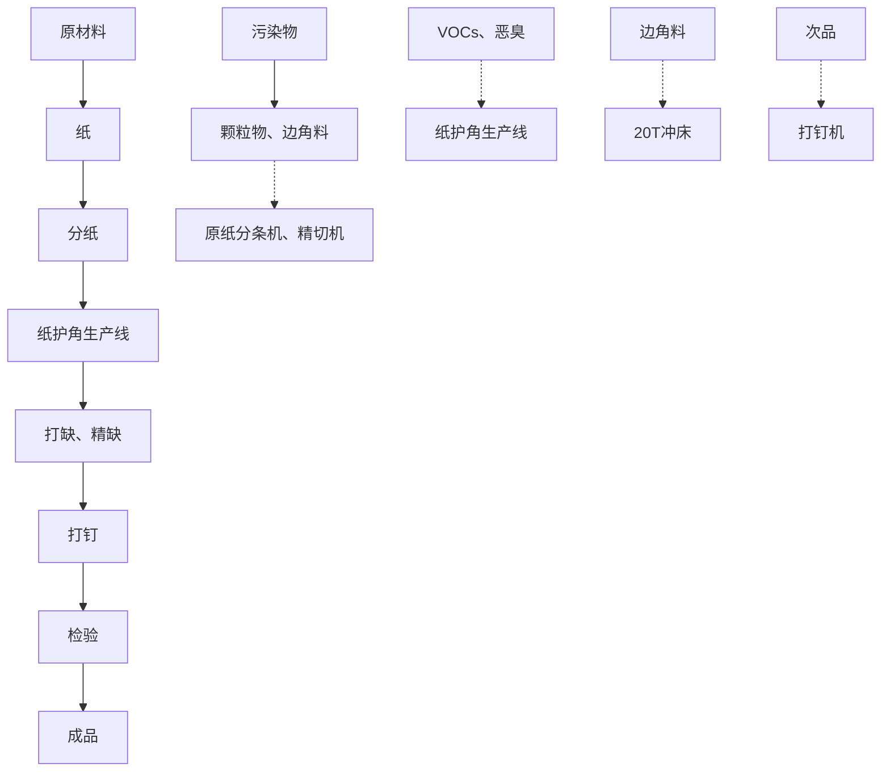
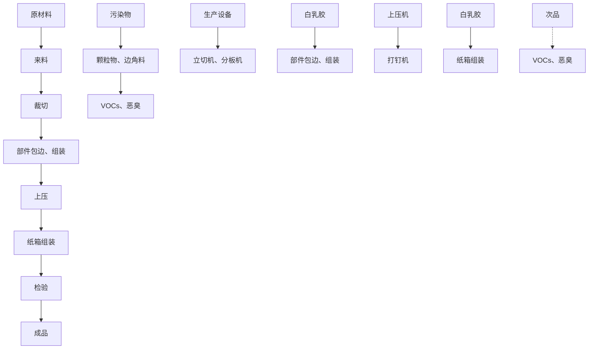

# 建设项目环境影响报告表

（污染影响类）

项目名称：佛山市顺德区丹煜包装制品有限公司新建项目

建设单位（盖章）：佛山市顺德区丹煜包装制品有限公司

编制日期： 2021 年 10 月

中华人民共和国生态环境部制

## 一、建设项目基本情况

<table><tr><td>建设项目名称</td><td colspan="3">佛山市顺德区丹煜包装制品有限公司新建项目</td></tr><tr><td>项目代码</td><td colspan="3">无</td></tr><tr><td>建设单位联系人</td><td>陈*</td><td>联系方式</td><td>139*</td></tr><tr><td>建设地点</td><td colspan="3">佛山市顺德区勒流富安工业区连安路1号第26#-2号厂房</td></tr><tr><td>地理坐标</td><td colspan="3">(113度13分8.015秒,22度49分6.502秒)</td></tr><tr><td>国民经济行业类别</td><td>C2035木制容器制造、C2231纸和纸板容器制造</td><td>建设项目行业类别</td><td>十七、木材加工和木、竹、藤、棕、草制品业20——33、木材加工201;木质制品制造203;十九、造纸和纸制品业22——38、纸制品制造223(有涂布、浸渍、印刷、粘胶工艺的)</td></tr><tr><td>建设性质</td><td>☑新建(迁建)□改建□扩建□技术改造</td><td>建设项目申报情形</td><td>☑首次申报项目□不予批准后再次申报项目□超五年重新审核项目□重大变动重新报批项目</td></tr><tr><td>项目审批(核准/备案)部门(选填)</td><td>/</td><td>项目审批(核准/备案)文号(选填)</td><td>/</td></tr><tr><td>总投资(万元)</td><td>100</td><td>环保投资(万元)</td><td>10</td></tr><tr><td>环保投资占比(%)</td><td>10</td><td>施工工期</td><td>1个月</td></tr><tr><td>是否开工建设</td><td>p否..是_</td><td>用地(用海)面积(m2)</td><td>2300</td></tr><tr><td>专项评价设置情况</td><td colspan="3">无</td></tr><tr><td>规划情况</td><td colspan="3">规划名称:《顺德西部生态产业新区顺德支流北岸片区(SD-H-04-01、SD-H-04-02)控制性详细规划》修编地块开发细则的批后公布;审批机关:佛山市顺德区人民政府;审批文件的名称及文号:《顺德西部生态产业新区顺德支流北岸片区(SD-H-04-01、SD-H-04-02)控制性详细规划修编地块开发细则批后公布》(佛府办函[2021]247号);</td></tr><tr><td>规划环境影响评价情况</td><td colspan="3">无</td></tr><tr><td>规划及规划环境影响评价符合性分析</td><td colspan="3">无</td></tr><tr><td>其他符合性分析</td><td colspan="3">1、“三线一单”相符性分析1生态保护红线项目位于佛山市顺德区勒流富安工业区连安路1号第26#-2号厂房,周边无自然保护区。根据《佛山市顺德区生态保护红线管理办法(试行)》的相关规定,项目所在地为城市建成区,不涉及自然保护区、森林公园、自然保护区、饮用水源保护区及其他需要进行生态保护的区域,不在生态保护红线范围内。2环境质量底线本项目附近地表水环境、声环境质量以及大气环境均能满足相应的标准要求;本项目废气产生量较小,且废气经过有效的收集和处理后排放,对周边环境影响很小。项目生活污水三级化粪池达标后经市政污水管网排入勒流污水处理厂处理,尾水排入顺德水道。因此项目的建设符合环境质量底线要求。3资源利用上线本项目营运过程中消耗一定量的电能、水资源,项目资源消耗量相对区域资料利用总量较少,符合资源利用上限的要求。4产业政策及准入清单项目主要从事纸类包装制品和木托的生产与销售,属于C2231纸和纸板容器制造和C2035木制容器制造。根据《市场准入负面清单》(2020年版),本项目属于许可准入类。因此,项目符合相关的产业政策要求。5项目与《佛山市人民政府关于印发佛山市“三线一单”生态环境分区管控方案的通知》(佛府[2021]11号)相符性分析对照《佛山市人民政府关于印发佛山市“三线一单”生态环境分区管控方案的通知》(佛府[2021]11号)的附件1佛山市环境管控单元图,本项目所在地属于重点管控单元(详见附图9)。对照(佛府[2021]11号)的附件4佛山市环境管控单元准入清单的“广东省佛山市顺德区重点管控单元9准入清单”,本项目位于佛山市顺德区勒流街道内,项目行业类别及代码为C2231纸和纸板容器制造和C2035木制容器制造,不属于产业限制类项目;项目主要生产原料不涉及使用高挥发性原材料,符合相关政策要求,不属于“两高”项目,符合区域布局管控要求。本项目建设在陆域上,不属于占用水域和破坏生</td></tr></table>

态的岸线利用行为，符合能源资源利用要求。

表1-1 项目与《佛山市人民政府关于印发佛山市“三线一单”生态环境分区管控方案的通知》（佛府[2021]11号）相关符合分析

<table><tr><td>序号</td><td>政策要求</td><td>项目实际</td><td>符合判定</td></tr><tr><td>1</td><td>【区域布局管控要求】环境质量不达标区域,新建、扩建项目需符合环境质量改善要求。禁止新建、扩建水泥、平板玻璃、化学制浆、生皮制革以及国家规划外的钢铁、原油加工等项目。专业电镀、印染等项目进入定点园区集中管理。推广应用低挥发性有机物原辅材料,严格限制新建生产和使用高挥发性有机物原辅材料的项目,鼓励建设共性工厂、活性炭集中再生中心等挥发性有机物第三方治理项目,推动挥发性有机物集中高效处理。优化交通结构,发展多式联运,推进公路、水路等交通运输燃料清洁化,推广新能源物流车辆,优先在禅桂新中心城区探索设立“绿色物流”片区。</td><td>本项目位于佛山市顺德区勒流富安工业区连安路1号第26#-2号厂房,大气质量和水质量均属于达标区。项目行业类别及代码为C2231纸和纸板容器制造和C2035木制容器制造,不属于区域布局管控要求中的禁止新建、扩建水泥、平板玻璃、化学制浆、生皮制革以及国家规划外的钢铁、原油加工等项目。项目使用的纸管纸箱专用胶属于低挥发性有机物含量的原材料,不属于新建生产和使用高挥发性有机物原辅材料的项目。</td><td>符合</td></tr><tr><td>2</td><td>【能源资源利用要求】强化自然岸线保护,优化岸线开发利用格局,严格水域岸线用途管制,新建项目一律不得违规占用水域。</td><td>本项目建设在陆域上,不属于占用水域行为。</td><td>符合</td></tr><tr><td>3</td><td>【污染物排放管控要求】禁止在地表水I、II类水域新建排污口,已建排污口不得增加污染物排放量。重金属污染重点防控区内,重点重金属排放总量只减不增。</td><td>本项目生活污水最终受纳水体为顺德支流,属于III类水域,且不新建排污口,本项目生活污水经三级化粪池处理达标后经市政污水管网排入勒流污水处理厂处理。项目不属于重金属行业,故不排放重金属物质。</td><td>符合</td></tr></table>

<table><tr><td rowspan="5"></td><td>4</td><td>【环境风险防控要求】提升危险废物监管能力,利用信息化手段,推动全过程跟踪管理。健全危险废物收集体系,推进危险废物利用处置能力优化提升。全力避免因各类安全事故(事件)引发的次生环境风险事故(事件)。</td><td>项目产生的危险废物拟定期委托有资质的处置公司进行收集处理,并通过信息系统登记转移计划和电子转移联单。项目运营过程落实各项风险控制措施,加强监督检查,做到及时发现,立即处理,避免环境风险事故发生。</td><td>符合</td></tr><tr><td colspan="4">2、相关环保法规符合性分析项目生活污水经三级化粪预处理后通过市政管道排入勒流污水处理厂处理。项目废水处置及排放满足《佛山市顺德区环境保护委员会办公室关于对涉水排放的建设项目加强环境管理的通知》(顺环委办[2020]44号)的相关要求。表1-2 项目与《佛山市顺德区环境保护委员会办公室关于对涉水排放的建设项目加强环境管理的通知》(顺环委办[2020]44号)相关符合分析</td></tr><tr><td>序号</td><td>政策要求</td><td>项目实际</td><td>符合判定</td></tr><tr><td>1</td><td>严格按照环评导则对涉水排放建设项目的废水(包括生活污水、生产废水)、环境风险等要素开展环境影响评价,结合受纳水体水质状况和环境基础设施配套情况进行审批。审批时应重点核查项目的受纳水体达标情况,受纳水体不达标的,不得通过审批</td><td>生活污水经三级化粪预处理后通过市政管道排入勒流污水处理厂处理。根据《佛山市生态环境局顺德分局关于发布2020年度佛山市顺德区环境质量状况公报的通知》可知,顺德支流新涌断面2020年的水质定类为III类,符合《地表水环境质量标准》(GB3838-2002)之III类标准的要求。</td><td>符合</td></tr><tr><td>2</td><td>没有配套污水集中处置的工业园区和不在生活污水管网覆盖的区域,不应新建、扩建含蚀刻工序的线路板生产项目和化工项目。</td><td>项目不属于线路板和化工项目。</td><td>符合</td></tr></table>

<table><tr><td>3</td><td>纯加工型印花项目,含酸洗、磷化的金属表面处理、金属制品项目(与自身高新技术产业配套的除外),含酸洗、喷涂、拉丝、表面抛光等工艺的不锈钢型材加工项目,应进入以此类项目为主导产业、有相应废水集中治理设施的工业园区,实现集中治污。</td><td>本项目不属于纯加工型印花,含酸洗、磷化的金属表面处理、金属制品项目(与自身高新技术产业配套的除外),含酸洗、喷涂、拉丝、表面抛光等工艺的不锈钢型材加工项目。</td><td>符合</td></tr><tr><td>4</td><td>涉水排放建设项目的排水系统必须严格执行“雨污分流、清污分流”原则,按照《佛山市环境保护局关于印发佛山市工业企业污水治理设施规范化整治技术要求和指南的通知》(佛环函〔2015〕324号)要求进行建设。</td><td>本项目生活污水经三级化粪池处理达标后经市政污水管网排入勒流污水处理厂处理,雨水经市政雨水管道排放。</td><td>符合</td></tr></table>

## 3、有机废气相符性分析

项目挥发性有机物（VOCs）排放符合性根据相关政策文件规定分析如下：

表1-3 项目与挥发性有机物（VOCs）排放规定相关符合分析

<table><tr><td>序号</td><td>文件</td><td>规定</td><td>项目实际</td><td>符合判定</td></tr><tr><td>1</td><td>《重点行业挥发性有机物综合治理方案》的通知(环大气[2019]53号)</td><td>提高废气收集率。遵循“应收尽收、分质收集”的原则,科学设计废气收集系统,将无组织排放转变为有组织排放进行控制。</td><td>项目在纸护角、包边、组装工位设置“集气罩+围蔽”,废气收集效率可达90%。</td><td>符合</td></tr><tr><td>2</td><td>《广东省人民政府办公厅关于印发广东省2021年水、大气、土壤污染防治工作方案的通知》粤办函【2021】58号》</td><td>实施低VOCs含量产品源头替代工程。严格落实国家产品VOCs含量限值标准要求,除现阶段确无法实施替代的工序外,禁止新建生产和使用高VOCs含量原辅材料项目。鼓励在生产和流通消费环节推广使用低VOCs含量原辅材料。将全面使用符合国家、省要求的低VOCs含量原辅材料企业纳入正面</td><td>本项目使用的纸管纸箱专用胶属于低挥发性有机物含量的原材料。</td><td>符合</td></tr></table>

<table><tr><td rowspan="6"></td><td></td><td></td><td>清单和政府绿色采购清单。各地级以上市要制定低VOCs含量原辅材料替代计划,根据当地涉VOCs重点行业及物种排放特征,选取若干重点行业,通过明确企业数量和原辅材料替代比例,推进企业实施低VOCs含量原辅材料替代。</td><td></td><td></td></tr><tr><td rowspan="5">3</td><td rowspan="5">《挥发性有机物无组织排放控制标准(GB27822-2019)》</td><td>VOCs物料应储存于密闭的容器、包装袋、储罐、储库、料仓中</td><td>本项目纸管纸箱专用胶储存在密封的容器内</td><td>符合</td></tr><tr><td>盛装VOCs物料的容器或包装袋应存放于室内,或存放于设置有雨棚、遮阳和防渗设施的专用</td><td>纸管纸箱专用胶储存在密封的容器中存放在厂内;厂房为已建成,拥有完整的围护结构,地面已经全部混凝土硬化,采取防腐防渗处理</td><td></td></tr><tr><td>液态VOCs物料应采用密闭管道输送。采用非管道输送方式转移液态VOCs物料时,应采用密闭容器、罐车</td><td>纸管纸箱专用胶为液体使用时采用密闭容器转移</td><td></td></tr><tr><td>VOCs物料卸(出、放)料过程应密闭,卸料废气应排至VOCs废气收集处理系统;无法密闭的,应采取局部气体收集措施,废气应排至VOCs废气收集处理系统</td><td>项目纸护角、包边、组装工位设置“集气罩+围蔽”收集废气,收集后经“两级活性炭”设施处理后引至15米排气筒G1排放</td><td></td></tr><tr><td>收集的废气中NMHC初始排放速率≥3kg/h时,应配置VOCs处理设施</td><td>项目产生的有机废气初始排放速率低于3kg/h,故设置“两级活性炭”处理设施</td><td></td></tr></table>

## 二、建设项目工程分析

## 1、项目工程组成

项目租用已建成厂房进行生产，地址为佛山市顺德区勒流富安工业区连安路1号第26#-2 号厂房。本项目总占地面积为2300m2，建筑面积为2300m2，厂房为单层建筑物。项目建设组成情况详见下表 2-1。项目主要从事纸类包装制品和木托的生产与销售，预计年产纸护角160万米，蜂窝纸箱9600个，木托6000个。

表 2-1 项目工程组成

<table><tr><td>项目</td><td>内容</td><td>规模用途</td></tr><tr><td>主体工程</td><td>生产车间</td><td>面积约为2200m2,分为纸护角生产区,蜂窝纸箱生产区,木托生产区</td></tr><tr><td rowspan="2">辅助工程</td><td>仓库</td><td>位于生产车间内,分为原材料、半成品、成品堆放区</td></tr><tr><td>办公室</td><td>位于生产车间内,面积约为100m2,用于日常办公</td></tr><tr><td>贮运工程</td><td>运输</td><td>原材料及产品由汽车运输</td></tr><tr><td rowspan="3">公用工程</td><td>供电系统</td><td>市政供电</td></tr><tr><td>给水系统</td><td>市政供水</td></tr><tr><td>排水系统</td><td>采用雨污分流,其雨水进入市政管网;生活污水经三级化粪预处理后通过市政管道排入勒流污水处理厂处理</td></tr><tr><td rowspan="3">环保工程</td><td>废水治理</td><td>生活污水经三级化粪预处理后通过市政管道排入勒流污水处理厂处理</td></tr><tr><td>废气治理</td><td>木工粉尘通过吸尘管收集后经木工精密锯自带的双桶布袋除尘器处理后无组织排放;VOCs经“集气罩+围蔽”收集后通过“两级活性炭”处理设施处理后引至15米排气筒排放</td></tr><tr><td>固废治理</td><td>生活垃圾交由环卫部门处理;一般固废外卖给废品回收商;危险废物交由有资质的单位处理</td></tr></table>

## 2、项目生产规模

根据业主提供的资料，项目主要产品产量见下表。

表 2-2 项目产品产量

<table><tr><td>序号</td><td>产品名称</td><td>年产量</td><td>单位</td></tr><tr><td>1</td><td>纸护角</td><td>160</td><td>万米</td></tr><tr><td>2</td><td>蜂窝纸箱</td><td>9600</td><td>个</td></tr><tr><td>3</td><td>木托</td><td>6000</td><td>个</td></tr></table>

建
设
内
容

## 3、项目主要生产设备

根据业主提供的资料，项目主要生产设备详见下表。

表 2-3 项目主要生产设备一览表

<table><tr><td>序号</td><td>名称</td><td>单位</td><td>数量</td><td>备注</td></tr><tr><td>1</td><td>纸护角生产线</td><td>条</td><td>2</td><td>用于纸护角生产工序</td></tr><tr><td>2</td><td>原纸分条机</td><td>台</td><td>1</td><td>用于分纸工序</td></tr><tr><td>3</td><td>精切机</td><td>台</td><td>1</td><td>用于分纸工序</td></tr><tr><td>4</td><td>20T冲床</td><td>台</td><td>2</td><td>用于打缺、精缺工序</td></tr><tr><td>5</td><td>打钉机</td><td>台</td><td>2</td><td>用于打钉工序</td></tr><tr><td>6</td><td>立切机</td><td>台</td><td>2</td><td>用于裁切工序</td></tr><tr><td>7</td><td>分板机</td><td>台</td><td>1</td><td>用于裁切工序</td></tr><tr><td>8</td><td>冷压机</td><td>台</td><td>3</td><td>用于上压工序</td></tr><tr><td>9</td><td>木工精密锯</td><td>台</td><td>1</td><td>用于木托生产</td></tr><tr><td>10</td><td>裱纸机</td><td>台</td><td>2</td><td>用于蜂窝纸箱的生产</td></tr></table>

## 4、项目主要原辅材料

根据建设单位提供的资料，项目使用的原辅材料详见下表。

表2-4 项目主要原辅材料

<table><tr><td>序号</td><td>名称</td><td>单位</td><td>数量</td></tr><tr><td>1</td><td>纸</td><td>吨/年</td><td>500</td></tr><tr><td>2</td><td>纸管纸箱专用胶</td><td>吨/年</td><td>3</td></tr><tr><td>3</td><td>木夹板</td><td>平方米/年</td><td>6000</td></tr><tr><td>4</td><td>机油</td><td>吨/年</td><td>0.05</td></tr></table>

## 注释：

纸管纸箱专用胶：是一种白色或微黄色粘稠性液体，pH为2.5-4.5，闪点＞100℃，可分散与水，正常情况下储存稳定，根据建设单位提供的MSDS，本项目使用的纸管纸箱专用胶主要成分聚乙烯醇10%、高岭土10%、淀粉5%、水75%。

## 5、劳动定员及工作制度

职工人数：项目职工人数为35人，员工均不在厂区内食宿。

工作制度：项目实行一天一班制，每天工作 8 小时，年工作时间 300 天。

## 6、资源、能源消耗

<table><tr><td></td><td>(1)生活用水:根据建设单位提供的资料,项目项目定员35人,年工作300天,生活用水量约350t/a,由市政供水。(2)本项目能耗主要为电能。用电由当地供电局统一供应,主要用于照明、设备运行等,项目总用电量约为15万kwh/a,不设备用发电机。7、厂区平面布置情况项目生产车间内部按照工艺要求进行分区,分为纸护角生产区,蜂窝纸箱纸护角生产区,木托纸护角生产区和原材料、半成品、成品堆放区,各生产区相对独立,互不干扰,每个生产区按照工艺流程布置设备,因此,项目车间内布置流畅,总体来说项目平面布置紧凑有序,布局合理。项目平面布置图详见附图5。</td></tr><tr><td></td><td>1、生产工艺流程图2-1 木托生产工艺流程图工艺流程说明:将外购的木夹板分切成所需大小后人工打钉拼装即为成品外售。</td></tr></table>

flowchart

图2-2 纸护角生产工艺流程图

## 工艺流程说明：

项目将外购的纸分切成所需大小后经纸护角生产线粘合成纸板，纸板通过冲床打出所需的缺口后打钉，检验合格的成品部分直接外售，部分用于蜂窝纸箱的生产。

flowchart

图2-3 蜂窝纸箱生产工艺流程图

## 工艺流程说明：

项目将外购的纸裁切成所需大小，后经人工利用纸管纸箱专用胶对纸箱部件进行包边组装，通过上压机将纸进行上压确保纸管纸箱专用胶将纸粘合，人工将各部件进行打钉组装，检验合格的成品部分直接外售，部分用于蜂窝纸箱的生产。

## 产污环节分析：

废水：外排废水为员工生活污水。

废气：项目产生的大气污染物主要为木夹板分切时产生的木屑粉尘；纸护角、包边、组装工序使用纸管纸箱专用胶时产生的有机废气，即 VOCs。生产过程产生的臭气浓度。

噪声：车间各种设备运行时产生的机械噪声；

<table><tr><td></td><td>固废:职工生活垃圾、一般工业固体废物(纸质边角料、次品、木工粉尘)、危险废物(废机油、含油废抹布、废包装桶、废活性炭)等。</td></tr><tr><td>与项目有关的原有环境污染问题</td><td>本项目属于新建项目,新厂址租用已建成的空置厂房作为生产场所,无原有污染问题。</td></tr></table>

## 三、区域环境质量现状、环境保护目标及评价标准

<table><tr><td>区域环境质量现状</td><td>1、大气质量现状1常规污染物环境质量现状本项目位于佛山市顺德区勒流富安工业区连安路1号第26#-2号厂房,根据《关于调整顺德区环境空气质量功能区划的变函》(佛府办函[2014]494号),项目所在位置属于二类环境空气质量功能区,执行《环境空气质量标准》(GB3095-2012)及其2018年修改单二级标准。根据《佛山市生态环境局顺德分局关于发布2020年度佛山市顺德区环境质量状况公报的通知》,2020年全区空气质量综合指数为3.30,比2019年下降22.9%空气质量同比有所改善,在全市五区中排名第二。2020年全区二氧化硫( $SO_{2}$ )、二氧化氮( $NO_{2}$ )、可吸入颗粒物( $PM_{10}$ )、细颗粒物( $PM_{2.5}$ )平均浓度分别为7、30、43、21微克/立方米,臭氧日最大8小时滑动平均( $O_{3}$ -8h)浓度的第90百分位数为155微克/立方米,一氧化碳(CO)日浓度的第95百分位数为1.0毫克/立方米,六项污染物指标浓度均达到《环境空气质量标准》(GB3095-2012)二级标准限值。与去年相比,2020年度顺德区六项环境空气污染指标浓度均有不同程度下降, $PM_{2.5}$ 、 $PM_{10}$ 、 $NO_{2}$ 、 $SO_{2}$ 平均浓度分别下降30.0%、23.2%、23.1%、12.5%,C0日平均浓度的第95百分位数下降23.1%、 $O_{3}$ -8h浓度的第90百分位数下降18.4%,具体情况见图3-1和表3-1。2020年度全区环境空气质量优良天数占有效天数的90.4%,同比去年提高13.1个百分点。</td></tr></table>

bar-line hybrid chart

| 碳素类型       | 2019年 (微克/立方米) | 2020年 (微克/立方米) | 毫克/立方米 (一氧化碳) |
| -------------- | ------------------- | ------------------- | --------------------- |
| 二氧化硫      | 10                  | 8                   | 0.1                   |
| 二氧化氮      | 40                  | 35                  | 0.3                   |
| 可吸入颗粒物   | 60                  | 45                  | 0.5                   |
| 细颗粒物       | 35                  | 30                  | 0.4                   |
| 臭氧            | 195                 | 155                 | 2.6                   |
| 一氧化碳        | 75                  | 60                  | 1.0                   |

图 3-1 2020 年顺德区（国控测点）环境空气污染物浓度水平年度比较表3-1 2020 年顺德区（国控测点）环境空气污染物浓度水平年度比较

<table><tr><td rowspan="2">污染物</td><td colspan="2">浓度均值</td><td rowspan="2">评价标准</td><td rowspan="2">变化</td></tr><tr><td>2019年</td><td>2020年</td></tr><tr><td> $SO_{2}$ (μg/m3)</td><td>8</td><td>7</td><td>60</td><td>达标</td></tr><tr><td> $NO_{2}$ (μg/m3)</td><td>39</td><td>30</td><td>40</td><td>达标</td></tr><tr><td> $PM_{10}$ (μg/m3)</td><td>56</td><td>43</td><td>70</td><td>达标</td></tr><tr><td> $PM_{2.5}$ (μg/m3)</td><td>30</td><td>21</td><td>35</td><td>达标</td></tr><tr><td> $CO^{*}$ (μg/m3)</td><td>1.3</td><td>1.0</td><td>4</td><td>达标</td></tr><tr><td> $O_{3}-8^{*}$ (μg/m3)</td><td>190(超标)</td><td>155</td><td>160</td><td>达标区</td></tr><tr><td colspan="5">*注:(1)表中C0为年内日平均值的第95百分位数, $O_{3}$ 为年内日最大8小时平均值的第90百分位数。(2)2019年公报与2020年公报中的环境空气质量统计分析数据均采用实况数据。</td></tr></table>

根据2020年全区的大气环境质量状况公报，六项污染物指标浓度均达到了质量标准限值，故顺德区大气环境质量属达标区。

②其他污染物环境质量现状

为了解评价区域内TVOC、臭气浓度的现状，本项目未开展监测，引用佛山市佰吉原生活用品有限公司委托广州市恒力检测股份有限公司在富裕村开展的现状监测结果（监测报告详见附件7）。监测点A3距离本项目边界最近距离约1104m，监测时间：2019年5月5日～5月11日。具体监测点说明及现状监测结果分别见表 3-2 和表 3-3 示。

表 3-2 TVOC、臭气浓度污染物补充监测点位基本信息

<table><tr><td rowspan="2">监测点名称</td><td colspan="2">监测点坐标/m</td><td rowspan="2">监测因子</td><td rowspan="2">监测时段</td><td rowspan="2">相对场址方位</td><td rowspan="2">相对厂界距离/m</td></tr><tr><td>X</td><td>Y</td></tr><tr><td rowspan="2">A3 富裕村</td><td rowspan="2">-1104</td><td rowspan="2">-226</td><td>TVOC</td><td>8 小时</td><td rowspan="2">西南</td><td rowspan="2">1104</td></tr><tr><td>臭气浓度</td><td>1 小时</td></tr></table>

表 3-3 项目其他污染物监测结果表

<table><tr><td>监测点名称</td><td>监测因子</td><td>监测时段</td><td>评价标准 $(mg/m^3)$ </td><td>监测浓度范围 $(mg/m^3)$ </td><td>最大浓度占标率%</td><td>超标率%</td><td>达标情况</td></tr><tr><td rowspan="2">A3 富裕村</td><td>TVOC</td><td>8 小时</td><td>0.6</td><td>0.094-0.113</td><td>18.8</td><td>0</td><td>达标</td></tr><tr><td>臭气浓度</td><td>1 小时</td><td>20</td><td>10-13</td><td>65</td><td>0</td><td>达标</td></tr></table>

在7天的监测时间内，TVOC监测结果满足《环境影响评价技术导则大气环境》（HJ2.2-2018）附录 D中其他污染物空气质量浓度限值要求；臭气浓度监测结果满足《恶臭污染物排放标准》（GB14554-93）新扩建厂界二级标准要求。总体而言，评价范围内的环境空气质量良好。

## 2、地表水环境质量现状

本项目所处位置属于勒流污水处理厂纳污范围，生活污水经三级化粪池处理后排入勒流污水处理厂处理，尾水排入顺德支流。顺德支流水质执行《地表水环境质量标准》（GB3838-2002）之 III 类标准。

为评价顺德支流水质，根据《佛山市生态环境局顺德分局关于发布 2020 年度佛山市顺德区环境质量状况公报的通知》可知，顺德支流新涌断面2020年的水质定类为Ⅲ类，符合《地表水环境质量标准》(GB3838-2002)之Ⅲ类标准的要求，故水质较好。

表3-4 2020年度佛山市顺德区环境质量状况公报（节选）

<table><tr><td rowspan="18"></td><td colspan="7">表3-3 2020年顺德区主河道质量评价及年度对比</td></tr><tr><td rowspan="2">序号</td><td rowspan="2">河流名称</td><td rowspan="2">断面</td><td colspan="2">断面定类</td><td rowspan="2">水质评价标准</td><td>河流定类</td></tr><tr><td>2020年</td><td>2019年</td><td>2020年</td></tr><tr><td>1</td><td>吉利涌</td><td>平步</td><td>II</td><td>II</td><td>III</td><td>II</td></tr><tr><td>2</td><td>潭洲水道上游</td><td>潭村</td><td>II</td><td>II</td><td>II</td><td>II</td></tr><tr><td>3</td><td>潭洲水道下游</td><td>西海</td><td>II</td><td>II</td><td>III</td><td>II</td></tr><tr><td>4</td><td>陈村水道</td><td>江口</td><td>II</td><td>III</td><td>III</td><td>II</td></tr><tr><td>5</td><td>陈村涌</td><td>四方磨</td><td>III</td><td>III</td><td>III</td><td>III</td></tr><tr><td>6</td><td rowspan="4">顺德水道</td><td>杨滘</td><td>II</td><td>II</td><td>II</td><td rowspan="4">II</td></tr><tr><td>7</td><td>大闸</td><td>II</td><td>II</td><td>II</td></tr><tr><td>8</td><td>羊颍</td><td>II</td><td>II</td><td>II</td></tr><tr><td>9</td><td>乌洲</td><td>II</td><td>II</td><td>II</td></tr><tr><td>10</td><td>李家沙水道</td><td>五沙</td><td>II</td><td>III</td><td>III</td><td>II</td></tr><tr><td>11</td><td>西江干流</td><td>甘竹滩</td><td>II</td><td>II</td><td>III</td><td>II</td></tr><tr><td>12</td><td rowspan="2">顺德支流</td><td>新涌</td><td>III</td><td>III</td><td>III</td><td rowspan="2">III</td></tr><tr><td>13</td><td>飞鹅山</td><td>III</td><td>III</td><td>III</td></tr><tr><td>14</td><td rowspan="2">容桂水道</td><td>穗香围</td><td>II</td><td>III</td><td>III</td><td rowspan="2">II</td></tr><tr><td>15</td><td>顺德港</td><td>II</td><td>II</td><td>III</td></tr><tr><td></td><td colspan="7">3、声环境项目厂界外周边50米范围内不存在声环境保护目标,无需监测声环境质量现状。4、生态环境项目用地范围内无生态环境保护目标,无需开展生态现状调查。5、电磁辐射项目不涉及电磁辐射,无需开展电磁辐射现状调查。6、土壤、地下水环境项目不存在土壤、地下水环境污染途径,不开展土壤、地下水环境质量现状调查。</td></tr><tr><td>环境保护目标</td><td colspan="7">1、环境空气保护目标本项目厂界外500米范围内有居民区详见表3-5,但无自然保护区、风景名胜区、文化区和农村地区中人群较集中的区域等保护目标。表3-5 大气环境保护目标</td></tr><tr><td rowspan="4"></td><td rowspan="2">名称</td><td colspan="2">坐标</td><td rowspan="2">保护对象</td><td rowspan="2">保护内容</td><td rowspan="2">环境功能区</td><td rowspan="2">相对厂址方位</td></tr><tr><td>X</td><td>Y</td></tr><tr><td>连杜村</td><td>358</td><td>0</td><td>居住区</td><td>人群</td><td>大气二类区</td><td>西</td></tr><tr><td colspan="7">备注:以厂址中心为原点(0,0),正北方向为Y正向,正东方向为X正向。2、水环境保护目标地下水:本项目厂界外500米范围内无地下水集中式饮用水水源和热水、矿泉水、温泉等特殊地下水资源。地表水:本项目外排污水为生活污水,生活污水经三级化粪池处理达标后经市政污水管网排入勒流污水处理厂,尾水排入顺德支流。水环境保护目标是确保顺德支流符合《地表水环境质量标准》(GB3838-2002)的III类标准。3、声环境保护目标项目厂界外50米范围内不存在声环境保护目标。4、生态环境项目用地范围内无生态环境保护目标。</td></tr><tr><td rowspan="4">污染物排放控制标准</td><td colspan="7">1、废水排放标准项目运营期生活污水经预处理达到《水污染物排放限值》(DB44/26-2001)中的三级标准(第二时段)后,通过市政管网进入勒流污水处理厂处理。勒流污水处理厂已完成提标改造,根据2013年7月11日颁布的《顺德区环境运输和城市管理局关于全区城镇污水处理厂尾水排放执行标准的通知》定:污水处理厂的尾水CODcr和NH3-N执行《城镇污水处理厂污染物排放标准》(GB18918-2002)一级A标准及《水污染物排放限值》(DB44/26-2001)的较严值,其它指标现执行《城镇污水处理厂污染物排放标准》(GB18918-2002)一级A标准,具体数值,具体执行标准见下表:表3-6 水污染物排放浓度限值(单位mg/L,pH除外)</td></tr><tr><td colspan="4" rowspan="2">排放标准</td><td colspan="3">标准值</td></tr><tr><td> $COD_{cr}$ </td><td> $BOD_5$ </td><td>SS</td></tr><tr><td colspan="4">《水污染物排放限值》(DB44/26-2001)中的三级标准(第二时段)</td><td>500</td><td>300</td><td>400</td></tr><tr><td>CODcr 和  $NH_{3}$ -N 执行《城镇污水处理厂污染物排放标准》(GB18918-2002)一级 A 标准及《水污染物排放限值》(DB44/26-2001)的较严值,其它指标现执行《城镇污水处理厂污染物排放标准》(GB18918-2002)一级 A 标准</td><td>40</td><td>10</td><td>10</td><td colspan="4">5</td></tr></table>

## 2、废气排放标准

（1）项目纸护角、包边、组装工序使用纸管纸箱专用胶产生 VOCs，根据《顺德区环境运输和城市管理局转发关于印发 2014 年佛山市陶瓷行、 玻璃制造行业、铝型材行业和 VOCs 排放企业整治方案的通知》（顺管函【2014】510号），“在国家、省未出台行业标准前，金属制品、铝型材、设备制造行业参照执行《表面涂装（汽车制造业）挥发性有机化合物排放标准（DB44/816-2010）》；其他行业参照执行《家具制造行业挥发性有机化合物排放标准（DB44/814-2010）》”。本项目属于 C2231 纸和纸板容器制造和 2035 木制容器制造，VOCs 排放执行《家具制造行业挥发性有机化合物排放标准（DB44/814-2010）》的第Ⅱ时段排放限值及无组织排放监控点浓度限值。

（2）项目纸护角、包边、组装产生的恶臭排放执行《恶臭污染物排放标准》（GB14554-93）中表1恶臭污染物厂界标准值和表2排气筒恶臭污染物排放限值。  
（3）项目分纸和裁切工序和木工分切产生的颗粒物执行《大气污染物排放限值》（DB44/27-2001）第二时段无组织排放监控浓度限值。  
（4）项目厂区内VOCs 无组织排放监控执行《挥发性有机物无组织排放控制标准》（GB37822-2019）表 A.1 规定的限值中的特别排放限值。

具体排放标准如下表所示：

表3-7 大气污染物排放标准

<table><tr><td rowspan="2">排放源</td><td rowspan="2">污染物</td><td colspan="2">有组织排放(排气筒15米)</td><td rowspan="2">无组织排放监控浓度限值(mg/m3)</td><td rowspan="2">执行标准</td></tr><tr><td>最高允许排放浓度(mg/m3)</td><td>最高允许排放速率(kg/h)</td></tr><tr><td>纸护角、包边、组装工序</td><td>VOCs</td><td>30</td><td>1.45</td><td>2.0</td><td>《家具制造行业挥发性有机化合物排放标准(DB44/814-2010)》</td></tr><tr><td>纸护角、包边、组装工序</td><td>恶臭</td><td>2000(无量纲)</td><td>——</td><td>20(无量纲)</td><td>《恶臭污染物排放标准》(GB14554-93)</td></tr></table>

<table><tr><td rowspan="7"></td><td>分纸、裁切和木工分切</td><td>颗粒物</td><td>/</td><td>/</td><td>1.0</td><td>《大气污染物排放限值》(DB44/27-2001)</td></tr><tr><td colspan="6">备注:企业排气筒高度应高出周围200m半径范围的最高建筑5m以上,不能达到该要求的排气筒,应按表2所列对应排放速率限值的50%执行。本项目企业排气筒不满足高出周围200m半径范围的最高建筑5m以上的要求。</td></tr><tr><td colspan="6">表3-8 厂区内VOCs无组织排放限值</td></tr><tr><td>污染物项目</td><td colspan="2">特别排放限值(mg/m3)</td><td colspan="2">限值含义</td><td>无组织排放监控位置</td></tr><tr><td rowspan="2">NMHC</td><td colspan="2">6</td><td colspan="2">监控点1h平均浓度</td><td rowspan="2">在厂房外设置监控点</td></tr><tr><td colspan="2">20</td><td colspan="2">监控点处任意一次浓度值</td></tr><tr><td colspan="6">(三)噪声:本项目执行《工业企业厂界环境噪声排放标准》(GB12348-2008)3类标准昼间等效声级≤65dB(A)、夜间等效声级≤55dB(A)。(四)固体废物:一般工业固体废物鉴别执行《固体废物鉴别标准通则》(GB34330-2017),收集、贮存、运输、处置等环节执行《中华人民共和国固体废物污染环境防治法》(2020年修订)、《一般工业固体废物贮存和填埋污染控制标准》(GB18599-2020)。危险废物执行《国家危险废物名录》(2021年)、《危险废物贮存污染控制标准》(GB18597-2001)及其2013年修改单等相关要求。</td></tr><tr><td>总量控制指标</td><td colspan="6">项目运营期间生活污水排放量为315t/a,CODCr排放总量为0.013t/a,NH3-N排放总量为0.002t/a,CODcr、NH3-N总量纳入勒流污水处理厂的总量中。本项目VOCs有组织排放量为0.054t/a,无组织排放量为0.03t/a。根据《顺德区环境保护委员会关于印发顺德区工业挥发性有机物项目(VOCs)审批总量前置实施细则(2016年修订)的通知》(顺指环委[2016]3号),本项目建议总量控制指标为0.054t/a,由区镇两级环保主管部门核查总量指标。</td></tr></table>

## 四、主要环境影响和保护措施

<table><tr><td>施工期环境保护措施</td><td colspan="8">项目租用已建设完毕的工业厂房,不涉及厂房建设,施工过程主要是内部装修和设备安装,没有基建工程,因此施工期基本不存在大型土建工程,施工期间产生的影响主要是由于设备运输,安装时产生的噪声等。施工期建设单位应严格遵守有关建筑施工的环境保护条例,防止运输扬尘,建筑垃圾、废物等及时清运,降低施工过程对周围环境造成的影响。项目施工期较短,因此若建设单位加强施工管理,项目施工时不会对周围环境产生较大影响。因此本报告不对其进行论述。</td></tr><tr><td rowspan="7">运营期环境影响和保护措施</td><td colspan="8">1、大气污染源项目产生的大气污染物主要为木工分切时产生的木工粉尘;分纸和裁切产生的颗粒物;使用纸管纸箱专用胶时产生的VOCs和臭气浓度;表4-1项目废气产污环节、污染物项目、排放形式及污染防治设施一览表</td></tr><tr><td rowspan="2">主要生产单元</td><td rowspan="2">污染物项目</td><td rowspan="2">排放形式</td><td colspan="4">污染物防治设施名称</td><td rowspan="2">排放口类型</td></tr><tr><td>污染物防治设施工艺及设施</td><td>收集效率</td><td>处理效率</td><td>是否为可行性技术</td></tr><tr><td>木工分切</td><td>颗粒物</td><td>无组织</td><td>布袋除尘器</td><td>90</td><td>90</td><td>R是□否</td><td>/</td></tr><tr><td>分纸、裁切</td><td>颗粒物</td><td>无组织</td><td>/</td><td>/</td><td>/</td><td>R是□否</td><td>/</td></tr><tr><td>纸护角、包边、组装</td><td>VOCs、臭气浓度</td><td>有组织</td><td>/</td><td>90</td><td>/</td><td>R是□否</td><td>一般排放口</td></tr><tr><td colspan="8">(1)废气排放源强1木料加工粉尘本项目生产木托时需要进行分切,分切时会产生少量木工粉尘,污染因子为颗粒物。参考《排放源统计调查产排污核算方法和系数手册》203木质制品制造行业系数手册中203木质制品制造行业系数表(续表1)工段名为称机加工,产品名称为木门窗、木楼梯、实木复合地板、强化木地板、其他木制品(木制容器、软木制品),原料名称为木材、实木、表板,工艺名称为切割、打孔、</td></tr></table>

开槽，规模等级为所有规模，污染物指标为颗粒物，单位为千克/立方米-产品，产物系数 0.0045。本项目年产木托 6000 个，单个木托尺寸约为 1000\*1000mm，厚度约为12mm，则本项目年产木托72立方米。木工分切工序产生的颗粒物为0.0003t/a，产生速率为 0.0001kg/h。

项目木工粉尘主要产生于木托生产区，不与纸护角、蜂窝纸箱在同一生产区，生产区之间以墙为间隔。项目通过设在木工精密锯前方的吸尘管利用风机产生的负压吸入通风管路，将含粉尘气体送入自带的双桶布袋除尘器处理，收集效率约为90%，处理效率约 90%，其中处理风量约为2000m3/h，处理后废气在车间内无组织排放，此类粉尘经布袋除尘设备收集后作为一般固体废物处理。

表 4-2 项目木工粉尘产排情况

<table><tr><td rowspan="2">污染物</td><td rowspan="2">产生量(t/a)</td><td rowspan="2">收集量(t/a)</td><td rowspan="2">处理量(t/a)</td><td colspan="2">无组织排放</td></tr><tr><td>排放量(t/a)</td><td>排放速率(kg/h)</td></tr><tr><td>颗粒物</td><td>0.0003</td><td>0.00027</td><td>0.000243</td><td>0.000057</td><td>0.0058</td></tr><tr><td colspan="6">备注:项目年工作日300天,每天工作8小时。</td></tr></table>

## ②切纸粉尘

本项目在分纸、裁切过程会产生少量粉尘，其污染因子为颗粒物。项目分纸过程对纸板加工部位约为纸板使用量的 1%，类比同类型项目，加工部位形成的粉尘产生量约为加工量的 0.5%，项目纸板年使用量为 500t/a，则分纸产生的切纸粉尘量为 0.025t/a，于生产车间无组织排放。按年生产 2400h（每天 8小时，年工作 300 天）计算，则分纸粉尘排放速率为 0.01kg/h。

## ③有机废气

本项目纸护角、包边、组装工序使用纸管纸箱专用胶时产生少量有机废气，污染因子为VOCs。根据供应商提供的 MSDS成分报告可知，纸管纸箱专用胶主要成分为聚乙烯醇 10%、高岭土 10%、淀粉 5%、水 75%。纸管纸箱专用胶主要挥发物质为聚乙烯醇，其含量为 10%。本项目纸管纸箱专用胶使用量为3t/a，则VOCs 产生量为 0.3t/a，每天工作8小时，年工作300天。本项目在使用纸管纸箱专用胶的工位上设置集气罩+围蔽对废气进行收集，废气收集后经“两级活性炭”处理设施处理后通过 15 米高排气筒排放。

## ④恶臭

本项目生产过程产生少量的异味，该异味污染物以臭气浓度为表征。本报告引用张欢等在《恶臭污染评价分级方法》中基于韦伯-费希纳公式所建立的臭气强度与臭气浓度的关系，将国外臭气强度6级法与我国《恶臭污染物排放标准》（GB14554-1993）结合（详见表 5-4），该分级法以臭气强度的嗅觉感觉和实验经验为分级依据，对臭气浓度进行等级划分，提高了分级的准确程度。

表 4-3 与臭气强度相对应的臭气浓度限值

<table><tr><td>分级</td><td>臭气强度(无量纲)</td><td>臭气浓度(无量纲)</td><td>嗅觉感觉</td></tr><tr><td>0</td><td>0</td><td>10</td><td>未闻到有任何气味,无任何反应</td></tr><tr><td>1</td><td>1</td><td>23</td><td>勉强能闻到有气味,但不宜辨认气味性质(感觉阈值)认为无所谓</td></tr><tr><td>2</td><td>2</td><td>51</td><td>能闻到气味,且能辨认气味的性质(识别阈值),但感到很正常</td></tr><tr><td>3</td><td>3</td><td>117</td><td>很容易闻到气味,有所不快,但不反感</td></tr><tr><td>4</td><td>4</td><td>265</td><td>有很强的气味,很反感,想离开</td></tr><tr><td>5</td><td>5</td><td>600</td><td>有极强的气味,无法忍受,立即逃跑</td></tr></table>

本项目使用纸管纸箱专用胶的过程异味强度一般在1\~2 级，折合臭气浓度为 23\~51（无量纲），生产异味随 VOCs 一起收集后，经“两级活性炭”处理设施处理后通过15米高排气筒排放，其余以无组织形式排放。

## ⑤排风量计算

本项目设计集气罩+围蔽废气收集效率为90%，根据《环保设备设计手册—大气污染控制设备》（周兴求主编，化学工业出版社）P494：上部集气罩的排风量Q 可根据下式进行计算：

$$
\mathrm{Q} = \mathrm{k} ^ {*} \mathrm{LHVx} (\mathrm{m} ^ {3} / \mathrm{s})
$$

式中：k—考虑沿高度速度分布不均匀的安全系数，通常取k=1.4。

L—罩口敞开面的总周长， 包边、组装工作台上方集气罩尺寸为400mm×300mm，总周长 1.40m；纸护角生产线集气罩尺寸为 300mm×200mm，周长为 1m；

<table><tr><td></td><td>H—罩口至污染源的距离,项目取0.3m;Vx—敞开断面处的流速,项目取0.5m/s;经计算,项目包边、组装工作台单个罩口所需的风量为 $1058.4m^{3}/h$ ,共有2个集气罩,纸护角生产线单个罩口风量为 $756m^{3}/h$ ,共2个集气罩,则项目所需的总风量为 $3628.8m^{3}/h$ ,考虑到风管阻力和长度等问题,取总风量为 $5000m^{3}/h$ 。(2)废气处理设施可行性分析项目使用的废气治理设施“二级活性炭”工艺为《排污许可证申请与核发技术规范 印刷工业》(HJ1066-2019)表A.1废气污染防治可行技术参考表中的可行性技术,故本项目废气治理设施可行。参考广东省《印刷、制鞋、家具、表面涂装(汽车制造)行业挥发性有机物总量减排核算细则》表2-3常见治理设施治理效率中吸附法有机废气净化效率为45~80%,建议本项目采用吸附效率60%的活性炭,项目采用两级活性炭吸附法有机废气净化效率取80%计算。活性炭吸附原理:吸附法是用固体吸附剂吸附处理废气中有害气体的一种方法。选择吸附剂的原则是比表面积大,容易吸附和脱附再生,来源容易,价格较低。有机废气适宜采用活性炭作吸附剂。活性炭是一种由含碳材料制成的外观呈黑色,内部孔隙结构发达、比表面积大、吸附能力强的一类微晶质碳素材料。活性炭材料中有大量肉眼看不见的微孔,1克活性炭材料中微孔的总内表面积可高达 $700-2300m^{2}$ 。正是这些微孔使得活性炭能“捕捉”各种有毒有害气体和杂质。由于气相分子和吸附剂表面分子之间的吸引力,使气相分子吸附在吸附剂表面。吸附剂表面面积愈大、单位质量吸附剂所能吸附的物质愈多。建议项目采用蜂窝状活性碳,比表面积 $900\sim1500m^{2}/g$ ,具有非常良好的吸附特性,其吸附量比活性炭颗粒一般大20-100倍,吸附容量为25wt%。当吸附载体吸附饱和时,进行更换。(3)大气达标性分析1废气源强达标分析</td></tr></table>

本项目共设置 1 个排气筒，排气筒基本情况见下表。

表4-4 排放口基本情况

<table><tr><td rowspan="2">类型</td><td rowspan="2">点源名称</td><td colspan="2">排气筒地理坐标</td><td rowspan="2">排气筒高度(m)</td><td rowspan="2">排气筒出口内径(m)</td><td rowspan="2">烟气流量( $m^3/h$ )</td><td rowspan="2">烟气温度(°C)</td><td rowspan="2">年排放小时数(h)</td></tr><tr><td>东经</td><td>北纬</td></tr><tr><td>点源</td><td>排气筒 G1</td><td> $113^\circ$   $13'$   $50.622''$ </td><td> $22^\circ$   $51'$   $57.569''$ </td><td>15</td><td>0.6</td><td>5000</td><td>25</td><td>2400</td></tr></table>

表4-5 项目排气筒污染物排放达标情况一览表

<table><tr><td>污染源</td><td>污染物</td><td>排放浓度(mg/m3)</td><td>排放速率(kg/h)</td><td>执行标准</td><td>浓度限值</td><td>速率限值</td><td>达标情况</td></tr><tr><td rowspan="2">排气筒G1</td><td>VOCs</td><td>4.6</td><td>0.023</td><td>《家具制造行业挥发性有机化合物排放标准(DB44/814-2010)》</td><td>30</td><td>/</td><td>达标</td></tr><tr><td>恶臭</td><td>少量</td><td>/</td><td>《恶臭污染物排放标准》(GB14554-93)中表2排气筒恶臭污染物排放限值</td><td>2000(无量纲)</td><td>/</td><td>达标</td></tr></table>

由上表可知，项目排气筒G1排放的VOCs可达到《家具制造行业挥发性有机化合物排放标准（DB44/814-2010）》的第Ⅱ时段排放限值，恶臭可以达到《恶臭污染物排放标准》（GB14554-93）中表2排气筒恶臭污染物排放限值，对大气环境影响较小。

## ②厂界废气达标分析

根据《环境影响评价技术导则-大气环境》（HJ2.2-2018）中推荐的AERSCREEEN（不考虑地形）模型模拟正常工况下各大气污染物的环境影响计算结果，本项目各排气筒和无组织排放污染物最大落地浓度值见下表。

表 4-6 项目厂界污染物排放达标情况一览表

<table><tr><td rowspan="4">主要生产单元</td><td rowspan="2">污染物</td><td colspan="2">最大落地浓度(mg/m3)</td><td rowspan="2">厂界监控浓度限值(mg/m3)</td><td rowspan="2">标准来源</td><td rowspan="2">达标分析</td></tr><tr><td>有组织排放</td><td>无组织排放</td></tr><tr><td>VOCs</td><td>0.00706</td><td>0.00415</td><td>2.0</td><td>《家具制造行业挥发性有机化合物排放标准(DB44/814-2010)》无组织排放监控点浓度限值</td><td>达标</td></tr><tr><td>颗粒物恶臭</td><td>/少量</td><td>0.00323少量</td><td>1.020(无量纲)</td><td>《大气污染物排放限值》(DB44/27-2001)第二时段无组织排放监控浓度限值《恶臭污染物排放标准》(GB14554-93)表1的二级新扩建标准限值</td><td>达标达标</td></tr></table>

由上表可知，项目VOCs无组织排放最大落地浓度值小于《家具制造行业挥发性有机化合物排放标准（DB44/814-2010）》无组织排放监控点浓度限值，颗粒物达到《大气污染物排放限值》（DB44/27-2001）第二时段无组织排放监控浓度限值，恶臭达到《恶臭污染物排放标准》(GB14554-93)表1的二级新扩建标准限值，符合相关标准要求。

③非正常工况下废气达标分析

根据本项目生产特点，生产设施在开停炉（机）等非正常情况，项目不产生废气污染物，故不考虑非正常情况下废气达标情况。

## （3）环境监测

项目属新建项目，所属行业为 C2231 纸和纸板容器制造和 C2035 木制容器制造，根据《固定污染源排污许可分类管理名录（2019版）》，项目属于简化管理。根据《排污单位自行监测技术指南 总则》（HJ819-2017），本项目所有废气排放口均属于一般排放口，运营期环境自行监测计划根据简化管理制定，如下表所示。

表4-7 大气监测点位、监测指标、监测方式及监测频次一览表

<table><tr><td rowspan="2">序号</td><td rowspan="2">监测点位</td><td rowspan="2">监测因子</td><td rowspan="2">监测频次</td><td colspan="3">排放标准</td></tr><tr><td>名称</td><td>浓度限值(mg/m3)</td><td>速率限值(kg/h)</td></tr><tr><td>1</td><td rowspan="2">排气筒G1</td><td>VOCs</td><td>1次/年</td><td>《家具制造行业挥发性有机化合物排放标准》(DB44/814-2010)</td><td>30</td><td>1.45</td></tr><tr><td>2</td><td>恶臭</td><td>1次/年</td><td>《恶臭污染物排放标准》(GB14554-93)</td><td>2000(无量纲)</td><td>/</td></tr><tr><td>4</td><td rowspan="3">厂界上下风向</td><td>颗粒物</td><td>1次/年</td><td>《大气污染物排放限值》(DB44/27-2001)</td><td>1.0</td><td>/</td></tr><tr><td>5</td><td>恶臭</td><td>1次/年</td><td>《恶臭污染物排放标准》(GB14554-93)</td><td>20(无量纲)</td><td>/</td></tr><tr><td>6</td><td>VOCs</td><td>1次/年</td><td>《家具制造行业挥发性有机化合物排放标准》(DB44/814-2010)</td><td>2.0</td><td>/</td></tr></table>

表4-8 项目废气污染源核算结果及相关参数一览表

<table><tr><td rowspan="2">工序</td><td rowspan="2">设备</td><td rowspan="2">污染物</td><td rowspan="2">核算方法</td><td rowspan="2">总产生量(t/a)</td><td rowspan="2">污染源</td><td rowspan="2">收集效率(%)</td><td colspan="3">产生情况</td><td colspan="2">治理措施</td><td colspan="3">排放情况</td><td rowspan="2">排放时间(h)</td></tr><tr><td>产生速率(kg/h)</td><td>产生浓度(mg/m3)</td><td>产生量(t/a)</td><td>工艺</td><td>处理效率(%)</td><td>排放速率(kg/h)</td><td>排放浓度(mg/m3)</td><td>排放量(t/a)</td></tr><tr><td>木工分切</td><td>木工精密锯</td><td>颗粒物</td><td>系数法</td><td>0.0003</td><td>无组织</td><td>90</td><td>0.0001</td><td>0.05</td><td>0.0003</td><td>吸尘管收集后经木工精密锯自带的双桶布袋除尘器处理后无组织排放</td><td>90</td><td>0.00002</td><td>0.01</td><td>0.000057</td><td>2400</td></tr><tr><td>分纸、裁切</td><td>立切机、分板机、原纸分条机、精切机</td><td>颗粒物</td><td>系数法</td><td>0.025</td><td>无组织</td><td>/</td><td>0.01</td><td>/</td><td>0.025</td><td>/</td><td>/</td><td>0.01</td><td>/</td><td>0.025</td><td>2400</td></tr><tr><td rowspan="4">纸护角、包边、组装</td><td rowspan="4">纸护角生产线、人工包边</td><td rowspan="2">VOCs</td><td rowspan="2">系数法</td><td rowspan="2">0.3</td><td>有组织</td><td>90</td><td>0.113</td><td>22.6</td><td>0.27</td><td>通过“集气罩+围蔽”收集后经“两级活性炭”处理后引至15米排气筒G1排放</td><td>80</td><td>0.023</td><td>4.6</td><td>0.054</td><td>2400</td></tr><tr><td>无组织</td><td>/</td><td>0.013</td><td>/</td><td>0.03</td><td>/</td><td>/</td><td>0.013</td><td>/</td><td>0.03</td><td>2400</td></tr><tr><td rowspan="2">恶臭</td><td rowspan="2">类比法</td><td rowspan="2">少量</td><td>有组织</td><td>/</td><td>/</td><td>/</td><td>少量</td><td>通过“集气罩+围蔽”收集后经“两级活性炭”处理后引至15米排气筒G1排放</td><td>80</td><td>/</td><td>/</td><td>少量</td><td>2400</td></tr><tr><td>无组织</td><td>/</td><td>/</td><td>/</td><td>少量</td><td>/</td><td>/</td><td>/</td><td>/</td><td>少量</td><td>2400</td></tr></table>

## 2、水环境污染

项目运营期间外排的废水主要为员工生活污水。项目水污染物产排情况详见表4-9。

表 4-9 废水污染源源强核算结果一览表

<table><tr><td colspan="2">工序/生产线</td><td colspan="4">职工生活</td></tr><tr><td colspan="2">装置</td><td colspan="4">—</td></tr><tr><td colspan="2">污染源</td><td colspan="4">生活污水</td></tr><tr><td colspan="2">污染物</td><td>CODcr</td><td>BOD5</td><td>SS</td><td>NH3-N</td></tr><tr><td rowspan="4">污染物产生</td><td>核算方法</td><td colspan="4">类比法</td></tr><tr><td>产生废水量m3/a</td><td colspan="4">315</td></tr><tr><td>产生浓度mg/L</td><td>250</td><td>100</td><td>150</td><td>30</td></tr><tr><td>产生量t/a</td><td>0.079</td><td>0.032</td><td>0.047</td><td>0.009</td></tr><tr><td rowspan="2">收集措施</td><td>方式</td><td colspan="4">管道</td></tr><tr><td>效率</td><td colspan="4">100%</td></tr><tr><td rowspan="2">治理措施</td><td>工艺</td><td colspan="4">三级化粪池</td></tr><tr><td>效率</td><td>15%</td><td>9%</td><td>30%</td><td>3%</td></tr><tr><td colspan="2">是否为可行技术</td><td colspan="4">是</td></tr><tr><td rowspan="6">污染物排放</td><td>核算方法</td><td colspan="4">类比法</td></tr><tr><td>排放废水量m3/a</td><td colspan="4">315</td></tr><tr><td>厂区排放浓度mg/L</td><td>212.5</td><td>109.2</td><td>105</td><td>29.1</td></tr><tr><td>厂区排放量t/a</td><td>0.067</td><td>0.034</td><td>0.033</td><td>0.009</td></tr><tr><td>最终排放浓度mg/L</td><td>40</td><td>10</td><td>10</td><td>5</td></tr><tr><td>最终排放量t/a</td><td>0.013</td><td>0.003</td><td>0.003</td><td>0.002</td></tr><tr><td colspan="2">排放时间/h</td><td colspan="4">2400</td></tr><tr><td colspan="2">排放方式</td><td colspan="4">间接排放</td></tr><tr><td colspan="2">排放去向</td><td colspan="4">勒流污水处理厂</td></tr><tr><td colspan="2">排放规律</td><td colspan="4">间接排放,排放期间流量不稳定且无规律,但不属于冲击型排放</td></tr><tr><td rowspan="4">排放口基本情况</td><td>编号</td><td colspan="4">DW001</td></tr><tr><td>名称</td><td colspan="4">生活污水排放口</td></tr><tr><td>类型</td><td colspan="4">企业总排</td></tr><tr><td>地理坐标</td><td colspan="4">113° 13′ 52.425′′, 22° 51′ 57.354′′</td></tr><tr><td rowspan="4">排放标准</td><td rowspan="2">排放标准mg/L</td><td>500</td><td>300</td><td>400</td><td>——</td></tr><tr><td colspan="4">广东省地方标准《水污染物排放限值》(DB44/26-2001)的第二时段三级标准</td></tr><tr><td rowspan="2">最终标准mg/L</td><td>40</td><td>10</td><td>10</td><td>5</td></tr><tr><td colspan="4">广东省地方标准《水污染物排放限值》(DB44/26-2001)“城镇二级污水处理厂”第二时段一级标准和《城镇污水处理厂污染物排放标准》(GB18918-2002)一级A标准这两者中的较严值</td></tr></table>

## （1）废水排放源强

## ①生活污水

项目有员工35人，均不在厂区内食宿，根据广东省地方标准《用水定额第3部分：生活》（DB44/T1461.3-2021），“国家行政机构办公楼，无食堂和浴室”的先进值10m3/(人·a)，则项目生活用水量为350t/a。生活污水产生系数按用水量的0.9计算，则生活污水产生量为315t/a。

生活污水的主要污染物因子为 $\mathrm { C O D } _ { \mathrm { c r } }$ 、BOD5、SS、 $\mathrm { N H } _ { 3 ^ { - } } \mathrm { N }$ 等，参考环境环保部环境工程技术评估中心编制《环境影响评价（社会区域类）》教材（表 5-18），结合项目实际，生活污水的污染因子浓度分别为 CODcr：250mg/L、BOD5:100mg/L、SS:150mg/L、NH3-N:30mg/L。具体生活污水产排情况详见表 4-9。

## （2）废水治理措施可行性分析

三级化粪池可行性分析：生活污水主要治理设施为三级化粪池。粪便废水中含有大量粪便、纸屑、病原虫等，化粪池是一种利用沉淀和厌氧发酵的原理，去除生活污水中悬浮性有机物的处理设施，属于初级的过渡性生活处理构筑物，污水在进入化粪池时，细菌会对污物进行无氧分解，并会使固体废物体积减少，再经过沉淀后排出，水质污染程度就会降低。项目生活污水水质简单，污染物浓度较低，故采用三级化粪池处理是可行的，处理后可达到广东省地方标准《水污染物排放限值》（DB44/26-2001）的第二时段三级标准。

依托勒流污水处理厂可行性分析：本项目属于勒流污水处理厂纳污范围。勒流污水处理厂共分为一期、二期和三期，均已建成并投入使用，已建成处理规模为 9.0 万 m3/d，污水处理厂处理工艺为“粗格栅+一级反应沉淀池+氧化沟+二沉池+高效混凝沉淀池+滤布滤池+紫外消毒”，该工艺是近年来国际公认的处理生活污水的先进工艺，污水能够稳定达标排放。本项目的生活污水排放量为1.5m3/d，占设计流量的比例极少，勒流污水处理厂能够满足本项目废水处理量的要求。因此，从水质、水量、接驳条件等来看，本项目经处理后的生活污水排入勒流污水处理厂处理是可行的。综上，生活污水经三级化粪池预处理后通过市政污水管网排入勒流污水处理厂处理，尾水最终排入顺德支流。废水排放满足相应的废水排放要求，依托勒流污水处理厂具有环境可行性，项目废水排放最终对地表水体造成的环境影响不大，其地表水环境影响是可接受的。对周围纳污水体影响较小。

## （3）废水达标分析

本项目外排废水为员工生活污水，主要污染物为CODcr、BOD5、NH3-N、SS，污水排放量为180m3/a，生活污水经三级化粪池处理达到广东省地方标准《水污染物排放限值》（DB44/26-2001）第二时段三级标准后经市政污水管网排入勒流污水处理厂，对周围水环境影响不大。生产过程中，设备清洗废水主要含CODCr、BOD5、SS、色度、石油类等污染因子。污染物浓度低于龙江工业废水集中处理项目的设计进水水质，不含一类污染物，符合其进水水质要求。本项目产生的生产废水不外排，故本项目的建设对环境影响不大。

## （4）环境监测

项目属新建项目，所属行业为 C2231 纸和纸板容器制造和 C2035 木制容器制造，根据《固定污染源排污许可分类管理名录（2019 版）》，项目属于简化管理。根据《排污单位自行监测技术指南 总则》（HJ819-2017），本项目废水总排口属于一般排放口。但因生活污水排入勒流污水处理厂处理，运营期不再对厂区内生活污水单独排放口进行监测。

## 3、噪声污染源

生产设备运行时产生的噪声，噪声源强约为 65-75dB（A）。各种生产设备噪声源强见下表。

表 4-10 各设备噪声源强一览表

<table><tr><td>序号</td><td>设备名称</td><td>数量(台)</td><td>单台最大噪声源强(dB(A))</td><td>叠加后噪声源强(dB(A))</td><td>降噪措施</td><td>噪声排放量(dB(A))</td><td>噪声叠加排放量(dB(A))</td><td>持续时间(h)</td></tr><tr><td>1</td><td>纸护角生产线</td><td>2</td><td>65</td><td>68.01</td><td rowspan="10">车间设备合理布局,厂房建筑隔声,距离衰减(隔声量≥30dB(A))</td><td>38.01</td><td rowspan="10">51.58</td><td rowspan="10">2400</td></tr><tr><td>2</td><td>原纸分条机</td><td>1</td><td>70</td><td>70</td><td>40</td></tr><tr><td>3</td><td>精切机</td><td>1</td><td>70</td><td>70</td><td>40</td></tr><tr><td>4</td><td>20T冲床</td><td>2</td><td>70</td><td>73.01</td><td>43.01</td></tr><tr><td>5</td><td>打钉机</td><td>2</td><td>65</td><td>68.01</td><td>38.01</td></tr><tr><td>6</td><td>立切机</td><td>2</td><td>70</td><td>73.01</td><td>43.01</td></tr><tr><td>7</td><td>分板机</td><td>1</td><td>70</td><td>70</td><td>40</td></tr><tr><td>8</td><td>冷压机</td><td>3</td><td>65</td><td>69.77</td><td>39.77</td></tr><tr><td>9</td><td>木工精密锯</td><td>1</td><td>75</td><td>75</td><td>45</td></tr><tr><td>10</td><td>裱纸机</td><td>2</td><td>70</td><td>73.01</td><td>43.01</td></tr></table>

## （1）预测模式

本项目营运期的噪声源主要来自生产设备、辅助设备，这些声源是典型的点声源。按照《环境影响评价技术导则声环境（HJ 2.4-2009）》的要求，选择点声源预测模式，来模拟预测本项目主要声源排放噪声随距离的衰减变化规律。

①对室外噪声源主要考虑噪声的几何发散衰减及环境因素衰减：

$$
\mathrm{L} _ {2} = \mathrm{L} _ {1} - 2 0 \lg \left(\mathrm{r} _ {2} / \mathrm{r} _ {1}\right) - \triangle \mathrm{L}
$$

式中：L2— 点声源在预测点产生的声压级，dB(A)；

L1——点声源在参考点产生的声压级，dB(A)；

r2— 预测点距声源的距离，m；

r1— 参考点距声源的距离，m；

ΔL——各种因素引起的衰减量（包括声屏障、空气吸收等引起衰减量），

dB(A)。

②对室内噪声源采用室内声源噪声模式并换算成等效的室外声源：

$$
L _ {n} = L _ {e} + 1 0 \lg \left(\frac {Q}{4 \pi r ^ {2}} + \frac {4}{R}\right)
$$

$$
L _ {w} = L _ {n} - (T L + 6) + 1 0 \lg S
$$

式中：Ln 室内靠近围护结构处产生的声压级，dB；

LW 室外靠近围护结构处产生的声压级，dB；

Le 声源的声压级，dB；

声源与室内靠近围护结构处的距离，m；

R 房间常数，m2；

Q 方向性因子；

TL 围护结构的传输损失，dB；

S 透声面积，m2

③对两个以上多个声源同时存在时，其预测点总声压级采用下面公式：

$$
\text { Leq } = 1 0 \log (\text { a } 1 0 _ {0. 1 \text { Li }})
$$

式中：Leq-----预测点的总等效声级，dB(A)；

Li-----第 i 个声源对预测点的声级影响，dB(A)。

④为预测项目噪声源对周围声环境的影响情况，首先预测噪声源随距离的衰减，然后将噪声源产生的噪声值与区域噪声背景值叠加，即可以预测不同距离的噪声值。叠加公式为：

$$
\mathrm{Leq} = 1 0 \mathrm{Lg} \left(1 0 _ {\mathrm{L} 1 / 1 0} + 1 0 _ {\mathrm{L} 2 / 1 0}\right)
$$

式中：Leq-----噪声源噪声与背景噪声叠加值；

L1-----背景噪声，L2为噪声源影响值。

表 4-11 厂界昼间噪声影响预测结果  
单位：dB（A）

<table><tr><td>噪声源所在车间</td><td>车间设备综合噪声</td><td>预测点</td><td>衰减距离/m</td><td>贡献值</td><td>标准值</td><td>达标情况</td></tr><tr><td rowspan="2">生产车间</td><td rowspan="2">51.58</td><td>东厂界</td><td>1</td><td>51.50</td><td>65</td><td>达标</td></tr><tr><td>南厂界西厂界</td><td>11</td><td>51.5051.50</td><td>6565</td><td>达标达标</td></tr><tr><td></td><td></td><td>北厂界</td><td>1</td><td>51.50</td><td>65</td><td>达标</td></tr></table>

## （2）噪声影响及达标分析

项目设备简单，通过对车间设备合理布局，做好厂房及废气处理设施的隔声降噪工作，充分利用距离衰减和屏障效应等措施降低噪声。在做好噪声防护工作后，能使项目厂界噪声达到《工业企业厂界环境噪声排放标准》（GB12348-2008）中的3类标准，预计达标排放的噪声对周围环境影响不大。

## （3）噪声污染防治措施可行性分析

项目噪声源主要为分切机、分板机等生产设备，源强为65-75dB(A)。为了降低项目噪声对其产生的影响，建设单位须采取相应的噪声污染防治措施，具体噪声防治措施：

①建议选购先进的低噪声设备，设备升级应以不提高设备噪声源为前提；  
②高噪声设备安装减振垫或减振器；  
③定期对生产设备进行维修保养，确保各部件正常运转；  
④进一步加强环境管理，严禁在中午 12:00\~14:00 和夜间 22:00\~次日 06:00时，进行高噪声设备的生产作业。

本项目的高噪声设备经上述防治措施和距离传播的衰减后，项目厂界噪声预计可达到《工业企业厂界环境噪声排放标准》（GB12348-2008）3类标准，即昼间≤65dB(A)，夜间≤55dB(A)，对声环境影响较小。

## （4）环境监测

项目生产设备每天运行8小时，故噪声自行监测计划如下表所示。

表4-12 项目噪声自行监测计划一览表

<table><tr><td>监测点位</td><td>监测因子</td><td>监测频次</td><td>执行标准</td></tr><tr><td>厂界四周</td><td>等效连续A声级</td><td>每季度一次</td><td>《工业企业厂界环境噪声排放标(GB12348-2008)3类标准</td></tr></table>

## 4、固体废物

项目固体废物主要为员工的生活垃圾、一般工业固废和危险废物。

## （1）生活垃圾

项目员工人数为 35 人，根据《第一次全国污染源普查城镇生活源产排污系数手册》，企业员工生活垃圾按 0.5kg/人•d 计算，则项目的生活垃圾产生量约5.25t/a，收集后交由环卫部门处理。

## （2）一般工业固废

◇纸类边角料、次品

本项目纸护角和蜂窝纸箱生产过程中会产生边角料和次品，边角料和次品按物料用量的 0.5%计算，则项目每年产生的边角料约 2.5t。边角料一般固废分类类别为 04 废纸，代码为 223-001-04。

◇木工粉尘

项目产生的木工粉尘由除尘率为 90%布袋除尘装置收集，收集处理量为0.0002t/a，木工粉尘一般固废分类类别为03废木制品，代码为223-001-03。

## （3）危险废物

根据《国家危险废物名录》（2021 年版），本项目生产过程中产生的危险废物主要为废机油、含油废抹布、废包装桶、废活性炭。建议企业对危险废物做好前期分类，危险废物暂存后定期交由具有相应危险废物处理资质的单位进行处理。

①废机油：项目设备维修会产生一定量的废机油，按照机油损耗量为50%，项目机油年使用量为 0.05t/a，则废机油产生量约为 0.025t/a。  
②含油废抹布：因含油废抹布表面残留废油，具有一定危险性，建议企业在前期做好分类，与生活垃圾分开收集，应按照危险废物进行管理，集中收集后定期交有相应危险废物处理资质单位进行处理处置，根据企业提供资料，生产设备半年维护清理一次，每次含油废抹布产生量为 0.005t，故含油废抹布产生量为0.01t/a。  
③废包装桶：项目使用的机油、纸管纸箱专用胶会产生废包装桶，机油废包装桶、纸管纸箱专用胶数量分别为 2 个/年、150 个/年，机油桶重约 0.3kg，纸管纸箱专用胶桶重约 0.5kg，则废包装桶产生量合计为 0.0756t/a。  
④废活性炭：项目采用的“二级活性炭”废气处理设施中活性炭需要定期更换，会产生废旧活性炭。参考 《简明通风设计手册》表 10-40，活性炭吸附量取0.25gVOCs/1g 活性炭。本项目二级活性炭有机废气吸附量为 0.27\*0.8（活性炭吸

附率）=0.216t/a，则需新鲜活性炭 0.864t/a。项目共有两套活性炭吸附装置，单个吸附塔填充模块容积均为 $0 . 5 \mathrm { m } ^ { 3 } ,$ ，填充密度 $0 . 5 \mathrm { g } / \mathrm { c m } ^ { 3 } ,$ ，则本项目两套活性炭吸附中每次的活性炭装载量共约为 0.5t，一年更换 1 次活性炭，则本项目活性炭装载量能满足本项目VOCs 的处理需求。本项目活性炭年更换量为1t/a，则废活性炭产生量为 0.5t/a+0.216t/a=0.716t/a。根据《国家危险废物名录（2021 年版）》相关规定，废活性炭属于编号为 HW49 其他废物，代码为 900-041-49 的危险废物。

表 4-13 固体废物产生与处理处置情况

<table><tr><td>产生环节</td><td>名称</td><td>属性</td><td>废物类别</td><td>废物代码</td><td>有害成分</td><td>物理性状</td><td>危险特性</td><td>产生量(t/a)</td><td>贮存方式</td><td>处理处置量(t/a)</td><td>利用处置方式和去向</td></tr><tr><td>员工生活</td><td>生活垃圾</td><td>一般固体废物</td><td>99其他废物</td><td>900-999-99</td><td>——</td><td>固体</td><td>——</td><td>5.25</td><td>垃圾桶</td><td>5.25</td><td>环卫部门</td></tr><tr><td>分纸、裁切</td><td>边角料、次品</td><td>一般固体废物</td><td>04废纸</td><td>223-001-04</td><td>——</td><td>固体</td><td>——</td><td>2.5</td><td>一般固废储存间</td><td>2.5</td><td rowspan="2">由专门回收公司回收</td></tr><tr><td>木工分切</td><td>木工粉尘</td><td>一般固体废物</td><td>03废木制品</td><td>223-001-03</td><td>——</td><td>固体</td><td>——</td><td>0.0002</td><td>一般固废储存间</td><td>0.0002</td></tr><tr><td>设备维护</td><td>废机油</td><td>危废废物</td><td>HW08废矿物油</td><td>900-249-08</td><td>基础油</td><td>液体</td><td>T、I</td><td>0.025</td><td>危废场所</td><td>0.025</td><td rowspan="3">集中收集后交给有资质单位处理</td></tr><tr><td>设备维护</td><td>含油废抹布</td><td>危废废物</td><td>HW49其他废物</td><td>900-041-49</td><td>基础油</td><td>固体</td><td>T、In</td><td>0.01</td><td>危废场所</td><td>0.01</td></tr><tr><td>设备维护、生产过程</td><td>废包装桶</td><td>危废废物</td><td>HW49其他废物</td><td>900-041-49</td><td>基础油、纸管纸箱专用胶</td><td>固体</td><td>T、In</td><td>0.0256</td><td>危废场所</td><td>0.0756</td></tr><tr><td>废气治理</td><td>活性炭</td><td>危废废物</td><td>HW49其他废物</td><td>900-041-49</td><td>有机废气</td><td>固体</td><td>T、I</td><td>0.716</td><td>危废场所</td><td>0.716</td><td></td></tr></table>

注：危险特性中 T：毒性、I：易燃性、In：感染性。

## （4）、环境管理要求

项目产生的一般工业固废分类收集，存储于一般固废暂存间内，一般固废暂存间的建设应参照《一般工业固体废物贮存和填埋污染控制标准》（GB18599-2020）相关要求，加盖雨棚，地面采取水泥面硬化防渗措施等。项目一般固废产生量为7.7502t/a。其中生活垃圾交由环卫部门处理，边角料、次品和木工粉尘定期交由回收商回收利用；项目建设一个面积约为5m2的危险废物暂存间，各类危险废物的产生，视情况 6 个月委外处置 1 次，暂存间贮存能力可满足危险废物的存储需求。

根据《关于发布《危险废物规范化管理指标体系》的通知》（环办【2015】99号）、《危险废物贮存污染控制标准》（GB18597－2001）及其2013年修改单，建设单位对危险废物的管理应做到：

I）、建立责任制度，明确负责人及具体管理人员。  
II）、按照《危险废物贮存污染控制标准》（GB18597—2001）要求，合理、安全贮存危险废物，贮存时限一般不得超过一年。危险废物贮存场所应当有防风、防雨、防渗漏等措施，不同特性废物进行分类收集，且不同类废物间有明显的间隔（如过道、隔墙等）。用以存放装载液体、半固体危险废物容器的地方，必须有耐腐蚀的硬化地面，且表面无裂隙。在收集、贮存、运输、利用、处置危险废物的设施、场所设置规范的警示标志、标识、标牌。  
III）、制定危险废物管理计划，清晰描述危险废物的产生环节、种类、危害特性、产生量、利用处置方式等。  
IV）、按要求如实申报登记危险废物的种类、产生量、贮存、处置等有关情况。  
V）、建设单位应按照《危险废物转移联单管理办法》的要求，严格执行转移联单制度，除贮存和自行利用处置外，危险废物必须委托给具有相应资质的危

险废物经营单位进行处置。

项目各类固体废物经分类收集储存、妥善处置，对区域环境和周围敏感点影响不大。

## 6、环境风险风险分析

## （1） 环境物质识别

项目设备维护使用的机油和设备维修过程产生的废机油均属于《建设项目环境风险评价技术导则》（HJ169-2018）表B.1突发环境事件风险物质中的油类物质（临界量为2500t）。其余物质均不属于《危险化学品目录（2018版）》中的危化品，《危险化学品重大危险源辨识》（GB 18218-2018）中的风险物质。根据《建设项目环境风险评价技术导则》（HJ169-2018）的附录C中危险物质及工艺系统危险性（P）的分级中危险物质数量与临界量比值（Q）的计算，详见下表4-12可知，本项目危险物质数量与临界量比值（Q）为0.00003＜1，因此本项目有毒有害和易燃易爆危险物质存储量未超过临界量，故本项目无需设置环境风险专项评价。项目无使用危险化学品。

表4-14 有毒有害和易燃易爆物质计算表

<table><tr><td>物质名称</td><td>最大储存量</td><td>临界量</td><td>比值</td></tr><tr><td>机油</td><td>0.05</td><td>2500</td><td>0.00002</td></tr><tr><td>废机油</td><td>0.025</td><td>2500</td><td>0.00001</td></tr><tr><td colspan="3">合计</td><td>0.00003</td></tr></table>

## （2） 主要危险物质及分布情况

本项目的机油、纸管纸箱专用胶储存在仓库内，废机油储存在危废暂存间内。

## （3） 环境风险源分析

项目生产设施（过程）环境风险产生岗位（工序）、风险事故类型和可能造成的环境影响因素识别见表4-15。

表4-15 风险分析内容表

<table><tr><td>事故起因</td><td>环境风险描述</td><td>涉及化学品(污染物)</td><td>风险类别</td><td>途径及后果</td><td>工序</td><td>风险防范措施</td></tr><tr><td>化学品泄露</td><td>机油包装破损泄露,造成水体和土壤环境的污染</td><td>纸管纸箱专用胶、基础油</td><td>水体和土壤环境</td><td>造成水体和土壤环境的污染</td><td>仓库</td><td>储存场地硬底化,,储存仓所选择室内或设置遮雨措施</td></tr><tr><td>危险废物泄漏</td><td>泄漏危险废物通过雨水管进入水体</td><td>机油</td><td>水环境</td><td>影响内河涌水质,影响水生环境</td><td>危废间</td><td>危险废物暂存间设置围堰,做好防渗措施</td></tr><tr><td rowspan="2">火灾、爆炸</td><td>燃烧烟尘及污染物污染周围大气环境</td><td>CO、颗粒物等</td><td>大气环境</td><td>对周围大气环境造成短时污染</td><td>生产车间</td><td rowspan="2">落实防止火灾措施,发生火灾时可封堵雨水井</td></tr><tr><td>消防废水通过雨水管进入附近水体</td><td> $COD_{Cr}$ 等</td><td>水环境</td><td>对附近内河涌水质造成影响</td><td>生产车间</td></tr></table>

## （4）风险控制措施建议

①运营期间，做好产品和原材料的存放，液态物质存放区设置围堰，产品和原 材料应正确标识，分类存放，车间内严禁烟火。  
②危险废物暂存场应严格按照《危险废物贮存污染控制标准》（（GB18597-2001）及2013 年修改单）进行设计和建设，同时按相关法律法规将危险废物交有相关资质单位处理， 做好供应商的管理，并且严格按《危险废物转移联单管理办法》做好转移记录。  
③为防止突发事件后的环境风险，企业应建立突发环境事件应急预案。配备应急器材，在发生泄漏、火灾和爆炸等事故时控制泄漏物和消防废水进入下水道。

项目在落实相应风险防范和控制措施的情况下，项目总体环境风险可控。

## 7、地下水

生产过程中各环节液体物料的“跑、冒、滴、漏”渗入地下污染地下水；液体物料储存区（原辅材料存放区）的渗漏，尤其危险废物渗液（如被雨淋等情况）渗漏进入地下污染地下水。

项目租用已建成标准化工业厂房，厂区地面全部采用混凝土硬化；在生产车间为水泥硬化地表；运营期项目产生的生活垃圾交由环卫部门清理运走处理，一般工业固体废物外售给物资回收单位回收处理，危险废物分类收集，妥善存放于危险废物暂存间内，定期委托资质单位处理。危废暂存间已做好了防渗、防风及防雨等措施，因此本项目固废不会产生淋滤液进入含水层。因此，没有地下水污染途径，本项目造成地下水污染的风险较小，可以忽略不计。

## 8、土壤

项目生产过程中不涉及《土壤环境质量建设用地土壤污染风险管控标准（试行）》（GB36600-2018）中表1所列物质，对环境生态危害较小。周边用地以工业用地和道路为主，且已进行硬化处理，土壤环境敏感程度为不敏感。项目无污染途径，可不开展土壤环境影响评价工作。

## 6、生态

本项目不属于产业园区外建设项目新增用地且用地范围内不含有生态环境保护目标的建设项目，故不进行生态分析。

五、环境保护措施监督检查清单

<table><tr><td>要素\内容</td><td>排放口(编号、名称)/污染源</td><td>污染物项目</td><td>环境保护措施</td><td>执行标准</td></tr><tr><td rowspan="7">大气环境</td><td>木工分切</td><td>颗粒物(无组织)</td><td>吸尘管收集后经木工精密锯自带的双桶布袋除尘器处理后无组织排放</td><td>《大气污染物排放限值》(DB44/27-2001)第二时段无组织排放监控浓度限值</td></tr><tr><td>分纸、裁切</td><td>颗粒物(无组织)</td><td>加强车间通风</td><td>《大气污染物排放限值》(DB44/27-2001)第二时段无组织排放监控浓度限值</td></tr><tr><td rowspan="5">纸护角、包边、组装工序</td><td>VOCs(有组织)</td><td>通过“集气罩+围蔽”收集后经“两级活性炭”设施处理后引至15米排气筒G1排放</td><td>《家具制造行业挥发性有机化合物排放标准(DB44/814-2010)》的第II时段排放限值</td></tr><tr><td>VOCs(无组织)</td><td>加强车间通风</td><td>《家具制造行业挥发性有机化合物排放标准(DB44/814-2010)》无组织排放监控点浓度限值</td></tr><tr><td>VOCs(厂区内)</td><td>加强车间通风</td><td>《挥发性有机物无组织排放控制标准》(GB37822-2019)中表A.1厂区内无组织排放限值的要求</td></tr><tr><td>恶臭(有组织)</td><td>通过“集气罩+围蔽”收集后经“两级活性炭”设施处理后引至15米排气筒G1排放</td><td>恶臭排放执行《恶臭污染物排放标准》(GB14554-93)表2的排放限值</td></tr><tr><td>恶臭(无组织)</td><td>加强车间通风</td><td>恶臭排放执行《恶臭污染物排放标准》(GB14554-93)表1的二级新扩建标准限值</td></tr><tr><td>地表水环境</td><td>生活污水</td><td> $COD_{Cr}$ 、 $BOD_{5}$ 、 $NH_{3}-N$ 、SS</td><td>生活污水经三级化粪池处理后排入勒流污水处理厂</td><td>广东省地方标准《水污染排放限值》(DB44/26-2001)三级标准(第二时段)的要求</td></tr><tr><td>声环境</td><td>生产设备</td><td>噪声</td><td>选用低噪声设备,合理布局、墙体阻隔采取减振措施;定期检修</td><td>达到《工业企业厂界环境噪声排放标准》(GB12348-2008)3类标准的要求</td></tr><tr><td>电磁辐射</td><td colspan="4">无</td></tr><tr><td>固体废物</td><td>员工生活垃圾圾</td><td>生活垃圾</td><td>收集后交由环卫部门集中处理</td><td>参照《一般工业固体废物贮存和填埋污染控制标准》(GB18599-2020)</td></tr><tr><td rowspan="3"></td><td rowspan="2">一般固体废物</td><td>纸类边角料、次品</td><td rowspan="2">由专门回收公司回收</td><td rowspan="2"></td></tr><tr><td>木工粉尘</td></tr><tr><td>危险废物</td><td>废机油、含油废抹布、废包装桶、废活性炭</td><td>集中收集后交给有资质单位处理</td><td>《危险废物贮存污染控制标准》(GB18597-2001)</td></tr><tr><td>土壤及地下水污染防治措施</td><td colspan="4">无</td></tr><tr><td>生态保护措施</td><td colspan="4">无</td></tr><tr><td>环境风险防范措施</td><td colspan="4">1运营期间,做好产品和原材料的存放,液态物质存放区设置围堰,产品和原材料应正确标识,分类存放,车间内严禁烟火。2危险废物暂存场应严格按照《危险废物贮存污染控制标准》((GB18597-2001)及2013年修改单)进行设计和建设,同时按相关法律法规将危险废物交有相关资质单位处理,做好供应商的管理,并且严格按《危险废物转移联单管理办法》做好转移记录。3为防止突发事件后的环境风险,企业应建立突发环境事件应急预案。配备应急器材,在发生泄漏、火灾和爆炸等事故时控制泄漏物和消防废水进入下水道。</td></tr><tr><td>其他环境管理要求</td><td colspan="4">项目建设执行配套建设的环境保护设施预主体工程同时设计、同时施工、同时投产使用的“三同时”制度。根据《固定污染源排污许可分类管理名录》(2019年版)及《排污许可管理办法(试行)》,项目竣工后,需要完成排污许可简化管理,并在配套建设的环境保护设施验收合格后,再投入生产或使用。</td></tr></table>

## 六、结论

项目选址符合区域环境功能区划要求，选址是合理的，并且符合产业政策的相关要求。环评认为，项目严格执行“三同时”制度，严格控制污染物排放量，将产生的各项污染物按报告中提出的污染治理措施进行治理，加强污染治理设施和设备的运行管理，则项目营运期对周围环境不会产生明显的影响。从环境保护角度分析，项目在现地址进行建设是可行的。

## 附表 1

建设项目污染物排放量汇总表

<table><tr><td>项目分类</td><td>污染物名称</td><td>现有工程排放量(固体废物产生量)1</td><td>现有工程许可排放量2</td><td>在建工程排放量(固体废物产生量)3</td><td>本项目排放量(固体废物产生量)4</td><td>以新带老削减量(新建项目不填)5</td><td>本项目建成后全厂排放量(固体废物产生量)6</td><td>变化量7</td></tr><tr><td rowspan="5">废气</td><td>颗粒物(无组织)</td><td>——</td><td>——</td><td>——</td><td>0.025057</td><td>——</td><td>0.025057</td><td>+0.025057</td></tr><tr><td>VOCs(有组织)</td><td>——</td><td>——</td><td>——</td><td>0.054</td><td>——</td><td>0.054</td><td>+0.054</td></tr><tr><td>VOCs(有组织)</td><td>——</td><td>——</td><td>——</td><td>0.03</td><td>——</td><td>0.03</td><td>+0.03</td></tr><tr><td>恶臭(有组织)</td><td>——</td><td>——</td><td>——</td><td>少量</td><td>——</td><td>少量</td><td>少量</td></tr><tr><td>恶臭(无组织)</td><td>——</td><td>——</td><td>——</td><td>少量</td><td>——</td><td>少量</td><td>少量</td></tr><tr><td rowspan="4">废水(生活污水)</td><td>CODcr</td><td>——</td><td>——</td><td>——</td><td>0.013</td><td>——</td><td>0.013</td><td>+0.013</td></tr><tr><td>BOD5</td><td>——</td><td>——</td><td>——</td><td>0.003</td><td>——</td><td>0.003</td><td>+0.003</td></tr><tr><td>SS</td><td>——</td><td>——</td><td>——</td><td>0.003</td><td>——</td><td>0.003</td><td>+0.003</td></tr><tr><td>NH3-N</td><td>——</td><td>——</td><td>——</td><td>0.002</td><td>——</td><td>0.002</td><td>+0.002</td></tr><tr><td rowspan="2">一般工业固体废物</td><td>生活垃圾</td><td>——</td><td>——</td><td>——</td><td>5.25</td><td>——</td><td>5.25</td><td>+5.25</td></tr><tr><td>纸类边角料、次品、木工粉尘</td><td>——</td><td>——</td><td>——</td><td>2.5002</td><td>——</td><td>2.5002</td><td>+2.5002</td></tr><tr><td>危险废物</td><td>废机油、含油废抹布、废包装桶、废活性炭</td><td>——</td><td>——</td><td>——</td><td>0.8266</td><td>——</td><td>0.8266</td><td>+0.8266</td></tr></table>

注：⑥=①+③+④-⑤；⑦=⑥-①

编制单位和编制人员情况表

<table><tr><td colspan="2">项目编号</td><td colspan="3">m3b7dm</td></tr><tr><td colspan="2">建设项目名称</td><td colspan="3">佛山市顺德区丹煜包装制品有限公司新建项目</td></tr><tr><td colspan="2">建设项目类别</td><td colspan="3">19-038纸制品制造</td></tr><tr><td colspan="2">环境影响评价文件类型</td><td colspan="3">报告表</td></tr><tr><td colspan="5">一、建设单位情况</td></tr><tr><td colspan="2">单位名称(盖章)</td><td colspan="3">佛山市顺德区丹煜包装制品有限公司</td></tr><tr><td colspan="2">统一社会信用代码</td><td rowspan="4"></td><td rowspan="4"></td><td></td></tr><tr><td colspan="2">法定代表人(签章)</td><td></td></tr><tr><td colspan="2">主要负责人(签字)</td><td></td></tr><tr><td colspan="2">直接负责的主管人员(签字)</td><td></td></tr><tr><td colspan="5">二、编制单位情况</td></tr><tr><td colspan="2">单位名称(盖章)</td><td colspan="3">梧州市岭峰环保有限公司</td></tr><tr><td colspan="2">统一社会信用代码</td><td colspan="3">91450407MA5QJ62K3L</td></tr><tr><td colspan="5">三、编制人员情况</td></tr><tr><td colspan="5">1.编制主持人</td></tr><tr><td>姓名</td><td colspan="2">职业资格证书管理号</td><td>信用编号</td><td>签字</td></tr><tr><td>马武昌</td><td colspan="2">2015035110350000003507110771</td><td>BH030796</td><td>吕认昌</td></tr><tr><td colspan="5">2.主要编制人员</td></tr><tr><td>姓名</td><td colspan="2">主要编写内容</td><td>信用编号</td><td>签字</td></tr><tr><td>马武昌</td><td colspan="2">报告表全文</td><td>BH030796</td><td>吕实昌</td></tr></table>

natural_image

Portrait of a person wearing a striped polo shirt (no visible text or symbols)

text_image

中华人民共和国人力资源部
The People's Republic of China

text_image

015-11月11日
职称专用章
(1)

text_image

市盈峰环保有限公司
45048209104

text_image

中华人民共和国环保协会
Municipal & organizational
As
Mentistry of Environmental Protection
The People's Republic of China

text_image

上浦工业区
顺德西互通
伦教大涌
+ -
勒流立交
伦桂路
博澳广场城
友谊大厦
(锦龙路)
绿田商业中心
置业大厦
大信·新都
汇涛汇广场
凤岭公园
华盖山
翁炎楼
印象城购物中心
极限
众涌
西华工业区
X494
X783
海骏达康格斯
红岗公园
延年路跨线桥
大良河
顺德汽车
客运总站
湖景花
大凤岗公园
富安工区
顺德飞鹤
永久墓园
顺德支流
安利特大桥
顺德医院
雁园工业区
君怡集团·
财富工业园
龙光玖龙府
番村立交
湿地公园
顺德支流
南方医科大学
(顺德校区)
容桂马岗
森林公园
200米
1:55,719
S47
S47
S47
S47
S47
S47
北镇
裕源小学
顺德光电产业园
S112
二环路

radar chart

| Angle (degrees) | Value |
|---|---|
| 0 | 100 |
| 45 | 98 |
| 90 | 95 |
| 135 | 92 |
| 180 | 88 |
| 225 | 85 |
| 270 | 82 |
| 315 | 78 |
| 360 | 75 |
| 405 | 72 |
| 450 | 68 |
| 495 | 65 |
| 540 | 62 |
| 585 | 58 |
| 630 | 55 |
| 675 | 52 |
| 720 | 48 |
| 765 | 45 |
| 810 | 42 |
| 855 | 38 |
| 900 | 35 |
| 945 | 32 |
| 990 | 28 |
| 1035 | 25 |
| 1080 | 22 |
| 1125 | 18 |
| 1170 | 15 |
| 1215 | 12 |
| 1260 | 8 |
| 1305 | 5 |
| 1350 | 2 |
| 1395 | -2 |
| 1440 | -5 |
| 1485 | -8 |
| 1530 | -12 |
| 1575 | -15 |
| 1620 | -18 |
| 1665 | -22 |
| 1710 | -25 |
| 1755 | -28 |
| 1800 | -32 |
| 1845 | -35 |
| 1890 | -38 |
| 1935 | -42 |
| 1980 | -45 |
| 2025 | -48 |
| 2070 | -52 |
| 2115 | -55 |
| 2160 | -58 |
| 2205 | -62 |
| 2250 | -65 |
| 2295 | -68 |
| 2340 | -72 |
| 2385 | -75 |
| 2430 | -78 |
| 2475 | -82 |
| 2520 | -85 |
| 2565 | -88 |
| 2610 | -92 |
| 2655 | -95 |
| 2700 | -98 |
| 2745 | -102 |
| 2790 | -105 |
| 2835 | -108 |
| 2880 | -112 |
| 2925 | -115 |
| 2970 | -118 |
| 3015 | -122 |
| 3060 | -125 |
| 3105 | -128 |
| 3150 | -132 |
| 3195 | -135 |
| 3240 | -138 |
| 3285 | -142 |
| 3330 | -145 |
| 3375 | -148 |
| 3420 | -152 |
| 3465 | -155 |
| 3510 | -158 |
| 3555 | -162 |
| 3600 | -165 |
| 3645 | -168 |
| 3690 | -172 |
| 3735 | -175 |
| 3780 | -178 |
| 3825 | -182 |
| 3870 | -185 |
| 3915 | -188 |
| 3960 | -192 |
| 4005 | -195 |
| 4050 | -198 |
| 4095 | -202 |
| 4140 | -205 |
| 4185 | -208 |
| 4230 | -212 |
| 4275 | -215 |
| 4320 | -218 |
| 4365 | -222 |
| 4410 | -225 |
| 4455 | -228 |
| 4500 | -232 |
| 4545 | -235 |
| 4590 | -238 |
| 4635 | -242 |
| 4680 | -245 |
| 4725 | -248 |
| 4770 | -252 |
| 4815 | -255 |
| 4860 | -258 |
| 4905 | -262 |
| 4950 | -265 |
| 4995 | -268 |
| 5040 | -272 |
| 5085 | -275 |
| 5130 | -278 |
| 5175 | -282 |
| 5220 | -285 |
| 5265 | -288 |
| 5310 | -292 |
| 5355 | -295 |
| 5400 | -298 |
| 5445 | -302 |
| 5490 | -305 |
| 5535 | -308 |
| 5580 | -312 |
| 5625 | -315 |
| 5670 | -318 |
| 5715 | -322 |
| 5760 | -325 |
| 5805 | -328 |
| 5850 | -332 |
| 5895 | -335 |
| 5940 | -338 |
| 5985 | -342 |
| 6030 | -345 |
| Note: The values in the 'Value' column are estimated based on the provided data and are not explicitly provided in the code. The 'Number' is estimated based on the number of variables.

附图 1 项目地理位置图

text_image

佛山市顺德区勒流泓田电子厂
佛山市顺德区瑞威润滑油有限公司
项目所在地
工业厂房
工业厂房
5米
1:1,741

附图 2 项目四邻关系图

text_image

经度: 113.219382
纬度: 22.818404
地址: 广东省佛山市顺德区伦桂路104号富安工
业城(第1期)
时间: 2021-09-19 10:16:07
海拔: -4.2米
天气: 31~35℃ 东北风

东面为佛山市顺德区瑞威润滑油有限公司

text_image

温度: 113.218371
纬度: 22.816712
地址: 广东省佛山市顺德区富兴二路106号富安
工业城(第1期)
时间: 2021-09-19 10:12:10
海拔: -4.2米
天气: 31~35℃ 东北风

南面为工业厂房

text_image

经度: 113.219403
纬度: 22.818419
地址: 广东省佛山市顺德区伦桂路104号富安工
业城(第1期)
时间: 2021-09-19 10:16:21
海拔: -4.2米
天气: 31 - 35℃ 东北风

西面为工业厂房

text_image

经度: 113.219074
纬度: 22.818724
地址: 广东省佛山市顺德区富兴二路106号富安
工业城(第1期)
时间: 2021-09-19 10:14:25
海拔: 4.2米
天气: ▲31~35℃东北风

北面为佛山市顺德区勒流泓田电子厂

text_image

经度：113.218833
纬度：22.818240
地址：广东省佛山市顺德区富兴二路106号富安
工业城(第1期)
时间：2021-09-19 10:10:25
海拔：-4.2米
天气：31~35℃东北风

项目门口  
附图 3 项目四至实景图

text_image

500m 范围边线
连社村
323米
项目所在地
50m 范围边线
杜安涌
20米
1:6,965

natural_image

Aerial view of an urban area with buildings and a green road, no visible text or symbols.

radar chart

| Angle (°) | Value |
|-----------|-------|
| 0         | 1     |
| 30        | 2     |
| 60        | 3     |
| 90        | 4     |
| 120       | 5     |
| 150       | 6     |
| 180       | 7     |
| 210       | 8     |
| 240       | 9     |
| 270       | 10    |
| 300       | 11    |
| 330       | 12    |
| 360       | 13    |
| 390       | 14    |
| 420       | 15    |
| 450       | 16    |
| 480       | 17    |
| 510       | 18    |
| 540       | 19    |
| 570       | 20    |
| 600       | 21    |
| 630       | 22    |
| 660       | 23    |
| 690       | 24    |
| 720       | 25    |
| 750       | 26    |
| 780       | 27    |
| 810       | 28    |
| 840       | 29    |
| 870       | 30    |
| 900       | 31    |
| 930       | 32    |
| 960       | 33    |
| 990       | 34    |
| 1020      | 35    |
| 1050      | 36    |
| 1080      | 37    |
| 1110      | 38    |
| 1140      | 39    |
| 1170      | 40    |
| 1200      | 41    |
| 1230      | 42    |
| 1260      | 43    |
| 1290      | 44    |
| 1320      | 45    |
| 1350      | 46    |
| 1380      | 47    |
| 1410      | 48    |
| 1440      | 49    |
| 1470      | 50    |
| 1500      | 51    |
| 1530      | 52    |
| 1560      | 53    |
| 1590      | 54    |
| 1620      | 55    |
| 1650      | 56    |
| 1680      | 57    |
| 1710      | 58    |
| 1740      | 59    |
| 1770      | 60    |
| 1800      | 61    |
| 1830      | 62    |
| 1860      | 63    |
| 1890      | 64    |
| 1920      | 65    |
| 1950      | 66    |
| 1980      | 67    |
| 2010      | 68    |
| 2040      | 69    |
| 2070      | 70    |
| 2100      | 71    |
| 2130      | 72    |
| 2160      | 73    |
| 2190      | 74    |
| 2220      | 75    |
| 2250      | 76    |
| 2280      | 77    |
| 2310      | 78    |
| 2340      | 79    |
| 2370      | 80    |
| 2400      | 81    |
| Note: The values in the 'Value' column are estimated based on the provided code. The 'Angle' column is calculated based on the number of degrees. There is no label for the data series. The 'Theta' column is not used in the plot. The 'Radial Axis' is labeled as 'radial angle'.

附图 4 项目周边敏感点分布图

text_image

废气排放口
纸护角生产区
纸护角半成品堆放区
纸护角成品堆放区
纸护角原材料堆放区
纸护角半成品堆放区
蜂窝纸箱生产区
蜂窝纸箱原材料堆放区
木托生产区
木托原材料及成品堆放区
办公室
办公室
蜂窝纸箱成品堆放区
蜂窝纸箱半成品堆放区
员工休息区
比例尺: 10m
危险废物存放点
一般固废存放点

附图 5 项目平面布置图

佛山市环境空气质量功能区划分图  

text_image

本项目

图

1类区

例  

1、2类区缓冲带

佛山市环境保护局

附图 6 项目选址所在地大气环境功能区划图

## 顺德生态环境保护规划（2011\~2020年）

## 水环境功能区划图

text_image

1050601
1050602
吉利涌
1039301
1039302
海河
文
1059601
潭
洲
陈村
陈村
1059603
河
细
海
道
1059701
水
道
1059704
1037803
1037804
1037901
1037902
1037903
1037904
1037905
1037906
1037907
1037908
1037909
1037910
1037911
1037912
1037913
1037914
1037915
1037916
1037917
1037918
1037919
1037920
1037921
1037922
东
西
江
海
洲
道
河
河
河流
支
新杏
洋河
龙江大涌甘顺
德水道
本项目
Ⅱ类水质目标 Ⅲ类水质目标 Ⅳ类水质目标 1054202 控制单元编号
Kilometers
0 1.5 3 6 9 12

附图 7 项目选址所在地地表水环境功能区划图

佛山市声环境功能区划分（2012-2020）顺德区  

text_image

图例
1类
2类
3类
4a类 航道
4a类 道路
4b类
建成区
本项目
0 2 4千米

附图8 项目选址所在地声环境功能区划图

text_image

图例
优先保护单元
重点管控单元
一般管控单元
区县界
镇界
地市界
清远市
23°20'0"北
肇庆市
广州市
23°20'0"北
23°20'0"北
23°20'0"北
云浮市
江门市
中山市
本项目
112°40'0"东
113°0'0"东
113°20'0"东
0 5 10 20 30 40 50 千米
N
W E S

附图 9 佛山市环境管控单元图

text_image

本项目
SD-Ⅱ-01-02-01
SD-Ⅱ-01-02-02
SD-Ⅱ-01-02-03
SD-Ⅱ-01-02-04
SD-Ⅱ-01-02-05
SD-Ⅱ-01-02-06
SD-Ⅱ-01-02-07
SD-Ⅱ-01-02-08
SD-Ⅱ-01-02-09
SD-Ⅱ-01-02-10
SD-Ⅱ-01-02-11
大同街道
东侧街道
北侧街道
西侧街道
0 200 500 1000m

text_image

400

text_image

指北针
N

text_image

图例
10 二类居住用地
11 建筑或商业混合用地
12 文化旅游用地
13 中小学用地
14 体育旅游
15 医疗旅游用地
16 银业福利设施用地
17 商业用地
18 公用商业营业网点用地
19 一类工业用地
20 二类工业用地
21 工业或商业混合用地
22 公共交通基础设施用地
23 移地用地
24 旅游气用地
25 规划道路
26 友发口侧社区
27 基本乡居
28 城市绿地（一般管廊区）
29 城市绿地（产业用地）
30 志国医院
31 北京医疗管理中心
32 文化旅游中心
33 安排城市
34 油水用地
35 环卫用地
36 清政用地
37 后置绿地
38 国内建设用地
39 对流建设用地
40 冰地
41 表新用地
42 公规用地
43 开放公路绿地
44 航明范围
45 城市道路
46 城市绿地（公园绿地）
47 城市绿地（环境保护）
48 生态控制地（二级管制区）
49 城市
50 城市单元
51 座街
52 城市绿地（一般管廊区）
53 城市绿地（产业用地）
54 经营电站
55 建筑改造站
56 加强站
57 公共停车场（本）
58 公共首米场
59 主体交通通道

附图 10 《顺德西部生态产业新区顺德支流北岸片区（SD-H-04-01、SD-H-04-02）控制性详细规划》图

附件 1 营业执照  

text_image

Official emblem of the Chinese People's Republic of China, featuring national flag and inscriptions

#

法定代表人

注册资本人民币壹佰万元

营业期限长期

批准后方可开展经营活动。）

text_image

QR code image containing encoded data, no visible human-readable text

登记机关

2016年7月26日

text_image

唐山市顺德区市场监督管理局

附件2 法人身份证  

text_image

姓名
出生
公民身份号码 430402196404241532

text_image

中华人民共和国
居民身份证
签发机关：佛山市顺德区公安局
有效期：2013.06.22-长期

## 附件3 租赁合同

# 租赁合同

乙方：佛山市顺德区丹煜包装制品有限公司

##

二、甲方提供一座面积为2300平方米的厂房给乙方使用，该厂房座落在佛山市顺德区勒流富安工业区连安路1号第26#-2号厂房，租用期为五年，时间从2020年6月1日至2025年12月31日止。

三、使用期内乙方向甲方交纳每月租金人民币25264.1元正，另外一次性先交纳二个月租金为按金20528.2元正。

四、租赁交款方法：每月5号前准时交租金，如乙方拖欠租金，甲方有权在10天内终止合同。

五、乙方使用期内中途因各种原因而造成停业的，乙方应履行协议未完的租金和其它费用，才能搬迁设备，不能擅自转让给他人使用，如有发现，甲方有权终止合同，按金不得取回。

六、使用期内甲方不负任何费用，如税收、工商费用、垃圾费、水电费及国家需要交纳的一切费用由乙方负责。

合同期内，如因国家及有关部门征用该地段时，双方均须服从，乙方不得以任何藉口拒绝离场，如离场时造成损失费将由乙方负责，甲方不作任何补

八、乙方如人为损坏甲方的建筑，乙方应迅速修好，严重的要赔偿甲方损失；非人为的由甲方负责。乙方在未经得甲方同意，不能乱拆乱建。

火和环境的防范措施，如人为造成事故发生，伤亡事故和环境污染处理及财产经济损失、刑事责任由乙方负责。

十、合同期满时，乙方则办理终止合同手续，一切债权债务要清理完善，在未清理前，乙方不得搬走生产设备及财物等。如若继续使用的，应提前三个月向甲方提出，经甲方同意再由双方协商签订协议，才能继续使用；如乙方不再续约时，限时在十五天内搬走设备，如拖延时间的，财物及设备等无偿归甲方所有。

乙方租赁期内所在楼面加建的广告牌，期满后不得拆除，归甲方所有，甲方不作任何补偿，该广告牌在使用期间所发生的安全事故及一切经济，法律责任由乙方负责，与甲方无关。

十二、本合同一式两份，甲乙双方各执一份，以备日后作为凭据。

甲方：

text_image

山市顺德区丹煜包装制品
乙方：有限公司

签订日期：2020年6月1日

## 附件 4 房产证

根据《中华人民共和国城市房地产管理法》和《广东省城镇房地产权登记条例》规定，为保护房屋所有权及其所占用土地使用权的权利人的合法权益，对权属人申请登记本证所列房地产，经审查属实，特发此证。

text_image

广东省人民
广东省人民政府
房地产权证
专用章

natural_image

Official emblem of Tiananmen Gate with national insignia and five stars (no text or symbols visible)

## 房地产权证

text_image

中华人民共和国国务院
1980年10月25日

粤房地证字第C2239007号

<table><tr><td colspan="2">权属人</td><td colspan="6"></td></tr><tr><td colspan="2">身份证号码</td><td></td><td colspan="3">03591</td><td>国籍</td><td>中国</td></tr><tr><td colspan="2">房屋所有权来源</td><td colspan="2">自建</td><td colspan="2">房屋用途</td><td colspan="2">工业</td></tr><tr><td colspan="2">占有房屋份额</td><td colspan="2">1/1</td><td colspan="2">房屋所有权性质</td><td colspan="2">私有</td></tr><tr><td colspan="2">土地使用权来源</td><td colspan="2">出让</td><td colspan="2">土地使用权性质</td><td colspan="2">国有</td></tr><tr><td colspan="3">房地座落</td><td colspan="5">佛山市顺德区勒流镇勒流居委会富安工业区连安路1号</td></tr><tr><td rowspan="4">房屋</td><td colspan="2">建筑结构</td><td colspan="5">钢筋混</td></tr><tr><td colspan="2">层数</td><td colspan="2">4</td><td>竣工日期</td><td colspan="2"></td></tr><tr><td colspan="2">建基面积</td><td colspan="5">叁万零捌佰肆拾壹点柒 平方米</td></tr><tr><td colspan="2">建筑面积</td><td colspan="5">叁万肆仟贰佰陆拾陆点捌 平方米</td></tr><tr><td rowspan="3">情况</td><td colspan="2">其中住宅建筑面积</td><td colspan="5">叁万肆仟贰佰陆拾陆点捌 平方米</td></tr><tr><td colspan="2">其中套内建筑面积</td><td colspan="5">叁万肆仟贰佰陆拾陆点捌 平方米</td></tr><tr><td colspan="2">四墙归属</td><td colspan="5">详见宗地图或单元平面图</td></tr></table>

<table><tr><td rowspan="7">土地情况</td><td>地号</td><td colspan="2">123079-001</td><td>图号</td><td>123-079</td></tr><tr><td>用途</td><td colspan="2">3603</td><td>土地等级</td><td></td></tr><tr><td>使用权类型</td><td colspan="2">国有</td><td>终止日期</td><td>2052年06月29日</td></tr><tr><td>使用权面积</td><td colspan="4">伍万陆仟柒佰捌拾柒点陆 平方米</td></tr><tr><td>自用面积</td><td colspan="4">伍万陆仟柒佰捌拾柒点陆 平方米</td></tr><tr><td>共用面积</td><td colspan="4">平方米</td></tr><tr><td>使用权证号</td><td colspan="2">0601019</td><td>填证机关</td><td></td></tr><tr><td rowspan="3">房地产共有(用)情况</td><td colspan="2">共有(用)人</td><td>占有房屋份额</td><td colspan="2">共有(用)权证号</td></tr><tr><td colspan="2"></td><td></td><td colspan="2"></td></tr><tr><td colspan="2"></td><td></td><td colspan="2"></td></tr><tr><td colspan="2">现税情况</td><td colspan="4"></td></tr><tr><td colspan="2">附记</td><td colspan="4">本地块由顺国出让字(2002)第0964号转让并履行其合同的权利和义务</td></tr><tr><td colspan="2">登记字号</td><td colspan="4">060102275</td></tr></table>

text_image

中华人民共和国
登记日期 2003年5月16日

<table><tr><td>权利人</td><td colspan="3">顺德市容桂支行信用评估行</td><td>权利范围</td><td>全部</td></tr><tr><td>权利种类</td><td colspan="3">抵押</td><td colspan="2">21500000元</td></tr><tr><td>核准日期</td><td colspan="3">200-10-15</td><td colspan="2">至</td></tr><tr><td>权利人</td><td colspan="3">中国农业银行佛山顺德容桂支行</td><td>权利范围</td><td>全部</td></tr><tr><td>权利种类</td><td colspan="2">抵押</td><td>权利价值</td><td colspan="2">42550000元</td></tr><tr><td>核准日期</td><td colspan="2">20050818</td><td>设定日期</td><td colspan="2">至</td></tr><tr><td>权利人</td><td colspan="3">中国农业银行佛山顺德容桂支行</td><td colspan="2">权利范围</td></tr><tr><td>权利种类</td><td colspan="2">抵押</td><td>权利价值</td><td colspan="2">42550000元</td></tr><tr><td>核准日期</td><td colspan="2">20061231</td><td>设定日期</td><td colspan="2">至</td></tr></table>

已收数  

text_image

深地平面图
123079-001
面积: 123-079
绿地面积: 56787.59平方米
绿地面积: 30841.67平方米
绿地面积: 34256.82平方米
绿地面积: 0.4
123079-001
绿地面积: 56787.59平方米
绿地面积: 30841.67平方米
绿地面积: 34256.82平方米
绿地面积: 0.4
123079-001
绿地面积: 56787.59平方米
绿地面积: 30841.67平方米
绿地面积: 34256,82平方米
绿地面积: 0.4
123079-001
绿地面积: 56787.59平方米
绿地面积: 30841.67平方米
绿地面积: 34256,82平方米
绿地面积: 0.4
123079-001
绿地面积: 56787.59平方米
绿地积率: 56787.59平方米
绿地积率: 30841.67平方米
绿地积率: 34256.82平方米
绿地积率: 0.4
123079-001
绿地面积: 56787.59平方米
绿地积率: 30841.67平方米
绿地积率: 34256,82平方米
绿地积率: 0.4
123079-001
绿地面积: 56787.59平方米
绿地积率: 30841.67平方米
绿地积率: 34256,82平方米
绿地积率: 0.4
123079-001
绿地面积: 56787.58平方米
绿地积率: 30841.67平方米
绿地积率: 34256,82平方米
绿地积率: 0.4
123079-001
绿地面积: 56787.58平方米
绿地积率: 30841.67平方米
绿地积率: 34256,82平方米
绿地积率:
123079-001
绿地面积: 56787.58平方米
绿地积率: 30841.67平方米
绿地积率: 34256,82平方米
绿地积率:
123079-001
绿地面积: 56787.58平方米
绿地积率: 30841.67平方米
用地面积: 56787.58平方米
用地面积: 56787.58平方米
用地面积: 56787.58平方米
用地面积: 56787.58平方米
用地面积: 56787.58平方米
用地面积: 56787.58平方米
用地面积: 56787.58平方米
用地面积: 56787.58平方米

# 物料安全数据说明书

（MSDS)

## 第一部化学品及企业标识

化学品中文名称：纸管纸箱专用胶

企业名称：江门市江海区礼乐华化工

地 址：江门市江海区礼乐北头嘴工业区

邮 编：529060

电子地址邮件：1hhgc@sina.com

企业应急电话：0750-3613837

## 第二部分成分/组成信息

聚乙烯醇10%高岭土10%

## 第三部分危险性概述

危险性类别：非危险品

健康危害：无明显危害

燃爆危险：不燃不爆

## 第四部分急救措施

皮肤接触：短期皮肤接触刺激不大

眼睛接触：直接接触时，有中度异物刺激感，用水彻底冲洗干

吸 入：在常规工业应用条件下无危害。

食入：本品呈酸性，有弱腐蚀性，如大量吞食会引起呕吐，需立即就医。

## 第五部分消防措施

有害燃烧产物：液态不可燃，干膜可燃，产生CO2.

灭火方法及灭火剂：任何灭火介物均适用。

灭火注意事项：无需特殊灭火程序

## 第六部分泄露应急处理

应急处理：如有泄露，撒布可吸附物质，然后铲并集中到可密闭的容器中，用水冲洗污染区城。

## 第七部分操作处理与储存

操作注意事项：避免接触能与水或酸反应的物质

储存注意事项：室温储存，勿冷冻。

## 第八部分操作控制/个体防护

呼吸系统防护：戴般防毒口罩

眼睛防护：戴有侧扩罩的安全眼镜

身体防护：无需特别防护

手防护：戴耐化学品手套

## 第九部分理化特性

外观与性状：白色或微黄色粘稠性液体

PH

相对密度（水=1）：约1.1

闪 点：加热到100C未见闪点

## 第十部分稳定性和反应活性

稳定性：常温常压下稳定

禁配物：碱性物

聚合危害：无

## 第十一部分毒理学资料

急毒性：不属第六类毒性物质

刺激性：轻微

致癌性：不明确

## 第十二部分生态学资料

降解性：自然降解

## 第十三部分废弃处置

废弃物性质：口工业固体废物

废弃处置方法：按政府和当地法规对于固体废物的处理规定

## 第十四部分运输信息

包装标志：按供需双方协定执行

包装类别：按供需双方协定执行

包装方法：按供需双方协定执行

运输注意事项：运输过程必须保证包装的完好无损，防止泄露。

## 第十五部分法规信息

GB/T2793胶粘剂不挥发物含量的测定

GB/T2794胶粘剂粘度的测定

GB/T11175合成树脂乳液实验方法

GB/T14518胶粘剂PH值测定

GB/T20740胶粘剂取样

HG/T3075胶粘剂产品包装、标志、运输和贮存的规定。

## 第十六部分其他信息

填表时间：2020-12-30

填表部门：技术部

## 测报告

报告编号：HLED-20190514326

项目名称：佛山市佰吉原生活用品有限公司年产硅胶制品300

吨新建项目

委托单位：佛山市佰吉原生活用品有限公司

检测类别：环评检测

报告页数：共17页

编制日期：2019年5月16日

检测报告章：

text_image

广州市恒力检测股份有限公司
检测报告专用章

编

制：

审

签

签发日期：2019.5.16

公司地址：广东省广州市黄埔区永和开发区新庄二路34号

邮编：511356

电话：4008553008；020-82006510

传真：020-32053661-818

## 检测报告说明

## 一、项目概况

表1项目信息一览表

<table><tr><td>项目名称</td><td colspan="3">佛山市佰吉原生活用品有限公司年产硅胶制品300吨新建项目</td></tr><tr><td>委托单位</td><td colspan="3">佛山市佰吉原生活用品有限公司</td></tr><tr><td>采样地址</td><td colspan="3">佛山市佰吉原生活用品有限公司、冲鹤村、富裕村、富安河</td></tr><tr><td>联系人</td><td>韩晓璞</td><td>电话</td><td>15626050250</td></tr><tr><td>检测类别</td><td>环评检测</td><td>来样方式</td><td>现场检测,采样</td></tr><tr><td>样品状态</td><td>外观完好、标签清晰</td><td>采样工况</td><td>/</td></tr><tr><td>采样人员</td><td>吴双强、卢玮坤、成伟康、章富权、钟作桥、欧阳涛</td><td>采样日期</td><td>2019.5.5-2019.5.11</td></tr><tr><td>检测人员</td><td>卢楚燕、汤杰城、张思亮、纪丽璇、曾玉静、吴鸿连、雷伟业、邓燕萍</td><td>检测日期</td><td>2019.5.6-2019.5.12</td></tr><tr><td colspan="4">附注(必要时):1、检测环境条件:2、偏离标准方法的例外情况:3、检测结果的不确定度:4、其它:</td></tr></table>

二、检测依据：

<table><tr><td>检测类型</td><td>项目名称</td><td>检测依据</td><td>设备名称及型号</td><td>检出限</td></tr><tr><td rowspan="4">环境空气</td><td>TSP</td><td>《环境空气 总悬浮颗粒物的测定 重量法》GB/T 15432-1995</td><td>电子天平/FA 1204B</td><td>0.001mg/m3</td></tr><tr><td>非甲烷总烃</td><td>《环境空气 总烃、甲烷和非甲烷总烃的测定 直接进样-气相色谱法》HJ 604-2017</td><td>气相色谱仪/7820A</td><td>0.07 mg/m3</td></tr><tr><td>TVOC</td><td>热解析/毛细管气相色谱法《室内空气质量标准》室内空气中总挥发性有机物(TVOC)的检验方法 GB/T 18883-2002 附录C</td><td>气相色谱仪/7820A</td><td>0.5μg/m3</td></tr><tr><td>臭气浓度</td><td>《空气质量 恶臭的测定 三点比较式臭袋法》GB/T 14675-1993</td><td>/</td><td>10(无量纲)</td></tr><tr><td rowspan="10">地表水</td><td>水温</td><td>《水质 水温的测定 温度计或颠倒温度计测定法》GB/T 13195-1991</td><td>水银温度计</td><td>/</td></tr><tr><td>pH值</td><td>《水质 pH值的测定 玻璃电极法》GB/T 6920-1986</td><td>pH计/PHS-3C</td><td>/</td></tr><tr><td>悬浮物</td><td>《水质 悬浮物的测定 重量法》GB/T 11901-1989</td><td>电子天平/FA 1204B</td><td>4mg/L</td></tr><tr><td>化学需氧量</td><td>《水质 化学需氧量的测定 重铬酸盐法》HJ 828-2017</td><td>滴定管</td><td>4mg/L</td></tr><tr><td>溶解氧</td><td>《水质 溶解氧的测定 电化学探头法》HJ 506-2009</td><td>便携式溶解氧仪 /YSI 550A</td><td>/</td></tr><tr><td>氨氮</td><td>《水质 氨氮的测定 纳氏试剂分光光度法》HJ 535-2009</td><td>紫外可见分光光度计/TU-1810PC</td><td>0.025mg/L</td></tr><tr><td>粪大肠菌群</td><td>《水质 粪大肠菌群的测定 多管发酵法》HJ/T 347.1-2018</td><td>恒温培养箱 /HP-900</td><td>2 CUF/L</td></tr><tr><td>阴离子表面活性剂</td><td>《水质 阴离子表面活性剂的测定 亚甲蓝分光光度法》GB/T 7494-1987</td><td>紫外可见分光光度计/TU-1810PC</td><td>0.05 mg/L</td></tr><tr><td>五日生化需氧量</td><td>《水质 五日生化需氧量(BOD5)的测定 释释与接种法》HJ 505-2009</td><td>生化培养箱 /LRH-70F</td><td>0.5mg/L</td></tr><tr><td>总磷</td><td>《水质 总磷的测定 钼酸铵分光光度法》GB/T 11893-1989</td><td>紫外可见分光光度计/TU-1810PC</td><td>0.01mg/L</td></tr></table>

广州市恒力检测股份有限公司

续上表：

<table><tr><td>检测类型</td><td>项目名称</td><td>检测依据</td><td>设备名称及型号</td><td>检出限</td></tr><tr><td rowspan="18">地下水</td><td>pH值</td><td>《水质 pH值的测定 玻璃电极法》GB/T 6920-1986</td><td>pH计/PHS-3C</td><td>/</td></tr><tr><td>氨氮</td><td>《水质 氨氮的测定 纳氏试剂分光光度法》HJ 535-2009</td><td>紫外可见分光光度计/TU-1810PC</td><td>0.025mg/L</td></tr><tr><td>高锰酸盐指数</td><td>《水质 高锰酸盐指数的测定》GB/T 11892-1989</td><td>酸式滴定管/50ml</td><td>0.5mg/L</td></tr><tr><td>挥发性酚类</td><td>《水质 挥发酚的测定 4-氨基安替比林分光光度法》HJ 503-2009</td><td>紫外可见分光光度计/TU-1810PC</td><td>0.3μg/L</td></tr><tr><td>总硬度</td><td>《水质 钙和镁的测定 EDTA滴定法》GB/T 7477-1987</td><td>酸式滴定管/50ml</td><td>5.0mg/L</td></tr><tr><td>硝酸盐</td><td>《水质 硝酸盐氮的测定酚二磺酸分光光度法》GB/T 7480-1987</td><td>紫外可见分光光度计/TU-1810PC</td><td>0.02 mg/L</td></tr><tr><td>亚硝酸盐</td><td>《水质亚硝酸盐氮的测定分光光度法》GB/T 7493-1987</td><td>紫外可见分光光度计/TU-1810PC</td><td>0.001 mg/L</td></tr><tr><td>总大肠菌群</td><td>多管发酵法《水和废水监测分析方法》(第四版增补版)国家环境保护总局(2002年)第五篇 第二章 五(一)(B)</td><td>恒温培养箱/HP-900</td><td>/</td></tr><tr><td>硫酸盐</td><td>《水质 硫酸盐的测定 硝酸钡分光光度法(试行)》HJ/T 342-2007</td><td>紫外可见分光光度计/TU-1810PC</td><td>/</td></tr><tr><td>氯化物</td><td>《水质 氯化物的测定 硝酸银滴定法》GB/T 11896-1989</td><td>滴定管</td><td>2 mg/L</td></tr><tr><td>钠</td><td rowspan="4">《水质 可溶性阳离子(Li+、Na+、NH+、K+、Ca2+、Mg2+)的测定 离子色谱法》HJ/T 812-2016</td><td rowspan="4">离子色谱仪</td><td>0.02 mg/L</td></tr><tr><td>钾</td><td>0.02 mg/L</td></tr><tr><td>钙</td><td>0.03 mg/L</td></tr><tr><td>镁</td><td>0.02 mg/L</td></tr><tr><td>碳酸根</td><td rowspan="2">《地下水质检验方法 滴定法测定碳酸根、重碳酸根和氢氧根》DZ/T0064.49-93</td><td>滴定管</td><td>5 mg/L</td></tr><tr><td>碳酸氢根</td><td>滴定管</td><td>5 mg/L</td></tr><tr><td>细菌总数</td><td>《生活饮用水标准检验方法 微生物指标甲虫计数法》GB/T 5750.12-2006(1.1)</td><td>恒温培养箱/HP-900</td><td>/</td></tr><tr><td>溶解性总固体</td><td>《地下水质检验方法溶解性固体总量的测定》DZ/T 0064.9-1993</td><td>电子天平/FA1204B</td><td>/</td></tr></table>

广州市恒力检测股份有限公司

续上表：

<table><tr><td>检测类型</td><td>项目名称</td><td>检测依据</td><td>设备名称及型号</td><td>检出限</td></tr><tr><td rowspan="10">地下水</td><td>耗氧量</td><td>《水质 高锰酸盐指数的测定》GB/T 11892-1989</td><td>滴定管</td><td>0.05mg/</td></tr><tr><td>氰化物</td><td>《水质 氰化物的测定 容量法和分光光度法》HJ 484-2009</td><td>紫外可见分光光度计/TU-1810PC</td><td>0.004mg/</td></tr><tr><td>铁</td><td rowspan="2">《水质 铁、锰的测定 火焰原子吸收分光光度法》GB/T 11911-1989</td><td rowspan="2">原子吸收分光光度计/TAS-990F</td><td>0.03mg/L</td></tr><tr><td>锰</td><td>0.01mg/L</td></tr><tr><td>铅</td><td rowspan="2">《水质 铜、锌、铅、镉的测定 原子吸收分光光度法》直接法 GB/T 7475-1987</td><td rowspan="2">原子吸收分光光度计/TAS-990F</td><td>0.2mg/L</td></tr><tr><td>镉</td><td>0.05mg/L</td></tr><tr><td>砷</td><td rowspan="2">《水质 汞、砷、硒、铋和锑的测定原子荧光法》HJ 694-2014</td><td rowspan="2">原子荧光光度计/AFS-8220</td><td>0.3μg/L</td></tr><tr><td>汞</td><td>0.04μg/L</td></tr><tr><td>氟</td><td>《水质 无机阴离子(F、Cl、NO2、Br、NO3、PO42、SO42、SO42)的测定 离子色谱法》HJ/T 84-2016</td><td>离子色谱仪</td><td>0.006mg/L</td></tr><tr><td>铬(六价)</td><td>《水质 六价铬的测定 二苯碳酰二肼分光光度法》GB/T 7467-1987</td><td>紫外可见分光光度计/TU-1810PC</td><td>0.004mg/L</td></tr><tr><td>噪声</td><td>声环境</td><td>《声环境质量标准》(GB 3096-2008)</td><td>多功能声级计/AWA6228</td><td>35dB</td></tr></table>

广州市恒力检测股份有限公司

三、气象条件：

<table><tr><td>日期</td><td>时段</td><td>天气</td><td>风向</td><td>风速m/s</td><td>大气压kPa</td><td>环境温度℃</td><td>相对湿度%</td></tr><tr><td rowspan="4">2019.5.5</td><td>02:00</td><td rowspan="4">多云</td><td>东北风</td><td>1.4</td><td>100.3</td><td>27.0</td><td>56</td></tr><tr><td>08:00</td><td>东风</td><td>1.3</td><td>100.5</td><td>33.4</td><td>48</td></tr><tr><td>14:00</td><td>东风</td><td>1.5</td><td>100.1</td><td>31.1</td><td>43</td></tr><tr><td>20:00</td><td>东南风</td><td>1.2</td><td>100.7</td><td>25.8</td><td>55</td></tr><tr><td rowspan="4">2019.5.6</td><td>02:00</td><td rowspan="4">阴</td><td>东南风</td><td>1.1</td><td>100.2</td><td>27.1</td><td>59</td></tr><tr><td>08:00</td><td>东风</td><td>1.4</td><td>100.6</td><td>28.2</td><td>53</td></tr><tr><td>14:00</td><td>东风</td><td>1.6</td><td>100.5</td><td>34.4</td><td>44</td></tr><tr><td>20:00</td><td>东北风</td><td>1.5</td><td>100.3</td><td>29.7</td><td>54</td></tr><tr><td rowspan="4">2019.5.7</td><td>02:00</td><td rowspan="4">阴</td><td>东风</td><td>1.4</td><td>100.6</td><td>26.8</td><td>56</td></tr><tr><td>08:00</td><td>东风</td><td>1.2</td><td>100.1</td><td>28.6</td><td>61</td></tr><tr><td>14:00</td><td>东南风</td><td>1.3</td><td>100.4</td><td>33.5</td><td>53</td></tr><tr><td>20:00</td><td>东风</td><td>1.7</td><td>100.7</td><td>29.3</td><td>54</td></tr><tr><td rowspan="4">2019.5.8</td><td>02:00</td><td rowspan="4">晴</td><td>东风</td><td>1.9</td><td>100.0</td><td>26.4</td><td>71</td></tr><tr><td>08:00</td><td>东风</td><td>1.5</td><td>100.4</td><td>27.8</td><td>65</td></tr><tr><td>14:00</td><td>东北风</td><td>1.8</td><td>100.1</td><td>32.6</td><td>53</td></tr><tr><td>20:00</td><td>东风</td><td>1.4</td><td>100.5</td><td>29.9</td><td>57</td></tr><tr><td rowspan="4">2019.5.9</td><td>02:00</td><td rowspan="4">多云</td><td>东风</td><td>1.6</td><td>100.7</td><td>26.0</td><td>54</td></tr><tr><td>08:00</td><td>东风</td><td>1.4</td><td>100.4</td><td>27.5</td><td>56</td></tr><tr><td>14:00</td><td>东南风</td><td>1.3</td><td>100.2</td><td>34.6</td><td>39</td></tr><tr><td>20:00</td><td>东南风</td><td>1.7</td><td>100.5</td><td>29.4</td><td>55</td></tr><tr><td rowspan="4">2019.5.10</td><td>02:00</td><td rowspan="4">多云</td><td>东风</td><td>1.4</td><td>100.4</td><td>26.6</td><td>52</td></tr><tr><td>08:00</td><td>东风</td><td>1.9</td><td>100.2</td><td>29.0</td><td>53</td></tr><tr><td>14:00</td><td>东北风</td><td>1.7</td><td>100.7</td><td>33.9</td><td>55</td></tr><tr><td>20:00</td><td>东风</td><td>1.4</td><td>100.5</td><td>30.7</td><td>53</td></tr><tr><td rowspan="4">2019.5.11</td><td>02:00</td><td rowspan="4">晴</td><td>东风</td><td>1.2</td><td>100.3</td><td>26.9</td><td>63</td></tr><tr><td>08:00</td><td>东风</td><td>1.5</td><td>100.6</td><td>29.0</td><td>70</td></tr><tr><td>14:00</td><td>东南风</td><td>1.3</td><td>100.4</td><td>34.6</td><td>55</td></tr><tr><td>20:00</td><td>东南风</td><td>1.6</td><td>100.2</td><td>30.9</td><td>54</td></tr></table>

广州市恒力检测股份有限公司

## 四、检测结果：

4.1大气环境

<table><tr><td rowspan="3">测点地址</td><td rowspan="3" colspan="2">采样时间</td><td colspan="4">监测项目及结果(单位:mg/m3,除臭气浓度:无量纲外)</td></tr><tr><td>臭气浓度</td><td>非甲烷总烃</td><td>TVOC</td><td>TSP</td></tr><tr><td>小时均值</td><td>小时均值</td><td>8小时值</td><td>日均值</td></tr><tr><td rowspan="16">A1(冲鹤村)</td><td rowspan="4">2019.5.5</td><td>02:00~03:00</td><td>&lt;10</td><td>0.09</td><td rowspan="4">0.105</td><td rowspan="4">0.056</td></tr><tr><td>08:00~09:00</td><td>11</td><td>0.10</td></tr><tr><td>14:00~15:00</td><td>12</td><td>0.11</td></tr><tr><td>20:00~21:00</td><td>&lt;10</td><td>0.08</td></tr><tr><td rowspan="4">2019.5.6</td><td>02:00~03:00</td><td>11</td><td>0.10</td><td rowspan="4">0.106</td><td rowspan="4">0.061</td></tr><tr><td>08:00~09:00</td><td>11</td><td>0.10</td></tr><tr><td>14:00~15:00</td><td>12</td><td>0.11</td></tr><tr><td>20:00~21:00</td><td>&lt;10</td><td>0.08</td></tr><tr><td rowspan="4">2019.5.7</td><td>02:00~03:00</td><td>&lt;10</td><td>0.09</td><td rowspan="4">0.091</td><td rowspan="4">0.078</td></tr><tr><td>08:00~09:00</td><td>11</td><td>0.12</td></tr><tr><td>14:00~15:00</td><td>12</td><td>0.11</td></tr><tr><td>20:00~21:00</td><td>&lt;10</td><td>0.08</td></tr><tr><td rowspan="4">2019.5.8</td><td>02:00~03:00</td><td>11</td><td>0.09</td><td rowspan="4">0.098</td><td rowspan="4">0.059</td></tr><tr><td>08:00~09:00</td><td>11</td><td>0.10</td></tr><tr><td>14:00~15:00</td><td>12</td><td>0.12</td></tr><tr><td>20:00~21:00</td><td>&lt;10</td><td>0.08</td></tr></table>

广州市恒力检测股份有限公司

第8共17

续上表：

<table><tr><td rowspan="3">测点地址</td><td rowspan="3" colspan="2">采样时间</td><td colspan="4">监测项目及结果(单位:mg/m3,除臭气浓度,无量纲外)</td></tr><tr><td>臭气浓度</td><td>非甲烷总烃</td><td>TVOC</td><td>TSP</td></tr><tr><td>小时均值</td><td>小时均值</td><td>8小时值</td><td>日均值</td></tr><tr><td rowspan="12">A1(冲鹤村)</td><td rowspan="4">2019.5.9</td><td>02:00~03:00</td><td>&lt;10</td><td>0.09</td><td rowspan="4">0.112</td><td rowspan="4">0.058</td></tr><tr><td>08:00~09:00</td><td>11</td><td>0.13</td></tr><tr><td>14:00~15:00</td><td>12</td><td>0.14</td></tr><tr><td>20:00~21:00</td><td>11</td><td>0.08</td></tr><tr><td rowspan="4">2019.5.10</td><td>02:00~03:00</td><td>&lt;10</td><td>0.09</td><td rowspan="4">0.0098</td><td rowspan="4">0.051</td></tr><tr><td>08:00~09:00</td><td>11</td><td>0.10</td></tr><tr><td>14:00~15:00</td><td>12</td><td>0.13</td></tr><tr><td>20:00~21:00</td><td>&lt;10</td><td>0.08</td></tr><tr><td rowspan="4">2019.5.11</td><td>02:00~03:00</td><td>&lt;10</td><td>0.10</td><td rowspan="4">0.104</td><td rowspan="4">0.071</td></tr><tr><td>08:00~09:00</td><td>11</td><td>0.10</td></tr><tr><td>14:00~15:00</td><td>13</td><td>0.15</td></tr><tr><td>20:00~21:00</td><td>&lt;10</td><td>0.11</td></tr></table>

广州市恒力检测股份有限公司

第9页共17页

<table><tr><td rowspan="3">测点地址</td><td rowspan="3" colspan="2">采样时间</td><td colspan="4">监测项目及结果(单位:mg/m3,除臭气浓度:无量纲外)</td></tr><tr><td>臭气浓度</td><td>非甲烷总烃</td><td>TVOC</td><td>TSP</td></tr><tr><td>小时均值</td><td>小时均值</td><td>8小时值</td><td>日均值</td></tr><tr><td rowspan="16">A2(项目位置)</td><td rowspan="4">2019.5.5</td><td>02:00~03:00</td><td>&lt;10</td><td>0.09</td><td rowspan="4">0.103</td><td rowspan="4">0.089</td></tr><tr><td>08:00~09:00</td><td>11</td><td>0.10</td></tr><tr><td>14:00~15:00</td><td>11</td><td>0.10</td></tr><tr><td>20:00~21:00</td><td>&lt;10</td><td>0.08</td></tr><tr><td rowspan="4">2019.5.6</td><td>02:00~03:00</td><td>&lt;10</td><td>0.09</td><td rowspan="4">0.108</td><td rowspan="4">0.068</td></tr><tr><td>08:00~09:00</td><td>12</td><td>0.13</td></tr><tr><td>14:00~15:00</td><td>12</td><td>0.15</td></tr><tr><td>20:00~21:00</td><td>&lt;10</td><td>0.08</td></tr><tr><td rowspan="4">2019.5.7</td><td>02:00~03:00</td><td>&lt;10</td><td>0.09</td><td rowspan="4">0.098</td><td rowspan="4">0.069</td></tr><tr><td>08:00~09:00</td><td>13</td><td>0.16</td></tr><tr><td>14:00~15:00</td><td>12</td><td>0.12</td></tr><tr><td>20:00~21:00</td><td>&lt;10</td><td>0.09</td></tr><tr><td rowspan="4">2019.5.8</td><td>02:00~03:00</td><td>&lt;10</td><td>0.09</td><td rowspan="4">0.099</td><td rowspan="4">0.089</td></tr><tr><td>08:00~09:00</td><td>11</td><td>0.10</td></tr><tr><td>14:00~15:00</td><td>12</td><td>0.13</td></tr><tr><td>20:00~21:00</td><td>&lt;10</td><td>0.11</td></tr></table>

广州市恒力检测股份有限公司

<table><tr><td rowspan="3">测点地址</td><td rowspan="3" colspan="2">采样时间</td><td colspan="4">监测项目及结果(单位:mg/m3,除臭气浓度:无量纲外)</td></tr><tr><td>臭气浓度</td><td>非甲烷总烃</td><td>TVOC</td><td>TSP</td></tr><tr><td>小时均值</td><td>小时均值</td><td>8小时值</td><td>日均值</td></tr><tr><td rowspan="12">A2(项目位置)</td><td rowspan="4">2019.5.9</td><td>02:00~03:00</td><td>&lt;10</td><td>0.10</td><td rowspan="4">0.106</td><td rowspan="4">0.064</td></tr><tr><td>08:00~09:00</td><td>11</td><td>0.10</td></tr><tr><td>14:00~15:00</td><td>13</td><td>0.17</td></tr><tr><td>20:00~21:00</td><td>&lt;10</td><td>0.11</td></tr><tr><td rowspan="4">2019.5.10</td><td>02:00~03:00</td><td>11</td><td>0.09</td><td rowspan="4">0.104</td><td rowspan="4">0.073</td></tr><tr><td>08:00~09:00</td><td>11</td><td>0.10</td></tr><tr><td>14:00~15:00</td><td>12</td><td>0.11</td></tr><tr><td>20:00~21:00</td><td>&lt;10</td><td>0.09</td></tr><tr><td rowspan="4">2019.5.11</td><td>02:00~03:00</td><td>11</td><td>0.09</td><td rowspan="4">0.094</td><td rowspan="4">0.089</td></tr><tr><td>08:00~09:00</td><td>11</td><td>0.12</td></tr><tr><td>14:00~15:00</td><td>12</td><td>0.14</td></tr><tr><td>20:00~21:00</td><td>&lt;10</td><td>0.09</td></tr></table>

广州市恒力检测股份有限公司

<table><tr><td rowspan="3">测点地址</td><td rowspan="3" colspan="2">采样时间</td><td colspan="4">监测项目及结果(单位:mg/m3,除臭气浓度:无量纲外)</td></tr><tr><td>臭气浓度</td><td>非甲烷总烃</td><td>TVOC</td><td>TSP</td></tr><tr><td>小时均值</td><td>小时均值</td><td>8小时值</td><td>日均值</td></tr><tr><td rowspan="16">A3(富裕村)</td><td rowspan="4">2019.5.5</td><td>02:00~03:00</td><td>11</td><td>0.09</td><td rowspan="4">0.113</td><td rowspan="4">0.034</td></tr><tr><td>08:00~09:00</td><td>11</td><td>0.11</td></tr><tr><td>14:00~15:00</td><td>12</td><td>0.15</td></tr><tr><td>20:00~21:00</td><td>&lt;10</td><td>0.11</td></tr><tr><td rowspan="4">2019.5.6</td><td>02:00~03:00</td><td>&lt;10</td><td>0.10</td><td rowspan="4">0.106</td><td rowspan="4">0.048</td></tr><tr><td>08:00~09:00</td><td>11</td><td>0.10</td></tr><tr><td>14:00~15:00</td><td>12</td><td>0.13</td></tr><tr><td>20:00~21:00</td><td>11</td><td>0.08</td></tr><tr><td rowspan="4">2019.5.7</td><td>02:00~03:00</td><td>&lt;10</td><td>0.11</td><td rowspan="4">0.110</td><td rowspan="4">0.057</td></tr><tr><td>08:00~09:00</td><td>13</td><td>0.15</td></tr><tr><td>14:00~15:00</td><td>12</td><td>0.13</td></tr><tr><td>20:00~21:00</td><td>&lt;10</td><td>0.08</td></tr><tr><td rowspan="4">2019.5.8</td><td>02:00~03:00</td><td>&lt;10</td><td>0.09</td><td rowspan="4">0.098</td><td rowspan="4">0.059</td></tr><tr><td>08:00~09:00</td><td>12</td><td>0.11</td></tr><tr><td>14:00~15:00</td><td>12</td><td>0.11</td></tr><tr><td>20:00~21:00</td><td>&lt;10</td><td>0.08</td></tr></table>

广州市恒力检测股份有限公司

续上表：

<table><tr><td rowspan="3">测点地址</td><td rowspan="3" colspan="2">采样时间</td><td colspan="4">监测项目及结果(单位:mg/m3,除臭气浓度:无量纲外)</td></tr><tr><td>臭气浓度</td><td>非甲烷总烃</td><td>TVOC</td><td>TSP</td></tr><tr><td>小时均值</td><td>小时均值</td><td>8小时值</td><td>日均值</td></tr><tr><td rowspan="12">A3(富裕村)</td><td rowspan="4">2019.5.9</td><td>02:00-03:00</td><td>&lt;10</td><td>0.08</td><td rowspan="4">0.113</td><td rowspan="4">0.046</td></tr><tr><td>08:00-09:00</td><td>11</td><td>0.10</td></tr><tr><td>14:00-15:00</td><td>12</td><td>0.13</td></tr><tr><td>20:00-21:00</td><td>11</td><td>0.11</td></tr><tr><td rowspan="4">2019.5.10</td><td>02:00-03:00</td><td>11</td><td>0.13</td><td rowspan="4">0.106</td><td rowspan="4">0.088</td></tr><tr><td>08:00-09:00</td><td>11</td><td>0.11</td></tr><tr><td>14:00-15:00</td><td>12</td><td>0.15</td></tr><tr><td>20:00-21:00</td><td>&lt;10</td><td>0.08</td></tr><tr><td rowspan="4">2019.5.11</td><td>02:00-03:00</td><td>&lt;10</td><td>0.09</td><td rowspan="4">0.094</td><td rowspan="4">0.087</td></tr><tr><td>08:00-09:00</td><td>11</td><td>0.12</td></tr><tr><td>14:00-15:00</td><td>13</td><td>0.17</td></tr><tr><td>20:00-21:00</td><td>&lt;10</td><td>0.08</td></tr><tr><td colspan="3">标准限值</td><td>20</td><td>2</td><td>0.60</td><td>0.30</td></tr><tr><td colspan="7">备注:1、臭气浓度执行《恶臭污染物排放标准》(GB14554-93)新扩改建二级标准限值;TVOC的质量评价标准参考《环境影响导则 大气环境》(HJ2.2-2018)附录D:非甲烷总烃浓度质量标准值参考国家环境保护局科技标准司编制的《大气污染物综合排放标准详解》(中国环境科学出版社出版)中的推荐值:2mg/m3;TSP执行《环境空气环境质量标准》(GB3095-2012)二级浓度限值。2、检测点位见附图。</td></tr></table>

广州市恒力检测股份有限公司

第13页共17页

4.2地表水：

<table><tr><td rowspan="2">测点编号及地址</td><td rowspan="2">采样时间</td><td colspan="13">监测项目及监测结果</td></tr><tr><td>流速(m/s)</td><td>河宽(m)</td><td>水深(m)</td><td>水温(°C)</td><td>pH值(无量纲)</td><td>悬浮物(mg/L)</td><td>溶解氧(mg/L)</td><td>化学需氧量(mg/L)</td><td>五日生化需氧量(mg/L)</td><td>氨氮(mg/L)</td><td>总磷(mg/L)</td><td>阴离子表面活性剂(mg/L)</td><td>粪大肠菌群(CUF/L)</td></tr><tr><td rowspan="3">W1(排污口上游500m)</td><td>2019.5.5</td><td>1.15</td><td rowspan="3">18.8</td><td rowspan="3">1.2</td><td>26.4</td><td>6.96</td><td>26</td><td>4.4</td><td>15.5</td><td>2.6</td><td>0.094</td><td>0.09</td><td>0.06</td><td>15330</td></tr><tr><td>2019.5.6</td><td>1.26</td><td>26.3</td><td>6.87</td><td>28</td><td>4.5</td><td>14.6</td><td>2.5</td><td>0.104</td><td>0.07</td><td>0.05</td><td>16422</td></tr><tr><td>2019.5.7</td><td>1.18</td><td>26.8</td><td>6.90</td><td>27</td><td>4.3</td><td>16.1</td><td>2.5</td><td>0.097</td><td>0.08</td><td>0.06</td><td>15761</td></tr><tr><td rowspan="3">W2(排污口)</td><td>2019.5.5</td><td>1.24</td><td rowspan="3">14.3</td><td rowspan="3">1.5</td><td>26.4</td><td>6.93</td><td>35</td><td>3.8</td><td>19.8</td><td>3.2</td><td>0.124</td><td>0.11</td><td>0.012</td><td>18642</td></tr><tr><td>2019.5.6</td><td>1.31</td><td>26.7</td><td>6.88</td><td>34</td><td>3.9</td><td>22.1</td><td>3.4</td><td>0.133</td><td>0.16</td><td>0.09</td><td>18914</td></tr><tr><td>2019.5.7</td><td>1.23</td><td>26.6</td><td>6.87</td><td>32</td><td>3.8</td><td>21.7</td><td>3.3</td><td>0.137</td><td>0.12</td><td>0.11</td><td>18713</td></tr><tr><td rowspan="3">W3(排污口下游2000m)</td><td>2019.5.5</td><td>1.17</td><td rowspan="3">18.3</td><td rowspan="3">1.3</td><td>26.5</td><td>6.85</td><td>25</td><td>4.3</td><td>16.4</td><td>2.5</td><td>0.091</td><td>0.09</td><td>0.08</td><td>15682</td></tr><tr><td>2019.5.6</td><td>1.28</td><td>26.7</td><td>6.84</td><td>27</td><td>4.2</td><td>15.8</td><td>2.7</td><td>0.099</td><td>0.08</td><td>0.07</td><td>16713</td></tr><tr><td>2019.5.7</td><td>1.21</td><td>26.7</td><td>6.78</td><td>26</td><td>4.4</td><td>17.0</td><td>2.8</td><td>0.102</td><td>0.07</td><td>0.07</td><td>16357</td></tr><tr><td colspan="2">标准限值</td><td>/</td><td>/</td><td>/</td><td>±1</td><td>6~9</td><td>/</td><td>≥3</td><td>≤30</td><td>≤6</td><td>≤1.5</td><td>≤0.3</td><td>≤0.3</td><td>≤20000</td></tr><tr><td colspan="15">备注:1、执行《地表水环境质量标准》(GB3838-2002)IV类标准限值;2、检测点位见附图。</td></tr></table>

4.3地下水：

<table><tr><td rowspan="3">检测项目</td><td colspan="3">测点编号及地址</td><td rowspan="3">单位</td><td rowspan="3">达标判定</td></tr><tr><td colspan="3">检测时间:2019年5月8日</td></tr><tr><td>U1(富裕村西北)</td><td>U2(富裕村东)</td><td>U3(冲鹤村)</td></tr><tr><td>水位</td><td>1.6</td><td>1.8</td><td>1.4</td><td>m</td><td>/</td></tr><tr><td>水温</td><td>22.3</td><td>22.6</td><td>22.2</td><td>°C</td><td>/</td></tr><tr><td>pH值</td><td>6.52</td><td>6.54</td><td>6.61</td><td>无量纲</td><td>达I~III类标准</td></tr><tr><td>氨氮</td><td>1.60</td><td>1.51</td><td>1.53</td><td>mg/L</td><td>达V类标准</td></tr><tr><td>高锰酸盐指数</td><td>2.1</td><td>2.2</td><td>2.3</td><td>mg/L</td><td>/</td></tr><tr><td>挥发性酚类</td><td>0.007</td><td>0.008</td><td>0.007</td><td>mg/L</td><td>达IV类标准</td></tr><tr><td>总硬度</td><td>230</td><td>198</td><td>210</td><td>mg/L</td><td>达II类标准</td></tr><tr><td>硝酸盐</td><td>5.72</td><td>5.88</td><td>6.08</td><td>mg/L</td><td>达III类标准</td></tr><tr><td>亚硝酸盐</td><td>3.54</td><td>4.15</td><td>4.53</td><td>mg/L</td><td>达IV类标准</td></tr><tr><td>总大肠菌群</td><td>21</td><td>14</td><td>23</td><td>个/L</td><td>达IV类标准</td></tr><tr><td>硫酸盐</td><td>35</td><td>20</td><td>35</td><td>mg/L</td><td>达I类标准</td></tr><tr><td>氯化物</td><td>35</td><td>40</td><td>38</td><td>mg/L</td><td>达I类标准</td></tr><tr><td>钠</td><td>10.2</td><td>23.6</td><td>31.4</td><td>mg/L</td><td>达I类标准</td></tr><tr><td>钾</td><td>5.23</td><td>6.32</td><td>4.32</td><td>mg/L</td><td>/</td></tr><tr><td>钙</td><td>50.6</td><td>55.6</td><td>60.8</td><td>mg/L</td><td>/</td></tr><tr><td>镁</td><td>8.32</td><td>6.53</td><td>7.62</td><td>mg/L</td><td>/</td></tr><tr><td>碳酸根</td><td>110</td><td>98</td><td>99</td><td>mg/L</td><td>/</td></tr><tr><td>碳酸氢根</td><td>115</td><td>154</td><td>123</td><td>mg/L</td><td>/</td></tr><tr><td>菌落总数</td><td>64</td><td>74</td><td>63</td><td>个/L</td><td>达I类标准</td></tr><tr><td>溶解性总固体</td><td>346</td><td>413</td><td>372</td><td>mg/L</td><td>达II类标准</td></tr><tr><td>耗氧量</td><td>2.1</td><td>2.2</td><td>1.3</td><td>mg/L</td><td>达III类标准</td></tr><tr><td>氰化物</td><td>ND</td><td>ND</td><td>ND</td><td>mg/L</td><td>达I类标准</td></tr><tr><td>砷</td><td>0.05</td><td>0.04</td><td>0.05</td><td>mg/L</td><td>达IV类标准</td></tr></table>

广州市恒力检测股份有限公司

第15页共17页

续上表：

<table><tr><td rowspan="2">检测项目</td><td colspan="3">测点编号及地址</td><td rowspan="2">单位</td><td rowspan="2">达标判定</td></tr><tr><td>U1(富裕村西北)</td><td>U2(富裕村东)</td><td>U3(冲鹤村)</td></tr><tr><td>铁</td><td>2.1</td><td>2.2</td><td>2.4</td><td>mg/L</td><td>达V类标准</td></tr><tr><td>锰</td><td>ND</td><td>ND</td><td>ND</td><td>mg/L</td><td>达I类标准</td></tr><tr><td>铅</td><td>ND</td><td>ND</td><td>ND</td><td>mg/L</td><td>达I类标准</td></tr><tr><td>镉</td><td>ND</td><td>ND</td><td>ND</td><td>mg/L</td><td>达I类标准</td></tr><tr><td>氟</td><td>ND</td><td>ND</td><td>ND</td><td>mg/L</td><td>达I类标准</td></tr><tr><td>汞</td><td>ND</td><td>ND</td><td>ND</td><td>mg/L</td><td>达I类标准</td></tr><tr><td>铬(六价)</td><td>0.04</td><td>0.04</td><td>0.03</td><td>mg/L</td><td>达III类标准</td></tr><tr><td colspan="6">备注:1、执行《地下水质量标准》(GB/T14848-2017)标准限值;2、检测点位见附图。</td></tr></table>

表4.5-3声环境质量现状监测结果  
单位：dB（A）

<table><tr><td rowspan="2">序号</td><td rowspan="2">监测点名称</td><td colspan="2">2019年5月5日</td><td colspan="2">2019年5月6日</td><td colspan="2">评价标准</td></tr><tr><td>昼间</td><td>夜间</td><td>昼间</td><td>夜间</td><td>昼间</td><td>夜间</td></tr><tr><td>N1</td><td>项目北面边界外4m处</td><td>58.5</td><td>48.4</td><td>57.8</td><td>47.6</td><td>65</td><td>55</td></tr><tr><td>N2</td><td>项目东面边界外4m处</td><td>57.5</td><td>47.1</td><td>58.1</td><td>47.8</td><td>65</td><td>55</td></tr></table>

广州市恒力检测股份有限公司

第16页共17页

五、附图  

natural_image

Aerial view of an industrial or agricultural site with buildings, a radar chart, and a compass rose (no readable text or symbols)

环境噪声检测点位示意图

text_image

通榆村
通榆村
新安村
新安村
电建村
图例
 vegetation点
地下水采样点
大气采样点
污染监测断面

环境空气、地表水、地下水检测点位示意图

## 以下空自

广州市恒力检测股份有限公司

第17页共17页

## 建设项目环境影响评价委托协议书

一、遵照“中华人民共和国环境影响评价法”及有关法律，法规要求，佛山市顺德区丹煜包装制品有限公司委托梧州市岭峰环保有限公司对佛山市顺德区丹焊包装制品有限公司新建项目进行环境影响评价。环评文件编制造价根据国家《关于规范环境影响咨询费有关问题的通知》（计价格【2002】125号）标准规定拟定为1.0万元。

二、甲方应积极配合受委托方开展环境影响评价工作，并提供工作所需的有关资料文件和项目位置周圈的环境情况。甲方应对所提侯的资料文件，说明的真实性、合法性负责，因委托方配合不当、弄虚作假导致受委托方出具的环境影响评价报告表有偏差的，委托方应承担相关法律责任。

## 三、乙方进行技术咨询的内容要求和方式

1.咨询内容：根据国家和项目所在地地方政府、行业有关法律、法规要求，开展该项目的环境影响评价工作，编制完成符合国家有关规定的环境影响评价文  
2.咨询要求：按国家有关环境影响评价的技术观范及环保审批部门的要求开展工作，在甲方完成环境影响评价文件评审与报批阶段的工作的过程中提供必要的协助；  
3.咨询方式：向甲方提交佛山市顺德区丹煜包装制品有限公司新建项目（份数满足审批需要）及电子文档1套。

四、甲方应安排专人负责现场调查的组织协调和准备工作，协助乙方做好现场环境影响评价调查。

五、有关本项目的各项技术资料与数据，甲乙双方均有保密义务。未经对方同意，任何一方不得将其外泄给与本项目无关的第三方。

六、乙方应充分征询甲方的意见，严格遵循国家关于环境影响评价的有关规定，严道、正确、客观、真实、科学地开展环境评价工作，并于本协议签订之日起60日内完成报批稿，向甲方提供合法有效的环境影响评价报告表。

七、正式的环境影响评价报告表编写完成后，甲方须确认环境影响评价报告表的内容和污柴防治措施及其环评结论。

八、本委托协议书由甲方与乙方双方单位盖章后生效

甲方：佛山市顺德区开煜包装制品有限公司

乙方：梧州市岭峰环保有限公司

协议签订日期：2年9月8日

代表人：何雄星

## 声明

根据《中华人民共和国环境影响评价法》《中华人民共和国行政许可法》《建设项目环境影响评价政府信息公开指南（试行）》（环办[2013]103号）、《环境影响评价公众参与办法》（生态环境部令第4号)，特对环境影响评价文件（公开版）作出如下声明：

我单位提供的佛山市顺德区丹煜包装制品有限公司新建项目环境影响报告表（公开版）不含国家秘密、商业秘密和个人隐私，同意按照相关规定予以公开。

text_image

建设单位（盖章）
佛山市顺德区升阳
评价单位（盖章）
法定代表人（签名）
2021年0月20日
本声明书原件交环保审批部门，声明单位可保留复印件

