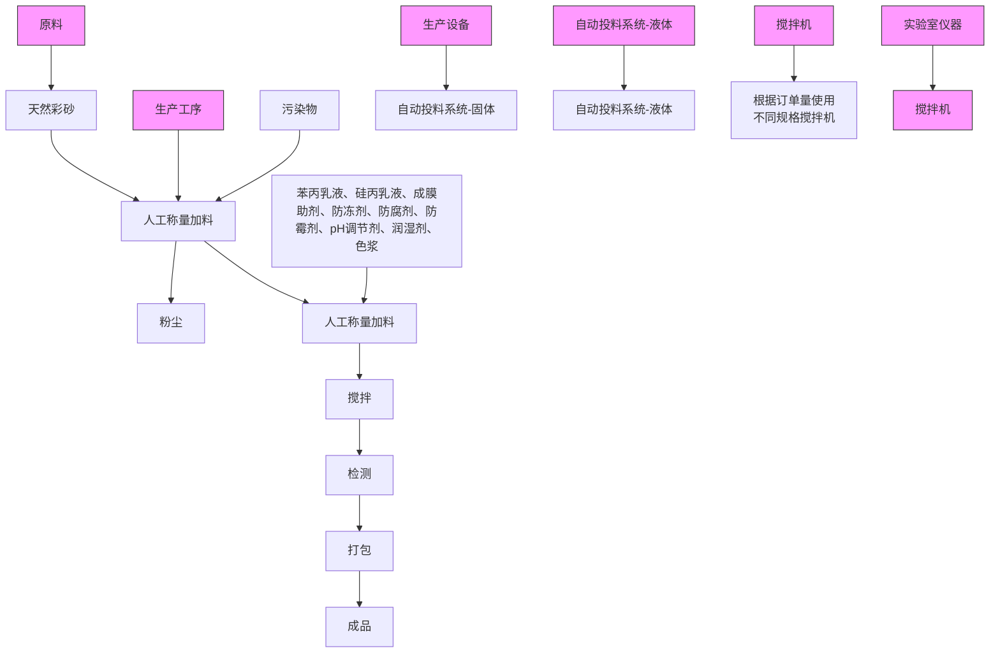
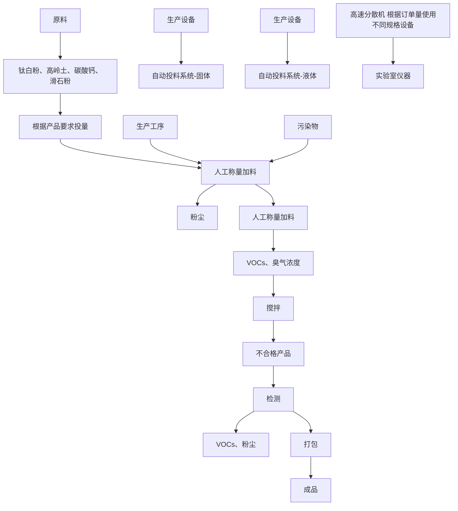
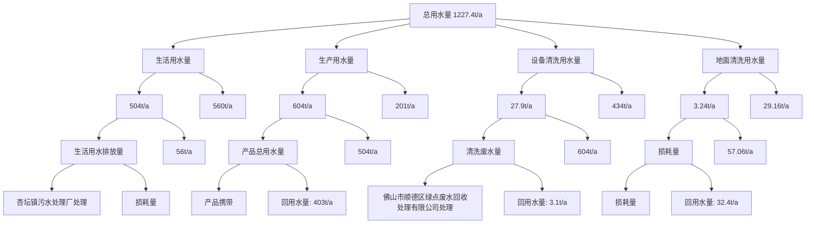
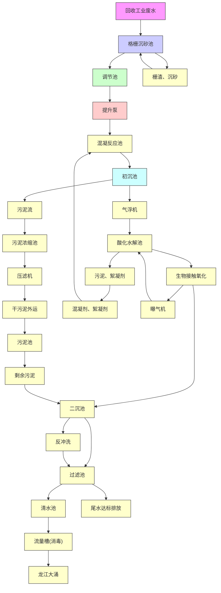
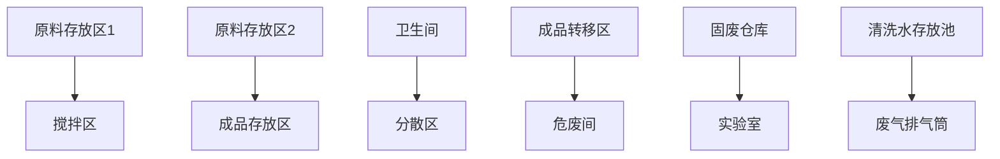

# 建设项目环境影响报告表

## （污染影响类）

项目名称：广东顺德德伦士新材料科技有限公司新项目名

建设单位（盖章）：广东顺德德伦新材料科技有限公司

位（盖章）： 广东

中华人民共和国生态环境部制

编制单位和编制人员情况表

<table><tr><td colspan="2">项目编号</td><td colspan="4">267g61</td></tr><tr><td colspan="2">建设项目名称</td><td colspan="4">广东顺德德伦士新材料科技有限公司新建项目</td></tr><tr><td colspan="2">建设项目类别</td><td colspan="4">23-044基础化学原料制造;农药制造;涂料、油墨、颜料及类似产品制造;合成材料制造;专用化学产品制造;炸药、火工及焰火产品制造</td></tr><tr><td colspan="2">环境影响评价文件类型</td><td colspan="4">报告表</td></tr><tr><td colspan="3">一、建设单位情况</td><td rowspan="6"></td><td colspan="2"></td></tr><tr><td colspan="2">单位名称(盖章)</td><td>广东顺德德伦士</td><td colspan="2"></td></tr><tr><td colspan="2">统一社会信用代码</td><td>91440606082636</td><td colspan="2"></td></tr><tr><td colspan="2">法定代表人(签章)</td><td></td><td colspan="2"></td></tr><tr><td colspan="2">主要负责人(签字)</td><td></td><td colspan="2"></td></tr><tr><td colspan="2">直接负责的主管人员(签字)</td><td></td><td colspan="2"></td></tr><tr><td colspan="3">二、编制单位情况</td><td rowspan="5" colspan="3"></td></tr><tr><td colspan="2">单位名称(盖章)</td><td>湖南川涵环保科技有限公司</td></tr><tr><td colspan="2">统一社会信用代码</td><td>91430102MA4Q3YY970</td></tr><tr><td colspan="3">三、编制人员情况</td></tr><tr><td colspan="3">1.编制主持人</td></tr><tr><td>姓名</td><td colspan="2">职业资格证书管理号</td><td colspan="2">信用编号</td><td>签字</td></tr><tr><td>饶远红</td><td colspan="2">2016035320352016320208000058</td><td colspan="2">BH007633</td><td></td></tr><tr><td colspan="6">2.主要编制人员</td></tr><tr><td>姓名</td><td colspan="2">主要编写内容</td><td colspan="2">信用编号</td><td>签字</td></tr><tr><td>饶远红</td><td colspan="2">建设项目基本情况、建设项目工程分析、区域环境质量现状、环境保护目标及评价标准、主要环境影响和保护措施、环境保护措施监督检查清单、结论</td><td colspan="2">BH007633</td><td></td></tr></table>

## 不异 照

text_image

自然人投资或控股
保利有限公司

品2不，二

-

（）

2111000

9066公 住

王

（互非三

text_image

2021年7月29
关苏新区行政管理局
服务局

日

国日0日1

中国

text_image

有限公司
南川股份
日

text_image

签发单位盖章：
Issued by
2016 年 08 月
签发日期：
Issued on

natural_image

Black-and-white photo of a person's face with visible eyes and hair, no text or symbols present.

##

## 女

xs

0400

## 一、建设项目基本情况

<table><tr><td>建设项目名称</td><td colspan="3">广东顺德德伦士新材料科技有限公司新建项目</td></tr><tr><td>项目代码</td><td colspan="3">无</td></tr><tr><td>建设单位联系人</td><td>***</td><td>联系方式</td><td>**********</td></tr><tr><td>建设地点</td><td colspan="3">佛山市顺德区杏坛镇杏联大道5号之一</td></tr><tr><td>地理坐标</td><td colspan="3">(22度47分12.676秒,113度8分28.186秒)</td></tr><tr><td>国民经济行业类别</td><td>C2641涂料制造</td><td>建设项目行业类别</td><td>“二十三、化学原料和化学制品制造业,44.涂料、油墨、颜料及类似产品制造264-单纯物理分离、物理提纯、混合、分装的(不产生废水或挥发性有机物的除外)”</td></tr><tr><td>建设性质</td><td>☑新建(迁建)□改建□扩建□技术改造</td><td>建设项目申报情形</td><td>☑首次申报项目□不予批准后再次申报项目□超五年重新审核项目□重大变动重新报批项目</td></tr><tr><td>项目审批(核准/备案)部门(选填)</td><td>/</td><td>项目审批(核准/备案)文号(选填)</td><td>/</td></tr><tr><td>总投资(万元)</td><td>200</td><td>环保投资(万元)</td><td>20</td></tr><tr><td>环保投资占比(%)</td><td>10</td><td>施工工期</td><td>1个月</td></tr><tr><td>是否开工建设</td><td>☑否□是: _</td><td>用地(用海)面积(m2)</td><td>1800m2</td></tr><tr><td>专项评价设置情况</td><td colspan="3">无</td></tr><tr><td>规划情况</td><td colspan="3">无</td></tr><tr><td>规划环境影响评价情况</td><td colspan="3">无</td></tr><tr><td>规划及规划环境影响评价符合性分析</td><td colspan="3">无</td></tr><tr><td>其他符合性分析</td><td colspan="3">一、选址合理性分析本项目位于佛山市顺德区杏坛镇杏联大道5号之一,根据企业提供的《工业用地合同》,本项目为工业用地。根据《顺德区2018-2020年村级工业园升级改造三年行动计划项目》,本项目不在“三旧”改造和村级工业园改造范围,因此本项目的选址符合佛山市顺德区总体规划的要求。</td></tr></table>

## 二、项目与“三线一单”符合性分析

根据环保部发布的《关于以改善环境质量为核心加强环境影响评价管理的通知》（以下简称《通知》），《通知》要求切实加强环境影响评价管理，落实“生态保护红线、环境质量底线、资源利用上线和环境准入负面清单”约束，建立项目环评审批与规划环评、现有项目环境管理、区域环境质量联动机制，更好地发挥环评制度从源头防范环境污染和生态破坏的作用，加快推进改善环境质量。

## ①生态红线

“生态保护红线”是“生态空间范围内具有特殊重要生态功能必须实行强制性严格保护的区域。相关规划环评应将生态空间管控作为重要内容，规划区域涉及生态保护红线的，在规划环评结论和审查意见中应落实生态保护红线的管理要求，提出相应对策措施。除受自然条件限制、确实无法避让的铁路、公路、航道、防洪、管道、干渠、通讯、输变电等重要基础设施项目外，在生态保护红线范围内，严控各类开发建设活动，依法不予审批新建工业项目和矿产开发项目的环评文件。

根据企业提供的《工业用地合同》，本项目为工业用地，本项目为工业生产项目。本项目周边无自然保护区；根据《广东省人民政府关于调整佛山市部分饮用水水源保护区的批复（粤府函[2018]426 号）》可知，本项目不在水源保护区范围内，根据《广东省主体功能区划》（粤府[2012]120 号）可知，本项目所在区域不处于生态红线内，故本项目符合生态保护红线要求。

②环境质量底线要求：项目纳污水体顺德支流水环境质量为达标区；根据佛山市生态环境局顺德分局发布的《2020 年度佛山市顺德区环境质量状况公报的通知》顺德区环境空气质量为达标区；声环境质量功能为达标区，经本环评分析，项目生产废水不外排，生活废水经污水处理站处理后排放，排放的污染物强度不超过行业平均水平，未造成区域环境质量功能的恶化，符合该政策的要求。

③资源利用上线：项目所在地已铺设自来水管网且水源充足，生活用水使用自来水，用水量相对较少；能源主要依托当地电网供电。项目建设土地不涉及基本农田，土地资源消耗符合要求。因此，项目资源利用满足要求。

④环境准入负面清单：

（1）根据国家《产业结构调整指导目录（2019 年本）》，项目不属于上述目录所列的限制类和淘汰类项目；根据《市场准入负面清单（2020 年版）》（发改体改规〔2020〕1880号），本项目不属于负面清单项目。因此，项目符合相关的产业政策要求。

（2）与广东省“三线一单”生态环境分区管控方案相符性分析

根据《广东省人民政府关于印发广东省“三线一单”生态环境分区管控方 案的通知》（粤府〔2020〕71 号），广东省将以环境管控单元为基础，实施生态环境分区管控，精细化管理、保护生态环境。本项目与广东省“三线一单”生态环境分区管控方案相符性分析如下：

①与“一核一带一区”区域管控要求的相符性

1）项目位于珠三角核心区，主要进行水性涂料生产，不属于区域布局管控要求中的禁止新建、扩建水泥、平板玻璃、化学制浆、生皮制革以及国家规划外的钢铁、原油加工等项目。项目生产使用的原辅材料均属于低挥发性化学品，不属于新建生产和使用高挥发性有机物原辅材料的项目，符合区域布局管控要求。

2）项目所属水性涂料制造行业不属于高能耗行业能，生活用水和生产用水由市政供水，不直接取用江河湖库水量，不会对项目所在地生态流量造成影响，符合能源利用要求。

3）项目属于新建项目，挥发性有机物实行区域内两倍削减量替代，总量指标由杏坛镇分配；项目生产使用低挥发性有机物原辅材料，并通过集气罩或集气管收集的方式减少挥发性有机物无组织排放；项目产生的生活污水经处理达标后排放至排入杏坛镇污水处理厂处理，尾水排入顺德支流。目前顺德支流水质较好，可达III类水体的要求，CODCr、NH3-N无需实施本行政区域内减量替代，总量指标由杏坛镇分配，符合污染物排放管控要求。

4）项目位于佛山市顺德区杏坛镇杏联大道5号之一，不属于石化、化工重点园区环境风险防控区域。项目产生的危险废物拟定期委托有资质的处置公司进行收集处理，并通过信息系统登记转移计划和电子转移联单，符合危险废物全过程跟踪管理的防控要求。

②与环境管控单元总体管控要求的相符性根据《广东省人民政府关于印 发广东省“三线一单”生态环境分区管控方案的通知》（粤府〔202071号）发 布的广东省环境管控单元图，项目所在的佛山市顺德区杏坛镇杏联大道5号之一为一般管控单元，执行区域生态环境保护的基本要求。

## （2）与挥发性有机物治理政策相符性分析

本项目与国家和地方近年发布的有机污染物治理政策的相符性分析见表1-1。

表 1-1 项目与有机污染物治理政策的相符性分析一览表

<table><tr><td>序号</td><td>政策要求</td><td>工程内容</td><td>符合性</td></tr><tr><td>1</td><td colspan="3">关于印发《广东省挥发性有机物(VOCs)整治与减排工作方案(2018-2020年)》的通知</td></tr><tr><td>1.1</td><td>“鼓励企业使用符合环保要求的水基型、高固份、粉末、紫外光固化等低VOCs含量的涂料,加强工艺过程有机废气收集与处理”</td><td>本项目使用原辅材料有苯丙乳液、硅丙乳液、天然彩砂、高岭土、钛白粉、碳酸钙、滑石粉、各类助剂、水等,属于低VOCs含量的涂料,搅拌分散通过集气罩收集后与和实验室烘干废气整室收集的废气汇入15米排气筒排放。</td><td>符合</td></tr><tr><td>2</td><td colspan="3">《挥发性有机物(VOCs)污染防治技术政策》(环保部公告2013第31号)</td></tr><tr><td>2.1</td><td>含VOCs产品的使用过程中,应采取废气收集措施,提高废气收集效率,减少废气的无组织排放与逸散,并对收集后的废气进行回收或处理后达标排放。</td><td>项目所有产生VOCs的工序均配套有收集设施,收集效率约90%,收集后经“布袋除尘+二级活性炭吸附”处理后引至15米高排气筒达标排放,无组织排放污染物影响不大</td><td>符合</td></tr><tr><td>3</td><td colspan="3">《广东省打赢蓝天保卫战实施方案(2018-2020年)》粤府【2018】128号</td></tr><tr><td>3.1</td><td>制定实施准入清单。珠三角地区禁止新建生产和使用高VOCs含量溶剂型涂料、油墨、胶粘剂、清洗剂等项目(共性工厂除外)</td><td>本项目为水性涂料制造行业,不属于生产和使用高VOCs含量溶剂型涂料、油墨、胶粘剂、清洗剂等项目</td><td>符合</td></tr><tr><td>3.1</td><td>实施建设项目大气污染物减量替代。制定广东省重点大气污染物(包括二氧化硫、氮氧化物、VOCs)排放总量指标审核及相关管理办法。珠三角地区建设项目实施VOCs排放两倍削减量替</td><td>本项目位于佛山市顺德区杏坛镇,为水性涂料生产,项目所属行业为C2641涂料制造,不属于高VOCs排放建设项目</td><td>符合</td></tr></table>

<table><tr><td rowspan="9"></td><td></td><td>代,粤东西北地区实施等量替代,对VOCs指标实行动态管理,严格控制区域VOCs排放量。地级以上城市建成区严格限制化工、包装印刷、工业涂装等涉VOCs排放项目,新建石油化工、包装印刷、工业涂装企业</td><td></td><td></td></tr><tr><td>4</td><td colspan="3">《“十三五”挥发性有机物污染防治工作方案》(环大气[2017]121号)</td></tr><tr><td>4.1</td><td>新、改、扩建涉VOCs排放项目,应从源头上加强控制,使用低(无)VOCs含量的原辅材料,加强废气收集,安装高效治理设施。</td><td>项目产品为水性涂料,属于低VOCs产品生产,涉及原料属于低挥发性原料,所有产生VOCs的工序均配套有收集设施,收集效率约90%,经收集后引至15米高排气筒达标排放</td><td>符合</td></tr><tr><td>5</td><td colspan="3">关于印发《重点行业挥发性有机物综合治理方案》的通知(环大气[2019]53号)</td></tr><tr><td>5.1</td><td>企业采用符合国家有关低VOCs含量产品规定的涂料、油墨、胶粘剂等,排放浓度稳定达标且排放速率、排放绩效等满足相关规定的,相应生产工序可不要求建设末端治理设施。使用的原辅材料VOCs含量(质量比)低于10%的工序,可不要求采取无组织排放收集措施。</td><td>项目所有产生VOCs的工序均配套有收集设施,收集效率约90%,经收集后引至15米高排气筒达标排放</td><td>符合</td></tr><tr><td>6</td><td colspan="3">《挥发性有机物无组织排放控制标准(GB 37822—2019)》</td></tr><tr><td>6.1</td><td>VOCs质量占比大于等于10%的含VOCs产品,其使用过程应采用密闭设备或在密闭空间内操作,废气应排至VOCs废气收集处理系统;无法密闭的,应采取局部气体收集措施,废气应排至VOCs废气收集处理系统。</td><td>本项目使用低VOCs含量的原辅材料,原辅材料均为液体,存放于桶内,使用时加盖操作,使用操作过程基本为密闭空间内进行;所有产生VOCs的工序均配套有收集设施,收集效率约90%,经收集后引至15米高排气筒达标排放</td><td>符合</td></tr><tr><td>7</td><td colspan="3">《广东省大气污染防治条例》(2018年11月29日修订)</td></tr><tr><td>7.1</td><td>珠江三角洲区域禁止新建、扩建国家规划外的钢铁、原油加工、乙烯生产、造纸、水泥、平面玻璃、除特种陶瓷以外的陶瓷、有色金属冶炼等大气重污染项目</td><td>本项目为涂料制造行业,不在珠江三角洲区域禁止新建、扩建的大气重污染项目</td><td></td></tr><tr><td rowspan="7"></td><td>8</td><td colspan="3">《2020年挥发性有机物治理攻坚方案》(环发【2020】33号)</td></tr><tr><td>8.1</td><td>采用符合国家有关低VOCs含量产品规定的涂料、油墨、胶粘剂等,排放浓度稳定达标且排放速率满足相关规定的,相应生产工序可不要求建设末端治理设施。使用的原辅材料VOCs含量(质量比)均低于10%的工序,可不要求采取无组织排放收集和处理措施。</td><td>本项目使用原辅材料有苯丙乳液、硅丙乳液、天然采砂、高岭土、钛白粉、碳酸钙、滑石粉、各类助剂、水等,属于低VOCs含量的涂料,搅拌分散通过集气罩收集后与和实验室烘干废气整室收集的废气汇入15米排气筒排放。</td><td>符合</td></tr><tr><td>8.2</td><td>企业在无组织排放排查整治过程中,在保证安全的前提下,加强含VOCs物料全方位、全链条、全环节密闭管理。</td><td>本项目使用低VOCs含量的原辅材料,原辅材料均为液体,存放于桶内,使用时加盖操作,使用操作过程基本为密闭空间内进行;所有产生VOCs的工序均配套有收集设施,收集效率约90%,经收集后引至15米高排气筒达标排放</td><td>符合</td></tr><tr><td>9</td><td colspan="3">《佛山市生态环境局关于印发佛山市重点行业VOCs治理提升工作方案的通知》(佛环[2021]41号)</td></tr><tr><td>9.1</td><td>涂料油墨行业相关产品应符合对应产品规格的要求,本项目中主要产品要求为《工业防护涂料中有限物质限量》(GB30981-2020)相关要求</td><td>本项目为水性涂料类产品,产品主要运用于建筑外墙防护,乳胶漆的挥发性有机化合物含量实测值为48g/L,满足(GB 30981-2020)中表1“建筑物和构筑物防护涂料”相关要求中最严限量值:≤250g/L的要求。</td><td>符合</td></tr><tr><td>9.2</td><td>提升过程控制:···无法密闭的,应采取局部气体收集措施,控制风速应不低于0.3m/s···</td><td>所有产生VOCs的工序均配套有收集设施,收集效率约90%,经收集后引至15米高排气筒达标排放,控制风速为0.5m/s</td><td>符合</td></tr><tr><td>9.3</td><td>涂料油墨行业治理设施要求低浓度、大风量废气,宜采用活性炭吸附技术,并强化废气预处理,如配置除尘除湿设施等,保障活性炭吸附等后续治理设施的安全有效运行。</td><td>本项目配套治理设施为实验过程喷漆的少量颗粒物经密闭车间负压收集经“过滤棉”过滤后与集气罩废气合并至“布袋除尘+二级活性炭吸附装置”处理,不涉及喷淋装置。</td><td>符合</td></tr><tr><td></td><td>9.4</td><td>涂料油墨行业运维管理要求采用活性炭吸附工艺治理的,连续生产情况下,生产油性涂料/树脂的,美半月全部更换一次;生产油性油墨,每个月全部更换一次。</td><td>本项目产品为水性涂料,不属于油性涂料。活性炭更换批次据核算为每年更换4次,即每季度一次,活性炭更换频次能满足有机废气治理要求。</td><td>符合</td></tr></table>

## 二、建设项目工程分析

## 1、项目组成

本项目建于佛山市顺德区杏坛镇杏联大道 5 号之一，占地面积为 $1 8 0 0 \mathrm { m } ^ { 2 } ,$ ，建设面积为 1800m2。本项目总投资 200万元，其中环保投资 20 万元。本项目主要从事水性涂料的生产，年产水性涂料 4000吨，其中真石漆 3000吨，乳胶漆 1000吨。

表 2-1 本项目构成

<table><tr><td>工程类型</td><td>工程内容</td><td>本项目规模</td></tr><tr><td>主体工程</td><td>生产车间</td><td>1间,为项目生产、原料存放均在生产车间内。占地面积 $1800m^{2}$ ,层高6m</td></tr><tr><td rowspan="3">辅助工程</td><td>办公室</td><td>位于车间大门右侧,约 $30m^{2}$ </td></tr><tr><td>卫生间</td><td>厂区东北侧办公区附近,约 $2m^{2}$ </td></tr><tr><td>实验室</td><td>位于车间大门右侧,高3m,占地面积约 $5m^{2}$ </td></tr><tr><td rowspan="2">仓储工程</td><td>原料区</td><td>位于生产车间南侧,占地面积约 $300m^{2}$ 。</td></tr><tr><td>成品区</td><td>位于生产车间中部,搅拌区南侧,原料区北侧,占地面积约 $150m^{2}$ </td></tr><tr><td rowspan="2">公用工程</td><td>给排水工程</td><td>供水来源为市政自来水,排水去向为市政管网</td></tr><tr><td>供电系统</td><td>市政电网供电,供应生产用电和办公生活用电</td></tr><tr><td rowspan="6">环保工程</td><td>生活污水处理设施</td><td>三级化粪池处理达标后,经市政污水管网排入杏坛镇污水处理厂</td></tr><tr><td>生产废水存储设施</td><td>设备生产过程的清洗废水和地面清洁废水不外排,在厂区沉淀池中沉淀回用,沉淀池约 $5m^{3}$ ,定期清运沉淀池底部浓废水和含颜料废水。</td></tr><tr><td>一般工业固废</td><td>一个,位于车间大门左侧,面积约 $10m^{2}$ </td></tr><tr><td>危险废物暂存场</td><td>一个,位于车间大门左侧,面积约为 $10m^{2}$ </td></tr><tr><td>废气处理设施</td><td>搅拌分散和实验室烘干工序产生的臭气浓度、TVOC,投料产生的粉尘经集气罩收集,实验过程喷漆的少量颗粒物经密闭车间负压收集经“过滤棉”过滤后与集气罩废气合并至“布袋除尘+二级活性炭吸附装置”处理,引至一根15m高的排气筒(DA001)排放</td></tr><tr><td>噪声处置</td><td>加强生产设备的维护保养</td></tr></table>

## 2、主要产品及产能

根据建设单位提供资料，项目总投资 200 万元，产品方案如下表所示。

表 2-2 本项目产品方案一览表

<table><tr><td>类别</td><td>名称</td><td>单位</td><td>数量</td><td>备注</td></tr><tr><td rowspan="2">产品产量</td><td>真石漆</td><td>吨</td><td>3000</td><td></td></tr><tr><td>乳胶漆</td><td>吨</td><td>1000</td><td></td></tr></table>

## 3、主要设备清单

根据建设单位提供资料，项目主要生产设备如下表所示。

表 2-3 本项目设备清单

<table><tr><td>序号</td><td>生产单元</td><td>名称</td><td>规格</td><td>数量</td><td>单位</td><td>每台设施参数</td></tr><tr><td>1.</td><td rowspan="4">乳胶漆生产单元</td><td>高速分散机</td><td>22KW</td><td>2</td><td>台</td><td>处理能力 90t/a</td></tr><tr><td>2.</td><td>高速分散机</td><td>37KW</td><td>1</td><td>台</td><td>处理能力 150t/a</td></tr><tr><td>3.</td><td>高速分散机</td><td>75KW</td><td>1</td><td>台</td><td>处理能力 300t/a</td></tr><tr><td>4.</td><td>高速分散机</td><td>90KW</td><td>1</td><td>台</td><td>处理能力 450t/a</td></tr><tr><td>5.</td><td rowspan="8">真石漆生产单元</td><td>搅拌机</td><td>0.5T</td><td>2</td><td>台</td><td>处理能力 15t/a</td></tr><tr><td>6.</td><td>搅拌机</td><td>1T</td><td>4</td><td>台</td><td>处理能力 30t/a</td></tr><tr><td>7.</td><td>搅拌机</td><td>2T</td><td>2</td><td>台</td><td>处理能力 60t/a</td></tr><tr><td>8.</td><td>搅拌机</td><td>3T</td><td>2</td><td>台</td><td>处理能力 90t/a</td></tr><tr><td>9.</td><td>搅拌机</td><td>5T</td><td>1</td><td>台</td><td>处理能力 150t/a</td></tr><tr><td>10.</td><td>搅拌机</td><td>10T</td><td>1</td><td>台</td><td>处理能力 300t/a</td></tr><tr><td>11.</td><td>搅拌机</td><td>20T</td><td>1</td><td>台</td><td>处理能力 600t/a</td></tr><tr><td>12.</td><td>搅拌机</td><td>30T</td><td>2</td><td>台</td><td>处理能力 900t/a</td></tr><tr><td>13.</td><td rowspan="4">辅助单元</td><td>半自动投料系统-液体</td><td>/</td><td>2</td><td>台</td><td>处理能力 1100t/a</td></tr><tr><td>14.</td><td>半自动投料系统-固体</td><td>/</td><td>3</td><td>台</td><td>处理能力 1500t/a</td></tr><tr><td>15.</td><td>打包机</td><td></td><td>2</td><td>台</td><td>处理能力 2000t/a</td></tr><tr><td>16.</td><td>空压机</td><td>35KW</td><td>2</td><td>台</td><td>/</td></tr><tr><td>17.</td><td rowspan="7">实验室</td><td>喷枪</td><td>/</td><td>2</td><td>支</td><td>产品用量 1t/a</td></tr><tr><td>18.</td><td>小型烘箱</td><td>15kw</td><td>1</td><td>台</td><td>产品用量 1t/a</td></tr><tr><td>19.</td><td>光泽仪</td><td>0.5KW</td><td>1</td><td>台</td><td>/</td></tr><tr><td>20.</td><td>摆杆硬度计</td><td>0.5KW</td><td>1</td><td>台</td><td>/</td></tr><tr><td>21.</td><td>电子天平</td><td>0.1KW</td><td>1</td><td>台</td><td>/</td></tr><tr><td>22.</td><td>测厚仪</td><td>0.1KW</td><td>1</td><td>台</td><td>/</td></tr><tr><td>23.</td><td>pH 计</td><td>1.5V</td><td>1</td><td>台</td><td>/</td></tr></table>

本项目环保工程设施及设施参数见下表。

表 2-4 项目环保工程设施及设施参数一览表

<table><tr><td rowspan="2" colspan="2">生产单元</td><td rowspan="2">设施名称</td><td rowspan="2">数量</td><td colspan="3">设施参数</td><td rowspan="2">其他</td></tr><tr><td>参数名称</td><td>设计值</td><td>单位</td></tr><tr><td rowspan="6">环保单元</td><td rowspan="2">污水处理系统</td><td>三级化粪池</td><td>1套</td><td>总容积</td><td>50</td><td> $m^{3}$ </td><td>/</td></tr><tr><td>清洗水沉淀池</td><td>1套</td><td>总容积</td><td>5</td><td> $m^{3}$ </td><td>/</td></tr><tr><td rowspan="2">废气处理系统</td><td>二级活性炭吸附装置</td><td>1套</td><td>单级处理效率</td><td>75</td><td>%</td><td>两级效率相同</td></tr><tr><td>布袋除尘</td><td>1套</td><td>处理效率</td><td>99</td><td>%</td><td>/</td></tr><tr><td rowspan="2">废物贮存系统</td><td>危险废物暂存</td><td>1个</td><td>面积</td><td>10</td><td> $m^{2}$ </td><td rowspan="2">位于车间内</td></tr><tr><td>一般固废暂存</td><td>1个</td><td>面积</td><td>10</td><td> $m^{2}$ </td></tr></table>

## 4、主要原辅材料

本项目主要原辅材料及年用量见下表。

表 2-5 项目主要原辅材料消耗量一览表

<table><tr><td rowspan="2">序号</td><td rowspan="2">原料</td><td colspan="3">用量</td><td rowspan="2">单位</td><td rowspan="2">暂存量</td><td rowspan="2">性状</td><td rowspan="2">用途</td></tr><tr><td>总用量</td><td>真石漆</td><td>乳胶漆</td></tr><tr><td>1.</td><td>苯丙乳液</td><td>200</td><td>135</td><td>65</td><td>吨</td><td>20</td><td>液体</td><td>真石漆和乳胶漆</td></tr><tr><td>2.</td><td>硅丙乳液</td><td>200</td><td>140</td><td>60</td><td>吨</td><td>20</td><td>液体</td><td>真石漆和乳胶漆</td></tr><tr><td>3.</td><td>水</td><td>608</td><td>440</td><td>168</td><td>吨</td><td>/</td><td>液体</td><td>真石漆和乳胶漆</td></tr><tr><td>4.</td><td>成膜助剂</td><td>26</td><td>18.5</td><td>7.5</td><td>吨</td><td>2.5</td><td>液体</td><td>真石漆和乳胶漆</td></tr><tr><td>5.</td><td>防冻剂</td><td>26</td><td>19</td><td>7</td><td>吨</td><td>2.5</td><td>液体</td><td>真石漆和乳胶漆</td></tr><tr><td>6.</td><td>防腐剂</td><td>3.12</td><td>2</td><td>1.12</td><td>吨</td><td>0.3</td><td>液体</td><td>真石漆和乳胶漆</td></tr><tr><td>7.</td><td>防霉剂</td><td>2</td><td>1.5</td><td>0.5</td><td>吨</td><td>0.2</td><td>液体</td><td>真石漆和乳胶漆</td></tr><tr><td>8.</td><td>PH调节剂</td><td>2</td><td>1.5</td><td>0.5</td><td>吨</td><td>0.2</td><td>液体</td><td>真石漆和乳胶漆</td></tr><tr><td>9.</td><td>润湿剂</td><td>0.88</td><td>0.66</td><td>0.22</td><td>吨</td><td>0.05</td><td>液体</td><td>真石漆和乳胶漆</td></tr><tr><td>10.</td><td>天然彩砂</td><td>2250</td><td>2250</td><td>0</td><td>吨</td><td>225</td><td>粉状</td><td>真石漆</td></tr><tr><td>11.</td><td>钛白粉</td><td>50</td><td>0</td><td>50</td><td>吨</td><td>5</td><td>粉状</td><td>乳胶漆</td></tr><tr><td>12.</td><td>高岭土</td><td>100</td><td>0</td><td>100</td><td>吨</td><td>10</td><td>粉状</td><td>乳胶漆</td></tr><tr><td>13.</td><td>碳酸钙</td><td>501</td><td>0</td><td>501</td><td>吨</td><td>50</td><td>粉状</td><td>乳胶漆</td></tr><tr><td>14.</td><td>滑石粉</td><td>30</td><td>0</td><td>30</td><td>吨</td><td>3</td><td>粉状</td><td>乳胶漆</td></tr><tr><td>15.</td><td>色浆</td><td>0.6</td><td>0</td><td>0.6</td><td>吨</td><td>0.05</td><td>液体</td><td>乳胶漆</td></tr><tr><td>16.</td><td>分散剂</td><td>8</td><td>0</td><td>8</td><td>吨</td><td>0.8</td><td>液体</td><td>乳胶漆</td></tr><tr><td>17.</td><td>消泡剂</td><td>4</td><td>0</td><td>4</td><td>吨</td><td>0.5</td><td>液体</td><td>乳胶漆</td></tr><tr><td>18.</td><td>机油</td><td>0.5</td><td>/</td><td>/</td><td>吨</td><td>0.05</td><td>液体</td><td>/</td></tr><tr><td colspan="2">总量</td><td>4011.6</td><td>3008.16</td><td>1003.44</td><td>吨</td><td></td><td>/</td><td>/</td></tr><tr><td colspan="2">助剂含量</td><td>72.6</td><td>43.16</td><td>29.44</td><td>吨</td><td></td><td>/</td><td>/</td></tr></table>

物料的理化性质：  
1 苯丙乳液：苯丙乳液是由苯乙烯和丙烯酸酯单体经乳液共聚而得。乳白色液体，带蓝光。固体含量 40～45％，粘度 80～1500mPa·s，单体残留量(溴值)0.5%，pH 值 8～9。苯丙乳液附着力好，胶膜透明，耐水、耐油、耐热、耐老化性能良好。以水为分散介质，加入颜料，填料及各类助剂制成多种用途的水性涂料，干燥速度快，粘结力强，施工安全、无毒、不燃、不爆，成膜后防水、耐候、保光性均好，可直接涂饰在混凝土或木材、金属结构表面，适用于外墙涂料、真石涂料、浮雕涂料、透明防水涂料等各种建筑涂料的底涂、面涂使用，还可制作水性防锈漆、水性油墨、水性木器漆、用作高档内外墙涂料的树脂基料。属水性物质非危险品。  
2 硅丙乳液：硅丙乳液是将含有不饱和键的有机硅单体与丙烯酸类单体加入合适的助剂，通过核壳包覆聚合工艺聚合而成的乳液。结合了有机硅耐高温性、耐候性、耐化学品性，疏水、表面能低不易污染性和丙烯酸类树脂的高保色性、柔韧性、附着性。硅丙乳液为乳白色微带蓝光液体，固含量 46±1Wt%，粘度 200～800mPa·s，最低成膜温度 23℃，pH 值 7～9，平均粒径 0.1～0.03μm。存放于通风干燥的库房内，防止阳光直

接照射，运输及储存温度在 5℃以上，保质期六个月。是一种高耐候、高耐水、抗污染的环保型建筑用乳液及涂料。属水性物质非危险品。

3 成膜助剂：主要成分醇酯十二：醇酯-12 具有优异的成模型、冻结融化性、特殊的稳定性、奇特的耐檫洗性和较低的成膜温度，广泛地适用于丙烯酸酯、丁苯胶乳、聚醋酸乙烯、PVA/丙烯酸乳胶漆中，能显著改善产品的成膜时间、成膜温度，并使乳胶漆中颜色色彩稳定，色调明快，色差小，是深受用户欢迎的一种新型助剂。醇酯-12是无色、无嗅、无味的透明液体，微毒无污染，严禁口服和作为生活品使用，溅到眼睛里用大量清水清洗，皮肤接触后用清水和肥皂洗净即可。贮运于阴凉透风处贮存，避免泄露和撞击。为微毒性，非重大危险源。  
4 防冻剂：主要成分：乙二醇，有降低涂料冻结温度的功能，乙二醇是一种无色微粘的液体，沸点是 $1 9 7 . 4 ^ { \circ } \mathrm { C } .$ ，冰点是 $- 1 1 . 5 ^ { \circ } \mathrm { C } .$ ，能与水任意比例混合。混合后由于改变了冷却水的蒸气压，使得水性涂料的冰点显著降低。  
5 防腐剂：防腐剂主要是一种含有杀菌成份的有机化合物，项目使用ADDAPTK55 防腐剂，ADDAPTK55 是一种高效罐内防腐剂，适用于苯丙、纯丙等化学组份水性体系。ADDAPTK55 是一种异噻唑啉酮类的防腐剂，主要成份为异噻唑啉酮。优点：广谱杀菌，能有效抑制细菌(包括格兰氏、格兰氏阴性细菌)霉菌、酵母菌等微生物；能快速而长效的杀灭各种微生物；在较宽 $\mathsf { p H }$ 值范围内有效；优异的物理化学相溶性，不会在容器和漆膜中变色；水溶性配方中，无 VOC，符合环保要求；使用及用量为保证在漆中分散均匀，建议在分散研磨阶段加入，添加量为 0.05\~0.3%。为微毒性，非重大危险源。  
6 防霉剂：防霉剂是一种防止涂料长霉的有机化合物，防霉剂主要成分：多菌灵。多菌灵又名棉萎灵、苯并咪唑 44号。多菌灵是一种广谱性杀菌剂，对多种作物由真菌(如半知菌、多子囊菌)引起的病害有防治效果。可用于叶面喷雾、种子处理和土壤处理等。为微毒性，非重大危险源。  
7 PH 调节剂：PH 调节剂是一种碱性的有机化合物，调节体系的 PH 值为弱碱性。项目使用的 PH 调节剂主要成份为甲基氨基丙醇，为弱碱性腐蚀品，非重大危险源。  
8 润湿剂：润湿剂是一种降低体系表面张力的有机聚合物，项目使用涂料助剂润湿剂主要成份为聚氧乙烯醚。这种类型的表面活性剂是用脂肪醇与环氧乙烷通过加成反应而制得的，用以下通式表示： $\mathrm { R - O - ( C H _ { 2 } C H _ { 2 } O ) n - H }$ 。脂肪醇聚氧乙烯醚分子中乙氧基数目可在合成的过程中人为调整，故可制得一系列不同性能和用途的非离子表面活性剂。脂肪醇聚氧乙烯醚是最重要的一类非离子表面活性剂。分子中的醚键不易被酸、碱破坏，所以稳定性较高，水溶性较好，耐电解质，易于生物降解，泡沫小。除了在纺织

印染行业大量使用外，还大量用于复配低泡液体洗涤剂。为非危险品。

9 天然彩砂是由大理石或花岗岩等矿石经精选、破碎、粉碎、分级、包装等多道工序加工而成的彩砂。天然彩砂经过精选加工而成，颜色自然，不含任何染料，具有无毒、无味、无污染、抗腐蚀、耐酸碱、抗暴晒、不变色等特点。天然彩砂可用于制造大理石、地板砖、瓷砖及装饰用卫生洁具等，具有光泽、光滑、坚固耐磨等优点。利用天然彩砂制作的新型内外墙石漆、浮雕等产品，具有耐磨、防水、防腐、无毒、粘结力强色彩绚丽等特点，被广泛应用于建筑工程及室内装饰、浮雕等。用天然彩砂制作的高级喷漆涂料，具有无毒、无味、光泽鲜艳、色调柔和、立体感强等特点。  
10 钛白粉：本项目钛白粉属于金红石型钛白粉，金红石型二氧化钛的熔点为1850℃、空气中的熔点为 $1 8 3 0 { \pm } 1 5 ^ { \circ } \mathrm { C } ,$ 、富氧中的熔点为 1879℃，熔点与二氧化钛的纯度有关。金红石型二氧化钛的沸点为 $3 2 0 0 { \pm } 3 0 0 ^ { \circ } \mathrm { C }$ ，在此高温下二氧化钛稍有挥发性。开发的新一代高档通用型(偏水性)金红石钛白粉，适用于各种建筑涂料、工业漆、防腐漆、油墨、粉末涂料等行业。为非危险品。  
11 高岭土：高岭土是以高岭石亚族矿物为主要成分的软质黏土。主要有高岭石矿物组成。自然界中，组成高岭土的矿物有黏土矿物和非黏土矿物两类。颜色为白色，最高白度大于 95%，硬度为 1\~4。有优良的电绝缘性能、可塑性、分散性；具有良好的抗酸溶性、阳离子交换量 0.03\~0.05mmol/g、耐火度 $1 7 7 0 { \sim } 1 7 9 0 ^ { \circ } \mathrm { C } _ { \circ }$ 。高岭土广泛应用于陶瓷、造纸、涂料、颜料、橡胶、塑料、耐火材料、石油精制、农业、国防尖端技术、化妆品粉料、洗涤剂助剂和污水净化剂材料、医药、轻工业等领域。为非危险品。  
12 碳酸钙：碳酸钙是一种无机化合物，俗称灰石、石灰石、石粉、大理石、方解石，是一种化合物，化学式是 CaCO3，呈碱性，基本上不溶于水，溶于酸。它是地球上常见物质，存在于霰石、方解石、白垩、石灰岩、大理石、石灰华等岩石内。亦为动物骨骼或外壳的主要成分。碳酸钙是重要的建筑材料，工业上用途甚广。CAS 号 471-34-1，EINECS 号 207-439-9，相对分子质量 100.09，各元素质量比 $\mathrm { C a } \colon \mathrm { C } \colon \mathrm { O } { = } 1 0 \colon 3 \colon 1 2$ ，各原子数量比 $\mathrm { C a } { \mathrm { : C : O } { = } 1 } { \mathrm { : } } 1 { \mathrm { : } } 3$ ，性状为白色粉末或无色结晶。无气味。无味。密度 2.93g/cm3，莫氏硬度 3，分解温度 $8 9 8 ^ { \circ } \mathrm { C }$ ，当压力为 10.4MPaJF，熔点为 $1 3 3 9 ^ { \circ } \mathrm { C }$ ，介电常数 7.5\~8.8。为非危险品。  
13 滑石粉：硅酸镁盐类矿物滑石族滑石，主要成分为含水硅酸镁，经粉碎后，用盐酸处理，水洗，干燥而成。滑石主要成分是滑石含水的矽酸镁，分子式为 $\mathbf { M g } _ { 3 } \left[ \mathrm { S i } _ { 4 } \mathrm { O } _ { 1 0 } \right]$ (OH)2。滑石属单斜晶系。晶体呈假六方或菱形的片状，偶见。通常成致密的块状、叶片状、放射状、纤维状集合体。滑石具有润滑性、抗黏、助流、耐火性、抗酸性、绝缘性、熔点高、化学性不活泼、遮盖力良好、柔软、光泽好、吸附力强等优良的物理、化

学特性，由于滑石的结晶构造是呈层状的，所以具有易分裂成鳞片的趋向和特殊的滑润性。为非危险品。

14 色浆：色浆是一种将有机和无机颜料通过研磨，以水为介质，做成的一种液态着色材料。色浆系多种助剂混合，以水为分散介质的液体。其基本组分为润湿剂、分散剂、共溶剂、消泡剂、颜料、防沉剂和杀菌剂。润饰剂和分散剂的作用为具有较宽的相容性，增加颜料的固含量，降低粘度，避免絮凝、浮色、发花和沉淀。共溶剂为避免沉淀，调整粘度。消泡剂作用是避免研磨中产生泡沫，但消泡剂绝不能影响透光率和对涂料的相容性。颜料使用各种适用于各类调色浆的有机和无机颜料，根据颜料的类型及表面积的不同，来决定助剂用量。防沉剂可以避免无机颜料沉淀。杀菌剂用于保证长期贮存不变质。为非危险品。  
15 分散剂：分散剂是一种帮助颜填料更好分散在乳胶漆里的有机高分子聚合物。项目选用 AR-1 分散剂。AR-1 对填料(如超细碳酸钙)及无机颜料有良好的分散性，化学组份具有极好的储存稳定性，适用于平光及丝光乳胶漆。AR-1 是一种聚羧酸钠型的共聚物的分散剂。分散效率高，分散良好、稳定，防止颜料沉积结块；完全的展色性及优异的光泽保持性；AR-1 恢复为原来的水不溶形式，从而提高乳胶漆的耐水性；产品的低泡性，在涂料生产中都很少有泡。为非危险品。  
16 消泡剂：消泡剂是一种消除乳胶漆里面泡沫的助剂，主要成分为矿物油或有机硅改性有机高分子聚合物。项目使用 T-503消泡剂，主要成份为矿物油。T-503是一种经济型消泡剂，乳白色粘稠混浊液体，适用于苯丙、纯丙等各种水性体化学组份系。T-503是一种矿物油型消泡剂，使用 T-503是矿物油型消泡剂，具有较好的消泡和抑泡能力。优点：T-503为使用安全、经济的消泡剂，用量过大或过小不会出现生产问题。为非危险品。

## 5、公用工程

项目用水由市政给水管网供应。用水主要为生产用水及员工生活用水。

## （1）给水

项目用水由市政给水管道直接供水，主要用水为职工生活用水、生产用水和设备和地面清洗用水。

## 1）生活用水

项目劳动定员 20 人，厂区不提供食宿，根据《广东省用水定额第 3 部分：生活》（DB44/T1461.3-2021），项目参照国家行政机构中办公楼，无食堂和浴室的生活用水定额（通用值），即为 28 立方米/（人.年）计，则项目员工生活用水为 560t/a。

## 2）设备和地面清洗用水

经核算，本项目设备清洗用水量为 434t/a，其中 403t/a 回用于生产过程，因此设备清洗废水用量为 31t/a，地面清洗用水量为 32.4t/a。具体核算过程详见水环境污染分析部分。

## 3）生产用水

根据建设单位提供资料可知，本项目生产用水量为 608t/a，其中 403t/a 为生产设备清洗过程的回用水，201t/a 为清洁水。

## （2）排水

## 1）生活污水

项目生活污水 504t/a，经三级化粪池处理达到广东省地方标准《水污染物排放限值》（DB44/26-2001）第二时段三级标准后，通过市政集污管网排至伦杏坛镇污水处理厂处理，污水厂尾水达标排至顺德水道。

## 2）生产废水

项目生产废水主要有生产设备（搅拌机、高速分散机）清洗废水和地面清洗废水。其中生产设备清洗废水用量为 31t/a，设备清洗损耗量为 10%，设备清洗废水排放量为27.9t/a；地面清洗废水用量为 32.4t/a，地面清洗损耗量为 10%，地面清洗废水排放量为29.16t/a。总计产生的清洗废水为 57.06t/a，在厂区废水暂存池中收集后定期委托有资质公司处理，不外排。本项目水平衡图见图 4-1。

## 6、劳动人员及工作制度

表 2-6 项目人员规模及工作制度一览表

<table><tr><td colspan="2">项目</td></tr><tr><td>职工人数</td><td>20人</td></tr><tr><td>每天工作时数</td><td>8小时(8:00~12:00;14:00~18:00)</td></tr><tr><td>年工作日</td><td>300天</td></tr><tr><td>职工食堂</td><td>均不在厂内食宿</td></tr></table>

## 7、厂区平面布置

项目租用佛山市顺德区杏坛镇杏联大道 5 号之一的单层厂房作为经营场所。项目正门朝北，后门朝南。项目西北侧为办公区、卫生间、固废仓库、危废仓库、产品转移区；车间东北侧为废气处理设施和废水暂存池区域，项目废气经集气罩收集至该区域处理，废水在废水暂存池内存放；项目厂房正门和后门之间为通道分割成东西两侧：其中车间东侧为真石漆搅拌区，西侧靠近正门部分为乳胶漆高速分散区域，西侧中间部分为成品存放区域；车间南侧为项目原料存放区域。项目厂区具体平面布置见附图 4。

工艺流程和产排污环节

本项目从事真石漆和乳胶漆的生产。

真石漆主要由高分子聚合物、天然彩石砂及相关助剂制成，干结固化后坚硬如石，看起来像天然真石一样。真石漆具有防火、防水、耐酸碱、耐污染。无毒、无味、粘接力强，永不褪色等特点，能有效地阻止外界恶劣环境对建筑物侵蚀，延长建筑物的寿命，由于真石漆具备良好的附着力和耐冻融性能；因此特别适合在寒冷地区使用。为非危险化学品。真石漆的装饰效果酷似大理石、花岗石。主要采用各种颜色的天然石粉配制而成，真石漆装修后的建筑物，具有天然真实的自然色泽，给人以高雅，和谐，庄重之美感，适合于各类建筑物的室内外装修。特别是在曲面建筑物上装饰，可以收到生动逼真，回归自然的功效。具体生产工序如下图 2-1：

flowchart

图 2-1 真石漆生产工艺流程图

真石漆生产工艺过程及产污环节说明：生产的全过程为常温常压下进行，各种原材料在机械搅拌下进行物理混合，过程中不涉及任何化学反应。具体的操作过程用下：

（1）人工称量：将项目的液体物料和固体物料分别人工称量，加到半自动投料系统上。液体物料和固体物料分别投加。  
（2）搅拌：天然彩砂、苯丙乳液、硅丙乳液、水和添加剂分别通过上料机自动投料，加入至搅拌机中常温环境下进行搅拌，搅拌速度为中速。  
（3）检测：将搅拌好的成品进行检测，主要检测成品的各项目成份指标，并进行小规模喷涂，烘烤实验，检测到不合格的产品，会重新进行搅拌，加入一些原材料调整技术指标，达标之后再包装。合格产品直接进入打包程序。  
（4）打包：混合好并完成检测的成品进入成品斗，分别输送至各包装系统内进行打包。

乳胶漆是以高分子乳液为成膜物的一类涂料，以合成树脂乳液为基料加入颜料、填料及各种助剂配制而成的一类水性涂料。乳胶漆是室内墙面、顶棚主要装饰材料之一，特点是装饰效果好，施工方便，对环境污染小，成本低，应用极为广泛。无毒不燃，无腐蚀，为非危险化学品，主要生产工艺流程见下图 2-2。

flowchart

图 2-2 乳胶漆生产工艺流程图

乳胶漆生产工艺过程及产污环节说明：生产的全过程为常温常压下进行，各种原材料在机械搅拌下进行物理混合，过程中不涉及任何化学反应。具体的操作过程用下：

（1）人工称量：将项目的液体物料和固体物料分别人工称量，加到自动投料系统上。液体物料和固体物料分别投加，乳胶漆中的固体料与真石漆不同，不涉及天然彩砂，主要为钛白粉、高岭土、碳酸钙、滑石粉等固体材料。  
（2）搅拌：钛白粉、高岭土、碳酸钙、滑石粉、苯丙乳液、硅丙乳液、水和添加剂分别通过上料机自动投料，加入至高速分散机中进行常温搅拌，搅拌速度为高速。  
（3）检测：将进过高速分散机分散混合好的成品进行检测，主要检测成品的各项目成份指标，并进行小规模喷涂，烘烤实验，检测到不合格的产品，会重新进行搅拌，加入一些原材料调整技术指标，达标之后再包装。合格产品直接进入打包程序。  
（4）打包：同真石漆打包工序。

与项目有关的原有环境污染问题

1、与项目有关的原有污染源：

项目建设性质为新建，项目在现地址所租赁的厂房为已建成厂房，租赁时为空置厂房，故无原有污染。

2、项目选址地主要环境问题：

项目周围无重污染的大型企业或重工业，工业企业主要为小型五金厂、小型塑料制品生产加工制造厂、小型涂料厂等小型加工厂等，存在主要污染物为附近企业运营过程中产生的废气、废水、噪声和固废，道路车辆产生的噪声和扬尘等。

# 三、区域环境质量现状、环境保护目标及评价标准

建设项目所在地区域环境质量现状及主要环境问题（环境空气、地面水、地下水、声环境、生态环境等）：

## 1、环境空气质量现状

本项目位于广东省佛山市佛山市顺德区杏坛镇杏联大道 5 号之一，根据《关于调整顺德区环境空气质量功能区划的变函》（佛府办函[2014]494号），项目所在位置属于二类环境空气质量功能区，执行《环境空气质量标准》 （GB3095-2012）及其 2018 年修改单二级标准。

## （1）常规污染物环境质量现状

根据《佛山市生态环境局顺德分局关于发布 2020 年度佛山市顺德区环境质量状况公报的通知》，2020 年全区空气质量综合指数为 3.30，比 2019 年下降 22.9%，空气质量同比有所改善，在全市五区中排名第二。2020年全区二氧化硫 $( \mathsf { S O } _ { 2 } )$ ）、二氧化氮 $\left( \mathbf { N O } _ { 2 } \right)$ 、可吸入颗粒物 $\left( \mathrm { P M } _ { 1 0 } \right)$ 、细颗粒物 $\left( \mathbf { P M } _ { 2 . 5 } \right)$ ）平均浓度分别为 7、30、43、21 微克/立方米，臭氧日最大 8 小时滑动平均 $( \mathrm { O } _ { 3 } { - } 8 \mathrm { h } )$ 浓度的第 90 百分位数为 155微克/立方米，一氧化碳（CO）日浓度的第 95 百分位数为 1.0 毫克/立方米，六项污染物指标浓度均达到《环境空气质量标准》（GB3095-2012）二级标准限值。与去年相比，2020年度顺德区六项环境空气污染指标浓度均有不同程度下降， $\mathrm { P M } _ { 2 . 5 \times \mathrm { ~ \scriptsize ~ P M } _ { 1 0 \setminus \mathrm { ~ \scriptsize ~ N O } _ { 2 \setminus \mathrm { ~ \scriptsize ~ S O } _ { 2 } } } }$ 平均浓度分别下降 30.0%、23.2%、23.1%、12.5%，CO 日平均 浓度的第 95 百分位数下降 23.1%， $\mathrm { O } _ { 3 } – 8 \mathrm { h }$ 浓度的第 90 百分位数下降 18.4%，具体情况见表 3-1 和图 3-1。

2020年度全区环境空气质量优良天数占有效天数的 90.4%，同比去年提高 13.1个百分点。

表 3-1 2020 年顺德区（国控测点）环境空气污染物浓度水平年度比较

<table><tr><td rowspan="2">污染物</td><td rowspan="2">年评价指标</td><td colspan="2">浓度均值</td><td rowspan="2">评价标准</td><td rowspan="2">变化</td><td rowspan="2">达标情况</td></tr><tr><td>2019年</td><td>2020年</td></tr><tr><td> $SO_{2}$ (μg/m3)</td><td>年平均质量浓度</td><td>8</td><td>7</td><td>60</td><td>-12.5%</td><td>达标</td></tr><tr><td> $NO_{2}$ (μg/m3)</td><td>年平均质量浓度</td><td>39</td><td>30</td><td>40</td><td>-23.1%</td><td>达标</td></tr><tr><td> $PM_{10}$ (μg/m3)</td><td>年平均质量浓度</td><td>56</td><td>43</td><td>70</td><td>-23.2%</td><td>达标</td></tr><tr><td> $PM_{2.5}$ (μg/m3)</td><td>年平均质量浓度</td><td>30</td><td>21</td><td>35</td><td>-30.0%</td><td>达标</td></tr><tr><td> $CO^{*}$ (mg/m3)</td><td>24小时均值第95百分位数</td><td>1.3</td><td>1.0</td><td>4</td><td>-23.1%</td><td>达标</td></tr><tr><td> $O_{3}-8H^{*}$ (μg/m3)</td><td>最大8小时值第90百分位数</td><td>190(超标)</td><td>155</td><td>160</td><td>-18.4%</td><td>达标</td></tr></table>

\*注：表中 CO 为年内日平均浓度第 95百分位数， ${ { \mathrm O } _ { 3 } }$ 为年内日最大 8 小时滑动平均浓度第 90百分位数。（2）2019 年公报与 2020年公报中的环境空气质量统计分析数据均采用实况数据。

bar chart

| 类别 | 2019年 (微克/立方米) | 2020年 (微克/立方米) | 毫克/立方米 (一氧化碳) |
| :--- | :--- | :--- | :--- |
| 二氧化硫 | 3 | 3 | 0.1 |
| 二氧化氮 | 40 | 35 | 0.6 |
| 可吸入颗粒物 | 68 | 42 | 0.7 |
| 细颗粒物 | 35 | 30 | 0.4 |
| 臭氧 | 195 | 158 | 2.6 |
| 一氧化碳 | 78 | 100 | 1.0 |

图 3-1 2020年顺德区（国控测点）环境空气污染物浓度水平年度比较

## （2）其他污染物现状

为评价本项目所在区域的环境空气质量状况，其他污染物（TVOC、TSP）数据引用广东顺德环境科学研究院有限公司于2019年3月15日至3月23日在G1进行监测的数据（详见附件 5）。监测分析按照《环境空气质量监测规范》及有关规范、标准进行采样、分析。监测点位位置说明见表 3-2，项目所在区域其他污染现状监测结果如表 3-3所示。

表 3-2 TSP 和 TVOC 引用监测点位基本信息

<table><tr><td>监测点名称</td><td>报告编号</td><td>监测日期</td><td>监测因子</td><td>监测时段</td><td>相对厂址方位</td><td>相对厂界距离/m</td></tr><tr><td rowspan="2">G1</td><td rowspan="2">(顺)研测字(2019)第W032507号</td><td rowspan="2">2019年3月15日~2019年3月23日</td><td>TSP</td><td>24小时</td><td rowspan="2">西面</td><td rowspan="2">2380</td></tr><tr><td>TVOC</td><td>8小时</td></tr></table>

备注： TSP 每次采样 24 小时，获得 24 小时均值；TVOC 采样 8 小时，获得 8小时均值。

表 3-3 其他污染现状监测结果

<table><tr><td>监点名称</td><td>监测因子</td><td>监测时段</td><td>评价标准 $(mg/m^3)$ </td><td>监测浓度范围 $(mg/m^3)$ </td><td>最大浓度占标率/%</td><td>超标率/%</td><td>达标情况</td></tr><tr><td rowspan="2">G1</td><td>TSP</td><td>24小时</td><td>0.3</td><td>0.096~0.127</td><td>42.3</td><td>0</td><td>达标</td></tr><tr><td>TVOC</td><td>8小时</td><td>0.6</td><td>0.0835~0.328</td><td>54.7</td><td>0</td><td>达标</td></tr></table>

根据表 3-3 可知，在 7 天的监测时间内，监测点 G1 处 TSP 监测结果均达到了《环境空气质量标准》 （GB3095-2012）的二级标准要求，TVOC 监测结果均满足《环境影响评价技术导则大气环境》（HJ2.2-2018）附录 D 中规定的空气质量浓度限值。

## 2、地表水环境质量现状

<table><tr><td rowspan="6"></td><td colspan="8">本项目正常运行期间产生的生活污水,经三级化粪池预处理达标后通过市政污水管网排入杏坛污水处理厂处理,尾水排入顺德支流。根据《广东省地表水环境功能区划》(粤府函〔2011〕29号),顺德支流(勒流三介庙-顺德容奇)执行《地表水环境质量标准》(GB3838-2002)中的III类标准。根据《2020年度佛山市顺德区环境质量状况公报》(详见下表3-4)可知,顺德支流新涌、飞鹅山断面2020年的水质定类均为III类,符合《地表水环境质量标准》(GB3838-2002)之III类标准的要求,故水质较好。监测结果见表3-4。表3-4 2020年度佛山市顺德区环境质量状况公报(节选)</td></tr><tr><td rowspan="2">序号</td><td rowspan="2">河流名称</td><td rowspan="2">断面</td><td colspan="2">断面定类</td><td rowspan="2">水质评价</td><td colspan="2">河流定类</td></tr><tr><td>2020年</td><td>2019年</td><td colspan="2">2020年</td></tr><tr><td>11</td><td rowspan="2">顺德支流</td><td>新涌</td><td>III</td><td>III</td><td>III</td><td colspan="2">III</td></tr><tr><td>12</td><td>飞鹅山</td><td>III</td><td>III</td><td>III</td><td colspan="2">III</td></tr><tr><td colspan="8">3、声环境质量现状本项目厂界外50米范围内无声环境保护目标,不需要进行声环境质量现状调查。4、生态环境本项目用地范围内无生态环境保护目标。5、电磁辐射本项目用地范围内无电磁辐射影响。6、地下水、土壤环境质量现状本项目所在建筑建场地硬底化,项目不存在地下水、土壤环境污染途径,不需要进行地下水、土壤环境质量现状调查。</td></tr><tr><td>环境保护目标</td><td colspan="8">1、大气环境本项目厂界外500m范围无自然保护区、风景名胜区、文化区,主要保护目标为农村地区中人群较集中的区域杏联中学、杏坛村、罗水社区村、顺宝花园,具体敏感目标信息见下表所示。2、声环境本项目厂界外50米范围内无声环境保护目标。3、地下水环境本项目厂界外500米范围内无地下水集中式饮用水水源和热水、矿泉水、温泉等特殊地下水资源。4、生态环境本项目用地范围内无生态环境保护目标。本项目厂界外500米范围内大气环境保护目标详见下表及附图2。表3-5 项目周边主要环境敏感点一览表</td></tr><tr><td rowspan="9"></td><td rowspan="2">名称</td><td colspan="2">坐标</td><td rowspan="2">保护对象</td><td rowspan="2">保护内容</td><td rowspan="2">环境功能区</td><td rowspan="2">相对厂址方位</td><td rowspan="2">相对厂界距离/m</td></tr><tr><td>X</td><td>Y</td></tr><tr><td>杏联中学</td><td>59</td><td>-53</td><td>学校</td><td rowspan="4">人群</td><td rowspan="4">环境空气二类区</td><td>东南</td><td>60</td></tr><tr><td>杏坛村</td><td>145</td><td>-161</td><td rowspan="3">居住区</td><td>东南</td><td>190</td></tr><tr><td>顺宝花园</td><td>206</td><td>206</td><td>东北</td><td>275</td></tr><tr><td>罗水社区</td><td>-313</td><td>238</td><td>西北</td><td>370</td></tr><tr><td>内河涌</td><td>0</td><td>5</td><td>地表水</td><td>水体</td><td>IV类水体</td><td>南</td><td>5</td></tr><tr><td colspan="8">注:坐标系为直角坐标系,以项目厂区中心为原点,正东向为X轴正方向,正北向为Y轴正方向</td></tr><tr><td colspan="8"></td></tr><tr><td rowspan="5">污染物排放控制标准</td><td colspan="8">1、水污染物排放标准项目废水主要为生活污水,生活污水经三级化粪池处理后,水质执行广东省地方标准《水污染物排放限值》(DB44/26-2001)中的第二时段三级标准,即 $COD_{cr} \leq 500mg/L$ , $BOD_5 \leq 300mg/L$ ,然后通过污水管网排至杏坛污水处理厂处理,杏坛污水处理厂提标改造已完成竣工验收,污水处理厂的尾水 $COD_{cr}$ 、 $NH_3-N$ 执行《城镇污水处理厂污染物排放标准》(GB18918-2002)一级A标准及《水污染物排放限值》(DB44/26-2001)第二时段一级标准的较严值。其指标执行其标准限值如下:表3-6 生活污水排放标准 单位:mg/L,pH无量纲</td></tr><tr><td colspan="3">标准</td><td>pH</td><td>CODcr</td><td> $BOD_5$ </td><td>SS</td><td> $NH_3-N$ </td></tr><tr><td colspan="3">DB44/26-2001 第二时段三级标准</td><td>6-9</td><td>500</td><td>300</td><td>400</td><td>--</td></tr><tr><td colspan="3">污水厂排水限值</td><td>6~9</td><td>40</td><td>10</td><td>10</td><td>5</td></tr><tr><td colspan="8">2、大气污染物排放标准本项目搅拌分散、实验室喷涂烘干过程产生的有机废气(TVOC)浓度执行《涂料、油墨及胶粘剂工业大气污染物排放标准》(GB37824-2019)表2大气污染物特别排放限值的要求,排放速率参照执行《家具制造行业挥发性有机化合物排放标准》(DB44/814-2010)中“表1排气筒VOCs排放限值第II时段排放速率”限值,无组织有机废气(TVOC)排放参照执行《家具制造行业挥发性有机化合物排放标准》(DB44/814-2010)无组织排放监控点浓度限值;厂内VOCs执行《挥发性有机物无组织排放控制标准》(GB37822-2019)中表A.1特别排放限值的要求。项目称量投料和实验室喷漆过程中产生的粉尘排放标准参照执行广东省地方标准《大气污染物排放限值》(DB44/27-2001)第二时段二级标准及其无组织排放监控浓度限值。项目生产过程会有一定的恶臭产生,恶臭执行《恶臭污染物排放标准》(GB14554-93)中表2恶臭污染物排放标准值(臭气浓度,15m排气筒)及表1恶臭污染物厂界标</td></tr></table>

准值的二级新扩建标准（臭气浓度）。详见下表。

表 3-7 项目大气污染物排放限值

<table><tr><td rowspan="2">编号</td><td rowspan="2">污染物</td><td colspan="3">有组织排放</td><td colspan="3">无组织排放</td></tr><tr><td>高度m</td><td>最高允许排放浓度 mg/m3</td><td>排放速率 kg/h</td><td colspan="3">监控浓度限值 mg/m3</td></tr><tr><td rowspan="2">1</td><td>TVOC</td><td>15</td><td>80</td><td>1.45*</td><td>2.0</td><td>6(监控点处1h平均浓度值)(厂内)</td><td>20(监控点处任一次平均浓度值)(厂内)</td></tr><tr><td colspan="2">执行标准</td><td>GB37824-2019</td><td colspan="2">DB44/814-2010</td><td colspan="2">GB37822-2019</td></tr><tr><td rowspan="2">2</td><td>颗粒物</td><td>15</td><td>120</td><td>1.45*</td><td colspan="3">1.0</td></tr><tr><td colspan="2">执行标准</td><td colspan="5">DB44/27-2001</td></tr><tr><td rowspan="2">3</td><td>臭气浓度</td><td>15</td><td>2000(无量纲)</td><td>/</td><td colspan="3">20(无量纲)</td></tr><tr><td colspan="2">执行标准</td><td colspan="5">GB14554-93</td></tr><tr><td colspan="8">*本项目排气筒高度 15m,未高出周围 200 m 半径范围的最高建筑 5 m 以上,因此排放速率按所列排放限值的 50%执行</td></tr></table>

## 3、噪声排放标准

本项目噪声执行《工业企业厂界环境噪声排放标准》（GB12348-2008）中表 1 工业企业厂界环境噪声排放限值 2 类区限值，具体见下表。

表 3-8 《工业企业厂界环境噪声排放标准》（GB12348-2008）

<table><tr><td>类别</td><td>昼间(6:00~22:00)</td><td>夜间(22:00~6:00)</td></tr><tr><td>2类</td><td>60dB(A)</td><td>50dB(A)</td></tr></table>

## 4、固体废物排放标准

固体废物管理应遵照《中华人民共和国固体废物污染环境防治法》和《广东省固体废物污染环境防治条例》和《一般工业固体废物贮存和填埋污染控制标准》（GB18599-2020）、《危险废物贮存污染控制标准》（GB18597-2001）及其 2013 年修改单、《国家危险废物名录》（2021年版）的有关规定，《一般固体废物分类与代码》（GB/T39198-2020)。

<table><tr><td>总量控制指标</td><td>根据项目工程分析,按国家及地方总量控制要求,确定本项目需施行总量控制的污染物指标如下:1、水污染物总量控制分析本项目生活污水排放量为 $504m^{3}/a$ ,其中 $COD_{Cr}$ 排放量为 $0.0202t/a$ , $NH_{3}-N$ 排放量为 $0.0025t/a$ 。本项目产生的生活污水经三级化粪池处理达标后,经市政污水管网排入杏坛镇污水处理厂处理。生活污水建议不分配总量。2、大气污染物总量控制分析本项目TVOC总量控制指标为 $0.313t/a$ (有组织排放量为 $0.201t/a$ ,无组织排放量为 $0.112t/a$ )。</td></tr></table>

## 四、主要环境影响和保护措施

<table><tr><td>施工期环境保护措施</td><td colspan="9">本项目位于佛山市顺德区杏坛镇杏联大道5号之一,其厂房为已建厂房,生产设备安装后可直接生产,本项目不涉及施工期,因此,本评价对项目施工期不做分析。</td></tr><tr><td rowspan="9">运营期环境影响和保护措施</td><td colspan="9">1、大气环境影响和保护措施本项目生产过程中废气主要为搅拌、分散和实验室喷漆和烘干实验产生的有机废气,投料产生的投料粉尘,实验室喷漆产生漆雾。项目废气产污环节、污染物项目、排放形式及污染防治设施见下表。表4-1 项目废气产物环节、污染物项目、排放形式即污染防治设施一览表</td></tr><tr><td rowspan="2">行业类别</td><td rowspan="2">主要生产单元</td><td rowspan="2">生产设施</td><td rowspan="2">废气产物环节</td><td rowspan="2">污染物项目</td><td rowspan="2">排放形式</td><td colspan="2">污染物防治措施</td><td rowspan="2">排放口类型</td></tr><tr><td>设施名称及工艺</td><td>是否为可行技术</td></tr><tr><td rowspan="5">涂料加工排污单位</td><td>投料</td><td>半自动投料机</td><td>投料</td><td>粉尘</td><td rowspan="5">有组织</td><td rowspan="5">实验室VOCs和臭气浓度、喷漆漆雾经密闭车间负压收集后通过“过滤棉”处理后与投料、搅拌、分散工序的粉尘、VOCs和臭气浓度经集气罩收集的废气合并至“布袋除尘+二级活性炭吸附装置”处理后引至15米高排气筒排放。</td><td rowspan="5">是</td><td rowspan="5">一般排放口</td></tr><tr><td>搅拌</td><td>搅拌机</td><td>搅拌</td><td rowspan="2">VOCs、臭气浓度</td></tr><tr><td>高速分散</td><td>高速分散机</td><td>分散</td></tr><tr><td>喷漆</td><td>喷枪</td><td rowspan="2">实验室测试</td><td rowspan="2">VOCs、臭气浓度、粉尘</td></tr><tr><td>烘干</td><td>烘箱</td></tr><tr><td colspan="9">(1)污染源源强核算根据工艺流程图可知,本项目大气污染物可分为生产过程中的挥发性有机物(TVOC)和称量投料过程产生的粉尘。1)TVOC本项目分散搅拌和出料工序会产生一定量的有机废气,实验室检测产品性能时喷漆和烘炉烘干过程会产生少量的有机废气,产生的有机废气中主要污染因子为TVOC。分散搅拌出料工序有机废气产生量参照《广东省重点行业挥发性有机物(VOCs)</td></tr></table>

计算方法（试行）》中附件 2《涂料油墨制造行业 VOCs 排放量计算方法（试行）》中表 2.4-3 涂（颜）料制造过程 VOCs 产污系数：15kg/t 物料。项目主要原辅材料消耗量一览表可知，本项目真石漆和乳胶漆生产过程中的挥发性物料为各类添加机如“成膜助剂”、“防霉剂”等物料，共计 72.6t/a。因此项目分散搅拌过程中的 TVOC 产生量为1.089t/a。

项目真石漆和乳胶漆生产订单不同需要对项目进行多次实验。根据建设单位提供的技术资料，项目每月拟生产真石漆两批，乳胶漆一批，共计36 批次。生产前的研发需要测试 2-3 次，量产阶段每批次产品需要对不同规格设备的产品进行抽样测试 3-5次，则每批次平均测试次数为 8 次，一共测试 288次。每次测试使用真石漆或乳胶漆量约 5kg，则年测试用真石漆量为 960kg，乳胶漆量为 480kg。实验过程喷漆和烘干工序在同一个实验室内进行，TVOC 的产生量按最不利条件计算，即真石漆和乳胶漆内的可挥发成分全部挥发。则本项目中真石漆实验过程的 TVOC 排放量为 0.0138t/a；乳胶漆实验过程中的 TVOC 排放量为 0.0141t/a，则实验过程的有机废气产生量为0.0279t/a。综上，本项目有机废气产生总量为 1.117t/a。

## 2)粉尘

本项目粉尘产生源为投料过程中产生的少量粉尘和实验室喷枪喷涂实验过程中产生的喷漆漆雾。

其中真石漆和乳胶漆生产过程中需要投加粉状固体物料，根据《第二次全国污染源普查工业污染源产排污系数手册》中“2641 涂料制造业--水性工业涂料”可知，水性涂料工业粉尘的产物系数为0.103kg/t-产品，本项目年产真石漆3000t/a，乳胶漆1000t/a，则本项目粉尘产生量为 0.412t/a。项目粉料人工称量后将配好的粉料倒入自动投料机上，经过自动投料机设定的单次自动投料程序对每台设备进行按需投料。

实验室喷枪喷涂实验过程中产生的喷漆漆雾根据产品固含量和喷漆量定。项目喷漆实验为手动近距离小面积喷枪喷漆实验，喷漆效率较高，漆雾附着效率按 70%计，则喷漆过程中约 30%物料在空气中逸散，其中固分物质形成喷漆漆雾。本项目中，真石漆实验用量约 0.96t/a，乳胶漆实验用量约 0.48t/a；真石漆的固分物质含量占比为83.93%，乳胶漆的固份物质含量占比为 80.36%。经核算，本项目喷漆过程中的漆雾产生量为真石漆漆雾量 0.242t/a，乳胶漆漆雾量为 0.116t/a，总计漆雾产生量为 0.357t/a。综上，本项目粉尘产生总量为 0.769t/a。

## 3）废气处理措施和污染物产排情况

本项目搅拌机和高速分散机运行过程为密闭运行，粉尘产生工序为投料时物料逸散、有机物产生工序为整个生产过程缓慢释放，释放点位为投料口和出料口，项目出料口位于投料口下方。为收集生产过程中产生的粉尘和有机废气，本项目在自动投料机装料口上方、每台搅拌机投料口上方、分散机的投料口上方均设置集气罩，收集投料过程中产生的粉尘和生产过程中缓慢释放的有机废气。搅拌机和分散机上方集气罩为 0.4m\*0.4m；共 15 台搅拌机和 5 台分散机；自动投料机装料口上方集气罩规格为0.5\*0.5m，共 5 台自动投料机。本项目在搅拌机和高速分散机的设备上方设置集气罩收集产生的 TVOC。

本项目集气罩风量根据《三废处理工程技术手册》（废气卷）中外部集气罩风量确定计算公式：

$$
Q = 0. 7 5 \times (1 0 X ^ {2} + A) \times \mathrm{v} _ {x} \times 3 6 0 0
$$

式中：Q——集气罩排风量，m/s；

X——污染物产生点至罩口的距离，m；

A——罩口面积，m2；

vx——最小控制风速，位 m/s；本项目污染物排放情况为以很缓慢的速度释放到空气中，一般取 0.25\~0.5m/s。本项目取 0.5m/s。则本项目集气罩所需风量为 Q1：

$$
\mathrm{Q} 1 = 0. 7 5 \times (1 0 \times 0. 5 + (0. 4 \times 0. 4 \times 2 0 + 0. 5 \times 0. 5 \times 5)) \times 0. 5 \times 3 6 0 0 = 1 2 7 5 7. 5 \mathrm{m} ^ {3} / \mathrm{h} 。
$$

本项目在密闭的实验室进行喷漆和烘烤实验，实验室为密闭车间，喷漆和烘烤过程中产生的有机废气和喷漆过程产生的漆雾一起经负压收集后处理。本项目实验室车间高 3m，面积约 5m2，车间风量按 60 倍车间体积计，则将车间密闭后所需总风量为Q2：

$$
\mathrm{Q} 2 = 6 0 \times 3 \times 5 = 9 0 0 \mathrm{m} ^ {3} / \mathrm{h} 。
$$

将实验室废气先经过一层“过滤棉”过滤处理后与集气罩收集的废气合并后经一套“布袋除尘+二级活性炭吸附”装置进行处理，最后通过 1 个 15m 高的排气筒（DA001）排放。根据上述风量计算可知，本项目所需废气总量为 13657.5m3 /h，因此，为保证收集效率，建议设计排风量15000m3 /h。本项目废气收集率取90%，粉尘处理效率按95%计；参考《广东省木质家具制造行业挥发性有机化合物排放系数使用指南》，活性炭吸附对有机废气的处理效率约为50-80%，项目二级活性炭总的处理效率保守估计为80%。则污染物有组织及无组织排放情况见下表4-2：

表 4-2 本项目污染物产生排放情况表

<table><tr><td>污染</td><td>产生情况</td><td>处理情况</td><td>有组织排放</td><td>无组织排放</td><td>排放</td></tr></table>

<table><tr><td>物</td><td>产生量t/a</td><td>产生速率kg/h</td><td>产生浓度mg/m3</td><td>收集量t/a</td><td>处理量t/a</td><td>排放量t/a</td><td>排放速率kg/h</td><td>排放浓度mg/m3</td><td>排放量t/a</td><td>排放速率kg/h</td><td>总量t/a</td></tr><tr><td>TVO C</td><td>1.117</td><td>0.465</td><td>31.024</td><td>1.005</td><td>0.804</td><td>0.201</td><td>0.084</td><td>5.584</td><td>0.112</td><td>0.047</td><td>0.313</td></tr><tr><td>粉尘</td><td>0.769</td><td>0.321</td><td>21.372</td><td>0.692</td><td>0.658</td><td>0.035</td><td>0.014</td><td>0.962</td><td>0.077</td><td>0.032</td><td>0.112</td></tr></table>

## 4）恶臭

本项目生产过程中除了产生有机废气外，相应的会伴有轻微异味，本次评价统一以臭气浓度进行表征。本报告引用张欢等在《恶臭污染评价分级方法》中基于韦伯-费希纳公式所建立的臭气强度与臭气浓度的关系，将国外臭气强度6 级法与我国《恶臭污染物排放标准》（GB14554-1993）结合（详见表5-4），该分级法以臭气强度的嗅觉感觉和实验经验为分级依据，对臭气浓度进行等级划分，提高了分级的准确程度。

表 4-3 与臭气强度相对应的臭气浓度限值

<table><tr><td>分级</td><td>臭气强度(无量纲)</td><td>臭气浓度(无量纲)</td><td>嗅觉感觉</td></tr><tr><td>0</td><td>0</td><td>10</td><td>未闻到有任何气味,无任何反应</td></tr><tr><td>1</td><td>1</td><td>23</td><td>勉强能闻到有气味,但不宜辨认气味性质(感觉阈值)认为无所谓</td></tr><tr><td>2</td><td>2</td><td>51</td><td>能闻到气味,且能辨认气味的性质(识别阈值),但感到很正常</td></tr><tr><td>3</td><td>3</td><td>117</td><td>很容易闻到气味,有所不快但不反感</td></tr><tr><td>4</td><td>4</td><td>265</td><td>有很强的气味,很反感,想离开</td></tr><tr><td>5</td><td>5</td><td>600</td><td>有极强的气味,无法忍受,立即逃跑</td></tr></table>

本项目搅拌分散过程中的异味强度一般在1\~2级，折合臭气浓度为23\~51（无量纲），生产异味随有机废气一起收集后，通过约15 米高排气筒DA001排放，其余以无组织形式排放。

## (2) 废气达标情况分析：

## ①有组织废气达标分析

经核算，本项目 TVOC、臭气浓度、粉尘经“布袋除尘+二级活性炭吸附装置”处理后，TVOC 浓度达到《涂料、油墨及胶粘剂工业大气污染物排放标准》（GB37824-2019）中表 2 大气污染物特别排放限值的要求；排放速率达到《家具制造行业挥发性有机化合物排放标准》（DB44/814-2010）中“表 1 排气筒 VOCs 排放限值第 II 时段排放速率”限值的要求。臭气浓度有组织排放达到《恶臭污染物排放标准》（GB14554-93）中表2 恶臭污染物排放标准值的要求。粉尘有组织排放达到广东省地方标准《大气污染物排放限值》（DB44/27-2001）第二时段标准限值的要求。

## ②厂界废气达标分析

根据《环境影响评价技术导则-大气环境》（HJ2.2-2018）中推荐的AERSCREEEN（不考虑地形）模型模拟正常工况下各大气污染物的环境影响计算结果，本项目各排气筒和无组织排放污染物最大落地浓度值见下表4-4。

表 4-4 项目厂界污染物排放达标情况一览表

<table><tr><td rowspan="5">生产车间</td><td rowspan="2">污染物</td><td colspan="2">最大落地浓度 mg/m3</td><td rowspan="2">标准来源</td><td rowspan="2">厂界监控浓度限值 mg/m3</td><td rowspan="2">达标分析</td></tr><tr><td>有组织</td><td>无组织</td></tr><tr><td>TVOC</td><td>0.0101</td><td>0.117</td><td>DB44/814-2010</td><td>2.0</td><td>达标</td></tr><tr><td>粉尘</td><td>0.0017</td><td>0.0798</td><td>DB44/27-2001</td><td>1.0</td><td>达标</td></tr><tr><td>恶臭</td><td>23~51(无量纲)</td><td>少量</td><td>GB14554-93</td><td>20(无量纲)</td><td>达标</td></tr></table>

由上表可知，项目有机废气无组织排放可以满足《家具制造行业挥发性有机化合物排放标准》（DB44/814-2010）无组织排放监控点浓度限值的要求；粉尘达到广东省地方标准《大气污染物排放限值》（DB44/27-2001）无组织排放监控点浓度限值，符合相关标准要求；恶臭达到《恶臭污染物排放标准》（GB14554-93）表1恶臭污染物厂界标准值。

③非正常工况下废气达标分析

在非正常排放情况下，即废气未经处理直接排放（废气处理设施出现故障或完全失效），项目各污染源大气污染物排放情况见下表4-5。

表 4-5 项目排气筒非正常排放情况一览表

<table><tr><td rowspan="2">污染源</td><td rowspan="2">污染物</td><td colspan="2">非正常排放情况*</td><td colspan="3">执行标准</td><td rowspan="2">达标情况</td></tr><tr><td>排放浓度 $mg/m^3$ </td><td>排放速率kg/h</td><td>标准名称</td><td>浓度限值 $mg/m^3$ </td><td>速率限值kg/h</td></tr><tr><td rowspan="3">DA001</td><td>TVOC</td><td>31.024</td><td>0.465</td><td>浓度:GB37824-2019速率:DB44/814-2010</td><td>80</td><td>1.45</td><td>达标</td></tr><tr><td>臭气浓度</td><td>23~51(无量纲)</td><td>/</td><td>GB14554-93</td><td>2000(无量纲)</td><td>/</td><td>达标</td></tr><tr><td>颗粒物</td><td>21.372</td><td>0.321</td><td>DB44/27-2001</td><td>120</td><td>1.45</td><td>达标</td></tr><tr><td colspan="8">注:*非正常工况发生频次为1次/年,持续时间为0.5~1h/次。</td></tr></table>

由上表可知，在非正常工况下，排气筒DA001排放浓度可达标，当企业单位废气处理设施故障的情况下应立即停产检修，日常需做好环保设施的巡检维修工作，定期更换活性炭，避免出现尾气处理设施故障或完全失效的情况。

## (3) 废气治理可行性分析：

根据《排污许可证申请与核发技术规范 涂料、油墨、颜料及类似产品制造业》（HJ1116—2020），采用吸附法处理挥发性有机物属于废气污染防治可行技术。因此，二级活性炭吸附装置处理本项目有机废气是可行的。本项目实验过程喷漆废气治理为“布袋除尘+二级活性炭吸附”装置处理，属于广东省生态环境厅办公室《关于印发《广东省涉挥发性有机物（VOCs）重点行业治理指引》的通知》（粤环办〔2021〕43号）中“十、家具制造行业 VOCs 治理指引”中“典型治理技术路线：干式过滤+活性炭吸附/脱附”类型，本项目喷漆仅为实验过程，喷漆原料为水性涂料，具有可比性，因此认为该废气治理措施是可行的。

## （3）废气排放口基本情况

本项目共设置1 个排气筒，排气筒基本情况见下表4-3，项目排气筒污染物排放达标情况详见下表：

表 4-6 大气排放口基本情况表

<table><tr><td rowspan="2">名称</td><td rowspan="2">污染物种类</td><td colspan="2">排放口地理坐标</td><td rowspan="2">高度/m</td><td rowspan="2">内径/m</td><td rowspan="2">排气温度/°C</td><td rowspan="2">其他信息</td></tr><tr><td>经度</td><td>纬度</td></tr><tr><td>DA001排放口</td><td>TVOC、臭气浓度、颗粒物</td><td>113°8′28.42′′</td><td>22°47′13.21′′</td><td>15</td><td>0.5</td><td>常温</td><td>一般排放口</td></tr></table>

表 4-7 项目排气筒污染物排放达标情况一览表

<table><tr><td>污染源</td><td>污染物</td><td>排放浓度 $mg/m^3$ </td><td>排放速率kg/h</td><td>执行标准</td><td>浓度限值 $mg/m^3$ </td><td>速率限值kg/h</td><td>达标情况</td></tr><tr><td rowspan="3">DA001</td><td>TVOC</td><td>5.584</td><td>0.084</td><td>浓度:GB37824-2019速率:DB44/814-2010</td><td>80</td><td>1.45</td><td>达标</td></tr><tr><td>臭气浓度</td><td>23~51(无量纲)</td><td>/</td><td>GB14554-93</td><td>2000(无量纲)</td><td>/</td><td>达标</td></tr><tr><td>颗粒物</td><td>0.962</td><td>0.014</td><td>DB44/27-2001</td><td>120</td><td>1.45</td><td>达标</td></tr></table>

## （4）监测要求

项目属于新建项目，所属行业为 C2641 涂料制造，根据《固定污染源排污许可分类管理名录（2019 版）》，项目属于简化管理。根据《排污许可证申请与核发技术规范 涂料、油墨、颜料及类似产品制造业》（HJ1116-2020），本项目废气排放口属于一般排放口，运营期环境自行监测计划按照《排污单位自行监测技术指南 涂料油墨制造》（HJ1087-2020）制定，本项目废气监测要求具体详见下表 4-8。

表 4-8 废气监测计划

<table><tr><td>监测点位</td><td>监测指标</td><td>监测频次</td><td>执行标准</td></tr><tr><td rowspan="3">排放口DA001</td><td>TVOC</td><td rowspan="3">1次/半年</td><td>浓度执行《涂料、油墨及胶粘剂工业大气污染物排放标准》(GB37824-2019)表2大气污染物特别排放限值的要求;排放速率参照执行《家具制造行业挥发性有机化合物排放标准》(DB44/814-2010)中“表1排气筒VOCs排放限值第II时段排放速率”限值</td></tr><tr><td>臭气浓度</td><td>《恶臭污染物排放标准》(GB14554-93)中表2恶臭污染物排放标准值(臭气浓度,15m排气筒)</td></tr><tr><td>颗粒物</td><td>执行广东省地方标准《大气污染物排放限值》(DB44/27-2001)第二时段标准限值</td></tr><tr><td>一个上风向参照点、三个下风监控点</td><td>TVOC颗粒物</td><td>1次/半年</td><td>执行《家具制造行业挥发性有机化合物排放标准》(DB44/814-2010)无组织排放监控点浓度限值执行广东省地方标准《大气污染物排放限值》(DB44/27-2001)第二时段无组织排放监控浓度限值</td></tr><tr><td></td><td>臭气浓度</td><td rowspan="2"></td><td>《恶臭污染物排放标准》(GB14554-93)表1恶臭污染物厂界标准值的二级新扩建标准(臭气浓度)</td></tr><tr><td>厂界内</td><td>TVOC</td><td>《挥发性有机物无组织排放控制标准》(GB37822-2019)表A.1特别排放限值的要求</td></tr></table>

## （5）大气环境影响分析

根据项目所在行政区顺德区环境空气质量为达标区域。本项目大气污染物主要为TVOC、臭气浓度、颗粒物。本项目 TVOC、臭气浓度、粉尘经“布袋除尘+二级活性炭吸附装置”处理后，TVOC 浓度达到《涂料、油墨及胶粘剂工业大气污染物排放标准》（GB37824-2019）中表 2 大气污染物特别排放限值的要求；排放速率达到《家具制造行业挥发性有机化合物排放标准》（DB44/814-2010）中“表 1 排气筒 VOCs 排放限值第 II 时段排放速率”限值的要求。无组织排放浓度达到《家具制造行业挥发性有机化合物排放标准》（DB44/814-2010）无组织排放监控点浓度限值以及《挥发性有机物无组织排放控制标准》（GB37822-2019）中表 A.1 特别排放限值的要求。臭气浓度有组织排放达到《恶臭污染物排放标准》（GB14554-93）中表2 恶臭污染物排放标准值的要求，无组织排放达到《恶臭污染物排放标准》（GB14554-93）表 1 恶臭污染物厂界标准值的二级新扩建标准（臭气浓度）的要求。粉尘有组织排放达到广东省地方标准《大气污染物排放限值》（DB44/27-2001）第二时段标准限值的要求，无组织排放达到广东省地方标准《大气污染物排放限值》（DB44/27-2001）第二时段无组织排放监控浓度限值的要求。

项目有机废气、恶臭、粉尘经收集后通过 15 米 DA001 排气筒高空排放，建设单位生产过程中必须加强管理，保证废气收集设施正常运行，避免事故发生，同时加强车间通风。

项目最近敏感点为杏联中学，其中学校内最近建筑物为杏联中学行政楼，教学楼位于杏联中学最南端，距离本项目较远。具体情况为：杏联中学东北侧边界与本项目西南侧厂界最近距离 60米，本项目排气筒距离杏联中学东北边界 100米，排气筒距离杏联中学行政楼距离 120 米。本项目废气通过上述措施后对杏联中学影响不大。本环评认为项目的环境影响可以接受。因此，本项目对周边环境影响不大，项目大气环境影响可接受。

## 2、地表水环境影响和保护措施

## （1）源强核算

本项目用水主要为办公生活用水、生产用水、设备清洗用水和地面清洗用水。其中生产用水全部进入产品中，故不产生生产废水。

## ①生活污水

根据建设单位提供的资料，本项目员工20人，厂区不提供食宿，根据《广东省用水定额第3 部分：生活》（DB44/T1461.3-2021），项目参照国家行政机构中办公楼，无食堂和浴室的生活用水定额（通用值），即为 28 立方米/（人.年）计，则项目员工生活用水为560t/a。排水系数按 0.9 计，则本项目生活污水量为 1.68m3 /d（504m³/a），本项目生活污水主要为员工的洗手、冲厕废水，主要水污染物为 CODcr、BOD5、SS 和氨氮。其产污系数参考环境保护部环境工程技术评估中心编制《环境影响评价（社会区域类）》教材（表 5-18）。本项目所在厂房已接驳市政污水管网，生活污水经预处理后达到广东省《水污染物排放限值》（DB44/26-2001）第二时段三级标准后通过污水管网排入杏坛镇污水处理厂处理，尾水排入顺德支流。项目生活污水产生和排放情况见下表 4-9。

表 4-9 生活污水主要污染物产排情况一览表

<table><tr><td>废水量</td><td>污染物名称</td><td> $COD_{Cr}$ </td><td> $BOD_5$ </td><td>SS</td><td> $NH_3-N$ </td></tr><tr><td rowspan="6">本项目员工生活污水 504m3/a</td><td>产生浓度(mg/L)</td><td>250</td><td>100</td><td>200</td><td>30</td></tr><tr><td>产生量(t/a)</td><td>0.126</td><td>0.0504</td><td>0.1008</td><td>0.0151</td></tr><tr><td>三级化粪池处理后浓度(mg/L)</td><td>212.5</td><td>91</td><td>70</td><td>29.1</td></tr><tr><td>排放量(t/a)</td><td>0.1071</td><td>0.0459</td><td>0.0353</td><td>0.0147</td></tr><tr><td>污水厂排放浓度(mg/L)</td><td>40</td><td>10</td><td>10</td><td>5</td></tr><tr><td>排放量(t/a)</td><td>0.0202</td><td>0.0050</td><td>0.0050</td><td>0.0025</td></tr></table>

## ②清洗废水：

## 1）设备清洗废水：

项目真石漆生产过程一共有15台搅拌机，乳胶漆生产过程一共有5台高速分散机；根据建设单位提供资料，15台搅拌机和5台高速分散机不同时使用，会根据订单产量和机器容量进行组合生产，真石漆每台设备年均使用次数为30次，乳胶漆每台设备年均使用次数为80次。使用后会对设备进行清洗，每个容器清洗两遍，每遍清洗水用量约为搅拌机容量的5%，则项目设备清洗用水量如下表所示：

表 4-10 设备清洗一览表

<table><tr><td colspan="3">设备情况</td><td colspan="3">设备单次清洗情况</td><td rowspan="2">清洗频次/次</td><td rowspan="2">年均用水量/t</td></tr><tr><td>名称</td><td>数量/个</td><td>容量/t</td><td>清洗用水占比%</td><td>清洗一遍用水量/t</td><td>清洗两遍用水量/t</td></tr><tr><td>搅拌机 0.5T</td><td>2</td><td>0.5</td><td>5</td><td>0.05</td><td>0.1</td><td>30</td><td>3</td></tr><tr><td>搅拌机 1T</td><td>4</td><td>1</td><td>5</td><td>0.2</td><td>0.4</td><td>30</td><td>12</td></tr><tr><td>搅拌机 2T</td><td>2</td><td>2</td><td>5</td><td>0.2</td><td>0.4</td><td>30</td><td>12</td></tr><tr><td>搅拌机3T</td><td>2</td><td>3</td><td>5</td><td>0.3</td><td>0.6</td><td>30</td><td>18</td></tr><tr><td>搅拌机5T</td><td>1</td><td>5</td><td>5</td><td>0.25</td><td>0.5</td><td>30</td><td>15</td></tr><tr><td>搅拌机10T</td><td>1</td><td>10</td><td>5</td><td>0.5</td><td>1</td><td>30</td><td>30</td></tr><tr><td>搅拌机20T</td><td>1</td><td>20</td><td>5</td><td>1</td><td>2</td><td>30</td><td>60</td></tr><tr><td>搅拌机30T</td><td>2</td><td>30</td><td>5</td><td>3</td><td>6</td><td>30</td><td>180</td></tr><tr><td colspan="3">小计</td><td>/</td><td>5.5</td><td>11</td><td>/</td><td>330</td></tr><tr><td>高速分散机32KW</td><td>2</td><td>1.5</td><td>5</td><td>0.15</td><td>0.3</td><td>80</td><td>24</td></tr><tr><td>高速分散机37KW</td><td>1</td><td>2</td><td>5</td><td>0.1</td><td>0.2</td><td>80</td><td>16</td></tr><tr><td>高速分散机75KW</td><td>1</td><td>3</td><td>5</td><td>0.15</td><td>0.3</td><td>80</td><td>24</td></tr><tr><td>高速分散机90KW</td><td>1</td><td>5</td><td>5</td><td>0.25</td><td>0.5</td><td>80</td><td>40</td></tr><tr><td colspan="3">小计</td><td>/</td><td>0.65</td><td>1.3</td><td>/</td><td>104</td></tr></table>

根据上表可知，本项目中真石漆清洗用水量为330t/a，乳胶漆清洗用水量为104t/a。由于真石漆产品中大部分原料含水，产品生产过程中也会加入水，而产品用于屋面、建筑材料防水使用，品质要求不高，真石漆生产过程的设备清洗废水除长假期的废水不回用于生产外，其余废水全部会用于生产过程。长假期过程中设备清洗用水量为某几类搅拌机组合生产过程中的清洗用量，因此长假期生产废水按单次清洗用水的20%计，即长假期阶段真石漆设备清洗废水产生两为2.2t/a。长假期次数按国家法定假期共7次计。则本项目中真石漆生产废水产生量为15.4t/a，该部分废水无法回用于生产过程，厂内废水暂存池内暂存，定期委外处理。

乳胶漆质量要求相对高一些，不同批次生产设备清洗用水无法回用，同一批次的清洗废水可完全回用于生产。根据前文论述可知，本项目乳胶漆平均每月研发生产1批不同产品，则乳胶漆生产批次按12次计。则本项目乳胶漆清洗废水中，不可回用的清洗废水为涉及更换产品批次的设备清洗用水量=12×1.3=15.6t/a。部分废水无法回用于生产过程，厂内废水暂存池内暂存，定期委外处理。

综上，本项目中真石漆年清洗用水量为330t/a，其中15.4t/a的生产废水无法回用于生产中，属于产生的生产废水，其余314.6t/a清洗水回用于生产过程。乳胶漆年清洗用水量为104t/a，其中15.6t/a的生产废水无法回用于生产中，属于产生的生产废水，其余88.4t/a清洗水回用于生产过程。因此，本项目设备清洗废水量为31t/a，设备清洗过程中损耗量按10%计算，则本项目设备清洗产生量为27.9t/a。设备清洗废水在厂内废水暂存池内暂存，定期委外处理。

## 2）地面清洗废水：

项目对车间生产区和实验室每个月清洁一次，根据业主提供，地面清洁（一楼生产车区以及实验室区域）面积约为600m2，根据《给排水设计手册》，单次场地清洗用水量按4.5L/m2 计算。项目每个月清洗一次地面，即每年清洗12 次，则每次清洗用水量约为2.7m3（32.4m3/a），地面清洗废水中湿润地面沾染和蒸发损耗量按10%计算，则每次项目地面冲冼废水产生量为2.43m3（29.16m3/a）。

## 3）实验室设备清洗废水：

本项目涉及待清洗设备主要是喷枪，喷枪清洗后的水可完全用于测试批次设备清洗用水，因此实验设备清洗废水忽略不计。

综上，本项目生产过程中设备和地面清洗废水总排放量为57.06t/a。本项目废水不外排，收集后暂存于专用储水池后，交由有佛山市顺德区绿点废水回收处理有限公司。储水池每月定期清运，平均每月清运量为4.755t/a。

本项目水平衡图如下图4-1。

flowchart

图 4-1 项目水平衡图

## （2）排放口基本情况

表 4-11 废水类别、污染物及污染治理设施信息表

<table><tr><td rowspan="2">废水类别</td><td rowspan="2">污染物种类</td><td colspan="4">污染治理设施</td><td rowspan="2">排放去向</td><td rowspan="2">排放方式</td><td rowspan="2">排放规律</td><td rowspan="2">排放口编号</td><td rowspan="2">排放口类型</td><td rowspan="2">排放标准</td></tr><tr><td>治理工艺</td><td>处理能力</td><td>治理效率</td><td>是否为可行技术</td></tr><tr><td>生活污水</td><td> $COD_{Cr}$ 、 $BOD_5$ 、 $NH_3-N$ 、SS</td><td>三级化粪池</td><td>/</td><td> $COD_{Cr}$ 约为15%、 $BOD_5$ 约为9%、SS约为65%、NH3-N约为3%</td><td>是</td><td>进入城市污水处理厂</td><td>间接排放</td><td>间断排放,排放期间流量不稳定且无规律,但不属于冲击型排放</td><td>DW001/</td><td>一般排放口</td><td>《水污染物排放限值》(DB44/26-2001)第二时段三级标准</td></tr><tr><td>生产废水</td><td> $COD_{Cr}$ 、NH3-N、SS</td><td>沉淀池</td><td>5t/批次次</td><td>/</td><td>/</td><td>不排放</td><td>/</td><td>/</td><td>/</td><td>/</td><td>/</td></tr></table>

表 4-12 废水间接排放口基本情况表

<table><tr><td rowspan="2">编号</td><td rowspan="2">名称</td><td colspan="2">排放口地理坐标</td><td rowspan="2">间歇排放时段</td><td colspan="3">受纳污水处理厂信息</td></tr><tr><td>经度</td><td>纬度</td><td>名称</td><td>污染物种类</td><td>浓度限值/(mg/L)</td></tr><tr><td rowspan="4">1</td><td rowspan="4">生活污水排放口</td><td rowspan="4">113°8&#x27;27.85&quot;</td><td rowspan="4">22°47&#x27;13.03&quot;</td><td rowspan="4">7:00-19:00</td><td rowspan="4">杏坛污水处理厂</td><td> $COD_{Cr}$ </td><td>40</td></tr><tr><td> $BOD_5$ </td><td>10</td></tr><tr><td> $NH_3-N$ </td><td>5</td></tr><tr><td>SS</td><td>10</td></tr></table>

## （3）监测要求

参考《排污许可证申请与核发技术规范 涂料、油墨、颜料及类似产品制造业》（HJ1116-2020），本项目生活污水为间接排放，无需监测。

## （4）废水排放达标分析

## 1）生活废水污染治理设施可行性分析

本项目外排废水为员工生活污水，主要污染物为 CODcr、BOD5、NH3-N、SS，污水排放量为 504m3 /a，生活污水经三级化粪池处理达到广东省《水污染物排放限值》（DB44/26-2001）中的第二时段三级标准，再通过市政管网排入杏坛生活污水处理厂，对周围水环境影响不大。

## 2）依托集中污水处理厂的可行性

## ①杏坛污水处理厂概况

杏坛生活污水处理厂处理位于佛山市顺德区杏坛镇工业园科技区五路5 号，目前处理规模为2 万m3 /d，主要纳污范围北至杏龙路，南至高富路，西至罗水村，东至杏坛镇界，纳污范围17km2，管网建设长度13km，用于处理纳污范围内的生活污水和工业园区的生产废水。经提标改造后主体处理工艺为：粗格栅+细格栅及曝气沉砂+A2O 生物反应池+二沉池+高密度澄清池+滤布滤池，出水水质可满足《城镇污水处理厂污染物排放标准》（GB18918-2002）一级A 标准和广东省地标《水污染物排放限值》（DB44/26-2001） 第二时段一级标准的较严值要求。

## ②杏坛污水处理厂接纳本项目废水量的可行性分析

本项目属于杏坛污水处理厂的纳污范围，项目生活污水平均排放量为1.68t/d，远远低于杏坛污水处理厂现有的处理规模，不会对杏坛污水处理厂的处理规模造成影响。

## 3）生产废水污染治理设施可行性分析

本项目生产过程中的设备清洗废水和地面清洗废水经收集后交由佛山市顺德区绿点废水回收处理有限公司进行处理。

企业应与废水处理单位签订废水处理合同，确保废水的定期处理，同时做好废水的储存和转运工作，并按照相关的规范要求，建议做好废水收集的规范化设施。设备和地面清洗废水通过以上措施处理后对水环境影响较小。

## 4）依托佛山市顺德区绿点废水回收处理有限公司处理生产废水的可行性分析

## ①回收公司介绍

佛山市顺德区绿点废水回收处理有限公司高浓度有机工业废水回收处理项目（以下简称龙江工业废水集中处理项目）位于佛山市顺德区龙江镇龙江居委会隔高工业区（北华路南侧，龙江生活污水处理厂东侧地块），龙江工业废水集中处理项目分两期建设，一期设计日处理高浓度有机废水1500 吨，一期工程正试运营，服务年限为25 年。主要服务对象为顺德区内的高浓度有机废水（不含镍、铬等一类污染物）。

## ②设计指标和排污去向

该污水处理项目设计进水和出水水质如下表。项目废水处理达到广东省地方标准《水污染物排放限值》（DB44/26-2001）第二时段一级标准后通过专用管道排入龙江大涌。

表 4-13 龙江工业废水集中处理项目设计进水和出水水质表

<table><tr><td>项目</td><td>pH</td><td> $COD_{Cr}$ </td><td> $BOD_5$ </td><td>SS</td><td>色度</td><td>石油类</td></tr><tr><td>单位</td><td>无量纲</td><td>mg/L</td><td>mg/L</td><td>mg/L</td><td>倍</td><td>mg/L</td></tr><tr><td>设计进水</td><td>8-9</td><td>3800</td><td>850</td><td>200</td><td>50000</td><td>120</td></tr><tr><td>设计出水</td><td>6-9</td><td>90</td><td>20</td><td>60</td><td>40</td><td>5.0</td></tr></table>

## ③污水收集方式和治理工艺

龙江工业废水集中处理项目采用标准防渗防腐罐式槽车收集和运输。处理工艺采用“混凝沉淀—气浮—水解酸化—生物接触氧化—沉淀过滤”组合工艺，见图4-2。

flowchart

图 4-2 处理工艺图

④项目废水送龙江工业废水集中处理项目处理的可行性

项目产生的废水主要含 $\mathrm { C O D } _ { \mathrm { C r } } \mathrm { \mathrm { ~ B O D } } _ { 5 }$ 、SS 污染因子，污染物浓度低于龙江工业废水集中处理项目的设计进水水质，不含一类污染物，符合其进水水质要求。龙江工业废水集中处理项目一期设计日处理高浓度有机废水1500 吨，现剩余容量：日处理高浓度有机废水500 吨，龙江工业废水集中处理项目有足够能力处理本项目产生的废水。因此本项目产生的清洗废水、地面清洁废水、试验废水收集后定期交给佛山市顺德区绿点废水回收处理有限公司进行处理是可行的。

## 3、噪声

## （1）设备噪声源强

本项目噪声源主要为设施运行过程中产生的噪声，其噪声的强度值为60～80dB(A)之间。各种生产设备噪声源强见下表。

表 4-14 噪声污染源源强核算结果及相关参数一览表

<table><tr><td rowspan="2">噪声源</td><td rowspan="2">数量</td><td rowspan="2">生源类型(频发、偶发等)</td><td>噪声源强</td><td colspan="2">降噪措施</td><td>噪声排放强度</td><td rowspan="2">持续时间</td></tr><tr><td>噪声值dB(A)</td><td>工艺</td><td>降噪效果 dB(A)</td><td>噪声值 dB(A)</td></tr><tr><td>搅拌机</td><td>15台</td><td>频发</td><td>75</td><td rowspan="6">减震、墙体隔声</td><td rowspan="6">15</td><td>60</td><td rowspan="6">7:00-19:00</td></tr><tr><td>高速分散机</td><td>5台</td><td>频发</td><td>75</td><td>60</td></tr><tr><td>自动投料机</td><td>5台</td><td>频发</td><td>70</td><td>55</td></tr><tr><td>打包机</td><td>2台</td><td>频发</td><td>70</td><td>55</td></tr><tr><td>空压机</td><td>2台</td><td>频发</td><td>80</td><td>65</td></tr><tr><td>实验室设备</td><td>1台</td><td>偶发</td><td>70</td><td>60</td></tr></table>

## （2）预测模式

按照《环境影响评价技术导则声环境》（HJ2.4－2009）的要求，可选择点声源预测模式，来模拟预测本建设项目主要声源排放噪声随距离的衰减变化规律。

①计算某一室内声源靠近围护结构处产生的倍频带声压级：

式中：

$$
L _ {p _ {1}} = L _ {w} + 1 0 \lg (\frac {Q}{4 \pi r ^ {2}} + \frac {4}{R})
$$

Q——指向性因数：通常对无指向性声源，当声源放在房间中心时，Q=1；当放在一面墙的中心时，Q=2；当放在两面墙夹角时，Q=4；当放在三面墙夹角处时，Q=8。

R——房间常数：R=Sa/(1-a)，S 为房间内表面面积，m2；a为平均吸声系数。

r——声源到靠近围护结构某点处的距离，m。

②计算出所有室内声源

在围护结构处产生的 i 倍频带叠加声压级：

$$
L _ {p _ {1 i}} (T) = 1 0 \lg (\sum_ {j = 1} ^ {N} 1 0 ^ {0. 1 L p _ {1 i j}})
$$

式中：

Lp1i(T)——靠近围护结构处室内 N 个声源 i 倍频带的叠加声压级，dB；

Lp1ij——室内 j 声源 i 倍频带的声压级，dB；

③在室内近似为扩散声场地，按下式计算出靠近室外围护结构处的声压级：

$$
L _ {p _ {2 i}} (T) = L _ {p _ {1 i}} (T) - (T L _ {i} + 6)
$$

式中：

Lp2i(T)——靠近围护结构处室外 N 个声源 i 倍频带的叠加声压级，dB；

TLi——围护结构 i 倍频带的隔声量，dB；

④将室外声源的声压级和透过面积换算成等效的室外声源，计算出中心位置位于透声面积（S）处的等效声源的倍频带声功率级。

$$
L _ {W} = L _ {P 2} (T) + 1 0 \lg s
$$

⑤按室外声源预测方法计算预测点处的 A 声级。

设第 i 个室外声源在预测点产生的 A 声级为 LAi，在 T 时间内该声源工作时间为ti；第 j 个等效室外声源在预测点产生的 A 声级为 LAj，在 T 时间内该声源工作时间为tj，则拟建工程声源对预测点产生的贡献值（Leqg）为：

$$
L _ {e q g} = 1 0 \lg \left[ \frac {1}{T} \left(\sum_ {i = 1} ^ {N} t _ {i} 1 0 ^ {0. 1 L _ {A i}} + \sum_ {j = 1} ^ {M} t _ {j} 1 0 ^ {0. 1 L _ {A j}}\right) \right]
$$

式中：

tj——在 T 时间内 j 声源工作时间，s；

ti——在 T 时间内 i 声源工作时间，s；

T——用于计算等效声级的时间，s；

N——室外声源个数；

M——等效室外声源个数；

⑥预测点的预测等效声级（Leq）计算：

$$
L _ {e q} = 1 0 \lg \left(1 0 ^ {0. 1 L _ {e q g}} + 1 0 ^ {0. 1 L _ {e q b}}\right)
$$

式中：Leq——建设项目声源在预测点的等效声级贡献量，dB(A)；

Leqb——预测点背景值，dB(A)；

⑦预测值计算采用点声源的半自由声场几何发散衰减公式：

$$
L _ {o c t (r)} = L _ {o c t (r _ {0})} - 2 0 \lg (\left. r \right/ _ {r _ {0}}) - 8
$$

式中：Loct(r)—点声源在预测点产生的倍频带声压级；

Loct(r0)—参考位置 r0处的倍频带声压级；

r—预测点距声源的距离，m；

r0—参考位置距声源的距离，m；r0=1

综上分析，上式可简化为：

$$
L _ {o c t (r)} = L _ {o c t (r _ {0})} - 2 0 \lg (r) - 8
$$

本项目最大噪声源是生产设备如搅拌机、高速分散机、空压机的噪声，且噪声源均处于生产车间内。因此，本报告将生产车间内的声源通过叠加后进行预测，其中搅拌机不同时工作，叠加量按 10 台设备叠加。在未采取治理措施并同时运行所有设备的情况下，经叠加后生产车间噪声约为 88.78dB(A)。项目设备位于整个车间厂房的中部，西侧和东侧均为厂房，则项目主要通过距离衰减和墙体隔声预测预测厂界北侧和厂界南侧的噪声贡献值，根据上式预测公式，经墙体隔声后本项目声源预测点噪声结果详见表 4-15。

表 4-15 本项目噪声对预测点的预测结果

<table><tr><td rowspan="2">边界</td><td rowspan="2">叠加后设备噪声值</td><td rowspan="2">墙体隔声dB(A)</td><td rowspan="2">距离</td><td rowspan="2">贡献值dB(A)</td><td>执行标准/dB(A)</td></tr><tr><td>昼间</td></tr><tr><td>北侧边界</td><td>89.6</td><td>30</td><td>5米</td><td>51.7</td><td>60</td></tr><tr><td>南侧边界</td><td>89.6</td><td>30</td><td>6米</td><td>53.49</td><td>60</td></tr></table>

根据表 4-12 的噪声贡献值结果，本项目营运期间只采取车间墙体隔声及距离衰减时，厂界贡献值能《工业企业厂界环境噪声排放标准》（GB12348-2008）2 类标准。

本项目的生产设备均放置在厂房内，采用安装减震基础、减震垫、隔声罩等措施降噪，在厂区四周建有围墙，生产设备在运行时产生的噪声经实体墙阻隔后，能有效衰减，对外环境影响较小。

为进一步减轻本项目运营对周边声环境的影响，本环评要求建设单位采取如下措施。

1）尽量选用低噪声的设备；

2）设备基础作减振设计；

3）保证设备安装的精确、合理；

4）定期对生产设备进行维修保养，确保各部件正常运转；

5）进一步加强环境管理，严禁在中午 12:00\~14:00 和夜间 22:00\~次日 06:00 时，进行高噪声设备的生产作业。

## （3）监测要求

根据《排污单位自行监测技术指南 总则》（HJ819-2017），本项目噪声监测要求具体详见下表。

表 4-16 噪声监测计划

<table><tr><td>监测点位</td><td>监测指标</td><td>监测频次</td><td>执行标准</td></tr><tr><td>南侧和北侧厂界</td><td>昼间 Leq(A)</td><td>每季度一次</td><td>《工业企业厂界环境噪声排放标准》(GB12348-2008)中的2类标准</td></tr></table>

综上所述，本项目厂界噪声经过墙体隔声及距离衰减后达到《工业企业厂界环境噪声排放标准》（GB12372-2008）2 类区标准：昼间（6:00-22:00）≤60dB（A），夜间（22:00-6:00）≤50dB（A），对周围声环境的影响不大。

## 4、固体废物

本项目固体废物主要为员工生活垃圾、一般工业固体废物和危险废物。

## （1）员工生活垃圾

本项目有员工 20 人，均不在厂区内食宿。根据《社会区域类环境影响评价》（中国环境出版社）中固体废物污染源推荐数据，办公生活垃圾按 0.5kg/人•d 计算，本项目年工作日 300 天，则本项目员工生活垃圾产生量为 3t/a。生活垃圾交由环卫部门及时清运处理。

## （2）一般工业固体废物

## 废包装袋

根据厂家提供资料，固体原料用复合袋包装，规格均为 50kg/袋，每袋重约 0.1kg。则项目废包装袋共计 5.862t/a。项目废包装材料属于废弃资源中的废复合包装袋，外卖给回收公司回收处理，一般工业固废定义编号为 264-001-07。

## （3）危险废物

废机油：设备需要定期维修，维修时会产生少量的废机油。对照《国家危险废物名录》（2021 年版），废机油属于危险废物，类别为 HW08 矿物油与含矿物油废物，代码为 900-249-08，项目年用机油为 0.5t/a，按照机油损耗量约为 50%，预计产生量为 0.25t/a；废机油收集后定期委托有资质的单位处理。

废抹布：机械设备维修、设备清洁等操作时会产生废抹布。对照《国家危险废物名录》（2021年版），废抹布属于危险废物，类别为 HW49 其他废物，代码为 900-041-49，产生量约为 0.05t/a。废抹布收集后定期交给有该类处理能力的单位进行处理。

废桶罐：项目机油的包装桶罐在使用完后会沾有少量的机油，对照《国家危险废物名录》（2021 年版），废物类别为 HW08，废物代码为 900-249-08 含有或沾染毒性、感染性危险废物的废弃包装物、容器、过滤吸附介质。机油规格为 10kg/桶，一个 10kg空桶约为 1kg/桶，机油空桶有 50 个，故项目废桶罐年产生量约为 0.05t/a。本项目废桶罐经收集后，交由有资质危废单位处理。

废包装桶：本项目生产过程中产生的废包装材料，根据厂家提供资料，液体原料用铁桶盛装。对照《国家危险废物名录》（2021年版），，类别为 HW49 其他废物，代码为 900-041-49，含有或沾染毒性、感染性危险废物的废弃包装物、容器、过滤吸附介质。其中，苯丙乳液和硅丙乳液为 500kg 盛装桶盛装，其余各类助剂均为 50kg 盛装桶盛装。其中 500kg 桶重约 25kg，50kg 桶重约 5kg，则本项目液体原料生产过程中的包装桶共计 27.262t/a，本项目废桶罐经收集后，交由有资质的危废单位处理。

废活性炭：根据前面废气工程分析，项目生产工艺过程中产生的 TVOC 由二级活性炭吸附，活性炭吸附装置处理 TVOC 为 1.005t/a。根据《注册环保工程师专业考试复习资料》（中国环境科学出版社，全国勘察设计注册工程师环保专业管理委员会、中国环境保护产业协会），活性炭吸附饱和量取 0.25，则项目活性炭用量约 4.021t/a，根据活性炭吸附塔的设计参数，一个活性炭吸附塔的填充量为约 0.5t，则活性炭每年需更换 4次，加上处理过程中吸附的 TVOC 量，本项目废活性炭排放量为（0.5+0.5）×4+1.005=5.005t/a。放置在铁桶内密封，交由有相应危险废物处理资质的单位进行处理。

废过滤棉：实验过程中的喷漆废气先经过过滤棉处理后再与“布袋除尘+二级活性炭吸附”装置合并后处理。产生量约 0.5t/a。

表 4-17 固体废物产生及处置情况

<table><tr><td>产生环节</td><td>名称</td><td>属性</td><td>物理性状</td><td>产生量(t/a)</td><td>贮存方式</td><td>利用或处置量(t/a)</td><td>利用处置方式</td><td>最终去向</td></tr><tr><td>员工办公</td><td>生活垃圾</td><td>生活垃圾</td><td>固态</td><td>3</td><td>暂存于生活垃圾桶</td><td>3</td><td>委托环卫部门统一收集处理</td><td>环卫部门</td></tr><tr><td>生产</td><td>废包装袋</td><td>一般工业废物</td><td>固态</td><td>5.862</td><td>分区暂存于一般固废暂存处</td><td>5.862</td><td>交由专业回收公司回收处理</td><td>专业回收公司</td></tr><tr><td>设备保养</td><td>废机油</td><td rowspan="6">危险废物</td><td>液态</td><td>0.25</td><td rowspan="6">分类包装、分区暂存于危险废物暂存处</td><td>0.25</td><td rowspan="6">委托有相应危险废物处理资质的单位统一处置</td><td rowspan="6">有相应危险废物处理资质的单位</td></tr><tr><td>清洁</td><td>废抹布</td><td>固态</td><td>0.05</td><td>0.05</td></tr><tr><td rowspan="2">盛装原料</td><td>废机油桶罐</td><td>固态</td><td>0.05</td><td>0.05</td></tr><tr><td>废原料包装桶</td><td>固态</td><td>27.262</td><td>27.262</td></tr><tr><td rowspan="2">废气处理</td><td>废活性炭</td><td>固态</td><td>5.005</td><td>5.005</td></tr><tr><td>过滤棉</td><td>固态</td><td>0.5</td><td>0.5</td></tr></table>

表 4-18 本项目危险废物产生情况一览表

<table><tr><td>序号</td><td>危险废物名称</td><td>危险废物类别</td><td>危险废物代码</td><td>产生量(t/a)</td><td>产生工序及装置</td><td>形态</td><td>主要成分</td><td>有害成分</td><td>产生周期</td><td>危险特性</td><td>防治措施</td></tr><tr><td>1</td><td>废机油</td><td>HW08废矿物油与含矿物油废物</td><td>900-214-08</td><td>0.25</td><td>设备维护</td><td>液态</td><td rowspan="2" colspan="2">机油</td><td>一年</td><td>T, I</td><td rowspan="6">分类分区收集,交由有资质危废单位处理</td></tr><tr><td>2</td><td>废抹布</td><td>HW49其他废物</td><td>900-041-49</td><td>0.05</td><td>清洁</td><td>固态</td><td>一年</td><td>T, In</td></tr><tr><td>3</td><td>废机油桶罐</td><td>HW08废矿物油与含矿物油废物</td><td>900-249-08</td><td>0.5</td><td rowspan="2">盛装原料</td><td>固态</td><td colspan="2">机油</td><td>半年</td><td>T, I</td></tr><tr><td>4</td><td>废原料桶罐</td><td>HW49其他废物</td><td>900-041-49</td><td>27.262</td><td>固态</td><td colspan="2">水性涂料原料</td><td>1季度</td><td>T, I</td></tr><tr><td>5</td><td>废活性炭</td><td>HW49其他废物</td><td>900-041-49</td><td>5.005</td><td>废气处理</td><td>固态</td><td colspan="2">挥发性有机废气</td><td>1季度</td><td>T, In</td></tr><tr><td>6</td><td>过滤棉</td><td>HW49其他废物</td><td>900-041-49</td><td>0.5</td><td>废气处理</td><td>固态</td><td colspan="2">挥发性有机废气</td><td>半年</td><td>T, In</td></tr></table>

注：危险特性中 T：毒性、I：易燃性、In：感染性。

## （4）固废环境影响分析

本项目营运过程中产生的固体废物主要包括废包装材料、员工生活垃圾等，其中废包装材料外卖给回收公司处理；员工生活过程中产生的生活垃圾收集后，由环卫部门统一进行清运，采取上述措施后，将不会对周围环境造成明显影响。

本项目产生的危险废物主要为废机油、废抹布、废桶罐、废活性炭。

建设单位须根据废物特性设置符合《危险废物贮存污染控制标准》（GB18597-2001）及其 2013 年修改单要求的危险废物暂存场所，且在暂存场所上空设有防雨淋设施，地面采取防渗措施，危险废物收集后分别临时贮存于废物储罐内；根据生产需要合理设置贮存量，尽量减少厂区内的物料贮存量；严禁将危险废物混入生活垃圾；堆放危险废物的地方要有明显的标志，堆放点要防雨、防渗、防漏，按要求进行包装贮存。项目的危险废物贮存场所设置与生产车间内，面积约 10m2，可满足项目危险废物暂存的要求，基本情况见下表。

表 4-19 建设项目危险废物贮存场所（设施）基本情况样表

<table><tr><td>序号</td><td>贮存场所(设施)名称</td><td>危险废物名称</td><td>危险废物类别</td><td>危险废物代码</td><td>位置</td><td>占地面积</td><td>贮存方式</td><td>贮存能力</td><td>贮存周期</td></tr><tr><td>1</td><td rowspan="6">危险废物存放点</td><td>废机油</td><td>HW08 废矿物油与含矿物油废物</td><td>900-214-08</td><td rowspan="6">危险废物暂存间</td><td rowspan="6"> $10m^{2}$ </td><td>20L塑料桶装</td><td>1t</td><td>一年</td></tr><tr><td>2</td><td>废抹布</td><td>HW49 其他废物</td><td>900-041-49</td><td>20L塑料桶装</td><td>1t</td><td>一年</td></tr><tr><td>3</td><td>废机油桶罐</td><td>HW08 废矿物油与含矿物油废物</td><td>900-249-08</td><td>/</td><td>1t</td><td>一年</td></tr><tr><td>4</td><td>废原料桶罐</td><td>HW49 其他废物</td><td>900-041-49</td><td>堆放</td><td>15t</td><td>半年</td></tr><tr><td>5</td><td>废活性炭</td><td>HW49 其他废物</td><td>900-041-49</td><td>500L金属桶装</td><td>6t</td><td>一年</td></tr><tr><td>6</td><td>废过滤棉</td><td>HW49 其他废物</td><td>900-041-49</td><td>20L塑料桶装</td><td>1t</td><td>一年</td></tr></table>

## （1）贮存

从上表可知，项目危险废物贮存场选址可行，场所贮存能力满足要求。项目危险废物通过各项污染防治措施，贮存符合相关要求，不会对周围环境空气、地表水、地下水、土壤以及环境敏感保护目标造成影响。

## （2）运输

对危险废物的运输要求安全可靠，要严格按照危险废物运输的管理规定进行危险废物的运输，减少运输过程中的二次污染和可能造成的环境风险，运输车辆需有特殊标志。

## （3）处置

建设单位拟将危险废物拟交由有危废处置资质单位处理。本项目危险废物总体产生量较小，危险废物委托处置的费用在建设单位可承受范围内。因此，本项目的危险废物防治措施在技术经济上是可行的。

根据《广东省危险废物产生单位危险废物规范化管理工作实施方案》，企业须根据管理台账和近年生产计划，制订危险废物管理计划，并报当地环保部门备案。台账应如实记载产生危险废物的种类、数量、利用、贮存、处置、流向等信息，以此作为向当地环保部门申报危险废物管理计划的的编制依据。产生的危险废物实行分类收集后置于贮存设施内，贮存时限一般不得超过一年，并设专人管理。盛装危险废物的容器和包装物以及产生、收集、贮存、运输、处置危险废物的场所，必须依法设置相应标识、警示标志和标签，标签上应注明贮存的废物类别、危害性以及开始贮存时间等内容。企业必须严格执行危险废物转移计划报批和依法运行危险废物转移联单，并通过信息系统登记转移计划和电子转移联单。企业还需健全产生单位内部管理制度，包括落实危险废物产生信息公开制度，建立员工培训和固体废物管理制度，完善危险废物相关档案管理制度；建立和完善突发危险废物环境应急预案，并报当地环保部门备案。

综上所述，危险废物按要求妥善处理后，对环境影响不明显。

## 5、地下水、土壤

本项目位于佛山市顺德区杏坛镇杏联大道 5 号之一，厂房地面已进行硬底化处理，对土壤、地下水无直接影响，故本项目对土壤、地下水不存在地面漫流、垂直入渗的污染途径；本项目产生的大气污染物为 TVOC、臭气浓度、颗粒物，TVOC、臭气浓度、颗粒物不属于《重金属及有毒害化学物质污染防治“十三五”规划》、《两高司法解释的有毒有害物质》（法释（2016） 29 号）、《有毒有害大气污染物名录（2018年）》的公告（生环部公告 2019 年:第 4 号）、《土壤环境质量建设用地士壤污染风险管控标准（试行）》（GB36600-2018） 、《土壤环境质量农用地土壤污染风险管控标准（试行）》（GB15618-2018） 文件标准所述的土壤污染物质，因此，本项目没有地下水、土壤污染源。

## 6、环境风险分析

## （1）环境风险物质

按照《建设项目环境风险评价技术导则》（HJ 169-2018）附录 B 表 B.1 突发环境事件风险物质及临界量、表 B.2 其他危险物质临界量推荐值，本项目原料中防冻剂的主要成分乙二醇属于类别 2 的健康危险急性毒性物质，消泡剂的主要成分为矿物油，于机油、废机油一样，均属于油类物质，属于风险物质。

表 4-20 危险物质风险识别表

<table><tr><td>序号</td><td>危险物质名称</td><td>CAS</td><td>最大存在总量  $q_n/t$ </td><td>临界量  $Q_n/t$ </td><td>该种危险物质Q值</td></tr><tr><td>1</td><td>防冻剂(乙二醇)</td><td>107-21-1</td><td>2.5</td><td>50</td><td>0.05</td></tr><tr><td>2</td><td>消泡剂(矿物油)</td><td>/</td><td>0.5</td><td>2500</td><td>0.0002</td></tr><tr><td>3</td><td>机油</td><td>/</td><td>0.05</td><td>2500</td><td>0.00002</td></tr><tr><td>4</td><td>废机油</td><td>/</td><td>0.25</td><td>2500</td><td>0.0001</td></tr><tr><td colspan="5">项目Q值Σ</td><td>0.00532</td></tr></table>

本项目危险物质与临界量的比值 Q=0.00532<1。

## （2）风险源分布情况及可能影响途径

表 4-21 风险源分布情况及可能影响途径识别表

<table><tr><td>序号</td><td>危险单元</td><td>风险源</td><td>主要危险物质</td><td>环境风险类型</td><td>环境影响途径</td><td>可能受影响的环境敏感目标</td></tr><tr><td>1</td><td>生产车间</td><td>机油、防冻剂、消泡剂</td><td>机油、矿物油、乙二醇</td><td>泄露、火灾</td><td>运输、储存、生产过程可能会发生泄漏、火灾等风险及其引起的次生环境影响</td><td>对周围大气环境造成短时污染;消防废水对附近地表水造成污染</td></tr><tr><td>2</td><td>原料区域</td><td>防冻剂、消泡剂、其他液态原料</td><td>矿物油、乙二醇、</td><td>泄露、火灾</td><td>运输、储存、生产过程可能会发生泄漏、火灾等风险及其引起的次生环境影响</td><td>对周围大气环境造成短时污染;消防废水对附近地表水造成污染</td></tr><tr><td>3</td><td>危险废物暂存处</td><td>废机油、废桶罐</td><td>废机油、废桶罐</td><td>泄露、火灾</td><td>废机油可能会发生泄漏、火灾等风险及其引起的次生环境影响</td><td>对周围大气环境造成短时污染;消防废水对附近地表水造成污染</td></tr><tr><td>4</td><td>生产车间</td><td>废气治理设施</td><td>TVOC、臭气浓度、颗粒物</td><td>事故排放</td><td>废气收集措施故障,导致废气未收集排放</td><td>附近的大气环境</td></tr></table>

## （3）环境风险防范措施

## 1）火灾风险防治措施

为防止火灾产生的风险，建设单位应采取如下措施：

A、规范原辅材料的存储，特别是含矿物油的消泡剂、含乙二醇的防冻剂、以及设备维修的机油，取料后应立即重新密封容器，储存于阴凉处，远离热源、火源；储存及使用生产区应为禁烟区。  
B、车间、原料仓库采用混凝土硬化防渗处理。  
C、厂房保持通风良好，规划平面布局并设置消防通道。  
D、定期检测生产设备、照明等电路，做好电气安全措施，设置防静电措施。  
E、建设单位应按照消防部门的相关要求设置灭火器、消防栓等，消防措施须经相关部门验收合格。并定期检查消防器材的性能及使用期限。

## 2）泄漏风险防治措施

1 生产车间、危废暂存间地面需采用防渗材料处理，铺设防渗漏的材料，设置漫坡围堰。

2 定期检查危险物质暂存桶是否完整，避免包装桶破裂引起易燃液体泄漏。  
3 严格执行安全和消防规范。车间内合理布置各生产装置，预留足够的安全距离，以利于消防和疏散。

4 加强车间通风，避免造成有害物质的聚集。

## 3）废气处理设施事故排放风险防治措施

定期检查二级活性炭吸附装置、风机，若发生事故性排放，马上停止生产作业，可控制事故的进一步恶化。

## 4）危险废物泄漏的环境风险防范措施

项目设置危险废物暂存区，危险废物暂存区按《危险废物贮存污染控制标准》（GB18597- 2001）及 2013 年修改单（环境保护部公告 2013 年第 36 号）的相关要求进行建设。项目所产生的危险废物要严格管理，集中收集，分类处理，严格按照要求暂存，交由有危险废物处 理资质的单位回收处理。危废暂存区设置有门槛，可以阻止危废溢出。一旦出现泄漏事故，应急措施主要是短源（减少泄出量）、隔离（将事故区域与其他区域隔离，防止扩大、蔓延及连锁反应，降低危害）、回收（及时将泄漏、散落废物收集）、清污（消除现场泄漏物，处理已泄出机油造成的后果），组织人员撤离及救护。

## （4）应急管理要求

根据《广东省环境保护厅关于发布突发环境事件应急预案备案行业名录（指导性意见）的通知》（粤环〔2018〕44 号）和《佛山市生态环境局关于印发危险废物产单位突事件应急预案备案的指导意见（试行）通知》（佛环〔2020〕54号），本项目属于涂料、染料、颜料、油墨及其类似产品制造，属于上述名录所列的突发环境事件应急预案备案行业，故需要报主管部门备案。

企业需按照《佛山市企业事业单位突发环境事件应急预案备案管理实施办法》（佛环〔2019〕140 号）编制突发环境事件应急预案，健全应急组织，落实应急器材，并对预案进行演练。

①组织机构及职责：建立各级风险控制机构，各成员应有明确的分工与职责范围，各级成员的电话 24 小时开通过。  
②应急设备、材料：仓库和现场应配备必要的应急设备、材料，如砂土、铲、消防水枪等。  
③应急培训及演练：制定培训计划，对各岗位员工进行应急培训及演练，熟悉各自的职责和职能，熟悉应急设施的使用方法，事故处理方式，以及事故发生时的应急

<table><tr><td></td><td>处理技能。4记录和报告:设置应急事故专门记录,建立档案的报告制度,并由专门部门负责管理,以便总结经验,改善应急计划和提高处理应急的综合能力。(5)环境风险分析结论建设单位应严格按照消防及安监部门的要求,做好防范措施,制定完善的管理制度及相应的应急处理措施,设立以建设单位为环境风险责任主体的突发环境事故应急组织机构,以便采取更有效的措施来监测灾情及防止污染事故的进一步扩散。在采取有效措施的情况下,本项目风险事故发生概率很低,本项目环境风险在可接受的范围内。7、生态本项目选址位于佛山市顺德区杏坛镇杏联大道5号之一,租用现有厂房作为生产场所,对周边生态环境无明显影响。8.电磁辐射无。</td></tr></table>

## 五、环境保护措施监督检查清单

<table><tr><td>要素\内容</td><td colspan="2">排放口(编号、名称)/污染源</td><td>污染物项目</td><td>环境保护措施</td><td>执行标准</td></tr><tr><td rowspan="7">大气环境</td><td rowspan="3">有组织排放:DA001</td><td>分散搅拌和实验室烘干废气</td><td>TVOC</td><td rowspan="3">在密闭实验室设置负压并经过“过滤棉”初步处理后与搅拌机、高速分散机、自动投料机上方设置集气罩废气合并经“布袋除尘+二级活性炭吸附”装置处理,尾气通过一根15m高的排气筒排放</td><td>浓度执行《涂料、油墨及胶粘剂工业大气污染物排放标准》(GB37824-2019)表2大气污染物特别排放限值的要求;排放速率参照执行《家具制造行业挥发性有机化合物排放标准》(DB44/814-2010)中“表1排气筒VOCs排放限值第II时段排放速率”限值</td></tr><tr><td>恶臭</td><td>臭气浓度</td><td>执行《恶臭污染物排放标准》(GB14554-93)中表2恶臭污染物排放标准值(臭气浓度,15m排气筒)</td></tr><tr><td>投料粉尘和喷漆漆雾</td><td>颗粒物</td><td>执行广东省地方标准《大气污染物排放限值》(DB44/27-2001)第二时段标准限值</td></tr><tr><td colspan="2" rowspan="3">无组织排放</td><td>TVOC</td><td rowspan="3">加强车间通风</td><td>执行《家具制造行业挥发性有机化合物排放标准》(DB44/814-2010)无组织排放监控点浓度限值</td></tr><tr><td>臭气浓度</td><td>执行广东省地方标准《大气污染物排放限值》(DB44/27-2001)第二时段无组织排放监控浓度限值</td></tr><tr><td>颗粒物</td><td>《恶臭污染物排放标准》(GB14554-93)表1恶臭污染物厂界标准值的二级新扩建标准(臭气浓度)</td></tr><tr><td colspan="2">厂区内</td><td>TVOC</td><td>加强车间通风</td><td>《挥发性有机物无组织排放控制标准》(GB37822-2019)表A.1特别排放限值的要求</td></tr><tr><td rowspan="5">地表水环境</td><td colspan="2" rowspan="4">生活污水</td><td> $COD_{Cr}$ </td><td rowspan="4">生活污水经三级化粪池处理达标后,经市政污水管网排入杏坛镇污水处理厂,尾水排入顺德水道</td><td rowspan="4">《水污染物排放限值》(DB44/26-2001)第二时段三级标准</td></tr><tr><td> $BOD_5$ </td></tr><tr><td>SS</td></tr><tr><td> $NH_3-N$ </td></tr><tr><td colspan="2">生产废水(设备)和地面清洗水)SS、NH3-N、</td><td> $COD_{Cr}$ 期委托有资质公司清运处理</td><td>储蓄罐收集后定</td><td>不外排</td></tr><tr><td>声环境</td><td>厂界</td><td>等效A声级</td><td>车间设备合理布局,厂房建筑隔声</td><td colspan="2">《工业企业厂界环境噪声排放标准》(GB12348-2008)2类区标准</td></tr><tr><td>电磁辐射</td><td>/</td><td>/</td><td>/</td><td colspan="2">/</td></tr><tr><td>固体废物</td><td colspan="5">生活垃圾交由环卫部门及时清运处理;废包装材袋外卖给回收公司回收处理。危险废物在危险废物暂存间内暂存后定期交由具有相应危险废物处理资质的单位进行处理,其转移必须符合《电子联单制度》中的规定。</td></tr><tr><td>土壤及地下水污染防治措施</td><td colspan="5">无</td></tr><tr><td>生态保护措施</td><td colspan="5">无</td></tr><tr><td>环境风险防范措施</td><td colspan="5">1)火灾风险防治措施为防止火灾产生的风险,建设单位应采取如下措施:F、规范原辅材料的存储,特别是含矿物油的消泡剂、含乙二醇的防冻剂、以及设备维修的机油,取料后应立即重新密封容器,储存于阴凉处,远离热源、火源;储存及使用生产区应为禁烟区。G、车间、原料仓库采用混凝土硬化防渗处理。H、厂房保持通风良好,规划平面布局并设置消防通道。I、定期检测生产设备、照明等电路,做好电气安全措施,设置防静电措施。J、建设单位应按照消防部门的相关要求设置灭火器、消防栓等,消防措施须经相关部门验收合格。并定期检查消防器材的性能及使用期限。2)泄漏风险防治措施5生产车间、危废暂存间地面需采用防渗材料处理,铺设防渗漏的材料,设置漫坡围堰。6定期检查危险物质暂存桶是否完整,避免包装桶破裂引起易燃液体泄漏。7严格执行安全和消防规范。车间内合理布置各生产装置,预留足够的安全距离,以利于消防和疏散。8加强车间通风,避免造成有害物质的聚集。3)废气处理设施事故排放风险防治措施定期检查二级活性炭吸附装置、风机,若发生事故性排放,马上停止生产作业,可控制事故的进一步恶化。4)危险废物泄漏的环境风险防范措施项目设置危险废物暂存区,危险废物暂存区按《危险废物贮存污染控制标准》(GB18597-2001)及2013年修改单(环境保护部公告2013年第36号)的相关要求进行建设。项目所产生的危险废物要严格管理,集中收集,分类处理,严格按照要求暂存,交由有危险废物处理资质的单位回收处理。危废暂存区设置有门槛,可以阻止危废溢出。一旦出现泄漏事故,应急措施主要是短源(减少泄出量)、隔离(将事故区域与其他区域隔离,防止扩大、蔓延及连锁反应,降低危害)、回收(及时将泄漏、散落废物收集)、清污(消除现场泄漏物,处理已泄出机油造成的后果),组织人员撤离及救护。根据《关于发布&lt;突发环境事件应急预案备案行业名录(指导性意见)&gt;的通知》(粤环〔2018〕44号),项目属于上述名录所列的突发环境事件应急预案备案行业,故需要报主管部门备案;编制突发环境事件应急预案,健全应急组织,落实应急器材,并对预案进行演练。</td></tr><tr><td>其他环境管理要求</td><td colspan="5">建设期的环境管理:1建设单位应按照“三同时”管理制度的要求,依法依规进行竣工环保验收。2建设单位应按照《排污许可管理办法(试行)》(环境保护部令第48号)、《固定污染源排污许可分类管理名录(2019年版)》(生态环境部令第11号)、《关于做好固定污染源排污许可清理整顿和2020年排污许可发证登记工作的通知》(环办环评函〔2019〕939号)、《关于印发〈固定污染源排污登记工作指南(试行)〉的通知》(环办环评函〔2020〕9号)的要求,进行排污许可证的申领或排污登记。营运期的环境管理:1建立环境保护管理组织和机构,指定专人或兼职环保管理人员,落实各级环保责任。2制定各环保设施操作规程,定期维修制度,使各项环保设施处于良好的运行状态,如环保设施出现故障,应立即停产检修,严禁非正常排放。3对产污工序的工人和班组长进行上岗前的环保知识法规教育及操作规程的培训,使各项环保设施的操作规范化,保证环保设施的正常运转。4实施环境监测工作,重点是各污染源的监测,并注意做好记录,不弄虚做假,设置规范的采样平台用于环境监测。5建立相关记录台账:a、废气排放情况;b、废气收集、排放装置巡检记录,维修保养记录;c、危险废物收集交接记录,转运交接记录;d、突发环境事件记录;e、污染物监测记录;f、原辅材料使用记录;g、每月记录污染物排放量核算的数据资料,以供主管单位核查污染物排放量控制情况。6建立污染事故报告制度。当污染事故发生时,必须在事故发生二十四小时内,向区环境主管部门作出事故发生的时间、地点、类型和排放污染物的数量、经济损失等情况的初步报告,事故查清后,向区环境主管部门面报告事故的原因,采取的措施,处理结果,并附有关证明。若发生污染事故,则有责任排除危害,同时对直接受到损害的单位或个人赔偿损失。7建立突发环境事件应急预案,配备相关应急器材,定期开展演练。</td></tr></table>

## 六、结论

综上所述，项目选址符合区域环境功能区划要求，选址是合理的，并且符合产业政策的相关要求。环评认为，项目严格执行“三同时”制度，严格控制污染物排放量，将产生的各项污染物按报告中提出的污染治理措施进行治理，加强污染治理设施和设备的运行管理，则项目营运期对周围环境不会产生明显的影响。从环境保护角度分析，项目在现地址进行建设是可行的。

建设项目污染物排放量汇总表

<table><tr><td>分类\项目</td><td colspan="2">污染物名称</td><td>现有工程排放量(固体废物产生量)1</td><td>现有工程许可排放量2</td><td>在建工程排放量(固体废物产生量)3</td><td>本项目排放量(固体废物产生量)4</td><td>以新带老削减量(新建项目不填)5</td><td>本项目建成后全厂排放量(固体废物产生量)6</td><td>变化量7</td></tr><tr><td rowspan="5">废气</td><td rowspan="3">有组织</td><td>TVOC</td><td>/</td><td>/</td><td>/</td><td>0.201t/a</td><td>/</td><td>0.201t/a</td><td>0.201t/a</td></tr><tr><td>颗粒物</td><td>/</td><td>/</td><td>/</td><td>0.035t/a</td><td>/</td><td>0.035t/a</td><td>0.035t/a</td></tr><tr><td>臭气浓度</td><td>/</td><td>/</td><td>/</td><td>23~51无量纲</td><td>/</td><td>23~51无量纲</td><td>23~51无量纲</td></tr><tr><td rowspan="2">无组织</td><td>TVOC</td><td>/</td><td>/</td><td>/</td><td>0.112t/a</td><td>/</td><td>0.112t/a</td><td>0.112t/a</td></tr><tr><td>颗粒物</td><td>/</td><td>/</td><td>/</td><td>0.077t/a</td><td>/</td><td>0.077t/a</td><td>0.077t/a</td></tr><tr><td rowspan="4">废水</td><td colspan="2"> $COD_{Cr}$ </td><td>/</td><td>/</td><td>/</td><td>0.0202t/a</td><td>/</td><td>0.0202t/a</td><td>0.0202t/a</td></tr><tr><td colspan="2"> $BOD_5$ </td><td>/</td><td>/</td><td>/</td><td>0.005t/a</td><td>/</td><td>0.005t/a</td><td>0.005t/a</td></tr><tr><td colspan="2"> $NH_3-N$ </td><td>/</td><td>/</td><td>/</td><td>0.0025t/a</td><td>/</td><td>0.0025t/a</td><td>0.0025t/a</td></tr><tr><td colspan="2">SS</td><td>/</td><td>/</td><td>/</td><td>0.005t/a</td><td>/</td><td>0.005t/a</td><td>0.005t/a</td></tr><tr><td rowspan="2">一般工业固体废物</td><td>生活垃圾</td><td>/</td><td>/</td><td>/</td><td>3t/a</td><td>/</td><td>3t/a</td><td colspan="2">3t/a</td></tr><tr><td>废包装材料</td><td>/</td><td>/</td><td>/</td><td>5.862t/a</td><td>/</td><td>5.862t/a</td><td colspan="2">5.862t/a</td></tr><tr><td rowspan="6">危险废物</td><td>废机油</td><td>/</td><td>/</td><td>/</td><td>0.25t/a</td><td>/</td><td>0.25t/a</td><td colspan="2">0.25t/a</td></tr><tr><td>废抹布</td><td>/</td><td>/</td><td>/</td><td>0.05t/a</td><td>/</td><td>0.05t/a</td><td colspan="2">0.05t/a</td></tr><tr><td>废机油桶罐</td><td>/</td><td>/</td><td>/</td><td>0.05t/a</td><td>/</td><td>0.05t/a</td><td colspan="2">0.05t/a</td></tr><tr><td>废包装桶</td><td>/</td><td>/</td><td>/</td><td>27.265t/a</td><td>/</td><td>27.265t/a</td><td colspan="2">27.265t/a</td></tr><tr><td>废活性炭</td><td>/</td><td>/</td><td>/</td><td>5.005t/a</td><td>/</td><td>5.005t/a</td><td colspan="2">5.005t/a</td></tr><tr><td>废过滤棉</td><td>/</td><td>/</td><td>/</td><td>0.5t/a</td><td>/</td><td>0.5t/a</td><td colspan="2">0.5t/a</td></tr></table>

注：⑥=①+③+④-⑤；⑦=⑥-①

text_image

佛山市顺德区裕帝贸易有限公司
杨市
顺宝花园
港贸大楼
项目所在地
杏坛镇政府
杏坛法治文化公园
海骏达·海云堡
杏坛中心市场
杏联中学
信合大厦
浩汇·豪庭
德邦快递
东海河
良均中路
良均中路
永明众睿新材料有限公司
大旧雪家常便饭
球场士多店
福源小区
商贸大厦
吕地
50米

附图 1 项目地理位置图

text_image

图例
学校
居民
项目所在地
500 米范围

text_image

罗水社区
370米
275米
德伦士
顺宝花园
60米
80米
内河涌
5米
190米
奋联中学-行政楼
奋联中学
奋坛村
21米

radar chart

20年风向概率统计图
(1998-2017) (新风频率: 5.4 %)
| 地区 | 风向概率 |
|---|---|
| E | 6.5 |
| ESE | 7.0 |
| SE | 7.5 |
| SSE | 8.0 |
| S | 8.5 |
| SW | 1.0 |
| WSW | 1.5 |
| W | 2.0 |
| WNW | 7.0 |
| NW | 8.0 |
| NNW | 9.0 |
| N | 10.0 |
| NE | 6.0 |
| NNE | 5.5 |

附图 2 项目敏感点分布图

text_image

明琪制造
杏联大道西三路
利民塑料厂
项目所在地
空置厂房
杏联大道
道路
内河涌
60米
杏联中学
5米

附图 3 本项目卫星四至图

flowchart

附图4 项目平面布置图

text_image

经度: 113.141139
纬度: 22.787111
地址: 广东省佛山市顺德区杏坛企业西路5号杏坛派出所杏坛民警中队驻校警务工作站
时间: 2021-08-30 14:56:11
海拔: 3.7米
天气: 33 ~ 34℃ 西北风

北侧厂房

text_image

经度: 113.141092
纬度: 22.786671
地址: 广东省佛山市顺德区杏联大道5号杏联中学
时间: 2021-08-30 14:59:01
海拔: 5.7米
天气: 33 ~ 34℃ 西北风

南侧内河涌

text_image

经度: 113.141339
纬度: 22.787152
地址: 广东省佛山市顺德区杏坛企业西路5号杏坛派出所杏坛民警中心驻校警务工作站
时间: 2021-08-30 14:57:30
海拔: 4.5米
天气: 33~34℃ 西北风

东：空置厂房

text_image

佛山市顺德区杏坛型摊公司
会员
利民理财广场 东红玉溪工业大厦
顺德区杏坛型摊商会2019编领
佛山市一美洲国家安全监管局
经度：113.141027
纬度：22.787111
地址：广东省佛山市顺德区杏坛企业西路5号杏坛派出所杏坛民警中队驻校警务工作站
时间：2021-08-30 14:56:51
海拔：1.5米
天气：33~34℃西北风

西：利民塑料厂

text_image

经度: 113.141168
纬度: 22.787001
地址: 广东省佛山市顺德区杏坛企业西路5号杏
坛派出所杏坛民警中队驻校警务工作站
时间: 2021-08-30 14:55:29
海拔: 1.2米
天气: 33 ~ 34℃ 西北风

text_image

经度: 113.141156
纬度: 22.787074
地址: 广东省佛山市顺德区杏坛企业西路5号杏坛派出所杏坛民警中队驻校警务工作站
时间: 2021-08-30 14:55:06
海拔: -4.7米
天气: 32~34℃ 西南风

本项目生产车间  
附图5 项目厂房四至和厂房现状图

顺德生态环境保护规划（2011\~2020年）  
水环境功能区划图  

text_image

1050601
1050602
吉利涌
1039301
海河
文
1039302
1039401
1038802
1037801
1037802
1037803
渤海
河
德
水
1037804
1037803
龙江
大涌
甘
顺
竹
溪
新杏
西
东
海
水
1054201
987022
1054202
987023
987025
1054201水
1054201
1054202
1054203
1054204
1054205
1054206
1054207
1054202 控制单元编号
1054202 控制单元编号
1054202 控制单元编号
1054202 控制单元编号
1054202 控制单元编号
1054202 控制单元编号
1054202 控制单元编号
1054202 控制单元编号
1054202 控制单元编号
1037804
鸡洲大涌
桂畔
海
1037803
仁教大涌
鱼塘大涌
鱼塘大涌
鱼塘大涌
鱼塘大涌
鱼塘大涌
鱼塘大涌
鱼塘大涌
鱼塘大涌
鱼塘大涌
鱼塘大涌
鱼塘大涌
鱼塘大涌
鱼塘大涌
鱼塘大涌
鱼塘大涌
鱼塘大涌
鱼塘大涌
鱼塘大涌
鱼塘大涌
鱼塘大涌
鱼墩大涌
鱼墩大涌
鱼墩大涌
鱼墩大涌
鱼墩大涌
鱼墩大涌
鱼墩大涌
鱼墩大涌
鱼墩大涌
鱼墩大涌
鱼墩大涌
鱼墩大涌
鱼墩大涌
鱼墩大涌
鱼墩大涌
鱼墩大涌
鱼墩大涌
鱼墩大涌
鱼墩大涌
鱼墩大涌
鱼塘大涌
鱼塘大涌
鱼塘大涌
鱼塘大涌
鱼塘大涌
鱼塘大涌
鱼塘大涌
鱼塘大涌
鱼塘大涌
鱼塘大涌
鱼塘大涌
鱼塘大涌
鱼塘大涌
鱼塘大涌
鱼塘大涌
鱼塘大涌
鱼塘大涌
鱼塘大涌
鱼塘大涌
鱼墙大涌
鱼墙大涌

顺德区发展规划与统计局

环境保护部华南环境科学研究所

2012年10月

附图6 项目所在区域水环境功能区划

佛山市环境空气质量功能区划分图  

text_image

项目所在地
图例
1 类区
2 类区
1、2 类区缓冲带
0 5 10
kilometres
大墩
芦淞
三水
西甬
萧山
大路
罗村
张掖
石湾镇
抚顺
北宿
松城
乐从
九江
龙江
鲁梁
顺德
大良
曹栏
吴宁
丹桂
白梨
商城
明城
高淳
抚新
16
17
13
14
15
18

附图7 项目所在区大气环境功能区划图

佛山市声环境功能区划分（2012-2020）顺德区  

text_image

3308 闽北工业区
3309 下海工业区
3310 北京工业园区
3311 郑州北部工业片区
3312 伦敦西部工业片区
3313 郑州东部工业片区
3314 东南部西部工业片区
3315 北京西部工业片区
3316 郑州东南部安徽工业片区
3317 杨兴工业园区安徽工业片区
3318 西安西部工业片区
3319 北京东部工业片区
3320 南京西部工业片区
3321 长沙路工业片区
4a类 航道
4a类 道路
4b类
建成区
项目所在地
0 2 4 千米

附图 8 项目所在区域声环境功能区划

## 声明

根据《中华人民共和国环境影响评价法》、《中华人民共和国行政许可法》、《建设项目环境影响评价政府信息公开指南（试行）》（环办[2013]103号）、《环境影响评价公众参与办法》（生态环境部令第4号），特对环境影响评价文件（公开版）作出如下声明：

我单位提供的广东顺德德伦士新材料科技有限公司新建项且（公开版）不含国家秘密、商业秘密和个人隐私，同意按照相关规定予以公开。

建设单位（盖

text_image

德伦士新材料科技有限公司
14406064294213

法定代表人（签名）：

评价单

text_image

三通环保科技有限公司
位（盖章）：

法定代表人（签名)：王朝晖

2021年9月22日

本声明书原件交环保审批部门，声明单位可保留复印件