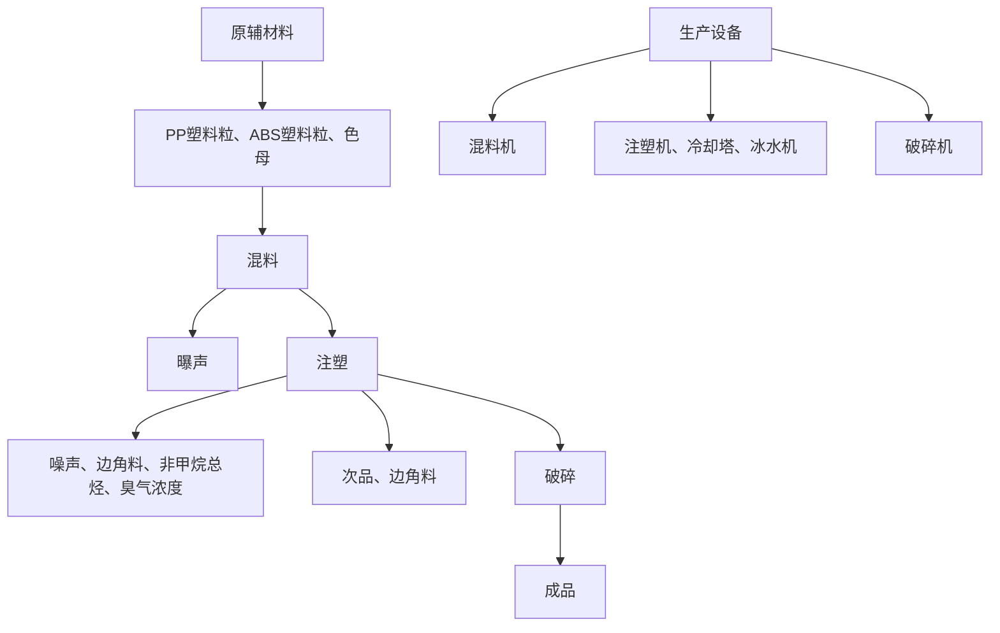

# 建设项目环境影响报告表

（污染影响类）

项目名称： 佛山市迈凯有限公司年产单件10万件项目

年产塑料件 10 万件新建项目编制日期： 2021年11月

text_image

环境科学研究院有限公司
4406060958824
民共和国生态

中华人 环境部制

打印编号：1631494836000

编制单位和编制人员情况表

<table><tr><td colspan="2">项目编号</td><td colspan="3">fj4791</td></tr><tr><td colspan="2">建设项目名称</td><td colspan="3">佛山市迈凯塑胶制品有限公司年产塑料件10万件新建项目</td></tr><tr><td colspan="2">建设项目类别</td><td colspan="3">26--053塑料制品业</td></tr><tr><td colspan="2">环境影响评价文件类型</td><td colspan="3">报告表</td></tr><tr><td colspan="5">一、建设单位情况</td></tr><tr><td colspan="2">单位名称(盖章)</td><td colspan="3">佛山市迈凯塑胶制品有限公司</td></tr><tr><td colspan="2">统一社会信用代码</td><td colspan="3">91440606MA57293D31</td></tr><tr><td colspan="2">法定代表人(签章)</td><td rowspan="3" colspan="3"></td></tr><tr><td colspan="2">主要负责人(签字)</td></tr><tr><td colspan="2">直接负责的主管人员(签字)</td></tr><tr><td colspan="5">二、编制单位情况</td></tr><tr><td colspan="2">单位名称(盖章)</td><td colspan="3">广东顺德环境科学研究院有限公司</td></tr><tr><td colspan="2">统一社会信用代码</td><td colspan="3">91440606768407545Y</td></tr><tr><td colspan="5">三、编制人员情况</td></tr><tr><td colspan="5">1.编制主持人</td></tr><tr><td>姓名</td><td colspan="2">职业资格证书管理号</td><td>信用编号</td><td>签字</td></tr><tr><td>廖宝芝</td><td colspan="2">2013035440350000003508440185</td><td>BH004387</td><td>廖宝芝</td></tr><tr><td colspan="5">2.主要编制人员</td></tr><tr><td>姓名</td><td colspan="2">主要编写内容</td><td>信用编号</td><td>签字</td></tr><tr><td>廖宝芝</td><td colspan="2">建设项目工程分析、评价标准、主要环境影响和保护措施、结论</td><td>BH004387</td><td>廖宝芝</td></tr><tr><td>王丽</td><td colspan="2">建设项目基本情况、区域环境质量现状、环境保护目标、环境保护措施监督检查清单、附表与附件</td><td>BH003267</td><td>王丽</td></tr></table>

<table><tr><td>姓名</td><td>登记单位</td><td>登记证号</td><td>职业资格证书号</td><td>登记类别</td></tr><tr><td>廖宝芝</td><td>广东顺德环境科学研究院有限公司</td><td>B281103201</td><td>0012974</td><td>轻工纺织化纤</td></tr><tr><td colspan="2"></td><td colspan="3"></td></tr><tr><td>Mnial</td><td>Security</td><td colspan="3">编号 No. 0012974</td></tr><tr><td colspan="2"></td><td colspan="3">姓名:Full Name 联系艺性别:Sex 女出生年月:Date of Birth 1979年12月专业类别:Professional Type批准日期:Approval </td></tr><tr><td colspan="2">持证人签名:Signature of the Bearer</td><td colspan="3">签发单位:Issued by:</td></tr><tr><td colspan="2">管理号: 1013005-4106 500000350840185File No.:</td><td colspan="3">签发日期:Issued on</td></tr></table>

text_image

华顺德环境科学研究院有限公司
辽宁

## 目录

一、建设项目基本情况.

二、建设项目工程分析. 6

三、区域环境质量现状、环境保护目标及评价标准 10

四、主要环境影响和保护措施.. 15

五、环境保护措施监督检查清单 33

六、结论.. . 35

附表.. . 36

建设项目污染物排放量汇总表.. . 36

附件1 企业营业执照 . 37

附件2 法人身份证. . 38

附件3 用地资料. . 39

附件4 环评合同.. 47

附件5 北滘镇工业园（潭洲水道西）控制性详细规划. 52

附图1 项目地理位置图. . 53

附图2 建设项目四至及敏感点监测点图 54

附图3 项目厂界500米范围内敏感点图. 55

附图4 项目平面布置图. . 56

附图5 项目四至情况图. . 57

附图6 广东省环境管控单元图 . 58

附图7 佛山市环境管控单元 59

## 一、建设项目基本情况

<table><tr><td>建设项目名称</td><td colspan="3">佛山市迈凯塑胶制品有限公司年产塑料件10万件新建项目</td></tr><tr><td>项目代码</td><td colspan="3">无</td></tr><tr><td>建设单位联系人</td><td></td><td>联系方式</td><td>180</td></tr><tr><td>建设地点</td><td colspan="3">广东省佛山市顺德区北滘镇林头社区环镇东路7号3栋5楼A区厂房</td></tr><tr><td>地理坐标</td><td colspan="3">(22度54分46.531秒,113度14分10.322秒)</td></tr><tr><td>国民经济行业类别</td><td>C2929塑料零件及其他塑料制品制造</td><td>建设项目行业类别</td><td>二十六、橡胶和塑料制品业53塑料制品业</td></tr><tr><td>建设性质</td><td>☑新建(迁建)□改建□扩建□技术改造</td><td>建设项目申报情形</td><td>☑首次申报项目□不予批准后再次申报项目□超五年重新审核项目□重大变动重新报批项目</td></tr><tr><td>项目审批(核准/备案)部门(选填)</td><td>/</td><td>项目审批(核准/备案)文号(选填)</td><td>/</td></tr><tr><td>总投资(万元)</td><td>100</td><td>环保投资(万元)</td><td>8</td></tr><tr><td>环保投资占比(%)</td><td>8</td><td>施工工期</td><td>1个月</td></tr><tr><td>是否开工建设</td><td>☑否□是:____</td><td>用地(用海)面积(m2)</td><td>700</td></tr><tr><td>专项评价设置情况</td><td colspan="3">无</td></tr><tr><td>规划情况</td><td colspan="3">无</td></tr><tr><td>规划环境影响评价情况</td><td colspan="3">无</td></tr><tr><td>规划及规划环境影响评价符合性分析</td><td colspan="3">无</td></tr><tr><td>其他符合性分析</td><td colspan="3">(1)广东省“三线一单”符合性分析根据《广东省人民政府关于印发广东省“三线一单”生态环境分区管控方案的通知》(粤府〔2020〕71号),广东省将以环境管控单元为基础,实施生态环境分区管控,精细化管理、保护生态环境。本项目与广东省“三线一单”生态环境分区管控</td></tr></table>

方案相符性分析如下：

## ①与“一核一带一区”区域管控要求的相符性

1）项目位于珠三角核心区，不属于区域布局管控要求中的禁止新建、扩建水泥、平板玻璃、化学制浆、生皮制革以及国家规划外的钢铁、原油加工等项目。项目不涉及使用高挥发性原辅材料，不属于新建生产和使用高挥发性有机物原辅材料的项目，符合区域布局管控要求。  
2）项目所属塑料制品业，不属于高能耗行业，项目生产设备使用电供能，生活用水由市政供水，不直接取用江河湖库水量，不会对项目所在地生态流量造成影响，符合能源利用要求。  
3）项目属于新建项目，生活污水经三级化粪预处理后排至北滘污水处理厂；注塑废气经集气罩收集后，经一级活性炭处理后通过排气筒G1（45m）引至楼顶排放。符合污染物管控要求。  
4）项目所在地不属于石化、化工重点园区环境风险防控区域。项目产生的危险废物拟定期委托有资质的处置公司进行收集处理，并通过信息系统登记转移计划和电子转移联单，符合危险废物全过程跟踪管理的防控要求。

## ②与环境管控单元总体管控要求的相符性

根据《广东省人民政府关于印发广东省“三线一单”生态环境分区管控方案的通知》（粤府〔2020〕71号）发布的广东省环境管控单元图，项目所在区域为重点管控单元，项目产生的生活污水经三级化粪池处理达标后排至北滘污水处理厂处理；注塑废气经集气罩收集后，经一级活性炭处理后通过排气筒G1（45m）引至楼顶排放，符合重点管控单元的要求。

## （2）佛山市“三线一单”符合性分析

①生态保护红线及一般生态空间

根据《佛山市顺德区人民政府关于同意实施<佛山市顺德区生态保护红线规划（2014\~2025）>的批复》（顺府复〔2016〕27号），本项目不在划定的生态保护红线区域。

②环境质量底线

项目所在区域环境空气质量符合相应质量标准要求，现状地表水水质符合相应质量标准要求。项目产生的生活污水经三级化粪池处理，处理达标后排至北滘污水处理厂处理；注塑废气经集气罩收集后，经一级活性炭处理后通过排气筒G1（45m）引至楼顶排放；对纳污水体及空气质量影响较小。

③资源利用上线

项目运营中会消耗一定量的电及水资源、电能等资源，资源消耗量相对区域资源利用总量较少，符合资源利用上限要求。本项目建成后带来的社会效益大于消耗

资源。

## ④管控单元

根据《佛山市人民政府关于印发佛山市“三线一单”生态环境分区管控方案的通知》（佛府〔2021〕11号）发布的佛山市环境管控单元图，项目位于北滘，属于重点管控区（环境管控单元编码：ZH44060620004）。

## 1）区域布局管控

①项目租用已建成厂房，不进行在 25 度以上的陡坡地开垦种植农作物，禁止在崩塌、滑坡危险区、泥石流易发区从事采石、取土、采砂等可能造成水土流失的活动。  
②项目产生的生活污水经处理达标后排入北滘污水处理厂，北滘污水处理厂的处理尾水排入潭洲水道。潭洲水道水质可达到《地表水环境质量标准》（GB3838－2002）之Ⅲ类标准。  
③项目属于塑料制品业，不属于新建、扩建含蚀刻工序的线路板生产项目和化工项目；不属于纯加工型印花项目，含酸洗、磷化的金属表面处理、金属制品项目（与自身高新技术企业配套的除外），含酸洗、喷涂、拉丝、表面抛光等工艺的不锈钢型材加工项目。  
④项目距离最近的北滘-羊额水厂准水源保护区最近距离为1080m，不属于在佛山市禅城南庄紫洞水厂、佛山市禅城沙口（石湾）水厂、羊额—北滘水厂、广州市南洲水厂顺德水道取水口饮用水水源保护区上游和周边区域建设列入“高污染、高环境风险”产品名录等可能影响水环境安全的项目。  
⑤项目属于塑料制品业，不属于新建储油库项目、产生和排放有毒有害大气污染物的建设项目。项目不涉及使用高挥发性原辅材料，不属于使用溶剂型油墨、涂料、清洗剂、胶黏剂等高挥发性有机物原辅材料项目。

综上，项目符合区域布局管控要求。

## 2）能源资源利用

项目未违规占用水域，不会破坏生态的岸线利用行为和做不符合其功能定位的开发建设活动，不以侵占河道、围垦湖泊、非法采砂等。因此项目符合能源资源利用的要求。

## 3）污染物排放管控

项目产生的生活污水经处理达标后排入北滘污水处理厂，符合污染物排放管控的要求。

表 1-1 项目与“三线一单”文件相符性分析

<table><tr><td>类别</td><td>项目与“三线一单”相符性分析</td><td>符合性</td></tr><tr><td>生态保护红线</td><td>根据《佛山市顺德区人民政府关于同意实施&lt;佛山市顺德区生态保护红线规划(2014~2025)&gt;的批复》(顺府复〔2016〕27号),本项目不在划定的生态保护红线区域。</td><td>符合</td></tr><tr><td>环境质量底线</td><td>项目所在区域环境空气质量符合相应质量标准要求,现状地表水水质符合相应质量标准要求。项目的生活污水经三级化粪池处理达标后排放至北滘污水处理厂;塑废气经集气罩收集后,经一级活性炭处理后通过排气筒G1(45m)引至楼顶排放;对纳污水体及空气质量影响较小。</td><td>符合</td></tr><tr><td>资源利用上线</td><td>本项目运营过程中会消耗一定量的电能、水资源等资源,资源消耗量相对区域资源利用总量较少,符合资源利用上限要求。本项目建成后带来的社会效益大于消耗资源。</td><td>符合</td></tr><tr><td>环境准入负面清单</td><td>本项目不属于《市场准入负面清单(2020年版)》(发改体改规〔2020〕1880号)中禁止和许可事项。</td><td>符合</td></tr></table>

## （3）挥发性有机化合物治理政策符合性分析

表 1-2 挥发性有机化合物治理政策符合性分析

<table><tr><td>序号</td><td>政策要求</td><td>本项目</td><td>符合性</td></tr><tr><td colspan="4">1.《珠江三角洲地区严格控制工业企业挥发性有机物(VOCs)排放的意见》(粤环[2012]18号)</td></tr><tr><td>1.1</td><td>在自然保护区、水源保护区、风景名胜区、森林公园、重要湿地、生态敏感区和其他重生态功能区实行强制性保护,禁止新建VOCs污染企业。</td><td>本项目选址不在禁止区域。</td><td>符合</td></tr><tr><td colspan="4">2.《挥发性有机物(VOCs)污染防治技术政策》(环保部公告2013第31号)</td></tr><tr><td>2.1</td><td>含VOCs产品的使用过程中,应采取废气收集措施,提高废气收集效率,减少废气的无组织排放与逸散。</td><td>项目产生的有机废气经集气罩收集,收集效率约75%。</td><td>符合</td></tr><tr><td colspan="4">3.关于印发《重点行业挥发性有机物综合治理方案》的通知(环大气[2019]53号)</td></tr></table>

<table><tr><td rowspan="3"></td><td>3.1</td><td>通过使用水性、粉末、高固体分、无溶剂、辐射固化等低VOCs含量的涂料,水性、辐射固化、植物基等低VOCs含量的油墨,水基、热熔、无溶剂、辐射固化、改性、生物降解等低VOCs含量的胶粘剂,以及低VOCs含量、低反应活性的清洗剂等,替代溶剂型涂料、油墨、胶粘剂、清洗剂等,从源头减少VOCs产生。</td><td>本项目不使用涂料、油墨、胶黏剂、清洗剂等。</td><td>符合</td></tr><tr><td>3.2</td><td>重点对含VOCs物料(包括含VOCs原辅材料、含VOCs产品、含VOCs废料以及有机聚合物材料等)储存、转移和输送、设备与管线组件泄漏、敞开液面逸散以及工艺过程等五类排放源实施管控,通过采取设备与场所密闭、工艺改进、废气有效收集等措施,削减VOCs无组织排放。</td><td>项目产生的有机废气经集气罩收集,收集效率约75%。</td><td>符合</td></tr><tr><td>3.3</td><td>提高废气收集率。遵循“应收尽收、分质收集”的原则,科学设计废气收集系统,将无组织排放转变为有组织排放进行控制。采用全密闭集气罩或密闭空间的,除行业有特殊要求外,应保持微负压状态,并根据相关规范合理设置通风量。采用局部集气罩的,距集气罩开口面最远处的VOCs无组织排放位置,控制风速应不低于0.3米/秒,有行业要求的按相关规定执行。</td><td>项目产生的有机废气经集气罩收集,收集效率约75%。</td><td>符合</td></tr></table>

## 二、建设项目工程分析

## 1、项目组成

佛山市迈凯塑胶制品有限公司年产塑料件 10 万件新建项目选址于广东省佛山市顺德区北滘镇林头社区环镇东路 7号3栋 5楼A 区厂房，项目占地面积及建筑面积为 700m2。

项目工程组成见表 2-1。

表 2-1项目工程组成情况

<table><tr><td>项目</td><td colspan="2">内容</td><td>规模</td><td>用途</td></tr><tr><td>主体工程</td><td colspan="2">生产车间</td><td> $700m^{2}$ </td><td>主要为混料、注塑、破碎等</td></tr><tr><td>辅助工程</td><td colspan="2">办公室</td><td>---</td><td>用于日常办公,位于生产车间内</td></tr><tr><td>仓储工程</td><td colspan="2">原材料仓库</td><td>--</td><td>用于存放原辅材料,位于生产车间内</td></tr><tr><td rowspan="2">公用工程</td><td colspan="2">配电系统</td><td>1套</td><td>供应生产用电和办公生活用电</td></tr><tr><td colspan="2">给排水系统</td><td>1套</td><td>供水来源为市政自来水理厂</td></tr><tr><td rowspan="4">环保工程</td><td colspan="2">生活污水</td><td>1套</td><td>经三级化粪池预处理后排入北滘污水处理厂</td></tr><tr><td rowspan="2">废气</td><td>注塑废气</td><td colspan="2">经集气罩收集后,经一级活性炭处理后通过排气筒G1(45m)引至楼顶排放</td></tr><tr><td>破碎废气</td><td colspan="2">以无组织形式排放到厂界外</td></tr><tr><td colspan="2">危险废物</td><td colspan="2">暂存于危废暂存间,并委托有资质单位定期处理。</td></tr></table>

## 2、主要产品及产能

项目主要产品及年产量见下表 2-2。

表 2-2 项目主要产品种类及规模

<table><tr><td>类别</td><td>名称</td><td>单位</td><td>数量</td></tr><tr><td>产品产量</td><td>塑料件</td><td>万件/年</td><td>10</td></tr></table>

## 3、主要设备

本项目主要设备见表 2-3。

表 2-3 项目主要设备一览表

<table><tr><td rowspan="2">生产单元</td><td rowspan="2">名称</td><td rowspan="2">单位</td><td rowspan="2">数量</td><td colspan="3">设施参数</td></tr><tr><td>参数名称</td><td>设计值</td><td>计量单位</td></tr><tr><td>注塑成型</td><td>注塑机</td><td>台</td><td>8</td><td>吨位</td><td>120、160、220、260(具体见备注)</td><td>吨</td></tr><tr><td>破碎</td><td>破碎机</td><td>台</td><td>2</td><td>功率</td><td>7.5</td><td>kw</td></tr><tr><td>混料</td><td>混料机</td><td>台</td><td>3</td><td>功率</td><td>3</td><td>kw</td></tr><tr><td>公用</td><td>空压机冷却塔</td><td>台台</td><td>11</td><td>功率循环水量</td><td>111</td><td>kw $m^3/h$ </td></tr><tr><td></td><td>冰水机</td><td>台</td><td>1</td><td>功率</td><td>3</td><td>kw</td></tr><tr><td rowspan="2">模具维修</td><td>钻床</td><td>台</td><td>1</td><td>功率</td><td>3</td><td>kw</td></tr><tr><td>砂轮机</td><td>台</td><td>1</td><td>功率</td><td>3</td><td>kw</td></tr></table>

备注：项目共8台注塑机，其中2台120吨、4台160吨、1台220吨、1台260吨。

## 4、项目原辅材料

项目主要原辅材料的种类和用量见表2-4。

表 2-4 主要原辅材料情况一览表

<table><tr><td>项目</td><td>名称</td><td>单位</td><td>数量</td><td>备注</td></tr><tr><td rowspan="3">主要原辅材料用量</td><td>ABS 塑料</td><td>吨/年</td><td>60</td><td>新料,25kg/袋,粒料</td></tr><tr><td>PP 塑料</td><td>吨/年</td><td>20</td><td>新料,25kg/袋,粒料</td></tr><tr><td>色母</td><td>吨/年</td><td>0.3</td><td>10kg/包,粒料</td></tr></table>

## 原辅材料理化性质：

## 1)ABS

化学名称：丙烯腈-丁二烯-苯乙烯

英文名称：Acrylonitrile Butadiene Styrene plastic（简称 ABS）

比重：1.05 g/cm3，成型温度：250℃

特点：注塑时一般使用温度为 230℃--300℃，无毒无味，具有综合的良好性能以及良好的成型加工性，还具有优良的力学性能，其冲击强度极好。ABS 塑料最大应用领域是汽车、电子电器和建材，还广泛的应用于包装、家具、体育和娱乐用品、机械和仪表工业中。

## 2）PP

化学名称：聚丙烯

英文名称：Polypropylene（简称 PP）

比重：0.9\~0.91 g/cm3，成型温度：160℃--220℃

特点：注塑时一般使用温度为 160℃--220℃，无毒、无臭、无色的半透明颗粒状，具有良好的耐热性、化学稳定性、电绝缘性和抗冲击性。PP塑料广泛的应用于家用电器、塑料管材和高透材料上。

## 5、给水与排水

## （1）给水：

项目用水由市政给水管网供应。用水主要为循环冷却水及员工生活用水。

## ①生活用水

项目从业人数为 4 人，年工作日 300 天，不设饭堂和员工宿舍。参照广东省《用水定额 第三部分：生活》（DB44/T 1461.3-2021）表A.1 中国家机构办公楼无食堂和浴室，生料，不使用废旧塑料。项目设备均使用电作为能源。本项目拟将注塑产生的废气经集气罩收集后，经一级活性炭处理后通过排气筒G1（45m）引至楼顶排放。

<table><tr><td></td><td>活用水28m3/年·人计,则生活用水量约为112m3/a。2循环冷却水本项目注塑机需要使用自来水间接冷却。项目使用1台冷却塔。冷却塔蒸发水量约占循环水量的2.0%,排水量约占循环水量的0.4%,本项目冷却水补充量约占循环水量的2.4%。注塑机生产使用时间约8h/d,年工作日300天,循环水量为1m3/h,则总循环水量为2400m3/a,新鲜水补充量为57.6m3/a,定期排水量为9.6m3/a。(2)排水:项目生活污水经三级化粪池预处理后排入北滘污水处理厂。生活污水排污系数取0.9,生活污水排放量为100.8m3/a。冷却水循环使用,不外排。图2-1 项目水平衡图(m3/a)(3)能源:本项目生产设备使用电能,用电由市政电网接入,年用电量约为3万kW·h。(4)其他:项目厂区内不设饭堂和宿舍,员工住宿及用餐自行解决。6、劳动定员和工作制度项目占地面积和经营面积均为700m2,从业人数为4人,年工作300天,每天工作8小时,工作时间为8:00-12:00、13:30-17:30。项目不设食堂及宿舍。7、厂区平面布置项目平面布置图详见附图4。</td></tr><tr><td>工艺流程和产排污环节</td><td>本项目主要从事塑料件的加工,具体生产工艺及产污流程如图2-2。工艺流程说明:根据产品需要,将外购的塑料粒、色母人工投加到混料机中进行混料,混合均匀后投加到注塑机中,通过高温(约180-250°C)使其受热熔融,注塑成型,即为产品-塑料件。本项目生产过程会产生一定量的次品和边角料,次品及边角料经破碎后回用到生产过程。项目生产过程中冷却塔用于降低注塑机的温度,冷却过程为间接冷却,冷却水循环使用,定期外排,由于冷却水在高温下蒸发,需要定期补充新鲜水。项目生产过程中使用新</td></tr></table>

本项目配备钻床、砂轮机，用于厂内模具维修使用。

flowchart

图 2-2 项目生产工艺流程

表2-5 项目产污环节汇总表

<table><tr><td>序号</td><td>污染类别</td><td>排放口(编号、名称)/污染源</td><td>主要污染因子</td><td>产生环节</td><td>处理排放方式</td></tr><tr><td rowspan="3">1</td><td rowspan="3">废气</td><td>G1(排放口)</td><td>非甲烷总烃、臭气浓度</td><td>注塑</td><td>经集气罩收集后,经一级活性炭处理后通过排气筒G1(45m)引至楼顶排放</td></tr><tr><td rowspan="2">无组织排放</td><td>非甲烷总烃、臭气浓度</td><td>注塑</td><td rowspan="2">加强废气收集效果</td></tr><tr><td>颗粒物</td><td>破碎</td></tr><tr><td>2</td><td>废水</td><td>生活污水</td><td> $COD_{Cr}$ 、 $BOD_5$ 、 $NH_3-N$ 和SS</td><td>生活</td><td>经三级化粪池处理达标后排至北滘污水处理厂处理</td></tr><tr><td rowspan="5">3</td><td rowspan="5">固废</td><td>生活垃圾</td><td>/</td><td>生活</td><td>生活垃圾由环卫部门及时清运</td></tr><tr><td>次品及边角料</td><td>/</td><td>生产过程</td><td>破碎后回用于生产中</td></tr><tr><td>废机油</td><td rowspan="3">危险废物</td><td>设备维修</td><td rowspan="3">定期交有相应资质的危废单位回收处理</td></tr><tr><td>废含油抹布</td><td>设备维修</td></tr><tr><td>机油废包装桶</td><td>设备维修</td></tr><tr><td>4</td><td>噪声</td><td>噪声</td><td>等效A声级</td><td>全厂设备</td><td>墙体隔声、距离衰减</td></tr></table>

备注：次品、边角料破碎后回用于生产过程中，不计入固体废物中。

本项目为新建，租赁已建的工业厂房简单装修后进行生产，没有与项目有关的原有环境污染问题。

## 三、区域环境质量现状、环境保护目标及评价标准

<table><tr><td rowspan="9">区域环境质量现状</td><td colspan="7">1、大气环境根据《关于调整顺德区环境空气质量功能区划的复函》(佛府办函〔2014〕494号),项目所在地属二类功能区,执行《环境空气质量标准》(GB3095-2012)及2018年修改单中的二级标准。根据《佛山市生态环境局顺德分局关于发布2020年度佛山市顺德区环境质量状况公报的通知》(佛顺环函〔2021〕19号),2020年全区空气质量综合指数为3.30,比2019年下降22.9%,空气质量同比有所改善,在全市五区中排名第二。2020年全区二氧化硫( $SO_2$ )、二氧化氮( $NO_2$ )、可吸入颗粒物( $PM_{10}$ )、细颗粒物( $PM_{2.5}$ )平均浓度分别为7、30、43、21微克/立方米,臭氧日最大8小时滑动平均( $O_3$ -8h)浓度的第90百分位数为155微克/立方米,一氧化碳(CO)日浓度的第95百分位数为1.0毫克/立方米,六项污染物指标浓度均达到《环境空气质量标准》(GB3095-2012)二级标准限值。详见下表。表3-1 2020年顺德区(国控测点)环境空气污染物达标判定情况</td></tr><tr><td>污染物</td><td>浓度均值</td><td>评价标准</td><td colspan="4">达标情况</td></tr><tr><td> $SO_2$ (μg/m3)</td><td>7</td><td>60</td><td colspan="4">达标</td></tr><tr><td> $NO_2$ (μg/m3)</td><td>30</td><td>40</td><td colspan="4">达标</td></tr><tr><td> $PM_{10}$ (μg/m3)</td><td>43</td><td>70</td><td colspan="4">达标</td></tr><tr><td> $PM_{2.5}$ (μg/m3)</td><td>21</td><td>35</td><td colspan="4">达标</td></tr><tr><td> $CO^*$ (mg/m3)</td><td>1.0</td><td>4</td><td colspan="4">达标</td></tr><tr><td> $O_3$ -8H*(μg/m3)</td><td>155</td><td>160</td><td colspan="4">达标</td></tr><tr><td colspan="7">*注:(1)表中CO为年内日平均值的第95百分位数, $O_3$ 为年内日最大8小时平均值的第90百分位数。(2)2020年公报中的环境空气质量统计分析数据均采用实况数据。根据2020年全区的大气环境质量状况公报,六项污染物指标浓度均达到《环境空气质量标准》(GB3095-2012)二级标准限值,故顺德区大气环境质量属达标区。2、地表水生活污水经三级化粪处理达标后排至北滘污水处理厂处理,尾水排入潭洲水道。潭洲水道水质执行《地表水环境质量标准》(GB3838-2002)之III类标准。为评价潭洲水道水质,参考《佛山市生态环境局顺德分局关于发布2020年度佛山市顺德区环境质量状况公报的通知》(佛顺环函〔2021〕19号),2020年全区地表水环境质量保持稳定,4个饮用水源监控断面每月均达标,年均值水质均达到II类;2个国控断面(科研断面羊额、考核断面乌洲)、4个省控断面(杨滘、顺德港、海凌、飞鹅山)均达到相应的水质目标。项目纳污水体潭洲水道西海断面监测的水质达到了III类标准要求。3、声环境根据《佛山市人民政府关于印发&lt;佛山市声环境功能区划分方案&gt;的通知》(佛府函[2015]72号),项目所在地属于3类声环境功能区,声环境质量执行《声环境质量标准》(GB3096-2008)中的3类标准:昼间≤65dB(A)、夜间≤55dB(A)。项目厂界外50m范围内设有林头社区居民区环境敏感目标,需开展声环境现状调查。为了解项目所在地声环境质量现状,广东顺德环境科学研究院有限公司分析测试中心(CMA2015192043U)在林头社区布设1个监测点,对建设项目所在地的声环境进行现场实测,测点位置见附图2,监测时间为2021年8月18日。监测结果如下表。表3-2 敏感点噪声监测结果 单位:dB(A)</td></tr><tr><td rowspan="4"></td><td>测点编号</td><td>检测点</td><td>时段</td><td> $L_{eq}$ </td><td>标准</td><td colspan="2">备注</td></tr><tr><td rowspan="2">N1</td><td rowspan="2">项目西面林头社区(第一排)</td><td>昼</td><td>58</td><td>2类,60</td><td colspan="2" rowspan="2">达标</td></tr><tr><td>夜</td><td>47</td><td>2类,50</td></tr><tr><td colspan="7">从上面的监测结果来看,本项目各监测点昼、夜噪声均达标。因此,项目所在地噪声满足当地声环境功能区划的要求。4、生态环境项目用地范围内无生态环境保护目标,无需开展生态现状调查。5、电磁辐射项目不涉及电磁辐射,无需开展电磁辐射现状调查。6、土壤、地下水环境项目不存在土壤、地下水环境污染途径,不开展土壤、地下水环境质量现状调查。</td></tr><tr><td rowspan="4">环境保护目标</td><td colspan="7">1、大气环境项目周围主要大气环境保护目标见表3-3。表3-3 主要环境保护目标</td></tr><tr><td>序号</td><td>名称</td><td>保护对象</td><td>保护内容</td><td>环境功能区</td><td>相对厂址方位</td><td>相对厂界距离/m</td></tr><tr><td>1</td><td>林头社区</td><td>住宅</td><td>人群健康</td><td>大气二类</td><td>西面、北面</td><td>35</td></tr><tr><td colspan="7">2、声环境项目周围主要声环境保护目标见表3-4。表3-4 主要声环境保护目标</td></tr><tr><td rowspan="3"></td><td>序号</td><td>名称</td><td>保护对象</td><td>保护内容</td><td>环境功能区</td><td>相对厂址方位</td><td>相对厂界距离/m</td></tr><tr><td>1</td><td>林头社区</td><td>住宅</td><td>人群</td><td>声环境2类</td><td>西面</td><td>35</td></tr><tr><td colspan="7">3、地下水环境本项目厂界外500米范围内无地下水集中式饮用水水源和热水、矿泉水、温泉等特殊地下水资源。4、生态环境项目用地范围内无生态环境保护目标。</td></tr><tr><td rowspan="5">污染物排放控制标准</td><td colspan="7">1、水污染物排放标准项目运营期间产生的生活废水经三级化粪池处理,处理后达到广东省《水污染物排放限值》(DB44/26-2001)的第二时段三级标准后排入北滘污水处理厂处理。根据2013年7月11日颁布的《顺德区环境运输和城市管理局关于全区城镇污水处理厂尾水排放执行标准的通知》规定:新、扩和改建城镇污水处理厂尾水应符合《城镇污水处理厂污染物排放标准》(GB18918-2002)一级A标准及广东省地方标准《水污染物排放限值》(DB44/26-2001)第二时段一级标准的较严值。表3-5 废水污染物排放标准限值单位:mg/L,pH除外</td></tr><tr><td>指标</td><td>pH</td><td> $COD_{Cr}$ </td><td> $BOD_5$ </td><td> $NH_3-N$ </td><td colspan="2">SS</td></tr><tr><td>厂区排放口标准</td><td>6~9</td><td>500</td><td>300</td><td>--</td><td colspan="2">400</td></tr><tr><td>污水处理厂尾水排放标准</td><td>6-9</td><td>40</td><td>10</td><td>5</td><td colspan="2">10</td></tr><tr><td colspan="7">2、大气污染物排放标准注塑废气的污染因子主要为非甲烷总烃、臭气浓度,本项目注塑废气经集气罩收集后,经一级活性炭处理后通过排气筒G1(45m)引至楼顶排放。本项目塑料次品和边角料破碎过程会产生粉尘,其污染因子主要为颗粒物。粉尘在车间无组织排放。(1)注塑产生的非甲烷总烃执行《合成树脂工业污染物排放标准》(GB31572-2015)中表4大气污染物排放限值和表9大气污染物排放限值。(2)注塑过程产生的异味执行《恶臭污染物排放标准》(GB14554-93)中表1恶臭污染物厂界标准值的二级新扩改建标准和表2恶臭污染物排放标准值。(3)破碎工序产生的颗粒物执行《合成树脂工业污染物排放标准》(GB31572-2015)中表9企业边界大气污染物浓度限值。(4)根据广东省生态环境厅发布的《广东省生态环境厅关于实施厂区内挥发性有机</td></tr></table>

物无组织排放监控要求的通告》（粤环发〔2021〕4号），厂区内挥发性有机物无组织排放监控点浓度应满足《挥发性有机物无组织排放控制标准》（GB37822-2019）表A1规定的特别排放限值。

表 3-6 项目有组织废气排放标准

<table><tr><td rowspan="2">工序</td><td rowspan="2">排气筒(m)</td><td rowspan="2">污染因子</td><td colspan="2">有组织</td><td rowspan="2">执行标准</td></tr><tr><td>最高允许排放浓度(mg/m3)</td><td>最高允许排放速率(kg/h)</td></tr><tr><td rowspan="2">注塑</td><td rowspan="2">G1(45m)</td><td>非甲烷总烃</td><td>100</td><td>---</td><td>GB31572-2015</td></tr><tr><td>臭气浓度</td><td>40000(无量纲)</td><td>---</td><td>GB 14554-93</td></tr></table>

备注：根据《恶臭污染物排放标准》（GB 14554-93），凡在表2 所列两种高度之间的排气筒，采取四舍五入方法计算其排气筒的高度，项目排气筒 45m，位于 40 及 50 之间，四舍五入后执行50m排气筒的排放浓度

表 3-7 项目无组织废气排放标准

<table><tr><td>工序</td><td>污染因子</td><td>无组织排放浓度限值 $(mg/m^3)$ </td><td>执行标准</td></tr><tr><td rowspan="2">注塑</td><td>非甲烷总烃</td><td>4.0</td><td>GB31572-2015</td></tr><tr><td>臭气浓度</td><td>20(无量纲)</td><td>GB 14554-93</td></tr><tr><td>破碎</td><td>颗粒物</td><td>1.0</td><td>GB31572-2015</td></tr></table>

表 3-8 厂区内挥发性有机物无组织排放限值

<table><tr><td>工序</td><td>污染因子</td><td>特别排放限值 $mg/m^3$ </td><td>限值意义</td><td>执行标准</td></tr><tr><td rowspan="2">注塑</td><td rowspan="2">NMHC</td><td>6</td><td>监控点处1h平均浓度值</td><td rowspan="2">GB37822-2019</td></tr><tr><td>20</td><td>监控点处任意一次浓度值</td></tr></table>

## 3、噪声排放标准

项目厂界执行《工业企业厂界环境噪声排放标准》（GB12348-2008）3类标准。

$\yen 323,456,789$  
单位：LAeq[dB(A)]

<table><tr><td>声环境功能区类别</td><td>昼间排放限值</td><td>夜间排放限值</td></tr><tr><td>3类</td><td>65</td><td>55</td></tr></table>

## 4、固体废物污染控制标准

危险废物、一般工业固废在厂内暂存应分别符合《危险废物贮存污染控制标准》（GB18597-2001）、《一般工业固体废物贮存和填埋污染控制标准》（GB 18599-2020）以及《关于发布〈一般工业固体废物贮存、处置场污染控制标准〉（GB18599-2001）等 3项国家污染物控制标准修改单的公告》（环境保护部公告 2013年第 36号）的要求，修改

<table><tr><td></td><td>相应标准。</td></tr><tr><td>总量控制指标</td><td>(1)生活污水本项目生活污水排放量为 $100.8m^{3}/a$ , $COD_{Cr}$ 排放量为 $0.004t/a$ , $NH_{3}-N$ 排放量为 $0.0005t/a$ 。生活污水经三级化粪池处理达标后排至北滘污水处理厂处理。根据《佛山市人民政府办公室关于印发佛山市排污权有偿使用和交易管理办法的通知》(佛府办2020第19号),生活污水 $COD_{Cr}$ 、 $NH_{3}-N$ 不分配总量。(2)有机废气项目非甲烷总烃有组织排放量为 $0.083 t/a$ ,按照非甲烷总烃和VOCs等量换算,建议VOCs总量控制指标为 $0.083 t/a$ 。</td></tr></table>

## 四、主要环境影响和保护措施

<table><tr><td>施工期环境保护措施</td><td>项目租用已经建设完毕的工业厂房,不涉及厂房建设,施工过程主要是内部装修和设备安装,没有基建工程,因此施工期间基本不存在大型土建工程,施工期间产生的影响主要是由于设备运输、安装时产生的噪声等。 施工期建设方应严格遵守有关建筑施工的环境保护条例,防止运输扬尘,建筑垃圾、废物等及时清运,降低施工过程对周围环境造成的影响。施工期较短,因此如果项目建设方加强施工管理,那么项目施工时不会对周围环境造成较大的影响。</td></tr></table>

## 1、废气

表 4-1 项目废气产污环节、污染物种类、排放形式及污染防治设施一览表

<table><tr><td rowspan="2">生产工艺</td><td rowspan="2">产排污环节</td><td rowspan="2">污染物种类</td><td rowspan="2">排放形式</td><td colspan="2">污染防治设施</td><td rowspan="2">排放口类型</td></tr><tr><td>污染防治设施名称及工艺</td><td>是否为可行性技术</td></tr><tr><td>破碎</td><td>破碎</td><td>颗粒物</td><td>无组织</td><td>/</td><td>/</td><td>/</td></tr><tr><td>注塑</td><td>注塑</td><td>非甲烷总烃、臭气浓度</td><td>有组织</td><td>一级活性炭</td><td>☑是□否</td><td>一般排放口</td></tr></table>

## 1.1 废气影响分析

根据《通风设计手册》，采用上吸伞型罩，罩口排风量为 L，L的计算公式如下：

$$
\mathrm{L} = 1. 4 ^ {*} \mathrm{P} ^ {*} \mathrm{h} ^ {*} \mathrm{Vk} ^ {*} 3 6 0 0
$$

P—污染源周长，m；

h—有害物至罩口的距离，m；

Vk—罩口截面风速，m/s。

表 4-2项目车间风机风量一览表

<table><tr><td>排气筒</td><td>收集区域</td><td>收集方式</td><td>单个集气罩周长(m)</td><td>集气罩个数(个)</td><td>有害物至罩口的距离(m)</td><td>罩口截面风速(m/s)</td><td>罩口排风量( $m^3/h$ )</td></tr><tr><td>G1</td><td>注塑机</td><td>上吸罩</td><td>2</td><td>8</td><td>0.15</td><td>0.35</td><td>4233.6</td></tr></table>

由上表可知，项目所需的风机风量为 4233.6m³/h，考虑到收集管道弯道和接口损失，设计风量应预留20%-30%余量，所以选用的风机风量为5500m³/h。

◇注塑废气

项目注塑过程中，塑料加工温度均为 180-250℃，塑料加工时会产生一定量的有机废气。由于 ABS 塑料粒分解温度为 320℃，PP 塑料粒分解温度为 328-410℃，塑料粒加工温度低于分解温度，因此本项目塑料粒加工时没有其他特征污染物产生，污染因子主要为非甲烷总烃。

本项目生产过程中产生的非甲烷总烃的来源为塑料热熔，项目生产过程中所使用的塑料均为新料，根据《排放源统计调查产排污核算方法和系数手册》（公告 2021 年第 24 号）中的塑料制品业系数手册，非甲烷总烃产生系数为2.70 kg/t产品。

本项目产品小时最大生产量为 35kg/h，年产量约 80.3t/a，则项目非甲烷总烃产生速率为0.0945kg/h，产生量约为 0.22t/a。

本项目将注塑有机废气经集气罩收集后，经一级活性炭处理后通过排气筒 G1（45m）引至楼顶排放。注塑废气产生和排放情况如表 4-4所示。

## ◇ 破碎粉尘

项目塑料次品和边角料破碎过程会产生少量粉尘，污染因子为颗粒物。项目碎料机运营过程中密闭，故仅投料、出料过程会有少量粉尘外逸。根据《排放源统计调查产排污核算方法和系数手册》（公告 2021 年第 24 号）中的塑料制品业系数手册，“生产过程存在塑料零件切割工艺，其产生的颗粒物产污核算可参考34通用设备制造行业核算环节为下料，产品为下料件，原料为钢板、铝板、铝合金板、其他金属材料、玻璃纤维、其他非金属材料，工艺为锯床、砂轮切割机切割，规模为所有规模的系数手册”，颗粒物产生系数为5.30kg/t原料。

本项目小时最大破碎量为3.5kg/h，破碎量约4.015t/a（即塑料次品和边角料产生量），则项目颗粒物产生速率为0.019kg/h，颗粒物产生量为0.021t/a。破碎粉尘在车间内无组织排放，破碎粉尘的产生及排放情况核算见表4-4。

## ◇注塑产生的异味

项目注塑过程中会产生轻微恶臭气味，其污染因子为臭气浓度。注塑过程产生的恶臭废气和有机废气一并收集后通过排气筒 G1（45m）引至楼顶排放。臭气浓度产生量不大，预计有组织排放浓度≤40000（无量纲），无组织排放浓度≤20（无量纲）。

表 4-3 项目废气产生情况一览表

<table><tr><td rowspan="2">工序</td><td colspan="3">原料使用情况</td><td rowspan="2">污染因子</td><td colspan="3">污染物产生情况</td></tr><tr><td>名称</td><td>小时使用量kg/h</td><td>年使用量t/a</td><td>产污系数</td><td>产生速率kg/h</td><td>产生量t/a</td></tr><tr><td>注塑</td><td>塑料、色母、色粉</td><td>35</td><td>80.3</td><td>非甲烷总烃</td><td>2.7 kg/t产品</td><td>0.0945</td><td>0.22</td></tr><tr><td>破碎</td><td>塑料次品及边角料</td><td>3.5</td><td>4.015</td><td>颗粒物</td><td>5.30kg/t原料</td><td>0.019</td><td>0.021</td></tr></table>

表 4-4项目废气产生及排放情况

<table><tr><td rowspan="2">工序</td><td rowspan="2">装置</td><td rowspan="2">污染物</td><td rowspan="2">核算方法</td><td rowspan="2">总产生量t/a</td><td rowspan="2">污染源</td><td rowspan="2">收集效率(%)</td><td colspan="3">产生情况</td><td colspan="2">治理措施</td><td colspan="3">排放情况</td><td rowspan="2">排放时间(h)</td></tr><tr><td>产生速率kg/h</td><td>产生浓度mg/m3</td><td>产生量t/a</td><td>工艺</td><td>处理效率(%)</td><td>排放速率kg/h</td><td>排放浓度mg/m3</td><td>排放量t/a</td></tr><tr><td rowspan="2">注塑</td><td rowspan="2">注塑机</td><td rowspan="2">非甲烷总烃</td><td rowspan="2">系数法</td><td rowspan="2">0.220</td><td>G1排气筒</td><td>75</td><td>0.071</td><td>12.909</td><td>0.165</td><td>一级活性炭</td><td>50</td><td>0.036</td><td>6.455</td><td>0.083</td><td>2400</td></tr><tr><td>生产车间</td><td>/</td><td>0.024</td><td>/</td><td>0.055</td><td>/</td><td>/</td><td>0.024</td><td>/</td><td>0.055</td><td>2400</td></tr><tr><td>破碎</td><td>破碎机</td><td>颗粒物</td><td>类比法</td><td>0.021</td><td>生产车间</td><td>/</td><td>0.019</td><td>/</td><td>0.021</td><td>/</td><td>/</td><td>0.019</td><td>/</td><td>0.021</td><td>1200</td></tr><tr><td rowspan="3">合计</td><td>有组织</td><td>非甲烷总烃</td><td>公式法</td><td>风量5500m3/h</td><td>G1排气筒</td><td>/</td><td>0.071</td><td>12.909</td><td>0.165</td><td>/</td><td>/</td><td>0.036</td><td>6.455</td><td>0.083</td><td>/</td></tr><tr><td rowspan="2">无组织</td><td>非甲烷总烃</td><td>公式法</td><td>/</td><td rowspan="2">生产车间</td><td>/</td><td>0.024</td><td>/</td><td>0.055</td><td>/</td><td>/</td><td>0.024</td><td>/</td><td>0.055</td><td>/</td></tr><tr><td>颗粒物</td><td>公式法</td><td>/</td><td>/</td><td>0.019</td><td>/</td><td>0.021</td><td>/</td><td>/</td><td>0.019</td><td>/</td><td>0.021</td><td>/</td></tr></table>

## 1.2 废气达标分析

## （1）排气筒废气达标分析

项目注塑过程会产生有机废气，其污染因子主要为非甲烷总烃、臭气浓度。注塑废气经集气罩收集后，经一级活性炭处理后通过排气筒 G1（45m）引至楼顶排放。根据计算分析，非甲烷总烃可达到《合成树脂工业污染物排放标准》（GB31572-2015）表 4 大气污染物排放限值；臭气浓度达到《恶臭污染物排放标准》（GB 14554-93）中表2恶臭污染物排放标准值，对周围环境影响不明显。

表 4-5 项目排气筒污染物排放达标情况一览表

<table><tr><td>污染源</td><td>污染物</td><td>排放速率kg/h</td><td>排放浓度mg/m3</td><td>执行标准</td><td>速率限值kg/h</td><td>浓度限值mg/m3</td><td>达标情况</td></tr><tr><td rowspan="2">排气筒G1</td><td>非甲烷总烃</td><td>0.036</td><td>6.455</td><td>GB31572-2015</td><td>---</td><td>100</td><td>达标</td></tr><tr><td>臭气浓度</td><td>---</td><td>≤40000(无量纲)</td><td>GB14554-93</td><td>---</td><td>40000(无量纲)</td><td>达标</td></tr></table>

## （2）厂界废气达标分析

项目塑料次品和边角料破碎过程会产生一定量的粉尘，污染物为颗粒物。破碎粉尘在车间内无组织排放。注塑废气经集气罩收集后仍有少量的废气在车间无组织排放。

根据工程计算及根据导则推荐的面源估算模型进行计算分析，非甲烷总烃可达到《合成树脂工业污染物排放标准》（GB31572-2015）表 9 企业边界大气污染物浓度限值；臭气浓度达到《恶臭污染物排放标准》（GB 14554-93）中表1恶臭污染物厂界标准值的二级新扩改建标准；颗粒物可达到《合成树脂工业污染物排放标准》（GB31572-2015）表 9 企业边界大气污染物浓度限值，对周围环境影响不明显。

表 4-6 项目厂界污染物排放达标情况一览表

<table><tr><td>污染物</td><td>厂界浓度 $mg/m^3$ </td><td>厂界监控浓度限值  $mg/m^3$ </td><td>标准来源</td><td>达标分析</td></tr><tr><td>非甲烷总烃</td><td>0.0029</td><td>4.0</td><td>GB31572-2015</td><td>达标</td></tr><tr><td>颗粒物</td><td>0.0023</td><td>1.0</td><td>GB31572-2015</td><td>达标</td></tr><tr><td>臭气浓度</td><td>≤20(无量纲)</td><td>20(无量纲)</td><td>GB 14554-93</td><td>达标</td></tr></table>

备注：项目面积共700m2，长为35m，宽为20m，1层为8m，2\~3层为6m，4\~8层为5m.。项目位于5层，面源高度取8+6\*2+5+5/2=27.5m。

## 1.3非正常工况下废气排放情况

本项目无生产设施开停机等非正常工况。

## 1.4废气治理设施可行性分析

注塑废气经集气罩收集后，经一级活性炭处理后通过排气筒G1（45m）引至楼顶排放。

项目所使用的废气治理设施均为《排污许可证申请与核发技术规范 橡胶和塑料制品工业》

（HJ1122—2020）表A.2的可行技术，故本项目废气治理设施可行。

## 1.5 环境监测

根据《排污许可证申请与核发技术规范 橡胶和塑料制品工业》（HJ 1122-2020），本项目运营期废气污染源自行监测计划如下表4-7所示。

表 4-7 项目大气排放口基本情况表

<table><tr><td rowspan="2">序号</td><td rowspan="2">排放口编号</td><td colspan="2">排放口地理坐标</td><td rowspan="2">排气筒高度/m</td><td rowspan="2">排气筒出口内径m</td><td rowspan="2">风量(m3/h)</td><td rowspan="2">烟气流速/(m/s)</td><td rowspan="2">排气温度°C</td><td rowspan="2">其他</td></tr><tr><td>东经</td><td>北纬</td></tr><tr><td>1</td><td>G1</td><td>113°14&#x27;09.821&quot;</td><td>22°54&#x27;46.140&quot;</td><td>45</td><td>0.4</td><td>5500</td><td>12.16</td><td>25</td><td>一般排放口</td></tr></table>

表 4-8 运营期大气环境自行监测计划一览表

<table><tr><td>序号</td><td>监测点位</td><td>监测因子</td><td>监测频次</td><td>排放标准</td></tr><tr><td rowspan="2">1</td><td rowspan="2">G1排气筒</td><td>非甲烷总烃</td><td rowspan="2">1次/年</td><td>《合成树脂工业污染物排放标准》(GB31572-2015)中表4大气污染物排放限值</td></tr><tr><td>臭气浓度</td><td>《恶臭污染物排放标准》(GB 14554-93)中表2恶臭污染物排放标准值</td></tr><tr><td rowspan="3">2</td><td rowspan="3">厂界上下风向</td><td>颗粒物</td><td rowspan="3">1次/年</td><td rowspan="2">《合成树脂工业污染物排放标准》(GB31572-2015)中表9大气污染物排放限值</td></tr><tr><td>非甲烷总烃</td></tr><tr><td>臭气浓度</td><td>《恶臭污染物排放标准》(GB 14554-93)中表1恶臭污染物厂界标准值的二级新扩改建标准</td></tr><tr><td>3</td><td>厂区内</td><td>NMHC</td><td>1次/年</td><td>《挥发性有机物无组织排放控制标准》(GB37822-2019)表A1规定的特别排放限值</td></tr></table>

备注：该企业将来若列入重点企业管理，则按重点排污单位监测要求进行管理。

## 2、废水

项目产生的生活污水经处理达标后排入北滘污水处理厂，项目废水类别、污染物项目及污染防治设施见下表。

表 4-9 项目废水类别、污染物项目及污染防治设施一览表

<table><tr><td rowspan="2">废水类别</td><td rowspan="2">污染物项目</td><td colspan="2">污染防治设施</td><td rowspan="2">流向/排放去向</td><td rowspan="2">对应排放口</td><td rowspan="2">排放口类型</td></tr><tr><td>污染防治设施名称及工艺</td><td>是否为可行性技术</td></tr><tr><td>生活污水</td><td> $COD_{Cr}$ 、 $BOD_5$ 、 $NH_3-N$ 和SS</td><td>三级化粪池</td><td>☑是□否</td><td>北滘污水处理厂</td><td>生活污水单独排放口</td><td>一般排放口</td></tr></table>

表 4-10 废水间接排放口基本情况表

<table><tr><td rowspan="2">序号</td><td rowspan="2">排放口编号</td><td rowspan="2">废水排放量/(万t/a)</td><td rowspan="2">排放去向</td><td rowspan="2">排放规律</td><td rowspan="2">间歇排放时段</td><td colspan="3">受纳污水处理厂信息</td></tr><tr><td>名称</td><td>污染物种类</td><td>国家或地方污染物排放标准浓度限值/(mg/L)</td></tr><tr><td rowspan="4">1</td><td rowspan="4">水-01</td><td rowspan="4">0.1008</td><td rowspan="4">排入北滘污水处理厂</td><td rowspan="4">间断排放</td><td rowspan="4">工作日8:00-17:30</td><td rowspan="4">北滘污水处理厂</td><td> $COD_{Cr}$ </td><td>40</td></tr><tr><td> $BOD_5$ </td><td>10</td></tr><tr><td>SS</td><td>10</td></tr><tr><td> $NH_3-N$ </td><td>5</td></tr></table>

## 2.1 废水排放源强

◇生活污水

本项目从业人数是4人，厂区内不设置食堂和员工宿舍。根据广东省《用水定额 第3部分：生活》（DB44/T 1461.3—2021），员工生活用水定额参照国家机构办公楼无食堂和浴室，按28m3（人/ •a）计，则生活用水 $1 1 2 \mathrm { m } ^ { 3 } / \mathrm { a } ;$ ；排放系数按90%计，则生活污水产生量约为 100.8m3/a，本项目生活污水的主要污染物因子为 $\mathrm { C O D } _ { \mathrm { C r } } \mathrm {  ~ \cal ~ B O D } _ { 5 } ,$ 、氨氮和 SS 等。生活污水经三级化粪处理达标后排至北滘污水处理厂处理。

生活污水污染物浓度取值依据描述：参考环境保护部环境工程技术评估中心编制《环境影响评价（社会区域类）》教材（表 5-18），结合项目实际，污染物产排放浓度计算如下表。

表 4-11 项目生活污水产生及排放情况一览表

<table><tr><td>项目</td><td>污染物</td><td>产生浓度(mg/L)</td><td>产生量(t/a)</td><td>排放浓度(mg/L)</td><td>排放量(t/a)</td></tr><tr><td rowspan="4">生活污水 $100.8m^{3}/a$ </td><td> $COD_{Cr}$ </td><td>250</td><td>0.025</td><td>40</td><td>0.004</td></tr><tr><td> $BOD_{5}$ </td><td>100</td><td>0.010</td><td>10</td><td>0.001</td></tr><tr><td>SS</td><td>100</td><td>0.010</td><td>10</td><td>0.001</td></tr><tr><td> $NH_{3}-N$ </td><td>30</td><td>0.003</td><td>5</td><td>0.0005</td></tr></table>

◇ 循环冷却水

本项目注塑机需要使用自来水间接冷却。项目使用1 台冷却塔。本项目冷却水补充量约占循环水量的2.4%。注塑机生产使用时间约 8h/d，年工作日 300天，循环水量为1 m3/ h，则总循环水量为2400m3/a，新鲜水补充量为 57.6m3/a。冷却水循环使用，不外排。

## 2.2 废水污染防治措施可行性

根据《排污许可证申请与核发技术规范 橡胶和塑料制品工》业(HJ1122—2020)和《排污单位自行监测技术指南 总则》（HJ819-2017）中的污染防治措施，生活污水处理设施可行技术如下表所示，本项目生活污水经三级化粪处理达标后排至北滘污水处理厂处理，故本项目废水治理设施可行。

表 4-12 生活污水处理可行技术

<table><tr><td>污水类别</td><td>可行技术</td></tr><tr><td>生活污水</td><td>隔油池、化粪池、调节池、厌氧-好氧、兼性-好氧、好氧生物处理</td></tr></table>

## 2.3 废水排放达标分析

项目生活污水经三级化粪池处理，处理后能够达到广东省地方标准《水污染物排放限值》（DB44/26-2001）第二时段三级标准。本项目达标排放的生活污水通过市政污水管网引入北滘污水处理厂处理，尾水排入潭洲水道，对周围水环境影响不大。

## 2.4 生活污水依托北滘污水处理厂的可行性分析

目前北滘污水处理系统收集建成的主干管已经覆盖到北滘居委会、林头居委会、槎涌居委会、三洪奇居委会、广教居委会、顺江居委会、黄龙村、高村村8 个村居，项目所在地位于北滘污水处理厂的现有管网纳污范围。

根据《北滘污水处理厂二期重新报批项目环境影响报告书》（佛山市顺德环境科学研究所有限公司，2014 年 11 月），北滘污水处理厂一期日处理规模 3 万吨/日，二期一阶段日处理规模为3万吨/日，共6万吨/日。目前6 万吨/日的处理能力通过验收，已在稳定运行中，一期验收编号[2006]A174，二期一阶段验收编号环验[2011]A187 号，北滘污水处理厂正在筹备二期二阶段（3万吨/日）的建设。

北滘污水处理厂一期、二期一阶段工艺采用微孔爆气氧化沟处理工艺，工业污水及生活污水分别从厂外引入厂内，经污水井至进水泵房，工业污水经气浮池预处理后，再与生活污水混合后进入均衡池，由泵提升后依次进入微曝氧化沟、二沉池、消毒池，最终出水排入潭洲水道。

项目生活污水经三级化粪预处理后达到广东省地方标准《水污染物排放限值》（DB44/26-2001）第二时段三级标准后再排至北滘污水处理厂处理。满足污水厂的纳管要求，不会对污水厂造成冲击负荷，也不会影响其正常运行。

综上，从北滘污水处理厂的服务范围、处理规模、建设进度、管网建设的可达性及处理工艺来说，项目废水排入北滘污水处理厂处理是可行的。

## 2.5 环境监测

根据《排污许可证申请与核发技术规范 橡胶和塑料制品工业》(HJ1122—2020)和《排污单位自行监测技术指南 总则》（HJ819-2017），“单独排入公共污水处理系统的生活污水无需开展自行监测”，本项目废水总排口属于一般排放口，因生活污水排入污水处理厂处理，运营期不再对厂区内生活污水单独排放口进行监测。

## 3、噪声

## 3.1 噪声源强及降噪措施

本项目噪声源为生产设备运行时产生的机械噪声，其噪声级约 65～90dB（A）。

表4-13 项目主要声源及噪声源强一览表

<table><tr><td>序号</td><td>噪声源</td><td>源强dB(A)</td><td>降噪措施</td><td>排放强度dB(A)</td><td>持续时间</td></tr><tr><td>1</td><td>混料机等</td><td>65~75</td><td rowspan="3">车间设备合理布局,厂房建筑隔声(隔声量≥20dB(A))</td><td>45~55</td><td>昼间</td></tr><tr><td>2</td><td>注塑机、钻床等</td><td>75~85</td><td>55~65</td><td>昼间</td></tr><tr><td>3</td><td>破碎机、空压机、冷却塔、冰水机、砂轮机等</td><td>80~85</td><td>60~65</td><td>昼间</td></tr><tr><td>4</td><td>风机等</td><td>80~90</td><td>风机下方加装减振垫,厂房建筑隔声量不小于25 dB(A)</td><td>55~65</td><td>昼间</td></tr></table>

## 3.2 噪声影响及达标分析

## （1）预测模式

项目声环境影响预测采用《环境影响评价技术导则 声环境》(HJ/T2.4-2009) 推荐的预测模式：

1）项目声源在预测点产生的等效声级贡献值 $\scriptstyle ( \mathrm { L } _ { \mathrm { e q g } } )$

$$
L _ {\mathrm{eqg}} = 1 0 \lg \left(\frac {1}{T} \sum_ {i} t _ {i} 1 0 ^ {0. 1 L _ {\mathrm{Ai}}}\right)
$$

式中： $\mathrm { L _ { e q g ^ { - } } }$ —项目声源在预测点的等效声级贡献值， $\mathrm { d B } ( \mathrm { A } ) ;$ ；

$\mathrm { L } _ { \mathrm { A i ^ { - } } }$ —声源在预测点产生的 A 声级， $\mathrm { d B } ( \mathrm { A } ) ;$ ；

T—预测计算的时间段，s；

ti—i 声源在 T 时段内的运行时间，s。

2）预测点的预测等效声级(Leq)

$$
L _ {\mathrm{eq}} = 1 0 \lg \left(1 0 ^ {0. 1 L _ {\mathrm{eqg}}} + 1 0 ^ {0. 1 L _ {\mathrm{eqb}}}\right)
$$

式中： $\mathrm { L _ { e q g ^ { - } } }$ —项目声源在预测点的等效声级贡献值， $\mathrm { d B } ( \boldsymbol { \mathrm { A } } ) ;$ ；

$\mathrm { L _ { e q b } } -$ —预测点的背景值， $\mathrm { d B } ( \mathrm { A } )$ 。

3）基本公式

A、根据声源声功率级或靠近声源某一参考位置处的已知声级、户外声传播衰减，计算距离声源较远处的预测点的声级。在已知距离无指向性点声源参考点 $\mathbf { r } _ { 0 }$ 处的倍频带（用 63Hz到8KHz的8个标称倍频带中心频率）声压级和计算出参考点 $\mathbf { \Pi } ( \mathbf { r } _ { 0 } )$ 和预测点（r）处之间的户外声传播衰减后，预测点8个倍频带声压级公式：

$$
L _ {p} (r) = L _ {p} \left(r _ {0}\right) - \left(A _ {\mathrm{div}} + A _ {\mathrm{atm}} + A _ {\mathrm{bar}} + A _ {\mathrm{gr}} + A _ {\mathrm{misc}}\right)
$$

式中：Lp(r)—距声源 r处的倍频带声压级；

Lp(r0)—参考位置 $\mathbf { r } _ { 0 }$ 处的倍频带声压级；

$\mathbf { A } _ { \mathrm { d i v } }$ —声波几何发散引起的倍频带衰减，dB；

$\mathbf { A } _ { \mathrm { a t m } ^ { - } }$ —大气吸收引起的倍频带衰减， $\mathrm { d B }$ ；

$\mathbf { A } _ { \mathrm { b a r } }$ —屏蔽屏障引起的倍频带衰减，dB；

$\mathrm { A _ { g r } - }$ —地面效应引起的倍频带衰减，dB；

$\mathbf { A } _ { \mathrm { m i s c } }$ —其他多方面效应引起的倍频带衰减，dB。

B、预测点的A 声级可按下列公式计算，即将8 个倍频带声压级合成，计算出预测点的A 声级LA(r)

$$
\mathrm{L} _ {\mathrm{A}} (\mathrm{r}) = 1 0 \lg \left(\sum_ {\mathrm{i} = 1} ^ {8} 1 0 ^ {0. 1 (\mathrm{Lpi} (\mathrm{r}) - \Delta \mathrm{Li})}\right)
$$

式中：Lpi(r)——预测点(r)处，第 i 倍频带声压级，dB；

ΔLi——第 i 倍频带的 A 计权网络修正值（见附录 B），dB。

C、在只考虑几何发散衰减时，可用下列公式计算：

$$
\mathrm{LA} (\mathrm{r}) = \mathrm{LA} (\mathrm{r} _ {0}) - \mathrm{A} _ {\text { div }}
$$

②几何发散衰减（Adiv）

无指向性点声源几何发散衰减的基本公式是：

$$
\mathrm{Lp} (\mathrm{r}) = \mathrm{Lp} \left(\mathrm{r} _ {0}\right) - 2 0 \lg \left(\mathrm{r} / \mathrm{r} _ {0}\right)
$$

$$
\mathrm{A} _ {\text { div }} = 2 0 \lg (\mathrm{r} / \mathrm{r} _ {0})
$$

③空气吸收引起的衰减（Aatm）

空气吸收引起的衰减公式是：

$$
\mathrm{A} _ {\mathrm{atm}} = \mathrm{a} (\mathrm{r} - \mathrm{r} _ {0}) / 1 0 0 0
$$

式中：a——温度、湿度和声波频率的函数，根据项目所处区域常年 平均气温和湿度选择像样的空气吸收系数；

r——预测点距深远的距离，m； r0——参考位置距离，m。

④屏障引起的衰减(Abar) 位于声源和预测点之间的实体障碍物，如围墙、建筑物、土坡或地堑等起声屏障作用，从而引起声能量的较大衰减。本噪声环境影响评价中忽略室外屏障引起的衰减(Abar)。49  
⑤地面效应衰减(Agr) 声波越过疏松地面传播时，或大部分为疏松地面的混合地面，在预测点仅计算 A 声级前提下，地面效应引起的倍频带衰减公式：

$$
\mathrm{Agr} = 4. 8 - \left(\frac {2 \mathrm{h} _ {\mathrm{m}}}{\mathrm{r}}\right) \left[ 1 7 + \left(\frac {3 0 0}{\mathrm{r}}\right) \right]
$$

式中：r——声源到预测点的距离，m；

hm— —传播路径的平均离地高度，m；

hm=F/r；F：面积，m2；r，m；

若 $\mathbf { \delta A } _ { \mathrm { g r } }$ 计算出负值，则Agr 可用“0”代替；本噪声环境影响评价中忽略地面效应衰减（Agr）。

## （2）预测内容

据本项目噪声源的分布，对拟建厂址的厂界四周噪声进行影响预测计算。

## （3）预测结果及分析

本项目主要噪声源对厂界声环境的贡献值见表4-14。

表 4-14 项目噪声源对厂界声环境的贡献值 单位：dB(A)

<table><tr><td>厂界</td><td>影响设备</td><td>与厂界距离m</td><td>距离衰减后值(厂界外1米)</td><td>隔墙衰减后叠加后的贡献值</td></tr><tr><td rowspan="8">东面(1#)</td><td>混料机</td><td>30</td><td>45.2</td><td rowspan="8">56.9</td></tr><tr><td>注塑机</td><td>5</td><td>69.4</td></tr><tr><td>钻床</td><td>15</td><td>60.9</td></tr><tr><td>破碎机</td><td>15</td><td>60.9</td></tr><tr><td>空压机</td><td>5</td><td>69.4</td></tr><tr><td>冷却塔</td><td>5</td><td>69.4</td></tr><tr><td>冰水机</td><td>5</td><td>69.4</td></tr><tr><td>风机</td><td>10</td><td>69.2</td></tr><tr><td rowspan="8">南面(2#)</td><td>混料机</td><td>18</td><td>49.4</td><td rowspan="8">54.3</td></tr><tr><td>注塑机</td><td>18</td><td>59.4</td></tr><tr><td>钻床</td><td>15</td><td>60.9</td></tr><tr><td>破碎机</td><td>10</td><td>64.2</td></tr><tr><td>空压机</td><td>5</td><td>69.4</td></tr><tr><td>冷却塔</td><td>10</td><td>64.2</td></tr><tr><td>冰水机</td><td>15</td><td>60.9</td></tr><tr><td>风机</td><td>19</td><td>64.0</td></tr><tr><td rowspan="8">西面(3#)</td><td>混料机</td><td>5</td><td>59.4</td><td rowspan="8">49.0</td></tr><tr><td>注塑机</td><td>8</td><td>65.9</td></tr><tr><td>钻床</td><td>20</td><td>58.6</td></tr><tr><td>破碎机</td><td>20</td><td>58.6</td></tr><tr><td>空压机</td><td>30</td><td>55.2</td></tr><tr><td>冷却塔</td><td>30</td><td>55.2</td></tr><tr><td>冰水机</td><td>30</td><td>55.2</td></tr><tr><td>风机</td><td>25</td><td>61.7</td></tr><tr><td rowspan="8">北面(4#)</td><td>混料机</td><td>2</td><td>65.5</td><td rowspan="8">61.6</td></tr><tr><td>注塑机</td><td>2</td><td>75.5</td></tr><tr><td>钻床</td><td>5</td><td>69.4</td></tr><tr><td>破碎机</td><td>10</td><td>64.2</td></tr><tr><td>空压机</td><td>15</td><td>60.9</td></tr><tr><td>冷却塔</td><td>10</td><td>64.2</td></tr><tr><td>冰水机</td><td>5</td><td>69.4</td></tr><tr><td>风机</td><td>1</td><td>84.0</td></tr></table>

项目建成投产后厂界周边声环境的变化情况见表4-15。

表 4-15 厂界噪声预测结果 单位：dB(A)

<table><tr><td colspan="2">项目位置及时段</td><td>项目贡献值</td><td>执行标准</td></tr><tr><td rowspan="4">昼间</td><td>厂界东</td><td>56.9</td><td rowspan="4">65</td></tr><tr><td>厂界南</td><td>54.3</td></tr><tr><td>厂界西</td><td>49.0</td></tr><tr><td>厂界北</td><td>61.6</td></tr><tr><td rowspan="4">夜间</td><td>厂界东</td><td>---</td><td rowspan="4">55</td></tr><tr><td>厂界南</td><td>---</td></tr><tr><td>厂界西</td><td>---</td></tr><tr><td>厂界北</td><td>---</td></tr></table>

注：项目夜间不生产，因此不对其进行评价。

由4-15中的数据可以看出：项目建成投产后，厂界噪声值略有增加，东、南、西及北厂界贡献值均可满足《工业企业厂界环境噪声排放标准》（GB12348-2008）中的3类标准的要求。故项目建成后，产生的噪声在采取合理的布局和治理措施后对周围环境影响较小。

## （4）对敏感点的噪声影响

根据无指向性点声源几何发散衰减公式，根据表 4-15 的预测结果，计算项目主要设备噪声随距离的衰减情况，见表4-16。

表 4-16 建项目主要机械设备噪声衰减规律 （单位：dB(A)）

<table><tr><td rowspan="2">序号</td><td rowspan="2">厂界</td><td colspan="9">预测距离(m)</td></tr><tr><td>1</td><td>5</td><td>10</td><td>20</td><td>30</td><td>35</td><td>100</td><td>150</td><td>200</td></tr><tr><td>1</td><td>西面</td><td>49.0</td><td>35.0</td><td>29.0</td><td>23.0</td><td>19.5</td><td>18.1</td><td>9.0</td><td>5.5</td><td>3.0</td></tr></table>

项目评价范围内最近的敏感点为林头社区居民住宅，距离本项目约 35m。根据表 4-16 的预测结果，林头社区的贡献值为 18.1dB(A)。

表 4-17 项目营运期噪声林头社区的影响预测（单位：dB(A)）

<table><tr><td rowspan="2">位置</td><td colspan="2">贡献值</td><td colspan="2">本底值</td><td colspan="2">预测值</td><td colspan="2">标准值</td></tr><tr><td>昼间</td><td>夜间</td><td>昼间</td><td>夜间</td><td>昼间</td><td>夜间</td><td>昼间</td><td>夜间</td></tr><tr><td>林头社区</td><td>18.1</td><td>---</td><td>58</td><td>47</td><td>58.0</td><td>---</td><td>60</td><td>50</td></tr></table>

注：项目夜间不生产，因此不对其进行评价；已将全部设备的噪声源进行叠加，然后进行预测。

## （5）环境影响分析

本项目噪声源为生产设备运行时产生的机械噪声，其噪声级约65～90dB（A）。项目所在地属于工业区，周围均是工业厂房；建议建设单位对生产设备做好减震处理，并做好墙体隔声，生产噪声通过墙体的隔声、距离衰减。厂界外1米处达到《工业企业厂界环境噪声排放标准》（GB12348-2008）中的3类标准，林头社区居民住宅处噪声预测值能够达到《声环境质量标准》（GB3096-2008）中的2类标准，预计对周围环境影响不大。

## 3.3 噪声污染防治措施可行性分析

①注塑机、冰水机、冷却塔、破碎机等噪声比较大的设备布置在远离居民区一侧东面，同时企业加强生产区域门窗的隔声性能，考虑到车间建筑门窗基本关闭情况，该车间的整体降噪能力可达 20dB(A)以上。  
②废气处理风机加装减振垫，隔声量可达 25 dB(A)。  
③选用低噪声设备，从源头控制噪声。

以上噪声治理措施容易实施，技术成熟可靠，投资费用较少，在经济上是可行的。

## 3.4 环境监测

鉴于企业西面、东面紧邻其他工业企业的厂房，考虑到现场检测排除周边工业噪声影响的可行性，仅在本项目南面、北面边界布设了2个环境噪声监测点。因项目夜间不生产，监测边界昼间噪声，噪声自行监测计划如下表。

表 4-18 项目噪声自行监测计划一览表

<table><tr><td rowspan="2">监测点位</td><td rowspan="2">监测时段</td><td rowspan="2">监测频次</td><td rowspan="2">执行排放标准名称</td><td colspan="2">厂界噪声排放限值 dB(A)</td></tr><tr><td>昼间</td><td>夜间</td></tr><tr><td>南面</td><td>昼间</td><td>1 次/季度</td><td rowspan="2">《工业企业厂界环境噪声排放标准》(GB12348-2008)中的 3 类标准</td><td>65</td><td>55</td></tr><tr><td>北面</td><td>昼间</td><td>1 次/季度</td><td>65</td><td>55</td></tr></table>

备注：因项目夜间不进行生产，因此夜间可不进行监测。

## 4、固体废物

## （1）生活垃圾

## ①塑料次品及边角料

项目生产过程会产生一定量的塑料次品及边角料，产生量约为原料的5%，则塑料次品及边角料的产生量约为4.015t/a。塑料次品及边角料经破碎后回用到生产过程，不计入固体废物中。

## ②员工生活垃圾

项目员工共 4 人，不在项目内食宿。根据《社会区域类环境影响评价》（中国环境出版社）中固体废物污染源推荐数据，员工生活垃圾产生量按 0.5kg/（人·d）计算。年工作日 300天，则项目生活垃圾产生量约 0.6t/a。生活垃圾由环卫部门及时清运。

## ③危险废物

项目产生的危险废物主要为废机油、废含油抹布、机油废包装桶及废活性炭。危险废物暂存在厂内，定期交由具有相应危险废物处理资质的单位进行处理

## ◇废机油

项目生产设备需要定期维修，此时会产生少量的废机油，预计废机油年产生量为 0.01t/a。

## ◇含油废抹布

项目机械设备维修操作时会产生含油废抹布，因抹布表面残留废油，具有一定危险性，建议企业在前期做好分类，与生活垃圾分开收集，此时应按照危险废物进行管理，集中收集后定期交资质单位进行处理处置，预计含油废抹布产生量是 0.01t/a。

## ◇机油废包装桶

本项目机油使用过程中会有机油废包装桶产生，废包装桶集中收集后定期交资质单位进行处理处置。机油包装规格为 10kg/桶，空桶按 0.2kg/个计算，机油年使用量为0.02 吨，则包装桶产生量约为 0.0004t/a。

## ◇废活性炭

项目废活性炭产生量=活性炭负载量×一年活性炭更换次数+活性炭削减废气量。

经计算，项目有机废气的有组织产生量为0.165t/a，有机废气经活性炭吸附后的排放量为0.083t/a，则活性炭吸附量为 0.082t/a，活性炭装载量为 0.1t，一年更换3次。则废活性炭产生量约为 0.382t/a。

各种危险废物种类、产生量、废物类别、代码见表4-15。

固体废物管理应遵照《中华人民共和国固体废物污染环境防治法》、《广东省固体废物污染环境防治条例》的要求；固体废物暂存于一般固体废物仓库，仓库应满足防渗漏、防雨淋、防扬尘等要求。生活垃圾交由环卫部门处理，次品及边角料经破碎后回用到生产过程。项目拟建一个危险废物暂存间，各类危险废物的产生，视情况定期委外处置，暂存间贮存能力可满足危险废物的存储需求。

## 固体废物环境管理要求：

根据《关于发布《危险废物规范化管理指标体系》的通知》（环办【2015】99号）、《危险废物贮存污染控制标准》（GB18597－2001）及其2013年修改单，建设单位对危险废物的管理应做到：

I）、建立责任制度，明确负责人及具体管理人员。

II）、按照《危险废物贮存污染控制标准》（GB18597—2001）要求，合理、安全贮存危险废物，贮存时限一般不得超过一年。危险废物贮存场所应当有防风、防雨、防渗漏等措施，不同特性废物进行分类收集，且不同类废物间有明显的间隔（如过道、隔墙等）。用以存放装载液体、半固体危险废物容器的地方，必须有耐腐蚀的硬化地面，且表面无裂隙。在收集、贮存、运输、利用、处置危险废物的设施、场所设置规范的警示标志、标识、标牌。

III）、制定危险废物管理计划，清晰描述危险废物的产生环节、种类、危害特性、产生量、利用处置方式等。

IV）、按要求如实申报登记危险废物的种类、产生量、贮存、处置等有关情况。

V）、建设单位应按照《危险废物转移联单管理办法》的要求，严格执行转移联单制度，除贮存和自行利用处置外，危险废物必须委托给具有相应资质的危险废物经营单位进行处置。

项目各类固体废物经分类收集储存、妥善处置，对区域环境和周围敏感点影响不大。

表 4-19 项目固体废物产生情况

<table><tr><td>序号</td><td colspan="2">种类</td><td>产生环节</td><td>本项目(t/a)</td><td>废物类别</td><td>废物代码</td><td>形态</td><td>危险成分</td><td>危险特性*</td><td>贮存方式</td><td>利用处置方式及去向</td><td>利用或处置量</td><td>环境管理要求</td></tr><tr><td>1</td><td colspan="2">生活垃圾</td><td>员工生活</td><td>0.6</td><td>---</td><td>---</td><td>固体</td><td>---</td><td>---</td><td>桶装</td><td>由环卫部门集中处理</td><td>0.6</td><td>分类收集,定期清运</td></tr><tr><td>2</td><td colspan="2">次品及边角料</td><td>注塑</td><td>4.015</td><td>06</td><td>292-001-06</td><td>固体</td><td>---</td><td>---</td><td>袋装</td><td>经破碎后回用到生产过程</td><td>4.015</td><td>分类收集储存在一般工业固体废物暂存间内、妥善处置</td></tr><tr><td>3</td><td rowspan="4">危险废物</td><td>废机油</td><td>设备维修</td><td>0.01</td><td>HW08</td><td>900-249-08</td><td>固体</td><td>机油</td><td>T、I</td><td>桶装</td><td rowspan="4">定期交有相应资质的危废单位回收处理</td><td>0.01</td><td rowspan="4">根据生产需要合理设置贮存量,尽量减少厂内的物料贮存量;严禁将危险废物混入生活垃圾;堆放危险废物的地方要有明显的标志,堆放点要防雨、防渗、防漏,应按要求进行包装贮存。</td></tr><tr><td>4</td><td>含油废抹布</td><td>设备维修</td><td>0.01</td><td>HW49</td><td>900-041-49</td><td>液体</td><td>机油</td><td>T/In</td><td>袋装</td><td>0.01</td></tr><tr><td rowspan="2">5</td><td>机油废包装桶</td><td>设备维修</td><td>0.0004</td><td>HW08</td><td>900-249-08</td><td>固体</td><td>机油等</td><td>T、I</td><td>堆放</td><td>0.0004</td></tr><tr><td>废活性炭</td><td>废气处理设施</td><td>0.382</td><td>HW49</td><td>900-039-49</td><td>固体</td><td>活性炭、有机组分</td><td>T</td><td>包装袋</td><td>0.382</td></tr><tr><td colspan="3">危险废物合计</td><td>---</td><td>0.4024</td><td>---</td><td>---</td><td>---</td><td>---</td><td>---</td><td>---</td><td>---</td><td>0.4024</td><td>---</td></tr></table>

备注：1、注：危险特性中T表示毒性，C 表示腐蚀性、I表示易燃性，R表示反应性，In 表示感染性。  
2、次品、边角料破碎后回用于生产过程中，不计入固体废物中。

## 5、环境风险

## （1）物质风险和重大危险源识别

根据《建设项目环境风险评价技术导则》（HJ169-2018）附录B，识别项目使用的危险化学品和风险物质如下表所示。

表 4-20 危险物质风险识别表

<table><tr><td>序号</td><td>名称</td><td>别名</td><td>有害成分</td><td>危险性类别</td><td>危化品序号</td><td>储存地/储存方式</td><td>使用量(t/a)</td><td>最大储存量q(t)</td><td>临界量Q(t)</td></tr><tr><td>1</td><td>废机油</td><td>/</td><td>机油</td><td>/</td><td>/</td><td>危废暂存间25kg/桶</td><td>0.02</td><td>0.01</td><td>2500</td></tr><tr><td colspan="10"> $\sum q/Q=0.000004$ </td></tr></table>

备注：企业不在厂区内储存机油，即买即用。

## （2）最大可信事故

本项目不设置专用危险化学品仓库，使用的量较少，平时少量储存在生产岗位。生产过程风险主要是设备维修使用的油类泄漏，最大泄漏量10kg机油。

## （3）环境风险分析

本项目风险源及泄漏途径、后果分析见表4-21。

表4-21 项目风险分析内容表

<table><tr><td>事故起因</td><td>环境风险描述</td><td>涉及化学品(污染物)</td><td>风险类别</td><td>途径及后果</td><td>工序</td><td>风险防范措施</td></tr><tr><td>危险废物泄漏</td><td>泄漏危险废物污染地表水及地下水</td><td>废机油</td><td>水环境、地下水环境</td><td>通过雨水管排放到附近水体,影响内河涌水质,影响水生环境</td><td>危废间</td><td>危险废物暂存间设置围堰,做好防渗措施</td></tr><tr><td rowspan="2">火灾、爆炸</td><td>燃烧烟尘及污染物污染周围大气环境</td><td>CO、非甲烷总烃</td><td>大气环境</td><td>通过燃烧烟气扩散,对周围大气环境造成短时污染</td><td>生产车间</td><td rowspan="2">落实防止火灾措施,车间附近存放足量的沙包和橡胶垫片等,发生火灾时可封堵车间门口</td></tr><tr><td>消防废水进入附近水体</td><td>COD等</td><td>水环境</td><td>通过雨水管对附近内河涌水质造成影响。</td><td>生产车间</td></tr></table>

## （4）风险控制措施及应急要求

①建议企业根据佛山市生态环境局印发的《佛山市企业事业单位突发环境事件应急预案备案管理实施办法》，编制突发环境事件应急预案，健全应急组织，落实应急器材，并对预案进行演练。  
②定期做好废气处理设施的检修和维护，对操作人员进行定期培训。  
③根据关于发布《突发环境事件应急预案备案行业名录（指导性意见）》的通知（粤环【2018】44 号），及《佛山市生态环境局关于印发危险废物产生单位突发环境事件应急预案备案的指导意见（试行）的通知》（佛环〔2020〕54 号）中的分类管理要求，企业需按照《佛山市企业事业单位突发环境事件应急预案备案管理实施办法》（佛环〔2019〕140号）要求编制（修订）企业环境应急预案。

④公司应严格按照《危险废物贮存污染控制标准》（（GB18597-2001）及2013 年修改单）

对危险废物暂存场进行设计和建设，同时按相关法律法规将危险废物交给有相关资质的单位处理，做好供应商的管理。同时严格按《危险废物转移联单管理办法》做好转移记录。

## （6）评价小结

项目环境风险物质主要为废机油，主要危险单元为危险废物暂存间，经核算 Q 值为0.000004。通过简单风险分析，项目主要风险为废机油泄漏、火灾事故。项目周围环境敏感程度一般，通过采取设置围堰或漫坡、配备吸附材料等环境风险防范措施，不会对周围环境造成大的影响。在发生火灾事故时，可采取封堵雨水井，紧急疏散等措施。项目的环境风险总体是可控的。

表4-22 建设项目环境风险简单分析内容表

<table><tr><td>建设项目名称</td><td colspan="5">佛山市迈凯塑胶制品有限公司年产塑料件10万件新建项目</td></tr><tr><td>建设地点</td><td>(广东)省</td><td>(佛山)市</td><td>(顺德)区</td><td>(北滘)镇</td><td>(/)园区</td></tr><tr><td>地理坐标</td><td>经度</td><td>113°14&#x27;10.322&quot;</td><td>纬度</td><td colspan="2">22°54&#x27;46.531&quot;</td></tr><tr><td>主要危险物质及分布</td><td colspan="5">废机油、含油废抹布等暂存于危废暂存间</td></tr><tr><td>环境影响途径及危害后果(大气、地表水、地下水等)</td><td colspan="5">废机油等危险废物泄漏通过雨水管进入水体,影响内河涌水质,影响水生环境;发生火灾爆炸时燃烧烟尘及污染物污染周围大气环境,对周围大气环境造成短时污染;消防废水通过雨水管进入附近水体,对附近内河涌水质造成影响。</td></tr><tr><td>风险防范措施要求</td><td colspan="5">危废暂存间设置围堰,做好防渗措施;在火灾和爆炸事故次生灾害时,可通过封堵雨水井,采取紧急疏散等措施。</td></tr><tr><td colspan="6">填表说明(列出项目相关信息及评价说明)项目使用风险物质废机油,储存量较少,Q值为0.000004。通过简单风险分析,项目主要风险为危险废物泄漏,其泄漏量后果影响较轻,不会对周边大气和水环境造成明显威胁。项目通过采取防止泄漏措施,车间附近存放足量的沙包和橡胶垫片等,发生火灾时可封堵车间门口,采取紧急疏散等措施,其环境风险总体是可控的。</td></tr></table>

## 6、土壤

根据《环境影响评价技术导则 土壤环境》（HJ964-2018）附录 B-B.1 建设项目土壤环境影响类型与影响途径识别可知，土壤环境污染影响途径主要为大气沉降、地面漫流和垂直入渗。

## ①大气沉降影响

大气沉降是指大气中的污染物通过一定的途径被沉降至地面或水体的过程，分为干沉降和湿沉降，是土壤污染的重要途径之一。

本项目产生的废气主要是：注塑废气、破碎粉尘。废气产生量不大，因此不会因大气沉降对土壤产生影响。综上，本项目基本不会以大气沉降方式对外环境土壤造成影响。

## ②地面漫流

本项目租用已经建设完毕的工业厂房，不涉及厂房建设，不破坏土壤，项目及邻近区域均为硬化路面，且本项目贮存液态危废的区域均做了硬化、防雨、防渗、防泄漏处理，即使发生泄漏也能控制在危废暂存场所内，因此，本项目不存在因地表径流、雨水冲刷等原因造成液态物料在地面漫流的情况，综上，本项目土壤环境污染影响途径不涉及地面漫流方式。

③垂直入渗

本项目产生的污水主要为生活污水。废水处理设施均进行硬化、防渗等处理；本项目贮存液态危废的区域、生产区域均进行硬化、防雨、防渗、防泄漏处理，即使发生泄漏也能控制在危废暂存场所内。根据工程分析章节，大气污染物的排放量较少，且项目厂区内进行硬底化建设，危险废物暂存间进行防腐防渗措施，正常生产情况下，不会发生有机物下渗造成土壤污染事件。综上，项目废水、液态物料、废气基本不会以垂直入渗方式对土壤环境造成影响。

项目厂区内进行硬底化建设，废水处理设施、危险废物暂存间进行防腐防渗措施，通过定期检查防渗措施，对周围土壤环境影响不大。从土壤环境影响的角度考虑，本项目的建设是可行的。

## 7、地下水

生产过程中各环节液体物料的“跑、冒、滴、漏”渗入地下污染地下水；液体物料储存区（原辅材料存放区）的渗漏，尤其危险废物渗液（如被雨淋等情况）渗漏进入地下污染地下水。

项目租用已建成标准化工业厂房，厂区地面全部采用混凝土硬化；在生产车间为水泥硬化地表；运营期项目产生的生活垃圾交由环卫部门清理运走处理，次品、边角料外卖给回收商，危险废物分类收集，妥善存放于危险废物暂存间内，定期委托资质单位处理。危废暂存间已做好了防渗、防风及防雨等措施，因此本项目固废不会产生淋滤液进入含水层。因此，没有地下水污染途径，本项目造成地下水污染的风险较小，可以忽略不计。

## 8、管理要求

根据《挥发性有机物无组织排放控制标准》（GB37822-2019），VOCs 环境管理要求如下：

（1）应建立台账，记录含 VOCs 原辅材料和含 VOCs 产品的名称、使用量、回收量、废弃量、去向以及 VOCs 含量等信息。台账保存期限不少于 3 年。  
（2）企业应建立台账，记录废气收集系统的主要运行和维护信息，如运行时间、操作温度等关键运行参数。台账保存期限不少于 3 年。

（3）项目产生的有机废气经集气罩收集，收集效率约75%。

（4）VOCs 废气收集处理系统应与生产工艺设备同步运行。VOCs 废气收集处理系统发生故障或检修时，对应的生产工艺设备应停止运行，待检修完毕后同步投入使用；生产工艺设备不能停止运行或不能及时停止运行的，应设置废气应急处理设施或采取其他替代措施。

应按照有关法律、《环境监测管理办法》和 HJ 819 等规定，建立企业监测制度，制订监测方案，对污染物排放状况及其对周边环境质量的影响开展自行监测，保存原始监测记录，并公布监测结果。

根据《广东省涉VOCs 重点行业治理指引》的通知（粤环办〔2021〕43 号），VOCs环境管理要求如下：

表 4-23 关于印发《广东省涉 VOCs 重点行业治理指引》的通知（粤环办〔2021〕43 号）相关要求

<table><tr><td>环节</td><td>要求</td></tr><tr><td rowspan="5">过程控制</td><td>VOCs物料应储存于密闭的容器、包装袋、储罐、储库、料仓中</td></tr><tr><td>盛装VOCs物料的容器是否存放于室内,或存放于设置有雨棚、遮阳和防渗设施的专用场地。盛装VOCs物料的容器在非取用状态时应加盖、封口,保持密闭。</td></tr><tr><td>粉状、粒状VOCs物料采用气力输送设备、管状带式输送机、螺旋输送机等密闭输送方式,或者采用密闭的包装袋、容器或罐车进行物料转移。</td></tr><tr><td>粉状、粒状VOCs物料采用气力输送方式或采用密闭固体投料器等给料方式密闭投加;无法密闭投加的,在密闭空间内操作,或进行局部气体收集,废气排至除尘设施、VOCs废气收集处理系统。</td></tr><tr><td>在混合/混炼、塑炼/塑化/熔化、加工成型(挤出、注射、压制、压延、发泡、纺丝等)、硫化等作业中应采用密闭设备或在密闭空间中操作,废气应排至VOCs废气收集处理系统;无法密闭的,应采取局部气体收集措施,废气应排至VOCs废气收集处理系统</td></tr><tr><td rowspan="3">末端治理</td><td>采用外部集气罩的,距集气罩开口面最远处的VOCs无组织排放位置,控制风速不低于0.3m/s。</td></tr><tr><td>废气收集系统的输送管道应密闭。废气收集系统应在负压下运行,若处于正压状态,应对管道组件的密封点进行泄漏检测,泄漏检测值不应超过500μmol/mol,亦不应有感官可察觉泄漏。</td></tr><tr><td>塑料制品行业:a)有机废气排气筒排放浓度不高于广东省《大气污染物排放限值》(DB4427-2001)第II时段排放限值,合成革和人造革制造企业排放浓度不高于《合成革与人造革工业污染物排放标准》(GB21902-2008)排放限值,若国家和我省出台并实施适用于塑料制品制造业的大气污染物排放标准,则有机废气排气筒排放浓度不高于相应的排放限值;车间或生产设施排气中NMHC初始排放速率≥3kg/h时,建设VOCs处理设施且处理效率≥80%;b)厂区内无组织排放监控点NMHC的小时平均浓度值不超过6mg/m3,任意一次浓度值不超过20mg/m3。</td></tr><tr><td rowspan="7">环境管理</td><td>建立含VOCs原辅材料台账,记录含VOCs原辅材料的名称及其VOCs含量、采购量、使用量、库存量、含VOCs原辅材料回收方式及回收量。</td></tr><tr><td>建立废气收集处理设施台账,记录废气处理设施进出口的监测数据(废气量、浓度、温度、含氧量等)、废气收集关键参数等。</td></tr><tr><td>建立危废台账,整理危废处置合同、转移联单及危废处理方资质佐证材料</td></tr><tr><td>台账保存期限不少于3年</td></tr><tr><td>塑料制品行业简化管理排污单位废气排放口及无组织排放每年一次</td></tr><tr><td>新、改、扩建项目应执行总量替代制度,明确VOCs总量指标来源</td></tr><tr><td>新、改、扩建项目和现有企业VOCs基准排放量计算参考《广东省重点行业挥发性有机物排放量计算方法核算》进行核算,若国家和我省出台适用于该行业的VOCs排放量计算方法,则参照其相关规定执行。</td></tr></table>

## 五、环境保护措施监督检查清单

<table><tr><td>内容要素</td><td>排放口(编号、名称)/污染源</td><td>污染物项目</td><td>环境保护措施</td><td>执行标准</td></tr><tr><td rowspan="5">大气环境</td><td rowspan="2">G1(排放口)</td><td>非甲烷总烃</td><td rowspan="2">注塑废气经集气罩收集后,经一级活性炭处理后通过排气筒G1(45m)引至楼顶排放</td><td>《合成树脂工业污染物排放标准》(GB31572-2015)中表4大气污染物排放限值</td></tr><tr><td>臭气浓度</td><td>《恶臭污染物排放标准》(GB14554-93)中表2恶臭污染物排放标准值</td></tr><tr><td rowspan="3">无组织</td><td>非甲烷总烃</td><td rowspan="2">加强废气收集效果</td><td>《合成树脂工业污染物排放标准》(GB31572-2015)中表9企业边界大气污染物浓度限值</td></tr><tr><td>臭气浓度</td><td>《恶臭污染物排放标准》(GB14554-93)中表1恶臭污染物厂界标准值的二级新扩改建标准</td></tr><tr><td>颗粒物</td><td>加强车间通风</td><td>《合成树脂工业污染物排放标准》(GB31572-2015)表9企业边界大气污染物浓度限值</td></tr><tr><td rowspan="4">地表水环境</td><td rowspan="4">生活污水</td><td> $COD_{Cr}$ </td><td rowspan="4">经三级化粪池处理达标后排至北滘污水处理厂处理</td><td rowspan="4">广东省地方标准《水污染物排放限值》(DB44/26-2001)第二时段三级标准</td></tr><tr><td> $BOD_5$ </td></tr><tr><td> $NH_3-N$ </td></tr><tr><td>SS</td></tr><tr><td>声环境</td><td>生产设备运行噪声</td><td>噪声</td><td>应选用效率高、噪声低的设备,定期对设备进修检修保养等</td><td>《工业企业厂界环境噪声排放限值》(GB12348-2008)中3类标准</td></tr></table>

<table><tr><td>电磁辐射</td><td>不涉及</td></tr><tr><td>固体废物</td><td>次品及边角料经破碎后回用到生产过程;生活垃圾集中堆放,委托环卫部门及时清运处置;厂区内有固定的固废堆放处;危险废物经收集后委托有资质单位进行处理,厂区设有危废暂存间,并做好“防渗漏、防雨淋、防扬尘”处理</td></tr><tr><td>土壤及地下水污染防治措施</td><td>项目厂区内进行硬底化建设,三级化粪池、危险废物暂存间进行防腐防渗措施,定期检查防渗措施</td></tr><tr><td>生态保护措施</td><td>不涉及</td></tr><tr><td>环境风险防范措施</td><td>危险废物贮存时要严格检查包装,防止泄漏。现场配置泄漏吸附收集等应急器材,危废暂存间设置围堰,做好防渗措施;在火灾和爆炸事故次生灾害时,可通过封堵厂区门口,采取紧急疏散等措施。</td></tr><tr><td>其他环境管理要求</td><td>项目根据《排污单位自行监测技术指南 总则》(HJ819-2017)、《排污许可证申请与核发技术规范 橡胶和塑料制品工业》(HJ 1122-2020),制定运营期环境自行监测计划。项目竣工后,申请竣工环保验收时,按《建设项目竣工环境保护验收技术指南 污染影响类》(生态环境部令第9号)要求进行监测。项目竣工环保验收合格后,企业应根据监测计划,定期对污染源进行监测,监测结果按排污许可相关管理要求进行公示公开。企业应将监测数据和报告存档,作为编制排污许可执行报告基础材料。监测数据应长期保存,并定期接受当地环保主管部门的考核。</td></tr></table>

## 六、结论

总体而言，项目符合相关环保法律法规要求，污染防治措施可行，环境风险总体可控。

如项目在建设和运行期间能够按照本报告的要求落实各项污染控制措施，所产生的污染物能达标排放，则该项目建成及投入运行后对周围环境影响不大，从环境保护角度分析该项目是可行的。

建设项目污染物排放量汇总表

<table><tr><td colspan="2">分类\项目</td><td>污染物名称</td><td>单位</td><td>现有工程排放量(固体废物产生量)1</td><td>现有工程许可排放量2</td><td>在建工程排放量(固体废物产生量)3</td><td>本项目排放量(固体废物产生量)4</td><td>以新带老削减量(新建项目不填)5</td><td>本项目建成后全厂排放量(固体废物产生量)6</td><td>变化量7</td></tr><tr><td rowspan="3">废气</td><td>有组织</td><td>非甲烷总烃</td><td>t/a</td><td>0</td><td>0</td><td>0</td><td>0.083</td><td>0</td><td>0.083</td><td>+0.083</td></tr><tr><td rowspan="2">无组织</td><td>非甲烷总烃</td><td>t/a</td><td>0</td><td>0</td><td>0</td><td>0.055</td><td>0</td><td>0.055</td><td>+0.055</td></tr><tr><td>颗粒物</td><td>t/a</td><td>0</td><td>0</td><td>0</td><td>0.021</td><td>0</td><td>0.021</td><td>+0.021</td></tr><tr><td rowspan="4" colspan="2">废水</td><td> $COD_{Cr}$ </td><td>t/a</td><td>0</td><td>0</td><td>0</td><td>0.004</td><td>0</td><td>0.004</td><td>+0.004</td></tr><tr><td> $BOD_5$ </td><td>t/a</td><td>0</td><td>0</td><td>0</td><td>0.001</td><td>0</td><td>0.001</td><td>+0.001</td></tr><tr><td>SS</td><td>t/a</td><td>0</td><td>0</td><td>0</td><td>0.001</td><td>0</td><td>0.001</td><td>+0.001</td></tr><tr><td> $NH_3-N$ </td><td>t/a</td><td>0</td><td>0</td><td>0</td><td>0.0005</td><td>0</td><td>0.0005</td><td>+0.0005</td></tr><tr><td colspan="3">生活垃圾</td><td>t/a</td><td>0</td><td>0</td><td>0</td><td>0.6</td><td>0</td><td>0.6</td><td>+0.6</td></tr><tr><td rowspan="4" colspan="2">危险废物</td><td>废机油</td><td>t/a</td><td>0</td><td>0</td><td>0</td><td>0.01</td><td>0</td><td>0.01</td><td>+0.01</td></tr><tr><td>废含油抹布</td><td>t/a</td><td>0</td><td>0</td><td>0</td><td>0.01</td><td>0</td><td>0.01</td><td>+0.01</td></tr><tr><td>废包装桶</td><td>t/a</td><td>0</td><td>0</td><td>0</td><td>0.0004</td><td>0</td><td>0.0004</td><td>+0.0004</td></tr><tr><td>废活性炭</td><td>t/a</td><td>0</td><td>0</td><td>0</td><td>0.382</td><td>0</td><td>0.382</td><td>+0.382</td></tr></table>

注：1、⑥=①+③+④-⑤；⑦=⑥-①  
2、次品、边角料破碎后回用于生产过程中，不计入固体废物中。

natural_image

Official emblem of the People's Republic of China featuring national flag, stars, and architectural elements (no text or symbols visible)

统一社会信用代码

91440606MA57293D31

# 营业执照

（副本）

扫描二维码登录“国家企业信用信息公示系统了解更多登记、备案、许可、监管信息。

（副本号：1-1）

名 称佛山市迈凯塑胶制品有限公司

类 型有限责任公司（自然人投资或控股）

法定代表人

经营范围一般项目：塑料制品制造：橡胶制品制造：玩具制造：电子元器件制造；模具制造：五金产品制造：箱包制造：文具制造：游艺用品及室内游艺器材制造：玻璃纤维增强塑料制品制造：塑料包装箱及容器制造：塑料加工专用设备制造：五金产品研发：家具零配件生产：机械零件、零部件加工：塑胶表面处理：橡胶制品销售：塑料制品销售：玩具销售：电子元器件零售：五金产品零售：模具销售：箱包销售：文具用品零售：游艺及娱乐用品销售：游艺用品及室内游艺器材销售：塑料加工专用设备销售：工程塑料及合成树脂销售：食品用塑料包装容器工具制品销售：玻璃纤维增强塑料制品销售：家具零配件销售；机械零件、零部件销售：日用杂品销售：工程和技术研究和试验发展：技术服务、技术开发、技术咨询、技术交流、技术转让、技术推广。（除依法须经批准的项目外，凭营业执照依法自主开展经营活动）

注册资本伍拾万元人民币

成立日期2021年08月27日

经营期限长期

住 所广东省佛山市顺德区北滘镇顺江社区环镇东路7号3栋5楼A区厂房（住所申报）

登记机关

2021

text_image

唐山市顺德区市场监督管理局
年08月27日

性别女民族汉

出生1985年2月2日

住址广州市黄埔区通头中心街一巷4号

公民身份号码440183198

# 中华人民共和国

# 居民身份证

签发机关广州市公安局黄埔分局

有效期限2016.08.12-2036.08.12

## 附件 3 用地资料

## （1）不动产权证

text_image

根据《中华人民共和国物权法》等法律法规,为保护不动产权利人合法权益,对不动产权利人申请登记的本证所列不动产权利,经审查核实,准予登记,颁发此证。
深圳市自然资源
不动产登记专用章
(3-3)
登记机构 (章)
2020 年 06 月 09 日
中华人民共和国自然资源部监制
编号NO D44970777975

<table><tr><td>权利人</td><td>佛山市领盛物业管理有限公司</td></tr><tr><td>共有情况</td><td>单独所有</td></tr><tr><td>坐落</td><td>佛山市顺德区北滘镇顺江社区居民委员会林港创业园新业三路4号</td></tr><tr><td>不动产单元号</td><td>440606 102008 QB00332 F00010002</td></tr><tr><td>权利类型</td><td>国有建设用地使用权/房屋（构筑物）所有权</td></tr><tr><td>权利性质</td><td>出让/自建房</td></tr><tr><td>用途</td><td>工业用地/工业</td></tr><tr><td>面积</td><td>独用宗地面积：11121.98m²/房屋建筑面积：12261.35m²</td></tr><tr><td>使用期限</td><td>国有建设用地使用权2005年04月30日起，2055年04月29日止</td></tr><tr><td>权利其他状况</td><td>房屋结构：钢筋混凝土结构；
独用土地面积：11121.98m²；
专有建筑面积：12261.35m²；总层数：6层；房屋所在层数：1-6层；
房屋取得方式：自建
证件类型：营业执照 证件号码：914406063148696738</td></tr></table>

##

该不动产于2020年6月申办变更登记（面积变更）：原产权证号为：粤房

房屋唯-码：SD032501542

text_image

自然资源局
壹号

## 宗地图

本号：

号，17704-002

号：177-054

人

号

用面积：11平万

区北区镇江社区港创业新三4号

皖字号：

2428.52年万米

轮用美：0001

发证信项

筑国：12261.25平万

总：25.00

二高度：22.0

外地面：0.00

编号：177004-00200010001

text_image

宗地房产测生成来专用章
号: 广西区族自治县土地使用权证
证书编号: 甲洲资本有限公司
佛山市顺德区测绘地使用权志中有限责任公司
注: 建筑面积计容按 GB/T17986.1-2000 房产测量范围执行。佛山市2000余标五, 1985国家高级批准。

图员

日期：2020-06-01

检业

日期

员：

2020年

## （2）地址变更证明

# 门（楼）牌编号（变更）通知书

佛山市领盛物业管理有限公司：

根据《顺德区规范门（楼）牌设置管理办法》的有关规定，经我所现场审查核准，同意你现有的建筑门牌号由佛山市顺德区北滘镇顺江社区居民委员会林港创业园新业三路4号变更为佛山市顺德区北滘镇顺江社区环镇东路7号。

特此通知

北滘派出所

2021年7月7日

## （3）租赁合同

# 租赁合同

出租方（以下简称甲方）：佛山市领盛物业管理有限公司

甲、乙双方友好协商，双方就下列场所的租赁达成如下协议并共同遵守：

第一条场所基本情况

甲方自愿将坐落于佛山市顺德区北滘镇顺江社区环镇东路7号（2、3座厂房）（以下简称“该场所”）。该建筑面积26589.67平方米，场所作为工商业之用，乙方不得擦自改租物的用途，并不得利用租物进行非法经营活动，而所产生的法律责任由乙方负责承担，乙方已又该场所进行亲身实地检查，对于该场所就甲方所述状况已知悉，并在此基础上作出承租该场所作经营工商业之用的决定，作为生产经营之用。

第二条租赁期限、租金、按金、支付时间和方式

1、租期由\_2021年9月1日起至2031年8月31日止，每5年递增租金10%，免租金四个日化为招商及装饰期，即从2022年1月1日起开始计租收到租金，前五年月租金为265896.70元，年月租金为292486.37元。租赁期满乙方有意继续承租的，应提前30天以书面形式通知甲方在后等条件下乙方有优先承租的权利。

2、租金支付方式为先付当月租金再使用物业。当月租金均需在每月11号前以现金方式交给甲方或存入甲方指定的以下银行账户并及时通知甲方。如乙方拖欠租金则应按拖欠金额的日千分向甲方支付逾期付款违约金，拖欠租金达15天，甲方还有权解除本合同并立即收回该房屋和当月我金，租赁保证金不予退回。

第三条其他费用

1、在租赁期间，一切用水、用电、门前垃圾费用均由乙方支付。租金为甲方实收款项。

2、若该场所属毛坏未开通水电，则所开通水、电等费用由甲方负责支付。

第四条租赁期内的约定

1、租赁期间，未经甲方同意，乙方不得擅自改变该场所的结构和用途。如因故意或过失造成场所的损坏，乙方应负责恢复原状或赔偿经济损失给甲方。乙方如需装修墙窗等墙体，须事失甲方同意。乙方装修于该场所内的一切固定土木建筑物，乙方不得拆除，归甲方所有。

确保租赁物的安全，否则由此引起的一切损失由乙方负责。 2、在租赁期内乙方使用水、电、煤气等必须符合安全规范，并做好防火、防盗、防污染等工作

3、在租赁期内，乙方不得转租。如需转租必须经甲方同意。如乙方擅自转租即屈违约，田方有权无条件收回该场所，因此造成第三方的损失由乙方全额承担。在租约期内甲方也不得随意加租或

4、租赁期间，乙方必须遵守国家的有关法律法规合法经营，否则由此引发的一切行政责任，经济处罚和刑事责任均由乙方自行承担，甲方不负任何责任。

5、任何一方提前解约的，均应以书面形式提前30天通知对方，并须取得对方同意。租赁任何一方违反本协议规定的任何条款应赔偿对方因此所受的损失，守约方有权提前解除本合同6、该场所如因不可抗力或自然灾害损毁，本合同自动终止，甲乙双方不承担责任。

7、租赁期内，若甲方转让出租物的部分或全部产权，乙方自愿放弃对该场所的优先购买机时，甲方可将该场所进行自由转让或抵押，但甲方确保抵押权人或受让人必须继续履行本合同第五条违约责任

1、甲方违反本合同的约定在租赁期内单方终止或解除合同的，应当另行赔偿乙方一倍的科证金，并在扣除相关水电费等费用后退还乙方已付的租赁保证金和当月租金（若该物业未交付于的需退还全部租金），还需赔偿乙方已对该场所进行装修投入的费用（以政府核价部门为准），并乙方通过法律途径追索而支付的诉讼费、律师费等费用。乙方违反本合同的约定在租赁期内单止或解除合同的，甲方不予退还租赁保证金，不予退还租金。

2、乙方未按合同的约定支付款项的，甲方有权要求乙方以应支付的款项为基数，按日千分支付违约金，并承担甲方通过法律途径追索而支付的诉讼费、律师费等费用。乙方逾期达30日为严重违约，甲方有权立即解除本合同。

3、出现甲方有权单方终止或解除合同情形，或乙方有其它严重违约行为导致甲方终止或解同的，乙方应在收到甲方通知之日起15天内清退场所，否则视为乙方放弃场所内物品的所有权方有权予以处置且概不承担任何责任。

第六条其他约定事项

1、乙方退租必须迁出或注销营业执照，备注：乙方必须退租当天30天内注销营业执照否方有权要求乙方赔偿甲方所造成的经济损失并承担法律责任。

2、甲方必须保证此场所能办理营业执照，并无偿协助乙方办理营业执照的相关手续。

第七条本合同未尽事项，由甲、乙双方另行议定，并签订补充协议。其补充协议经甲、乙名后与本合同具有同等效力。如有争议，协商解决；协商不成，可向房产所在地的人民法院起

第八条本合同连同附表共二页，一式二份，甲、乙双方各执一份为凭，均具有同等效力。自签订之日起生效。本合同经律师审定，对合同各方依法具有约束力。

text_image

甲方(签名):
2021年8月16日

text_image

乙方(签名)
2022年8月2日

合同编号：2021001

## 物业租赁合同书

出租物地址：顺德区北滘镇顺北社区环镇东路7号

出租方名称：陈江鹏

承租方名称：陈丽丽

出租方（甲方）：陈江鹏

身份证地址：

身份证号：360302197910040013

承租方（乙方）：陈丽丽

身份证地址：

身份证号：440183198502023427

根据《中华人民共和国合同法》及相关法律法规规定，甲乙双方经友好协商达成如下条款：

## 第一条 租赁物位置，面积及用途

1，甲方将位于广东省佛山市顺德区北滘镇顺江社区环镇东路7号厂房第3栋第5层（工业园统一使用地址名称为3栋5楼A区（以下简称租赁物）租赁给乙方生产及乙方员工生活居住使用（计租面积均含公共使用分摊面积，公共分摊面积最终解释权归甲方所有）。  
2，乙方自租赁之日起须到市场监督部门办理相关证照后方可开展经营，甲方有义务协助乙方办理但由此所产生的全部费用由乙方承担。  
3，为保障乙方利益，甲方建议乙方投保货物财产险。甲方在合同期免费提供乙方机器设备进出。

## 第二条 租赁期限

1，租赁期限为3年，即从2021年9月1日至2024年9月30日止。租赁物装修期为30天，即从2021年9月1日至2021年9月30日止。装修期间只免厂房、宿舍租金，不免水电费等其他费用，装修期届满次日，即从2021年10月1日开始计收租金。  
2，在本合同签订之日甲方按现状将租赁物交付乙方使用，且乙方同意按租赁物及设施的现状承租，双方不再另行办理租赁物交接手续。乙方对交接的租赁物有异议的，应予当日以书面方式向甲方提出，否则视为无异议。  
3，租赁期限到期后若乙方愿意续租，应于租赁期限届满前2个月向甲方书面申请，经甲方同意后双方重新签订租赁合同。在同等承租条件下，乙方有优先承租权。

## 第三条租金、保证金及水电费

1，厂房的租金每月人民币15975元整；

2，管理费每月人民币1065

注：电梯费按每月实际用电及租用面积分摊，具体分摊金额以甲方装表核算金额为准。

以上价格均不含税，因签订本协定需缴纳的包括但不限于增值税及其附加、房产税、印花税及其它有关的税费及费用等全部由乙方承担。如需开具发票，乙方应提前将税金交付给甲方。，收取的服务费以缴费通知单为准。厂房宿舍租金及杂费，每三年为一个增幅期；增幅率为百分之十，乙方应于每月5号前向甲方支付当月租金及上月水电等费用，如逾期的应自逾期之日起按逾期总额每日向甲方支付0.5%的违约金。如延迟到当月15日仍未缴清逾期费用，则甲方有权不经提前通知对乙方停电停水、停止出货及其它措施，经济损失由乙方自行承担。

##

1，乙方在本协议签订时向甲方支付叁个月租金的金额即人民币47925 元整作为租房保证金，：保证金乙方须于2021年9月10日之前支付，若乙方逾期支付，甲方有权视为乙方根本违约并收回该租赁物，并且前期乙方所缴纳的费用不予退回，甲方可向乙方追讨未付的保证金作为违约金。合同期满，乙方付清所有应付费用及将完好厂房、宿舍交回给甲方，甲方将租房各类保证金无息退还给乙方。

2，乙方在本协议签订时同时预付第一个月的租金为人民币17040

##

1，用电设备由甲方负责架设到总表处，总表至厂房电源由乙方负责维护和安装，且费用由乙方自行承担。本工业园变压器用电标准，以普通工业用电标准供本工业园共同使用，本合同甲方提供乙方基本用电量为120千伏安，基本电费按南方电网标准收取。电费每度按峰谷平收取，每度收取0.1元管理费。如乙方超额使用造成供电设备损坏，由乙方承担全部责任。甲乙双方商定供电增容的手续由甲方负责申办，因办理供电增容所需缴纳的全部费用由乙方承担。水费每方6元。

2，水、电费由甲方统一代收，每月按甲方安装的分表据实缴纳，电费单价按缴费通知单为准，甲方提供整栋厂房的消防水及安装消防栓，并由乙方维护管理。消防设备设施如有损坏由乙方负责更换和赔偿给甲方。

3，在租赁期内，甲方有权检查乙方用电、水设备运行情况，若有用水、用电异常，乙方须自费按标准购置用水用电设备重新进行安装。

陈江鹏

开户行：东莞建设银行长安支行

账号：6214993230175791

## 第四条安全管理及物业管理

物内按有关规定配置灭火器，严禁将楼宇内消防设施用作其它用途，应严格按照政府有关部门关于做好安全、保卫、消防、环保工作，严防责任事故发生，并按消防安全规定配备足够的灭火器材和安全专职管理人员（安全主任），

安看守，但保安不得在厂区内设立厨房做饭及铺床睡觉；员工宿舍内不得使用煤气，煤油炉、大功率（电饭煲、电炒锅、电热丝）等及乱拉、乱接电线。员工使用热水器需经许可，由厂家统一安装热水器，并做好安全措施。如因乙方管理不当而引起火灾、政府部门检查处罚及其他一切损失，概由乙方负责。如果造成甲方或其他第三方造成损失的，乙方也负责全部赔偿责任。

员工饭堂，以杜绝消防安全隐患。

4，甲方出租的厂房、宿舍可载重1500公斤/平方米；如乙方超载使用所造成的损失，由乙方负全部责任。

6，乙方在租赁期内，不得擅自拆除或变卖甲方原遗留下的原有设施（如电路主线、水管、门窗等），不得擅自拆装（包括乙方自用的水电表）、动用、盗用、破坏工业园区或他人的用电/用水设施，否则，给予乙方罚款处理，

7，乙方应在合理范围内使用租赁物，如因乙方不合理使用影响其他用户的正常运作，所造成损失由乙方赔偿。

8，乙方有义务对本单位人员使用消防器材、电梯等进行培训，若因违反规定操作而造成事故，由乙方自行负

9，甲方出租的房屋按现状交付给乙方使用，如后续出现漏水、坍塌等情况的，由乙方负责维修，维修费用乙方自行承担，生产过程中产生的工业垃圾由乙方自行处理，如果因为甲方厂房承重问题而出现的坍塌所产生的维修所有费用由甲方负责。

10， 乙方在使用该物业进行生产经营期间，所产生的各种债务（包括但不限于员工工资、供应商欠款、所欠税款等）等责任问题由乙方负责，与甲方无关。若甲方负责出面处理，一切处理的费用由乙方承担，若同时还有涉及其他工厂，则费用由涉事工厂均摊。

11, 乙方应及时发放工资，甲方有权随时检查乙方工资发放情况，乙方应予以配合。如乙方拖欠员工一个月工资，甲方有权阻止乙方将任何货物、设备搬出本合同的租赁区域并同时停水停电，直至乙方解决拖欠后可再恢复正常出货（个别员工因违反公司纪律，甲方应协助乙方处理）。

12, 乙方安装广告牌应该征得甲方同意方可安装。

13， 严禁乙方在所租区域以外的地方、公共场地摆放物品，否则，甲方有权拆、搬其乱占地物品，乙方确需临时使用，须事先征得甲方同意。

## 第五条装修条款

1，乙方的装修公司进场前，必须缴纳2000元费用作为装修保证金，装修完工后乙方须在2日内将垃圾清理完毕，并且在确保没有破坏园区设施的情况下，无息全额退还。

2，乙方在装修过程中应做好安全措施，对施工现场、施工人员具有完全的管理责任，装修期间如发生安全事故均由乙方负责承担，与甲方无关。

3，严禁向窗外、阳台、过道、天台的公共场所堆放、抛撒建筑垃圾；严禁将油漆、胶水、涂料等倒入下水道；严禁生活污水由雨水管道排出。一经发现做罚款处理，如引起下水道堵塞的全部损失由乙方赔偿。

4，乙方装修前需向甲方提供书面装修方案，经甲方书面同意后方可进行装修，不得擅自拆除、加建墙体，未经甲方书面同意进行装修，甲方有权要求恢复原状，由此造成的损失由乙方自行承担。

## 第六条 合同终止与解除

1，签约双方如有任何一方不能完全履行本合同，均属违约，违约所造成的经济损失，由违约方承担赔偿责任。

2，合同到期，乙方需将合同原件、押金单收据原件交回给甲方，合同原件及押金单收据原件遗失的，乙方所交各类保证金不予退回。如出现特殊情况甲乙双方协商处理。

3，乙方有下列情形之一，甲方可以随时单方终止租赁合同，乙方需赔偿2个月的租金及补交装修期租金给甲方，且乙方投入到租赁的所有装修设施须无偿归甲方所有，另甲方不退还乙方所交各类保证金，因此给甲方造成经济损失的，还应承担赔偿责任。

（1）乙方违反国家、地方法律法规，利用租房从事违法活动的；

（2）如壹个月不交租或累计欠交甲方各项费用达到壹个月租金标准：

（3）乙方违反劳动法，拖欠员工工资，劳动部门介入处理乙方欠薪逃匿行为

（4）乙方使用甲方租赁物时间超过两个月，仍未自行办理合法经营所需证照的：

（5）乙方擅自将承租厂房或宿舍出租、转让、转借他人或擅自更换使用用途的；

（6）乙方未经甲方书面同意擅自拆改厂房结构的；

（7）工商及政府司法相关部门查封乙方财产；

（8）乙方违反本合同的其他条款，造成甲方重大经济损失的；

（9）因乙方其他原因造成本协议无法履行的。

4，在租赁期限内，在没有双方同意或法律允许的情况下，乙方不得终止合同。乙方确实需要中途终止合同的，需要至少提前一个月与甲方签订《退租协议》，另外乙方所交纳的各类保证金不予退还，甲方的违约责任，甲方以本合同的有关规定有下列情况之一者，赔偿2个月的租金作为补偿，违法于预乙方的合法经营，乙方无法正常运营。甲方。非国家征用规范改造甲方不能无故提前终止合同。如果国家征用或因规范改造无法履行本合同时，则双方互不追究责任，双方结算清楚后，合同解除，如属生产补偿及搬迁补偿归乙方所有。

5，本合同提前终止或有效期届，甲、乙双方未达成续租协议的，乙方应于终止之日起或租赁期限届满之日将租赁物清扫干净后移交给甲方，如乙方归还租赁物时不清理杂物则甲方对清理该杂物所产生的费用由乙方负责。乙方逾期不迁离或不返还租赁物的应向甲方双倍支付租金，逾期超过15天的，乙方缴纳的各类保证金甲方有权不予退还，甲方有权收回租赁物，强行将租赁场地内物品搬离租赁物，且不负保管和赔偿相应损失责任。

6，若乙方有未缴清的款项，在甲方书面通知期限内仍然没有按期缴纳的，甲方有权将乙方留置在工业园内的资产不通知乙方、不经司法程序拍卖或者变卖，变卖的费用用于偿还因租赁行为的全部欠款，不足以偿还时，甲方有权利追索。

7，乙方在合同期内搬主要机器设备离厂，甲方可视为乙方单方面终止合同，乙方应在主要设备清场之前向甲方支付全部租金、水电费及违约金，否则甲方有权利阻止乙方的搬厂行为。

8，合同到期后，甲方不动产（包括供水供电及装修设施）归甲方所有，乙方不能私自拆除，可动产归乙方所有。甲方认为没有利用价值的固定装修，以及乙方改建破坏原有结构的情况，甲方可以要求乙方拆除或者恢复原状。

9，乙方在该租赁场所不得经营重金属超标涉水排放（包括电镀、酸洗、氧化等行业），如乙方偷排所造成的一切损失由乙方自行承担与甲方无关。

10，如乙方承租房屋开办的企业欠薪导致甲方代垫工资的，乙方应对该欠薪企业的债务对甲方承担连带责任。

11，乙方在经营过程中所引起的投诉（包括环保、消防、噪音）如须搬离经营场所，所造成的一切损失由乙方自行承担与甲方无关。

未取得建设工程施工许可证单方解除合同或确认合同无效，否则所产生的经济损失由乙方自行承担（如合同无效不影响本条款影响）。

13，乙方违反造成甲方实现债权的全部费用由甲方承担。

## 第七条 免责条款

1，若因政府有关租赁行为的法律法规的修改，导致甲乙双方无法继续履行本合同，将按本条第2款执行。

2，凡因发生严重自然灾害，战争或其他不能预见的、其发生和后果不能防止或避免的不可抗力致使任何一方不能履行本合同时，遭受不可抗力的一方由此而免责。

## 第八条纠纷解决及沟通条款

1，本合同在履行中发生争议，应由双方协商解决。若协商不成，可向当地人民法院提起诉讼。

2，任何与本合同有关的由甲乙双方发出的任何文件、通知及其它通讯往来，必须采取书面形式。如采取邮寄方式，以对方在邮寄单位的寄件单上签收日期为送达日期，如一方拒绝签收邮件，则以邮件发出后的第三日为送达有效日期；如采取直接送达方式，以对方签收日期为送达日期

3，如下地址、电话、邮箱作为双方法律（含诉讼）文书的送达地址

甲方：联系人： 联系地址：

电子邮箱：

联系地址：

电话： 电子邮箱：

## 第九条其它条款

1，本合同未尽事宜，经双方协商一致后，可另行签订补充协议，合同一式贰份，甲方执壹份，乙方壹份。本合同经双方签字盖章后生效。2，声明条款：如双方当事人对以上的所有条款均无异议并对当事人有关权利、义务和责任的条款的法律含义有准确无误的理解，即在甲乙双方确认后正式签定本租赁合同。

甲方（签章）：

签约代表：

签订日期：

text_image

陈元明
2021.9.6

签约代

签订日期

text_image

签章》：
表：陈丽丽
期：2021/9/6

合同编号：NB210378

# 建设项目环境影响报告表编制委托合同

项目名称：佛山市迈凯塑胶制品有限公司项目

委托单位（甲方）：佛山市迈凯塑胶制品有限公司

受托单位(乙方）：广东顺德环境科学研究院有限公司

签订时间： 2021年9月一日

签订地点：\_ 广东省佛山市顺德区

共5页，第1页

text_image

华顺德环境科学
北京凯旋投资

委托方（甲方）：佛山市迈凯塑胶制品有限公司

法定代表人：陈丽丽

项目联系人：黎健康

通讯地址：顺德区北滘镇顺江社区环镇东路7号3栋5楼A区厂房

电话：18028179890

电子信箱：

受托方（乙方）：广东顺德环境科学研究院有限公司

企业规模：中小型企业

法定代表人：洪伟

项目联系人：冯炜锋

通讯地址：广东省佛山市顺德区大良新城区兴业路2号

0757-22312438传真：0757-29282018

电子信箱：173417700@qq.com

本合同甲方委托乙方就佛山市迈凯塑胶制品有限公司项目进行技术咨询，编制完成《佛山市迈凯塑胶制品有限公司项目环境影响报告表》，并支付技术咨询费用。双方经过平等协商，在真实、充分地表达各自意愿的基础上，根据《中华人民共和国民法典》的规定，达成如下协议，并由双方共同恪守。

第一条乙方进行技术咨询的内容、要求和方式：

1．咨询内容：受甲方的委托，乙方按照国家相关法律、法规、标准，以及地方政府相关法规、标准、规定和要求，编制佛山市迈凯塑胶制品有限公司项目环境影响报告表（以下简称报告表）。  
2.咨询要求和方式：乙方在甲方提供完整资料及本合同生效后，开始编制报告表。乙方编制的报告表应符合环境影响评价技术导则和相关技术规范，同时满足政府委托的技术评估单位评估要求和政府主管部门的审批要求。

第二条乙方应当按照下列进度要求进行本合同项目的技术咨询工作：自签订合同、收到首期费用且按乙方的资料清单提交相关资料之日起20个工作日内完成报告表编制。

第三条为保证技术咨询工作有效进行，甲方应当向乙方提供下列协作事项：

1．提供技术资料：

（1)合同生效五天内按乙方的环评资料清单提交相关资料。

(2)提交资料时间延长，则第二条的报告表编制完成日期顺延。

2．提供工作条件：

（1)为乙方进行现场环境监测提供条件及协助。

(2)为乙方现场勘察、测量等提供条件及协助（包括安全告知和提供安全条件）。

第四条咨询费用及其支付方式：

1．报告表编制咨询费用（含报告表审批手续跟踪服务）总金额：壹万伍仟元整（¥15000.00元）。

2．咨询费支付方式如下：

(1)签订合同之日起五天内甲方向乙方支付人民币壹万元整(¥10000.00元）。

(2）甲方在领取报告表前向乙方支付其余费用，合共人民币伍仟元整（￥5000.00元）。

3．乙方收到款项后，按付款方式分期开具相应金额的发票给甲方。乙方按甲方需求提供增值税专用发票或增值税普通发票，甲方须在开具发票前根据发票种类提供以下开票信息：（1）.付款单位名称；（2）.国税纳税人识别号；（3）.单位地址、电话；（4）.开户行及账号。

第五条双方确定因履行本合同应遵守的保密义务如下：

甲方：

1．保密内容(包括技术信息和经营信息)：甲方对乙方提供的咨询报告有保密责任，无乙方许可，不能将乙方相关资料和信息转让或泄露给第三方。

2.涉密人员范围：与乙方接触人员

3．保密期限：永久。

4．泄密责任：按民法典执行。

乙方：

1．保密内容(包括技术信息和经营信息)：乙方对甲方提供的技术资料、经营信息有保密责任，无甲方许可，不能将甲方的资料转让或泄露给第三方。

2.保密期限：永久。

3．泄密责任：按国家有关规定执行 。

第六条本合同的变更必须由双方协商一致，并以书面形式确定。一方可以向另一方提出变更合同权利与义务的请求。涉及甲方建设内容变更，导致乙方工作量增加，乙方可提出变更合同并对合同金额进行相应调整。

第七条双方确定，按以下标准及方式对乙方提交的技术咨询工作成果进行验收：

1.乙方向甲方提交技术咨询工作成果的形式：提交《佛山市迈凯塑胶制品有限公司项目环境影响报告表》一式伍份。

2.技术咨询工作成果的验收标准：报告表达到了本合同第一条第2款要求。

## 第八条违约责任

1.甲方逾期3个月还未按照合同约定提供或补充必要的数据和资料，导致乙方无法正常完成报告表编制工作，项目终止，所支付的报酬不得追回。  
2.甲方逾期3个月不领取报告表成果，所支付的报酬不得追回，未支付的报酬应当如数支付。  
3.如甲方拖欠合同进度款项逾3个月，乙方有权单方解除合同，或向人民法院提出诉讼，甲方应承担乙方由此产生的包括诉讼费、律师费等一切费用。

## 第九条转让

未经另一方事先书面同意，甲方和乙方均不得将其合同权利或义务转让或转包给第三方。

## 第十条双方确定：

1.在本合同有效期内，技术咨询成果，归双方所有。  
2.若因国家或地方相关政策限制导致建设项目环境影响报告无法审批或甲方提出终止项目时，则合同自然终止，前期甲方支付的费用乙方不予退还。若出现合同签订后国家或地方新出台有关环境影响评价的要求、政策，或技术评估单位、评审会专家提出了导致该项目环境影响评价工作内容或工作量增加的额外要求，甲方应根据所增加的工作量向乙方支付该部分新增费用，并另签订补充协议。  
3．甲方知晓《中华人民共和国环境影响评价法》第二十五条内容：“第二十五条建设项目的环境影响评价文件未依法经审批部门审查或者审查后未予批准的，建设单位不得开工建设。”，在报告表审批前擅自开工建设所造成的法律后果由甲方自行负责。

第十一条双方确定，在本合同有效期内，甲方指定黎健康为工作联系人，乙方指定冯炜锋为工作联系人，双方遵守如下事项：

1.双方工作联系人负责协调项目实施过程中所有问题，并向双方单位负责人汇报及时解决有关问题；  
2．一方变更工作联系人的，应当及时以书面形式通知另一方。未及时通知并

影响本合同履行或造成损失的，变更方应承担相应的责任。

第十二条双方因履行本合同而发生的争议，应协商、调解解决。协商、调解不成的，同意以乙方所在地的人民法院为管辖法院。

## 第十三条

1．本合同一式肆份，双方各执两份，具有同等法律效力。  
2．本合同若有未尽事宜，甲、乙双方以补充协议另行约定；补充协议与本合同附件为本合同不可分割的部分，与本合同具有相同的法律效力。  
3.本合同经双方授权代表签字并加盖公司公章且甲方支付乙方首期款之日起生效，甲、乙双方履行完规定条款，合同即可终止。

甲方（盖

佛山 CJ 品有限公司

代表：

日期：29月日

乙方新

广东顺德环境科学研究院有限公司

代表师铎

日期：年9月1

本页为《佛山市迈凯塑胶制品有限公司建设项目环境影响报告表编制委托合同》签名页，以下无内容。

附件 5 北滘镇工业园（潭洲水道西）控制性详细规划  

text_image

北滘工业园潭洲水道以西片控制性详细规划（修编）
图例
一类居住用地
社区服务站
规划界线
一类工业用地
肉菜市场
紫线控制范围
村庄建设用地
幼儿园
规划单元编码
小学
图书馆设施用地
专科学校
社区警务室
图书馆编号
B-08-07-02
B-08-07-03
B-08-07-04
B-08-07-05
B-08-07-06
B-08-07-07
B-08-07-08
B-08-07-09
B-08-07-10
B-08-07-11
B-08-07-12
B-08-07-13
B-08-07-14
B-08-07-15
B-08-07-16
B-08-07-17
B-08-07-18
B-08-07-19
B-08-07-20
B-08-07-21
B-08-07-22
B-08-07-23
B-08-07-24
B-08-07-25
B-08-07-26
B-08-07-27
B-08-07-28
B-08-07-29
B-08-07-30
B-08-07-31
B-08-07-32
B-08-07-33
B-08-07-34
B-08-07-35
B-08-07-36
B-08-07-37
B-08-07-38
B-08-07-39
B-08-07-40
B-08-07-41
B-08-07-42
B-08-07-43
B-08-07-44
B-08-07-45
B-08-07-46
B-08-07-47
B-08-07-48
B-08-07-49
B-08-07-50
B-08-07-51
B-08-07-52
B-08-07-53
B-08-07-54
B-08-07-55
B-08-07-56
B-08-07-57
B-08-07-58
B-08-07-59
B-08-07-60
B-
北滘港④②③④⑤⑥⑦⑧⑨⑪⑫⑬⑭⑮⑯⑰⑱⑲⑳⑴⑵⑶⑷⑧⑨⑰⑱⑺⑺⑻⑼⑳⑳⑴⑵⑶⑷⑧⑨⑩⑪⑫⑬⑭⑮⑯⑰⑱⑲⑳⑴⑵⑶⑷⑸⑹⑺⑺②③④⑤⑥⑦⑧⑨⑩⑪⑫⑬⑭⑮⑯⑰⑱⑲⑲⑳⑴⑵⑶⑷⑸⑹⑺⑺②③④⑤⑥⑦ 项目所在地
三级公路
往佛山一环
三乐公路
往佛山一环
A1-A1-A2-A3-A4-A5-A6-A7-A8-A9-A10-A11-A12-A13-A14-A15-A16-A17-A18-A19-A20-A21-A22-A23-A24-A25-A26-A27-A28-A29-A30-A31-A32-A33-A34-A35-A36-A37-A38-A39-A40-A41-A42-A43-A44-A45-A46-A47-A48-A49-A50-A51-A52-A53-A54-A55-A56-A57-A58-A59-A60-A61-A62-A63-A64-A65-A66-A67-A68-A69-A70-A71-A72-A73-A74-A75-A76-A77-A78-A79-A80-A81-A82-A83-A84-A85-A86-A87-A88-A89-B-B-B-B-B-B-B-B-B-B-B-B-B-B-B-B-B-B-B-B-B-B-B-B-B-B-B-B-B-B-B-B-B-B-B-B-B-B-B-B-B-B-B-B-B-B-B-B-B-B-B-B-B-B-B-B-B-B-B-B-B-B-B-B-B-B-B-B-B-B-B-B-B-B-B-B-B-B-B-B-B-B-B-B-B-B-B-B-B-B-B-B-B-B-B-B-B-B-B-B(B)
B-C1-O1-O2-O3-O4-O5-O6-O7-O8-O9-O1-O1-O2-O3-O4-O5-O6-O7-O9-O1-O2-O3-O4-O5-O6-O7-O9-O1-O2-O3-O4-O5-O6-O7-O9-O1-O2-O3-O4-O5-O6-O7-O9-O1-O2-O3-O4-O5-O6-O7-O9-O1-O2-O3-O4-O5-O6-O7-O9-O1-O2-O3-O4-O5-O6-O7-O9-O1-O<nl>

text_image

美的家用空调
海外事业部
美的微波电器
马龙工厂
广东美的制冷
设备有限公司
美的第五工业区
美的家用空调
员工生活邨
林港路
唐记潮汕
隆江猪脚饭
苑书益烧仙草
北滘镇风威
钢铁开料厂
云峰茶叶
展示中心
机动车监测站
爱玛电动车
顺德区公安局北
分局巡警中队
顺德强大电器
制造有限公司
柴火客家王
佳美百货
隆记面食店
大沙围工业区
黄记电动车行
好佳宜百货
康鹏熟食品
加工场1座
康鹏熟食品
涛汇家电园
佛山广联渔具城
北深派出所
警企联防
顺江工业区
河滨超市
虾阿哥
项目所在地
瑞丽广场
好日子农庄
三乐路
瑞利洁环境
警企联防

附图 1 项目地理位置图

text_image

工业厂房
环镇东
路7号3
栋厂房
环镇东路7
号2栋厂房
N1
环镇东路7号1栋厂房
伊戈尔电子有限公司
图例
项目所在地
噪声监测点
50米

附图 2 建设项目四至及敏感点监测点图

##

text_image

广东美的制冷设备有限公司
美的第五工业区
MO(新四路店)
杰阳汽车维修有限公司
林港创业园
爱马电动车
新北一路
柴火客家王
佳美百货
黄记制食店
大沙西工业区
203m
黄记电动车行
540m
好佳宜百货
康鹏熟食品加工场1座
康鹏熟食品
海汇家电园
三乐路
瑞利达环境
图例
项目所在地
敏感点范围

附图 3 项目厂界 500米范围内敏感点图

##

工业厂房  
排气筒G1  
环
镇
东
路
7
号
3
栋
厂
房  

text_image

混料区
注塑区
模具维修
冰水机
仓库
破碎区
冷却塔
空压机
危废间
办公室
环镇
东路7
号2栋
厂房
及伊
戈尔
电子
有限公司
生活污水
排放口

环镇东路7号1栋厂房  
附图 4 项目平面布置图

<table><tr><td></td><td></td><td></td></tr><tr><td>项目东面(环镇东路7号2栋厂房及伊戈尔电子有限公司)</td><td>项目南面(环镇东路7号1栋厂房)</td><td>项目所在地</td></tr><tr><td></td><td></td><td></td></tr><tr><td>项目西面(环镇东路7号3栋厂房)</td><td>项目北面(工业厂房)</td><td></td></tr></table>

附图 5 项目四至情况图

text_image

图例
● 广州市 省级行政中心
○ 东莞市 地级行政中心
● 黄浦区 县级行政中心
● 机场
3711-5889 山峰及高程
——— 省级行政区界线
——— 特别行政区界线
——— 地级行政区界线
——— 县级行政区界线
珊瑚礁
①河流②水库
陆域管控单元
优先保护单元
重点管控单元
一般管控单元
海域管控单元
优先保护单元
重点管控单元
一般管控单元
注：本图界线不作为权属争议的依据。
贵港市
山口
越秀区
禅城区
番禺区
顺德区
南海
海口市
南海
福建省
福建省
福建省
福建省
福建省
福建省
福建省
福建省
福建省
福建省
福建省
福建省
福建省
福建省
福建省
福建省
福建省
福建省
福建省
福建省
福建省
福建省
福建省
福建省
福建省
福建省
福建省
福建省
福建省
福建省
福建省
福建省
福建省
福建省
福建省
福建省
福建省
福建省
福建省
福建省
福建省
福建省
福建省
福建省
福建省
福建省
福建省
福建省
福建省
福建省
福建省
福建省
福建省
福建省
福建省
福建省
福建省
福建省
福建省
福建省
福建省
福建省
福建省
福建省
福建省
福建省
福建省
福建省
福建省
福建省
福建省
福建省
福建省
福建省
福建省
福建省
福建省
福建省
福建省
福建省
福建省
福建省
福建省
福建省

附图 6 广东省环境管控单元图

text_image

112°40'0"东
113°0'0"东
113°20'0"东
图例
优先保护单元
重点管控单元
一般管控单元
区县界
镇界
地市界
23°20'0"北
肇庆市
广州市
23°0'0"北
云浮市
江门市
中山市
112°40'0"东
113°0'0"东
113°20'0"东
ZH44060610002
ZH44060610010
ZH44060620004
北湖镇
ZH44060610001
项目所在地
顶德区

附图 7 佛山市环境管控单元

##

号），特对环境影响评价文件（公开版）作出如下声明：

我单位提供的佛山市迈凯塑胶制品有限公司年产塑料件10万件新建项目环境影响报告表（公开版）不含国家秘密、商业秘密和个人隐私，同意按照相关规定予以公开。

建设单位（盖章

法定代表人（签名）

text_image

佛山市近凯塑胶制品有限公司
150008

去定代表

text_image

立（盖章）
人（签名）
留复印件

