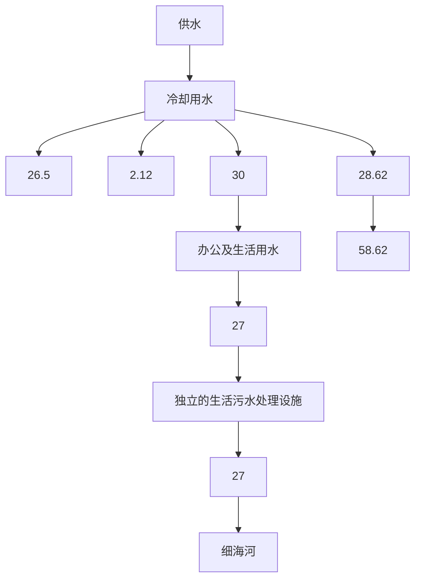
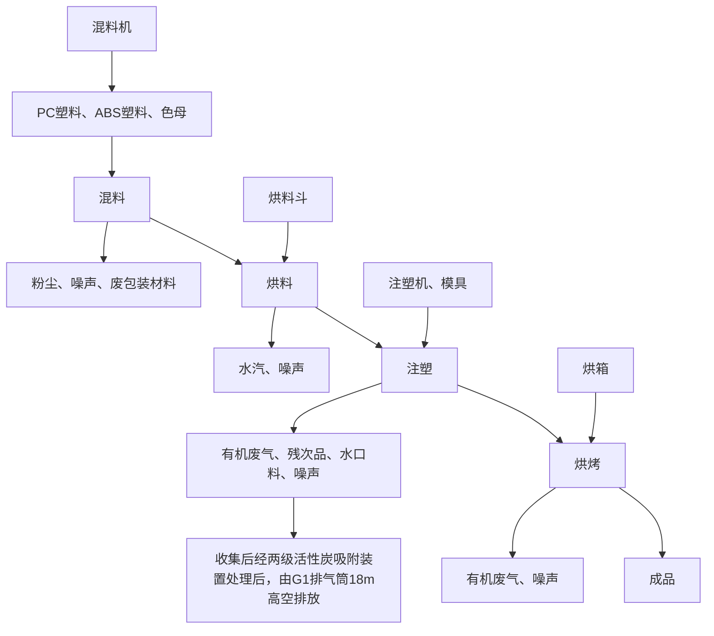

# 建设项目环境影响报告表

（污染影响类）

项目名称：佛山市晋塑城塑料制品有限公司新建项目建设单位（盖章）：佛山市晋塑城塑料制品有限公司编制日期： 2021年 3月

中华人民共和国生态环境部制

## 一、建设项目基本情况

<table><tr><td>建设项目名称</td><td colspan="3">佛山市晋塑城塑料制品有限公司新建项目</td></tr><tr><td>项目代码</td><td colspan="3">无</td></tr><tr><td>建设单位联系人</td><td>陈**</td><td>联系方式</td><td>1392322****</td></tr><tr><td>建设地点</td><td colspan="3">广东省佛山市顺德区乐从镇良村工业区北区6号之二</td></tr><tr><td>地理坐标</td><td colspan="3">中心位置坐标(113°8'42.235",22°55'52.901")</td></tr><tr><td>国民经济行业类别</td><td>C2929 塑料零件及其他塑料制品制造</td><td>建设项目行业类别</td><td>二十六、橡胶和塑料制品业,53-塑料制品业-其他</td></tr><tr><td>建设性质</td><td>☑新建(迁建)□改建□扩建□技术改造</td><td>建设项目申报情形</td><td>☑首次申报项目□不予批准后再次申报项目□超五年重新审核项目□重大变动重新报批项目</td></tr><tr><td>项目审批(核准/备案)部门(选填)</td><td>/</td><td>项目审批(核准/备案)文号(选填)</td><td>/</td></tr><tr><td>总投资(万元)</td><td>20</td><td>环保投资(万元)</td><td>5</td></tr><tr><td>环保投资占比(%)</td><td>25</td><td>施工工期</td><td>1个月</td></tr><tr><td>是否开工建设</td><td>☑否□是:____</td><td>用地(用海)面积(m2)</td><td>250</td></tr><tr><td>专项评价设置情况</td><td colspan="3">无</td></tr><tr><td>规划情况</td><td colspan="3">1、《顺德区产业发展保护区规划(2017-2035)》,佛山市顺德区人民政府(2017年12月29日)。</td></tr><tr><td>规划环境影响评价情况</td><td colspan="3">无</td></tr><tr><td>规划及规划环境影响评价符合性分析其他符合性分析</td><td colspan="3">项目位于广东省佛山市顺德区乐从镇良村工业区北区6号之二,属于《顺德区产业发展保护区规划(2017-2035)》中乐从片区划定的工业产保区,编号LC7、乐从镇良村产业集聚区,项目选址用地场所为工业用地。本项目主要从事塑料制品制造,项目所在地为工业用地,因此项目选址合理合法,使用功能符合用地要求。1、“三线一单”符合性分析1生态保护红线根据《佛山市顺德区生态保护红线规划(2014-2025年)》的图3生态保护红线单元可知(详见附图6),本项目不在生态保护红线范围内,故本项目的建设符合生态保护红线的要求。2环境质量底线本项目所在地声环境质量能满足相应的标准要求,属于达标区;本项目纳污水体地表水环境满足相应标准的要求,属于达标区;本项目所在区域大气环境能满足相应的标准要求,属于达标区。3资源利用上线本项目营运过程中消耗一定量的电能、水资源,项目资源消耗量相对区域资料利用总量较少,符合资源利用上限的要求。4环保准入清单根据国家《产业结构调整指导目录》(2019年本)、《市场准入负面清单》(2020年版),项目不属于上述目录所列的鼓励类、限制类和禁止(淘汰)类项目,属于允许类,本项目不使用淘汰落后的工艺和设备,生产设备和生产技术均符合产业政策要求。2、环境功能区划符合性分析项目纳污水体为细海河,根据《佛山市主干河涌2020年1-12月水质监测情况(第三批95条)》,细海河属于V类功能区,执行《地表水环境质量标准》(GB3838-2002)V类标准。项目生活污水近期经独立生活污水处理设施处理达标后排入细海河,对水环境影响较小,因此本项目的建设符合水环境功能区要求。根据《关于调整顺德区环境空气质量功能区划的复函》(佛府办函[2014]494号),所在区域空气环境功能区划为二类区,执</td></tr></table>

行《环境空气质量标准》（GB3095-2012）及其2018年修改单二级标准。本项目产生的废气均可达标排放，对区域环境空气质量影响较小，因此本项目的建设符合其大气功能要求。

根据《关于印发佛山市声功能区划分方案的通知》（佛府函[2015]72号），项目所在区域声环境功能区规划为2类区，执行《声环境质量标准》（GB3096-2008）中的2类标准。本项目产生的噪声经治理措施处理后，项目厂界噪声可达《工厂企业厂界环境噪声排放标准》（GB12348-2008）中的2类标准。因此本项目的建设符合区域对声环境功能要求。

项目选址周围无国家、省、市、区重点保护的文物、古迹、无名胜风景区、自然保护区等，选址符合环境功能区划的要求。

项目废（污）水、废气、噪声和固体废物通过采取评价中提出的治理措施进行有效治理后，不会改变区域环境功能。则该项目的运营与环境功能区划相符合。

## 3、与有机污染物治理政策相符性分析

本项目有机污染物治理政策的相符性分析见下表。

表 1-1 项目与有机污染物治理政策的相符性

<table><tr><td>序号</td><td>政策要求</td><td>工程内容</td><td>符合性</td></tr><tr><td colspan="4">1.《广东省挥发性有机物(VOCs)整治与减排工作方案(2018-2020年)》</td></tr><tr><td>1.1</td><td>全面推进石油炼制与石油化工、医药、合成树脂、橡胶和塑料制品制造、涂料/油墨/颜料制造等化工行业VOCs减排,通过源头预防、过程控制、末端治理等综合措施,确保实现达标排放。</td><td>本项目为新建塑料制品制造项目,本项目有机废气收集效率高达90%,且采用“两级活性炭吸附”治理技术,确保有机废气达标排放。</td><td>符合</td></tr><tr><td colspan="4">2.新《广东省大气污染防治条例》(2018年11月29日修订)</td></tr><tr><td>2.1</td><td>新建、改建、扩建排放挥发性有机物的建设项目,应当使用污染防治先进可行技术</td><td>非甲烷总烃收集后经“两级活性炭吸附”处理后达标排放</td><td>符合</td></tr><tr><td>2.2</td><td>珠江三角洲区域禁止新建、扩建国家规划外的钢铁、原油加工、乙烯生产、造纸、水泥、平板玻璃、除特种陶瓷以外的陶瓷、有色金属冶炼等大气重污染项目</td><td>本项目为塑料制品制造行业,不在珠江三角洲区域禁止新建的大气重污染项目范围内</td><td>符合</td></tr></table>

<table><tr><td rowspan="11"></td><td colspan="4">3.《“十三五”挥发性有机物污染防治工作方案》(环大气[2017]121号)</td></tr><tr><td>3.1</td><td>加强废气收集与处理,有机废气收集效率不低于80%</td><td>有机废气产生工序安装了废气收集装置,收集效率达90%以上</td><td>符合</td></tr><tr><td colspan="4">4.《挥发性有机物无组织排放控制标准》(GB37822-2019)</td></tr><tr><td>4.1</td><td>VOCs废气收集处理系统应与生产工艺设备同步运行,废气收集系统的输送管道应密闭</td><td>项目废气处理装置与生产工艺设备同步运行,废气收集管道密闭</td><td>符合</td></tr><tr><td>4.2</td><td>企业边界及周边VOCs监控要求执行GB16297或相关行业排放标准的规定。企业应按照有关法律、《环境监测管理办法》和HJ819等规定,建立企业监测制度,制订监测方案,对污染物排放状况及对周边环境质量的影响开展自行监测,保存原始监测记录,并公布监测结果。</td><td>企业设置环境监测计划,项目建设完成后根据《排污单位自行监测技术指南总则》(HJ819-2017)要求委托有资质的单位对废气污染源进行日常例行监测。</td><td>符合</td></tr><tr><td colspan="4">5.《重点行业挥发性有机物综合治理方案》</td></tr><tr><td>5.1</td><td>加强制药、农药、涂料、油墨、胶粘剂、橡胶和塑料制品等行业VOCs治理力度。重点提高涉VOCs排放主要工序密闭化水平,加强无组织排放收集</td><td>注塑、烘烤工序为项目VOCs排放主要工序,VOCs采取两级活性炭吸附处理后经18米排气筒G1高空排放;</td><td>符合</td></tr><tr><td colspan="4">6.《关于珠江三角洲地区严格控制工业企业挥发性有机物( $VOC_s$ )排放的意见》</td></tr><tr><td>6.1</td><td>强化化学品/医药/化学纤维/橡胶/塑料制造业、涂料/油漆/油墨制造业等典型高VOCs排放企业的清洁生产和VOCs排放治理监管工作,采取切实有效方法保障工业有机溶剂原辅材料和产品密闭储存以及排放VOCs生产工序在固定车间内进行,监督有机废气排放企业安装有机废气回收净化设施</td><td>项目注塑、烘烤工序全部都在生产车间内进行生产,有机废气采取两级活性炭吸附处理后经18米排气筒G1高空排放</td><td>符合</td></tr><tr><td colspan="4">7.《广东省打赢蓝天保卫战实施方案(2018-2020年)》</td></tr><tr><td>7.1</td><td>珠三角地区禁止新建生产和使用高VOCs含量溶剂型涂料、油墨、胶粘剂、清洗剂等项目(共性工厂除外)</td><td>项目为塑料制品制造行业,不属于生产和使用高VOCs含量溶剂型涂料、油墨、胶粘剂、清洗剂等项目</td><td>符合</td></tr></table>

## 二、建设项目工程分析

## 1、项目组成及工程内容

本项目占地 $2 5 0 \mathrm { m } ^ { 2 }$ ，建筑面积 250m2 。

项目具体工程组成见下表：

表 2-1 项目工程组成情况一览表

<table><tr><td>项目</td><td>内容</td><td>规模</td><td>用途</td></tr><tr><td rowspan="4">主体工程</td><td>注塑区</td><td>共120m2</td><td>用注塑生产加工</td></tr><tr><td>破碎区</td><td>共10m2</td><td>用于边角料、残次品回收加工</td></tr><tr><td>混料区</td><td>共10m2</td><td>原料混合加工</td></tr><tr><td>烘烤区</td><td>共10m2</td><td>用于消除产品应力</td></tr><tr><td>辅助工程</td><td>办公区</td><td>共15m2</td><td>供日常办公与员工休息使用</td></tr><tr><td rowspan="2">仓储工程</td><td>成品区</td><td>共30m2</td><td>用于储存成品</td></tr><tr><td>原料区</td><td>共30m2</td><td>用于储存原材料</td></tr><tr><td rowspan="2">公用工程</td><td>配电系统</td><td>/</td><td>供电来源为市政供电,供应生产和办公用电,不配备发电机</td></tr><tr><td>给排水系统</td><td>/</td><td>供水来源为市政自来水;生活污水经独立的生活污水处理设施处理后排至细海河</td></tr><tr><td rowspan="5">环保工程</td><td>通风换气系统</td><td>/</td><td>用于加快车间废气无组织排放</td></tr><tr><td>废气处理设施</td><td>1套</td><td>有机废气经收集后由两级活性炭吸附处理后,经18m排气筒G1高排</td></tr><tr><td>生活污水处理设施</td><td>1套</td><td>独立的生活污水处理设施</td></tr><tr><td>噪声治理设施</td><td>1套</td><td>安装减震基座、厂房隔声</td></tr><tr><td>固废治理</td><td>/</td><td>固体废物分类收集:生活垃圾交由环卫部门集中处理,一般固废收集后交给有能力单位处理,危险废物分类收集后暂存,定期交有资质单位处置</td></tr></table>

注：其余面积为车间通道。

## 2、主要生产产品、原辅料、设备以及能耗情况

（1）产品及产量见下表。

表 2-2 项目产品及产量一览表

<table><tr><td>序号</td><td>产品名称</td><td>单位</td><td>数量</td></tr><tr><td>1</td><td>塑料配件</td><td>万件/a</td><td>300</td></tr></table>

## （2）主要原辅材料、能源消耗情况见下表。

表 2-3 项目主要原辅材料及能源消耗情况一览表

<table><tr><td>类别</td><td>名称</td><td>单位</td><td>数量</td><td>最大储存量</td><td>原料形态</td><td>规格及包装形式</td><td>储存位置</td></tr><tr><td rowspan="4">原辅料</td><td>ABS 塑料</td><td>t/a</td><td>100</td><td>10</td><td>颗粒状</td><td>外购,袋装,25kg/袋</td><td>原料区</td></tr><tr><td>PC 塑料</td><td>t/a</td><td>100</td><td>10</td><td>颗粒状</td><td>外购,袋装,25kg/袋</td><td>原料区</td></tr><tr><td>色母</td><td>t/a</td><td>0.5</td><td>0.5</td><td>颗粒状</td><td>外购,袋装,25kg/袋</td><td>原料区</td></tr><tr><td>机油</td><td>t/a</td><td>0.04</td><td>0.04</td><td>液态</td><td>外购,桶装,25kg/桶</td><td>原料区</td></tr><tr><td>能源</td><td>电</td><td>万 kW·h/a</td><td>8</td><td>/</td><td>/</td><td>/</td><td>/</td></tr><tr><td rowspan="2">水</td><td>生活用水</td><td>m3/a</td><td>30</td><td>/</td><td>/</td><td>/</td><td>/</td></tr><tr><td>生产用水</td><td>m3/a</td><td>28.62</td><td>/</td><td>/</td><td>/</td><td>/</td></tr></table>

项目大气污染物排放主要来自 ABS 塑料、PC 塑料在注塑、烘烤工序生产过程中，因裂解产生的非甲烷总烃，ABS 塑料、PC 塑料成分组成、理化性质详见下表。

表 2-4 原辅材料性质一览表

<table><tr><td>名称</td><td>理化性质</td></tr><tr><td>ABS塑料</td><td>是丙烯腈(A)、丁二烯(B)、苯乙烯(S)三种单体的三元共聚物,三种单体相对含量可任意变化,制成各种树脂。ABS兼有三种组元的共同性能,A使其耐化学腐蚀、耐热,并有一定的表面硬度,B使其具有高弹性和韧性,S使其具有热塑性塑料的加工成型特性并改善电性能。因此ABS塑料是一种原料易得、综合性能良好、价格便宜、用途广泛的“坚韧、质硬、刚性”材料。ABS塑料在机械、电气、纺织、汽车、飞机、轮船等制造工业及化工中获得了广泛的应用。</td></tr><tr><td>PC塑料</td><td>聚碳酸酯是一种强韧的热塑性树脂,其名称来源于其内部的CO3基团。可由双酚A和氧氯化碳(COCl2)合成。现较多使用的方法为熔融酯交换法(双酚A和碳酸二苯酯通过酯交换和缩聚反应合成);聚碳酸酯耐弱酸,耐弱碱,耐中性油,聚碳酸酯不耐紫外光,不耐强碱。密度:1.18-1.22 g/cm3线膨胀率:3.8×10-5cm/°C,热变形温度:135°C,低温-45°C,聚碳酸酯无色透明,耐热,抗冲击,阻燃BI级,在普通使用温度内都有良好的机械性能。</td></tr><tr><td>色母</td><td>色母的全称叫色母粒,也叫色种,是一种新型高分子材料专用着色剂,亦称颜料制备物。色母主要用在塑料上。色母由颜料或染料、载体和添加剂三种基本要素所组成,是把超常量的颜料均匀载附于树脂之中而制得的聚集体,可称颜料浓缩物,所以它的着色力高于颜料本身。加工时用少量色母料和未着色树脂掺混,就可达到设计颜料浓度的着色树脂或制品;专用色母一般选择与制品树脂相同的树脂作为载体,两者的相容性最好,但同时也要考虑载体的流动性。</td></tr></table>

## （3）主要设备及规模

表 2-5 项目主要设备配置情况一览表

<table><tr><td>序号</td><td>名称</td><td>数量</td><td>单位</td><td>(型号/尺寸)用途</td><td>摆放位置</td></tr><tr><td>1</td><td>注塑机</td><td>3</td><td>台</td><td>(120t)注塑件加工</td><td>注塑区</td></tr><tr><td>2</td><td>注塑机</td><td>2</td><td>台</td><td>(200t)注塑件加工</td><td>注塑区</td></tr><tr><td>3</td><td>注塑机</td><td>1</td><td>台</td><td>(250t)注塑件加工</td><td>注塑区</td></tr><tr><td>4</td><td>破碎机</td><td>2</td><td>台</td><td>残次品、边角料回收</td><td>破碎区</td></tr><tr><td>5</td><td>混料机</td><td>2</td><td>台</td><td>原辅料混合加工</td><td>混料区</td></tr><tr><td>6</td><td>冷却水塔</td><td>1</td><td>个</td><td>(容量 $2.65m^{3}$ )储存冷却水</td><td>生产车间</td></tr><tr><td>7</td><td>模具</td><td>6</td><td>套</td><td>注塑件加工</td><td>注塑区</td></tr><tr><td>8</td><td>烘料斗</td><td>8</td><td>个</td><td>原料烘干</td><td>注塑区</td></tr><tr><td>9</td><td>烘箱</td><td>2</td><td>台</td><td>(2m*2m*2m)消除产品应力</td><td>烘烤区</td></tr><tr><td>10</td><td>空压机</td><td>2</td><td>台</td><td>/</td><td>生产车间</td></tr></table>

注：①项目设备均使用电能；②项目所使用设备无国家明令淘汰设备。

## 3、水平衡分析

本项目运营期用水主要为员工生活用水员工日常生活用水、设备冷却水，由市政供水管网提供。

◇生活用水

项目员工 3 人，员工不在厂区内食宿，参照《广东省用水定额》（DB44T1461-2014）用水系数，按 40L/人·天计算，生活用水为 30m3/a（年工作日以250天计）。

◇设备冷却用水

根据建设单位提供资料，冷却水塔（2.65m3）蓄水量为其容积的 80%；冷却水循环使用不外排，需定时补充蒸发等损耗，年用水量为 28.62m3。

flowchart

图 2-1 项目水平衡图（m3/a）

## 4、劳动定员及工作制度

项目定员3人，厂区不设置食堂和宿舍。项目年工作日为 250 天，一班制，每天工作 8 个小时（上午 8:00～12:00，下午 14:00～18:00）。

## 5、厂区平面布置

项目主要有注塑区、混料区、破碎区、成品区、原料区、烘烤区、办公区等功能区；其中注塑区位于项目中心区域；混料区、破碎区、办公区位于项目东侧，烘烤区位于项目南侧；成品区位于项目北侧；原料区位于项目西侧。详见附图二。

## 1、塑料配件工艺流程

flowchart

图 2-2 项目塑料配件生产工艺及产污流程图

<table><tr><td></td><td>工艺说明:混料:根据工艺要求,将不同种塑料、色母按照一定的比例进行投料混合。烘料:根据原料湿度不同,在进行注塑工序前,需将原料表面水分烘干,烘料斗工作温度为60°C,工作温度较低,该工序基本无有机废气产生。注塑:等原料烘干完成后,原料直接进入进入注塑机(工作温度230°C)加工后得到塑料配件。烘烤:根据产品需求,注塑完成后的塑料配件需进行烘烤,消除产品应力,提供产品性能,烘箱工作温度为120°C。(2)回收工艺流程图2-3 项目回收工艺流程图工艺流程说明:将生产工序中产生的塑料水口料、残次品进行破碎,然后包装存放待用或直接回用到注塑工序中。</td></tr><tr><td>与项目有关的原有环境污染问题</td><td>本项目位于广东省佛山市顺德区乐从镇良村工业区北区6号之二,为新建项目。所在区域为工业区,项目所在地周围无重污染的大型企业或重工业,存在主要污染物为附近企业在生产运营过程中产生的废气、噪声、废水、固废等以及附近道路车辆行驶噪声和扬尘等。</td></tr></table>

## 三、区域环境质量现状、环境保护目标及评价标准

<table><tr><td rowspan="7">区域环境质量现状</td><td colspan="8">1、大气环境质量现状1常规污染物为评价本项目所在区域的环境空气质量现状,引用佛山市生态环境局发布2020年佛山市环境质量状况中的数据和结论如下:2020年度佛山市二氧化硫( $SO_2$ )、二氧化氮( $NO_2$ )、可吸入颗粒物( $PM_{10}$ )、细颗粒物( $PM_{2.5}$ )年均浓度分别为7、31、43、22微克/立方米,一氧化碳(CO)日平均浓度的第95百分位数为1.0毫克/立方米,臭氧( $O_3$ )日最大8小时滑动平均浓度的第90百分位数为154微克/立方米。按照空气质量指数(AQI)评价,全市优良天数占全年有效天数的91.0%。与上年相比,全市六项污染指标浓度均有所下降。表3-1 2020年度空气质量情况与去年情况</td></tr><tr><td>时段</td><td> $SO_2$ 平均浓度</td><td> $NO_2$ 平均浓度</td><td> $PM_{10}$ 平均浓度</td><td> $PM_{2.5}$ 平均浓度</td><td>CO浓度第95百分位数</td><td> $O_3$ -8h浓度第90百分位数</td><td>AQI达标天数比例</td></tr><tr><td>2020年</td><td>7</td><td>31</td><td>43</td><td>22</td><td>1.0</td><td>154</td><td>91.0%</td></tr><tr><td>2019年</td><td>9</td><td>41</td><td>56</td><td>30</td><td>1.3</td><td>185</td><td>78.9%</td></tr><tr><td>年二级标准</td><td>60</td><td>40</td><td>70</td><td>35</td><td>4.0</td><td>160</td><td>-</td></tr><tr><td colspan="8">注:1、 $SO_2$ 、 $NO_2$ 、PM10、 $O_3$ -8h和 $PM_{2.5}$ 浓度单位为 $\mu g/m^3$ ;CO浓度单位为 $mg/m^3$ ;2、数据按照《关于调整城市环境空气质量监测数据有效性统计方法的通知》(总站气字[2016]276号)中的新规定进行统计。</td></tr><tr><td colspan="8">根据上述的数据和结论,2020年项目所在区域大气环境判断为达标区。2其他污染物本项目排放的其他污染物为非甲烷总烃和TSP。为评价本项目所在区域的TSP和非甲烷总烃的环境质量现状,引用佛山市顺德区振延环境检测有限公司出具的《广东德尔玛科技股份有限公司环境现状评价检测报告》(编号:R2007C002)中的TSP和非甲烷总烃的环境空气质量现状监测数据进行评价,其监测点位于项目东南面2730m处,监测时段为2020年07月04日-2020年07月10日。其监测数据属于建设项目周边5千米范围内近3年的现有监测数据,对项目所在区域的TSP和非甲烷总烃环境质量现状评价具有代表性。</td></tr></table>

监测及统计结果详见下表，监测点位见下表。

表 3-2 其他污染物补充监测点位基本信息

<table><tr><td>监测点名称</td><td>监测因子</td><td>监测时段</td><td>相对厂址方位</td><td>相对厂界距离</td></tr><tr><td rowspan="2">1#厂区东南面监控点</td><td>非甲烷总烃</td><td rowspan="2">2020.07.04-2020.07.10</td><td rowspan="2">东南</td><td rowspan="2">2730m</td></tr><tr><td>TSP</td></tr></table>

表 3-3 其他污染物环境质量现状（监测结果）表

<table><tr><td>监测点名称</td><td>污染物</td><td>平均时间</td><td>评价标准/ $(\mu g/m^{3})$ </td><td>监测浓度范围/ $(mg/m^{3})$ </td><td>最大浓度占标率/%</td><td>超标率/%</td><td>达标情况</td></tr><tr><td rowspan="2">1#厂区东南面监控点</td><td>非甲烷总烃</td><td>1h</td><td>2000</td><td>1.21~1.81</td><td>0.09</td><td>/</td><td>达标</td></tr><tr><td>TSP</td><td>24h</td><td>300</td><td>0.117~0.128</td><td>0.04</td><td>/</td><td>达标</td></tr></table>

上表监测数据统计结果显示，项目周边环境中的TSP 的24小时平均浓度低于《环境空气质量标准》（GB3095-2012 及其2018年修改单）中的二级标准；非甲烷总烃的1 小时平均浓度低于《大气污染物综合排放标准详解》（国家环境保护局科技标准司，中国环境科学出版社，1997年10月）浓度限值。总体而言，项目周边环境空气质量良好。

## 2、地表水环境质量现状

本项目营运期生活污水经独立生活污水处理设施处理后排入附近内河涌后汇入细海河。细海河属于Ⅴ类水体，执行《地表水环境质量标准》（GB3838-2002）中的Ⅴ类标准。

为评价细海河水质，引用佛山市生态环境局网站公布的《佛山市主干河涌 2020 年 1-12 月水质监测情况（第三批95 条）》中的监测数据进行评价，监测结果及评价见下图。

<table><tr><td rowspan="2">序号</td><td rowspan="2">区域</td><td rowspan="2">所属镇街Y0</td><td rowspan="2">河涌名称Y0</td><td rowspan="2">区级河长</td><td rowspan="2">镇级河长</td><td rowspan="2">2020年水质目标</td><td colspan="4">水质现状</td></tr><tr><td>达标情</td><td>超标因子（倍数）</td><td>综合污染指数</td><td>综合污染指数同比变化</td></tr><tr><td>64
101
102</td><td>60</td><td>顺德区</td><td>北滘</td><td>细海河</td><td>王崇曦（北滘镇镇长）</td><td>V类</td><td>达标</td><td></td><td>0.32</td><td>-33.39%</td></tr></table>

图 3-1 细海河 2020 年 1-12 月水质监测情况

从监测结果可知，细海河 2020 年 1-12 月水质监测数据全部达到《地表水环境质量标准》（GB3838-2002）Ⅴ类标准。

## 3、声环境质量现状

根据《佛山市人民政府关于印发佛山市声环境功能区划分方案的通知》（佛府函〔2015〕72号）及《声环境功能区划分技术规范》（GB/T15190-2014）的有关规定，项目所在地属于 2 类声环境功能区，厂界执行《声环境质量标准》（GB3096-2008）中的 2 类标准：昼间≤60dB(A)、夜间≤50dB(A)。

为了解项目所在地噪声环境质量现状，在项目厂界外 1 米布设噪声监测点。其中，项目南、北面都紧邻其他工业厂房，因此，本次监测只在项目东、西面各设 1 个噪声监测点。监测时间：2021 年1 月21 日-22 日，监测频次及时段：昼间（6:00\~22:00）、夜间（22:00\~6:00）各一次。监测仪器采用 AWA6228积分声级计，以等效连续 A 声级 Leq 作为评价量，声级计在测试前后用标准发生源进行校准，测量前后仪器的灵敏度相差不大于0.5dB，以确保监测仪器的有效性，噪声监测方法严格按《声环境质量标准》（GB3096-2008）相关规定进行，监测结果真实有效，监测结果统计见下表。

表 3-4 环境噪声现状监测结果统计表 单位：dB（A）

<table><tr><td rowspan="2">编号</td><td rowspan="2">测点位置</td><td colspan="2">1月21日</td><td colspan="2">1月22日</td><td rowspan="2">执行标准</td></tr><tr><td>昼间</td><td>夜间</td><td>昼间</td><td>夜间</td></tr><tr><td>N1</td><td>项目东侧厂界外1m</td><td>56.1</td><td>45.3</td><td>55.8</td><td>45.6</td><td rowspan="2">GB3096-2008中2类标准昼间:≤60夜间:≤50</td></tr><tr><td>N2</td><td>项目西侧厂界外1m</td><td>56.6</td><td>45.6</td><td>56.0</td><td>46.1</td></tr><tr><td colspan="7">注:项目南、北面紧靠其他工业厂房,无法监测。</td></tr></table>

从监测结果可知，项目周边噪声均能够满足功能区划的《声环境质量标准》（GB3096-2008）2 类标准要求，项目所在地噪声达到区域声环境功能要求。

## 4、生态环境

本项目为新建项目，新增建设用地，但用地范围内不含有生态环境保护目标，故无需进行生态现状调查。

<table><tr><td></td><td colspan="8">4、电磁辐射新建或改建、扩建广播电台、差转台、电视塔台、卫星地球上行站、雷达等电磁辐射类项目,应根据相关技术导则对项目电磁辐射现状开展监测与评价;本项目属于塑料制品业,不属于上述行业,无需开展电磁辐射现状监测与评价。5、地下水环境质量现状依据《环境影响评价技术导则 地下水环境》(HJ610-2016)附录A地下水环境影响评价行业分类表,本项目属于N轻工中的116、塑料制品制造--其他,地下水环境影响评价项目类别为IV类项目,不需开展地下水环境影响评价。6、土壤环境质量现状根据《环境影响评价技术导则 土壤环境(试行)》(HJ 964-2018)附录A表A.1土壤环境影响评价项目类别,本项目属于“其他行业”中的“全部”,土壤环境影响评价项目类别为IV类建设项目,项目可不开展土壤环境影响评价。</td></tr><tr><td>环境保护目标</td><td colspan="8">本项目的主要环境保护目标是保护好项目所在地周边评价区域环境质量,采取有效的环保措施,使该项目在建设开展和生产运行中能够保持区域原有的环境空气质量、地下水环境质量、声环境质量、生态环境。1、环境空气保护目标:环境空气保护目标是使位于项目东北面420米处沙尾坊、西南面490米处的良村(居住区)及项目所在区域环境空气质量,在本项目建设后不受明显影响,本项目所在区域环境空气质量执行《环境空气质量标准》(GB3095-2012)及2018年修改单的二级标准。2、地下水环境保护目标:项目厂界外500米范围内无地下水集中式饮用水水源和热水、矿泉水、温泉等特殊地下水资源。3、声环境保护目标:声环境保护目标是确保该建设项目建成后其周围的地区有一个安静、舒适的工作和生活环境,使项目四周的声环境质量不因本项目的运行而受到不良影响。确保项目周边环境质量符合《声环境质量标准》(GB3096-2008)中的2类标准要求。项目厂界外50米范围内无声环境保护目标。4、生态环境保护目标:本项目新增建设用地,但用地范围内不含有生态环境保护目标。</td></tr><tr><td rowspan="4">污染物排放控制标准</td><td colspan="8">1、水污染物排放标准生活污水经过独立的生活污水处理设施处理达标后排入细海河。排污口水质执行《城镇污水处理厂污染物排放标准》(GB18918-2002)中的二级标准。污染物的排放限值如下表。表3-5 水污染物排放浓度限值 pH无量纲,其余mg/L</td></tr><tr><td>项目</td><td>pH</td><td> $COD_{cr}$ </td><td> $NH_3-N$ </td><td> $BOD_5$ </td><td>SS</td><td>石油类</td><td>总磷</td></tr><tr><td>二级标准</td><td>6~9</td><td>≤100</td><td>≤25</td><td>≤30</td><td>≤30</td><td>≤5.0</td><td>≤3.0</td></tr><tr><td colspan="8">2、大气污染物排放标准本项目破碎回收工序产生的塑料粉尘、投料、混料粉尘以及注塑、烘烤工序产生的有机废气执行《合成树脂工业污染物排放标准》(GB31572-2015)中表4和表9企业边界大气污染物浓度限值;本项目厂房只设一个生产车间,生产车间东、南、西、北面即为项目厂界范围。按照《挥发性有机物无组织排放控制标准》表A.1厂区内非甲烷总烃无组织排放限值中特别排放限值( $6mg/m^3$ ),无组织排放监控位置为厂房外设置监控点,与无组织厂界监控点重合。本项目非甲烷总烃从严执行《合成树脂工业污染物排放标准》(GB31572-2015)中表9企业边界大气污染物浓度限值(厂界浓度≤ $4.0mg/m^3$ ),严于《挥发性有机物无组织排放控制标准》(GB37822-2019)表A.1厂区内VOCs无组织排放限值中特别排放限值( $6mg/m^3$ ),详见下列表格。表3-6 项目大气污染物执行的排放标准</td></tr><tr><td rowspan="4"></td><td>污染物</td><td>G1排放筒</td><td>最高允许排放浓度(mg/m3)</td><td>最高允许排放速率*(kg/h)</td><td>无组织排放监控点浓度限值(mg/m3)</td><td colspan="3">标准</td></tr><tr><td>颗粒物</td><td>/</td><td>/</td><td>/</td><td>1.0</td><td colspan="3">《合成树脂工业污染物排放标准》(GB31572-2015)</td></tr><tr><td>非甲烷总烃</td><td>18m</td><td>100</td><td>/</td><td>4.0</td><td colspan="3">《合成树脂工业污染物排放标准》(GB31572-2015)</td></tr><tr><td colspan="8">3、噪声排放标准项目厂界噪声执行《工业企业厂界环境噪声排放标准》(GB12348-2008)中的2类标准:昼间≤60dB(A)、夜间≤50dB(A)。4、固体废物固体废物管理应遵照《中华人民共和国固体废物污染环境防治法》(2020年修正)和《广东省固体废物污染环境防治条例》(2018年修订),《国家危险废物名录》(2021年版)、《危险废物贮存污染控制标准》(GB18597-2001)及其修改单、《固体废物鉴别标准通则》(GB34330-2017)以及2021年7月1日前执行《一般工业固体废物贮存、处置场污染控制标准》(GB18599-2001)及其修改单(2013年),2021年7月1日起执行《一般工业固体废物贮存和填埋污染控制标准》(GB18599-2020)。</td></tr><tr><td>总量控制指标</td><td colspan="8">本项目非甲烷总烃排放量为0.1756t/a,其中有组织排放量为0.1126t/a,无组织排放量为0.063t/a;项目挥发性有机废气(非甲烷总烃)总量(0.1126t/a)在镇街总量中列支。</td></tr></table>

## 四、主要环境影响和保护措施

<table><tr><td>施工期环境保护措施</td><td>本项目租用已建的工业厂房进行生产,施工期仅进行设备的安装,主要为噪声污染,对周边环境的影响较小,且随着施工期的结束而消失,因此,本评价不再分析施工期的环境影响。</td></tr><tr><td>运营期环境影响和保护措施</td><td>1、大气污染源1有机废气◇注塑工序项目PC、ABS塑料原料在注塑过程中产生有机废气,主要污染物为非甲烷总烃,参照《上海工业企业挥发性有机物排放量通用计算方法》(试行)中“表1-4主要塑料制品制造工艺产污系数-射出成型制造”,项目非甲烷总烃的产生系数为2.885kg/t塑料,项目项目塑料用量共为200t/a,色母0.5t/a;根据建设单位提供资料,用于破碎工序回收利用的塑料水口料、残次品(破碎后重用于注塑工序)约为10t/a,项目注塑塑料总用量为210.5t/a,则非甲烷总烃产生量约为0.607t/a。项目年工作250天,每天工作8小时,非甲烷总烃产生速率为0.304kg/h。◇烘烤工序项目烘箱在运行过程会产生少量非甲烷总烃,PC、ABS塑料原料熔点较高,烘箱工作温度较低(120°C)。由于烘烤工序工作温度较低,参照我国《塑料加工手册》和美国国家环保局编制的《工业污染源调查与研究》等相关资料,有机废气产生量基本在原料的0.01%~0.04%之间,项目烘烤工序的非甲烷总烃产生量按原料0.01%计,非甲烷总烃产生量约为0.02t/a。项目年工作250天,每天工作8小时,非甲烷总烃产生速率为0.01kg/h。◇废气处理设施项目拟在注塑机上方设置集气罩、在烤箱密闭收集非甲烷总烃,收集后通过“两级活性炭吸附装置”处理后经G1排气筒(18m)高空排放,收集效率按90%计,废气污染治理设施处理工艺为《排污许可证申请与核发技术规范 橡胶和塑料制品工业》(HJ1122—2020)中的可行技术,依据《佛山市工</td></tr></table>

业污染源挥发性有机物（VOCs）排放与治理现场研究》，活性炭处理效率为50-90%，两级活性炭吸附综合处理效率按 80%计。风机风量计算详见表4-1，非甲烷总烃排放情况详见表 4-2。

## \*收集风量计算

按照《环境工程设计手册》中的有关公式，根据类似项目实际治理工程的情况以及结合本项目的设备规模，废气收集系统的控制风速在0.6m/s以上，以保证收集效果，按照以下经验公式计算得出注塑工序所需的风量见表 4-1。

$$
\mathrm{L} = 3 6 0 0 (5 \mathrm{X} ^ {2} + \mathrm{F}) * \mathrm{V} _ {\mathrm{X}}
$$

其中：X—集气罩至污染源的距离；F—集气罩口面积；VX—控制风速（取0.6m/s）。

根据《环境工程设计手册》（湖南科学技术出版社），烘烤工序密闭罩风量计算公式：

$$
\mathrm{L} = \mathrm{L} _ {1} + \mathrm{L} _ {2} = \mathrm{L} _ {1} + \mathrm{vF}
$$

L1=密闭罩容积×换气次数

其中：L—密闭罩排风量；L1—密闭罩的空气量；L2为由工作孔口和不严密缝隙吸入的空气量；F 为工作孔口和不严密缝隙总面积；v为工作孔口和不严密缝隙总面积吸入气流的速度，取 0.6m/s。换气60次/h。

表 4-1 项目废气收集风机风量估算一览表

<table><tr><td>排放口</td><td>工序</td><td>收集方式</td><td>数量</td><td>规格</td><td>集气罩高度</td><td>工作孔口和不严密缝隙总面积</td><td>所需风量L(m3/h)</td><td>风量合计(m3/h)</td></tr><tr><td rowspan="2">G1</td><td>注塑</td><td>集气罩</td><td>6</td><td>0.6m*0.4m</td><td>0.2m</td><td>/</td><td>5702.4</td><td rowspan="2">7051.2(建议风量8500)</td></tr><tr><td>烘烤</td><td>密闭收集</td><td>2</td><td>2m*2m*2m</td><td>/</td><td>0.09m2</td><td>1348.8</td></tr></table>

根据《吸附法工业有机废气治理技术规范》（HJ2026-2013）中的6.1.2要求，设计风量宜按照最大废气排放量的120%进行设计，考虑到收集管道和接口损失，则本项目设计风量应为8500m3 /h。废气收集效率约为90%（即剩余的10%通过车间内扩散，无组织排放），项目年工作250天，每天工作8小时，则废气污染物产排情况见下表。

表4-2 项目有机废气产生及排放情况

<table><tr><td rowspan="3">污染源</td><td rowspan="2">排气量</td><td rowspan="2">总产生量</td><td colspan="5">有组织</td><td colspan="2">无组织</td></tr><tr><td>产生量</td><td>产生浓度</td><td colspan="2">排放量</td><td>排放浓度</td><td colspan="2">排放量</td></tr><tr><td>m3/h</td><td>t/a</td><td>t/a</td><td>mg/m3</td><td>t/a</td><td>kg/h</td><td>mg/m3</td><td>t/a</td><td>kg/h</td></tr><tr><td>注塑</td><td rowspan="2">8500</td><td>0.607</td><td>0.546</td><td>32.14</td><td>0.109</td><td>0.0546</td><td>6.428</td><td>0.061</td><td>0.0305</td></tr><tr><td>烘烤</td><td>0.02</td><td>0.018</td><td>0.848</td><td>0.0036</td><td>0.0018</td><td>0.212</td><td>0.002</td><td>0.001</td></tr><tr><td colspan="2">合计</td><td>0.627</td><td>0.564</td><td>32.988</td><td>0.1126</td><td>0.0564</td><td>6.64</td><td>0.063</td><td>0.0315</td></tr><tr><td colspan="10">注:1收集效率按90%计,处理效率按80%计。2有机废气排放满足《合成树脂工业污染物排放标准》(GB31572-2015)中表4和表9企业边界大气污染物浓度限值。</td></tr></table>

表4-3 G1排气筒参数一览表

<table><tr><td rowspan="2">编号</td><td rowspan="2">名称</td><td colspan="2">排气筒坐标</td><td rowspan="2">排气筒高度/m</td><td rowspan="2">排气筒出口内径/m</td><td rowspan="2">烟气流速/m/s</td><td rowspan="2">烟气温度/°C</td><td rowspan="2">类型</td></tr><tr><td>E</td><td>N</td></tr><tr><td>G1</td><td>排气筒</td><td>113°8′41.936′′</td><td>22°55′53.036′′</td><td>18</td><td>0.5</td><td>12.02</td><td>40</td><td>一般排放口</td></tr></table>

◇非正常情况

非正常情况指生产过程中生产设备开停、检修、工艺设备运转异常等非正常工况下的污染物排放，以及污染物排放控制达不到应有效率等情况下的排放。本次评价废气非正常工况排放为主要考虑项目有机废气治理措施活性炭饱和状态下的排放，即去除效率为 0的排放。本项目废气非正常工况具体见下表。

表 4-4 非正常排放参数表

<table><tr><td>污染物</td><td>非正常排放速率/(kg/h)</td><td>非正常排放浓度(mg/m3)</td><td>单次持续时间/h</td><td>年发生频次/次</td><td>排放量(t/a)</td><td>措施</td></tr><tr><td>非甲烷总烃</td><td>0.282</td><td>32.988</td><td>2</td><td>4</td><td>2.256</td><td>做好设施日常维护工作定期更换活性炭</td></tr></table>

②颗粒物

◇塑料粉尘

根据建设提供资料，项目本项目在对注塑工序边角料、残次品进行破碎回收利用过程中会产生少量粉尘，污染因子为颗粒物，产生的塑料颗粒粒径较大，具有良好的沉降性，参照美国环保局《空气污染排放和控制手册》中表 5-15 数据，粉尘的产生系数为 2.5kg/t 塑料；项目塑料水口料、残次品产生量约为 10t/a，则粉尘产生量为 0.025t/a，根据建设单位提供资料，项目年工作 250 天，破碎工序每天工作4 小时，产生速率为0.025kg/h。

根据《未纳入排污许可管理行业适用的排污系数、物料衡算方法（试行）》（原环境保护部公告 2017年第81号）中“47锯材加工业”的系数，车间不装除尘设备的情况下，重力沉降法的效率约为85%，由于塑料颗粒物具有比重较大和易于沉降的特点，项目取塑料粉尘车间沉降系数约 90%可在操作区域附近沉降，沉降量为 0.0225t/a，沉降部分清理后作为一般固废，交给有能力的单位处理，只有约 10%扩散到大气中形成粉尘，扩散量 0.0025t/a。每天工作时间 4h，每年工作250 天，塑料粉尘扩散速率约为 0.0025kg/h，在车间无组织排放，通过加强车间通风换气，定期清理车间，塑料粉尘排放达到《合成树脂工业污染物排放标准》（GB31572-2015）中表9企业边界大气污染物浓度限值，对周边环境影响不大。

## ◇投料、混料粉尘

在投料过程中及混料加工过程中会产生少量粉尘，通过降低投料高度、对原料轻拿轻放及混料机在加料完成后，加盖密闭加工，且项目原料均为颗粒状，只有极少量粉尘扩散，在车间无组织排放，放达到《合成树脂工业污染物排放标准》（GB31572-2015）中表9 企业边界大气污染物浓度限值，对周边环境影响不大。

## ③大气污染物监测要求

表 4-5 营运期环境大气监测计划一览表

<table><tr><td>序号</td><td>监测点</td><td>监测点位</td><td>监测因子</td><td>监测频次</td><td>监测单位</td></tr><tr><td>一</td><td colspan="5">废气</td></tr><tr><td>1</td><td>G1 排气筒</td><td>排气筒采样口</td><td>非甲烷总烃</td><td>1 次/年度</td><td>有资质的监测单位监测</td></tr><tr><td>2</td><td>厂界</td><td>厂界上、下风向</td><td>颗粒物、非甲烷总烃</td><td>1 次/年度</td><td>有资质的监测单位监测</td></tr></table>

## ④大气环境影响

项目排放的大气污染物主要是颗粒物、非甲烷总烃，项目设置集气罩、密闭罩对非甲烷总烃收集，非甲烷总烃经收集后，经1 套“两级活性炭吸附”

装置处理后引至 G1 排气筒高空排放，根据上述分析，非甲烷总烃排气筒的排放浓度为 6.64mg/m3、排放速率为0.0564kg/h，排气筒非甲烷总烃排放达到《合成树脂工业污染物排放标准》（GB 31572-2015）表4中排放监控浓度限值。

项目非甲烷总烃未收集部分以无组织形式排放到车间外，非甲烷总烃每小时最大无组织排放速率约为 0.0315kg/h，通过加强车间通风换气，无组织非甲烷总烃排放达到《合成树脂工业污染物排放标准》（GB31572-2015）中表 9企业边界大气污染物浓度限值。

通过加强车间通风换气，定期清理车间，项目颗粒物排放达到《合成树脂工业污染物排放标准》（GB31572-2015）中表9 企业边界大气污染物浓度限值。

项目所在行政区环境空气质量为达标区域，项目排放的大气污染物主要是颗粒物、非甲烷总烃，项目各污染物排放均达到相应排放标准要求，确保位于项目东北面 420 米处沙尾坊、西南面 490米处的良村（居住区）及项目所在区域环境空气质量，在本项目建成后不受明显影响，因此，项目大气污染物排放对周边大气环境影响不大。

## 2、水污染源

## ①冷却循环用水

项目注塑机在运行时需采用自来水进行冷却，冷却水循环使用不外排，需定时补充蒸发等损耗（年工作250天）。

表 4-6 项目冷却水情况一览表

<table><tr><td>位置</td><td>使用循环水设施</td><td>冷却水塔</td><td>冷却水塔蓄水量( $m^{3}$ )*</td><td>蒸发水量( $m^{3}/d$ )</td><td>总补充水量( $m^{3}/a$ )</td><td>总用水量( $m^{3}/a$ )</td></tr><tr><td>生产车间</td><td>6台注塑机</td><td>1个</td><td>2.12</td><td>0.106</td><td>26.5</td><td>26.5</td></tr></table>

注：冷却水塔（2.65m3）蓄水量为其容积的80%；生产过程中均有出现循环水蒸发等损耗量，参考同类企业生产经验，每天的蒸发损耗水量约为循环水池蓄水量的5%计。

## ②生活污水

项目员工3人，员工不在厂区内食宿，参照《广东省用水定额》（DB44T1461-2014）用水系数，按40L/人·天计算，生活用水为30m3/a（年工作日以250天计），排放系数0.9，生活污水排放量为27m3 /a。生活污水的主要污染物因子为 $\mathrm { \Delta \mathrm { J C O D } _ { C r } , \ B O D } _ { 5 }$ 、SS、氨氮等。项目生活污水经过独立的污水处理设施处理达到《城镇污水处理厂污染物排放标准》（GB18918-2002）中的二级标准后排入附近小河涌，汇入细海河。

生活污水污染物浓度取值依据描述：参考环境保护部环境工程技术评估中心编制《环境影响评价（社会区域类）》教材（表12），结合项目实际，污染物产排放浓度计算如下表4-7。

表 4-7 项目生活污水排放一览表

<table><tr><td>污染源</td><td colspan="2">废水量污染物</td><td> $COD_{Cr}$ </td><td> $BOD_5$ </td><td>SS</td><td> $NH_3-N$ </td></tr><tr><td rowspan="4">生活污水</td><td rowspan="2">产生量27m3/a</td><td>浓度(mg/L)</td><td>250</td><td>100</td><td>100</td><td>30</td></tr><tr><td>产生量(t/a)</td><td>0.00675</td><td>0.0027</td><td>0.0027</td><td>0.00081</td></tr><tr><td rowspan="2">排放量27m3/a</td><td>浓度(mg/L)</td><td>100</td><td>30</td><td>30</td><td>25</td></tr><tr><td>排放量(t/a)</td><td>0.0027</td><td>0.00081</td><td>0.00081</td><td>0.000675</td></tr></table>

表 4-8 废水直接排放口基本情况表

<table><tr><td rowspan="2">序号</td><td colspan="2">排放口地理坐标</td><td rowspan="2">排放方式</td><td rowspan="2">排放去向</td><td rowspan="2">排放口编号</td><td rowspan="2">排放口名称</td><td rowspan="2">排放口类型</td></tr><tr><td>经度E</td><td>纬度N</td></tr><tr><td>1</td><td>113°8′41.979′′</td><td>22°55′53.137′′</td><td>直接排放</td><td>细海河</td><td>DW001</td><td>生活污水排放口</td><td>☑企业总排□雨水排放□清净下水排放□温排水排放□车间或车间处理设施排放</td></tr></table>

表 4-9 废水类别、污染物及污染治理设施信息表

<table><tr><td rowspan="2">序号</td><td rowspan="2">废水类别</td><td rowspan="2">污染物种类</td><td rowspan="2">废水排放量/(m3/a)</td><td rowspan="2">排放规律</td><td colspan="4">污染治理设施</td></tr><tr><td>污染治理设施名称</td><td>污染治理设施工艺</td><td>处理效率</td><td>处理能力</td></tr><tr><td>1</td><td>生活污水</td><td> $COD_{Cr}$ 、 $BOD_5$ 、SS、 $NH_3-N$ </td><td>27</td><td>间断排放,排放期间流量不稳定且无规律,但不属于冲击型排放</td><td>独立的生活污水处理设施</td><td>厌氧、三级沉淀</td><td> $COD_{Cr}$ :60%、 $NH_3-N$ :16.7%</td><td>27m3/a</td></tr></table>

◇废水污染物监测要求

表 4-10 营运期生活污水监测计划一览表

<table><tr><td>序号</td><td>监测点</td><td>监测点位</td><td>监测因子</td><td>监测频次</td></tr><tr><td>一</td><td colspan="4">污水</td></tr><tr><td>1</td><td>生活污水排放口</td><td>采样口</td><td>pH值、悬浮物、化学需氧量、五日生化需氧量、氨氮</td><td>1次/半年</td></tr></table>

③地表水环境环境影响

项目注塑机冷却水循环使用不外排，定期补充损耗；项目生活污水产生量为 27m3 /a，其主要污染指标为 $\mathrm { C O D _ { C r } \setminus B O D _ { 5 \setminus } \setminus S S \setminus N H _ { 3 } \mathrm { - } N } .$ 。本项目生活污水经过独立的生活污水处理设施处理达《城镇污水处理厂污染物排放限值》（GB18918-2002）中的二级标准后排入附近内河涌，汇入细海河，对项目所在区域地表水环境影响较小。

## 3、噪声污染源

本项目噪声主要来自注塑机、破碎机、混料机、烘料斗、烘箱、空压机、冷却水塔等生产设备运行时产生的噪声，噪声级约为 70～85dB（A）。

表4-11 项目噪声污染源强一览表

<table><tr><td>序号</td><td>主要噪声源</td><td>单位</td><td>数量</td><td>位置</td><td>治理前噪声源强</td></tr><tr><td>1</td><td>注塑机</td><td>台</td><td>6</td><td>生产车间</td><td>80</td></tr><tr><td>2</td><td>破碎机</td><td>台</td><td>2</td><td>生产车间</td><td>85</td></tr><tr><td>3</td><td>混料机</td><td>台</td><td>2</td><td>生产车间</td><td>80</td></tr><tr><td>4</td><td>烘料斗</td><td>台</td><td>8</td><td>生产车间</td><td>70</td></tr><tr><td>5</td><td>烘箱</td><td>台</td><td>2</td><td>生产车间</td><td>75</td></tr><tr><td>6</td><td>空压机</td><td>台</td><td>2</td><td>生产车间</td><td>85</td></tr><tr><td>7</td><td>冷却水塔</td><td>台</td><td>1</td><td>生产车间</td><td>75</td></tr></table>

建设单位拟采取在噪声较大的机械设备上安装减震垫等基础减震、隔声措施，经治理后一般能降低 10\~20dB（A），本项目取 15dB（A）。高噪声设备噪声值见下表。

表4-12 主要噪声设备源强

<table><tr><td>序号</td><td>噪声源</td><td>设备台数</td><td>治理前单台设备噪声值 dB(A)</td><td>治理措施</td><td>治理后单台设备噪声值 dB(A)</td></tr><tr><td>1</td><td>注塑机</td><td>6</td><td>80</td><td rowspan="7">基础减震、隔声</td><td>65</td></tr><tr><td>2</td><td>破碎机</td><td>2</td><td>85</td><td>70</td></tr><tr><td>3</td><td>混料机</td><td>2</td><td>80</td><td>65</td></tr><tr><td>4</td><td>烘料斗</td><td>8</td><td>70</td><td>55</td></tr><tr><td>5</td><td>烘箱</td><td>2</td><td>75</td><td>60</td></tr><tr><td>6</td><td>空压机</td><td>2</td><td>85</td><td>70</td></tr><tr><td>7</td><td>冷却水塔</td><td>1</td><td>75</td><td>60</td></tr></table>

（1）将项目生产车间视为一个噪声源，各设备同时使用时噪声的叠加影响值可利用以下公式计算：

$$
L = 1 0 \lg \sum_ {\mathrm{i} = 1} ^ {\mathrm{n}} 1 0 ^ {\frac {\mathrm{pi}}{1 0}}
$$

式中：L－叠加后的声压级，dB（A）；

Pi－第 i 个噪声源声压级，采取减震措施后取值；

通过以上公式计算各噪声源的影响值叠加（所有设备同时运行的情况下），在不考虑墙体隔声、距离衰减的情况下，计算结果为： $\mathrm { { L } _ { \mathrm { { s } } } = 7 8 . 4 4 d B ( A ) _ { \mathrm { { i } } } }$ ；

（2）根据《环境影响评价导则 声环境》（HJ2.4-2009），对室外噪声源主要考虑噪声的几何发散衰减及环境因素衰减：

$$
L _ {2} = L _ {1} - 2 0 \lg (\mathrm{r} _ {2} / \mathrm{r} _ {1}) - \Delta L
$$

式中：L2— 点声源在预测点产生的声压级，dB（A）；

L1— 点声源在参考点产生的声压级，dB（A）；

r1— 预测点距声源的距离，m；

r2— 参考点距声源的距离，m；

∆L——各种因素引起的衰减量（经墙体隔声后，衰减至边界，衰减量为 20dB（A），参考文献：《环境工作手册》－环境噪声控制卷，高等教育出版社，2000年）。

根据项目噪声源，利用预测模式计算厂界的噪声值，根据项目厂区实际，项目南、北两侧紧邻其他厂房，故不对南、北两侧进行预测分析，见下表。

表 4-13 各声源在不同距离的噪声预测值 单位：dB（A）

<table><tr><td>方位</td><td>预测时段</td><td>设备噪声叠加值</td><td>设备中心到厂界距离</td><td>车间噪声衰减值</td><td>预测贡献值</td><td>标准值</td><td>是否达标</td></tr><tr><td>东面</td><td rowspan="2">昼</td><td rowspan="2">78.44</td><td>6m</td><td rowspan="2">20</td><td>42.87</td><td>60</td><td>是</td></tr><tr><td>西面</td><td>3m</td><td>48.89</td><td>60</td><td>是</td></tr></table>

注：①室内声源衰减量按门窗、墙体隔声 20分贝为准。

项目厂界1米处噪声贡献值可以达到《工业企业厂界环境噪声排放标准》（GB12348-2008）中 2 类标准：昼间≤60dB(A)，夜间≤50dB(A)。一般情况下，项目营运期噪声对周边环境影响较小。

为了确保边界噪声达标排放，建设单位应切实落实相关环保措施：

（1）选用噪声低、振动小的先进设备；  
（2）合理布置噪声源，落实各种设备的减振、隔声等相关降噪措施。  
（3）机械通风排气设备应该选用低噪声风机，并对风机及通风系统采取隔音、消声、减振等环保措施，如通过安装减振垫、风口软接等消除因振动而产生的噪声。  
（4）加强对生产设备及环保治理设施的维护、保养，避免因生产设备老化等原因造成高噪声排放，并确保环保设备达到相应的减振降噪的效果。

◇噪声监测计划

表 4-14 营运期声环境监测计划一览表

<table><tr><td>序号</td><td>监测点</td><td>监测位置</td><td>监测项目</td><td>监测频次</td><td>监测单位</td></tr><tr><td>一</td><td colspan="5">噪声</td></tr><tr><td>1</td><td>厂界噪声</td><td>厂界</td><td>Leq(A)</td><td>1次/季度</td><td>有资质的监测单位监测</td></tr></table>

## 4、固体废物

◇ 员工生活垃圾

项目共有员工3人，不在厂区内食宿，根据《社会区域类环境影响评价》（中国环境出版社）中固体废物污染源推荐数据，办公垃圾产生量按 0.5kg/（人•d）计算，年工作日250天，生活垃圾产生量约为0.375t/a。

◇塑料粉尘、废包装材料

塑料粉尘：根据工程分析，塑料粉尘的沉降量约为 0.0225t/a。

废包装材料：项目生产过程中，原辅料在使用后产生废包装材料，产生量约为 1t/a。

◇危险废物

废机油：项目空压机等设备定期维护需更换机油，根据建设单位提供的资料，机油每年更换一次，每次更换量为15kg/台，项目配备2台空压机，则废机油产生量约为 0.03t/a。

废包装桶：根据建设单位提供的资料，项目年用机油 2 桶，每个废机油桶约 1kg，按 1kg/桶计算，其产生量约为 0.002t/a。

含油废抹布、废手套：本项目各种生产机械设备，在使用过程中均需用到抹布粘上机油、火花油，此过程会产生含油废弃抹布，员工工作穿戴的手套也会因粘有油污和破损被遗弃。根据建设单位提供资料，本项目产生的含油废抹布、手套的量约0.01t/a。

废活性炭：根据工程分析，进入活性炭吸附装置的有机废气量约0.564t/a，两级活性炭装置对有机废气的吸附效率为 80%，则被吸附的非甲烷总烃量约0.4512t/a。根据《现代涂装手册》（化学工业出版社，2010年出版），活性炭对有机废气的吸附量约为 0.25g 废气/g 活性炭，则活性炭用量为1.8048t/a。

根据建设单位提供资料，处理非甲烷总烃的两级活性炭箱装载量分别为0.25t、0.25t 活性炭，活性炭一年更换4 次，本项目吸附非甲烷总烃所需的活性炭用量约为 2t/a，加上被吸附的有机废气量，则项目处理非甲烷总烃废活性炭产生量约 2.4512t/a。

本项目产生危险废物，产生情况见下表：

表 4-15 危险废物产生情况

<table><tr><td>序号</td><td>危险废物名称</td><td>危险废物类别</td><td>危险废物代码</td><td>产生量(吨/年)</td><td>产生工序及装置</td><td>形态</td><td>主要成分</td><td>有害成分</td><td>储存周期</td><td>危险特性*</td><td>污染防治措施*</td></tr><tr><td>1</td><td>废机油</td><td>HW08废矿物油与含矿物油废物</td><td>900-217-08</td><td>0.03</td><td>机器保养</td><td>液态</td><td>废矿物油与含矿物油废物</td><td>废矿物油</td><td>一年</td><td>T, I</td><td>分类收集后、定期交给有资质的单位回收处置</td></tr><tr><td>2</td><td>废包装桶</td><td>HW49 其他废物</td><td>900-041-49</td><td>0.002</td><td>机器保养</td><td>固态</td><td>铁、废矿物油</td><td>废矿物油</td><td>一年</td><td>T, I</td><td rowspan="3"></td></tr><tr><td>3</td><td>含油废抹布、废手套</td><td>HW49 其他废物</td><td>900-041-49</td><td>0.01</td><td>机器保养</td><td>固态</td><td>布料、废矿物油</td><td>废矿物油</td><td>一年</td><td>T, I</td></tr><tr><td>4</td><td>废活性炭</td><td>HW49 其他废物</td><td>900-039-49</td><td>2.4512</td><td>废气治理</td><td>固态</td><td>活性炭、有机废气</td><td>有机废气</td><td>一年</td><td>T</td></tr></table>

注：危险特性\*：毒性（Toxicity，T）、易燃性（Ignitability，I）、腐蚀性（Corrosivity，C）、感染性（Infectitivity，In）。  
含油废抹布、手套\*：根据《国家危险废物名录》中附录（危险废物豁免管理清单）规定，废抹布、废手套全过程不按危险废物管理，可混入生活垃圾，交由环卫部门处理，要求企业提前做好分类，同时，废抹布、废手套不可混入生活垃圾，严禁将危险废物混入生活垃圾。  
污染防治措施\*：一栏中应列明各类危险废物的贮存、利用或处置的具体方式。对同一贮存区同时存放多种危险废物的，应明确分类、分区、包装存放的具体要求。

## ◇固体废物环境管理要求

生活垃圾收集后定期交由环卫部门妥善处理；塑料粉尘0.0225t/a、废包装材料1t/a，一般固废分类收集后外卖给回收单位处理。本项目产生的危险废物是废机油0.03t/a、废包装桶0.002t/a、含油废抹布、废手套0.01t/a、废活性炭2.4512t/a，分类收集后均贮存在危险废物暂存场所，定期交由有相应类型危险废物处理资质的单位收集处理。建设单位根据废物特性设置符合《危险废物贮存污染控制标准》（GB18597-2001）要求的危险废物暂存场所，项目危废暂存场设置在室内，地面采取防渗措施，危险废物收集后分别临时贮存于废物储罐内；严禁将危险废物混入生活垃圾；堆放危险废物的地方要有明显的标志，堆放点要防雨、防渗、防漏，按要求进行包装贮存。

采取上述措施后，本项目产生的固体废物可以得到妥善处理和处置，对周围环境影响不明显。

## 5、地下水、土壤

依据《环境影响评价技术导则 地下水环境》（HJ610-2016）附录 A 地下水环境影响评价行业分类表，本项目属于N 轻工中的116、塑料制品制造--其他，地下水环境影响评价项目类别为Ⅳ类项目，不需开展地下水环境影响评价。

根据《环境影响评价技术导则 土壤环境（试行）》（HJ 964-2018）附录 A表A.1 土壤环境影响评价项目类别，本项目属于“其他行业”中的“全部”，土壤环境影响评价项目类别为Ⅳ类建设项目，项目可不开展土壤环境影响评价。

## 6、生态

本项目新增建设用地，但用地范围内不含有生态环境保护目标，项目不需开展生态环境影响评价。

## 7、环境风险

◇风险物质与临界量

本项目机油、废机油属于《建设项目环境风险评价技术导则》（HJ169-2018）附表所列物质中的危险物质或危险化学品，各物质最大储存量及临界量见表 4-16。

表 4-16 物质风险与临界量

<table><tr><td>品名</td><td>物质名称</td><td>CAS号</td><td>危险特性</td><td>最大储存量q(t)</td><td>临界量Q(t)</td><td>q/Q</td></tr><tr><td>废机油</td><td>油类物质</td><td>/</td><td>易燃液体</td><td>0.03</td><td>2500</td><td>0.000012</td></tr><tr><td>机油</td><td>油类物质</td><td>/</td><td>易燃液体</td><td>0.04</td><td>2500</td><td>0.000016</td></tr></table>

注：∑q/Q =0.000028＜1。

◇危险物质和风险源分布情况

项目机油暂存于原料区，废机油暂存于危险废物暂存区。

员工操作不慎、设备故障及储存容器破损可能导致机油、废机油泄漏，有可能进入水体，对环境水体造成一定的危害；机油、废机油蒸气与空气可形成易燃混合物，遇明火、高热或与氧化剂接触，有引起火灾的危险。

本项目的 PC 塑料、ABS 塑料、成品注塑件等为可燃物质，原辅材料在原料区、注塑件在成品区堆放时很容易发生火灾。

废气处理设施风机、处理设施故障，风管腐蚀泄漏等，有机废气扩散到

周围的大气环境。

◇影响途径

泄漏的机油、废机油通过车间排水系统进入周边水体，进而下渗污染地下水。发生火灾时，机油、废机油随消防废水进入或边水体，燃烧产生的气体扩散到周边大气环境。

PC 塑料、ABS 塑料燃烧时会产生很大的浓烟，对周边大气环境造成很大的危害；当发生火灾时，所产生的消防废水可能溢出或通过车间排水系统进入周边水体，有可能对地表水、地下水环境造成一定的危害，并产生有害的气体，会对人体健康造成一定的危害。

废气处理设施风机、处理设施故障，风管腐蚀泄漏等，对空气质量造成不良影响，直接影响附近人员的工作生活和身体健康。

◇环境风险防范措施

① 加强职工的安全教育，提高安全防范风险的意识。  
② 在生产过程中，应严格安全生产的方式，杜绝在厂内使用明火，同时厂区内应设置“禁止吸烟”字样的牌子。  
③ 定期检查、维修设备，防止由于设备老化发生油类物质的泄露，以及电线线路老化短路发生火灾。  
④ 原料储存场所应配备灭火器、报警系统等消防设施，以利于及时发现火情，控制火势蔓延等，并采取有效的防泄漏措施。  
⑤ 制定各环保设施操作规程，定期维修制度，使各项环保设施特别是有机废气处理设施和危险废物收集储存设备，使其处于良好的运行状态，如环保设施出现故障，应立即停产检修，严禁非正常排放。  
⑥建立健全安全、环境管理体系及高效的安全生产机构，一旦发生事故，要做到快速、高效、安全处置。  
⑦制定灭火和应急疏散预案，同时设置安全疏散通道。灭火器应布置在明显便于取用的地方，并定期维护检查，确保能正常使用。  
⑧发生着火事故：报警，可移动的物料立即转移至安全区域，洒水冷却，

着火物可使用二氧化碳、干粉、泡沫等灭火，消防人员必须穿全身防火防毒服，在上风向灭火。灭火时尽可能将容器从火场移至空旷处。

⑨危险废物暂存区采取有效的防泄漏措施，防止泄露。

## 7、电磁辐射

本项目属于塑料制品业，不属于新建或改建、扩建广播电台、差转台、电视塔台、卫星地球上行站、雷达等电磁辐射类项目，无需开展电磁辐射影响评价。

五、环境保护措施监督检查清单

<table><tr><td>要素\内容</td><td>排放口(编号、名称)/污染源</td><td>污染物项目</td><td>环境保护措施</td><td>执行标准</td></tr><tr><td rowspan="2">大气环境</td><td>注塑、烘烤工序</td><td>非甲烷总烃</td><td>非甲烷总烃经收集后,经1套“两级活性炭吸附”装置处理后引至G1排气筒高空排放,通过加强车间通风换气</td><td rowspan="2">《合成树脂工业污染物排放标准》(GB31572-2015)</td></tr><tr><td>破碎、投料、搅拌工序</td><td>颗粒物</td><td>通过加强车间通风换气、定期清理车间</td></tr><tr><td rowspan="2">地表水环境</td><td colspan="4">项目注塑机冷却水循环使用不外排,定期补充损耗</td></tr><tr><td>生活污水 $27m^{3}/a$ </td><td> $COD_{Cr}$ 、 $BOD_{5}$ 、SS、 $NH_{3}-N$ </td><td>生活污水经过独立的生活污水处理设施处理后排入附近内河涌,汇入细海河</td><td>《城镇污水处理厂污染物排放限值》(GB18918-2002)二级标准</td></tr><tr><td>声环境</td><td>注塑机、破碎机、混料机、烘料斗、烘箱、空压机</td><td>噪声</td><td>基础减震、隔声、距离衰减</td><td>《工业企业厂界环境噪声排放标准》(GB12348-2008)中2类标准:昼间≤60dB(A),夜间≤50dB(A)</td></tr><tr><td rowspan="3">电磁辐射</td><td>/</td><td>/</td><td>/</td><td>/</td></tr><tr><td>/</td><td>/</td><td>/</td><td>/</td></tr><tr><td>/</td><td>/</td><td>/</td><td>/</td></tr><tr><td>固体废物</td><td colspan="4">生活垃圾收集后定期交由环卫部门妥善处理;塑料粉尘、废包装材料,一般固废分类收集后外卖给回收单位处理。本项目产生的危险废物是废活性炭、废机油、废包装桶、含油废抹布、废手套,收集后均贮存在危险废物暂存场所,定期交由有相应类型危险废物处理资质的单位收集处理</td></tr><tr><td>土壤及地下水污染防治措施</td><td colspan="4">无</td></tr><tr><td>生态保护措施</td><td colspan="4">无</td></tr><tr><td>环境风险防范措施</td><td colspan="4">无</td></tr><tr><td>其他环境管理要求</td><td colspan="4">无</td></tr></table>

## 六、结论

项目符合产业政策，土地功能符合规划要求，所在区域环境容量许可。

如项目在建设和运行期间能够按照本报告的要求落实各项污染控制措施，所产生的污染物能达标排放，则该项目建成及投入运行后对周围环境影响不大，从环境保护角度分析该项目是可行的。

## 附表

建设项目污染物排放量汇总表

<table><tr><td>项目分类</td><td>污染物名称</td><td>现有工程排放量(固体废物产生量)1</td><td>现有工程许可排放量2</td><td>在建工程排放量(固体废物产生量)3</td><td>本项目排放量(固体废物产生量)4</td><td>以新带老削减量(新建项目不填)5</td><td>本项目建成后全厂排放量(固体废物产生量)6</td><td>变化量7</td></tr><tr><td rowspan="2">废气</td><td>非甲烷总烃</td><td>/</td><td>/</td><td>/</td><td>0.1756t/a</td><td>/</td><td>0.1756t/a</td><td>+0.1756t/a</td></tr><tr><td>颗粒物</td><td>/</td><td>/</td><td>/</td><td>0.0025t/a</td><td>/</td><td>0.0025t/a</td><td>+0.0025t/a</td></tr><tr><td rowspan="4">生活污水</td><td> $COD_{Cr}$ </td><td>/</td><td>/</td><td>/</td><td>0.0027t/a</td><td>/</td><td>0.0027t/a</td><td>+0.0027t/a</td></tr><tr><td> $BOD_5$ </td><td>/</td><td>/</td><td>/</td><td>0.00081t/a</td><td>/</td><td>0.00081t/a</td><td>+0.00081t/a</td></tr><tr><td>SS</td><td>/</td><td>/</td><td>/</td><td>0.00081t/a</td><td>/</td><td>0.00081t/a</td><td>+0.00081t/a</td></tr><tr><td>氨氮</td><td>/</td><td>/</td><td>/</td><td>0.000675t/a</td><td>/</td><td>0.000675t/a</td><td>+0.000675t/a</td></tr><tr><td rowspan="2">一般工业固体废物</td><td>塑料粉尘</td><td>/</td><td>/</td><td>/</td><td>0.0225t/a</td><td>/</td><td>0.0225t/a</td><td>+0.0225t/a</td></tr><tr><td>废包装材料</td><td>/</td><td>/</td><td>/</td><td>1t/a</td><td>/</td><td>1t/a</td><td>+1t/a</td></tr><tr><td rowspan="4">危险废物</td><td>废活性炭</td><td>/</td><td>/</td><td>/</td><td>2.4512t/a</td><td>/</td><td>2.4512t/a</td><td>+2.4512t/a</td></tr><tr><td>废机油</td><td>/</td><td>/</td><td>/</td><td>0.03t/a</td><td>/</td><td>0.03t/a</td><td>+0.03t/a</td></tr><tr><td>废包装桶</td><td>/</td><td>/</td><td>/</td><td>0.002t/a</td><td>/</td><td>0.002t/a</td><td>0.002t/a</td></tr><tr><td>含油废抹布、废手套</td><td>/</td><td>/</td><td>/</td><td>0.01t/a</td><td>/</td><td>0.01t/a</td><td>0.01t/a</td></tr></table>

注：⑥=①+③+④-⑤；⑦=⑥-①

text_image

E113°8′42.235″, N22° 55′ 52.901″
E113°8′42.235″, N22° 55′ 52.901″

附图1 建设项目地理位置图

text_image

原料区
G1排气筒
(18m)
成品区
破碎区
危废区
注塑区区
混料区
办公区
空压机
烘烤区
比例尺
1m

附图2 建设项目平面布置图

text_image

项目所在地
420m
490m 500m
沙尾坊
细海河
良村
图例
■ 项目所在地
50米
1:8,314

附图3 建设项目附近环境保护目标分布图

## 顺德生态环境保护规划（2011\~2020年）

水环境功能区划图  

text_image

项目所在地
Ⅱ类水质目标 Ⅲ类水质目标 Ⅳ类水质目标 1054202 控制单元编号
0 1.5 3 6 9 12 Kilometers

附图4 建设项目所在地水环境功能区划图

佛山市声环境功能区划分（2012-2020）顺德区  

text_image

项目所在地
图例
1类
2类
3类
4a类 航道
4a类 道路
4b类
建成区
0 2 4 千米

附图5 建设项目所在地声环境功能区划图

text_image

项目所在地
饮用水源保护单元
河流保护单元
林地保育单元
基塘保护单元
农田保护单元
河涌恢复单元

附图6 建设项目所在地生态红线保护图

text_image

佛山市环境空气质量功能区划分图
图	1类区
例	2类区
	1、2类区缓冲带
佛山市环境保护局	2007.12

附图7 建设项目所在地大气环境功能区划图

text_image

顺德区产业保护区规划
顺德区产业发展保护区划定方案
项目所在地
项目所在地
镇街行政边界
顺德区行政边界
道路用地
产业发展保护区
产业发展集聚区
佛山市顺德区人民政府 中国科学院地理科学与资源研究所 2017.12 06

附图8 顺德区产业保护区规划图