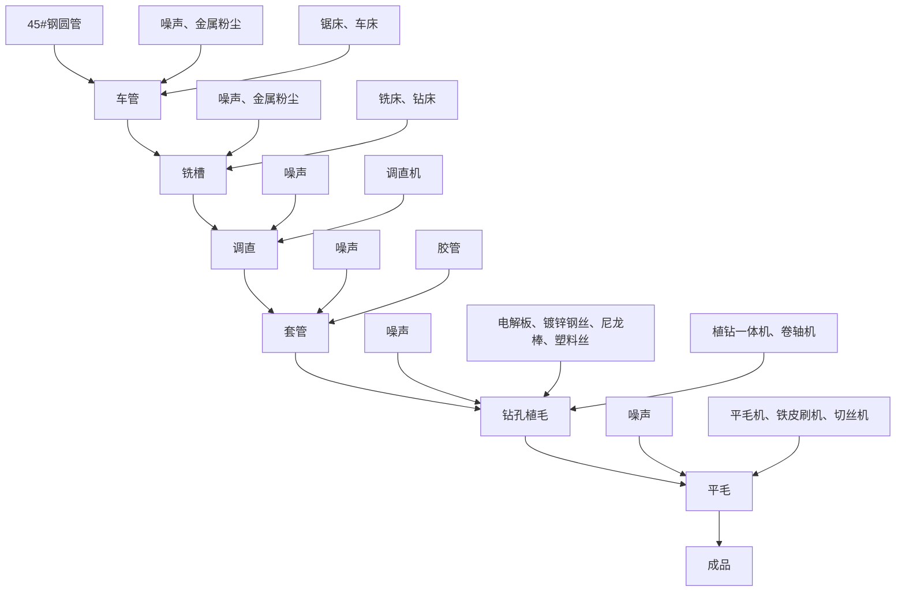
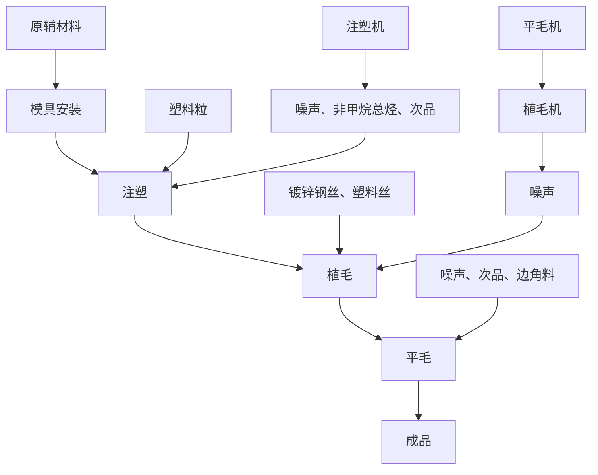
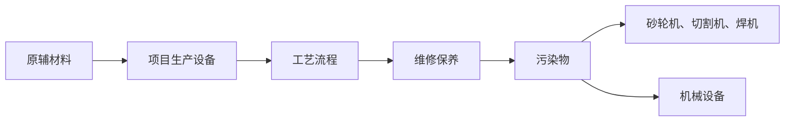

# 建设项目环境影响报告表

（污染影响类）

项目名称：佛山家之宝清洁器材有限公司刷棍4万条清扩建项目 宝

建设单位（盖章）：佛山家之宝清洁器材有限公司

编制日期：2021年4月

中华人 环境部制

text_image

环保科技有限公司
民共和国生态
440307169718

## 一、建设项目基本情况

<table><tr><td>建设项目名称</td><td colspan="3">佛山家之宝清洁器材有限公司刷棍4万条扩建项目</td></tr><tr><td>项目代码</td><td colspan="3">/</td></tr><tr><td>建设单位联系人</td><td>李**</td><td>联系方式</td><td>1392486****</td></tr><tr><td>建设地点</td><td colspan="3">佛山市顺德区勒流街道冲鹤村委会连富一路85号顺德勒流光电产业中心5栋203单元</td></tr><tr><td>地理坐标</td><td colspan="3">(22度48分36.45秒,113度11分52.14秒)</td></tr><tr><td>国民经济行业类别</td><td>C4111鬃毛加工、制刷及清扫工具制造</td><td>建设项目行业类别</td><td>二十六、橡胶和塑料制品业29—53塑料制品业292—其他(年用非溶剂型低VOCs含量涂料10吨以下的除外)</td></tr><tr><td>建设性质</td><td>□新建(迁建)□改建☑扩建□技术改造</td><td>建设项目申报情形</td><td>首次申报项目不予批准后再次申报项目超五年重新审核项目重大变动重新报批项目</td></tr><tr><td>项目审批(核准/备案)部门(选填)</td><td>/</td><td>项目审批(核准/备案)文号(选填)</td><td>/</td></tr><tr><td>总投资(万元)</td><td>*</td><td>环保投资(万元)</td><td>*</td></tr><tr><td>环保投资占比(%)</td><td>10%</td><td>施工工期</td><td>2021年6月</td></tr><tr><td>是否开工建设</td><td>否□是:____</td><td>用地(用海)面积(m2)</td><td>1078.37</td></tr><tr><td>专项评价设置情况</td><td colspan="3">无</td></tr><tr><td>规划情况</td><td colspan="3">无</td></tr><tr><td>规划环境影响评价情况</td><td colspan="3">无</td></tr><tr><td>规划及规划环境影响评价符合性分析</td><td colspan="3">无</td></tr><tr><td>其他符合性分析</td><td colspan="3">1、与产业政策符合性分析根据国家《产业结构调整指导目录(2019年本)》,项目不属于目录所列的鼓励类、限制类和淘汰类项目,根据《促进产业结构调整暂行规定》(国发[2005]40号)第十三条,项目属于允许类。且项目不属于《市场准入负面清单(2020年版)》(发改体改规〔2020〕1880号)中禁止和许可事项,符合国家产业政策要求。2、建设项目与所在地“三线一单”符合性分析根据《广东省人民政府关于印发广东省“三线一单”生态环境分区管控方案的通知》(粤府〔2020〕71号),广东省将以环境管控单元为基础,实施生态环境分区管控,精细化管理、保护生态环境。本项目与广东省“三线一单”生态环境分区管控方案相符性分析如下:1与“一核一带一区”区域管控要求的相符性1)项目位于珠三角核心区,主要用于佛山家之宝清洁器材有限公司的生产,不属于区域布局管控要求中的禁止新建、扩建水泥、平板玻璃、化学制浆、生皮制革以及国家规划外的钢铁、原油加工等项目。项目不涉及使用高挥发性原辅材料,不属于新建生产和使用高挥发性有机物原辅材料的项目,符合区域布局管控要求。2)项目所属鬃毛加工、制刷及清扫工具制造,不属于高能耗行业,项目全部生产设备使用电能,生产用水由市政供水,不直接取用江河湖库水量,不会对项目所在地生态流量造成影响,符合能源利用要求。3)项目属于扩建项目,生活污水经三级化粪池处理达标后通过市政管网排入勒流污水处理厂,尾水排入顺德支流,符合污染物排放管控要求。4)项目位于佛山市顺德区勒流街道冲鹤村委会连富一路85号顺德勒流光电产业中心5栋203单元,不属于石化、化工重点园区环境风险防控区域。项目产生的危险废物拟定期委托有资质的处置公司进行收集处理,并通过信息系统登记转移计划和电子转移联单,符合危险废物全过程跟踪管理的防控要求。2与环境管控单元总体管控要求的相符性本项目位于光电产业园,属于其中的重点管控单元,项目产生的生生活污水经三级化粪池处理达标后通过市政管网排入勒流污水处理厂,不在地表水I、II类水域新建排污口,不产生和排放有毒有害大气污染物项目,不使用溶剂型油墨、涂料、清洗剂、胶黏剂等高挥发性有机物原辅材料,符合其环境准入及管控要求。</td></tr></table>

## （2）挥发性有机物控制要求

项目挥发性有机物排放符合性根据相关政策文件规定分析如下：

表 1-1 项目与挥发性有机物排放规定相符性分析

<table><tr><td>序号</td><td>政策要求</td><td>工程内容</td><td>判定</td></tr><tr><td colspan="4">1.《中华人民共和国大气污染防治法》(2015.8.29修订,2016.1.1实施)</td></tr><tr><td>1.1</td><td>第四十五条 产生含挥发性有机物废气的生产和服务活动,应当在密闭空间或者设备中进行,并按照规定安装、使用污染防治设施;无法密闭的,应当采取措施减少废气排放。</td><td>本项目有机废气由收集后通过二级活性炭吸附,尾气引至30m高排气筒FQ-1排放,收集效率达90%以上</td><td>符合</td></tr><tr><td colspan="4">2.《关于印发&lt;重点行业挥发性有机物综合治理方案&gt;的通知》(环大气[2019]53号)</td></tr><tr><td>2.1</td><td>加强设备与场所密闭管理。含VOCs物料应储存于密闭容器、包装袋、高效密封储罐、封闭式储库、料仓等。含VOCs物料生产和使用过程,应采取有效收集措施或在密闭空间中操作</td><td>本项目有机废气由收集后通过二级活性炭吸附,尾气引至30m高排气筒FQ-1排放,收集效率达90%以上</td><td>符合</td></tr><tr><td colspan="4">3.顺德区环境保护委员会关于印发顺德区工业挥发性有机物项目(VOCs)审批总量前置实施细则(2016年修订)的通知</td></tr><tr><td>3.1</td><td>对新、改、扩建涉及新增VOCs排放的建设项目实行VOCs排放总量前置审批,凡新增VOCs排放量必须取得VOCs排放总量指标,且执行“减二增一”政策,即新、改、扩建涉及新增VOCs排放的建设项目,必须在区域内已有排放源排放量削减2倍于拟建项目的VOCs排放量。有组织排放量小于0.1吨(不含0.1吨,下同)的建设项目,不需要申请VOCs排放总量指标,直接由环评文件审批部门在环保管理信息系统录入项目排放量,作为VOCs排放总量分配依据;有组织排放量大于0.1吨(含0.1吨)的建设项目,须申请VOCs排放总量指标。</td><td>本项目非甲烷总烃有组织排放量小于0.1吨(不含0.1吨,下同),不需要申请VOCs排放总量指标,直接由环评文件审批部门在环保管理信息系统录入项目排放量,作为VOCs排放总量分配依据。</td><td>符合</td></tr></table>

## 二、建设项目工程分析

## 1、项目工程组成

佛山家之宝清洁器材有限公司刷棍 4万条扩建项目位于佛山市顺德区勒流街道冲鹤村委会连富一路 85 号顺德勒流光电产业中心 5 栋 203 单元，中心经纬度为：北纬：22°48'36.45″，东经：113°11'52.14″（地理位置详见附图 1）。项目总投资金额 100 万元，购买已建成厂房，占地面积为 1078.37m2，建筑面积为 1078.37m2（其中公摊面积为135.23m2），主要经营刷棍的生产销售，投产后预计年产刷棍4万条。

建设内容：本项目占地面积 1078.37m2，建筑面积1078.37m2，根据厂房买卖合同，项目实际套内建筑面积为 943.14m2，公摊共有建筑面积为 135.23m2。工程组成主要包括注塑区、机加工区、植毛平毛区、办公区、仓库、一般固废房、危废暂存间、卫生间等。具体工程组成见下表。

表 2-1 项目工程组成

<table><tr><td>项目</td><td>内容</td><td>扩建前</td><td>扩建工程</td><td>扩建后</td></tr><tr><td>主体工程</td><td>生产车间</td><td>占地面积为1078.37m2,建筑面积1078.37m2,套内建筑面积为943.14m2,公摊共有建筑面积为135.23m2,设有注塑区、机加工区、植毛平毛区、办公区、仓库、一般固废房、危废暂存间、卫生间</td><td>无新增用地面积,依托原项目工程,增加塑料刷棍的加工生产并增加相应设备</td><td>占地面积为1078.37m2,建筑面积1078.37m2,套内建筑面积为943.14m2,公摊共有建筑面积为135.23m2,设有注塑区、机加工区、植毛平毛区、办公区、仓库、一般固废房、危废暂存间、卫生间</td></tr><tr><td rowspan="3">公用工程</td><td>供水系统</td><td>一套,从市政给水管网驳接用水支管。</td><td>依托原项目工程</td><td>一套,从市政给水管网驳接用水支管</td></tr><tr><td>供电系统</td><td>一套,从市政电网引接至配电箱,连接到各用电单元。</td><td>依托原项目工程</td><td>一套,从市政电网引接至配电箱,连接到各用电单元。</td></tr><tr><td>给排水系统</td><td>雨水经雨水口收集后汇入相邻道路市政雨水管网;生活污水经三级化粪池处理达标后通过市政管网排入勒流污水处理厂。</td><td>依托原项目工程</td><td>雨水经雨水口收集后汇入相邻道路市政雨水管网;生活污水经三级化粪池处理达标后通过市政管网排入勒流污水处理厂。</td></tr><tr><td rowspan="2">环保工程</td><td>生活污水处理</td><td>一套三级化粪池</td><td>依托原项目工程</td><td>一套三级化粪池</td></tr><tr><td>废气治理</td><td>有机废气经集气罩整室收集,通过“UV光解+活性炭吸附”系统处理后,由引风机引至厂房楼顶排气筒(30m)高空排放,排气筒自编号FQ-1。</td><td>新增注塑机、注塑产生的有机废气经集气罩收集后配套“二级活性炭吸附”处理后通过楼顶30m高排气筒FQ-1高空排放</td><td>注塑机产生的有机废气经集气罩收集后配套“二级活性炭吸附”处理后通过楼顶30m高排气筒FQ-1高空排放</td></tr><tr><td rowspan="4"></td><td>噪声治理</td><td>墙体隔声、设备加装减震基座、选用噪声低的设备。</td><td>依托原项目工程</td><td>合理布局、选用低噪声设备,加强设备维护,距离衰减</td></tr><tr><td rowspan="3">固废处理</td><td>生活垃圾交由环卫部门统一处理。</td><td>依托原项目工程</td><td>生活垃圾交由环卫部门统一处理。</td></tr><tr><td>一般工业固体废物交由物资公司回收利用。</td><td>依托原项目工程</td><td>一般工业固体废物交由物资公司回收利用。</td></tr><tr><td>危险废物交由有资质的单位进行处理。</td><td>依托原项目工程</td><td>危险废物交由有资质的单位进行处理。</td></tr></table>

## 2、主要产品及产能

项目主要从事刷棍的加工，主要产品及产能见表2-2。

表 2-2 产品及产能一览表

<table><tr><td>类别</td><td>名称</td><td>单位</td><td>扩建前</td><td>增减量</td><td>扩建后</td><td>备注</td></tr><tr><td>产品产量</td><td>刷棍</td><td>万条/年</td><td>1.56</td><td>2.44</td><td>4</td><td>/</td></tr></table>

## 3、项目设备清单

主要生产单元、主要工艺、生产设施及设施参数见表2-3。

表 2-3 主要生产单元、主要工艺、生产设施及设施参数一览表

<table><tr><td>生产单元</td><td>生产工艺</td><td>生产设施</td><td>单位</td><td>扩建前</td><td>增减量</td><td>扩建后</td><td>备注</td></tr><tr><td rowspan="15">生产车间</td><td>车管(机加工)</td><td>车床</td><td>台</td><td>3</td><td>+0</td><td>3</td><td>不变</td></tr><tr><td>铣槽(机加工)</td><td>铣床</td><td>台</td><td>1</td><td>+0</td><td>1</td><td>不变</td></tr><tr><td>调直</td><td>调直机</td><td>台</td><td>1</td><td>+0</td><td>1</td><td>不变</td></tr><tr><td>平毛</td><td>铁皮刷机</td><td>台</td><td>2</td><td>+0</td><td>2</td><td>不变</td></tr><tr><td>平毛</td><td>平毛机</td><td>台</td><td>2</td><td>+0</td><td>2</td><td>不变</td></tr><tr><td>钻孔植毛</td><td>植钻一体机</td><td>台</td><td>8</td><td>+0</td><td>8</td><td>不变</td></tr><tr><td>穿丝带</td><td>卷轴机</td><td>台</td><td>2</td><td>+0</td><td>2</td><td>不变</td></tr><tr><td>平毛</td><td>切丝机</td><td>台</td><td>1</td><td>+0</td><td>1</td><td>不变</td></tr><tr><td>车管(机加工)</td><td>锯床</td><td>台</td><td>1</td><td>+0</td><td>1</td><td>不变</td></tr><tr><td>铣槽(机加工)</td><td>钻床</td><td>台</td><td>1</td><td>+0</td><td>1</td><td>不变</td></tr><tr><td>注塑</td><td>注塑机</td><td>台</td><td>2</td><td>+7</td><td>9</td><td>扩建工程新增</td></tr><tr><td>提供空气动力</td><td>空压机</td><td>台</td><td>1</td><td>+0</td><td>1</td><td>不变</td></tr><tr><td>维修保养(焊接)</td><td>氩弧焊机</td><td>台</td><td>1</td><td>+0</td><td>1</td><td>不变</td></tr><tr><td>维修保养(机加工)</td><td>砂轮机</td><td>台</td><td>1</td><td>+0</td><td>1</td><td>不变</td></tr><tr><td>维修保养(机加工)</td><td>切割机</td><td>台</td><td>1</td><td>+0</td><td>1</td><td>不变</td></tr></table>

## 4、项目原辅材料

主要原辅材料及燃料的种类和用量见表2-4。

表2-4 项目主要原辅材料及燃料参数一览表

<table><tr><td>类别</td><td>名称</td><td>单位</td><td>扩建前</td><td>增减量</td><td>扩建后</td><td>备注</td></tr><tr><td rowspan="12">主要原辅材料</td><td>45#钢圆管</td><td>吨/年</td><td>108</td><td>+0</td><td>108</td><td>用于车管工序</td></tr><tr><td>镀铬棒</td><td>米/年</td><td>7200</td><td>+0</td><td>7200</td><td>用于铣槽工序</td></tr><tr><td>胶管</td><td>吨/年</td><td>24</td><td>+0</td><td>24</td><td>用于套管工序</td></tr><tr><td>镀锌钢丝</td><td>吨/年</td><td>12</td><td>+48</td><td>60</td><td>用于植毛、钻孔植毛工序</td></tr><tr><td>电解板</td><td>吨/年</td><td>18</td><td>+0</td><td>18</td><td>用于钻孔植毛工序</td></tr><tr><td>尼龙棒</td><td>吨/年</td><td>1.8</td><td>+0</td><td>1.8</td><td>用于钻孔植毛工序</td></tr><tr><td>304不锈钢圆棒</td><td>吨/年</td><td>21.6</td><td>+0</td><td>21.6</td><td>用于铣槽工序</td></tr><tr><td>塑料丝</td><td>吨/年</td><td>36</td><td>+108</td><td>144</td><td>用于钻孔植毛工序</td></tr><tr><td>塑料粒</td><td>吨/年</td><td>30</td><td>+90</td><td>120</td><td>用于注塑工序,所用塑料粒种类为PE、PP、尼龙</td></tr><tr><td>机油</td><td>吨/年</td><td>0.01</td><td>+0</td><td>0.01</td><td>用于设备维修保养</td></tr><tr><td>焊丝</td><td>吨/年</td><td>0.002</td><td>+0</td><td>0.002</td><td>用于设备维修保养</td></tr><tr><td>氩气</td><td>吨/年</td><td>0.03</td><td>+0</td><td>0.03</td><td>用于设备维修保养</td></tr></table>

## 理化性质：

PP 塑料粒：聚丙烯，英文名 polypropylene（简称PP），是由丙烯聚合而制得的一种热塑性树脂。密度小，耐热性良好，制品能在 100℃以上温度进行消毒灭菌，并具有良好的电性能和高频绝缘性不受湿度影响，但低温时变脆、不耐磨、易老化，适于制作一般机械零件，耐腐蚀零件和绝缘零件。常规 PP 材料的密度为 0.90\~0.91g/cm3，熔点164\~170℃，热分解温度在 328\~410℃之间，拉伸强度在 20M\~30MPa之间，弯曲强度在25M\~50MPa 之间，弯曲模量在 800M\~1500MPa 之间。

PE 塑料粒：PE是聚乙烯的简称，是乙烯经聚合制得的一种热塑性树脂，CAS 号：9002-88-4，无臭，无毒，具有优良的耐低温性能，化学稳定性好，能耐大多数酸碱的侵蚀（不耐具有氧化性质的酸）。常温下不溶于一般溶剂，吸水性小，电绝缘性优良，熔点 131℃。

尼龙塑料粒：无毒，半透明或不透明乳白色结晶形聚合物，具有可塑性。密度1．15g／cm3。熔点252℃。脆化温度-30℃。热分解温度大于350℃。 连续耐热80-120℃,平衡吸水率2.5%。能耐酸、碱、大多数无机盐水溶液、卤代烷、烃类、酯类、酮类等腐蚀，

```mermaid
graph TD
  A["原辅材料"] --> B["模具安装"]
  B --> C["注塑"]
  C --> D["植毛"]
  D --> E["平毛"]
  E --> F["成品"]
    
  G["工艺流程"] --> H["塑料粒"]
  G --> I["镀锌钢丝、塑料丝"]
    
  I --> J["噪声"]
  I --> K["噪声"]
    
  L["污染物"] --> M["注塑机"]
  N["机械设备"] --> O["植毛机"]
  P["原辅材料"] --> Q["模具安装"]
  R["工艺流程"] --> S["注塑"]
  T["污染物"] --> U["注塑机"]
  V["机械设备"] --> W["植毛机"]
  X["原辅材料"] --> Y["模具安装"]
  Z["工艺流程"] --> AA["注塑"]
  AB["污染物"] --> AC["注塑机"]
  AD["机械设备"] --> AE["植毛机"]
  AF["原辅材料"] --> AG["模具安装"]
  AH["工艺流程"] --> AI["注塑"]
  AJ["污染物"] --> AK["注塑机"]
  AL["机械设备"] --> AM["植毛机"]
  AN["原辅材料"] --> AO["模具安装"]
  AP["工艺流程"] --> AQ["注塑"]
  AR["污染物"] --> AS["注塑机"]
  AT["机械设备"] --> AU["植毛机"]
  AV["原辅材料"] --> AW["模具安装"]
  AX["工艺流程"] --> AY["注塑"]
  AZ["污染物"] --> BA["注塑机"]
  BB["机械设备"] --> BC["植毛机"]
  BD["原辅材料"] --> BE["模具安装"]
  BF["工艺流程"] --> BG["注塑"]
  BH["污染物"] --> BI["注塑机"]
  BJ["机械设备"] --> BK["植毛机"]
  BL["原辅材料"] --> BM["模具安装"]
  BN["工艺流程"] --> BO["注塑"]
  BP["污染物"] --> BQ["注塑机"]
  BR["机械设备"] --> BS["植毛机"]
  BT["原辅材料"] --> BU["模具安装"]
  BV["工艺流程"] --> BW["注塑"]
  BX["污染物"] --> BY["注塑机"]
  BZ["工艺流程"] --> CA["注塑机"]
  CB["污染物"] --> CC["注塑机"]
  CD["原辅材料"] --> CE["模具安装"]
  CF["工艺流程"] --> CG["注塑"]
  CH["污染物"] --> CI["注塑机"]
  CJ["机械设备"] --> CK["植毛机"]
  CL["原辅材料"] --> CM["模具安装"]
  CN["工艺流程"] --> CO["注塑"]
  CP["污染物"] --> CQ["注塑机"]
  CR["机械设备"] --> CS["植毛机"]
  CT["原辅材料"] --> CU["模具安装"]
  CU --> CV["注塑"]
  CW["污染物"] --> CX["注塑机"]
  CY["机械设备"] --> CZ["植毛机"]
  DA["原辅材料"] --> DB["模具安装"]
  DB --> DC["注塑"]
  DD["污染物"] --> DE["注塑机"]
  DF["机械设备"] --> DG["植毛机"]
  DH["原辅材料"] --> DI["模具安装"]
  DJ["工艺流程"] --> DK["注塑"]
  DL["污染物"] --> DV["注塑机"]
  DW["机械设备"] --> DX["植毛机"]
  DX --> DXT["平毛机"]
```

<table><tr><td></td><td>但易溶于苯酚、甲酸等极性溶剂。具有优良的耐磨性、自润滑性,机械强度较高。但吸水性较大,因而尺寸稳定性较差。5、给水与排水(1)给水:扩建前后项目用水均由市政给水管网供应。用水主要为员工生活用水。营运期从业人数为20人,年工作日300天;工作时间为每天8小时,项目不设饭堂和员工宿舍。根据《广东省用水定额》(DB44/T 1461-2014),生活用水按40L/人·d计,则生活用水量约为 $240 \text{m}^{3}/\text{a}$ 。(2)排水:扩建前后项目外排废水均为员工生活污水。扩建后项目生活污水经三级化粪处理后排入勒流生活污水处理厂,尾水排至顺德支流。生活污水排污系数取0.9,生活污水产生量为 $216 \text{m}^{3}/\text{a}$ 。6、劳动动员及工作制度扩建前后项目从业人数均为20人,年工作日300天,每天工作8小时,工作时间为为08:00-12:00及14:00-18:00。7、厂区平面布置扩建后项目占地面积为 $1078.37 \text{m}^{2}$ ,经营面积为 $1078.37 \text{m}^{2}$ 。项目位于已建成五层高工业厂房中的第四层,工程组成主要包括注塑区、机加工区、植毛平毛区、办公区、仓库、一般固废房、危废暂存间、卫生间,具体平面布置情况见附图2。</td></tr><tr><td>工艺流程和产排污环节</td><td>(1)项目施工期施工工艺:扩建后主要从事刷棍的加工生产,其生产工艺流程如下:(1)刷棍(塑料)</td></tr></table>

flowchart

图 2-1 刷棍（塑料）生产工艺流程图

## 工艺流程说明：

①注塑：将塑料粒放入注塑机进行注塑，得到刷棍主件。  
②植毛：通过植毛机将镀锡钢丝、塑料丝与刷棍主件整合在一起，得到刷棍半成品。  
③平毛：通过平毛机将镀锡钢丝、塑料丝切整齐，得到刷棍成品。

## （2）刷棍（金属）

flowchart

图2-2 刷棍（金属）生产工艺流程图

## 工艺流程说明：

①车管：将 45#钢圆管通过锯床、车床切割加工，得到符合规格的钢圆管。  
②铣槽：添加镀铬棒、304不锈钢圆棒进行组装，然后使用铣槽、钻床进行加工。  
③调直：通过调直机对组装完的半成品进行调直。  
④套管：将胶管套在调直的半成品上得到刷棍主件。  
⑤钻孔植毛：通过植钻一体机将镀锡钢丝、塑料丝、电解板、尼龙棒与刷棍主件整合在一起，得到刷棍半成品。  
③平毛：通过平毛机将镀锡钢丝、塑料丝切整齐，得到刷棍成品。

## （3）设备维修保养

原辅材料

工艺流程

污染物

机械设备

项目生产设备噪声、金属粉尘、焊烟

砂轮机、切割机、焊机

## 工艺流程说明：

维修保养：根据项目生产设备运行情况，进行定期的维修保养工作。

## 2、本项目运营期间产物情况

（1）废水：扩建项目运营期间外排废水为员工生活污水；  
（2）废气：扩建项目运营期间产生的废气主要来自机加工（车管、铣槽）过程、设备维修保养过程产生的粉尘和焊接烟尘，注塑工序产生的非甲烷总烃。  
（3）噪声：扩建项目各机械设备运行时产生的机械噪声；  
（4）固废：扩建项目生产过程中产生的固体废物主要为生活垃圾、次品、边角料；设备维修过程产生的废机油、含机油废抹布和手套、废机油罐。

企业曾于 2020 年委托贵州远景工程管理服务中心编制了《佛山家之宝清洁器材有限公司年产刷棍15600 条新建项目环境影响报告表》，于2020年4月29 日取得《佛山家之宝清洁器材有限公司年产刷棍 15600 条新建项目环境影响报告表的批复》，文号为：佛环 0304 环审[2020]第 0092 号（见附件 5）。主要从事刷棍的加工生产，年产刷棍15600条。因企业发展，项目新增设备及场地变化等原因，原项目未展开竣工环保验收。为了解项目扩建前的污染排放情况，现进行回顾性分析：

## （1）现有项目工艺流程

刷棍（塑料）

flowchart

图 2-1 刷棍（塑料）生产工艺流程图

## 扩建前项目工艺流程说明：

①注塑：将塑料粒放入注塑机进行注塑，得到刷棍主件。  
②植毛：通过植毛机将镀锡钢丝、塑料丝与刷棍主件整合在一起，得到刷棍半成品。  
③平毛：通过平毛机将镀锡钢丝、塑料丝切整齐，得到刷棍成品。

刷棍（金属）

flowchart

图2-2 刷棍（金属）生产工艺流程图

## 扩建前工艺流程说明：

①车管：将 45#钢圆管通过锯床、车床切割加工，得到符合规格的钢圆管。  
②铣槽：添加镀铬棒、304不锈钢圆棒进行组装，然后使用铣槽、钻床进行加工。  
③调直：通过调直机对组装完的半成品进行调直。  
④套管：将胶管套在调直的半成品上得到刷棍主件。  
⑤钻孔植毛：通过植钻一体机将镀锡钢丝、塑料丝、电解板、尼龙棒与刷棍主件整合在一起，得到刷棍半成品。  
③平毛：通过平毛机将镀锡钢丝、塑料丝切整齐，得到刷棍成品。

## （3）设备维修保养

flowchart

## 工艺流程说明：

维修保养：根据项目生产设备运行情况，进行定期的维修保养工作。

## （2）扩建前项目污染源分析

## 1）废水：

根据建设单位提供的资料，扩建前项目主要外排废水为员工办公时产生的生活污水。扩建前项目员工人数为20人，均不在厂区内食宿，生活污水来源于员工如厕和清洁用水。生活用水根据《广东省用水定额》（DB44/T1461-2014）中代码为“912 不设食堂、浴室”的情况，按 0.04m³/日·人计，则项目员工生活用水为240m3 /a（年工作日以300 天计）；生活污水产生系数按90%计，则生活污水产生量约为216m3 /a。扩建前生活污水的主要污染物浓度分别为 CODcr250mg/L、BOD5150mg/L、SS150mg/L、NH3-N 30mg/L。生活污水经三级化粪池预处理达标后通过市政污水管网排入勒流污水处理厂。水污染物的产生及排放情况见表2-5。

表 2-5 扩建前项目生活污水排放情况

<table><tr><td>项目</td><td>污染物</td><td>产生浓度(mg/L)</td><td>产生量(t/a)</td><td>排放浓度(mg/L)</td><td>排放量(t/a)</td></tr><tr><td rowspan="4">生活污水216m3/a</td><td> $COD_{cr}$ </td><td>250</td><td>0.054</td><td>40</td><td>0.0086</td></tr><tr><td> $BOD_5$ </td><td>150</td><td>0.032</td><td>10</td><td>0.0022</td></tr><tr><td>SS</td><td>150</td><td>0.032</td><td>10</td><td>0.0022</td></tr><tr><td> $NH_3-N$ </td><td>30</td><td>0.006</td><td>5</td><td>0.0011</td></tr></table>

## 2）废气

现有项目营运期间产生的废气主要来自机加工（车管、铣槽）过程、设备维修保养过程产生的粉尘，注塑工序产生的非甲烷总烃、以及设备维修过程产生的焊接烟尘。

## ①颗粒物

扩建前项目在进行机加工（车管、铣槽）过程、设备维修保养过程会产生少量的金属粉尘。参考《机加工行业环境影响评价中常见污染源估算及污染治理》（湖北大学学报自然科学版，第 32 卷第 3 期，2010年 9 月）可知，机加工过程中的颗粒物产生量为原材料使用量的 0.1%。根据建设提供资料，本项目45#钢圆管108t/a、镀铬棒7200米/a约合 10t/a、304 不锈钢圆棒 21.6 吨，计算可得项目金属粉尘产生量约为 0.140t/a。根据对《大气污染物综合排放标准》（GB16297）复核调研和国家环保总局《大气污染物排放达标技术指南》课题调查资料表明，金属粉尘等质量较大的颗粒物，沉降较快，即使较细小的金属粉尘随机运动，在空气中停留短暂时间后也将沉降于地面。因此，在车间厂房阻拦作用下，金属粉尘散落范围很小，一般在 5m 以内，飘逸至车间外环境的金属粉尘极少，预计约 95%可在操作区域附近沉降，即沉降量约为 0.133t/a，沉降部分及时清理后作为一般固废处理，只有极少部分扩散到大气中形成粉尘，排放的粉尘量约为0.007t/a，排放速率为 0.0029kg/h。

## ②有机废气（非甲烷总烃）

扩建前项目生产过程中注塑工序会产生有机废气，主要污染因子为非甲烷总烃。参照《上海市工业企业挥发性有机物排放量通用计算方法（试行）》表1-4主要塑料制品制造工序产污系数的非甲烷总烃的排放系数为2.885kg/t原料，项目注塑工序使用的塑料粒使用量约为30t/a，则非甲烷总烃产生量约为0.087t/a。本环评建议在每台注塑机的产污点上设置一个0.8m×0.8m的集气罩收集生产过程中产生的非甲烷总烃，引至一套“UV光解+活性炭吸附”系统处理达标后，尾气通过30m的排气筒高空排放，排气筒自编号为FQ-1。

## ③焊接烟尘

扩建前项目在生产设备维修保养过程中使用氩弧焊机，会产生焊接烟尘，根据建设单位提供的资料，氩弧焊机的年工作时间合计约为 5 小时，氩弧焊机焊接材料用量为0.002t/a，则本项目焊接烟尘产生量为 5.2×10-5 t/a。根据建设单位提供的资料，设备维修保养工序平均每月进行一次，每次工作时间约为 5小时，氩弧焊机在维修保养过程中间断使用，则焊接烟尘的产生速率约为 0.00087kg/h。由于焊接烟尘生产量少，拟在车间内无组织排放，通过加强通风换气措施减少影响。

## 3）噪声：

扩建前项目营运期产生的噪声主要为注塑机、车床、铣床等生产设备运行时产生的噪声，其噪声强度值在 65～85dB(A)之间。项目四周以工业企业为主，距离本项目厂界最近敏感点（东北面的马村）约 135m。建议尽可能采用低噪声设备，对高噪声设备安装时进行恰当的减振降噪处理，运行过程加强对设备的维护保养，以降低项目噪声贡献值。噪声通过隔墙和距离衰减后，对厂界噪声的贡献值很小，采取安装减震垫、隔声罩，合理布局车间，合理安排生产时间等措施处理后，项目厂界噪声符合《工业企业厂界环境噪声排放标准》（GB12348-2008）中2类标准要求，对项目所在区域敏感点声环境影响较小。

## 4）固废

## ①一般工业固体废物

根据建设单位提供的资料，扩建前项目次品、边角料产生量约为 2t/a，沉降的金属粉尘为0.133t/a，均交由废品回收商回收利用。

## ②生活垃圾

扩建前项目共有员工20人，根据《社会区域类环境影响评价》（中国环境科学出版社），我国目前城市人均生活垃圾为 0.8～1.5kg/人•d，办公室垃圾为 0.5～1.0kg/人•d，本项目员工每人每天办公垃圾产生量按 0.5kg 计，年工作日按 300 天计算，则项目生活垃圾产生量约3.0t/a。

## ③危险废物

扩建前项目产生的危险废物主要来自设备维修过程中产生的废机油、废机油罐、含机油废抹布和手套，废气治理过程中产生的废活性炭。

## ◇废机油

根据建设单位提供资料，生产过程中需使用机油对机械设备进行维护保养，此过程会产生一定量的废机油。根据项目实际运营情况，设备机油的更换频率为1次/年，每次更换量约0.01t/a，则项目废机油的产生量约 0.01t/a。废机油属于危险废物，类别为HW08类，代码为900-249-08。应暂存于危废暂存区，适时交由有处理资质的单位处理。

## ◇含机油废抹布和手套

生产或设备维修保养过程中会产生一定量的含机油的废抹布，经咨询项目技术负责人，扩建前项目抹布及手套使用量约0.5kg/月，年工作12个月，共300天，则含机油废抹布和手套总产生量约 0.006t/a。含机油废抹布和手套属于危险废物，危险废物类别HW49 类，代码为 900-041-49。建设单位应将其独立收集，避免混入生活垃圾中，存放于危废暂存区，适时交由有处理资质的单位处理。

## ◇废机油罐

生产过程中会产生各种材料的包装罐，根据建设单位提供的资料，每次更换机油产生的废机油罐约 1kg，每年更换 1 次，则废机油罐产生量约 1kg/a。废机油罐属于危险废物，危险废物类别为 HW49 类，代码为900-041-49。建设单位应妥善收集，暂存于危废暂存区，适时交由有处理资质的单位处理。

## ◇废活性炭

扩建前项目废气治理设施采用“UV光解+活性炭吸附装置”的工艺处理，故废气处理过程会产生废活性炭。根据《现代涂装手册》（化学工业出版社，2010年出版），活性炭对有机废气等各成分的吸附量约为 0.25g 废气/g 活性炭，本项目经收集进入废气治理设施的有机废气（非甲烷总烃）的量为 0.0783t/a，经处理后有组织排放量为0.0157t/a，其中UV光解处理措施去除率按 50%、活性炭吸附去除效率按60%计算，则活性炭需要吸附的非甲烷总烃合计约 0.0235/a，即本项目吸附废气理论所需的活性炭用量约 0.094t/a，加上被吸附的有机废气量则废活性炭产生量约 0.1175t/a。废活性炭属于《国家危险废物名录》中的其他废物（类别为 HW49，代码为900-041-49）。建设单位应妥善收集，暂存于危废暂存区，每季度一次交由有处理资质的单位处理。

## ◇废 UV灯管

废气治理过程中会产生废 UV灯管，根据建设单位提供的资料，废 UV 灯管产生量约为0.005t/a。废UV 灯管属于危险废物，危险废物类别为 HW29 类，代码为900-023-29。建设单位应妥善收集，暂存于危废暂存区，适时交由有处理资质的单位处理。

表2-6 项目危险废物一览表

<table><tr><td>类别</td><td>危险废物类别</td><td>危险废物代码</td><td>产生量(t/a)</td><td>产生工序及装置</td><td>形态</td><td>主要成分</td><td>危险成分</td><td>产废周期</td><td>危险特性</td><td>污染防治措施</td></tr><tr><td>废机油</td><td>HW08类</td><td>900-249-08</td><td>0.01</td><td>设备维修</td><td>液体</td><td>机油</td><td>机油</td><td>1年</td><td>T, I</td><td rowspan="5">交由具有相应处理资质的单位处理</td></tr><tr><td>含机油废抹布和手套</td><td>HW49类</td><td>900-041-49</td><td>0.006</td><td>设备维修</td><td>固体</td><td>机油</td><td>机油</td><td>1年</td><td>T, I</td></tr><tr><td>废机油罐</td><td>HW49类</td><td>900-041-49</td><td>0.001</td><td>设备维修</td><td>固体</td><td>机油</td><td>机油</td><td>1年</td><td>T, I</td></tr><tr><td>废活性炭</td><td>HW49类</td><td>900-041-49</td><td>0.1175</td><td>废气处理设施</td><td>固体</td><td>非甲烷总烃</td><td>非甲烷总烃</td><td>1季度</td><td>T, I</td></tr><tr><td>废UV灯管</td><td>HW29</td><td>900-023-29</td><td>0.005</td><td>废气处理设施</td><td>固体</td><td>含汞废物</td><td>含汞废物</td><td>1年</td><td>T, I</td></tr><tr><td>合计</td><td>/</td><td>/</td><td>0.1395</td><td>/</td><td>/</td><td>/</td><td>/</td><td>/</td><td>/</td><td>/</td></tr></table>

注：1、危险特性中 T：毒性、I：易燃性；  
2、建议企业对危险废物做好前期分类，危险废物暂存后定期交由具有相应危险废物处理资质的单位进行处理。

现有项目污染源及排放情况

表 2-7 现有项目的污染物及防治措施

<table><tr><td rowspan="2">内容类型</td><td rowspan="2">排放源</td><td rowspan="2">污染物名称</td><td colspan="2">处理前</td><td colspan="2">处理后</td><td rowspan="2">原采取的措施</td><td rowspan="2">效果评价</td></tr><tr><td>产生浓度</td><td>产生量</td><td>排放浓度</td><td>排放量</td></tr><tr><td rowspan="4">大气污染物</td><td>机加工、设备维护保养</td><td>颗粒物(无组织)</td><td>/</td><td>0.140t/a</td><td>≤ $1.0mg/m^3$ </td><td>0.007t/a</td><td>加强车间通风换气</td><td rowspan="10">达标排放</td></tr><tr><td rowspan="2">注塑工序</td><td>非甲烷总烃(有组织)</td><td>/</td><td>0.0783t/a</td><td>2.33 $mg/m^3$ </td><td>0.0157t/a</td><td rowspan="2">经收集后,通过“UV光解+活性炭吸附装置”工艺处理后,引至30m排气筒高空排放,排气筒自编号FQ-1</td></tr><tr><td>非甲烷总烃(无组织)</td><td>/</td><td>0.0087t/a</td><td>厂界最大浓度≤ $0.00507mg/m^3$ </td><td>0.0087t/a</td></tr><tr><td>维修保养</td><td>焊接烟尘(无组织)</td><td>/</td><td> $5.2×10^{-5}t/a$ </td><td>≤ $1.0mg/m^3$ </td><td> $5.2×10^{-5}t/a$ </td><td>加强车间通风换气</td></tr><tr><td rowspan="4">水污染物</td><td rowspan="4">生活污水( $216m^3/a$ )</td><td> $COD_{cr}$ </td><td>250mg/L</td><td>0.054t/a</td><td>40mg/L</td><td>0.0086t/a</td><td rowspan="4">经三级化粪池达标后,通过市政污水管网进入勒流污水处理厂</td></tr><tr><td> $BOD_5$ </td><td>150mg/L</td><td>0.032t/a</td><td>10mg/L</td><td>0.0022t/a</td></tr><tr><td>SS</td><td>150mg/L</td><td>0.032t/a</td><td>10mg/L</td><td>0.0022t/a</td></tr><tr><td> $NH_3-N$ </td><td>30mg/L</td><td>0.006t/a</td><td>5mg/L</td><td>0.0011t/a</td></tr><tr><td rowspan="8">固体废物</td><td rowspan="3">一般固体废物</td><td>次品、边角料</td><td colspan="2">2t/a</td><td rowspan="2" colspan="3">经分类收集后,分交由废品回收单位回收利用</td></tr><tr><td>沉降的粉尘</td><td colspan="2">0.133t/a</td></tr><tr><td>生活垃圾</td><td colspan="2">3.0t/a</td><td colspan="3">交环卫部门处理</td><td rowspan="7">符合要求</td></tr><tr><td rowspan="5">危险废物</td><td>废机油</td><td colspan="2">0.01t/a</td><td rowspan="5" colspan="3">交由有相应类型危险废物处理资质的单位处理</td></tr><tr><td>含机油废抹布和手套</td><td colspan="2">0.006t/a</td></tr><tr><td>废机油罐</td><td colspan="2">0.001t/a</td></tr><tr><td>废活性炭</td><td colspan="2">0.1175t/a</td></tr><tr><td>废UV灯管</td><td colspan="2">0.005t/a</td></tr><tr><td>噪声</td><td>机械设备</td><td>噪声</td><td colspan="2">65~85dB(A)</td><td colspan="3">通过隔声、减震、吸声等降噪等措施处理后,达到(GB12348-2008)2类标准</td></tr></table>

现有项目排放的各种污染物均落实了相应的防范治理措施，能够达标排放，也未收到环保方面的投诉，未对周围环境造成明显影响

# 三、区域环境质量现状、环境保护目标及评价标准

## 1、大气环境：

根据《关于调整顺德区环境空气质量功能区划的复函》(佛府办函〔2014〕494号)，项目所在地属二类功能区，执行《环境空气质量标准》（GB3095-2012）及2018年修改单中的二级标准。

根据《佛山市生态环境局顺德分局关于发布 2020年度佛山市顺德区环境质量状况公报的通知》（佛顺环函〔2021〕19号），2020年全区空气质量综合指数为 3.30，比2019年下降22.9%，空气质量同比有所改善，在全市五区中排名第二。

2020 年全区二氧化硫 $\left( \mathrm { S O } _ { 2 } \right)$ 、二氧化氮 $\left( \mathrm { N O } _ { 2 } \right)$ ）、可吸入颗粒物 $\left( \mathrm { P M } _ { 1 0 } \right)$ 、细颗粒物 $\left( \mathbf { P M } _ { 2 . 5 } \right)$ ）平均浓度分别为 7、30、43、21 微克/立方米，臭氧日最大 8 小时滑动平均 $( \mathrm { O } _ { 3 } { - } 8 \mathrm { h } )$ ）浓度的第 90百分位数为 155 微克/立方米，一氧化碳（CO）日浓度的第 95 百分位数为 1.0 毫克/立方米，六项污染物指标浓度均达到《环境空气质量标准》（GB3095-2012）二级标准限值。

与去年相比，2020 年度顺德区六项环境空气污染指标浓度均有不同程度下降，$\begin{array}{c} \mathrm { P M } _  2 . 5 \setminus \mathrm { ~ \scriptsize ~ P M } _  1 0 \setminus \mathrm { ~ \scriptsize ~ N O } _  2 \setminus \mathrm { ~ \scriptsize ~ S O } _  2 \setminus \mathrm { ~ \scriptsize ~ S O } _  2 \setminus \mathrm { ~ \scriptsize ~ C } _  2 \setminus \mathrm { ~ \scriptsize ~ S 0 } _  2 \setminus \mathrm { ~ \scriptsize ~ S 0 } _  2 \setminus \mathrm { ~ \scriptsize \Omega } _ { 2 \setminus \mathrm { ~ \scriptsize \Omega } _ { 2 \setminus \mathrm { ~ \scriptsize \Omega } _ { 2 \setminus \mathrm { ~ \scriptsize \Omega } _ { 2 \setminus \mathrm { ~ \scriptsize \Omega } _ { 2 \setminus \mathrm { ~ \scriptsize \Omega } _ { 2 \setminus \mathrm { ~ \scriptsize \Omega } _ { 2 \setminus \mathrm { ~ \scriptsize \Omega } _ { 2 \setminus \mathrm { ~ \scriptsize \Omega } _ { 2 \setminus \mathrm { ~ \scriptsize \Omega } _ { 2 \setminus \mathrm { ~ \scriptsize \Omega } _ { 2 \setminus \mathrm { ~ \scriptsize \Omega } _ { 2 \setminus \mathrm { ~ \scriptsize \Omega } _ { 2 \setminus \mathrm { ~ \scriptsize \Omega } _ { ~ 2 \setminus \mathrm \Omega } _ { 2 \setminus \mathrm { ~ \scriptsize \Omega } _ { ~ 2 \setminus \mathrm \Omega _ { ~ \scriptsize ~ \scriptsize \Omega } _ { 2 \setminus ~ \scriptsize \Omega } _ { 2 \setminus \mathrm { ~ \scriptsize \Omega } _ { ~ 2 \setminus \mathrm \Omega _ { ~ \scriptsize ~ \scriptsize \Omega } _ { 2 \setminus ~ \scriptsize \Omega _ { ~ 2 \setminus \mathrm \Omega } _ { ~ \scriptsize \mathrm { ~ \scriptsize \Omega } _ { ~ 2 \setminus \mathrm \Omega _ { ~ ~ \scriptsize \scriptsize ~ \Omega } _ { 2 \setminus ~ \scriptsize \Omega ~ } } _ { \mathrm \mathrm { ~ \scriptsize \scriptsize ~ \scriptsize \Omega _ { ~ } \mathrm } _ { \scriptsize \Omega _ { ~ 2 \setminus ~ \scriptsize \Omega ~ } } _ { \mathrm \mathrm { ~ \scriptsize \scriptsize \Omega _ { ~ \scriptsize ~ \scriptsize } \Omega _ { ~ } \mathrm  \quad } } } } } } } } } } } } } } } } } } } } } } \end{array}$ 平均浓度分别下降 30.0%、23.2%、23.1%、12.5%，CO 日平均浓度的第95 百分位数下降 23.1%， $\mathrm { O } _ { 3 } – 8 \mathrm { h }$ 浓度的第 90 百分位数下降 18.4%。2020年度全区环境空气质量优良天数占有效天数的90.4%，同比去年提高13.1个百分点。详见下表。

表3-1 2020年顺德区（国控测点）环境空气污染物达标判定情况

<table><tr><td rowspan="2">污染物</td><td colspan="2">浓度均值</td><td rowspan="2">评价标准</td><td rowspan="2">变化</td><td rowspan="2">达标情况</td></tr><tr><td>2019年</td><td>2020年</td></tr><tr><td> $SO_2$ (μg/m3)</td><td>8</td><td>7</td><td>60</td><td>-12.5%</td><td>达标</td></tr><tr><td> $NO_2$ (μg/m3)</td><td>39</td><td>30</td><td>40</td><td>-23.1%</td><td>达标</td></tr><tr><td> $PM_{10}$ (μg/m3)</td><td>56</td><td>43</td><td>70</td><td>-23.2%</td><td>达标</td></tr><tr><td> $PM_{2.5}$ (μg/m3)</td><td>30</td><td>21</td><td>35</td><td>-30.0%</td><td>达标</td></tr><tr><td> $CO^*$ (mg/m3)</td><td>1.3</td><td>1.0</td><td>4</td><td>-23.1%</td><td>达标</td></tr><tr><td> $O_3-8H^*$ (μg/m3)</td><td>190(超标)</td><td>155</td><td>160</td><td>-18.4%</td><td>超标</td></tr></table>

\*注：（1）表中 CO 为年内日平均值的第 95 百分位数， $\mathbf { O } _ { 3 }$ 为年内日最大 8 小时平均值的第 90百分位数。（2）2019 年公报与 2020年公报中的环境空气质量统计分析数据均采用实况数据。  
根据2020年全区的大气环境质量状况公报，六项污染物指标浓度均达到《环境空气质量标准》（GB3095-2012）二级标准限值，故顺德区大气环境质量属达标区。

## 2、地表水

根据《顺德区生态环境保护规划（2011\~2020 年）》（顺府办函〔2013〕41 号）及《关于同意实施广东省地表水环境功能区划的批复》（粤府函[2011]29号），顺德支流执行《地表水环境质量标准》（GB3838-2002）中Ⅲ类标准。本项目生活污水经三级化粪池处理达标后，通过市政污水管网排入勒流污水处理厂，尾水排入顺德支流，顺德支流水质执行《地表水环境质量标准》（GB3838－2002）之Ⅲ类标准。

根据佛山市生态环境局顺德分局关于发布的《2020 年度佛山市顺德区环境质量状况公报》：2019 年，全区地表水环境质量保持稳定，5 个饮用水源监控断面每月均达标，年均值水质均达到Ⅱ类。流经我区及周边城市交界水域 16 条主要河流的 23个功能区监测断面水质均为优良，全年平均值达标率为 96%。与 2018 年相比，主河道监测断面水质达标率提升了 4 个百分点。16 条主河道中，7 条主河道的水质为Ⅱ类，其余为Ⅲ类。

为评价顺德支流水道水质，根据《佛山市生态环境局顺德分局关于发布 2020 年度佛山市顺德区环境质量状况公报的通知》（佛顺环函〔2021〕19 号），2020 年全区地表水环境质量保持稳定，4 个饮用水源监控断面每月均达标，年均值水质均达到Ⅱ类；2 个国控断面（科研断面羊额、考核断面乌洲）、4 个省控断面（杨滘、顺德港、海凌、飞鹅山）均达到相应的水质目标。项目纳污水体顺德支流飞鹅山断面监测的水质达到了Ⅲ类标准要求，水质良好。

## 3、声环境

本项目为扩建项目，根据《关于印发佛山市声环境功能区划分方案的通知》（佛府函〔2015〕72号），项目位于声环境2类功能区，项目厂界外50m范围内无环境敏感目标。

## 4、生态环境

项目用地范围内无生态环境保护目标，无需开展生态现状调查。

## 5、土壤、地下水环境

项目不存在土壤、地下水环境污染途径，不开展土壤、地下水环境质量现状调查。

<table><tr><td rowspan="6">环境保护目标</td><td colspan="10">1、大气环境项目厂界外500米范围内主要环境保护目标见下表:表3-2 主要环境保护目标</td></tr><tr><td rowspan="2">序号</td><td rowspan="2">名称</td><td colspan="2">坐标</td><td rowspan="2">保护对象</td><td rowspan="2">人数(人)</td><td rowspan="2">保护内容</td><td rowspan="2">环境功能区</td><td rowspan="2">相对厂址方位</td><td rowspan="2">相对厂界距离(m)</td></tr><tr><td>X</td><td>Y</td></tr><tr><td>1</td><td>马村</td><td>70</td><td>135</td><td>居民</td><td>约500</td><td rowspan="2">大气</td><td rowspan="2">2类</td><td>东北</td><td>135</td></tr><tr><td>2</td><td>吴地镇</td><td>-360</td><td>375</td><td>约500</td><td>约800</td><td>西北</td><td>450</td></tr><tr><td colspan="10">备注:影响规模均指评价范围内的影响数量。2、声环境本项目所在地属于3类声环境功能区,厂界外50米范围内无声环境保护目标。3、地下水环境本项目厂界外500米范围内无地下水集中式饮用水水源和热水、矿泉水、温泉等特殊地下水资源。4、生态环境项目用地范围内无生态环境保护目标。</td></tr><tr><td rowspan="4">污染物排放控制标准</td><td colspan="10">1、大气污染物排放标准(1)扩建后项目金属机加工过程、设备维修过程产生的颗粒物执行广东省地方标准《大气污染物排放限值》(DB44/27-2001)第二时段无组织排放监控点浓度限值的要求;(2)扩建后项目注塑过程中产生的非甲烷总烃执行《合成树脂工业污染物排放标准》(GB31572-2015)表4大气污染物排放限值和表9企业边界大气污染物浓度限值的要求;(3)扩建后项目生产过程产生的恶臭执行《恶臭污染物排放标准》(GB14554-93)恶臭污染物排放标准值:当排气筒高度为15米时,恶臭浓度≤2000(无量纲);恶臭污染物厂界标准值的二级新扩改建标准:恶臭浓度≤20(无量纲)。表3-3 大气污染物排放标准</td></tr><tr><td rowspan="2">污染工序</td><td rowspan="2">污染物因子</td><td colspan="4">有组织</td><td rowspan="2" colspan="2">无组织排放监控浓度限值mg/m3</td><td rowspan="2" colspan="2">执行标准</td></tr><tr><td>高度m</td><td>最高允许排放浓度mg/m3</td><td colspan="2">排放速率kg/h</td></tr><tr><td>注塑</td><td>非甲烷总烃</td><td>30</td><td>100</td><td colspan="2">——</td><td colspan="2">4.0</td><td colspan="2">执行《合成树脂工业污染物排放标准》(GB31572-2015)表4大气污染物排放限值、表9企业边界大气污染物浓度限值</td></tr></table>

<table><tr><td>机加工、维修</td><td>颗粒物</td><td>——</td><td>——</td><td>——</td><td>1.0</td><td>广东省地方标准《大气污染物排放限值(DB44/27-2001)第二时段无组织排放监控浓度限值</td></tr><tr><td rowspan="2">恶臭</td><td rowspan="2">臭气浓度</td><td rowspan="2">30</td><td colspan="2">恶臭污染物排放标准值</td><td>恶臭污染物厂界标准值</td><td rowspan="2">执行《恶臭污染物排放标准》(GB14554-93)恶臭污染物排放标准值;恶臭污染物厂界标准值的二级新扩改建标准</td></tr><tr><td colspan="2">当排气筒高度为15米时,恶臭浓度≤2000(无量纲)</td><td>二级新扩改建标准:恶臭浓度≤20(无量纲)</td></tr></table>

注：扩建后项目排气筒高度为 30m，符合 GB31572-2015中排气筒不低于 15m的要求。

## 2、水污染物排放标准

扩建后项目生活污水经三级化粪池处理达标后，通过市政污水管网排入勒流污水处理厂，出水水质执行《城镇污水处理厂污染物排放标准》（GB18918-2002）一级 A标准及广东省地方标准《水污染物排放限值》（DB44/26-2001）第二时段一级标准（适用范围为“城镇二级污水处理厂”）的较严值。勒流污水处理厂属于已建城镇污水处理厂，生活污水具体排放标准如下表4-4。

表 3-4 水污染物排放标准  
单位：pH无量纲，其余 mg/L

<table><tr><td rowspan="2">污染物\执行标准限值</td><td>项目排放口</td><td>污水厂排放口</td></tr><tr><td>预处理污水执行标准(mg/L)</td><td>出水标准值(mg/L)</td></tr><tr><td> $COD_{Cr}$ </td><td>500</td><td>40</td></tr><tr><td> $BOD_5$ </td><td>300</td><td>10</td></tr><tr><td>SS</td><td>400</td><td>10</td></tr><tr><td>氨氮</td><td>/</td><td>5</td></tr></table>

## 3、噪声排放标准

扩建后项目东、南、北面厂界噪声排放执行《工业企业厂界环境噪声排放标准》（GB12348-2008）中 2 类标准：昼间等效声级≤60dB(A)、夜间等效声级≤50dB(A)。

## 4、固体废物污染控制标准

固体废物执行《一般工业固体废物贮存、处置场污染控制标准》（GB18599-2001）及其2013年修改单。

危险废物执行《国家危险废物名录》（2021 版）以及《危险废物贮存污染控制标准》（GB18597-2001）及 2013 年修改单。

## （1）水污染物总量控制指标

扩建前后人员规模均不变。

生活污水排放量约 216m³/a，CODcr 排放量约 0.0086t/a，NH3-N 排放量约0.0011t/a。本项目生活污水经三级化粪池处理达标后，通过市政污水管网排入勒流污水处理厂。根据《佛山市排污权有偿使用和交易管理试行办法》（佛府办[2020]第19号），生活污水不需分配总量控制指标。

## （2）大气污染物总量控制指标

根据环评可知，扩建前项目有机废气（非甲烷总烃）排放量约0.0244t/a，其中有组织排放量约 0.0157t/a，无组织排放量约 0.0087t/a。

扩建后项目非甲烷总烃总排放量增至0.344t/a，有机废气经收集后通过二级活性炭吸附处理，尾气引至 30m 高的排气筒 FQ-1 排放，非甲烷总烃有组织排放量是0.078t/a，无组织排放量是 0.0315t/a。根据《佛山市生态环境局顺德分局关于做好重点行业建设项目挥发性有机物总量指标管理工作的通知》佛顺环函【2019】56 号的要求，建议本项目非甲烷总烃控制总量指标为 0.078t/a，从佛山市顺德区勒流街道总量中列支。

## 四、主要环境影响和保护措施

<table><tr><td>施工期环境保护措施</td><td colspan="8">本项目所需车间使用已建成的空置厂房,施工期建设主要为设备安装、调试等设备。设备和设施建筑施工时主要产生一定粉尘、噪声等污染;设备运输时将产生一定的扬尘、噪声等污染。所以施工期建设方应严格遵守有关建筑施工的环境保护条例,防止运输扬尘,建筑垃圾、废物等及时清运,降低施工过程对周围环境造成的影响。施工期时间较短,因此如果项目建设方加强施工管理,那么项目施工时不会对周围环境造成较大的影响。项目所在地没有需要特殊保护的植被和重要生态环境保护目标,项目的建设对周围生态环境的影响不明显。</td></tr><tr><td rowspan="7">运营期环境影响和保护措施</td><td colspan="8">1、废气表4-1 项目废气产污环节、污染物种类、排放形式及污染防治设施一览表</td></tr><tr><td rowspan="2">主要生产单元</td><td rowspan="2">生产工艺</td><td rowspan="2">产排污环节</td><td rowspan="2">污染物种类</td><td rowspan="2">排放形式</td><td colspan="2">污染防治设施</td><td rowspan="2">排放口类型</td></tr><tr><td>污染防治设施名称及工艺</td><td>是否为可行性技术</td></tr><tr><td rowspan="3">生产车间</td><td rowspan="2">注塑工序</td><td rowspan="2">注塑工序</td><td>非甲烷总烃、恶臭</td><td>有组织(30m排气筒FQ-1)</td><td>二级活性炭吸附</td><td>◎是●否</td><td>一般排放口</td></tr><tr><td>非甲烷总烃、恶臭</td><td>无组织</td><td>/</td><td>◎是●否</td><td>/</td></tr><tr><td>机加工、维修</td><td>机加工、维修</td><td>颗粒物</td><td>无组织</td><td>/</td><td>◎是●否</td><td>/</td></tr><tr><td colspan="8">1.1 废气源强核算扩建后项目废气主要来自机加工(车管、铣槽)过程、设备维修保养过程产生的粉尘,注塑工序产生的非甲烷总烃、以及设备维修过程产生的焊接烟尘,项目产生的有机废气均经集气罩收集后通过二级活性炭吸附处理,尾气引至30m高排气筒FQ-1排放。◇排气筒风量核算根据《三废处理工程技术手册》中,公式 $Q=3600FV\beta$ (F为烟罩面积;V为风速,一般取值0.5m/s;β为安全系数,取1.05-1.1本环评取1.1),则每个集气罩风量为 $1267\ m^{3}/h$ ,项目设有9台注塑机,则集气罩总风量为 $11403\ m^{3}/h$ ,考虑到漏风、风阻等损失因素,废气处理总风量取整为 $12000\ m^{3}/h$ 。按废气收集效率为</td></tr></table>

90%、处理效率为80%计算。

## ◇注塑工序产生的有机废气（非甲烷总烃）

扩建后项目生产过程中注塑工序会产生有机废气，主要污染因子为非甲烷总烃。参照《上海市工业企业挥发性有机物排放量通用计算方法（试行）》表 1-4主要塑料制品制造工序产污系数的非甲烷总烃的排放系数为2.885kg/t 原料，项目注塑工序使用的塑料粒使用量约为 150t/a，则非甲烷总烃产生量约为 0.433t/a。本环评建议在每台注塑机的产污点上设置一个 0.8m×0.8m 的集气罩收集生产过程中产生的非甲烷总烃，引至一套“活性炭吸附+活性炭吸附”系统处理达标后，尾气通过30m的排气筒FQ-1 高空排放。

## ◇恶臭

扩建后项目注塑生产过程会产生少量的异味，该异味污染物以臭气浓度为表征。 本文引用张欢等在《恶臭污染评价分级方法》中基于韦伯-费希纳公式所建立的臭气强度与臭气浓度的关系，将国外臭气强度 6 级法与我国《恶臭污染物排放标准》（GB14554-1993）结合（详见表 4-4），该分级法以臭气强度的嗅 觉感觉和实验经验为分级依据，对臭气浓度进行等级划分，提高了分级的准确程度。

## ◇颗粒物

扩建后项目在进行机加工（车管、铣槽）过程、设备维修保养过程会产生少量的金属粉尘。参考《机加工行业环境影响评价中常见污染源估算及污染治理》（湖北大学学报自然科学版，第32卷第3期，2010年9月）可知，机加工过程中的颗粒物产生量为原材料使用量的 0.1%。根据建设提供资料，本项目45#钢圆管108t/a、镀铬棒 7200 米/a 约合 10t/a、304 不锈钢圆棒 21.6 吨，计算可得项目金属粉尘产生量约为 0.140t/a。根据对《大气污染物综合排放标准》（GB16297）复核调研和国家环保总局《大气污染物排放达标技术指南》课题调查资料表明，金属粉尘等质量较大的颗粒物，沉降较快，即使较细小的金属粉尘随机运动，在空气中停留短暂时间后也将沉降于地面。因此，在车间厂房阻拦作用下，金属粉尘散落范围很小，一般在 5m 以内，飘逸至车间外环境的金属粉尘极少，预计约 95%可在操作区域附近沉降，即沉降量约为 0.133t/a，沉降部分及时清理后作为一般固废处理，只有极少部分扩散到大气中形成粉尘，排放的粉尘量约为0.007t/a，排放速率为 0.0029kg/h。

扩建后项目在生产设备维修保养过程中使用氩弧焊机，会产生焊接烟尘。参考《机加工行业环境影响评价中常见污染物源强估算及污染治理》（湖北大学学报自然科学版，第32卷第3期，2010年9月）中表1几种焊接方法的发尘量，本项目焊接烟尘产生量的计算的取值参数见下表。

表 4-2 项目焊接烟尘产生量的计算的取值参数

<table><tr><td rowspan="2">焊接设备类型</td><td colspan="2">参考值</td><td colspan="2">本环评取值</td></tr><tr><td>设备发尘量(mg/min)</td><td>焊材发尘量(g/kg)</td><td>设备发尘量(mg/min)</td><td>焊材发尘量(g/kg)</td></tr><tr><td>氩弧焊机</td><td>100~200(实芯焊丝)</td><td>2~5</td><td>150</td><td>3.5</td></tr></table>

根据建设单位提供的资料，氩弧焊机的年工作时间合计约为 5 小时，氩弧焊机焊接材料用量为0.002t/a，则本项目焊接烟尘产生量为 $5 . 2 \times 1 0 ^ { - 5 } \mathrm { t } / \mathrm { a }$ 。根据建设单位提供的资料，设备维修保养工序平均每月进行一次，每次工作时间约为5小时，氩弧焊机在维修保养过程中间断使用，则焊接烟尘的产生速率约为 0.00087kg/h。由于焊接烟尘生产量少，拟在车间内无组织排放，通过加强通风换气措施减少影响。

表 4-3 项目废气污染源强核算结果及相关参数一览表

<table><tr><td rowspan="2">工序</td><td rowspan="2">装置</td><td rowspan="2">污染物</td><td rowspan="2">核算方法</td><td rowspan="2">总产生量t/a</td><td rowspan="2">污染源</td><td rowspan="2">收集效率(%)</td><td colspan="3">产生情况</td><td colspan="2">治理措施</td><td colspan="3">排放情况</td><td rowspan="2">排放时间(h)</td></tr><tr><td>产生速率kg/h</td><td>产生浓度mg/m3</td><td>产生量t/a</td><td>工艺</td><td>处理效率(%)</td><td>排放速率kg/h</td><td>排放浓度mg/m3</td><td>排放量t/a</td></tr><tr><td rowspan="3">注塑</td><td rowspan="3">生产车间</td><td rowspan="2">非甲烷总烃</td><td rowspan="3">产污系数法</td><td rowspan="2">0.433</td><td>FQ-1</td><td>90%</td><td>0.162</td><td>13.5</td><td>0.390</td><td>二级活性炭</td><td>80</td><td>0.0325</td><td>2.71</td><td>0.078</td><td>2400</td></tr><tr><td>无组织</td><td>/</td><td>0.018</td><td>/</td><td>0.043</td><td>/</td><td>/</td><td>0.018</td><td>/</td><td>0.043</td><td>2400</td></tr><tr><td>臭气浓度</td><td colspan="2">&lt;20(无量纲)</td><td>/</td><td>/</td><td>/</td><td>/</td><td>/</td><td>/</td><td colspan="3">&lt;20(无量纲)</td><td>2400</td></tr><tr><td>机加工、维修</td><td>生产车间</td><td>颗粒物</td><td></td><td>0.00705</td><td>无组织</td><td>/</td><td>0.0038</td><td>/</td><td>0.00705</td><td>/</td><td>/</td><td>0.0038</td><td>/</td><td>0.00705</td><td>2400</td></tr><tr><td rowspan="5">合计</td><td rowspan="2">有组织</td><td>非甲烷总烃</td><td rowspan="2">/</td><td rowspan="2">风量12000m3/h</td><td rowspan="2">FQ-1</td><td>90%</td><td>0.162</td><td>13.5</td><td>0.390</td><td>二级活性炭</td><td>80</td><td>0.0325</td><td>2.71</td><td>0.078</td><td>/</td></tr><tr><td>臭气浓度</td><td>/</td><td>/</td><td>/</td><td>/</td><td>/</td><td>/</td><td colspan="3">&lt;20(无量纲)</td><td>/</td></tr><tr><td rowspan="3">无组织</td><td>非甲烷总烃</td><td></td><td></td><td rowspan="3">厂界</td><td>/</td><td>0.018</td><td>/</td><td>0.043</td><td>/</td><td>/</td><td>0.018</td><td>/</td><td>0.043</td><td>/</td></tr><tr><td>臭气浓度</td><td>/</td><td>/</td><td>/</td><td>/</td><td>/</td><td>/</td><td>/</td><td>/</td><td colspan="3">&lt;20(无量纲)</td><td>/</td></tr><tr><td>颗粒物</td><td>/</td><td>/</td><td>/</td><td>0.0038</td><td>/</td><td>0.00705</td><td>/</td><td>/</td><td>0.0038</td><td>/</td><td>0.00705</td><td>/</td></tr></table>

## 1.2 正常工况下废气影响分析

## （1）排气筒废气达标分析

本项目共设置1个排气筒，分别设在车间厂房楼顶，高度约30m，排气筒污染物排放情况见表4-8。

表 4-5 项目排气筒污染物排放达标情况一览表

<table><tr><td>污染源</td><td>污染物</td><td>排放浓度 $mg/m^3$ </td><td>排放速率kg/h</td><td>执行标准</td><td>浓度限值 $mg/m^3$ </td><td>速率限值*kg/h</td><td>达标情况</td></tr><tr><td>排气筒G1</td><td>非甲烷总烃</td><td>2.71</td><td>0.0325</td><td>《合成树脂工业污染物排放标准》(GB31572-2015)</td><td>100</td><td>/</td><td>达标</td></tr></table>

由上表可知，项目排气筒G1排放的非甲烷总烃排放可达到《合成树脂工业污染物排放标准》（GB 31572-2015）表4 大气污染物排放限值要求。

## （2）厂界废气达标分析

根据《环境影响评价技术导则－大气环境》（HJ2.2-2018）中推荐的AERSCREEN（不考虑地形）模型模拟正常工况下各大气污染物的环境影响计算结果，本项目厂界浓度值见下表。

表 4-6 项目厂界污染物排放达标情况一览表

<table><tr><td>污染物</td><td>厂界浓度值 mg/m3</td><td>厂界监控浓度限值 mg/m3</td><td>标准来源</td><td>达标分析</td></tr><tr><td>非甲烷总烃</td><td>2.32E-03</td><td>4.0</td><td>DB44/814-2010</td><td>达标</td></tr></table>

由上表可知，项目各污染物无组织排放最大落地浓度值均小于对应的厂界监控浓度限值，符合相关标准要求。

## 1.3非正常工况下废气达标分析

本项目无生产设施开停机等非正常工况。

## 1.4废气环境监测计划

根据《自行监测技术指南 总则》（HJ819—2017），本项目制定了废气污染源环境自行监测计划，详见下表。

表 4-7 废气污染源环境监测计划一览表

<table><tr><td>序号</td><td>监测点</td><td>监测位置</td><td>监测项目</td><td>监测频次</td><td>指标</td></tr><tr><td>一</td><td colspan="5">废气</td></tr><tr><td>1</td><td>生产车间</td><td>FQ-1 排气筒</td><td>非甲烷总烃、恶臭</td><td>1 次/年</td><td>排放浓度、速率、风量</td></tr><tr><td>3</td><td>项目边界</td><td>项目边界上下风向</td><td>非甲烷总烃、恶臭、颗粒物</td><td>1次/半年</td><td>浓度、风速、风向等</td></tr></table>

表 4-8 项目点源排放参数表

<table><tr><td rowspan="2">序号</td><td rowspan="2">排放口编号</td><td rowspan="2">排放口名称</td><td rowspan="2">污染物种类</td><td colspan="2">排放口地理坐标</td><td rowspan="2">排气筒高度/m</td><td rowspan="2">排气筒出口内径m</td><td rowspan="2">排气温度°C</td><td rowspan="2">其他信息</td></tr><tr><td>经度</td><td>纬度</td></tr><tr><td>1</td><td>FQ-1</td><td>废气排放口</td><td>非甲烷总烃、恶臭</td><td>113°11&#x27;32.42&quot;</td><td>22°48&#x27;46.64&quot;</td><td>30</td><td>0.6</td><td>常温/25</td><td>一般排放口</td></tr></table>

## 1.5废气治理设施可行性分析

扩建后项目所使用的废气治理设施均为《排污许可证申请与核发技术规范 橡胶和塑料制品工业》（HJ1122—2020）附录 A 中表A.2 的可行性技术，故本项目废气治理设施可行。

## 1.6大气环境影响分析

扩建后项目所在行政区顺德区环境空气质量为达标区域，厂界外500m范围内的大气保护目标为马村。注塑过程产生的非甲烷总烃、恶臭浓度经废气收集系统收集后通过“二级活性炭吸附”装置处理后引至30m 排气筒（FQ-1）排放。机加工、维修过程产生的金属粉尘、焊接烟尘主要是颗粒物；产生量很少，以无组织形式排放。

注塑过程产生的非甲烷总烃可满足《合成树脂工业污染物排放标准》（GB31572-2015）表4大气污染物排放限值、表9企业边界大气污染物浓度限值。臭气浓度满足《恶臭污染物排放标准》（GB14554-93）恶臭污染物排放标准值。机加工、维修过程产生的颗粒物可满足广东省地方标准《大气污染物排放限值》（DB44/27－2001）第二时段标准（颗粒物无组织排放监控浓度限值≤1.0mg/m3），对周围大气环境和敏感点的影响很小，其大气环境影响是可以接受的。

## 2、废水

表 4-9 项目废水类别、污染物种类、排放形式及污染防治设施一览表

<table><tr><td>序号</td><td>废水类别</td><td>污染物种类</td><td>排放去向</td><td>排放规律</td><td>污染治理设施</td><td>技术是否可行</td><td>排放口编号</td><td>地理坐标</td><td>排放口类型</td></tr><tr><td>1</td><td>生活污水</td><td> $COD_{Cr}$ 、 $BOD_5$ 、 $NH_3-N$ 、SS</td><td>勒流生活污水处理厂</td><td>间断排放</td><td>三级化粪池</td><td>是</td><td>WS-01</td><td>113°11&#x27;31.88&quot;22°48&#x27;46.31&quot;</td><td>☆生活污水单独排放口</td></tr></table>

表 4-10 废水间接排放口基本情况表

<table><tr><td rowspan="2">序号</td><td rowspan="2">排放口编号</td><td rowspan="2">废水排放量/(万t/a)</td><td rowspan="2">排放去向</td><td rowspan="2">排放规律</td><td rowspan="2">间歇排放时段</td><td colspan="3">受纳污水处理厂信息</td></tr><tr><td>名称</td><td>污染物种类</td><td>国家或地方污染物排放标准浓度限值/(mg/L)</td></tr><tr><td rowspan="4">1</td><td rowspan="4">水-01</td><td rowspan="4">0.216</td><td rowspan="4">排入勒流生活污水处理厂</td><td rowspan="4">间断排放</td><td rowspan="4">工作日00:00-24:00</td><td rowspan="4">勒流生活污水处理厂厂</td><td> $COD_{Cr}$ </td><td>40</td></tr><tr><td> $BOD_5$ </td><td>10</td></tr><tr><td>SS</td><td>10</td></tr><tr><td> $NH_3-N$ </td><td>5</td></tr></table>

## 2.1 废水排放源强

项目营运期水污染源主要包括生活污水。

## （1）生活污水

营运期项目范围内不设置员工食堂和员工宿舍，根据《广东省用水定额》（DB44T1461-2014）用水系数，生活用水量按 0.04m3 /日·人计，年工作 300 天计，则生活用水水量为 240m3 /a；生活污水产生系数按 90%计，则生活污水产生量约为216m3 /a。生活污水的主要污染物因子为 $\mathrm { C O D } _ { \mathrm { C r } }$ 、BOD5、氨氮、SS 等。生活污水经三级化粪池预处理后达到广东省《水污染排放限值》（DB44/26-2001）第二时段三级标准后排入勒流污水处理厂。

生活污水污染物浓度取值依据描述：参考环境保护部环境工程技术评估中心编制《环境影响评价（社会区域类）》教材（表 5-18），结合项目实际，污染物产生及排放情况如下表：

表 4-11项目生活污水污染物产生及排放情况

<table><tr><td>项目</td><td>污染物</td><td>产生浓度(mg/L)</td><td>产生量(t/a)</td><td>排放浓度(mg/L)</td><td>排放量(t/a)</td></tr><tr><td rowspan="4">生活污水216m3/a</td><td> $COD_{cr}$ </td><td>250</td><td>0.054</td><td>40</td><td>0.0086</td></tr><tr><td> $BOD_5$ </td><td>150</td><td>0.032</td><td>10</td><td>0.0022</td></tr><tr><td>SS</td><td>150</td><td>0.032</td><td>10</td><td>0.0022</td></tr><tr><td> $NH_3-N$ </td><td>30</td><td>0.006</td><td>5</td><td>0.0011</td></tr></table>

由上表可知，扩建后项目生活污水经三级化粪池处理后能够达到广东省《水污染物排放限值》（DB44/26-2001）中的三级标准（第二时段），污水厂出水可达到《城镇污水处理厂污染物排放标准》（GB18918-2002）一级 A标准和广东省地方标准《水污排染物放限值》（DB44/26-2001）第二时段一级标准的较严者。

## 2.2废水治理设施可行性分析

## 依托勒流生活污水处理厂的可行性分析

顺德区勒流污水处理厂由佛山市顺德区南和环保水务有限公司投资建设，其纳污范 围为勒流街道，本项目位于勒流污水处理厂的纳污范围内，且已接通市政管网。勒流污水处理厂共分为一期、二期和三期，均已建成并投入使用，已建成处理规模 为9.0万m3 /d，污水处理厂处理工艺为“粗格栅+一级反应沉淀池+氧化沟+二沉池+高效混凝沉淀池+滤布滤池+紫外消毒”，该工艺是近年来国际公认的处理生活污水的先进工 艺，出水水质可满足《城镇污水处理厂污染物排放标准》（GB18918-2002）一级A 标准和广东省地标《水污染物排放限值》（DB44/26-2001）第二时段一级标准的较严值要求。 由于生活污水污染物浓度不高，独立的生活污水处理设施可以满足生活污水达标排 放的要求，随着污水处理厂的范围扩大，企业最终会被纳入污水处理厂的纳污范围，本项目生活污水排放量为 108m3 /（a 日均 0.36m3 /d），占勒流污水处理厂处理能力的 0.0004%，不会对污水处理厂运行造成明显影响。因此，从水质、水量、接驳条件等来看，本项目经处理后的生活污水排入勒流污水处理厂处理是可行的。

## 2.3 废水环境影响评价结论

综上，扩建后项目生活污水经三级化粪池预处理后达到广东省《水污染排放限值》（DB44/26-2001）第二时段三级标准后排入勒流污水处理厂，尾水排入顺德水道，项目废水排放最终对地表水体造成的环境影响不大，其地表水环境影响是可接受的。

## 2.4废水环境监测计划

根据《排污许可证申请与核发技术规范 橡胶和塑料制品工业》（HJ1122—2020），单独排入公共污水处理系统的生活污水无需开展自行监测。

## 3、噪声

## 3.1噪声排放源强

扩建后项目噪声主要来源于注塑机、混料机、破碎机等产生的噪声。各噪声源源强如下表所示。

表 4-12 运营期噪声源强表

<table><tr><td rowspan="2">工序</td><td rowspan="2">噪声源</td><td rowspan="2">声源类型(偶发、频发等)</td><td rowspan="2">噪声源强(dB(A))</td><td colspan="2">降噪措施</td><td colspan="2">噪声排放量</td><td rowspan="2">持续时间(h)</td></tr><tr><td>工艺</td><td>降噪效果(dB(A))</td><td>核算方法</td><td>声源值(dB(A))</td></tr><tr><td>车管(机加工)</td><td>车床</td><td rowspan="3">频发</td><td>70-80</td><td rowspan="3">车间设备合理布局,厂房</td><td rowspan="3">隔声量≥25dB(A)</td><td rowspan="3">类比</td><td>45-55</td><td rowspan="3">2400</td></tr><tr><td>铣槽(机加工)</td><td>铣床</td><td>70-80</td><td>45-55</td></tr><tr><td>调直平毛</td><td>调直机铁皮刷机</td><td>65-7070-80</td><td>30-4545-55</td></tr><tr><td></td><td></td><td rowspan="12"></td><td></td><td rowspan="12">建筑隔声</td><td rowspan="12"></td><td rowspan="12"></td><td></td><td rowspan="12"></td></tr><tr><td>平毛</td><td>平毛机</td><td>70-80</td><td>45-55</td></tr><tr><td>钻孔植毛</td><td>植钻一体机</td><td>70-80</td><td>45-55</td></tr><tr><td>穿丝带</td><td>卷轴机</td><td>65-75</td><td>30-45</td></tr><tr><td>平毛</td><td>切丝机</td><td>65-75</td><td>30-45</td></tr><tr><td>车管(机加工)</td><td>锯床</td><td>75-80</td><td>45-55</td></tr><tr><td>铣槽(机加工)</td><td>钻床</td><td>75-80</td><td>45-55</td></tr><tr><td>注塑</td><td>注塑机</td><td>65-75</td><td>35-45</td></tr><tr><td>/</td><td>空压机</td><td>75-85</td><td>50-60</td></tr><tr><td>维修保养(焊接)</td><td>氩弧焊机</td><td>65-75</td><td>40-50</td></tr><tr><td>维修保养(焊接)</td><td>砂轮机</td><td>65-75</td><td>40-50</td></tr><tr><td>维修保养(机加工)</td><td>切割机</td><td>65-75</td><td>40-50</td></tr></table>

生产过程产生的噪声主要来自生产设备，噪声级约66\~80dB（A）。项目所有设备安装时进行恰当的防震、减震处理，运行过程对设备的维护保养，则噪声通过隔墙和距离衰减后，对厂界噪声的贡献值很小。另外，项目附近无声环境敏感目标，因此对周围声环境影响不大。

本项目距东北面马村居民区最近距离为 135m，营运期噪声会对该居民区产生一定影响。项目生产活动产生的噪声，拟通过采用减振、隔声、消声、吸声等措施进行治理。生产设备等均选用高效率，低噪声产品。采取以上措施后，项目厂界外 1米处达到《工业企业环境噪声排放标准》（GB12348-2008）中的 2类标准，不会对周围环境造成大的影响。

## 3.2噪声环境监测计划

根据《排污许可证申请与核发技术规范 橡胶和塑料制品工业》（HJ1122—2020），本项目制定了噪声污染源环境自行监测计划，详见下表。

表 4-13 噪声污染源环境监测计划一览表

<table><tr><td>序号</td><td>监测点位</td><td>监测指标</td><td>监测频次</td><td>执行排放标准</td></tr><tr><td>1</td><td>厂界</td><td>Leq(A)</td><td>1次/季度</td><td>《工业企业厂界环境噪声排放标准》(GB12348-2008)</td></tr></table>

## 4、固体废物

## （1）一般工业固体废物

◇一般工业固废

根据建设单位提供的资料，扩建项目次品、边角料产生量约为2t/a，沉降的金属粉尘为0.133t/a，均交由废品回收商回收利用。

## ◇生活垃圾

扩建项目营运期产生的固体废物主要是生活垃圾。项目员工人数为20人，厂区内不设置食堂和宿舍，主要为员工的办公产生的生活垃圾，根据《社会区域类环境影响评价》（中国环境出版社）中固体废物污染源推荐数据，生活垃圾产生量按0.5kg/（人•d）计算，年工作300天，则项目生活垃圾产生量约为 3.0t/a，交由环卫部门处理。

## （2）危险废物

类比同类型项目，本项目危险废物主要为废机油、含油废抹布、饱和活性炭等，产生量、废物类别、代码见表 4-18。

## ◇废机油

扩建后项目设备维修时会产生少量的废机油，平均每年维修一次，每次维修时废机油产生量约 0.01t，年产生量约 0.01t。

## ◇含油废抹布及手套

扩建后项目机械设备维修等操作时会产生废抹布和手套，项目抹布及手套使用量约 0.5kg/月，年工作 12 个月，共 300 天，则含机油废抹布和手套总产生量约0.006t/a，根据《国家危险废物名录》（2021 年版）相关规定，建议做好废抹布与手套的分类收集和存放。对照《国家危险废物名录》属于危险废物（编号为 HW49其他废物，代码为 900-41-49）。

## ◇废机油罐

生产过程中会产生各种材料的包装罐，根据建设单位提供的资料，每次更换机油产生的废机油罐约 1kg，每年更换 1 次，则废机油罐产生量约 1kg/a，对照国家危险废物名录》属于危险废物，危险废物类别为 HW49类，代码为900-041-49。

## ◇废活性炭

扩建后项目废活性炭产生量=活性炭负载量×一年活性炭更换次数+活性炭削减废气量。

①扩建后项目FQ-01 排气筒活性炭设施风量为 12000m3 /h，经计算，项目有机废气的有组织排放量为 0.078t/a，按活性炭最大吸附量（0.2gVOCs/g 活性炭），则废气治理措施需要活性炭0.390t/a，活性炭装载量为 0.1t一次，一年更换4次。则废活性炭产生量约为 0.790t/a（即 0.930t/a+0.4=0.790）。

对照《国家危险废物名录》（2021年版）属于危险废物（编号为HW49 其他废物，代码为 900-039-49。为确保活性炭吸附效率，需要对活性炭定期更换，要求企业与危险废物公司签订活性炭回收合同。

扩建后项目各类危废贮存在危险废物暂存场所，危险废物暂存场所为室内单独隔间，设置围堰，避免泄漏。危险废物收集后送有资质单位处理处置，运输采用专门的危险废物运输车运输。

营期间危险废物的具体产生情况如表 4-15所示。

表 4-14项目危险废物产生情况

<table><tr><td rowspan="2">工序</td><td rowspan="2">产生源</td><td rowspan="2">固体废物名称</td><td rowspan="2">固废属性</td><td colspan="2">产生量</td><td colspan="2">处置措施</td><td rowspan="2">最终去向</td></tr><tr><td>核算方法</td><td>产生量(t/a)</td><td>工艺</td><td>处置量(t/a)</td></tr><tr><td>办公</td><td>工作人员</td><td>生活垃圾</td><td>生活垃圾</td><td>类比法</td><td>3.0</td><td>/</td><td>/</td><td>交环卫部门处置</td></tr><tr><td>机加工</td><td>车床、铣床等</td><td>金属粉尘</td><td rowspan="2">一般工业固体废物</td><td rowspan="2">类比法</td><td>0.133</td><td>/</td><td>/</td><td>资源回收</td></tr><tr><td colspan="2">生产过程</td><td>次品、边角料</td><td>2</td><td>/</td><td>/</td><td>资源回收</td></tr><tr><td rowspan="3">设备维保</td><td rowspan="3">设备维保</td><td>废机油</td><td rowspan="4">危险废物</td><td rowspan="3">类比法</td><td>0.01</td><td>/</td><td>/</td><td rowspan="4">交有资质单位处置</td></tr><tr><td>废含油废抹布</td><td>0.006</td><td></td><td></td></tr><tr><td>废机油罐</td><td>0.001</td><td></td><td></td></tr><tr><td colspan="2">废气处理设备</td><td>废活性炭</td><td>类比法</td><td>0.790</td><td>/</td><td>/</td></tr></table>

表 4-15 危险废物产生情况

<table><tr><td>序号</td><td>危险废物名称</td><td>危险废物类别</td><td>危险废物代码</td><td>产生量(吨/年)</td><td>产生工序及装置</td><td>形态</td><td>主要成分</td><td>有害成分</td><td>产废周期</td><td>危险特性</td><td>污染防治措施</td></tr><tr><td>1</td><td>废机油</td><td rowspan="2">HW08废矿物油与含矿物油废物</td><td>900-249-08</td><td>0.01</td><td>设备检修</td><td>液态</td><td>机油</td><td>机油</td><td>一年</td><td>T, I</td><td rowspan="4">交由有危废资质单位回收处置</td></tr><tr><td>2</td><td>废机油罐</td><td>900-249-08</td><td>0.001</td><td>设备检修</td><td>固体</td><td>机油</td><td>机油</td><td>一年</td><td>T, I</td></tr><tr><td>3</td><td>废含油废抹布</td><td>HW49其它废物</td><td>900-041-49</td><td>0.006</td><td>设备检修</td><td>固态</td><td>机油</td><td>机油</td><td>一年</td><td>T/In</td></tr><tr><td>4</td><td>废活性炭</td><td>HW49其他废物</td><td>900-039-49</td><td>0.790</td><td>废气处理</td><td>固态</td><td>有机物</td><td>有机物</td><td>一年</td><td>T</td></tr><tr><td colspan="2">合计</td><td>/</td><td>/</td><td>0.806</td><td>/</td><td>/</td><td>/</td><td>/</td><td>/</td><td>/</td><td></td></tr></table>

注：危险特性中T表示毒性， I 表示易燃性。

表 4-16 建设项目危险废物贮存场所（设施）基本情况样表

<table><tr><td>序号</td><td>贮存场所(设施)名称</td><td>危险废物名称</td><td>危险废物类别</td><td>危险废物代码</td><td>位置</td><td>占地面积</td><td>贮存方式</td><td>贮存能力</td><td>贮存周期</td></tr><tr><td>1</td><td rowspan="4">危险废物存放点</td><td>废机油</td><td rowspan="2">HW08 废矿物油与含矿物油废物</td><td>900-249-08</td><td rowspan="4">危险废物暂存间</td><td rowspan="4"> $3m^{2}$ </td><td>铁桶装(50kg/桶)</td><td>0.05t</td><td>一年</td></tr><tr><td>2</td><td>废机油罐</td><td>900-249-08</td><td>整齐堆放</td><td>0.05</td><td>一年</td></tr><tr><td>3</td><td>废含油废抹布</td><td>HW49 其他废物</td><td>900-041-49</td><td>铁桶装(50kg/桶)</td><td>0.05t</td><td>一年</td></tr><tr><td>4</td><td>废活性炭</td><td>HW49 其他废物</td><td>900-039-49</td><td>袋装</td><td>0.2t</td><td>一年</td></tr></table>

## （3）固体废物管理要求

①职工生活垃圾定期交由环卫部门清理；  
②一般工业废固体物定点收集后外卖给回收商；  
③建设单位须根据废物特性设置符合《危险废物贮存污染控制标准》

（GB18597-2001）及其2013年修改单要求的危险废物暂存场所，且在暂存场所上空设有防雨淋设施，地面采取防渗措施，危险废物收集后分别临时贮存于废物储罐内；根据生产需要合理设置贮存量，尽量减少厂区内的物料贮存量；严禁将危险废物混入生活垃圾；堆放危险废物的地方要有明显的标志，堆放点要防雨、防渗、防漏，按要求进行包装贮存。

## 5、环境风险

## （1）物质风险和重大危险源识别

根据《建设项目环境风险评价技术导则》（HJ169-2018）附录B，识别项目使用的危险化学品和风险物质如下表所示。

表 4-17 危险物质风险识别表

<table><tr><td>序号</td><td>名称</td><td>别名</td><td>有害成分</td><td>危险性类别</td><td>危化品序号</td><td>储存地/储存方式</td><td>使用量(t/a)</td><td>最大储存量q(t)</td><td>临界量Q(t)</td></tr><tr><td>1</td><td>机油</td><td>/</td><td>机油</td><td>/</td><td>/</td><td>原辅材料储存区/25kg/桶、危废暂存间</td><td>0.01</td><td>0.01</td><td>2500</td></tr><tr><td>2</td><td>废机油</td><td>/</td><td>机油</td><td>/</td><td>/</td><td>原辅材料储存区/25kg/桶、危废暂存间</td><td>0.01</td><td>0.01</td><td>2500</td></tr><tr><td colspan="10"> $\sum q/Q=0.00008$ </td></tr></table>

## （2）最大可信事故

扩建后项目不设置专用危险化学品仓库，使用的量较少，平时少量储存在生产岗位。生产过程风险主要是设备维修使用的油类泄漏，最大泄漏量0.01t机油。

## （3）环境风险潜势初判

根据表4-18可知，项目使用的风险物质Q=0.00008＜1，则本项目环境风险潜势为Ⅰ，本报告表针对其物质可能发生的泄漏、火灾次生灾害风险开展简单分析，提出风险防范措施。

## （4）环境风险分析

扩建后项目风险源及泄漏途径、后果分析见表 4-18。

表4-18 项目风险分析内容表

<table><tr><td>事故起因</td><td>环境风险描述</td><td>涉及化学品(污染物)</td><td>风险类别</td><td>途径及后果</td><td>工序</td><td>风险防范措施</td></tr><tr><td rowspan="2">化学品泄漏</td><td>泄漏有毒有害化学品进入大气</td><td rowspan="3">机油、废机油</td><td>大气环境</td><td>通过挥发,对车间局部大气环境和厂区附近环境造成瞬时影响</td><td>设备维修</td><td rowspan="2">化学品储存在专用储存柜里,控制储存量。现场配置泄漏吸附收集等应急器材,防止泄漏物挥发</td></tr><tr><td>泄漏化学品进入水体</td><td rowspan="2">水环境、地下水环境</td><td rowspan="2">通过雨水管排放到附近水体,影响内河涌水质,影响水生环境</td><td>设备维修</td></tr><tr><td>危险废物泄漏</td><td>泄漏危险废物污染地表水及地下水</td><td>危废间</td><td>危险废物暂存间设置围堰,做好防渗措施</td></tr><tr><td rowspan="2">火灾、爆炸</td><td>燃烧烟尘及污染物污染周围大气环境</td><td>CO、颗粒物、非甲烷总烃</td><td>大气环境</td><td>通过燃烧烟气扩散,对周围大气环境造成短时污染</td><td>生产车间</td><td rowspan="2">落实防止火灾措施,发生火灾时可封堵雨水井</td></tr><tr><td>消防废水进入附近水体</td><td>COD等</td><td>水环境</td><td>通过雨水管对附近内河涌水质造成影响。</td><td>生产车间</td></tr></table>

## （5）风险控制措施及应急要求

①建议企业根据佛山市生态环境局印发的《佛山市企业事业单位突发环境事件应急预案备案管理实施办法》，编制突发环境事件应急预案，健全应急组织，落实应急器材，并对预案进行演练。  
②定期做好废气处理设施的检修和维护，对操作人员进行定期培训。  
③根据关于发布《突发环境事件应急预案备案行业名录（指导性意见）》的通知（粤环【2018】44 号），项目属于专用研发实验室，项目内不涉及电镀和喷漆工艺，故不属于需要突发环境事件应急预案备案的行业，故企业建立和完善突发环境事件应急预案后无需报当地环境主管部门备案。根据《佛山市生态环境局关于印发危险废物产生单位突发环境事件应急预案备案的指导意见（试行）的通知》（佛环〔2020〕54 号）中的分类管理要求，企业需按照《佛山市企业事业单位突发环境事件应急预案备案管理实施办法》（佛环〔2019〕140 号）要求编制（修订）企业环境应急预案。

④公司应严格按照《危险废物贮存污染控制标准》（（GB18597-2001）及2013年修改单）对危险废物暂存场进行设计和建设，同时按相关法律法规将危险废物交给有相关资质的单位处理，做好供应商的管理。同时严格按《危险废物转移联单管理办法》做好转移记录。

## （6）评价小结

项目环境风险物质主要为废机油，主要危险单元为原料存储区和危险废物暂存间，经核算Q值为0.00008，环境风险潜势为Ⅰ，判定为开展简单分析。通过简单风险分析，项目主要风险为机油泄漏、火灾事故。项目周围环境敏感程度一般，通过采取设置围堰或漫坡、配备吸附材料等环境风险防范措施，不会对周围环境造成大的影响。在发生火灾事故时，可采取封堵雨水井，紧急疏散等措施。项目的环境风险总体是可控的。

表4-22 建设项目环境风险简单分析内容表

<table><tr><td>建设项目名称</td><td colspan="5">佛山家之宝清洁器材有限公司刷棍4万条扩建项目</td></tr><tr><td>建设地点</td><td>(广东)省</td><td>(佛山)市</td><td>(顺德)区</td><td>(勒流)县</td><td>(/)园区</td></tr><tr><td>地理坐标</td><td>经度</td><td>113°11&#x27;52.14&quot;</td><td>纬度</td><td colspan="2">22°48&#x27;36.45&quot;</td></tr><tr><td>主要危险物质及分布</td><td colspan="5">化学品储存在仓库,危险废物储存在危废间</td></tr><tr><td>环境影响途径及危害后果(大气、地表水、地下水等)</td><td colspan="5">发生火灾爆炸时燃烧烟尘及污染物污染周围大气环境,对周围大气环境造成短时污染;消防废水及化学品泄漏通过雨水管进入附近水体,对附近内河涌水质造成影响。</td></tr><tr><td>风险防范措施要求</td><td colspan="5">废机油在贮存时要严格检查包装,防止泄漏;危废暂存间设置围堰,做好防渗措施;在火灾和爆炸事故次生灾害时,可通过封堵雨水井,采取紧急疏散等措施。</td></tr><tr><td colspan="6">填表说明(列出项目相关信息及评价说明)项目使用风险物质机油,储存量较少,Q值为0.00008。通过简单风险分析,项目主要风险为危险化学品机油、液压油、火花机油、危险废物泄漏,其泄漏量后果影响较轻,不会对周边大气和水环境造成明显威胁。项目通过采取防止泄漏措施,在火灾和爆炸事故次生灾害时,可通过封堵雨水井,采取紧急疏散等措施,其环境风险总体是可控的。</td></tr></table>

## 6、地下水、土壤

本项目租用现有厂房四层层作为生产场所，厂房和周边环境地面已做好水泥面硬化防渗措施，不存在地下水、土壤污染途径。

## 7、生态

本项目选址位于工业园区内，租用现有厂房作为生产场所，对周边生态环境无明显影响。

## 五、环境保护措施监督检查清单

<table><tr><td>要素\内容</td><td>排放口(编号、名称)/污染源</td><td>污染物项目</td><td>环境保护措施</td><td>执行标准</td></tr><tr><td rowspan="3">大气环境</td><td rowspan="2">G1(注塑)</td><td>非甲烷总烃、臭气浓度(有组织)</td><td>收集后经二级活性炭吸附,尾气引至楼顶30m排气筒FQ-01排放</td><td rowspan="2">非甲烷总烃执行《合成树脂工业污染物排放标准》(GB 31572-2015)表4大气污染物排放限值、表9企业边界大气污染物浓度限值,臭气浓度执行《恶臭污染物排放标准》(GB14554-93)恶臭污染物排放标准值;恶臭污染物厂界标准值的二级新扩改建标准</td></tr><tr><td>非甲烷总烃、臭气浓度(无组织组织)</td><td>加强车间通排风</td></tr><tr><td>机加工、设备维护</td><td>颗粒物(无组织)</td><td>加强车间通风换气</td><td>广东省地方标准《大气污染物排放限值》(DB44/27-2001)第二时段无组织排放监控点浓度限值的要求</td></tr><tr><td>地表水环境</td><td>水-01(生活污水)</td><td> $COD_{Cr}$ 、 $BOD_5$ 、 $NH_3-N$ 、总磷</td><td>生活污水经三级化粪池预处理后通过市政管道排入大门污水处理厂,尾水排至顺德支流</td><td>《水污染物排放限值》(DB44/26-2001)第二时段三级标准</td></tr><tr><td>声环境</td><td colspan="2">设备噪声</td><td>生产设备做减振处理,墙体隔音、距离衰减</td><td>《工业企业厂界环境噪声排放标准》(GB12348-2008)中的2类标准</td></tr><tr><td>电磁辐射</td><td colspan="4">不涉及</td></tr><tr><td rowspan="3">固体废物</td><td rowspan="2">一般固废</td><td>生活垃圾</td><td colspan="2">交由环卫部门清运处理</td></tr><tr><td>次品、边角料</td><td colspan="2">交由废品回收商回收利用</td></tr><tr><td>危险废物</td><td>废机油,含机油废抹布和手套,废机油罐,废活性炭</td><td colspan="2">交由具有相应处理资质的单位进行处理</td></tr><tr><td>土壤及地下水污染防治措施</td><td colspan="4">不涉及</td></tr><tr><td>生态保护措施</td><td colspan="4">不涉及</td></tr><tr><td>环境风险防范措施</td><td colspan="4">项目使用风险物质废机油等,储存量较少,Q值为0.00008。通过简单风险分析,项目主要风险为废机油泄漏,其泄漏量后果影响较轻,不会对周边大气和水环境造成明显威胁。项目通过采取防止泄漏措施,在火灾和爆炸事故次生灾害时,可通过封堵雨水井,采取紧急疏散等措施,其环境风险总体是可控的。</td></tr><tr><td>其他环境管理要求</td><td colspan="4">根据《排污许可证申请与核发技术规范 总则》(HJ942—2018),制定运营期环境自行监测计划。项目竣工后,申请竣工环保验收时,按《建设项目竣工环境保护验收技术指南 污染影响类》(生态环境部令第9号)要求进行监测。项目竣工环保验收合格后,企业应根据监测计划,定期对污染源进行监测,监测结果按排污许可相关管理要求进行公示公开。企业应将监测数据和报告存档,作为编制排污许可执行报告基础材料。监测数据应长期保存,并定期接受当地环保主管部门的考核。</td></tr></table>

## 六、结论

总体而言，项目的建设符合相关环保法律法规要求，污染防治措施可行，环境风险总体可控，如项目在建设和运行期间能够按照本报告的要求落实各项污染控制措施，所产生的污染物能达标排放，则该项目建成及投入运行后对周围环境影响不大，从环境保护角度分析该项目是可行的。

## 附表

建设项目污染物排放量汇总表

<table><tr><td colspan="2">分类\项目</td><td colspan="2">污染物名称</td><td>现有工程排放量(固体废物产生量)1</td><td>现有工程许可排放量2</td><td>在建工程排放量(固体废物产生量)3</td><td>本项目排放量(固体废物产生量)4</td><td>以新带老削减量(新建项目不填)5</td><td>本项目建成后全厂排放量(固体废物产生量)6</td><td>变化量7</td></tr><tr><td rowspan="3" colspan="2">废气</td><td rowspan="2">非甲烷总烃(t/a)</td><td>有组织</td><td>0.0157</td><td>0.0157</td><td>/</td><td>0.078</td><td>/</td><td>0.078</td><td>+0.0623</td></tr><tr><td>无组织</td><td>0.0087</td><td>0.0087</td><td>/</td><td>0.043</td><td>/</td><td>0.043</td><td>+0.0343</td></tr><tr><td>颗粒物(t/a)</td><td>无组织</td><td>0.00705</td><td>0.00705</td><td>/</td><td>0.00705</td><td>/</td><td>0.00705</td><td>0</td></tr><tr><td rowspan="4">废水</td><td rowspan="4">生活污水</td><td colspan="2"> $COD_{Cr}(t/a)$ </td><td>0.0086</td><td>0.0086</td><td>/</td><td>0.0086</td><td>/</td><td>0.0086</td><td>0</td></tr><tr><td colspan="2"> $BOD_5(t/a)$ </td><td>0.0022</td><td>0.0022</td><td>/</td><td>0.0022</td><td>/</td><td>0.0022</td><td>0</td></tr><tr><td colspan="2"> $NH_3-N(t/a)$ </td><td>0.0022</td><td>0.0022</td><td>/</td><td>0.0022</td><td>/</td><td>0.0022</td><td>0</td></tr><tr><td colspan="2">SS(t/a)</td><td>0.0011</td><td>0.0011</td><td>/</td><td>0.0011</td><td>/</td><td>0.0011</td><td>0</td></tr><tr><td rowspan="3" colspan="2">一般工业固体废物</td><td colspan="2">生活垃圾(t/a)</td><td>3.0</td><td>3.0</td><td>/</td><td>3.0</td><td>/</td><td>3.0</td><td>0</td></tr><tr><td colspan="2">金属粉尘(t/a)</td><td>0.133</td><td>0.133</td><td>/</td><td>0.133</td><td></td><td>0.133</td><td>0</td></tr><tr><td colspan="2">次品、边角料(t/a)</td><td>2</td><td>2</td><td>/</td><td>2</td><td></td><td>2</td><td>0</td></tr><tr><td rowspan="5" colspan="2">危险废物</td><td colspan="2">废机油(t/a)</td><td>0.01</td><td>0.01</td><td>/</td><td>0.01</td><td>/</td><td>0.01</td><td>0</td></tr><tr><td colspan="2">废含油废抹布(t/a)</td><td>0.006</td><td>0.006</td><td>/</td><td>0.006</td><td>/</td><td>0.006</td><td>0</td></tr><tr><td colspan="2">废机油罐(t/a)</td><td>0.001</td><td>0.001</td><td>/</td><td>0.001</td><td>/</td><td>0.001</td><td>0</td></tr><tr><td colspan="2">饱和活性炭(t/a)</td><td>0.1175</td><td>0.1175</td><td>/</td><td>0.790</td><td>/</td><td>0.790</td><td>+0.6725</td></tr><tr><td colspan="2">废UV灯管(t/a)</td><td>0.005</td><td>0.005</td><td>/</td><td>0</td><td>/</td><td>0</td><td>-0.005</td></tr></table>

注：⑥=①+③+④-⑤；⑦=⑥-①

## 编制单位和编制人员情况表

打印编号：1618813367000

编制单位和编制人员情况表

<table><tr><td colspan="2">项目编号</td><td colspan="3">670812</td></tr><tr><td colspan="2">建设项目名称</td><td colspan="3">佛山家之宝清洁器材有限公司刷棍4万条扩建项目</td></tr><tr><td colspan="2">建设项目类别</td><td colspan="3">26-053塑料制品业</td></tr><tr><td colspan="2">环境影响评价文件类型</td><td colspan="3">报告表</td></tr><tr><td colspan="5">一、建设单位情况</td></tr><tr><td colspan="2">单位名称(盖章)</td><td colspan="3">佛山家之宝清洁器材有限公司</td></tr><tr><td colspan="2">统一社会信用代码</td><td rowspan="4" colspan="2"></td><td></td></tr><tr><td colspan="2">法定代表人(签章)</td><td></td></tr><tr><td colspan="2">主要负责人(签字)</td><td></td></tr><tr><td colspan="2">直接负责的主管人员(签字)</td><td></td></tr><tr><td colspan="5">二、编制单位情况</td></tr><tr><td colspan="2">单位名称(盖章)</td><td colspan="3">深圳市江港环保科技有限公司</td></tr><tr><td colspan="2">统一社会信用代码</td><td colspan="3">914403000942403113</td></tr><tr><td colspan="5">三、编制人员情况</td></tr><tr><td colspan="5">1 编制主持人</td></tr><tr><td>姓名</td><td colspan="2">职业资格证书管理号</td><td>信用编号</td><td>签字</td></tr><tr><td>张五交</td><td colspan="2">08354143507410497</td><td>BH040617</td><td>张王文</td></tr><tr><td colspan="5">2 主要编制人员</td></tr><tr><td>姓名</td><td colspan="2">主要编写内容</td><td>信用编号</td><td>签字</td></tr><tr><td>张五交</td><td colspan="2">全文</td><td>BH040617</td><td>张王文</td></tr></table>

text_image

深圳市江港环保科技有限公司
03071637145

text_image

中华人民共和国人力资源和社会保障部
approved & authorized
by
y of Human Resources and Social Se

ecurity

text_image

中华人民共和国环境保护部
approved & authorized
b)
Ministry of Environmental Protection
The People's Republic of China

text_image

鸿盛发帐篷
制品厂
广东广龙冠宇金
属制品有限公司
顺
针邦汽车
修服务部
清源市场
华美幼儿园
碧玉轩
清源工业区
富思赛恩
佛山市顺德区错
耀斯塑料有限公司
众裕农庄
唐氏大宗祠
冯家大宗祠
裕涌小学
裕涌市场
继升实业
有限公司
裕源小学
佛山市津海电器
科技有限公司
广兴吹膜彩印
酒厂
佛山市顺德区顺兆亿
铝业有限公司
广东粤龙装修
工程有限公司
裕涌工业区
500米
营勇大道
渔农顿
收费站
佛山市顺德区聚沣
养殖有限公司
大凤岗公园
广东省顺德震壕五
电热制品有限公
富技电器
博一电子科技
有限公司
权斌模胚
佛山市顺德区诚志
木业有限公司
铭达科技园
海王医药(佛山)
有限公司
龙冲路
武民朗科技园
文阳文具制造
有限公司
君怡集团:
财富工业园
东顺人家酒家
聪恒劳保用品
番村小学
中油BP加油站
勒流盈和丰
塑料五金厂
大参林
宝佳百货
新宁嘉华中心
本项目
佛山市顺德区展权
喷涂有限公司
勒流富裕
石冲吴宅
长颈鹿商贸
有限公司
中聚电工
富安纵一路
富安
龙冲路
小熊电器股份有限
公司(电动工厂)
汤浅蓄电池
(顺德)有限公司
广东碧丽饮水
设备有限公司
石龙楼
S112
南国西路
MHPC闽海佛山
金南国加油站
富安中学
新龙学校
汇达电
有限公
优迷斯
有限公
亿明电器公司

附图1 项目地理位置

FQ-1，高度 H=30m，  
排放的污染物主要为非甲烷总烃  

natural_image

Simple compass icon with cardinal directions (no text or labels)

text_image

升降梯
注塑区
植毛平毛区
大门
仓库区
植毛平毛区
办公区
机加工区
危废暂存间
卫生间
楼梯
一般固废暂存间

附图2 项目平面布置图

text_image

鱼塘
空置厂房
光电产业园 4
光电产业园 7
图例
：项目位置
：项目周围企业

附图3 项目周围环境图

text_image

河
福
沙富道观
吴地镇
150m
马村
马村
135m
家之宝 500m
家之宝
大渡线
新线
东东百货
美合兴百货
ATM
富力路
范地基
交通局勒龙道班
东源坊
八环南延线

附图4 项目环境保护目标分布图（项目厂区内500m内环境敏感点分布图）

natural_image

Exterior view of a modern multi-story building with parked cars and adjacent structures (no visible signage or text)

项目东面：光电产业园 4栋

natural_image

Exterior view of a modern multi-story building with beige walls and black facade, no visible text or signage

项目南面：光电产业园 7栋

natural_image

Exterior view of a modern multi-story building with large windows and balconies (no signage or text visible)

项目西面：空置厂房

natural_image

Landscape view of a river with floating structures, power transmission towers, and green vegetation under a cloudy sky (no text or symbols visible)

项目北面：鱼塘  
附图5 项目周围四至图

text_image

1050601
1050602
吉利涌
1037801
1037802
通口
大河
龙江
顺江
大涌
甘竹
顺江
987022
西
东
海
江
海洲
987024
项目所在地
水流
新杏河
新杏河
水道
岛洲
1054201
1054202
1054203
1054204
1054205
1054206
1054207
1054208
1054209
1054210
1054211
1054212
1054213
1054214
1054215
1054216
1054217
1054218
1054219
1054220
1054221
1054222
1054223
1054224
1054225
1054226
1054227
1054228
1054229
1054230
1054231
1054232
1054233
1054234
1054235
1054236
1054237
1054238
1054239
1054240
1054241
1054242
1054243
1054244
1054245
1054246
1054247
1054248
1054249
1054250
1054251
1054252
1054253
1054254
1054255
1054256
1054257
1054258
1054259
1054260
1054261
1054262
1054263
1054264
1054265
1054266
1054267
1054268
1054269
1054270
1054271
1054272
1054273
1054274
1054275
1054276
1054277
1054278
1054279
1054280
1054281
1054282
1054283
1054284
1054285
1054286
1054287
1054288
1054289
1054290
1054291
1054292
1054293
1054294
1054295
1054296
1054297
1054298
1054299
1054300
1054301
1054302
1054303
陈村道水道道水道道水道道水道道水道道水道道水道道水道道水道道水道道水道道水道道水道道水道道水道道水道道水道道水道道水道道水道道水道道水道道水道道水道道水道道水道道水道道水道道水道道水道道水道道水道道水道道水道通通通通通通通通通通通通通通通通通通通通通通通通通通通通通通通通通通通通通通通通通通通通通通通通通通通通通通通通通通通通通通通通通通通通通通通通通通通通通通通通通通通通通通通通通通通通通通通通通通通通通信通信通信通信通信通信通信通信通信通信通信通信通信通信通信通信通信通信通信通信通信通信通信通信通信通信通信通信通信通信通信通信通信通信通信通信通信通信通信通信通信通信通信通信通信通信通信通信通信通信通信通信通信通信通信通信通信通信通信通信通信通信通信通信通信通信通信通信通信通信通信通信通信通信通信通信通信通信通信通信通信通信通信通信通信通信通信通信通信通信通信通信通信通信通信通信通信通信通信通信电信号控制单元编号

附图6 项目所在地水功能区划图

佛山市声环境功能区划分（2012-2020）顺德区  

text_image

3108 佛陀工业区
3109 南陵工业园区
3101 北京工业园
3102 青岛南海工业片区
3103 南京西部工业片区
3104 大良街1号院西道
3105 北京西部工业片区
3106 西安东部工业片区
3107 大良街1号院西道
3108 长西东部工业片区
3109 长西西部工业片区
3110 长西北部工业片区
3111 长西北部工业片区
3112 长西北部工业片区
3113 长西北部工业片区
3114 长西北部工业片区
3115 长西北部工业片区
3116 长西北部工业片区
3117 长西北部工业片区
3118 长西北部工业片区
项目所在地
4a类 航道
4a类 道路
4b类
建成区
图例
1类
2类
3类
4a类 航道
4a类 道路
4b类
建成区
0 2 4 千米

附图7 项目所在地声环境功能区划图

佛山市环境空气质量功能区划分图  

text_image

大塘
芦苞
乐平
三水
西南
里水
腾山
南海
大沥
罗村
张槎
祖庙
桂城
丹灶
禅城
石湾镇
南庄
陈村
西樵
18
乐从
北滘
狗城
九江
龙江
伦敦
明城
13
高明
14
杨和
15
16
更合
17
刘安
顺德
吉坛
大良
容桂
项目所在地
0 5 10
kilometres

图

1类区

例

2类区

  
附图8 项目所在地大气环境功能区划图

1、2类区缓冲带

附件1 营业执照复印件  

统一社会信用代码

# 营业执照

法定代表人

营业期限长期

text_image

唐山市顺德区市场监督管理局
9年9月29日

附件2 法人代表身份证复印件  

text_image

姓名
性别 女 民族汉
出生
住址
公民身份号码

text_image

中华人民共和国
居民身份证
签发机关 佛山市顺德区公安局
有效期限 2019.01.31-2039.01.31

# 商品房买卖合同（预售）

出卖人：佛山市光博房产有限公司

买受人：

中华人民共和国住房和城乡建设部

中华人民共和国国家工商行政管理总局

二〇一四年四月

制定

## 目录

说明

专业术语解释

第一章合同当事人

第二章商品房基本状况

第三章商品房价款

第四章商品房交付条件和付手续

第五章面积差异处理方式

第六章规划设计变更

第七章商品房质量及保修责任

第八章合同备案与房屋（不动产）登记

第九章前期物业管理

第十章其他事项

## 说明

1.本合同文本为示范文本，由中华人民共和国住房和城乡建设部、中华人民共和国国家工商行政管理总局共同制定。各地可在有关法律法规、规定的范围内，结合实际情况调整合同相应内容。  
2.签订本合同前，出卖人应当向买受人出示《商品房预售可证》及其他有关证书和证明文件。  
3.出卖人应当就合同重大事项对买受人尽到提示义务。买受人应当审慎签订合同，在签订本合同前，要仔细阅读合同条款，特别是审阅其中具有选择性、补充性、修改性的内容注意防范潜在的市场风险和交易风险。  
4.本合同文本中选择内容、空格部位填写内容及其他需要删除或添加的内容，方当事人应当协商确定。【】中选择内容，以划方式选定；对于实际情况未发生或双方当事人不作约定时，应当在空格部位打×，以示删除。  
5.出卖人与买受人可以针对本合同文本中没有约定或者约定不明确的内容，根据所售项目的具体情况在相关条款后的空白行中进行补充约定，也可以另行签订补充协议。  
6.双方当事人可以根据实际情况决定本合同原件的份数，并在签订合同时认真核对，以确保各份合同内容一致；在任何情况下，出卖人和买受人都应当至少持有一份合同原件。

## 专业术语解释

1.商品房预售：是指房地产开发企业将正在建设中的取得《商品房预售许可证》的商品房预先出售给买受人，并由买受人支付定金或房价款的行为。

2.法定代理人：是指依照法律规定直接取得代理权的人。

3.套内建筑面积：是指成套房屋的套内建筑面积，由套内使用面积、套内墙体面积、套内阳台建筑面积三部分组成。

4.房屋的建筑面积：是指房屋外墙（柱脚以上各层的外围水平投影面积，包括阳台、挑廊、地下室、室外楼梯等，且具备有上盖，结构牢固，层高2.20M以上（含2.20M）的永久性建筑。

5.不可抗力：是指不能预见、不能避免并不能克服的客观情况。

6.民用建筑节能：是指在保证民用建筑使用功能和室内热环境质量的前提下，降低其使用过程中能源消耗的活动。民用建筑是指居住建筑、国家机关办公建筑和商业、服务业、教育、卫生等其他公共建筑。

7.房屋（不动产）登记：是指房屋登记机构（不动产登记经办）机构依法将房屋（不动产）权利和其他应当记载的事项在房屋（不动产）登记簿上予以记载的行为。

8.所有权转移登记：是指商品房所有权从出卖人转移至买受人所办理的登记类型。

9.房屋登记机构：是指直辖市、市、县人民政府建设（房地产）主管部门或者其设置的负责房屋登记工作的机构。

不动产登记经办机构：是指市、县人民政府设置的负责承办不动产登记工作的机构。

10.分割拆零销售：是指房地产开发企业将成套的商品在宅分割为数部分分别出售给买受人的销售方式。

11.返本销售：是指房地产开发企业以定期向买受人返还购房款的方式销售商品房的行为。

12.售后包租：是指房地产开发企业以在一定期限内承租或者代为出租买受人所购该业商品房的方式销售商品房的行为。

# 商品房买卖合同

（预售）

出卖人向买受人出售其开发建设的房屋，双方当事人应当在自愿、平等、公平及诚实信用的基础上，根据《中华人民共和国合同法》、《中华人民共和国物权法》、《中华人民共和国城市房地产管理法》等法律、法规的规定，就商品房买卖相关内容协商达成一致意见，签订本商品房买卖合同

## 第一章合同当事人

出卖人：佛山市光博房产有限公司

通讯地址：佛山市顺德区勒流街道支流北岸片D-XB-03-02-02-04-01号地块（富安工业区B区内）

邮政编码：528300

营业执照注册号：

企业资质证书号：

法定代表人： 联系电话：

委托代理人：×联系电话：×

委托销售经纪机构：×

通讯地址：×

邮政编码：×

经纪机构业照注册号：×

经纪机构备案证明号：×

法定代表人：×联系电话

买受人：负责人

中国证件类型 证号

出生日期：1976年2月18日，性别：女

通讯地址：佛山市顺德区勒流富安工业区F邮政编码：528322 联系电话

委托代理人姓名：×国籍：× 5 证件类型：身份证证号：×

出生日期：× ，性别：

通讯地址：×

邮政编码：× 联系电话：×

共有性质：单独所有

## 第二章商品房基本状况

## 第一条项目建设依据

1.出卖人以√【出让】口【划拨】口【×】 方式取得坐落于勒流街道冲鹤村委会连富一路85号顺德勒流光电产业中心地块的建设用地使用权。该地块【国有土地使用证号】为顺府国用（2015） ，土地使用权面积为93978.31米。买受人购买的商品房（以下简称该商品房）所占用的土地用途为业用地，土地使用权终止日期为2065年8月13日

2.出卖人经批准，在上述地块上建设的商品房项目核准名称顺德勒流光电产业中心，建设工程规划许可证号为建字第 ，建筑工程施工许可证号为

## 第二条预售依据

该商品房已由佛山市顺德区国土城建和水利局批准预售，预售许可证号为顺预许字第

## 第三条商品房基本情况

1.该商品房的房屋用途为工业。  
2.该商品房所在建筑物的主体结构为钢筋混凝土结构，建筑总层数为6层，其中地上6层，地下0层。  
3.该商品房为第一条规定项目中的勒流街道冲鹤村委会连富一路85号顺房的特定位置。该商品房的平面图见附件一场  
分摊共有 个阳台，其中0个阳台为封闭式 0  
阳台为非封闭式。阳台是否封闭以规划设计文件为准。

第四条抵押情况 情的抵押情况为口【抵押】区【未抵押】

抵押类型： 抵押登记机构：×。

抵押权人：×， 6

补充协议中含有不合理的减轻或免除本合同中约定应当由出卖人承担的责

##

text_image

市光博房产之
(签章):
佛山

买受人（签章）：

【法定代表人】（签章）

【委托代理人】（签章）：

签订地点：广东省佛山市顺德区

## 附件一房屋平面图（应当标明方位）

text_image

01
02
03

顺德勒流光电产业中心5座2-6层平面图  

natural_image

Simple line drawing of various rectangular blocks with no text or symbols

区域平面图

2.建设工程规划方案总平面图

区域平面图  

text_image

5座
4座
6座
7座
3座
8座
9座
2座
1座
佛山市

text_image

登记字号
宗地号

记 事
一、本地块履行440606-2015-001046号合同的权利和义务。
二、本地块属挂牌出让。建设必须按（西南）顺规条件（2014）136号规划条件要求[容积率：2.0≤FAR≤3.0，建筑密度：35%≤D≤50%，187956.62平方米≤计算容积率建筑面积≤281934.93平方米，绿地率：≤20%且≥10%，建筑挖高≤30米，建筑层数在满足建筑挖高的情况下，根据建筑功能及使用需要设置，并符合国家有关规范及《佛山市城市规划管理技术规定》（2011年修订版）相关要求]执行。
三、本地块为国有工业用地，作为建设商品厂房项目，用于发展勒流通道照明产业升级孵化园。
四、竞得人必须在地块南侧现有主干道路“连裕一路”以及产业园区出口口旁投资建设一座土地自用面积不低于4300平方米、总建筑面积不低于12000平方米、总价值不低于4000万元（含土建工程、水电、简单装修费用、地价分摊、报建费用、人防费用、过户税费、物业维修基金以及通讯设备安装费）整栋大楼（以下简称“大楼”）。大楼建设方案以及交付标准必须经勒流街道办事处审批通过后方可动工实施，并于本项目用地交地之日起三年内需确权将产权无移交给勒流街道办事处。
五、项目建成后，除上述第（二）点须交付勒流街道办事处的大楼外，参下部分竞得人可自用或出租、出售。竞得人未完成大楼过户手续前，出售部分不可超过本项目总建筑面积的50%，自完成大楼交付及过户手续后，出售部分不可超过本项目总建筑面积的65%，余下产权竞得人自项目用地交付之日起5年无违反本协议内容，并取得勒流街道办事处核准后方可处置。
六、本宗地开发建设的具体要求详见《项目投资建设协议书》。

text_image

中华人民共和国国土
土地证书管理专用章
033529045

<table><tr><td>土地使用权人</td><td colspan="4">佛山市光博房产有限公司</td></tr><tr><td rowspan="2">座落地号</td><td colspan="4">勒流街道支流北岸片D-XB-03-02-02-04-01号地块</td></tr><tr><td></td><td>图号</td><td colspan="2"></td></tr><tr><td>地类(用途)</td><td>061工业用地</td><td colspan="2">取得价格</td><td>62280000.00</td></tr><tr><td>使用权类型</td><td>出让</td><td colspan="2">终止日期</td><td>2065-08-13</td></tr><tr><td rowspan="2">使用权面积</td><td rowspan="2">93978.31 $M^{2}$ </td><td rowspan="2">其中</td><td>独用面积</td><td>/  $M^{2}$ </td></tr><tr><td>分摊面积</td><td>/  $M^{2}$ </td></tr></table>

text_image

宗地图
宗地号：0101-0102
原产地：新疆
原产号：0101-0102
编号：鲁西地区土地名（第13-08-03-02-02-04）
土地性质：出让
第二层风速：+100米
第一层风速：+100米
本宗地界址第四县绿源（西南）联测条件（2014）136号勘定测绘支出重大事件D-39-03-02-02-04-07地块规划条件判断图绘制
填土
填土
填土
填土
填土
填土
填土
填土
填土
填土
填土
填土
填土
填土
填土
填土
填土
填土
填土
填土
填土
填土
填土
填土
填土
填土
填土
填土
填土
填土
填土
填土
填土
填土

text_image

10000 10000 10000 9700 6000 4300 10000 9900 4200 6100 10000 10000 10800
111000
10350
10560
2200
6400
6100
10000 10000 10000 9700 10300 10000 9900 10300 10000 10000 10800
男卫
女卫
筑桥
电梯厅
筑桥
电梯厅
女卫
男卫
筑桥
电梯厅
筑桥
电梯厅
男卫
女卫
男卫设备入口
男卫设备入口
男卫设备入口
男卫设备入口
男卫设备入口
男卫设备入口
男卫设备入口
男卫设备入口
男卫设备入口
男卫设备入口
男卫设备入口
男卫设备入口
男卫设备入口
男卫设备入口
男卫设备入口
男卫设备入口
男卫设备入口
男卫设备入口
男卫设备入口
男卫设备入口
男卫设备口
男卫设备口
男卫设备口
男卫设备口
男卫设备口
男卫设备口
男卫设备口
男卫设备口
男卫设备口
男卫设备口
男卫设备口
男卫设备口
男卫设备口
男卫设备口
男卫设备口
男卫设备口
男卫设备口
男卫设备口
男卫设备口
男卫设备口
男卫设备出口

顺德勒流光电产业中心5座2-6层平面图  

natural_image

Abstract geometric pattern with scattered rectangular shapes and a star symbol (no text or symbols)

#

text_image

4座
5座
6座
7座
3座
8座
9座
2座
1座

#

# 佛山市生态环境局关于佛山家之宝清洁器材有限公司年产刷棍15600条新建项目环境影响报告表的批复

text_image

唐山市生态
★
业务专
(3)

202年4月29日

## 环境影响报告表协议书

甲方：佛山家之宝清洁器材有限公司

乙方：深圳市江港环保科技有限公司

委托乙方代为办理，甲乙双方协商如下：

## 一、工作内容：

在现场勘察，并研究核准甲方提供的项目资料后，乙方按照环境技术导则要求，客、观、公开、公正地编制《佛山家之宝清洁器材有限公司刷棍4万条扩建项目环境影响报告表》。

## 二、费用及付款方式：

1、此项酬劳费用为人民币：  
2、双方签订协议后的三天内，甲方支付乙方 ，提交环评报告给甲方后三天内，支付乙方剩余

## 三、双方责任：

1、甲方应积极配合和提供工作所需要的相关资料；  
2、在甲方提交资料齐全的情况下，乙方\_20个工作日内完成环评报告表的编写工作，乙方负责对环评报告按环境保护部门的意见进行修改，直至通过环保部门的审核。

四、本协议一式份，、艺方各执一份，代表签字后即为生效。

## 五、以上协议未尽事宜另行商定。

甲方（盖章）佛山家之宝清洁器材有限公司

甲方代表：

乙方（盖章）：深圳市江港环保科技有限公司

乙方代表：彭成

日期：2021年4月18日

## 声 明

根据《中华人民共和国环境影响评价法》、《中华人民共和国行政许可法》、《建设项目环境影响评价政府信息公开指南（试行)》（环办[2013]103号）、《环境影响评价公众参与办法》（生态环境部令第4号)，特对环境影响评价文件（公开版）作出如下声明：

我单位提供的佛山家之宝清洁器材有限公司刷棍4万条扩建项目环境影响报告表（公开版）不含国家秘密、商业秘密和个人隐私，同意按照相关规定予以公开。

建设单

佛山家之

text_image

中浩洁器材有限公司
位（盖章）：
宝清洁器材有限公司

评价

深圳市 司

text_image

单位（盖章）：
市江港环保科技有限公司

法定代表人（签名）：

法定代表人（签名）成元

2021年4月22日

本声明书原件交环保审批部门，声明单位可保留复印件