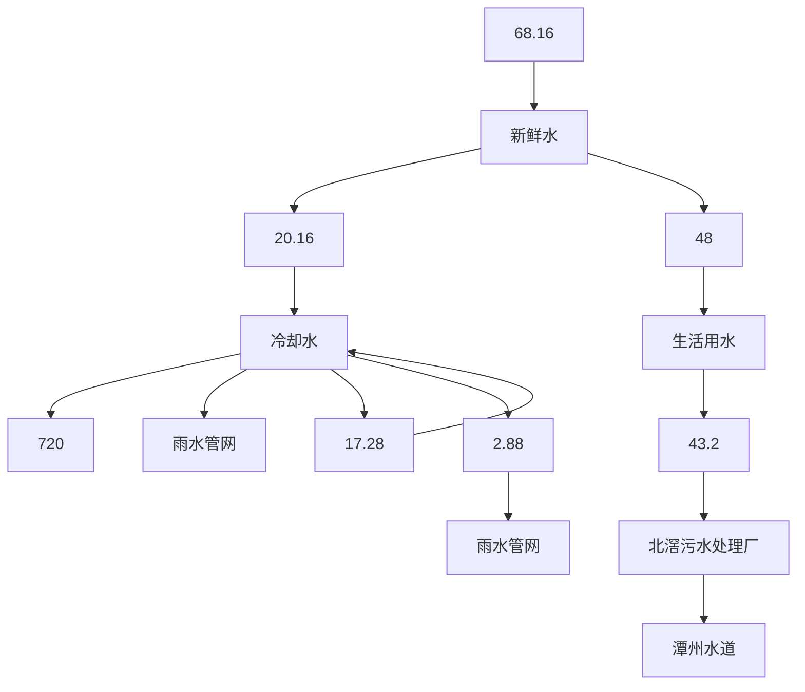

# 建设项目环境影响报告表

（污染影响类）

项目名称：佛山市碧桂冰泉饮料有限公司吹瓶车间新建项目

料有限公司

编制日期：2021年3

中华人民共和

text_image

佛山市碧桂冰泉饮
月

text_image

国生态环境部制

## 一、建设项目基本情况

<table><tr><td>建设项目名称</td><td colspan="3">佛山市碧桂冰泉饮料有限公司吹瓶车间新建项目</td></tr><tr><td>项目代码</td><td colspan="3">无</td></tr><tr><td>建设单位联系人</td><td>麦倩盈</td><td>联系方式</td><td>18169802108</td></tr><tr><td>建设地点</td><td colspan="3">佛山市顺德区北滘镇北滘社区兴业路13号之六</td></tr><tr><td>地理坐标</td><td colspan="3">厂区中心地理坐标:东经113.217683°北纬22.906305°</td></tr><tr><td>国民经济行业类别</td><td>C2926塑料包装箱及容器制造</td><td>建设项目行业类别</td><td>“二十六、橡胶和塑料制品业29”中的“53.塑料制品业292”中的“其他(年用非溶剂型低VOCs含量涂料10吨以下的除外)”</td></tr><tr><td>建设性质</td><td>√新建(迁建)□改建□扩建□技术改造</td><td>建设项目申报情形</td><td>√首次申报项目□不予批准后再次申报项目●超五年重新审核项目□重大变动重新报批项目</td></tr><tr><td>项目审批(核准/备案)部门(选填)</td><td>无</td><td>项目审批(核准/备案)文号(选填)</td><td>无</td></tr><tr><td>总投资(万元)</td><td>50</td><td>环保投资(万元)</td><td>15</td></tr><tr><td>环保投资占比(%)</td><td>30</td><td>施工工期</td><td>1个月</td></tr><tr><td>是否开工建设</td><td>√否●是:____</td><td>用地(用海)面积(m2)</td><td>无</td></tr><tr><td>专项评价设置情况</td><td colspan="3">无</td></tr><tr><td>规划情况</td><td colspan="3">无</td></tr><tr><td>规划环境影响评价情况</td><td colspan="3">无</td></tr><tr><td>规划及规划环境影响评价符合性分析</td><td colspan="3">无</td></tr><tr><td>其他符合性分析</td><td colspan="3">1、“三线一单”符合性分析1生态保护红线</td></tr></table>

根据《佛山市顺德区生态保护红线规划（2014-2025年）》的图3生态保护红线单元（详见附图8）可知，本项目不在生态保护红线范围内，故本项目的建设符合生态保护红线的要求。

## ②环境质量底线

本项目声环境质量能满足相应的标准要求，属于达标区；本项目所在区域大气环境满足相应的标准要求，属于达标区；本项目附近地表水环境未能满足相应的标准要求，属于不达标区。本项目有机废气经集气罩+二级活性炭处理后15m高排气筒排放，对周边环境影响很小。生活污水经三级化粪池处理达到广东省地方标准《水污染物排放限值》（DB44/26-2001）第二时段三级标准后，由市政下水道排至北滘污水处理厂；本项目不涉及生产废水，冷却水属于清净下水，排入附近的雨水管网。符合环境质量底线要求。

## ③资源利用上线

本项目营运过程中消耗一定量的电能、水资源，项目资源消耗量相对区域资料利用总量较少，符合资源利用上限的要求。

## ④环保准入清单

本项目为塑料制品制造项目，经查《产业结构调整指导目录（2019年本）》和《珠江三角洲地区产业结构调整优化和产业导向目录（2011年本）》，本项目不属于上述鼓励类、限制类和淘汰类之列。

经查国家发展改革委、商务部《市场准入负面清单（2020年版）》，本项目不属于负面清单范围内的项目，符合《市场准入负面清单（2020年版）》的要求。因此，本项目符合相关的产业政策要求。

## 2、选址与规划相符性分析

项目所在的地块已取得房地产权证书（粤房地证字第C4973869号，见附件2），其房屋用途为工业，土地用途为工业用地。因此，本项目选址符合城市建设和土地利用总体规划。

## 3、与饮用水源保护法律法规相适性

经查《关于调整佛山市西江水系饮用水源保护区的批复》（粤府函[2008]58号）《关于同意调整佛山市北江水系饮用水源保护区划的批复》（粤府函[2010]75号）《部分市乡镇集中式饮用水源保护区划分方案》（粤府函[2015]15 号）《广东省人民政府关于调整佛山市部分饮用水水源保护区的批复》（粤府函[2018]426 号）《佛山市顺德区供水专项规划修编（2015-2020）》等文件，项目附近的饮用水源保护区为位于项目东面的均安水厂饮用水源保护区。

经卫星定位和测距，本项目厂界距离羊额-北滘水厂饮用水源准保护区52米、距离羊额-北滘水厂饮用水源二级保护区（陆域）522米、距离羊额-北滘水厂饮用水源二级保护区（水域）847 米；本项目厂界距离羊额-北滘水厂饮用水源一级保护区（陆域）2519米，距离羊额-北滘水厂饮用水源一级保护区（水域）2468米。本项目与上述饮用水源保护区的位置关系见附图4。

综上，本项目不在饮用水源保护区内，不属于相关法律规定的限制范围。

## 4、与相关VOCs政策相符性分析

表1-1 项目与塑料行业挥发性有机物治理政策相符性分析

<table><tr><td>序号</td><td>文件</td><td>规定或要求</td><td>本项目</td><td>相符性分析</td></tr><tr><td>1</td><td>《重点行业挥发性有机物综合治理方案》(环大气[2019]53号)</td><td>1全面加强无组织排放控制。推进使用先进生产工艺。通过采用全密闭、连续化、自动化等生产技术,以及高效工艺与设备等,减少工艺过程无组织排放。提高废气收集率。遵循“应收尽收、分质收集”的原则,科学设计废气收集系统,将无组织排放转变为有组织排放进行控制。采用全密闭集气罩或密闭空间的,除行业有特殊要求外,应保持微负压状态,并根据相关规范合理设置通风量。采用局部集气罩的,距集气罩开口面最远处的VOCs无组织排放位置,控制风速应不低于0.3米/秒,有行业要求的按相关规定执行。2推进建设适宜高效的治</td><td>1本项目吹瓶生产工序均为连续化、自动化生产设备,塑料粒料在密闭的熔融室内加热,可减少有机废气无组织排放。项目采用集气罩收集吹瓶工序废气,集气罩设计控制风速0.5m/s,收集方式为负压收集,废气经风管输送进入二级活性炭吸附处理,再经DA001排气筒直接排放,符合(GB37822-2019)10.2的要求。2本项目产生的有机废气伴有恶臭异味,采用二级活性炭吸附治理技术,可有效去除恶臭气体,符合《恶臭污染物排放标准》(GB14554-93)中的恶臭污染物排放标准值。</td><td>符合规定</td></tr></table>

<table><tr><td rowspan="2"></td><td></td><td></td><td>污设施:鼓励企业采用多种技术的组合工艺,提高VOCs治理效率。低浓度、大风量废气,宜采用沸石转轮吸附、活性炭吸附、减风增浓等浓缩技术,提高VOCs浓度后净化处理。低温等离子、光催化、光氧化技术主要适用于恶臭异味等治理;生物法主要适用于低浓度VOCs废气治理和恶臭异味治理。非水溶性的VOCs废气禁止采用水或水溶液喷淋吸收处理。</td><td></td><td></td></tr><tr><td>2</td><td>《挥发性有机物无组织排放控制标准》(GB37822-2019)</td><td>1工艺过程VOCs无组织排放控制要求:7.2.2有机聚合物产品用于制品生产的过程,在混合/混炼、塑炼/塑化/熔化、加工成型(挤出、注射、压制、压延、发泡、纺丝等)等作业中应采用密闭设备或在密闭空间内操作,废气应排至VOCs废气收集处理系统;无法密闭的,应采取局部气体收集措施,废气应排至VOCs废气收集处理系统。2VOCs无组织排放废气收集处理系统要求:10.2.1企业应考虑生产工艺、操作方式、废气性质、处理方法等因素,对VOCs废气进行分类收集。10.2.2废气收集系统排风罩(集气罩)的设置应符合GB/T16758的规定。采用外部排风罩的,应按GB/T16758、AQ/T4274-2016规定的方法测量控制风速,测量点应选取在距排风罩开口面最远处的VOCs无组织排放位置,控制风速不应低于0.3m/s(行业相关规范有具体规定的,按相关规定执行)。10.2.3废气收集系统的输送管道应密闭。废气收集系统应在负压下</td><td>1本项目吹瓶生产工序均为连续化、自动化生产设备,塑料颗粒在密闭的熔融室内加热,吹瓶工序产生的有机废气采用集气罩收集后经二级活性炭吸附后引入DA001排气筒直接排放,符合(GB37822-2019)7.2.2的规定。2a、本项目采用集气罩收集吹瓶工序废气,集气罩设计控制风速0.5m/s,收集方式为负压收集,废气经风管输送进二级活性炭吸附再进入DA001排气筒直接排放,符合(GB37822-2019)10.2的要求。b、本项目非甲烷总烃经收集处理后,排放浓度低于《合成树脂工业污染物排放标准》(GB31572-2015)中的大气污染物排放限值符合(GB37822-2019)10.3.1的要求。c、本项目排气筒高度15m,符合(GB37822-2019)10.3.4的要求。3(GB37822-2019)规定的厂区内VOCs无组织排放监控位置为厂房外(门窗、通风口等排放口外1m、离地2m出),本项</td><td>符合规定</td></tr><tr><td rowspan="5"></td><td></td><td></td><td>运行。10.3.1VOCs 废气收集处理系统污染物排放应符合GB16297或相关行业排放标准的规定。10.3.4排气筒高度不低于15m(因安全考虑或有特殊工艺要求的除外),具体高度以及与周围建筑物的相对高度关系应根据环境影响评价文件确定。3企业厂区内及周边污染监控要求:11.1企业边界及周边VOCs监控要求执行GB 16297或相关行业排放标准的规定。</td><td>目使用已建成的厂房,厂房边界即为企业边界,综合考虑,本报告认为,本项目厂房外的无组织排放限值应执行更严格的厂界排放限值,即《合成树脂工业污染物排放标准》(GB31572-2015)中的企业边界大气污染物浓度限值。</td><td></td></tr><tr><td>3</td><td>《广东省打赢蓝天保卫战实施方案(2018-2020年)》(粤府[2018]128号)</td><td>地级市以上建成区严格限制建设化工、包装印刷、工业涂装等涉VOCs排放项目,新建石油化工、包装印刷、工业涂装企业原则上应入园进区。</td><td>本项目为塑料制品项目,不属于重点行业,不属于严格限制建设项目。</td><td>符合规定</td></tr><tr><td>4</td><td>《广东省挥发性有机物(VOCs)整治与减排工作方案(2018-2020年)》(粤环发[2018]6号)</td><td>全面推进石油炼制与石油化工、医药、合成树脂、橡胶和塑料制品制造、涂料/油墨/颜料制造等化工行业VOCs减排,通过源头预防、过程控制、末端治理等综合措施,确保实现达标排放。优化生产工艺过程。加强工业企业VOCs无组织排放管理,推动企业实施生产过程密闭化、连续化、自动化技术改造,强化生产工艺环节的有机废气收集,减少挥发性有机物排放。</td><td>本项目为塑料制品项目,生产工序均为连续化、自动化生产设备,塑料粒料在密闭得熔融室内加热用,可减少有机废气无组织排放。</td><td>符合规定</td></tr><tr><td>5</td><td>《广东省生态环境厅关于做好重点行业建设项目挥发性有机物总量指标管理工作的通知》(粤环发[2019]2号)</td><td>对VOCs排放量大于300公斤/年的新、改、扩建项目,进行总量替代,按照附表1填报VOCs指标来源说明。其他排放量规模需要总量替代的,由本级生态环境主管部门自行确定范围,并按照要求审核总量指标来源,填写VOCs总量指标来源说明。</td><td>本项目吹瓶产生的非甲烷总烃有组织排放量为0.079t/a&lt;0.3t/a,根据《佛山市生态环境局顺德分局关于做好重点行业建设项目挥发性有机物总量指标管理工作的通知》,本项目已取得建设项目挥发性有机物排放总量分配申请表,获分配总量为0.079t/a。</td><td>符合要求</td></tr><tr><td>6</td><td>《关于珠江</td><td>1在自然保护区、水源保</td><td>本项目所在地不属于自然</td><td>符合</td></tr><tr><td></td><td>三角洲地区严格控制工业企业挥发性有机物(VOCs)排放的意见》(粤环[2012]18号)</td><td>护区、风景名胜区、森林公园、重要湿地、生态敏感区和其他重要生态功能区实行强制性保护,禁止新建VOCs污染企业。原则上珠江三角洲城市中心区核心区域内不再新建或改扩建VOCs排放量大或使用VOCs排放量大产品的企业。2所有排放VOCs的车间必须安装废气收集、回收/净化装置,收集率应大于90%。</td><td>保护区、水源保护区、风景名胜区、森林公园、重要湿地、生态敏感区和其他重要生态功能区,也不属于城市中心区核心区域。本项目各产生有机废气的工序均安装废气收集装置,收集率均大于90%。</td><td>要求</td></tr><tr><td>7</td><td>《顺德区环境运输和城市管理局转发关于印发2014年佛山市陶瓷行业、玻璃制造行业、铝型材行业和VOCs排放企业整治方案的通知》(顺管函[2014]510号)</td><td>所有排放挥发性有机物的车间必须安装废气收集、回收净化装置,收集率应大于90%;淘汰水喷淋+活性炭吸附或单纯活性炭吸附等排放状况不稳定的治理技术。</td><td>本项目各产生有机废气的工序均按装废气收集装置,收集率均大于90%。项目因废气产生量低于标准限值,拟采用的有机废气处理方式为负压收集后经二级活性炭吸附后直接排放。</td><td>符合要求</td></tr></table>

## 二、建设项目工程分析

## （一）项目内容

本项目租用单层厂房生产，项目占地面积 3189m2，建筑面积 3189m2，工程具体内容按主体工程、公用工程、辅助工程、环保工程等内容细化见表1-1。

表 2-1 项目工程设施细分表

<table><tr><td>类别</td><td colspan="2">项目组成</td><td>建设内容</td></tr><tr><td>主体工程</td><td>生产车间</td><td>建筑面积 $1799m^{2}$ 。</td><td>主要用于饮用水瓶吹瓶工艺。</td></tr><tr><td>辅助工程</td><td>仓库</td><td>建筑面积 $1390m^{2}$ 。</td><td>主要用于原辅材料贮存。</td></tr><tr><td rowspan="4">公用工程</td><td>给水工程</td><td>生活用水和冷却用水</td><td>由市政供水系统供应,年用水量68.16t/a</td></tr><tr><td rowspan="2">排水工程</td><td>生活污水</td><td>经三级化粪池处理后排入北滘污水处理厂</td></tr><tr><td>冷却水</td><td>排入附近雨水管网</td></tr><tr><td>供电工程</td><td>生产、生活用电</td><td>由市政供电系统供应,年用电量100万kWh。</td></tr><tr><td rowspan="4">环保工程</td><td>废气治理设施</td><td>吹瓶有机废气</td><td>吹瓶产生的有机废气经收集后经二级活性炭吸附处理后DA001排气筒排放,排放高度为15m</td></tr><tr><td rowspan="2">废水治理设施</td><td>生活污水</td><td>三级化粪池</td></tr><tr><td>生产废水</td><td>生产废水为冷却用水,循环利用,不外排</td></tr><tr><td>固废处理设施</td><td>生活垃圾一般工业固废危险废物</td><td>生活垃圾箱一般工业固废临时贮存区危险废物临时贮存区,面积 $3m^{2}$ </td></tr></table>

## （二）产品方案及规模

本项目产品方案如下。

表2-2 项目生产规模情况

<table><tr><td>序号</td><td>产品名称</td><td>生产规模</td></tr><tr><td>1</td><td>PET 塑料瓶</td><td>900 万个/年</td></tr></table>

## （三）原辅材料规模

本项目主要原辅材料用量见下表：

表2-3 主要原辅材料用量一览表

<table><tr><td>序号</td><td>名称</td><td>计量单位</td><td>年用量</td><td>包装方式</td><td>最大储存量</td><td>用途</td></tr><tr><td>1</td><td>PET瓶胚</td><td>吨/年</td><td>500</td><td>散装</td><td>10</td><td>吹瓶</td></tr></table>

原辅材料理化性：

PET：PET 全称为聚对苯二甲酸乙二醇酯，为高聚合物，由对苯二甲酸乙二醇酯发生脱水缩合反应而来。对苯二甲酸乙二醇酯是由对苯二甲酸和乙二醇发生酯化反应所得。PET 是乳白色或浅黄色、高度结晶的聚合物，表面平滑有光泽。在较宽的温度范围内具有优良的物理机械性能，长期使用温度可达 120℃，电绝缘性优良，甚至在高温高频下，其电性能仍较好，但耐电晕性较差，抗蠕变性、耐疲劳性、耐磨擦性、尺寸稳定性都很好。广泛用于纤维、薄膜、工程塑料、聚酯瓶等行业。

## （四）设备规模

本项目主要设备见下表：

表2-4 主要设备清单一览表

<table><tr><td>序号</td><td>名称</td><td>计量单位</td><td>设备数量</td><td>生产工序</td></tr><tr><td>1</td><td>吹瓶机</td><td>台</td><td>4</td><td>吹瓶</td></tr><tr><td>2</td><td>冷水机</td><td>台</td><td>1</td><td>冷却</td></tr></table>

## （五）公用工程

## 1、给水工程

项目用水由市政供水管网提供，主要用水为员工生活用水、生产用水等，总用水量约为 68.16t/a。

生活用水：本项目员工人数共4人，厂区内不设员工宿舍和食堂。根据《广东省用水定额》（DB44/T 1461-2014）40 升/人·日计算，本项目员工生活用水为 48t/a。

生产用水：本项目生产用水为冷却水，年用水量约为20.16t/a。

## 2、排水工程

生活污水经三级化粪池进行预处理达到广东省《水污染物排放限值》（DB44/26-2001）第二时段三级标准后，进入北滘污水处理厂处理达到《城镇污水处理厂污染物排放标准》（GB18918-2002）一级A标准与广东省《水污染物排放限值》（DB44/26-2001）第二时段一级标准较严者后，排入潭州水道。

冷却水属于清净下水，排入附近的雨水管网。

## 3、供电工程

项目用电采用市政电网供电，项目内不设发电机，年用电量约60万度。

## （六）员工规模及工作制度

项目定员4人，实行 2班制，每天工作 12小时（8:00\~20:00），年工作时间为 300天，厂区内不设宿舍和饭堂。

## （七）项目建设进度计划

<table><tr><td></td><td colspan="5">本项目预计于2021年6月建成投产。本次环评时,工程正在进行前期设计。</td></tr><tr><td rowspan="2">工艺流程和产排污环节</td><td colspan="5">图2-1 PET瓶工艺流程及产污环节图1、工艺说明:项目外购原料PET瓶胚,利用吹瓶机进行吹瓶。吹瓶过程为将瓶胚的胚体部分加热软化,为了保持瓶口形状,瓶胚口不需要加热,吹瓶过程利用空气压缩机将空气鼓入吹瓶机将其吹胀使之紧贴于模具上(吹瓶过程采用电加热,加热温度约60°C),之后自然冷却即为成品。其中需要使用冷却水对模具进行间接冷却,冷却水循环使用不外排,定期排水可作清净下水通过雨水管道排放。2、全厂产污环节汇总根据工程分析,结合项目实际情况,列出各产污环节、主要污染物及拟采取的污染防治措施汇总,详见下表。表2-5 本项目各产污环节、主要污染物及拟采取的污染防治措施汇总</td></tr><tr><td>类别废水</td><td>类型生活污水</td><td>产生环节日常办公</td><td>主要污染物 $COD_{Cr}$ 、 $BOD_5$ 、SS、氨氮</td><td>拟采取的污染防治措施经三级化粪池处理达标后排入北滘污水处理厂。</td></tr><tr><td rowspan="10"></td><td>废气</td><td>有机废气</td><td>吹瓶</td><td>非甲烷总烃</td><td>经收集后进入二级活性炭吸附处理后经排放口高度20m的排气筒(编号DA001)排放。</td></tr><tr><td rowspan="2">噪声</td><td>机械设备</td><td>生产加工</td><td>/</td><td rowspan="2">采用低噪设备,对设备进行隔声、消音和减振处理</td></tr><tr><td>风机</td><td>废气收集</td><td>/</td></tr><tr><td rowspan="7">固废</td><td>生活垃圾</td><td>日常办公</td><td>/</td><td>交环卫部门清运</td></tr><tr><td>次品</td><td>吹瓶</td><td>/</td><td>交回收商回收处理</td></tr><tr><td>废包装材料</td><td>生产过程</td><td>/</td><td>交回收商回收处理</td></tr><tr><td>废活性炭</td><td>废气设施</td><td>/</td><td>交有资质单位处理</td></tr><tr><td>废机油</td><td>设备维修</td><td>/</td><td>交有资质单位处理</td></tr><tr><td>废含油抹布</td><td>设备维修</td><td>/</td><td>交有资质单位处理</td></tr><tr><td>废油桶</td><td>设备维修</td><td>/</td><td>交有资质单位处理</td></tr><tr><td colspan="6"></td></tr><tr><td>与项目有关的原有环境污染问题</td><td colspan="5">本项目为新建项目,无与本项目有关的原有污染问题。项目所在区域存在主要污染物为附近企业在生产运营过程中产生的废气、噪声、废水、固废。</td></tr></table>

## 三、区域环境质量现状、环境保护目标及评价标准

<table><tr><td rowspan="19">区域环境质量现状</td><td colspan="4">1、项目所在区域环境功能区划项目所在区域环境功能属性见下表。表3-1 建设项目环境功能属性一览表</td></tr><tr><td>编号</td><td>功能区划名称</td><td>功能区类别及属性</td><td>依据</td></tr><tr><td>1</td><td>地表水环境功能区</td><td>潭洲水道“林头桥至北滘尾段”,工业、农业用水功能,执行《地表水环境质量标准》(GB3838-2002)III类标准。</td><td>《关于同意实施广东省地表水环境功能区划的批复》(粤府函[2011]29号)</td></tr><tr><td>2</td><td>环境空气质量功能区</td><td>大气环境二类功能区</td><td>《关于调整顺德区环境空气质量功能区划的复函》(佛府办函[2014]494号)</td></tr><tr><td>3</td><td>声环境功能区</td><td>声环境3类功能区。</td><td>《佛山市声环境功能区划分方案的通知》(佛府办[2015]72号)(编号3307)</td></tr><tr><td>4</td><td>是否属于基本农田保护区</td><td>否</td><td></td></tr><tr><td>5</td><td>是否饮用水水源保护区</td><td>否</td><td>---</td></tr><tr><td>6</td><td>是否风景名胜区</td><td>否</td><td>---</td></tr><tr><td>7</td><td>是否自然保护区</td><td>否</td><td>---</td></tr><tr><td>8</td><td>是否森林公园</td><td>否</td><td>---</td></tr><tr><td>9</td><td>是否生态功能保护区</td><td>否</td><td>---</td></tr><tr><td>10</td><td>是否水土流失重点防治区</td><td>否</td><td>---</td></tr><tr><td>11</td><td>是否人口密集区</td><td>否</td><td>---</td></tr><tr><td>12</td><td>是否重点文物保护单位</td><td>否</td><td>---</td></tr><tr><td>13</td><td>是否三河、三湖</td><td>否</td><td>---</td></tr><tr><td>14</td><td>是否水库库区</td><td>否</td><td>---</td></tr><tr><td>15</td><td>是否污水处理厂集水范围</td><td>是(北滘污水处理厂)</td><td>---</td></tr><tr><td>16</td><td>是否属于生态敏感与脆弱区</td><td>否</td><td>---</td></tr><tr><td colspan="4">2、环境空气质量现状根据《关于调整顺德区环境空气质量功能区划的复函》(佛府办函[2014]494号),项目所在区域为环境空气质量功能二类区,执行《环境空气质量标准》(GB3095-2012及其2018年修改单)中的二级标准。(1)达标区判定根据《环境影响评价技术导则-大气环境》(HJ2.2-2018)第6.4.1.1条规定,城市环境空气质量达标情况评价指标为 $SO_2$ 、 $NO_2$ 、 $PM_{10}$ 、 $PM_{2.5}$ 、CO和 $O_3$ ,六项污染物</td></tr></table>

全部达标即为城市环境空气质量达标。

第6.4.1.2条规定，根据国家或地方生态环境主管部门公开发布的城市环境空气质量达标情况，判断项目所在区域是否属于达标区，因此本报告采用《2020年度佛山市顺德区环境质量状况公报》作为判断依据。

根据公报，2020 年顺德区（国控测点）环境空气污染物浓度及达标评价情况见下表。

表 3-2 2020 年顺德区（国控测点）环境空气污染物浓度及达标评价情况

<table><tr><td>序号</td><td>污染物</td><td>平均时间</td><td>顺德区平均浓度</td><td>评价标准</td><td>达标评价</td></tr><tr><td>1</td><td> $SO_2$ </td><td>年平均浓度</td><td> $7μg/m^3$ </td><td> $60μg/m^3$ </td><td>达到(GB3095-2012)二级标准</td></tr><tr><td>2</td><td> $NO_2$ </td><td>年平均浓度</td><td> $30μg/m^3$ </td><td> $40μg/m^3$ </td><td>达到(GB3095-2012)二级标准</td></tr><tr><td>3</td><td> $PM_{10}$ </td><td>年平均浓度</td><td> $43μg/m^3$ </td><td> $70μg/m^3$ </td><td>达到(GB3095-2012)二级标准</td></tr><tr><td>4</td><td> $PM_{2.5}$ </td><td>年平均浓度</td><td> $21μg/m^3$ </td><td> $35μg/m^3$ </td><td>达到(GB3095-2012)二级标准</td></tr><tr><td>5</td><td>CO</td><td>24小时均值第95百分位数</td><td> $1.0mg/m^3$ </td><td> $4mg/m^3$ </td><td>达到(GB3095-2012)二级标准</td></tr><tr><td>6</td><td> $O_3$ </td><td>最大8小时值第90百分位数</td><td> $155μg/m^3$ </td><td> $160μg/m^3$ </td><td>超出(GB3095-2012)二级标准</td></tr></table>

根据表3-3 可知，2020年顺德区空气污染物浓度均达标，根据《环境影响评价技术导则-大气环境》（HJ2.2-2018）的规定，判定本项目所在的顺德区为达标区。

## （2）其他污染物环境质量现状调查

本项目排放的其他污染物为非甲烷总烃，为了解本项目所在区域的非甲烷总烃的环境质量现状，本报告收集了评价范围内非甲烷总烃的历史监测资料：

非甲烷总烃环境质量现状数据引用《佛山市意派硅胶制品有限公司年产硅胶密封件 500 万件建设项目环境影响报告书》于 2019年3月15日至3月21日在位于佛山市意派硅胶制品有限公司（A1）和大沙围村（A2）的 非甲烷总烃的监测数据进行评价。本项目评价范围为 5km矩形范围，引用的项目 2个监测点均在本项目大气评价范围内，其监测数据对项目所在区域的非甲烷总烃环境质量现状评价具有代表性。监测及统计结果详见下表，监测点位见附图。

表 3-3 项目所在区域的非甲烷总烃环境质量现状调查结果 单位(mg/m3)

<table><tr><td>监测项目</td><td>监测点</td><td>监测点与本项目方位距离</td><td>监测时间</td><td>监测值范围</td><td>评价标准</td><td>最大浓度占标率(%)</td></tr><tr><td>非甲烷总烃(1h平均)</td><td>A1</td><td>2000m</td><td>2019.3.15~3.21</td><td>0.08~0.12</td><td>2.0</td><td>6</td></tr><tr><td>非甲烷总烃(1h平均)</td><td>A2</td><td>1706m</td><td>2019.3.15~3.21</td><td>0.08~0.10</td><td>2.0</td><td>5</td></tr></table>

上表监测数据统计结果显示，评价范围内 2个监测点的非甲烷总烃的1小时平均浓度范围为 0.08\~0.12mg/m3，最大浓度占标率为 6%。统计结果表明，评价范围内的环境空气质量良好。

## 2、地表水环境质量现状

本项目位于北滘污水处理厂纳污范围。北滘污水处理厂尾水排入潭洲水道“林头桥至北滘尾段”。根据《关于同意实施广东省地表水环境功能区划的批复》（粤府函[2011]29号），潭洲水道“林头桥至北滘尾段”为工业、农业用水功能，水质保护目标执行《地表水环境质量标准》（GB3838-2002）Ⅲ类标准。

为了解潭洲水道的水环境质量现状，本报告引用顺德区环境保护监测站 2020 年对潭洲水道常规监测数据，监测及统计结果见下表。

表 3-4 2020年顺德区潭洲水道水环境质量现状调查及评价结果  
(单位：mg/L,粪大肠菌群:个/L，pH 无量纲）

<table><tr><td colspan="3">潭州水道</td><td>水温</td><td>pH</td><td>溶解氧</td><td>高锰酸盐指数</td><td> $COD_{Cr}$ </td><td> $BO D_5$ </td><td>氨氮</td><td>总磷</td><td>石油类</td><td>粪大肠菌群</td></tr><tr><td rowspan="8">西海断面监测结果</td><td rowspan="2">一季度(2020.1.2)</td><td>涨潮</td><td>19.2</td><td>7.22</td><td>7.32</td><td>1.9</td><td>8</td><td>1.6</td><td>0.541</td><td>0.09</td><td>0.01</td><td>3500</td></tr><tr><td>退潮</td><td>19.0</td><td>7.20</td><td>7.11</td><td>2.0</td><td>8</td><td>1.7</td><td>0.524</td><td>0.09</td><td>0.01</td><td>3500</td></tr><tr><td rowspan="2">二季度(2020.5.6)</td><td>涨潮</td><td>26.2</td><td>7.34</td><td>7.42</td><td>2.0</td><td>8</td><td>1.6</td><td>0.419</td><td>0.10</td><td>0.01</td><td>2400</td></tr><tr><td>退潮</td><td>25.8</td><td>7.29</td><td>7.28</td><td>2.1</td><td>8</td><td>1.6</td><td>0.375</td><td>0.10</td><td>0.01</td><td>5400</td></tr><tr><td rowspan="2">三季度(2020.9.1)</td><td>涨潮</td><td>28.9</td><td>7.62</td><td>7.43</td><td>2.1</td><td>9</td><td>2.4</td><td>0.133</td><td>0.09</td><td>0.01</td><td>3500</td></tr><tr><td>退潮</td><td>29.1</td><td>7.59</td><td>7.36</td><td>2.2</td><td>9</td><td>2.3</td><td>0.145</td><td>0.09</td><td>0.02</td><td>3500</td></tr><tr><td rowspan="2">四季度(2020.11.2)</td><td>涨潮</td><td>24.9</td><td>7.37</td><td>6.14</td><td>2.2</td><td>12</td><td>3.4</td><td>0.547</td><td>0.14</td><td>0.02</td><td>3500</td></tr><tr><td>退潮</td><td>25.1</td><td>7.40</td><td>6.23</td><td>1.7</td><td>13</td><td>2.9</td><td>0.564</td><td>0.14</td><td>0.02</td><td>3500</td></tr><tr><td rowspan="5">评价</td><td colspan="2">最大值</td><td>29.1</td><td>7.62</td><td>7.43</td><td>2.2</td><td>13</td><td>3.4</td><td>0.564</td><td>0.14</td><td>0.02</td><td>3500</td></tr><tr><td colspan="2">最小值</td><td>19.0</td><td>7.20</td><td>6.14</td><td>1.7</td><td>8</td><td>1.6</td><td>0.133</td><td>0.09</td><td>0.01</td><td>2400</td></tr><tr><td colspan="2">III类标准</td><td>--</td><td>6.0-9.0</td><td>5</td><td>6</td><td>20</td><td>4</td><td>1</td><td>0.05</td><td>0.05</td><td>10000</td></tr><tr><td colspan="2">标准指数</td><td>--</td><td>0.11-0.32</td><td>0.16-0.69</td><td>0.20-0.42</td><td>0.3-0.4</td><td>0.28-0.55</td><td>0.03-0.45</td><td>0.25-0.56</td><td>0.2-0.4</td><td>0.35-0.54</td></tr><tr><td colspan="2">最低检出限L</td><td>0.1</td><td>0.01</td><td>0.01</td><td>0.5</td><td>5</td><td>0.5</td><td>0.025</td><td>0.01</td><td>0.01</td><td>200</td></tr></table>

备注：“L”表示低于检出限；未列指标铜、锌、氟化物、硒、砷、汞、镉、六价铬、铅、氰化物、挥发酚、阴离子表面活性剂、硫化物等均达标。

结果显示，2020年度潭洲水道西海断面的水质出总磷外，其他指标均达到《地表水环境质量标准》（GB3838-2002）Ⅲ类标准，根据《环境影响评价技术导则—地表水环境》（HJ 2.3-2018）规定，潭洲水道“林头桥至北滘尾段”属于水环境功能不达标区。

## 4、声环境质量现状

根据佛山市人民政府《关于印发佛山市声环境功能区划分方案的通知》（佛府函〔2015〕72）号可知，项目所在地评价区域属于3类声环境功能区。项目噪声监测方法严格按照《声环境质量标准》（GB3096-2008）的要求进行，监测仪器采用积分声级计。项目四周厂界各布设1个环境噪声监测点，分昼、夜间对项目边界噪声（项目声环境监测布点图见附图3）进行监测，监测结果如下：

表3-5 噪声现状监测表（单位：dB(A)）

<table><tr><td rowspan="2" colspan="2">监测点和编号</td><td colspan="4">监测结果</td><td colspan="2">评价标准</td><td rowspan="3">评价结果</td></tr><tr><td colspan="2">2021.2.28</td><td colspan="2">2021.2.29</td><td colspan="2">(GB3096-2008)</td></tr><tr><td>编号</td><td>监测点名称</td><td>昼间</td><td>夜间</td><td>昼间</td><td>夜间</td><td>昼间</td><td>夜间</td></tr><tr><td>1#</td><td>东厂界</td><td>60.1</td><td>50.4</td><td>60.9</td><td>50.2</td><td>≤65</td><td>≤55</td><td>达标</td></tr><tr><td>2#</td><td>南厂界</td><td>60.3</td><td>50.1</td><td>60.1</td><td>50.8</td><td>≤65</td><td>≤55</td><td>达标</td></tr><tr><td>3#</td><td>西厂界</td><td>60.2</td><td>50.2</td><td>60.6</td><td>50.5</td><td>≤65</td><td>≤55</td><td>达标</td></tr><tr><td>4#</td><td>北厂界</td><td>60.4</td><td>50.5</td><td>60.2</td><td>50.1</td><td>≤65</td><td>≤55</td><td>达标</td></tr></table>

从上面的监测结果来看，项目厂界边界的昼夜间噪声值均符合《声环境质量标准》（GB3096-2008）3 类标准。

## 5、地下水环境现状

本项目不存在地下水污染物途径，根据《建设项目环境影响报告表编制技术指南（污染影响类）》（试行），不开展环境质量现状调查。

## 6、土壤环境现状

本项目不存在土壤污染物途径，根据《建设项目环境影响报告表编制技术指南（污染影响类）》（试行），不开展环境质量现状调查。

<table><tr><td rowspan="10">环境保护目标</td><td colspan="8">1、水环境保护目标保护项目纳污水体潭州水道的水环境质量达到《地表水环境质量标准》(GB3838-2002)III类标准。2、环境空气保护目标保护项目区域的环境空气质量达到《环境空气质量标准》(GB3095-2012及其2018年修改单)中的二级标准。3、声环境保护目标确保本项目营运期厂界的声环境质量达到《声环境质量标准》(GB3096-2008)3类标准。表3-6 主要地表水环境保护目标一览表</td></tr><tr><td>名称</td><td>保护对象</td><td>保护要求</td><td>环境功能区</td><td>相对厂址位置</td><td>相对厂界距离</td><td colspan="2">与项目水力联系</td></tr><tr><td>潭州水道</td><td>河流</td><td>水质</td><td>水:III类</td><td>南</td><td>2568m</td><td colspan="2">纳污水体</td></tr><tr><td>羊额-北滘水厂二级水源保护区</td><td>饮用水源保护区</td><td>水质</td><td>水:II类</td><td>南</td><td>522m</td><td colspan="2">无联系</td></tr><tr><td>羊额-北滘水厂一级水源保护区</td><td>饮用水源保护区</td><td>水质</td><td>水:I类</td><td>南</td><td>2519m</td><td colspan="2">无联系</td></tr><tr><td colspan="8">表3-7 主要环境空气保护目标一览表</td></tr><tr><td rowspan="2">名称</td><td colspan="2">坐标</td><td rowspan="2">保护对象</td><td rowspan="2">保护内容</td><td rowspan="2">环境功能区</td><td rowspan="2">相对厂址位置</td><td rowspan="2">相对厂界距离/m</td></tr><tr><td>东经</td><td>北纬</td></tr><tr><td>美的新海岸住宅区</td><td>113.213403</td><td>22.906437</td><td>居民</td><td>人群</td><td>大气二类</td><td>西</td><td>约388</td></tr><tr><td colspan="8">注:环境保护目标坐标取距离厂址最近点位位置</td></tr><tr><td>污染物排放控制标准</td><td colspan="8">1、大气污染物排放标准1生产过程产生的污染物包括吹瓶工序产生的有机废气(以非甲烷总烃表征)和恶臭。有机废气和恶臭经集气罩收集后进入“二级活性炭吸附”处理装置处理,尾气经15m高排气筒(排气筒编号DA001)排放。非甲烷总烃排放浓度执行《合成树脂工业污染物排放标准》(GB31572-2015)中表4的大气污染物排放限值。臭气浓度执行《恶臭污染物排放标准》(GB14554-93)中表2的恶臭污染物排放标准值。2厂界处的非甲烷总烃无组织排放监控浓度执行《合成树脂工业污染物排放标准》(GB31572-2015)中表9企业边界大气污染物浓度限值,臭气浓度执行《恶臭污</td></tr></table>

染物排放标准》（GB14554-93）中表1恶臭污染物厂界标准值中新改扩建二级标准。上述污染物排放限值详见下表。

表 3-8 建设项目大气污染物排放限值一览表

<table><tr><td>排放口及编号</td><td>污染物</td><td>排放限值(mg/m3)</td><td>排气筒高度(m)</td><td>排放速率限值(kg/h)</td><td>执行标准</td></tr><tr><td rowspan="2">排气筒(DA001)</td><td>非甲烷总烃</td><td>100</td><td rowspan="2">/</td><td>/</td><td>(GB31572-2015)大气污染物排放限值</td></tr><tr><td>臭气浓度</td><td>2000(无量纲)</td><td>/</td><td>(GB14554-93)恶臭污染物排放标准值</td></tr><tr><td>类别</td><td>污染物</td><td colspan="3">企业边界大气污染物浓度限值(mg/m3)</td><td>执行标准</td></tr><tr><td rowspan="2">厂界</td><td>非甲烷总烃</td><td colspan="3">4.0</td><td>(GB31572-2015)企业边界大气污染物浓度限值</td></tr><tr><td>臭气浓度</td><td colspan="3">20(无量纲)</td><td>(GB14554-93)新改扩建二级标准</td></tr></table>

## 2、水污染物排放标准

生活污水：本项目营运期产生的生活污水经预处理后执行广东省地方标准《水污染物排放限值》（DB44/26-2001）第二时段三级标准： $\mathrm { C O D } { \leq } 5 0 0 \mathrm { m g } / \mathrm { L } , \mathrm { B O D } { \leq } 3 0 0 \mathrm { m g } / \mathrm { L } ,$ 、SS≤400mg/L，后排放至北滘污水处理厂处理。经调查，北滘污水处理厂一期、二期提标改造工程项目已建成并投入使用，目前北滘污水处理厂的出水水质执行广东省《水污染物排放限值》（DB44/26-2001）第二时段一级标准及《城镇污水处理厂污染物排放标准》（GB18918-2002）一级 A 标准中的较严者，经过处理达标后的尾水排入潭州水道。具体排放限值如下：

表 3-9 生活污水的污染物排放标准（单位：mg/L）

<table><tr><td>执行者\污染物</td><td> $COD_{Cr}$ </td><td> $BOD_5$ </td><td>氨氮</td><td>SS</td></tr><tr><td>本项目生活污水排放口</td><td>500</td><td>300</td><td>--</td><td>400</td></tr><tr><td>北滘污水处理厂</td><td>40</td><td>10</td><td>5</td><td>10</td></tr></table>

## 3、噪声排放标准

营运期本项目厂界的噪声排放执行《工业企业厂界环境噪声排放标准》（GB12348-2008）3 类标准，详见下表。

$\begin{array} { r l } { \mp \frac { 1 } { 4 } - 3 - 1 0 } &  { } \mp \frac { 1 } { 4 } \pm \frac { 1 } { 2 } \pm \frac { 1 } { 2 } \pm \frac { 1 } { 4 } \mp \frac { 1 } { 2 } \mp \frac { 1 } { 2 } \mp \frac { 1 } { 2 } \mp \frac { 1 } { 2 } \mp \frac { 1 } { 2 } \mp \frac { 1 } { 2 } \mp \frac { 1 } { 2 } \mp \frac { 1 } { 2 } \mp \frac { 1 } { 2 } \pm \frac { 1 } { 2 } \pm \frac { 1 } { 2 } \pm \frac { 1 } { 2 } \pm \frac { 1 } { 2 } \pm \frac { 1 } { 2 } \pm \frac { 1 } { 2 } \pm \frac { 1 } { 2 } \pm \frac { 1 } { 2 } \pm \frac { 1 } { 2 } \pm \frac { 1 } { 2 } \pm \frac { 1 } { 2 } \pm \frac { 1 } { 2 } \pm \frac { 1 } { 2 } \pm \frac { 1 } { 2 } \pm \frac { 1 } { 2 } \pm \frac { 1 } { 2 } \pm \frac { 1 } { 2 } \pm \frac { 1 } { 2 } \pm \frac { 1 } { 2 } \pm \frac { 1 } { 2 } \pm \frac { 1 } { 2 } \pm \frac { 1 } { 2 } \pm \frac { 1 } { 2 } \pm \frac { 1 } { 2 } \pm \frac { 1 } { 2 } \pm \frac { 1 } { 2 } \pm \frac { 1 } { 2 } \pm \frac { 1 } { 2 } \pm \frac { 1 } { 2 } \pm \frac { 1 } { 2 } \pm \frac { 1 } { 2 } \pm \frac { 1 } { 2 } \pm \frac { 1 } { 2 } \pm \frac { 1 } { 2 } \pm \frac { 1 } { 2 } \pm \frac { 1 } { 2 } \pm \frac { 1 } { 2 } \pm \frac { 1 } { 2 } \pm \frac { 1 } { 2 } \pm \frac { 1 } { 2 } \pm \frac { 1 } { 2 } \pm \frac { 1 } { 2 } \pm \frac { 1 } { 2 } \pm \frac { 1 } { 2 } \pm \frac { 1 } { 2 } \pm \frac { 1 } { 2 } \pm \frac { 1 } { 2 } \pm \frac { 1 } { 2 } \ \end{array}$

<table><tr><td rowspan="2">时段</td><td rowspan="2">场(厂)界</td><td rowspan="2">执行标准</td><td colspan="2">场(厂)界环境噪声排放限值</td><td rowspan="2">夜间噪声最大声级超过限值的幅不得高于</td></tr><tr><td>昼间</td><td>夜间</td></tr><tr><td>营运期</td><td>厂界</td><td>(GB12348-2008)3类</td><td>65</td><td>55</td><td>频发:10;偶发:15</td></tr></table>

## 4、固体废物贮存与处置标准

<table><tr><td></td><td>本项目产生的一般工业固体废物的贮存、处置执行《一般工业固体废物贮存、处置场污染控制标准》(GB18599-2001及其2013年修改单);危险废物的贮存、处置执行《危险废物贮存污染控制标准》(GB18597-2001及其2013年修改单)。</td></tr><tr><td>总量控制指标</td><td>生活污水排放量为43.2t/a, $COD_{Cr}$ 排放量为0.002t/a,NH3-N排放量为0.0002t/a。经预处理达标后通过市政管网排入北滘污水处理厂处理,污染物总量控制指标纳入北滘污水处理厂的总量控制指标内,不再单独申请总量控制指标。本项目非甲烷总烃的有组织排放量为0.079t/a,无组织排放量为0.018t/a。建议分配总量控制指标为0.079t/a。</td></tr></table>

## 四、主要环境影响和保护措施

<table><tr><td>施工期环境保护措施</td><td colspan="6">本项目租用已建厂房,因此,项目没有土建施工工程,主要是设备的安装与调试,施工期较短,故对周围环境造成的影响较小。</td></tr><tr><td rowspan="12">运营期环境影响和保护措施</td><td colspan="6">1、废水污染源(1)生活污水本项目有4名工作人员,员工不在厂内食宿,根据《广东省用水定额》(DB44/T1461-2014)可知,本项目职工生活用水量按40L/人·d计,则生活用水量48t/a。污水排放量按用水量的90%算,则生活污水排放量约43.2t/a,这部分污水主要含COD、BOD5、SS、NH3-N等污染物。生活污水经三级化粪池预处理后,排入北滘污水处理厂处理,尾水排入潭州水道。一般生活污水排放情况见下表。表4-1 本项目生活污水主要污染物的浓度和产生量</td></tr><tr><td>类型</td><td>污染物</td><td> $COD_{Cr}$ </td><td> $BOD_5$ </td><td>SS</td><td>氨氮</td></tr><tr><td rowspan="9">生活污水(43.2t/a)</td><td>产生浓度(mg/L)</td><td>250</td><td>150</td><td>100</td><td>20</td></tr><tr><td>产生量(t/a)</td><td>0.011</td><td>0.006</td><td>0.004</td><td>0.001</td></tr><tr><td>处理措施</td><td colspan="4">三级化粪池处理设施</td></tr><tr><td>排放浓度(mg/L)</td><td>200</td><td>120</td><td>80</td><td>16</td></tr><tr><td>排放量(t/a)</td><td>0.009</td><td>0.005</td><td>0.003</td><td>0.0007</td></tr><tr><td>排放标准(mg/L)</td><td>≤500</td><td>≤300</td><td>≤400</td><td>---</td></tr><tr><td>处理措施</td><td colspan="4">北滘污水处理厂处理</td></tr><tr><td>排放浓度(mg/L)</td><td>40</td><td>10</td><td>10</td><td>5</td></tr><tr><td>排放量(t/a)</td><td>0.002</td><td>0.0004</td><td>0.0004</td><td>0.0002</td></tr><tr><td colspan="6">(2)冷却水吹瓶过程为将瓶胚的胚体部分加热软化,利用空气压缩机将空气鼓入吹瓶机将其吹胀使之紧贴于模具上(吹瓶过程采用电加热,加热温度约60°C),之后自然冷却即为成品,其中需要使用水对模具进行降温冷却(不直接接触),冷却水循环利用,冷水机的循环水量为0.2t/h,循环水量约720t/a;根据《工业循环冷却水处理设计规范》GB50050-2007说明,循环冷却水系统蒸发水量约占循环水量的2.0%,排水量约占循环水量的0.4%。即新水补充量约占循环水量的2.4%。吹瓶工序每天生产使用时间约</td></tr></table>

12h/d，年工作日 300 天；总循环水量为 720t/a，新鲜水补充量为 17.28t/a，定期排水量为 2.88t/a。根据《污水综合排放标准》（GB8978-1996）和广东省《水污染物排放限值》（DB44/26-2001）中的规定：“废水排放量可不统计间接冷却水、循环水以及其他含污染物极少的清净下水的排放量”。因此，本项目循环冷却水系统定期排水可作为清净下水纳入雨水管网，不计入项目污水排放量。

（3）水平衡  

flowchart

图4-1 项目水平衡（t/a）

## （4）项目废水污染物排放情况

表 4-2 废水类别、污染物及污染治理设施信息表

<table><tr><td rowspan="2">序号</td><td rowspan="2">废水类别</td><td rowspan="2">污染物种类</td><td rowspan="2">排放去向</td><td rowspan="2">排放规律</td><td colspan="3">污染治理设施</td><td rowspan="2">排放口编号</td><td rowspan="2">排放口设置是否符合要求</td><td rowspan="2">排放口类型</td></tr><tr><td>污染治理设施编号</td><td>污染治理设施名称</td><td>污染治理设施工艺</td></tr><tr><td>1</td><td>生活污水</td><td> $CODcr$  $NH_3-N$ </td><td>城镇污水处理厂</td><td>间断排放</td><td>TW001</td><td>生活污水处理系统</td><td>化粪池</td><td>DW001</td><td>是否</td><td>企业总排雨水排放清净下水排放温排水排放车间或车间处理设施排放口</td></tr></table>

表 4-3 废水间接排放口基本情况表

<table><tr><td rowspan="2">序号</td><td rowspan="2">排放口编号</td><td rowspan="2">废水排放量/(t/a)</td><td rowspan="2">排放去向</td><td rowspan="2">排放规律</td><td rowspan="2">间歇排放时段</td><td colspan="3">受纳污水处理厂信息</td></tr><tr><td>名称</td><td>污染物种类</td><td>国家或地方污染物排放标准浓度限值/(mg/L)</td></tr><tr><td rowspan="3">1</td><td rowspan="3">DW001</td><td rowspan="3">43.2</td><td rowspan="3">进入城市污水处理厂</td><td rowspan="3">间断排放</td><td rowspan="3">8:00~12:0014:00~18:00</td><td rowspan="3">北滘污水处理</td><td>CODcr</td><td>40</td></tr><tr><td>BOD5</td><td>10</td></tr><tr><td>SS $NH_{3}-N$ </td><td>105</td></tr><tr><td></td><td></td><td></td><td></td><td></td><td></td><td>厂</td><td></td><td></td></tr></table>

表4-4 废水污染物排放执行标准表

<table><tr><td rowspan="2">序号</td><td rowspan="2">排放口编号</td><td rowspan="2">污染物种类</td><td colspan="2">国家或地方污染物排放标准及其他按规定商定的排放协议</td></tr><tr><td>名称</td><td>浓度限值/(mg/L)</td></tr><tr><td>1</td><td rowspan="4">DW001</td><td>CODcr</td><td rowspan="4">广东省地方标准《水污染物排放限值》(DB44/26-2001)第二时段二级标准</td><td>500</td></tr><tr><td>2</td><td>BOD5</td><td>300</td></tr><tr><td>3</td><td>SS</td><td>400</td></tr><tr><td>4</td><td>NH3-N</td><td>——</td></tr></table>

表 4-5 废水污染物排放信息表（新建项目）

<table><tr><td>序号</td><td>排放口编号</td><td>污染物种类</td><td>排放浓度/(mg/L)</td><td>日排放量/(t/d)</td><td>年排放量/(t/a)</td></tr><tr><td rowspan="4">1</td><td rowspan="4">DW001</td><td>CODcr</td><td>40</td><td>0.000007</td><td>0.002</td></tr><tr><td>BOD5</td><td>10</td><td>0.000001</td><td>0.0004</td></tr><tr><td>SS</td><td>10</td><td>0.000001</td><td>0.0004</td></tr><tr><td>NH3-N</td><td>5</td><td>0.000001</td><td>0.0002</td></tr><tr><td rowspan="4" colspan="2">全厂排放口合计</td><td colspan="3">CODCr</td><td>0.002</td></tr><tr><td colspan="3">BOD5</td><td>0.0004</td></tr><tr><td colspan="3">SS</td><td>0.0004</td></tr><tr><td colspan="3">NH3-N</td><td>0.0002</td></tr></table>

## （5）废水治理设施有效性分析

本项目外排废水为员工生活污水，水质简单，依托所在楼房的三级化粪池处理后，经市政污水管网排入北滘污水处理厂处理。

经调查，目前北滘污水处理厂设计进水水质见下表。生活污水经三级化粪池处理后的预测排放浓度如下：

表 4-6 北滘污水处理厂设计进水水质及本项目外排污水水质一览表 单位 mg/L

<table><tr><td>污染物</td><td> $COD_{Cr}$ </td><td> $BOD_5$ </td><td>SS</td><td>氨氮</td></tr><tr><td>北滘污水处理厂设计进水水质</td><td>350</td><td>210</td><td>250</td><td>25</td></tr><tr><td>本项目生活污水预测排放浓度</td><td>200</td><td>120</td><td>80</td><td>16</td></tr></table>

根据上表可知，本项目生活污水依托所在楼房的三级化粪池处理后，排放浓度可满足北滘污水处理厂设计进水水质的要求，因此本项目的水污染控制措施具有有效性。

## （6）地表水环境影响评价结论

本项目生活污水经三级化粪池处理后，排放浓度均可满足北滘污水处理厂设计进水水质的要求，因此本项目的水污染控制措施具有有效性；本项目位于北滘污水处理厂纳污范围内，排放的生活污水和生产废水量不大，不会对北滘污水处理厂的处理规模造成冲击；杏坛镇污水处理厂环境竣工验收监测报告显示，现有工艺处理污水后，尾水污染物排放浓度均低于排放标准，经处理达标后的废水稳定达标排放，因此本项目外排生活污水依托北滘污水处理厂处理具有环境可行性。

吹瓶生产过程需要用水冷却，冷却水循环利用，基本不外排，需适当加入新鲜水以补充因高温而蒸发的部分冷却水，根据《污水综合排放标准》（GB8978-1996）、《环境影响评价技术导则地面水环境》（HJ/T 2.3-93）和广东省《水污染物排放标准》（DB44/26-2001）中的规定：“污水排放量中不包括间接冷却水”因此，冷却水定期排水可作清净下水通过雨水管道排放，不计入污水排放量。

## 2、废气污染源

## （1）非甲烷总烃

本项目吹瓶过程加热温度远低于其分解温度（PET为300℃以上），因此吹瓶过程PET不会发生热分解，但是在高温作用下仍有少量未聚合的单体挥发出来，污染因子以非甲烷总烃计，根据《空气污染物排放和控制手册》（美国国家环保局）中推荐的公式：无控制措施时，废气的排放系数按 0.35kg/t 原料计，本项目 PET 塑料的使用量为 500t/a，吹瓶工艺产生的非甲烷总烃量为 0.175t/a，项目每天生产 12 小时，年工作 300 天，废气的产生速率为 0.049kg/h。

建设单位在吹瓶机上方设置集气罩，非甲烷总烃经收集后经“二级活性炭”处理，引至20米的排气筒（DA001）排放。

依据《三废处理工程技术手册-废气卷》中有关公式，选取集气罩进口风速为0.5m/s，单个集气罩几何尺寸为：长1.0m、宽0.8m，按下式计算得出项目集气罩风量：

$$
\mathrm{Q} = \mathrm{V} \times \mathrm{F} \times \beta \times 3 6 0 0
$$

式中：Q——设计风量（m3/h）；

V— 集气罩进口风速 m/s，取 v=0.5m/s

F— 集气罩面积 0.8m2

β— 安全系数，β=1.05

由此计算得出项目单个集气罩风量约为1512m3/h，项目合计 4个集气罩，则设计总风机风量为7500m3/h（按计算总风量的120%取整），集气罩收集效率为 90%，二级活性炭吸附效率取80%。本项目非甲烷总烃产生及排放情况见下表。

项目有机废气产生及排放情况如下表所示；

表 4-7 本项目非甲烷总烃产排情况

<table><tr><td rowspan="3">产污环节</td><td>产生情况</td><td colspan="6">排放情况</td></tr><tr><td rowspan="2">产生量t/a</td><td colspan="4">有组织</td><td colspan="2">无组织</td></tr><tr><td>收集量t/a</td><td>产生速率kg/h</td><td>排放量t/a</td><td>排放速率kg/h</td><td>排放量t/a</td><td>排放速率kg/h</td></tr><tr><td>吹瓶</td><td>0.175</td><td>0.157</td><td>0.044</td><td>0.079</td><td>0.022</td><td>0.018</td><td>0.005</td></tr></table>

表 4-8 建设项目吹瓶排气筒大气污染物产排情况汇总

<table><tr><td rowspan="2">污染物</td><td rowspan="2">治理措施及排放形式</td><td rowspan="2">有组织产生浓度(mg/m3)</td><td rowspan="2">有组织排放浓度(mg/m3)</td><td colspan="2">排放标准</td></tr><tr><td>浓度限值(mg/m3)</td><td>速率限值(kg/h)</td></tr><tr><td>非甲烷总烃</td><td>集气罩收集后经二级活性炭吸附,高空排放;风机量:7500m3/h排气筒编号:DA001高度:15m,内径:0.5m</td><td>5.87</td><td>2.93</td><td>100</td><td>/</td></tr></table>

## （2）恶臭

本项目吹瓶过程中各原料会产生臭气。由于项目生产过程中原料散发的臭气极少，恶臭和非甲烷总烃一起通过集气罩收集，废气收集效率均可达到90%以上，收集后经“二级活性炭吸附”处理，15m 高的 DA001 排气筒高空排放，并加强车间通风减少恶臭气体的影响。

## （3）排放口基本情况

表4-9 本项目排气筒参数表

<table><tr><td rowspan="2">编号</td><td rowspan="2">名称</td><td colspan="2">排气筒底部中心坐标</td><td rowspan="2">排气筒高度/m</td><td rowspan="2">烟气流速(m/s)</td><td rowspan="2">排气筒内径/m</td><td rowspan="2">烟气温度/°C</td><td rowspan="2">年排放小时数/h</td><td rowspan="2">排放工况</td><td rowspan="2">污染物排放速率(kg/h)</td></tr><tr><td>东经</td><td>北纬</td></tr><tr><td>DA001</td><td>有机废气排气筒</td><td>113.217935</td><td>22.906399</td><td>15</td><td>11.78</td><td>0.5</td><td>30</td><td>3600</td><td>正常</td><td>NMHC: 0.022</td></tr></table>

## （6）大气污染物非正常排放核算表

表 4-10 污染源非正常排放量核算表

<table><tr><td>序号</td><td>污染源</td><td>非正常排放原因</td><td>污染物</td><td>非正常排放浓度(mg/m3)</td><td>单次持续时间/h</td><td>年发生频次/次</td><td>应对措施</td></tr><tr><td>1</td><td>吹瓶</td><td>二级活性炭装置失效,废气直排</td><td>非甲烷总烃</td><td>5.87</td><td>1</td><td>1</td><td>加强设施维护和管理,定期更换活性炭,定期监测</td></tr></table>

## （8）环境空气影响分析

本项目生产过程产生的废气污染物主要为吹瓶过程产生的有机废气（非甲烷总烃）。经废气收集系统收集后经二级活性炭吸附处理后，排气筒高空排放（排气筒编号 DA001，排放高度约 15m）。污染物排放情况计算结果表明，本项目排气筒的非甲烷总烃排放浓度为 2.93mg/m3、排放速率为 0.22kg/h，达到《合成树脂工业污染物排放标准》（GB31572-2015）中表4规定的大气污染物排放限值。

本项目未收集的非甲烷总烃以无组织形式排放，厂界预测浓度能达到《合成树脂工业污染物排放标准》（GB31572-2015）中表9企业边界大气污染物浓度限值。

本项目吹瓶过程中各原料会产生臭气，废气主要成分为苯乙烯及其他小分子化合物。恶臭和非甲烷总烃一起通过集气罩收集后经二级活性炭吸附处理，由于蜂窝活性炭表面上存在着未平衡和未饱和的分子引力或化学键力，因此表面与气体接触时，就能吸引气体分子，使其浓聚并保持在固体表面，使废气与大表面的多孔性固体物质相接触，废气中的污染物被吸附在固体表面上，使其与气体混合物分离，达到净化目的。臭气处理后通过 15m 高的 DA001 排气筒高空排放，并加强车间通风，可使恶臭排放浓度符合《恶臭污染物排放标准》（GB14554-93）表1中规定的二级新改扩建恶臭污染物厂界标准值和表2恶臭污染物厂界标准值要求。

2020年顺德区空气污染物浓度均达标，根据《环境影响评价技术导则-大气环境》（HJ2.2-2018）的规定，判定本项目所在的顺德区为达标区。本项目距离最近的环境保护目标为项目南面的海凌居民区，约446m，采取上述废气处理措施后不会对所在区域的环境空气质量造成不良影响。总体而言，项目建成后，对周边环境空气及敏感点的影响较小。

## 3、噪声

本项目噪声源主要为设备运行时产生的噪声，其噪声的强度值为 60\~85dB(A)。噪声特征以连续性噪声为主，间歇性噪声为辅。

表4-11 项目机械的噪声

<table><tr><td>序号</td><td>机械名称</td><td>数量(台)</td><td>噪声值(dB(A))</td></tr><tr><td>1</td><td>吹瓶机</td><td>4</td><td>75~85</td></tr><tr><td>2</td><td>冷水机</td><td>1</td><td>60~70</td></tr></table>

本项目营运期的噪声源为生产设备和风机产生的噪声，噪声源强在 60～85dB(A)之间，本项目位于佛山市顺德区北滘镇北滘社区兴业路 13 号之六，厂界外 200 米范围内无居民区、学校等声环境保护目标，各设备运行噪声经墙体隔声、距离衰减后，能使项目边界的噪声贡献值达到《工业企业厂界环境噪声排放标准》（GB12348-2008）中的3类标准，对项目所在区域的声环境质量影响不大。

## 4、固体废物

## （1）生活垃圾

项目员工4人，年工作 300天。生活垃圾产生量以 0.5kg/人•d计算，则本项目生活垃圾产生量为0.6t/a。交由市政环卫部门处理。

## （2）一般工业固废

①次品：吹瓶过程产生次品，由于项目外购瓶胚，因此次品无法回用于生产，根据建设单位提供资料，本项目次品产生量约占原料用量的0.1%，则次品产生量为0.5t/a收集后定期交由回收商处理。  
②废包装材料：项目 PET 瓶胚在生产过程中产生废包装材料，产生量约 0.05t/a，收集后定期交由回收商处理。

## （3）危险废物

①废机油：项目在调试设备和维修设备时会用到机油，每半年换一次机油，每次废机油产生量为0.005t，则产生废机油约 0.01t/a，收集后定期交有相应危险废物处理资质的单位处理。  
②废含油抹布：项目调试设备和维修设备时会用抹布进行擦拭机油，会产生废含油抹布，废含油抹布产生量约0.01t/a，收集后定期交有相应危险废物处理资质的单位处理。  
③废油桶：项目机油的包装桶罐在使用完后会沾有少量的机油，对照《国家危险废物名录》（环发【2016】39 号），属于危险废物，废物类别为“HW49 其他废物”，机油桶包装规格为 10kg/桶，机油桶净重为 1kg/桶，则废油桶产生量为 0.001t/a。  
④废活性炭：项目有机废气经“二级活性炭吸附”废气处理设施进行处理，有机废气收集量为 0.157t/a， “活性炭吸附”废气处理设施（80%去除率）削减量为 0.157×80%=0.126t/a，项目废气治理设施活性炭填充量约 200kg，每年更换 3 次，则废活性炭产生量为 200×3+157=757kg/a。

表 4-12 危险废物汇总表

<table><tr><td>序号</td><td>种类</td><td>危险废物类别</td><td>危险废物代码</td><td>产生量(t/a)</td><td>产生工序及装置</td><td>形态</td><td>主要成分</td><td>危险成分</td><td>产废周期</td><td>危险特性</td><td>污染防治措施</td></tr><tr><td>1</td><td>废机油</td><td>HW08</td><td>900-249-08</td><td>0.01</td><td>调试和维修设备</td><td>固态</td><td>/</td><td>机油</td><td>半年</td><td>T, I</td><td rowspan="4">交有危废处置资质的公司回收处理</td></tr><tr><td>2</td><td>废含油抹布</td><td>HW49</td><td>900-041-49</td><td>0.01</td><td>调试和维修设备</td><td>固态</td><td>/</td><td>机油</td><td>半年</td><td>T, I</td></tr><tr><td>3</td><td>废油桶</td><td>HW49</td><td>900-041-49</td><td>0.001</td><td>调试和维修设备</td><td>固态</td><td>/</td><td>机油</td><td>半年</td><td>T, In</td></tr><tr><td>4</td><td>废活性炭</td><td>HW49</td><td>900-041-49</td><td>0.757</td><td>治理设施</td><td>固体</td><td>有机溶剂</td><td>有机溶剂</td><td>每季度</td><td>T</td></tr><tr><td colspan="4">合计</td><td>0.778</td><td>--</td><td>--</td><td>--</td><td>--</td><td>--</td><td>--</td><td>--</td></tr></table>

本项目固体废物主要为员工的生活垃圾、次品、废包装料、废机油、废含油抹布、废机油桶、废活性炭。项目员工的生活垃圾，统一收集后交由环卫部门清运处理；次品、废包装料由一般工业固体废物回收公司回收利用；废机油、废含油抹布、废机油桶、废活性炭分类收集后交由有资质单位处理。项目产生的固体废物经过上述措施处理后，对周围环境影响不大。

## 5、环境风险评价

## （1）物质风险和重大危险源识别

根据《建设项目环境风险评价技术导则》（HJ169-2018）附录 B，识别项目使用的危险化学品和风险物质如下表所示。

表4-13 主要环境风险物质贮存情况及临界量

<table><tr><td>物质名称</td><td>有害成分</td><td>有害成分所占比例(%)</td><td>CAS号</td><td>储存方式</td><td>使用量(吨)</td><td>存储量 $q_n$ (吨)</td><td>临界量 $Q_n$ </td><td> $q_n/Q_n$ </td></tr><tr><td>机油</td><td>机油</td><td>100%</td><td>/</td><td>10kg/桶</td><td>0.1</td><td>0.02</td><td>2500</td><td> $8\times 10^{-5}$ </td></tr><tr><td>废机油</td><td>机油</td><td>100%</td><td>/</td><td>10kg/桶</td><td>0.1</td><td>0.01</td><td>2500</td><td> $4\times 10^{-5}$ </td></tr></table>

## （2）环境风险潜势初判

根据《建设项目环境风险评价技术导则》（HJ169-2018），建设项目环境风险潜势划分为Ⅰ、Ⅱ、Ⅲ、Ⅳ/Ⅳ+级。根据建设项目涉及的物质和工艺系统的危险性（P）

及其所在地的环境敏感程度（E），结合事故情形下环境影响途径，对建设项目潜在环境危害程度进行概化分析，并确定环境风险潜势。其中危险物质及工艺系统危险性（P）等级由危险物质数量与临界量的比值（Q）和所属行业及生产工艺特点（M）。

本项目涉及的危险物质（机油、废机油、乳液），根据导则附录 C规定，当存在多种危险物质时，则按式（C.1）计算物质总量与其临界量比值（Q）：

$$
Q = \frac {q _ {1}}{Q _ {1}} + \frac {q _ {2}}{Q _ {2}} + \dots \frac {q _ {n}}{Q _ {n}} \tag {C.1}
$$

当Q＜1时，项目环境风险潜势为I。

当 Q≥1 时，将 Q 值划分为：（1）1≤Q＜10；（2）10≤Q＜100；（3）Q≥100。

根据表4-13 可看到，危险化学品存储量/临界量Q为 0.000012<1，由此可以判定本项目的环境风险潜势为I。

## （3）评价工作等级判定

根据《建设项目环境风险评价技术导则》（HJ169-2018），本项目的风险评价等级根据本项目涉及的物质及工艺系统危险性和项目区域的环境敏感性确定环境风险潜势，环境风险评价等级划分见下表：

表 4-14 评价工作等级划分依据

<table><tr><td>环境风险潜势</td><td>IV、IV+</td><td>III</td><td>II</td><td>Ia</td></tr><tr><td>评价工作等级</td><td>一</td><td>二</td><td>三</td><td>简单分析</td></tr></table>

a是相对详细评价工作内容而言，在描述危险物质、环境影响途径、环境危害后果、风险防范措施等方面给出定性的说明。

根据《建设项目环境风险评价技术导则》（HJ169-2018），风险潜势为Ⅰ，可开展简单分析。因此本报告对本项目开展环境风险简单分析。

## （4）风险敏感目标

本项目风险敏感目标见表 3-6 和表3-7。

## （5）环境风险识别

①物质危险性识别

本项目机油、废机油的危险性为毒性（Toxicity，T）、易燃性（Ignitability，I）。

②生产系统危险性识别

设备维护过程因员工操作不慎或者设备故障而导致机油和废机油泄漏，遇明火、高热或与氧化剂接触，有引起燃烧的危险；储存过程可能因为容器破裂而导致机油和乳液泄漏，遇明火、高热或与氧化剂接触，有引起燃烧的危险。

## （6）环境风险分析

本项目风险源及泄漏途径、后果分析见下表。

4-15 风险分析内容表

<table><tr><td>事故起因</td><td>环境风险描述</td><td>设计化学品(污染物)</td><td>风险类别</td><td>途径及后果</td><td>工序</td><td>风险防范措施</td></tr><tr><td>事故排放</td><td>废气未经处理达标直接排至外环境</td><td>非甲烷总烃</td><td>大气环境</td><td>对周围大气环境造成短时污染</td><td>吹瓶工序</td><td>定期检查和维护废气管道,一旦发生未达标排放,立即停止生产。</td></tr><tr><td>事故泄漏</td><td>机油和废机油泄漏</td><td>机油</td><td>水环境</td><td>对附近内河涌水质造成影响</td><td>危废间</td><td>危险废物暂存间设置围堰,做好防渗措施</td></tr><tr><td rowspan="2">火灾、爆炸</td><td>燃烧烟尘及污染物污染周围大气环境</td><td>CO、颗粒物</td><td>大气环境</td><td>对周围大气环境造成短时污染</td><td>危废间</td><td>落实防止火灾措施</td></tr><tr><td>消防废水通过雨水管进入附近水体</td><td>COD等</td><td>水环境</td><td>对附近内河涌水质造成影响</td><td>危废间</td><td>落实防止火灾措施</td></tr></table>

## （7）风险影响分析

项目废气处理设施出现故障，导致有机废气未按要求排至外环境，对环境造成危害，废气处理设施发生故障，立即停止生产。可以使污染源不再排放有机废气，其风险是可控的，因此对周围大气环境的影响不大。

本项目涉及的危险物资为机油和废机油，环境风险类型为泄漏、火灾引起的伴生/次生污染物排放。影响途径主要是泄漏的机油和废机油、发生火灾时的消防废水通过排水系统进入市政管网或周边水体。本项目原料仓贮存的机油和危废仓贮存的废机油量极少，通过围堰等措施可及时收集泄漏的机油和废机油；当发生火灾时，机油、废机油的燃烧产生的废气对周围大气环境造成短时污染，经过扑灭火灾后可以使废气停止排放，其风险是可控的，因此对周围大气环境的影响不大；当发生火灾时，所产生的消防废水可能溢出或通过车间排水系统进入市政管网或周边雨水管网，有可能对周边的水体造成不良影响，因此建设单位必须落实有效的防泄漏、防火措施，降低风险事故发生的概率，同时做好与园区的应急预案联动，避免消防废水进入外环境。

综合以上分析，废气因为处理设施出现故障导致不达标排放的情况通过采取措施后完全可控，不会对周围环境造成威胁。机油、废机油出现泄露、火灾导致对附近内河涌水质及大气环境造成影响的情况通过采取措施后完全可控，因此对周围大气环境

及水环境的影响不大。

## （8）风险控制措施建议

① 为防止突发事件后的环境风险，企业应建立突发环境事件应急预案制度，配备应急器材。  
② 定期做好废气处理设施的检修和维护，对操作人员进行定期培训。  
③危废暂存间地面需采用防渗材料处理，铺设防渗漏的材料。  
④定期检查机油和乳液包装桶、废机油暂存桶是否完整，避免包装桶破裂引起易燃液体泄漏。  
⑤严格执行安全和消防规范。车间内合理布置各生产装置，预留足够的安全距离，以利于消防和疏散。  
⑥严格按防火、防爆设计规范的要求进行设计，配置相应的灭火装置和设施，设置火灾报警系统，以便自动预警和及时组织灭火扑救。

## （9）评价结论

项目不使用危险化学品。通过简单风险分析，项目主要风险为使用的废气因为处理设施出现故障导致不达标排放，其可能性较小，且风险可控，不会对周边环境造成明显威胁。以及机油、废机油的泄露和燃烧造成的环境影响，通过日常的检查和相应的防控措施，其发生的可能性较小，且风险可控不会对周边环境造成明显威胁。

项目在落实相应风险防范和控制措施的情况下，项目总体环境风险可控。

## （10）建设项目环境风险简单分析内容表

表 4-16 建设项目环境风险简单分析内容表

<table><tr><td>建设项目名称</td><td>佛山市碧桂冰泉饮料有限公司吹瓶车间新建项目</td></tr><tr><td>建设地点</td><td>佛山市顺德区北滘镇北滘社区兴业路13号之六</td></tr><tr><td>地理坐标</td><td>东经113.217683°北纬22.906305°</td></tr><tr><td>主要危险物质及分布</td><td>/</td></tr><tr><td>环境影响途径及危害后果(大气、地表水、地下水等)</td><td>1废气未经处理达标直接排至外环境2火灾产生的废气对周围大气环境造成短时污染3因火灾或泄露对附近内河涌水质造成影响</td></tr><tr><td>风险防范措施要求</td><td>1为防止突发事件后的环境风险,企业应建立突发环境事件应急预案制度,配备应急器材。2定期做好废气处理设施的检修和维护,对操作人员进行定期培训。3危废暂存间地面需采用防渗材料处理,铺设防渗漏的材料。4定期检查机油和乳液包装桶、废机油暂存桶是否完整,避免包装桶破裂引起易燃液体泄漏。5严格执行安全和消防规范。车间内合理布置各生产装置,预留足够的安全距离,以利于消防和疏散。6严格按防火、防爆设计规范的要求进行设计,配置相应的灭火装置和设施,设置火灾报警系统,以便自动预警和及时组织灭火扑救。</td></tr><tr><td colspan="2">填表说明(列出项目相关信息及评价说明):</td></tr></table>

## 6、环境监测计划

根据《排污单位自行监测技术指南 总则》（HJ 819-2017）《环境影响评价技术导则-大气环境》（HJ2.2-2018）的要求，结合项目实际情况，为本项目制定污染源监测计划。

表 4-17 本项目营运期污染源监测计划一览表

<table><tr><td>类别</td><td>监测点位</td><td>监测指标</td><td>监测频次</td><td>执行排放标准</td></tr><tr><td>废水</td><td>生活污水排放口</td><td>pH、 $COD_{Cr}$ 、 $BOD_5$ 、氨氮、SS</td><td>每年1次</td><td>《城镇污水处理厂污染物排放标准》(GB18918-2002)中二级标准</td></tr><tr><td rowspan="2">废气</td><td>排气筒(DA001)</td><td>非甲烷总烃</td><td>每年1次</td><td rowspan="2">广东省《大气污染物排放限值》(DB44/27-2001)第二时段二级标准;广东省《家具制造行业挥发性有机化合物排放标准》(DB44/814-2010)第II时段排气筒排放限值;《合成树脂工业污染物排放标准》(GB31572-2015)中表9企业边界大气污染物浓度限值</td></tr><tr><td>厂界上风向1个参照点,下风向3个监控点</td><td>非甲烷总烃</td><td>每年1次</td></tr><tr><td>噪声</td><td>各厂界</td><td>LAeq</td><td>每季度1次</td><td>《工业企业厂界环境噪声排放标准》(GB12348-2008)3类标准</td></tr></table>

## 五、环境保护措施监督检查清单

<table><tr><td>要素\内容</td><td>排放口(编号、名称)/污染源</td><td>污染物项目</td><td>环境保护措施</td><td>执行标准</td></tr><tr><td>大气环境</td><td>吹瓶</td><td>非甲烷总烃恶臭</td><td>设置1套负压抽风系统(设计风量为 $12000m^{3}/h$ ),收集各设备产生的有机废气,经二级活性炭吸附后排放(排气筒编号DA001,排放高度约15m)</td><td>非甲烷总烃达到《合成树脂工业污染物排放标准》(GB31572-2015)中表4规定的大气污染物排放限值、表9企业边界大气污染物浓度限值;恶臭达到《恶臭污染物排放标准》(GB14554-93)相应标准</td></tr><tr><td rowspan="2">地表水环境</td><td>生活污水</td><td> $COD_{Cr}$  $BOD_{5}$  $NH_{3}-N$ SS</td><td>经三级化粪池处理达标后经市政管道排入北滘污水处理厂。</td><td>(DB44/26-2001)中第二时段三级标准</td></tr><tr><td>冷却水</td><td>/</td><td>附近雨水管网</td><td>/</td></tr><tr><td>声环境</td><td>设备</td><td>噪声</td><td>选用低噪设备,采取减振措施;车间墙体、窗户应按良好隔音效果设计和建设</td><td>达到《工业企业厂界环境噪声排放标准》(GB12348-2008)3类标准</td></tr><tr><td rowspan="7">固体废物</td><td rowspan="7">生产固废</td><td>生活垃圾</td><td>交由环卫部门清运</td><td rowspan="7">不会对周围环境产生不良影响</td></tr><tr><td>次品</td><td rowspan="2">由一般工业固体废物回收公司回收利用</td></tr><tr><td>废包装材料</td></tr><tr><td>废机油</td><td rowspan="4">交由有资质的单位处理处置</td></tr><tr><td>含油废抹布</td></tr><tr><td>废机油桶</td></tr><tr><td>废活性炭</td></tr><tr><td>生态保护措施</td><td colspan="4">本项目无需特别的生态保护措施。</td></tr><tr><td>环境风险防范措施</td><td colspan="4">1为防止突发事件后的环境风险,企业应建立突发环境事件应急预案制度,配备应急器材。2定期做好废气处理设施的检修和维护,对操作人员进行定期培训。3危废暂存间地面需采用防渗材料处理,铺设防渗漏的材料。4定期检查机油和乳液包装桶、废机油暂存桶是否完整,避免包装桶破裂引起易燃液体泄漏。5严格执行安全和消防规范。车间内合理布置各生产装置,预留足够的安全距离,以利于消防和疏散。6严格按防火、防爆设计规范的要求进行设计,配置相应的灭火装置和设施,设置火灾报警系统,以便自动预警和及时组织灭火扑救。</td></tr><tr><td>其他环境管理要求</td><td colspan="4">无</td></tr></table>

## 六、结论

## （一）项目概况

佛山市碧桂冰泉饮料有限公司拟于佛山市顺德区北滘镇北滘社区兴业路 13 号之六实施“佛山市碧桂冰泉饮料有限公司吹瓶车间新建项目”。项目占地面积 3189平方米，建筑面积 3189 平方米，生产规模为年产 900 万个塑料瓶。项目总投资 50万元，其中环保投资15万元，建设内容包括主体工程、公用工程和环保工程等。

## （二）环境质量现状评价结论

1、地表水环境质量现状：从监测数据统计结果来分析，2020 年度潭洲水道西海断面的水质出总磷外，其他指标均达到《地表水环境质量标准》（GB3838-2002）Ⅲ类标准，根据《环境影响评价技术导则—地表水环境》（HJ 2.3-2018）规定，潭洲水道“林头桥至北滘尾段”属于水环境功能不达标区。  
2、大气环境质量现状：2020 年顺德区空气污染物浓度均达标，根据《环境影响评价技术导则-大气环境》（HJ2.2-2018）的规定，判定本项目所在的顺德区为达标区。

评价范围内 2 个监测点的非甲烷总烃的 1 小时平均浓度范围为 0.08\~0.12mg/m3，最大浓度占标率为6%。统计结果表明，评价范围内的环境空气质量良好。

3、声环境质量现状：本项目四面边界的声环境质量达到《声环境质量标准》（GB3096-2008）2类标准。总体而言，项目所在区域的声环境质量良好。

## （三）施工期主要污染物及环境影响

本项目所需车间使用已建成的空置厂房，施工期建设主要为设备安装、调试等设备。设备和设施建筑施工时主要产生一定粉尘、噪声等污染；设备运输时将产生一定的扬尘、噪声等污染。建设单位应严格遵守有关建筑施工的环境保护条例，防止运输扬尘，建筑垃圾、废物等及时清运，降低施工过程对周围环境造成的影响。施工期时间较短，不会对周围环境造成较大的影响。

## （四）营运期环境影响评价结论

## 1、水环境影响评价结论

本项目生活污水经三级化粪池处理后，排放浓度均可满足北滘污水处理厂设计进水水质的要求，因此本项目的水污染控制措施具有有效性；本项目位于北滘污水处理厂纳污范围内，排放的生活污水和生产废水量不大，不会对北滘污水处理厂的处理规模造成冲击；杏坛镇污水处理厂环境竣工验收监测报告显示，现有工艺处理污水后，尾水污染物排放浓度均低于排放标准，经处理达标后的废水稳定达标排放，因此本项目外排生活污水依托北滘污水处理厂处理具有环境可行性。

吹瓶生产过程需要用水冷却，冷却水循环利用，基本不外排，需适当加入新鲜水以补充因高温而蒸发的部分冷却水，根据《污水综合排放标准》（GB8978-1996）、《环境影响评价技术导则地面水环境》（HJ/T 2.3-93）和广东省《水污染物排放标准》（DB44/26-2001）中的规定：“污水排放量中不包括间接冷却水”因此，冷却水定期排水可作清净下水通过雨水管道排放，不计入污水排放量。

## 2、环境空气影响评价结论

本项目生产过程产生的废气污染物主要为吹瓶过程产生的有机废气（非甲烷总烃）。经废气收集系统收集后经二级活性炭吸附处理后，排气筒高空排放（排气筒编号DA001，排放高度约 15m）。污染物排放情况计算结果表明，本项目排气筒的非甲烷总烃排放浓度为 2.93mg/m3、排放速率为 0.22kg/h，达到《合成树脂工业污染物排放标准》（GB31572-2015）中表4规定的大气污染物排放限值。

本项目未收集的非甲烷总烃以无组织形式排放，厂界预测浓度能达到《合成树脂工业污染物排放标准》（GB31572-2015）中表9企业边界大气污染物浓度限值。

本项目吹瓶过程中各原料会产生臭气，废气主要成分为苯乙烯及其他小分子化合物。恶臭和非甲烷总烃一起通过集气罩收集后经二级活性炭吸附处理，由于蜂窝活性炭表面上存在着未平衡和未饱和的分子引力或化学键力，因此表面与气体接触时，就能吸引气体分子，使其浓聚并保持在固体表面，使废气与大表面的多孔性固体物质相接触，废气中的污染物被吸附在固体表面上，使其与气体混合物分离，达到净化目的。臭气处理后通过 15m高的DA001排气筒高空排放，并加强车间通风，可使恶臭排放浓度符合《恶臭污染物排放标准》（GB14554-93）表 1中规定的二级新改扩建恶臭污染物厂界标准值和表2恶臭污染物厂界标准值要求。

2020 年顺德区空气污染物浓度均达标，根据《环境影响评价技术导则-大气环境》（HJ2.2-2018）的规定，判定本项目所在的顺德区为达标区。本项目距离最近的环境保护目标为项目南面的海凌居民区，约446m，采取上述废气处理措施后不会对所在区域的环境空气质量造成不良影响。总体而言，项目建成后，对周边环境空

气及敏感点的影响较小。

## 3、声环境影响评价结论

项目噪声主要是各种生产加工设备产生的噪声，源强为 60\~85dB(A)，通过采取减振、隔音、降噪措施，再经墙体隔声、距离衰减后，厂界噪声能够达到《工业企业厂界环境噪声排放标准》（GB12348-2008）中的 3 类标准（昼间等效声级≤65dB(A)、夜间等效声级≤55dB(A)），因此不会对周围环境产生明显的影响。

## 4、固废影响评价结论

本项目固体废物主要为员工的生活垃圾、次品、废包装料、废机油、废含油抹布、废机油桶、废活性炭。项目员工的生活垃圾，统一收集后交由环卫部门清运处理；次品、废包装料由一般工业固体废物回收公司回收利用；废机油、废含油抹布、废机油桶、废活性炭分类收集后交由有资质单位处理。项目产生的固体废物经过上述措施处理后，对周围环境影响不大。

## 5、环境风险影响评价结论

项目不使用危险化学品。通过简单风险分析，项目主要风险为使用的废气因为处理设施出现故障导致不达标排放，其可能性较小，且风险可控，不会对周边环境造成明显威胁。以及机油、废机油的泄露和燃烧造成的环境影响，通过日常的检查和相应的防控措施，其发生的可能性较小，且风险可控不会对周边环境造成明显威胁。

项目在落实相应风险防范和控制措施的情况下，项目总体环境风险可控。

## （五）总结论

本项目在营运期产生废气、噪声、废水和固体废物等，但是通过采取必要的防治措施能够将影响控制到可接受程度，不会对周边的环境质量造成不良影响。在切实落实本项目所提出的施工期、营运期各项环保治理措施，保证各项环保投资足额投入的前提下，从环保角度而言，本项目是可行的。

## 附表

建设项目污染物排放量汇总表

<table><tr><td>项目分类</td><td>污染物名称</td><td>现有工程排放量(固体废物产生量)1</td><td>现有工程许可排放量2</td><td>在建工程排放量(固体废物产生量)3</td><td>本项目排放量(固体废物产生量)4</td><td>以新带老削减量(新建项目不填)5</td><td>本项目建成后全厂排放量(固体废物产生量)6</td><td>变化量7</td></tr><tr><td>废气</td><td>非甲烷总烃</td><td>0</td><td>0</td><td>0</td><td>0.079t/a</td><td>0</td><td>0.079t/a</td><td>0</td></tr><tr><td>废水</td><td>/</td><td>/</td><td>/</td><td>/</td><td>/</td><td>/</td><td>/</td><td>/</td></tr><tr><td rowspan="3">一般工业固体废物</td><td>一般生活垃圾</td><td>0</td><td>0</td><td>0</td><td>0.6t/a</td><td>0</td><td>0.6t/a</td><td>0</td></tr><tr><td>次品</td><td>0</td><td>0</td><td>0</td><td>0.5t/a</td><td></td><td>0.5t/a</td><td>0</td></tr><tr><td>废包装料</td><td>0</td><td>0</td><td>0</td><td>0.05t/a</td><td>0</td><td>0.05t/a</td><td>0</td></tr><tr><td rowspan="4">危险废物</td><td>废机油</td><td>0</td><td>0</td><td>0</td><td>0.01t/a</td><td>0</td><td>0.01t/a</td><td>0</td></tr><tr><td>废含油抹布</td><td>0</td><td>0</td><td>0</td><td>0.01t/a</td><td>0</td><td>0.01t/a</td><td>0</td></tr><tr><td>废油桶</td><td>0</td><td>0</td><td>0</td><td>0.001t/a</td><td>0</td><td>0.001t/a</td><td>0</td></tr><tr><td>废活性炭</td><td>0</td><td>0</td><td>0</td><td>0.757t/a</td><td>0</td><td>0.757t/a</td><td>0</td></tr></table>

注：⑥=①+③+④-⑤；⑦=⑥-①

编制单位和编制人员情况表

<table><tr><td colspan="2">项目编号</td><td colspan="3">25fcbss</td></tr><tr><td colspan="2">建设项目名称</td><td colspan="3">佛山市碧桂冰泉饮料有限公司吹瓶车间新建项目</td></tr><tr><td colspan="2">建设项目类别</td><td colspan="3">26-053塑料制品业</td></tr><tr><td colspan="2">环境影响评价文件类型</td><td colspan="3">报告表</td></tr><tr><td colspan="3">一、建设单位情况</td><td rowspan="3" colspan="2"></td></tr><tr><td colspan="2">单位名称(盖章)</td><td>佛山市</td></tr><tr><td colspan="2">统一社会信用代码</td><td>914406</td></tr><tr><td colspan="2">法定代表人(签章)</td><td>麦添满</td><td colspan="2"></td></tr><tr><td colspan="2">主要负责人(签字)</td><td>麦倩盈</td><td colspan="2"></td></tr><tr><td colspan="2">直接负责的主管人员(签字)</td><td>麦倩盈</td><td colspan="2"></td></tr><tr><td colspan="3">二、编制单位情况</td><td rowspan="3" colspan="2"></td></tr><tr><td colspan="2">单位名称(盖章)</td><td>广州</td></tr><tr><td colspan="2">统一社会信用代码</td><td>914</td></tr><tr><td colspan="3">三、编制人员情况</td><td colspan="2"></td></tr><tr><td colspan="3">1.编制主持人</td><td colspan="2"></td></tr><tr><td>姓名</td><td colspan="2">职业资格证书管理号</td><td>信用编号</td><td>签字</td></tr><tr><td>薛俊</td><td colspan="2">06354243505420052</td><td>BH035571</td><td></td></tr><tr><td colspan="5">2.主要编制人员</td></tr><tr><td>姓名</td><td colspan="2">主要编写内容</td><td>信用编号</td><td>签字</td></tr><tr><td>薛俊</td><td colspan="2">全文</td><td>BH035571</td><td>薛俊</td></tr></table>

text_image

碧江火车站
广东碧桂园
学校
利安围
大乌岗
七盏灯
沙头街
南山峡
滴水岩
森林公园
市良路
S39
500米
1:66,524
顺德东应交
顺德翁佑中学
德神洲大厦
顺德·乐汇公馆
伦教中学
金泰豪商务酒店
新海岸大厦
新海岸大酒店
新海岸公园
万向湖畔
尚弘工业大厦
好劲风大厦
项目位置
格林东方酒店
慧聪家电城店
北滘火车站
下涌
桃西中学
石纬线高速
大沙围
三洪奇立交桥
三洪奇立交桥
佛山市顺德区北滘医院
美的总部大厦
美的总部大厦二期
西滘村
高村
佛陈路
佛商贸大厦
陈村镇
陈村总商会大厦
佛陈路
佛陈路
佛陈路
佛陈路
佛陈路
佛陈路
佛陈路
佛陈路
佛陈路
佛陈路
佛陈路
佛陈路
佛陈路
佛陈路
佛陈路
佛陈路
佛陈路
佛陈路
佛陈路
佛陈路
佛陈路
佛陈路
佛陈路
佛陈路
佛陈路
佛陈局站
新高途
屏山村
都那村
西滘村
五坊
金喜悦中心里
禄洲 柏高商务酒店顺德北滘店
荣村 草村
现龙村 北滘立交 中国联通林达合作营业厅 三洪奇立交桥 三洪奇立交桥
海村 美连 大窝沙 乐安 新才 羊额村 霞石村 四村 沙湾道 沙湾道 上河 合安 勒水创客中心 新村 上涌村 海洲水道 福德 福德

附图 1 建设项目地理位置图

text_image

仓库
4#
伟业路
3#
项目位置
1#
佛山市顺德区御涂实业有限公司
2#
佛山市风之森工业固废回收仓
伟业路
5米
1:1.039

附图 2 建设项目卫星四至及噪声监测布点图

text_image

图例
项目位置
敏感点
美的新海岸住宅区
388m
500m
康诺医药连锁
北湾港分店
1-8.316
世纪公园
三乐路
三乐路
海韵居
美的广场
美的广场
新海景
美的中央研究院
业路
商业路
商业路
商业路
商业路
商业路
商业路
商业路
商业路
商业路
商业路
商业路
商业路
商业路
商业路
商业路
商业路
商业路
商业路
商业路
商业路
商业路
商业路
商业路
商业路
商业路
商业路
商业路
商业路
商业路
商业路
商业路
商业路
商业路
商业局
顺江社区居委会
喜乐购百货厂教店
顺德区国税局北区税务分局
三乐路
三乐路
南海镇经济促进局
南海镇经济促进局
南海镇经济促进局
南海镇经济促进局
南海镇经济促进局
南海镇经济促进局
南海镇经济促进局
南海镇经济促进局
南海镇经济促进局
南海镇经济促进局
南海镇经济促进局
南海镇经济促进局
南海镇经济促进局
南海镇经济促进局
南海镇经济促进局
南海镇经济促进局
南海镇经济促进局
南海镇商务区商务区商务区商务区商务区商务区商务区商务区商务区商务区商务区商务区商务区商务区商务区商务区商务区商务区商务区商务区商务区商务区商务区商务区商务区商务区商务区商务区商务区商务区商务区商务区商务区商务区商务区商务区商务区商务区商务区商务区商务区商务区商务区商务区商务区商务区商务区商务区商务区商务区商务县

附图 3 项目周边敏感点位置图

text_image

项目位置
52m
广教公园
A30
12海区王积局
北碚商务分局
三乐路
羊额北溶水厂饮用水源准保护区
项目位置
522m
A32
A33
2519m
A24
A21
A20
847m
A31
A17
A18
A19
A14
A13
A37
A5
2468m
羊额北溶水厂饮用水源一级保护区
羊额北溶水厂饮用水源二级保护区
A6
A71
A72
A73
A74
A75
A76
A77
A78
A79
A80
A81
A82
A83
A84
A85
A86
A87
A88
A89
A90
A91
A92
A93
A94
A95
A96
A97
A98
A99
100米
1.16.632

附图 4 项目与水源保护区关系图

顺德生态环境保护规划（2011\~2020年）  
水环境功能区划图  

text_image

项目所在地
Ⅱ类水质目标 Ⅲ类水质目标 Ⅳ类水质目标 1054202 控制单元编号
0 1.5 3 6 9 12 Kilometers

顺德区发展规划和统计局

附图 5 建设项目所在区域的地表水环境功能区划分图

佛山市环境空气质量功能区划分图  

text_image

项目所在地
图 1 类区
例 2 类区
1、2 类区缓冲带

附图 6 建设项目所在区域的环境空气功能区划分图

佛山市声环境功能区划分（2012-2020）顺德区  

text_image

项目所在地
图例
1类
2类
3类
4a类 航道
4a类 道路
4b类
建成区
0 2 4千米

附图 7 建设项目所在区域的声环境功能区划分图

text_image

项目所在地
饮用水源保护单元
河流保护单元
林地保护单元
基础保护单元
农田保护单元
河流恢复单元

附图 8 生态红线保护图

text_image

75000.00
原料及成品仓库
危废暂存仓
通道
通道
管道
吹瓶区
排气筒

附图 9 建设项目平面布置图

natural_image

Exterior view of a weathered industrial building with a large doorway and windows (no signage or text visible)

东面佛山市顺德区御涂实业有限公司

natural_image

Tree with leafy branches and a wooden railing in an outdoor setting (no visible text or symbols)

西面伟业路

natural_image

Exterior view of a weathered industrial building with visible structural damage and windows (no signage or text)

南面佛山市风之森工业固废回收仓

natural_image

Exterior view of a warehouse with a white shipping container being loaded onto a blue pallet, no visible text or signage

北面仓库  
附图 10 项目四至现状图

natural_image

Interior view of a large industrial warehouse with exposed ceiling beams and white walls (no text or symbols visible)

附图 11 空厂房图

text_image

北滘医院
中国联通营业部
合作营业厅
省地质物探
勘测院
建设大厦
北滘河
A1
A2
水道
大沙国
北滘火车站
南海河
琼海
国家
北滘跃进中心里
柏高商务酒店
顺德北滘店
梅林东务酒店
慧联家电城店
胜远东大厦
三洪石
立交桥
瑞丰大厦
西岸
北滘区玉规局
北滘分局
项目位置
围岗段工业大厦
围岗镇港航
管理分部
顺德水道
庆兴园
华海大厦
新海岸大厦
县永乐大厦
金泰豪颐
务酒店
新安
和号羊顾村
新才
200米
1:33,264

附图 12 项目大气监测点位图

# 营业执照

（副本）

扫描二维码登录“国家企业信用信息公示系统了解更多登记、备、许可、管信息统一社会信用代码

91440606MA562453XU

（副本号：1-1）

名 称佛山市碧桂冰泉饮料有限公司

类 型有限责任公司（自然人投资或控股）

法定代表人麦添满

经营范围许可项目：食品生产；食品用塑料包装容器工具制品生产。（依法须经批准的项目，经相关部门批准后方可开展经营活动，具体经营项目以相关部门批准文件或许可证件为准）

注册资本伍拾万元人民币

成立日期2021年03月09日

经营期限长期

住 所广东省佛山市顺德区北滘镇北滘社区兴业路13号之六（住所申报）

登记机关

2021

text_image

顺德区市场监督管理局
03年 09月 日

natural_image

Official emblem of the People's Republic of China featuring the Tiananmen Gate and national emblem (no text or symbols visible)

## 房地产权证

粤房地证字第C4973869号

<table><tr><td colspan="2">权属人</td><td colspan="5">佛山市顺德区永华木制品有限公司</td></tr><tr><td colspan="2"></td><td colspan="5"></td></tr><tr><td colspan="2">身份证号码</td><td colspan="3"></td><td>国籍</td><td></td></tr><tr><td colspan="2">房屋所有权来源</td><td>自建</td><td colspan="2">房屋用途</td><td colspan="2">工业</td></tr><tr><td colspan="2">占有房屋份额</td><td>1/1</td><td colspan="2">房屋所有权性质</td><td colspan="2"></td></tr><tr><td colspan="2">土地使用权来源</td><td>出让</td><td colspan="2">土地使用权性质</td><td colspan="2">国有</td></tr><tr><td colspan="2">房地座落</td><td colspan="5">佛山市顺德区北滘镇北滘居委会兴业路13号</td></tr><tr><td rowspan="7">房屋情况</td><td>建筑结构</td><td colspan="5">混合</td></tr><tr><td>层数</td><td colspan="2">4</td><td>竣工日期</td><td colspan="2"></td></tr><tr><td>建筑面积</td><td colspan="4">壹万伍仟捌佰零柒点玖</td><td>平方米</td></tr><tr><td>建筑面积</td><td colspan="4">壹万柒仟肆佰贰拾玖点玖</td><td>平方米</td></tr><tr><td>其中住宅建筑面积</td><td colspan="4"></td><td>平方米</td></tr><tr><td>其中套内建筑面积</td><td colspan="4">壹万柒仟肆佰贰拾玖点玖</td><td>平方米</td></tr><tr><td></td><td colspan="5">详见宗地图或单元平面图</td></tr><tr><td>况</td><td>四墙归属</td><td colspan="5"></td></tr></table>

text_image

Scanned text of contract clauses or legal document sections

<table><tr><td rowspan="7">土地情况</td><td>地号</td><td colspan="2">172078-001</td><td>图号</td><td>172-078</td></tr><tr><td>用途</td><td colspan="2">工业</td><td>土地等级</td><td></td></tr><tr><td>使用权类型</td><td colspan="2">国有</td><td>终止日期</td><td>2047年06月03日</td></tr><tr><td>使用权面积</td><td colspan="4">贰万捌仟陆佰肆拾柒点肆 平方米</td></tr><tr><td>自用面积</td><td colspan="4">贰万捌仟陆佰肆拾柒点肆 平方米</td></tr><tr><td>共用面积</td><td colspan="4">平方米</td></tr><tr><td>使用权证号</td><td colspan="2"></td><td>填证机关</td><td></td></tr><tr><td rowspan="4">房地产共有(用)情况</td><td colspan="2">共有(用)人</td><td>占有房屋份额</td><td colspan="2">共有(用).权证号</td></tr><tr><td colspan="2"></td><td></td><td colspan="2"></td></tr><tr><td colspan="2"></td><td></td><td colspan="2"></td></tr><tr><td colspan="2"></td><td></td><td colspan="2"></td></tr><tr><td colspan="2">纳税情况</td><td colspan="4"></td></tr></table>

<table><tr><td></td><td colspan="3">原房地产权证号为:2559997号。</td></tr><tr><td rowspan="3">附记</td><td colspan="2"></td><td></td></tr><tr><td colspan="2"></td><td></td></tr><tr><td colspan="2"></td><td></td></tr><tr><td colspan="2">登记字号</td><td>030106543</td><td></td></tr></table>

text_image

中华人民共和国
专用章

text_image

山市人民
2017年1月

natural_image

Pure grayscale gradient with no text, symbols, or identifiable objects

text_image

权利人 中國友順區鐵山區鎮北區支稅 收稅表圖 全部
权利种类 投撥他項权限註銷普通專項金額90元
核准日期 20070401  資定日期
权利人 梯山市財務區民權社組合會聯託社光榮 金額80億元 合計
权利种类 投撥財務區民權社組合會聯託社金額90億元 金額5200億元
核准日期 2008 年 月 九 日 二〇一八年 9月16日 至

text_image

人民政局
专用章

2018年 14月5日

北京市海淀区中关村大街1号

北京市海淀区中关村大街1号

北京市海淀区中关村大街1号

北京市海淀区中关村大街1号

北京市海淀区中关村大街1号

北京市海淀区中关村大街1号

北京市海淀区中关村大街1号

北京市海淀区中关村大街1号

北京市海淀区中关村大街1号

北京市海淀区中关村大街1号

北京市海淀区中关村大街1号

北京市海淀区中关村大街1号

北京市海淀区中关村大街1号

北京市海淀区中关村大街1号

北京市海淀区中关村大街1号

北京海淀区中关村大街1号

北京海淀区中关村大街1号

北京海淀区中关村大街1号

北京海淀区中关村大街1号

北京海淀区中关村大街1号

北京海淀区中关村大街1号

北京海淀区中关村大街1号

北京海淀区中关村大街1号

北京海淀区中关村大街1号

北京海淀区中关村大街1号

北京海淀区中关村大街1号

北京海淀区中关村大街1号

北京海淀区中关村大街1号

北京海淀区中关村大街1号

北京海淀区农村信用合作联社
中国银行股份有限公司
中国银行股份有限公司
中国银行股份有限公司
中国银行股份有限公司
中国银行股份有限公司
中国银行股份有限公司
中国银行股份有限公司
中国银行股份有限公司
中国银行股份有限公司
中国银行股份有限公司
中国银行股份有限公司
中国银行股份有限公司
中国银行股份有限公司
中国银行股份有限公司
中国银行股份有限公司
中国银行股份有限公司
中国银行股份有限公司
中国银行股份有限公司
中国银行股份有限公司
中国银行股份有限公司
中国银行股份有限公
中国银行股份有限公司
中国银行股份有限公司
中国银行股份有限公司
中国银行股份有限公司
中国银行股份有限公司
中国银行股份有限公司
中国银行股份有限公司
中国银行股份有限公司
中国银行股份有限公司
中国银行股份有限公司
中国银行股份有限公司
中国银行股份有限公司
中国银行股份有限公司
中国银行股份有限公司
中国银行股份有限公司
中国银行股份有限公司
中国银行股份有限公司
中国银行股份有限公司
中国银行股份有限公司
中国银行股份有
中国银行股份有限公司
中国银行股份有限公司
中国银行股份有限公司
中国银行股份有限公司
中国银行股份有限公司
中国银行股份有限公司
中国银行股份有限公司
中国银行股份有限公司
中国银行股份有限公司
中国银行股份有限公司
中国银行股份有限公司
中国银行股份有限公司
中国银行股份有限公司
中国银行股份有限公司
中国银行股份有限公司
中国银行股份有限公司
中国银行股份有限公司
中国银行股份有限公司
中国银行股份有限公司
中国银行股份有限责任公司
中国银行股份有限公司
中国银行股份有限公司
中国银行股份有限公司
中国银行股份有限公司
中国银行股份有限公司
中国银行股份有限公司
中国银行股份有限公司
中国银行股份有限公司
中国银行股份有限公司
中国银行股份有限公司
中国银行股份有限公司
中国银行股份有限公司
中国银行股份有限公司
中国银行股份有限公司
中国银行股份有限公司
中国银行股份有限公司
中国银行股份有限公司
中国银行股份有限公司
中国银行股份有限公司
中国银行股份限公司

text_image

权利人
佛山市顺德区景地投资有限公司（914406065989600759）
共有情况
坐落
不动产单元号
权利类型
权利性质
用途
面积
使用期限
权利其他状况
本地块原属挂牌出让，权属人应经司法拍卖取得该地块的土地使用权。
银行440606-2013-000785号出让合同的权利和义务。
本地块用于发施工厂化水产养殖项目。
本地块建设时必须按《商业》顺线条件（2013）479号《佛山市顺德区建设用地规划条件》要求（建筑密度：40%≤D≤60%，绿地率：3%≤绿地率≤30%，建筑密度，在满足建筑条件的情况下，根据此协议及使用进度设置，并符合国家有关规范及《佛山市城市规划管理技术规定》（2011年修订版）相关要求，建筑标高：≤34米/张行。
本地块根据440606-2013-000785号出让合同的变更积率：1.81≤PAR≤2.0。

text_image

不动产登记专用章
(8) 宗地图
房地号: 042879-001
房产号:
房屋编号:
房屋面积: 5164.34平方米
建筑面积: 0.00平方米
土地权利属性: 71
总高度: 0.00米
第二层高度: 0.00米
房地面积: 5164.34平方米
建筑面积: 0.00平方米
建筑面积: 0.00平方米
外地家高值: 0.00米
房地面积: 5164.34平方米
建筑面积: 0.00平方米
土地权利属性: 71
总高度: 0.00米
房地名称: 银城
面积: 5164.34平方米
用途: 银城
土地权利属性: 银城
总高度: 0.00米
房地名称: 银城
面积: 5164.34平方米
用途: 银城
土地权利属性: 银城
总高度: 0.00米
房地名称: 银城
面积: 5164.34平方米
用途: 银城
土地权利属性: 银城
总高度: 1.00米
房地名称: 银城
面积: 5164.34平方米
用途: 银城
土地权利属性: 银城
总高度: 1.00米
房地名称: 银城
面积: 5164.34平方米
用途: 银城
土地权利属性: 银城
总高度: 1.00米
用房地名: 银城
面积: 5164.34平方米
用途: 银城
土地权利属性: 银城
总高度: 1.00米
用房地名: 银城
面积: 5164.34平方米
用途: 银城
土地权利属性: 银城
总高度: 1.00米
用房地名: 铅城
面积: 5164.34平方米
用途: 银城
土地权利属性: 铅城
总高度: 1.00米
用房地名: 铅城
面积: 5164.34平方米
用途: 银城
土地权利属性: 铅城
总高度: 1.00米
用房地名: 铅城
面积: 5164.34平方米
用途: 银城
土地权利属性: 铅城
总 height: 1.00米

附件 3 法定代表人身份证复印件

麦添满

男民汉

出9607

址广东省佛山市德区北镇上福里街10号

公民份

440623196007072653

中华人民共和国

居民身份证

关山市公安分局

有期限20060718-期

街道南国中路31号业楼

中华人民共和国

居民身份证

签发机关佛山市顺德区公安局

有效期限2013.06.14-2023.06.14

## 租赁合同

text_image

市康德区永华
甲方签名：
有限公司
2021年3月1日

text_image

2021年3月1日

20

# 《建设项目环境影响报告表》编写

订立协议双方：

甲方：佛山市碧桂冰泉饮料有限公司

乙方：广州星图环境科技有限公司

根据《中华人民共和国环境保护法》、《建设项目环境保护管理条例》、《中华人民共和国合同法和省、市对环境保护的有关规定，结合本项目的具体情况，甲乙双方经充分协商、签订本协议，共同遵守。

甲方委托乙方编写《佛山市碧桂冰泉饮料有限公司吹瓶车间新建项目环境影响报告》，甲方应提供该建设项目的相关资料，包括：

a.建设项目性质及名称，建设地点，建设规模，项目总平面布置图，项目总管道布置图，给排水情况，供电，供热，水、电、燃油、燃煤消耗总量；  
b.主要生产产品及规模，主要生产设备，主要原材料及用量，生产工艺及排污流程，主要污染物排放及治理情况，员工人数，企业营业执照，用地证明和租赁合同等。甲方提供上述资料，并加盖印章。若资料须更改或资料有所变动，应及时通知乙方更正。

2、本项目环评经费为人民币：壹万伍仟元整（￥15000.00），协议生效后三天内，甲方支付全部环评费用给乙方。（不含税）

3、乙方接到甲方的委托后，在甲方提供《建设项目环境影响报告》所需的上述相关资料并取得环保局初审意见后十个工作日内，完成报告编写任务，并负责上网填写本项目相关环评资料上传环保局。甲方如未能按时提供环评所需上述资料，则乙方递交报告表时间顺延。

本协议正本两份，甲双方各执一份。本协议自双方签字之日起正式生效。未尽事宜由

甲方（盖

地址：

电话：

签订日期：

text_image

双方协商解决。
章）
表满

地址：

电话：

text_image

环境科技有限公司
4401720309102

##

根据《中华人民共和国环境影响评价法》、《中华人民共和国行政许可法》、《建设项目环境影响评价政府信息公开指南（试行）》（环办[2013]103号）、《环境影响评价公众参与办法》（生态环境部令第4号），特对环境影响评价文件（公开版）作出如下声明：

我单位提供的《佛山市碧桂冰泉饮料有限公司吹瓶车间新建项目环境影响评价报告表》（公开版）不含国家秘密、商业秘密和个人隐私，同意按照相关规定予以公开。

建设单位（

法定代表人（

text_image

佛山市碧桂冰泉贷款
盖章）
签名） 贾泽满

评价单位（盖章

法定代表人（签名

text_image

州星园环境科技有限公司
4401120300105

本声明书原件交环保审批部门，声明单位可保留复印件