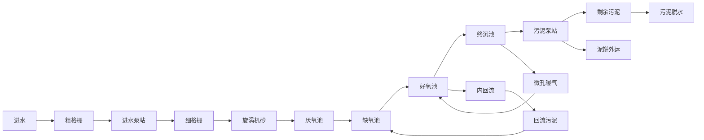

# 建设项目环境影响报告表

# （污染影响类）

项目名称：佛山市顺德竣浩新材料有限责任公司新建项目建设单位（盖章）： 佛山市顺德竣浩新材料有限责任公司编制日期： 2021 年 5 月

中华人民共和国生态环境部制

## 目 录

一、建设项目基本情况.  
二、建设项目工程分析..  
三、区域环境质量现状、环境保护目标及评价标准.  
四、主要环境影响和保护措施.. .14  
五、环境保护措施监督检查清单. .27  
六、结论... .28

附件1 营业执照复印件

附图1 项目地理位置图

附图2 项目平面布置图

附图3.1 项目周围环境图

附图3.2 项目所在地与水源保护区关系图

附图4 项目周围四至图

附图5 项目空置厂房图

附图6 项目所在地水功能区划图

附图7 项目所在地声环境功能区划图

附图8 项目所在地大气环境功能区划图

附图9 广东省环境管控单元图

附图 10 水性胶水 msds

## 一、建设项目基本情况

<table><tr><td>建设项目名称</td><td colspan="3">佛山市顺德竣浩新材料有限责任公司新建项目</td></tr><tr><td>项目代码</td><td colspan="3">/</td></tr><tr><td>建设单位联系人</td><td></td><td>联系方式</td><td></td></tr><tr><td>建设地点</td><td colspan="3">佛山市顺德区伦教街道伦教工业大道南28号之六</td></tr><tr><td>地理坐标</td><td colspan="3">(22度57分57.15秒,113度13分45.24秒)</td></tr><tr><td>国民经济行业类别</td><td>C3311金属结构制造</td><td>建设项目行业类别</td><td>66、结构性金属制品制造</td></tr><tr><td>建设性质</td><td>☑新建(迁建)□改建□扩建□技术改造</td><td>建设项目申报情形</td><td>☑首次申报项目□不予批准后再次申报项目□超五年重新审核项目□重大变动重新报批项目</td></tr><tr><td>项目审批(核准/备案)部门(选填)</td><td>/</td><td>项目审批(核准/备案)文号(选填)</td><td>/</td></tr><tr><td>总投资(万元)</td><td>100</td><td>环保投资(万元)</td><td>10</td></tr><tr><td>环保投资占比(%)</td><td>10%</td><td>施工工期</td><td>1个月</td></tr><tr><td>是否开工建设</td><td>☑否□是:____</td><td>用地(用海)面积( $m^{2}$ )</td><td>1000</td></tr><tr><td>专项评价设置情况</td><td colspan="3">无</td></tr><tr><td>规划情况</td><td colspan="3">无</td></tr><tr><td>规划环境影响评价情况</td><td colspan="3">无</td></tr><tr><td>规划及规划环境影响评价符合性分析</td><td colspan="3">无</td></tr><tr><td>其他符合性分析</td><td colspan="3">1、与产业政策符合性分析根据国家《产业结构调整指导目录(2019年本)》,项目不属于目录所列的鼓励类、限制类和淘汰类项目,根据《促进产业结构调整暂行规定》(国发[2005]40号)第十三条,项目属于允许类。且项目不属于《市场准入负面清单(2020年版)》(发改体改规〔2020〕1880号)中禁止和许可事项,符合国家产业政策要求。2、建设项目与所在地“三线一单”符合性分析根据《广东省人民政府关于印发广东省“三线一单”生态环境分区管控方案的通知》(粤府〔2020〕71号),广东省将以环境管控单元为基础,实施生态环境分区管控,精细化管理、保护生态环境。本项目与广东省“三线一单”生态环境分区管控方案相符性分析如下:1与“一核一带一区”区域管控要求的相符性1)项目位于珠三角核心区,主要用于佛山市顺德竣浩新材料有限责任公司的生产,不属于区域布局管控要求中的禁止新建、扩建水泥、平板玻璃、化学制浆、生皮制革以及国家规划外的钢铁、原油加工等项目。项目不涉及使用高挥发性原辅材料,不属于新建生产和使用高挥发性有机物原辅材料的项目,符合区域布局管控要求。2)项目所属金属制品的生产制造,不属于高能耗行业,项目全部生产设备使用电能,生产用水由市政供水,不直接取用江河湖库水量,不会对项目所在地生态流量造成影响,符合能源利用要求。3)项目属于新建项目,生活污水经三级化粪处理后达标后排至伦教污水处理厂,尾水排至李家沙水道,符合污染物排放管控要求。4)项目位于佛山市顺德区伦教街道伦教工业大道南28号之六,不属于石化、化工重点园区环境风险防控区域。项目产生的危险废物拟定期委托有资质的处置公司进行收集处理,并通过信息系统登记转移计划和电子转移联单,符合危险废物全过程跟踪管理的防控要求。2与环境管控单元总体管控要求的相符性根据《广东省人民政府关于印发广东省“三线一单”生态环境分区管控方案的通知》(粤府〔2020〕71号)发布的广东省环境管控单元图,项目所在区域为重点管控单元,执行区域生态环境保护的基本要求。</td></tr></table>

根据《广东省人民政府关于印发广东省“三线一单”生态环境分区管控方案的通知》（粤府〔2020〕71号），广东省将以环境管控单元为基础，实施生态环境分区管控，精细化管理、保护生态环境。本项目与广东省“三线一单”生态环境分区管控方案相符性分析如下

①与“一核一带一区”区域管控要求的相符性

1）项目位于珠三角核心区，主要进行金属制品的生产加工，不属于区域布局管控要求中的禁止新建、扩建水泥、平板玻璃、化学制浆、生皮制革以及国家规划外的钢铁、原油加工等项目。项目不涉及使用高挥发性原辅材料，不属于新建生产和使用高挥发性有机物原辅材料的项目，符合区域布局管控要求。  
2）项目所属金属制造业，不属于高能耗行业，项目全部生产设备使用电能，生产用水由市政供水，不直接取用江河湖库水量，不会对项目所在地生态流量造成影响，符合能源利用要求。  
3）项目属于新建项目，生活污水经三级化粪处理后达标后排至伦教污水处理厂，符合污染物管控要求。  
4）项目所在地不属于石化、化工重点园区环境风险防控区域。项目产生的危险废物拟定期委托有资质的处置公司进行收集处理，并通过信息系统登记转移计划和电子转移联单，符合危险废物全过程跟踪管理的防控要求。  
②与环境管控单元总体管控要求的相符性

本项目位于伦教工业片区，属于其中的重点管控单元，项目产生的生活污水经处理达标后排放至伦教污水处理厂，不在地表水Ⅰ、Ⅱ类水域新建排污口，不产生和排放有毒有害大气污染物项目，不使用溶剂型油墨、涂料、清洗剂、胶黏剂等高挥发性有机物原辅材料，符合其环境准入及管控要求。

## （2）挥发性有机物控制要求

项目挥发性有机物排放符合性根据相关政策文件规定分析如下：

表 1-1 项目与挥发性有机物排放规定相符性分析

<table><tr><td>序号</td><td>政策要求</td><td>工程内容</td><td>判定</td></tr><tr><td colspan="4">1.《中华人民共和国大气污染防治法》(2015.8.29修订,2016.1.1实施)</td></tr><tr><td>1.1</td><td>第四十五条 产生含挥发性有机物废气的生产和服务活动,应当在密闭空间或者设备中进行,并按照规定安装、使用污染防治设施;无法密闭的,应当采取措施减少废气排放。</td><td>本项目有机废气由收集后通过二级活性炭吸附,尾气引至15m高排气筒G1排放,收集效率达90%以上</td><td>符合</td></tr><tr><td colspan="4">2.《关于印发&lt;重点行业挥发性有机物综合治理方案&gt;的通知》(环大气[2019]53号)</td></tr><tr><td>2.1</td><td>加强设备与场所密闭管理。含VOCs物料应储存于密闭容器、包装袋、高效密封储罐、封闭式储库、料仓等。含VOCs物料生产和使用过程,应采取有效收集措施或在密闭空间中操作</td><td>本项目有机废气由收集后通过二级活性炭吸附,尾气引至15m高排气筒G1排放,收集效率达90%以上</td><td>符合</td></tr><tr><td colspan="4">3.顺德区环境保护委员会关于印发顺德区工业挥发性有机物项目(VOCs)审批总量前置实施细则(2016年修订)的通知</td></tr><tr><td>3.1</td><td>对新、改、扩建涉及新增VOCs排放的建设项目实行VOCs排放总量前置审批,凡新增VOCs排放量必须取得VOCs排放总量指标,且执行“减二增一”政策,即新、改、扩建涉及新增VOCs排放的建设项目,必须在区域内已有排放源排放量削减2倍于拟建项目的VOCs排放量。有组织排放量小于0.1吨(不含0.1吨,下同)的建设项目,不需要申请VOCs排放总量指标,直接由环评文件审批部门在环保管理信息系统录入项目排放量,作为VOCs排放总量分配依据;有组织排放量大于0.1吨(含0.1吨)的建设项目,须申请VOCs排放总量指标。</td><td>本项目VOCs有组织排放量小于0.1吨(不含0.1吨,下同),不需要申请VOCs排放总量指标,直接由环评文件审批部门在环保管理信息系统录入项目排放量,作为VOCs排放总量分配依据。</td><td>符合</td></tr><tr><td colspan="4">4.《顺德区环境运输和城市管理局转发关于印发2014年佛山市陶瓷行业、玻璃制造行业、铝型材行业和VOCs排放企业整治方案的通知》(顺管函2014[510]号)</td></tr><tr><td>4.1</td><td>所有排放挥发性有机物的车间必须安装废气收集、回收净化装置,收集率应大于90%</td><td>印刷工序的有机废气通过集气罩收集,收集效率为90%</td><td>符合</td></tr><tr><td colspan="4">5.《挥发性有机物(VOCs)污染防治技术政策》(环保部公告2013第31号)</td></tr><tr><td>5.1</td><td>根据涂装工艺的不同,鼓励使用水性涂料、高固份涂料、塑料粉末、紫外光固化(UV)涂料等环保型涂料</td><td>本项目选用水性胶水,属于低VOCs原料</td><td>符合</td></tr><tr><td>5.2</td><td>含VOCs产品的使用过程中,应采取废气收集措施,提高废气收集效率,减少废气的无组织排放与逸散,并对收集后的废气进行回收或处理后达标排放</td><td>涂布、贴膜、复合、烘干工序的VOCs通过管道收集,收集效率大于90%</td><td>符合</td></tr></table>

备注：本项目使用的水性胶水主要成分聚氨酯/丙烯酸酯聚合物 28\~30%，水 68\~70%，二甲基乙醇胺 5%，其中 挥 发 成 分 为 二 甲 基 乙 醇 胺 ， 年 使 用 量 为 10t/a ， 密 度 为 1.04g/cm3 ， 则 VOCs 挥 发 含 量 为10t/a\*5%/10t/a/1040kg/m3=52g/L，根据《胶粘剂挥发性有机化合物限量》（GB33372-2020）中表 2 水基型胶黏剂VOC含量限量的建筑类别，VOCs 含量限量为100g/L，符合标准限值。

## 二、建设项目工程分析

## 1、项目工程组成

佛山市顺德竣浩新材料有限责任公司新建项目（下称“本项目”）拟选址于佛山市顺德区伦教街道伦教工业大道南28号之六（地理位置详见附图1），中心地理坐标为北纬22.882541°，东经 113.229234°。项目占地面积共 1500 平方米，建筑面积 1500 平方米，项目主要从事复合钢板的加工生产，年生产复合钢板500吨/年。

建设内容：项目租用已建成一层工业厂房，占地面积1500平方米，经营面积1500平方米。项目从业人数为为 10人，年工作日300天，每天工作8小时，每天工作时间为8:00-12:00，14:00-18:00。项目厂区内部不设饭堂和员工宿舍。项目工程组成见表2-2。

供排水情况：供水来源为市政自来水；生活污水经三级化粪池预处理后；通过市政管道排入伦教污水处理厂，尾水排入李家沙水道。

表 2-1 项目工程组成

<table><tr><td>项目</td><td>内容</td><td>规模</td><td>用途</td></tr><tr><td>主体工程</td><td>生产车间</td><td> $1500m^{2}$ </td><td>包括原料区、成品区、开料区、复合区、覆膜区等</td></tr><tr><td>辅助工程</td><td>仓库及办公室</td><td>---</td><td>位于生产车间内</td></tr><tr><td rowspan="2">公用工程</td><td>配电系统</td><td>一套</td><td>供应生产用电和办公生活用电</td></tr><tr><td>给排水系统</td><td>一套</td><td>供水源为市政自来水,生活污水经三级化粪池处理后排至伦教污水处理厂</td></tr><tr><td rowspan="3">环保工程</td><td>三级化粪池</td><td>一套</td><td>生活污水预处理</td></tr><tr><td>废气处理设施</td><td>一套</td><td>复合工序等有机废气经集气罩收集后通过二级活性炭吸附处理后引至楼顶15米排气筒G1排放</td></tr><tr><td>危险废物暂存间</td><td>一个</td><td>设置危废间一个,危险废物交由有资质单位处理</td></tr></table>

## 2、主要产品及产能

项目主要从事家用电器线路板的加工，主要产品及产能见表2-2。

表 2-2 产品及产能一览表

<table><tr><td>序号</td><td>名称</td><td>单位</td><td>数量</td><td>备注</td></tr><tr><td>1</td><td>复合钢板</td><td>吨/年</td><td>570</td><td>主要用于建材、家电等</td></tr></table>

## 3、项目设备清单

主要生产单元、主要工艺、生产设施及设施参数见表2-3。

表 2-3 主要生产单元、主要工艺、生产设施及设施参数一览表

<table><tr><td>主要生产单元</td><td>生产工艺</td><td>名称</td><td>单位</td><td>数量</td><td>设施参数</td><td>备注</td></tr><tr><td rowspan="3">生产车间</td><td rowspan="3">切板、复合、覆膜</td><td>复板生产线</td><td>条</td><td>2</td><td>线速度6m/min</td><td>每条生产线长度约30米,包括放卷机-涂布机-电烘箱-贴合机-收卷机</td></tr><tr><td>复合生产线</td><td>条</td><td>1</td><td>线速度10m/min</td><td>每条生产线长度约20米,包括开料机-涂布机-电烘箱-收卷机</td></tr><tr><td>切板机</td><td>台</td><td>1</td><td>/</td><td>开料</td></tr></table>

## 4、项目原辅材料

主要原辅材料及燃料的种类和用量见表2-4。

表2-4 项目主要原辅材料及燃料参数一览表

<table><tr><td>序号</td><td>名称</td><td>单位</td><td>现有工程</td><td>备注</td></tr><tr><td>1</td><td>镀锌铁板</td><td>吨/年</td><td>600</td><td></td></tr><tr><td>2</td><td>水性胶水</td><td>吨/年</td><td>10</td><td></td></tr><tr><td>3</td><td>PET膜</td><td>吨/年</td><td>8</td><td rowspan="3">根据客户要求覆膜不同的保护膜</td></tr><tr><td>4</td><td>PE保护膜</td><td>吨/年</td><td>4</td></tr><tr><td>5</td><td>高分子膜</td><td>吨/年</td><td>5</td></tr></table>

## 5、给水与排水

## （1）给水：

项目用水由市政给水管网供应。用水主要为员工生活用水。

营运期从业人数为10人，年工作日300天；工作时间为每天8小时，项目不设饭堂和员工宿舍。根据《广东省用水定额》（DB44/T 1461-2014），生活用水按40L/人·d计，则生活用水量约为120 m3/a。

## （2）排水：

营运期项目生活污水经三级化粪处理后排入伦教污水处理厂，尾水排至李家沙水道。生活污水排污系数取0.9，生活污水产生量为108m3/a。

## 6、劳动动员及工作制度

项目从业人数为10人，年工作日300天，每天工作8小时，工作时间为为08:00-12:00及14:00-18:00。

## 7、厂区平面布置

项目占地面积为1500m2，经营面积为1500m2。项目位于已建成一层高工业厂房，包括生

<table><tr><td></td><td>产车间(开料区、复合区、覆膜区等)、仓库、办公室等,具体平面布置情况见附图2。</td></tr><tr><td>工艺流程和产排污环节</td><td>(1)项目工艺流程:图2-1 项目镀锌钢板工艺流程图2-2 项目覆膜生产线工艺流程项目主要生产建材及家电用复合钢板,生产流程简单。首先将外购的镀锌钢板根据产品尺寸通过切板机开料后,上机到复板生产线自动进行,利用复板生产线中的涂布机在工件表面涂上一层水性胶水,然后牵引至贴合机覆盖保护膜,保护膜类型根据客户要求以及产品用途选择不同的保护膜,随后继续输送到隧道电烘箱,通过电加热至约150°C烘干后,经收卷机收卷即可成品入仓。由于家电及建材用的镀锌钢板工件在保护膜覆盖选用不一致,其中建材用的镀锌钢板由于需要更高强度的保护,因此需要覆盖两层保护膜(PE保护膜与高分子膜或PET保护膜与高分子膜),通过复合生产线预先将两层保护膜复合成型,再应用到镀锌钢板复合生产中。根据客户要求通过复合生产线将两种不同的膜上机后自动生产,利用生产线中的涂布机将水性胶水涂布与保护膜表面,然后通过复合一起,随后进入隧道电烘箱通过电加热至约100°C后,经过收卷机收卷,即可成为半成品,再用于镀锌钢板复合。项目生产过程中涂布、贴膜、复合、烘干等工序分别经管道收集后通过二级活性炭吸附处理,尾气引至15米排气筒G1排放。</td></tr><tr><td>与项目有关的原有环境污染问题</td><td>本项目属于新建项目,选址位于佛山市顺德区伦教街道伦教工业大道南28号之六。项目租用已建成一层高工业厂房,项目东面为佛山市顺德区嘉能德五金厂,南面为机械加工厂。西面为佛山市意业板材有限责任公司,北面为伦星汽车检测站,项目四至情况见附图4。项目所在地周围无重污染的大型企业或重工业,存在主要污染物为附近企业在生产运营过程中产生的废气、噪声、废水、固废等以及附近道路车辆行驶噪声和扬尘等。</td></tr></table>

# 三、区域环境质量现状、环境保护目标及评价标准

## 1、大气环境：

根据《关于调整顺德区环境空气质量功能区划的复函》(佛府办函〔2014〕494号)，项目所在地属二类功能区，执行《环境空气质量标准》（GB3095-2012）及 2018 年修改单中的二级标准。

根据《佛山市生态环境局顺德分局关于发布2020年度佛山市顺德区环境质量状况公报的通知》（佛顺环函〔2021〕19号），2020年全区空气质量综合指数为3.30，比2019年下降 22.9%，空气质量同比有所改善，在全市五区中排名第二。

2020 年全区二氧化硫 $\left( \mathsf { S O } _ { 2 } \right)$ 、二氧化氮 $( \mathrm { N O } _ { 2 } )$ 、可吸入颗粒物 $\left( \mathrm { { P M } _ { 1 0 } } \right)$ 、细颗粒物 $\left( \mathbf { P M } _ { 2 . 5 } \right)$ ）平均浓度分别为 7、30、43、21 微克/立方米，臭氧日最大 8小时滑动平均 $( \mathrm { O } _ { 3 } { - } 8 \mathrm { h } )$ ）浓度的第 90百分位数为155微克/立方米，一氧化碳（CO）日浓度的第95 百分位数为 1.0 毫克/立方米，六项污染物指标浓度均达到《环境空气质量标准》（GB3095-2012）二级标准限值。

与去年相比，2020 年度顺德区六项环境空气污染指标浓度均有不同程度下降，$\mathrm { P M } _  2 . 5 \setminus \mathrm { ~ \scriptsize ~ P M } _  1 0 \setminus \mathrm { ~ \scriptsize ~ N O } _  2 \setminus \mathrm { ~ \scriptsize ~ S O } _  2 \setminus \mathrm { ~ \scriptsize ~ S O } _  2 \setminus \mathrm { ~ \scriptsize ~ C } _  2 \setminus \mathrm { ~ \scriptsize ~ C } _ { 2 \setminus \mathrm { ~ \scriptsize ~ C } _ { 2 \setminus \mathrm { ~ \scriptsize ~ C } _ { 2 \setminus \mathrm { ~ \scriptsize ~ C } _ { 2 \setminus \mathrm { ~ \scriptsize ~ C } _ { 2 \setminus \mathrm { ~ \scriptsize ~ C } _ { 2 \setminus \mathrm { ~ \scriptsize ~ C } _ { 2 \setminus \mathrm { ~ \scriptsize ~ C } _ { 2 \setminus \mathrm { ~ \scriptsize ~ C } _ { 2 \setminus \mathrm { ~ \scriptsize ~ C } _ { 2 \setminus \mathrm { ~ \scriptsize ~ C } _ { 2 \setminus \mathrm { ~ \scriptsize ~ C } _ { 2 \setminus \mathrm { ~ \scriptsize ~ C } _ { 2 \setminus \mathrm { ~ \scriptsize ~ C } _ { 2 \setminus \mathrm ~ \scriptsize ~ C } _ { 2 \setminus \mathrm { ~ \scriptsize ~ C } _ { 2 \setminus \mathrm ~ \scriptsize ~ C } _ { 2 \setminus \mathrm { ~ \scriptsize ~ C } _ { 2 \setminus \mathrm ~ \scriptsize ~ C } _ { 2 \setminus \mathrm { ~ \scriptsize ~ C } _ { 2 \setminus \mathrm ~ \scriptsize ~ C } _ { 2 \setminus \mathrm { ~ \scriptsize ~ C } _ { 2 \setminus \mathrm ~ \scriptsize ~ C } _ { 2 \setminus \mathrm ~ \scriptsize ~ C } _ { 2 \setminus \mathrm { ~ \scriptsize ~ C } _ { \mathrm ~ 2 \setminus ~ \scriptsize ~ C } _ { \mathrm { ~ \scriptsize ~ \scriptsize ~ \scriptsize \scriptsize ~ C } _ { 2 \setminus ~ \scriptsize ~ \scriptsize ~ C } _ { \mathrm { ~ \scriptsize ~ \scriptsize \scriptsize ~ \scriptsize ~ C } _ { \mathrm } _ { \mathrm \scriptsize { ~ \scriptsize ~ \scriptsize ~ \scriptsize \scriptsize ~ C } _ { \mathrm ~ } \scriptsize _ { \scriptsize ~ \scriptsize \scriptsize ~ \scriptsize } } } } } } } } } } } } } } } } } } } } } }$ 平均浓度分别下降 30.0%、23.2%、23.1%、12.5%，CO 日平均浓度的第 95 百分位数下降 23.1%， $\mathrm { O } _ { 3 } – 8 \mathrm { h }$ 浓度的第 90 百分位数下降 18.4%。2020年度全区环境空气质量优良天数占有效天数的 90.4%，同比去年提高 13.1 个百分点。详见下表。

表3-1 2020年顺德区（国控测点）环境空气污染物达标判定情况

<table><tr><td rowspan="2">污染物</td><td colspan="2">浓度均值</td><td rowspan="2">评价标准</td><td rowspan="2">变化</td><td rowspan="2">达标情况</td></tr><tr><td>2019年</td><td>2020年</td></tr><tr><td> $SO_{2}$ (μg/m3)</td><td>8</td><td>7</td><td>60</td><td>-12.5%</td><td>达标</td></tr><tr><td> $NO_{2}$ (μg/m3)</td><td>39</td><td>30</td><td>40</td><td>-23.1%</td><td>达标</td></tr><tr><td> $PM_{10}$ (μg/m3)</td><td>56</td><td>43</td><td>70</td><td>-23.2%</td><td>达标</td></tr><tr><td> $PM_{2.5}$ (μg/m3)</td><td>30</td><td>21</td><td>35</td><td>-30.0%</td><td>达标</td></tr><tr><td> $CO^{*}$ (mg/m3)</td><td>1.3</td><td>1.0</td><td>4</td><td>-23.1%</td><td>达标</td></tr><tr><td> $O_{3}-8H^{*}$ (μg/m3)</td><td>190(超标)</td><td>155</td><td>160</td><td>-18.4%</td><td>超标</td></tr></table>

\*注：（1）表中 CO 为年内日平均值的第 95 百分位数， $\mathbf { O } _ { 3 }$ 为年内日最大 8 小时平均值的第 90百分位数。（2）2019年公报与 2020年公报中的环境空气质量统计分析数据均采用实况数据。

根据 2020年全区的大气环境质量状况公报，六项污染物指标浓度均达到《环境空气质量标准》（GB3095-2012）二级标准限值，故顺德区大气环境质量属达标区。

## 2、地表水

根据《顺德区生态环境保护规划（2011\~2020 年）》（顺府办函〔2013〕41 号）及《关于同意实施广东省地表水环境功能区划的批复》（粤府函[2011]29号），李家沙水道执行《地表水环境质量标准》（GB3838-2002）中Ⅲ类标准。本项目生活污水经三级化粪池预处理达标后，一并通过市政管道排入伦教污水处理厂，尾水排入李家沙水道，李家沙水道水质执行《地表水环境质量标准》（GB3838－2002）之Ⅲ类标准。

根据佛山市生态环境局顺德分局关于发布的《2020 年度佛山市顺德区环境质量状况公报》：2019 年，全区地表水环境质量保持稳定，5 个饮用水源监控断面每月均达标，年均值水质均达到Ⅱ类。流经我区及周边城市交界水域 16 条主要河流的 23 个功能区监测断面水质均为优良，全年平均值达标率为 96%。与 2018 年相比，主河道监测断面水质达标率提升了 4 个百分点。16 条主河道中，7 条主河道的水质为Ⅱ类，其余为Ⅲ类。

为评价李家沙水道水道水质，根据《佛山市生态环境局顺德分局关于发布 2020年度佛山市顺德区环境质量状况公报的通知》（佛顺环函〔2021〕19号），2020年全区地表水环境质量保持稳定，4 个饮用水源监控断面每月均达标，年均值水质均达到Ⅱ类；2个国控断面（科研断面羊额、考核断面乌洲）、4 个省控断面（杨滘、顺德港、海凌、飞鹅山）均达到相应的水质目标。项目纳污水体李家沙水道五沙断面监测的水质达到了Ⅲ类标准要求，水质良好。

## 3、声环境

本项目为新建项目，根据《关于印发佛山市声环境功能区划分方案的通知》（佛府函〔2015〕72号），项目位于声环境3类功能区，项目厂界外50m范围内无环境敏感目标。

## 4、生态环境

项目用地范围内无生态环境保护目标，无需开展生态现状调查。

## 5、土壤、地下水环境

项目不存在土壤、地下水环境污染途径，不开展土壤、地下水环境质量现状调查。

<table><tr><td rowspan="5">环境保护目标</td><td colspan="7">1、大气环境项目厂界外500米范围内主要环境保护目标见下表:表3-2 主要环境保护目标</td></tr><tr><td>名称</td><td>保护对象</td><td>保护内容</td><td>环境功能区</td><td>相对厂址方位</td><td>相对厂界距离/m</td><td>影响规模/人</td></tr><tr><td>熹涌村委会</td><td rowspan="2">居住区</td><td rowspan="2">人群</td><td rowspan="2">大气二类、声2类</td><td>南面</td><td>87</td><td>5000</td></tr><tr><td>荔村村委会</td><td>西南门</td><td>660</td><td>3000</td></tr><tr><td colspan="7">备注:影响规模均指评价范围内的影响数量。2、声环境本项目所在地属于3类声环境功能区,厂界外50米范围内无声环境保护目标。3、地下水环境本项目厂界外500米范围内无地下水集中式饮用水水源和热水、矿泉水、温泉等特殊地下水资源。4、生态环境项目用地范围内无生态环境保护目标。</td></tr><tr><td rowspan="4">污染物排放控制标准</td><td colspan="7">1、大气污染物排放标准(1)根据《顺德区环境运输和城市管理局转发关于印发2014年佛山市陶瓷行业、玻璃制造行业、铝型材行业和总VOCs排放企业整治方案的通知》(顺管函[2014]510号),本项目涂布、贴膜、复合、烘干工序产生的有机废气参照执行广东省地方标准《家具制造行业挥发性有机化合物排放标准》(DB44/814-2010)第II时段排气筒排放限值及无组织排放标准,具体排放限值见表3-4。厂区内VOCs无组织排放监控点浓度应符合《挥发有机物无组织排放控制标准》(GB37822-2019)中附录A中表A.1规定的限值。表3-4大气污染物排放标准</td></tr><tr><td>工序</td><td>污染物</td><td>最高允许排放浓度(mg/m3)</td><td>最高允许排放速率*(kg/h)</td><td>无组织排放监控点浓度限值(mg/m3)</td><td>标准</td><td>排气筒</td></tr><tr><td>涂布、贴膜、复合、烘干</td><td>总VOCs</td><td>30</td><td>1.45</td><td>2.0</td><td>DB44/814-2010</td><td>G1(15m)</td></tr><tr><td colspan="7">注:*根据广东省地方标准《家具制造行业挥发性有机化合物排放标准》(DB44/814-2010)相关规定,项目周围200m半径范围的最高建筑高出本项目排气筒5米以上,VOCs最高允许排放速率按排放限值的50%执行。</td></tr></table>

表3-5 厂区内VOCs无组织排放限值

<table><tr><td>污染物项目</td><td>特别排放限值(mg/m3)</td><td>限值含义</td><td>无组织排放监控位置</td></tr><tr><td rowspan="2">NMHC</td><td>6</td><td>监控点处1h平均浓度值</td><td rowspan="2">GB37822-2019</td></tr><tr><td>20</td><td>监控点处任意一次浓度值</td></tr></table>

## 2、水污染物排放标准

员工生活污水经三级化粪处理达到广东省《水污染物排放限值》（DB44/26-2001）二级污水处理厂三级标准（第二时段）后排至伦教污水处理厂，尾水排至李家沙水道。根据 2013 年 7 月 11日颁布的《顺德区环境运输和城市管理局关于全区城镇污水处理厂尾水排放执行标准的通知》规定：全区已建（含在建）城镇污水处理厂执行国家标准《城镇污水处理厂污染物排放标准》（GB18918-2002）一级 A标准及广东省地方标准《水污染物排放限值》（DB44/26-2001）第二时段一级标准的较严值，具体排放限值见表12：

表 3-5 水污染物排放限值 单位：pH无量纲，其余mg/L

<table><tr><td>污染因子</td><td> $COD_{Cr}$ </td><td> $BOD_5$ </td><td> $NH_3-N$ </td><td>SS</td></tr><tr><td>厂区排放口</td><td>500</td><td>300</td><td>15</td><td>---</td></tr><tr><td>污水厂尾水</td><td>40</td><td>10</td><td>5</td><td>10</td></tr></table>

## 3、噪声排放标准

项目厂界执行《工业企业厂界环境噪声排放标准》（GB12348-2008）中的 3 类标准：昼间等效声级≤65dB(A)、夜间等效声级≤55dB(A)。

## 4、固体废物污染控制标准

固体废物执行《一般工业固体废物贮存、处置场污染控制标准》（GB18599-2001）及其2013 年修改单。

危险废物执行《国家危险废物名录》（2021 版）以及《危险废物贮存污染控制标准》（GB18597-2001）及 2013 年修改单。

## （1）水污染物总量控制指标

本项目营运期污水排放量为 108m3 /a，CODCr 总量为 0.0043t/a，NH3-N 总量为0.00054t/a，生活污水经三级化粪池预处理，通过市政管道排入伦教污水处理厂，尾水排入李家沙水道。根据《佛山市人民政府办公室关于印发佛山市排污权有偿使用和交易管理试行办法（佛府办 2020第19号），建议不单独分配总量指标。

## （2）大气污染物总量控制指标

项目 VOCs 总排放量是 0.14t/a，有机废气经收集后通过二级活性炭吸附处理，尾气引至15m高的排气筒G1排放，VOCs有组织排放量是0.09t/a，无组织排放量是0.05t/a。根据《广东省生态环境厅关于做好重点行业建设项目挥发性有机物总量指标管理工作的通知》（粤环发〔2019〕2 号），建议本项目 VOCs 控制总量指标为 0.09t/a，从佛山市顺德区伦教街道总量中列支。

## 四、主要环境影响和保护措施

<table><tr><td>施工期环境保护措施</td><td colspan="8">本项目使用已建成厂房,不涉及厂房建设,施工过程主要是内部装修和设备安装,没有基建工程,因此施工期间不存在大型土建工程,施工期间产生的影响主要是由于设备运输、安装时产生的噪声等。施工期较短,因此如果项目建设方加强施工管理,那么项目施工时不会对周围环境造成较大的影响。</td></tr><tr><td rowspan="6">运营期环境影响和保护措施</td><td colspan="8">1、废气表4-5 项目废气产污环节、污染物种类、排放形式及污染防治设施一览表</td></tr><tr><td rowspan="2">主要生产单元</td><td rowspan="2">生产工艺</td><td rowspan="2">产排污环节</td><td rowspan="2">污染物种类</td><td rowspan="2">排放形式</td><td colspan="2">污染防治设施</td><td rowspan="2">排放口类型</td></tr><tr><td>污染防治设施名称及工艺</td><td>是否为可行性技术</td></tr><tr><td rowspan="2">生产车间</td><td rowspan="2">涂布、贴膜、复合、烘干</td><td rowspan="2">涂布、贴膜、复合、烘干</td><td>VOCs</td><td>有组织(15m排气筒G1)</td><td>二级活性炭吸附</td><td>☑是☐否</td><td>一般排放口</td></tr><tr><td>VOCs</td><td>无组织</td><td>/</td><td>☑是☐否</td><td>/</td></tr><tr><td colspan="8">1.1 废气源强核算项目生产过程中产生的废气为:涂布、贴膜、复合、烘干工序产生的有机废气,项目产生的废气均经管道收集后通过二级活性炭吸附处理,尾气引至15m高排气筒G1排放。◇排气筒风量核算项目复板生产线及复合生产线设备以管道形式进行废气收集,通过连接在罩上的风管直接抽吸废气,收集效果较好,管道口风速一般在10m/s~15m/s,依据以下经验公式核算得出各设备所需的风量L。L=3600SV其中:S-管道口面积;V-断面平均风速(取20m/s)生产线中每台产污设备设置1根通风排管,软管内径为0.18m,每台设备所需风量为(0.18÷2)2×3.14×20×3600=1831.25m3/h,项目共设置两条复板生产线,一条复合生产线,每条生产线上分别有三个产污设备,所需风量为9×1831.25=16481.25m3/h,考虑到风阻、管道损失和漏风等情况,G1排气筒风量</td></tr></table>

设置为 20000m³/h。

项目风机风量取 20000m3 /h，项目年工作 300 天，每天工作 8 小时，废气量=20000\*300\*8=4800\*106m3/h。

◇涂布、贴膜、复合、烘干工序产生的有机废气

（1）项目生产过程使用到水性胶水，涂布、贴膜、复合、烘干过程会产生有机废气，其主要污染因子为 VOCs。根据厂家提供的资料MSDS，水性胶水主要成分为聚氨酯/丙烯酸酯聚合物 28\~30%，水68\~70%，二甲基乙醇胺 5%，其中挥发成分为二甲基乙醇胺，则水性胶水 VOCs 挥发系数按5%计算。

根据厂方提供的资料，项目水性胶水的总用量约为10t/a，按每天工作 8小时计算，则项目水性胶水的最大使用量为 4.17kg/h，则总 VOCs 的产生速率为0.208kg/h。则波峰焊 VOCs 的产生量约为 500kg/a。

项目在复板生产线及复合生产线的产污设备工位处分别有配套管道收集，收集效率取90%，产生的有机废气经收集后通过二级活性炭吸附处理，尾气引至楼顶15m高的排气筒 G1 排放，处理风量为20000m3 /h。未收集的废气通过车间排气扇无组织排放到外界。核算此工序总 VOCs 产生和排放情况如表5-3 所示。

活性炭是一种由含碳材料制成的外观呈黑色，内部孔隙结构发达、比表面积大、吸附能力强的一类微晶质碳素材料。活性炭材料中有大量肉眼看不见的微孔，1g活性炭材料中微孔的总内表面积可高达 700～2300m2。正是这些微孔使得活性炭能“捕捉”各种有毒有害气体和杂质。由于气相分子和吸附剂表面分子之间的吸引力，使气相分子吸附在吸附剂表面。吸附剂表面积愈大、单位质量吸附剂吸附物质愈多。建议采用蜂窝状活性炭，比表面积 900～1500 m2 /g，具有非常良好的吸附特性，其吸附量比活性炭颗粒一般大 20～100 倍，吸附容量为 25wt%。当吸附载体吸附饱和时，可考虑更换。采用活性炭进行有机尾气的净化，其去除效率会因活性炭吸附废气的饱和程度而不同，净化效率为 50%\~90%（本报告每级活性炭处理效率均取60%，则两级活性炭吸附总处理效率为 84%，按保守计算取80%）。

表 4-7 项目废气污染源强核算结果及相关参数一览表

<table><tr><td rowspan="2">工序</td><td rowspan="2">装置</td><td rowspan="2">污染物</td><td rowspan="2">核算方法</td><td rowspan="2">总产生量t/a</td><td rowspan="2">污染源</td><td rowspan="2">收集效率(%)</td><td colspan="3">产生情况</td><td colspan="2">治理措施</td><td colspan="3">排放情况</td><td rowspan="2">排放时间(h)</td></tr><tr><td>产生速率kg/h</td><td>产生浓度mg/m3</td><td>产生量t/a</td><td>工艺</td><td>处理效率(%)</td><td>排放速率kg/h</td><td>排放浓度mg/m3</td><td>排放量t/a</td></tr><tr><td rowspan="2">涂布、贴膜、复合、烘干</td><td rowspan="2">生产车间</td><td rowspan="2">VOCs</td><td rowspan="2">产污系数法</td><td rowspan="2">0.5</td><td>G1</td><td>90%</td><td>0.187</td><td>9.36</td><td>0.45</td><td>二级活性炭</td><td>80</td><td>0.0374</td><td>1.87</td><td>0.09</td><td>2400</td></tr><tr><td>无组织</td><td>/</td><td>0.021</td><td>/</td><td>0.05</td><td>/</td><td>/</td><td>0.021</td><td>/</td><td>0.05</td><td>2400</td></tr><tr><td rowspan="2">合计</td><td>有组织</td><td>VOCs</td><td>/</td><td>风量20000m3/h</td><td>G1</td><td>/</td><td>0.187</td><td>9.36</td><td>0.45</td><td>/</td><td>/</td><td>0.0374</td><td>1.87</td><td>0.09</td><td>/</td></tr><tr><td>无组织</td><td>VOCs</td><td>/</td><td>/</td><td>厂界</td><td>/</td><td>0.021</td><td>/</td><td>0.05</td><td>/</td><td>/</td><td>0.021</td><td>/</td><td>0.05</td><td>/</td></tr></table>

## 1.2 正常工况下废气影响分析

## （1）排气筒废气达标分析

本项目共设置1 个排气筒，分别设在车间厂房楼顶，高度约15m，排气筒污染物排放情况见表4-8。

表 4-8 项目排气筒污染物排放达标情况一览表

<table><tr><td>污染源</td><td>污染物</td><td>排放浓度 $mg/m^3$ </td><td>排放速率kg/h</td><td>执行标准</td><td>浓度限值 $mg/m^3$ </td><td>速率限值*kg/h</td><td>达标情况</td></tr><tr><td>排气筒G1</td><td>VOCs</td><td>1.87</td><td>0.0374</td><td>DB44/814-2010</td><td>30</td><td>1.45</td><td>达标</td></tr></table>

备注：1、“\*”表示排气筒未高于周围 200m 范围内建筑物 5m 以上，污染物排放速率按排气筒对应排放速率限值的50%执行。

由上表可知，项目排气筒G1排放的VOCs 排放可达到广东省地方标准《家具制造行业挥发性有机化合物排放标准》（DB44/814-2010）中Ⅱ时段排放标准限值要求。

## （2）厂界废气达标分析

根据《环境影响评价技术导则－大气环境》（HJ2.2-2018）中推荐的AERSCREEN（不考虑地形）模型模拟正常工况下各大气污染物的环境影响计算结果，本项目厂界浓度值见下表。

表 4-9 项目厂界污染物排放达标情况一览表

<table><tr><td>污染物</td><td>厂界浓度值 $mg/m^3$ </td><td>厂界监控浓度限值 $mg/m^3$ </td><td>标准来源</td><td>达标分析</td></tr><tr><td>VOCs</td><td>0.0427</td><td>2.0</td><td>DB44/814-2010</td><td>达标</td></tr></table>

由上表可知，项目各污染物无组织排放最大落地浓度值均小于对应的厂界监控浓度限值，符合相关标准要求。

## 1.4废气环境监测计划

根据《自行监测技术指南 总则》（HJ819—2017），本项目制定了废气污染源环境自行监测计划，详见下表。

表 4-10 废气污染源环境监测计划一览表

<table><tr><td>序号</td><td>监测点</td><td>监测位置</td><td>监测项目</td><td>监测频次</td><td>指标</td></tr><tr><td>一</td><td colspan="5">废气</td></tr><tr><td>1</td><td>生产车间</td><td>G1排气筒</td><td>VOCs</td><td>1次/年</td><td>排放浓度、速率、风量</td></tr><tr><td>3</td><td>项目边界</td><td>项目边界上下风向</td><td>VOCs</td><td>1次/半年</td><td>浓度、风速、风向等</td></tr><tr><td>二</td><td colspan="5">噪声</td></tr><tr><td>4</td><td>厂界噪声</td><td>厂界</td><td>Leq(A)</td><td>1次/季度</td><td>昼、夜间</td></tr></table>

表 4-11 项目点源排放参数表

<table><tr><td rowspan="2">类型</td><td rowspan="2">点源名称</td><td colspan="2">排气筒底部中心坐标/m</td><td rowspan="2">排气筒底部海拔高度/m</td><td rowspan="2">排气筒高度/m</td><td rowspan="2">排气筒内径/m</td><td rowspan="2">烟气流速(m/s)</td><td rowspan="2">烟气温度[°C]</td><td rowspan="2">烟气排气量( $m^3/h$ )</td><td>污染物排放速率(kg/h)</td></tr><tr><td>X</td><td>Y</td><td>VOCs</td></tr><tr><td>点源</td><td>G1 排气筒</td><td>-30</td><td>0</td><td>0</td><td>15</td><td>0.6</td><td>7.07</td><td>25</td><td>20000</td><td>0.0374</td></tr></table>

## 2、废水

表 4-12 项目废水类别、污染物种类、排放形式及污染防治设施一览表

<table><tr><td>序号</td><td>废水类别</td><td>污染物种类</td><td>排放去向</td><td>排放规律</td><td>污染治理设施</td><td>技术是否可行</td><td>排放口编号</td><td>地理坐标</td><td>排放口类型</td></tr><tr><td>1</td><td>生活污水</td><td> $COD_{Cr}$ 、 $BOD_5$ 、 $NH_3-N$ 、总磷</td><td>伦教污水处理厂</td><td>间断排放</td><td>三级化粪池</td><td>是</td><td>水-01</td><td>113.229234°22.882541°</td><td>☑生活污水单独排放口</td></tr></table>

表 4-13 废水间接排放口基本情况表

<table><tr><td rowspan="2">序号</td><td rowspan="2">排放口编号</td><td rowspan="2">废水排放量/(万t/a)</td><td rowspan="2">排放去向</td><td rowspan="2">排放规律</td><td rowspan="2">间歇排放时段</td><td colspan="3">受纳污水处理厂信息</td></tr><tr><td>名称</td><td>污染物种类</td><td>国家或地方污染物排放标准浓度限值/(mg/L)</td></tr><tr><td rowspan="4">1</td><td rowspan="4">水-01</td><td rowspan="4">0.0108</td><td rowspan="4">排入伦教污水处理厂</td><td rowspan="4">间断排放</td><td rowspan="4">工作日00:00-24:00</td><td rowspan="4">伦教污水处理厂</td><td> $COD_{Cr}$ </td><td>40</td></tr><tr><td> $BOD_5$ </td><td>10</td></tr><tr><td>SS</td><td>10</td></tr><tr><td> $NH_3-N$ </td><td>5</td></tr></table>

## 2.1 废水排放源强

项目营运期水污染源主要包括生活污水。

## （1）生活污水

营运期项目范围内不设置员工食堂和员工宿舍，根据《广东省用水定额》（DB44T1461-2014）用水系数，生活用水量按 0.04m3 /日·人计，年工作 300 天计，则生活用水水量为 120m3 /a；生活污水产生系数按 90%计，则生活污水产生量约为108m3 /a。生活污水的主要污染物因子为 $\mathrm { C O D } _ { \mathrm { C r } } , \ \mathrm { B O D } _ { 5 }$ 、氨氮、SS等。生活污水经三级化粪池预处理后达到广东省《水污染排放限值》（DB44/26-2001）第二时段三级标准后排入伦教污水处理厂。

生活污水污染物浓度取值依据描述：参考环境保护部环境工程技术评估中心编制《环境影响评价（社会区域类）》教材（表 5-18），结合项目实际，污染物产生及排放情况如下表：

表 4-14 项目生活污水污染物产生及排放情况

<table><tr><td rowspan="2">项目</td><td rowspan="2">污染物</td><td colspan="2">产生情况</td><td colspan="2">排放情况</td><td rowspan="2">削减量(kg/a)</td></tr><tr><td>产生浓度(mg/L)</td><td>产生量(kg/a)</td><td>排放浓度(mg/L)</td><td>排放量(kg/a)</td></tr><tr><td rowspan="4">生活污水 $108m^3/a$ </td><td> $COD_{Cr}$ </td><td>250</td><td>27</td><td>40</td><td>4.32</td><td>22.68</td></tr><tr><td> $BOD_5$ </td><td>100</td><td>10.8</td><td>10</td><td>1.08</td><td>9.72</td></tr><tr><td>SS</td><td>100</td><td>10.8</td><td>10</td><td>1.08</td><td>9.72</td></tr><tr><td> $NH_3-N$ </td><td>30</td><td>3.24</td><td>5</td><td>0.54</td><td>2.7</td></tr></table>

由上表可知，项目生活污水经三级化粪池处理后能够达到广东省《水污染物排放限值》（DB44/26-2001）中的三级标准（第二时段），污水厂出水可达到《城镇污水处理厂污染物排放标准》（GB18918-2002）一级A 标准和广东省地方标准《水污排染物放限值》（DB44/26-2001）第二时段一级标准的较严者。

## 2.3废水治理设施可行性分析

## 依托伦教污水处理厂的可行性分析

伦教污水处理厂位于佛山市顺德区伦教街道三洲居委会碧桂路东侧（西海大桥附近），污水处理厂占地面积 7.07 公顷，合计106 亩。伦教污水处理厂分三期建设，首期建设规模 3 万 m3 /日，二期扩建规模 4 万 m3 /日，远期扩建规模 3 万 m3/日，总体规划为 10万m3 /日。首期规模已于2009年8 月7日通过环保验收，纳污范围南至龙洲路，东至广珠公路，北至世纪大道，西至世龙大道。二期规模于 2018 年 9 月29日通过验收，纳污范围包括羊大河以北区域，主要分布于熹涌、霞石和三洲等村居。伦教污水处理厂设计进口 COD 浓度 250\~300mg/L，设计出口 COD 浓度为 40mg/L，处理达标后的污水通过管道拟引至李家沙水道下游排放。污水排放执行《城镇污水处理厂污染物排放标准》（GB18918-2002）一级A标准及广东省地方标准《水污染物排放限值》（DB44/26-2001）第二时段一级标准的较严值。

根据伦教城市污水的水质特点，伦教污水处理厂采用微曝氧化沟（图 7-1）处理城镇生活污水，该种工艺具有占地面积少，脱氮除磷功能强，运行稳定，便于管理的特点，在国内外城市污水处理系统中得到广泛的应用。

flowchart

图 4- 1 微曝氧化沟处理工艺流程图

项目生活污水经预处理达到广东省地方标准《水污染物排放限值》（DB44/26-2001）第二时段三级标准后再排至伦教污水处理厂处理，满足污水厂的纳管要求，不会对污水厂造成冲击负荷，也不会影响其正常运行。

## 2.4废水环境监测计划

根据《排污许可证申请与核发技术规范 电子工业》（HJ1031—2019），单独排入公共污水处理系统的生活污水无需开展自行监测。

## 3、噪声

## 3.1噪声排放源强

本项目营运期主要的噪声来源于复板生产线和复合生产线等产生的噪声。各噪声源源强如下表所示。

表 4-15 运营期噪声源强表

<table><tr><td>序号</td><td>噪声源</td><td>源强(dB(A))</td></tr><tr><td>1</td><td>复板生产线、复合生产线</td><td>65~75</td></tr></table>

生产过程产生的噪声主要来自生产设备，噪声级约65\~75dB（A）。项目所有设备安装时进行恰当的防震、减震处理，运行过程对设备的维护保养，则噪声通过隔墙和距离衰减后，对厂界噪声的贡献值很小。另外，项目附近无声环境敏感目标，因此对周围声环境影响不大。

根据项目噪声污染源的特征，按照《环境影响评价技术导则 声环境》（HJ2.4-2009）要求，采用多声源叠加综合预测模式对项目产生噪声的发散衰减进行模拟预测。

（1）点声源在预测点的噪声强度采用几何发散衰减计算式：

$$
L _ {p} = L _ {p 0} - 2 0 \lg \left(\frac {r}{r _ {0}}\right) - \Delta L
$$

式中： $L _ { p ^ { - } }$ — 距声源 r 米处的噪声预测值，dB（A）；

$L _ { p \theta ^ { } }$ — 参考位置r0处的声级，dB（A）；

预测点位置与点声源之间的距离，m；

$r _ { 0 ^ { - } }$ 参考位置处与点声源之间的距离；

ΔL——预测点至参考点之间的各种附加衰减修正量

（2）多点声源理论总等效声压级[Leq(总)]的估算方法：

多个设备同时运行时在预测点产生的总等声级贡献值 $( L _ { e q g } )$ 的计算公式为：

$$
L _ {e q g} = 1 0 \lg \left(\frac {1}{T} \sum_ {i} t _ {i} 1 0 ^ {0. 1 L _ {m}}\right)
$$

式中： $L _ { e q g ^ { - } }$ — 建设项目声源在预测点的等效声级贡献值， $\mathrm { d B } ( \mathrm { A } ) { \mathrm { : } }$ ；

$L _ { \ A i }$ — —i 声源在预测点产生的A声级，dB(A)；

$T -$ ——预测计算的时间段，s；

$t _ { i } .$ ——i 声源在T 时段内的运行时间，s。

（3）预测点等效声级计算方法：

在预测某处的噪声值时，应先预测计算建设项目声源在该处产生的等效声级贡献值，然后叠加该处的声背景值，最后得到该点的预测等效声级 $( L _ { e q } )$ ，具体计算公式如下：

$$
L _ {e q} = 1 0 \lg (1 0 ^ {0. 1 L _ {\text { max}}} + 1 0 ^ {0. 1 L _ {\text { inh}}})
$$

式中： $L _ { e q g ^ { - } }$ — 建设项目声源在预测点的等效声级贡献值， $\mathrm { d B } ( \mathrm { A } )$ ；

$L _ { e q b ^ { - } }$ Leqb— 预测点的背景值，dB(A)

根据预测模式，计算项目营运期离噪声源不同距离处的噪声值如表 4-16所示。

$\begin{array} { r } { \frac { \mathrm { ~ i \neq ~ } } { \mathrm { ~ d ~ } } 4 - 1 6 \frac { \mathrm { ~ I m ~ } } { \mathrm { ~ J i ~ } } \sharp \underline { { \sharp \pm } } \frac { \mathrm { ~ m ~ } } { \mathrm { ~ I m ~ } } \frac { \mathrm { ~ i \neq ~ } } { \mathrm { ~ J i ~ } } \sharp \underline { { \neq ~ } } \mathcal { K } | \mathrm { ~ m ~ } | \mathrm { ~ B i ~ \neq ~ } \mathcal { J } | \mathrm { ~ I m ~ } | \mathrm { ~ i \neq ~ } \mathcal { J } | \mathrm { ~ I m ~ } | \mathrm { ~ i \neq ~ } \mathcal { K } \mathrm { ~ m ~ } | \mathrm { ~ I m ~ } | \mathrm { ~ i \neq ~ } \mathcal { K } \mathrm { ~ , ~ } } \end{array} \qquad ( \mathrm { ~ i \sharp ~ } | \mathrm { i \neq ~ } \mathrm { ~ I m ~ } ) \mathrm { ~ }$

<table><tr><td>设备\距离(m)</td><td>1</td><td>5</td><td>10</td><td>15</td><td>20</td><td>30</td><td>40</td><td>50</td></tr><tr><td>复板生产线、复合生产线</td><td>75</td><td>66</td><td>52</td><td>46</td><td>44</td><td>40</td><td>38</td><td>36</td></tr></table>

根据声源距离厂界距离以及多声源叠加公式，计算噪声到各厂界的贡献值。项目夜间不生产，对厂界噪声无贡献值，故不计算夜间贡献值。另外，车间实体墙对噪声的衰减值取 10dB(A)，厂界噪声预测值如表 4-17所示。

表 4-17 项目营运期在各厂界噪声影响预测 （单位：dB(A)）

<table><tr><td>厂界</td><td>影响设备</td><td>与厂界</td><td>厂界值</td><td>隔墙衰减</td><td>贡献值叠</td><td>预测值</td></tr></table>

<table><tr><td></td><td></td><td>距离 m</td><td></td><td>值</td><td>加</td><td>昼间</td><td>夜间</td></tr><tr><td>东面</td><td>复板生产线、复合生产线</td><td>20</td><td>56</td><td>10</td><td>46</td><td>57.9</td><td>49.8</td></tr><tr><td>南面</td><td>复板生产线、复合生产线</td><td>15</td><td>56</td><td>10</td><td>46</td><td>57.9</td><td>49.8</td></tr><tr><td>西面</td><td>复板生产线、复合生产线</td><td>1</td><td>66</td><td>10</td><td>44</td><td>57.7</td><td>49.7</td></tr><tr><td>北面</td><td>复板生产线、复合生产线</td><td>5</td><td>56</td><td>10</td><td>46</td><td>57.9</td><td>49.8</td></tr></table>

本项目距东南面熹涌村居民区最近距离为 87m，营运期噪声会对该居民区产生一定影响。项目生产活动产生的噪声，拟通过采用减振、隔声、消声、吸声等措施进行治理。生产设备等均选用高效率，低噪声产品。采取以上措施后，项目厂界外1 米处达到《工业企业环境噪声排放标准》（GB12348-2008）中的 3类标准，不会对周围环境造成大的影响。

## 3.2噪声环境监测计划

根据《排污许可证申请与核发技术规范 电子工业》（HJ1031—2019），本项目制定了噪声污染源环境自行监测计划，详见下表。

表 4-16 噪声污染源环境监测计划一览表

<table><tr><td>序号</td><td>监测点位</td><td>监测指标</td><td>监测频次</td><td>执行排放标准</td></tr><tr><td>1</td><td>厂界</td><td>Leq(A)</td><td>1次/季度</td><td>《工业企业厂界环境噪声排放标准》(GB12348-2008)</td></tr></table>

## 4、固体废物

## （1）一般工业固体废物

项目营运期产生的固体废物主要是生活垃圾和金属边角料。

项目员工人数为 10人，厂区内不设置食堂和宿舍，主要为员工的办公产生的生活垃圾，根据《社会区域类环境影响评价》（中国环境出版社）中固体废物污染源推荐数据，生活垃圾产生量按 0.5kg/（人•d）计算，年工作300天，则项目生活垃圾产生量约为 1.5t/a，交由环卫部门处理。

镀锌钢板开料过程产生一定量的金属边角料，边角料约占用量5%，项目年使用镀锌钢板 600t/a，则边角料产生量约为30t/a，定期外卖给回收商处理。

## （2）危险废物

类比同类型项目，本项目危险废物主要为废机油、含油废抹布、饱和活性炭等，产生量、废物类别、代码见表 4-18。

◇废机油

项目设备维修时会产生少量的废机油，平均每半年维修一次，每次维修时废机油产生量约 0.03t，则废机油年产生量约0.06t。

## ◇含油废抹布

机械设备维修等操作时会产生废抹布和手套，根据《国家危险废物名录》（2021年版）相关规定，建议做好废抹布与手套的分类收集和存放。对照《国家危险废物名录》属于危险废物（编号为HW49其他废物，代码为900-41-49），每半年维修一次，每次产生量为 0.01t，则含油废抹布产生量约为0.02t/a。

## ◇废活性炭

项目项目废活性炭产生量=活性炭负载量×一年活性炭更换次数+活性炭削减废气量。

①项目 G1 排气筒活性炭设施风量为20000m3 /h，经计算，项目有机废气的有组织排放量为 0.09t/a，有机废气经活性炭吸附的削减量为0.36t/a，则活性炭吸附量为0.36t/a，根据《广东工业大学工程研究》，活性炭对有机废气的吸附能力按“250kgVOCs/1000kg 活性炭计算，本项目废气共收集 0.45t/a，其中二级活性炭的处理效率为 80%，则活性炭削减的 VOCs 量为=0.45\*0.8=0.36 t/a，活性碳的用量=0.36t/a\*1000/250=1.44t/a, 废活性炭的重量=活性炭的用量+吸收的 VOCs 的量=1.44 t/a+0.36t/a=1.8 t/a。活性炭应定期更换，每两个月更换一次，一年更换 6 次。则废活性炭产生量约为 1.8t/a。

对照《国家危险废物名录》（2021年版）属于危险废物（编号为HW49 其他废物，代码为 900-039-49。为确保活性炭吸附效率，需要对活性炭定期更换，要求企业与危险废物公司签订活性炭回收合同。

项目各类危废贮存在危险废物暂存场所，危险废物暂存场所为室内单独隔间，设置围堰，避免泄漏。危险废物收集后送有资质单位处理处置，运输采用专门的危险废物运输车运输。

营期间危险废物的具体产生情况如表 4-19所示。

表 4-19项目危险废物产生情况

<table><tr><td>序号</td><td>种类</td><td>危险废物类别</td><td>危险废物代码</td><td>产生量(t/a)</td><td>产生工序及装置</td><td>形态</td><td>主要成分</td><td>危险成分</td><td>产废周期</td><td>危险特性</td><td>污染防治措施</td></tr><tr><td>1</td><td>废机油</td><td>HW08类</td><td>900-249-08</td><td>0.06</td><td>设备维修</td><td>液体</td><td>机油</td><td>机油</td><td>半年</td><td>T, I</td><td rowspan="3">交有危废处置资质的公司回收处理</td></tr><tr><td>2</td><td>含油废抹布</td><td>HW49类</td><td>900-041-49</td><td>0.02</td><td>设备维修</td><td>固体</td><td>机油、布</td><td>机油</td><td>半年</td><td>T, I</td></tr><tr><td>3</td><td>饱和活性炭</td><td>HW49类</td><td>900-039-49</td><td>1.8</td><td>“活性炭吸附”处理设施</td><td>固体</td><td>活性炭、VOCs</td><td>有机组分</td><td>两个月</td><td>T</td></tr><tr><td colspan="2">危险废物合计</td><td>---</td><td>--</td><td>1.88</td><td>---</td><td>---</td><td colspan="2">---</td><td>---</td><td>---</td><td>---</td></tr></table>

注：危险特性中T表示毒性， I 表示易燃性。

## 5、环境风险

## （1）物质风险和重大危险源识别

根据《建设项目环境风险评价技术导则》（HJ169-2018）附录B，识别项目使用的危险化学品和风险物质如下表所示。

表 4-20 危险物质风险识别表

<table><tr><td>序号</td><td>名称</td><td>别名</td><td>有害成分</td><td>危险性类别</td><td>危化品序号</td><td>储存地/储存方式</td><td>使用量(t/a)</td><td>最大储存量q(t)</td><td>临界量Q(t)</td></tr><tr><td>1</td><td>废机油</td><td>/</td><td>机油</td><td>/</td><td>/</td><td>原辅材料储存区/25kg/桶、危废暂存间</td><td>0.06</td><td>0.025</td><td>2500</td></tr><tr><td colspan="10"> $\sum q/Q=0.00001$ </td></tr></table>

## （2）最大可信事故

本项目不设置专用危险化学品仓库，使用的量较少，平时少量储存在生产岗位。生产过程风险主要是设备维修使用的油类泄漏，最大泄漏量0.075t矿物油。

## （3）环境风险潜势初判

根据表 4-18可知，项目使用的风险物质 Q=0.00001＜1，则本项目环境风险潜势为Ⅰ，本报告表针对其物质可能发生的泄漏、火灾次生灾害风险开展简单分析，提出风险防范措施。

## （4）环境风险分析

本项目风险源及泄漏途径、后果分析见表 4-21。

表4-21 项目风险分析内容表

<table><tr><td>事故起因</td><td>环境风险描述</td><td>涉及化学品(污染物)</td><td>风险类别</td><td>途径及后果</td><td>工序</td><td>风险防范措施</td></tr><tr><td rowspan="2">化学品泄漏</td><td>泄漏有毒有害化学品进入大气</td><td rowspan="3">矿物油</td><td>大气环境</td><td>通过挥发,对车间局部大气环境和厂区附近环境造成瞬时影响</td><td>设备维修</td><td rowspan="2">化学品储存在专用储存柜里,控制储存量。现场配置泄漏吸附收集等应急器材,防止泄漏物挥发</td></tr><tr><td>泄漏化学品进入水体</td><td rowspan="2">水环境、地下水环境</td><td rowspan="2">通过雨水管排放到附近水体,影响内河涌水质,影响水生环境</td><td>设备维修</td></tr><tr><td>危险废物泄漏</td><td>泄漏危险废物污染地表水及地下水</td><td>危废间</td><td>危险废物暂存间设置围堰,做好防渗措施</td></tr><tr><td rowspan="2">火灾、爆炸</td><td>燃烧烟尘及污染物污染周围大气环境</td><td>CO、VOCs</td><td>大气环境</td><td>通过燃烧烟气扩散,对周围大气环境造成短时污染</td><td>生产车间</td><td rowspan="2">落实防止火灾措施,发生火灾时可封堵雨水井</td></tr><tr><td>消防废水进入附近水体</td><td>COD等</td><td>水环境</td><td>通过雨水管对附近内河涌水质造成影响。</td><td>生产车间</td></tr></table>

## （5）风险控制措施及应急要求

①建议企业根据佛山市生态环境局印发的《佛山市企业事业单位突发环境事件应急预案备案管理实施办法》，编制突发环境事件应急预案，健全应急组织，落实应急器材，并对预案进行演练。

②定期做好废气处理设施的检修和维护，对操作人员进行定期培训。

③根据关于发布《突发环境事件应急预案备案行业名录（指导性意见）》的通知（粤环【2018】44号），项目属于专用研发实验室，项目内不涉及电镀和喷漆工艺，故不属于需要突发环境事件应急预案备案的行业，故企业建立和完善突发环境事件应急预案后无需报当地环境主管部门备案。根据《佛山市生态环境局关于印发危险废物产生单位突发环境事件应急预案备案的指导意见（试行）的通知》（佛环〔2020〕54 号）中的分类管理要求，企业需按照《佛山市企业事业单位突发环境事件应急预案备案管理实施办法》（佛环〔2019〕140 号）要求编制（修订）企业环境应急预案。

④公司应严格按照《危险废物贮存污染控制标准》（（GB18597-2001）及2013年修改单）对危险废物暂存场进行设计和建设，同时按相关法律法规将危险废物交给有相关资质的单位处理，做好供应商的管理。同时严格按《危险废物转移联单管理办法》做好转移记录。

## （6）评价小结

项目环境风险物质主要为废机油，主要危险单元为原料存储区和危险废物暂存间，经核算 Q 值为 0.00001，环境风险潜势为Ⅰ，判定为开展简单分析。通过简单风险分析，项目主要风险为矿物油泄漏、火灾事故。项目周围环境敏感程度一般，通过采取设置围堰或漫坡、配备吸附材料等环境风险防范措施，不会对周围环境造成大的影响。在发生火灾事故时，可采取封堵雨水井，紧急疏散等措施。项目的环境风险总体是可控的。

表4-22 建设项目环境风险简单分析内容表

<table><tr><td>建设项目名称</td><td colspan="5">佛山市顺德竣浩新材料有限责任公司新建项目</td></tr><tr><td>建设地点</td><td>(广东)省</td><td>(佛山)市</td><td>(顺德)区</td><td>(大良)县</td><td>(/)园区</td></tr><tr><td>地理坐标</td><td>经度</td><td>113.229234°</td><td>纬度</td><td colspan="2">22.882541°</td></tr><tr><td>主要危险物质及分布</td><td colspan="5">化学品储存在仓库,危险废物储存在危废间</td></tr><tr><td>环境影响途径及危害后果(大气、地表水、地下水等)</td><td colspan="5">发生火灾爆炸时燃烧烟尘及污染物污染周围大气环境,对周围大气环境造成短时污染;消防废水及化学品泄漏通过雨水管进入附近水体,对附近内河涌水质造成影响。</td></tr><tr><td>风险防范措施要求</td><td colspan="5">废机油在贮存时要严格检查包装,防止泄漏;危废暂存间设置围堰,做好防渗措施;在火灾和爆炸事故次生灾害时,可通过封堵雨水井,采取紧急疏散等措施。</td></tr><tr><td colspan="6">填表说明(列出项目相关信息及评价说明)项目使用风险物质机油,储存量较少,Q值为0.00001。通过简单风险分析,项目主要风险为危险废物泄漏,其泄漏量后果影响较轻,不会对周边大气和水环境造成明显威胁。项目通过采取防止泄漏措施,在火灾和爆炸事故次生灾害时,可通过封堵雨水井,采取紧急疏散等措施,其环境风险总体是可控的。</td></tr></table>

## 五、环境保护措施监督检查清单

<table><tr><td>要素\内容</td><td>排放口(编号、名称)/污染源</td><td>污染物项目</td><td>环境保护措施</td><td>执行标准</td></tr><tr><td>大气环境</td><td>G1排放口</td><td>VOCs</td><td>经收集后通过二级活性炭吸附,尾气引至楼顶15m排气筒G1排放</td><td>达到《家具制造行业挥发性有机化合物排放标准》(DB44/814-2010)第II时段标准</td></tr><tr><td>地表水环境</td><td>水-01(生活污水)</td><td> $COD_{Cr}$ 、 $BOD_5$ 、 $NH_3-N$ 、总磷</td><td>生活污水经三级化粪池预处理后通过市政管道排入伦教污水处理厂,尾水排至李家沙水道</td><td>《水污染物排放限值》(DB44/26-2001)第二时段三级标准</td></tr><tr><td>声环境</td><td colspan="2">设备噪声</td><td>生产设备做减振处理,墙体隔音、距离衰减</td><td>《工业企业厂界环境噪声排放标准》(GB12348-2008)中的3类标准</td></tr><tr><td>电磁辐射</td><td colspan="4">不涉及</td></tr><tr><td>固体废物</td><td colspan="4">生活垃圾集中堆放,并由环卫部门及时清运。各类危险废物必须交有相应类别危险废物处理资质单位的处理。以上各项固体废物做好妥善处理后,对周围环境的影响不明显。</td></tr><tr><td>土壤及地下水污染防治措施</td><td colspan="4">不涉及</td></tr><tr><td>生态保护措施</td><td colspan="4">不涉及</td></tr><tr><td>环境风险防范措施</td><td colspan="4">项目使用风险物质废机油等,储存量较少,Q值为0.00001。通过简单风险分析,项目主要风险为废机油泄漏,其泄漏量后果影响较轻,不会对周边大气和水环境造成明显威胁。项目通过采取防止泄漏措施,在火灾和爆炸事故次生灾害时,可通过封堵雨水井,采取紧急疏散等措施,其环境风险总体是可控的。</td></tr><tr><td>其他环境管理要求</td><td colspan="4">根据《排污许可证申请与核发技术规范 总则》(HJ942—2018),制定运营期环境自行监测计划。项目竣工后,申请竣工环保验收时,按《建设项目竣工环境保护验收技术指南 污染影响类》(生态环境部令第9号)要求进行监测。项目竣工环保验收合格后,企业应根据监测计划,定期对污染源进行监测,监测结果按排污许可相关管理要求进行公示公开。企业应将监测数据和报告存档,作为编制排污许可执行报告基础材料。监测数据应长期保存,并定期接受当地环保主管部门的考核。</td></tr></table>

## 六、结论

总体而言，项目的建设符合相关环保法律法规要求，污染防治措施可行，环境风险总体可控，如项目在建设和运行期间能够按照本报告的要求落实各项污染控制措施，所产生的污染物能达标排放，则该项目建成及投入运行后对周围环境影响不大，从环境保护角度分析该项目是可行的。

## 附表

建设项目污染物排放量汇总表

<table><tr><td colspan="2">分类\项目</td><td colspan="2">污染物名称</td><td>现有工程排放量(固体废物产生量)1</td><td>现有工程许可排放量2</td><td>在建工程排放量(固体废物产生量)3</td><td>本项目排放量(固体废物产生量)4</td><td>以新带老削减量(新建项目不填)5</td><td>本项目建成后全厂排放量(固体废物产生量)6</td><td>变化量7</td></tr><tr><td rowspan="2" colspan="2">废气</td><td rowspan="2">VOCs(t/a)</td><td>有组织</td><td>0</td><td>0</td><td>/</td><td>0.09</td><td>/</td><td>0.09</td><td>+0.09</td></tr><tr><td>无组织</td><td>0</td><td>0</td><td>/</td><td>0.05</td><td>/</td><td>0.05</td><td>+0.05</td></tr><tr><td rowspan="4">废水</td><td rowspan="4">生活污水</td><td colspan="2"> $COD_{Cr}(t/a)$ </td><td>0</td><td>0</td><td>/</td><td>0.027</td><td>/</td><td>0.027</td><td>+0.027</td></tr><tr><td colspan="2"> $BOD_5(t/a)$ </td><td>0</td><td>0</td><td>/</td><td>0.0108</td><td>/</td><td>0.0108</td><td>+0.0108</td></tr><tr><td colspan="2"> $NH_3-N(t/a)$ </td><td>0</td><td>0</td><td>/</td><td>0.0043</td><td>/</td><td>0.0043</td><td>+0.0043</td></tr><tr><td colspan="2">SS(t/a)</td><td>0</td><td>0</td><td>/</td><td>0.0108</td><td>/</td><td>0.0108</td><td>+0.0108</td></tr><tr><td rowspan="2" colspan="2">一般工业固体废物</td><td colspan="2">生活垃圾(t/a)</td><td>0</td><td>0</td><td>/</td><td>1.5</td><td>/</td><td>0</td><td>0</td></tr><tr><td colspan="2">金属边角料</td><td>0</td><td>0</td><td>/</td><td>30</td><td>/</td><td>0</td><td>0</td></tr><tr><td rowspan="3" colspan="2">危险废物</td><td colspan="2">废机油(t/a)</td><td>0</td><td>0</td><td>/</td><td>0.02</td><td>/</td><td>0</td><td>0</td></tr><tr><td colspan="2">含油废抹布(t/a)</td><td>0</td><td>0</td><td>/</td><td>0.06</td><td>/</td><td>0</td><td>0</td></tr><tr><td colspan="2">饱和活性炭(t/a)</td><td>0</td><td>0</td><td>/</td><td>1.8</td><td>/</td><td>0</td><td>0</td></tr></table>

注：⑥=①+③+④-⑤；⑦=⑥-①

## 附件1 营业执照复印件

natural_image

Official emblem of the People's Republic of China featuring national flag, Tiananmen Gate, and stars (no text or symbols visible)

统一社会信用代码

91440606MA566W4N5U

# 营业执照

扫描二维码登

录“国家企业信用

信息公示系统了

解更多登、备

案、许可、监管信

名

称佛山市顺德竣浩新材料有限责任公司

类

型有限责任公司（自然人独资）

法定代表人

经营范围

般项目：建筑用金属配件制造；建筑装饰、水暖管道零件及其他建筑用金属制品制造；金属包装容器及材料制造；塑料制品制造；新型膜材料制造；五金产品制造。（除依法须经批准的项目外，凭营业执照依法自主开展经营活动）

注册资本壹拾万元人民币

成立日期2021年04月01日

经营期限长期

住 所广东省佛山市顺德区伦教街道熹涌村工业大道南28号之六（住所申报）

登记机关

2021

国家市场监督管理总局监制

text_image

项目所在地
伦敦街道
大良街道

附图1 项目地理位置图

## 伦星汽车检测站

<table><tr><td rowspan="3">办公室</td><td colspan="2">复板生产线 排气筒 G1</td><td rowspan="3">切板区</td></tr><tr><td colspan="2">复板生产线</td></tr><tr><td colspan="2">原料区</td></tr><tr><td rowspan="2">办公室</td><td colspan="2">检验区</td><td rowspan="2">复合生产线</td></tr><tr><td colspan="2">成品区 危废间</td></tr></table>

  
比例尺  
5m

## 机械厂

附图2 项目平面布置图

text_image

嘉涌居民
金阳米行
108乡道 108乡道 108乡道 108乡道 108乡道 108乡道
拾成北路
拾中北路
拾中中路
拾中中路
意业板材
机械厂
280m
87m
嘉能德五金厂
339路东
三桥路东
三桥路东
惠涌居民
图例
项目所在地

附图3.1 项目周围环境图

text_image

羊额-北滘水厂二级水源保护区
羊额-北滘水厂一级水源保护区
羊额-北滘水厂准水源保护区
2900m
280m
250m
1300m
2000m
S363
S363
X519
顺德水道
顺德水道
南洲水厂二级水源保护区
南洲水厂取水口
南洲水厂一级水源保护区
沙亭
灰炉
震石
震石村
中国信合
中国邮政
嘉涌村
兴业银行ATM
德基
上宜
中国邮政储蓄银行ATM
华满居酒楼
新丰东路
全球邮政特快专递
新华社

附图3.2 项目所在地与水源保护区关系图

text_image

研发生产玻璃清洗设备
DFAC

东面：嘉能德五金加工厂

natural_image

Exterior view of an old industrial warehouse with a parked car and large metal door (no visible text or signage)

南面：五金机械厂

text_image

RISE SUN
意业塑料板材厂
27755022 27757651
本厂出租
136 9178 8872座

西面：意业塑料板材厂

text_image

上星汽车检测站
电话: 0757-27756705

北面：伦星汽车检测站  
附图4 项目周围四至图

natural_image

Interior view of an empty industrial warehouse with two parked cars and large windows (no visible text or signage)

natural_image

Interior view of an empty industrial warehouse with large windows and a white SUV parked in the foreground (no visible text or signage)

natural_image

Interior view of an industrial facility with exposed beams, a pile of granular material, and safety signage (no readable text)

natural_image

Interior view of an unfinished industrial warehouse with exposed concrete floors and large windows (no visible text or signage)

附图5 项目空置厂房图

text_image

1050601
1050602
吉利涌
1039301
海河
文
1039401
1038802
1039302
1037801
1037802
1037803
德
水
1037804
鸡洲大涌
桂
1037901
1037902
1037501
1037502
1051001
105101
项目所在地
1054202
控制单元编号
1054202
1054203
1054204
1054205
1054206
1054207
1054208
1054209
1054210
1054211
1054212
1054213
1054214
1054215
1054216
1054217
1054218
1054219
1054220
1054221
1054222
987022
987023
东
海
西
江
海洲
987024
987025
项目所在地
项目所在地
项目所在地
项目所在地
项目所在地
项目所在地
项目所在地
项目所在地
项目所在地
项目所在地
项目所在地
项目所在地
项目所在地
项目所在地
项目所在地
项目所在地
项目所在地
项目所在地
项目所在地
项目所在地
项目所在地
项目所在地
项目所在地
项目所在地
项目所在地
项目所在地
项目所在地
项目所在地
项目所在地
项目所在地
项目所在地
项目所在地
项目所在地
项目所在地

附图6 项目所在地水功能区划图

佛山市声环境功能区划分（2012-2020）顺德区  

text_image

项目所在地
图例
1类
2类
3类
4a类 航道
4a类 道路
4b类
建成区
0 2 4 千米

附图7 项目所在地声环境功能区划图

佛山市环境空气质量功能区划分图  

text_image

大白
11
大塘
芦苇
乐平
三水
西南
西南
柳山
南海
里水
大沥
罗村
张掖
祖庙
桂城
禅城
石湾镇
南庄
乐从
陈村
北滘
西樵
荷城
九江
龙江
勒汶
顺馨
吉坛
周安
大良
16
17
更合
高明
明城
明城
13
14
15
16

图

1类区

例

2类区

1、2类区缓冲带

附图8 项目所在地大气环境功能区划图

广东省环境管控单元图  

text_image

图例
● 广州市 省级行政中心
○ 东莞市 地级行政中心
● 黄浦区 县级行政中心
● 机场
3724A港特别 山峰及高程
——— 省级行政区界线
——— 特别行政区界线
——— 地级行政区界线
——— 县级行政区界线
——— 珊瑞礁
①河流②水库
陆域管控单元
绿色 优先保护单元
红色 重点管控单元
黄色 一般管控单元
海域管控单元
绿色 优先保护单元
红色 重点管控单元
蓝色 一般管控单元
注：本图界线不作为权属争议的依据。
贵港市②
110°
111°
112°
113°
114°
115°
116°
117°
25°
24°
23°
22°
21°
20°
19°
18°
17°
16°
15°
14°
13°
12°
11°
10°
9°
8°
7°
6°
5°
4°
3°
2°
1°
广东省地图出版社 制作
比例尺 1:2 400 000 0 24 48 72 km
本图陆域管控单元、海域管控单元资料截止时间为2020年12月 审图号：粤S(2020)149号

附图9 广东省环境管控单元图

佛山市顺德区普乐美贸易有限公司

化学品安全技术说明书

修订日期：2012年xx月版本第二版生效日期2012年×月×日

第一部分化学品及企业标识

化学品中文名：阴离子型水性改性聚氨酯分散体

化学品英文名:Waterborne Aliphatic modified Polyurethane Dispersion

产品名称JS2860

公司名称：佛山市顺德区普乐美贸易有限公司

（）生产企业：佛山市顺德区普乐美贸易有限公司

地址：佛山市顺德区容桂容奇大道22号

邮编：528300传真：0757-28870202

企业应急电话：0757-28887719

电子邮件地址：

技术说明书编码：登记号：

生效日期：2012年6月6日

第二部分成分/组成信息

纯品V混合物

（有害）物质成分浓度CASNo.

聚氨酯/丙烯酸酯聚合物

28-30%

水

68-70%

二甲基乙醇胺、DMF等

<5%

121-44-8

第三部分危险性概述

危险性类别：该产品未被列为危险化学品。

侵入途径：眼晴接触、皮肤接触、食入、吸入。

健康危害：眼部接触可能会引起不适、刺激等感觉；不会刺激皮肤，但是长期接触可

能会引发皮肤炎症；食入会导致胃肠不适，严重者会引发炎症；对呼吸系

统有轻微刺激，长期接触可能会引发炎症。

环境危害：对水体、土壤可造成一定的污染。

燃爆危险：该产品不属于易燃易爆品

第四部分急救措施

皮肤接触：使用肥皂、清水等清洗即可。如有不适感，就医。

眼睛接触：立即翻起上下眼睑用大量缓和流动的水清洗眼睛至少20分钟，且将头倾斜，

避免化学品流入另一只未受污染的眼睛，并立即就医，且紧遵医嘱，每天检查眼部。

吸入：一旦吸入，如有不适，就医。

食入：一旦食入，不要催吐，立即寻求医护，无意识时，不要经口喂食任何食物.

呕吐物可能会误吸入肺，引起肺炎，有致命的危险。

第五部分消防措施

危险特性：燃烧条件下会释放有毒烟雾。

有害燃烧产物：一氧化碳、二氧化碳、氮氧化合物。

灭火方法：使用水雾，泡沫，化学干粉或二氧化碳灭火剂。

灭火注意事项及措施：消防人员必须佩带空气呼吸器、穿全身防火防毒服，在上风

向灭火。尽可能将容器从火场移至空旷处。喷水保持火场容

器冷却，直至大火结束。大火时，用水冷却火中容器，以免

爆炸。

第六部分泄漏应急处理

应急行动：无危险物质释放，防止进入下水道，以预防聚合物沉积阻塞下水道，溢出物用吸附性较强的物质吸收，

第七部分 操作处置与储存

操作注意事项：在通风情况良好的地方进行操作。

储存注意事项：本产品应该在5-30°℃的密封容器中储存，储存稳定期至少6个月。

储存温度低于5°C，本乳液会产生冻结现象，并且会破坏产品结构，

造成不可恢复性影响，无法复原。储存温度高于30°C，乳液表层水

分蒸发造成表面结膜，该胶膜无法充分溶解使用，会造成产品浪费。

第八部分接触控制/个体防护

最高容许浓度：TLV-TWA（mg/m3)：无资料

IDLH：无资料

监测方法：无资料。

工程控制：提供良好的排风系统，提供安全的淋浴和洗眼设备。

通风防护：使用时避免过度暴露，必要时使用当地抽风系统或其它工程控制。

呼吸系统防护：避免过长或重复呼吸其蒸气或烟雾，若超过职业暴露限制，请佩戴

NIOSH确认的呼吸器。

眼睛防护：佩戴具有侧防的眼镜，当有溅出或需要喷涂时，佩戴防溅的眼罩或面罩，

冲眼站应可用。

身体防护：使用符合卫生标准的衣服。

手防护：戴橡胶手套。

其他防护：遵循一般预防措施，污染的衣物立即更换，工作后洗手。

第九部分理化特性

外观与性状：半透至乳白色液体

pH值:8.0-9.0沸点(C):100C(水)

相对蒸气密度(空气=1)：无资料相对密度(水=1)：1.04-1.09

临界温度（°C）：无资料饱和蒸气压（kPa）：无资料

辛醇/水分配系数：无资料临界压力(MPa)：无资料

引燃温度（°C)：无资料 闪点(°C)：无资料

爆炸上限[%(V/V)l:无资料爆炸下限[%(V/V)]:无资料

溶解性：可溶于水、丙酮、乙醇等常见溶剂。

主要用途：金属材料和PVC膜材或者注塑的粘合。

第十部分稳定性和反应性

稳定性：本说明描述的储存条件下可稳定6个月

禁配物：酸、碱和各种电解质溶液。

避免接触的条件：强烈光照、高低温。

聚合危害：正常储存条件下不发生聚合，高温下特别是水大量挥发后可能发生聚合

分解产物：热分解时会产生可燃有毒气体

第十一部分毒理学资料

急性毒性：

LD

50

：无资料）

LC

50

:>2.000 mg/m3(4 小时，大鼠吸入)

刺激性：

眼睛刺激：不/轻微刺激（野兔

皮肤刺激：不/轻微刺激（野免）

致癌性：可能有致癌性

第十二部分生态学资料

生态毒性：

LC

50

：无资料

EC

50

：无资料

生物降解性：无资料

非生物降解性：无资料

其他有害作用：无资料

第十三部分废弃处置

废弃物性质：对环境有一定影响

废弃处置方法：焚烧法处置

废弃注意事项：只能在经确认的梵化炉楚化，废弃处置必须按照国家，地方或省的法规。倒空容器归还厂商或者在规定场所掩埋。

第十四部分运输信息

UN编号：无

包装类别：无

包装标志：非危险货物

包装方法：塑料大桶或者铁皮大桶。

运输注意事项：避免温度高于40°℃、低于5°℃，远离食物、酸、碱。

第十五部分 法规信息

法规信息：本产品符合毒性物质控制法的全部要求。

第十六部分其他信息

数据审核单位：佛山市顺德区普乐美贸易有限公司

修改说明：

免则声明：国家安全生产监督管理局化学品登记中心在本MSDS中真实，全面地提供

了所有相关资料，但我们不能保证其绝对的广泛性和精确性。本 MSDS只

为那些受过适当专业训练并使用该产品的有关人员提供对该产品的安全预

防资料。获取该MSDS的个人使用者，在特殊的使用条件下，必须对本

MSDS的适用性做出独立判断。在特殊使用场合下，由于使用本MSDS所

导致的伤害，化学品登中心将不负任何责任。

text_image

根据《中华人民共和国城市房地产管理法》和《广东省城镇房地产权登记条例》规定，为保护房屋所有权及其所占用土地使用权的权利人的合法权益，对权属人申请登记本证所列房地产，经审查属实，特发此证。
房地产权证
（2）
登记
登记字号
020802053
项
项
权
情况
广东省人民政府
房地产权证
市
市
地
区
民
政
府
市
地
区
民
政
府
市
地
区
民
政
府
市
地
区
民
政
府
市
地
区
民
政
府
市
地
区
民
政
府
市
地
区
民
政
府
市
地
区
民
政
府
市
地
区
民
政
府
市
国
市
地
区
民
政
府
市
地
区
民
政
府
市
地
区
民
政
府
市
地
区
民
政
府
市
地
区
民
政
府
市
地
区
民
政
府
市
地
区
民
政

附图 11 用地资料

## 地址证明

兹有业权 房屋一间，土地使用证证号： 房屋所有权证（房地产权证）证号： ，原登记地址：佛山市顺德区伦教街道办事处熹涌村委会工业大道嘉涌工业区，现编地址：佛山市顺德区伦教街道伦教工业大道南28号。

特此证明。

text_image

伦教街道燕涌村民委员会
2011年12月20日

# 租赁合同

甲方：出乙方：（示方

甲乙方经过友好，田广东省佛山市顺德区伦教街道嘉通材教工业大道南28号之使用事项，达成以台同条款：

甲方特位于广东省佛山市顺德区伦教街道点浦\_村伦教工业大道南号之六程给乙方使用，同意该地址用于文传的生产经营之用。

乙方愿总承租并支付费用，用而识为720平方米，以有月每平方米11元计租、租金为每月7920元（大写柒玖佰柒佰贰拾元整）。7号二号前向甲方支付当月应交的租金费用，如乙方不按规定时间支付用方以方每月欠缴费金额计算，每天加收5%：的滞纳金。

二、乙方在使用或装修时，不能损坏主架结构，装修及维修的费用至可中了有负责

二、电费按电表计价，商业用水按市政府有关规定计收，公用水电按实5进行行推：

四、合同期从2021年3月15日至2023年3月15日，本合同一式式价用7日方各一份。以最新签订的日期的台同为准，旧合同取消作康。

text_image

甲方
日期

text_image

乙方
日期:

来自扫描全能王免费版

手机上的文档，证件扫描识别利器

性 别出生住址

natural_image

Portrait photo of a man in formal attire (no visible text or symbols)

公民身份号码

# 中华人民共和国

# 居民身份证

签发机关佛山市公安局顺德分局

有效期限2011.07.15-2021.07.15

来自扫描全能王免费版

## 声 明

根据《中华人民共和国环境影响评价法》、《中华人民共和国行政许可法》、《建设项目环境影响评价政府信息公开指南（试行）》（环办[2013]103号）、《环境影响评价公众参与办法》（生态环境部令第4号)，特对环境影响评价文件（公开版）作出如下声明：

我单位提供的佛山市顺德竣浩新材料有限责任公司新建项且（公开版）不含国家秘密、商业秘密和个人隐私，同意按照相关规定予以公开。

建设单位（盖章）：

佛山市顺德竣浩新材料有限责任公司评价单位（盖章）河北启沙环保科技有限公司

text_image

法定代表人（签
2021年4月

text_image

1059029004
法定代表人（签名

本声明书原件交环保审批部门，声明单位可保留复印件

来自扫描全能王免费版

手机上的文档、证件扣描识别利器

# 环境影响报告表协议书

甲方：佛山市顺德竣浩新材料有限责任公司

乙方：河北启沙环保科技有限公司

乙方代为办理，甲乙双方协商如下：

一、工作内容：

在现场勘察，并研究核准甲方提供的项目资料后，乙方按照环境技术导则要求，客、观、公开、公正地编制《佛山市顺德竣浩新材料有限责任公司新建项目环境影响报告表》。

二、费用及付款方式：

1、此项酬劳费用为人民币：壹万元整（￥10000元）。  
2、双方签订协议后的三天内，甲方支付乙方伍仟元整预付款￥5000元，提交环评报告给甲方后三天内，支付乙方剩余伍仟元整款项￥5000元。

三、双方责任：

1、甲方应积极配合和提供工作所需要的相关资料；  
2.在甲方提交资料齐全的情况下，乙方20个工作日内完成环评报告表的编写工作，乙方负责对环评报告按环境保护部门的意见进行修改，直至通过环保部门的审核。

四、本协议一式贰份，甲、乙双方各执一份，代表签字后即为生效。

五、以上协议未尽事宜另行商定。

text_image

甲方（盖章）
甲方代表：
新材料有限责任公司
保科

乙方（盖章）：河北启沙环保科技有限公司

乙方代表：液子

日期：202年3月日

text_image

环境影响评价信用平台
信息查询
编制人员信息查看
张飒
人员信息查看
当前记分高明力失信记分
0
2020-11-01~2021-10-31
正常公开
基本情况
基本信息
姓名： 张飒
证件类型： 身份证
职业资格证书管理号： 09351143507110050
信用编号： EHD05727
注册信息
事业单位名称： 河北百沙环保科技有限公司
证件号码： 230827197610110054
取得职业资格证书时间： 2009-09-01
全职情况材料： 张飒劳动合同pd

## 来自扫描全能王免费版

手机上的文档，证件扣描识别利器

natural_image

Portrait of a man in uniform against a red background (no visible text or symbols)

持证人签名：Signature of the Bearer

：09351143507110050 FileNo.

名ame 张讽

性别： 男

出生年月： 1976.10

Date ofBirth

专业类别： Professional Type

批准日期：2009年5月24日

Approval Date

签发单位盖章

Issued by

签发日期：2

Issued on

text_image

京市人力资源和社会保障局
009年9月1日
职称专用章
(1)

本证书由中华人民共和国人力资源和社会保障部，环境保护部批准颂发。它表明特证人通过因家统一组织的考试，取得环境影响评价工程师的职业资格。

This is to certify that the bearerof the Certificate has passed national examination organized by the Chinese government departments and has obtained qualificntionsfor Environmental ImpactAssessment Engineer.

text_image

中华人民共和国人力资源和社会保障部
Approved & authorized by
the Human Resources and Social Security
The People's Republic of China

text_image

中华人民共和国环境保护
approved & authorized
by
Ministry of Environmental Protection
The People's Republic of China

编号： 0009404N

打印编号：1617758897000

编制单位和编制人员情况表

<table><tr><td colspan="2">项目编号</td><td colspan="3">u6338o</td></tr><tr><td colspan="2">建设项目名称</td><td colspan="3">佛山市顺德竣浩新材料有限责任公司新建项目</td></tr><tr><td colspan="2">建设项目类别</td><td colspan="3">30-066结构性金属制品制造;金属工具制造;集装箱及金属包装容器制造;金属丝绳及其制品制造;建筑、安全用金属制品制造;搪瓷制品制造;金属制日用品制造</td></tr><tr><td colspan="2">环境影响评价文件类型</td><td colspan="3">报告表</td></tr><tr><td colspan="5">一、建设单位情况</td></tr><tr><td colspan="2">单位名称(盖章)</td><td colspan="3">佛山市顺德竣浩新材料有限责任公司</td></tr><tr><td colspan="2">统一社会信用代码</td><td colspan="3">91440606MA566W4N5U</td></tr><tr><td colspan="2">法定代表人(签章)</td><td rowspan="4" colspan="3"></td></tr><tr><td colspan="2">主要负责人(签字)</td></tr><tr><td colspan="2">直接负责的主管人员(签字)</td></tr><tr><td colspan="2">二、编制单位情况</td></tr><tr><td colspan="2">单位名称(盖章)</td><td colspan="3">河北启沙环保科技有限公司</td></tr><tr><td colspan="2">统一社会信用代码</td><td colspan="3">91130102MA0G3X8Q17</td></tr><tr><td colspan="5">三、编制人员情况</td></tr><tr><td colspan="5">1编制主持人</td></tr><tr><td>姓名</td><td colspan="2">职业资格证书管理号</td><td>信用编号</td><td>签字</td></tr><tr><td>张飒</td><td colspan="2">09351143507110050</td><td>BH005727</td><td>张飒</td></tr><tr><td colspan="5">2主要编制人员</td></tr><tr><td>姓名</td><td colspan="2">主要编写内容</td><td>信用编号</td><td>签字</td></tr><tr><td>张飒</td><td colspan="2">报告全文</td><td>BH005727</td><td>张飒</td></tr></table>

来自扫描全能王免费版

手机上的文档、证件扣描识别利器

