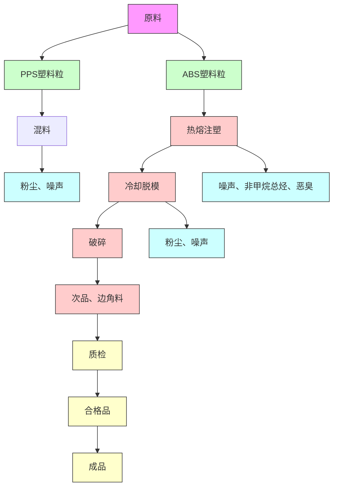
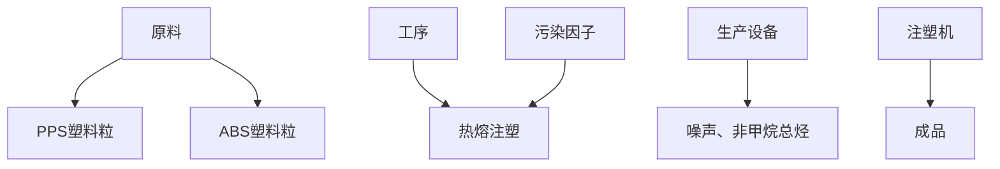

# 建设项目环境影响报告表

（污染影响类）

项目名称：佛山市顺德区容桂洪式五金塑料厂迁扩建项目建设单位（盖章）：佛山市顺德区容桂洪式五金塑料厂

编制日期： 2021 年 4 月

中华人民共和国生态环境部制

## 一、建设项目基本情况

<table><tr><td>建设项目名称</td><td colspan="5">佛山市顺德区容桂洪式五金塑料厂迁扩建项目</td></tr><tr><td>项目代码</td><td colspan="5">无</td></tr><tr><td>建设单位联系人</td><td>刘*</td><td>联系方式</td><td colspan="3">137*</td></tr><tr><td>建设地点</td><td colspan="5">广东省佛山市顺德区容桂街道华口社区华容五路41号晓胜楼607、608</td></tr><tr><td>地理坐标</td><td colspan="5">(113度19分47秒,22度45分54秒)</td></tr><tr><td>国民经济行业类别</td><td>C2929塑料零件及其他塑料制品制造</td><td>建设项目行业类别</td><td colspan="3">二十六、橡胶和塑料制品业29-53塑料制品制造292中的“其他(年用非溶剂型低VOCs含量涂料10吨以下)”类别</td></tr><tr><td>建设性质</td><td>☑新建(迁建)□改建R扩建□技术改造</td><td>建设项目申报情形</td><td colspan="3">☑首次申报项目□不予批准后再次申报项目□超五年重新审核项目□重大变动重新报批项目</td></tr><tr><td>项目审批(核准/备案)部门(选填)</td><td>/</td><td>项目审批(核准/备案)文号(选填)</td><td colspan="3">/</td></tr><tr><td>总投资(万元)</td><td>100</td><td>环保投资(万元)</td><td colspan="3">10</td></tr><tr><td>环保投资占比(%)</td><td>10</td><td>施工工期</td><td colspan="3">2021年5月</td></tr><tr><td>是否开工建设</td><td>R否£是_</td><td>用地(用海)面积(m2)</td><td colspan="3">1012</td></tr><tr><td>专项评价设置情况</td><td colspan="5">无</td></tr><tr><td>规划情况</td><td colspan="5">无</td></tr><tr><td>规划环境影响评价情况</td><td colspan="5">无</td></tr><tr><td>规划及规划环境影响评价符合性分析其他符合性分析</td><td colspan="5">无1、“三线一单”相符性分析1生态保护红线项目位于广东省佛山市顺德区容桂街道华口社区华容五路41号晓胜楼607、608,周边无自然保护区。根据《佛山市顺德区生态保护红线管理办法(试行)》的相关规定,项目所在地为城市建成区,不涉及自然保护区、森林公园、自然保护区、饮用水源保护区及其他需要进行生态保护的区域,不在生态保护红线范围内。2环境质量底线本项目附近地表水环境、声环境质量以及大气环境均能满足相应的标准要求;本项目废气产生量较小,且废气经过有效的收集处理后排放,对周边环境影响很小。项目生活污水经生活污水预处理设施处理达标后经市政污水管网排入容桂第二污水处理厂处理,尾水排入鸡鸦水道。因此项目的建设符合环境质量底线要求。3资源利用上线本项目营运过程中消耗一定量的电能、水资源,项目资源消耗量相对区域资料利用总量较少,符合资源利用上限的要求。4产业政策及准入清单项目主要从事塑料制品的生产与销售,属于C2929塑料零件及其他塑料制品制造。根据《市场准入负面清单》(2020年版),本项目属于许可准入类。因此,项目符合相关的产业政策要求。(2)有机废气相符性分析项目挥发性有机物(VOCs)排放符合性根据相关政策文件规定分析如下:1-1项目与挥发性有机物(VOCs)排放规定相关符合分析</td></tr><tr><td rowspan="2"></td><td>序号</td><td>文件</td><td>规定</td><td>项目实际</td><td>是否符合判定</td></tr><tr><td>12</td><td>《关于印发&lt;“十三五”挥发性有机物污染防治工作方案&gt;的通知》(环大气[2017]121号)《重点行业挥发性有机物综合治理方案》的通知(环大气[2019]53号)</td><td>新、改、扩建涉VOCs排放项目,应从源头加强控制,使用低(无)VOCs含量的原辅材料,加强废气收集,安装高效治理设施。提高废气收集率。遵循“应收尽收、分质收集”的原则,科学设计废气收集系统,将无组织排放转变为有组织排放进行控制。</td><td>本项目使用的多种塑料粒料均为无VOCs含量,有机废气经集气罩收集后用“两级活性炭”装置处理,处理后通过35米排气筒高空排放。项目对注塑工序设置集气罩,废气收集效率可达90%。</td><td>符合符合</td></tr><tr><td rowspan="2"></td><td>3</td><td>《广东省打赢蓝天保卫战实施方案(2018-2020年)》</td><td>重点推广使用低VOCs含量、低反应活性的原辅材料和产品,到2020年,印刷、家具制造、工业涂装重点工业企业的低毒、低(无)VOCs含量、高固份原辅材料使用比例大幅提升。</td><td>项目属于塑料零件及其他塑料制品制造,不属于印刷、家具制造、工业涂装等重点工业行业;项目使用的塑料原料为无VOCs含量原料,有机废气经集气罩收集后通过“两级活性炭”处理,再引至35m排气筒高空排放。</td><td>符合</td></tr><tr><td>4</td><td>《广东省挥发性有机物(VOCs)整治与减排工作方案(2018-2020年)》(粤环发[2018]6号)</td><td>推动低(无)VOCs含量原辅材料替代和工艺技术升级。</td><td>项目使用的塑料原料为无VOCs含量原料。</td><td>符合</td></tr></table>

## 二、建设项目工程分析

建
设
内
容

## 1、项目工程组成

项目具体工程组成见下表：

表 2-1 项目工程组成

<table><tr><td>项目</td><td>内容</td><td>迁扩建前</td><td>迁扩建后</td></tr><tr><td>主体工程</td><td>生产车间</td><td>生产车间面积约730m2</td><td>生产面积约980m2</td></tr><tr><td>辅助工程</td><td>办公室</td><td>用于日常办公约20m2</td><td>用于日常办公约32m2</td></tr><tr><td>贮运工程</td><td>原料、成品存储区</td><td>位于生产车间内</td><td>位于生产车间内</td></tr><tr><td rowspan="2">公用工程</td><td>给水系统</td><td>通过自来水管网供水</td><td>通过自来水管网供水</td></tr><tr><td>排水系统</td><td>清污分流,雨水通过雨水管网进入内河涌;生活污水经三级化粪池预处理后通过市政管网,排入容桂第一污水处理厂</td><td>清污分流,雨水通过雨水管网进入内河涌;生活污水经三级化粪池预处理后通过市政管网,排入容桂第二污水处理厂</td></tr><tr><td rowspan="3">环保工程</td><td>废水治理</td><td>生活污水经三级化粪池预处理后通过市政管网,排入容桂第一污水处理厂</td><td>生活污水经三级化粪池预处理后通过市政管网,排入容桂第二污水处理厂</td></tr><tr><td>废气治理</td><td>注塑废气收集后通过15米排气筒排放</td><td>注塑废气收集后经“两级活性炭”设施处理后通过35米排气筒排放</td></tr><tr><td>固废治理</td><td>生活垃圾交由环卫部门处理;一般固废废包装材料和次品外卖给废品回收商;危险废物交由有资质的单位处理</td><td>生活垃圾交由环卫部门处理;一般固废废包装材料外卖给废品回收商,次品破碎后回用于生产中;危险废物交由有资质的单位处理</td></tr></table>

## 2、项目生产规模

根据业主提供的资料，项目主要产品产量见下表。

表2-2 项目产品产量

<table><tr><td>序号</td><td>产品名称</td><td>迁扩建前年产量</td><td>迁扩建后年产量</td><td>备注</td></tr><tr><td>1</td><td>塑料制品</td><td>10吨</td><td>100吨</td><td>主要为电磁炉外壳、饮水机外壳</td></tr></table>

## 3、项目主要生产设备

根据业主提供的资料，项目主要生产设备详见下表。

表 2-3 项目主要生产设备一览表

<table><tr><td>序号</td><td>名称</td><td>单位</td><td>迁扩建前数量</td><td>迁扩建后数量</td><td>变化情况</td></tr><tr><td>1</td><td>注塑机</td><td>台</td><td>2</td><td>15</td><td>+13</td></tr><tr><td>2</td><td>破碎机</td><td>台</td><td>0</td><td>5</td><td>+5</td></tr><tr><td>3</td><td>混料机</td><td>台</td><td>0</td><td>3</td><td>+3</td></tr><tr><td>4</td><td>车床</td><td>台</td><td>0</td><td>1</td><td>+1</td></tr><tr><td>5</td><td>铣床</td><td>台</td><td>0</td><td>3</td><td>+3</td></tr><tr><td>6</td><td>冷却塔</td><td>台</td><td>0</td><td>1</td><td>+1</td></tr><tr><td>7</td><td>空压机</td><td>台</td><td>0</td><td>1</td><td>+1</td></tr></table>

## 4、项目主要原辅材料

根据建设单位提供的资料，项目使用的原辅材料详见下表。

表 2-4 项目主要原辅材料

<table><tr><td>序号</td><td>名称</td><td>单位</td><td>迁扩建前年耗量</td><td>迁扩建后年耗量</td></tr><tr><td>1</td><td>ABS 塑料粒</td><td>吨</td><td>3</td><td>30</td></tr><tr><td>2</td><td>PPS 塑料粒</td><td>吨</td><td>7</td><td>70</td></tr><tr><td>3</td><td>钢材</td><td>吨</td><td>0</td><td>5</td></tr><tr><td>4</td><td>机油</td><td>吨</td><td>0.025</td><td>0.25</td></tr></table>

## 注释：

ABS 塑料粒：丙烯腈(A)、丁二烯(B)、苯乙烯(S)三种单体的三元共聚物，三种单体相对含量可任意变化，制成各种树脂。ABS 兼有三种组元的共同性能，A 使其耐化学腐蚀、耐热，并有一定的表面硬度，B 使其具有高弹性和韧性，S 使其具有热塑性塑料的加工成型特性并改善电性能。因此 ABS 塑料是一种原料易得、综合性能良好、价格便宜、用途广泛的“坚韧、质硬、刚性”材料。分解温度为 320℃。

PPS塑料粒：PPS塑料粒是一种综合性能优异的热塑性特种工程塑料，其突出的特点是耐高温、耐腐蚀和优越的机械性能。PPS是含硫芳香族聚合物，线型PPS在350℃以上交联后成热固性塑料，支链型结构PPS为热塑性塑料。

## 5、劳动定员及工作制度

职工人数：项目迁扩建前职工人数为3 人，迁扩建后职工人数为 20 人，员工均不在厂区内食宿。

工作制度：项目迁扩建前后均实行一天一班制，每天工作 8 小时，年工作时

<table><tr><td></td><td>间300天。6、资源、能源消耗(1)生活用水:根据建设单位提供的资料,项目迁扩建前员工共3人,均不在厂区内食宿,生活用水量为 $36m^{3}/a$ ;迁扩建后,项目定员20人,年工作300天,根据《广东省用水定额》(DB44/T1461-2014)生活用水定额为40升/人·日计,生活用水量约 $0.8m^{3}/d(240m^{3}/a)$ ,由市政供水。(2)生产用水:项目迁扩建后需用冷却水,循环使用不外排,因蒸发因素,需补充新鲜用水,年用水量约48t/a。(3)本项目能耗主要为电能。用电由当地供电局统一供应,主要用于照明、设备运行等,不设备用发电机。7、四邻关系分析项目租用已建成厂房进行生产,地址为广东省佛山市顺德区容桂街道华口社区华容五路41号晓胜楼607、608的厂房。厂房为8层建筑物,本项目位于6层,具体平面布置详见附图5。项目东北面为空置厂房,西北面为工业园道路,西南面为空置厂房,东南面为华容五路(项目四至情况详见附图2)。</td></tr><tr><td>工艺流程和产排污环节</td><td>1、生产工艺流程</td></tr></table>

flowchart

图1-1 迁扩建后塑料制品生产工艺流程图

## 工艺流程说明：

本项目工艺流程比较简单，将外购PPS、ABS 粒料混料机混料后，在注塑机内的料筒里电热加热到熔融状态，原料熔化后挤压入模成型。项目使用冷却塔冷却，冷却水定期补充，不外排。项目设置破碎机，生产过程中产生的边角料和次品通过破碎机破碎后回用。

注：本项目生产过程中不使用废旧塑料。

<table><tr><td></td><td>图1-2 模具生产工艺流程图工艺流程说明:项目迁扩建后增加模具加工区,模具仅供本项目使用,不外售。将外购回来的钢材用车床、铣床等机械机加工成注塑模具。产污环节分析:废水:项目冷却水经循环使用后不外排,外排废水为员工生活污水。废气:项目产生的大气污染物主要为热熔注塑工序挥发出的少量有机废气,即非甲烷总烃;混料、破碎工序产生的塑料粉尘;模具机加工产生的机加工粉尘。噪声:车间各种设备运行时产生的机械噪声;固废:职工生活垃圾、一般工业固体废物、危险废物等</td></tr><tr><td>与项目有关的原有环境污染问题</td><td>1、与本项目有关的原有污染情况:佛山市顺德区容桂洪式五金塑料厂原址位于容桂海尾文建路8号,原名为顺德市容桂区洪式五金塑料厂,项目已于2002年4月3日取得顺德区建设项目环境影响报告批准证(编号:容桂20020316),并于2017年6月22日通过佛山市顺德区环境运输和城市管理验收,原项目批准规模为:注塑机2台。因企业发展需要和配合顺德区进行村级工业园改造,项目拟搬迁至广东省佛山市顺德区容桂街道华口社区华容五路41号晓胜楼607、608的厂房(其地理位置见附图1),中心地理坐标为:东经113度19分47秒,北纬22度45分54秒,并在原来基础上扩大产能,增加注塑机及机加工设备。迁扩建后年产塑料制品100吨。为了解项目迁扩建前的污染排放情况,现进行回顾性分析。项目迁扩建前工艺流程:</td></tr></table>

##

##

##

flowchart

图 1-1 项目迁扩建前生产工艺流程图

## 工艺流程说明：

本项目扩建前工艺流程比较简单，将外购PPS、ABS 粒料在注塑机内的料筒里电热加热到熔融状态，原料熔化后挤压入模成型即成成品。

## 产污环节分析：

废水：外排废水为员工生活污水。

废气：项目产生的大气污染物主要为热熔注塑工序挥发出的少量有机废气，即非甲烷总烃。

噪声：车间各种设备运行时产生的机械噪声；

固废：职工生活垃圾、一般工业固体废物、危险废物等。

项目迁扩建前污染源强及治理措施：

表 2-5 项目原有污染源及防治措施效果评价

<table><tr><td>项目</td><td>污染工序</td><td>污染因子</td><td>产生量(t/a)</td><td>排放量(t/a)</td><td>排放标准(限值)</td><td>排放浓度</td><td>污染防治措施</td><td colspan="2">效果评价</td></tr><tr><td rowspan="4">水污染物</td><td rowspan="4">生活污水(32.4t/a)</td><td> $COD_{Cr}$ </td><td>0.0081</td><td>0.001</td><td>40mg/L</td><td>40mg/L</td><td rowspan="4">生活污水经三级化粪池处理达标后经市政管网排入容桂第一污水处理厂</td><td colspan="2" rowspan="4">达标排放</td></tr><tr><td> $BOD_5$ </td><td>0.0049</td><td>0.0006</td><td>20mg/L</td><td colspan="2">20mg/L</td></tr><tr><td>SS</td><td>0.0049</td><td>0.0006</td><td>20mg/L</td><td colspan="2">20mg/L</td></tr><tr><td> $NH_3-N$ </td><td>0.001</td><td>0.0003</td><td>8mg/L</td><td colspan="2">8mg/L</td></tr><tr><td rowspan="2">大气污染物</td><td rowspan="2">注塑挤出工序</td><td>非甲烷总烃(有组织)</td><td>0.0033</td><td>0.0033</td><td>100mg/m3</td><td>3.3mg/m3</td><td rowspan="2">集气罩收集后经高于15米的排气筒排放</td><td colspan="2" rowspan="2">达标排放</td></tr><tr><td>非甲烷总烃(无组织)生产设备</td><td>0.0002噪声</td><td>0.000265~80</td><td>4.0mg/m3</td><td colspan="2">/昼间≤65dB(A)夜间≤55dB(A)——</td></tr><tr><td rowspan="5"></td><td>噪声</td><td></td><td></td><td colspan="2"></td><td></td><td></td><td>选用低噪设备、加强设备保养、合理安排设备位置</td><td>达标排放</td></tr><tr><td rowspan="3">固体废物</td><td colspan="2">生活垃圾</td><td>0.45t/a</td><td>0</td><td>——</td><td>——</td><td>交环卫部门统一清运</td><td>符合要求</td></tr><tr><td colspan="2">一般工业固废</td><td>0.3t/a</td><td>0</td><td>——</td><td>——</td><td>交给废品回收公司回收处理</td><td>符合要求</td></tr><tr><td>危险废物</td><td>废机油、含油废抹布</td><td>0.01t/a</td><td>0</td><td>——</td><td>——</td><td>交由有危险废物处理资质的单位处理</td><td>符合要求</td></tr><tr><td colspan="9">项目迁扩建前严格按照相关部门的要求落实好环保设施,生活污水、废气、一般固体废物及危险废物均落实相应治理措施。到现在为止,项目未收到环保方面的投诉,未对周围环境造成明显影响。2、主要环境问题:迁扩建前,项目所在地周围无重污染的大型企业或重工业,存在主要污染物为附近工厂在生产运营过程中产生的废气、噪声、废水、固废等,以及附近道路车辆行驶噪声和扬尘等。</td></tr></table>

## 三、区域环境质量现状、环境保护目标及评价标准

<table><tr><td>区域环境质量现状</td><td>1、大气质量现状本项目位于广东省佛山市顺德区容桂街道华口社区华容五路41号晓胜楼607、608,根据《关于调整顺德区环境空气质量功能区划的变函》(佛府办函[2014]494号),项目所在位置属于二类环境空气质量功能区,执行《环境空气质量标准》(GB3095-2012)及其2018年修改单二级标准。根据《佛山市生态环境局顺德分局关于发布2020年度佛山市顺德区环境质量状况公报的通知》,2020年全区空气质量综合指数为3.30,比2019年下降22.9%空气质量同比有所改善,在全市五区中排名第二。2020年全区二氧化硫( $SO_{2}$ )、二氧化氮( $NO_{2}$ )、可吸入颗粒物( $PM_{10}$ )、细颗粒物( $PM_{2.5}$ )平均浓度分别为7、30、43、21微克/立方米,臭氧日最大8小时滑动平均( $O_{3}$ -8h)浓度的第90百分位数为155微克/立方米,一氧化碳(CO)日浓度的第95百分位数为1.0毫克/立方米,六项污染物指标浓度均达到《环境空气质量标准》(GB3095-2012)二级标准限值。与去年相比,2020年度顺德区六项环境空气污染指标浓度均有不同程度下降, $PM_{2.5}$ 、 $PM_{10}$ 、 $NO_{2}$ 、 $SO_{2}$ 平均浓度分别下降30.0%、23.2%、23.1%、12.5%,C0日平均浓度的第95百分位数下降23.1%、 $O_{3}$ -8h浓度的第90百分位数下降18.4%,具体情况见图3-1和表3-1。2020年度全区环境空气质量优良天数占有效天数的90.4%,同比去年提高13.1个百分点。</td></tr></table>

bar-line hybrid chart

| 水素类型       | 2019年 (微克/立方米) | 2020年 (微克/立方米) | 毫克/立方米 (一氧化碳) |
| -------------- | ------------------- | ------------------- | --------------------- |
| 二氧化硫      | 10                  | 8                   | 0.3                   |
| 二氧化氮      | 40                  | 35                  | 0.6                   |
| 可吸入颗粒物   | 60                  | 45                  | 0.7                   |
| 细颗粒物       | 35                  | 30                  | 0.4                   |
| 臭氧            | 195                 | 155                 | 2.6                   |
| 一氧化碳        | 75                  | 60                  | 1.0                   |

图 3-1 2020 年顺德区（国控测点）环境空气污染物浓度水平年度比较表3-1 2020 年顺德区（国控测点）环境空气污染物浓度水平年度比较

<table><tr><td rowspan="2">污染物</td><td colspan="2">浓度均值</td><td rowspan="2">评价标准</td><td rowspan="2">变化</td></tr><tr><td>2019年</td><td>2020年</td></tr><tr><td> $SO_{2}$ (μg/m3)</td><td>8</td><td>7</td><td>60</td><td>达标</td></tr><tr><td> $NO_{2}$ (μg/m3)</td><td>39</td><td>30</td><td>40</td><td>达标</td></tr><tr><td> $PM_{10}$ (μg/m3)</td><td>56</td><td>43</td><td>70</td><td>达标</td></tr><tr><td> $PM_{2.5}$ (μg/m3)</td><td>30</td><td>21</td><td>35</td><td>达标</td></tr><tr><td> $CO^{*}$ (μg/m3)</td><td>1.3</td><td>1.0</td><td>4</td><td>达标</td></tr><tr><td> $O_{3}-8^{*}$ (μg/m3)</td><td>190(超标)</td><td>155</td><td>160</td><td>达标区</td></tr><tr><td colspan="5">*注:(1)表中C0为年内日平均值的第95百分位数, $O_{3}$ 为年内日最大8小时平均值的第90百分位数。(2)2019年公报与2020年公报中的环境空气质量统计分析数据均采用实况数据。</td></tr></table>

根据2020年全区的大气环境质量状况公报，六项污染物指标浓度均达到了质量标准限值，故顺德区大气环境质量属达标区。

## 2、地表水环境质量现状

<table><tr><td rowspan="5"></td><td colspan="7">本项目所处位置属于容桂第二污水处理厂纳污范围,生活污水经预处理后排入容桂第二污水处理厂处理,尾水排入鸡鸦水道。鸡鸦水道水质执行《地表水环境质量标准》(GB3838-2002)之III类标准。为评价鸡鸦水道水质,根据《佛山市生态环境局顺德分局关于发布2020年度佛山市顺德区环境质量状况公报的通知》可知,鸡鸦水道细滘大桥断面2020年的水质定类为II类,符合《地表水环境质量标准》(GB3838-2002)之III类标准的要求,故水质较好。表3-2 2020年度佛山市顺德区环境质量状况公报(节选)</td></tr><tr><td rowspan="2">序号</td><td rowspan="2">河流名称</td><td rowspan="2">断面</td><td colspan="2">断面定类</td><td rowspan="2">水质评价标准</td><td>河流定类</td></tr><tr><td>2020年</td><td>2019年</td><td>2020年</td></tr><tr><td>19</td><td>鸡鸦水道</td><td>细窖大桥</td><td>II</td><td>III</td><td>II</td><td>II</td></tr><tr><td colspan="7">3、声环境本项目为新建,项目厂界外50m范围内无环境敏感目标。4、生态环境项目用地范围内无生态环境保护目标,无需开展生态现状调查。5、电磁辐射项目不涉及电磁辐射,无需开展电磁辐射现状调查。6、土壤、地下水环境项目不存在土壤、地下水环境污染途径,不开展土壤、地下水环境质量现状调查。</td></tr><tr><td>环境保护目标</td><td colspan="7">1、环境空气保护目标本项目厂界外500米范围内无自然保护区、风景名胜区、居住区、文化区和农村地区中人群较集中的区域等保护目标。2、水环境保护目标本项目厂界外500米范围内无地下水集中式饮用水水源和热水、矿泉水、温泉等特殊地下水资源。3、声环境保护目标本项目厂界外50米范围内无声环境保护目标。4、生态环境项目用地范围内无生态环境保护目标。</td></tr><tr><td rowspan="6">污染物排放控制标准</td><td colspan="7">1、废水排放标准项目运营期生活污水经预处理达到《水污染物排放限值》(DB44/26-2001)中的三级标准(第二时段)后,通过市政管网进入容桂第二污水处理厂处理。容桂第二污水处理厂已完成提标改造,根据2013年7月11日颁布的《顺德区环境运输和城市管理局关于全区城镇污水处理厂尾水排放执行标准的通知》定:污水处理厂的尾水CODcr和NH3-N执行《城镇污水处理厂污染物排放标准》(GB18918-2002)一级A标准及《水污染物排放限值》(DB44/26-2001)的较严值,其它指标现执行《城镇污水处理厂污染物排放标准》(GB18918-2002)一级A标准,具体数值,具体执行标准见下表:表3-3水污染物排放浓度限值(单位mg/L,pH除外)</td></tr><tr><td rowspan="2">排放标准</td><td colspan="6">标准值</td></tr><tr><td> $COD_{cr}$ </td><td> $BOD_5$ </td><td>SS</td><td colspan="3">氨氮</td></tr><tr><td>《水污染物排放限值》(DB44/26-2001)中的三级标准(第二时段)</td><td>500</td><td>300</td><td>400</td><td colspan="3">/</td></tr><tr><td>CODcr和NH3-N执行《城镇污水处理厂污染物排放标准》(GB18918-2002)一级A标准及《水污染物排放限值》(DB44/26-2001)的较严值,其它指标现执行《城镇污水处理厂污染物排放标准》(GB18918-2002)一级A标准</td><td>40</td><td>10</td><td>10</td><td colspan="3">5</td></tr><tr><td colspan="7">2、废气排放标准项目注塑工序会产生少量有机废气,主要污染因子为非甲烷总烃,废气经集气罩收集后用“两级活性炭”装置处理,处理后通过一个35米排气筒高空排放;破碎工序会产生少量粉尘,污染因子为颗粒物,粉尘无组织排放。非甲烷总烃与颗粒物等污染物排放标准执行《合成树脂工业污染物排放标准》(GB31572-2015)中表4和表9规定的大气污染物排放限值。机加工产生的金属粉尘执行广东省地方标准《大气污染物排放限值》(DB44/27-2001)第二时段无组织排放时周界外浓度最高点浓度限值。注塑产生的恶臭排放执行《恶臭污染物排放标准》(GB14554-93)中表1恶臭污染物厂界标准值和表2排气筒恶臭污染物排放限值。具体排放标准如下表所示:表3-4 大气污染物排放标准</td></tr><tr><td rowspan="7"></td><td rowspan="2">排放源</td><td rowspan="2">污染物</td><td colspan="2">有组织排放(排气筒35米)</td><td rowspan="2">无组织排放监控浓度限值(mg/m3)</td><td colspan="2" rowspan="2">执行标准</td></tr><tr><td>最高允许排放浓度(mg/m3)</td><td colspan="2">最高允许排放速率(kg/h)</td></tr><tr><td>混料、破碎粉尘</td><td>颗粒物</td><td>——</td><td>——</td><td>1.0</td><td colspan="2" rowspan="2">《合成树脂工业污染物排放标准》(GB31572-2015)</td></tr><tr><td>注塑</td><td>非甲烷总烃</td><td>100</td><td>——</td><td colspan="2">4.0</td></tr><tr><td>机加工粉尘</td><td>颗粒物</td><td>——</td><td>——</td><td>1.0</td><td colspan="2">《大气污染物排放限值》(DB44/27-2001)</td></tr><tr><td>注塑</td><td>恶臭</td><td>2000(无量纲)</td><td>——</td><td>20(无量纲)</td><td colspan="2">《恶臭污染物排放标准》(GB14554-93)</td></tr><tr><td colspan="7">(三)噪声:本项目执行《工业企业厂界环境噪声排放标准》(GB12348-2008)3类标准昼间等效声级≤65dB(A)、夜间等效声级≤55dB(A)。(四)固体废物:一般工业固体废物执行《一般工业固体废物贮存、处置场污染控制标准》(GB18599-2001)及其2013修改单;危险废物执行《危险废物贮存污染控制标准》(GB18597-2001)及其2013修改单(公告2013年第36号)和《国家危险废物名录》(2021版)。</td></tr><tr><td>总量控制指标</td><td colspan="7">项目迁扩建后运营期间生活污水排放量为216t/a,CODCr排放总量为0.009t/a,NH3-N排放总量为0.001t/a,CODcr、NH3-N总量纳入容桂第二污水处理厂的总量中。本项目迁扩建后非甲烷排放量为0.0809t/a,其中有组织排放量控量0.052t/a、无组织排放量0.0289t/a。根据《顺德区环境保护委员会关于印发顺德区工业挥发性有机物项目(VOCs)审批总量前置实施细则(2016年修订)的通知》(顺指环委[2016]3号),项目VOCs有组织排放量为0.052t/a,建议挥发性有机物排放总量控制指标为0.027t/a,从佛山市顺德区容桂街道总量中列支。</td></tr></table>

## 四、主要环境影响和保护措施

<table><tr><td>施工期环境保护措施</td><td colspan="6">项目迁扩建后租用已建设完毕的工业厂房,不涉及厂房建设,施工过程主要是内部装修和设备安装,没有基建工程,因此施工期基本不存在大型土建工程,施工期间产生的影响主要是由于设备运输,安装时产生的噪声等。施工期建设单位应严格遵守有关建筑施工的环境保护条例,防止运输扬尘,建筑垃圾、废物等及时清运,降低施工过程对周围环境造成的影响。项目施工期较短,因此若建设单位加强施工管理,项目施工时不会对周围环境产生较大影响。因此本报告不对其进行论述。</td></tr><tr><td rowspan="6">运营期环境影响和保护措施</td><td colspan="6">1、大气污染源项目迁扩建后产生的大气污染主要来自混料粉尘、边角料及次品破碎产生的粉尘、机加工粉尘、注塑时产生的非甲烷总烃。表4-1 项目废气产污环节、污染物项目、排放形式及污染防治设施一览表</td></tr><tr><td rowspan="2">主要生产单元</td><td rowspan="2">污染物项目</td><td rowspan="2">排放形式</td><td colspan="2">污染物防治设施名称</td><td rowspan="2">排放口类型</td></tr><tr><td>污染物防治设施工艺及设施</td><td>是否为可行性技术</td></tr><tr><td>混料、破碎粉尘、机加工粉尘</td><td>颗粒物</td><td>无组织</td><td>/</td><td>/</td><td>/</td></tr><tr><td>有机废气</td><td>非甲烷总烃</td><td>有组织</td><td>二级活性炭(35m排气筒G1)</td><td>☑是☐否</td><td>一般排放口</td></tr><tr><td colspan="6">(1)废气排放源强1机加工粉尘项目使用车床、铣床等设备生产模具会产生金属粉尘,其污染因子为颗粒物。根据建设单位提供的资料及《机加工行业环境影响评价中常见污染物源强估算及污染治理》(许海萍等,湖北大学学报(自然科学版),2010年3月版)有关金属机加工粉尘产量的计算公式(M=M1/1000)可知,项目钢材加工量为5t/a,计算得粉尘产生量为0.005t/a,按年生产2400h(每天8小时,年工作300天)计算,颗粒物产生速率为0.002kg/h。由于金属颗粒物比重较大,易于沉降,约90%金属粉尘可在操作区域附近沉降,粉尘沉降量为0.0045t/a,沉降粉尘定期清理收集后作为一般工业废物回收处理,少部分扩散到大气中形成粉尘,扩散量约为0.0005t/a,</td></tr></table>

以无组织形式排放，颗粒物的无组织排放速率为 0.0002kg/h。

## ②混料、破碎粉尘

项目混料机设有顶盖，封闭作业，工作时会有少量粉尘外逸到车间内，混料工序中产生的粉尘量很小，主要污染物为颗粒物。类比同类型项目《顺德区容桂盈的五金塑料厂年产塑料盖子50万个、链板10万个、消毒柜脚20万个新建项目》（顺管容环审[2018]第 0430 号），粉尘排放系数可以按 0.01%原料来计算。本项目塑料原料共为100t/a（PPS 塑料粒 70t、ABS 塑料粒 30t），则混料工序中的粉尘产生总量约为0.01t/a。混料机每天操作时间 2h计，工作天数为300天，混料时间约为 600h，则混料工序中的粉尘无组织产生速率为 0.016kg/h。

项目破碎边角料及次品过程会产生少量塑料粉尘，主要污染因子为颗粒物。破碎机工作时为敞开状态，塑料粉尘会从进料口和出料口逸出。类比同类型项目，项目塑料边角料及次品的产生系数为 5%，塑料原料共为 100t/a（PPS 塑料粒 70t、ABS 塑料粒30t），则项目塑料边角料及次品产生量为5t/a。由于破碎机工作时加盖密闭，因此只有投料和出料时会有极少量粉尘外逸，根据《工业逸散性粉尘控制技术》，物料无控制排放因子为 0.01kg/t，破碎量为 5t/a，则破碎粉尘产生量为0.05kg/a。项目破碎为非连续性工作，每天破碎工作时间合约为 2h，年工作 300 天，破碎时间约为 600h，则破碎粉尘排放速率为 0.00008kg/h，在车间无组织排放。

表4-2 项目粉尘产排情况

<table><tr><td rowspan="2">污染物</td><td colspan="2">产生情况</td><td colspan="2">无组织排放</td></tr><tr><td>产生量(t/a)</td><td>产生速率(kg/h)</td><td>排放量(t/a)</td><td>排放速率(kg/h)</td></tr><tr><td>混料粉尘</td><td>0.01</td><td>0.016</td><td>0.01</td><td>0.016</td></tr><tr><td>破碎粉尘</td><td>0.00005</td><td>0.00008</td><td>0.00005</td><td>0.00008</td></tr><tr><td>机加工粉尘</td><td>0.005</td><td>0.006</td><td>0.0005</td><td>0.0002</td></tr><tr><td>合计</td><td>0.0151</td><td>0.0221</td><td>0.0106</td><td>0.0163</td></tr></table>

## ③注塑废气

项目注塑成型工序中，塑料熔融时产生的有机废气，主要污染物为非甲烷总烃。参考 《上海市工业企业挥发性有机物排放量通用计算方法》（试行）中，表 1-4主要塑料制品制造工序产污系数，非甲烷总烃排放系数为 2.885kg/t。项目原辅材料PPS塑料粒年使用量70t、ABS 塑料年使用量为30t，则本项目非甲烷总烃总产生量为 0.289t/a。按每天工作 8h，每年工作 300d 计算，产生速率为：0.12kg/h。

项目拟在注塑工位上方设置集气罩收集有机废气，收集后通过“二级活性炭”处理后引至一个35 米的排气筒高空排放，未收集部分在车间以无组织形式排放。每个集气罩的规格为 400mm×400mm，则单个集气罩罩口敞开面周长为 1.6m。为了将罩下的废气收集起来，必须用风机在罩口形成一定的负压，即在废气的排放点造成一定的上升风速，以便将废气吸入罩内。根据《环保设备设计手册—大气污染控制设备》（周兴求主编，化学工业出版社）P494：上部集气罩的排风量 Q可根据下式进行计算：

$$
\mathrm{Q} = \mathrm{kLHV} _ {\mathrm{x}} \left(\mathrm{m} ^ {3} / \mathrm{s}\right)
$$

式中：L—罩口敞开面的总周长，项目取 1.6m；

H—罩口至污染源的距离，项目取 0.1m；

Vx—敞开断面处的流速，项目取 0.5m/s；

k—考虑沿高度速度分布不均匀的安全系数，通常取 k=1.4。

经计算，项目单个罩口所需的风量为403.2m3/h，本项目共有 15台注塑机，共设15个集气罩，则项目产生的非甲烷总烃收集所需的总风量为6048m3/h。考虑到风力损失，本项目选取 1 台风量为 10000m3/h 的风机。集气罩的收集效率为 90%，根据第二次全国污染源普查《工业源产排污系数手册（试用版）》中《292 塑料制品行业系数手册》C2929 塑料零件及其他塑料制品制造（续表1）的说明，塑料注塑废气采用活性炭吸附工艺的去除效率为 70%，本项目使用“两级活性炭”总体去除效率按80%，则项目非甲烷总烃的产排情况如下表所示：

表 4-3 项目非甲烷总烃产排情况一览表

<table><tr><td rowspan="2">污染物</td><td rowspan="2">产生量(t/a)</td><td colspan="6">35米排气筒</td><td colspan="2">无组织</td></tr><tr><td>收集效率</td><td>收集量(t/a)</td><td>处理效率</td><td>排放量(t/a)</td><td>排放速率(kg/h)</td><td>排放浓度(mg/m3)</td><td>排放量(t/a)</td><td>排放速率(kg/h)</td></tr><tr><td>非甲烷总烃</td><td>0.289</td><td>90%</td><td>0.26</td><td>80%</td><td>0.052</td><td>0.0218</td><td>2.168</td><td>0.0289</td><td>0.012</td></tr><tr><td colspan="10">注:废气量=(风机风量×工作天数×工作小时数)÷ $10^{4}$ =(10000×300×8)÷ $10^{4}$ =2400万m3/a。</td></tr></table>

## ④ 恶臭

本项目注塑过程产生少量的异味，该异味污染物以臭气浓度为表征。本报告引用张欢等在《恶臭污染评价分级方法》中基于韦伯-费希纳公式所建立的臭气强度与臭气浓度的关系，将国外臭气强度 6 级法与我国《恶臭污染物排放标准》（GB14554-1993）结合（详见表5-4），该分级法以臭气强度的嗅觉感觉和实验经验为分级依据，对臭气浓度进行等级划分，提高了分级的准确程度。

表4-4 与臭气强度相对应的臭气浓度限值

<table><tr><td>分级</td><td>臭气强度(无量纲)</td><td>臭气浓度(无量纲)</td><td>嗅觉感觉</td></tr><tr><td>0</td><td>0</td><td>10</td><td>未闻到有任何气味,无任何反应</td></tr><tr><td>1</td><td>1</td><td>23</td><td>勉强能闻到有气味,但不宜辨认气味性质(感觉阈值)认为无所谓</td></tr><tr><td>2</td><td>2</td><td>51</td><td>能闻到气味,且能辨认气味的性质(识别阈值),但感到很正常</td></tr><tr><td>3</td><td>3</td><td>117</td><td>很容易闻到气味,有所不快,但不反感</td></tr><tr><td>4</td><td>4</td><td>265</td><td>有很强的气味,很反感,想离开</td></tr><tr><td>5</td><td>5</td><td>600</td><td>有极强的气味,无法忍受,立即逃跑</td></tr></table>

本项目注塑异味强度一般在1\~2级，折合臭气浓度为23\~51（无量纲），注塑异味随非甲烷总烃一起收集后，通过约 35 米高排气筒 G1排放，其余以无组织形式排放。

## （2）大气达标性分析

## ①废气源强达标分析

本项目共设置1个排气筒，排气筒基本情况见下表。

表4-5 排放口基本情况

<table><tr><td rowspan="2">类型</td><td rowspan="2">点源名称</td><td colspan="2">排气筒地理坐标</td><td rowspan="2">排气筒高度(m)</td><td rowspan="2">排气筒出口内径(m)</td><td rowspan="2">烟气流量( $m^3/h$ )</td><td rowspan="2">烟气温度(°C)</td><td rowspan="2">年排放小时数(h)</td></tr><tr><td>东经</td><td>北纬</td></tr><tr><td>点源</td><td>排气筒G1</td><td>113度19分47秒</td><td>22度45分54秒</td><td>35</td><td>0.6</td><td>10000</td><td>25</td><td>2400</td></tr></table>

表4-6 项目排气筒污染物排放达标情况一览表

<table><tr><td>污染源</td><td>污染物</td><td>排放浓度(mg/m3)</td><td>排放速率(kg/h)</td><td>执行标准</td><td>浓度限值(mg/m3)</td><td>速率限值(kg/h)</td><td>达标情况</td></tr><tr><td rowspan="2">排气筒G1</td><td>非甲烷总烃</td><td>2.168</td><td>0.0218</td><td>《合成树脂工业污染物排放标准》(GB31572-2015)</td><td>100</td><td>/</td><td>达标</td></tr><tr><td>恶臭</td><td>23~51(无量纲)</td><td>/</td><td>《恶臭污染物排放标准》(GB14554-93)</td><td>2000(无量纲)</td><td>/</td><td>达标</td></tr></table>

由上表可知，项目排气筒G1排放的非甲烷总烃可达到《合成树脂工业污染物排放标准》（GB31572-2015）中表4规定的大气污染物排放限值的要求，恶臭排放可达到《恶臭污染物排放标准》（GB14554-93）中表2排气筒恶臭污染物排放限值的要求，对大气环境影响较小。

## ②厂界废气达标分析

根据《环境影响评价技术导则-大气环境》（HJ2.2-2018）中推荐的AERSCREEEN（不考虑地形）模型模拟正常工况下各大气污染物的环境影响计算结果，本项目各排气筒和无组织排放污染物最大落地浓度值见下表。

表4-7 项目厂界污染物排放达标情况一览表

<table><tr><td rowspan="4">主要生产单元</td><td rowspan="2">污染物</td><td colspan="2">最大落地浓度(mg/m3)</td><td rowspan="2">厂界监控浓度限值(mg/m3)</td><td rowspan="2">标准来源</td><td rowspan="2">达标分析</td></tr><tr><td>有组织排放</td><td>无组织排放</td></tr><tr><td>TSP</td><td>/</td><td>0.00387</td><td>1.0</td><td rowspan="2">《合成树脂工业污染物排放标准》(GB31572-2015)</td><td>达标</td></tr><tr><td>非甲烷总烃</td><td>0.000688</td><td>0.00285</td><td>2.0</td><td>达标</td></tr></table>

由上表可知，项目颗粒物无组织排放最大落地浓度值小于广东省地方标准《大气污染物排放限值》(DB44/27-2001)表2颗粒物无组织排放监控浓度限值要求；非甲烷总烃达到《合成树脂工业污染物排放标准》（GB31572-2015）要求，符合相关标准要求。

## ③非正常工况下废气达标分析

在非正常排放情况下，即废气未经处理直接排放（废气处理设施出现故障或完全失效），项目各污染源大气污染物排放情况见下表。

表4-8 各污染源非正常排放情况表

<table><tr><td rowspan="2">污染源</td><td rowspan="2">非正常排放原因</td><td colspan="4">非正常排放状况</td><td colspan="2">执行标准</td><td rowspan="2">达标分析</td></tr><tr><td>污染物</td><td>非正常排放浓度 $(mg/m^3)$ </td><td>非正常排放速率</td><td>频次及持续时间</td><td>浓度 $(mg/m^3)$ </td><td>速率(kg/h)</td></tr><tr><td>排气筒G1</td><td>“两级活性炭”处理设备出现故障或完全失效</td><td>非甲烷总烃</td><td>12.04</td><td>0.12</td><td>1次/年,0.5h/次</td><td>100</td><td>/</td><td>达标</td></tr></table>

由上表可知，在非正常工况下，排气筒G1排放的颗粒物和VOCs排放速率和排放浓度均可达标，当企业单位废气处理设施故障的情况下应立即停产检修，日常需做好环保设施的巡检维修工作，定期更换活性炭，避免出现尾气处理设施故障或完全失效的情况。

④废气治理设施可行性分析

项目使用的废气治理设施“二级活性炭”工艺为《排污许可证申请与核发技术规范 橡胶和塑料制品工业》（HJ1122-2020）表 A.2 塑料制品工业排污单位废气污染防治可行技术参考表中的可行性技术，故本项目废气治理设施可行。

活性炭吸附原理：吸附法是用固体吸附剂吸附处理废气中有害气体的一种方法。选择吸附剂的原则是比表面积大，容易吸附和脱附再生，来源容易，价格较低。有机废气适宜采用活性炭作吸附剂。活性炭是一种由含碳材料制成的外观呈黑色，内部孔隙结构发达、比表面积大、吸附能力强的一类微晶质碳素材料。活性炭材料中有大量肉眼看不见的微孔，1 克活性炭材料中微孔的总内表面积可高达700－2300m2。正是这些微孔使得活性炭能“捕捉”各种有毒有害气体和杂质。由于气相分子和吸附剂表面分子之间的吸引力，使气相分子吸附在吸附剂表面。吸附剂表面面积愈大、单位质量吸附剂所能吸附的物质愈多。建议项目采用蜂窝状活性碳，比表面积 900～1500m2/g，具有非常良好的吸附特性，其吸附量比活性炭颗粒一般大20-100倍，吸附容量为25wt%。当吸附载体吸附饱和时，进行更换。

## （3）环境监测

项目属迁扩建项目，所属行业为C2929 塑料零件及其他塑料制品制造，根据《固定污染源排污许可分类管理名录（2019版）》，项目属于登记管理。根据《排污许可证申请与核发技术规范 橡胶和塑料制品工业》（HJ1122-2020）和《排污单位自行监测技术指南 总则》（HJ819-2017），本项目所有废气排放口均属于一般排放口。为了及时了解和掌握建设项目主要污染源的污染物排放状况，建设单位必须定期 委托有资质的环境监测部门对项目所在区域质量及各污染源主要污染物的排放源强进行监测。废气监测计划如下表所示。

表4-9 运营期大气环境自行监测计划一览表

<table><tr><td rowspan="2">序号</td><td rowspan="2">监测点位</td><td rowspan="2">监测因子</td><td rowspan="2">监测频次</td><td colspan="3">排放标准</td></tr><tr><td>名称</td><td>浓度限值 $(mg/m^3)$ </td><td>速率限值(kg/h)</td></tr><tr><td>1</td><td rowspan="2">排气筒G1</td><td>非甲烷总烃</td><td>1次/年</td><td>《合成树脂工业污染物排放标准》(GB31572-2015)</td><td>100</td><td>/</td></tr><tr><td>2</td><td>恶臭</td><td>1次/年</td><td>《恶臭污染物排放标准》(GB14554-93)</td><td>2000(无量纲)</td><td>/</td></tr><tr><td>3</td><td rowspan="3">厂界上下风向</td><td>非甲烷总烃</td><td>1次/年</td><td>《合成树脂工业污染物排放标准》(GB31572-2015)</td><td>4.0</td><td>/</td></tr><tr><td>4</td><td>恶臭</td><td>1次/年</td><td>《恶臭污染物排放标准》(GB14554-93)</td><td>20(无量纲)</td><td>/</td></tr><tr><td>5</td><td>颗粒物</td><td>1次/年</td><td>《合成树脂工业污染物排放标准》(GB31572-2015)</td><td>1.0</td><td></td></tr></table>

## 2、水环境污染

本项目生产过程中废水主要为生活污水和冷却水。项目废水类别、污染物项目及污染防治措施见下表。

表 4-9 项目废水类别、污染物项目及污染防治设施一览表

<table><tr><td rowspan="2">废水类别</td><td rowspan="2">污染物种类</td><td colspan="2">污染物防治设施名称</td><td rowspan="2">流向/排放去向</td><td rowspan="2">对应排放口</td><td rowspan="2">排放口类型</td></tr><tr><td>污染物防治设施工艺及设施</td><td>是否为可行性技术</td></tr><tr><td>生活污水</td><td rowspan="2"> $COD_{Cr}$ 、SS、 $BOD_5$ 、氨氮</td><td>三级化粪池</td><td>☑是□否</td><td>容桂第二污水处理厂</td><td>生活污水单独排放口</td><td>/</td></tr><tr><td>冷却水</td><td>/</td><td>/</td><td>循环使用</td><td>/</td><td>/</td></tr></table>

## （1）废水排放源强

## ①生活污水

项目有员工20人，均不在厂区内食宿，根据《广东省用水定额》（DB44T1461-2014）的用水定额，不在项目内食宿的每人用水量为 40L/d，则项目生活用水量为0.8t/d（240t/a）。生活污水产生系数按用水量的0.9计算，则生活污水产生量为 0.72t/d（216t/a）。

生活污水的主要污染物因子为 CODcr、BOD5、SS、NH3-N 等，参考环境环保部环境工程技术评估中心编制《环境影响评价（社会区域类）》教材（表5-18），结合项目实际，生活污水的污染因子浓度分别为 CODcr：250mg/L、BOD5:100mg/L、SS:150mg/L、NH3-N:30mg/L。

表 4-10 项目生活污水产排情况

<table><tr><td rowspan="6">生活污水216t/a</td><td rowspan="2">污染因子</td><td colspan="2">处理前</td><td colspan="2">处理后</td></tr><tr><td>浓度(mg/L)</td><td>产生量(t/a)</td><td>浓度(mg/L)</td><td>产生量(t/a)</td></tr><tr><td> $COD_{cr}$ </td><td>250</td><td>0.054</td><td>40</td><td>0.009</td></tr><tr><td> $BOD_5$ </td><td>100</td><td>0.022</td><td>10</td><td>0.002</td></tr><tr><td>SS</td><td>150</td><td>0.032</td><td>10</td><td>0.002</td></tr><tr><td> $NH_3-N$ </td><td>30</td><td>0.002</td><td>5</td><td>0.001</td></tr></table>

## ② 冷却水

项目使用冷却塔对注塑机进行冷却，冷却水循环使用，不外排，需适当加入新鲜水以补充因高温而蒸发的部分冷却水。根据企业提供的资料，项目迁扩建后共设 1 台冷却塔，冷却塔的循环冷却水循环总量约为 1m3/h。根据《工业循环冷却水处理设计规范》（GB50050-2017）说明，循环冷却水系统蒸发水量约占循环水量的2.0%，即项目新鲜水补充量约占循环水量的2%，项目年工作时间为300天，每天工作8小时，故需补充新鲜用水48t/a。

## （2）水环境影响分析

本项目外排废水为员工生活污水，主要污染物为CODcr、BOD5、NH3-N、SS，污水排放量为2116m3/a，生活污水经三级化粪池处理达到广东省地方标准《水污染物排放限值》（DB44/26-2001）第二时段三级标准后经市政污水管网排入容桂第二污水处理厂，对周围水环境影响不大。

## （3）依托污水设施的环境可行性评价

容桂第二污水处理厂位于佛山市顺德区容桂街道华口社区华天路安乐阆苑东侧，现状处理规模为 3 万 m3/d，主要纳污范围包括容桂街道的东部片区，包括小黄圃、高黎、华口、扁滘四个居委会及大汕岛，顺德区高新技术产业开发总公司下辖的碧桂路以东工业区、眉蕉河以北、碧桂路以西工业区，东逸湾及美的高尚住宅区等，总服务面积为 24.44km2，用于处理纳污范围内的生活污水和工业园区的生产废水。经提标改造后主体处理工艺为：粗格栅+细格栅及曝气沉砂+CASS+精细格栅+化学除磷+连续砂滤池，出水水质可满足《城镇污水处理厂污染物排放标准》（GB18918-2002）一级 A 标准和广东省地标《水污染物排放限值》（DB44/26-2001）第二时段一级标准的较严值要求。

本项目位于容桂第二污水处理厂的服务范围，所在厂房已接驳市政污水管网。根据前文分析，生活污水经三级化粪池预处理后广东省《水污染物排放限值》（DB44/26-2001）第二时段三级标准，排放水质符合容桂第二污水处理厂接纳要求。生活污水排放量为 0.8m3/d，占容桂第二污水处理厂日处理能力的 0.0027%，不会对污水处理厂运行造成明显影响。因此，从水质、水量、接驳条件等来看，本项目经处理后的生活污水排入容桂第二污水处理厂处理是可行的。综上，生活污水经三级化粪池预处理后通过市政污水管网排入容桂第二污水处理厂处理，尾水最终排入鸡鸦水道。废水排放满足相应的废水排放要求，依托容桂第二污水处理厂具有环境可行性，项目废水排放最终对地表水体造成的环境影响不大，其地表水环境影响是可接受的。对周围纳污水体影响较小。

## （4）环境监测

项目属迁扩建项目，所属行业为 C2929 塑料零件及其他塑料制品制造，根据《固定污染源排污许可分类管理名录（2019版）》，项目属于登记管理。根据《排污许可证申请与核发技术规范 橡胶和塑料制品工业》（HJ1122-2020）和《排污单位自行监测技术指南 总则》（HJ819-2017），本项目废水总排口属于一般排放口。但因生活污水排入容桂第二污水处理厂处理，运营期不再对厂区内生活污水单独排放口进行监测。

## 3、噪声污染源

项目迁扩建后生产设备运行时产生的噪声，噪声源强约为 65-90dB（A）。各种生产设备噪声源强见下表。

表 4-11 各设备噪声源强一览表

<table><tr><td>序号</td><td>设备名称</td><td>数量(台)</td><td>声源(dB(A))(距设备1m处)</td></tr><tr><td>1</td><td>注塑机</td><td>15</td><td>70~80</td></tr><tr><td>2</td><td>破碎机</td><td>5</td><td>70~80</td></tr><tr><td>3</td><td>混料机</td><td>3</td><td>70~80</td></tr><tr><td>4</td><td>车床</td><td>1</td><td>65~80</td></tr><tr><td>5</td><td>铣床</td><td>3</td><td>65~80</td></tr><tr><td>6</td><td>冷却塔</td><td>1</td><td>70~80</td></tr><tr><td>7</td><td>空压机</td><td>1</td><td>70~90</td></tr></table>

## （2）噪声影响及达标分析

项目设备简单，通过对车间设备合理布局，做好厂房及废气处理设施的隔声降噪工作，充分利用距离衰减和屏障效应等措施降低噪声。在做好噪声防护工作后，能使项目厂界噪声达到《工业企业厂界环境噪声排放标准》（GB12348-2008）中的3类标准，预计达标排放的噪声对周围环境影响不大。

## （3）噪声污染防治措施可行性分析

项目噪声源主要为注塑机、车床、空压机等生产设备，源强为 70\~90dB(A)。为了降低项目噪声对其产生的影响，建设单位须采取相应的噪声污染防治措施，具体噪声防治措施：

①建议选购先进的低噪声设备，设备升级应以不提高设备噪声源为前提；  
②高噪声设备安装减振垫或减振器；  
③定期对生产设备进行维修保养，确保各部件正常运转；  
④进一步加强环境管理，严禁在中午 12:00\~14:00 和夜间 22:00\~次日 06:00 时，进行高噪声设备的生产作业。

以上噪声治理措施容易实施，技术成熟可靠，投资费用较少，在经济上是可行的。

## （4）环境监测

项目运营期内项目北面和南面属于连体厂房不适宜设点监测，但可在西面和东面1米处布设2个环境噪声监测点，监测厂界昼、夜间噪声，噪声自行监测计划

如下表所示。

表4-12 项目噪声自行监测计划一览表

<table><tr><td rowspan="2">监测点位</td><td rowspan="2">监测时段</td><td rowspan="2">监测频次</td><td rowspan="2">执行标准</td><td colspan="2">厂界噪声排放限值</td></tr><tr><td>昼间 dB(A)</td><td>夜间 dB(A)</td></tr><tr><td>厂界西侧 1#</td><td>昼、夜</td><td>1 次/季度</td><td rowspan="2">《工业企业厂界环境噪声排放标准》(GB12348-2008)中的 3 类标准</td><td>65</td><td>55</td></tr><tr><td>厂界东侧 2#</td><td>昼、夜</td><td>1 次/季度</td><td>65</td><td>55</td></tr></table>

## 4、固体废物

项目固体废物主要为员工的生活垃圾、一般工业固废和危险废物。

## （1）生活垃圾

项目员工人数为20人，根据《第一次全国污染源普查城镇生活源产排污系数手册》，企业员工生活垃圾按 0.5kg/人•d计算，则项目的生活垃圾产生量约3t/a，收集后交由环卫部门处理。

## （2）一般工业固废

◇金属粉尘

机加工过程中会产生一定量的金属粉尘，根据废气排放源强分析结果其产生量为0.0045t/a，外卖给回收商回收利用。

◇次品及边角料

项目塑料边角料及次品的产生量约为原料的 5%，塑料原料共为 100t/a（PPS塑料粒 70t、ABS 塑料粒 30t），则项目塑料边角料及次品产生量为 5t/a，回用于生产中。

## （3）危险废物

本项目迁扩建后产生危险废物为废含油抹布、废机油、废活性炭。

项目废机油为0.03t/a，含油废抹布产生量为0.02t/a。

项目迁扩建后“二级活性炭吸附”装置处理设施的活性炭需要定期更换，会产生废旧活性炭。参考 《简明通风设计手册》表 10-40，活性炭吸附量取 0.25gVOCs/1g活性炭。本项目二级活性炭有机废气吸附量为 0.26×0.8（活性炭吸附率）=0.208t/a，则需新鲜活性炭 0.052t/a。项目共有两套活性炭吸附装置，吸附塔填充模块容积均为0.5m3，填充密度0.5g/cm3，则本项目两套活性炭吸附中每次的活性炭装载量共约为0.5t，每年更换一次活性炭，则本项目活性炭装载量能满足本项目 VOCs 的处理需求。本项目活性炭年更换量为 0.5t/a，则废活性炭产生量为 0.5t/a。根据《国家危险废物名录（2021 年版）》相关规定，废活性炭属于编号为 HW49 其他废物，代码为 900-041-49 的危险废物。

危险废物统一收集后交由有处理资质的单位处理，产生情况见下表。

表4-13 危险废物产生情况

<table><tr><td>序号</td><td>危险废物名称</td><td>危险废物类别</td><td>危险废物代码</td><td>产生量(吨/年)</td><td>产生工序及装置</td><td>形态</td><td>主要成分</td><td>有害成分</td><td>产废周期</td><td>危险特性</td><td>污染防治措施</td></tr><tr><td>1</td><td>废机油</td><td>HW08</td><td>900-249-08</td><td>0.03</td><td rowspan="2">设备维护</td><td>液体</td><td>基础油</td><td>基础油</td><td>6个月</td><td>T/I</td><td rowspan="3">由建设单位统一收集后交由有资质的单位处理</td></tr><tr><td>2</td><td>含油废抹布</td><td>HW49</td><td>900-041-49</td><td>0.02</td><td>固体</td><td>基础油</td><td>基础油</td><td>6个月</td><td>T/I</td></tr><tr><td>3</td><td>废活性炭</td><td>HW49</td><td>900-039-49</td><td>0.5</td><td>废气治理</td><td>固体</td><td>活性炭、有机物</td><td>有机物</td><td>一年</td><td>T</td></tr><tr><td colspan="12">危险废物产生量合计: 0.55t/a</td></tr></table>

项目产生的一般工业固废分类收集，存储于一般固废暂存间内，一般固废暂存间的建设应满足《一般工业固体废物贮存和填埋污染控制标准》（GB18599-2020）相关要求，加盖雨棚，地面采取水泥面硬化防渗措施等。项目一般固废产生量为 10.0545t/a。其中生活垃圾交由环卫部门处理，金属粉尘定期交由回收商回收利用，次品及边角料回用于生产；项目建设一个面积约为 $\textstyle \mathbf { 5 m } ^ { 2 }$ 的危险废物暂存间，各类危险废物的产生，视情况6-12个月委外处置1次，暂存间贮存能力可满足危险废物的存储需求。

根据《关于发布《危险废物规范化管理指标体系》的通知》（环办【2015】99 号）、《危险废物贮存污染控制标准》（GB18597－2001）及其 2013 年修改单，建设单位对危险废物的管理应做到：

I）、建立责任制度，明确负责人及具体管理人员。

II）、按照《危险废物贮存污染控制标准》（GB18597—2001）要求，合理、安全贮存危险废物，贮存时限一般不得超过一年。危险废物贮存场所应当有防风、防雨、防渗漏等措施，不同特性废物进行分类收集，且不同类废物间有明显的间隔（如过道、隔墙等）。用以存放装载液体、半固体危险废物容器的地方，必须有耐腐蚀的硬化地面，且表面无裂隙。在收集、贮存、运输、利用、处置危险废物的设施、场所设置规范的警示标志、标识、标牌。

III）、制定危险废物管理计划，清晰描述危险废物的产生环节、种类、危害特性、产生量、利用处置方式等。

IV）、按要求如实申报登记危险废物的种类、产生量、贮存、处置等有关情况。

V）、建设单位应按照《危险废物转移联单管理办法》的要求，严格执行转移联单制度，除贮存和自行利用处置外，危险废物必须委托给具有相应资质的危险废物经营单位进行处置。

项目各类固体废物经分类收集储存、妥善处置，对区域环境和周围敏感点影响不大。

## 5、环境风险分析

## （1）风险调查

## 1）风险源调查

## ①风险物质

根据《建设项目环境风险评价技术导则》（HJ169-2018）《危险化学品重大危险源辨识》（GB18218-2018）和《危险化学品名录（2015版）》中的危险物质或危险化学品；项目存放的少量废机油属于《建设项目环境风险评价技术导则》（HJ169-2018）表 B.1 突发环境事件风险物质中的油类物质（临界量为2500t）。

## ②生产过程风险及最大可信事故

本项目生产过程中不使用危险化学品，不设置专用危险化学品仓库。环境风险主要是原料仓库的机油泄露和危险废物暂存间的废机油泄漏，最大泄漏量0.25t机油和0.03t 废机油。

## （2）风险敏感目标

本项目风险敏感目标见表3-6。

## （3）环境风险潜势初判

## 1）危险物质及工艺危险性（P）识别

本项目不使用 HJ169 中附录 B 所列物质，本项目 Q=0.28/2500=0.000112＜1，该项目环境风险潜势为 I，因此可以直接开展简单分析。

## （4）环境风险分析

本项目风险源及泄漏途径、后果分析见下表。

表4-13 风险分析内容表

<table><tr><td>事故起因</td><td>环境风险描述</td><td>涉及化学品(污染物)</td><td>风险类别</td><td>途径及后果</td><td>工序</td><td>风险防范措施</td></tr><tr><td>危险废物泄漏</td><td>泄漏危险废物通过雨水管进入水体</td><td>废机油</td><td>水环境</td><td>影响内河涌水质,影响水生环境</td><td>危废间</td><td>危险废物暂存间设置围堰,做好防渗措施</td></tr><tr><td rowspan="2">火灾、爆炸</td><td>燃烧烟尘及污染物污染周围</td><td>CO、非甲烷总烃</td><td>大气环境</td><td>对周围大气环境造成短时污染</td><td rowspan="2">生产车间</td><td rowspan="2">落实防止火灾措施,发生火灾时可封堵雨水井</td></tr><tr><td>消防废水通过雨水管进入附近水体</td><td>COD等</td><td>水环境</td><td>对附近内河涌水质造成影响</td></tr></table>

## （5）风险影响分析

## 1）火灾事故后果分析

当原材料使用和管理不善，装卸或存储过程中机油出现大量泄漏而遇火源时可能产生火灾。火灾事故散发的烟气对周围大气直接造成影响。原材料现场火灾扑救主要采用干粉，大的火灾扑救产生消防水可能进入内河涌对水体造成危害。消防废水中含有各种化工原材料，但考虑到本项目使用及储存的化工原料量较少，其进入水体后经稀释后，不会造成较大的危害。项目的火灾事故风险可控。

## 2）危险废物泄漏

危险废物暂存处废液出现大量泄漏时，可能进入水体，对环境造成危害。类比顺德同类型的企业安全管理，在加强管理和采取措施情况下是风险是可控的。综合以上分析，项目风险通过采取措施后完全可控，不会对周围大气和水体造成

威胁。

## （6）风险控制措施及应急要求

根据风险源采取的风险控制措施见表7-15。建议企业根据生态环境部《企业事业单位突发环境事件应急预案备案管理办法（试行）》，编制突发环境事件应急预案，健全应急组织，落实应急器材，并对预案进行演练。

## （7）评价小结

通过简单风险分析，项目主要风险为机油、废机油泄漏，其泄漏量和挥发后果影响较轻，不会对周边大气和水环境造成明显威胁。

项目通过采取防止泄漏措施，在火灾和爆炸事故次生灾害时，可通过封堵雨水井，采取紧急疏散等措施，其环境风险总体是可控的。

## 6、项目“三同时”验收一览表

表4-15 “三同时”验收一览表

<table><tr><td colspan="2">项目名称</td><td colspan="5">佛山市顺德区容桂洪式五金塑料厂迁扩建项目</td></tr><tr><td>类别</td><td>污染源</td><td>污染物</td><td>治理措施(设施数量、规模、处理能力)</td><td>处理效果、执行标准或拟达要求</td><td>环保投资</td><td>完成时间</td></tr><tr><td>废水</td><td>生活污水</td><td>COD、BOD、SS、NH3-N</td><td>三级化粪池</td><td>《水污染物排放限值》(DB44/26-2001)第二时段三级标准</td><td>0.3万元</td><td rowspan="7">与建设项目同时设计、同时施工。项目建成后同时投入运行</td></tr><tr><td rowspan="3">废气</td><td>混料、破碎粉尘</td><td>颗粒物</td><td>加强车间通风,定期打扫作业区间</td><td>《合成树脂工业污染物排放标准》(GB31572-2015)中表9规定的颗粒物排放限值</td><td>1万元</td></tr><tr><td>机加工粉尘</td><td>颗粒物</td><td>加强车间通风,定期打扫作业区间</td><td>《大气污染物排放限值》(DB44/27-2001)</td><td>1万元</td></tr><tr><td>有机废气</td><td>非甲烷总烃</td><td>经集气罩收集后采用“两级活性炭”装置处理,处理后通过一根高度为35米的排气筒(G1)排放</td><td>《合成树脂工业污染物排放标准》(GB31572-2015)中表4和表9规定的非甲烷总烃排放限值;《挥发性有机物无组织排放控制标准》(GB37822-2019)表A.1规定的限值</td><td>7万元</td></tr><tr><td>噪声</td><td>机器设备</td><td>噪声</td><td>选用低噪声、高质量的设备,减振,墙体隔声</td><td>满足《工业企业厂界环境噪声排放标准》(GB12348-2008)中3类标准的要求</td><td>0.2万元</td></tr><tr><td rowspan="2">固废</td><td>生产过程</td><td>一般固废</td><td>次品、边角料回用于生产;金属粉尘由专门公司回收;</td><td rowspan="2">全部得到合理的处理处置,不会产生二次污染</td><td rowspan="2">0.5万元</td></tr><tr><td>职工日常</td><td>生活垃圾</td><td>由环卫部门统一处理</td></tr></table>

<table><tr><td rowspan="5"></td><td></td><td>生产过程</td><td colspan="2">危险废物</td><td>交由有资质的单位处理</td><td></td><td></td><td rowspan="4"></td></tr><tr><td colspan="3">风险防范</td><td colspan="3">/</td><td>/</td></tr><tr><td colspan="3">区域解决问题</td><td colspan="3">/</td><td>/</td></tr><tr><td colspan="3">总量平衡具体方案</td><td colspan="4">/</td></tr><tr><td colspan="6">合计</td><td>10万元</td><td>/</td></tr></table>

## 五、环境保护措施监督检查清单

<table><tr><td>要素\内容</td><td>排放口(编号、名称)/污染源</td><td>污染物项目</td><td>环境保护措施</td><td>执行标准</td></tr><tr><td rowspan="3">大气环境</td><td>混料、破碎粉尘</td><td>颗粒物</td><td>加强车间通风,定期打扫作业区间</td><td>达到《合成树脂工业污染物排放标准》(GB31572-2015)中表9企业边界大气污染物浓度限值</td></tr><tr><td>机加工粉尘</td><td>颗粒物</td><td>加强车间通风,定期打扫作业区间</td><td>《大气污染物排放限值》(DB44/27-2001)</td></tr><tr><td>有机废气</td><td>非甲烷总烃</td><td>集气罩收集后用“二级活性炭”处理,处理后引至35米排气筒(G1)排放</td><td>达到《合成树脂工业污染物排放标准》(GB31572-2015)中表4和表9以及《挥发性有机物无组织排放控制标准》(GB37822-2019)表A.1规定的限值</td></tr><tr><td>地表水环境</td><td>生活污水</td><td> $COD_{Cr}$ 、 $BOD_5$ 、 $NH_3-N$ 、SS</td><td>生活污水经三级化粪池处理后排入容桂第二污水处理厂</td><td>达到广东省地方标准《水污染排放限值》(DB44/26-2001)三级标准(第二时段)的要求</td></tr><tr><td>声环境</td><td>生产设备</td><td>噪声</td><td>合理布局、墙体阻隔采取减振措施;定期检修</td><td>达到《工业企业厂界环境噪声排放标准》(GB12348-2008)3类标准的要求</td></tr><tr><td>电磁辐射</td><td colspan="4">无</td></tr><tr><td rowspan="4">固体废物</td><td>员工生活垃圾</td><td>生活垃圾</td><td>收集后交由环卫部门集中处理</td><td rowspan="4">不对周围环境产生影响</td></tr><tr><td rowspan="2">一般固体废物</td><td>次品、边角料</td><td>回用于生产</td></tr><tr><td>金属粉尘</td><td>由专门回收公司回收</td></tr><tr><td>危险废物</td><td>废含油抹布、废机油、废活性炭</td><td>集中收集后交给有资质单位处理</td></tr><tr><td>土壤及地下水污染防治措施</td><td colspan="4">无</td></tr><tr><td>生态保护措施</td><td colspan="4">项目所在地没有需要特殊保护的树木或生态环境,项目在生产过程中产生的污染物经过相应的污染防治措施治理后,对周围的生态环境不造成明显影响。</td></tr><tr><td>环境风险防范措施</td><td colspan="4">项目在正常生产情况下,建设单位按照本环评要求加强管理和设备的维护,并设立完善的预防措施和预警系统,并配备必要的设备设施,制定严格的安全操作规程和维修维护措施。一旦发生事故,因为防护措施得力并反应迅速,可把事故造成的影响降到最小。</td></tr><tr><td>其他环境管理要求</td><td colspan="4">/</td></tr></table>

## 六、结论

项目选址符合区域环境功能区划要求，选址是合理的，并且符合产业政策的相关要求。环评认为，项目严格执行“三同时”制度，严格控制污染物排放量，将产生的各项污染物按报告中提出的污染治理措施进行治理，加强污染治理设施和设备的运行管理，则项目营运期对周围环境不会产生明显的影响。从环境保护角度分析，项目在现地址进行建设是可行的。

## 附表 1

建设项目污染物排放量汇总表

<table><tr><td>项目分类</td><td>污染物名称</td><td>现有工程排放量(固体废物产生量)1</td><td>现有工程许可排放量2</td><td>在建工程排放量(固体废物产生量)3</td><td>本项目排放量(固体废物产生量)4</td><td>以新带老削减量(新建项目不填)5</td><td>本项目建成后全厂排放量(固体废物产生量)6</td><td>变化量7</td></tr><tr><td rowspan="3">废气</td><td>颗粒物(无组织)</td><td>——</td><td>——</td><td>——</td><td>0.0106t/a</td><td>——</td><td>0.0106t/a</td><td>+0.0106t/a</td></tr><tr><td>非甲烷总烃(有组织)</td><td>0.0033t/a</td><td>0.0033t/a</td><td>——</td><td>0.052t/a</td><td>0.0033t/a</td><td>0.052t/a</td><td>+0.0487t/a</td></tr><tr><td>非甲烷总烃(无组织)</td><td>0.0002t/a</td><td>0.0002t/a</td><td>——</td><td>0.0289t/a</td><td>0.0002t/a</td><td>0.0289t/a</td><td>+0.0287</td></tr><tr><td rowspan="4">废水(生活污水)</td><td>CODcr</td><td>0.001t/a</td><td>0.001t/a</td><td>——</td><td>0.009t/a</td><td>0.001t/a</td><td>0.009t/a</td><td>+0.008t/a</td></tr><tr><td>BOD5</td><td>0.0006t/a</td><td>0.0006t/a</td><td>——</td><td>0.002t/a</td><td>0.0006t/a</td><td>0.002t/a</td><td>+0.0014t/a</td></tr><tr><td>SS</td><td>0.0006t/a</td><td>0.0006t/a</td><td>——</td><td>0.002t/a</td><td>0.0006t/a</td><td>0.002t/a</td><td>+0.0014t/a</td></tr><tr><td>NH3-N</td><td>0.0003t/a</td><td>0.0003t/a</td><td>——</td><td>0.002t/a</td><td>0.0003t/a</td><td>0.001t/a</td><td>+0.0007t/a</td></tr><tr><td rowspan="2">一般工业固体废物</td><td>生活垃圾</td><td>0.45t/a</td><td>0.45t/a</td><td>——</td><td>3t/a</td><td>0.45t/a</td><td>3t/a</td><td>+2.55t/a</td></tr><tr><td>次品、边角料、金属粉尘</td><td>0.3t/a</td><td>0.3t/a</td><td>——</td><td>5.0045t/a</td><td>0.3t/a</td><td>5.0045t/a</td><td>+4.7045t/a</td></tr><tr><td>危险废物</td><td>危险废物</td><td>0.01t/a</td><td>0.01t/a</td><td>——</td><td>0.55t/a</td><td>0.01t/a</td><td>0.55t/a</td><td>+0.54t/a</td></tr></table>

注：⑥=①+③+④-⑤；⑦=⑥-①

打印编号：1619173300000

编制单位和编制人员情况表

<table><tr><td colspan="2">项目编号</td><td colspan="3">sbv94a</td></tr><tr><td colspan="2">建设项目名称</td><td colspan="3">佛山市顺德区容桂洪式五金塑料厂迁扩建项目</td></tr><tr><td colspan="2">建设项目类别</td><td colspan="3">26-053塑料制品业</td></tr><tr><td colspan="2">环境影响评价文件类型</td><td colspan="3">报告表</td></tr><tr><td colspan="5">一、建设单位情况</td></tr><tr><td colspan="2">单位名称(盖章)</td><td colspan="3">佛山市顺德区容桂洪式五金塑料厂</td></tr><tr><td colspan="2">统一社会信用代码</td><td rowspan="4"></td><td rowspan="4"></td><td></td></tr><tr><td colspan="2">法定代表人(签章)</td><td></td></tr><tr><td colspan="2">主要负责人(签字)</td><td></td></tr><tr><td colspan="2">直接负责的主管人员(签字)</td><td></td></tr><tr><td colspan="3">二、编制单位情况</td><td rowspan="4"></td><td></td></tr><tr><td colspan="2">单位名称(盖章)</td><td>北京中检环能环保局</td><td></td></tr><tr><td colspan="2">统一社会信用代码</td><td>91110229MA01PAJP</td><td></td></tr><tr><td colspan="3">三、编制人员情况</td><td></td></tr><tr><td colspan="5">1.编制主持人</td></tr><tr><td>姓名</td><td colspan="2">职业资格证书管理号</td><td>信用编号</td><td>签字</td></tr><tr><td>马见波</td><td colspan="2">11352143506210240</td><td>BH026879</td><td>###</td></tr><tr><td colspan="5">2.主要编制人员</td></tr><tr><td>姓名</td><td colspan="2">主要编写内容</td><td>信用编号</td><td>签字</td></tr><tr><td>马见波</td><td colspan="2">全部</td><td>BH026879</td><td>###</td></tr></table>

Egine

text_image

中华人民共和国人力资源和社会
新华社

pe

text_image

中华人民共和国环境保护部
approved & authorized

Mityf Eavomntlroton Te Peole's RepubticCina

natural_image

Portrait of a man in uniform (no visible text or symbols)

Signature of the Bearer

FileNo

FullName

ProfessionalType

Issued on

text_image

金桂花园
德胜中路
德胜河
大汕岛
东逸湾六期
剑桥印象
X300
德胜西路
G105
德胜河滨公园
碧桂园凤凰湾·右里苑
东逸湾高尔夫球俱乐部
佳兆业·金域天下
X520
大岗山公园
惠沙
美的·御海东郡
S39
容奇港
容里公园
宜之密体育运动公园
S43
顺德科技创新中心
华天路
S20
文塔公园
容里体育场
华新路
康美迪办公大楼
宏润工业园
X577
东湖公园
容桂站
中山市黄围镇幸福五金厂
大雁工业区
福康电器
S20
海尾置业园
扁滘小学
桂洲水道
大魁河
新野村电器制造公司五金车间
TCL德龙员工宿舍2
威力工业园
海蚀遗址风景区
民安小学
升平工业大厦
吴栏小学
200米
1:55,739

附图 1 项目地理位置图

text_image

工业园道路
空置厂房
项目所在地
空置厂房
华容五路
5米
1:1,741

附图 2 项目四邻关系图

radar chart

| Angle (°) | Value |
|---|---|
| 0 | 100 |
| 30 | 95 |
| 60 | 85 |
| 90 | 75 |
| 120 | 65 |
| 150 | 55 |
| 180 | 45 |
| 210 | 35 |
| 240 | 25 |
| 270 | 15 |
| 300 | 5 |
| 330 | 0 |

  
附图 3 项目四至实景图

text_image

项目所在地
内河涌
距本项目 20 米
距本项目 783 米
华口社区
大岑村
距本项目 1390 米
50米
1:13,936

附图 4 项目周边敏感点分布图

text_image

门
模具
加工
区
危废场所
办公室
原料及产品
堆放区
门
门
破碎区
门
注塑区
排气筒
N

附图 5 项目平面布置图

佛山市环境空气质量功能区划分图  

text_image

图
1 类区
2 类区
例
1、2 类区缓冲带
本项目

佛山市环境保护局  
附图 6：项目选址所在地大气环境功能区划图

## 顺德生态环境保护规划（2011\~2020年）

水环境功能区划图  

text_image

1050601
1050602
吉利涌
1039301
1039302
海河
文
1059601
潭
洲
陈村
陈村
1059603
河
细
海
道
1059701
水
道
1059704
1037803
1037804
德
水
1037901
1037902
1037903
1037904
1037905
1037906
1037907
1037908
1037909
1037910
1037911
1037912
1037913
1037914
1037915
1037916
1037917
1037918
1037919
1037920
1037921
1037922
龙江大涌甘顺
新杏河支流
桂柱水道
眉河
鱼河
1054201
1054202
1054203
1054204
1054205
1054206
东西海道
江海洲道
1054207
1054208
1054209
1054210
1054211
1054212
1054213
1054214
1054215
1054216
1054217
1054218
1054219
1054220
本项目
Ⅰ类水质目标 Ⅲ类水质目标 Ⅳ类水质目标 Ⅹ类水质目标 Ⅺ类水质目标 Ⅻ类水质目标 Ⅸ类水质目标 Ⅹ级水质目标 Ⅺ级水质目标 Ⅻ级水质目标 Ⅸ级水质目标 Ⅺ级水质目标 Ⅸ级水质目标 Ⅹ级水质目标 Ⅺ级水质目标 Ⅺ级水质目标 Ⅸ级水质目标 Ⅺ级水质目标 Ⅹ级水质目标 Ⅺ级水质目标 Ⅸ级水质目标 Ⅺ级水质目标 Ⅹ级水质目标 Ⅺ级水质目标 Ⅸ级水质目标 Ⅺ级水质目标 Ⅺ级水质目标 Ⅸ级水质目标 Ⅺ级水质目标 Ⅺ级水质目标 Ⅸ级水质目标 Ⅺ级水质目标 Ⅺ级水质目标 Ⅸ级水质目标 Ⅺ级水质目标 Ⅺ级水质目标 Ⅸ级水质目标 Ⅺ级水质目标 Ⅺ级水质目标 Ⅸ级水质目标 Ⅺ级水质目标 Ⅺ级水质目标

附图7：项目选址所在地地表水环境功能区划图

佛山市声环境功能区划分（2012-2020）顺德区  

text_image

图例
1类
2类
3类
4a类 航道
4a类 道路
4b类
建成区
本项目
0 2 4 千米

附图8：项目选址所在地声环境功能区划图

text_image

容里工业区
高黎工业区
顺德科技创新中心
天九园工业区
泰桂东部中心
宝供物流
中山大岑
桂洲水道
本项目
规划用地汇总表
名称	用地代号	用地面积(3m²)	占城乡建设用地比例(%)
规划总用地	——	806.04	——
一、属多居民在建或用地	81	459.45	100
1、二类居住用地	82	32.12	7.35
2、公共管理与公共服务设施用地	8	3.48	8.77
其中	行政办公用地	21	0.56
	文化活动用地	222	0.54
	中小学用地	333	2.20
	医疗卫生用地	25	0.16
	安装用地	26	0.02
3、围控服务业设施用地	3	25.03	4.80
4、工业用地	4	170.60	29.67
其中	一类工业用地	51	179.66
5、屋顶与交通设施用地	5	87.80	23.88
其中	城市道路用地	51	87.93
	公共交通场地用地	541	0.44
	社会停车场用地	545	0.17
6、会用设施用地	5	4.10	9.27
其中	供电用地	812	0.28
	排水用地	821	0.14
	环卫用地	822	0.20
	首用用地	811	0.58
7、绿地与广场用地	9	26.70	11.37
其中	公园绿地	61	21.91
	农护绿地	62	18.83
8、村镇居住用地	813	62.61	12.98
二、区域交通设施用地	82	16.28	——
1、公园用地	822	15.29
三、重要绿地地	8	10.10	——
1、水域	81	18.10

text_image

N
0 300m 250m 500m
图例
M14 村植居住用地
M2 二类居住用地
M27 培托用地
M3 行政办公用地
A27 文化活动用地
A33 中小学用地
M4 医疗卫生用地
M5 家教设施用地
M6 商业服务业设施用地
M7 一类工业用地
M8 公共交通站用地
M9 社会停车场用地
规划道路用地
弹性排网
拟建立交楼
尺寸标注（米）
● 轻轨(1/2)及站点
● 有轨电动车(1)及站点
M1/M2 主导利用性质/兼容用地性质
M2 可转换利用性质(仅限用地属性控制区)
土地排布用地
[1-1] 上地是用地的具体范围和以国有部门为准。
[2] 与工程所开发的国有土地涵盖国有建设用地基本建设计划建、改造。
□ 阿地属性控制区
[3] 用地属性须根据当地人民政府规定办理土地。根据《关于开展国有建设用地条件的通知》，其用途应符合限制，对建设用地属性构成必须是否未按规定可为国有建设用地级别。
幼儿园
小学
社区医院
文化活动站
老年人活动中心
居民健身设施
社区村委会
派出所
社区警务室
消防站
两菜市场
综合市场
人行天桥
公交休闲园
轨道交通场
社会停车场库
垃圾转运站
垃圾收集站
公共厕所
变电站
污水提升站
邮政支局
加油加气站

附图 9：项目所在地用地规划图