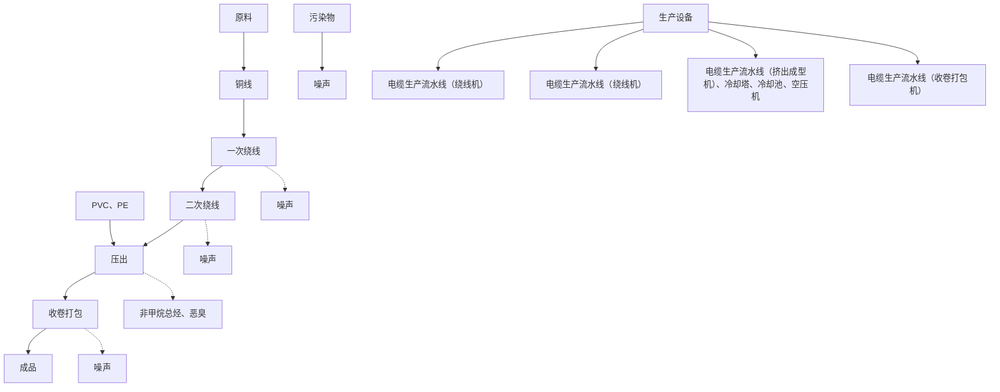
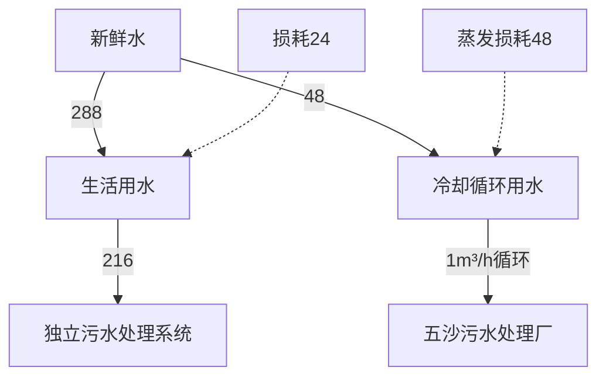

# 建设项目环境影响报告表

（污染影响类）

项目名称：佛山市普腾电子有限公司

年产60万个电感、12万卷

建设单位（盖章）：佛山市普腾电子

编制日期：2021年5月

text_image

电缆新建项目
有限公司

中华人民共和 制

text_image

佛山生态环境部
中国生态环境部

## 一、建设项目基本情况

<table><tr><td>建设项目名称</td><td colspan="3">佛山市普腾电子有限公司年产60万个电感、12万卷电缆新建项目</td></tr><tr><td>项目代码</td><td colspan="3">无</td></tr><tr><td>建设单位联系人</td><td></td><td>联系方式</td><td></td></tr><tr><td>建设地点</td><td colspan="3">广东省佛山市顺德区大良街道五沙社区新汇路7号国腾智能制造中心3栋610室、609室</td></tr><tr><td>地理坐标</td><td colspan="3">(北纬22度48分22.901秒,东经113度21分32.033秒)</td></tr><tr><td>国民经济行业类别</td><td>C3831电线、电缆制造C3981电阻电容电感元件制造</td><td>建设项目行业类别</td><td>“三十五、电气机械和器材制造业38”中的“77、电线、电缆、光缆及电工器材制造383”中“其他(仅分割、焊接、组装的除外;年用非溶剂型低VOCs含量涂料10吨以下的除外)”及“三十六、计算机、通信和其他电子设备制造业39”中的“81、电子元件及电子专用材料制造398”中“印刷电路板制造;电子专用材料制造(电子化工材料制造除外);使用有机溶剂的;有酸洗的;以上均不含仅分割、焊接、组装的”</td></tr><tr><td>建设性质</td><td>新建(迁建)√改建√扩建√技术改造</td><td>建设项目申报情形</td><td>首次申报项目√不予批准后再次申报项目√超五年重新审核项目√重大变动重新报批项目</td></tr><tr><td>项目审批(核准/备案)部门(选填)</td><td></td><td>项目审批(核准/备案)文号(选填)</td><td></td></tr><tr><td>总投资(万元)</td><td>30</td><td>环保投资(万元)</td><td></td></tr><tr><td>环保投资占比(%)</td><td>33.33</td><td>施工工期</td><td>2个月</td></tr><tr><td>是否开工建设</td><td>否√是:____</td><td>用地(用海)面积(m2)</td><td>1180</td></tr><tr><td>专项评价设置情况</td><td colspan="3">无</td></tr><tr><td>规划情况</td><td colspan="3">顺德科技工业园A区于2003年6月经广东省人民政府批准成立</td></tr><tr><td>规划环境影响评价情况</td><td colspan="3">《顺德科技工业园A区发展规划环境影响报告书》(原佛山市顺德环境科学院研究所有限公司编制,2010年7月),《关于顺德科技工业园A区发展规划环境影响报告书审查意见的函》(顺管函[2010]186号)</td></tr><tr><td>规划及规划环境影响评价符合性分析</td><td colspan="3">根据《顺德科技工业园A区发展规划环境影响报告书》(原佛山市顺德环境科学院研究所有限公司编制,2010年7月)中入园企业要求,该工业园严禁安排三类工业,包括冶金工业、化学工业、造纸工业、制革工业、建材工业、漂染、水洗工业等。对二类工业应加以严格限制,包括食品工业、医药制造工业、纺织印染工业等对居住和公共设施环境有一定干扰和污染的工业,本项目不在顺德科技工业园A区负面清单内。工程内容符合《关于顺德科技工业园A区发展规划环境影响报告书审查意见的函》(顺管函[2010]186号)审查意见的要求。</td></tr><tr><td>其他符合性分析</td><td colspan="3">1、项目选址合理性分析项目位于广东省佛山市顺德区大良街道五沙社区新汇路7号国腾智能制造中心3栋610室、609室,本项目租用已建成厂房,根据《顺德工业园(A区)控制性详细规划》(佛府办函[2019]421号),项目所在地属工业用地区,不属于一般农地区、水利用地区、生态环境安全控制区、风景旅游用地区等区域。因此,建设项目的选址与土地利用规划基本相符。本项目产生的污染物通过合理治理,达标排放,对周围环境的影响较小,从环境保护角度分析,本项目选址建设是可行的。2、产业政策符合性分析项目为电感、电缆制造项目。生产的电缆为低压电缆,根据《产业结构调整指导目录(2019年本)》,项目不属于“限值类”中“6千伏及以上(陆上用)干法交联电力电缆制造项目”,因此项目属于允许建设项目;根据国家《市场准入负面清单(2020年版)》、《珠江三角洲地区产业结构调整优化和产业导向目录》(2011年本)的规定,项目不属于上述目录所列的鼓励类、限制类和禁止(淘汰)类项目,根据《促进产业结构调整暂行规定》(国发[2005]40号)第十三条,属于允许类项目,且符合国家有关法律、法规和政策规定。因此,项目符合相关的产业政策要求。</td></tr></table>

## 3、与“三线一单”相符性

根据《关于以改善环境质量为核心加强环境影响评价管理的通知》（环评[2016]150号）：“三线一单”即“生态保护红线、环境质量底线、资源利用上线和环境准入负面清单”。

## ①生态保护红线

本项目位于佛山市顺德区大良街道五沙社区新汇路7号国腾智能制造中心3栋610室、609室，本项目区域不涉及生态保护红线区、环境空气质量功能区一类区、大气污染物存量重点减排区和大气污染物增量严控区饮用水源保护、重要水源涵养、珍稀水生生物保护、环境容量超载相对严重的管控区，本项目的建设符合生态保护红线。

## ②环境质量底线

环境质量底线是国家和地方设置的大气、水和土壤环境质量目标，也是改善环境质量的基准线。

本项目铜线表面剥离工序、清洁工序、点胶工序、烘烤固化工序产生的有机废气经两级活性炭吸附装置处理后，通过排气筒引至楼顶排放，可达到广东省地方标准《家具制造行业挥发性有机化合物排放标准》（DB 44/814-2010）总VOCsⅡ时段排放限值及表2的无组织排放监控点 VOCs 浓度限值；压出工序产生的非甲烷总烃经两级活性炭吸附装置处理后，通过排气筒引至楼顶排放，可达到《合成树脂工业污染物排放标准》（GB31572-2015）中表4规定的大气污染物排放限值和表9企业边界大气污染物浓度限值要求；压出工序产生的恶臭气体经两级活性炭吸附装置处理后，通过排气筒引至楼顶排放，可达到《恶臭污染物排放标准》（GB14554-93）中表1恶臭污染物厂界标准值和表2排气筒恶臭污染物排放限值要求；焊接工序产生的焊接烟尘（锡及其化合物）经两级活性炭吸附装置处理后，通过排气筒引至楼顶排放，可达到广东省地方标准《大气污染物排放限值》

（DB44/27-2001）第二时段二级标准及无组织排放最高浓度监控点浓度限值要求。

本项目所处位置属于五沙污水处理厂纳污范围，项目生活污水经三级化粪池处理后经自生活污水处理系统处理达标后排入五沙污水处理厂，尾水排入洪奇沥水道（顺德板沙尾～番禺沥口河段），对环境影响较小。

项目所在区域声环境质量满足《声环境质量标准》（GB3096-2008）中3类功能区标准，项目建成后经减振、隔音、降噪等措施可满足《声环境质量标准》（GB3096-2008）3类功能区标准。

因此，本项目的建设符合环境质量底线。

③资源利用上线

项目建设土地不占用基本农田，土地资源消耗符合要求；项目用水用供水部门供应自来水，用电用市政电网供给，资源消耗量相对区域资源利用总量较少，符合当地规划要求，因此项目符合资源利用上线要求。

④环境准入负面清单

环境准入负面清单是基于“三线”，以清单方式列出的禁止、限值等差别化环境准入条件和要求。对照《产业结构调整指导目录（2019年本）》，项目不属于限制类和禁止（淘汰）类项目。

## 4、环保政策符合性分析

表 1-1 项目与挥发性有机物（VOCs）排放有关政策符合性分析

<table><tr><td>序号</td><td>文件</td><td>规定</td><td>项目情况</td><td>判定</td></tr><tr><td>1</td><td rowspan="2">《珠江三角洲地区严格控制工业企业挥发性有机物(VOCs)排放的意见》(粤环[2012]18号)</td><td>在自然保护区、水源保护区、风景名胜区、森林公园、重要湿地、生态敏感区和其他重生态功能区实行强制性保护,禁止新建VOCs污染企业</td><td>选址不在禁止建设区域</td><td>符合</td></tr><tr><td>2</td><td>新建皮革及皮鞋制造业、人造板制造业、家具制造业、印刷业、塑料制品业、集装箱制造业、汽车制造与船舶制造业等排放VOCs的使用型行业,在建设项目环境影响评价文件报批时,附项目VOCs减排量来源说明,按项目“点对点”总量调剂的方式,落实新建项目VOCs排放总量指标来源,确保区域内工业VOCs排放的总量控制。</td><td rowspan="2">本项目VOCs有组织排放量为0.068t/a,小于0.1吨,故不需要进行VOCs总量申请,总量在镇剩余总量列支</td><td>符合</td></tr><tr><td>3</td><td>《顺德区环境保护委员会关于印发顺德区工业挥发性有机物(VOCs)项目审批总量前置实施细则(2016</td><td>有组织排放量小于0.1吨(不含0.1吨)的建设项目,不需要申请VOCs排放总量指标,直接由环评文件审批部门在环保管理系统录入项目排放量,作为VOCs排放总量分配的依据。</td><td>符合</td></tr></table>

<table><tr><td rowspan="6"></td><td></td><td>年修订)的通知》(顺环委[2016]3号)</td><td></td><td></td><td></td></tr><tr><td>4</td><td rowspan="2">关于印发《重点行业挥发性有机物综合治理方案》的通知(环大气[2019]53号)</td><td>重点对含VOCs物料(包括含VOCs原辅材料、含VOCs产品、含VOCs废料以及有机聚合物材料等)储存、转移和输送、设备与管线组件泄漏、敞开液面逸散以及工艺过程等五类排放源实施管控,通过采取设备与场所密闭、工艺改进、废气有效收集等措施,削减VOCs无组织排放</td><td>项目酒精、环氧树脂胶、剥离剂贮存在密闭容器中,采用密闭容器进行转移和输送。生产车间有机废气收集后经两级活性炭吸附装置处理后引到排气筒排放,VOCs废气收集系统与生产工艺设备同步运行。VOCs废气收集系统发生故障或检修时,对应的生产工艺设备停止运行,待检修完毕后同步投入使用。</td><td>符合</td></tr><tr><td>5</td><td>遵循“应收尽收、分质收集”的原则,科学设计废气收集系统,将无组织排放转变为有组织排放进行控制。采用全密闭集气罩或密闭空间的,除行业有特殊要求外,应保持微负压状态,并根据相关规范合理设置通风量。采用局部集气罩的,距集气罩开口面最远处的VOCs无组织排放位置,控制风速应不低于0.3米/秒,有行业要求的按相关规定执行</td><td>本项目铜线表面剥离工序、清洁工序、点胶工序、压出工序有机废气采用集气罩收集,收集效率为90%,控制风速不低于0.3米/秒;烘烤固化工序采用整室收集,收集效率为95%。</td><td>符合</td></tr><tr><td>6</td><td rowspan="3">《挥发性有机物无组织排放控制标准》(GB37822-2019)</td><td>5.1物料储存基本要求:VOCs物料应储存于密闭的容器、包装袋、储罐、储库、料仓中。盛装VOCs物料的容器或包装应存放于室内,或存放于设置有雨棚、遮阳和防渗设施的专用场地。盛装VOCs物料的容器或包装袋在非取用状态时应加盖、封口,保持密闭。</td><td>VOCs物料均储存于密闭容器中,且存放于仓库</td><td>符合</td></tr><tr><td>7</td><td>6.1物料转运基本要求:采用非管道输送方式转移液态VOCs物料时,应采用密闭容器、罐车。</td><td>本项目转移VOCs物料时采用密闭容器</td><td>符合</td></tr><tr><td>8</td><td>7.2含VOCs产品的使用过程:VOCs质量占比大于等于10%的含VOCs产品,其使用过程应采用密闭设备或在密闭空间内操作,废气应排至VOCs废气收集处理系统;无法密闭的,应采取局部气体收集措施,废气应排至VOCs废气收集处理系统。</td><td>本项目铜线表面剥离工序、清洁工序、点胶工序、压出工序有机废气采用集气罩收集,烘烤固化工序采用整室收集,收集后经两级活性炭吸附处理装置处理后高空排放</td><td>符合</td></tr><tr><td rowspan="4"></td><td>9</td><td rowspan="3"></td><td>10.1VOCs无组织排放废气收集处理系统要求:VOCs废气收集处理系统应与生产工艺设备同步运行。VOCs废气收集处理系统发生故障或检修时,对应的生产工艺设备应停止运行,待检修完毕后同步投入使用;生产工艺设备不能停止运行或不能及时停止运行的,应设置废气应急处理设施或采取其他替代措施。</td><td>本项目VOCs废气收集处理系统应与生产工艺设备同步运行,当发生故障时对应的生产工艺设备立即停止运行,待检修完毕后同步投入使用</td><td>符合</td></tr><tr><td>10</td><td>10.3VOCs排放控制要求:VOCs废气收集处理系统污染物排放应符合GB16297或相关行业排放标准的规定。</td><td>本项目有机废气排放符合广东省地方标准《家具制造行业挥发性有机化合物排放标准》(DB44/814-2010)等相关行业。</td><td>符合</td></tr><tr><td>11</td><td>12污染物监测要求企业应按照有关法律、《环境监测管理办法》和HJ819等规定,建立企业监测制度,制订监测方案,对污染物排放状况及其对周边环境质量的影响开展自行监测,保存原始监测记录,并公布监测结果。</td><td>本项目建立企业监测制度,对污染物排放状况开展自行监测,保存原始监测记录,并公布监测结果</td><td>符合</td></tr><tr><td colspan="5">因此,本项目符合国家产业政策的要求,同时符合广东省相关环保政策的要求,项目所在地为工业用地,土地功能符合规划要求。</td></tr></table>

## 二、建设项目工程分析

## 1、项目工程组成

项目具体工程组成见下表：

表 2-1 项目组成一览表

<table><tr><td>项目</td><td>组成</td><td>内容</td><td>用途</td></tr><tr><td>主体工程</td><td>生产车间</td><td> $1180m^{2}$ ,办公室、危废暂存库、仓库、生产车间、烤箱房</td><td>用于产品的加工生产</td></tr><tr><td>辅助工程</td><td>办公室</td><td>位于车间东南侧</td><td>供日常办公使用</td></tr><tr><td>仓储工程</td><td>仓库</td><td>危废暂存库、仓库</td><td>用于储存产品、原辅材料以及危险废物</td></tr><tr><td rowspan="2">公用工程</td><td>配电系统</td><td>一套</td><td>供应生产用电和办公生活用电</td></tr><tr><td>给排水系统</td><td>一套</td><td>生活污水经独立生活污水处理设施处理达标后,通过市政管网排入五沙污水处理厂进行再次处理,尾水最终排入洪奇沥水道</td></tr><tr><td rowspan="5">环保工程</td><td>独立的生活污水处理设施</td><td>一套</td><td>用于生活污水处理,生活污水经独立生活污水处理设施处理达标后,通过市政管网排入五沙污水处理厂进行再次处理,尾水最终排入洪奇沥水道</td></tr><tr><td>废气处理设施</td><td>一套</td><td>焊接工序产生的焊接烟尘(锡及其化合物)和铜线表面剥离工序、清洁工序、点胶工序产生的VOCs以及压出工序产生的非甲烷总烃、恶臭气体经集气罩收集后同烘烤固化工序产生的VOCs经整室收集后一起通过同一套两级活性炭吸附设施处理后经高于楼顶的40m高排气筒外排</td></tr><tr><td>一般固废</td><td> $10m^{2}$ ,固废暂存区</td><td>用于一般固体废物暂存</td></tr><tr><td>危险废物</td><td> $3m^{2}$ ,危废暂存库</td><td>用于危险废物的临时存放</td></tr><tr><td>噪声</td><td>采取优化布局、高噪声设备合理布局、隔声和减震等措施</td><td>降噪</td></tr></table>

## 2、项目生产规模

根据业主提供的资料，项目主要产品产量见下表。

表 2-2 项目主要产品及年产量

<table><tr><td>序号</td><td>主要产品名称</td><td>年产量</td><td>备注</td></tr><tr><td>1</td><td>电感</td><td>60万个</td><td>/</td></tr><tr><td>2</td><td>电缆</td><td>12万卷</td><td>低压,1卷200米</td></tr></table>

## 3、主要设备

项目主要设备详见下表：

表 2-3 项目主要生产设备明细表

<table><tr><td>序号</td><td>设备名称</td><td>单位</td><td>数量</td><td>备注</td></tr><tr><td>1</td><td>电感生产流水线</td><td>条</td><td>2</td><td>每条流水线配置:绕线(绕线机2台,将铜线绕到骨架上)-剪线-铜线表面剥离(剥离剂,风罩 $\Phi 250mm$ 抽风1个工位)-清洁(酒精擦试2个工位 $\Phi 250mm$ )-焊接(无铅焊锡4个工位 $\Phi 250mm$ )-清洁(酒精擦试1个工位 $\Phi 250mm$ )-点胶(环氧树脂胶,点胶机1台 $\Phi 250mm$ )-烘烤固化(5台烘箱,整室收集3m*4m*4.5m(高))</td></tr><tr><td>2</td><td>电缆生产流水线</td><td>条</td><td>2</td><td>每条流水线配置:一次绕线(绕铜线机1套)-二次绕线(将一次绕好的铜线多股再绕合在一起。绕线机1套-压出(将绕好的铜线与PVC或PE一起挤出,挤出成型机一套,收卷机1套打包))</td></tr><tr><td>3</td><td>冷却塔</td><td>套</td><td>1</td><td>/</td></tr><tr><td>4</td><td>冷却池</td><td>个</td><td>1</td><td>/</td></tr><tr><td>5</td><td>空压机</td><td>套</td><td>1</td><td>/</td></tr></table>

## 4、原辅材料及能源消耗

项目运营时主要原辅材料及能源消耗见下表：

表 2-4 项目原辅料及能源消耗一览表

<table><tr><td>类别</td><td>名称</td><td>单位</td><td>数量</td><td>暂存量</td><td>来源</td><td>储运方式</td><td>备注</td></tr><tr><td rowspan="10">原辅材料</td><td>PVC</td><td>吨/年</td><td>10</td><td>1吨</td><td rowspan="10">外购</td><td rowspan="10">货车运输</td><td>粒料,新料</td></tr><tr><td>PE</td><td>吨/年</td><td>10</td><td>1吨</td><td>粒料,新料</td></tr><tr><td>铜线</td><td>吨/年</td><td>20</td><td>2吨</td><td>/</td></tr><tr><td>铜箔</td><td>吨/年</td><td>0.5</td><td>0.1吨</td><td>/</td></tr><tr><td>酒精</td><td>吨/年</td><td>0.2</td><td>0.1吨</td><td>用于擦拭工序,纯度为95%,25kg/桶</td></tr><tr><td>环氧树脂胶</td><td>吨/年</td><td>0.3</td><td>0.1吨</td><td>25kg/桶</td></tr><tr><td>剥离剂</td><td>吨/年</td><td>0.01</td><td>0.006吨</td><td>铜丝端表面漆层浸润剥离,600g/瓶</td></tr><tr><td>骨架</td><td>万个/年</td><td>60</td><td>6万个</td><td>/</td></tr><tr><td>胶带</td><td>卷/年</td><td>600</td><td>60卷</td><td>/</td></tr><tr><td>无铅焊锡</td><td>卷/年</td><td>100</td><td>10卷</td><td>1公斤/卷</td></tr><tr><td rowspan="2">能源</td><td>电</td><td>5万kwh/a</td><td></td><td>/</td><td>市政供电</td><td colspan="2">电缆输送</td></tr><tr><td>自来水</td><td> $288m^3/a$ </td><td></td><td>/</td><td>自来水厂</td><td colspan="2">管道输送</td></tr></table>

主要原辅材料性质：

PVC：聚氯乙烯，英文简称 PVC(Polyvinyl chloride)，是氯乙烯单体(vinyl chloridemonomer, 简称 VCM)在过氧化物、偶氮化合物等引发剂;或在光、热作用下按自由基聚合反应机理聚合而成的聚合物。氯乙烯均聚物和氯乙烯共聚物统称之为氯乙烯树脂。PVC 为无定形结构的白色粉末，支化度较小，相对密度 1.4左右，玻璃化温度 77\~90℃，170℃左右开始分解，对光和热的稳定性差，在 100℃以上或经长时间阳光曝晒，就会分解而产生氯化氢，并进一步自动催化分解，引起变色，物理机械性能也迅速下降，在实际应用中必须加入稳定剂以提高对热和光的稳定性。工业生产的 PVC 分子量一般在 5万\~11万范围内，具有较大的多分散性，分子量随聚合温度的降低而增加;无固定熔点，80\~85℃开始软化，130℃变为粘弹态，160\~180℃开始转变为粘流态;有较好的机械性能，抗张强度 60MPa 左右，冲击强度 5\~10kJ/m2；有优异的介电性能。PVC 曾是世界上产量最大的通用塑料，应用非常广泛。在建筑材料、工业制品、日用品、地板革、地板砖、人造革、管材、电线电缆、包装膜、瓶、发泡材料、密封材料、纤维等方面均有广泛应用。

PE：是乙烯经聚合制得的一种热塑性树脂，无臭，无毒，手感似蜡，具有优良的耐低温性能（最低使用温度可达-100\~70°C），化学稳定性好，能耐大多数酸碱的侵蚀（不耐具有氧化性质的酸）。常温下不溶于一般溶剂，吸水性小，电绝缘性优良。

酒精：工业酒精，即工业上使用的酒精，也称变性酒精、工业火酒。工业酒精的纯度一般为 95%和 99%，本项目选用纯度为 95%的。主要有合成和酿造（原煤或石油）两种方式生产，合成的一般成本很低，乙醇含量高，酿造的工业酒精一般乙醇含量大于或等于 95%。

环氧树脂胶：本项目使用的胶水主要为环氧树脂胶粘剂，是一种由环氧树脂基料、固化剂、稀释剂、促进剂和填料配制二层的胶粘剂，具有粘接性好、功能性好、粘接工艺简便等优点，主要成份为环氧树脂 45\~55%，硬化剂 10\~18%，耐燃剂 25\~40%，色料2\~5%，环氧树脂胶粘剂中挥发性物质为硬化剂，本项目按最大 18%计。

剥离剂：本项目使用的剥离剂为漆包线脱漆剂，主要成分为硅酸镁铝水溶液30\~40%、树脂 10\~20%、甲酸 5\~10%、石蜡 1\~5%，保密（不挥发）1\~5%，溶剂 5\~10%，去离子水 20\~30%。其物理和化学性质为：褐色粘稠膏体，有刺鼻气味，引燃温度为 615℃，爆炸上限%（V/V）：12，爆炸下限%（V/V）：19，易挥发，低毒。漆包线脱漆剂中挥发性物质为甲酸和溶剂，本项目按最大 20%计。

表 2-5 项目化学组分及 VOCs 核算表

<table><tr><td>种类</td><td>化工原料组分</td><td>VOCs 产生系数</td></tr><tr><td>酒精</td><td>乙醇 95%</td><td>VOCs 挥发系数以乙醇的最大含量 95% 计算</td></tr><tr><td>环氧树脂胶</td><td>环氧树脂 45~55%,硬化剂 10~18%,耐燃剂 25~40%,色料 2~5%</td><td>VOCs 挥发系数以硬化剂的最大含量 18%计算</td></tr><tr><td>剥离剂</td><td>硅酸镁铝水溶液 30~40%、树脂 10~20%、甲酸 5~10%、石蜡 1~5%,保密(不挥发)1~5%,溶剂 5~10%,去离子水 20~30%</td><td>VOCs 挥发系数以甲酸和溶剂的最大含量 20%计算</td></tr></table>

备注：本项目环氧树脂胶、剥离剂MSDS见附件。  
根据《挥发性有机物无组织排放控制标准》（GB37822-2019）“7.2.1VOCs质量占比大于等于 10%的含 VOCs 产品，其使用过程应采取密闭设备或在密闭空间内操作，废气应排放至 VOCs 废气收集处理系统；无法密闭的应采取局部气体收集措施，废气应排放至 VOCs废气收集处理系统。”本项目环氧树脂胶、剥离剂使用密闭桶装暂存，使用过程在密闭的生产工段内，使用过程中采用集气罩收集的方式进行废气收集，收集后通过两级活性炭吸附设施处理后经 40m高排气筒 P1 排放，能够满足该标准的要求。

## 5、劳动定员及工作制度

职工人数：项目职工 20人，项目内不设食堂、无人员住宿。

工作制度：年工作日 300 天，每天工作 8 小时，每天工作时间为 8:00-12:00，13:30-17:30。

## 6、公用工程

（1）供电：采用市政供电，不设备用发电机。  
（2）给、排水：项目用水全部由市政自来水厂供给，主要用水为职工生活用水及循环冷却水。

①生活用水：项目职工 20 人，均不在厂区内食宿，根据《广东省用水定额》（DB44/T1461-2014）的相关规定，不住厂职工生活用水定额为 40L/人·d 计，排放系数为 0.9，则生活用水 0.8t/d（240t/a），生活污水排放量约 0.72t/d（216t/a）。

②循环冷却水：项目为 2 条电缆生产流水线中的挤出成型机一共配套 1 套冷却塔及冷却水池作为辅助设备。挤出成型机生产过程中需用自来水对挤出成型机进行冷却，冷却用水通过车间外冷却塔及冷却池冷却后循环使用。本项目需适当地加入新鲜水补充因蒸发而损失的水分，本项目挤出成型机需要使用自来水间接冷却。项目使用 1 套循环水量为 1m3 /h 的冷却塔，根据《工业循环冷却水处理设计规范》（GB/T50050-2017）说明，循环冷却水系统蒸发水量约占循环水量的 2.0%，挤出成型机生产使用时间约 8h/d，年工作日 300天，总循环水量为 2400m3 /a，新鲜水补充量为 48m3/a。

（3）排水去向：本项目生活污水经独立生活污水处理设施处理达标后，通过市政管网排入五沙污水处理厂进行再次处理，尾水最终排入洪奇沥水道。

## 7、平面布置

项目生产车间内部按照工艺要求进行分区，分为办公室、危废暂存库、仓库、生产车间、烤箱房；项目各生产区相对独立，互不干扰，每个生产区按照工艺流程布置设备，因此，项目平面布置做到了生产、办公分开，车间内布置流畅，总体来说项目平面布置

<table><tr><td></td><td>紧凑有序,布局合理。项目平面布置图详见附图4。</td></tr><tr><td rowspan="3">工艺流程和产排污环节</td><td>1、建设项目电感生产工艺流程见图2-1。</td></tr><tr><td></td></tr><tr><td>图2-1 项目电感生产工艺流程图工艺流程简述:(1)绕线:采用绕线机将铜线、铜箔缠绕到骨架上。该过程会产生噪声。(2)剪线:铜线缠绕好之后将铜线剪断。该过程会产生噪声和下脚料。(3)铜线表面剥离:通过人工浸涂剥离剂将铜线尾端表面的绝缘层剥离。该过程会产生VOCs废气。</td></tr></table>

（4）表面清洁：采用酒精进行人工擦拭，将表面擦拭干净。该过程会产生 VOCs废气。  
（5）焊接：采用锡焊的方式将线圈按要求进行焊接。该过程会产生焊接烟尘，主要污染物为锡及其化合物。  
（6）表面清洁：再次采用酒精进行人工擦拭，将表面擦拭干净。该过程会产生 VOCs废气。  
（7）点胶：根据图纸要求，在需要粘结的部位采用点胶机进行点环氧树脂胶固定。该过程会产生噪声和 VOCs 废气。  
（8）烘烤固化：烘箱设置 $1 0 5 ^ { \circ } \mathrm { C } \pm 1 0 ^ { \circ } \mathrm { C }$ ，将点胶完成的半成品放入烘箱中烘烤 2小时使胶固化，得到成品。该过程会产生 VOCs 废气。

项目焊接工序产生的焊接烟尘（锡及其化合物）和铜线表面剥离工序、清洁工序、点胶工序产生的VOCs经集气罩收集后同烘烤固化工序产生的VOCs经整室收集后一起通过同一套两级活性炭吸附设施处理后经高于楼顶的 40m高排气筒 P1 外排。

2、建设项目电缆生产工艺流程见图 2-2。  

flowchart

图 2-2 项目电缆生产工艺流程图

工艺流程简述：

（1）一次绕线：采用绕线机将多根铜线绕合在一起。该过程会产生噪声。  
（2）二次绕线：将多股一次绕合好的铜线再绕合在一起。该过程会产生噪声。  
（3）压出：采用挤出成型机将绕合好的铜线与 PVC 或者 PE 一起挤出，控制温度

<table><tr><td></td><td>在200°C左右,采取冷却循环水对工件进行间接冷却;冷却循环水回流至冷却塔循环利用。该过程会产生非甲烷总烃及恶臭气体。(4)收卷打包:采用收卷打包机对压出的产品进行收卷打包。该过程会产生噪声。项目压出工序产生的非甲烷总烃和恶臭气体经集气罩收集后通过一套两级活性炭吸附设施处理后经高于楼顶的40m高排气筒P1外排。</td></tr><tr><td>与项目有关的原有环境污染问题</td><td>1、与项目有关的原有污染源:项目为新建项目,无原有污染问题。2、主要环境问题项目所在区域为工业区,声、大气环境质量良好,周围主要为规模较小,污染较轻的生产加工类中小型企业,无重污染的大型企业,项目东南面为国腾智能制造中心2栋厂房,东北面为国腾智能制造中心608厂房,西南面为在建厂房,西北面为国腾智能制造中心601~602厂房。存在主要污染物为这些企业在生产运营过程中产生的废气、废水、噪声及固废,但这些污染物通过采取措施治理后,对周围环境没有产生明显的影响。</td></tr></table>

# 三、区域环境质量现状、环境保护目标及评价标准

## 1、大气环境

## （1）佛山市基本污染物环境质量现状

本项目位于广东省佛山市顺德区大良街道五沙社区新汇路 7 号国腾智能制造中心 3栋 610室、609室，根据《关于调整顺德区环境空气质量功能区划的变函》（佛府办函[2014]494 号），项目所在位置属于二类环境空气质量功能区，执行《环境空气质量标准》（GB3095-2012）及其 2018 年修改单二级标准。

根据《佛山市生态环境局顺德分局关于发布 2020 年度佛山市顺德区环境质量状况公报的通知》，2020年全区空气质量综合指数为 3.30，比 2019年下降 22.9%，空气质量同比有所改善，在全市五区中排名第二。2020年全区二氧化硫（SO2）、二氧化氮（NO2）、可吸入颗粒物（PM10）、细颗粒物（PM2.5）平均浓度分别为 7、30、43、21 微克/立方米，臭氧日最大 8 小时滑动平均 $\left( \mathrm { O } _ { 3 } – 8 \mathrm { h } \right)$ ）浓度的第 90 百分位数为 155微克/立方米，一氧化碳（CO）日浓度的第 95 百分位数为 1.0 毫克/立方米，六项污染物指标浓度均达到《环境空气质量标准》（GB3095-2012）二级标准限值。

与去年相比，2020 年度顺德区六项环境空气污染指标浓度均有不同程度下降， $\mathrm { P M } _ { 2 . 5 } ,$ 、$\mathrm { P M } _ { 1 0 } , ~ \mathrm { N O } _ { 2 } , ~ \mathrm { S O } _ { 2 }$ 平均浓度分别下降 30.0%、23.2%、23.1%、12.5%，CO 日平均浓度的第 95 百分位数下降 23.1%， $\mathrm { O } _ { 3 ^ { - } } 8 \mathrm { h }$ 浓度的第 90百分位数下降 18.4%，具体情况见图 3-1和表 3-1。

2020 年度全区环境空气质量优良天数占有效天数的 90.4%，同比去年提高 13.1个百分点。

bar chart

| 类别 | 2019年 (微克/立方米) | 2020年 (微克/立方米) | 2019年 (毫克/立方米) | 2020年 (毫克/立方米) |
|---|---|---|---|---|
| 二氧化硫 | 5 | 4 | 0.1 | 0.1 |
| 二氧化氮 | 40 | 35 | 0.6 | 0.7 |
| 可吸入颗粒物 | 68 | 42 | 0.8 | 0.9 |
| 细颗粒物 | 35 | 30 | 0.5 | 0.6 |
| 臭氧 | 192 | 157 | 3.2 | 2.6 |
| 一氧化碳 | 78 | 10 | 1.3 | 1.0 |

图 3-1 2020 年顺德区（国控测点）环境空气污染物浓度水平年度比较

区域 环境 质量 现状

表 3-1 2020 年顺德区（国控测点）环境空气污染物浓度水平年度比较

<table><tr><td rowspan="2">污染物</td><td colspan="2">浓度均值</td><td rowspan="2">评价标准</td><td rowspan="2">变化</td></tr><tr><td>2019年</td><td>2020年</td></tr><tr><td> $SO_{2}$ (μg/m3)</td><td>8</td><td>7</td><td>60</td><td>达标</td></tr><tr><td> $NO_{2}$ (μg/m3)</td><td>39</td><td>30</td><td>40</td><td>达标</td></tr><tr><td> $PM_{10}$ (μg/m3)</td><td>56</td><td>43</td><td>70</td><td>达标</td></tr><tr><td> $PM_{2.5}$ (μg/m3)</td><td>30</td><td>21</td><td>35</td><td>达标</td></tr><tr><td> $CO^{*}$ (μg/m3)</td><td>1.3</td><td>1.0</td><td>4</td><td>达标</td></tr><tr><td> $O_{3}-8^{*}$ (μg/m3)</td><td>190(超标)</td><td>155</td><td>160</td><td>达标区</td></tr><tr><td colspan="5">*注:(1)表中CO为年内日平均值的第95百分位数, $O_{3}$ 为年内日最大8小时平均值的第90百分位数。(2)2019年公报与2020年公报中的环境空气质量统计分析数据均采用实况数据。</td></tr></table>

根据 2020 年全区的大气环境质量状况公报，六项污染物指标浓度均达到了质量标准限值，故顺德区大气环境质量属达标区。

## （2）特征污染物环境质量现状

本项目产生的污染物主要是 VOCs。为了解评价区域的特征污染因子现状情况，本项目引用《佛山市火神环保科技有限公司年产注塑机 1000台新建项目环境影响评价报告书》中 A1 监测点的现状监测数据。监测点 A1 位于本项目边界西南侧约 220m，监测时间：2020 年 4 月 9 日～4 月 16 日，监测结果及评价如下：

表 3-2 特征污染物监测结果统计表

<table><tr><td rowspan="2">监测点位</td><td colspan="2">监测点位坐标</td><td rowspan="2">监测因子</td><td rowspan="2">监测时段</td><td rowspan="2">监测浓度范围(mg/m3)</td><td rowspan="2">超标量</td><td rowspan="2">评价标准</td><td rowspan="2">达标情况</td></tr><tr><td>X</td><td>Y</td></tr><tr><td>A1</td><td>-40</td><td>-210</td><td>TVOC</td><td>8h</td><td>0.089~0.238</td><td>0</td><td>0.6</td><td>达标</td></tr></table>

由上表可以看出，项目所在区域 TVOC 的 8 小时均值达到《环境影响评价技术导则大气环境》（HJ2.2-2018）附录 D 其他污染物空气质量浓度参考限值的要求。

## 2、地表水环境

本项目生活污水经三级化粪处理后经工业园污水管网排至五沙污水处理 厂，污水处理厂尾水排放到洪奇沥水道。洪奇沥水道水质执行《地表水环境质量标准》

（GB3838-2002）中的Ⅲ类标准。为评价洪奇沥水道水环境质量现状，本报告引用《2019年度佛山市顺德区环境质量状况公报》表 3-3“2019 年顺德区主河道质量评价及年度对比”的评价结果。

表 3-3 2019 年度顺德区主河道质量评价及年度对比（节选洪奇沥水道）

<table><tr><td rowspan="2">序号</td><td rowspan="2">河流名称</td><td rowspan="2">断面</td><td colspan="2">断面定类</td><td rowspan="2">水质评价标准</td><td colspan="2">河流定类</td></tr><tr><td>2019年</td><td>2018年</td><td>2019年</td><td>2018年</td></tr><tr><td>21</td><td>洪奇沥</td><td>高黎</td><td>III</td><td>III</td><td>III</td><td>III</td><td>III</td></tr></table>

根据《2019 年度佛山市顺德区环境质量状况公报》的评价结果，洪奇沥水道水质满足《地表水环境质量标准》（GB3838-2002）之Ⅲ类水功能要求，水质较好。

## 3、声环境

本项目为新建，项目厂界外 50m 范围内无环境敏感目标。

## 4、生态环境

项目用地范围内无生态环境保护目标，无需开展生态现状调查。

## 5、电磁辐射

项目不涉及电磁辐射，无需开展电磁辐射现状调查。

## 6、地下水、土壤

## （1）地下水

根据《建设项目环境影响评价技术导则—地下水环境》（HJ610-2016）附录 A 地下水环境影响评价行业分类表，本项目属于“K 机械、电子”“81、印刷电路板、电子元件及组件制造”中报告表Ⅲ项目；本项目所在区域属于不宜开采区，不属于集中式饮用水水源地准保护区、补给径流区，不属于特殊地下水资源保护区（热水，矿泉水、温泉等），地下水环境敏感程度属不敏感，故本项目地下水环境影响评价工作等级为三级。本项目西南方向 474 米为德胜河，故地下水环境评价范围为项目周边 $6 \mathrm { k m } ^ { 2 }$ 范围。

为评价本项目所在区域的地下水环境现状，本项目引用佛山市火神环保科技有限公司委托广东顺德环境科学研究院有限公司在临近区域进行监测的监测数据，编号是（顺）研测字（2020）第 W042410 号，监测时间为 2020 年 4 月 10 日，采样一次，监测点布设情况见表 3-4，监测点位分布图见附图 5，引用项目距离本项目所在位置约 425m。

表 3-4 地下水环境现状监测布点位置和监测因子

<table><tr><td>检测点位</td><td>D1</td><td>D2</td><td>D3</td><td>D4</td><td>D5</td></tr><tr><td>井深(m)</td><td>5.61</td><td>7.62</td><td>6.97</td><td>6.93</td><td>7.67</td></tr><tr><td>地下水埋深(m)</td><td>1.84</td><td>2.75</td><td>0.15</td><td>0.61</td><td>0.57</td></tr><tr><td>东经</td><td>113°21&#x27;40.21&quot;</td><td>113°21&#x27;32.52&quot;</td><td>113°21&#x27;21.90&quot;</td><td>113°21&#x27;21.44&quot;</td><td>113°2050.96&quot;</td></tr><tr><td>北纬</td><td>22°48&#x27;18.76&quot;</td><td>22°48&#x27;8.76&quot;</td><td>22°48&#x27;5.26&quot;</td><td>22°48&#x27;26.34&quot;</td><td>22°48&#x27;31.45&quot;</td></tr><tr><td>检测点位</td><td>D1</td><td>D2</td><td>D3</td><td>D4</td><td>D5</td></tr><tr><td>井深(m)</td><td>7.79</td><td>7.68</td><td>7.54</td><td>8.23</td><td>8.17</td></tr><tr><td>地下水埋深(m)</td><td>4.02</td><td>1.07</td><td>1.26</td><td>1.52</td><td>1.93</td></tr><tr><td>东经</td><td>113°21&#x27;35.33&quot;</td><td>113°21&#x27;32.67&quot;</td><td>113°21&#x27;50.80&quot;</td><td>113°21&#x27;50.54&quot;</td><td>113°21&#x27;48.25</td></tr><tr><td>北纬</td><td>22°47&#x27;46.57&quot;</td><td>22°48&#x27;34.96&quot;</td><td>22°48&#x27;20.05&quot;</td><td>22°48&#x27;10.64&quot;</td><td>22°47&#x27;35.35&quot;</td></tr></table>

监测按照《环境影响评价技术导则 地下水环境》（HJ610-2016）相关要求（包括监测时间、监测频率及监测分析方法）进行采样监测，并记录地下水水位，调查地下水质量现状时，主要监测项目包括 pH 值、氨氮、硝酸盐氮、亚硝酸盐氮、氯化物、硫酸盐、总硬度、溶解性总固体、耗氧量、挥发酚、氰化物、阴离子表面活性剂、铜、锌、汞、砷、镉、六价铬、铅、镍、银等 21 项。

根据表 3-1，项目所在区域地下水执行《地下水质量标准》（GB/T14848-2017）的Ⅴ类标准。地下水监测结果如表 3-5 所示。

表 3-5 地下水监测结果

<table><tr><td>检测项目采样点位</td><td>D1</td><td>D2</td><td>D3</td><td>D4</td><td>D5</td><td>达标判断</td></tr><tr><td>pH值</td><td>6.71</td><td>7.03</td><td>7.01</td><td>6.23</td><td>6.94</td><td>III类</td></tr><tr><td>氨氮</td><td>1.41</td><td>1.92</td><td>1.58</td><td>15.1</td><td>0.263</td><td>V类</td></tr><tr><td>硝酸盐(已N计)</td><td>0.07</td><td>0.09</td><td>1.86</td><td>0.05</td><td>0.26</td><td>I类</td></tr><tr><td>亚硝酸盐(以N计)</td><td>0.033</td><td>0.315</td><td>0.009</td><td>0.06</td><td>0.008</td><td>III类</td></tr><tr><td>氯化物</td><td>25.2</td><td>27.3</td><td>18.0</td><td>2.0</td><td>5.8</td><td>I类</td></tr><tr><td>硫酸盐</td><td>77.8</td><td>70.9</td><td>54.5</td><td>241</td><td>42.8</td><td>II类</td></tr><tr><td>总硬度(以 $CaCO_3$ 计)</td><td>174</td><td>205</td><td>161</td><td>384</td><td>229</td><td>III类</td></tr><tr><td>溶解性总固体</td><td>364</td><td>368</td><td>269</td><td>618</td><td>195</td><td>III类</td></tr><tr><td>耗氧量(CODMn法,以 $O_2$ 计)</td><td>8.67</td><td>9.86</td><td>7.96</td><td>9.23</td><td>3.29</td><td>IV类</td></tr><tr><td>阴离子表面活性剂</td><td>0.05(L)</td><td>0.05(L)</td><td>0.05(L)</td><td>0.05(L)</td><td>0.05(L)</td><td>I类</td></tr><tr><td>铜</td><td>0.002</td><td>0.007</td><td>0.011</td><td>0.007</td><td>0.080</td><td>II类</td></tr><tr><td>锌</td><td>0.06</td><td>0.049</td><td>0.102</td><td>0.039</td><td>0.19</td><td>II类</td></tr><tr><td>汞μg/L</td><td>0.04(L)</td><td>0.04(L)</td><td>0.04(L)</td><td>0.04(L)</td><td>0.04(L)</td><td>I类</td></tr><tr><td>砷μg/L</td><td>0.8</td><td>1.8</td><td>0.3(L)</td><td>3.2</td><td>0.3(L)</td><td>I类</td></tr><tr><td>镉</td><td>0.006</td><td>0.002</td><td>0.001(L)</td><td>0.001(L)</td><td>0.002</td><td>III类</td></tr><tr><td>六价铬</td><td>0.004(L)</td><td>0.004(L)</td><td>0.004(L)</td><td>0.004(L)</td><td>0.004(L)</td><td>I类</td></tr><tr><td>氰化物</td><td>0.004(L)</td><td>0.004(L)</td><td>0.004(L)</td><td>0.004(L)</td><td>0.004(L)</td><td>I类</td></tr><tr><td>铅μg/L</td><td>6</td><td>4</td><td>8</td><td>2</td><td>28</td><td>IV类</td></tr><tr><td>镍μg/L</td><td>7</td><td>5</td><td>5(L)</td><td>5(L)</td><td>15</td><td>III类</td></tr><tr><td>银</td><td>0.03(L)</td><td>0.03(L)</td><td>0.03(L)</td><td>0.03(L)</td><td>0.03(L)</td><td>III类</td></tr><tr><td>氟化物</td><td>0.23</td><td>0.34</td><td>0.37</td><td>0.82</td><td>0.16</td><td>I类</td></tr><tr><td>铁</td><td>49.5</td><td>14.5</td><td>12.5</td><td>1.77</td><td>1.71</td><td>V类</td></tr><tr><td>锰</td><td>1.71</td><td>1.16</td><td>0.27</td><td>0.75</td><td>0.08</td><td>V类</td></tr></table>

备注：检测结果低于检出限以“检出限+(L)”表示。

根据地下水水质现状监测结果，项目所在区域地下水全部指标均可达到《地下水质量标准》（GB/T14848-2017）Ⅴ类标准，部分指标可达到《地下水质量标准》（GB/T14848-2017）Ⅲ类标准甚至Ⅱ类、Ⅰ类标准的要求。因此，项目所在区域地下水质量满足当地功能区划的要求。

## （2）土壤

项目地面已进行硬底化，不存在土壤环境污染途径，不开展土壤环境质量现状调查。

## 1、环境空气保护目标

环境保护目标

空气保护目标为项目所在区域的环境空气质量，保护级别为《环境空气质量标准》（GB3095-2012）中的二级标准。本项目厂界外 500米范围内无大气环境保护目标。

<table><tr><td></td><td colspan="6">2、地下水环境保护目标本项目厂界外500米范围内无地下水集中式饮用水水源和热水、矿泉水、温泉等特殊地下水资源。3、声环境保护目标本项目厂界外50米范围内无声环境保护目标。4、生态环境项目用地范围内无生态环境保护目标。</td></tr><tr><td rowspan="5">污染物排放控制标准</td><td colspan="6">1、水污染物排放标准本项目外排废水主要为生活污水。生活污水经独立的生活污水处理设施处理,水质达到广东省地方标准《水污染物排放限值》(DB44/26-2001)第二时段三级标准后,通过市政管网排入五沙污水处理厂,五沙污水处理厂处理达标后排入洪奇沥水道,尾水排放执行《城镇污水处理厂污染物排放标准》(GB18918-2002)中的一级A标准及广东省《水污染物排放限值》(DB44/26-2001)第二时段一级标准的较严值。具体见表3-6。表3-6 项目生活污水及五沙污水处理厂排放限值 单位:mg/L,pH为无量纲</td></tr><tr><td>项目</td><td>pH</td><td>CODcr</td><td>BOD5</td><td>SS</td><td>NH3-N</td></tr><tr><td>生活污水排放限值</td><td>6~9</td><td>500</td><td>300</td><td>400</td><td>--</td></tr><tr><td>五沙污水处理厂排放限值</td><td>6~9</td><td>40</td><td>10</td><td>10</td><td>5</td></tr><tr><td colspan="6">2、大气污染物排放标准项目产生的大气污染物主要为焊接工序产生的焊接烟尘(锡及其化合物)、铜线表面剥离工序、清洁工序、点胶工序、烘烤固化工序产生的VOCs,压出工序产生的非甲烷总烃及恶臭。(1)焊接工序产生的焊接烟尘(锡及其化合物)执行广东省地方标准《大气污染物排放限值》(DB44/27-2001)第二时段二级标准及无组织排放最高浓度监控点浓度限值。(2)铜线表面剥离工序、清洁工序、点胶工序、烘烤固化工序产生的VOCs执行广东省地方标准《家具制造行业挥发性有机化合物排放标准》(DB44/814-2010)总VOCsII时段排放限值及表2的无组织排放监控点VOCs浓度限值。(3)压出工序产生的非甲烷总烃执行《合成树脂工业污染物排放标准》(GB31572-2015)表4大气污染物排放限值及表9企业边界大气污染物浓度限值;恶臭排放执行《恶臭污染物排放标准》(GB14554-93)中表1恶臭污染物厂界标准值和表2排气筒恶臭污染物排放限值。</td></tr></table>

表 3-7 大气污染物排放标准（摘录）

<table><tr><td rowspan="2">污染源</td><td rowspan="2">污染因子</td><td rowspan="2">排气筒高度</td><td colspan="2">有组织</td><td rowspan="2">无组织排放监控浓度限值 mg/m3</td><td rowspan="2">执行标准</td></tr><tr><td>最高允许排放浓度mg/m3</td><td>排放速率kg/h</td></tr><tr><td>焊接工序</td><td>锡及其化合物</td><td>40m</td><td>8.5</td><td>0.75 (1.5)</td><td>0.3</td><td>DB44/27-2001 第二时段二级标准及无组织排放最高浓度监控点浓度限值</td></tr><tr><td>铜线表面剥离工序、清洁工序、点胶工序、烘烤固化工序</td><td>VOCs</td><td>40m</td><td>30</td><td>1.45 (2.9)</td><td>2.0</td><td>DB 44/814-2010 总 VOCsII时段排放限值及表2的无组织排放监控点 VOCs浓度限值</td></tr><tr><td rowspan="2">压出工序</td><td>非甲烷总烃</td><td>40m</td><td>100</td><td>/</td><td>4.0</td><td>GB31572-2015 表4大气污染物排放限值及表9企业边界大气污染物浓度限值</td></tr><tr><td>恶臭</td><td>40m</td><td>6000(无量纲)</td><td>/</td><td>20(无量纲)</td><td>GB14554-93 中表1 恶臭污染物厂界标准值和表2排气筒恶臭污染物排放限值</td></tr></table>

注：根据《家具制造行业挥发性有机化合物排放标准》（DB 44/814-2010）中：①排气筒高度不应低于 15m；②排气筒高度除须遵守不低于 15m 外，还应高出周围 200m 半径范围的最高建筑 5m 以上，不能达到该要求的排气筒，VOCs 最高允许排放速率按表 2 所列排放限值的 50%执行。本项目排气筒高度未高出周围 200m 半径范围的建设 5m 以上，按 15 米排气筒对应的排放速率限值的 50%执行，则本项目总 VOCs 最高允许排放速率为 1.45kg/h。

本项目厂区内 VOCs 无组织排放监控点浓度应满足《挥发性有机物无组织排放控制标准》（GB37822-2019）附录 A 表 A.1 厂区内 VOCs 无组织排放限值要求。

表 3-8 厂区内 VOCs 无组织排放限值要求

<table><tr><td>污染物项目</td><td>排放限值</td><td>特别排放限值</td><td>限值含义</td><td>无组织排放监控位置</td></tr><tr><td rowspan="2">NMHC</td><td>10</td><td>6</td><td>监控点处 1h 平均浓度值</td><td rowspan="2">在厂房外设置监控点</td></tr><tr><td>30</td><td>20</td><td>监控点处任意一次浓度值</td></tr></table>

## 3、噪声

厂界噪声执行《工业企业厂界环境噪声排放标准》（GB12348-2008）中的 3 类标准，见表 3-9。

表 3-9 GB12348-2008 排放标准摘录

<table><tr><td>功能区</td><td>昼间(6:00~22:00)</td><td>夜间(22:00~6:00)</td></tr><tr><td>3类区</td><td>65dB(A)</td><td>55dB(A)</td></tr></table>

## 4、固体废物

（1）一般工业固体废物执行《一般工业固体废物贮存、处置场污染控制标准》（GB18599-2001）及<关于印发《一般工业固体废物贮存、处置场污染控制标准》（GB18599-2001）等 3 项国家污染物控制标准修改单的公告>，环境保护部公告 2013年第 36 号。  
（2）危险废物执行《国家危险废物名录》（2021 年版）及《危险废物豁免管理清

<table><tr><td></td><td colspan="5">单》、《危险废物贮存污染控制标准》(GB50597-2001)以及2013年修改单。</td></tr><tr><td rowspan="5">总量控制指标</td><td colspan="5">1、废水本项目外排废水为生活污水,在厂内预处理达标后,通过市政管网排入五沙污水处理厂进行再次处理,最终排入洪奇沥水道。生活污水最终排放量为216t/a, $COD_{Cr}$ 排放量为0.00864t/a,氨氮排放量为0.00108t/a。根据《佛山市排污权有偿使用和交易管理试行办法》(佛府办2016第63号),生活污水 $COD_{Cr}$ 、 $NH_{3}-N$ 总量指标纳入五沙污水处理厂总量中,不另外分配总量。2、废气根据《顺德区环境保护委员会关于印发顺德区工业挥发性有机物(VOCs)项目审批总量前置实施细则(2016年修订)的通知》(顺环委〔2016〕3号),VOCs有组织排放量小于0.1吨(不含0.1吨,下同)的建设项目,不需要申请VOCs排放总量指标,直接由环评文件审批部门在环保管理信息系统录入项目排放量,作为VOCs排放总量分配依据,本项目有组织排放的VOCs小于0.1吨,不需要申请排污总量。建设项目压出工序有非甲烷总烃(VOCs)排放,非甲烷总烃排放量为0.019t/a(其中有组织排放量为0.013t/a,无组织排放量为0.006t/a);铜线表面剥离工序、清洁工序、点胶工序、烘烤固化工序有VOCs排放,VOCs排放量为0.080t/a(其中有组织排放量为0.055t/a,无组织排放量为0.025t/a);则本项目总的VOCs排放量为0.099t/a(其中有组织排放量为0.068t/a,无组织排放量为0.031t/a),VOCs排污总量为0.068t/a。根据《佛山市生态环境局顺德分局关于做好重点行业建设项目挥发性有机物总量指标管理工作的通知》佛顺环函[2019]56号),VOCs总量指标,在镇街总量中列支。表3-10项目总量控制指标汇总</td></tr><tr><td>类别</td><td>总量控制因子</td><td>本项目排放量</td><td>建议分配量(t/a)</td><td>总量来源</td></tr><tr><td rowspan="2">废水</td><td>CODcr</td><td>0.00864</td><td>/</td><td rowspan="2">纳入五沙污水处理厂总量中</td></tr><tr><td> $NH_{3}-N$ </td><td>0.00108</td><td>/</td></tr><tr><td>废气</td><td>VOCs</td><td>0.096</td><td>0.068</td><td>佛山市顺德区大良镇总量中支列</td></tr></table>

## 四、主要环境影响和保护措施

<table><tr><td>施工期环境保护措施</td><td colspan="8">项目租用已建设完毕的工业厂房,不涉及厂房建设,施工过程主要是内部装修和设备安装,没有基建工程,因此施工期基本不存在大型土建工程,施工期间产生的影响主要是由于设备运输,安装时产生的噪声等。施工期建设单位应严格遵守有关建筑施工的环境保护条例,防止运输扬尘,建筑垃圾、废物等及时清运,降低施工过程对周围环境造成的影响。项目施工期较短,因此若建设单位加强施工管理,项目施工时不会对周围环境产生较大影响。因此本报告不对其进行论述。</td></tr><tr><td rowspan="9">运营期环境影响和保护措施</td><td colspan="8">1、大气污染源项目产生的大气污染物主要为焊接工序产生的焊接烟尘(锡及其化合物)、铜线表面剥离工序、清洁工序、点胶工序、烘烤固化工序产生的VOCs,压出工序产生的非甲烷总烃及恶臭。项目废气产污环节、污染物项目、排放形式及污染防治设施见下表。表4-1 项目废气产污环节、污染物项目、排放形式及污染防治设施一览表</td></tr><tr><td rowspan="2">主要生产单元</td><td rowspan="2">污染物项目</td><td rowspan="2">排放形式</td><td colspan="4">污染物防治设施名称</td><td rowspan="2">排放口类型</td></tr><tr><td>污染物防治设施工艺及设施</td><td>收集效率</td><td>处理效率</td><td>是否为可行性技术</td></tr><tr><td>焊接工序</td><td>锡及其化合物</td><td>有组织</td><td rowspan="4">集气罩收集+两级活性炭吸附</td><td>90%</td><td>75%</td><td rowspan="5">☑是☐否</td><td rowspan="5">一般排放口</td></tr><tr><td rowspan="2">压出工序</td><td>非甲烷总烃</td><td>有组织</td><td>90%</td><td>75%</td></tr><tr><td>恶臭</td><td>有组织</td><td>90%</td><td>75%</td></tr><tr><td>铜线表面剥离工序、清洁工序、点胶工序</td><td>VOCs</td><td>有组织</td><td>90%</td><td>75%</td></tr><tr><td>烘烤固化工序</td><td>VOCs</td><td>有组织</td><td>整室收集+两级活性炭吸附</td><td>90%</td><td>75%</td></tr><tr><td colspan="8">(1)大气环境源强分析1焊接工序产生的锡及其化合物项目使用无铅焊锡作为焊料,成分为Sn96.5%、Ag3.0%、Cu0.5%,焊接过程中产生焊接烟尘废气,焊接烟尘是一种直径很小的颗粒物,其中主要污染成分为锡及其化合物。根据《焊接工程师手册》(陈祝年,机械工业出版社,2010年2月第二版)分析,焊锡烟尘产生量按含量用量10g/kg计算,本项目无铅锡焊使用量约为0.1t/a,则锡及其化合物产生量约为0.001t/a。该项目在焊接工位上方设置圆形集气罩,焊接烟尘收集后经两级活性炭吸附装置处理后通过40m高排气筒P1外排。根据《集气罩设计手册》,集气罩收集效率为80%~95%,本环评废气收集效率按90%计算,其余10%无组织排放;</td></tr></table>

参考《广东省家具制造行业挥发性有机化合物废气治理技术指南》（粤环〔2014〕116 号），吸附法治理效率为 50\~80%（本环评取 50%），串联使用时处理效率=1（- 1-50%）×（1-50%）=75%，处理效率以 75%计。则该项目排气筒 P1 收集的有组织锡及其化合物的量为0.0009t/a，经处理后，排放的有组织锡及其化合物量为 0.0002t/a，排放速率为 0.00008kg/h。其余未收集部分无组织排放，则无组织排放的锡及其化合物的量为 0.0001t/a，排放速率为 0.00004kg/h。

②铜线表面剥离工序、清洁工序、点胶工序、烘烤固化工序产生的 VOCs

该项目铜线表面剥离工序、清洁工序、点胶工序、烘烤固化工序使用的剥离剂、酒精、环氧树脂胶会有 VOCs 挥发，根据剥离剂 MSDS，VOCs 挥发系数按 20%计算，剥离剂用量为 0.01t/a，根据环氧树脂胶 MSDS，VOCs 挥发系数按 18%计算，环氧树脂胶用量为 0.3t/a，本项目使用的酒精浓度为 95%，VOCs 挥发系数按 95%计算，酒精用量为 0.2t/a，则铜线表面剥离工序、清洁工序、点胶工序、烘烤固化工序总的 VOCs 产生量为 0.246t/a，该项目剥离工位、酒精擦拭工位、点胶机上方分别设置圆形集气罩用于收集有机废气，根据《集气罩设计手册》，集气罩收集效率为 80%\~95%，本环评废气收集效率按 90%计算，其余 10%无组织排放；烘烤固化工序废气采用整室收集，整室收集效率为 90%，其余 10%无组织排放；产生的有机废气收集后经同一套两级活性炭吸附装置处理后通过 40m 高排气筒 P1 外排，参考《广东省家具制造行业挥发性有机化合物废气治理技术指南》（粤环〔2014〕116 号），吸附法治理效率为 50\~80%（本环评取50%），串联使用时处理效率=1-（1-50%）×（1-50%）=75%，处理效率以 75%计。则该项目排气筒 P1 收集的有组织 VOCs 量为 0.221t/a，经处理后，排放的有组织 VOCs 量为0.055t/a，排放速率为0.02292kg/h。其余未收集部分无组织排放，则无组织排放的VOCs量为 0.025t/a，排放速率为 0.01042kg/h。

③压出工序产生的非甲烷总烃

项目电缆生产过程压出工序塑料原料受热会产生一定量的有机废气，主要污染物为非甲烷总烃。根据《上海市工业企业挥发性有机物排放量通用计算方法（试行）》中表1-4 主要塑料制品制造工序产污系数中射出成型制造，非甲烷总烃的排放系数为2.885kg/t，该项目总的塑料原料用量为 20t/a，则该项目吹膜过程中非甲烷总烃产生量为0.058t/a，该项目在挤出成型机上方设置集气罩，非甲烷总烃收集后经两级活性炭吸附装置处理后通过 40m 高排气筒 P1 外排。根据《集气罩设计手册》，集气罩收集效率为80%\~95%，本环评废气收集效率按 90%计算，其余 10%无组织排放；参考《广东省家具制造行业挥发性有机化合物废气治理技术指南》（粤环〔2014〕116 号），吸附法治理效率为 50\~80%（本环评取 50%），串联使用时处理效率=1-（1-50%）×（1-50%）=75%，处理效率以 75%计。则该项目排气筒 P1 收集的有组织非甲烷总烃量为 0.052t/a，经处理后，排放的有组织非甲烷总烃量为 0.013t/a，排放速率为 0.00542kg/h。其余未收集部分无组织排放，则无组织排放的非甲烷总烃量为 0.006t/a，排放速率为 0.0025kg/h。

该排气筒设计的风机风量计算过程如下：

该项目烘烤固化工序设置 10 台密闭烘箱 $( 3 \mathrm { m } ^ { * } 4 \mathrm { m } ^ { * } 4 . 5 \mathrm { m } )$ ）整室收集，根据《印刷工业污染防治可行技术指南》（HJ1089—2020）中的有关公式计算得出设备所需的风量。

$$
\mathrm{L} _ {2} = \mathrm{V} _ {2} \times \mathrm{F} _ {2} \times 3 6 0 0
$$

式中：L2—总风量，m3/h；

V2—开口面控制控制风速，m/s（取 0.6m/s）；

F2—开口面面积：该项目在每个烘箱尾部开口，单个开口面积为 $0 . 5 \mathrm { m } ^ { 2 }$ ，开口面总面积为 $5 \mathrm { m } ^ { 2 } \mathrm { c }$ 。

则项目密闭印刷间处理风量为 10800m3/h，

该项目电感生产流水线共设置 2 个铜线表面剥离工位、6 个酒精擦拭工位、8 个焊接工位、2 台点胶机，每个工位及设备上方设置一个尺寸为Φ250mm 大小的集气罩；电缆生产流水线设置 2 套挤出成型机，每台设备上方设置一个尺寸为 $0 . 8 \mathrm { m } ^ { * } 0 . 6 \mathrm { m }$ 大小的集气罩，《印刷工业污染防治可行技术指南》（HJ1089—2020）中的有关公式计算得出设备所需的风量。

$$
\mathrm{L} _ {1} = \mathrm{V} _ {1} \times \mathrm{F} _ {1} \times 3 6 0 0
$$

式中：L1—顶吸罩的计算风量， $\mathrm { m } ^ { 3 } / \mathrm { h } ;$

V1—罩口平均风速，m/s（取 1.1m/s）；

F1—排风罩开口面面积：该共设置 20 个排风罩，总的开口面总面积为$1 . 8 4 3 \mathrm { m } ^ { 2 } \mathrm { . }$ 。

则项目集气罩处理风量为 7298.775m3/h。

综上，该项目 P1 排气筒总的计算风量为 18098.775m3 /h，根据《吸附法工业有机废气治理工程技术规范》（HJ 2026-2013），治理工程的处理能力应根据废气的处理量确定，设计风量宜按照最大废气排放量的 120%进行设计，故设计总风量为 22000m3/h，每年工作时间为 2400h。

综上所述，该项目通过排气筒 P1 排放的污染物主要为锡及其化合物、VOCs 和非甲烷总烃。锡及其化合物有组织排放量为 0.0002t/a，有组织排放速率 0.00008kg/h，有组织排放浓度 0.004mg/m3；VOCs 有组织排放量为 0.055t/a，有组织排放速率 0.002292kg/h，有组织排放浓度 1.04mg/m3；非甲烷总烃有组织排放量为 0.013t/a，有组织排放速率0.00542kg/h，有组织排放浓度 0.25mg/m3。

表 4-2 建设项目废气产生及排放情况一览表

<table><tr><td rowspan="3">污染物</td><td rowspan="2">产生量</td><td colspan="6">有组织</td><td colspan="2">无组织</td></tr><tr><td colspan="3">产生</td><td colspan="3">排放</td><td>排放速率</td><td>排放量</td></tr><tr><td>t/a</td><td>kg/h</td><td>t/a</td><td> $mg/m^3$ </td><td>kg/h</td><td>t/a</td><td> $mg/m^3$ </td><td>kg/h</td><td>t/a</td></tr><tr><td>焊接工序锡及其化合物</td><td>0.001</td><td>0.00037</td><td>0.0009</td><td>0.02</td><td>0.00008</td><td>0.0002</td><td>0.004</td><td>0.0004</td><td>0.0001</td></tr><tr><td>铜线表面剥离工序、清洁工序、点胶工序、烘烤固化工序VOCs</td><td>0.246</td><td>0.09208</td><td>0.221</td><td>4.19</td><td>0.02292</td><td>0.055</td><td>1.04</td><td>0.01042</td><td>0.025</td></tr><tr><td>压出工序非甲烷总烃</td><td>0.058</td><td>0.02167</td><td>0.052</td><td>0.98</td><td>0.00542</td><td>0.013</td><td>0.25</td><td>0.0025</td><td>0.006</td></tr></table>

## ③恶臭

本项目使用的 PE 和 PVC 原料在压出过程中会散发一些异味，该异味污染物以臭气浓度为表征。本报告引用张欢等在《恶臭污染评价分级方法》中基于韦伯-费希纳公式所建立 的臭气强度与臭气浓度的关系，将国外臭气强度 6 级法与我国《恶臭污染物排放标准》（GB14554-1993）结合（详见表 4-3），该分级法以臭气强度的嗅觉感觉和实验经验为分级依据，对臭气浓度进行等级划分，提高了分级的准确程度。

表 4-3 与臭气强度相对应的臭气浓度限值

<table><tr><td>分级</td><td>臭气强度(无量纲)</td><td>臭气浓度(无量纲)</td><td>嗅觉感觉</td></tr><tr><td>0</td><td>0</td><td>10</td><td>未闻到有任何气味,无任何反应</td></tr><tr><td>1</td><td>1</td><td>23</td><td>勉强能闻到有气味,但不宜辨认气味性质(感觉阈值)认为无所谓</td></tr><tr><td>2</td><td>2</td><td>51</td><td>能闻到气味,且能辨认气味的性质(识别阈值),但感到很正常</td></tr><tr><td>3</td><td>3</td><td>117</td><td>很容易闻到气味,有所不快,但不反感</td></tr><tr><td>4</td><td>4</td><td>265</td><td>有很强的气味,很反感,想离开</td></tr><tr><td>5</td><td>5</td><td>600</td><td>有极强的气味,无法忍受,立即逃跑</td></tr></table>

本项目生产过程异味强度一般在 1\~2 级，折合臭气浓度为 23\~51（无量纲），恶臭跟有机废气一起收集处理后经两级活性炭吸附设施处理后通过约 40 米高排气筒 P1 排放，其余以无组织形式排放。

## （2）大气达标性分析

## 1）排气筒废气达标分析

本项目共设置 1 个排气筒，设在车间厂房楼顶，高度约 40m，排气筒污染物排放情况见下表。

表 4-4 项目排气筒污染物排放达标情况一览表

<table><tr><td>污染源</td><td>污染物</td><td>排放浓度 $(mg/m^3)$ </td><td>排放速率(kg/h)</td><td>执行标准</td><td>浓度限值</td><td>速率限值</td><td>达标情况</td></tr><tr><td rowspan="4">排气筒P1</td><td>锡及其化合物</td><td>0.004</td><td>0.00008</td><td>DB44/27-2001</td><td>8.5</td><td>0.75</td><td>达标</td></tr><tr><td>VOCs</td><td>0.49</td><td>003667</td><td>DB44/815-2010</td><td>30</td><td>1.45</td><td>达标</td></tr><tr><td>非甲烷总烃</td><td>0.25</td><td>0.00333</td><td>GB31572-2015</td><td>100</td><td>/</td><td>达标</td></tr><tr><td>臭气</td><td>/</td><td>少量</td><td>GB14554-93</td><td>≤6000</td><td>/</td><td>达标</td></tr></table>

由上表可知，项目排气筒 P1 排放的锡及其化合物可达到广东省地方标准《大气污染物排放限值》（DB44/27-2001）第二时段二级标准要求；VOCs 可达到广东省地方标准《家具制造行业挥发性有机化合物排放标准》（DB 44/814-2010）总 VOCsⅡ时段排放限值要求；非甲烷总烃可达到《合成树脂工业污染物排放标准》（GB 31572-2015）表 4 大气污染物排放限值要求；臭气均可达到《恶臭污染物排放标准》（GB14554-93）中表 2 恶臭污染物排放标准值要求，对大气环境影响较小。

## 2）厂界废气达标分析

根据《环境影响评价技术导则-大气环境》（HJ2.2-2018）中推荐的 AERSCREEEN（不考虑地形）模型模拟正常工况下各大气污染物的环境影响 计算结果，本项目各排气筒和无组织排放污染物最大落地浓度值见下表。

表 4-5 项目厂界污染物排放达标情况一览表

<table><tr><td rowspan="2">主要生产单元</td><td rowspan="2">污染物</td><td colspan="2">最大落地浓度(mg/m3)</td><td rowspan="2">厂界监控浓度限值(mg/m3)</td><td rowspan="2">标准来源</td><td rowspan="2">达标分析</td></tr><tr><td>有组织排放</td><td>无组织排放</td></tr><tr><td rowspan="4">生产车间</td><td>锡及其化合物</td><td>0.000001</td><td>0.00004</td><td>0.3</td><td>广东省地方标准《大气污染物排放限值》(DB44/27-2001)</td><td>达标</td></tr><tr><td>VOCs</td><td>0.000243</td><td>0.010547</td><td>2.0</td><td>广东省地方标准《家具制造行业挥发性有机化合物排放标准》(DB 44/814-2010)</td><td>达标</td></tr><tr><td>非甲烷总烃</td><td>0.000058</td><td>0.00253</td><td>4.0</td><td>《合成树脂工业污染物排放标准》(GB 31572-2015)</td><td>达标</td></tr><tr><td>臭气</td><td colspan="2">少量</td><td>20(无量纲)</td><td>《恶臭污染物排放标准》(GB14554-93)</td><td>达标</td></tr></table>

由上表可知，项目锡及其化合物无组织排放可达到广东省地方标准《大气污染物排放限值》（DB44/27-2001）无组织排放最高浓度监控点浓度限值要求；VOCs 无组织排放最大落地浓度值小于广东省地方标准广东省地方标准《家具制造行业挥发性有机化合物排放标准》（DB 44/814-2010）表 2 的无组织排放监控点 VOCs 浓度限值；非甲烷总烃无组织排放最大落地浓度值小于《合成树脂工业污染物排放标准》（GB31572-2015）中表 9 企业边界大气污染物污染物浓度限值要求；臭气均可达到《恶臭污染物排放标准》（GB14554-93）中表 1 恶臭污染物厂界标准值要求，符合相关标准要求。

## 3）非正常工况下废气达标分析

在非正常排放情况下，即废气未经处理直接排放（废气处理设施出现故障或完全失效），项目各污染源大气污染物排放情况见下表。

表 4-6 各污染源非正常排放情况表

<table><tr><td rowspan="2">污染源</td><td rowspan="2">非正常排放原因</td><td colspan="4">非正常排放状况</td><td colspan="2">执行标准</td><td rowspan="2">达标分析</td></tr><tr><td>污染物</td><td>非正常排放浓度(mg/m3)</td><td>非正常排放速率</td><td>频次及持续时间</td><td>浓度(mg/m3)</td><td>速率(kg/h)</td></tr><tr><td rowspan="3">排气筒P1</td><td rowspan="3">二级活性炭吸附处理设施出现故障或完全失效</td><td>锡及其化合物</td><td>0.02</td><td>0.00037</td><td>1次/年,0.5h/次</td><td>8.5</td><td>0.75</td><td>达标</td></tr><tr><td>VOCs</td><td>4.19</td><td>0.09208</td><td>1次/年,0.5h/次</td><td>30</td><td>1.45</td><td>达标</td></tr><tr><td>非甲烷总烃</td><td>0.98</td><td>0.02167</td><td>1次/年,0.5h/次</td><td>100</td><td>/</td><td>达标</td></tr></table>

由上表可知，在非正常工况下，排气筒 P1排放的锡及其化合物、非甲烷总烃和 VOCs排放速率和排放浓度均可达标，当企业单位废气处理设施故障的情况下应立即停产检修，日常需做好环保设施的巡检维修工作，定期更换活性炭，避免出现尾气处理设施故障或完全失效的情况。

## 4）废气治理设施可行性分析

项目使用的废气治理设施二级活性炭吸附工艺为《排污许可证申请与核发技术规范电子工业》（HJ 1031—2019）表 B.1 中的可行性技术，故本项目废气治理设施可行。

## 5）环境监测

项目属新建项目，所属行业为 C3831 电线、电缆制造、C3981电阻电容电感元件制造，不涉及通用工序重点、简化管理，根据《固定污染源排污许可分类管理名录（2019版）》，项目属于登记管理。根据《排污许可证申请与核发技术规范 电子工业》（HJ 1031—2019），本项目所有废气排放口属于一般排放口，运营期环境自行监测计划参照简化管理制定，如下表所示。

表 4-7 项目大气排放口基本情况表

<table><tr><td rowspan="2">序号</td><td rowspan="2">排放口编号</td><td rowspan="2">排放口名称</td><td rowspan="2">污染物种类</td><td colspan="2">排放口地理坐标</td><td rowspan="2">排气筒高度/m</td><td rowspan="2">排气筒出口内径/m</td><td rowspan="2">排气温度°C</td><td rowspan="2">其他信息</td></tr><tr><td>经度</td><td>纬度</td></tr><tr><td rowspan="4">1</td><td rowspan="4">排气筒P1</td><td rowspan="4">有机废气排放口</td><td>锡及其化合物</td><td rowspan="4">113°21&#x27;31.323&quot;</td><td rowspan="4">22°48&#x27;13.362&quot;</td><td rowspan="4">40</td><td rowspan="4">1.5</td><td rowspan="4">25</td><td rowspan="4">一般排放口</td></tr><tr><td>VOCs</td></tr><tr><td>非甲烷总烃</td></tr><tr><td>臭气</td></tr></table>

表 4-8 运营期大气环境自行监测计划一览表

<table><tr><td rowspan="2">序号</td><td rowspan="2">监测点位</td><td rowspan="2">监测因子</td><td rowspan="2">监测频次</td><td colspan="3">排放标准</td></tr><tr><td>名称</td><td>浓度限值 $(mg/m^3)$ </td><td>速率限值(kg/h)</td></tr><tr><td>1</td><td rowspan="4">排气筒P1</td><td>锡及其化合物</td><td>1次/年</td><td>广东省地方标准《大气污染物排放限值》(DB44/27-2001)</td><td>8.5</td><td>0.75</td></tr><tr><td>2</td><td>VOCs</td><td>1次/年</td><td>广东省地方标准《家具制造行业挥发性有机化合物排放标准》(DB 44/814-2010)</td><td>30</td><td>1.45</td></tr><tr><td>3</td><td>非甲烷总烃</td><td>1次/年</td><td>《合成树脂工业污染物排放标准》(GB31572-2015)</td><td>100</td><td>/</td></tr><tr><td>4</td><td>臭气浓度</td><td>1次/年</td><td>《恶臭污染物排放标准》(GB145504-93)</td><td>6000</td><td>/</td></tr><tr><td>5</td><td rowspan="4">厂界上下风向</td><td>锡及其化合物</td><td>1次/年</td><td>广东省地方标准《大气污染物排放限值》(DB44/27-2001)</td><td>0.3</td><td>/</td></tr><tr><td>6</td><td>VOCs</td><td>1次/年</td><td>广东省地方标准《家具制造行业挥发性有机化合物排放标准》(DB 44/814-2010)</td><td>2.0</td><td>/</td></tr><tr><td>7</td><td>非甲烷总烃</td><td>1次/年</td><td>《合成树脂工业污染物排放标准》(GB31572-2015)</td><td>4.0</td><td>/</td></tr><tr><td>8</td><td>臭气浓度</td><td>1次/年</td><td>《恶臭污染物排放标准》(GB145504-93)</td><td>20</td><td>/</td></tr></table>

## 2、水环境污染源

本项目生产过程中废水主要为生活污水。项目废水类别、污染物项目及污染防治措施见下表。

表 4-9 项目废水类别、污染物项目及污染防治设施一览表

<table><tr><td rowspan="2">废水类别</td><td rowspan="2">污染物种类</td><td colspan="2">污染物防治设施名称</td><td rowspan="2">流向/排放去向</td><td rowspan="2">对应排放口</td><td rowspan="2">排放口类型</td></tr><tr><td>污染物防治设施工艺及设施</td><td>是否为可行性技术</td></tr><tr><td>生活污水</td><td> $COD_{Cr}$ 、SS、 $BOD_5$ 、氨氮</td><td>三级化粪池</td><td>☑是☐否</td><td>五沙污水处理厂</td><td>生活污水单独排放口</td><td>/</td></tr></table>

建设项目水平衡见图 4-1。

flowchart

图 4-1 建设项目水平衡图（单位：m3/a）

## （1）废水排放源强

## ◇ 生活污水

项目共有员工为 20 人，不设置员工宿舍和饭堂，年工作 300 天。生活污水主要为员工上班期间洗手、冲厕产生的废水。根据《广东省用水定额》（DB44/T1461-2014）的相关规定，非住宿无食堂和浴室员工用水定额 0.04t/人·日，生活用水量为 0.8t/d（240t/a），生活污水产生系数按 90%计，则生活污水排放量为 0.72t/d（216t/a）。生活污水经三级化粪池处理后通过下市政管网排至五沙污水处理厂处理，尾水排入洪奇沥水道。生活污水的污染物因子为 CODcr、BOD5、SS、氨氮等。生活污水产生及排放情况见下表。

表 4-10 项目生活污水产生及排放情况

<table><tr><td>类别</td><td>废水量</td><td>污染物</td><td> $COD_{cr}$ </td><td> $BOD_5$ </td><td>SS</td><td> $NH_3-N$ </td></tr><tr><td rowspan="6">生活污水(216t/a)</td><td rowspan="2">产生量</td><td>产生浓度(mg/L)</td><td>250</td><td>100</td><td>100</td><td>30</td></tr><tr><td>年产生量(t/a)</td><td>0.054</td><td>0.0216</td><td>0.0216</td><td>0.00648</td></tr><tr><td rowspan="2">预处理后排放量</td><td>排放浓度(mg/L)</td><td>100</td><td>30</td><td>30</td><td>25</td></tr><tr><td>年排放量(t/a)</td><td>0.0216</td><td>0.00648</td><td>0.00648</td><td>0.0054</td></tr><tr><td rowspan="2">污水处理厂排放量</td><td>排放浓度(mg/L)</td><td>40</td><td>10</td><td>10</td><td>5</td></tr><tr><td>年排放量(t/a)</td><td>0.00864</td><td>0.00216</td><td>0.00216</td><td>0.00108</td></tr></table>

## 2）循环冷却水

项目为2条电缆生产流水线中的挤出成型机一共配套1套冷却塔及冷却水池作为辅助设备。挤出成型机生产过程中需用自来水对挤出成型机进行冷却，冷却用水通过车间外冷却塔及冷却池冷却后循环使用。本项目需适当地加入新鲜水补充因蒸发而损失的水分，本项目挤出成型机需要使用自来水间接冷却。项目使用 1套循环水量为 1m3/h 的冷却塔，根据《工业循环冷却水处理设计规范》（GB/T50050-2017）说明，循环冷却水系统蒸发水量约占循环水量的 2.0%，挤出成型机生产使用时间约 8h/d，年工作日 300天，总循环水量为 2400m3 /a，新鲜水补充量为 48m3/a。

## （2）废水污染防治措施

项目生活污水经三级化粪池预处理后经市政污水管网排入五沙污水处理厂处理，尾水排入洪奇沥水道。生活污水排放情况及污染治理措施见下表。

表 4-11 废水类别、污染物及污染治理设施信息表

<table><tr><td>废水类别</td><td>本项目废水量(万t/a)</td><td>污染物种类</td><td>产生浓度(mg/L)</td><td>产生量(t/a)</td><td>污染防治设施</td><td>排放浓度(mg/L)</td><td>排放量(t/a)</td><td>排放方式</td><td>排放去向</td><td>排放规律</td><td>排放口编号</td></tr><tr><td rowspan="2">生活污水</td><td rowspan="2">0.0216</td><td>CODcr</td><td>250</td><td>0.054</td><td rowspan="2">三级化粪池</td><td>40</td><td>0.00864</td><td rowspan="2">间接排放</td><td rowspan="2">五沙污水处理厂</td><td rowspan="2">间断排放,排放期间流量不稳</td><td rowspan="2">DW001</td></tr><tr><td>BOD5NH3-N</td><td>100100</td><td>0.02160.0216</td><td>1010</td><td>0.002160.00216</td></tr><tr><td rowspan="2"></td><td rowspan="2"></td><td></td><td></td><td></td><td rowspan="2"></td><td></td><td></td><td rowspan="2"></td><td rowspan="2"></td><td rowspan="2">定且唔规律,但不属于冲剂型排放</td><td rowspan="2"></td></tr><tr><td>SS</td><td>30</td><td>0.00648</td><td>5</td><td>0.00108</td></tr></table>

备注：污染物排放信息为污水厂处理后的排放量。

项目废水使用的化粪池为《排污许可证申请与核发技术规范 电子工业》（HJ1066-2019）表 B.2 中可行性技术，故本项目废水治理设施可行。

## （3）水环境影响分析

本项目不设饭堂和宿舍，项目从业人员在工作过程中产生生活污水，主要为洗手废水和冲厕废水。生活污水产生量约为 216t/a，其主要污染物为 $\mathrm { C O D } _ { \mathrm { C r } } \mathrm { , B O D } _ { 5 } \mathrm { , S S , N H _ { 3 } \mathrm { - N } }$ 等。本项目的生活污水经三级化粪池预处理达到广东省地方标准《水污染物排放限值》（DB44/26-2001）第二时段三级标准后通过市政管网排至五沙污水处理厂处理达标后，尾水排至洪奇沥水道，对周围水环境影响很小。本项目挤出定型机冷却循环用水水循环使用，定期补水，不外排，对周围水环境基本不产生影响。

## （4）依托污水设施的环境可行性评价

生活污水依托五沙污水处理厂可行性分析：

佛山市顺德区科技工业园（五沙）污水处理厂位于佛山市顺德区大良顺德科技工业园 A 区南-6-2 地块，其纳污范围为整个五沙工业园区，纳污范围 11.3km2，管网建设长度 31km，污水厂处理纳污范围内的工业废水和生活污水。五沙污水处理厂一期 1.5 万m3 /d 项目已投入使用，远期 2020年规划规模为 6 万 m3 /d。污水采取的核心处理工艺为改良型氧化沟工艺，运行过程产生的污泥经浓缩脱水后，交给具有相应处理资质的单位进行无害化处理。根据目前运行数据，日均外运污泥量为 3.31吨（含水率 80%）。污水处理厂一期运行现状良好，出水水质可达到《城镇污水处理厂污染物排放标准》（GB18918-2002）一级 A 标准及《广东省水污染物排放限值》（DB44/26-2001）的第二时段一级标准的较严值，五沙污水处理厂一期的排放口设置在洪奇沥水道，污水处理厂处理达标的尾水排入洪奇沥水道。

项目生活污水经预处理达到广东省地方标准《水污染物排放限值》（DB44/26-2001）第二时段三级标准排至五沙污水处理厂处理，满足污水厂的纳污要求，不会对污水厂造成冲击负荷，也不会影响其正常运行，满足依托的环境可行性要求，因此生活污水依托五沙污水处理厂处理是可行的。

## （5）环境监测

项目属新建项目，所属行业为 C3831 电线、电缆制造、C3981电阻电容电感元件制造，不涉及通用工序重点、简化管理，根据《固定污染源排污许可分类管理名录（2019版）》，项目属于登记管理。根据《排污许可证申请与核发技术规范 电子工业》（HJ 1031—2019），本项目所有废气排放口属于一般排放口，运营期环境自行监测计划参照简化管理制定。因生活污水排入五沙污水处理厂处理，运营期不在对厂区内生活污水单独排放口进行监测。

表 4-12 废水间接排放口基本情况表

<table><tr><td rowspan="2">排放口编号</td><td colspan="2">排放口地理坐标(°)</td><td rowspan="2">废水排放量(t/a)</td><td rowspan="2">排放去向</td><td rowspan="2">排放规律</td><td rowspan="2">间歇排放时段</td><td colspan="3">受纳污水处理厂信息</td></tr><tr><td>经度</td><td>纬度</td><td>名称</td><td>污染物种类</td><td>国家或地方污染物排放标准限值(mg/L)</td></tr><tr><td rowspan="4">W-01</td><td rowspan="4">113.358935°</td><td rowspan="4">22.803658°</td><td rowspan="4">216</td><td rowspan="4">进入城市污水处理厂</td><td rowspan="4">间断排放,流量不稳定且无规律,但不属于冲击性排放</td><td rowspan="4">9:00-18:00</td><td rowspan="4">五沙污水处理厂</td><td> $COD_{cr}$ </td><td>40</td></tr><tr><td> $BOD_5$ </td><td>10</td></tr><tr><td>SS</td><td>10</td></tr><tr><td> $NH_3-N$ </td><td>5</td></tr></table>

## 3、噪声污染源

## （1）噪声源强及降噪措施

项目噪声主要来源于电感生产流水线、电缆生产流水线、冷却塔、空压机等生产设备，噪声级约为 65～85dB（A）。项目生产设备均放置于生产区域内，钢筋混凝土结构厂房、门窗密闭，综合隔声量可达 30dB（A）以上；废气处理设备设置于生产区域内，风机外安装隔声罩，配置减震垫和消音箱，隔声量可达 30dB（A）。项目主要设备噪声源强如表所示。

表 4-13 项目主要噪声源情况一览表

<table><tr><td>序号</td><td>噪声源</td><td>产生源强 dB(A)</td><td>隔声量 dB(A)</td><td>排放源强 dB(A)</td><td>噪声源位置</td></tr><tr><td>1</td><td>电感生产流水线</td><td>65~85</td><td>30</td><td>≤55</td><td rowspan="4">生产车间</td></tr><tr><td>2</td><td>电缆生产流水线</td><td>65~85</td><td>30</td><td>≤55</td></tr><tr><td>3</td><td>冷却塔</td><td>65~75</td><td>30</td><td>≤45</td></tr><tr><td>4</td><td>空压机</td><td>80~85</td><td>30</td><td>≤55</td></tr></table>

## （2）噪声影响及达标分析

项目设备简单，通过对车间设备合理布局，做好厂房及废气处理设施的隔声降噪工作，充分利用距离衰减和屏障效应等措施降低噪声。本项目距离五沙三村的最近距离为798m（周围 50m 范围内无环境敏感目标），相对较远，在做好噪声防护工作后，能使项目厂界噪声达到《工业企业厂界环境噪声排放标准》（GB12348-2008）中的 3 类标准，

预计达标排放的噪声对周围环境影响不大。

## （3）噪声污染防治措施可行性分析

①生产设备噪声源合理布置在生产车间内，企业加强生产区域门窗的隔声性能，考虑到车间建筑门窗基本关闭情况，该车间的整体降噪能力可达 30dB(A)以上。  
②废气处理风机设置于生产区域内，风机外安装隔声罩，下方加装减振垫，配置消音箱，隔声量可达 25dB(A)。  
③选用低噪声设备，从源头控制噪声。

以上噪声治理措施容易实施，技术成熟可靠，投资费用较少，在经济上是可行的。

## （4）环境监测

项目运营期内可在东面和南面 1 米处布设 2 个环境噪声监测点，监测厂界昼、夜间噪声。项目生产设备每天运行 8小时，故噪声自行监测计划如下表所示。

表 4-14 项目噪声自行监测计划一览表

<table><tr><td rowspan="2">监测点位</td><td rowspan="2">监测时段</td><td rowspan="2">监测频次</td><td rowspan="2">执行标准</td><td colspan="2">厂界噪声排放限值</td></tr><tr><td>昼间 dB(A)</td><td>夜间 dB(A)</td></tr><tr><td>厂界东侧 1#</td><td>昼间</td><td>1 次/季度</td><td rowspan="2">《工业企业厂界环境噪声排放标准》(GB12348-2008)中的 3 类标准</td><td>65</td><td>55</td></tr><tr><td>厂界南侧 2#</td><td>昼间</td><td>1 次/季度</td><td>65</td><td>55</td></tr></table>

## 4、固体废物污染

## （1）固体废物工程分析

项目固体废物主要为员工的生活垃圾、一般工业固废和危险废物。

## 1）生活垃圾

项目员工 20 人，参考《社会区域类环境影响评价》（中国环境科学出版社），办公垃圾为 0.5\~1.0kg/人·d，项目员工不在厂区内食宿，生活垃圾产生系数按 0.5kg/人·d估算，本项目年工作 300 天，生活垃圾产生量 20 人\*0.5kg/人·d\*300d/1000=3t/a，委托环卫部门清运。

## 2）一般固体

项目生产过程中产生的一般工业固体废物主要为生产过程产生下脚料和废包装材料。

①下脚料：根据建设单位提供的资料，下脚料产生量约为原料使用量的 1%，本项目原材料使用量约为 40t/a，则项目下脚料产生量约为 40t/a\*1%=0.4t/a，均属于一般工业固体废物，外售综合利用。  
②废包装材料：该项目 PE、PVC、铜线、铜箔、骨架等原材量采用袋装，酒精采用桶装，胶带、无铅焊锡采用盒装，根据企业提供的资料，上述原材料的废包装材料产

生量约为 0.1t/a，均属于一般工业固体废物，外售综合利用。

## 3）危险废物

项目产生的危险废物主要为废机油、废机油桶、废含油抹布和手套、废弃包装桶（环氧树脂胶、剥离剂）和废活性炭。

## ①废机油

设备维修产生的废机油产生量约 0.005t/a（设备几乎不产生废机油，设备涂抹机油起润滑作用，维修时有部分液体状的机油回收，根据同类设备经验估算），属于危险废物，废物类别为 HW08 废矿物油与含矿物油废物，危险代码为 900-217-08，危险特性为T 毒性和 I 易燃性，贮存于项目危废间，委托有相应处置资质单位处理处置。

## ②废机油桶

废机油桶产生量约 0.005t/a（一年机油用 50kg 量，2—3 年用一桶），属于危险废物，废物类别为 HW08 废矿物油与含矿物油废物，危险代码为 900-249-08，危险特性为 T 毒性和 I 易燃性，贮存于项目危废间，委托有相应处置资质单位处理处置。

## ③废含油抹布和手套

废含油抹布和手套产生量约 0.014t/a（手套一年换 20对，20\*0.2=4kg，抹布一年用10kg），属于危险废物，废物类别为 HW49，危险代码为 900-041-49，危险特性为 T 毒性和 In 感染性，贮存于项目危废间，委托有相应处置资质单位处理处置。

## ④废弃包装桶

该项目使用的环氧树脂胶、剥离剂采用 25kg/桶、600g/瓶的桶装，环氧树脂胶年用量为 0.3 吨，废包装桶产生量为 12 个，每个重约 0.5kg，废弃包装桶产生量为12\*0.5/1000=0.006t/a；剥离剂使用量为 0.01t/a，废包装桶产生量为 17 个，每个重约 0.1kg，废弃包装桶产生量为 17\*0.1/1000=0.002t/a；则该项目废弃包装桶产生量为 0.008t/a，属于危险废物，废物类别为 HW49 其它废物，危险代码为 900-041-49，危险特性为 T 毒性和 In 感染性，贮存于项目危废间，委托有相应处置资质单位处理处置。

## ⑤废活性炭

本项目锡及其化合物、有机废气需采用“两级活性炭吸附”处理设施，活性炭吸附一段时间后会达到饱和，需要定期更换，因此会产生废活性炭。废活性炭产生量参照《污染源源强核算技术指南 汽车制造》（HJ1097-2020）中的废活性炭产生量核算公式计算，计算公式如下：

$$
\mathrm{D} = (1 0 0 \mathrm{G/y}) + \mathrm{G}
$$

式中：D——核算时段内废活性炭产生量，t；

G——核算时段内活性炭吸附挥发性有机物量，t；

Y——活性炭的吸附饱和率，%，采用设计值，无设计值时参考附录 E 确定。本次环评参考《污染源源强核算技术指南 汽车制造》（HJ1097-2020）附录 E 确定，取值 15%。

根据上述有机废气源强核算可知，项目锡及其化合物和有机废气有组织收集量为0.2739t/a，两级活性炭吸附处理效率为 75%，则活性炭吸附锡及其化合物和挥发性有机物量约为 0.2054t/a，将相关参数带入公式计算得，本项目废活性炭产生量约为 1.575t/a。属于危险废物，废物类别为 HW49 其它废物，危废代码为 900-041-49，危险特性为 T 毒性和 In 感染性，贮存于危废仓库，委托有相应处置资质单位处理处置。

表 4-15 项目危废产生情况表

<table><tr><td>危险废物名称</td><td>产生量(t/a)</td><td>废物类别</td><td>废物代码</td><td>产生工序及装置</td><td>形态</td><td>主要成分</td><td>危险成分</td><td>产废周期</td><td>危险特性</td><td>污染防治措施</td></tr><tr><td>废含油抹布和手套*</td><td>0.014</td><td>HW49类其他废物</td><td>900-041-49</td><td>设备维修</td><td>固体</td><td>机油、布</td><td>机油</td><td>每天</td><td>T, In</td><td>交有危废资质单位处理</td></tr><tr><td>废机油</td><td>0.005</td><td>HW08废矿物油与含矿物油废物</td><td>900-217-08</td><td>设备维修</td><td>液态</td><td>机油</td><td>机油</td><td>一年</td><td>T, I</td><td>交有危废资质单位处理</td></tr><tr><td>废机油桶</td><td>0.005</td><td>HW08废矿物油与含矿物油废物</td><td>900-249-08</td><td>设备维修</td><td>固体</td><td>机油桶</td><td>机油</td><td>一年</td><td>T, In</td><td>交有危废资质单位处理</td></tr><tr><td>废弃包装桶</td><td>0.008</td><td>HW49类其他废物</td><td>900-041-49</td><td>原料包装</td><td>固体</td><td>桶</td><td>剥离剂、环氧树脂胶</td><td>每天</td><td>T, In</td><td>交有危废资质单位处理</td></tr><tr><td>废活性炭</td><td>1.575</td><td>HW49类其他废物</td><td>900-041-49</td><td>废气治理</td><td>固体</td><td>活性炭</td><td>有机物</td><td>每季度</td><td>T, In</td><td>交有危废资质单位处理</td></tr><tr><td>合计</td><td>1.607</td><td>---</td><td>---</td><td>---</td><td>--</td><td>---</td><td>---</td><td>---</td><td>---</td><td>---</td></tr></table>

“\*”根据《国家危险废物名录》（2021 年版），项目产生的废含油抹布为豁免清单中的第 9 项，在混入生活垃圾时可不按危险废物管理。建议企业在前期做好分类，与生活垃圾分开收集  
危险特性：毒性（Toxicity，T）、易燃性（Ignitability，I）、感染性（Infectivity, In）

表 4-16 项目固体废物产生和处置情况一览表

<table><tr><td>序号</td><td colspan="2">种类</td><td>产生环节</td><td>数量(t/a)</td><td>废物类别</td><td>废物代码</td><td>形态</td><td>危险成分</td><td>危险特性</td><td>贮存方式</td><td>利用处置方式及去向</td><td>利用或处置量</td><td>环境管理要求</td></tr><tr><td>1</td><td rowspan="3">一般固废</td><td>生活垃圾</td><td>员工办公生活</td><td>3</td><td>——</td><td>——</td><td>固态</td><td>——</td><td>——</td><td>垃圾桶</td><td>环卫部门集中处理</td><td>3</td><td rowspan="3">分类收集贮存在一般固废暂存间</td></tr><tr><td>2</td><td>下脚料</td><td>生产工序</td><td>0.4</td><td>——</td><td>——</td><td>固态</td><td>——</td><td>——</td><td>集中堆放</td><td rowspan="2">外售废品回收公司</td><td>0.4</td></tr><tr><td>3</td><td>废包装材料</td><td>原料包装</td><td>0.1</td><td>——</td><td>——</td><td>固态</td><td>——</td><td>——</td><td>集中堆放</td><td>0.1</td></tr><tr><td colspan="3">一般固废小计</td><td>——</td><td>3.5</td><td>——</td><td>——</td><td>——</td><td>——</td><td>——</td><td>——</td><td>——</td><td>3.5</td><td>——</td></tr><tr><td>4</td><td rowspan="5">危险废物</td><td>废含油抹布和手套</td><td>设备维修</td><td>0.014</td><td>HW49类其他废物</td><td>900-041-49</td><td>固态</td><td>机油</td><td>T, In</td><td>桶装</td><td rowspan="5">定期交有相应资质的危废单位回收处理</td><td>0.014</td><td rowspan="5">根据生产需要合理置贮存量,尽量减少厂内的物料贮存量;严禁将危险废物混入生活垃圾;堆放危险废物的地方要有明显的标志,堆放点要防雨、防渗、防漏,应按要求进行包装贮存</td></tr><tr><td>5</td><td>废机油</td><td>设备维修</td><td>0.005</td><td>HW08废矿物油与含矿物油废物</td><td>900-217-08</td><td>液态</td><td>机油</td><td>T, I</td><td>桶装</td><td>0.005</td></tr><tr><td>6</td><td>废机油桶</td><td>设备维修</td><td>0.005</td><td>HW08废矿物油与含矿物油废物</td><td>900-249-08</td><td>固态</td><td>机油</td><td>T, In</td><td>/</td><td>0.005</td></tr><tr><td>7</td><td>废弃包装桶</td><td>原料包装</td><td>0.008</td><td>HW49类其他废物</td><td>900-041-49</td><td>固态</td><td>剥离剂、环氧树脂胶</td><td>T, In</td><td>/</td><td>0.008</td></tr><tr><td>8</td><td>废活性炭</td><td>废气治理</td><td>1.575</td><td>HW49类其他废物</td><td>900-041-49</td><td>固态</td><td>有机物</td><td>T, In</td><td>袋装</td><td>1.575</td></tr><tr><td colspan="3">危险废物小计</td><td>——</td><td>1.607</td><td>——</td><td>——</td><td>——</td><td>——</td><td>——</td><td>——</td><td>——</td><td>1.607</td><td>——</td></tr></table>

<table><tr><td rowspan="5">运营期环境影响和保护措施</td><td colspan="10">(2)环境管理要求根据《中华人民共和国固体废物污染环境防治法》要求,建设单位应做好以下防治措施:建设单位和个人应当依法在指定的地点分类投放生活垃圾。禁止随意倾倒、抛撒、堆放或者焚烧生活垃圾。建设单位应当建立健全工业固体废物产生、收集、贮存、运输、利用、处置全过程的污染环境防治责任制度,建立工业固体废物管理台账,如实记录产生工业固体废物的种类、数量、流向、贮存、利用、处置等信息,实现工业固体废物可追溯、可查询,并采取防治工业固体废物污染环境的措施。禁止向生活垃圾收集设施中投放工业固体废物。建设单位委托他人运输、利用、处置工业固体废物的,应当对受托方的主体资格和技术能力进行核实,依法签订书面合同,在合同中约定污染防治要求。建设单位应当向所在地生态环境主管部门提供工业固体废物的种类、数量、流向、贮存、利用、处置等有关资料,以及减少工业固体废物产生、促进综合利用的具体措施,并执行排污许可管理制度的相关规定。危险废物从产生、收集、贮运、转运、处置等各个环节都可能因管理不善而进入环境,因此在各个环节中,抛落、渗漏、丢弃等不完善问题都可能存在,为了使各种危险废物能更好的达到合法合理处置的目的,本评价拟按照《危险废物贮存污染控制标准》等国家相关法律,提出相应的治理措施,以进一步规范项目在收集、贮运、处置方式等操作过程。1收集、贮存建设单位应根据废物特性设置符合《危险废物贮存污染控制标准》(GB18597-2001)(2013年修订)要求的危险废物暂存场所,且在暂存场所上空设有防雨淋设施,地面采取防渗措施,危险废物收集后分别临时贮存于废物储罐内;根据生产需要合理设置贮存量,尽量减少厂内的物料贮存量;严禁将危险废物混入生活垃圾;堆放危险废物的地方要有明显的标志,堆放点要防雨、防渗、防漏,应按要求进行包装贮存。项目危险废物贮存场所基本情况见表4-17。表4-17 项目危险废物贮存场所(设施)基本情况</td></tr><tr><td rowspan="2">序号</td><td rowspan="2">贮存场所</td><td rowspan="2">名称</td><td rowspan="2">类别</td><td rowspan="2">代码</td><td rowspan="2">位置</td><td rowspan="2">占地面积</td><td colspan="3">贮存</td></tr><tr><td>方式</td><td>能力t</td><td>周期</td></tr><tr><td>1</td><td rowspan="2">危废暂存间</td><td>废含油抹布和手套*</td><td>HW49</td><td>900-041-49</td><td rowspan="2">生产车间东北面</td><td rowspan="2"> $10m^2$ </td><td>桶装(200kg/铁桶)</td><td>0.5</td><td>1年</td></tr><tr><td>2</td><td>废机油</td><td>HW08</td><td>900-217-08</td><td>桶装(200kg/铁桶)</td><td>0.5</td><td>1年</td></tr></table>

<table><tr><td rowspan="2">序号</td><td rowspan="2">贮存场所</td><td rowspan="2">名称</td><td rowspan="2">类别</td><td rowspan="2">代码</td><td rowspan="2">位置</td><td rowspan="2">占地面积</td><td colspan="3">贮存</td></tr><tr><td>方式</td><td>能力t</td><td>周期</td></tr><tr><td>1</td><td rowspan="2">危废暂存间</td><td>废含油抹布和手套*</td><td>HW49</td><td>900-041-49</td><td rowspan="2">生产车间东北面</td><td rowspan="2"> $10m^2$ </td><td>桶装(200kg/铁桶)</td><td>0.5</td><td>1年</td></tr><tr><td>2</td><td>废机油</td><td>HW08</td><td>900-217-08</td><td>桶装(200kg/铁桶)</td><td>0.5</td><td>1年</td></tr><tr><td>3</td><td rowspan="3"></td><td>废机油桶</td><td>HW08</td><td>900-249-08</td><td rowspan="3"></td><td rowspan="3"></td><td>/</td><td>0.5</td><td>1年</td></tr><tr><td>4</td><td>废弃包装桶</td><td>HW49</td><td>900-041-49</td><td>/</td><td>0.5</td><td>1年</td></tr><tr><td>5</td><td>废活性炭</td><td>HW49</td><td>900-041-49</td><td>袋装</td><td>2</td><td>1年</td></tr></table>

## ②运输

对危险废物的运输要求安全可靠，要严格按照危险废物运输的管理规定进行危险废物的运输，减少运输过程中的二次污染和可能造成的环境风险，运输车辆需有特殊标志。

## ③处置

根据《广东省危险废物产生单位危险废物规范化管理工作实施方案》，企业须根据管理台账和近年生产计划，制订危险废物管理计划，并报当地环保部门备案。台帐应如实记载产生危险废物的种类、数量、利用、贮存、处置、流向等信息，以此作为向当地环保部门申报危险废物管理计划的编制依据。产生的危险废物实行分类收集后置于贮存设施内，贮存时限一般不得超过一年，并设专人管理。盛装危险废物的容器和包装物以及产生、收集、贮存、运输、处置危险废物的场所，必须依法设置相应标识、警示标志和标签，标签上应注明贮存的废物类别、危害性以及开始贮存时间等内容。企业必须严格执行危险废物转移计划报批和依法运行危险废物转移联单，并通过信息系统登记转移计划和电子转移联单。

危险废物转移报批程序如下：第一阶段：产废单位创建联单，填写好要转移的危险废物信息，提交后系统将发送给所选择的接收单位；第二阶段：接收单位确认产废单位填写的废物信息，并安排运输单位，提交后联单发送给运输单位。若接收单位发现信息有误，可以退回给产废单位修改；第三阶段：运输单位通过手机端 App，填写运输信息进行二维码扫描操作，完成后联单提交给接收单位；第四阶段：接收单位收到废物后过磅，并在系统填写过磅值，确认无误后提交给产废单位确认；第五阶段：产废单位确认联单的全部内容，确认无误提交则流程结束，若发现数据有问题，可以选择回退给处置单位修改。

## 5、地下水、土壤

## （1）污染途径

正常工况下，由于各建筑、设施均已进行混凝土地面硬化，项目不会造成地下水污染，土壤污染途径主要考虑大气沉降。

## （2）地下水分区防治措施

建议项目对各区域分别采取防控措施，以水平防渗为主，对地面进行硬化。根据《环境影响评价技术导则 地下水环境》（HJ 610-2016）中“表 7 地下水污染防渗分区参照表”，项目防渗分区见下表。

表 4-18 项目分区防控情况表

<table><tr><td>项目区域</td><td>天然包气带防污性能</td><td>污染控制难易程度</td><td>污染物类型</td><td>防渗分区</td><td>防渗技术要求</td></tr><tr><td>仓库、危险废物暂存间</td><td>中-强</td><td>难</td><td>持久性污染物</td><td>重点防渗区</td><td>等效黏土防渗层 $Mb \geqslant 6m$ , $K \leqslant 1 \times 10^{-7}cm/s$ ;或参照GB16889执行</td></tr><tr><td>生产车间</td><td>中-强</td><td>易</td><td>持久性污染物</td><td>一般防渗区</td><td>等效黏土防渗层 $Mb \geqslant 1.5m$ , $K \leqslant 1 \times 10^{-7}cm/s$ ;或参照GB16889执行</td></tr><tr><td>办公室</td><td>中-强</td><td>易</td><td>持久性污染物</td><td>简单防渗区</td><td>一般地面硬化</td></tr></table>

针对防渗分区的划分，主要采取以下措施：

## 1）仓库、危险废物暂存间

①项目设置 1个仓库，危险废物暂存间位于车间内。仓库、危险废物暂存间是地下水重点防治区，地面进行防渗处理，防渗层采用 2mm 厚高密度聚乙烯，或至少 2mm 厚的其它人工材料，渗透系数≤10 -10cm/s，可避免泄漏液态危险废物下渗，避免对地下水的影响。  
②选用符合标准的容器盛装化学物料和危险废物，有效减少渗滤液及物料的泄漏。  
③仓库、危险废物暂存间内设置毛毡、木屑、抹布等应急吸收材料，及时清理泄漏的液态化学品或危险废物。  
④仓库、危险废物暂存间内设置泄漏液收集渠或围堰，收集泄漏的液态化学品和危险废物。  
⑤仓库、危险废物暂存间设置漫坡，高 20cm，防止化学品仓库内泄漏物料外流，同时防止外路面雨水流入仓库内。  
⑥加强废水处理设施的日常维护保养，确保设备设施处于正常的工作状态，定期对污水管道、阀门等进行检查维修；定期检查污水处理设施、排水管的情况，若发现墙体或管道出现裂痕等问题，应立即进行抢修或翻新。  
⑦加强厂区检查维护，防止化学品、危险废物或生产废水泄漏渗漏引起地下水污染。据调查，一般情况下一旦发现物料泄漏时及时进行处理，污染源的存在只是短时的间断存 在，只要及时发现，及时处理，污染物作用时间短，很难穿透基础防渗层，因此，其对地下水影响较小。

## 2）生产车间

①车间地面进行防渗处理，防渗层渗透系数建议≤10-7cm/s，同时设置防渗墙裙、

漫坡。

②定期对生产线员工进行应急泄漏培训，建立各级风险控制机构，各成员应有明确的分工与职责范围。  
3）仓库、办公室项目成品及一般原辅材料仓库分布于车间西侧。厂房所在地已做硬底化处理，且位于项目区 6 楼，因此无需再做其他防渗措施。  
4）对于生活垃圾，建设单位应做到日产日清，同时对堆放点做防腐、防渗措施，则生活垃圾不会对地下水产生污染。

由污染途径及对应措施分析可知，项目对可能产生地下水、土壤影响的各项途径均进行有效预防，在做好各项防渗措施，并加强维护和厂区环境管理的基础上，可有效控制厂区内的液态危险废物等污染物下渗现象，不会出现污染地下水、土壤的情况。

## （3）土壤污染防治措施

①生产区域地面进行混凝土硬化。  
②项目对周边土壤影响主要是大气沉降。大气沉降对土壤影响是持续性，长期性的，通过大气污染控制措施，确保各污染物达标排放，杜绝事故排放的措施减轻大气沉降影响。

## 6、生态

项目租用已建成厂房，周边主要为工厂及道路，无大面积植被群落及珍稀动植物资源等。施工期间可能产生的主要生态影响来自装修、设备进场产生的噪声、固体废物。营运期间对生态影响不大。

## 7、环境风险分析

环境风险评价的目的是分析和预测建设项目存在的潜在危险、有害因素，建设项目建设和运行期间可能发生的突发性事件或事故 （一般不包括人为破坏及自然灾害），引起有毒有害和易燃易爆等物质泄漏，所造成的人身安全与环境影响和损害程度，提出合 理可行的防范、应急与减缓措施，以使建设项目事故率、损失和环境影响达到可接受水平。根据 《建设项目环境风险评价技术导则》（HJ 169-2018）和 《关于进一步加强环境影响评价管理防范环境风险的通知》（环发[2012]77号）的要求，该项目风险潜势为Ⅰ，本次评价仅对项目潜在的危险源和可能造成的污染事故及环境影响进行简单分析、评价，并提出防止事故措施，以达到降低风险，减少危害的目的。

## （1）评价依据

## 1）风险调查

项目生产过程中使用的原辅材料危险物质为酒精、剥离剂、机油和废机油，原材料及产品均为易燃物质，主要风险事故为原材料或产品遇明火导致的火灾事故以及危险废物暂存间暂存的危险废物泄漏事故。

## 2）风险潜势初判

根据 《建设项目环境风险评价技术导则》（ HJ 169-2018）附录 C 危险物质数量与临界量比值（Q）计算方法进行计算。

当只涉及一种危险物质时，计算该物质的总量与其临界量比值，即为 Q；

当存在多种危险物质时，则按式（C.1）计算物质总量与其临界量比值（Q）；

$$
Q = \frac {q _ {1}}{Q _ {1}} + \frac {q _ {2}}{Q _ {2}} + \dots \frac {q _ {n}}{Q _ {n}} \tag {C.1}
$$

式中：q1，q2，…，qn— 每种危险物质的最大存在总量，t；

Q1，Q2，…，Qn——每种危险物质的临界量，t。

当 Q＜1 时，该项目环境风险潜势为Ⅰ。

当 Q≥1 时，将 Q 值划分为：（1）1≤Q＜10；（2）10≤Q＜100；（3）Q≥100。

据《建设项目环境风险评价技术导则》（HJ169-2018）附录 A 和《危险化学品重大危险源辨识》（GB18218-2018）中所规定的危险化学品物质，本项目涉及的危险化学品为酒精、剥离剂、机油、废机油，主要危险成分为乙醇、甲酸、油类物质。

表 4-19 危险物质风险识别表

<table><tr><td>序号</td><td>主要危险物质</td><td>主要危险成分</td><td>危险性类别</td><td>最大存储量(qn)</td><td>临界量(Qn)</td></tr><tr><td>1</td><td>剥离剂</td><td>甲酸</td><td rowspan="4">易燃液体</td><td>0.006t</td><td>10t</td></tr><tr><td>2</td><td>酒精</td><td>乙醇</td><td>0.1t</td><td>500t</td></tr><tr><td>3</td><td>机油</td><td>油类物质</td><td>0.005t</td><td>2500t</td></tr><tr><td>4</td><td>废机油</td><td>油类物质</td><td>0.005t</td><td>2500t</td></tr></table>

经计算，该项目 Q（0.006/10+0.1/500+0.005/2500+0.005/2500）值为 0.000804＜1，不构成重大危险源。此外，项目所在区域不属于环境敏感区。本项目不存在重大危险源，本项目风险潜势为Ⅰ。

## 3）评价等级

根据 《建设项目环境风险评价技术导则》（HJ 169-2018），环境风险评价工作等级划分见下表。

表 4-20 评价工作等级划分表

<table><tr><td>环境风险潜势</td><td>IV、IV+</td><td>III</td><td>II</td><td>I</td></tr><tr><td>评价工作等级</td><td>一</td><td>二</td><td>三</td><td>简单分析a</td></tr><tr><td colspan="5">a是相对于详细评价工作内容而言,在描述危险物质、环境影响途径、环境危害后果、风险防范措施等方面给出定性的说明,见附录A。</td></tr></table>

该项目风险潜势为Ⅰ，因此本次评价只需进行简单分析。根据《建设项目环境风险评价技术导则》（HJ 169-2018）中的有关规定，确定本项目风险评价工作等级为简单分析，大气环境不需风险设置评价范围。

## （2）环境风险识别

## 1）物质风险识别

本项目主要风险物质为机油、废机油等。本项目使用的机油位于仓库，废机油位于生产车间的危废暂存间。

## 2）生产过程风险识别

项目在使用、储存危险物质的过程中可能会发生泄露、火灾等环境风险事故，另外，部分生产设施、车间也存在环境风险，其识别如下表。

表 4-21 生产过程风险识别

<table><tr><td>危险目标</td><td>事故类型</td><td>事故引发可能原因及后果</td><td>措施</td></tr><tr><td>原材料、生产车间设备</td><td>火灾</td><td>泄露、遇明火发生的火灾</td><td>落实安全生产防范措施,防止火灾事故</td></tr><tr><td>危险废物暂存间</td><td>泄漏</td><td>装卸或储存过程中危险废物可能发生泄漏从而污染地下水,或由于恶劣天气导致雨水渗漏</td><td>储存液体危险废物必须严实包装,储存场选择室内或设置遮雨措施</td></tr><tr><td>废气事故排放</td><td>事故排放</td><td>设备操作不当,损害或失效,染周围大气</td><td>建立应急预案,出现事故时应立即停止生产,抢修废气处理装置,加强装置维护保养</td></tr></table>

## （3）环境风险分析

根据项目使用的物质和生产过程风险识别可知，项目生产过程主要风险来自原辅材料、危险废物暂存间危险废物的泄漏和厂房遇火源发生火灾，其后果主要是火灾产生的烟尘对大气环境产生影响，项目在加强管理和采取措施情况下，风险是可控的。

车间有机废气事故排放对周围环境有一定影响，但只要厂区加强监管监控，制定应急预案，其风险是可以避免和控制的。 本项目应严格按照 《危险废物贮存污染控制标准》（GB18597-2001）及 2013年修改单对危险废物暂存场所进行设计和建设，同时按相关法律法规将危险废物交相关资质单位处理，做好供应商的管理。同时严格按《危险废物转移联单管理办法》做好转移记录。

## （4）环境风险防范措施及应急要求

## 1）环境风险防范措施

生活污水处理设施或管道破裂从而导致污水泄漏、下渗，污染地下水。因此，各废水收集设施应安建筑规范要求做好防渗、硬底化工程，同时必须定期检测治污设施、各污水管网等的情况，若发现出现裂痕等问题，应立即进行抢修。

危险废物未按标准暂时妥善贮存，如在露天堆放或贮存容器未达到相关标准要求，一经雨水淋洗，危险废物下渗将可能导致地下水污染。为防止上述现象的发生，在交给有资质单位处理前，贮存危险废物的容器或设施必须按 《危险废物贮存污染控制标准》（GB18597-2001）的有关要求进行，不得在露天堆放，且按《危险废物转移联单管理办法》做好记录、管理。

## 2）应急要求

因各种原因发生的环境事故后，搞污染影响地区人员应迅速撤离至安全区，进行紧急疏散、救护一旦发生泄漏，应立即采取紧急堵漏措施，物料泄漏时应将泄漏物质收集，并收入废水罐，送废物外置场所处理，不得排入雨水和污水收集管网。

泄漏事故发现者应立即按紧急事件汇报程序汇报。当泄漏物具有易燃易爆性，事故中心区域应严禁火种，同时采取切断电源、禁止车辆进入、立即在边界设置警戒线。根据事故情况和事态发展，确定事故波及区域的范围、人员疏散和撤离地点、路线等建立处理紧急事故的组织机构，规范事故处理人员的职责、任务，建立通讯联络网，按照紧急事故汇报程序报告有关主管部门。 事故发生时应迅速将危险区的人员撤离至安全区，生产员工须了解各类化学物质的危险性、健康毒害性及所采取的安全和健康防范措施。

## （5） 环境风险分析结论

本项目可能发生的主要环境风险事故为危险废物泄漏、厂房火灾引发的次生环境污染事故。严格按照操作规程操作，防止出现环境事故，同时，设立污染物应急处置预案，以防发生环境事故时，产生的废气、废水、固废、噪声污染物进一步扩散严重污染外环境。在建设单位严格落实环评提出的各项防范措施后，其环境风险可防可控，项目建设是可行的。

## 8、电磁辐射

项目无电磁辐射源。

## 五、环境保护措施监督检查清单

<table><tr><td>要素\内容</td><td>排放口(编号、名称)/污染源</td><td>污染物项目</td><td>环境保护措施</td><td>执行标准</td></tr><tr><td rowspan="8">大气环境</td><td rowspan="4">排气筒P1</td><td>锡及其化合物</td><td>集气罩收集经二级活性炭吸附处理后引至40m排气筒P1高空排放</td><td>广东省地方标准《大气污染物排放限值》(DB 44/27-2001)</td></tr><tr><td>VOCs</td><td>集气罩或整室收集经二级活性炭吸附处理后引至40m排气筒P1高空排放</td><td>广东省地方标准《家具制造行业挥发性有机化合物排放标准》(DB 44/814-2010)</td></tr><tr><td>非甲烷总烃</td><td rowspan="2">集气罩收集经二级活性炭吸附处理后引至40m排气筒P1高空排放</td><td>《合成树脂工业污染物排放标准》(GB 31572-2015)</td></tr><tr><td>臭气浓度</td><td>《恶臭污染物排放标准》(GB14554-93)</td></tr><tr><td rowspan="4">无组织</td><td>锡及其化合物</td><td>加强车间通风换气</td><td>广东省地方标准《大气污染物排放限值》(DB 44/27-2001)</td></tr><tr><td>VOCs</td><td>加强车间通风换气</td><td>广东省地方标准《家具制造行业挥发性有机化合物排放标准》(DB 44/814-2010)</td></tr><tr><td>非甲烷总烃</td><td>加强车间通风换气</td><td>《合成树脂工业污染物排放标准》(GB 31572-2015)</td></tr><tr><td>臭气浓度</td><td>加强车间通风换气</td><td>《恶臭污染物排放标准》(GB14554-93)</td></tr><tr><td>地表水环境</td><td>生活污水</td><td>COD、SS、NH3-N、BOD5</td><td>生活污水经三级化粪池处理后排入五沙污水处理厂,尾水排至洪奇沥水道</td><td>达到广东省地方标准《水污染排放限值》(DB44/26-2001)三级标准(第二时段)的要求</td></tr><tr><td>声环境</td><td>生产设备</td><td>噪声</td><td>合理布局、墙体阻隔采取减振措施;定期检修</td><td>达到《工业企业厂界环境噪声排放标准》(GB12348-2008)3类标准的要求</td></tr><tr><td>电磁辐射</td><td colspan="4">无</td></tr><tr><td>固体废物</td><td colspan="4">一般固体废物执行《一般工业固体废物贮存、处置场污染控制标准》(GB18599-2001)及其2013年修改单的要求;危险废物执行《国家危险废物名录》(2021年)、《危险废物贮存污染控制标准》(GB18597-2001)以及2013年修改单的要求</td></tr><tr><td>土壤及地下水污染防治措施</td><td colspan="4">无</td></tr><tr><td>生态保护措施</td><td colspan="4">项目所在地没有需要特殊保护的树木或生态环境,项目在生产过程中产生的污染物经过相应的污染防治措施治理后,对周围的生态环境不造成明显影响。</td></tr><tr><td>环境风险防范措施</td><td colspan="4">项目在正常生产情况下,建设单位按照本环评要求加强管理和设备的维护,并设立完善的预防措施和预警系统,并配备必要的设备设施,制定严格的安全操作规程和维修维护措施。一旦发生事故,因为防护措施得力并反应迅速,可把事故造成的影响降到最小。</td></tr><tr><td>其他环境管理要求</td><td colspan="4">无</td></tr></table>

## 六、结论

本项目选址符合区域环境功能区划要求，选址是合理的，并且符合产业政策的相关要求。环评认为，项目严格执行“三同时”制度，严格控制污染物排放量，将产生的各项污染物按报告中提出的污染治理措施进行治理，加强污染治理设施和设备的运行管理，则项目营运期对周围环境不会产生明显的影响。从环境保护角度分析，项目在现地址进行建设是可行的。

## 附表

建设项目污染物排放量汇总表

<table><tr><td>项目分类</td><td>污染物名称</td><td>现有工程排放量(固体废物产生量)1</td><td>现有工程许可排放量2</td><td>在建工程排放量(固体废物产生量)3</td><td>本项目排放量(固体废物产生量)4</td><td>以新带老削减量(新建项目不填)5</td><td>本项目建成后全厂排放量(固体废物产生量)6</td><td>变化量7</td></tr><tr><td rowspan="3">废气</td><td>锡及其化合物</td><td>0</td><td>0</td><td>0</td><td>0.0002</td><td>0</td><td>0.0002</td><td>0.0002</td></tr><tr><td>VOCs</td><td>0</td><td>0</td><td>0</td><td>0.055</td><td>0</td><td>0.055</td><td>0.055</td></tr><tr><td>非甲烷总烃</td><td>0</td><td>0</td><td>0</td><td>0.013</td><td>0</td><td>0.013</td><td>0.013</td></tr><tr><td rowspan="4">废水</td><td>CODcr</td><td>0</td><td>0</td><td>0</td><td>0.00864</td><td>0</td><td>0.00864</td><td>0.00864</td></tr><tr><td>BOD5</td><td>0</td><td>0</td><td>0</td><td>0.00216</td><td>0</td><td>0.00216</td><td>0.00216</td></tr><tr><td>SS</td><td>0</td><td>0</td><td>0</td><td>0.00216</td><td>0</td><td>0.00216</td><td>0.00216</td></tr><tr><td>NH3-N</td><td>0</td><td>0</td><td>0</td><td>0.00108</td><td>0</td><td>0.00108</td><td>0.00108</td></tr><tr><td rowspan="3">一般工业固体废物</td><td>生活垃圾</td><td>0</td><td>0</td><td>0</td><td>3</td><td>0</td><td>3</td><td>3</td></tr><tr><td>下脚料</td><td>0</td><td>0</td><td>0</td><td>0.4</td><td>0</td><td>0.4</td><td>0.4</td></tr><tr><td>废包装材料</td><td>0</td><td>0</td><td>0</td><td>0.1</td><td>0</td><td>0.1</td><td>0.1</td></tr><tr><td rowspan="5">危险废物</td><td>废含油抹布和手套</td><td>0</td><td>0</td><td>0</td><td>0.014</td><td>0</td><td>0.014</td><td>0.014</td></tr><tr><td>废机油</td><td>0</td><td>0</td><td>0</td><td>0.005</td><td>0</td><td>0.005</td><td>0.005</td></tr><tr><td>废机油桶</td><td>0</td><td>0</td><td>0</td><td>0.005</td><td>0</td><td>0.005</td><td>0.005</td></tr><tr><td>废弃包装桶</td><td>0</td><td>0</td><td>0</td><td>0.008</td><td>0</td><td>0.008</td><td>0.008</td></tr><tr><td>废活性炭</td><td>0</td><td>0</td><td>0</td><td>1.575</td><td>0</td><td>1.575</td><td>1.575</td></tr></table>

注：⑥=①+③+④-⑤；⑦=⑥-①

编制单位和编制人员情况表

<table><tr><td colspan="2">项目编号</td><td colspan="3">33536g</td></tr><tr><td colspan="2">建设项目名称</td><td colspan="3">佛山市普腾电子有限公司年产60万个电感、12万卷电缆新建项目</td></tr><tr><td colspan="2">建设项目类别</td><td colspan="3">36-081电子元件及电子专用材料制造</td></tr><tr><td colspan="2">环境影响评价文件类型</td><td colspan="3">报告表</td></tr><tr><td colspan="3">一、建设单位情况</td><td colspan="2"></td></tr><tr><td colspan="2">单位名称(盖章)</td><td colspan="3">佛山市普</td></tr><tr><td colspan="5">统一社会信用代码</td></tr><tr><td colspan="5">法定代表人(签章)</td></tr><tr><td colspan="5">主要负责人(签字)</td></tr><tr><td colspan="5">直接负责的主管人员(签字)</td></tr><tr><td colspan="5">二、编制单位情况</td></tr><tr><td colspan="2">单位名称(盖章)</td><td colspan="3">佛山T</td></tr><tr><td colspan="5">统一社会信用代码</td></tr><tr><td colspan="5">三、编制人员情况</td></tr><tr><td colspan="5">1.编制主持人</td></tr><tr><td>姓名</td><td colspan="2">职业资格证书管理号</td><td>信用编号</td><td>签字</td></tr><tr><td colspan="5"></td></tr><tr><td colspan="5">2.主要编制人员</td></tr><tr><td>姓名</td><td colspan="2">主要编写内容</td><td>信用编号</td><td>签字</td></tr><tr><td></td><td colspan="2">1.建设项目基本情况,2.建设项目工程分析,3.三、区域环境质量现状、环境保护目标及评价标准,4.主要环境影响和保护措施,5.环境保护措施监督检查清单,6.结论。</td><td colspan="2"></td></tr></table>

text_image

项目位置
1 公里
经度：113.49 纬度：22.82
1 英里
顺德东旺交
顺德东旺交
顺德东旺交
顺德东旺交
顺德东旺交
顺德东旺交
顺德东旺交
顺德东旺交
顺德东旺交
顺德东旺交
顺德东旺交
顺德东旺交
顺德东旺交
顺德东旺交
顺德东旺交
顺德东旺交
顺德东旺交
顺德东旺交
顺德东旺交
顺德东旺交
顺德东旺公交
顺德东旺公交
顺德东旺公交
顺德东旺公交
顺德东旺公交
顺德东旺公交
顺德东旺公交
顺德东旺公交
顺德东旺公交
顺德东旺公交
顺德东旺公交
顺德东旺公交
顺德东旺公交
顺德东旺公交
顺德东旺公交
顺德东旺公交
顺德东旺公交
顺德东旺公交
顺德东旺公交
顺德东旺公交
顺德东旺交通
顺德东旺交通
顺德东旺交通
顺德东旺交通
顺德东旺交通
顺德东旺交通
顺德东旺交通
顺德东旺交通
顺德东旺交通
顺德东旺交通
顺德东旺交通
顺德东旺交通
顺德东旺交通
顺德东旺交通
顺德东旺交通
顺德东旺交通
顺德东旺交通
顺德东旺交通
顺德东旺交通
顺德东旺交通
顺德东旺通
顺德东旺通
顺德东旺通
顺德东旺通
顺德东旺通
顺德东旺通
顺德东旺通
顺德东旺通
顺德东旺通
顺德东旺通
顺德东旺通
顺德东旺通
顺德东旺通
顺德东旺通
顺德东旺通
顺德东旺通
顺德东旺通
顺德东旺通
顺德东旺通
顺德东旺通
顺德东旺交通
顺德南城高速
顺德西线高强
S43
五村
建建筑设计大厦
顺德绿地中心
凤城大厦
武菜酒店
嘉誉国际
石大岗村
康顿商务大厦
顺德中医院
顺德中医院
顺德区
顺德嘉信康年花园酒店
顺德喜来登酒店
上冲
上村
新国村
新国村
新国村
新国村
新国村
新国村
新国村
新国村
新国村
新国村
新国村
新国村
新国村
新国村
新国村
新国村
新国村
新国村
新国村
新国村
新国村
新国村
新国村
新国村
新国村

附图1 项目地理位置图

text_image

广东博睿恩
顺德铝模厂
顺德
子臻地板
广东孚延盛
科技有限公司
广东顺德昊枫包装
制品有限公司
国腾智能制造
中心608厂房
国腾智能制造中
中心601-602厂房
国腾智能制造
中心2栋厂房
东建厂房
顺德华腾科技城
华鼎科技
城招商中心
广东朗道建材
科技有限公司
A1
五沙热电公司
宽原(五沙)
数据中心
广东顺德宽原电
子科技有限公司
老冯实业
五沙工业园
佛山市星澳
包装有限公司
图例
项目所在地
大气监测点位
50 m
300 ft
全年
N
0.12
0.11
0.10
0.09
0.08
0.07
0.06
0.05
0.04
0.03
0.02
0.01
0.00
95°
W
WSW
SW
S
SM
SWE
SWE
图例

附图2 项目四置、大气监测布点图（红色为项目所在地）

text_image

项目位置
500m
大气环境保护区域
佛山市顺德区惠成
宝科制品有限公司
广东天物金伍包装
制品有限公司
佛山市顺德区惠成
宝科制品有限公司
广东明德科技有限公司
佛山市顺德区惠成
宝科制品有限公司
广东明德科技有限公司
佛山市顺德区惠成
宝科制品有限公司
广东明德科技有限公司
佛山市顺德区惠成
宝科制品有限公司
广东明德科技有限公司
佛山市顺德区惠成
宝科制品有限公司
广东明德科技有限公司
佛山市顺德区惠成
宝科制品有限公司
广东明德科技有限公司
佛山市顺德区惠成
宝科制品有限公司
广东顺德集团
电子科技有限公司
宽原(五分)
数据中心
广东省乐和快餐厅
山九华南物流
有限公司
顺德大良
五分局委会
顺德科技工业园
顺德芳香世
制品有限
顺德科技工业园
顺德科技公司
佛山市新悦
电器有限公司
佛山市可耐美
化工有限公司
佛山仔岛再生
资源有限公司
广东省隆德开关厂
有限公司
广东省海宁区包装
品贸有限公司
广东平冠盛
科技有限公司
广东省海宁区包装
品贸有限公司
广东省海宁区包装
品贸有限公司
广东省海宁区包装
品贸有限公司
广东省海宁区包装
品贸有限公司
广东省海宁区包装
品贸有限公司
广东省海宁区包装
品贸有限公司
广东省海宁区包装
品贸有限公司
广东省海宁区包装
品贸有限公司
广东省海宁区包装
品贸有限公司
广东省海宁区包装
品贸有限公司
广东省海宁区包装
品货中心
广东省海宁区包装
品货中心
广东省海宁区包装
品货中心
广东省海宁区包装
品货中心
广东省海宁区包装
品货中心
广东省海宁区包装
品货中心
广东省海宁区包装
品货中心
广东省海宁区包装
品货中心
广东省海宁区包装
品货中心
广东省海宁区包装
品货中心
广东省海宁区包装
品货中

附图 3 项目环境敏感点分布图

text_image

排气筒 P1
流水线10x2m
生产车间573m²
流水线15x2m
仓库25m²

radar chart

全年
| Region | Value |
|---|---|
| N | 0.14 |
| NE | 0.12 |
| ENE | 0.08 |
| E | 0.06 |
| SE | 0.04 |
| SSE | 0.02 |
| S | 0.01 |
| SW | 0.005 |
| WSW | 0.003 |
| W | 0.002 |
| WNW | 0.001 |
| NW | 0.0005 |
| NNW | 0.0003 |
| NNE | 0.0002 |

比例尺 1：500

附图4 项目生产车间平面布置示意图

text_image

D7
D5
D4
D1 D8
D9
引用项目所在地 125mL
D3 D4 项目所在地
D6
D10
地下水评价范围
全年
NNW 0.14
NW 0.12
NE 0.11
WWW 0.06
W 0.05
E 0.04
WSW 0.03
SW 0.02
SE 0.01
S 0.00
S 0.00
S 0.00
S 0.00
S 0.00
S 0.00
S 0.00
S 0.00
S 0.00
S 0.00
S 0.00
S 0.00
S 0.00
S 0.00
S 0.00
T125mL

附图 5 项目地下水现状检测点位图

<table><tr><td></td><td></td></tr><tr><td>东南面 国腾智能制造中心2栋厂房</td><td>西南面 在建厂房</td></tr><tr><td rowspan="2"></td><td></td></tr><tr><td></td></tr><tr><td>东北面 国腾智能制造中心608厂房</td><td>西北面 国腾智能制造中心601~602厂房</td></tr><tr><td>项目门口</td><td>项目门口</td></tr><tr><td></td><td></td></tr><tr><td>空厂房</td><td>空厂房</td></tr></table>

  
附图6 项目周边环境图

佛山市环境空气质量功能区划分图  

text_image

大康
大河
三水
西南
西山
丹灶
白泥
南海
罗村
张掖
桂城
徐城
石湾镇
陈村
乐从
九江
龙江
勒溪
顺德
大良
吉坛
常桂
明城
高明
杨和
更合
17
16
15
14
13
12
11
0 5 10
kilometres
项目位置
图 1 类区 2 类区 1、2 类区缓冲带
例

佛山市环境保护局  
附图7 大气环境功能区划图

顺德生态环境保护规划（2011\~2020年）  
水环境功能区划图  

text_image

1058601
1059602
1039301
海河
1039602
1039301
1039602
1039301
1039602
1039301
1039602
1039301
1039602
1039301
1039602
1039301
1039602
1039301
10454201
1054202
1054202
1054202
1054202
1054202
1054202
1054202
1054202
1054202
1054202
1054202
项目位置
全年
N
MW 0.14
NW 0.12
NE
WNW 0.28
E
W 0.48
SW 0.78
SE 1.18
S
SWM 1.58
S
GND 1.78
GND 2.08
GND 2.48
GND 2.88
GND 3.28
GND 3.68
GND 4.08
GND 4.48
GND 4.88
GND 5.28
GND 5.68
GND 6.08
GND 6.48
GND 6.88
GND 7.28
GND 7.68
GND 8.08
GND 8.48
GND 8.88
GND 9.28
GND 9.68
GND 10.08
GND 10.48
GND 10.88
GND 11.28
GND 11.68
GND 12.08
GND 12.48
GND 12.88
GND 13.28
GND 13.68
GND 14.08
GND 14.48
GND 14.88
GND 15.28
GND 15.68
GND 16.08
GND 16.48
GND 16.88
GND 17.28
GND 17.68
GND 18.08
GND 18.48
GND 18.88
GND 19.28
GND 19.68
GND 20.08
GND 20.48
GND 20.88
GND 21.28
GND 21.68
GND 22.08
GND 22.48
GND 22.88
GND 23.28
GND 23.68
GND 24.08
GND 24.48
GND 24.88
GND 25.28
GND 25.68
GND 26.08
GND 26.48
GND 26.88
GND 27.28
GND 27.68
GND 28.08
GND 28.48
GND 28.88
GND 29.28
GND 29.68
GND 30.08
GND 30.48
GND 30.88
GND 31.28
GND 31.68
GND 32.08
GND 32.48
GND 32.88
GND 33.28
GND 33.68
GND 34.08
GND 34.48
GND 34.88
GND 35.28
GND 35.68
GND 36.08
GND 36.48
GND 36.88
GND 37.28
GND 37.68
GND 38.08
GND 38.48
GND 39.08
GND 39.48
GND 39.88
GND 40.28
GND 40.68
GND 41.08
GND 41.48
GND 41.88
GND 42.28
GND 42.68
GND 43.08
GND 43.48
GND 43.88
GND 44.28
GND 44.68
GND 45.08
GND 45.48
GND 45.88
GND 46.28
GND 46.68
GND 47.08
GND 47.48
GND 47.88
GND 48.28
GND 48.68
GND 49.08
GND 49.48
GND 50.08
GND 50.48

附图8 水环境功能区划图

radar chart

| SSE | 0.14 |
| --- | --- |
| ESE | 0.12 |
| E | 0.11 |
| ENE | 0.10 |
| ENE | 0.09 |
| E | 0.08 |
| ENE | 0.07 |
| ENE | 0.06 |
| ENE | 0.05 |
| ENE | 0.04 |
| ENE | 0.03 |
| ENE | 0.02 |
| ENE | 0.01 |
| ENE | 0.01 |
| ENE | 0.01 |
| ENE | 0.01 |
| ENE | 0.01 |
| ENE | 0.01 |
| ENE | 0.01 |
| ENE | 0.01 |
| ENE | 0.01 |
| ENE | 0.01 |
| ENE | 0.02 |
| ENE | 0.03 |
| ENE | 0.04 |
| ENE | 0.05 |
| ENE | 0.06 |
| ENE | 0.07 |
| ENE | 0.08 |
| ENE | 0.09 |
| ENE | 0.10 |
| ENE | 0.11 |
| ENE | 0.12 |
| ENE | 0.13 |
| ENE | 0.14 |
| ENE | 0.15 |
| ENE | 0.16 |
| ENE | 0.17 |
| ENE | 0.18 |
| ENE | 0.19 |
| ENE | 0.20 |
| ENE | 0.21 |
| ENE | 0.22 |
| ENE | 0.23 |
| ENE | 0.24 |
| ENE | 0.25 |
| ENE | 0.26 |
| ENE | 0.27 |
| ENE | 0.28 |
| ENE | 0.29 |
| ENE | 0.30 |
| ENE | 0.31 |
| ENE | 0.32 |
| ENE | 0.33 |
| ENE | 0.34 |
| ENE | 0.35 |
| ENE | 0.36 |
| ENE | 0.37 |
| ENE | 0.38 |
| ENE | 0.39 |
| ENE | 0.40 |
| ENE | 0.41 |
| ENE | 0.42 |
| ENE | 0.43 |
| ENE | 0.44 |
| ENE | 0.45 |
| ENE | 0.46 |
| ENE | 0.47 |
| ENE | 0.48 |
| ENE | 0.49 |
| ENE | 0.50 |
| ENE | 0.51 |
| ENE | 0.52 |
| ENE | 0.53 |
| ENE | 0.54 |
| ENE | 0.55 |
| ENE | 0.56 |
| ENE | 0.57 |
| ENE | 0.58 |
| ENE | 0.59 |
| ENE | 0.60 |
| ENE | 0.61 |
| ENE | 0.62 |
| ENE | 0.63 |
| ENE | 0.64 |
| ENE | 0.65 |
| ENE | 0.66 |
| ENE | 0.67 |
| ENE | 0.68 |
| ENE | 0.69 |
| ENE | 0.70 |
| ENE | 0.71 |
| ENE | 0.72 |
| ENE | 0.73 |
| ENE | 0.74 |
| ENE | 0.75 |
| ENE | 0.76 |
| ENE | 0.77 |
| ENE | 0.78 |
| ENE | 0.79 |
| ENE | 0.80 |
| ENE | 0.81 |
| ENE | 0.82 |
| ENE | 0.83 |
| ENE | 0.84 |
| ENE | 0.85 |
| ENE | 0.86 |
| ENE | 0.87 |
| ENE | 0.88 |
| ENE | 0.89 |
| ENE | 0.90 |
| ENE | 0.91 |
| ENE | 0.92 |
| ENE | 0.93 |
| ENE | 0.94 |
| ENE | 0.95 |
| ENE | 0.96 |
| ENE | 0.97 |
| ENE | 0.98 |
| ENE | 0.99 |
| SSW | - |
| SSW + SE (S) = - | - |
| SSW + SE (S) = - | - |
| SSW + SE (S) = - | - |
| SSW + SE (S) = - | - |
| SSW + SE (S) = - | - |
| SSW + SE (S) = - | - |
| SSW + SE (S) = - | - |
| SSW + SE(SE) = - | - |
| SSW + SE(SE) = - | - |
| SSW + SE(SE) = - | - |
| SSW + SE(SE) = - | - |
| SSW + SE(SE) = - | - |
| SSW + SE(SE) = - | - |
| SSW + SE(SE) = - | - |
| TSW + SE(SE) = - | - |
| TSW + SE(SE) = - | - |
| TSW + SE(SE) = - | - |
| TSW + SE(SE) = - | - |
| TSW + SE(SE) = - | - |
| TSW + SE(SE) = - | - |
| TSW + SE(SE) = - (inferred from visual position) |  |

佛山市声环境功能区划分（2012-2020）顺德区  

text_image

3312
3309
3308
3307
3306
3305
3304
3303
3302
3301
3300
3299
3298
3297
3296
3295
3294
3293
3292
3291
3290
3199
3198
3197
3196
3195
3194
3193
3192
3191
3190
3189
3188
3187
3186
3185
3184
3183
3182
3181
3180
3179
3178
3177
3176
3175
3174
3173
3172
3171
3170
3169
3168
3167
3166
3165
3164
3163
3162
3161
3160
3159
3158
3157
3156
3155
3154
3153
3152
3151
3150
3149
项目位置

附图9 声环境功能区划图

text_image

项目位置
图例
工业用地
二类居住用地
村区建设用地
行政办公用地
中小导用地
医疗卫生用地
商业服务会设施用地
加油站气站用地
公共交通城站用地
供电用地
环境设施用地
测绘用地
公园绿地
堤炉绿地
水域
河道用地
利用绿地
城市水灾干路红线
关路红线
道路宽度（米）
500km高压线及水支路
110km高压线及水支路
景观森林绿化轨道设施方案
绿化地块代码
规划区位置示意图
规划单元位置示意图
配置设施
A: 40000000000000000000000000000000000000000000000000000000000000000000000000000000000000000000000000000
B: 4128
C: 4128
D: 4128
E: 4128
F: 4128
G: 4128
H: 4128
I: 4128
J: 4128
K: 4128
L: 4128
M: 4128
N: 4128
O: 4128
P: 4128
Q: 4128
R: 4128
S: 4128
T: 4128
U: 4128
V: 4128
W: 4128
X: 4128
Y: 4128
Z: 4128

附图10 土地利用规划图

## 委托书

佛山市圭诚环保科技有限公司：

根据国家环境保护部的《建设项目环境影响评价分类管理名录》和广东省颁发的《广东省建设项目环境保护管理条例》的规定，现委托贵单位对“佛山市普腾电子有限公司年产60万个电感、12万卷电缆新建项目"进行环境影响评价，编制环境影响报告表。

限公司

text_image

佛山市普腾电子
2021

环氧树脂胶  
一、化学品及企业标识

<table><tr><td>化学品中文名称</td><td>环氧树脂胶粘剂</td></tr><tr><td>化学品俗名或商品名</td><td>环氧树脂胶粘剂</td></tr><tr><td>化学品英文名称</td><td>Epoxy Encapsulate Resin</td></tr><tr><td>企业名称</td><td>浙江</td></tr><tr><td>地址</td><td>浙江</td></tr><tr><td>企业应急电话/传真</td><td>0573-</td></tr></table>

二、成分/组成信息

<table><tr><td>化学品成分</td><td>环氧树脂、硬化剂、耐燃剂、色料</td></tr><tr><td>CAS编号</td><td>744021-3</td></tr><tr><td>含量</td><td>45~55%、10~18%、25~40%、2~5%</td></tr></table>

三、危险性概述

<table><tr><td>危险性类别</td><td>非危险品</td></tr><tr><td>侵入途径</td><td>经皮肤吸收。</td></tr><tr><td>健康危害</td><td>能刺激皮肤,对皮肤有轻度损害。</td></tr><tr><td>环境危害</td><td>基本无影响。</td></tr><tr><td>燃爆危险</td><td>本品易燃,遇明火有燃烧危险。</td></tr></table>

四、急救措施

<table><tr><td>皮肤接触</td><td>脱去衣服,用药用酒精擦去污染物,用肥皂水和清水清洗皮肤。</td></tr><tr><td>眼睛接触</td><td>提起眼睑,用流动清水或生理盐水清洗、就医。</td></tr><tr><td>吸入</td><td>一般不会。立即脱离现场到空气新鲜处,保持呼吸道通畅,如呼吸困难时输氧、就医。</td></tr><tr><td>食入</td><td>一般不会。就医。</td></tr></table>

五、消防措施

<table><tr><td>危险特性</td><td>具有点火燃烧性。</td></tr><tr><td>有害燃烧产物</td><td>一氧化碳、二氧化碳、水。</td></tr><tr><td>灭火方法及灭火剂</td><td>尽量使可燃物与空气隔绝,可用砂土或干粉、二氧化碳、泡沫灭火器进行灭火。</td></tr></table>

六、泄漏应急处理

<table><tr><td>应急处理</td><td>桶装产品发现少量泄漏时,工作人员就及时将桶调换,并用砂土、煤灰等吸收泄漏在地面上的残液。如发现大量泄漏,应在泄漏区域四周筑堤或挖坑,回收上层未附上杂质的粘液于容器内,残余的用砂土覆盖,铲除后送往三废处理站焚烧处理。</td></tr></table>

七、操作处置与储存

<table><tr><td>操作处置注意事项</td><td>加强生产现场通风,严禁烟火。工作人员操作时佩戴防护手套,并培训合格上岗。严格遵守操作规程,配备必要的消防器材,产品包装时注意流速,避免溅</td></tr></table>

共

<table><tr><td></td><td>出。</td></tr><tr><td>储存注意事项</td><td>贮存于干燥、通风、阴凉,避免阳光直射,邻近无火源、热源的仓库内,库房温度应控制在35°C以下,并采用防爆电器,禁止使用容易产生火花的机械设备或工具。</td></tr></table>

## 八、接触控制/个体防护

<table><tr><td>最高容许浓度</td><td>无意义</td></tr><tr><td>工程控制</td><td>加强通风,直接接触时应佩戴橡胶防护手套。</td></tr><tr><td>呼吸系统防护</td><td>一般不需要,浓度高时应佩戴防护口罩。</td></tr><tr><td>眼睛防护</td><td>一般不需要。</td></tr><tr><td>身体防护</td><td>穿全棉工作服。</td></tr><tr><td>手防护</td><td>直接接触时应佩戴橡胶防护手</td></tr><tr><td>其他防护</td><td>工作现场禁止烟火、进食,工作结束后及时做好清洁工作,进行就业前和定期体检。</td></tr></table>

## 九、理化特性

<table><tr><td>外观与形状:带色粘稠性液体,无机械杂质。</td><td>值:无意义</td></tr><tr><td>熔点(°C):无意义</td><td>沸点(°C):无意义</td></tr><tr><td>相对密度(水=1):1.2左右</td><td>相对蒸汽密度(空气=1):2.8</td></tr><tr><td>辛醇/水分配系数:无意义</td><td>溶解性:溶于甲苯、丙酮等有机溶剂,不溶于水。</td></tr><tr><td>闪点(°C):&gt;70</td><td>引燃温度(°C):490.0</td></tr><tr><td>爆炸上限%(V/V):无意义</td><td>爆炸下限%(V/V):无意义</td></tr><tr><td>其他理化性能:可全部固化,固化物可燃。</td><td>主要用途:电器灌封用。</td></tr></table>

## 十、稳定性和反应性

<table><tr><td>稳定性</td><td>常温下稳定。</td></tr><tr><td>禁配物</td><td>强氧化剂、水、爆炸品、自燃物。</td></tr><tr><td>避免接触的条件</td><td>明火、高热、水。</td></tr><tr><td>聚合危害</td><td>在高温、氧化剂催化下可聚合。</td></tr><tr><td>分解产物</td><td>不能分解。</td></tr></table>

## 十一、毒理学资料

<table><tr><td>急性毒性</td><td>未发现</td></tr><tr><td>亚急性和慢性毒性</td><td>轻度刺激性。</td></tr></table>

## 十二、生态学资料

<table><tr><td>生态毒性:对水生物、有益微生物有影响。</td><td>生物降解性:无资料。</td></tr><tr><td>非生物降解性:无资料。</td><td></td></tr></table>

## 十三、废弃处置

<table><tr><td colspan="2">废弃物性质:工业固体废物。</td><td>处置方法:有资质的回收商处理,建议用焚烧处置法。</td></tr><tr><td>废弃注意事项:</td><td colspan="2">处置时应远离居民区,在人员、动物活动稀少的地方处理。</td></tr></table>

## 十四、运输信息

<table><tr><td>危险货物编号:/</td><td>包装标志:一般货物。</td></tr><tr><td colspan="2">包装方法:一般用200L铁桶或20L铁皮桶包装。</td></tr><tr><td colspan="2">运输注意事项:防止日晒雨淋,注意轻拿轻放,禁止碰撞。运输时应配备相应的消防器材及泄漏应急设备。夏季最好能避开高温时段。公路运输时应按规定路线行驶,远离公共场所和人口密集场所。运输车辆必须配备防火装置。</td></tr></table>

## 十五、法规信息

<table><tr><td>《中华人民共和国安全生产法》、《危险化学品安全管理条例》、《常用危险化学品的分类及标志》、《危险物分类和品名编号》、危险货物运输管理规则》。</td></tr></table>

## 十六、其他信息

<table><tr><td colspan="2">参考文献</td><td colspan="5">供应商所供物质信息资料表。</td></tr><tr><td colspan="2">修订说明</td><td colspan="5"></td></tr><tr><td>制定</td><td colspan="2"></td><td>审批</td><td></td><td>日期</td><td>2011-11-4</td></tr></table>

# 物质安全资料表（MSDS）

# MATERIAL SAFETYDATA SHEET

# 一、物品与厂商资料Articleand supplier infomation:

<table><tr><td>物品名称:漆包线脱漆剂Article: ENAMELED WIRE STRIPPER</td></tr><tr><td>规格型号:BT-1Spec: BT-1</td></tr><tr><td>制造商或供货商名称:东莞市中子电子材料有限公司Manufacture or supplier: DONG GUAN NEUTRON ELECTRONIC MATERIALS CO.,LTD.</td></tr><tr><td>地址及电话:东莞市万江街道新谷涌泰新路551号</td></tr></table>

# 二、成分资料Composition and information on ingredients:(H管)

混合物Admixture

<table><tr><td colspan="4">化学性质:环境物质 (CHEMICCAL PROPERTIES: ENTIRONMENT MEETER)</td></tr><tr><td>英文名称(English name)</td><td>中文名Chinese name</td><td>含量 Content</td><td>测试方法 Test method</td></tr><tr><td>Cadmium</td><td>镉(Cd)</td><td>N.D.</td><td>IEC62321</td></tr><tr><td>Lead</td><td>铅(Pb)</td><td>N.D.</td><td>IEC62321</td></tr><tr><td>Chromium(VI)</td><td>铬(Cr)VI</td><td>N.D.</td><td>IEC62321</td></tr><tr><td>Mercury</td><td>汞(Hg)</td><td>N.D.</td><td>IEC62321</td></tr><tr><td>Polybrominated Biphenyls</td><td>多溴联苯</td><td>N.D.</td><td>IEC62321</td></tr><tr><td>Polybrominated Diphenylethers</td><td>多溴联苯醚</td><td>N.D.</td><td>IEC62321</td></tr><tr><td>PFOS</td><td>全氟辛烷磺酸类</td><td>N.D.</td><td>EPA3540C</td></tr><tr><td colspan="4">注释:N.D.=Not Detected</td></tr></table>

成分表Chemical Contents：

<table><tr><td>硅酸镁铝水溶液:30-40%</td></tr><tr><td>树脂:10-20%</td></tr><tr><td>甲酸:5-10%</td></tr><tr><td>石蜡:1-5%</td></tr><tr><td>保密:1-5%(不挥发):</td></tr><tr><td>溶剂:5%~10%</td></tr><tr><td>去离子水:20~30%</td></tr></table>

## 三、辨别资料DISCERNINFORMATION:

<table><tr><td>最重要的危害项目</td><td>健康危害效应:接触会引起烧伤,刺痛!有毒,属腐蚀品!Health hazard note:</td></tr><tr><td rowspan="2">KEYHAZARDITEM</td><td>环境影响:环保(符合RoHs限量标准)</td></tr><tr><td>物理性及化学性危害:接触会引起烧伤,刺痛</td></tr><tr><td colspan="2">主要症状:炎症、剧痛Mostly symptom:</td></tr><tr><td colspan="2">物品燃烧危险:可燃,有毒,具刺激性。</td></tr></table>

## 四、急救措施FIRST-AID MEASURES:

<table><tr><td>不同暴露途径之急救方法:120吸入:迅速脱离现场至空气新鲜处。保持呼吸道通畅。如呼吸困难,给输氧。皮肤接触:脱去污染的衣着,用肥皂水和清水彻底冲洗皮肤。大量清水清洗30分钟眼睛接触:提起眼睑,用流动清水或生理盐水冲洗。严重就医食入:立即就诊</td></tr><tr><td>最重要及危害效应:烧伤,中毒Key symptom:</td></tr></table>

## 五、消防措施FIRE-FIGHTING MEASURES：

消防人员须佩戴防毒面具、穿全身消防服，在上风向灭火。喷水冷却容器，可能的话将容器从火场移至空旷处。灭火剂：雾状水、泡沫、二氧化碳、砂土。

## 六、GIVEAWAY TRANSACT METHOD:

<table><tr><td>个人应注意事项:戴口罩,橡胶手套、护目镜</td></tr><tr><td>环境注意事项:勿污染下水溪系统</td></tr><tr><td>清理方法:装入适当容器</td></tr></table>

## 七、安全处理SAFETY

密闭操作，局部排风。操作人员必须经过专门培训，严格遵守操作规程。建议操作人员佩戴直接式防毒面具（半面罩），戴化学安全防护眼镜，穿防毒物渗透工作服，戴防化学品手套。远离火种、热源，工作场所严禁吸烟。使用防爆型的通风系统和设备。防止蒸气泄漏到工作场所空气中。避免与碱金属接触。搬运时要轻装轻卸，防止包装及容器损坏。配备相应品种和数量的消防器材及泄漏应急处理设备。倒空的容器可能残留有害物。

## 八、储存方法DEPOSITMETHOD

储存：储存于阴凉、通风的库房。远离火种、热源。库温不超过30℃，相对湿度不超过80%。保持容器密封。应与碱金属、食用化学品分开存放，切忌混储。配备相应品种和数量的消防器材。储区应备有泄漏应急处理设备和合适的收容材料。

## 九、物理及化学性质PHYSICALANDCHEMICALPROPERTIES：

<table><tr><td>物质状态:褐色粘稠膏体</td><td>形状:膏状</td></tr><tr><td>颜色:褐色</td><td>气味:刺鼻</td></tr><tr><td>引燃温度:615度</td><td>闪点:无资料</td></tr></table>

挥发度：≤2%25℃101KPa

爆炸上限x（V/V）：12

爆炸下限x（V/V）：19

## 十、稳定性及反应性STABILITYANDREACYIVITY：

稳定性：易挥发

应避免之状况：避免接触皮肤

Please avoid the condition：

应避免之物质：碱金属、铝、光照

Please avoid the condition：

## 十一、毒性资料TOXICOLOGICAL INFORMATION:

急毒性：LD50：1600-2000mg/kg（大鼠经口）

Rapid virulence:

局部效应：发白，脱皮，红肿，刺痛

Parteffect:

慢毒性或长期毒性：低毒

Slowly or long-term virulence:

特殊效应：有麻醉效果

Special effect

## 十二、生态效应ECOLOGICAL INFORMATION:

可能之环境影响环境流：物质对环境可能有危害，在地下水中有蓄积作用。对水生生物应给予特别注意。还应注意对大气的污染。

Perhaps environment effect:

## 十三、处置注意事项DISPOSAL CONSIDERATIONS:

废弃处置方法：中和、活性炭吸附，按有机化学品处理

Trash disposal:

## 十四、运送资料TRANSPORTATIONINFORMATION：

运送规定：World wild transportationrule

运输前应先检查包装容器是否完整、密封，运输过程中要确保容器不泄漏、不倒塌、不坠落、不损坏，严禁与酸类、氧化剂、食品及食品添加剂混运，运输时运输车辆应配备相应品种和数量的消防器材及泄漏应急处理设备，运输途中应防曝晒、雨淋，防高温，公路运输时要按规定路线行驶。

海关编号：38140000

## 十五、法规资料REGULATORYINFORMATION:

适用法规：

Comply rule or law

## 十六、其它资料OTHERINFORMATION:

参考文献：

（以上内容如有岐义以中文为准If theChineseand Englishcontent havesomediferent things theChinese content is right)

##

根据《中华人民共和国环境影响评价法》、《中华人民共和国行政许可法》、《建设项目环境影响评价政府信息公开指南（试行）》（环办（2013）103号）、《环境影响评价公众参与办法》（生态环境部令（2019）第4号），特对环境影响评价文件（公开版）作出如下

我单位提供的佛山市普腾电子有限公司年产60万个电感、12万卷电缆新建项目 （公开版）不含国家秘密、商业秘密和个人隐私，同意按照相关规定予以公开。

建设单位

text_image

(盖章)
406084253122
山市普腾电气有限公司

评价单位（盖

text_image

有限公司
佛山市桂城环和路
(章)

法定代表人（签名）

去定代表人（签名）

附表1 大气评价自查表  
建设项目大气环境影响评价自查表

<table><tr><td colspan="2">工作内容</td><td colspan="10">自查项目</td></tr><tr><td rowspan="2">评价等级与范围</td><td>评价等级</td><td colspan="3">一级√</td><td colspan="4">二级√</td><td colspan="3">三级.</td></tr><tr><td>评价范围</td><td colspan="3">边长=50km√</td><td colspan="4">边长5~50km√</td><td colspan="3">边长=5km.</td></tr><tr><td rowspan="2">评价因子</td><td>SO2+NOx排放量</td><td colspan="3">≥2000t/a√</td><td colspan="4">500~2000t/a√</td><td colspan="3">&lt;500t/a.</td></tr><tr><td>评价因子</td><td colspan="7">基本污染物(SO2、NO2、PM10、PM2.5、CO、O3)其他污染物(VOCs、非甲烷总烃)</td><td colspan="3">包括二次PM2.5√不包括二次PM2.5.</td></tr><tr><td>评价标准</td><td>评价标准</td><td>国家标准.</td><td colspan="3">地方标准.</td><td colspan="3">附录D.</td><td colspan="3">其他标准.</td></tr><tr><td rowspan="4">现状评价</td><td>环境功能区</td><td colspan="3">一类区√</td><td colspan="3">二类区.</td><td colspan="4">一类区和二类区√</td></tr><tr><td>评价基准年</td><td colspan="10">(2020)年</td></tr><tr><td>环境空气质量现状调查数据来源</td><td colspan="3">长期例行监测数据√</td><td colspan="4">主管部门发布的数据.</td><td colspan="3">现状补充监测√</td></tr><tr><td>现状评价</td><td colspan="5">达标区√</td><td colspan="5">不达标区.</td></tr><tr><td>污染源调查</td><td>调查内容</td><td colspan="3">本项目正常排放源本项目非正常排放源/现有污染源√</td><td colspan="2">拟替代的污染源√</td><td colspan="3">其他在建、拟建项目污染源√</td><td colspan="2">区域污染源√</td></tr><tr><td rowspan="9">大气环境影响预测与评价</td><td>预测模型</td><td>AERMOD√</td><td>ADMS√</td><td colspan="2">AUSTAL2000√</td><td>EDMS/AEDT√</td><td colspan="2">CALPUFF√</td><td colspan="2">网络模型√</td><td>其他√</td></tr><tr><td>预测范围</td><td colspan="2">边长≥50km√</td><td colspan="4">边长5~50km√</td><td colspan="4">边长=5km√</td></tr><tr><td>预测因子</td><td colspan="5">预测因子()</td><td colspan="5">包括二次PM2.5√不包括二次PM2.5√</td></tr><tr><td>正常排放短期浓度贡献值</td><td colspan="5">C本项目最大占标率≤100%√</td><td colspan="5">C本项目最大占标率&gt;100%√</td></tr><tr><td rowspan="2">正常排放年均浓度贡献值</td><td>一类区</td><td colspan="4">C本项目最大占标率≤10%√</td><td colspan="5">C本项目最大占标率&gt;10%√</td></tr><tr><td>二类区</td><td colspan="4">C本项目最大占标率≤30%√</td><td colspan="5">C本项目最大占标率&gt;30%√</td></tr><tr><td>非正常排放1h浓度贡献值</td><td colspan="2">非正常持续时长()h</td><td colspan="3">C非正常占标率≤100%√</td><td colspan="5">C非正常占标率&gt;100%√</td></tr><tr><td>保证率日平均浓度和年平均浓度叠加值</td><td colspan="5">C叠加达标√</td><td colspan="5">C叠加不达标√</td></tr><tr><td>区域环境质量的整体变化情况</td><td colspan="5">K≤-20%√</td><td colspan="5">K&gt;-20%√</td></tr><tr><td rowspan="2">环境监测计划</td><td>污染源监测</td><td colspan="5">监测因子:(锡及其化合物、非甲烷总烃、VOCs、臭气浓度)</td><td colspan="3">有组织废气监测√无组织废气监测.</td><td colspan="2">无监测√</td></tr><tr><td>环境质量监测</td><td colspan="5">监测因子:()</td><td colspan="3">监测点位数()</td><td colspan="2">无监测.</td></tr><tr><td rowspan="3">评价结论</td><td>环境影响</td><td colspan="10">可以接受. 不可以接受√</td></tr><tr><td>大气环境防护距离</td><td colspan="10">距()厂界最远()m</td></tr><tr><td>污染源年排放量</td><td colspan="2">SO2:(0)t/a</td><td colspan="3">NOx:(0)t/a</td><td colspan="3">颗粒物:(0.0002)t/a</td><td colspan="2">VOCs:(0.068)t/a</td></tr><tr><td colspan="12">注:“√”为勾选项,填“√”;“()”为内容填写项</td></tr></table>

附表2 环境风险评价自查表  
环境风险评价自查表

<table><tr><td colspan="2">工作内容</td><td colspan="10">完成情况</td></tr><tr><td rowspan="8">风险调查</td><td rowspan="2">危险物质</td><td>名称</td><td>油类物质</td><td>乙醇</td><td>甲酸</td><td colspan="2"></td><td></td><td></td><td></td><td></td></tr><tr><td>存在总量/t</td><td>0.01</td><td>0.1</td><td>0.06</td><td colspan="2"></td><td></td><td></td><td></td><td></td></tr><tr><td rowspan="6">环境敏感性</td><td rowspan="2">大气</td><td colspan="4">500m范围内人口数_人</td><td colspan="5">5km范围内人口数_人</td></tr><tr><td colspan="7">每公里管段周边200m范围内人口数(最大)</td><td colspan="2">人</td></tr><tr><td rowspan="2">地表水</td><td colspan="2">地表水功能敏感性</td><td colspan="2">F1√</td><td colspan="3">F2√</td><td colspan="2">F3√</td></tr><tr><td colspan="2">环境敏感目标分级</td><td colspan="2">S1√</td><td colspan="3">S2√</td><td colspan="2">S3√</td></tr><tr><td rowspan="2">地下水</td><td colspan="2">地下水功能敏感性</td><td colspan="2">G1√</td><td colspan="3">G2√</td><td colspan="2">G3√</td></tr><tr><td colspan="2">包气带防污性能</td><td colspan="2">D1√</td><td colspan="3">D2√</td><td colspan="2">D3√</td></tr><tr><td rowspan="3" colspan="2">物质及工艺系统危险性</td><td>Q值</td><td colspan="2">Q&lt;1_</td><td colspan="2">1≤Q&lt;10√</td><td colspan="3">10≤Q&lt;100√</td><td colspan="2">Q&gt;100√</td></tr><tr><td>M值</td><td colspan="2">M1√</td><td colspan="2">M2√</td><td colspan="3">M3√</td><td colspan="2">M4√</td></tr><tr><td>P值</td><td colspan="2">P1√</td><td colspan="2">P2√</td><td colspan="3">P3√</td><td colspan="2">P4√</td></tr><tr><td rowspan="3" colspan="2">环境敏感程度</td><td>大气</td><td colspan="3">E1√</td><td colspan="4">E2√</td><td colspan="2">E3√</td></tr><tr><td>地表水</td><td colspan="3">E1√</td><td colspan="4">E2√</td><td colspan="2">E3√</td></tr><tr><td>地下水</td><td colspan="3">E1√</td><td colspan="4">E2√</td><td colspan="2">E3√</td></tr><tr><td colspan="2">环境风险潜势</td><td colspan="2">IV+√</td><td>IV√</td><td colspan="3">III√</td><td colspan="3">II√</td><td>I_</td></tr><tr><td colspan="2">评价等级</td><td colspan="2">一级√</td><td colspan="3">二级√</td><td colspan="3">三级√</td><td colspan="2">简单分析-</td></tr><tr><td rowspan="3">风险识别</td><td>物质危险性</td><td colspan="4">有毒有害√</td><td colspan="6">易燃易爆-</td></tr><tr><td>环境风险类型</td><td colspan="3">泄露√</td><td colspan="7">火灾、爆炸引发伴生/次生污染物排放-</td></tr><tr><td>影响途径</td><td colspan="3">大气-</td><td colspan="4">地表水-</td><td colspan="3">地下水-</td></tr><tr><td colspan="2">事故情形分析</td><td colspan="2">源强设定方法</td><td>计算法√</td><td colspan="4">经验估算法√</td><td colspan="3">其他估算法√</td></tr><tr><td rowspan="6">风险预测与评价</td><td rowspan="3">大气</td><td colspan="2">预测模型</td><td>SLAB√</td><td colspan="4">AFTOX√</td><td colspan="3">其他√</td></tr><tr><td rowspan="2" colspan="2">预测结果</td><td colspan="8">大气毒性终点浓度-1 最大影响范围_m</td></tr><tr><td colspan="8">大气毒性终点浓度-2 最大影响范围_m</td></tr><tr><td>地表水</td><td colspan="10">最近环境敏感目标_,到达时间_h</td></tr><tr><td rowspan="2">地下水</td><td colspan="10">下游厂区边界到达时间_d</td></tr><tr><td colspan="10">最近环境敏感目标_,到达时间_d</td></tr><tr><td colspan="2">重点风险防范措施</td><td colspan="10">落实经营场所和设备设施的防泄漏、火灾等安全风险控制措施。企业应该建立安全操作规程和管理制度,接受安全生产监督管理部门和消防部门的监督管理,尽量杜绝泄漏、火灾等安全事故的发生。废气处理系统按相关的标准要求设计、施工和管理。系统设备在设计过程中充分考虑对水的抗击、抗震动等要求。对废气处理系统进行定期与不定期检查,及时维修或更换不良部件。另外,建设单位制定完善的管理制度及相应的应急处理措施,保证废气处理系统发生故障时能及时作出反应及有效的应对。</td></tr><tr><td colspan="2">评价结论与建议</td><td colspan="10">项目在落实相应风险防范和控制措施的情况下,总体环境风险可控。</td></tr><tr><td colspan="12">注:“☐”为勾选项,“_”为填写项。</td></tr></table>

附表3 水评价自查表  
建设项目地表水环境影响评价自查表

<table><tr><td colspan="2">工作内容</td><td colspan="5">自查项目</td></tr><tr><td rowspan="5">影响识别</td><td>影响类型</td><td colspan="5">水污染影响型;水文要素影响型√</td></tr><tr><td>水环境保护目标</td><td colspan="5">饮用水水源保护区√;饮用水取水口√;涉水的自然保护区√;重要湿地√;重点保护与珍稀水生生物的栖息地√;重要水生生物的自然产卵场及索饵场、越冬场和洄游通道、天然渔场等渔业水体√;涉水的风景名胜区√;其他-</td></tr><tr><td rowspan="2">影响途径</td><td colspan="2">水污染影响型</td><td colspan="3">水文要素影响型</td></tr><tr><td colspan="2">直接排放√;间接排放;其他√</td><td colspan="3">水温☐;径流☐;水域面积☐</td></tr><tr><td>影响因子</td><td colspan="2">持久性污染物√;有毒有害污染物√;非持久性污染物√;pH值√;热污染√;富营养化√;其他-</td><td colspan="3">水温√;水位(水深)√;流速√;流量√;其他√</td></tr><tr><td colspan="2" rowspan="2">评价等级</td><td colspan="2">水污染影响型</td><td colspan="3">水文要素影响型</td></tr><tr><td colspan="2">一级☐;二级☐;三级A√;三级B-</td><td colspan="3">一级☐;二级☐;三级√</td></tr><tr><td rowspan="9">现状调查</td><td rowspan="2">区域污染源</td><td colspan="2">调查项目</td><td colspan="3">数据来源</td></tr><tr><td>已建√;在建√;拟建√;其他√</td><td>拟替代的污染源☐</td><td colspan="3">排污许可证☐;环评☐;环保验收☐;既有实测☐;现场监测☐;入河排放☐数据☐;其他☐</td></tr><tr><td rowspan="2">受影响水体水环境质量</td><td colspan="2">调查时期</td><td colspan="3">数据来源</td></tr><tr><td colspan="2">丰水期☐;平水期☐;枯水期-;冰封期☐春季☐;夏季☐;秋季☐;冬季☐</td><td colspan="3">生态环境保护主管部门-;补充监测√;其他☐</td></tr><tr><td>区域水资源开发利用状况</td><td colspan="5">未开发☐;开发量40%以下☐;开发量40%以上☐</td></tr><tr><td rowspan="2">水文情势调查</td><td colspan="2">调查时期</td><td colspan="3">数据来源</td></tr><tr><td colspan="2">丰水期☐;平水期☐;枯水期-;冰封期☐春季√;夏季☐;秋季☐;冬季☐</td><td colspan="3">水行政主管部门√;补充监测-;其他☐</td></tr><tr><td rowspan="2">补充监测</td><td colspan="2">监测时期</td><td>监测因子</td><td colspan="2">监测断面或点位</td></tr><tr><td colspan="2">丰水期☐;平水期√;枯水期☐;冰封期☐春季√;夏季☐;秋季☐;冬季☐</td><td></td><td colspan="2">监测断面或点位个数()个</td></tr><tr><td rowspan="5">现状评价</td><td>评价范围</td><td colspan="5">河流:长度()km;湖库、河口及近岸海域:面积()km2</td></tr><tr><td>评价因子</td><td colspan="5">(CODcr、BOD5、SS、氨氮)</td></tr><tr><td>评价标准</td><td colspan="5">河流、湖库、河口:I类☐;II类☐;III类-;IV类√;V类☐近岸海域:第一类☐;第二类☐;第三类☐;第四类☐规划年评价标准(2018)</td></tr><tr><td>评价时期</td><td colspan="5">丰水期☐;平水期☐;枯水期☐;冰封期☐春季-;夏季☐;秋季☐;冬季√</td></tr><tr><td>评价结论</td><td colspan="3">水环境功能区或水功能区、近岸海域环境功能区水质达标状况☐:达标☐;不达标☐水环境控制单元或断面水质达标状况√:达标√;不达标-水环境保护目标质量状况☐:达标-;不达标对照断面、控制断面等代表性断面的水质状况☐:达标☐;不达标☐底泥污染评价☐水资源与开发利用程度及其水文情势评价☐水环境质量回顾评价☐流域(区域)水资源(包括水能资源)与开发利用总体状况、生态流量管理要求与现状满足程度、建设项目占用水域空间的水流状况与河湖演变状况☐</td><td colspan="2">达标区√不达标区-</td></tr><tr><td rowspan="5">影响预测</td><td>预测范围</td><td colspan="5">河流:长度()km;湖库、河口及近岸海域:面积()km2</td></tr><tr><td>预测因子</td><td colspan="5">(CODcr、BOD5、SS、氨氮、石油类)</td></tr><tr><td rowspan="2">预测时期</td><td colspan="5">丰水期☐;平水期☐;枯水期☐;冰封期☐</td></tr><tr><td colspan="5">春季-;夏季☐;秋季☐;冬季☐设计水文条件☐</td></tr><tr><td>预测情景</td><td colspan="5">建设期☐;生产运行期-;服务期满后☐正常工况-;非正常工况☐污染控制和减缓措施方案☐区(流)域环境质量改善目标要求情景☐</td></tr><tr><td></td><td>预测方法</td><td colspan="5">数值解☐:解析解☐;其他☐导则推荐模式-:其他☐</td></tr><tr><td rowspan="10">影响评价</td><td>水污染控制和水环境影响减缓措施有效性评价</td><td colspan="5">区(流)域水环境质量改善目标-;替代削减源☐</td></tr><tr><td>水环境影响评价</td><td colspan="5">排放口混合区外满足水环境管理要求☐水环境功能区或水功能区、近岸海域环境功能区水质达标☐满足水环境保护目标水域水环境质量要求-水环境控制单元或断面水质达标☐满足重点水污染物排放总量控制指标要求,重点行业建设项目,主要污染物排放满足等量或减量替代要求☐满足区(流)域水环境质量改善目标要求☐水文要素影响型建设项目同时应包括水文情势变化评价、主要水文特征值影响评价、生态流量符合性评价☐对于新设或调整入河(湖库、近岸海域)排放口的建设项目,应包括排放口设置的环境合理性评价☐满足生态保护红线、水环境质量底线、资源利用上线和环境准入清单管理要求-</td></tr><tr><td rowspan="5">污染源排放量核算</td><td>污染物名称</td><td colspan="2">排放量/(t/a)</td><td colspan="2">排放浓度/(mg/L)</td></tr><tr><td>(CODcr)</td><td colspan="2">(0.0216)</td><td colspan="2">(100)</td></tr><tr><td>(BOD5)</td><td colspan="2">(0.00648)</td><td colspan="2">(30)</td></tr><tr><td>(SS)</td><td colspan="2">(0.00648)</td><td colspan="2">(30)</td></tr><tr><td>(NH3-N)</td><td colspan="2">(0.0054)</td><td colspan="2">(25)</td></tr><tr><td rowspan="2">替代源排放情况</td><td>污染源名称</td><td>排污许可证编号</td><td>污染物名称</td><td>排放量/(t/a)</td><td>排放浓度/(mg/L)</td></tr><tr><td>()</td><td>()</td><td>()</td><td>()</td><td>()</td></tr><tr><td>生态流量确定</td><td colspan="5">生态流量:一般水期()m3/s;鱼类繁殖期()m3/s;其他()m3/s生态水位:一般水期()m;鱼类繁殖期()m;其他()m</td></tr><tr><td rowspan="6"></td><td>环保措施</td><td colspan="5">污水处理设施-;水文减缓设施☐;生态流量保障设施☐;区域削减☐;依托其他工程措施☐;其他☐</td></tr><tr><td rowspan="4">监测计划</td><td></td><td colspan="2">环境质量</td><td colspan="2">污染源</td></tr><tr><td>监测方式</td><td colspan="2">手动☐;自动☐;无监测-</td><td colspan="2">手动-;自动☐;无监测☐</td></tr><tr><td>监测点位</td><td colspan="2">()</td><td colspan="2">(废水排放口)</td></tr><tr><td>监测因子</td><td colspan="2">()</td><td colspan="2">(CODcr、BOD5、NH3-N、SS)</td></tr><tr><td>污染物排放清单</td><td colspan="5">√</td></tr><tr><td colspan="2">评价结论</td><td colspan="5">可以接受-;不可以接受☐</td></tr><tr><td colspan="7">注:“☐”为勾选项,可√;“( )”为内容填写项;“备注”为其他补充内容。</td></tr></table>

## 附表4 土壤评价自查表

建设项目土壤环境影响评价自查表

<table><tr><td colspan="2">工作内容</td><td colspan="4">完成情况</td><td>备注</td></tr><tr><td rowspan="9">影响识别</td><td>影响类型</td><td colspan="4">污染影响型;生态影响型√;两种兼有√</td><td></td></tr><tr><td>土地利用类型</td><td colspan="4">建设用地☑;农用地□;未利用地□</td><td>土地利用类型图</td></tr><tr><td>占地规模</td><td colspan="4">(0.11)hm2</td><td></td></tr><tr><td>敏感目标信息</td><td colspan="4">敏感目标()、方位()、距离()</td><td></td></tr><tr><td>影响途径</td><td colspan="4">大气沉降;地面漫流□;垂直入渗□;地下水位□;其他()</td><td></td></tr><tr><td>全部污染物</td><td colspan="4">非甲烷总烃、VOCs</td><td></td></tr><tr><td>特征因子</td><td colspan="4">非甲烷总烃、VOCs</td><td></td></tr><tr><td>所属土壤环境影响评价项目类别</td><td colspan="4">I类√;II类√;III类√;IV类</td><td></td></tr><tr><td>敏感程度</td><td colspan="4">敏感□;较敏感□;不敏感☑</td><td></td></tr><tr><td colspan="2">评价工作等级</td><td colspan="4">一级□;二级√;三级√</td><td></td></tr><tr><td rowspan="6">现状调查内容</td><td>资料收集</td><td colspan="4">a)☑;b)☑;c)□;d)□</td><td></td></tr><tr><td>理化特性</td><td colspan="4"></td><td>同附录C</td></tr><tr><td rowspan="3">现状监测点位</td><td></td><td>占地范围内</td><td>占地范围外</td><td>深度</td><td rowspan="3">点位布置图</td></tr><tr><td>表层样点数</td><td>0</td><td>0</td><td></td></tr><tr><td>柱状样点数</td><td>0</td><td>0</td><td></td></tr><tr><td>现状监测因子</td><td colspan="4"></td><td></td></tr><tr><td rowspan="3">现状评价</td><td>评价因子</td><td colspan="4"></td><td></td></tr><tr><td>评价标准</td><td colspan="4">GB 15618√;GB 36600□;表D.1□;表D.2□;其他()</td><td></td></tr><tr><td>现状评价结论</td><td colspan="4">各项监测指标环境质量均能满足《土壤环境质量建设用地土壤污染风险管控标准(试行)》(GB36600-2018)中第II类用地土壤污染风险筛选值要求,项目区域土壤环境质量达标</td><td></td></tr><tr><td rowspan="4">影响预测</td><td>预测因子</td><td colspan="4"></td><td></td></tr><tr><td>预测方法</td><td colspan="4">附录E□;附录F□;其他()</td><td></td></tr><tr><td>预测分析内容</td><td colspan="4">影响范围()影响程度()</td><td></td></tr><tr><td>预测结论</td><td colspan="4">达标结论:a)☑;b)□;c)□不达标结论:a)□;b)□</td><td></td></tr><tr><td rowspan="4">防治措施</td><td>防控措施</td><td colspan="4">土壤环境质量现状保障□;源头控制;过程防控□;其他()</td><td></td></tr><tr><td rowspan="2">跟踪监测</td><td>监测点数</td><td colspan="2">监测指标</td><td>监测频次</td><td></td></tr><tr><td></td><td colspan="2"></td><td></td><td></td></tr><tr><td>信息公开指标</td><td colspan="4"></td><td></td></tr><tr><td colspan="2">评价结论</td><td colspan="4">根据《环境影响评价技术导则土壤环境(试行)》(HJ 964-2018)附录A,本项目属于“其他行业”中“全部”,土壤环境影响评价类别为IV类,因此可不开展土壤环境影响评价工作。本项目运营对周围土壤环境影响较小,对土壤环境影响评价结果可以接受。</td><td></td></tr><tr><td colspan="7">注1:“□”为勾选项,可√;“( )”为内容填写项;“备注”为其他补充内容。注2:需要分别开展土壤环境影响评级工作的,分别填写自查表。</td></tr></table>