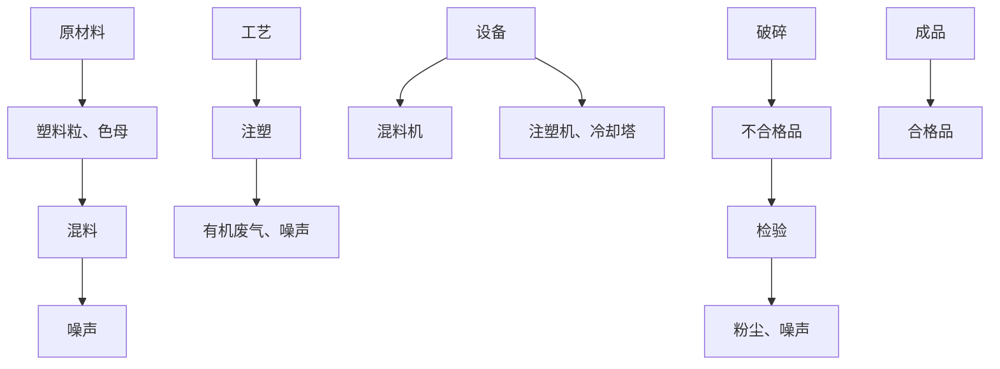

# 建设项目环境影响报告表

# （污染影响类）

项目名称：佛山市顺德区容桂添诚塑料五金制品厂迁扩建项目建设单位（盖章）：佛山市顺德区容桂添诚塑料五金制品厂

编制日期： 2021 年 4 月

中华人民共和国生态环境部制

## 一、建设项目基本情况

<table><tr><td>建设项目名称</td><td colspan="4">佛山市顺德区容桂添诚塑料五金制品厂迁扩建项目</td></tr><tr><td>项目代码</td><td colspan="4">无</td></tr><tr><td>建设单位联系人</td><td>梁*</td><td>联系方式</td><td colspan="2">137*</td></tr><tr><td>建设地点</td><td colspan="4">广东省佛山市顺德区容桂街道华口社区眉滘北路2号向荣楼2栋302号</td></tr><tr><td>地理坐标</td><td colspan="4">(113度19分21.05秒,22度45分49.71秒)</td></tr><tr><td>国民经济行业类别</td><td>C2927日用塑料制品制造</td><td>建设项目行业类别</td><td colspan="2">属于“二十六、橡胶和塑料制品业29-53塑料制品制造292”中的“其他(年用非溶剂型低VOCs含量涂料10吨以下)”类别</td></tr><tr><td>建设性质</td><td>☑新建(迁建)□改建☑扩建□技术改造</td><td>建设项目申报情形</td><td colspan="2">☑首次申报项目□不予批准后再次申报项目□超五年重新审核项目□重大变动重新报批项目</td></tr><tr><td>项目审批(核准/备案)部门(选填)</td><td>/</td><td>项目审批(核准/备案)文号(选填)</td><td colspan="2">/</td></tr><tr><td>总投资(万元)</td><td>50</td><td>环保投资(万元)</td><td colspan="2">5</td></tr><tr><td>环保投资占比(%)</td><td>10</td><td>施工工期</td><td colspan="2">2021年5月</td></tr><tr><td>是否开工建设</td><td>£否</td><td>用地(用海)面积(m2)</td><td colspan="2">510.72</td></tr><tr><td>专项评价设置情况</td><td colspan="4">无</td></tr><tr><td>规划情况</td><td colspan="4">无</td></tr><tr><td>规划环境影响评价情况</td><td colspan="4">无</td></tr><tr><td>规划及规划环境影响评价符合性分析</td><td colspan="4">无</td></tr><tr><td>其他符合性分析</td><td colspan="4">1、与产业政策符合性分析根据国家《产业结构调整指导目录(2019年本)》,项目不属于目录所列的鼓励类、限制类和淘汰类项目,根据《促进产业结构调整暂行规定》(国发[2005]40号)第十三条,项目属于允许类。且项目不属于《市场准入负面清单(2020年版)》(发改体改规〔2020〕1880号)中禁止和许可事项,符合国家产业政策要求。2、建设项目与所在地“三线一单”符合性分析1生态保护红线项目位于广东省佛山市顺德区容桂街道华口社区眉滘北路2号向荣楼2栋302号厂房,周边无自然保护区。根据《佛山市顺德区生态保护红线管理办法(试行)》的相关规定,项目所在地为城市建成区,不涉及自然保护区、森林公园、自然保护区、饮用水源保护区及其他需要进行生态保护的区域,不在生态保护红线范围内。2环境质量底线本项目产生的废气等均可达标排放,对周边环境影响很小;生活污水经三级化粪处理达到广东省《水污染排放限值》(DB 44/26-2001)第二时段三级标准后排入容桂第二污水处理厂,对水环境影响很小。本项目位于3类声环境功能区,根据声环境影响预测,本项目建设后对周围的声环境影响较小,不会改变周围环境的功能属性,因此本项目建设符合声环境区要求。故本项目的建设不会突破当地环境质量底线。3资源利用上线本项目营运过程中消耗一定量的电能、水资源,项目资源消耗量相对区域资料利用总量较少,符合资源利用上限的要求。4产业政策及准入清单本项目不属于《产业结构调整指导目录(2019年本)》、《珠江三角洲地区产业结构调整优化和产业导向目录》(2011年本)限制类、淘汰类产业,不属于《市场准入负面清单(2020年版)》禁止准入类、许可准入类产业。本项目的生态保护红线、环境质量底线、资源利用上线和环境准入清单均符合《广东省人民政府关于印发广东省“三线一单”生态环境分区管控方案的通知》(粤府〔2020〕71号)的要求。3、总VOCs控制要求本项目与国家和地方近年发布的有机污染物治理政策的相符性分析见下表。表5-1项目与有机污染物治理政策的相符性</td></tr><tr><td rowspan="7"></td><td>序号</td><td>政策要求</td><td>工程内容</td><td>符合性</td></tr><tr><td colspan="4">1、《顺德区环境运输和城市管理局转发关于印发2014年佛山市陶瓷行业、玻璃制造行业、铝型材行业和VOCs排放企业整治方案的通知》(顺管函2014[510]号)</td></tr><tr><td>1.1</td><td>排放挥发性有机物的车间必须安装废气收集、回收净化装置,收集率应大于90%</td><td>生产车间安装了废气收集装置收集效率大于90%</td><td>符合</td></tr><tr><td colspan="4">2、《广东省挥发性有机物(VOCs)整治与减排工作方案》(2018~2020年)(粤环发〔2018〕6号)</td></tr><tr><td>2.1</td><td>产生VOCs废气的工艺线应尽可能设置于密闭工作间内,集中排风并导入VOCs控制设备进行处理。无法设置密闭工作间的生产线,VOCs排放工段应设置集气罩、排风管道组成的排气系统。</td><td>废气经集气罩收集并经废气处理设施处理后引至排气筒高空排放,收集效率达90%以上</td><td>符合</td></tr><tr><td colspan="4">3、顺德区环境保护委员会关于印发顺德区工业挥发性有机物(VOCs)项目审批总量前置实施细则(2016年修订)的通知</td></tr><tr><td>3.1</td><td>VOCs有组织排放量大于0.1吨的建设项目在建设单位报批环评文件前,应向区环境运输和城市管理局提交VOCs排放总量指标分配申请</td><td>本项目新增非甲烷总烃有组织排放量为0.0522t,按照非甲烷总烃和VOCs等量换算,故不需要申请VOCs排放总量指标,直接由环评文件审批部门在环保管理系统录入项目排放量,作为VOCs排放总量分配的依据</td><td>符合</td></tr><tr><td rowspan="3"></td><td colspan="4">4、《关于珠江三角洲地区严格控制工业企业挥发性有机物(VOCs)排放的意见》(粤环[2012]8号)</td></tr><tr><td>4.1</td><td>自然保护区、水源保护区、风景名胜区、森林公园、重要湿地、生态敏感区和其他重要生态功能区实行强制性保护,禁止新建VOCs污染企业</td><td>选址不在规定区域</td><td>符合</td></tr><tr><td colspan="4">故本项目符合国家产业政策的要求,同时符合广东省,以及佛山市产业政策的要求,总VOCs控制要求。土地功能符合规划要求。</td></tr></table>

## 二、建设项目工程分析

## 1、项目工程组成

项目具体工程组成见下表：

表 1-1 项目工程组成

<table><tr><td rowspan="2">项目</td><td colspan="2">迁扩建前</td><td colspan="2">迁扩建后</td></tr><tr><td>内容</td><td>规模及用途</td><td>内容</td><td>规模及用途</td></tr><tr><td rowspan="2">主体工程</td><td>生产车间</td><td>经营面积约400m2,用于产品加工</td><td>生产车间</td><td>经营面积约400m2,用于产品加工</td></tr><tr><td>混料、破碎房</td><td>面积约30m2,用于混料、破碎工序</td><td>混料、破碎房</td><td>面积约20m2,用于混料、破碎工序</td></tr><tr><td rowspan="2">辅助工程</td><td>仓库</td><td>面积约208m2,位于生产车间内,用于原料和成品的临时储存使用</td><td>仓库</td><td>面积约180m2,位于生产车间内,用于原料和成品的临时储存使用</td></tr><tr><td>办公室</td><td>面积约100m2,供日常办公使用</td><td>办公室</td><td>面积约90m2,供日常办公使用</td></tr><tr><td rowspan="2">公共工程</td><td>配电系统</td><td>供应生产用电和办公生活用电</td><td>配电系统</td><td>供应生产用电和办公生活用电</td></tr><tr><td>给排水系统</td><td>供水来源为市政自来水厂</td><td>给排水系统</td><td>供水来源为市政自来水厂</td></tr><tr><td rowspan="3">环保工程</td><td>生活污水</td><td>生活污水经独立的生活污水处理设施处理后排入附近内河涌</td><td colspan="2">项目生活污水经厂预处理后排入容桂第二污水处理厂</td></tr><tr><td>废气</td><td>有机废气收集后通过1个15米高的排气筒(G1)排放</td><td colspan="2">有机废气收集后通过1个40米高的排气筒(G1)排放</td></tr><tr><td>危险废物暂存间</td><td>危险废物暂存点</td><td colspan="2">设置危险废物暂存点,建筑面积约5m2</td></tr></table>

## 2、项目生产规模

根据业主提供的资料，项目主要产品产量见下表。

表 1-2 项目产品产量

<table><tr><td>产品名称</td><td>单位</td><td>迁扩建前</td><td>迁扩建后</td><td>增减量</td><td>备注</td></tr><tr><td>水壶</td><td>万件/年</td><td>4</td><td>5</td><td>+1</td><td></td></tr><tr><td>咖啡壶</td><td>万件/年</td><td>1</td><td>1</td><td>0</td><td></td></tr></table>

## 3、项目主要生产设备

根据业主提供的资料，项目主要生产设备详见下表。

表 1-3 项目主要生产设备一览表

<table><tr><td>序号</td><td>设备名称</td><td>单位</td><td>迁扩建前</td><td>迁扩建后</td><td>增减量</td></tr><tr><td>1</td><td>注塑机</td><td>台</td><td>10</td><td>12</td><td>+2</td></tr><tr><td>4</td><td>破碎机</td><td>台</td><td>3</td><td>3</td><td>0</td></tr><tr><td>5</td><td>混料机</td><td>台</td><td>3</td><td>3</td><td>0</td></tr><tr><td>8</td><td>空压机</td><td>台</td><td>0</td><td>+1</td><td>1</td></tr><tr><td>9</td><td>冷却塔</td><td>台</td><td>2</td><td>0</td><td>2</td></tr></table>

## 4、项目主要原辅材料

根据建设单位提供的资料，项目使用的原辅材料详见下表。

表 1-4 项目主要原辅材料

<table><tr><td>序号</td><td>名称</td><td>单位</td><td>迁扩建前</td><td>迁扩建后</td><td>增减量</td><td>备注</td></tr><tr><td>1</td><td>PP 塑料</td><td>吨/年</td><td>100</td><td>120</td><td>+20</td><td></td></tr><tr><td>2</td><td>ABS 塑料</td><td>吨/年</td><td>30</td><td>30</td><td>0</td><td></td></tr><tr><td>3</td><td>色母</td><td>吨/年</td><td>0.2</td><td>0.25</td><td>+0.05</td><td></td></tr><tr><td>4</td><td>液压油</td><td>吨/年</td><td>0.1</td><td>+0.02</td><td>0.12</td><td></td></tr></table>

## 主要化工原辅材料理化性质：

PP塑料粒： 聚丙烯，是由丙烯聚合而制得的一种热塑性树脂。共聚物型的PP材料有较低的热变形温度（100℃）、低透明度、低光泽度、低刚性，但是有更强的抗冲击强度，PP的冲击强度随着乙烯含量的增加而增大。PP的维卡软化温度为150℃。由于结晶度较高，这种材料的表面刚度和抗划痕特性很好。PP不存在环境应力开裂问题。

ABS 塑 料粒： 丙烯 腈- 苯乙 烯-丁二 烯共聚物 （Acrylonitrile ButadieneStyrene，缩写ABS）是一种强度高、韧性好、易于加工成型的热塑型高分子材料结构。ABS 树脂是丙烯腈（Acrylonitrile）、1，3-丁二烯（Butadiene）、苯乙 烯 （ Styrene ） 三 种 单 体 的 接 枝 共 聚 物 。 它 的 分 子 式 可 以 写 为（C8H8·C4H6·C3H3N）x，但实际上往往是含丁二烯的接枝共聚物与丙烯腈-苯乙烯共聚物的混合物，其中，丙烯腈占 15%\~35%，丁二烯占 5%\~30%，苯乙烯占 40%\~60%，乳液法 ABS 最常见的比例是 A:B:S=22:17:61，而本体法 ABS中B 的比例往往较低，约为 13%。ABS 塑料的成型温度为 180-250℃，但是最好不要超过240℃，此时树脂会有分解。

随着三种成分比例的调整，树脂的物理性能会有一定的变化：

1，3-丁二烯为ABS 树脂提供低温延展性和抗冲击性，但是过多的丁二烯会降低树脂的硬度、光泽及流动性；

丙烯腈为ABS 树脂提供硬度、耐热性、耐酸碱盐等化学腐蚀的性质；

苯乙烯为 ABS 树脂提供硬度、加工的流动性及产品表面的光洁度。

色母：也叫色种，由颜料或染料、载体和添加剂三种基本要素所组成，是一种新型高分子材料专用着色剂，亦称颜料制备物，主要用在塑料上。是把超常量的颜料均匀载附于树脂之中而制得的聚集体，它的着色力高于颜料本身，加工时用少量色母料和未着色树脂掺混，就可达到设计颜料浓度的着色树脂或制品。

## 5、劳动定员及工作制度

职工人数：项目迁扩建前职工人数为20人，迁扩建后职工人数为24人，员工均不在厂区内食宿。

工作制度：项目迁扩建前后均实行一天一班制，每天工作 8 小时，年工作时间300天。

## 6、资源、能源消耗

（1）生活用水：根据建设单位提供的资料，项目迁扩建前员工共20 人，均不在厂区内食宿，生活用水量为240m3/a；迁扩建后，项目员工共24人，年工作300天，根据《广东省用水定额》（DB44/T1461-2014）生活用水定额为40 升/人·日计，生活用水量约 0.96m3/d(288m3/a)。

（2）生产用水：迁扩建前后，项目生产过程中需用自来水对注塑设备进行间接冷却，冷却用水通过冷却塔冷却后循环使用，需适当加入新鲜水补充因蒸发而损失的水分。

项目设有冷却塔 2 台，总循环水量约 2.0m3/h。根据《工业循环冷却水处理设计规范》（GB50050-2007）说明，循环冷却水系统蒸发水量约占循环水量的 2.0%，排水量约占循环水量的 0.4%，因此新鲜水补充量约占循环水量的2.4%。注塑工序每天生产使用时间约8小时，年工作日300天，总循环水量为4800 m3/a，新鲜水补充量为 115.2 m3/a，定期排水量为 19.2 m3/a。根据《污水综合排放标准》（GB8978-1996）和广东省地方标准《水污染物排放限值》（DB44/26-2001）中的规定：“污水排放量不包含间接冷却水”。故项目循环冷却水定期排水可作清净下水通过雨水管道排放，不计入项目污水排放量。

（3）项目迁扩建前年用电量 10 万 kW•h，项目迁扩建后年用电量 12 万kW•h。迁扩建前后均不设备用发电机。

表 1-5 项目用水用电情况

<table><tr><td>序号</td><td>类型</td><td>单位</td><td>迁扩建前</td><td>迁扩建后</td><td>增减量</td><td>用途</td></tr><tr><td>1</td><td>生活用水</td><td> $m^{3}$ </td><td>240</td><td>288</td><td>+48</td><td>员工生活用水</td></tr><tr><td>2</td><td>生产用水</td><td> $m^{3}$ </td><td>115.2</td><td>115.2</td><td>0</td><td>冷却塔循环水补充</td></tr><tr><td>3</td><td>电</td><td>万 kWh</td><td>10</td><td>12</td><td>+2</td><td>生产用电</td></tr></table>

## 7、四邻关系分析

项目租用已建成厂房进行生产，地址为广东省佛山市顺德区容桂街道华口社区眉滘北路 2 号向荣楼 2 栋 302 号的厂房。项目所在建筑物共 9 层，本项目位于第 3 层，其余楼层的公司有：佛山市卡迈尔自动化设备有限公司、佛山市顺德区卓智机械设备有限公司、佛山市吉之雅电器有限公司、佛山丸胜新材料有限公司、佛山市顺德区依家电器有限公司。项目所在建筑物东面为向荣楼1栋厂房，南面为佛山市顺德区精钻电镀有限公司容桂分公司，西面为空地（待发展用地），北面为在建工业厂房（项目四至情况详见附图 2）。

## 1、生产工艺流程

项目迁扩建前后工艺流程不变：

flowchart

图 1-1 生产工艺流程图

## 工艺流程说明：

1) 混料：将塑料粒和色母按一定比例加入混料机，生成比较均匀的混合料。  
2) 注塑：利用高温（约250℃）将注入模具的塑料熔融，然后控制压力和速度将熔体注入模具。  
3) 冷却：将成型的塑料制品冷却固化到一定刚性，使其脱模时不会因受到外力变形，冷却后便成为成品。项目冷却过程使用冷却塔，冷却过程为间接冷却，冷却水循环使用，由于冷却水在高温下蒸发，需要定期补充新鲜水。

注：本项目生产过程中不使用废旧塑料。

## 产污环节分析：

废水：员工生活污水、循环冷却水。

废气：项目产生的大气污染物主要为热熔注塑工序挥发出的少量有机废气，即非甲烷总烃；混料、破碎工序产生的塑料粉尘。

噪声：车间各种设备运行时产生的机械噪声；

<table><tr><td></td><td>固废:职工生活垃圾、一般工业固体废物、危险废物等。</td></tr><tr><td>与项目有关的原有环境污染问题</td><td>1、与本项目有关的原有污染情况:佛山市顺德区容桂添诚塑料五金制品厂原址位于佛山市顺德区容桂容里居委会昌明东路6号首层之三,项目已于2015年6月4日取得环保批准证,批准证编号:容桂20150172,并于2015年8月13日通过环保验收(验收批复号:环验容【2015】A131号),原项目批准规模为:注塑机1台,破碎机3台,混料机3台,冷却塔2台。由于企业发展需要,项目拟搬迁至广东省佛山市顺德区容桂街道华口社区眉滘北路2号向荣楼2栋302号的厂房(其地理位置见附图1),中心地理坐标为:东经113.322513°,北纬22.763808°,并在原来基础上扩大产能,增加注塑机及机加工设备,生产工艺不变。为了解项目迁扩建前的污染排放情况,现进行回顾性分析。项目迁扩建前工艺流程:</td></tr></table>

flowchart

图 1-1 项目迁扩建前生产工艺流程图

## 工艺流程说明：

本项目工艺流程比较简单，将外购PP、ABS 粒料和色母经混料机混料后，在注塑机内的料筒里电热加热到熔融状态，原料熔化后挤压入模成型，经水冷却后脱模得到成品。项目冷却过程使用冷却塔，冷却过程为间接冷却，冷却水循环使用，由于冷却水在高温下蒸发，需要定期补充新鲜水。项目设置破碎机，生产过程中产生的边角料和次品通过破碎机破碎后回用。

注：本项目生产过程中不使用废旧塑料。

## 产污环节分析：

迁扩建迁主要污染物为员工生活污水、粉尘、有机废气、边角料、员工生活垃圾、危险废物。迁扩建前项目运营期的污染源强如下。

表 1-6 项目原有污染源及防治措施效果评价

<table><tr><td>项目</td><td>污染工序</td><td>污染因子</td><td>产生量(t/a)</td><td>排放量(t/a)</td><td>排放标准(限值)</td><td>排放浓度</td><td>污染防治措施</td><td>效果评价</td></tr><tr><td rowspan="3">水污染物</td><td rowspan="3">生活污水(216t/a)</td><td> $COD_{Cr}$ </td><td>0.054</td><td>0.0216</td><td>100mg/L</td><td>100mg/L</td><td rowspan="3">生活污水经独立的生活污水处理设施</td><td rowspan="3">达标排放</td></tr><tr><td> $BOD_5$ </td><td>0.0216</td><td>0.00648</td><td>30mg/L</td><td>30mg/L</td></tr><tr><td>SSNH3-N</td><td>0.02160.00648</td><td>0.006480.0054</td><td>30mg/L25mg/L</td><td>30mg/L25mg/L</td></tr><tr><td></td><td></td><td></td><td></td><td></td><td></td><td></td><td>处理后排入附近内河涌</td><td></td></tr><tr><td rowspan="3">大气污染物</td><td rowspan="2">注塑工序</td><td>非甲烷总烃(有组织)</td><td>0.3375</td><td>0.3375</td><td>100mg/m3</td><td>14mg/m3</td><td rowspan="2">集气罩收集后经高于15米的排气筒排放</td><td rowspan="2">达标排放</td></tr><tr><td>非甲烷总烃(无组织)</td><td>0.0375</td><td>0.0375</td><td>4.0mg/m3</td><td>0.0000467 mg/m3</td></tr><tr><td>破碎、混料工序</td><td>颗粒物</td><td>0.0026</td><td>0.0026</td><td>1.0mg/m3</td><td>≤1.0mg/m3</td><td>设置独立车间,加强通风换气</td><td>达标排放</td></tr><tr><td>噪声</td><td>生产设备</td><td>噪声</td><td colspan="2">70~85</td><td>昼间≤65dB(A)夜间≤55dB(A)</td><td>——</td><td>选用低噪设备、加强设备保养、合理安排设备位置</td><td>达标排放</td></tr><tr><td rowspan="3">固体废物</td><td colspan="2">生活垃圾</td><td>3t/a</td><td>0</td><td>——</td><td>——</td><td>交环卫部门统一清运</td><td>符合要求</td></tr><tr><td colspan="2">一般工业固废</td><td>2.6t/a</td><td>0</td><td>——</td><td>——</td><td>经破碎后重新投入生产</td><td>符合要求</td></tr><tr><td>危险废物</td><td>废液压油</td><td>0.07t/a</td><td>0</td><td>——</td><td>——</td><td>交由有危险废物处理资质的单位处理</td><td>符合要求</td></tr></table>

项目迁扩建前严格按照相关部门的要求落实好环保设施，生活污水、废气、一般固体废物及危险废物均落实相应治理措施。原项目已于2015年8月13日通过环保验收。到现在为止，项目未收到环保方面的投诉，未对周围环境造成明显影响。

## 2、主要环境问题：

迁扩建前，项目所在地周围无重污染的大型企业或重工业，存在主要污染物为附近工厂在生产运营过程中产生的废气、噪声、废水、固废等，以及附近道路车辆行驶噪声和扬尘等。

## 三、区域环境质量现状、环境保护目标及评价标准

<table><tr><td>污染物</td><td>浓度均值</td><td>评价标准</td><td>达标情况</td></tr><tr><td> $SO_2$ (μg/m3)</td><td>8</td><td>60</td><td>达标</td></tr><tr><td> $NO_2$ (μg/m3)</td><td>39</td><td>40</td><td>达标</td></tr><tr><td> $PM_{10}$ (μg/m3)</td><td>56</td><td>70</td><td>达标</td></tr><tr><td> $PM_{2.5}$ (μg/m3)</td><td>30</td><td>35</td><td>达标</td></tr><tr><td> $CO^*$ (μg/m3)</td><td>1.3</td><td>4</td><td>达标</td></tr><tr><td> $O3^*$ (μg/m3)</td><td>190(超标)</td><td>160</td><td>超标</td></tr></table>

\*注：表中 CO 为年内日平均值的第 95 百分位数，O3 为年内日最大 8 小时平均值的第 90百分位数。

根据2019年全区的大气环境质量状况公报， $\mathrm { O } _ { 3 }$ （臭氧）浓度超过了质量标准限值，故顺德区大气环境质量属非达标区。

②区域环境空气质量达标规划

根据《佛山市人民政府办公室关于印发佛山市大气环境质量达标规划的通知》（佛府办函〔2018〕537号），佛山市通过统筹发展，结构优化、节能降耗，循环再生、加强控制，突出重点、完善机制，强化调控等规划原则；以习近平总书记对广东工作重要指示批示及党的十九大关于“实行最严格的生态环境保护制度”精神为指导，以控制颗粒物、二氧化氮、臭氧等污染物为重点，以工业源、移动源、面源污染防治为着力点，实施多手段多污染物协同减排，推动区域大气污染防治工作上新台阶，力争空气质量排名有所提升，到 2020 年空气质量达到国家空气环境质量二级标准。

阶段目标年分别为2018年和2020年。2018年为近期规划年，要求多污染物协同减排成效显著。2020年为中远期规划年，要求空气质量实现全面达标，空气质量优良率达到90％以上。

表3-2 佛山市空气质量达标规划指标  
单位：微克/立方米，一氧化碳：毫克/立方米

<table><tr><td rowspan="2">环境质量指标</td><td colspan="2">目标值</td><td rowspan="2">国家空气质量标准</td><td rowspan="2">属性</td></tr><tr><td>近期2018年</td><td>中远期2020年</td></tr><tr><td>二氧化硫年均浓度</td><td colspan="2">≤15</td><td>≤60</td><td>约束</td></tr><tr><td>二氧化氮年均浓度</td><td>≤43</td><td>≤40</td><td>约束</td><td>约束</td></tr><tr><td>PM10年均浓度</td><td>≤61</td><td>≤60</td><td>约束</td><td>约束</td></tr><tr><td>PM2.5年均浓度</td><td>≤38</td><td>≤35</td><td>约束</td><td>约束</td></tr><tr><td>一氧化碳日均浓度第95位百分数</td><td colspan="2">≤2</td><td>≤4</td><td>约束</td></tr><tr><td>臭氧日最大8小时平均浓度第90百分数</td><td colspan="2">≤160</td><td>≤160</td><td>指导</td></tr><tr><td>空气质量达标天数比例(%)</td><td>≥84.5</td><td>≥90</td><td>——</td><td>预期</td></tr></table>

## 2、地表水环境质量现状

项目营运过程中产生的生活污水经预处理后排入容桂第二污水处理厂，处理达标后尾水排入鸡鸦水道。鸡鸦水道为Ⅲ类水环境功能区，水环境质量执行《地表水环境质量标准》（GB3838-2002）中的Ⅲ类水质标准。

为评价鸡鸦水道水质，引用顺德区环境保护监测站2019年对鸡鸦水道南头大桥断面的监测数据进行评价，监测结果及评价见下表。

表 3-4 2019 年顺德区鸡鸦水道水环境质量评价  
单位：mg/L（粪大肠菌群:个/L，pH 无量纲）

<table><tr><td colspan="3">桂州水道</td><td>水温(°C)</td><td>pH值</td><td>溶解氧</td><td>高锰酸盐指数</td><td>化学需氧量</td><td>生化需氧量</td><td>氨氮</td><td>总磷</td><td>石油类</td><td>粪大肠菌群(个/L)</td></tr><tr><td rowspan="8">南头大桥断面监测结果</td><td rowspan="2">一季度(1.3)</td><td>涨潮</td><td>15.1</td><td>7.43</td><td>7.08</td><td>2.1</td><td>8</td><td>2.4</td><td>1.181</td><td>0.13</td><td>0.02</td><td>5400</td></tr><tr><td>退潮</td><td>15.8</td><td>7.39</td><td>6.93</td><td>2.2</td><td>8</td><td>2.6</td><td>1.193</td><td>0.13</td><td>0.02</td><td>5400</td></tr><tr><td rowspan="2">二季度(5.6)</td><td>涨潮</td><td>22.6</td><td>7.49</td><td>5.2</td><td>2.5</td><td>9</td><td>2.7</td><td>0.694</td><td>0.19</td><td>0.01</td><td>3500</td></tr><tr><td>退潮</td><td>22.7</td><td>7.46</td><td>5.17</td><td>2.4</td><td>9</td><td>2.8</td><td>0.688</td><td>0.18</td><td>0.01</td><td>3500</td></tr><tr><td rowspan="2">三季度(9.3)</td><td>涨潮</td><td>29.7</td><td>7.22</td><td>5.62</td><td>2.3</td><td>8</td><td>1.8</td><td>0.828</td><td>0.2</td><td>0.01</td><td>5400</td></tr><tr><td>退潮</td><td>29.5</td><td>7.18</td><td>5.71</td><td>2.1</td><td>8</td><td>1.7</td><td>0.84</td><td>0.2</td><td>0.01</td><td>5400</td></tr><tr><td rowspan="2">四季度(11.5)</td><td>涨潮</td><td>26.2</td><td>7.15</td><td>6.98</td><td>1</td><td>7</td><td>1.0</td><td>0.053</td><td>0.05</td><td>0.01</td><td>3500</td></tr><tr><td>退潮</td><td>25.7</td><td>7.14</td><td>6.99</td><td>1.1</td><td>7</td><td>1.0</td><td>0.065</td><td>0.05</td><td>0.01</td><td>3500</td></tr><tr><td rowspan="5">评价</td><td colspan="2">最大值</td><td>29.70</td><td>7.49</td><td>7.08</td><td>2.50</td><td>9.00</td><td>2.80</td><td>1.193</td><td>0.200</td><td>0.02</td><td>5400</td></tr><tr><td colspan="2">最小值</td><td>15.10</td><td>7.14</td><td>5.17</td><td>1.00</td><td>8.00</td><td>1.00</td><td>0.053</td><td>0.050</td><td>0.01</td><td>3500</td></tr><tr><td colspan="2">III类水质标准</td><td>--</td><td>6.0-9.0</td><td>5</td><td>6</td><td>20</td><td>4</td><td>1</td><td>0.2</td><td>0.05</td><td>10000</td></tr><tr><td colspan="2">标准指数</td><td>--</td><td>0.07-0.25</td><td>0.21-0.97</td><td>0.17-0.42</td><td>0.4-0.45</td><td>0.25-0.7</td><td>0.05-1.19</td><td>0.25-1.0</td><td>0.2-0.4</td><td>0.35-0.54</td></tr><tr><td colspan="2">最低检出限L</td><td>0.1</td><td>0.01</td><td>0.01</td><td>0.5</td><td>5.0</td><td>0.5</td><td>0.025</td><td>0.010</td><td>0.05</td><td>200</td></tr></table>

备注：未列指标铜、锌、氟化物、硒、砷、汞、镉、六价铬、铅、氰化物、挥发酚、阴离子表面活性剂、硫化物等均达标。

从监测结果可知，鸡鸦水道南头大桥断面水质除氨氮一季度、总磷三季度超标外，其它指标满足《地表水环境质量标准》（GB3838 -2002）之Ⅲ类水功能要求。

## 3、声环境质量现状

根据《佛山市人民政府关于印发<佛山市声环境功能区划分方案>的通知》（佛府函[2015]72 号），项目所在地声环境质量执行《声环境质量标准》（GB3096-2008）中的 3 类标准：昼间≤65dB（A）；夜间≤55dB（A）。

为了解评价区域内声环境质量现状，本项目噪声监测方法严格按照《声环境质量标准》(GB3096-2008)的要求进行，监测仪器采用积分声级计。本次环评于2021年4月15日在项目厂界四周各设置一个监测点，分昼间和夜间进行环境状况实测，监测结果见下表：

表3-5 项目厂界声环境监测数据  
单位：dB（A）

<table><tr><td>测点编号</td><td>时段</td><td>Leq</td><td>标准</td><td>是否达标</td></tr><tr><td rowspan="2">1#(东面)</td><td>昼间</td><td>61.3</td><td>3类,65</td><td>达标</td></tr><tr><td>夜间</td><td>52.5</td><td>3类,55</td><td>达标</td></tr><tr><td rowspan="2">2#(南面)</td><td>昼间</td><td>61.5</td><td>3类,65</td><td>达标</td></tr><tr><td>夜间</td><td>51.6</td><td>3类,55</td><td>达标</td></tr><tr><td rowspan="2">3#(西面)</td><td>昼间</td><td>62.6</td><td>3类,65</td><td>达标</td></tr><tr><td>夜间</td><td>51.8</td><td>3类,55</td><td>达标</td></tr><tr><td rowspan="2">4#(北面)</td><td>昼间</td><td>60.2</td><td>3类,65</td><td>达标</td></tr><tr><td>夜间</td><td>51.5</td><td>3类,55</td><td>达标</td></tr></table>

从监测结果可知，本项目边界噪声均能满足《声环境质量标准》（GB3096-2008）中的3类标准要求，即本项目所在地声环境质量现状良好。

## 4、生态环境

项目用地范围内无生态环境保护目标，无需开展生态现状调查。

## 5、电磁辐射

项目不涉及电磁辐射，无需开展电磁辐射现状调查。

## 6、土壤、地下水环境

<table><tr><td></td><td colspan="6">项目不存在土壤、地下水环境污染途径,不开展土壤、地下水环境质量现状调查。</td></tr><tr><td>环境保护目标</td><td colspan="6">1、环境空气保护目标项目厂界外500m范围内环境敏感点见表3-6。2、水环境保护目标本项目厂界外500米范围内无地下水集中式饮用水水源和热水、矿泉水、温泉等特殊地下水资源。3、声环境保护目标本项目厂界外50米范围内无声环境保护目标。4、生态环境项目未新增用地,不涉及土建,用地范围内无生态环境保护目标。</td></tr><tr><td rowspan="5">污染物排放控制标准</td><td colspan="6">1、水污染物排放标准生活污水执行广东省《水污染物排放限值》(DB44/26-2001)第二时段三级标准(CODCr 500mg/L、BOD5 300mg/L、SS 400mg/L),后排入容桂第一污水处理厂处理。根据2013年7月11日颁布的《顺德区环境运输和城市管理局关于全区城镇污水处理厂尾水排放执行标准的通知》规定:新、扩和改建城镇污水处理厂尾水应符合《城镇污水处理厂污染物排放标准》(GB18918-2002)一级A标准及广东省地方标准《水污染物排放限值》(DB44/26-2001)第二时段一级标准的较严值。具体排放限值见下表:表3-7 水污染物排放标准限值 (单位:mg/L)</td></tr><tr><td>污染物执行者</td><td>pH</td><td>COD</td><td>BOD5</td><td>氨氮</td><td>SS</td></tr><tr><td>DB44/26-2001第二时段三级标准</td><td>6~9</td><td>500</td><td>300</td><td>---</td><td>400</td></tr><tr><td>污水处理厂排放标准</td><td>6~9</td><td>40</td><td>10</td><td>5.0</td><td>10</td></tr><tr><td colspan="6">2、大气污染物排放标准(1)破碎工序产生的塑料粉尘执行《合成树脂工业污染物排放标准》(GB31572-2015)表9企业边界大气污染物浓度限值.</td></tr></table>

（2）注塑过程产生的有机废气执行《合成树脂工业污染物排放标准》（GB31572-2015）表4大气污染物浓度限值、表9企业边界大气污染物浓度限值。

表 3-8 大气污染物排放标准

<table><tr><td rowspan="2">排放源</td><td rowspan="2">污染物</td><td colspan="2">有组织排放(排气筒40米)</td><td rowspan="2">无组织排放监控浓度限值(mg/m3)</td><td rowspan="2">执行标准</td></tr><tr><td>最高允许排放浓度(mg/m3)</td><td>最高允许排放速率(kg/h)</td></tr><tr><td>混料、破碎粉尘</td><td>颗粒物</td><td>——</td><td>——</td><td>1.0</td><td rowspan="2">《合成树脂工业污染物排放标准》(GB31572-2015)</td></tr><tr><td>有机废气</td><td>非甲烷总烃</td><td>100</td><td>——</td><td>4.0</td></tr></table>

项目厂区内VOCs无组织排放监控执行《挥发性有机物无组织排放控制标准》（GB 37822-2019）表 A.1 规定的限值。

表 3-9 厂区内 VOCs 无组织排放限值  
单位：mg/m3

<table><tr><td>污染物项目</td><td>排放限值</td><td>特别排放限值</td><td>限值含义</td><td>无组织排放监控位置</td></tr><tr><td rowspan="2">NMHC</td><td>10</td><td>6</td><td>监控点 1h 平均浓度</td><td rowspan="2">在厂房外设置监控点</td></tr><tr><td>30</td><td>20</td><td>监控点处任意一次浓度值</td></tr></table>

## 3、噪声排放标准

项目噪声排放执行《工厂企业厂界环境噪声排放标准》（GB12348-2008）3类标准（昼间≤65dB(A)，夜间≤55dB(A)）。

## 4、固体废物排放标准

本项目一般固体废物存放、处置执行《一般工业固体废物贮存、处置场污染控制标准》（GB18599-2001)(2013 年修订）；危险废物执行《危险废物贮存污染控制标准》（GB18597-2001)及其2013年修改单和《国家危险废物名录》（2021版）。

总
量
控
制
指
标

迁扩建前项目生活污水排放总量为 216t/a，CODcr 排放量为 0.0216t/a、NH3-N排放量为 0.0054t/a；迁扩建后项目生活污水排放总量为 259.2t/a，CODcr 排放量为 0.01037t/a、 $\mathrm { N H } _ { 3 ^ { - } } \mathrm { N }$ 排放量为 0.0013t/a，生活污水经预处理后排入容桂第二污水处理厂处理。根据《佛山市排污权有偿使用和交易管理试行办法》（佛府办[2016]第63号），项目的 $\mathrm { C O D } _ { \mathrm { C r } }$ 和 $\mathrm { N H } _ { 3 ^ { - } } \mathrm { N }$ 总量包含在容桂第一污水处理厂内，建议不分配总量。

项目迁扩建前非甲烷总烃有组织排放量约为 0.3375t/a，无组织排放量为0.0375t/a；迁扩建后项目非甲烷总烃有组织排放量为0.3897t/a，无组织排放量为$0 . 0 4 3 3 \mathrm { t } / \mathrm { a } .$ 。

迁扩建后非甲烷总烃新增有组织排放量为0.0522t/a。非甲烷总烃按VOCs 核算总量，建议 VOCs 有组织排放量分配总量，为 0.3897t/a。

## 四、主要环境影响和保护措施

<table><tr><td>施工期环境保护措施</td><td colspan="7">项目迁扩建后租用已建设完毕的工业厂房,不涉及厂房建设,施工过程主要是内部装修和设备安装,没有基建工程,因此施工期基本不存在大型土建工程,施工期间产生的影响主要是由于设备运输,安装时产生的噪声等。施工期建设单位应严格遵守有关建筑施工的环境保护条例,防止运输扬尘,建筑垃圾、废物等及时清运,降低施工过程对周围环境造成的影响。项目施工期较短,因此若建设单位加强施工管理,项目施工时不会对周围环境产生较大影响。因此本报告不对其进行论述。</td></tr><tr><td rowspan="6">运营期环境影响和保护措施</td><td colspan="7">1、水环境污染本项目生产过程中废水主要为生活污水和生产废水。生产废水主要为冷却水。项目废水类别、污染物项目及污染防治措施见下表。表4-1 项目废水类别、污染物项目及污染防治设施一览表</td></tr><tr><td rowspan="2">废水类别</td><td rowspan="2">污染物种类</td><td colspan="2">污染物防治设施名称</td><td rowspan="2">流向/排放去向</td><td rowspan="2">对应排放口</td><td rowspan="2">排放口类型</td></tr><tr><td>污染物防治设施工艺及设施</td><td>是否为可行性技术</td></tr><tr><td>生活污水</td><td rowspan="2"> $COD_{Cr}$ 、SS、 $BOD_5$ 、氨氮</td><td>三级化粪池</td><td>☑是□否</td><td>容桂第二污水处理厂</td><td>生活污水单独排放口</td><td>/</td></tr><tr><td>循环冷却水</td><td>/</td><td>/</td><td>循环使用</td><td>雨水排放口</td><td>/</td></tr><tr><td colspan="7">(1)废水排放源强◇生活污水项目迁扩建后共有员工为24人,不设置员工宿舍和饭堂,年工作300天。生活污水主要为员工上班期间洗手、冲厕产生的废水。根据《广东省用水定额》(DB44/T1461-2014)的相关规定,非住宿无食堂和浴室员工用水定额0.04t/人·日,生活用水量为288t/a,生活污水产生系数按90%计,则生活污水排放量为259.2t/a。生活污水经过预处理后排入容桂第二污水处理厂。</td></tr></table>

生活污水的污染物因子为 $\mathrm { C O D } _ { \mathrm { c r } } ,$ 、BOD5、SS、氨氮等。项目生活污水产生及排放情况见下表。

表 4-2 项目生活污水污染物产生及排放情况

<table><tr><td rowspan="2">污染源</td><td colspan="2">产生浓度及产生量(259.2t/a)</td><td colspan="2">排放浓度及排放量(259.2t/a)</td></tr><tr><td>浓度(mg/L)</td><td>产生量(kg/a)</td><td>浓度(mg/L)</td><td>排放量(kg/a)</td></tr><tr><td> $COD_{Cr}$ </td><td>250</td><td>64.8</td><td>40</td><td>10.368</td></tr><tr><td> $BOD_5$ </td><td>150</td><td>25.92</td><td>10</td><td>2.592</td></tr><tr><td>SS</td><td>150</td><td>25.92</td><td>10</td><td>2.592</td></tr><tr><td> $NH_3-N$ </td><td>30</td><td>7.776</td><td>5</td><td>1.296</td></tr></table>

## ◇ 循环冷却水

迁扩建后，项目生产过程中需用自来水对注塑设备进行间接冷却，冷却用水通过冷却塔冷却后循环使用，需适当加入新鲜水补充因蒸发而损失的水分。

项目设有冷却塔2 台，总循环水量约 2.0m3/h。根据《工业循环冷却水处理设计规范》（GB50050-2007）说明，循环冷却水系统蒸发水量约占循环水量的 2.0%，排水量约占循环水量的 0.4%，因此新鲜水补充量约占循环水量的2.4%。注塑工序每天生产使用时间约8小时，年工作日300天，总循环水量为 $4 8 0 0 \mathrm { m } ^ { 3 } / \mathrm { a }$ ，新鲜水补充量为 $1 1 5 . 2 \mathrm { m } ^ { 3 } / \mathrm { a } ,$ ，定期排水量为 $1 9 . 2 \mathrm { m } ^ { 3 } / \mathrm { a } .$ 。根据《污水综合排放标准》（GB8978-1996）和广东省地方标准《水污染物排放限值》（DB44/26-2001）中的规定：“污水排放量不包含间接冷却水”。故项目循环冷却水定期排水可作清净下水通过雨水管道排放，不计入项目污水排放量。

## （2）环境影响分析

## ◇生活污水

产生的生活污水主要来自于员工的洗手、冲厕废水，主要污染物因子为CODcr、BOD5、SS、NH3-N 等。项目生活污水经三级化粪池处理达到广东省地方标准《水污染物排放限值》（DB44/26- 2001）第二时段三级标准后可通过市政管网排入容桂第二污水处理厂，对周围水环境影响不大。

## ◇循环冷却水

项目生产过程中需用自来水对注塑设备进行冷却，冷却用水通过冷却塔冷却后循环使用，项目需适当地加入新鲜水补充因蒸发而损失的水分。循环冷却水定期排水可作清净下水通过雨水管道排放，不计入项目污水排放量。

综上所述，本项目产生的废水经上述处理后，对周围地表水环境造成的影响不大。

## （3）依托容桂第二污水处理厂的环境可行性评价

容桂第二污水处理厂服务范围为眉蕉河与碧桂路连接线以东区域，包括小黄圃、高黎、华口、扁滘四个居委及大汕岛，顺德区高新技术产业开发总公司下辖的碧桂路以东工业区、眉蕉河以北碧桂路以西工业区，东逸湾及美的等新开发的高尚住宅区等，本项目位于容桂第二污水处理厂的服务范围，且已接通市政管网。

容桂第二污水处理厂现已建成规模 3 万 t/d，近期建设规模为 5 万 t/d，远期为 8 万 t/d。目前该污水处理厂首期 3 万 t/d 已投入运行并完成提标改造工程验收，污水处理工艺为粗格栅+细格栅+曝气沉砂池+CASS（CyclicActivated Sludge System）+精细格栅+连续流砂滤池+紫外消毒工艺，该工艺是近年来国际公认的处理生活污水及工业废水的先进工艺，污水能够稳定达标排放。目前该污水厂实际污水处理量2.8 万m3/d，尚有余量，能够满足本项目废水处理量的要求。

项目生活污水经预处理达到广东省地方标准《水污染物排放限值》（DB44/26-2001）第二时段三级标准，排至容桂第二污水处理厂处理，满足污水厂的纳管要求，不会对污水厂造成冲击负荷， 也不会影响其正常运行，因此本项目生活污水依托容桂第二生活污水处理厂处理是可行的。

只要企业能确保生活污水经预处理后再排至污水管网送容桂第二污水处理厂达标处理后排放，不会对尾水受纳水体鸡鸦水道的水质造成大的影响。

为了确保外排废水能得到有效的预处理，项目在日常经营过程中，应派专人对生产废水治理设施进行定期的检查、维护，使设备处于最佳工况。

## 2、大气污染源

项目迁扩建后产生的大气污染主要来自混料、破碎过程产生的粉尘，注塑时产生的有机废气。

表 4-3 项目废气产污环节、污染物项目、排放形式及污染防治设施一览表

<table><tr><td rowspan="2">主要生产单元</td><td rowspan="2">污染物项目</td><td rowspan="2">排放形式</td><td colspan="2">污染物防治设施名称</td><td rowspan="2">排放口类型</td></tr><tr><td>污染物防治设施工艺及设施</td><td>是否为可行性技术</td></tr><tr><td>混料、破碎粉尘</td><td>颗粒物</td><td>无组织</td><td>/</td><td>/</td><td>/</td></tr><tr><td>有机废气</td><td>非甲烷总烃</td><td>有组织</td><td>有组织收集排放(40m排气筒G1)</td><td>☑是□否</td><td>一般排放口</td></tr></table>

## （1）废气排放源强

## ①混料、破碎粉尘

项目混料机设有顶盖，封闭作业，工作时会有少量粉尘外逸到车间内，混料工序中产生的粉尘量很小，主要污染物为颗粒物。类比同类型项目类比同类型项目《佛山市顺德区容桂晶朗塑料五金厂搬迁项目》（佛环0302环审[2020]第 0085 号），混料、破碎粉尘排放系数可以按 0.1%原料来计算。本项目需要破碎的塑料量为 3t/a，则混料、破碎工序中的粉尘产生总量约为3kg/a。混料、破碎每天操作时间 4h 计，工作天数为 300 天，混料、破碎时间约为 1200h，则混料、破碎工序中的粉尘产生速率为 0.0025kg/h。

表4-4 项目粉尘产排情况

<table><tr><td rowspan="2">污染物</td><td colspan="2">产生情况</td><td colspan="3">无组织排放</td></tr><tr><td>产生量(t/a)</td><td>产生速率(kg/h)</td><td>排放量(t/a)</td><td>排放速率(kg/h)</td><td>厂界浓度(mg/m3)</td></tr><tr><td>混料粉尘</td><td>0.003</td><td>0.0025</td><td>0.003</td><td>0.0025</td><td>0.00106</td></tr><tr><td colspan="6">注:1、项目大气污染物无组织排放使用国家环境保护部推荐的预测模型AERSCREEN计算公式计算厂界浓度。2、项目生产车间面源长度20m,面源宽度20m,面源面积约400m2,高度约15m。</td></tr></table>

②有机废气

项目注塑成型工序中，塑料熔融时产生的有机废气，主要污染物为非甲烷总烃。根据《上海市工业企业挥发性有机物排放量通用计算方法（试行）》中表 1-4 主要塑料制品制造工序产污系数“射出成型制造，产污系数为2.885kg/t”。项目塑料总用量为 150t/a，则塑料热熔过程产生的非甲烷总烃产生总量为432.75kg/a。项目每天工作 8小时，年工作天数为 300日，故年工作时间 2400h，项目非甲烷总烃产生速率为 0.18kg/h。

项目拟在注塑工位上方设置集气罩收集有机废气，收集后通过一个 40米的排气筒（G1）高空排放，未收集部分在车间以无组织形式排放。

按照《环境工程设计手册》（湖南科学技术出版社）风量计算公式L=kPHvr，且在较稳定状态下，产生较低扩散速度有害气体的集气罩风速可取 0.5m/s\~1.5m/s，另外结合《局部排风设施控制风速检测与评估技术规范》（AQ/T4274-2016）的要求，本项目集气罩风速取 1m/s。集气罩几何尺寸为：宽0.5m、长0.5m，项目集气罩设置在污染源上方，覆盖作业区域，计算得出项目集气罩风量：

$$
\mathrm{L} = \mathrm{kPHvr} ^ {*} 3 6 0 0
$$

式中：P —排风罩口敞开面的周长，m；

H—罩口至污染源距离，m，H 应尽可能小于或等于 0.3A（罩口长边尺寸），H=0.3×0.5m=0.15m；

vr—污染源边缘控制速度，m/s；

k—考虑沿高度速度分布不均匀的安全系数，取1.4。

由此计算得出项目一个集气罩风量约为 1512m3/h。项目设有 12 台注塑机，将安装 12 个集气罩，集气罩总风量为 18144m3/h。建议总设计排风量取20000m3/h，以保证集气罩收集效率。

本项目废气收集率取 90%计算，其余 10%以无组织形式排放。有机废气量为 20000 m3/h×2400h/a=4800 万标立方米/年。

项目非甲烷总烃的产排情况如下表所示：

表4-5 项目有机废气污染物产排情况一览

<table><tr><td rowspan="2">污染物</td><td rowspan="2">产生量(t/a)</td><td colspan="4">有组织</td><td colspan="3">无组织</td></tr><tr><td>收集量(t/a)</td><td>排放量(t/a)</td><td>排放速率(kg/h)</td><td>排放浓度(mg/m3)</td><td>排放量(t/a)</td><td>排放速率(kg/h)</td><td>厂界浓度(mg/m3)</td></tr><tr><td>非甲烷总烃</td><td>0.433</td><td>0.3897</td><td>0.3897</td><td>0.162</td><td>8.1</td><td>0.0433</td><td>0.018</td><td>0.00763</td></tr><tr><td colspan="9">注:1、项目大气污染物无组织排放使用国家环境保护部推荐的预测模型AERSCREEN计算公式计算厂界浓度。2、项目生产车间面源长度20m,面源宽度20m,面源面积约400m2,高度约15m。</td></tr></table>

## （2）大气环境影响分析

## ①混料、破碎粉尘

项目混料机设有顶盖，封闭作业，工作时会有少量粉尘外逸到车间内，混料工序中产生的粉尘量很小，主要污染物为颗粒物，混料粉尘在车间无组织排放；项目破碎加工工序产生的颗粒物未沉降部分以无组织形式排放到车间外，生产车间颗粒物排放达到《合成树脂工业污染物排放标准》（GB31572-2015）中表 9 企业边界大气污染物浓度限值（颗粒物无组织排放监控浓度限值：1.0mg/m3），对周围大气环境及附近敏感点影响较小。

## ②非甲烷总烃

项目注塑成型工序中，塑料熔融时产生的有机废气，主要污染物为非甲烷总烃。项目拟在注塑工位上方设置集气罩收集有机废气，收集后通过一个40米的排气筒高空排放，未收集部分在车间以无组织形式排放。根据工程分析，项目非甲烷总烃的有组织排放速率为0.162kg/h，有组织排放浓度为8.1mg/m3，无组织最大地面质量浓度为0.00763mg/m3，可见项目非甲烷总烃有组织和无组织排放情况均达到《合成树脂工业污染物排放标准》（GB31572-2015）规定的非甲烷总烃排放限值要求（有组织排放限值：100mg/m3；无组织排放限值：4.0mg/m3），且厂区内非甲烷总烃的无组织排放符合《挥发性有机物无组织排放控制标准》（GB 37822-2019）表A.1规定的限值要求，对周围大气环境影响较小。

## 3、噪声污染源

项目噪声源主要为注塑机、混料机、空压机等生产设备，源强为70\~90dB(A)。各设备噪声源强详见下表。

表4-7 各设备噪声源强一览表

<table><tr><td>序号</td><td>设备名称</td><td>数量(台)</td><td>声源(距设备1m处)</td></tr><tr><td>1.</td><td>注塑机</td><td>12</td><td>80~85dB(A)</td></tr><tr><td>2.</td><td>破碎机</td><td>3</td><td>70~80dB(A)</td></tr><tr><td>3.</td><td>混料机</td><td>3</td><td>70~80dB(A)</td></tr><tr><td>4.</td><td>空压机</td><td>1</td><td>70~90dB(A)</td></tr><tr><td>5.</td><td>冷却塔</td><td>2</td><td>70~75dB(A)</td></tr></table>

## （1）声环境影响分析

项目噪声源主要为注塑机、混料机、空压机等生产设备，源强为70\~90dB(A)。为了降低项目噪声对其产生的影响，建设单位须采取相应的噪声污染防治措施，具体噪声防治措施：

①建议选购先进的低噪声设备，设备升级应以不提高设备噪声源为前提；  
②高噪声设备安装减振垫或减振器；  
③定期对生产设备进行维修保养，确保各部件正常运转；  
④进一步加强环境管理，严禁在中午 12:00\~14:00 和夜间 22:00\~次日06:00 时，进行高噪声设备的生产作业。

本项目的高噪声设备经上述防治措施和距离传播的衰减后，项目厂界噪声预计可达到《工业企业厂界环境噪声排放标准》（GB12348-2008）3 类标准，即昼间≤60dB(A)，夜间≤50dB(A)，对声环境影响较小。

## 4、固体废物

项目固体废物主要为员工的生活垃圾、一般工业固废和危险废物。

（1）生活垃圾项目迁扩建后员工人数为24人，根据《第一次全国污染源普查城镇生活源产排污系数手册》，企业员工生活垃圾按 0.5kg/人•d 计算，则项目的生活垃圾产生量约3.6t/a，收集后交由环卫部门处理。

## （2）一般工业固废

◇次品及边角料

根据迁扩建前的数据，项目塑料边角料及次品的产生系数为2%，塑料原料共150t/a，则项目塑料边角料及次品产生量为3t/a。

## （3）危险废物

项目迁扩建后危险废物主要为设备维修过程产生的废液压油。

项目迁扩建后废液压油的产生量为 0.08t/a。

危险废物统一收集后交由有处理资质的单位处理，产生情况见下表。

表 4-8 危险废物产生情况

<table><tr><td>序号</td><td>危险废物名称</td><td>危险废物类别</td><td>危险废物代码</td><td>产生量(吨/年)</td><td>产生工序及装置</td><td>形态</td><td>主要成分</td><td>有害成分</td><td>产废周期</td><td>危险特性</td><td>污染防治措施</td></tr><tr><td>1</td><td>废液压油</td><td>HW08</td><td>900-249-08</td><td>0.08</td><td>设备维修</td><td>液体</td><td>液压油</td><td>液压油</td><td>一年</td><td>T, I</td><td>由建设单位统一收集后交由有资质的单位处理</td></tr></table>

固体废物环境影响分析：

## （1）生活垃圾

项目员工产生的生活垃圾经收集后交由环卫部门处理，对项目周围环境影响较小。

## （2）一般工业固废

项目塑料边角料及次品回用于生产。

## （3）危险废物

危险废物从产生、收集、贮运、转运、处置等各个环节都可能因管理不善而进入环境，因此在各个环节中，抛落、渗漏、丢弃等不完善问题都可能存在，为了使各种危险废物能更好的达到合法合理处置的目的，本评价拟按照《危险废物贮存污染控制标准》等国家相关法律，提出相应的治理措施，以进一步规范项目在收集、贮运、处置方式等操作过程。

## ①收集、贮存

根据上述分析，项目的危险废物主要为废机油、含油废抹布、废活性炭。因此，建设单位应根据废物特性设置符合《危险废物贮存污染控制标准》（GB18597-2001）要求的危险废物暂存场所，且在暂存场所上空设有防雨淋设施，地面采取防渗措施，危险废物收集后分别临时贮存于废物储罐内；根据生产需要合理设置贮存量，尽量减少厂内的物料贮存量；严禁将危险废物混入生活垃圾；堆放危险废物的地方要有明显的标志，堆放点要防雨、防渗、防漏，应按要求进行包装贮存。项目危险废物贮存场所基本情况见下表。

本项目产生的危险废物将集中收集暂存于危废暂存区内，定期交由有危险废物处理资质的单位统一外运处理。

表 4-9 建设项目危险废物贮存场所（设施）基本情况样表

<table><tr><td>序号</td><td>贮存场所(设施)名称</td><td>危险废物名称</td><td>危险废物类别</td><td>危险废物代码</td><td>位置</td><td>占地面积</td><td>贮存方式</td><td>贮存能力</td><td>贮存周期</td></tr><tr><td>1</td><td>危险废物暂存区</td><td>废液压油</td><td>HW08 废矿物油</td><td>900-249-08</td><td>厂区内</td><td> $5m^{2}$ </td><td>200kg/铁桶</td><td>0.08t</td><td>一年</td></tr></table>

## ②运输

对危险废物的运输要求安全可靠，要严格按照危险废物运输的管理规定进行危险废物的运输，减少运输过程中的二次污染和可能造成的环境风险，

运输车辆需有特殊标志。

③处置

建设单位拟将危险废物拟交由有危废处置资质单位处理。

类比分析可知，本项目危险废物防治措施在技术经济上是可行的。

根据《广东省危险废物产生单位危险废物规范化管理工作实施方案》，企业须根据管理台账和近年生产计划，制订危险废物管理计划，并报当地环保部门备案。台帐应如实记载产生危险废物的种类、数量、利用、贮存、处置、流向等信息，以此作为向当地环保部门申报危险废物管理计划的编制依据。产生的危险废物实行分类收集后置于贮存设施内，贮存时限一般不得超过一年，并设专人管理。盛装危险废物的容器和包装物以及产生、收集、贮存、运输、处置危险废物的场所，必须依法设置相应标识、警示标志和标签，标签上应注明贮存的废物类别、危害性以及开始贮存时间等内容。企业必须严格执行危险废物转移计划报批和依法运行危险废物转移联单，并通过信息系统登记转移计划和电子转移联单。企业还需健全产生单位内部管理制度，包括落实危险废物产生信息公开制度，建立员工培训和固体废物管理员制度，完善危险废物相关档案管理制度；建立和完善突发危险废物环境应急预案，并报当地环保部门备案。

综上，本项目固体废物按要求妥善处理后，对环境影响不明显。

## 5、环境风险分析

（1）风险调查

1）风险源调查

①风险物质

根据《建设项目环境风险评价技术导则》（HJ169-2018）《危险化学品重大危险源辨识》（GB18218-2018）和《危险化学品名录（2015 版）》中的危险物质或危险化学品；项目存放的少量废机油属于《建设项目环境风险评价技术导则》（HJ169-2018）表 B.1 突发环境事件风险物质中的油类物质（临

界量为 2500t）。

②生产过程风险及最大可信事故

本项目生产过程中不使用危险化学品，不设置专用危险化学品仓库。环境风险主要是危险废物暂存间的废液压油泄漏，最大泄漏量0.08t 废液压油。

（2）风险敏感目标

本项目风险敏感目标见表 3-6。

（3）环境风险潜势初判

1）危险物质及工艺危险性（P）识别

本项目不使用 HJ169 中附录 B 所列物质，本项目 Q=0.08/2500=0.000032＜1，该项目环境风险潜势为I，因此可以直接开展简单分析。

（4）环境风险分析

本项目风险源及泄漏途径、后果分析见下表。

表 4-10 风险分析内容表

<table><tr><td>事故起因</td><td>环境风险描述</td><td>涉及化学品(污染物)</td><td>风险类别</td><td>途径及后果</td><td>工序</td><td>风险防范措施</td></tr><tr><td>危险废物泄漏</td><td>泄漏危险废物通过雨水管进入水体</td><td>废液压油</td><td>水环境</td><td>影响内河涌水质,影响水生环境</td><td>危废间</td><td>危险废物暂存间设置围堰,做好防渗措施</td></tr><tr><td rowspan="2">火灾、爆炸</td><td>燃烧烟尘及污染物污染周围</td><td>CO、非甲烷总烃</td><td>大气环境</td><td>对周围大气环境造成短时污染</td><td rowspan="2">生产车间</td><td rowspan="2">落实防止火灾措施,发生火灾时可封堵雨水井</td></tr><tr><td>消防废水通过雨水管进入附近水体</td><td>COD等</td><td>水环境</td><td>对附近内河涌水质造成影响</td></tr></table>

（5）风险影响分析

1）火灾事故后果分析

当原材料使用和管理不善，装卸或存储过程中机油出现大量泄漏而遇火源时可能产生火灾。火灾事故散发的烟气对周围大气直接造成影响。原材料现场火灾扑救主要采用干粉，大的火灾扑救产生消防水可能进入内河涌对水体造成危害。消防废水中含有各种化工原材料，但考虑到本项目使用及储存的化工原料量较少，其进入水体后经稀释后，不会造成较大的危害。项目的火灾事故风险可控。

## 2）危险废物泄漏

危险废物暂存处废液出现大量泄漏时，可能进入水体，对环境造成危害。类比顺德同类型的企业安全管理，在加强管理和采取措施情况下是风险是可控的。综合以上分析，项目风险通过采取措施后完全可控，不会对周围大气和水体造成威胁。

## （6）风险控制措施及应急要求

根据风险源采取的风险控制措施见表7-15。建议企业根据生态环境部《企业事业单位突发环境事件应急预案备案管理办法（试行）》，编制突发环境事件应急预案，健全应急组织，落实应急器材，并对预案进行演练。

## （7）评价小结

通过简单风险分析，项目主要风险为增塑剂、废机油泄漏，其泄漏量和挥发后果影响较轻，不会对周边大气和水环境造成明显威胁。

项目通过采取防止泄漏措施，在火灾和爆炸事故次生灾害时，可通过封堵雨水井，采取紧急疏散等措施，其环境风险总体是可控的。

## （8）建设项目环境风险简单分析内容表

表 4-11 建设项目环境风险简单分析内容表

<table><tr><td>建设项目名称</td><td colspan="4">佛山市顺德区容桂添诚塑料五金制品厂迁扩建项目</td></tr><tr><td>建设地点</td><td colspan="4">广东省佛山市顺德区容桂街道华口社区眉滘北路2号向荣楼2栋302号</td></tr><tr><td>地理坐标</td><td>经度</td><td>113.322513°</td><td>纬度</td><td>22.763808°</td></tr><tr><td>主要危险物质及分布</td><td colspan="4">废液压油0.08t,储存于危废间内。</td></tr><tr><td>环境影响途径及危害后果</td><td colspan="4">1、危险废物暂存点事故风险分析危险废物暂存间雨水渗漏,随意堆放、盛装容器破裂或人为操作失误导致装卸或储存过程发生泄漏。</td></tr><tr><td>风险风范措施要求</td><td colspan="4">1安排专人定期对原料进行排查。2车间内准备足够的沙包,以应对突发的泄漏。3加强员工的岗前培训,强化安全意识,指定操作规程。4定期对生产设备进行检修维护。5本项目应按照《突发环境事件应急预案管理暂行办法(环发</td></tr></table>

<table><tr><td rowspan="3"></td><td></td><td>[2010]113号)》和《企业事业单位突发环境事件应急预案备案管理办法(试行)》(环发[2015]4号)的相关要求编制应急预案,发生泄漏、火灾、爆炸事故,单位主要负责人应当按照本单位制定的应急预案,立即组织救援,并立即报告当地管理部门。为加强建设项目的环境管理,建设单位应编制突发环境事件应急预案。根据《关于发布&lt;突发环境事件应急预案备案行业名录(指导性意见)&gt;的通知》(粤环[2018]44号)的要求,本项目不需要备案。</td></tr><tr><td colspan="2">佛山市顺德区容桂添诚塑料五金制品厂迁扩建项目位于广东省佛山市顺德区容桂街道华口社区眉滘北路2号向荣楼2栋302号,项目在正常生产情况下,建设单位按照本环评要求加强管理和设备的维护,并设立完善的预防措施和预警系统,并配备必要的设备设施,制定严格的安全操作规程和维修维护措施,本项目的环境风险在可接受范围内。一旦发生事故,因为防护措施得力并反应迅速,可把事故造成的影响降到最小。所以本项目在环境风险方面来说是可行的。</td></tr><tr><td colspan="2">6、环境管理与监测计划(1)营运期的环境管理1建立环境保护管理组织和机构,指定专人或兼职环保管理人员,落实各级环保责任。2制定各环保设施操作规程,定期维修制度,使各项环保设施特别是危险废物收集储存设备,使其处于良好的运行状态,如环保设施出现故障,应立即停产检修,严禁非正常排放。3对产污工序的工人和班组长进行上岗前的环保知识法规教育及操作规程的培训,使各项环保设施的操作规范化,保证环保设施的正常运转。4落实环境监测工作,重点是各污染源的监测,并注意做好记录,不弄虚作假。5建立相关记录台账:a、危险废物收集交接记录,转运交接记录;b、突发环境事件记录;c、污染物监测记录;d、每月记录污染物排放量核算的数据资料,以供主管单位核查污染物排放量控制情况。6建立污染事故报告制度。当污染事故发生时,必须在事故发生二十四小时内,向区环境主管部门作出事故发生的时间、地点、类型和排放污染物的数量、经济损失等情况的初步报告,事故查清后,向区环境主管部门面报告事故的原因,采取的措施,处理结果,并附有关证明。若发生污染事故,</td></tr></table>

则有责任排除危害，同时对直接受到损害的单位或个人赔偿损失。

⑦建立突发环境事件应急预案，配备相关应急器材，定期开展演练。

## （2）环境监测

## ①监测计划

根据《排污单位自行监测技术指南 总则》（HJ819-2017），《大气污染物排放限值》（DB44/27-2001），结合环保税的核算等相关要求，本项目运营期环境自行监测计划如下表所示。

表4-12 运营期环境监测计划一览表

<table><tr><td>序号</td><td>监测点</td><td>监测位置</td><td>监测项目</td><td>监测频次</td><td>指标</td><td>执行排放标准</td></tr><tr><td>一</td><td colspan="6">气</td></tr><tr><td>1</td><td>生产车间</td><td>排气筒(G1)</td><td>非甲烷总烃</td><td>1次/年度</td><td>浓度</td><td rowspan="2">《合成树脂工业污染物排放标准》(GB31572-2015)中表4和表9;《挥发性有机物无组织排放控制标准》(GB 37822-2019)表A.1规定的限值;</td></tr><tr><td>2</td><td>厂界</td><td>厂界上下风向</td><td>颗粒物、非甲烷总烃</td><td>1次/年度</td><td>浓度、风速、风向等</td></tr><tr><td>二</td><td colspan="6">噪声</td></tr><tr><td>1</td><td>厂界噪声</td><td>厂界</td><td>Leq(A)</td><td>1次/季度</td><td>昼间</td><td>《工业企业厂界环境噪声排放标准》(GB12348-2008)3类标准</td></tr></table>

## ②监测方法

大气监测方法按《空气和废气监测分析方法》执行，噪声监测按《工业企业厂界环境噪声排放标准》（GB12348-2008）执行。

## ③监测实施和成果的管理

项目竣工后，申请竣工环保验收时，按《建设项目竣工环境保护验收技术指南污染影响类》（生态环境部令第 9号）要求进行监测；项目竣工环保验收合格后，企业应根据监测计划，定期对污染源进行监测，监测结果按排污许可相关管理要求进行公示公开。企业应将监测数据和报告存档，作为编制排污许可执行报告基础材料。监测数据应长期保存，并定期接受当地环保主管部门的考核。

## （3）规范排污口

为规范项目排污口，项目废气排污口设置须符合国家环保总局《排污口规范整治要求（试行）》（环监[1996]470号）、《广东省污染源排污口规范化设置导则》（粤发[2008]42 号）、《佛山市环境保护局关于全面推进工业企业污水排放口及给排水系统规范化管理的通知》（佛环[2018]66 号）以及佛山市环境保护局关于印发《佛山市工业企业污水治理设施规范化整治技术要求和指南》的通知（佛环函[2015]324号）的要求。

## 7、项目“三同时”验收一览表

表4-13 “三同时”验收一览表

<table><tr><td colspan="2">项目名称</td><td colspan="5">佛山市顺德区容桂添诚塑料五金制品厂迁扩建项目</td></tr><tr><td>类别</td><td>污染源</td><td>污染物</td><td>治理措施(设施数量、规模、处理能力)</td><td>处理效果、执行标准或拟达要求</td><td>环保投资(万元)</td><td>完成时间</td></tr><tr><td>废水</td><td>生活污水</td><td> $COD_{Cr}$ 、 $BOD_5$ 、SS、 $NH_3-N$ </td><td>三级化粪池</td><td>《水污染物排放限值》(DB44/26-2001)第二时段三级标准</td><td>0.5</td><td rowspan="8">与建设项目同时设计、同时施工。项目建成后同时投入运行</td></tr><tr><td rowspan="2">废气</td><td>混料、破碎粉尘</td><td>颗粒物</td><td>加强车间通风,定期打扫作业区间</td><td>《合成树脂工业污染物排放标准》(GB31572-2015)中表9规定的颗粒物排放限值</td><td>0.5</td></tr><tr><td>有机废气</td><td>非甲烷总烃</td><td>经集气罩收集后通过一根高度为40米的排气筒(G1)排放</td><td>《合成树脂工业污染物排放标准》(GB31572-2015)中表4和表9规定的非甲烷总烃排放限值;《挥发性有机物无组织排放控制标准》(GB37822-2019)表A.1规定的限值</td><td>3</td></tr><tr><td>噪声</td><td>机器设备</td><td>噪声</td><td>选用低噪声、高质量的设备,减振,墙体隔声</td><td>满足《工业企业厂界环境噪声排放标准》(GB12348-2008)中3类标准的要求</td><td>0.2</td></tr><tr><td rowspan="3">固废</td><td>生产过程</td><td>一般固废</td><td>次品、边角料回用于生产</td><td rowspan="3">全部得到合理的处理处置,不会产生二次污染</td><td rowspan="3">0.8</td></tr><tr><td>职工日常</td><td>生活垃圾</td><td>由环卫部门统一处理</td></tr><tr><td>生产过程</td><td>危险废物</td><td>交由有资质的单位处理</td></tr><tr><td colspan="2">风险防范</td><td colspan="3">/</td><td>/</td></tr></table>

<table><tr><td rowspan="3"></td><td>区域解决问题</td><td>/</td><td>/</td><td rowspan="2"></td></tr><tr><td>总量平衡具体方案</td><td colspan="2">/</td></tr><tr><td colspan="2">合计</td><td>5</td><td>/</td></tr></table>

## 五、环境保护措施监督检查清单

<table><tr><td>要素\内容</td><td>排放口(编号、名称)/污染源</td><td>污染物项目</td><td>环境保护措施</td><td>执行标准</td></tr><tr><td rowspan="2">大气环境</td><td>混料、破碎粉尘</td><td>颗粒物</td><td>加强车间通风,定期打扫作业区间</td><td>达到《合成树脂工业污染物排放标准》(GB31572-2015)中表9企业边界大气污染物浓度限值</td></tr><tr><td>有机废气</td><td>非甲烷总烃</td><td>集气罩收集后通过一个40米排气筒(G1)排放</td><td>达到《合成树脂工业污染物排放标准》(GB31572-2015)中表4和表9以及《挥发性有机物无组织排放控制标准》(GB37822-2019)表A.1规定的限值</td></tr><tr><td>地表水环境</td><td>生活污水</td><td> $COD_{Cr}$ 、 $BOD_5$ 、 $NH_3-N$ 、SS</td><td>生活污水经预处理后排入容桂第二污水处理厂</td><td>达到广东省地方标准《水污染排放限值》(DB44/26-2001)三级标准(第二时段)的要求</td></tr><tr><td>声环境</td><td>生产设备</td><td>噪声</td><td>合理布局、墙体阻隔采取减振措施;定期检修</td><td>达到《工业企业厂界环境噪声排放标准》(GB12348-2008)3类标准的要求</td></tr><tr><td>电磁辐射</td><td colspan="4">无</td></tr><tr><td rowspan="3">固体废物</td><td>员工生活垃圾</td><td>生活垃圾</td><td>收集后交由环卫部门集中处理</td><td rowspan="3">不对周围环境产生影响</td></tr><tr><td>一般固体废物</td><td>次品、边角料</td><td>回用于生产</td></tr><tr><td>危险废物</td><td>废液压油</td><td>集中收集后交给有资质单位处理</td></tr><tr><td>土壤及地下水污染防治措施</td><td colspan="4">无</td></tr><tr><td>生态保护措施</td><td colspan="4">项目所在地没有需要特殊保护的树木或生态环境,项目在生产过程中产生的污染物经过相应的污染防治措施治理后,对周围的生态环境不造成明显影响。</td></tr><tr><td>环境风险防范措施</td><td colspan="4">项目在正常生产情况下,建设单位按照本环评要求加强管理和设备的维护,并设立完善的预防措施和预警系统,并配备必要的设备设施,制定严格的安全操作规程和维修维护措施。一旦发生事故,因为防护措施得力并反应迅速,可把事故造成的影响降到最小。</td></tr><tr><td>其他环境管理要求</td><td colspan="4">/</td></tr></table>

## 六、结论

项目选址符合区域环境功能区划要求，选址是合理的，并且符合产业政策的相关要求。环评认为，项目严格执行“三同时”制度，严格控制污染物排放量，将产生的各项污染物按报告中提出的污染治理措施进行治理，加强污染治理设施和设备的运行管理，则项目营运期对周围环境不会产生明显的影响。从环境保护角度分析，项目在现地址进行建设是可行的。

## 附表 1

建设项目污染物排放量汇总表

<table><tr><td>项目分类</td><td>污染物名称</td><td>现有工程排放量(固体废物产生量)1</td><td>现有工程许可排放量2</td><td>在建工程排放量(固体废物产生量)3</td><td>本项目排放量(固体废物产生量)4</td><td>以新带老削减量(新建项目不填)5</td><td>本项目建成后全厂排放量(固体废物产生量)6</td><td>变化量7</td></tr><tr><td rowspan="3">废气</td><td>颗粒物(无组织)</td><td>0.0026</td><td>0.0026</td><td>0</td><td>0.003</td><td>0.0026</td><td>0.003</td><td>+0.0004</td></tr><tr><td>非甲烷总烃(有组织)</td><td>0.3375</td><td>0.3375</td><td>0</td><td>0.3897</td><td>0.3375</td><td>0.3897</td><td>+0.0522</td></tr><tr><td>非甲烷总烃(无组织)</td><td>0.0375</td><td>0.0375</td><td>0</td><td>0.0433</td><td>0.0375</td><td>0.0433</td><td>+0.0058</td></tr><tr><td rowspan="4">废水(生活污水)</td><td>CODcr</td><td>0.0216</td><td>0.0216</td><td>0</td><td>0.010468</td><td>0.0216</td><td>0.010468</td><td>-0.011132</td></tr><tr><td> $BOD_5$ </td><td>0.00648</td><td>0.00648</td><td>0</td><td>0.002592</td><td>0.00648</td><td>0.002592</td><td>-0.003888</td></tr><tr><td>SS</td><td>0.00648</td><td>0.00648</td><td>0</td><td>0.002592</td><td>0.00648</td><td>0.002592</td><td>-0.003888</td></tr><tr><td> $NH_{3}-N$ </td><td>0.0054</td><td>0.0054</td><td>0</td><td>0.001296</td><td>0.0054</td><td>0.001296</td><td>-0.004104</td></tr><tr><td rowspan="2">一般工业固体废物</td><td>生活垃圾</td><td>0</td><td>0</td><td>0</td><td>0</td><td>0</td><td>0</td><td>0</td></tr><tr><td>次品及边角料</td><td>0</td><td>0</td><td>0</td><td>0</td><td>0</td><td>0</td><td>0</td></tr><tr><td>危险废物</td><td>危险废物</td><td>0</td><td>0</td><td>0</td><td>0</td><td>0</td><td>0</td><td>0</td></tr></table>

注：⑥=①+③+④-⑤；⑦=⑥-①

编制单位和编制人员情况表

<table><tr><td colspan="2">项目编号</td><td colspan="3">3kg14</td></tr><tr><td colspan="2">建设项目名称</td><td colspan="3">佛山市顺德区容桂添诚塑料五金制品厂迁扩建项目</td></tr><tr><td colspan="2">建设项目类别</td><td colspan="3">26-053塑料制品业</td></tr><tr><td colspan="2">环境影响评价文件类型</td><td colspan="3">报告表</td></tr><tr><td colspan="5">一、建设单位情况</td></tr><tr><td colspan="2">单位名称(盖章)</td><td colspan="3">佛山市顺德区容桂添诚塑料五金制品厂</td></tr><tr><td colspan="2">统一社会信用代码</td><td rowspan="4" colspan="3"></td></tr><tr><td colspan="2">法定代表人(签章)</td></tr><tr><td colspan="2">主要负责人(签字)</td></tr><tr><td colspan="2">直接负责的主管人员(签字)</td></tr><tr><td colspan="5">二、编制单位情况</td></tr><tr><td colspan="2">单位名称(盖章)</td><td colspan="3">北京中检环能环保科技有限公司</td></tr><tr><td colspan="2">统一社会信用代码</td><td colspan="3">91110229MA01PAJP7D</td></tr><tr><td colspan="5">三、编制人员情况</td></tr><tr><td colspan="5">1.编制主持人</td></tr><tr><td>姓名</td><td colspan="2">职业资格证书管理号</td><td>信用编号</td><td>签字</td></tr><tr><td>马见波</td><td colspan="2">11352143506210240</td><td>BH026879</td><td>###</td></tr><tr><td colspan="5">2.主要编制人员</td></tr><tr><td>姓名</td><td colspan="2">主要编写内容</td><td>信用编号</td><td>签字</td></tr><tr><td>马见波</td><td colspan="2">全部</td><td>BH026879</td><td>###</td></tr></table>

text_image

中华人民共和国人力资源和社会保障部
approved & authorized by

Ministryofuman ResourcedSol Seurit

text_image

中华人民共和国环境保护
approved & authorized
by
Ministry of Environmental Protection
The People's Republic of China

natural_image

Portrait photo of a man in a collared shirt (no visible text or symbols)

Signature of the Bearer

File No.

Professional

Appreval Date

签发单位盖章：

Issued by

Issued on

## 注释

## 一、本报告表应附以下附件、附图：

附图1 项目地理位置图

附图 2 项目四邻关系及噪声监测布点示意图

附图3 项目厂房平面布置图

附图4 项目四至实景图

附图5 项目所在地水环境功能区划图

附图6 项目所在地大气环境功能区划图

附图7 项目所在地声环境功能区划图

附件1 企业营业执照

附件2 法人身份证复印件

附件3 用地资料复印件

附件 4 原环评批准证

附件5 原环评批复

附件6 原验收批复

附件7 环评技术咨询合同

## 二、如果本报告表不能说明项目产生的污染对环境造成的影响，应进行专项评价。根据建设项目的特点和当地环境特征，应选下列1—2项进行专项评价。

1．大气环境影响专项评价

2．水环境影响专项评价(包括地表水和地下水)

3．生态影响专项评价

4．声影响专项评价

5．土壤影响专项评价

6．固体废弃物影响专项评价

以上专项评价未包括的可另列专项，专项评价按照《环境影响评价技术导则》中的要求进行。

text_image

顺德区政府
大吉
华桥中学
沙尾
桂畔水闸
顺德港
大良水利
沙尾
桂畔水闸
顺德港
大良水利
沙尾
桂畔水闸
顺德港
大良水利
沙尾
桂畔水闸
顺德港
大良水利
沙尾
桂畔水闸
顺德港
大良水利
沙尾
桂畔水闸
顺德港
大良水利
沙尾
桂畔水闸
顺德港
大良水利
沙尾
桂畔水闸
顺德海关
原德海关私局
小黄湖小学
小黄湖
南方通讯
电镜厂
佛山国家级高新技术产业开发区
(顺德科技工业园B区之一)
佛山市高新技术产业开发区
(顺德科技工业园B区之一)
项目所在地

附图 1 项目地理位置图

text_image

实时路况
赫斯特精细
化工有限公司
3#
1#
正亿电镀
正亿大楼
眉滘北路
佛山市豪亿彩印
包装有限公司
顺德区创景机械
图例
项目所在地
噪声监测布点
50米
200英尺
腾讯地图 ©2021 Tencent - GS(2018)4786号 - Imagery© DigitalGlobe & Chinasawei

附图 2 项目四邻关系及噪声监测点示意图

natural_image

Exterior view of a parking lot with parked cars and modern high-rise buildings in the background (no signage or text visible)

东面

natural_image

Exterior view of an old industrial alleyway with white walls, red doors, and debris on the wall (no signage or text visible)

南面

natural_image

Exterior view of a modern multi-story building with large red Chinese characters on the facade and blue trucks parked in front (no readable signage)

西面

natural_image

Exterior view of a modern multi-story building with grid scaffolding and windows, adjacent to a red-brick building (no visible text or signage)

北面  
附图 3 项目四至实景图

向
荣
楼
1
栋  
在建厂房  

text_image

楼下为产品堆放
区，夹层为办公
楼
混料、
破碎房
危废暂
存间
冷却
塔、空
压机
空地
模具堆
放区
原料堆
放区
注塑区
G1排气筒
精钻电镀

5m

附图 4 项目平面布置图

顺德生态环境保护规划（2011\~2020年）  
水环境功能区划图  

text_image

项目所在地
II类水质目标	III类水质目标	IV类水质目标 1054202 控制单元编号
顺德区发展规划与统计局 环境保护部华南环境科学研究所 2012 年 10 月

附图 5 水环境功能区划图

佛山市环境空气质量功能区划分图  

text_image

项目所在地
图 1 类区
例 2 类区
1、2 类区缓冲带

附图 6 大气环境功能区划图

佛山市声环境功能区划分（2012-2020）顺德区  

text_image

图例
1类
2类
3类
4a类 航道
4a类 道路
4b类
建成区
项目所在地
0 2 4 千米

附图7 声环境功能区划