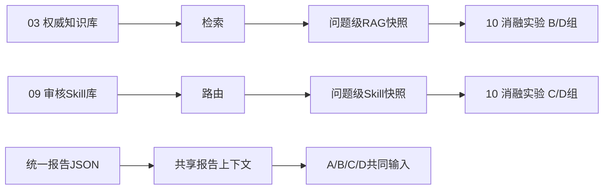

# 消融实验冻结包

> 本目录不存放完整法规知识库。完整权威知识由`03_指南解析_明文标准库`维护；本目录只保存本次实验实际使用的RAG快照、Skill快照、报告上下文哈希、Prompt、运行矩阵、评价方案和结果。



当前上传范围：`positive_control_21_questions`。这是21道正类控制题的就绪与趋势实验材料，不是混合标签正式实验结果。


## 知识—程序互补链路

```text
统一报告JSON
  ↓
报告证据抽取
  ↓
Skill构造查询条件
  ↓
RAG返回权威条款
  ↓
Skill进行适用性匹配和复核
  ↓
双证据链审核结论
```

RAG提供知识常量；Skill提供审核函数；经验库只提供风险提示；报告JSON提供项目事实。标准卡仅按字段白名单用于路由，不整条注入B组。
